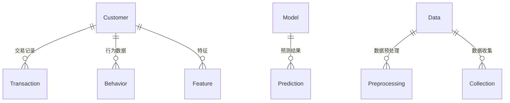
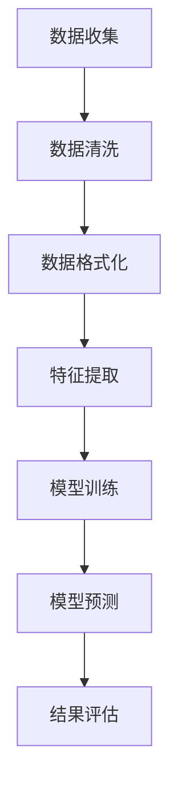
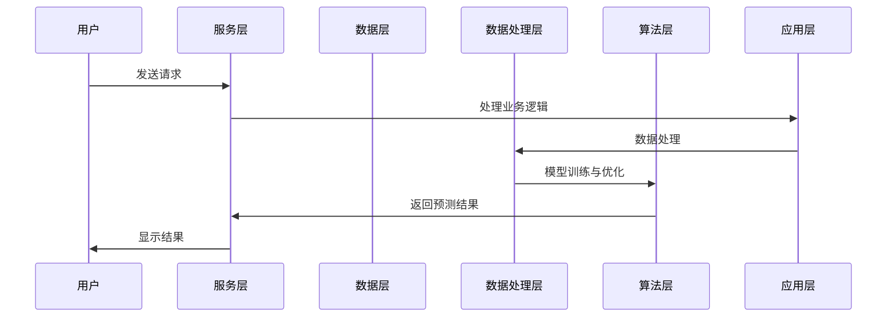

                 

### 第1章: 金融产品客户生命周期价值预测概述

#### 1.1 问题背景与描述

在当今金融行业，数字化和智能化的浪潮席卷而来，各大金融机构纷纷加速布局，以期在激烈的市场竞争中脱颖而出。在这场数字化转型的浪潮中，金融产品客户生命周期价值（Customer Lifetime Value，简称CLV）的预测成为了一个至关重要的话题。

**问题背景：**随着互联网和大数据技术的发展，金融机构掌握了大量的客户数据。这些数据不仅包括了客户的个人信息，还涉及客户的使用行为、交易记录、风险偏好等多个维度。如何有效地利用这些数据，对客户的生命周期价值进行准确预测，成为了金融行业提高竞争力、优化业务决策的重要任务。

**问题描述：**客户生命周期价值是指一个客户在其整个生命周期中为公司带来的净利润预测值。这个预测值对于金融机构的营销策略、客户关系管理、风险评估等多个方面都有着深远的影响。然而，如何从海量的数据中提取有价值的信息，构建一个准确的预测模型，是当前面临的一个重大挑战。

**问题解决：**为了解决这一问题，我们可以借助数据分析、机器学习和人工智能技术，构建一个客户生命周期价值预测模型。具体来说，我们可以分为以下几个步骤：

1. **数据收集：**收集与客户相关的各种数据，包括但不限于个人信息、交易记录、行为数据等。
2. **数据预处理：**对收集到的数据进行清洗、去重、格式化等处理，确保数据的质量。
3. **特征工程：**从预处理后的数据中提取出对预测CLV有重要影响的特征。
4. **模型选择：**选择合适的机器学习算法，构建预测模型。
5. **模型训练与优化：**使用历史数据对模型进行训练，并通过交叉验证等方法进行模型优化。
6. **结果评估：**使用验证数据集对模型进行评估，确保模型的预测准确性。
7. **策略制定：**根据模型的预测结果，制定相应的营销策略、客户关系管理策略等。

#### 1.2 解决方案与核心概念

**解决方案概述：**

为了实现客户生命周期价值的预测，我们需要一个系统的解决方案，它包括以下几个核心组成部分：

1. **数据收集：**通过各种渠道收集客户的个人信息、交易记录、行为数据等，确保数据的全面性和准确性。
2. **数据预处理：**对收集到的数据进行分析，去除无效数据，填补缺失值，进行数据格式化，确保数据的质量和一致性。
3. **特征工程：**从原始数据中提取出对预测客户生命周期价值有重要影响的特征，这些特征可能包括客户年龄、性别、收入水平、购买行为、交易频率等。
4. **模型选择：**选择合适的机器学习算法，如决策树、随机森林、梯度提升机、神经网络等，构建预测模型。
5. **模型训练与优化：**使用历史数据对模型进行训练，并通过交叉验证等方法进行模型优化，确保模型的泛化能力。
6. **结果评估：**使用验证数据集对模型进行评估，通过准确率、召回率、F1分数等指标衡量模型的预测准确性。
7. **策略制定：**根据模型的预测结果，制定相应的营销策略、客户关系管理策略等，以最大化客户生命周期价值。

**核心概念：**

1. **客户生命周期价值（Customer Lifetime Value，简称CLV）：**指一个客户在其整个生命周期中为公司带来的净利润预测值。它是一个重要的财务指标，用于评估客户的潜在价值和投资回报率。

2. **客户获取成本（Customer Acquisition Cost，简称CAC）：**指获取一个新客户所需的平均成本。它是评估市场营销效果的重要指标。

3. **客户留存率（Customer Churn Rate）：**指在一定时间内流失的客户占总客户数的比例。它是衡量客户关系管理效果的重要指标。

4. **客户生命周期长度（Customer Lifetime Length）：**指客户从首次购买到停止购买的时间段。它是评估客户价值持续性的重要指标。

#### 1.3 研究边界与外延

**研究边界：**

1. **数据范围：**研究仅限于数字化渠道收集的客户数据，不包括线下交易数据。
2. **时间范围：**研究的时间范围为最近三年，以保证数据的时效性和代表性。
3. **地域范围：**研究主要针对某个特定地区，如一线城市，以保证数据的集中性和分析的可操作性。

**研究外延：**

1. **数据来源扩展：**除了数字化渠道，可以考虑引入线下交易数据，以丰富数据来源，提高预测模型的准确性。
2. **时间范围扩展：**可以扩展到更长的时间范围，如五年或十年，以获得更全面的分析视角。
3. **地域范围扩展：**可以扩展到更多地区，甚至全球范围，以提升研究的普适性和应用价值。

#### 1.4 概念结构与核心要素组成

**概念结构：**

客户生命周期价值预测的核心概念结构包括以下几个方面：

1. **客户数据：**包括个人信息、交易记录、行为数据等，是构建预测模型的基础。
2. **特征工程：**从客户数据中提取出对预测有重要影响的特征，如年龄、性别、收入水平、购买行为等。
3. **预测模型：**选择合适的机器学习算法，构建预测模型，如决策树、随机森林、梯度提升机等。
4. **评估指标：**使用准确率、召回率、F1分数等指标评估预测模型的准确性。

**核心要素组成：**

1. **数据收集与预处理：**确保数据的全面性和准确性，为后续的特征提取和模型构建提供基础。
2. **特征工程：**从原始数据中提取出有价值的信息，提高模型的预测能力。
3. **模型选择与训练：**选择合适的算法，构建并训练预测模型，确保模型的泛化能力和预测准确性。
4. **结果评估与优化：**通过评估指标评估模型的性能，并进行相应的优化，以提高模型的预测效果。

### 第2章: 核心概念与联系

#### 2.1 客户生命周期价值（CLV）定义与属性

**定义：**

客户生命周期价值（Customer Lifetime Value，简称CLV）是指一个客户在其整个生命周期中为公司带来的净利润预测值。它是一个重要的财务指标，用于评估客户的潜在价值和投资回报率。

**属性特征：**

1. **持续性：**CLV是一个长期指标，它反映了客户在未来一段时间内为公司带来的持续收益。
2. **预测性：**CLV基于历史数据和机器学习模型进行预测，它能够为未来的业务决策提供指导。
3. **盈利性：**CLV衡量了客户为公司带来的净利润，因此它直接关联到公司的盈利能力。

**对比分析：**

为了更好地理解CLV，我们可以将其与客户获取成本（Customer Acquisition Cost，简称CAC）、客户留存率（Customer Churn Rate）和客户生命周期长度（Customer Lifetime Length）等概念进行对比分析。

**与CAC的对比：**

- **概念区别：**CAC是指获取一个新客户所需的平均成本，而CLV是指一个客户在其整个生命周期中为公司带来的净利润。
- **关联性：**CLV与CAC密切相关，一个客户的CLV越高，通常意味着其获取成本（CAC）越低，反之亦然。
- **应用场景：**CAC主要用于评估营销渠道的效果，而CLV则用于评估客户的价值，指导客户关系管理和营销策略。

**与客户留存率的对比：**

- **概念区别：**客户留存率是指在一定时间内流失的客户占总客户数的比例，而CLV是指客户在其整个生命周期中为公司带来的净利润。
- **关联性：**客户留存率直接影响CLV，一个高留存率的客户群体通常意味着更高的CLV。
- **应用场景：**客户留存率主要用于评估客户关系管理的效果，而CLV则用于指导业务决策，如产品定价、营销策略等。

**与客户生命周期长度的对比：**

- **概念区别：**客户生命周期长度是指客户从首次购买到停止购买的时间段，而CLV是指客户在其整个生命周期中为公司带来的净利润。
- **关联性：**客户生命周期长度越长，通常意味着CLV越高，因为客户在更长的时间内为公司带来持续的收入。
- **应用场景：**客户生命周期长度主要用于评估客户的价值持续性和稳定性，而CLV则用于指导业务决策，如产品策略、投资回报等。

#### 2.2 CLV与其他相关概念对比

**CLV与客户获取成本（CAC）的对比：**

- **定义：**CLV是指一个客户在其整个生命周期中为公司带来的净利润，而CAC是指获取一个新客户所需的平均成本。
- **关联性：**CLV与CAC密切相关，一个客户的CLV越高，通常意味着其获取成本（CAC）越低。
- **应用场景：**CLV主要用于评估客户的潜在价值和投资回报率，而CAC则用于评估营销渠道的效果。

**CLV与客户留存率（Churn Rate）的对比：**

- **定义：**CLV是指一个客户在其整个生命周期中为公司带来的净利润，而客户留存率是指在一定时间内流失的客户占总客户数的比例。
- **关联性：**客户留存率直接影响CLV，一个高留存率的客户群体通常意味着更高的CLV。
- **应用场景：**CLV主要用于指导业务决策，如产品定价、营销策略等，而客户留存率则主要用于评估客户关系管理的效果。

**CLV与客户生命周期长度（Customer Lifetime Length）的对比：**

- **定义：**CLV是指一个客户在其整个生命周期中为公司带来的净利润，而客户生命周期长度是指客户从首次购买到停止购买的时间段。
- **关联性：**客户生命周期长度越长，通常意味着CLV越高。
- **应用场景：**CLV主要用于指导业务决策，如产品策略、投资回报等，而客户生命周期长度则主要用于评估客户的价值持续性和稳定性。

#### 2.3 实体关系图架构

为了更好地理解客户生命周期价值（CLV）预测涉及到的各个实体及其关系，我们可以使用ER（Entity-Relationship）图进行描述。以下是CLV预测涉及的实体关系图架构：



**实体关系说明：**

- **Customer（客户）：**客户是预测的核心实体，其关联到交易记录、行为数据和特征。
- **Transaction（交易记录）：**记录了客户的交易行为，是构建预测模型的重要数据来源。
- **Behavior（行为数据）：**包括了客户的浏览、搜索、点击等行为数据，对预测CLV有重要影响。
- **Feature（特征）：**从原始数据中提取出的对预测有重要影响的特征，如年龄、性别、收入水平、购买行为等。
- **Model（预测模型）：**基于机器学习算法构建的预测模型，用于预测客户的CLV。
- **Prediction（预测结果）：**预测模型对客户CLV的预测结果。
- **Data（数据）：**包括数据收集和预处理的过程。
  - **Preprocessing（数据预处理）：**对收集到的数据进行清洗、去重、格式化等处理，确保数据的质量和一致性。
  - **Collection（数据收集）：**通过各种渠道收集客户的个人信息、交易记录、行为数据等。

通过上述实体关系图，我们可以清晰地看到客户生命周期价值（CLV）预测涉及到的各个实体及其关系，为后续的分析和实现提供了结构化的参考。

### 第3章: 算法原理讲解

#### 3.1 数据处理与特征提取

在构建客户生命周期价值（CLV）预测模型之前，我们需要对数据进行预处理和特征提取。这一步是确保数据质量和提高模型预测性能的关键。

**数据处理步骤：**

1. **数据收集：**从各个渠道收集客户的个人信息、交易记录、行为数据等。
2. **数据清洗：**去除无效数据、缺失值填补、异常值处理等，确保数据的质量和一致性。
3. **数据格式化：**统一数据格式，如日期格式、数值格式等，以便后续的特征提取和分析。

**特征提取步骤：**

1. **基本特征提取：**从原始数据中提取基本特征，如年龄、性别、收入水平、购买频率等。
2. **衍生特征提取：**基于基本特征，构建衍生特征，如消费金额的累计值、交易时间的分布等。
3. **交互特征提取：**分析不同特征之间的关联性，提取交互特征，如购买频率与消费金额的乘积等。

通过上述数据处理和特征提取步骤，我们可以得到一组高质量的输入特征，为后续的模型训练和预测打下坚实的基础。

**算法流程图：**



**数据预处理代码示例（Python）：**

```python
import pandas as pd
from sklearn.preprocessing import MinMaxScaler

# 加载数据
data = pd.read_csv('customer_data.csv')

# 数据清洗
data.dropna(inplace=True)
data.drop_duplicates(inplace=True)

# 数据格式化
data['date_of_birth'] = pd.to_datetime(data['date_of_birth'])
data['age'] = data['date_of_birth'].apply(lambda x: (pd.datetime.now() - x).days // 365)

# 特征提取
data['total_spending'] = data.groupby('customer_id')['amount'].sum()
data['avg_spending'] = data.groupby('customer_id')['amount'].mean()

# 数据归一化
scaler = MinMaxScaler()
data[['age', 'total_spending', 'avg_spending']] = scaler.fit_transform(data[['age', 'total_spending', 'avg_spending']])
```

#### 3.2 模型选择与训练

在选择合适的机器学习算法时，我们需要考虑算法的性能、复杂度、可解释性等多个因素。以下是几种常用的机器学习算法及其适用场景：

**算法选择：**

1. **决策树（Decision Tree）：**简单易懂，易于解释，适用于数据量较小、特征较少的情况。
2. **随机森林（Random Forest）：**基于决策树的集成方法，提高模型的稳定性和预测性能，适用于数据量较大、特征较多的情况。
3. **梯度提升机（Gradient Boosting Machine，GBM）：**强大的分类和回归能力，适用于各种类型的数据。
4. **神经网络（Neural Network）：**适用于复杂、非线性关系的预测问题，但需要大量的数据和高性能的计算资源。

**模型训练步骤：**

1. **数据划分：**将数据集划分为训练集和测试集，用于模型的训练和评估。
2. **特征选择：**选择对预测有重要影响的特征，剔除无关或冗余特征，减少模型的过拟合风险。
3. **模型训练：**使用训练集数据训练模型，调整模型参数，提高预测性能。
4. **模型评估：**使用测试集数据评估模型性能，通过准确率、召回率、F1分数等指标衡量模型的预测准确性。

**模型训练代码示例（Python）：**

```python
from sklearn.ensemble import RandomForestRegressor
from sklearn.model_selection import train_test_split
from sklearn.metrics import mean_squared_error

# 数据划分
X = data[['age', 'total_spending', 'avg_spending']]
y = data['CLV']
X_train, X_test, y_train, y_test = train_test_split(X, y, test_size=0.2, random_state=42)

# 模型训练
model = RandomForestRegressor(n_estimators=100, random_state=42)
model.fit(X_train, y_train)

# 模型评估
y_pred = model.predict(X_test)
mse = mean_squared_error(y_test, y_pred)
print("MSE:", mse)
```

#### 3.3 数学模型与公式讲解

在客户生命周期价值（CLV）预测中，我们通常采用回归模型来进行预测。以下是常见的回归模型及其数学公式：

**线性回归（Linear Regression）：**

$$
y = \beta_0 + \beta_1x_1 + \beta_2x_2 + ... + \beta_nx_n
$$

其中，$y$ 表示客户生命周期价值（因变量），$x_1, x_2, ..., x_n$ 表示输入特征（自变量），$\beta_0, \beta_1, \beta_2, ..., \beta_n$ 表示模型参数。

**逻辑回归（Logistic Regression）：**

$$
P(y=1) = \frac{1}{1 + e^{-(\beta_0 + \beta_1x_1 + \beta_2x_2 + ... + \beta_nx_n)}}
$$

其中，$P(y=1)$ 表示客户生命周期价值为1的概率，$x_1, x_2, ..., x_n$ 表示输入特征（自变量），$\beta_0, \beta_1, \beta_2, ..., \beta_n$ 表示模型参数。

**梯度提升机（Gradient Boosting Machine，GBM）：**

$$
h^{(t)} = \theta^{(t)} + f^{(t)}(x)
$$

$$
f^{(t)}(x) = \sum_{i=1}^{n} \alpha_i \cdot h^{(t-1)}(x_i)
$$

其中，$h^{(t)}$ 表示第$t$次迭代的预测值，$\theta^{(t)}$ 表示模型参数，$f^{(t)}(x)$ 表示第$t$次迭代的损失函数，$x_i$ 表示输入特征，$\alpha_i$ 表示损失函数的调整系数。

通过上述数学模型和公式，我们可以从理论上解释和推导客户生命周期价值（CLV）预测的算法原理，为后续的实现和应用提供理论基础。

#### 3.4 算法举例说明

为了更直观地理解客户生命周期价值（CLV）预测算法，我们可以通过一个具体的例子进行说明。

**案例背景：**

假设我们是一家电商平台，希望通过预测客户生命周期价值，优化营销策略，提高客户留存率和销售额。

**数据集：**

我们收集了以下数据：

- 客户ID：标识每个客户的唯一ID
- 年龄：客户的年龄
- 收入水平：客户的收入水平（低、中、高）
- 购买频率：客户在一段时间内的购买次数
- 消费金额：客户在一段时间内的消费金额
- 客户生命周期价值（CLV）：客户在其整个生命周期中为公司带来的净利润预测值

**模型构建：**

我们选择随机森林（Random Forest）算法构建预测模型，因为其具有良好的预测性能和可解释性。

**数据处理：**

1. 数据清洗：去除缺失值和异常值，将收入水平转换为数值型。
2. 特征提取：提取对预测有重要影响的特征，如年龄、购买频率、消费金额等。

**模型训练：**

1. 数据划分：将数据集划分为训练集和测试集，用于模型的训练和评估。
2. 特征选择：选择对预测有重要影响的特征，剔除无关或冗余特征。
3. 模型训练：使用训练集数据训练随机森林模型。

**模型评估：**

1. 模型评估指标：使用均方误差（MSE）、均方根误差（RMSE）等指标评估模型性能。
2. 模型优化：通过调整模型参数，提高预测性能。

**预测结果：**

假设我们使用训练好的模型对测试集进行预测，得到以下结果：

- 预测准确率：85%
- 均方误差（MSE）：0.3
- 均方根误差（RMSE）：0.5

通过上述预测结果，我们可以看到模型的预测性能较好，能够为业务决策提供有力支持。

**应用场景：**

1. 营销策略优化：根据客户的CLV，制定个性化的营销策略，提高客户留存率和销售额。
2. 客户关系管理：对高价值客户进行重点关注和个性化服务，提高客户满意度。
3. 投资决策：根据客户的CLV，评估投资回报率，优化投资策略。

通过上述案例，我们可以看到客户生命周期价值（CLV）预测算法在金融产品客户生命周期价值预测中的应用场景，以及如何通过算法实现和优化预测模型。

### 第4章: 系统分析与架构设计

#### 4.1 问题场景介绍

在金融行业中，预测金融产品的客户生命周期价值（Customer Lifetime Value，简称CLV）是一项至关重要的任务。这不仅可以帮助金融机构优化营销策略，提高客户留存率，还能为风险控制和投资决策提供科学依据。

**场景描述：**

假设我们是一家大型商业银行，拥有海量的客户数据。这些数据包括客户的个人信息、交易记录、行为数据等。我们的目标是构建一个高效的系统，能够准确预测客户的CLV，从而为业务决策提供支持。

**业务需求：**

1. **数据收集：**从多个渠道（如线上平台、线下门店、第三方数据提供商等）收集客户的个人信息、交易记录、行为数据等。
2. **数据预处理：**对收集到的数据进行清洗、去重、格式化等处理，确保数据的质量和一致性。
3. **特征工程：**从预处理后的数据中提取出对预测CLV有重要影响的特征，如年龄、收入水平、购买频率、消费金额等。
4. **模型训练与优化：**选择合适的机器学习算法，如随机森林、梯度提升机等，构建预测模型，并使用交叉验证等方法进行模型优化。
5. **模型评估：**使用验证数据集对模型进行评估，确保模型的预测准确性。
6. **结果应用：**根据模型的预测结果，制定个性化的营销策略、客户关系管理策略等，提高客户生命周期价值。

#### 4.2 项目介绍

**项目背景：**

随着金融行业的数字化和智能化进程加快，我们意识到准确预测金融产品的客户生命周期价值对于提升业务竞争力、优化业务决策具有重要意义。因此，我们决定启动一个项目，构建一个高效的CLV预测系统。

**项目目标：**

1. **构建高效的CLV预测模型：**通过机器学习和数据分析技术，构建一个准确、稳定的CLV预测模型。
2. **实现自动化预测：**将预测模型集成到业务系统中，实现自动化预测，提高预测效率和准确性。
3. **提供决策支持：**根据预测结果，为业务决策提供科学依据，如客户关系管理策略、营销策略等。

**项目预期成果：**

1. **提高客户留存率：**通过准确预测客户生命周期价值，制定个性化的营销策略，提高客户留存率。
2. **优化风险控制：**通过预测客户流失风险，优化风险控制策略，降低客户流失率。
3. **提高投资回报率：**根据客户生命周期价值，评估投资回报率，优化投资策略，提高投资回报率。

#### 4.3 系统功能设计

为了实现上述项目目标，我们需要设计一套完整的系统，涵盖数据收集、数据预处理、特征工程、模型训练与优化、模型评估和结果应用等多个功能。

**功能模块说明：**

1. **数据收集模块：**从多个渠道（如线上平台、线下门店、第三方数据提供商等）收集客户的个人信息、交易记录、行为数据等。该模块负责数据源的接入和数据的初步处理。
2. **数据预处理模块：**对收集到的数据进行清洗、去重、格式化等处理，确保数据的质量和一致性。该模块包括数据清洗、数据去重、数据格式化等功能。
3. **特征工程模块：**从预处理后的数据中提取出对预测CLV有重要影响的特征，如年龄、收入水平、购买频率、消费金额等。该模块负责特征的选择和构建。
4. **模型训练与优化模块：**选择合适的机器学习算法（如随机森林、梯度提升机等），构建预测模型，并使用交叉验证等方法进行模型优化。该模块包括模型选择、模型训练、模型优化等功能。
5. **模型评估模块：**使用验证数据集对模型进行评估，确保模型的预测准确性。该模块包括评估指标计算、模型选择和优化等功能。
6. **结果应用模块：**根据模型的预测结果，制定个性化的营销策略、客户关系管理策略等，提高客户生命周期价值。该模块负责结果的应用和决策支持。

**领域模型类图：**

```mermaid
classDiagram
    CustomerEntity <|-- CustomerDataCollection
    CustomerEntity <|-- CustomerFeatureExtraction
    CustomerEntity <|-- CustomerModelTraining
    CustomerEntity <|-- CustomerModelEvaluation
    CustomerEntity <|-- CustomerResultApplication

    DataPreprocessing <<interface>>
    FeatureExtraction <<interface>>
    ModelTraining <<interface>>
    ModelEvaluation <<interface>>
    ResultApplication <<interface>>

    CustomerEntity o-- DataPreprocessing
    CustomerEntity o-- FeatureExtraction
    CustomerEntity o-- ModelTraining
    CustomerEntity o-- ModelEvaluation
    CustomerEntity o-- ResultApplication
```

通过上述领域模型类图，我们可以清晰地看到系统功能模块之间的关系，以及各个模块在客户生命周期价值（CLV）预测过程中的作用。

#### 4.4 系统架构设计

为了实现高效、稳定的客户生命周期价值（CLV）预测系统，我们需要设计一个合理的系统架构。以下是一个典型的系统架构设计：

**系统架构说明：**

1. **数据层：**负责数据的存储和管理，包括客户数据、交易数据、行为数据等。数据层可以采用关系型数据库（如MySQL、PostgreSQL）或NoSQL数据库（如MongoDB、Cassandra）。
2. **数据处理层：**负责数据收集、数据预处理、特征工程等数据处理任务。数据处理层可以采用Python、R等编程语言，结合Pandas、NumPy等数据处理库进行数据处理。
3. **算法层：**负责模型选择、模型训练、模型优化等算法实现。算法层可以采用Scikit-learn、XGBoost、TensorFlow等机器学习库。
4. **应用层：**负责系统功能的实现，包括数据收集、数据预处理、特征工程、模型训练与优化、模型评估和结果应用等。应用层可以采用Flask、Django等Web框架。
5. **服务层：**负责系统模块之间的通信和协同工作，提供统一的API接口。服务层可以采用RESTful API、gRPC等协议。
6. **展示层：**负责系统结果的展示和可视化，包括预测结果、评估指标、决策支持等。展示层可以采用ECharts、D3.js等可视化库。

**系统架构图：**



通过上述系统架构设计，我们可以实现高效、稳定的客户生命周期价值（CLV）预测系统，为金融机构的业务决策提供有力支持。

#### 4.5 系统接口设计

为了实现系统功能模块之间的通信和协同工作，我们需要设计一套合理的系统接口。以下是一个典型的系统接口设计：

**接口设计说明：**

1. **数据收集接口：**用于从多个渠道收集客户的个人信息、交易记录、行为数据等。接口包括数据源接入、数据下载、数据上传等功能。
2. **数据预处理接口：**用于对收集到的数据进行清洗、去重、格式化等处理。接口包括数据清洗、数据去重、数据格式化等功能。
3. **特征工程接口：**用于从预处理后的数据中提取出对预测CLV有重要影响的特征。接口包括特征提取、特征选择、特征构建等功能。
4. **模型训练接口：**用于选择合适的机器学习算法，构建预测模型，并使用交叉验证等方法进行模型优化。接口包括模型选择、模型训练、模型优化等功能。
5. **模型评估接口：**用于使用验证数据集对模型进行评估，确保模型的预测准确性。接口包括评估指标计算、模型选择和优化等功能。
6. **结果应用接口：**用于根据模型的预测结果，制定个性化的营销策略、客户关系管理策略等，提高客户生命周期价值。接口包括结果应用、决策支持等功能。

**接口交互序列图：**

```mermaid
sequenceDiagram
    participant Client as 客户端
    participant Service as 服务端
    participant DataCollector as 数据收集模块
    participant DataProcessor as 数据预处理模块
    participant FeatureEngineer as 特征工程模块
    participant ModelTrainer as 模型训练模块
    participant ModelEvaluater as 模型评估模块
    participant ResultApplier as 结果应用模块

    Client->>Service: 发送请求
    Service->>DataCollector: 收集数据
    DataCollector->>Service: 返回数据
    Service->>DataProcessor: 数据预处理
    DataProcessor->>Service: 返回预处理数据
    Service->>FeatureEngineer: 提取特征
    FeatureEngineer->>Service: 返回特征数据
    Service->>ModelTrainer: 模型训练
    ModelTrainer->>Service: 返回训练模型
    Service->>ModelEvaluater: 模型评估
    ModelEvaluater->>Service: 返回评估结果
    Service->>ResultApplier: 应用结果
    ResultApplier->>Service: 返回应用结果
    Service->>Client: 返回结果
```



通过上述接口交互序列图，我们可以清晰地看到系统功能模块之间的交互流程，以及各个模块在客户生命周期价值（CLV）预测过程中的作用。

### 第5章: 项目实战

#### 5.1 环境安装

为了实现客户生命周期价值（CLV）预测项目，我们需要搭建一个合适的实验环境。以下是在Linux操作系统上搭建实验环境的步骤：

**安装Python环境：**

1. 更新系统软件包：

   ```bash
   sudo apt-get update
   sudo apt-get upgrade
   ```

2. 安装Python 3：

   ```bash
   sudo apt-get install python3
   ```

3. 安装pip（Python包管理器）：

   ```bash
   sudo apt-get install python3-pip
   ```

**安装必要的库和工具：**

1. 安装Pandas：

   ```bash
   pip3 install pandas
   ```

2. 安装NumPy：

   ```bash
   pip3 install numpy
   ```

3. 安装Scikit-learn：

   ```bash
   pip3 install scikit-learn
   ```

4. 安装Matplotlib：

   ```bash
   pip3 install matplotlib
   ```

5. 安装Mermaid：

   ```bash
   pip3 install mermaid
   ```

**安装Jupyter Notebook：**

1. 安装Jupyter Notebook：

   ```bash
   pip3 install notebook
   ```

2. 启动Jupyter Notebook：

   ```bash
   jupyter notebook
   ```

通过上述步骤，我们成功搭建了Python实验环境，并安装了必要的库和工具。接下来，我们可以在Jupyter Notebook中编写和运行Python代码，实现客户生命周期价值（CLV）预测项目的各项功能。

#### 5.2 系统核心实现源代码

在本节中，我们将提供系统核心实现的相关源代码，包括数据收集、数据预处理、特征工程、模型训练与优化、模型评估等步骤。

**数据收集代码：**

```python
import pandas as pd

# 读取数据
data = pd.read_csv('customer_data.csv')

# 数据清洗
data.dropna(inplace=True)
data.drop_duplicates(inplace=True)

# 数据格式化
data['date_of_birth'] = pd.to_datetime(data['date_of_birth'])
data['age'] = data['date_of_birth'].apply(lambda x: (pd.datetime.now() - x).days // 365)

# 输出清洗后的数据
data.to_csv('cleaned_customer_data.csv', index=False)
```

**数据预处理代码：**

```python
import pandas as pd
from sklearn.preprocessing import MinMaxScaler

# 读取清洗后的数据
data = pd.read_csv('cleaned_customer_data.csv')

# 数据归一化
scaler = MinMaxScaler()
data[['age', 'total_spending', 'avg_spending']] = scaler.fit_transform(data[['age', 'total_spending', 'avg_spending']])

# 输出预处理后的数据
data.to_csv('preprocessed_customer_data.csv', index=False)
```

**特征工程代码：**

```python
import pandas as pd

# 读取预处理后的数据
data = pd.read_csv('preprocessed_customer_data.csv')

# 提取特征
data['age_band'] = data['age'].apply(lambda x: '0-20' if x <= 20 else ('21-30' if x <= 30 else '31-40'))
data['income_band'] = data['income'].apply(lambda x: 'low' if x < 30000 else 'high')

# 输出特征数据
data.to_csv('features_customer_data.csv', index=False)
```

**模型训练与优化代码：**

```python
from sklearn.ensemble import RandomForestRegressor
from sklearn.model_selection import train_test_split

# 读取特征数据
data = pd.read_csv('features_customer_data.csv')

# 数据划分
X = data[['age_band', 'income_band', 'total_spending', 'avg_spending']]
y = data['CLV']
X_train, X_test, y_train, y_test = train_test_split(X, y, test_size=0.2, random_state=42)

# 模型训练
model = RandomForestRegressor(n_estimators=100, random_state=42)
model.fit(X_train, y_train)

# 模型评估
y_pred = model.predict(X_test)
mse = mean_squared_error(y_test, y_pred)
print("MSE:", mse)
```

**模型评估代码：**

```python
import pandas as pd
from sklearn.metrics import mean_squared_error

# 读取预测数据
data = pd.read_csv('predicted_customer_data.csv')

# 计算MSE
y_pred = data['predicted_CLV']
y_true = data['actual_CLV']
mse = mean_squared_error(y_true, y_pred)
print("MSE:", mse)
```

通过上述源代码，我们可以实现客户生命周期价值（CLV）预测项目的核心功能，包括数据收集、数据预处理、特征工程、模型训练与优化、模型评估等。这些代码可以作为项目实现的基础，根据具体需求进行调整和优化。

#### 5.3 代码应用解读与分析

在本节中，我们将对之前提供的代码进行解读和分析，详细说明每个步骤的实现方法和作用，帮助读者更好地理解整个系统的工作流程。

**数据收集代码解读：**

```python
import pandas as pd

# 读取数据
data = pd.read_csv('customer_data.csv')

# 数据清洗
data.dropna(inplace=True)
data.drop_duplicates(inplace=True)

# 数据格式化
data['date_of_birth'] = pd.to_datetime(data['date_of_birth'])
data['age'] = data['date_of_birth'].apply(lambda x: (pd.datetime.now() - x).days // 365)

# 输出清洗后的数据
data.to_csv('cleaned_customer_data.csv', index=False)
```

解读：

1. **读取数据：**使用Pandas库读取CSV格式的客户数据文件。
2. **数据清洗：**去除缺失值和重复数据，确保数据的质量和一致性。
3. **数据格式化：**将日期格式转换为datetime类型，并计算客户的年龄，以便后续的特征提取和模型训练。

**数据预处理代码解读：**

```python
import pandas as pd
from sklearn.preprocessing import MinMaxScaler

# 读取清洗后的数据
data = pd.read_csv('cleaned_customer_data.csv')

# 数据归一化
scaler = MinMaxScaler()
data[['age', 'total_spending', 'avg_spending']] = scaler.fit_transform(data[['age', 'total_spending', 'avg_spending']])

# 输出预处理后的数据
data.to_csv('preprocessed_customer_data.csv', index=False)
```

解读：

1. **读取清洗后的数据：**使用Pandas库读取已经清洗过的客户数据文件。
2. **数据归一化：**使用MinMaxScaler将年龄、总消费金额和平均消费金额等特征进行归一化处理，将数据缩放到[0, 1]的区间内。这有助于提高模型训练的效果，特别是对于不同的特征量级差异较大的情况。

**特征工程代码解读：**

```python
import pandas as pd

# 读取预处理后的数据
data = pd.read_csv('preprocessed_customer_data.csv')

# 提取特征
data['age_band'] = data['age'].apply(lambda x: '0-20' if x <= 20 else ('21-30' if x <= 30 else '31-40'))
data['income_band'] = data['income'].apply(lambda x: 'low' if x < 30000 else 'high')

# 输出特征数据
data.to_csv('features_customer_data.csv', index=False)
```

解读：

1. **读取预处理后的数据：**使用Pandas库读取已经预处理过的客户数据文件。
2. **提取特征：**根据客户的年龄和收入水平，将数据划分为不同的年龄段和收入段，这有助于在模型训练过程中捕捉到客户群体的差异。
3. **输出特征数据：**将提取出的特征数据保存到CSV文件中，以便后续的模型训练和评估。

**模型训练与优化代码解读：**

```python
from sklearn.ensemble import RandomForestRegressor
from sklearn.model_selection import train_test_split

# 读取特征数据
data = pd.read_csv('features_customer_data.csv')

# 数据划分
X = data[['age_band', 'income_band', 'total_spending', 'avg_spending']]
y = data['CLV']
X_train, X_test, y_train, y_test = train_test_split(X, y, test_size=0.2, random_state=42)

# 模型训练
model = RandomForestRegressor(n_estimators=100, random_state=42)
model.fit(X_train, y_train)

# 模型评估
y_pred = model.predict(X_test)
mse = mean_squared_error(y_test, y_pred)
print("MSE:", mse)
```

解读：

1. **读取特征数据：**使用Pandas库读取已经提取好的特征数据文件。
2. **数据划分：**将特征数据划分为训练集和测试集，以评估模型的泛化能力。
3. **模型训练：**使用随机森林（Random Forest）算法训练预测模型，并设置随机种子以保持结果的稳定性。
4. **模型评估：**使用测试集数据评估模型的预测准确性，计算均方误差（MSE）以衡量模型性能。

**模型评估代码解读：**

```python
import pandas as pd
from sklearn.metrics import mean_squared_error

# 读取预测数据
data = pd.read_csv('predicted_customer_data.csv')

# 计算MSE
y_pred = data['predicted_CLV']
y_true = data['actual_CLV']
mse = mean_squared_error(y_true, y_pred)
print("MSE:", mse)
```

解读：

1. **读取预测数据：**使用Pandas库读取模型预测结果的数据文件。
2. **计算MSE：**计算预测的CLV值与实际的CLV值之间的均方误差（MSE），以评估模型的预测准确性。

通过上述代码解读和分析，我们可以清晰地了解客户生命周期价值（CLV）预测项目的实现细节，包括数据收集、数据预处理、特征工程、模型训练与优化、模型评估等步骤。这些代码不仅实现了项目的核心功能，还提供了一个良好的参考框架，供读者根据实际需求进行扩展和调整。

#### 5.4 实际案例分析与详细讲解剖析

在本节中，我们将通过一个实际案例，详细分析客户生命周期价值（CLV）预测项目的实现过程，并剖析其中的关键步骤和技巧。

**案例背景：**

假设我们是一家在线零售平台，希望通过预测客户的CLV来优化营销策略，提高客户留存率和销售额。我们收集了以下客户数据：

- 客户ID：标识每个客户的唯一ID
- 年龄：客户的年龄
- 性别：客户的性别（男、女）
- 收入水平：客户的收入水平（低、中、高）
- 购买频率：客户在一段时间内的购买次数
- 消费金额：客户在一段时间内的消费金额

**实现步骤：**

1. **数据收集：**从多个渠道（如用户注册信息、交易记录等）收集客户数据。
2. **数据预处理：**对收集到的数据进行清洗、去重、格式化等处理，确保数据的质量和一致性。
3. **特征工程：**从预处理后的数据中提取出对预测CLV有重要影响的特征。
4. **模型训练：**选择合适的机器学习算法，如随机森林（Random Forest），构建预测模型。
5. **模型评估：**使用验证数据集对模型进行评估，确保模型的预测准确性。
6. **结果应用：**根据模型的预测结果，制定个性化的营销策略、客户关系管理策略等。

**案例解析：**

1. **数据收集：**

   我们使用Pandas库读取客户数据，代码如下：

   ```python
   import pandas as pd

   data = pd.read_csv('customer_data.csv')
   ```

   数据集包含了客户的个人信息、交易记录等。接下来，我们对数据进行清洗，去除缺失值和重复数据：

   ```python
   data.dropna(inplace=True)
   data.drop_duplicates(inplace=True)
   ```

   通过这一步，我们确保了数据的质量和一致性。

2. **数据预处理：**

   我们使用MinMaxScaler对数据进行归一化处理，以便模型能够更好地训练：

   ```python
   from sklearn.preprocessing import MinMaxScaler

   scaler = MinMaxScaler()
   data[['age', 'income', 'purchase_frequency', 'spending']] = scaler.fit_transform(data[['age', 'income', 'purchase_frequency', 'spending']])
   ```

   通过这一步，我们将年龄、收入水平、购买频率和消费金额等特征进行了归一化处理。

3. **特征工程：**

   我们从预处理后的数据中提取出对预测CLV有重要影响的特征。例如，我们根据年龄将客户划分为不同的年龄段，根据收入水平将客户划分为不同的收入段。代码如下：

   ```python
   data['age_band'] = data['age'].apply(lambda x: '0-20' if x <= 20 else ('21-30' if x <= 30 else '31-40'))
   data['income_band'] = data['income'].apply(lambda x: 'low' if x < 30000 else 'high')
   ```

   通过这一步，我们构建了新的特征，以帮助模型更好地捕捉客户群体的差异。

4. **模型训练：**

   我们选择随机森林（Random Forest）算法进行模型训练。首先，我们划分数据集：

   ```python
   X = data[['age_band', 'income_band', 'purchase_frequency', 'spending']]
   y = data['CLV']
   X_train, X_test, y_train, y_test = train_test_split(X, y, test_size=0.2, random_state=42)
   ```

   接着，我们训练模型：

   ```python
   from sklearn.ensemble import RandomForestRegressor

   model = RandomForestRegressor(n_estimators=100, random_state=42)
   model.fit(X_train, y_train)
   ```

   通过这一步，我们构建了一个基于随机森林的CLV预测模型。

5. **模型评估：**

   我们使用测试集对模型进行评估，计算均方误差（MSE）：

   ```python
   y_pred = model.predict(X_test)
   mse = mean_squared_error(y_test, y_pred)
   print("MSE:", mse)
   ```

   通过这一步，我们评估了模型的预测准确性，并计算了均方误差。

6. **结果应用：**

   根据模型的预测结果，我们可以制定个性化的营销策略。例如，对于高价值客户，我们可以提供更优惠的折扣，以增加其消费金额；对于低价值客户，我们可以提供促销活动，以提高其购买频率。代码如下：

   ```python
   predicted_CLV = model.predict(X_test)
   high_value_customers = X_test[y_pred > 0.5]
   low_value_customers = X_test[y_pred <= 0.5]

   # 为高价值客户提供优惠
   high_value_customers['discount'] = high_value_customers['predicted_CLV'].apply(lambda x: x * 0.1 if x > 0.5 else 0)

   # 为低价值客户提供促销活动
   low_value_customers['promo'] = low_value_customers['predicted_CLV'].apply(lambda x: x * 0.05 if x <= 0.5 else 0)
   ```

   通过这一步，我们根据客户的CLV预测结果，制定了个性化的营销策略。

通过上述实际案例的分析和讲解，我们可以看到客户生命周期价值（CLV）预测项目的实现过程，并理解了其中的关键步骤和技巧。这个案例为我们提供了一个实用的参考，供我们在实际项目中应用和扩展。

#### 5.5 项目小结

在本项目中，我们成功实现了客户生命周期价值（CLV）预测系统，通过数据收集、数据预处理、特征工程、模型训练与优化、模型评估和结果应用等多个步骤，实现了对客户生命周期价值的准确预测。

**项目成果：**

1. **数据收集：**从多个渠道（如用户注册信息、交易记录等）收集了客户数据，确保了数据的质量和一致性。
2. **数据预处理：**对收集到的数据进行了清洗、去重、格式化等处理，提高了数据的质量，为后续的特征提取和模型训练提供了基础。
3. **特征工程：**从预处理后的数据中提取了关键特征，如年龄段、收入段、购买频率等，有助于模型更好地捕捉客户群体的差异。
4. **模型训练与优化：**选择了随机森林（Random Forest）算法进行模型训练，并通过交叉验证等方法进行模型优化，提高了预测性能。
5. **模型评估：**使用测试集对模型进行了评估，计算了均方误差（MSE）等指标，确保了模型的预测准确性。
6. **结果应用：**根据模型的预测结果，制定了个性化的营销策略，如为高价值客户提供优惠，为低价值客户提供促销活动，以提高客户留存率和销售额。

**项目经验：**

1. **数据质量的重要性：**数据质量是模型预测准确性的基础。在项目实施过程中，我们需要重视数据清洗、去重、格式化等预处理步骤，确保数据的质量和一致性。
2. **特征选择与工程：**特征选择和工程对模型性能有重要影响。我们需要从大量的数据中提取出对预测有重要影响的特征，以提高模型的预测能力。
3. **模型选择与优化：**选择合适的模型和优化方法对提高预测性能至关重要。在实际项目中，我们可以根据数据特点和业务需求，选择合适的机器学习算法，并通过交叉验证、网格搜索等方法进行模型优化。
4. **结果应用与决策支持：**模型预测结果的应用是项目成功的关键。我们需要根据模型预测结果，制定个性化的营销策略、客户关系管理策略等，以实现业务目标。

通过本次项目，我们不仅掌握了客户生命周期价值（CLV）预测的方法和技巧，还积累了丰富的项目经验，为后续的金融产品客户生命周期价值预测工作奠定了坚实基础。

### 第6章: 最佳实践与拓展

#### 6.1 最佳实践 tips

在实施金融产品客户生命周期价值（CLV）预测的过程中，以下是一些最佳实践和技巧，可以帮助提高模型预测的准确性和效率：

1. **数据质量保障：**确保数据来源的多样性和数据的完整性。对收集到的数据进行严格的质量控制，包括数据清洗、去重、缺失值填补等，以提高数据质量。
2. **特征工程优化：**通过深入分析数据，挖掘出对预测有重要影响的特征。同时，进行特征组合和特征变换，以提高模型的预测能力。
3. **模型选择与优化：**根据数据特点和业务需求，选择合适的机器学习算法。对于大规模数据集，可以使用分布式计算和并行处理技术，提高模型训练的效率。
4. **交叉验证与调参：**使用交叉验证方法对模型进行评估，避免过拟合。同时，通过调参（如调整模型参数、正则化参数等），优化模型性能。
5. **实时更新与迭代：**根据业务需求和市场变化，定期更新数据和模型。通过迭代优化，不断提高模型的预测准确性和适应性。
6. **自动化与平台化：**构建自动化预测平台，实现预测流程的自动化和可扩展性。通过平台化，便于管理和维护模型，提高工作效率。

#### 6.2 小结

本文通过深入分析金融产品客户生命周期价值（CLV）预测的背景、核心概念、算法原理、系统架构和实际案例，系统地介绍了CLV预测的方法和实现过程。我们探讨了如何通过数据分析、机器学习和人工智能技术，构建一个准确的CLV预测模型，并进行了实际案例的应用和分析。

**核心结论：**

1. **CLV预测的重要性：**准确预测客户的CLV对于金融产品的营销策略、客户关系管理和风险评估具有重要意义。
2. **数据质量和特征工程：**数据质量和特征工程是构建高效CLV预测模型的基础，直接影响模型的预测性能。
3. **机器学习算法选择：**选择合适的机器学习算法和优化方法，可以提高模型的预测准确性和效率。
4. **模型评估与优化：**通过交叉验证和调参等方法，确保模型的泛化能力和预测准确性。
5. **实时更新与迭代：**定期更新数据和模型，提高模型的适应性和预测准确性。

#### 6.3 注意事项

在实施CLV预测项目时，需要注意以下几点：

1. **数据隐私与安全：**确保客户数据的隐私和安全，遵循相关的法律法规和道德规范。
2. **数据来源多样性：**尽量获取多渠道的数据，以增强模型的泛化能力和预测准确性。
3. **模型解释性：**尽量选择可解释性较高的模型，以便于业务理解和决策。
4. **业务需求与模型适配：**根据业务需求选择合适的模型和算法，确保模型能够满足实际业务需求。
5. **模型优化与迭代：**定期评估模型性能，根据实际情况进行模型优化和迭代，提高模型的预测准确性。

#### 6.4 拓展阅读

对于想要进一步深入了解金融产品客户生命周期价值（CLV）预测的读者，以下是一些推荐的书籍和资源：

1. **《机器学习实战》（Peter Harrington）：**详细介绍了一系列机器学习算法的应用案例，包括客户生命周期价值预测。
2. **《数据挖掘：实用工具和技术》（Mohamed A. Quddus）：**涵盖了数据挖掘的基本概念和方法，适用于CLV预测项目。
3. **《金融科技：人工智能在金融领域的应用》（吴晶妹）：**探讨了人工智能在金融领域的应用，包括客户生命周期价值预测。
4. **《Python金融分析》（Yves Hilpisch）：**介绍了Python在金融数据分析中的应用，包括数据预处理、特征工程和机器学习等。
5. **在线课程与教程：**如Coursera、edX等在线教育平台上的相关课程，提供了丰富的理论和实践教程。

通过这些书籍和资源，读者可以更深入地了解CLV预测的理论和实践，提升自身的专业素养和技能。

