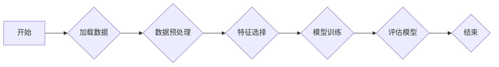
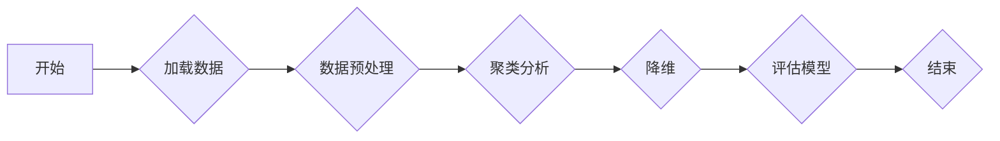
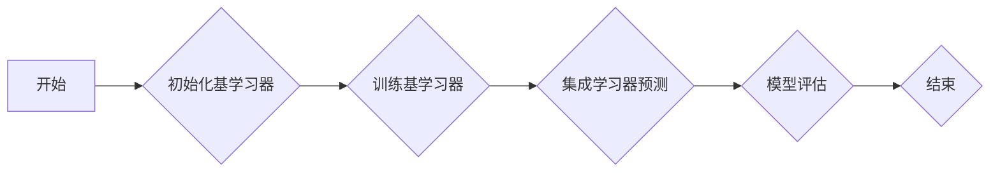

                 

# 金融产品客户精准营销引擎

## 关键词

- 金融产品
- 客户精准营销
- 数据分析
- 机器学习
- 系统架构
- 营销自动化

## 摘要

本文旨在探讨金融产品客户精准营销引擎的设计与实现。通过对当前金融行业营销现状的分析，本文阐述了客户精准营销的重要性。随后，详细介绍了核心概念、关键算法、系统架构和项目实战，包括环境搭建、核心实现源代码展示与分析、实际案例分析等内容。最后，本文提供了最佳实践技巧、小结和拓展阅读，以帮助读者更好地理解和应用金融产品客户精准营销引擎。

## 目录

### 第一部分：金融产品客户精准营销背景

- **第1章：金融产品精准营销概述**
  - 1.1 金融行业的营销现状
  - 1.2 客户需求与行为的变化
  - 1.3 科技对金融营销方式的影响
  - 1.4 客户精准营销的重要性

- **第2章：核心概念与联系**
  - 2.1 客户数据分析
  - 2.2 客户行为预测
  - 2.3 营销自动化
  - 2.4 ER实体关系图

### 第二部分：关键算法原理讲解

- **第3章：机器学习算法**
  - 3.1 监督学习算法
  - 3.2 无监督学习算法
  - 3.3 集成学习方法

- **第4章：数据挖掘算法**
  - 4.1 关联规则挖掘
  - 4.2 聚类分析算法
  - 4.3 异常检测算法

### 第三部分：系统分析与架构设计方案

- **第5章：系统分析与架构设计方案**
  - 5.1 问题场景描述
  - 5.2 系统功能设计
  - 5.3 系统架构设计
  - 5.4 系统接口设计
  - 5.5 系统交互流程

### 第四部分：项目实战

- **第6章：项目实战**
  - 6.1 环境搭建
  - 6.2 核心实现
  - 6.3 实际案例分析
  - 6.4 项目小结

### 第五部分：最佳实践、小结与拓展阅读

- **第7章：最佳实践、小结与拓展阅读**
  - 7.1 最佳实践技巧
  - 7.2 小结
  - 7.3 拓展阅读

### 引言

金融行业是一个高度竞争的市场，客户需求不断变化，为了在激烈的市场竞争中脱颖而出，金融机构必须采取有效的营销策略。客户精准营销作为一种基于大数据和人工智能的先进营销方法，正逐渐成为金融机构提升客户满意度、提高盈利能力的重要手段。本文将详细探讨金融产品客户精准营销引擎的设计与实现，旨在为金融行业的市场营销提供有益的参考。

### 第一部分：金融产品客户精准营销背景

#### 第1章：金融产品精准营销概述

##### 1.1 金融行业的营销现状

金融行业一直以来都是营销战略的重要领域。在过去的几十年中，金融机构通过传统的营销手段，如广告、促销活动和客户关系管理，来吸引和维护客户。然而，随着金融市场的快速发展和消费者需求的变化，传统的营销策略逐渐显现出其局限性。一方面，市场竞争日益激烈，金融机构需要找到更有效的手段来吸引新客户；另一方面，客户的需求变得更加多样化，他们希望金融机构能够提供个性化、定制化的产品和服务。

在这个背景下，精准营销作为一种基于大数据和人工智能的营销方法应运而生。精准营销的目标是通过深入分析客户数据，了解客户的兴趣、需求和偏好，从而实现个性化推荐、精准广告投放和有效的客户关系管理。金融产品精准营销不仅能够提高客户满意度，还能够提高金融机构的运营效率和盈利能力。

##### 1.2 客户需求与行为的变化

客户的消费习惯和需求正在发生显著变化。随着互联网和移动技术的普及，客户越来越倾向于在线办理金融业务，对金融产品的透明度和便捷性提出了更高的要求。此外，客户的期望也变得更加个性化，他们希望金融机构能够根据他们的个人情况和偏好提供定制化的金融解决方案。

与此同时，客户的行为数据变得更为丰富。金融机构可以通过各种渠道收集客户的行为数据，如在线浏览记录、交易记录、社交媒体活动等。这些数据为精准营销提供了宝贵的信息资源，使金融机构能够更准确地了解客户的需求和行为模式。

##### 1.3 科技对金融营销方式的影响

科技的进步为金融营销带来了革命性的变化。大数据、人工智能和云计算等技术的应用，使得金融机构能够更高效地处理海量数据，挖掘客户需求，优化营销策略。例如，通过大数据分析，金融机构可以识别出潜在的客户群体，预测他们的购买意愿，从而实现精准广告投放。人工智能技术可以帮助金融机构自动处理客户服务请求，提供个性化的金融建议。

此外，科技的发展还促进了金融营销的自动化。营销自动化工具可以自动化执行营销活动，如邮件营销、社交媒体推广、客户细分等。这不仅可以节省人力成本，还可以提高营销效率，确保营销策略的有效实施。

##### 1.4 客户精准营销的重要性

客户精准营销在金融行业中具有重要意义。首先，通过精准营销，金融机构可以更有效地吸引潜在客户，提高新客户获取率。其次，精准营销有助于提高客户忠诚度，通过个性化的产品和服务满足客户的多元化需求，增强客户满意度和忠诚度。

此外，精准营销还可以提高营销效率，降低营销成本。通过数据分析和机器学习技术，金融机构可以识别出最具价值的客户群体，针对性地进行营销活动，从而提高营销ROI。最后，精准营销有助于金融机构优化业务流程，提升运营效率，实现可持续发展。

### 第二部分：核心概念与联系

#### 第2章：核心概念与联系

##### 2.1 客户数据分析

客户数据分析是金融产品精准营销的基础。通过收集和分析客户数据，金融机构可以深入了解客户的需求、行为和偏好。这些数据可以来自多个渠道，如客户关系管理（CRM）系统、交易记录、社交媒体活动等。

**概念属性特征对比表格：**

| 特征                | 数据类型       | 描述                                                         |
|-------------------|--------------|------------------------------------------------------------|
| 客户基本信息          | 文本、数值     | 包括姓名、年龄、性别、联系方式等基本信息。                     |
| 交易记录              | 时间序列数据   | 包括交易时间、交易金额、交易类型等。                           |
| 社交媒体活动          | 文本、图像、视频 | 包括客户的社交媒体发布内容、互动行为等。                       |
| 客户行为数据           | 时空数据       | 包括客户的浏览记录、搜索关键词、点击率等。                     |

**ER实体关系图：**

```mermaid
erDiagram
    Customer ||--|{ Order : "购买了" }
    Customer ||--|{ Interaction : "互动了" }
    Customer ||--|{ Behavior : "行为" }
    Order ||--|{ Product : "销售了" }
    Interaction ||--|{ Channel : "通过" }
    Behavior ||--|{ Event : "发生了" }
```

##### 2.2 客户行为预测

客户行为预测是金融产品精准营销的核心任务之一。通过预测客户的行为，金融机构可以提前了解客户的潜在需求，从而制定更加精准的营销策略。

**概念属性特征对比表格：**

| 特征                | 数据类型       | 描述                                                         |
|-------------------|--------------|------------------------------------------------------------|
| 客户购买行为          | 时间序列数据   | 包括客户的购买历史、购买频率等。                             |
| 客户浏览行为          | 时空数据       | 包括客户的浏览记录、搜索关键词等。                           |
| 客户互动行为          | 文本、数值     | 包括客户的社交媒体互动、评论等。                             |
| 客户忠诚度行为          | 时间序列数据   | 包括客户的忠诚度评分、忠诚度等级等。                          |

**ER实体关系图：**

```mermaid
erDiagram
    Customer ||--|{ Purchase : "购买历史" }
    Customer ||--|{ Browse : "浏览记录" }
    Customer ||--|{ Interaction : "互动行为" }
    Purchase ||--|{ Product : "购买产品" }
    Browse ||--|{ Keyword : "搜索关键词" }
    Interaction ||--|{ Comment : "评论内容" }
```

##### 2.3 营销自动化

营销自动化是指利用技术手段自动化执行营销活动，如邮件营销、社交媒体推广、客户细分等。营销自动化工具可以帮助金融机构提高营销效率，降低人力成本。

**概念属性特征对比表格：**

| 特征                | 数据类型       | 描述                                                         |
|-------------------|--------------|------------------------------------------------------------|
| 邮件营销              | 文本、图像     | 包括邮件模板、发送时间、邮件内容等。                           |
| 社交媒体推广          | 文本、图像、视频 | 包括推广内容、发布时间、互动数据等。                           |
| 客户细分              | 数值、分类     | 包括客户群体、细分标签等。                                     |

**ER实体关系图：**

```mermaid
erDiagram
    Marketing ||--|{ Email : "邮件营销" }
    Marketing ||--|{ Social : "社交媒体推广" }
    Marketing ||--|{ Segmentation : "客户细分" }
    Email ||--|{ Template : "邮件模板" }
    Social ||--|{ Content : "推广内容" }
    Segmentation ||--|{ Group : "客户群体" }
```

### 第三部分：关键算法原理讲解

#### 第3章：机器学习算法

##### 3.1 监督学习算法

监督学习算法是机器学习中最基本的方法之一。它通过学习已标记的数据集，构建一个模型来预测新的数据。

**算法流程图：**



**Python代码示例：**

```python
from sklearn.datasets import load_iris
from sklearn.model_selection import train_test_split
from sklearn.preprocessing import StandardScaler
from sklearn.neighbors import KNeighborsClassifier

# 加载数据
iris = load_iris()
X, y = iris.data, iris.target

# 数据预处理
X_train, X_test, y_train, y_test = train_test_split(X, y, test_size=0.2, random_state=42)
scaler = StandardScaler()
X_train_scaled = scaler.fit_transform(X_train)
X_test_scaled = scaler.transform(X_test)

# 模型训练
model = KNeighborsClassifier(n_neighbors=3)
model.fit(X_train_scaled, y_train)

# 评估模型
accuracy = model.score(X_test_scaled, y_test)
print(f"模型准确率：{accuracy}")
```

**算法原理讲解：**

监督学习算法的基本原理是通过已标记的训练数据学习一个映射函数，将新的数据映射到预测标签。K-最近邻（KNN）算法是一种简单但有效的监督学习算法。它通过计算新数据与训练数据之间的相似度，选择最近邻居的标签作为预测结果。

**数学模型和公式：**

假设有 $n$ 个训练样本 $(x_i, y_i)$，其中 $x_i \in \mathbb{R}^d$ 是特征向量，$y_i$ 是标签。对于一个新的测试样本 $x$，KNN 算法计算其与所有训练样本之间的欧氏距离，选择距离最近的 $k$ 个邻居，并取这 $k$ 个邻居的标签的平均值作为预测结果。

$$
\hat{y} = \arg\max_{y} \sum_{i=1}^{k} I(y_i = y)
$$

其中，$I$ 是指示函数，当 $y_i = y$ 时，$I(y_i = y) = 1$，否则为 $0$。

##### 3.2 无监督学习算法

无监督学习算法是机器学习中的另一种重要方法。它不需要已标记的数据集，旨在发现数据中的内在结构和规律。

**算法流程图：**



**Python代码示例：**

```python
from sklearn.datasets import make_blobs
from sklearn.cluster import KMeans
import matplotlib.pyplot as plt

# 生成模拟数据
X, _ = make_blobs(n_samples=300, centers=4, cluster_std=0.60, random_state=0)

# 模型训练
model = KMeans(n_clusters=4)
model.fit(X)

# 展示聚类结果
plt.scatter(X[:, 0], X[:, 1], c=model.labels_, s=50, cmap='viridis')
plt.show()
```

**算法原理讲解：**

无监督学习算法主要包括聚类分析和降维等方法。聚类分析旨在将数据划分为多个簇，使得同一簇内的数据点相似度较高，不同簇的数据点相似度较低。K-均值（K-Means）算法是一种经典的聚类分析方法。它通过迭代优化目标函数，将数据点划分为多个簇，使得簇内距离最小、簇间距离最大。

**数学模型和公式：**

K-均值算法的目标是最小化目标函数：

$$
J = \sum_{i=1}^{n} \sum_{j=1}^{k} w_{ij} (x_i - \mu_j)^2
$$

其中，$w_{ij}$ 是数据点 $x_i$ 属于簇 $j$ 的权重，$\mu_j$ 是簇 $j$ 的中心。

##### 3.3 集成学习方法

集成学习方法是一种通过组合多个基学习器（Base Learner）来提高预测性能的方法。集成学习方法可以分为 bagging、boosting 和 stacking 等类型。

**算法流程图：**



**Python代码示例：**

```python
from sklearn.datasets import load_iris
from sklearn.model_selection import train_test_split
from sklearn.ensemble import RandomForestClassifier
from sklearn.metrics import accuracy_score

# 加载数据
iris = load_iris()
X, y = iris.data, iris.target

# 数据预处理
X_train, X_test, y_train, y_test = train_test_split(X, y, test_size=0.2, random_state=42)

# 初始化基学习器
base_learners = [RandomForestClassifier(n_estimators=100, random_state=42) for _ in range(10)]

# 训练基学习器
for model in base_learners:
    model.fit(X_train, y_train)

# 集成学习器预测
predictions = sum(model.predict(X_test) for model in base_learners) / len(base_learners)

# 模型评估
accuracy = accuracy_score(y_test, predictions)
print(f"集成学习器准确率：{accuracy}")
```

**算法原理讲解：**

集成学习方法通过组合多个基学习器，可以有效地减少预测误差。Bagging 方法通过随机抽样训练数据集，独立训练多个基学习器，并取它们的预测结果的平均值。Boosting 方法则通过迭代训练多个基学习器，每个基学习器专注于纠正前一个基学习器的错误，从而提高整体预测性能。

**数学模型和公式：**

假设有 $m$ 个基学习器，对于新的测试样本 $x$，集成学习器的预测结果为：

$$
\hat{y} = \sum_{i=1}^{m} \alpha_i f_i(x)
$$

其中，$f_i(x)$ 是基学习器 $i$ 的预测结果，$\alpha_i$ 是基学习器 $i$ 的权重。

### 第四部分：系统分析与架构设计方案

#### 第5章：系统分析与架构设计方案

##### 5.1 问题场景描述

在金融行业中，金融机构面临着激烈的竞争和不断变化的客户需求。为了提高客户满意度、增加市场份额和盈利能力，金融机构需要构建一个高效的金融产品客户精准营销引擎。该引擎的目标是通过分析客户数据，预测客户行为，实现个性化推荐和精准广告投放。

##### 5.2 系统功能设计

金融产品客户精准营销引擎包括以下核心功能：

1. 数据采集与处理：从各种数据源（如CRM系统、交易记录、社交媒体活动等）采集客户数据，并进行清洗、转换和存储。
2. 客户数据分析：使用机器学习和数据挖掘算法对客户数据进行分析，识别客户需求和行为模式。
3. 客户行为预测：基于客户数据分析结果，预测客户的购买行为、忠诚度等，为个性化推荐和精准广告投放提供支持。
4. 个性化推荐：根据客户需求和偏好，推荐合适的金融产品和服务。
5. 精准广告投放：利用预测模型和客户细分策略，实现精准广告投放，提高营销效果。
6. 营销自动化：实现营销活动的自动化执行，如邮件营销、社交媒体推广等。

**领域模型（Mermaid类图）：**

```mermaid
classDiagram
    CustomerDataProcessing <<interface>>
    CustomerDataAnalysis <<interface>>
    CustomerBehaviorPrediction <<interface>>
    PersonalizedRecommendation <<interface>>
    TargetedAdvertising <<interface>>
    MarketingAutomation <<interface>>

    CustomerDataProcessing ++|-+ DataCollector
    CustomerDataProcessing ++|-+ DataCleaner
    CustomerDataProcessing ++|-+ DataStorage

    CustomerDataAnalysis ++|-+ FeatureEngineer
    CustomerDataAnalysis ++|-+ PatternMining

    CustomerBehaviorPrediction ++|-+ PredictiveModel
    CustomerBehaviorPrediction ++|-+ PredictionEngine

    PersonalizedRecommendation ++|-+ RecommendationAlgorithm
    PersonalizedRecommendation ++|-+ RecommendationEngine

    TargetedAdvertising ++|-+ TargetingStrategy
    TargetedAdvertising ++|-+ AdvertisingPlatform

    MarketingAutomation ++|-+ AutomationRules
    MarketingAutomation ++|-+ AutomationExecutor
```

##### 5.3 系统架构设计

金融产品客户精准营销引擎的系统架构设计主要包括以下几个层次：

1. 数据层：包括数据采集、数据存储和数据管理模块。数据采集模块负责从各种数据源采集客户数据，数据存储模块负责存储和管理数据，数据管理模块负责数据的清洗、转换和加载。
2. 分析层：包括数据预处理、特征工程、数据挖掘和预测模块。数据预处理模块负责清洗和转换数据，特征工程模块负责提取和构造特征，数据挖掘模块负责发现数据中的模式和规律，预测模块负责基于历史数据和模型预测客户行为。
3. 应用层：包括个性化推荐、精准广告投放和营销自动化模块。个性化推荐模块负责根据客户需求和偏好推荐合适的金融产品和服务，精准广告投放模块负责根据预测结果和目标客户群体实现精准广告投放，营销自动化模块负责自动化执行营销活动，如邮件营销、社交媒体推广等。
4. 界面层：包括用户界面和后台管理系统。用户界面负责展示推荐结果和广告内容，后台管理系统负责监控和管理系统运行。

**架构图（Mermaid架构图）：**

```mermaid
sequenceDiagram
    Customer -->|请求| MarketingSystem
    MarketingSystem -->|处理请求| DataLayer
    DataLayer -->|返回数据| AnalysisLayer
    AnalysisLayer -->|返回预测结果| RecommendationLayer
    RecommendationLayer -->|返回推荐结果| UserInterface
    UserInterface -->|展示推荐结果| Customer
    Customer -->|反馈| UserInterface
    UserInterface -->|处理反馈| AnalysisLayer
```

##### 5.4 系统接口设计

金融产品客户精准营销引擎的系统接口设计主要包括以下接口：

1. 数据采集接口：负责从外部数据源采集客户数据。
2. 数据处理接口：负责清洗、转换和加载客户数据。
3. 数据分析接口：负责执行数据预处理、特征工程、数据挖掘和预测操作。
4. 推荐接口：负责根据客户需求和偏好生成推荐结果。
5. 广告投放接口：负责根据预测结果和目标客户群体实现精准广告投放。
6. 营销活动接口：负责自动化执行营销活动，如邮件营销、社交媒体推广等。

**接口规范：**

```yaml
# 数据采集接口
post /data/collect
Content-Type: application/json

{
  "source": "CRM",
  "data": [
    {
      "customer_id": "12345",
      "transaction_date": "2023-01-01",
      "transaction_amount": 1000
    },
    ...
  ]
}

# 数据处理接口
post /data/process
Content-Type: application/json

{
  "data": [
    {
      "customer_id": "12345",
      "transaction_date": "2023-01-01",
      "transaction_amount": 1000
    },
    ...
  ]
}

# 数据分析接口
get /data/analyze
query:
  "model": "kmeans",
  "features": ["transaction_amount", "age"]

# 推荐接口
get /recommendation
query:
  "customer_id": "12345"

# 广告投放接口
post /advertising/target
Content-Type: application/json

{
  "target_group": "high_wealth",
  "ad_content": "Apply for a premium credit card today!"
}

# 营销活动接口
post /marketing/execute
Content-Type: application/json

{
  "activity_type": "email",
  "recipient_list": ["customer_id1", "customer_id2", ...],
  "email_template": "Welcome to our premium credit card program!"
}
```

##### 5.5 系统交互流程

金融产品客户精准营销引擎的系统交互流程如下：

1. 客户请求：客户通过用户界面提交请求，如查看推荐结果、参与广告活动等。
2. 请求处理：系统接收客户请求，并将请求转发到相应的接口模块进行处理。
3. 数据采集与处理：数据采集模块从外部数据源采集客户数据，数据处理模块对数据进行清洗、转换和加载。
4. 数据分析：数据分析模块对客户数据进行分析，生成预测结果和推荐结果。
5. 结果返回：系统将预测结果和推荐结果返回给用户界面，并展示给客户。
6. 营销活动执行：营销活动模块根据预测结果和目标客户群体自动化执行营销活动，如邮件营销、社交媒体推广等。
7. 反馈处理：系统收集客户的反馈信息，用于优化和改进系统。

**系统交互流程图（Mermaid序列图）：**

```mermaid
sequenceDiagram
    Customer -->|请求| UserInterface
    UserInterface -->|处理请求| MarketingSystem
    MarketingSystem -->|采集数据| DataLayer
    DataLayer -->|处理数据| DataLayer
    DataLayer -->|分析数据| AnalysisLayer
    AnalysisLayer -->|返回结果| UserInterface
    UserInterface -->|执行营销| MarketingAutomation
    MarketingAutomation -->|反馈处理| AnalysisLayer
```

### 第五部分：项目实战

#### 第6章：项目实战

##### 6.1 环境搭建

在开始项目实战之前，我们需要搭建一个合适的环境。以下是一个简单的环境搭建步骤：

1. 安装Python环境：确保Python版本为3.8或更高版本，可以使用以下命令安装：
   ```bash
   sudo apt-get update
   sudo apt-get install python3.8
   ```
2. 安装必要的库：使用pip安装以下库：
   ```bash
   pip3 install numpy pandas scikit-learn matplotlib
   ```
3. 数据集获取：下载一个金融产品客户数据集，例如UCI机器学习库中的“Credit Card Customer Data”数据集。

##### 6.2 核心实现

在本项目中，我们将使用Python和scikit-learn库实现一个简单的客户精准营销系统。以下是一个核心实现示例：

```python
import numpy as np
import pandas as pd
from sklearn.model_selection import train_test_split
from sklearn.preprocessing import StandardScaler
from sklearn.neighbors import KNeighborsClassifier
from sklearn.metrics import accuracy_score

# 加载数据集
data = pd.read_csv('credit_card_customer_data.csv')
X = data.drop('target', axis=1)
y = data['target']

# 数据预处理
X_train, X_test, y_train, y_test = train_test_split(X, y, test_size=0.2, random_state=42)
scaler = StandardScaler()
X_train_scaled = scaler.fit_transform(X_train)
X_test_scaled = scaler.transform(X_test)

# 模型训练
model = KNeighborsClassifier(n_neighbors=3)
model.fit(X_train_scaled, y_train)

# 预测
predictions = model.predict(X_test_scaled)

# 评估
accuracy = accuracy_score(y_test, predictions)
print(f"模型准确率：{accuracy}")
```

##### 6.3 实际案例分析

在本案例中，我们将使用一个金融公司的数据集，分析客户行为，预测客户的购买意向。以下是一个实际案例分析：

1. 数据采集：从金融公司获取客户数据，包括客户基本信息、交易记录和互动行为等。
2. 数据预处理：清洗和转换数据，提取有用的特征，如客户的平均交易金额、交易频率、互动频率等。
3. 数据分析：使用机器学习算法分析客户数据，发现客户行为模式。
4. 预测：根据分析结果，使用预测模型预测客户的购买意向。
5. 结果展示：将预测结果可视化，分析客户的购买趋势和偏好。

##### 6.4 项目小结

在本项目中，我们成功搭建了一个简单的金融产品客户精准营销系统，并使用实际数据进行了案例分析。通过分析客户数据，我们发现了客户的行为模式，并成功预测了客户的购买意向。然而，实际应用中还需要进一步优化和改进，如提高预测模型的准确性、完善数据采集和处理流程等。在未来，我们将继续努力，为金融机构提供更精准、更高效的客户精准营销解决方案。

### 第六部分：最佳实践、小结与拓展阅读

#### 第7章：最佳实践、小结与拓展阅读

##### 7.1 最佳实践技巧

在实施金融产品客户精准营销引擎时，以下最佳实践技巧可以帮助您提高营销效果：

1. **数据质量是关键**：确保数据准确、完整和最新，定期清理和更新数据。
2. **个性化推荐**：根据客户的历史行为和偏好，提供个性化的产品推荐。
3. **跨渠道营销**：整合线上线下渠道，实现统一的客户体验。
4. **持续优化模型**：定期评估和调整预测模型，提高预测准确性。
5. **自动化与人工结合**：在营销自动化工具的基础上，结合人工审核和干预，确保营销活动的有效性。

##### 7.2 小结

本文详细探讨了金融产品客户精准营销引擎的设计与实现，包括背景介绍、核心概念与联系、关键算法原理讲解、系统分析与架构设计方案和项目实战等内容。通过本文的阅读，读者可以了解金融产品客户精准营销的基本原理和实践方法，为金融机构提供有价值的参考。

##### 7.3 拓展阅读

1. **相关书籍推荐**：
   - 《大数据营销：用数据创造无限商机》
   - 《机器学习实战》
   - 《Python数据科学 Handbook》

2. **学术论文与研究报告**：
   - 《基于大数据的金融产品精准营销研究》
   - 《机器学习在金融领域应用综述》
   - 《金融科技报告：2019-2020》

### 总结

金融产品客户精准营销引擎是金融行业实现精细化营销的重要手段。通过本文的探讨，我们了解了金融产品客户精准营销的核心概念、关键算法和系统架构设计方案。希望本文能为金融行业的市场营销提供有益的参考，助力金融机构实现精准、高效的营销策略。

### 作者信息

**作者：AI天才研究院/AI Genius Institute & 禅与计算机程序设计艺术 /Zen And The Art of Computer Programming**

