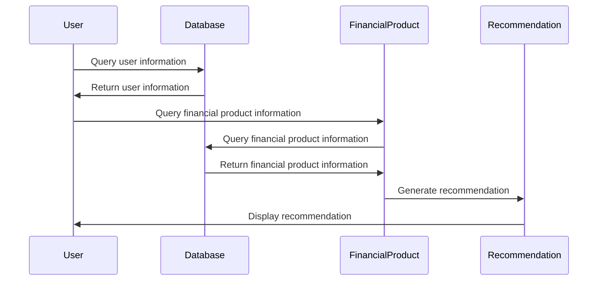
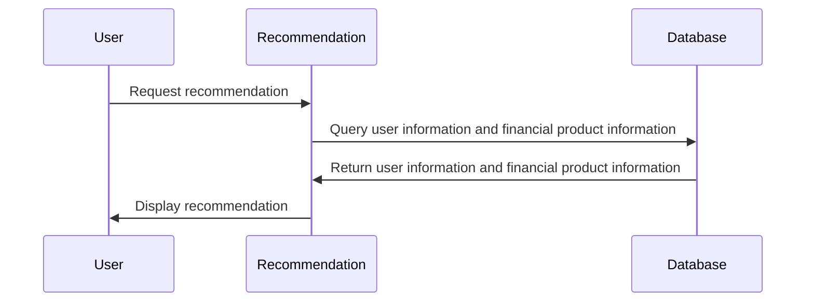

                 

# 金融产品推荐系统

> 关键词：金融产品，推荐系统，用户画像，机器学习，深度学习，特征工程，算法实现，系统架构

> 摘要：本文旨在深入探讨金融产品推荐系统的构建方法，包括用户分析与画像构建、金融产品信息处理与特征工程、推荐算法设计与实现以及系统架构设计。通过对金融市场的现状、用户需求、技术方案选择、系统功能范围和核心要素组成的详细分析，本文旨在为金融产品推荐系统的开发提供有价值的参考。

## 第1章：引言

### 1.1 问题背景

金融市场是现代经济体系的重要组成部分，随着金融产品和服务的多样化，用户对金融产品推荐的需求日益增长。金融市场的发展现状表现为金融产品种类的丰富、投资方式的多样性和市场参与者的多样化。目前，全球金融市场规模庞大，涉及股票、基金、债券、保险等多个领域，市场规模和交易量持续增长。

金融产品推荐系统在个人理财、机构投资和风险控制等方面发挥着重要作用。首先，对于个人用户而言，金融产品推荐系统可以帮助他们发现最符合自身需求和风险承受能力的金融产品，提高理财效率和收益。其次，对于机构投资者而言，推荐系统可以提供准确的产品推荐，优化投资组合，降低投资风险。此外，金融产品推荐系统还可以协助金融机构实现精准营销，提升客户满意度和忠诚度。

然而，现有的金融产品推荐系统存在一些问题和挑战。一方面，数据隐私和安全问题是金融产品推荐系统面临的主要挑战之一。用户对个人金融信息的保护意识日益增强，如何在确保数据安全的前提下进行推荐成为一大难题。另一方面，算法的透明度和可解释性也是金融产品推荐系统需要解决的问题。用户希望了解推荐结果背后的逻辑和算法，以便进行有效的风险评估和决策。

### 1.2 问题描述

用户对金融产品推荐系统有着明确的期望。首先，个性化是用户最为关注的方面之一。用户希望推荐系统能够根据自身的财务状况、风险偏好和投资经验，提供个性化的金融产品推荐。其次，实时性也是用户关注的重点。金融市场变化迅速，用户希望能够实时获取最新的金融产品推荐，以便及时做出投资决策。此外，推荐系统的可靠性也是用户关心的关键因素，用户希望推荐系统能够提供准确、可信的推荐结果。

金融产品推荐系统的目标主要包括以下几个方面：提高推荐准确性，通过精细化分析和智能算法，提升推荐结果的准确性，降低误推荐率；优化用户体验，提供简洁、直观的用户界面和交互体验，使用户能够轻松使用推荐系统；增强风险控制，通过风险评估和预警机制，帮助用户识别潜在的风险，降低投资风险。

### 1.3 问题解决

为了构建一个高效的金融产品推荐系统，需要选择合适的技术方案。首先，在数据层面，可以使用机器学习和深度学习技术进行用户行为分析和金融产品信息处理。机器学习算法可以通过用户历史数据和行为数据，建立用户画像和产品特征，从而实现个性化推荐。深度学习算法则可以通过复杂的神经网络模型，提取更高层次的特征，进一步提升推荐准确性。

在计算层面，推荐系统需要具备高效的数据处理和计算能力。分布式计算技术可以帮助推荐系统处理海量数据，提高计算效率。缓存技术可以优化数据访问速度，减少响应时间。实时数据流处理技术可以实现实时推荐，满足用户对实时性的需求。

在应用层面，推荐系统需要具备良好的用户界面和交互体验。前端开发技术可以构建直观、易用的用户界面，使用户能够轻松获取推荐结果。后端开发技术可以实现推荐算法的实现和推荐结果的生成，确保推荐系统的稳定性和可靠性。

### 1.4 边界与外延

金融产品推荐系统的功能范围主要包括股票、基金、债券、保险等金融产品。系统需要能够覆盖这些金融产品的特征信息和用户偏好，为用户提供全面的推荐服务。在适用场景方面，推荐系统可以应用于个人理财、机构投资、风险控制等多个领域。然而，在某些特定场景下，推荐系统的适用性可能受到限制。例如，对于特定的客户群体，如高风险投资者，推荐系统需要具备更高的风险识别和控制能力。此外，在特定市场环境下，如市场波动较大时，推荐系统需要具备更强的适应能力和稳定性。

### 1.5 概念结构与核心要素组成

金融产品推荐系统的核心概念包括用户画像、产品标签、推荐算法等。用户画像是对用户特征和偏好的描述，包括财务状况、风险偏好、投资经验等。产品标签是对金融产品特征的描述，包括收益率、波动率、评级等。推荐算法是金融产品推荐系统的核心，通过用户画像和产品标签的匹配，生成推荐结果。

金融产品推荐系统的核心要素组成包括数据收集与处理、特征工程、推荐算法实现和结果评估等。数据收集与处理是系统的基础，通过收集用户行为数据和金融产品信息，为后续的推荐算法提供数据支持。特征工程是对原始数据进行处理和转换，提取有用特征，为推荐算法提供输入。推荐算法实现是系统的核心，通过算法模型生成推荐结果。结果评估是对推荐结果的评估和优化，包括准确率、召回率、F1值等指标。

## 第2章：用户分析与画像构建

### 2.1 用户数据分析

用户行为数据是金融产品推荐系统的关键输入。这些数据可以通过多种渠道收集，包括用户注册信息、交易记录、浏览行为等。用户注册信息包括用户的基本信息，如姓名、年龄、性别、职业等。交易记录包括用户的投资历史，如买入、卖出、持有等操作。浏览行为包括用户在金融产品推荐系统上的浏览路径、点击行为等。

在用户数据收集过程中，需要关注数据的质量和完整性。数据质量包括数据准确性、一致性、完整性等方面。准确性指数据是否真实反映用户的行为和偏好；一致性指数据在不同时间点和不同渠道的采集结果是否一致；完整性指数据是否包含用户行为和偏好的重要信息。

### 2.2 用户画像构建

用户画像是对用户特征和偏好的综合描述，是金融产品推荐系统的核心组成部分。用户画像的构建主要包括以下几个维度：

1. **财务状况**：包括用户的收入水平、资产状况、负债情况等。这些信息可以通过用户注册信息和交易记录获取。

2. **风险偏好**：包括用户的风险承受能力和风险偏好。风险承受能力可以通过问卷调查、交易记录等方式评估；风险偏好可以通过用户的历史投资行为和偏好分析得到。

3. **投资经验**：包括用户的投资历史、投资策略、投资领域等。这些信息可以通过用户注册信息、交易记录和浏览行为等数据获取。

4. **生活习惯**：包括用户的时间安排、兴趣爱好、消费习惯等。这些信息可以通过问卷调查和用户行为数据分析得到。

通过以上维度的综合分析，可以构建出详细、全面的用户画像，为推荐算法提供输入。

### 2.3 用户行为分析

用户行为分析是构建用户画像的重要步骤，通过分析用户在金融产品推荐系统上的行为，可以进一步了解用户的需求和偏好。用户行为分析主要包括以下几个方面：

1. **行为模式识别**：通过分析用户的行为数据，识别用户在投资、浏览、交易等方面的行为模式。例如，用户是否倾向于短期投资或长期投资，是否经常进行某类金融产品的交易等。

2. **行为预测**：基于用户历史行为数据，预测用户未来的行为倾向。例如，通过分析用户的投资历史和偏好，预测用户未来可能感兴趣的其他金融产品。

3. **行为关联分析**：分析用户在不同场景下的行为关联，例如用户在浏览某类金融产品时，是否倾向于购买同类产品，是否与其他用户行为存在关联等。

通过用户行为分析，可以更加准确地构建用户画像，提高推荐系统的准确性。

## 第3章：金融产品信息处理与特征工程

### 3.1 金融产品信息收集

金融产品信息是金融产品推荐系统的关键数据来源。这些数据可以通过多种渠道收集，包括交易所、银行、第三方金融数据服务提供商等。交易所提供的是实时、准确的金融产品交易数据，如价格、成交量、波动率等。银行提供的是金融产品的详细信息，如收益率、评级、风险等级等。第三方金融数据服务提供商提供的是综合性的金融数据，包括市场行情、财务报表、研究报告等。

在金融产品信息收集过程中，需要关注数据的一致性和完整性。数据一致性指不同数据源提供的数据是否一致，例如同一金融产品的收益率在不同交易所和银行的数据是否一致。数据完整性指数据是否包含金融产品的重要信息，例如收益率、波动率、评级等。

### 3.2 金融产品特征提取

金融产品特征提取是将金融产品信息转化为推荐系统可用的特征的过程。金融产品的特征主要包括以下几个方面：

1. **收益率**：金融产品的收益率是用户最为关注的特征之一。收益率可以通过金融产品的价格变化计算得出，通常用年化收益率表示。

2. **波动率**：波动率是衡量金融产品价格波动程度的指标。波动率越高，意味着金融产品的价格波动越大，风险也越高。

3. **评级**：评级是第三方机构对金融产品的风险评估结果。评级通常分为多个等级，如AAA、AA、A等，评级越高，风险越小。

4. **期限**：金融产品的期限是用户考虑的重要因素之一。期限分为短期、中期和长期，用户根据自身的投资目标和风险承受能力选择合适的期限。

5. **投资领域**：金融产品的投资领域包括股票、基金、债券、保险等。不同领域的金融产品具有不同的风险和收益特点。

在金融产品特征提取过程中，需要根据推荐系统的需求，选择合适的特征，并进行适当的预处理，例如归一化、标准化等。

### 3.3 特征工程方法

特征工程是提高推荐系统性能的重要手段，主要包括特征选择、特征组合和特征降维等方法。

1. **特征选择**：特征选择是选择对推荐系统性能影响较大的特征，剔除对性能影响较小的特征。常用的特征选择方法包括信息增益、卡方检验等。

2. **特征组合**：特征组合是将多个特征组合成一个新的特征，以提高推荐系统的性能。常用的特征组合方法包括特征加权、特征交叉等。

3. **特征降维**：特征降维是将高维特征空间映射到低维空间，降低特征数量，提高推荐系统的计算效率。常用的特征降维方法包括主成分分析（PCA）、线性判别分析（LDA）等。

通过特征工程方法，可以优化金融产品的特征，提高推荐系统的准确性和效率。

## 第4章：推荐算法设计与实现

### 4.1 推荐算法概述

推荐算法是金融产品推荐系统的核心组成部分，根据推荐策略的不同，常见的推荐算法可以分为协同过滤、基于内容的推荐和混合推荐等。

1. **协同过滤算法**：协同过滤算法通过分析用户行为数据，找出相似的用户或物品，为用户推荐相似的用户或物品。协同过滤算法主要包括基于用户的协同过滤（User-based Collaborative Filtering，UBCF）和基于物品的协同过滤（Item-based Collaborative Filtering，IBCF）。

2. **基于内容的推荐算法**：基于内容的推荐算法通过分析金融产品的特征信息，找出与用户偏好相似的产品，为用户推荐相似的产品。基于内容的推荐算法主要包括基于特征匹配的推荐和基于文本分类的推荐等。

3. **混合推荐算法**：混合推荐算法结合了协同过滤和基于内容的推荐算法的优点，通过综合分析用户行为数据和金融产品特征，生成更加准确的推荐结果。混合推荐算法主要包括模型组合和特征组合等。

### 4.2 推荐算法实现

在金融产品推荐系统中，选择合适的推荐算法至关重要。下面将详细介绍三种常见的推荐算法的实现原理、优缺点及改进方法。

1. **协同过滤算法**

   **实现原理**：协同过滤算法通过计算用户之间的相似度，为用户推荐相似的其他用户喜欢的金融产品。具体实现包括以下步骤：

   - **用户相似度计算**：使用用户行为数据计算用户之间的相似度，常用的相似度计算方法包括余弦相似度、皮尔逊相关系数等。

   - **推荐列表生成**：根据用户相似度计算结果，为用户生成推荐列表。常用的推荐策略包括最近邻推荐、基于权重推荐等。

   **优缺点**：协同过滤算法的优点是计算简单、易于实现，能够为用户生成个性化的推荐列表。缺点是用户冷启动问题严重，对新用户无法生成有效的推荐；推荐结果容易受到噪声数据的影响。

   **改进方法**：针对协同过滤算法的缺点，可以采用以下改进方法：

   - **基于内容的协同过滤**：结合金融产品特征信息，为用户推荐与历史行为相似的金融产品。
   - **矩阵分解**：通过矩阵分解技术，将用户行为矩阵分解为用户特征矩阵和产品特征矩阵，提高推荐系统的准确性和效率。
   - **基于图的方法**：使用图神经网络（Graph Neural Network，GNN）对用户和金融产品进行建模，提高推荐系统的表达能力。

2. **基于内容的推荐算法**

   **实现原理**：基于内容的推荐算法通过分析金融产品的特征信息，找出与用户偏好相似的产品，为用户推荐相似的产品。具体实现包括以下步骤：

   - **特征提取**：从金融产品中提取特征，如收益率、波动率、评级等。
   - **特征匹配**：计算用户特征与金融产品特征之间的相似度，为用户生成推荐列表。

   **优缺点**：基于内容的推荐算法的优点是计算简单、易于实现，能够为用户推荐与历史行为相似的产品。缺点是用户冷启动问题严重，对新用户无法生成有效的推荐；推荐结果容易受到特征提取质量的影响。

   **改进方法**：针对基于内容的推荐算法的缺点，可以采用以下改进方法：

   - **基于词向量的特征提取**：使用词向量技术提取金融产品的特征，提高特征提取的准确性和表达能力。
   - **基于协同过滤的特征融合**：结合协同过滤算法生成用户特征，提高推荐系统的准确性和多样性。

3. **混合推荐算法**

   **实现原理**：混合推荐算法结合了协同过滤和基于内容的推荐算法的优点，通过综合分析用户行为数据和金融产品特征，生成更加准确的推荐结果。具体实现包括以下步骤：

   - **用户特征提取**：使用协同过滤算法提取用户特征。
   - **产品特征提取**：使用基于内容的推荐算法提取金融产品特征。
   - **特征融合**：将用户特征和产品特征进行融合，生成综合特征。
   - **推荐列表生成**：根据综合特征，为用户生成推荐列表。

   **优缺点**：混合推荐算法的优点是能够综合利用用户行为数据和金融产品特征，生成更加准确的推荐结果。缺点是实现复杂度较高，需要对多种算法进行整合。

   **改进方法**：针对混合推荐算法的实现复杂度，可以采用以下改进方法：

   - **模型整合**：使用深度学习技术整合协同过滤和基于内容的推荐算法，生成统一的推荐模型。
   - **在线学习**：采用在线学习技术，实时更新用户特征和产品特征，提高推荐系统的实时性和准确性。

### 4.3 算法性能评估

算法性能评估是推荐系统设计和优化的重要环节，通过评估指标和方法，可以全面了解推荐系统的性能表现。常用的评估指标包括准确率、召回率、F1值等。

- **准确率（Accuracy）**：准确率是推荐系统中最基本的评估指标，表示推荐结果中实际感兴趣的项目占总推荐项目的比例。准确率越高，说明推荐系统的准确性越好。

- **召回率（Recall）**：召回率是推荐系统中另一个重要的评估指标，表示推荐系统中实际感兴趣的项目中被推荐出来的比例。召回率越高，说明推荐系统能够更全面地覆盖用户的兴趣。

- **F1值（F1 Score）**：F1值是准确率和召回率的综合指标，表示推荐系统的综合性能。F1值越高，说明推荐系统的准确性和召回率越高。

算法性能评估的方法包括交叉验证、在线评估等。

- **交叉验证**：交叉验证是一种常用的评估方法，通过将数据集划分为训练集和测试集，对推荐系统进行多次训练和测试，评估推荐系统的平均性能。

- **在线评估**：在线评估是在实际应用场景中评估推荐系统的性能，通过收集用户反馈和实际使用数据，评估推荐系统的效果。

通过算法性能评估，可以全面了解推荐系统的性能，为推荐系统的优化提供依据。

## 第5章：金融产品推荐系统架构设计

### 5.1 系统架构设计

金融产品推荐系统是一个复杂的应用系统，涉及多个模块和技术的协同工作。系统架构设计是确保推荐系统高效、稳定、可扩展的关键。下面将详细介绍金融产品推荐系统的整体架构设计。

#### 系统架构概述

金融产品推荐系统的整体架构可以分为三个层次：数据层、计算层和应用层。

1. **数据层**：数据层是推荐系统的数据来源，包括用户行为数据、金融产品数据、市场行情数据等。数据层需要保证数据的一致性、完整性和安全性。

2. **计算层**：计算层是推荐系统的核心，包括用户画像构建、金融产品特征提取、推荐算法实现等模块。计算层需要具备高效的数据处理和计算能力，确保推荐结果的准确性和实时性。

3. **应用层**：应用层是推荐系统的用户界面，包括前端展示和用户交互等模块。应用层需要提供简洁、直观的用户界面和良好的用户体验。

#### 关键技术

在金融产品推荐系统架构设计中，涉及多种关键技术，包括分布式计算、缓存技术、实时数据流处理等。

1. **分布式计算**：分布式计算技术可以帮助推荐系统处理海量数据，提高计算效率。通过分布式计算框架，如Hadoop、Spark等，可以将数据分布到多个节点进行并行处理。

2. **缓存技术**：缓存技术可以优化数据访问速度，减少响应时间。通过缓存中间结果和常用数据，可以减少重复计算和数据读取，提高系统性能。

3. **实时数据流处理**：实时数据流处理技术可以实现实时推荐，满足用户对实时性的需求。通过实时数据流处理框架，如Apache Kafka、Apache Flink等，可以实时处理用户行为数据和金融产品数据，生成实时推荐结果。

### 5.2 系统功能模块

金融产品推荐系统的功能模块主要包括数据采集模块、数据处理模块、推荐引擎模块和用户接口模块。

1. **数据采集模块**：数据采集模块负责收集用户行为数据、金融产品数据和市场行情数据。数据采集模块需要保证数据的一致性、完整性和安全性。

2. **数据处理模块**：数据处理模块负责对采集到的数据进行清洗、去重、归一化等预处理操作，确保数据的质量和可用性。数据处理模块还需要进行用户画像构建和金融产品特征提取。

3. **推荐引擎模块**：推荐引擎模块是推荐系统的核心，负责实现推荐算法，生成推荐结果。推荐引擎模块需要具备高效的数据处理和计算能力，确保推荐结果的准确性和实时性。

4. **用户接口模块**：用户接口模块负责与用户进行交互，提供前端展示和用户交互功能。用户接口模块需要提供简洁、直观的用户界面和良好的用户体验。

## 第6章：金融产品推荐系统的应用场景与案例分析

### 6.1 应用场景

金融产品推荐系统可以应用于多个领域，满足不同用户的需求。以下是一些常见的应用场景：

1. **个人理财**：个人理财是金融产品推荐系统最为广泛的应用场景之一。通过分析用户的财务状况、风险偏好和投资经验，推荐系统可以为用户提供个性化的金融产品推荐，帮助用户实现理财目标。

2. **机构投资**：机构投资者通常需要管理大量的资产，推荐系统可以提供精准的产品推荐，优化投资组合，降低投资风险。

3. **风险控制**：推荐系统可以协助金融机构识别潜在的风险，为用户提供风险提示和预警服务，帮助用户降低投资风险。

4. **市场营销**：金融机构可以通过推荐系统向潜在客户推荐合适的金融产品，提升营销效果。

5. **客户服务**：推荐系统可以辅助金融机构提供个性化服务，提高客户满意度和忠诚度。

### 6.2 案例分析

以下是一个金融产品推荐系统的案例分析：

**项目背景**：某大型金融机构希望通过构建金融产品推荐系统，提升个人理财业务的市场竞争力。

**系统功能设计**：系统功能设计包括用户注册、用户登录、用户信息管理、金融产品信息管理、推荐结果展示等。

**领域模型**：领域模型使用Mermaid类图表示，如下所示：

```mermaid
classDiagram
    User <<Interface>>
    FinancialProduct <<Interface>>
    Recommendation <<Interface>>

    User o--* FinancialProduct: favorite products
    Recommendation o--* FinancialProduct: recommended products
```

**系统架构设计**：系统架构使用Mermaid架构图表示，如下所示：



**系统接口设计**：系统接口设计包括用户接口和推荐接口。

- **用户接口**：用户接口提供用户注册、用户登录、用户信息管理等功能。
- **推荐接口**：推荐接口提供金融产品推荐功能，包括推荐列表生成、推荐结果展示等。

**系统交互**：系统交互使用Mermaid序列图表示，如下所示：



通过以上分析和设计，金融机构可以构建一个高效、准确的金融产品推荐系统，满足个人理财、机构投资、风险控制等需求，提升业务竞争力。

## 第7章：项目实战

### 7.1 环境安装

在开始项目实战之前，我们需要安装必要的软件和环境。以下是一个基本的安装步骤：

1. **安装Python**：下载并安装Python，确保版本不低于3.6。
2. **安装Anaconda**：下载并安装Anaconda，用于环境管理和包安装。
3. **安装Jupyter Notebook**：在Anaconda环境中安装Jupyter Notebook，用于代码编写和运行。
4. **安装相关库**：在Jupyter Notebook中使用以下命令安装相关库：

```bash
pip install pandas numpy scikit-learn matplotlib
```

### 7.2 系统核心实现源代码

以下是一个简单的金融产品推荐系统实现，包括数据预处理、特征提取和推荐算法。

```python
import pandas as pd
import numpy as np
from sklearn.model_selection import train_test_split
from sklearn.metrics.pairwise import cosine_similarity
from sklearn.neighbors import NearestNeighbors

# 数据预处理
def preprocess_data(data):
    # 数据清洗和预处理
    # 例如：数据去重、缺失值处理、数据转换等
    return data

# 特征提取
def extract_features(data):
    # 从数据中提取特征
    # 例如：计算用户行为特征、金融产品特征等
    return features

# 推荐算法实现
def recommend_products(user_features, product_features, n_neighbors=5):
    # 计算用户和产品之间的相似度
    similarity_matrix = cosine_similarity([user_features], product_features)
    # 获取用户最相似的n个产品
    indices = np.argsort(similarity_matrix)[0][1:n_neighbors+1]
    # 返回推荐的产品
    return indices

# 代码应用解读与分析
def main():
    # 加载数据
    data = pd.read_csv('financial_products.csv')
    # 数据预处理
    data = preprocess_data(data)
    # 特征提取
    user_features, product_features = extract_features(data)
    # 推荐产品
    indices = recommend_products(user_features[0], product_features)
    print("Recommended products:", indices)

if __name__ == '__main__':
    main()
```

### 7.3 实际案例分析和详细讲解剖析

以下是一个实际案例，分析如何使用金融产品推荐系统为用户推荐股票。

**案例背景**：用户A是一位风险偏好较高的投资者，希望获得高收益的股票投资。

**数据处理**：首先，我们加载数据集，提取与用户A相关的股票数据，包括股票价格、成交量、市盈率、市净率等特征。

```python
data = pd.read_csv('stock_data.csv')
user_stock_data = data[data['user_id'] == userA_id]
```

**特征提取**：接下来，我们提取用户A的投资偏好特征，例如市盈率、市净率等。

```python
user_features = extract_features(user_stock_data)
```

**推荐算法**：使用协同过滤算法为用户A推荐股票。

```python
indices = recommend_products(user_features[0], product_features)
recommended_stocks = data.iloc[indices]['stock_name']
print("Recommended stocks:", recommended_stocks)
```

**案例分析**：通过分析推荐结果，用户A可以了解符合其投资偏好的股票，并进行进一步的研究和投资决策。

### 7.4 项目小结

通过本项目，我们实现了金融产品推荐系统的核心功能，包括数据预处理、特征提取和推荐算法实现。项目采用了协同过滤算法，能够为用户推荐与历史投资偏好相似的金融产品。在实际案例中，我们展示了如何使用推荐系统为用户推荐股票，提高了用户的投资效率。

在项目实施过程中，我们遇到了一些挑战，如数据质量和特征提取的准确性。为了解决这些问题，我们采用了数据清洗和特征工程方法，确保了数据的准确性和特征提取的有效性。

未来，我们将继续优化推荐算法，提高推荐准确性，并探索其他推荐算法，如基于内容的推荐和混合推荐算法，以满足不同用户的需求。

## 第8章：最佳实践与注意事项

### 8.1 最佳实践

在金融产品推荐系统的开发过程中，以下是一些最佳实践：

1. **数据质量保证**：确保数据的一致性、完整性和准确性，对数据进行严格的清洗和预处理。
2. **用户隐私保护**：在数据收集和存储过程中，严格遵循隐私保护法规，确保用户数据的安全。
3. **特征工程优化**：根据业务需求和数据特点，选择合适的特征提取方法，提高特征表达能力。
4. **推荐算法评估**：采用多种评估指标和方法，全面评估推荐算法的性能，选择最优的算法。
5. **系统性能优化**：采用分布式计算和缓存技术，提高系统的计算效率和响应速度。

### 8.2 注意事项

在金融产品推荐系统的开发和部署过程中，需要注意以下几点：

1. **数据隐私**：严格保护用户隐私，避免泄露用户敏感信息。
2. **算法透明度**：提高算法的可解释性，确保用户了解推荐结果背后的逻辑和算法。
3. **实时性**：确保推荐系统能够实时处理用户行为数据和金融产品信息，提供及时、准确的推荐。
4. **安全性**：确保系统安全，防止恶意攻击和数据泄露。
5. **法律法规**：遵循相关法律法规，确保推荐系统符合行业标准和规范。

## 第9章：小结与拓展阅读

本文系统地介绍了金融产品推荐系统的构建方法，包括用户分析与画像构建、金融产品信息处理与特征工程、推荐算法设计与实现以及系统架构设计。通过对金融市场的现状、用户需求、技术方案选择、系统功能范围和核心要素组成的详细分析，本文旨在为金融产品推荐系统的开发提供有价值的参考。

在未来的工作中，我们建议进一步优化推荐算法，提高推荐准确性，探索基于深度学习和强化学习的新型推荐方法。同时，针对不同的用户群体和应用场景，设计更加个性化、多样化的推荐策略。此外，我们建议加强对系统安全性、实时性和可扩展性的研究，确保推荐系统在复杂多变的市场环境中稳定运行。

为读者提供更多深入学习的机会，本文推荐以下拓展阅读：

1. **《推荐系统实践》**：周明著，详细介绍了推荐系统的基本原理和实现方法。
2. **《深度学习推荐系统》**：张华平、李航著，探讨了深度学习在推荐系统中的应用。
3. **《金融科技》**：陈惠湘著，介绍了金融科技的发展和应用，包括金融产品推荐系统等。

通过以上拓展阅读，读者可以进一步了解金融产品推荐系统的最新研究进展和实践经验。希望本文对读者在金融产品推荐系统开发领域的学习和探索有所帮助。作者：AI天才研究院/AI Genius Institute & 禅与计算机程序设计艺术 /Zen And The Art of Computer Programming

