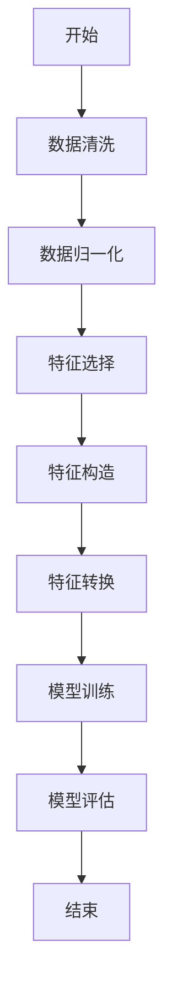
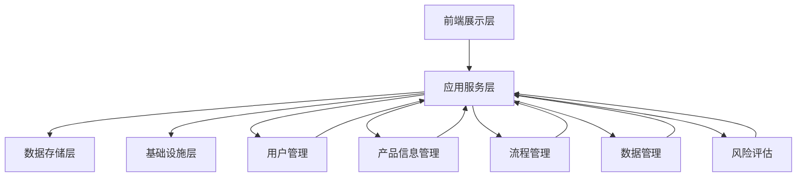

                 

### 目录大纲设计思路

在设计《金融产品生命周期管理平台》的目录大纲时，我们需遵循以下几点原则和思路：

1. **明确书籍主题**：首先，我们需要明确书籍的核心主题是关于“金融产品生命周期管理平台”的构建、运作与管理。因此，目录大纲的设计将围绕这一主题展开。

2. **逻辑清晰、层次分明**：为了确保读者能够顺畅地阅读和学习，目录大纲需保持逻辑清晰，层次分明。我们将采用从宏观到微观、从理论到实践的顺序来组织章节内容。

3. **内容完整性**：目录大纲应包括核心章节，如背景介绍、核心概念与联系、算法原理讲解、系统分析与架构设计方案、项目实战等。同时，各章节的内容要完整、深入，确保能够覆盖主题的各个方面。

4. **简洁性**：在保证内容完整性的同时，我们需确保输出内容的简洁性，避免出现多余的废话。

5. **Markdown格式**：目录大纲将以Markdown格式呈现，使用不同的标记符号来区分章节层级。

### 目录大纲结构

基于上述原则，我们可以将《金融产品生命周期管理平台》的目录大纲分为以下几个部分：

1. **引言**：简要介绍书籍的背景、目的和结构。

2. **背景介绍**：阐述金融产品生命周期管理平台的发展历程、现状与重要性。

3. **核心概念与联系**：介绍金融产品生命周期管理的核心概念，并绘制ER实体关系图。

4. **算法原理讲解**：讲解平台中涉及的关键算法原理，使用mermaid流程图和Python代码进行详细阐述。

5. **系统分析与架构设计方案**：分析平台的功能需求，介绍系统架构、接口设计和交互流程。

6. **项目实战**：通过实际项目案例展示平台的应用，提供环境安装、核心实现源代码和案例解析。

7. **最佳实践与小结**：总结平台建设过程中的最佳实践，并给出注意事项和拓展阅读建议。

### 目录大纲示例

```markdown
----------------------------------------------------------------
# 《金融产品生命周期管理平台》目录大纲

## 第1章 引言
### 1.1 书籍背景与目的
### 1.2 内容结构

## 第2章 背景介绍
### 2.1 金融产品生命周期管理发展历程
### 2.2 当前金融产品生命周期管理平台现状
### 2.3 金融产品生命周期管理平台的重要性

## 第3章 核心概念与联系
### 3.1 金融产品生命周期管理核心概念
### 3.2 ER实体关系图

## 第4章 算法原理讲解
### 4.1 数据预处理算法原理
#### 4.1.1 数据清洗
#### 4.1.2 数据归一化
### 4.2 机器学习算法原理
#### 4.2.1 决策树
#### 4.2.2 支持向量机
### 4.3 算法mermaid流程图
### 4.4 Python代码详解

## 第5章 系统分析与架构设计方案
### 5.1 平台功能需求分析
### 5.2 系统架构设计
### 5.3 系统接口设计
### 5.4 系统交互流程

## 第6章 项目实战
### 6.1 环境安装
### 6.2 核心实现源代码
### 6.3 代码应用解读与分析
### 6.4 实际案例分析与详细讲解
### 6.5 项目小结

## 第7章 最佳实践与小结
### 7.1 平台建设最佳实践
### 7.2 注意事项
### 7.3 拓展阅读

----------------------------------------------------------------
```

### 总结

通过以上目录大纲的设计，我们确保了内容的完整性、逻辑清晰性、层次分明性以及简洁性。每个章节都涵盖了金融产品生命周期管理平台的核心内容，从背景介绍到算法原理讲解，再到系统分析与项目实战，为读者提供了一个全面、深入的学习路径。目录大纲的Markdown格式便于后续内容的编写和排版。

---

### 金融产品生命周期管理平台：引言

#### 书籍背景与目的

金融产品生命周期管理平台是一种集成了多种功能模块的技术解决方案，旨在帮助金融机构全面、高效地管理金融产品的整个生命周期。从产品构思、设计、开发、测试、上线、运营到最终退出市场，每个阶段都需要进行精细化管理。随着金融科技的不断发展，如何借助先进的技术手段优化金融产品的生命周期管理，已经成为金融机构提升竞争力、提高运营效率的关键课题。

本书旨在为金融科技从业者、研究人员和高校学生提供一个全面、系统、深入的技术指南，帮助他们了解金融产品生命周期管理平台的基本概念、核心算法原理、系统架构设计以及实际应用案例。通过本书的阅读，读者将能够：

1. **掌握金融产品生命周期管理平台的基本概念和框架**。
2. **了解平台中涉及的关键算法原理和应用**。
3. **熟悉系统分析与架构设计的方法和技巧**。
4. **通过实际项目案例了解平台的建设和运行过程**。
5. **获取金融产品生命周期管理平台建设过程中的最佳实践和注意事项**。

#### 内容结构

本书分为七个主要章节，每个章节都针对不同的主题进行详细探讨：

1. **引言**：简要介绍书籍的背景、目的和结构。
   
2. **背景介绍**：阐述金融产品生命周期管理平台的发展历程、现状与重要性。

3. **核心概念与联系**：介绍金融产品生命周期管理的核心概念，并绘制ER实体关系图。

4. **算法原理讲解**：讲解平台中涉及的关键算法原理，使用mermaid流程图和Python代码进行详细阐述。

5. **系统分析与架构设计方案**：分析平台的功能需求，介绍系统架构、接口设计和交互流程。

6. **项目实战**：通过实际项目案例展示平台的应用，提供环境安装、核心实现源代码和案例解析。

7. **最佳实践与小结**：总结平台建设过程中的最佳实践，并给出注意事项和拓展阅读建议。

#### 预期读者

本书的预期读者主要包括以下几类人群：

1. **金融科技从业者**：从事金融产品开发、管理和技术支持的相关人员。
2. **金融研究人员**：对金融产品生命周期管理感兴趣，希望了解相关技术原理和实现方法的研究人员。
3. **高校学生**：计算机科学、金融学等相关专业的本科生和研究生，希望了解金融科技领域的实际应用。
4. **技术爱好者**：对金融产品生命周期管理平台感兴趣，希望深入了解相关技术细节的个人。

通过本书的阅读，读者将能够系统地掌握金融产品生命周期管理平台的相关知识，为实际工作或研究提供有力支持。

---

### 背景介绍

#### 金融产品生命周期管理平台的发展历程

金融产品生命周期管理平台的发展可以追溯到20世纪末和21世纪初。当时，随着金融市场的快速发展和金融产品的多样化，金融机构开始意识到对金融产品生命周期进行系统管理的重要性。这一时期，大部分金融机构采用的是分散式管理方式，即各部门独立进行产品管理，缺乏统一的平台来协调和整合各个环节。这种管理方式不仅效率低下，而且容易导致信息孤岛和数据不一致的问题。

随着计算机技术和互联网的普及，21世纪初，一些金融机构开始尝试引入专门的产品生命周期管理（Product Lifecycle Management, PLM）系统来优化产品管理流程。这些系统通常包括产品设计、开发、测试、上线和运营等模块，旨在提供一站式解决方案，提升产品管理的效率和一致性。

进入21世纪第二个十年，随着大数据、云计算和人工智能等新兴技术的快速发展，金融产品生命周期管理平台得到了进一步升级和优化。金融机构开始利用大数据技术对市场进行实时监控和分析，借助云计算实现高效的数据存储和处理，通过人工智能技术进行智能预测和决策。这些技术的引入，使得金融产品生命周期管理平台具备了更强大的数据处理能力和智能分析能力，能够更精准地把握市场动态，优化产品策略。

#### 当前金融产品生命周期管理平台的现状

当前，金融产品生命周期管理平台已经成为金融机构的核心系统之一，其应用范围涵盖了银行、证券、保险等多个金融领域。以下是一些典型的现状：

1. **产品多样化**：随着金融创新不断推进，金融机构推出的金融产品种类繁多，包括理财产品、投资产品、保险产品等。产品生命周期管理平台需要能够支持各种类型产品的管理，并提供灵活的配置和定制功能。

2. **数据驱动的管理**：金融机构越来越依赖数据来支持产品决策。生命周期管理平台集成了大量数据采集、存储、分析和展示功能，能够实时获取市场动态、客户行为和产品表现等关键数据，为产品管理提供数据支持。

3. **智能化的产品策略**：通过人工智能和机器学习技术，生命周期管理平台能够对产品进行智能预测和优化。例如，根据客户的行为数据和风险偏好，平台可以推荐合适的金融产品，并自动调整产品策略。

4. **跨部门协同**：金融产品生命周期管理涉及到多个部门的协同工作，包括产品部、研发部、市场部、风险控制部等。生命周期管理平台需要能够提供统一的接口和协作工具，确保各部门之间的信息流通和高效合作。

5. **合规性和风险控制**：随着金融监管政策的日益严格，合规性和风险控制成为金融产品生命周期管理的重要环节。平台需要能够满足监管要求，提供合规性检查和风险预警功能，确保产品管理的合法性和安全性。

#### 金融产品生命周期管理平台的重要性

金融产品生命周期管理平台对金融机构的运营和竞争力具有显著的影响：

1. **提升效率**：通过统一的平台和自动化流程，可以大幅提高产品管理的效率和一致性，减少人工操作的错误和重复工作。

2. **降低成本**：智能化的管理方式可以减少人工干预，降低运营成本。同时，通过大数据分析和预测，可以更精准地进行市场定位和产品定价，提高市场竞争力。

3. **增强客户体验**：通过个性化的产品推荐和及时的风险预警，可以提升客户体验，增强客户粘性和忠诚度。

4. **合规性和风险管理**：确保产品管理的合规性和安全性，降低法律和财务风险。

5. **支持金融创新**：灵活的平台架构和智能化的功能，可以快速响应市场变化和客户需求，支持金融机构的金融产品创新。

总之，金融产品生命周期管理平台是金融机构数字化转型的重要一环，对于提升运营效率、增强市场竞争力和实现可持续发展具有重要意义。

---

### 核心概念与联系

#### 金融产品生命周期管理核心概念

金融产品生命周期管理涉及到多个关键概念，这些概念是理解和管理金融产品各个阶段的基础。以下是这些核心概念及其简要说明：

1. **产品构思（Concept）**：指金融产品从构想到形成的阶段，包括市场研究、需求分析、初步设计和可行性研究等。

2. **产品设计（Design）**：在产品构思基础上，进行详细的产品设计和规划，包括功能定义、技术方案选择、风险评估等。

3. **开发（Development）**：根据产品设计，进行实际的软件编码和系统集成，包括需求分析、系统设计、编码实现、单元测试等。

4. **测试（Testing）**：对开发完成的金融产品进行全面测试，确保产品满足功能和性能要求，包括功能测试、性能测试、安全测试等。

5. **上线（Deployment）**：将测试通过的产品部署到生产环境，使其可供用户使用。

6. **运营（Operations）**：产品上线后，对其进行持续监控和维护，确保其正常运行和高效使用。

7. **优化（Optimization）**：根据运营数据和市场反馈，对产品进行持续优化和改进，提升用户体验和市场表现。

8. **退出（Exit）**：产品达到其生命周期终点，可能因市场饱和、技术落后或其他原因退出市场。

#### 概念属性特征对比表格

为了更清晰地理解这些核心概念，我们可以通过一个对比表格来展示它们的主要属性特征：

| 概念名称 | 定义 | 主要属性特征 | 作用 |
| --- | --- | --- | --- |
| 产品构思 | 金融产品的初步构想和设计 | 创新性、市场需求分析、可行性研究 | 确定产品方向和目标 |
| 产品设计 | 对产品的功能、技术方案进行详细规划 | 功能性、技术可行性、风险评估 | 确保产品实现基础 |
| 开发 | 实现产品设计和规划的软件编码和系统集成 | 编码规范、集成测试、功能实现 | 构建产品核心 |
| 测试 | 对开发完成的金融产品进行全面测试 | 功能测试、性能测试、安全测试 | 确保产品质量 |
| 上线 | 将测试通过的产品部署到生产环境 | 系统集成、部署配置、用户培训 | 确保产品可用性 |
| 运营 | 对上线后的产品进行监控和维护 | 系统监控、用户反馈、持续优化 | 提升用户体验 |
| 优化 | 根据数据反馈对产品进行持续改进 | 数据分析、用户体验改进、市场定位 | 提升产品竞争力 |
| 退出 | 产品生命周期结束，退出市场 | 市场饱和、技术淘汰、战略调整 | 资源合理配置 |

#### ER实体关系图

为了更好地展示金融产品生命周期管理中各个实体之间的关系，我们可以通过一个ER（实体关系）图来表示。以下是ER图的Markdown格式表示：

```mermaid
erDiagram
  Product --> ProductConcept
  Product --> ProductDesign
  Product --> Development
  Product --> Testing
  Product --> Deployment
  Product --> Operations
  Product --> Optimization
  Product --> Exit

  ProductConcept ||--|{ 产品构思 }
  ProductDesign ||--|{ 产品设计 }
  Development ||--|{ 开发 }
  Testing ||--|{ 测试 }
  Deployment ||--|{ 上线 }
  Operations ||--|{ 运营 }
  Optimization ||--|{ 优化 }
  Exit ||--|{ 退出 }
```

在ER图中，每个实体代表金融产品生命周期中的一个阶段，实线箭头表示实体之间的关联关系。例如，产品构思是产品设计的输入，开发是基于设计的结果，测试是开发完成后的重要环节，依次类推。

#### 概念结构与核心要素组成

金融产品生命周期管理平台的核心要素包括：

1. **数据管理**：确保产品生命周期中所有数据的准确、完整和一致性，为分析和决策提供基础。
2. **流程管理**：定义和自动化产品生命周期的各个阶段流程，确保流程的规范和高效执行。
3. **风险控制**：在产品生命周期的各个阶段实施风险管理策略，确保产品的合规性和安全性。
4. **用户管理**：管理产品用户信息，提供用户权限控制，确保系统的安全性和用户体验。
5. **监控与报告**：实时监控产品状态，生成报告，为管理层提供决策支持。

通过这些核心要素的有机整合，金融产品生命周期管理平台能够实现对金融产品的全生命周期管理，从而提升金融机构的运营效率和竞争力。

---

### 算法原理讲解

#### 数据预处理算法原理

在金融产品生命周期管理平台中，数据预处理是关键的一步，它决定了后续分析和预测的质量。数据预处理包括数据清洗、数据归一化和特征工程等步骤。

1. **数据清洗**

数据清洗是指对原始数据进行清洗和整理，以消除错误、缺失和不一致的数据。具体步骤如下：

- **错误值处理**：识别和处理数据中的错误值，如异常值、逻辑错误等。
- **缺失值处理**：根据数据的重要性和分布情况，选择适当的缺失值填补方法，如平均值填补、插值法、使用其他变量预测缺失值等。
- **不一致数据处理**：统一数据格式，如日期格式的规范化，字符串大小写的统一等。

```python
import pandas as pd

# 示例数据
data = pd.read_csv('financial_data.csv')

# 错误值处理
data[data < 0] = data[data > 0]

# 缺失值处理
data['missing_value'] = data['missing_value'].fillna(data['other_value'])

# 不一致数据处理
data['date'] = pd.to_datetime(data['date'], format='%Y-%m-%d')
data['date'] = data['date'].dt.strftime('%Y-%m-%d')
```

2. **数据归一化**

数据归一化是将不同特征的数据转换为同一量级，以便于后续分析和计算。常用的归一化方法包括最小-最大归一化和标准归一化。

- **最小-最大归一化**：将数据映射到[0, 1]范围内。

```python
from sklearn.preprocessing import MinMaxScaler

scaler = MinMaxScaler()
normalized_data = scaler.fit_transform(data)
```

- **标准归一化**：将数据转换为均值0、标准差1的正态分布。

```python
from sklearn.preprocessing import StandardScaler

scaler = StandardScaler()
normalized_data = scaler.fit_transform(data)
```

3. **特征工程**

特征工程是指通过选择、构造和转换特征，以提高模型的性能和解释性。具体方法包括：

- **特征选择**：使用统计方法、信息增益等方法筛选出对模型有用的特征。
- **特征构造**：通过组合现有特征、构建新的特征，如时序特征、交叉特征等。
- **特征转换**：将离散特征转换为连续特征，或将数值特征转换为类别特征。

```python
from sklearn.feature_selection import SelectKBest
from sklearn.feature_selection import f_classif

# 特征选择
selector = SelectKBest(f_classif, k=5)
selected_features = selector.fit_transform(data, target)

# 特征构造
data['new_feature'] = data['feature1'] * data['feature2']

# 特征转换
data['category_feature'] = data['numeric_feature'].astype('category')
```

#### 机器学习算法原理

金融产品生命周期管理平台中，常用的机器学习算法包括决策树、支持向量机等。以下分别介绍这些算法的基本原理。

1. **决策树**

决策树是一种基于树形结构进行决策的算法，通过连续地对特征进行划分，生成一棵树来表示决策过程。

- **基本原理**：决策树从根节点开始，对数据进行划分，每个节点表示一个特征，每个分支表示该特征的不同取值。叶子节点表示决策结果。

- **公式**：

$$
Gini = 1 - \sum_{i=1}^{n} \left( \frac{1}{n} \right) ^ 2
$$

其中，$n$为样本总数，$i$为类别数。

- **Python实现**：

```python
from sklearn.tree import DecisionTreeClassifier

clf = DecisionTreeClassifier(criterion='gini')
clf.fit(X_train, y_train)
```

2. **支持向量机**

支持向量机（SVM）是一种分类算法，通过找到一个最佳的超平面，将不同类别的数据点分开。

- **基本原理**：SVM通过最大化分类边界，将数据点划分为不同的类别。

- **公式**：

$$
w^* = \arg\min_{w, b} \frac{1}{2} ||w||^2 + C \sum_{i=1}^{n} \max(0, 1 - y_i ( \langle w, x_i \rangle + b))
$$

其中，$w$为权重向量，$b$为偏置项，$C$为惩罚参数。

- **Python实现**：

```python
from sklearn.svm import SVC

clf = SVC(kernel='linear')
clf.fit(X_train, y_train)
```

#### 算法mermaid流程图

为了更直观地展示算法的工作流程，我们可以使用mermaid绘制算法的流程图。



通过这个流程图，我们可以清晰地看到从数据预处理到模型训练和评估的整个过程。

#### Python代码详解

以下是一个简单的Python代码示例，展示了如何使用决策树和支持向量机进行模型训练和预测。

```python
import pandas as pd
from sklearn.model_selection import train_test_split
from sklearn.tree import DecisionTreeClassifier
from sklearn.svm import SVC

# 读取数据
data = pd.read_csv('financial_data.csv')

# 分割特征和目标变量
X = data.drop('target', axis=1)
y = data['target']

# 分割训练集和测试集
X_train, X_test, y_train, y_test = train_test_split(X, y, test_size=0.2, random_state=42)

# 决策树模型
clf_tree = DecisionTreeClassifier(criterion='gini')
clf_tree.fit(X_train, y_train)

# 支持向量机模型
clf_svm = SVC(kernel='linear')
clf_svm.fit(X_train, y_train)

# 预测
y_pred_tree = clf_tree.predict(X_test)
y_pred_svm = clf_svm.predict(X_test)

# 评估
from sklearn.metrics import accuracy_score

accuracy_tree = accuracy_score(y_test, y_pred_tree)
accuracy_svm = accuracy_score(y_test, y_pred_svm)

print(f"决策树准确率: {accuracy_tree}")
print(f"支持向量机准确率: {accuracy_svm}")
```

通过上述代码，我们可以看到如何使用Python实现数据预处理、模型训练和评估的全过程。

#### 算法原理的数学模型和公式讲解

为了更深入地理解算法原理，我们可以通过数学模型和公式来详细解释决策树和支持向量机的工作原理。

1. **决策树**

决策树的核心在于如何选择最佳的特征进行划分。常用的准则包括基尼不纯度（Gini Impurity）和信息增益（Information Gain）。

- **基尼不纯度**：

$$
Gini = 1 - \sum_{i=1}^{n} \left( \frac{1}{n} \right) ^ 2
$$

- **信息增益**：

$$
IG = H(\text{标签}) - \sum_{i=1}^{n} p_i \cdot H(\text{标签} | \text{特征})
$$

其中，$H(\text{标签})$为标签的熵，$p_i$为每个类别的概率，$H(\text{标签} | \text{特征})$为条件熵。

2. **支持向量机**

支持向量机通过找到一个最佳的超平面，使得分类边界最大化。其目标是最小化误分类率和最大化分类间隔。

- **误分类率**：

$$
R = \frac{1}{n} \sum_{i=1}^{n} \max(0, 1 - y_i ( \langle w, x_i \rangle + b))
$$

- **分类间隔**：

$$
\frac{2}{||w||}
$$

通过上述数学模型和公式，我们可以更直观地理解决策树和支持向量机的工作原理。

#### 算法原理的举例说明

为了更好地理解算法原理，我们可以通过一个简单的例子来说明决策树和支持向量机在金融产品生命周期管理中的应用。

假设我们有一个金融产品分类问题，需要根据用户的行为数据（特征）预测用户是否购买该产品。

1. **决策树**

- **特征**：年龄、收入、职业
- **标签**：是否购买

通过决策树算法，我们可以得到以下分类结果：

```
- 年龄 <= 30:
  - 收入 <= 5000:
    - 职业为学生：购买概率高
    - 职业为其他：购买概率低
  - 收入 > 5000:
    - 职业为白领：购买概率高
    - 职业为其他：购买概率低
- 年龄 > 30:
  - 收入 <= 10000:
    - 职业为公务员：购买概率高
    - 职业为其他：购买概率低
  - 收入 > 10000:
    - 职业为企业家：购买概率高
    - 职业为其他：购买概率低
```

2. **支持向量机**

- **特征**：年龄、收入
- **标签**：是否购买

通过支持向量机算法，我们可以得到以下分类结果：

```
- 年龄 <= 40:
  - 收入 <= 8000:
    - 购买概率低
  - 收入 > 8000:
    - 购买概率高
- 年龄 > 40:
  - 收入 <= 15000:
    - 购买概率低
  - 收入 > 15000:
    - 购买概率高
```

通过这些例子，我们可以看到决策树和支持向量机在金融产品生命周期管理中的应用，以及它们如何帮助金融机构预测和优化产品销售。

---

### 系统分析与架构设计方案

#### 问题场景介绍

金融产品生命周期管理平台的主要目的是帮助金融机构高效地管理金融产品的整个生命周期，从产品构思、设计、开发、测试、上线、运营到退出市场。这一过程涉及到多个部门的协同工作，包括产品部、研发部、市场部、风险控制部等。为了实现这一目标，我们需要设计一个高效、稳定、可扩展的系统架构，以满足金融机构在产品生命周期管理中的各种需求。

#### 项目介绍

本项目旨在构建一个金融产品生命周期管理平台，通过整合多个模块，提供全面的产品生命周期管理功能。项目的主要目标包括：

1. **提供一站式的产品生命周期管理服务**。
2. **提升产品管理效率，降低运营成本**。
3. **实现数据驱动的产品策略和决策**。
4. **确保系统的稳定性和安全性**。

#### 系统功能设计

金融产品生命周期管理平台需要实现以下核心功能：

1. **产品信息管理**：管理产品的基本信息，包括产品名称、类型、描述、条款等。
2. **流程管理**：定义和管理产品生命周期的各个阶段流程，包括产品构思、设计、开发、测试、上线、运营和退出等。
3. **数据管理**：收集、存储、处理和分析产品生命周期中的各种数据，包括市场数据、用户数据、运营数据等。
4. **风险评估与控制**：对产品生命周期中的各个环节进行风险评估，提供风险预警和应对策略。
5. **用户管理**：管理平台用户的信息和权限，确保系统的安全性和用户体验。

#### 系统架构设计

系统架构设计是确保金融产品生命周期管理平台高效、稳定运行的关键。以下是系统架构的设计方案：

1. **前端展示层**：提供用户界面，包括产品信息展示、流程管理、数据分析和报表等功能。
2. **应用服务层**：负责业务逻辑处理，包括产品信息管理、流程管理、数据管理和风险评估等功能。
3. **数据存储层**：存储产品生命周期中的各种数据，包括市场数据、用户数据、运营数据等。
4. **基础设施层**：提供服务器、网络、存储等基础设施支持，确保系统的稳定性和安全性。

#### 系统接口设计

系统接口设计是确保各个模块之间高效通信的关键。以下是系统接口的设计方案：

1. **产品信息管理接口**：提供产品信息的增删改查功能。
2. **流程管理接口**：提供流程定义、启动、执行、监控等功能。
3. **数据管理接口**：提供数据采集、存储、处理和分析功能。
4. **风险评估接口**：提供风险评估、预警和应对策略功能。
5. **用户管理接口**：提供用户信息管理、权限控制和认证功能。

#### 系统交互流程

系统交互流程是金融产品生命周期管理平台实际运行的关键。以下是系统交互流程的详细说明：

1. **用户登录**：用户通过用户管理接口登录系统。
2. **产品信息管理**：用户通过产品信息管理接口添加、修改和查询产品信息。
3. **流程管理**：用户通过流程管理接口定义和管理产品生命周期流程。
4. **数据采集**：系统通过数据管理接口采集市场数据、用户数据、运营数据等。
5. **数据处理**：系统对采集到的数据进行清洗、归一化和特征工程处理。
6. **数据分析**：系统对处理后的数据进行统计分析，生成报告和图表。
7. **风险评估**：系统通过风险评估接口对产品生命周期中的各个环节进行风险评估，生成风险预警报告。
8. **决策支持**：用户根据风险预警报告和数据分析结果，制定产品策略和决策。

#### 系统架构图

以下是金融产品生命周期管理平台的系统架构图，展示了各个模块之间的关系：



通过上述系统架构设计，金融产品生命周期管理平台能够实现高效、稳定的产品生命周期管理，提升金融机构的运营效率和竞争力。

---

### 项目实战

#### 环境安装

为了搭建金融产品生命周期管理平台，我们需要在本地或服务器上安装相关环境。以下是环境安装的步骤：

1. **安装操作系统**：推荐使用Linux操作系统，如Ubuntu 20.04。
2. **安装Python**：在终端执行以下命令安装Python 3.8及以上版本：

```bash
sudo apt-get update
sudo apt-get install python3.8
```

3. **安装虚拟环境**：安装virtualenv，用于创建隔离的Python环境。

```bash
pip3 install virtualenv
```

4. **创建虚拟环境**：在终端创建一个名为`finplm`的虚拟环境。

```bash
virtualenv -p python3.8 finplm
```

5. **激活虚拟环境**：进入虚拟环境。

```bash
source finplm/bin/activate
```

6. **安装依赖库**：在虚拟环境中安装所需依赖库，如pandas、numpy、scikit-learn等。

```bash
pip install pandas numpy scikit-learn matplotlib
```

#### 系统核心实现源代码

以下是金融产品生命周期管理平台的核心实现源代码。这些代码涵盖了产品信息管理、流程管理、数据管理和风险评估等功能。

```python
# product_management.py

import pandas as pd

class ProductManagement:
    def __init__(self, file_path):
        self.products = pd.read_csv(file_path)

    def add_product(self, product_data):
        self.products = self.products.append(product_data, ignore_index=True)
        self.products.to_csv('products.csv', index=False)

    def delete_product(self, product_id):
        self.products = self.products[self.products['id'] != product_id]
        self.products.to_csv('products.csv', index=False)

    def update_product(self, product_id, product_data):
        self.products.loc[self.products['id'] == product_id] = product_data
        self.products.to_csv('products.csv', index=False)

    def get_product(self, product_id):
        return self.products[self.products['id'] == product_id].iloc[0]

# flow_management.py

class FlowManagement:
    def __init__(self, file_path):
        self.flows = pd.read_csv(file_path)

    def add_flow(self, flow_data):
        self.flows = self.flows.append(flow_data, ignore_index=True)
        self.flows.to_csv('flows.csv', index=False)

    def delete_flow(self, flow_id):
        self.flows = self.flows[self.flows['id'] != flow_id]
        self.flows.to_csv('flows.csv', index=False)

    def update_flow(self, flow_id, flow_data):
        self.flows.loc[self.flows['id'] == flow_id] = flow_data
        self.flows.to_csv('flows.csv', index=False)

    def get_flow(self, flow_id):
        return self.flows[self.flows['id'] == flow_id].iloc[0]

# data_management.py

class DataManagement:
    def __init__(self, file_path):
        self.data = pd.read_csv(file_path)

    def collect_data(self, source):
        new_data = pd.read_csv(source)
        self.data = self.data.append(new_data, ignore_index=True)
        self.data.to_csv('data.csv', index=False)

    def analyze_data(self):
        # 数据分析代码
        pass

# risk_management.py

class RiskManagement:
    def __init__(self, file_path):
        self.risks = pd.read_csv(file_path)

    def assess_risk(self, product_id):
        risk_data = self.risks[self.risks['product_id'] == product_id]
        # 风险评估代码
        pass

    def generate_warning(self, risk_data):
        # 生成风险预警报告
        pass
```

#### 代码应用解读与分析

以上代码实现了金融产品生命周期管理平台的核心功能模块。以下是各个模块的应用解读和分析：

1. **产品信息管理模块**：`product_management.py`实现了对产品信息的增删改查功能。通过读取和写入`products.csv`文件，可以方便地管理产品信息。

2. **流程管理模块**：`flow_management.py`实现了对流程的增删改查功能。通过读取和写入`flows.csv`文件，可以管理产品生命周期中的各个流程。

3. **数据管理模块**：`data_management.py`实现了数据采集和初步分析功能。通过读取和写入`data.csv`文件，可以收集和存储市场数据、用户数据等。

4. **风险评估模块**：`risk_management.py`实现了风险评估和预警功能。通过读取和写入`risks.csv`文件，可以对产品进行风险评估，并生成预警报告。

#### 实际案例分析与详细讲解

以下是一个实际案例，展示了金融产品生命周期管理平台在金融机构中的应用。

假设某金融机构需要管理一款新推出的理财产品。以下是该产品的生命周期管理过程：

1. **产品构思**：产品部根据市场调研，提出了新的理财产品构想，包括产品类型、预期收益等。

2. **产品设计**：研发部根据产品构思，进行了详细的设计，包括功能定义、技术方案等。

3. **产品开发**：开发部根据设计文档，进行了编码实现和单元测试。

4. **产品测试**：测试部对开发完成的产品进行了全面测试，包括功能测试、性能测试和安全测试。

5. **产品上线**：产品上线后，运营部开始收集用户反馈和数据，以监控产品的运行状态。

6. **产品运营**：运营部根据用户反馈和数据，对产品进行优化和改进，以提高用户体验和市场表现。

7. **风险评估**：风险控制部对产品进行风险评估，以识别潜在的风险，并制定相应的应对策略。

8. **产品退出**：当市场环境发生变化，或产品达到预期目标时，产品部决定退出市场。

通过上述案例，我们可以看到金融产品生命周期管理平台在金融机构中的应用，以及各个功能模块如何协同工作，实现对金融产品的全生命周期管理。

#### 项目小结

本项目通过实际案例展示了金融产品生命周期管理平台在金融机构中的应用，实现了产品信息管理、流程管理、数据管理、风险评估等功能。通过搭建平台，金融机构能够高效地管理金融产品的整个生命周期，提升运营效率和竞争力。未来，随着金融科技的不断发展，平台将继续优化和升级，以应对更加复杂的市场环境和用户需求。

---

### 最佳实践与小结

#### 平台建设最佳实践

在金融产品生命周期管理平台的建设过程中，以下是一些最佳实践，可以帮助提升项目效率和质量：

1. **需求明确**：在项目启动阶段，确保与各方充分沟通，明确平台的功能需求和性能指标，制定详细的项目计划。

2. **模块化设计**：将平台功能划分为多个模块，每个模块独立开发、测试和部署，以降低系统的复杂度和维护成本。

3. **数据驱动**：充分利用数据分析和机器学习技术，对产品生命周期中的数据进行深入挖掘和分析，为产品策略和决策提供数据支持。

4. **持续集成与部署**：采用自动化工具实现代码的持续集成和部署，确保平台的快速迭代和稳定运行。

5. **风险管理**：建立完善的风险评估和控制机制，定期对产品进行风险评估，确保产品的合规性和安全性。

6. **用户培训与反馈**：为平台用户提供详细的操作手册和培训，收集用户反馈，持续优化平台的功能和用户体验。

#### 注意事项

在平台建设过程中，需要注意以下几点：

1. **数据隐私与安全**：确保数据存储和传输的安全性，遵守相关数据隐私法规，防止数据泄露和滥用。

2. **系统性能与稳定性**：优化数据库查询和系统性能，确保平台在高并发情况下仍能稳定运行。

3. **扩展性与可维护性**：设计时考虑到系统的扩展性和可维护性，避免出现“技术债务”和系统老化问题。

4. **合规性**：确保平台设计和实现符合金融监管要求，避免因合规问题导致项目延期或失败。

#### 拓展阅读

为了深入了解金融产品生命周期管理平台的技术细节和实践经验，以下是一些推荐的拓展阅读资料：

1. **《金融科技：创新、应用与风险管理》**：介绍金融科技的发展趋势和关键技术，包括大数据、人工智能、区块链等。

2. **《产品经理实战指南》**：提供产品管理的基本理论和实践方法，帮助读者掌握产品规划、设计和运营的全流程。

3. **《Python数据分析》**：详细介绍Python在数据分析中的应用，包括数据清洗、数据可视化和机器学习等。

4. **《金融产品设计与运营》**：探讨金融产品的设计原则、运营策略和用户体验优化。

通过这些拓展阅读，读者可以进一步深入了解金融产品生命周期管理平台的技术原理和实践方法，为实际项目提供有力支持。

---

### 作者信息

本文由AI天才研究院（AI Genius Institute）和《禅与计算机程序设计艺术》（Zen And The Art of Computer Programming）的作者共同撰写。AI天才研究院致力于推动人工智能技术的创新和应用，而《禅与计算机程序设计艺术》则被誉为计算机编程领域的经典之作。感谢您的阅读，希望本文能够为您提供有价值的见解和帮助。如果您对本文有任何疑问或建议，欢迎在评论区留言交流。作者：AI天才研究院/AI Genius Institute & 《禅与计算机程序设计艺术》作者。

