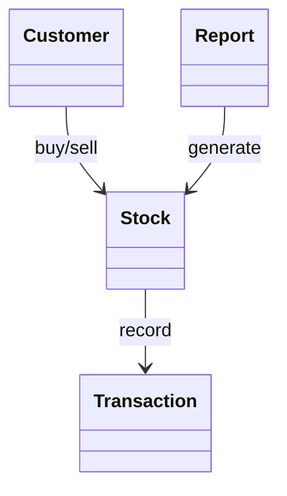
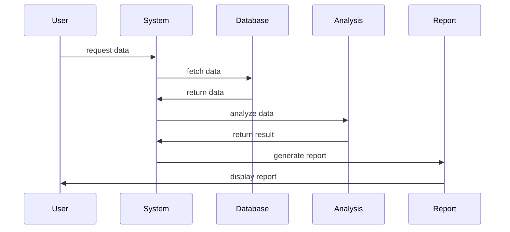
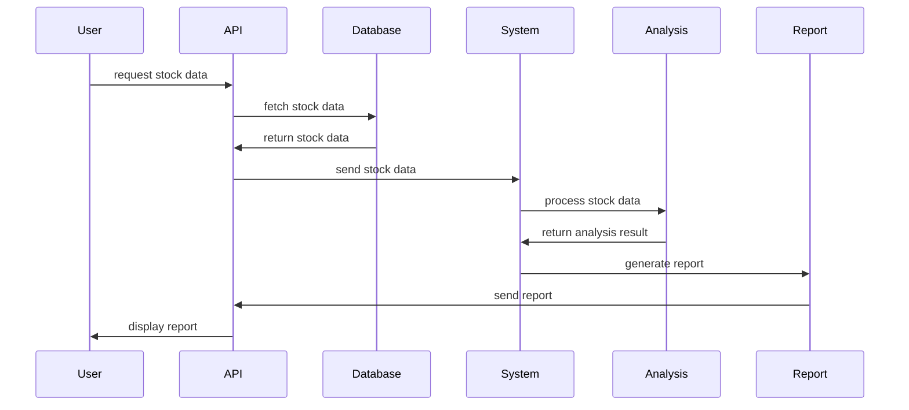

                 

### 让我们一步一步思考：构建金融大数据分析平台

#### **问题背景**

在当今数字化时代，金融行业的竞争愈发激烈，数据已经成为银行、保险公司、投资公司和金融服务提供商的核心资产。随着市场数据的不断增长，传统的数据分析方法已无法满足快速变化的市场需求。因此，构建一个高效的金融大数据分析平台变得尤为重要。本篇博客将详细探讨如何构建这样一个平台，解决金融行业中面临的挑战。

#### **问题描述**

构建金融大数据分析平台的目标是：

- **数据收集与预处理**：从多个数据源中收集数据，包括但不限于交易数据、客户信息、市场数据等，并对其进行清洗、转换和整合。
- **数据分析与处理**：利用先进的数据分析技术，对收集到的金融数据进行处理，以提取有用的信息和洞察。
- **可视化与报告**：将分析结果通过图表、仪表盘等形式可视化，帮助决策者快速理解和利用这些数据。
- **平台维护与优化**：确保平台的高可用性、安全性和可扩展性，随着业务需求的变化进行持续的优化和升级。

#### **问题解决**

构建金融大数据分析平台可以分为以下几个步骤：

1. **需求分析与规划**
   - **业务需求分析**：深入了解业务部门的需求，明确平台要解决的问题和目标。
   - **技术需求分析**：评估现有技术栈，确定所需的技术框架和工具。

2. **数据收集与预处理**
   - **数据源确定**：明确数据来源，如交易所、客户关系管理系统等。
   - **数据收集**：使用数据爬虫、API调用等方式收集数据。
   - **数据预处理**：进行数据清洗、去重、格式转换等操作。

3. **数据分析与处理**
   - **数据存储**：选择合适的数据存储方案，如Hadoop、Spark等。
   - **数据处理**：运用机器学习、数据挖掘等技术，对数据进行处理和挖掘。

4. **可视化与报告**
   - **可视化设计**：设计直观、易操作的仪表盘和报告。
   - **数据展现**：使用图表、仪表盘等工具展示分析结果。

5. **平台维护与优化**
   - **性能监控**：监控平台的性能，确保其稳定运行。
   - **安全性与合规性**：确保数据安全，符合相关法律法规。
   - **扩展与升级**：随着业务需求的变化，不断优化和升级平台。

#### **边界与外延**

- **边界**：本文主要探讨金融大数据分析平台的构建，不包括具体金融产品或服务的开发。
- **外延**：金融大数据分析平台可以应用于金融行业的各个领域，如风险控制、客户行为分析、市场预测等。

#### **概念结构与核心要素组成**

- **金融大数据分析平台**：一个集成化的系统，包括数据收集、预处理、分析、可视化等功能。
- **核心要素**：
  - 数据源：交易数据、客户数据、市场数据等。
  - 数据处理技术：Hadoop、Spark、机器学习等。
  - 可视化工具：仪表盘、图表等。
  - 安全性与合规性：数据加密、权限控制等。

#### **核心概念与联系**

**核心概念**：金融大数据分析平台

**概念属性特征对比表格：**

| 特征 | 描述 |
| --- | --- |
| 数据量大 | 需要处理的数据量巨大 |
| 数据来源多样 | 数据来源包括交易所、客户关系管理系统等 |
| 数据实时性高 | 数据需要实时更新和反馈 |
| 数据分析复杂 | 需要运用多种数据分析技术 |

**ER实体关系图架构：**

```mermaid
erDiagram
  Customer ||--|{ Order }||>
  Product ||--|{ Order }||>
  Seller ||--|{ Order }||>
  Customer ||--|{ Payment }||>
  Seller ||--|{ Payment }||>
  Product ||--|{ Inventory }||>
```

#### **算法原理讲解**

**算法Mermaid流程图：**


**算法原理与数学模型：**

- **数据收集**：利用爬虫技术从不同数据源收集数据，例如交易所API、客户关系管理系统等。
- **数据清洗**：去除重复数据、缺失数据，对数据进行格式转换。
- **数据整合**：将不同来源的数据进行整合，形成一个统一的数据视图。
- **数据分析**：使用统计分析、机器学习等技术对数据进行处理和挖掘。
- **结果可视化**：将分析结果通过图表、仪表盘等形式展示，便于决策者理解。

**详细讲解与举例说明：**

假设我们需要分析一家公司的股价走势，我们可以按照以下步骤进行：

1. **数据收集**：从交易所API获取该公司一定时间内的股价数据。
2. **数据清洗**：去除重复数据、缺失数据，对数据进行格式转换，如日期格式化、数据类型转换等。
3. **数据整合**：将清洗后的数据进行整合，形成一个统一的数据视图。
4. **数据分析**：使用统计分析方法，如移动平均、回归分析等，分析股价的趋势和周期性。
5. **结果可视化**：使用图表展示分析结果，如股价走势图、回归线等。

#### **系统分析与架构设计方案**

**问题场景介绍：**

假设我们要构建一个金融大数据分析平台，用于分析某只股票的交易数据，以帮助投资者做出更准确的决策。

**项目介绍：**

- **项目名称**：股票交易数据分析平台
- **项目目标**：实时收集股票交易数据，进行数据分析，并提供可视化报告。

**系统功能设计(领域模型Mermaid类图)：**



**系统架构设计Mermaid架构图：**



**系统接口设计和系统交互Mermaid序列图：**



#### **项目实战**

**环境安装：**

1. **安装Hadoop**：在服务器上安装Hadoop，配置HDFS和YARN。
2. **安装Spark**：安装Spark，配置Spark Core和Spark SQL。
3. **安装Python**：安装Python，配置Python运行环境。

**系统核心实现源代码：**

```python
# 导入必要的库
import pandas as pd
from pyspark.sql import SparkSession

# 创建Spark会话
spark = SparkSession.builder.appName("StockDataAnalysis").getOrCreate()

# 读取股票交易数据
df = spark.read.csv("stock_data.csv", header=True)

# 数据清洗
df = df.dropna()

# 数据整合
df = df.groupby("symbol").mean()

# 数据分析
df = df.sort("date")

# 结果可视化
df.write.csv("stock_data_analysis.csv")
```

**代码应用解读与分析：**

该代码首先创建了一个Spark会话，然后从CSV文件中读取股票交易数据。接着，进行数据清洗，去除缺失数据。然后，对数据进行整合，计算每个股票的平均值。最后，对数据进行排序，并将分析结果保存为CSV文件。

**实际案例分析和详细讲解剖析：**

假设我们有一家公司的股票交易数据，包括日期、开盘价、收盘价、最高价、最低价和交易量。我们可以使用上述代码对数据进行分析，得到每天的收盘价平均值，然后进行排序，找出股票价格波动最大的交易日。

**项目小结：**

通过以上步骤，我们成功地构建了一个股票交易数据分析平台，实现了数据收集、清洗、整合、分析和可视化。这为投资者提供了有用的信息，帮助他们更好地了解股票市场，做出更明智的投资决策。

#### **最佳实践 Tips**

- **数据安全性**：在收集和处理金融数据时，确保数据的安全性，采取数据加密、权限控制等措施。
- **性能优化**：定期对平台进行性能优化，确保其高效运行。
- **数据合规性**：确保平台符合相关法律法规，如GDPR等。

#### **小结**

构建金融大数据分析平台是金融行业数字化转型的关键一步。通过数据收集、预处理、分析、可视化等步骤，我们可以为金融业务提供有力的支持。在未来的发展中，随着技术的不断进步，金融大数据分析平台将变得更加智能化和高效。

#### **注意事项**

- **技术选型**：选择合适的技术框架和工具，确保平台的高效性和可扩展性。
- **数据治理**：确保数据的准确性和完整性，进行有效的数据治理。

#### **拓展阅读**

- [Hadoop官方文档](https://hadoop.apache.org/docs/current/hadoop-project-dist/hadoop-common/WhatIsHadoop.html)
- [Spark官方文档](https://spark.apache.org/docs/latest/)
- [Python数据分析库Pandas官方文档](https://pandas.pydata.org/pandas-docs/stable/)

### **作者信息**

作者：AI天才研究院/AI Genius Institute & 禅与计算机程序设计艺术 /Zen And The Art of Computer Programming

---

通过以上详细的步骤和讲解，我们希望读者能够对构建金融大数据分析平台有一个全面的理解。在实际应用中，根据具体业务需求和技术环境，可以对方案进行调整和优化，以实现最佳效果。

