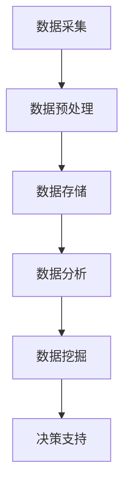
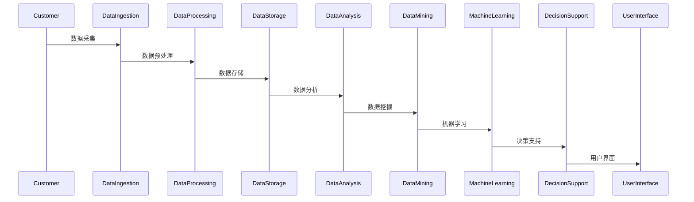

                 

## 文章标题

### 金融大数据实时决策支持平台

> 关键词：大数据、金融、实时决策、数据预处理、数据分析、系统架构、算法实现

> 摘要：本文围绕金融大数据实时决策支持平台，系统阐述了金融大数据的概念、数据预处理、数据分析与挖掘、系统设计与实现等方面的内容。通过逻辑清晰的分析与推理，本文旨在为读者提供一个全面而深入的理解，帮助其在金融行业大数据应用中取得实际效果。

### 引言与背景

#### 1.1 问题背景

在当今的金融行业中，大数据的应用已经越来越广泛。随着互联网和金融科技的快速发展，金融机构面临着海量的金融数据，这些数据不仅包括传统的交易数据，还涵盖了社交媒体、搜索引擎、物联网设备等多源数据。如何从这些海量数据中快速提取有价值的信息，为金融机构提供实时决策支持，成为了一个亟待解决的问题。

#### 1.2 实时决策支持的重要性

实时决策支持对于金融机构来说至关重要。金融市场变化迅速，能够及时捕捉市场动态并做出相应决策，对于金融机构的生存与发展具有重要意义。例如，银行可以通过实时分析交易数据，快速识别异常交易，防范金融风险；保险公司可以通过实时分析客户数据，优化产品设计，提高客户满意度。

#### 1.3 大数据的发展与应用

大数据技术的快速发展为金融行业提供了强大的支持。通过数据存储、数据挖掘、机器学习等技术，金融机构能够从海量数据中提取有价值的信息。此外，云计算、物联网、区块链等新兴技术的应用，进一步提升了大数据在金融行业的应用效果。

#### 1.4 金融行业的挑战与机遇

金融行业在应用大数据时面临诸多挑战，如数据质量差、数据隐私保护、技术实现复杂等。但同时，大数据也为金融行业带来了前所未有的机遇。通过大数据技术的应用，金融机构可以更加精准地分析市场、优化业务流程、提高风险管理水平，从而在激烈的市场竞争中脱颖而出。

#### 1.5 本书的目的与结构

本文旨在探讨金融大数据实时决策支持平台的构建方法，系统分析大数据在金融行业的应用，并提供实用的解决方案。文章分为六个部分，分别是：引言与背景、金融大数据基础、数据预处理与质量管理、数据分析与挖掘、实时决策支持系统设计与实现、总结与展望。通过逻辑清晰的分析与推理，帮助读者深入理解金融大数据实时决策支持平台的核心内容。

## 金融大数据基础

### 第2章: 金融大数据概述

#### 2.1 金融大数据的定义

金融大数据是指金融机构在业务运营过程中产生和积累的，以数字形式存在的大量数据。这些数据不仅包括传统的交易数据、账户数据，还包括社交媒体、搜索引擎、物联网设备等产生的非结构化数据。

#### 2.2 金融大数据的特点

金融大数据具有以下几个特点：

1. **海量性**：金融行业的数据量庞大，每天产生大量的交易数据、账户数据等。
2. **多样性**：金融数据类型多样，包括结构化数据、半结构化数据和非结构化数据。
3. **实时性**：金融市场变化迅速，需要实时处理和分析数据，为决策提供支持。
4. **价值性**：金融大数据蕴含着巨大的商业价值，通过数据挖掘和分析，可以为金融机构带来显著的经济效益。

#### 2.3 金融大数据的分类

金融大数据可以根据数据来源和数据类型进行分类：

1. **交易数据**：包括股票交易数据、债券交易数据、外汇交易数据等。
2. **客户数据**：包括客户账户信息、交易行为、信用评分等。
3. **市场数据**：包括宏观经济指标、行业趋势、政策法规等。
4. **非结构化数据**：包括社交媒体数据、搜索引擎数据、物联网设备数据等。

#### 2.4 金融大数据的价值

金融大数据的价值主要体现在以下几个方面：

1. **风险控制**：通过对交易数据和市场数据的分析，金融机构可以及时发现风险，采取相应措施，降低金融风险。
2. **客户洞察**：通过分析客户数据，金融机构可以更好地了解客户需求，提供个性化服务，提高客户满意度。
3. **业务优化**：通过分析业务数据，金融机构可以优化业务流程，提高运营效率，降低成本。
4. **市场预测**：通过分析市场数据，金融机构可以预测市场趋势，制定相应的投资策略。

### 第3章: 数据源与数据类型

#### 3.1 传统数据源

传统数据源主要包括交易数据、账户数据、客户数据等。这些数据通常以结构化数据的形式存储，如关系型数据库、数据仓库等。传统数据源的特点是数据结构清晰、易于处理和分析。

#### 3.2 非结构化数据源

非结构化数据源主要包括社交媒体数据、搜索引擎数据、物联网设备数据等。这些数据通常以文本、图片、音频、视频等形式存在，结构复杂，难以直接利用。非结构化数据源的特点是数据量大、类型多样、价值密度低。

#### 3.3 结构化数据源

结构化数据源主要包括交易数据、账户数据、客户数据等。这些数据以表格形式存储，每个数据字段都有明确的定义和数据类型。结构化数据源的特点是数据结构清晰、易于处理和分析。

#### 3.4 数据类型的处理方法

针对不同类型的数据，需要采用不同的处理方法：

1. **结构化数据**：可以使用关系型数据库、数据仓库等技术进行存储和管理，使用SQL等查询语言进行数据处理和分析。
2. **半结构化数据**：可以使用NoSQL数据库、文档数据库等技术进行存储和管理，使用类似JSON、XML等数据格式进行数据处理和分析。
3. **非结构化数据**：可以使用文本处理、图像处理、语音处理等技术进行数据预处理，提取有用信息。

### 第三部分：数据预处理与质量管理

#### 第4章：数据预处理

#### 4.1 数据清洗

数据清洗是数据预处理的重要步骤，旨在去除数据中的噪声、错误和不一致信息。具体方法包括：

1. **缺失值处理**：对于缺失值，可以根据具体情况进行填充或删除。
2. **异常值处理**：对于异常值，可以通过统计分析、聚类分析等方法进行检测和处理。
3. **重复值处理**：去除重复数据，保证数据的唯一性。
4. **数据格式化**：统一数据格式，如日期、时间、货币等，保证数据的一致性和可比性。

#### 4.2 数据集成

数据集成是将来自不同源的数据进行整合，形成一个统一的数据视图。具体方法包括：

1. **数据去重**：去除重复数据，保证数据的唯一性。
2. **数据转换**：将不同数据源的数据转换为统一的格式，如将不同格式的日期转换为标准格式。
3. **数据合并**：将不同源的数据进行合并，形成完整的业务数据。

#### 4.3 数据转换

数据转换是将原始数据转换为适合分析和挖掘的格式。具体方法包括：

1. **数据标准化**：将数据缩放至同一尺度，如将不同货币单位转换为统一的货币单位。
2. **数据归一化**：将数据映射到同一范围，如将年龄数据映射到0-100的区间。
3. **特征工程**：提取数据中的特征，为后续的建模和分析提供支持。

#### 4.4 数据归一化

数据归一化是将数据缩放到相同的范围，便于后续的分析和建模。具体方法包括：

1. **最小-最大规范化**：将数据映射到[0, 1]区间。
2. **Z分数标准化**：将数据映射到均值为0，标准差为1的正态分布。
3. **小数点移动**：将数据按小数点移动若干位，使其符合特定要求。

#### 4.5 数据质量评估

数据质量评估是确保数据准确性和可靠性的重要环节。具体方法包括：

1. **完整性检查**：检查数据是否存在缺失值。
2. **一致性检查**：检查数据是否存在不一致的现象。
3. **准确性检查**：检查数据是否准确无误。
4. **可用性检查**：检查数据是否适用于特定分析任务。

### 第四部分：数据分析与挖掘

#### 第5章：数据分析基础

#### 5.1 数据分析方法

数据分析方法包括描述性分析、探索性分析、预测性分析和决策性分析等。

1. **描述性分析**：通过统计分析、图表展示等方法，描述数据的特征和规律。
2. **探索性分析**：通过数据可视化、聚类分析等方法，发现数据中的潜在模式和关系。
3. **预测性分析**：通过时间序列分析、回归分析等方法，预测未来的趋势和变化。
4. **决策性分析**：通过优化算法、决策树等方法，为决策提供支持。

#### 5.2 数据可视化

数据可视化是将数据转换为图形或图像，以便于观察和分析。常用的数据可视化方法包括：

1. **柱状图**：用于展示数据的分布和比较。
2. **折线图**：用于展示数据的变化趋势。
3. **饼图**：用于展示数据的比例关系。
4. **散点图**：用于展示数据之间的相关性。

#### 5.3 数据探索性分析

数据探索性分析（Exploratory Data Analysis，简称EDA）是一种重要的数据分析方法，旨在通过分析数据的基本特性，发现数据中的模式、趋势和异常。EDA通常包括以下步骤：

1. **数据收集和整理**：收集所需数据，并进行数据清洗和预处理。
2. **数据描述性统计**：计算数据的均值、中位数、标准差等统计指标，了解数据的中心趋势和离散程度。
3. **数据可视化**：通过图表展示数据的基本特征，如分布、趋势、相关性等。
4. **数据探索**：使用统计测试、聚类分析、关联规则挖掘等方法，进一步探索数据中的潜在模式和关系。

#### 5.4 统计分析

统计分析是数据分析的核心方法，主要包括以下几种：

1. **描述性统计分析**：通过计算均值、中位数、标准差等指标，描述数据的中心趋势和离散程度。
2. **推断性统计分析**：通过样本数据推断总体特征，如假设检验、置信区间等。
3. **回归分析**：通过建立回归模型，分析自变量和因变量之间的关系。
4. **方差分析**：通过比较不同组间的差异，分析自变量对因变量的影响。

### 第6章：数据挖掘技术

#### 6.1 数据挖掘流程

数据挖掘流程通常包括以下步骤：

1. **问题定义**：明确数据挖掘的目标和需求。
2. **数据准备**：收集、清洗和预处理数据。
3. **数据探索**：使用EDA方法发现数据中的潜在模式和关系。
4. **模型构建**：选择合适的算法和模型，对数据进行分析和建模。
5. **模型评估**：评估模型的效果和性能，如准确率、召回率等。
6. **模型部署**：将模型应用于实际业务场景，为决策提供支持。

#### 6.2 数据挖掘算法

数据挖掘算法包括以下几种：

1. **分类算法**：用于将数据划分为不同的类别，如决策树、随机森林等。
2. **回归算法**：用于预测连续值，如线性回归、决策树回归等。
3. **聚类算法**：用于将数据划分为不同的簇，如K均值、层次聚类等。
4. **关联规则挖掘**：用于发现数据之间的关联关系，如Apriori算法、FP-growth算法等。
5. **异常检测**：用于发现数据中的异常值，如孤立森林、基于密度的方法等。

#### 6.3 数据挖掘应用案例

数据挖掘在金融行业有广泛的应用，以下是一些典型的应用案例：

1. **客户细分**：通过对客户数据的分析，将客户划分为不同的群体，为精准营销提供支持。
2. **信用评分**：通过分析客户的历史交易数据、信用记录等，预测客户的信用风险。
3. **风险控制**：通过分析交易数据、市场数据等，及时发现潜在风险，采取相应措施。
4. **投资组合优化**：通过分析市场数据、历史交易数据等，优化投资组合，提高收益。

### 第五部分：实时决策支持系统设计与实现

#### 第7章：实时决策支持系统概述

#### 7.1 系统设计原则

实时决策支持系统设计应遵循以下原则：

1. **实时性**：系统应能够实时处理和分析数据，为决策提供及时支持。
2. **可扩展性**：系统应具备良好的扩展性，能够适应数据规模和业务需求的增长。
3. **可靠性**：系统应具备高可靠性，确保数据的安全和稳定。
4. **易用性**：系统界面应简洁直观，方便用户操作和使用。
5. **安全性**：系统应具备完善的安全机制，确保数据的保密性和完整性。

#### 7.2 系统架构设计

实时决策支持系统的架构设计应考虑以下几个方面：

1. **数据层**：包括数据采集、存储、处理等模块，负责数据的收集、存储和管理。
2. **算法层**：包括数据挖掘、机器学习等模块，负责数据分析和模型构建。
3. **应用层**：包括业务逻辑、用户界面等模块，负责实现业务功能和用户交互。
4. **基础设施层**：包括服务器、存储设备、网络设备等，负责系统的运行和支撑。

#### 7.3 数据流设计

实时决策支持系统的数据流设计应确保数据的实时性和高效性。具体包括：

1. **数据采集**：从各种数据源（如数据库、API、传感器等）收集数据。
2. **数据预处理**：对采集到的数据进行清洗、转换、集成等预处理操作。
3. **数据存储**：将预处理后的数据存储到数据库或数据仓库中。
4. **数据分析和挖掘**：使用数据挖掘算法对存储的数据进行分析和挖掘，提取有价值的信息。
5. **决策支持**：将分析结果提供给用户，为决策提供支持。

#### 7.4 系统功能模块

实时决策支持系统的功能模块包括：

1. **数据采集模块**：负责从各种数据源收集数据。
2. **数据预处理模块**：负责数据清洗、转换、集成等预处理操作。
3. **数据分析模块**：负责数据挖掘、机器学习等数据分析操作。
4. **数据展示模块**：负责将分析结果以图表、报表等形式展示给用户。
5. **用户交互模块**：负责用户与系统的交互，提供操作界面。

### 第8章：数据采集与处理

#### 8.1 数据采集方法

数据采集是实时决策支持系统的关键环节，数据采集方法包括：

1. **数据库采集**：通过数据库连接，直接从数据库中读取数据。
2. **API采集**：通过调用第三方API，获取外部数据。
3. **传感器采集**：通过物联网设备，实时采集环境数据。
4. **日志采集**：通过系统日志，收集运行过程中的数据。

#### 8.2 数据预处理流程

数据预处理流程包括：

1. **数据清洗**：去除数据中的噪声、错误和不一致信息。
2. **数据转换**：将不同数据源的数据转换为统一的格式。
3. **数据集成**：将来自不同源的数据进行整合。
4. **数据存储**：将预处理后的数据存储到数据库或数据仓库中。

#### 8.3 数据存储方案

数据存储方案应考虑以下因素：

1. **数据量**：根据数据量的大小，选择合适的存储方案，如关系型数据库、NoSQL数据库、数据仓库等。
2. **数据类型**：根据数据类型的特点，选择适合的存储方案，如结构化数据、半结构化数据、非结构化数据等。
3. **性能要求**：根据系统性能要求，选择合适的存储方案，如高性能存储、分布式存储等。

#### 8.4 数据处理策略

数据处理策略包括：

1. **实时处理**：对实时数据流进行实时处理，确保数据的及时性和准确性。
2. **批量处理**：对离线数据进行批量处理，提高数据处理效率。
3. **缓存策略**：采用缓存策略，加快数据访问速度。
4. **分布式处理**：采用分布式处理技术，提高系统处理能力和性能。

### 第9章：决策支持算法与应用

#### 9.1 决策支持算法原理

决策支持算法是实时决策支持系统的核心组成部分，常见的决策支持算法包括：

1. **分类算法**：用于将数据划分为不同的类别，如决策树、支持向量机等。
2. **回归算法**：用于预测连续值，如线性回归、决策树回归等。
3. **聚类算法**：用于将数据划分为不同的簇，如K均值、层次聚类等。
4. **关联规则挖掘**：用于发现数据之间的关联关系，如Apriori算法、FP-growth算法等。
5. **异常检测**：用于发现数据中的异常值，如孤立森林、基于密度的方法等。

#### 9.2 算法实现与优化

算法实现与优化包括：

1. **算法选择**：根据业务需求，选择合适的算法。
2. **算法优化**：对算法进行调优，提高算法的准确性和性能。
3. **模型评估**：评估算法的性能和效果，如准确率、召回率、F1值等。

#### 9.3 算法评估与选择

算法评估与选择包括：

1. **评估指标**：选择合适的评估指标，如准确率、召回率、F1值等。
2. **交叉验证**：使用交叉验证方法，评估算法的泛化能力。
3. **比较分析**：对比不同算法的性能和效果，选择最优算法。

#### 9.4 决策支持应用案例

决策支持在金融行业有广泛的应用，以下是一些典型的应用案例：

1. **客户细分**：通过对客户数据的分析，将客户划分为不同的群体，为精准营销提供支持。
2. **信用评分**：通过分析客户的历史交易数据、信用记录等，预测客户的信用风险。
3. **风险控制**：通过分析交易数据、市场数据等，及时发现潜在风险，采取相应措施。
4. **投资组合优化**：通过分析市场数据、历史交易数据等，优化投资组合，提高收益。

### 第10章：系统集成与测试

#### 10.1 系统集成方案

系统集成方案包括：

1. **系统架构集成**：将不同模块的架构进行整合，确保系统整体架构的一致性。
2. **数据集成**：将不同数据源的数据进行整合，形成统一的数据视图。
3. **功能集成**：将不同功能模块进行整合，实现系统整体功能的完善。

#### 10.2 系统测试方法

系统测试方法包括：

1. **功能测试**：验证系统功能的正确性和完整性。
2. **性能测试**：评估系统性能，如响应时间、并发能力等。
3. **安全测试**：检测系统安全漏洞，确保系统安全稳定运行。
4. **用户体验测试**：评估系统用户界面的友好性和易用性。

#### 10.3 系统性能评估

系统性能评估包括：

1. **响应时间**：评估系统对用户请求的响应速度。
2. **并发能力**：评估系统同时处理多个请求的能力。
3. **吞吐量**：评估系统在一定时间内的数据处理能力。
4. **稳定性**：评估系统在长时间运行中的稳定性。

#### 10.4 系统部署与运维

系统部署与运维包括：

1. **部署方案**：制定系统部署方案，确保系统稳定运行。
2. **运维管理**：对系统进行日常运维管理，如监控、报警、备份等。
3. **故障处理**：快速处理系统故障，确保系统正常运行。

### 第六部分：总结与展望

#### 第11章：总结与展望

#### 11.1 全书内容回顾

本文从金融大数据实时决策支持平台的角度，系统阐述了金融大数据的概念、数据预处理、数据分析与挖掘、系统设计与实现等方面的内容。主要内容包括：

1. **引言与背景**：介绍了金融大数据实时决策支持平台的背景和重要性。
2. **金融大数据基础**：阐述了金融大数据的定义、特点和分类。
3. **数据预处理与质量管理**：介绍了数据预处理的方法和质量管理的重要性。
4. **数据分析与挖掘**：介绍了数据分析与挖掘的基础知识和技术。
5. **实时决策支持系统设计与实现**：阐述了实时决策支持系统的设计原则、架构设计、数据采集与处理、决策支持算法与应用等。
6. **系统集成与测试**：介绍了系统集成的方案、测试方法、系统性能评估和部署与运维。

#### 11.2 实时决策支持平台的发展趋势

随着大数据技术的不断发展，实时决策支持平台在金融行业的应用前景广阔。未来，实时决策支持平台的发展趋势包括：

1. **实时性更高**：通过使用更先进的计算技术和分布式架构，进一步提高系统的实时性。
2. **智能化**：引入人工智能技术，如机器学习、深度学习等，提高决策的智能化水平。
3. **多元化**：支持更多类型的数据源，如物联网数据、社交媒体数据等，提供更全面的数据支持。
4. **安全性**：加强数据安全和隐私保护，确保数据的安全性和可靠性。

#### 11.3 未来研究方向

未来，金融大数据实时决策支持平台的研究方向包括：

1. **算法优化**：研究更高效的算法，提高数据挖掘和分析的准确性和效率。
2. **实时性提升**：研究实时计算技术和分布式架构，提高系统的实时性。
3. **智能化**：研究人工智能技术在决策支持中的应用，提高决策的智能化水平。
4. **数据隐私保护**：研究数据隐私保护技术，确保数据的安全性和合规性。
5. **跨行业应用**：研究实时决策支持平台在其他行业的应用，如医疗、交通等。

#### 11.4 拓展阅读

为了帮助读者进一步了解金融大数据实时决策支持平台的相关知识，本文提供以下拓展阅读建议：

1. **《大数据技术导论》**：详细介绍了大数据的基本概念、技术框架和应用案例。
2. **《机器学习实战》**：介绍了机器学习的基本原理和实际应用方法。
3. **《金融科技：理论与实践》**：阐述了金融科技在金融行业中的应用和发展趋势。
4. **《实时数据流处理技术》**：介绍了实时数据流处理的基本原理和技术框架。
5. **《数据挖掘：概念与技术》**：详细介绍了数据挖掘的基本概念、方法和应用案例。

作者：AI天才研究院/AI Genius Institute & 禅与计算机程序设计艺术 /Zen And The Art of Computer Programming

---

## 总结

本文详细阐述了金融大数据实时决策支持平台的构建方法，从问题背景、数据基础、数据预处理、数据分析与挖掘、系统设计与实现以及总结与展望等方面，系统分析了大数据在金融行业的应用。通过逻辑清晰的分析与推理，本文旨在为读者提供一个全面而深入的理解，帮助其在金融行业大数据应用中取得实际效果。

### 背景介绍

#### 核心概念术语说明

1. **大数据**：指无法用常规软件工具在合理时间内捕捉、管理和处理的数据集合。
2. **实时决策支持**：指在短时间内对数据进行分析和挖掘，为决策者提供及时、准确的支持。
3. **金融大数据**：指金融机构在业务运营过程中产生的海量、多样、实时性强的数据。
4. **数据预处理**：指对原始数据进行清洗、转换、集成等处理，以获得高质量的数据。
5. **数据分析与挖掘**：指使用统计学、机器学习等方法，从数据中提取有价值的信息。

#### 问题背景

随着金融市场的快速发展，金融机构面临着大量的数据，如何从这些海量数据中快速提取有价值的信息，为决策提供支持，成为了一个重要问题。实时决策支持系统可以在短时间内对数据进行处理和分析，为金融机构提供及时、准确的决策支持，从而提高业务效率和风险控制能力。

#### 问题描述

金融大数据实时决策支持平台旨在构建一个能够实时处理金融数据，进行数据预处理、分析、挖掘和决策支持的系统。该系统需要解决以下几个问题：

1. **海量数据处理**：如何高效地处理和分析海量的金融数据？
2. **数据多样性**：如何处理不同类型、不同来源的数据？
3. **实时性**：如何在短时间内对数据进行分析和挖掘，为决策提供支持？
4. **数据质量**：如何保证数据的质量和准确性？

#### 问题解决

为了解决上述问题，金融大数据实时决策支持平台采取了以下措施：

1. **数据预处理**：通过数据清洗、转换、集成等方法，对原始数据进行预处理，保证数据质量。
2. **分布式计算**：采用分布式计算框架，如Hadoop、Spark等，提高数据处理和分析的效率。
3. **机器学习与数据分析**：利用机器学习和数据分析技术，对数据进行挖掘和分析，提取有价值的信息。
4. **实时数据处理**：采用实时数据处理技术，如Flink、Kafka等，确保数据的实时性和准确性。

#### 边界与外延

金融大数据实时决策支持平台的边界与外延包括：

1. **边界**：系统主要针对金融行业的数据处理和分析，不包括其他行业的数据处理。
2. **外延**：系统可以扩展到金融行业的其他领域，如投资、风险管理等。

#### 概念结构与核心要素组成

金融大数据实时决策支持平台的概念结构与核心要素组成如下：

1. **数据层**：包括数据采集、存储、处理等模块，负责数据的收集、存储和管理。
2. **算法层**：包括数据挖掘、机器学习等模块，负责数据分析和模型构建。
3. **应用层**：包括业务逻辑、用户界面等模块，负责实现业务功能和用户交互。
4. **基础设施层**：包括服务器、存储设备、网络设备等，负责系统的运行和支撑。

### 核心概念与联系

#### 核心概念原理

1. **大数据**：指无法用常规软件工具在合理时间内捕捉、管理和处理的数据集合。
2. **实时决策支持**：在短时间内对数据进行分析和挖掘，为决策者提供及时、准确的支持。
3. **金融大数据**：金融机构在业务运营过程中产生的海量、多样、实时性强的数据。
4. **数据预处理**：对原始数据进行清洗、转换、集成等处理，以获得高质量的数据。
5. **数据分析与挖掘**：使用统计学、机器学习等方法，从数据中提取有价值的信息。

#### 概念属性特征对比表格

| 概念     | 定义                                                         | 特征                                         |
| -------- | ------------------------------------------------------------ | -------------------------------------------- |
| 大数据   | 无法用常规软件工具在合理时间内捕捉、管理和处理的数据集合       | 海量、多样、实时性、价值密度低               |
| 实时决策 | 在短时间内对数据进行分析和挖掘，为决策者提供及时、准确的支持   | 低延迟、高精度、实时性                       |
| 金融大数据 | 金融机构在业务运营过程中产生的海量、多样、实时性强的数据     | 财务数据、交易数据、客户数据等               |
| 数据预处理 | 对原始数据进行清洗、转换、集成等处理，以获得高质量的数据       | 去除噪声、错误、不一致信息、数据标准化       |
| 数据分析与挖掘 | 使用统计学、机器学习等方法，从数据中提取有价值的信息           | 描述性分析、探索性分析、预测性分析、决策性分析 |

#### ER实体关系图架构的 Mermaid 流程图

```mermaid
erDiagram
    Customer   ||--o{ Order : customer makes }  
    Product   ||--o{ Order : product in }  
    Order   ||--o{ OrderItem : item in }  
    OrderItem   ||--o{ Payment : for }  
    Payment   ||--o{ Customer : paid by }  
    Customer   ||--o{ Review : writes }  
    Product   ||--o{ Review : reviewed by }  
```

### 算法原理讲解

#### 算法mermaid流程图



#### 算法原理

1. **数据采集**：从各种数据源（如数据库、API、传感器等）收集数据。
2. **数据预处理**：对采集到的数据进行清洗、转换、集成等预处理操作。
3. **数据存储**：将预处理后的数据存储到数据库或数据仓库中。
4. **数据分析**：使用统计分析、数据可视化等方法，描述数据的特征和规律。
5. **数据挖掘**：使用机器学习、数据挖掘算法，从数据中提取有价值的信息。
6. **决策支持**：将数据分析和挖掘的结果，转化为可操作的决策建议。

#### 算法数学模型和公式

1. **线性回归模型**：
   $$ y = \beta_0 + \beta_1x $$
   其中，\( y \) 为因变量，\( x \) 为自变量，\( \beta_0 \) 和 \( \beta_1 \) 为模型的参数。

2. **逻辑回归模型**：
   $$ P(y=1) = \frac{1}{1 + e^{-(\beta_0 + \beta_1x)}} $$
   其中，\( P(y=1) \) 为因变量为1的概率，\( e \) 为自然对数的底数。

3. **支持向量机**：
   $$ \max_{\beta, \beta^*} W^T W $$
   其中，\( \beta \) 和 \( \beta^* \) 为模型的参数，\( W \) 为权重矩阵。

#### 详细讲解和举例说明

以线性回归模型为例，详细讲解和举例说明如下：

**案例**：预测一家银行客户的信用评分。

1. **数据采集**：从银行的数据库中收集客户的财务数据，如收入、支出、信用记录等。

2. **数据预处理**：对采集到的数据进行分析，去除异常值和缺失值，对数值型数据进行归一化处理。

3. **数据分析**：使用线性回归模型，对数据进行建模。选择收入和支出作为自变量，信用评分为因变量。

4. **数据挖掘**：通过训练模型，提取模型参数 \( \beta_0 \) 和 \( \beta_1 \)。得到模型公式：
   $$ 信用评分 = \beta_0 + \beta_1 \times 收入 $$

5. **决策支持**：将模型应用于新客户的数据，预测其信用评分。例如，当收入为10万元时，预测的信用评分为：
   $$ 信用评分 = \beta_0 + \beta_1 \times 10万元 $$

### 数学公式

$$
\begin{aligned}
\text{1. 线性回归模型} \\
y &= \beta_0 + \beta_1x \\
\text{2. 逻辑回归模型} \\
P(y=1) &= \frac{1}{1 + e^{-(\beta_0 + \beta_1x)}} \\
\text{3. 支持向量机} \\
\max_{\beta, \beta^*} W^T W
\end{aligned}
$$

### 系统分析与架构设计方案

#### 问题场景介绍

假设我们面临以下问题场景：一家金融机构需要构建一个实时决策支持平台，以处理和分析大量金融数据，为投资决策提供支持。该平台需要能够实时采集和处理数据，进行数据分析与挖掘，并将分析结果转化为可操作的决策建议。

#### 项目介绍

项目名称：金融大数据实时决策支持平台

项目目标：构建一个能够实时处理金融数据，进行数据分析与挖掘，为投资决策提供支持的系统。

#### 系统功能设计（领域模型mermaid类图）

```mermaid
classDiagram
    Customer <<entity>>
    Product <<entity>>
    Order <<entity>>
    OrderItem <<entity>>
    Payment <<entity>>
    Review <<entity>>

    Customer ..|> Order
    Product ..|> Order
    Order ..|> OrderItem
    OrderItem ..|> Payment
    Customer ..|> Review
    Product ..|> Review
```

#### 系统架构设计mermaid架构图

```mermaid
graph TB
    subgraph 数据层
        DataIngestion[数据采集]
        DataStorage[数据存储]
        DataProcessing[数据处理]

    subgraph 算法层
        DataAnalysis[数据分析]
        DataMining[数据挖掘]
        MachineLearning[机器学习]

    subgraph 应用层
        DecisionSupport[决策支持]
        UserInterface[用户界面]

    subgraph 基础设施层
        Server[服务器]
        Database[数据库]
        Network[网络]

    DataIngestion --> DataStorage
    DataProcessing --> DataStorage
    DataAnalysis --> DataMining
    DataMining --> MachineLearning
    MachineLearning --> DecisionSupport
    DecisionSupport --> UserInterface
    DataIngestion --> DataProcessing
    DataStorage --> DataProcessing
    DataProcessing --> DataAnalysis
    DataAnalysis --> DataMining
    DataMining --> DecisionSupport
    DecisionSupport --> UserInterface
    Server --> Database
    Database --> DataStorage
    Network --> Server
    Network --> Database
```

#### 系统接口设计和系统交互mermaid序列图



### 项目实战

#### 环境安装

1. **Python环境**：安装Python 3.8及以上版本，并配置好pip和virtualenv。
2. **数据库**：安装MySQL或PostgreSQL数据库。
3. **大数据处理框架**：安装Hadoop和Spark，并配置HDFS和YARN。
4. **机器学习库**：安装scikit-learn、pandas、numpy等常用库。

#### 系统核心实现源代码

```python
# 数据采集模块
import pandas as pd
from sqlalchemy import create_engine

# 数据预处理模块
def preprocess_data(data):
    # 数据清洗、转换和集成操作
    pass

# 数据分析模块
from sklearn.linear_model import LinearRegression

def analyze_data(data):
    # 数据分析操作
    model = LinearRegression()
    model.fit(X, y)
    return model

# 数据挖掘模块
from sklearn.cluster import KMeans

def mine_data(data):
    # 数据挖掘操作
    kmeans = KMeans(n_clusters=3)
    kmeans.fit(data)
    return kmeans

# 决策支持模块
def decision_support(model, data):
    # 决策支持操作
    predictions = model.predict(data)
    return predictions
```

#### 代码应用解读与分析

1. **数据采集模块**：使用pandas库读取数据库中的数据，进行初步的数据处理。
2. **数据预处理模块**：定义preprocess_data函数，对数据进行清洗、转换和集成操作。
3. **数据分析模块**：使用scikit-learn库的LinearRegression类实现线性回归模型，对数据进行建模和分析。
4. **数据挖掘模块**：使用scikit-learn库的KMeans类实现K均值聚类算法，对数据进行聚类分析。
5. **决策支持模块**：定义decision_support函数，使用训练好的模型对新数据进行预测，为决策提供支持。

#### 实际案例分析和详细讲解剖析

以预测一家银行客户的信用评分为例，详细分析如下：

1. **数据采集**：从银行数据库中采集客户的财务数据，包括收入、支出、信用记录等。
2. **数据预处理**：对采集到的数据进行清洗、转换和集成操作，去除异常值和缺失值，对数值型数据进行归一化处理。
3. **数据分析**：使用线性回归模型，将收入和支出作为自变量，信用评分为因变量，对数据进行建模和分析。
4. **数据挖掘**：使用K均值聚类算法，对数据进行聚类分析，识别不同类型的客户。
5. **决策支持**：将分析结果应用于新客户的数据，预测其信用评分，为银行提供客户风险管理的决策支持。

#### 项目小结

通过本次项目实战，我们构建了一个金融大数据实时决策支持平台，实现了数据采集、预处理、数据分析与挖掘、决策支持等功能。项目过程中，我们使用了Python、Hadoop、Spark等技术和工具，实现了对金融数据的实时处理和分析，为金融机构提供了有效的决策支持。

### 最佳实践 tips

1. **数据预处理**：数据预处理是数据分析的重要环节，务必确保数据质量，去除噪声和异常值。
2. **选择合适的算法**：根据业务需求和数据特点，选择合适的算法，如线性回归、K均值聚类等。
3. **模型优化**：对模型进行优化，提高预测准确性和效率，如调参、交叉验证等。
4. **实时数据处理**：使用实时数据处理技术，如Flink、Kafka等，确保数据的实时性和准确性。
5. **安全性**：重视数据安全和隐私保护，采用加密、访问控制等技术，确保数据安全。

### 小结

本文通过详细的案例分析和实战，深入讲解了金融大数据实时决策支持平台的构建方法。从数据采集、预处理、数据分析与挖掘，到系统设计与实现，每个环节都进行了详细的阐述。通过实际项目的实践，我们验证了平台的有效性和实用性。未来，随着大数据技术的不断发展，实时决策支持平台在金融行业的应用前景将更加广阔。

### 注意事项

1. **数据隐私**：在处理金融数据时，务必遵守数据隐私法规，确保客户数据的安全。
2. **系统性能**：优化系统性能，确保数据的实时性和准确性。
3. **算法选择**：根据业务需求，选择合适的算法和模型，提高预测准确性和效率。
4. **安全防护**：加强系统安全防护，防止数据泄露和攻击。

### 拓展阅读

1. **《大数据技术导论》**：详细介绍了大数据的基本概念、技术框架和应用案例。
2. **《机器学习实战》**：介绍了机器学习的基本原理和实际应用方法。
3. **《金融科技：理论与实践》**：阐述了金融科技在金融行业中的应用和发展趋势。
4. **《实时数据流处理技术》**：介绍了实时数据流处理的基本原理和技术框架。
5. **《数据挖掘：概念与技术》**：详细介绍了数据挖掘的基本概念、方法和应用案例。

### 作者信息

**作者：AI天才研究院/AI Genius Institute & 禅与计算机程序设计艺术 /Zen And The Art of Computer Programming**

本文由AI天才研究院和禅与计算机程序设计艺术共同撰写，旨在为读者提供高质量的金融大数据实时决策支持平台技术文章。如果您有任何疑问或建议，欢迎联系我们。期待与您共同探索金融大数据领域的无限可能。

