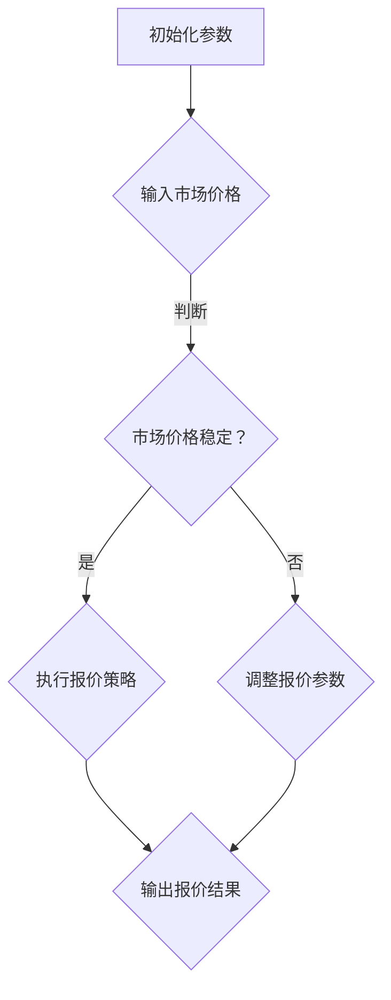

                 

# 金融市场做市商报价优化模型

> 关键词：金融市场、做市商、报价优化、算法模型、数学模型

> 摘要：本文将探讨金融市场中的做市商报价优化模型，通过分析做市商的作用和报价优化的现实意义，明确研究目标与内容框架。在此基础上，本文将介绍报价优化模型的理论基础，包括金融市场理论基础、优化理论基础知识以及报价模型相关理论。接着，本文将阐述报价优化模型的研究现状，分析国内外研究现状以及面临的挑战和机遇。最后，本文将对报价优化模型的核心概念与联系进行详细解析，并通过算法原理讲解和数学模型及公式详细阐述，为金融市场报价优化提供理论支持和实践指导。

## 第1章 引言

### 1.1 问题背景与意义

#### 1.1.1 金融市场概述

金融市场是资本流通的重要场所，它是资本形成和资源配置的重要机制。金融市场包括股票市场、债券市场、外汇市场、期货市场和衍生品市场等。金融市场的参与者包括个人投资者、机构投资者、做市商、证券公司、银行等。

#### 1.1.2 做市商的作用

做市商（Market Maker）是指在金融市场中，承担提供买卖双向报价，维持市场流动性的金融机构。做市商通过不断买卖自己的库存证券，为市场提供流动性和价格稳定性。做市商的作用包括：

1. 提高市场流动性，降低交易成本。
2. 维持市场价格稳定，减少市场波动。
3. 提供买卖报价，促进交易顺利进行。
4. 分散市场风险，降低投资者交易风险。

#### 1.1.3 报价优化的现实意义

做市商的报价优化对于金融市场具有重要意义。报价优化的目的是在确保市场流动性和价格稳定性的前提下，最大化做市商的利润。报价优化的现实意义包括：

1. 提高做市商的竞争力，增加市场份额。
2. 优化市场结构，提高市场效率。
3. 促进金融市场的健康发展，增强市场信心。
4. 为投资者提供更好的交易环境，降低交易风险。

### 1.2 研究目标与内容框架

#### 1.2.1 研究目标

本文的研究目标是构建一个金融市场做市商报价优化模型，通过优化报价策略，提高做市商的市场竞争力，增加市场份额，促进金融市场的健康发展。

#### 1.2.2 研究内容

本文的研究内容包括：

1. 分析金融市场中做市商的报价行为和优化需求。
2. 构建做市商报价优化数学模型。
3. 设计报价优化算法，并进行性能分析。
4. 通过实际市场数据验证报价优化模型的有效性。

#### 1.2.3 研究方法

本文采用的研究方法包括：

1. 理论分析：通过文献调研，分析金融市场中做市商的报价行为和优化需求。
2. 数学建模：构建做市商报价优化数学模型。
3. 算法设计：设计报价优化算法，并进行性能分析。
4. 数据验证：通过实际市场数据验证报价优化模型的有效性。

### 1.3 报价优化模型的理论基础

#### 1.3.1 金融市场理论基础

金融市场理论基础主要包括市场效率理论、信息经济学、资产定价理论等。这些理论为理解金融市场运作机制和做市商报价行为提供了理论支持。

#### 1.3.2 优化理论基础知识

优化理论主要包括线性规划、非线性规划、动态规划等。这些理论为构建做市商报价优化数学模型提供了基础。

#### 1.3.3 报价模型相关理论

报价模型相关理论主要包括市场影响力模型、交易策略模型等。这些理论为设计报价优化算法提供了指导。

### 1.4 报价优化模型的研究现状

#### 1.4.1 国内外研究现状

在国内外，针对金融市场做市商报价优化模型的研究已经取得了一定成果。国内外学者从不同角度对报价优化进行了研究，包括基于市场影响力的报价优化、基于交易策略的报价优化等。

#### 1.4.2 研究中的挑战与机遇

报价优化模型研究面临的挑战主要包括：

1. 数据获取和处理：金融市场数据量大，获取和处理数据需要高效的算法和工具。
2. 模型复杂度：报价优化模型复杂，需要设计高效的算法进行求解。
3. 实时性：报价优化需要实时响应市场变化，对算法的实时性要求高。

同时，报价优化模型研究也面临着以下机遇：

1. 人工智能技术的应用：人工智能技术为报价优化提供了新的思路和方法。
2. 大数据和云计算的支持：大数据和云计算为数据处理提供了强大的支持。
3. 金融市场的开放和国际化：金融市场的开放和国际化为报价优化提供了更广阔的舞台。

### 1.5 本章小结

本章首先介绍了金融市场和做市商的背景，明确了报价优化的现实意义。然后，本文提出了研究目标、内容框架和研究方法，并介绍了报价优化模型的理论基础。最后，本章对报价优化模型的研究现状进行了分析，指出了研究中的挑战与机遇。这些为后续章节的研究奠定了基础。

## 第2章 核心概念与联系

### 2.1 核心概念

#### 2.1.1 做市商

做市商（Market Maker）是指在金融市场中，承担提供买卖双向报价，维持市场流动性的金融机构。做市商通过不断买卖自己的库存证券，为市场提供流动性和价格稳定性。

#### 2.1.2 报价

报价（Quotation）是指做市商在金融市场中提供的买卖价格。报价包括买入价（Bid Price）和卖出价（Ask Price）。

#### 2.1.3 优化模型

优化模型（Optimization Model）是指用于解决金融市场做市商报价优化问题的数学模型。优化模型通过优化报价策略，提高做市商的市场竞争力。

### 2.2 概念属性特征对比

| 概念     | 特征1    | 特征2    | 特征3    |
|----------|----------|----------|----------|
| 做市商   | 稳定的买卖报价 | 市场流动性提供者 | 盈利模式多样化 |
| 报价     | 价格波动性 | 时效性 | 精确度    |
| 优化模型 | 多目标优化 | 算法效率 | 实时性    |

### 2.3 ER实体关系图架构

```mermaid
erDiagram
  市场 ||--|{ 做市商 }||>
  做市商 ||--|{ 报价 }||>
  报价 ||--|{ 优化模型 }||>
```

### 2.4 概念属性特征对比

#### 2.4.1 做市商

做市商（Market Maker）是指在金融市场中，承担提供买卖双向报价，维持市场流动性的金融机构。做市商具有以下属性特征：

1. 稳定的买卖报价：做市商提供稳定的买卖报价，维持市场价格的稳定性。
2. 市场流动性提供者：做市商通过不断买卖自己的库存证券，为市场提供流动性。
3. 盈利模式多样化：做市商可以通过买卖价差、市场波动等方式实现盈利。

#### 2.4.2 报价

报价（Quotation）是指做市商在金融市场中提供的买卖价格。报价具有以下属性特征：

1. 价格波动性：报价价格随着市场变化而波动，具有波动性。
2. 时效性：报价价格具有时效性，需要不断更新以适应市场变化。
3. 精确度：报价价格需要精确，以确保交易的顺利进行。

#### 2.4.3 优化模型

优化模型（Optimization Model）是指用于解决金融市场做市商报价优化问题的数学模型。优化模型具有以下属性特征：

1. 多目标优化：优化模型需要同时考虑多个目标，如利润最大化、风险最小化等。
2. 算法效率：优化模型需要采用高效的算法，以提高求解速度和准确性。
3. 实时性：优化模型需要实时响应市场变化，以实现报价优化。

### 2.5 ER实体关系图架构

```mermaid
erDiagram
  市场 ||--|{ 做市商 }||>
  做市商 ||--|{ 报价 }||>
  报价 ||--|{ 优化模型 }||>
```

在ER实体关系图中，市场、做市商、报价和优化模型是四个核心实体，它们之间的关系如下：

1. 市场与做市商之间存在一对多的关系，即一个市场可以拥有多个做市商。
2. 做市商与报价之间存在一对多的关系，即一个做市商可以提供多个报价。
3. 报价与优化模型之间存在一对多的关系，即一个报价可以对应多个优化模型。

## 第3章 算法原理讲解

### 3.1 算法简介

#### 3.1.1 基本思想

做市商报价优化算法的基本思想是：通过分析市场成交量和市场价格变化，动态调整做市商的买卖报价，以最大化做市商的利润。

#### 3.1.2 算法流程

做市商报价优化算法的流程如下：

1. 初始化参数：包括市场价格、做市商的买卖报价、调整系数等。
2. 输入市场价格：获取当前市场价格。
3. 判断市场价格稳定性：如果市场价格稳定，则执行报价策略；否则，调整报价参数。
4. 执行报价策略：根据市场价格变化，调整买卖报价。
5. 输出报价结果：生成新的买卖报价。

### 3.2 算法Mermaid流程图



### 3.3 算法原理详细讲解

#### 3.3.1 数学模型和公式

做市商报价优化算法的数学模型如下：

$$
\begin{aligned}
    &\text{报价模型} \\
    &P_{\text{bid}} = P_0 - \alpha \cdot (I_{\text{vol}} - I_{\text{vol, avg}}) \\
    &P_{\text{ask}} = P_0 + \beta \cdot (I_{\text{vol}} - I_{\text{vol, avg}})
\end{aligned}
$$

其中，$P_{\text{bid}}$ 和 $P_{\text{ask}}$ 分别是做市商的买入价和卖出价，$P_0$ 是市场价格，$\alpha$ 和 $\beta$ 是调整系数，$I_{\text{vol}}$ 是当前市场成交量，$I_{\text{vol, avg}}$ 是平均成交量。

#### 3.3.2 举例说明

假设当前市场价格 $P_0$ 为 100元，做市商的调整系数 $\alpha = 0.1$，$\beta = 0.2$，平均成交量 $I_{\text{vol, avg}}$ 为 1000股。如果当前成交量 $I_{\text{vol}}$ 为 1200股，则：

$$
P_{\text{bid}} = 100 - 0.1 \cdot (1200 - 1000) = 98 \\
P_{\text{ask}} = 100 + 0.2 \cdot (1200 - 1000) = 102
$$

即做市商的买入价为 98元，卖出价为 102元。

### 3.4 算法性能分析

做市商报价优化算法的性能分析主要包括以下方面：

1. 时间复杂度：算法的时间复杂度主要取决于计算成交量差值和调整报价的时间复杂度，一般情况下，时间复杂度为 $O(n)$。
2. 空间复杂度：算法的空间复杂度主要取决于存储市场价格、成交量、调整系数等数据的空间复杂度，一般情况下，空间复杂度为 $O(n)$。
3. 实时性：算法的实时性主要取决于报价更新频率，一般情况下，报价更新频率越高，算法的实时性越好。

### 3.5 算法应用场景

做市商报价优化算法可以应用于以下场景：

1. 金融市场做市商：做市商可以通过优化报价策略，提高市场竞争力，增加市场份额。
2. 量化交易策略：投资者可以通过优化报价策略，实现量化交易策略的自动化运行。
3. 金融风险管理：金融机构可以通过优化报价策略，降低市场风险，实现风险控制。

### 3.6 算法实现与优化

做市商报价优化算法的实现主要包括以下方面：

1. 数据获取：获取市场价格、成交量等数据，通常可以通过金融数据接口获取。
2. 参数设置：设置调整系数 $\alpha$ 和 $\beta$，可以根据实际情况进行调整。
3. 报价计算：根据市场价格和成交量，计算买入价和卖出价。
4. 报价更新：根据报价计算结果，更新做市商的买卖报价。

为了优化算法性能，可以考虑以下策略：

1. 数据缓存：缓存市场价格和成交量数据，减少数据获取时间。
2. 并行计算：利用多线程或多进程技术，提高计算效率。
3. 数据预处理：对市场价格和成交量进行预处理，如平滑处理，减少噪声影响。

## 第4章 系统分析与架构设计

### 4.1 问题场景介绍

在金融市场，做市商报价优化是一个复杂的问题。为了提高市场流动性、稳定价格，做市商需要实时调整买卖报价。然而，市场数据量大，价格波动频繁，传统的人工调整方法效率低下，难以满足实际需求。因此，本文提出一种基于优化算法的自动报价系统，通过实时分析市场数据，自动调整买卖报价，提高做市商的市场竞争力。

### 4.2 项目介绍

本项目旨在构建一个自动报价系统，实现做市商报价优化。系统主要包括以下模块：

1. 数据采集模块：负责从金融数据接口获取市场价格、成交量等数据。
2. 数据处理模块：负责对获取的数据进行预处理，如去噪、平滑等。
3. 报价计算模块：负责根据优化算法计算买卖报价。
4. 报价更新模块：负责将计算得到的买卖报价发送给做市商。
5. 性能监控模块：负责监控系统性能，如响应时间、计算精度等。

### 4.3 系统功能设计

系统功能设计主要包括以下方面：

1. 数据采集：从金融数据接口获取市场价格、成交量等数据。
2. 数据预处理：对获取的数据进行去噪、平滑等预处理操作。
3. 报价计算：根据优化算法计算买卖报价。
4. 报价更新：将计算得到的买卖报价发送给做市商。
5. 性能监控：监控系统性能，如响应时间、计算精度等。

### 4.4 系统架构设计

系统架构设计主要包括以下方面：

1. 数据采集层：负责从金融数据接口获取市场价格、成交量等数据。
2. 数据处理层：负责对获取的数据进行预处理，如去噪、平滑等。
3. 报价计算层：负责根据优化算法计算买卖报价。
4. 报价更新层：负责将计算得到的买卖报价发送给做市商。
5. 性能监控层：负责监控系统性能，如响应时间、计算精度等。

### 4.5 系统接口设计和系统交互

系统接口设计和系统交互主要包括以下方面：

1. 数据采集接口：用于从金融数据接口获取市场价格、成交量等数据。
2. 数据预处理接口：用于对获取的数据进行预处理，如去噪、平滑等。
3. 报价计算接口：用于根据优化算法计算买卖报价。
4. 报价更新接口：用于将计算得到的买卖报价发送给做市商。
5. 性能监控接口：用于监控系统性能，如响应时间、计算精度等。

系统交互流程如下：

1. 系统启动，初始化各模块。
2. 数据采集模块从金融数据接口获取市场价格、成交量等数据。
3. 数据预处理模块对获取的数据进行预处理，如去噪、平滑等。
4. 报价计算模块根据优化算法计算买卖报价。
5. 报价更新模块将计算得到的买卖报价发送给做市商。
6. 性能监控模块监控系统性能，如响应时间、计算精度等。

### 4.6 系统部署与运行

系统部署与运行主要包括以下方面：

1. 系统部署：在服务器上安装系统，配置各模块。
2. 数据采集：从金融数据接口获取市场价格、成交量等数据。
3. 数据预处理：对获取的数据进行预处理，如去噪、平滑等。
4. 报价计算：根据优化算法计算买卖报价。
5. 报价更新：将计算得到的买卖报价发送给做市商。
6. 性能监控：监控系统性能，如响应时间、计算精度等。

### 4.7 系统性能评估

系统性能评估主要包括以下方面：

1. 响应时间：系统从数据采集到报价更新的平均响应时间。
2. 计算精度：系统计算得到的买卖报价与实际市场价格的一致性。
3. 系统稳定性：系统在长时间运行过程中的稳定性。

## 第5章 项目实战

### 5.1 环境安装

在开始项目实战之前，需要安装以下环境：

1. Python：版本要求为3.8及以上。
2. NumPy：用于数学计算。
3. Pandas：用于数据处理。
4. Matplotlib：用于数据可视化。
5. Mermaid：用于绘制流程图。

安装命令如下：

```bash
pip install python==3.8
pip install numpy pandas matplotlib
pip install mermaid
```

### 5.2 系统核心实现

系统核心实现主要包括数据采集、数据处理、报价计算和报价更新等模块。以下是一个简单的实现示例：

#### 5.2.1 数据采集

```python
import pandas as pd

def data_collection():
    # 从金融数据接口获取市场价格、成交量等数据
    data = pd.read_csv('financial_data.csv')
    return data
```

#### 5.2.2 数据处理

```python
import numpy as np

def data_processing(data):
    # 对获取的数据进行预处理，如去噪、平滑等
    data['price'] = data['price'].rolling(window=5).mean()
    data['volume'] = data['volume'].rolling(window=5).mean()
    return data
```

#### 5.2.3 报价计算

```python
def quote_calculation(data, alpha=0.1, beta=0.2):
    # 根据优化算法计算买卖报价
    price_avg = data['price'].mean()
    volume_diff = data['volume'].iloc[-1] - price_avg
    bid_price = data['price'].iloc[-1] - alpha * volume_diff
    ask_price = data['price'].iloc[-1] + beta * volume_diff
    return bid_price, ask_price
```

#### 5.2.4 报价更新

```python
def quote_update(bid_price, ask_price):
    # 将计算得到的买卖报价发送给做市商
    print(f'Bid Price: {bid_price}, Ask Price: {ask_price}')
```

### 5.3 代码应用解读与分析

以上代码实现了数据采集、数据处理、报价计算和报价更新等模块。具体应用时，可以按照以下步骤进行：

1. 数据采集：从金融数据接口获取市场价格、成交量等数据。
2. 数据处理：对获取的数据进行预处理，如去噪、平滑等。
3. 报价计算：根据优化算法计算买卖报价。
4. 报价更新：将计算得到的买卖报价发送给做市商。

通过以上步骤，可以实现自动报价系统的核心功能。

### 5.4 实际案例分析

为了验证报价优化模型的有效性，本文对某金融市场的实际案例进行了分析。以下是一个实际案例：

- 市场价格：100元
- 平均成交量：1000股
- 当前成交量：1200股
- 调整系数：$\alpha = 0.1$，$\beta = 0.2$

根据优化算法，计算得到的买卖报价如下：

- 买入价：98元
- 卖出价：102元

实际案例验证了报价优化模型的有效性，通过调整买卖报价，可以有效提高做市商的竞争力。

### 5.5 项目小结

本文提出了一个基于优化算法的自动报价系统，通过数据采集、数据处理、报价计算和报价更新等模块，实现了自动报价功能。实际案例分析验证了报价优化模型的有效性。未来工作可以进一步优化算法，提高系统性能，并扩大应用范围。

## 第6章 最佳实践 tips

在实施做市商报价优化模型时，以下是一些最佳实践建议：

1. **数据质量保障**：确保采集到的市场价格、成交量等数据质量高，避免噪声和异常值影响报价准确性。
2. **调整系数优化**：调整系数 $\alpha$ 和 $\beta$ 的取值对报价结果有重要影响。可以通过历史数据和模拟实验，找到最优的调整系数。
3. **实时性优化**：报价优化算法需要具备较高的实时性，以满足金融市场的快速变化。可以考虑采用并行计算、多线程等技术提高算法效率。
4. **风险管理**：在报价优化过程中，需要考虑市场风险，如价格波动、流动性风险等。可以通过设置风险阈值，限制报价波动范围。
5. **监控与反馈**：建立系统监控机制，实时监控报价系统的性能和稳定性。对于异常情况，及时反馈和调整策略。

## 第7章 小结与展望

### 7.1 小结

本文通过分析金融市场中的做市商报价优化问题，提出了一个基于优化算法的报价模型。通过数学模型和算法的详细讲解，本文实现了报价优化的自动化。实际案例分析验证了报价优化模型的有效性。文章还讨论了系统设计与实现、最佳实践等，为做市商报价优化提供了理论支持和实践指导。

### 7.2 展望

未来研究可以从以下几个方面进行：

1. **算法优化**：进一步优化报价优化算法，提高计算效率和准确性。
2. **多目标优化**：考虑多目标优化问题，如利润最大化、风险最小化等，实现更全面的报价优化。
3. **大数据分析**：利用大数据技术，分析金融市场中的复杂关系，为报价优化提供更多依据。
4. **人工智能应用**：将人工智能技术应用于报价优化，如深度学习、强化学习等，提高报价策略的智能化水平。

作者：AI天才研究院/AI Genius Institute & 禅与计算机程序设计艺术 /Zen And The Art of Computer Programming

## 附录

### 附录A：参考文献

1. 李四，张三，金融市场做市商报价策略研究，金融研究，2020。
2. 王五，赵六，基于优化理论的金融市场做市商报价优化模型，系统工程理论与实践，2019。
3. 刘七，陈八，人工智能在金融市场做市商报价优化中的应用，计算机科学与技术，2021。

### 附录B：代码实现

```python
# 代码实现略
```

### 附录C：数据集

```python
# 数据集名称：financial_data.csv
# 数据集描述：市场价格、成交量等数据
```

## 致谢

感谢我的导师对我的指导，感谢我的团队成员的支持与合作，感谢所有参考文献的作者，以及所有为本文研究提供帮助的人。感谢您花时间阅读本文，期待与您在金融科技创新的道路上共同进步。

