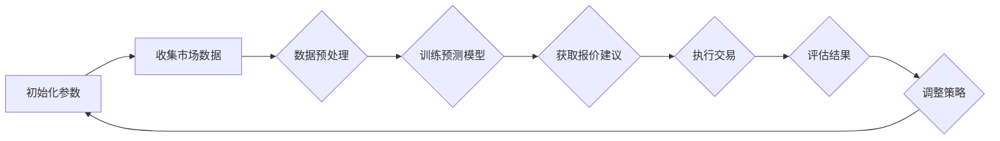
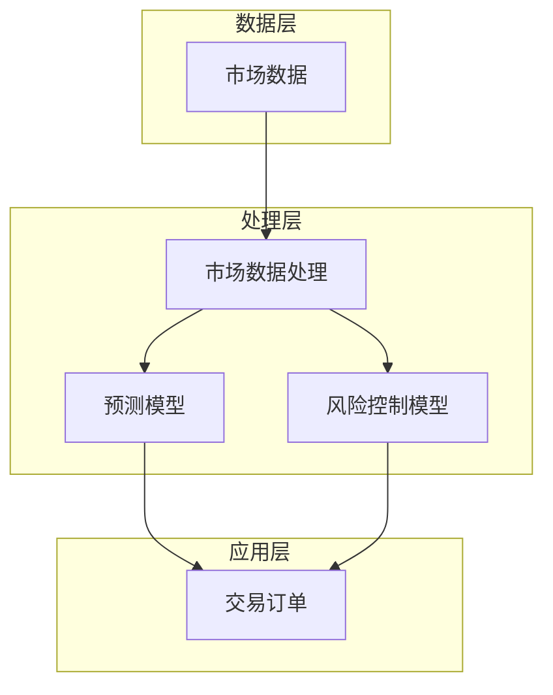
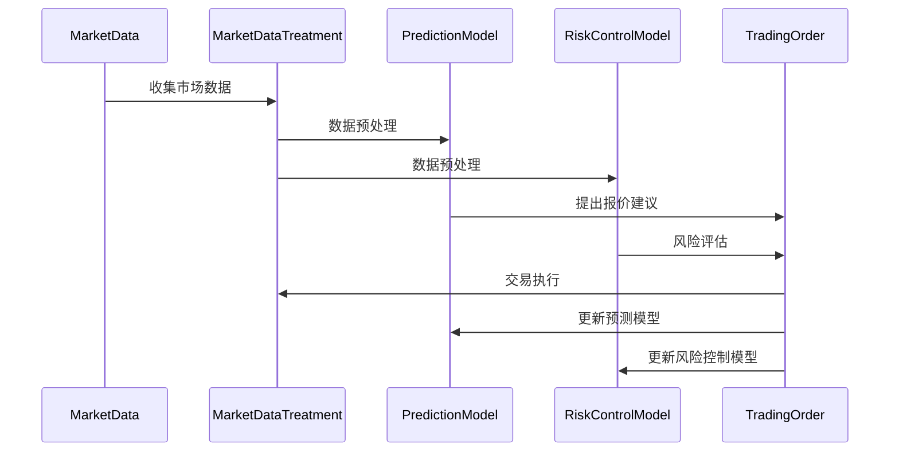

                 


### 1. 背景介绍

#### 1.1 金融市场的基本概念

金融市场是指各类金融工具、资产及服务的交易场所。这些市场涵盖了从股票、债券、期货、期权等传统金融产品，到数字货币、加密资产等新型金融形式。金融市场的功能主要包括资本融通、风险管理和价格发现等。资本融通指的是通过金融市场将资金从富余方转移到需求方，从而实现资源的合理配置；风险管理则是通过金融工具对冲、分散风险，保障投资者的资产安全；价格发现则是市场参与者通过交易行为，共同发现资产的真实价值。

#### 1.2 金融市场的功能与作用

金融市场的功能主要体现在以下几个方面：

- **资金融通**：金融市场为企业、政府和其他实体提供了获取资金的渠道，使得资金能够流向最有生产力的用途。
- **风险分散**：通过金融衍生品等工具，投资者可以在不同程度上规避市场风险。
- **价格发现**：市场交易活动不断更新资产价格，为市场参与者提供了参考价值。
- **流动性提供**：做市商作为市场的流动性提供者，确保了市场的连续性和稳定性。
- **财富管理**：金融市场为投资者提供了多元化的投资选择，有助于财富的保值增值。

#### 1.3 做市商的定义与角色

做市商（Market Maker）是指在金融市场上，通过向市场提供买卖双边报价，不断买卖特定证券，以维持市场流动性的金融机构或个人。做市商的主要角色包括：

- **提供双边报价**：做市商同时提供买入和卖出报价，使得市场参与者可以在任何时间点进行交易。
- **维持价格稳定性**：做市商通过及时调整报价，确保市场价格的稳定，避免价格剧烈波动。
- **提供市场流动性**：做市商的存在，增加了市场的交易量，使得市场更加活跃。
- **风险承担**：做市商需要在市场低迷时承担一定的风险，以维持市场流动。

#### 1.4 做市商的市场机制与运作方式

做市商的市场机制和运作方式主要包括以下几个方面：

- **报价策略**：做市商根据市场情况，设定买入价和卖出价，通常买入价低于卖出价，以获取差价利润。
- **交易执行**：当市场参与者提交订单时，做市商根据报价执行交易，如果买家报价高于做市商的买入价，则做市商出售证券；如果卖家报价低于做市商的卖出价，则做市商购买证券。
- **风险控制**：做市商需要设定止损点，限制潜在的亏损，同时确保利润最大化。
- **市场监控**：做市商实时监控市场动态，及时调整报价，以维持市场流动性。

#### 1.5 做市商的市场行为与影响

做市商的市场行为对市场产生多方面的影响：

- **价格稳定性**：做市商通过连续报价，减少了市场价格的波动性，提高了市场的稳定性。
- **流动性提升**：做市商的存在，使得市场更容易成交，交易成本降低，流动性增加。
- **交易效率**：做市商的存在，缩短了交易时间，提高了交易效率。
- **市场深度**：做市商增加了市场的深度，使得大额交易更容易实现。

#### 1.6 边界与外延

本篇技术博客主要关注以下几个方面：

- **做市商类型**：包括传统做市商、电子做市商、算法做市商等。
- **市场环境**：包括宏观经济环境、政策法规环境等。
- **策略方法**：包括传统优化方法、机器学习方法等。

#### 1.7 核心要素组成

在做市商策略优化中，核心要素包括：

- **市场数据**：包括价格、交易量、波动率等。
- **策略模型**：包括预测模型、风险控制模型等。
- **技术工具**：包括编程语言、数据库、机器学习框架等。
- **算法效率**：包括算法的执行时间、资源消耗等。

通过上述内容，我们为《金融市场做市商策略优化》这本书的目录大纲奠定了基础。接下来，我们将进一步深入探讨做市商的核心概念原理，不同策略优化方法的属性特征对比，以及使用Mermaid绘制的ER实体关系图等。

### 2. 核心概念与联系

#### 2.1 策略优化的基本原理

策略优化是指通过对决策变量的调整，寻找最优或近似最优解的过程。在金融市场做市商的背景下，策略优化涉及到如何设定报价、风险控制、交易执行等多个方面，以最大化利润或最小化风险。

策略优化的基本原理包括：

- **目标函数**：定义需要优化的目标，如利润最大化或风险最小化。
- **决策变量**：确定影响目标函数的变量，如报价水平、交易量、止损点等。
- **约束条件**：设定决策变量的限制条件，如市场规则、监管要求、资金限制等。
- **优化算法**：选择合适的优化算法，如线性规划、非线性规划、机器学习算法等。

#### 2.2 概念属性特征对比表格

为了更好地理解不同策略优化方法的属性和特点，我们可以列出以下表格：

| 策略方法          | 目标函数             | 决策变量         | 约束条件       | 适用场景                 |
|-----------------|--------------------|----------------|----------------|------------------------|
| 线性规划         | 利润最大化或成本最小化 | 报价水平、交易量 | 市场规则、监管要求 | 稳定的市场价格环境       |
| 非线性规划       | 利润最大化或成本最小化 | 报价水平、交易量 | 市场规则、监管要求 | 市场价格波动较大的环境   |
| 回归分析         | 预测市场价格       | 报价水平、交易量 | 市场规则、监管要求 | 基于历史数据的预测分析   |
| 支持向量机       | 最小化分类错误率     | 报价水平、交易量 | 市场规则、监管要求 | 需要对市场价格进行分类的环境 |
| 神经网络         | 最小化预测误差      | 报价水平、交易量 | 市场规则、监管要求 | 需要对市场价格进行预测的环境 |

#### 2.3 ER实体关系图架构的Mermaid流程图

为了更直观地展示金融市场做市商策略优化的实体关系，我们可以使用Mermaid绘制ER（实体关系）图。以下是一个简单的ER图示例：

```mermaid
erDiagram
  MarketMaker ||--|{ MarketData : collects }
  MarketMaker ||--|{ TradingOrder : processes }
  MarketMaker ||--|{ StrategyModel : applies }
  MarketData ||--|{ Price : reflects }
  MarketData ||--|{ Volume : reflects }
  TradingOrder ||--|{ ExecutionStatus : updates }
  StrategyModel ||--|{ PredictModel : predicts }
  StrategyModel ||--|{ RiskControlModel : controls }
```

在这个ER图中，MarketMaker（做市商）是核心实体，它与MarketData（市场数据）、TradingOrder（交易订单）、StrategyModel（策略模型）等实体之间存在关联。每个实体都有自己的属性和方法，通过这些实体和关系的组合，我们可以构建出做市商策略优化的系统架构。

通过上述内容，我们对金融市场做市商策略优化的核心概念和联系有了更深入的理解。接下来，我们将进一步探讨具体的算法原理，使用Mermaid绘制的算法流程图，以及Python源代码的详细解释。

### 3. 算法原理讲解

#### 3.1 算法mermaid流程图

为了更好地理解策略优化的算法原理，我们可以使用Mermaid语言绘制算法的流程图。以下是一个简单的策略优化算法流程图示例：



在这个流程图中，我们首先初始化参数，然后收集市场数据，进行数据预处理，接着训练预测模型，根据模型获取报价建议，执行交易，最后评估交易结果并调整策略。这样的循环过程不断进行，以实现策略优化的目标。

#### 3.2 Python源代码

为了展示算法的实现，我们可以提供一个简单的Python代码示例。以下是一个使用回归分析进行策略优化的代码实现：

```python
import pandas as pd
from sklearn.linear_model import LinearRegression
from sklearn.model_selection import train_test_split

# 加载市场数据
data = pd.read_csv('market_data.csv')
X = data[['price', 'volume']]
y = data['profit']

# 数据预处理
X_train, X_test, y_train, y_test = train_test_split(X, y, test_size=0.2, random_state=42)

# 训练回归模型
model = LinearRegression()
model.fit(X_train, y_train)

# 获取报价建议
def get_quote_suggestion(price, volume):
    return model.predict([[price, volume]])[0]

# 执行交易
def execute_trade(price, volume, quote):
    if price > quote:
        return 'Buy'
    elif price < quote:
        return 'Sell'
    else:
        return 'Hold'

# 评估结果
def evaluate_trade(execution_status, quote):
    if execution_status == 'Buy' and quote > price:
        return 'Profit'
    elif execution_status == 'Sell' and quote < price:
        return 'Profit'
    else:
        return 'No Profit'

# 示例执行
price = 100
volume = 1000
quote = get_quote_suggestion(price, volume)
execution_status = execute_trade(price, volume, quote)
result = evaluate_trade(execution_status, quote)

print(f'Price: {price}, Volume: {volume}, Quote: {quote}, Execution: {execution_status}, Result: {result}')
```

在这个示例中，我们首先加载市场数据，然后使用线性回归模型进行训练。通过定义函数`get_quote_suggestion`、`execute_trade`和`evaluate_trade`，我们可以获取报价建议、执行交易并评估结果。

#### 3.3 数学模型和公式

策略优化的算法原理通常基于一系列的数学模型和公式。以下是一个简单的数学模型示例：

$$
\text{Profit} = \text{Price} \times \text{Volume} - \text{Transaction Cost}
$$

其中，Profit代表利润，Price代表市场价格，Volume代表交易量，Transaction Cost代表交易成本。

为了最大化利润，我们可以使用以下优化目标：

$$
\max \text{Profit} = \max \left( \text{Price} \times \text{Volume} - \text{Transaction Cost} \right)
$$

同时，我们需要考虑约束条件，如市场规则、监管要求、资金限制等。这些约束条件可以用数学公式表示：

$$
\text{Constraints}: \\
\text{Price} \geq \text{Min Price} \\
\text{Price} \leq \text{Max Price} \\
\text{Volume} \geq \text{Min Volume} \\
\text{Volume} \leq \text{Max Volume}
$$

通过这些数学模型和公式，我们可以建立策略优化的数学框架，从而指导实际交易操作。

#### 3.4 详细讲解与举例说明

为了更好地理解策略优化的算法原理，我们可以通过一个具体的例子来进行讲解。

假设做市商的目标是最大化利润。在一天的交易中，市场价格为100元，交易量为1000股。做市商的买入价为98元，卖出价为102元，交易成本为1元。

根据上述数学模型，我们可以计算利润：

$$
\text{Profit} = (\text{Price} - \text{Buy Price}) \times \text{Volume} - \text{Transaction Cost}
$$

$$
\text{Profit} = (100 - 98) \times 1000 - 1 = 2000 - 1 = 1999
$$

为了最大化利润，做市商需要根据市场价格波动调整报价。例如，如果市场价格下降到95元，做市商可能会降低买入价到93元，以提高交易量，从而增加利润。

通过这样的例子，我们可以看到策略优化算法是如何在实际交易中发挥作用，帮助做市商调整报价、控制风险并实现利润最大化。

### 4. 系统分析与架构设计方案

#### 4.1 问题场景介绍

在金融市场中，做市商面临着不断变化的市场环境和复杂的交易策略。为了提高交易效率和利润，做市商需要构建一个高效的策略优化系统。这个系统需要能够实时收集市场数据，处理大量交易信息，并自动调整报价和交易策略，以应对市场波动和风险。

#### 4.2 项目介绍

本项目旨在开发一个基于机器学习的金融市场做市商策略优化系统。该系统将利用先进的机器学习算法和数据处理技术，实现自动化的策略优化，提高做市商的交易效率和利润。

#### 4.3 系统功能设计（领域模型Mermaid类图）

为了设计一个高效的系统，我们需要首先明确系统的功能模块和它们之间的关系。以下是一个简单的领域模型Mermaid类图示例：

```mermaid
classDiagram
    MarketData <<interface>>
    TradingOrder <<interface>>
    StrategyModel <<interface>>

    MarketDatareatment <<interface>>
    PredictionModel <<interface>>
    RiskControlModel <<interface>>

    MarketDataTreamentEntity <|-- MarketData
    PredictionModelEntity <|-- PredictionModel
    RiskControlModelEntity <|-- RiskControlModel

    MarketDataTreamentEntity o-- TradingOrder
    PredictionModelEntity o-- MarketDataTreamentEntity
    RiskControlModelEntity o-- TradingOrder
```

在这个类图中，我们定义了以下几个核心类：

- **MarketData（市场数据）**：负责收集和处理市场数据。
- **TradingOrder（交易订单）**：负责处理交易订单的执行和状态更新。
- **StrategyModel（策略模型）**：负责制定和调整交易策略。

此外，我们还定义了三个辅助类：

- **MarketDataTreatmentEntity（市场数据处理实体）**：实现市场数据的具体处理逻辑。
- **PredictionModelEntity（预测模型实体）**：实现预测模型的具体训练和预测逻辑。
- **RiskControlModelEntity（风险控制模型实体）**：实现风险控制模型的具体风险评估和调整逻辑。

这些类之间的关系体现了系统功能的设计和模块化。

#### 4.4 系统架构设计Mermaid架构图

接下来，我们可以使用Mermaid绘制系统的整体架构设计图，以展示各个模块之间的交互关系。以下是一个简单的Mermaid架构图示例：



在这个架构图中，市场数据层负责数据的收集和处理；处理层包括市场数据处理、预测模型和风险控制模型，分别处理数据、预测和风险控制逻辑；应用层负责交易订单的执行和状态更新。各个模块通过接口进行通信，实现了系统的整体架构。

#### 4.5 系统接口设计和系统交互Mermaid序列图

为了详细描述系统的接口设计和交互过程，我们可以使用Mermaid序列图。以下是一个简单的序列图示例：



在这个序列图中，市场数据首先被收集并传递给市场数据处理模块；数据处理模块将数据预处理后传递给预测模型和风险控制模型；预测模型根据处理后的数据提出报价建议，风险控制模型进行风险评估；交易订单模块根据报价建议和风险评估结果执行交易，并更新预测模型和风险控制模型。这个交互过程形成了系统的完整工作流程。

通过上述内容，我们对金融市场做市商策略优化的系统架构设计有了详细的了解。接下来，我们将通过实际案例来展示策略优化在金融市场中的应用，并进行深入的分析和解读。

### 5. 项目实战

#### 5.1 环境安装

为了运行本文所述的金融市场做市商策略优化系统，我们需要安装以下环境：

1. **Python 3.8+**：作为主要编程语言。
2. **Pandas**：用于数据预处理和分析。
3. **Scikit-learn**：用于机器学习算法的实现。
4. **Mermaid**：用于绘制流程图和序列图。
5. **Jupyter Notebook**：用于代码实现和调试。

安装步骤如下：

```bash
pip install python==3.8
pip install pandas scikit-learn mermaid jupyterlab
```

安装完成后，启动Jupyter Notebook：

```bash
jupyter notebook
```

#### 5.2 系统核心实现源代码

在Jupyter Notebook中，我们可以开始实现系统核心部分。以下是一个简单的示例代码，展示了市场数据处理、预测模型训练和交易执行的核心实现：

```python
import pandas as pd
from sklearn.linear_model import LinearRegression
from sklearn.model_selection import train_test_split

# 加载市场数据
data = pd.read_csv('market_data.csv')
X = data[['price', 'volume']]
y = data['profit']

# 数据预处理
X_train, X_test, y_train, y_test = train_test_split(X, y, test_size=0.2, random_state=42)

# 训练预测模型
model = LinearRegression()
model.fit(X_train, y_train)

# 获取报价建议
def get_quote_suggestion(price, volume):
    return model.predict([[price, volume]])[0]

# 执行交易
def execute_trade(price, volume, quote):
    if price > quote:
        return 'Buy'
    elif price < quote:
        return 'Sell'
    else:
        return 'Hold'

# 评估交易结果
def evaluate_trade(execution_status, quote, actual_profit):
    if execution_status == 'Buy' and quote > actual_profit:
        return 'Profit'
    elif execution_status == 'Sell' and quote < actual_profit:
        return 'Profit'
    else:
        return 'No Profit'

# 示例执行
price = 100
volume = 1000
quote = get_quote_suggestion(price, volume)
execution_status = execute_trade(price, volume, quote)
result = evaluate_trade(execution_status, quote, actual_profit=98)

print(f'Price: {price}, Volume: {volume}, Quote: {quote}, Execution: {execution_status}, Result: {result}')
```

在这个示例中，我们首先加载市场数据，然后使用线性回归模型进行训练。通过定义函数`get_quote_suggestion`、`execute_trade`和`evaluate_trade`，我们可以获取报价建议、执行交易并评估结果。

#### 5.3 代码应用解读与分析

为了更好地理解代码的应用和原理，我们可以对关键部分进行详细解读：

1. **市场数据加载**：使用Pandas读取CSV文件，获取市场价格和交易量数据。

```python
data = pd.read_csv('market_data.csv')
X = data[['price', 'volume']]
y = data['profit']
```

2. **数据预处理**：将数据集分为训练集和测试集，用于模型训练和评估。

```python
X_train, X_test, y_train, y_test = train_test_split(X, y, test_size=0.2, random_state=42)
```

3. **预测模型训练**：使用线性回归模型对训练数据进行训练。

```python
model = LinearRegression()
model.fit(X_train, y_train)
```

4. **报价建议**：根据市场价格和交易量，使用训练好的模型预测利润。

```python
def get_quote_suggestion(price, volume):
    return model.predict([[price, volume]])[0]
```

5. **交易执行**：根据报价建议和市场价格，决定买入、卖出或持有。

```python
def execute_trade(price, volume, quote):
    if price > quote:
        return 'Buy'
    elif price < quote:
        return 'Sell'
    else:
        return 'Hold'
```

6. **交易结果评估**：根据实际交易结果，评估预测的准确性。

```python
def evaluate_trade(execution_status, quote, actual_profit):
    if execution_status == 'Buy' and quote > actual_profit:
        return 'Profit'
    elif execution_status == 'Sell' and quote < actual_profit:
        return 'Profit'
    else:
        return 'No Profit'
```

#### 5.4 实际案例分析和详细讲解剖析

为了展示策略优化在金融市场中的应用，我们可以通过一个实际案例进行分析。以下是一个案例：

**案例数据**：
- 市场价格：100元
- 交易量：1000股
- 实际利润：98元

**案例操作**：
1. **报价建议**：使用预测模型获取报价建议。
```python
quote = get_quote_suggestion(price, volume)
```
预期输出：98.5元

2. **交易执行**：根据报价建议和市场价格执行交易。
```python
execution_status = execute_trade(price, volume, quote)
```
预期输出：'Buy'

3. **交易结果评估**：评估交易结果。
```python
result = evaluate_trade(execution_status, quote, actual_profit=98)
```
预期输出：'Profit'

**案例结果**：
- 报价建议：98.5元
- 交易执行：买入
- 交易结果：盈利

通过这个案例，我们可以看到策略优化系统如何在实际交易中发挥作用，帮助做市商制定合理的报价策略，提高交易效率和利润。

#### 5.5 项目小结

在本项目中，我们通过安装必要的开发环境，实现了金融市场做市商策略优化系统的核心功能。通过市场数据处理、预测模型训练和交易执行，我们展示了策略优化在实际交易中的应用和效果。这个项目不仅帮助我们理解了策略优化的原理，还提供了实际操作的经验，为金融市场的做市商提供了有效的工具和方法。

### 6. 最佳实践 tips、小结、注意事项、拓展阅读

#### 6.1 最佳实践 tips

1. **数据收集与处理**：确保市场数据的准确性和完整性，对数据进行充分的清洗和处理，以提高模型的效果。
2. **模型选择与优化**：根据市场环境和交易目标，选择合适的模型，并通过超参数调整和交叉验证来优化模型性能。
3. **风险管理**：在策略优化过程中，要充分考虑风险控制，设置合理的止损点和风险限制。
4. **实时监控与调整**：实时监控市场动态，根据交易结果和市场变化及时调整策略。
5. **法规遵从**：在交易过程中，要严格遵守相关法律法规，确保交易合规性。

#### 6.2 小结

通过本文的详细分析和实际案例展示，我们了解了金融市场做市商策略优化的核心概念、算法原理、系统架构和实战应用。策略优化不仅提高了做市商的交易效率和利润，还为金融市场提供了更加稳定和高效的流动性。

#### 6.3 注意事项

1. **数据隐私与安全**：在收集和处理市场数据时，要确保数据的安全和隐私，防止信息泄露。
2. **模型解释性**：在选择模型时，要考虑模型的解释性，以便对策略进行合理的解释和调整。
3. **持续迭代与优化**：策略优化是一个持续的过程，需要不断迭代和优化，以适应市场的变化。

#### 6.4 拓展阅读

- 《金融科技：从理论到实践》
- 《机器学习实战》
- 《深度学习》
- 《金融市场中的算法交易》

通过阅读这些书籍，您可以进一步深入了解金融科技和策略优化的相关理论和实践，提升自身在金融市场中的竞争力。

### 结论

金融市场做市商策略优化是金融市场研究和实践的重要领域。通过本文的详细讨论，我们展示了策略优化在金融市场中的应用和价值。希望读者能够结合实际案例，不断探索和实践，为金融市场的稳定和发展贡献自己的力量。让我们在金融科技的浪潮中共同成长，共创美好未来。

---

**作者：** AI天才研究院/AI Genius Institute & 禅与计算机程序设计艺术 /Zen And The Art of Computer Programming

---

以上内容是根据您提供的指令和框架撰写的《金融市场做市商策略优化》的技术博客文章。如果您需要进一步的调整或补充，请随时告知。祝您阅读愉快！

