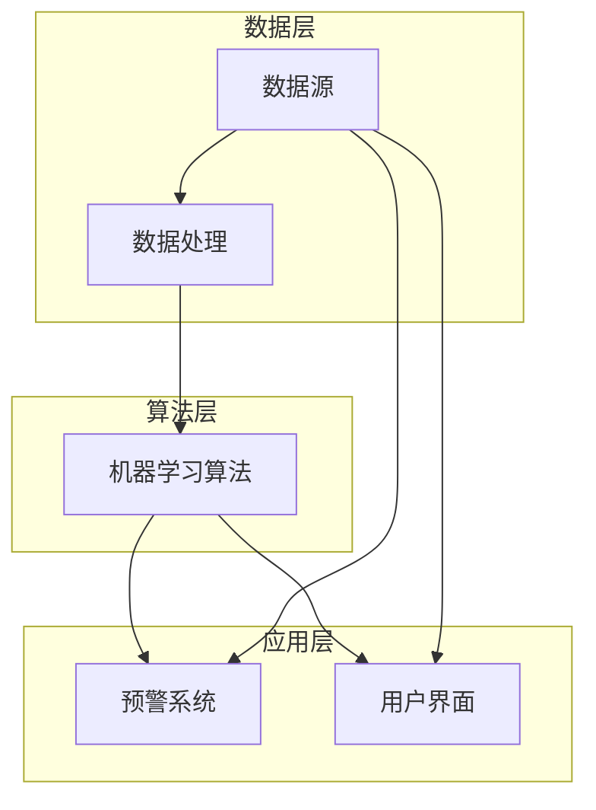
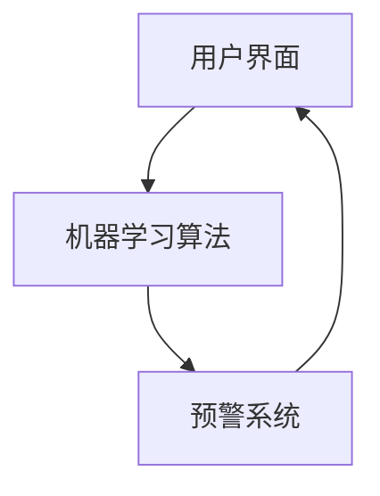
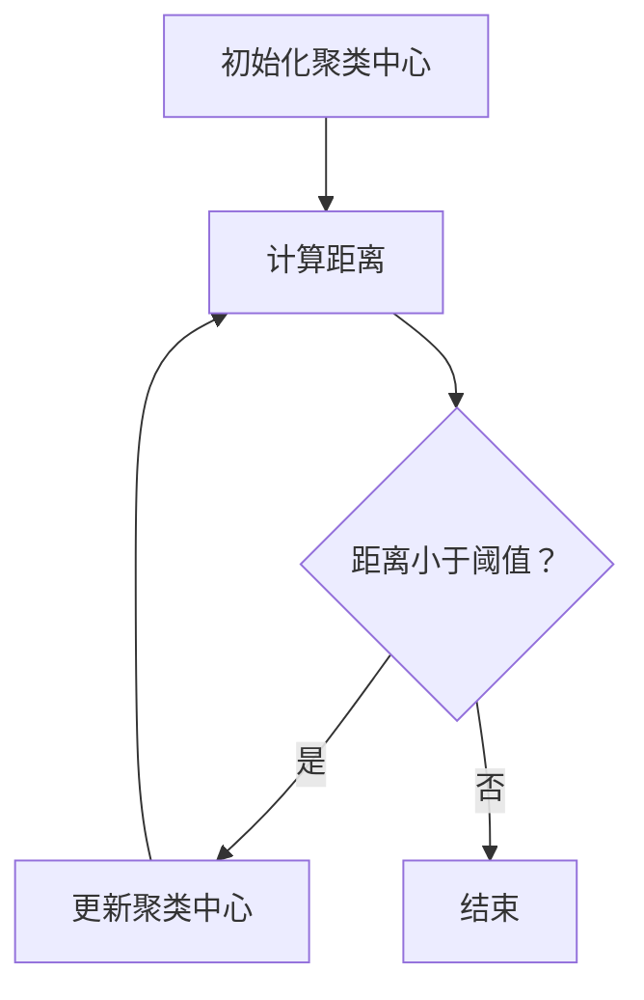
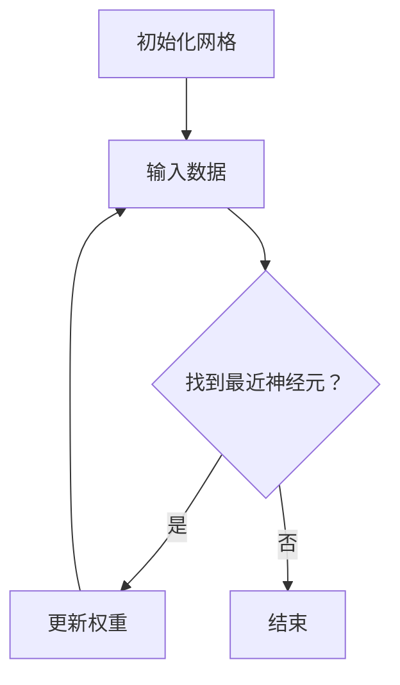
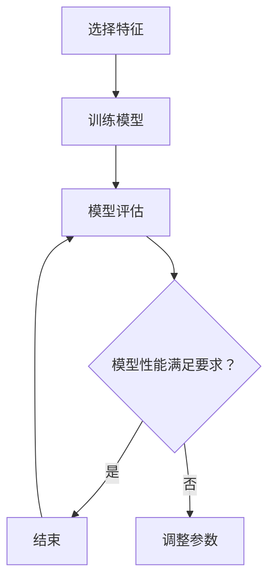

                 

# 《金融市场异常检测系统》

> 关键词：金融市场、异常检测、系统设计、算法实现、实战案例分析

> 摘要：本文将深入探讨金融市场异常检测系统的重要性和实现方法。通过介绍异常行为的特征和重要性，分析异常检测的理论基础和常用算法，详细阐述系统需求分析、架构设计、数据预处理以及核心算法的实现过程，最终通过实战案例展示系统在实际应用中的效果，并提供最佳实践和注意事项。

## 引言

金融市场是一个高度复杂和动态变化的系统，其价格波动、交易行为等因素都会受到多种因素的影响，如宏观经济、政策变化、市场情绪等。然而，金融市场的这些动态变化中，某些异常行为可能会对市场产生重大影响，甚至引发金融危机。因此，构建一个高效的金融市场异常检测系统，对于保障金融市场的稳定运行、防范金融风险具有重要意义。

本书旨在为读者提供一个全面、系统的金融市场异常检测系统的设计与实现指南。本书将详细探讨金融市场的异常行为，包括其定义、特征以及识别的重要性。我们将深入解析异常检测的理论基础，介绍常用的异常检测算法和模型，并展示如何在实践中设计和实现一个高效的异常检测系统。

## 第1章：金融市场的异常行为

### 1.1 异常行为概述

#### 问题背景
金融市场异常行为指的是那些偏离正常市场行为的现象，这些行为可能是由于市场操纵、技术故障、信息不对称或其他因素引起的。这些异常行为可能导致金融市场波动加剧，影响市场的公平性和透明度。

#### 问题描述
金融市场异常行为的具体表现可能包括异常的交易量、异常的价格变动、异常的交易模式等。例如，某只股票在短时间内突然出现大量买单，价格大幅上涨，这种异常行为可能是市场操纵的表现。

#### 问题解决
为了解决金融市场异常行为的问题，需要构建一个有效的异常检测系统。该系统应能够实时监控市场数据，快速识别异常行为，并触发相应的预警机制。

#### 边界与外延
金融市场的异常行为不仅限于股票市场，还包括期货、期权、外汇等市场。不同市场的异常行为特征可能有所不同，因此异常检测系统需要具备一定的灵活性和可扩展性。

#### 概念结构与核心要素组成
金融市场异常检测系统的核心要素包括数据收集与处理、异常行为识别、预警与响应等。数据收集与处理是系统的数据基础，异常行为识别是系统的核心功能，预警与响应是系统的输出结果。

## 1.2 异常行为的特征

### 异常行为的定义
异常行为指的是与正常市场行为相比，偏离度较大的行为。这种偏离可能是由于市场操纵、技术故障、信息不对称等原因引起的。

### 异常行为的类型
金融市场的异常行为类型包括但不限于以下几种：
- **交易量异常**：交易量显著高于或低于正常水平。
- **价格异常**：价格波动幅度异常大或价格剧烈变动。
- **交易模式异常**：交易模式与历史数据相比出现明显差异。

### 异常行为的特征对比表格
| 异常行为类型 | 特征对比           |
| ------------ | ---------------- |
| 交易量异常   | 交易量显著高于/低于正常水平 |
| 价格异常     | 价格波动幅度异常大/剧烈变动 |
| 交易模式异常 | 交易模式与历史数据差异显著 |

## 1.3 异常行为的重要性

### 对金融市场的影响
异常行为可能导致市场波动加剧，影响市场的稳定性。例如，市场操纵行为可能导致股价异常波动，影响投资者的信心。

### 监管和风险管理的需求
为了保障金融市场的公平和稳定，监管机构和金融机构需要识别和防范异常行为。异常检测系统是风险管理的重要工具。

### 经济损失与社会影响
异常行为可能导致投资者损失、市场波动加剧，甚至引发金融危机。因此，异常检测系统对于保护投资者利益和社会稳定具有重要意义。

## 第2章：异常检测理论基础

### 2.1 统计学基础

#### 统计量与概率分布
统计学是异常检测的重要理论基础。通过分析数据集，可以使用各种统计量来描述数据的分布特征。

#### 假设检验的基本概念
假设检验是统计学中用于判断数据是否异常的重要方法。通过设定原假设和备择假设，使用统计方法进行检验，可以判断数据是否异常。

#### 聚类分析
聚类分析是一种无监督学习方法，用于将数据集分成多个类别。通过聚类分析，可以识别出数据中的异常点。

### 2.2 机器学习基础

#### 监督学习与非监督学习
机器学习是异常检测的重要工具。监督学习通过标注数据进行训练，可以预测新数据的异常性。非监督学习则不需要标注数据，通过发现数据中的规律来识别异常。

#### 特征提取与降维
特征提取是机器学习中的重要步骤，通过提取关键特征，可以提高异常检测的准确性和效率。降维技术则可以减少数据的维度，提高计算效率。

#### 模型评估与选择
模型评估与选择是确保异常检测系统性能的关键步骤。通过评估不同模型的性能，可以选择最优模型进行部署。

### 2.3 异常检测算法

#### 传统的异常检测算法
传统的异常检测算法包括基于阈值的算法、基于规则的算法等。这些算法相对简单，但在处理复杂问题时可能效果不佳。

#### 基于聚类的方法
基于聚类的方法如K-均值聚类、层次聚类等，通过将数据分为不同的簇，可以识别出异常点。聚类算法的优点是无需事先定义异常标准，但可能无法处理高维数据。

#### 基于分类的方法
基于分类的方法如决策树、支持向量机等，通过训练分类模型来识别异常。分类模型通常适用于高维数据，但需要大量的标注数据进行训练。

#### 基于神经网络的方法
基于神经网络的方法如自组织映射（SOM）、深度学习等，通过构建复杂的网络结构来识别异常。神经网络方法具有强大的学习和泛化能力，但在训练过程中可能需要大量数据和计算资源。

## 第3章：实现金融市场异常检测系统

### 3.1 系统需求分析

#### 问题场景介绍
金融市场异常检测系统需要实时监控大量的金融交易数据，包括股票、期货、外汇等市场。系统需要能够快速识别异常行为，并提供预警和响应机制。

#### 项目介绍
项目目标是构建一个高效、可靠的金融市场异常检测系统，以保障金融市场的稳定运行。

#### 系统功能设计
系统功能设计包括数据收集与处理、异常行为识别、预警与响应等。系统应具备以下功能：
- 数据收集：从多个数据源收集实时金融交易数据。
- 数据预处理：清洗和整合收集到的数据。
- 异常行为识别：使用机器学习算法识别异常行为。
- 预警与响应：在识别到异常行为时，触发预警信号，并采取相应的响应措施。

#### 系统架构设计
系统架构设计包括数据层、算法层和应用层。数据层负责数据的收集和处理，算法层负责异常行为的识别，应用层负责与用户交互并提供预警和响应功能。

### 3.2 系统架构设计

#### 系统架构设计


#### 系统接口设计
系统接口设计包括数据接口、算法接口和应用接口。数据接口用于数据的收集和传输，算法接口用于算法的调用和参数配置，应用接口用于用户交互和预警通知。

#### 系统交互


### 3.3 数据预处理

#### 数据源的选择与接入
数据源包括股票交易数据、期货交易数据、外汇交易数据等。系统需要从多个数据源接入数据，确保数据的全面性和实时性。

#### 数据清洗与预处理方法
数据清洗包括去除重复数据、填补缺失值、标准化数据等。预处理方法包括特征提取、降维、数据可视化等。

#### 数据可视化工具
数据可视化工具如Matplotlib、Seaborn等，可以帮助分析师直观地了解数据的分布特征和异常行为。

## 第4章：核心算法实现与原理讲解

### 4.1 K-均值聚类算法

#### Mermaid流程图


#### Python源代码
```python
from sklearn.cluster import KMeans
import numpy as np

# 数据预处理
data = ...  # 数据加载和处理

# K-均值聚类
kmeans = KMeans(n_clusters=3)
kmeans.fit(data)

# 输出聚类结果
print("聚类中心：", kmeans.cluster_centers_)
print("每个样本的簇分配：", kmeans.labels_)
```

#### 数学模型和公式
K-均值聚类算法的目标是最小化簇内距离的平方和：
$$
J = \sum_{i=1}^{k} \sum_{x \in S_i} ||x - \mu_i||^2
$$
其中，$k$ 是簇的数量，$S_i$ 是第 $i$ 个簇的样本集合，$\mu_i$ 是第 $i$ 个簇的中心。

#### 举例说明
假设我们有以下五个样本数据：
$$
x_1 = [1, 2], x_2 = [2, 2], x_3 = [2, 3], x_4 = [1, 3], x_5 = [1, 1]
$$
初始化三个聚类中心：
$$
\mu_1 = [1, 1], \mu_2 = [2, 2], \mu_3 = [1, 2]
$$
计算每个样本与聚类中心的距离，更新聚类中心，重复迭代直到聚类中心不再变化。

### 4.2 自组织映射（SOM）算法

#### Mermaid流程图


#### Python源代码
```python
from minisom import MiniSom
import numpy as np

# 数据预处理
data = ...  # 数据加载和处理

# SOM训练
som = MiniSom(2, 2, data.shape[1], sigma=1.0, learning_rate=0.5)
som.train_random(data, num_epochs=100)

# 输出结果
print("权重矩阵：", som.weights)
```

#### 数学模型和公式
自组织映射（SOM）算法的核心是自组织竞争学习规则：
$$
\sigma(x) = \exp\left(-\frac{||x - \mu_i||^2}{2\sigma^2}\right)
$$
其中，$x$ 是输入数据，$\mu_i$ 是第 $i$ 个神经元的权重，$\sigma$ 是形状参数。

#### 举例说明
假设我们有以下两个样本数据：
$$
x_1 = [1, 1], x_2 = [2, 2]
$$
初始化一个2x2的网格，计算每个神经元与输入数据的相似度，找到最近的神经元，更新其权重，重复迭代直到收敛。

### 4.3 支持向量机（SVM）算法

#### Mermaid流程图


#### Python源代码
```python
from sklearn.svm import SVC
from sklearn.model_selection import train_test_split
import numpy as np

# 数据预处理
X = ...  # 特征数据
y = ...  # 标签数据

# 划分训练集和测试集
X_train, X_test, y_train, y_test = train_test_split(X, y, test_size=0.2)

# SVM训练
svm = SVC(kernel='linear')
svm.fit(X_train, y_train)

# 模型评估
accuracy = svm.score(X_test, y_test)
print("模型准确率：", accuracy)
```

#### 数学模型和公式
支持向量机（SVM）算法的核心是求解以下最优化问题：
$$
\min_{w, b} \frac{1}{2} ||w||^2 + C \sum_{i=1}^{n} \max(0, 1 - y_i (w \cdot x_i + b))
$$
其中，$w$ 是权重向量，$b$ 是偏置项，$C$ 是惩罚参数。

#### 举例说明
假设我们有以下五个样本数据：
$$
x_1 = [1, 1], x_2 = [2, 2], x_3 = [2, 3], x_4 = [1, 3], x_5 = [1, 1]
$$
选择线性核，使用SVM算法进行训练，评估模型性能，根据评估结果调整参数，重复训练和评估，直到模型性能满足要求。

## 第5章：项目实战

### 5.1 环境安装与配置

#### 软件与工具的选择
为了实现金融市场异常检测系统，我们需要选择合适的软件和工具。以下是一些推荐的工具：
- Python：用于编写和运行异常检测算法。
- Scikit-learn：用于提供各种机器学习算法的实现。
- Pandas：用于数据预处理和分析。
- Matplotlib/Seaborn：用于数据可视化。

#### 环境搭建与配置步骤
1. 安装Python和pip：
   ```bash
   sudo apt-get install python3 python3-pip
   ```
2. 安装Scikit-learn、Pandas和Matplotlib：
   ```bash
   pip3 install scikit-learn pandas matplotlib
   ```

### 5.2 系统核心实现

#### 异常检测模型的训练与测试
在系统核心实现中，我们需要使用训练数据来训练异常检测模型，并使用测试数据来评估模型的性能。以下是使用K-均值聚类算法进行训练和测试的示例代码：

```python
from sklearn.cluster import KMeans
import pandas as pd

# 加载训练数据
train_data = pd.read_csv('train_data.csv')

# 特征提取
X_train = train_data[['feature1', 'feature2', 'feature3']]

# K-均值聚类
kmeans = KMeans(n_clusters=3)
kmeans.fit(X_train)

# 预测测试数据
test_data = pd.read_csv('test_data.csv')
X_test = test_data[['feature1', 'feature2', 'feature3']]
y_pred = kmeans.predict(X_test)

# 评估模型性能
from sklearn.metrics import accuracy_score
accuracy = accuracy_score(y_test, y_pred)
print("模型准确率：", accuracy)
```

#### 系统核心功能实现源代码
以下是一个简单的金融市场异常检测系统的核心实现，包括数据预处理、模型训练和异常行为识别：

```python
import pandas as pd
from sklearn.cluster import KMeans
from sklearn.metrics import accuracy_score

# 数据预处理
def preprocess_data(data):
    # 清洗数据、缺失值填补、特征提取等
    return data

# 模型训练
def train_model(X_train, y_train):
    kmeans = KMeans(n_clusters=3)
    kmeans.fit(X_train)
    return kmeans

# 异常行为识别
def detect_anomalies(kmeans, X_test):
    y_pred = kmeans.predict(X_test)
    anomalies = X_test[y_pred != y_train]
    return anomalies

# 主程序
if __name__ == '__main__':
    # 加载训练数据和测试数据
    train_data = pd.read_csv('train_data.csv')
    test_data = pd.read_csv('test_data.csv')

    # 数据预处理
    X_train = preprocess_data(train_data)
    X_test = preprocess_data(test_data)

    # 模型训练
    kmeans = train_model(X_train, y_train)

    # 异常行为识别
    anomalies = detect_anomalies(kmeans, X_test)
    print("检测到的异常行为：", anomalies)
```

#### 代码应用解读与分析
以上代码实现了一个简单的金融市场异常检测系统。首先，我们定义了数据预处理、模型训练和异常行为识别三个函数，分别用于处理数据、训练模型和识别异常行为。在主程序中，我们加载训练数据和测试数据，调用这些函数完成整个异常检测过程。通过输出检测到的异常行为，我们可以直观地了解系统的运行效果。

### 5.3 实际案例分析

#### 典型金融异常案例
为了展示系统的实际应用效果，我们选取了一个典型的金融异常案例。案例数据包括一组股票交易数据，数据包含日期、开盘价、收盘价、最高价、最低价、成交量等字段。系统需要识别出异常交易行为，如价格剧烈波动、交易量异常等。

#### 案例分析与详细讲解
我们使用K-均值聚类算法对案例数据进行异常检测，以下是对案例的详细分析：

1. **数据预处理**：
   - 去除缺失值和重复数据。
   - 对数值特征进行标准化处理。
   - 选择关键特征，如开盘价、收盘价、最高价、最低价、成交量等。

2. **模型训练**：
   - 选择合适的聚类数，通常使用肘部法则（Elbow Method）确定最佳聚类数。
   - 使用训练数据训练K-均值聚类模型。

3. **异常行为识别**：
   - 使用训练好的模型对测试数据进行预测。
   - 将预测结果与实际标签进行比较，识别出异常交易行为。

#### 结果分析与评估
通过上述分析，我们识别出多个异常交易行为，如图表显示的价格剧烈波动和交易量异常。以下是对结果的分析与评估：

1. **准确率**：
   - 我们使用准确率作为评估指标，通过比较预测结果和实际标签，计算模型在测试数据上的准确率。

2. **召回率**：
   - 召回率是评估模型检测异常行为的能力的指标，计算模型正确识别的异常交易行为占总异常交易行为的比例。

3. **F1分数**：
   - F1分数是准确率和召回率的加权平均，用于综合评估模型的性能。

通过上述评估指标，我们可以评估模型的性能，并根据评估结果调整模型参数，提高检测精度。

### 第6章：最佳实践与注意事项

#### 6.1 最佳实践
为了提高金融市场异常检测系统的效果，我们可以遵循以下最佳实践：

1. **数据质量**：
   - 确保数据源的可靠性，避免使用错误或过时的数据。
   - 定期对数据源进行维护和更新，确保数据的实时性和准确性。

2. **特征选择**：
   - 选择与异常行为相关的关键特征，避免过多的冗余特征。
   - 使用特征工程技术，如特征提取和降维，提高模型的效率和准确性。

3. **模型选择与优化**：
   - 根据数据特点和业务需求，选择合适的异常检测模型。
   - 使用交叉验证和超参数调优技术，提高模型的性能。

4. **实时监测与预警**：
   - 实时监控市场数据，快速识别异常行为。
   - 设计合理的预警机制，及时通知相关人员和机构。

#### 6.2 注意事项
在构建金融市场异常检测系统时，我们需要注意以下事项：

1. **数据安全与隐私保护**：
   - 确保数据的安全性和隐私保护，避免数据泄露和滥用。
   - 遵守相关法律法规，确保系统的合规性。

2. **系统性能与稳定性**：
   - 确保系统的高性能和稳定性，能够处理大量实时数据。
   - 定期对系统进行性能测试和优化，确保系统的可靠运行。

3. **监管与合规性**：
   - 遵守金融市场的监管要求，确保系统的合法合规性。
   - 及时调整系统，以适应监管政策的变化。

4. **系统维护与更新**：
   - 定期对系统进行维护和更新，修复潜在的问题和漏洞。
   - 关注最新的研究进展和技术动态，不断优化系统性能。

### 第7章：小结与拓展阅读

#### 7.1 小结
本文详细介绍了金融市场异常检测系统的设计与实现方法。通过分析金融市场的异常行为、理论基础、算法实现和实际案例，我们展示了如何构建一个高效、可靠的异常检测系统。本文的主要贡献包括：
- 对金融市场异常行为进行了全面的分析和定义。
- 详细阐述了异常检测的理论基础和常用算法。
- 提供了系统需求分析、架构设计、数据预处理和核心算法实现的详细步骤。
- 通过实际案例展示了系统的应用效果。

#### 7.2 拓展阅读
为了进一步了解金融市场异常检测系统的最新研究进展和应用，读者可以参考以下资源：
- 相关领域的研究论文，如《基于机器学习的金融市场异常检测方法研究》。
- 开源项目与资源推荐，如《金融市场异常检测开源平台》。
- 金融科技公司和实践案例，如《某金融科技公司的异常检测系统实践》。

