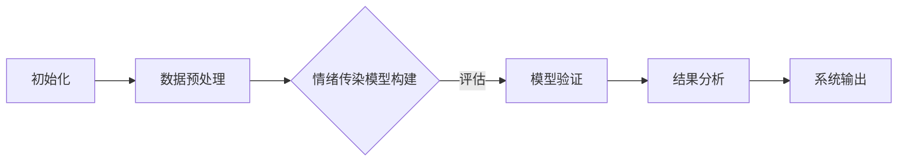
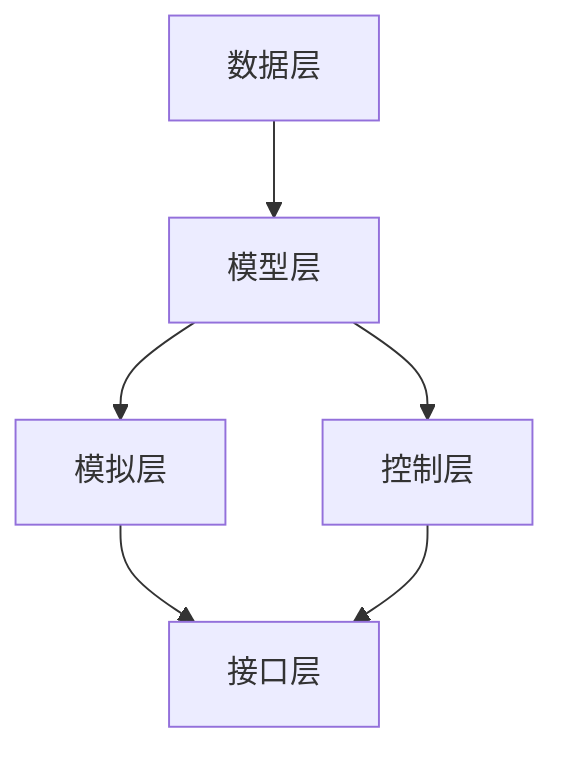

                 

## 金融情绪传染效应模拟与控制系统

### 关键词：金融市场、情绪传染、模拟与控制系统、情绪传染模型、算法原理、系统分析与架构设计

### 摘要：

本文旨在深入探讨金融市场中的情绪传染效应，并设计一套模拟与控制系统。首先，文章介绍了金融市场情绪传染现象的背景，探讨了情绪传染的影响及研究意义。随后，对情绪传染的定义、类型、研究范围与边界进行了详细阐述。接着，文章介绍了情绪传染模型构建、效应分析和模拟与控制系统设计的方法。本文通过逻辑清晰、结构紧凑的论述，为读者提供了对金融市场情绪传染效应的全面理解和实践指导。

----------------------------------------------------------------

# 第一部分：引言

## 1.1 问题背景

### 1.1.1 金融市场的情绪传染现象

金融市场是全球经济体系的核心，其稳定性和健康程度对整个经济系统具有重要影响。然而，金融市场并非总是理性运作，其中存在着复杂的社会心理因素，如投资者情绪、市场预期等。情绪传染效应是指市场中的投资者通过信息传播、模仿行为等方式，相互影响其投资决策和情绪状态的现象。

情绪传染效应在金融市场中表现为市场情绪的波动，如恐慌、贪婪等情绪的蔓延。这种现象不仅可能导致市场剧烈波动，还可能引发金融危机。因此，研究和控制金融市场中的情绪传染效应具有重要的理论和实际意义。

### 1.1.2 情绪传染的影响及研究意义

情绪传染对金融市场的影响是深远且广泛的。首先，情绪传染可能导致市场过度反应，使得价格偏离基本面，从而引发市场泡沫或崩溃。其次，情绪传染可能加剧市场波动，增加金融系统的风险。此外，情绪传染还可能影响投资者的信心和决策，进一步加剧市场的不稳定性。

研究情绪传染的影响和机制，有助于揭示金融市场波动的内在原因，为金融监管和风险管理提供科学依据。同时，设计和实施有效的情绪传染效应模拟与控制系统，可以预防和控制市场波动，提高金融市场的稳定性和透明度。

## 1.2 问题描述

### 1.2.1 情绪传染的定义

情绪传染是指个体通过信息交流、行为模仿等方式，从一个个体传递到另一个个体，从而改变其情绪状态的现象。在金融市场中，情绪传染是指投资者之间的情绪相互影响，导致市场情绪波动的现象。

### 1.2.2 情绪传染的类型

情绪传染在金融市场中主要表现为以下几种类型：

1. **正面情绪传染**：当市场出现积极信息时，投资者之间的正面情绪会相互传递，导致市场情绪整体上升。
2. **负面情绪传染**：当市场出现负面信息时，投资者之间的负面情绪会相互传递，导致市场情绪整体下降。
3. **周期性情绪传染**：市场情绪在一段时间内呈现出周期性波动，如股市的牛市和熊市。

### 1.2.3 研究范围与边界

本文的研究范围主要集中在金融市场中的情绪传染效应，包括情绪传染的类型、机制和影响。具体来说，研究将涵盖以下内容：

1. 情绪传染模型的理论基础和构建方法。
2. 情绪传染效应的数学模型和算法原理。
3. 情绪传染效应的模拟与控制系统设计。

本文的研究边界主要限定在以下方面：

1. 研究的数据来源为历史金融数据和市场报告。
2. 模型和算法的实现和应用场景主要限于虚拟市场环境。
3. 系统的设计和实现主要基于现有的技术和工具。

### 1.3 问题解决

#### 1.3.1 情绪传染模型构建

情绪传染模型的构建是研究情绪传染效应的关键。本文采用以下步骤进行模型构建：

1. **数据收集与预处理**：收集历史金融数据，包括市场指数、交易量、投资者情绪等。对数据进行清洗、去噪和特征提取。
2. **情绪传染模型框架**：构建情绪传染模型的基本框架，包括情绪传染的输入层、传播层和输出层。
3. **参数设置与调整**：根据数据特点和模型要求，设置和调整模型参数，如传染系数、时间间隔等。

#### 1.3.2 情绪传染效应分析

情绪传染效应分析主要包括以下内容：

1. **情绪传染过程模拟**：通过模型模拟情绪传染的过程，观察情绪传染的动态变化。
2. **情绪传染效应评估**：评估情绪传染对金融市场的影响，包括市场波动性、交易量等指标。
3. **情绪传染效应可视化**：使用可视化工具，展示情绪传染的过程和结果。

#### 1.3.3 模拟与控制系统设计

模拟与控制系统设计的目标是模拟情绪传染效应，并对其进行控制和调节。具体设计内容包括：

1. **模拟系统架构**：设计模拟系统的整体架构，包括数据层、模型层、接口层等。
2. **控制算法实现**：实现情绪传染效应的控制算法，包括传染系数调节、时间间隔调整等。
3. **系统接口设计**：设计系统的用户接口，包括数据输入、结果展示等。

### 1.4 边界与外延

#### 1.4.1 数据来源与处理

本文的数据来源为历史金融数据，包括股票市场、期货市场等。数据收集后，将进行以下处理：

1. **数据清洗**：去除重复、缺失和异常数据。
2. **数据归一化**：对数据进行归一化处理，使其符合模型输入要求。
3. **特征提取**：提取与情绪传染相关的特征，如市场指数、交易量、投资者情绪等。

#### 1.4.2 模型参数设定

模型参数的设定是情绪传染模型构建的关键。本文将根据数据特点和模型需求，设定以下参数：

1. **传染系数**：表示情绪传染的速度和强度。
2. **时间间隔**：表示情绪传染的时间尺度。
3. **权重矩阵**：表示不同投资者之间的情绪影响程度。

#### 1.4.3 系统实现环境

本文的模拟与控制系统实现将基于以下环境：

1. **编程语言**：Python
2. **数据存储**：MySQL
3. **数据预处理**：Pandas
4. **模型构建**：Scikit-learn
5. **可视化工具**：Matplotlib

### 1.5 概念结构与核心要素组成

#### 1.5.1 金融市场情绪传染模型

金融市场情绪传染模型是本文研究的核心。模型包括以下组成部分：

1. **输入层**：包括市场指数、交易量、投资者情绪等数据。
2. **传播层**：包括情绪传染的机制和过程。
3. **输出层**：包括情绪传染的结果和市场波动性指标。

#### 1.5.2 模拟与控制系统组成

模拟与控制系统包括以下组成部分：

1. **数据层**：包括数据收集、处理和存储。
2. **模型层**：包括情绪传染模型的构建和训练。
3. **接口层**：包括系统的用户接口和交互界面。

#### 1.5.3 系统运行流程

系统运行流程包括以下步骤：

1. **数据收集与预处理**：收集历史金融数据，并进行预处理。
2. **模型构建与训练**：构建情绪传染模型，并进行训练。
3. **模拟与控制**：使用模型模拟情绪传染效应，并对其进行控制和调节。
4. **结果展示**：展示情绪传染的过程和结果。

### 1.6 本章小结

本章介绍了金融市场情绪传染效应的研究背景、问题描述、问题解决方法、边界与外延以及概念结构与核心要素组成。通过本章的介绍，读者可以初步了解金融市场情绪传染效应的研究内容和目标，为后续章节的深入探讨打下基础。

----------------------------------------------------------------

## 2.1 金融市场情绪传染模型原理

### 2.1.1 金融市场的情绪传染定义

金融市场的情绪传染是指投资者在市场中通过信息传播、模仿行为等方式，相互影响其投资决策和情绪状态的现象。情绪传染可以是正面的，如乐观情绪的传播，也可以是负面的，如恐慌情绪的蔓延。情绪传染在金融市场中具有显著的影响，可以导致市场情绪的波动，影响市场稳定性和投资者的信心。

### 2.1.2 金融市场的情绪传染类型

金融市场的情绪传染类型可以分为以下几种：

1. **正面情绪传染**：当市场中出现积极信息时，投资者之间的正面情绪会相互传递，导致市场情绪整体上升。例如，当某只股票被市场普遍看好时，投资者之间的乐观情绪会相互传递，进一步推动股票价格的上涨。

2. **负面情绪传染**：当市场中出现负面信息时，投资者之间的负面情绪会相互传递，导致市场情绪整体下降。例如，当市场出现重大利空消息时，投资者之间的恐慌情绪会相互传递，进一步加剧市场的下跌。

3. **周期性情绪传染**：市场情绪在一段时间内呈现出周期性波动，如股市的牛市和熊市。这种周期性情绪传染通常与市场周期和经济周期相关，投资者在市场周期的不同阶段表现出不同的情绪特征。

### 2.1.3 金融市场的情绪传染原理

金融市场的情绪传染原理可以从心理学和行为金融学的角度进行解释。以下是几种主要的情绪传染原理：

1. **群体心理效应**：投资者在市场中往往受到群体心理的影响，容易追随市场趋势，从而导致情绪传染。群体心理效应使得投资者在市场情绪波动时，倾向于模仿其他投资者的行为和决策，从而加剧情绪传染。

2. **信息传播效应**：投资者通过信息传播渠道获取市场信息，如新闻、社交媒体、研究报告等。这些信息在投资者之间传播，会影响投资者的情绪和决策，从而引发情绪传染。

3. **行为模仿效应**：投资者在市场中通过观察其他投资者的行为和决策，进行行为模仿。这种行为模仿使得投资者在情绪传染过程中，更容易受到其他投资者的影响，从而加剧情绪传染。

4. **情绪共鸣效应**：投资者在市场中往往存在情绪共鸣，即当其他投资者表现出某种情绪时，自己也会产生类似的情绪反应。情绪共鸣效应使得投资者在情绪传染过程中，更容易产生情绪共振，从而加剧情绪传染。

### 2.1.4 情绪传染对金融市场的影响

情绪传染对金融市场的影响是深远且广泛的，主要表现在以下几个方面：

1. **市场波动性**：情绪传染可以导致市场情绪的波动，增加市场的波动性。在情绪传染期间，市场可能会出现剧烈的价格波动，增加市场的风险。

2. **市场效率**：情绪传染可以降低市场的效率。在情绪传染期间，投资者往往会基于情绪而非基本面进行投资决策，导致市场价格偏离基本面，降低市场的效率。

3. **投资者信心**：情绪传染可以影响投资者的信心。在负面情绪传染期间，投资者可能会对市场失去信心，导致市场情绪进一步恶化。

4. **市场危机**：在极端情况下，情绪传染可能导致市场危机。例如，在金融危机期间，投资者之间的负面情绪传染可能导致市场崩溃，引发系统性风险。

### 2.1.5 情绪传染模型的基本概念

情绪传染模型是研究金融市场情绪传染效应的重要工具。以下是一些情绪传染模型的基本概念：

1. **节点**：情绪传染模型中的节点表示投资者或市场中的其他参与者。

2. **状态**：情绪传染模型中的状态表示投资者的情绪状态，可以是正面情绪、负面情绪或中性情绪。

3. **传染概率**：情绪传染模型中的传染概率表示一个节点受到另一个节点传染的概率，通常与传染速度和传染强度相关。

4. **时间步**：情绪传染模型中的时间步表示情绪传染的时间尺度，通常是一个离散的时间序列。

5. **模型参数**：情绪传染模型中的模型参数包括传染概率、时间步长等，用于描述情绪传染的动态过程。

### 2.1.6 情绪传染模型的构建方法

情绪传染模型的构建方法可以分为以下步骤：

1. **数据收集**：收集金融市场中的历史数据，包括市场指数、交易量、投资者情绪等。

2. **特征提取**：对数据进行处理，提取与情绪传染相关的特征，如市场指数、交易量、投资者情绪等。

3. **模型选择**：选择合适的情绪传染模型，如社会网络模型、传染模型等。

4. **参数设置**：根据数据特点和模型要求，设置模型参数，如传染概率、时间步长等。

5. **模型训练**：使用历史数据训练模型，得到模型参数。

6. **模型评估**：使用验证数据集评估模型性能，调整模型参数。

7. **模型应用**：将训练好的模型应用于实际金融市场，预测市场情绪传染过程。

### 2.1.7 情绪传染模型的验证与评估

情绪传染模型的验证与评估是模型构建的重要环节。以下是一些常用的验证与评估方法：

1. **准确率**：评估模型预测结果的准确度，通常使用准确率或精确率等指标。

2. **召回率**：评估模型预测结果的召回率，即模型能够正确识别出实际情绪传染事件的能力。

3. **F1分数**：综合评估模型的准确率和召回率，计算F1分数。

4. **ROC曲线**：绘制模型预测结果的ROC曲线，评估模型的分类性能。

5. **可视化分析**：使用可视化工具，展示情绪传染过程的动态变化和模型预测结果。

### 2.1.8 情绪传染模型的应用场景

情绪传染模型在金融市场中的应用场景非常广泛，包括但不限于以下几个方面：

1. **市场预测**：使用情绪传染模型预测市场情绪的变化，为投资者提供投资决策参考。

2. **风险控制**：评估情绪传染对市场风险的影响，为金融机构提供风险控制策略。

3. **政策制定**：为政府制定金融市场政策提供科学依据，预防和控制情绪传染效应。

4. **社会舆情分析**：分析社交媒体中的情绪传染现象，为舆情监测和引导提供支持。

### 2.1.9 情绪传染模型的挑战与展望

情绪传染模型在金融市场中的研究仍然面临许多挑战，包括数据收集、模型选择、参数调整等方面。未来的研究可以从以下几个方面进行：

1. **数据质量**：提高情绪传染模型的数据质量，包括数据收集、预处理和特征提取等。

2. **模型精度**：提高情绪传染模型的预测精度，通过改进模型结构和参数调整等方法。

3. **模型解释性**：增强情绪传染模型的可解释性，使其能够更好地理解情绪传染的机制和过程。

4. **跨市场分析**：研究不同市场之间的情绪传染效应，为全球金融市场提供更加全面的视角。

### 2.1.10 本章小结

本章介绍了金融市场情绪传染模型的基本原理、类型、原理、影响和应用。通过本章的学习，读者可以了解情绪传染效应在金融市场中的作用和重要性，为后续章节的深入研究打下基础。

----------------------------------------------------------------

## 2.2 情绪传染模型构建

情绪传染模型是研究金融市场情绪传染效应的重要工具。在本节中，我们将介绍情绪传染模型的基本框架、参数设置与调整，以及模型验证与评估的方法。

### 2.2.1 情绪传染模型的基本框架

情绪传染模型的基本框架通常包括以下三个部分：

1. **输入层**：输入层接收市场数据，如市场指数、交易量、投资者情绪等。这些数据反映了市场的当前状态，是情绪传染模型的重要输入。

2. **传播层**：传播层是情绪传染模型的核心部分，用于模拟情绪在投资者之间的传播过程。传播层通常包含多个神经元或节点，每个节点表示一个投资者或市场参与者。节点之间的连接表示投资者之间的情绪传递关系。

3. **输出层**：输出层根据传播层的情绪状态，产生最终的输出结果，如市场情绪指数、市场波动性等。输出层的结果可以用于评估情绪传染效应的影响和预测市场趋势。

### 2.2.2 模型参数设置与调整

情绪传染模型的参数设置与调整是模型构建的关键步骤。以下是一些常见的参数设置和调整方法：

1. **传染概率**：传染概率表示一个投资者受到其他投资者情绪传染的概率。传染概率的设置取决于市场的具体情况和情绪传染的特点。通常，传染概率可以通过历史数据分析和模型训练进行设置。

2. **时间间隔**：时间间隔表示情绪传染的时间尺度，即情绪在投资者之间传递的时间周期。时间间隔的设置应考虑市场的波动性和情绪传染的动态特性。通常，时间间隔可以通过实验和模型训练进行优化。

3. **权重矩阵**：权重矩阵表示不同投资者之间的情绪影响程度。权重矩阵可以根据投资者之间的交易关系、信息传播渠道等因素进行设置。权重矩阵的设置应考虑市场的多样性和复杂性。

4. **初始状态**：初始状态表示模型开始时的投资者情绪状态。初始状态的设置可以基于市场历史数据或专家判断。合理的初始状态可以影响模型的结果和稳定性。

### 2.2.3 模型验证与评估

模型验证与评估是确保情绪传染模型有效性和准确性的重要步骤。以下是一些常用的验证与评估方法：

1. **交叉验证**：交叉验证是一种常用的模型验证方法，通过将数据集划分为训练集和验证集，评估模型在验证集上的表现。交叉验证可以有效地减少模型过拟合的风险，提高模型的泛化能力。

2. **准确率与召回率**：准确率和召回率是评估分类模型性能的重要指标。准确率表示模型正确预测的样本数占总样本数的比例，召回率表示模型正确识别出实际情绪传染事件的概率。通过计算准确率和召回率，可以评估模型对情绪传染的检测能力。

3. **F1分数**：F1分数是准确率和召回率的综合评估指标，用于衡量模型的精确性和召回率的平衡。F1分数的计算公式为：$$F1 = 2 \times \frac{准确率 \times 召回率}{准确率 + 召回率}$$

4. **ROC曲线**：ROC曲线是一种评估分类模型性能的可视化工具，通过绘制真阳性率（召回率）与假阳性率（1 - 准确率）的关系曲线，可以直观地评估模型的分类性能。

5. **可视化分析**：使用可视化工具，可以直观地展示情绪传染的过程和结果，如情绪传播路径、情绪变化趋势等。通过可视化分析，可以进一步验证模型的准确性和可靠性。

### 2.2.4 模型应用案例

为了更好地理解情绪传染模型的构建和应用，以下是一个简单的模型应用案例：

假设我们有一个包含100个投资者的金融市场，每个投资者都有一个情绪状态，可以是正面情绪、负面情绪或中性情绪。我们使用一个基于社交网络的情绪传染模型来模拟这个金融市场的情绪传染过程。

1. **数据收集**：收集每个投资者的情绪状态数据，如正面情绪、负面情绪和中性情绪的比例。

2. **特征提取**：提取与情绪传染相关的特征，如投资者之间的交易关系、信息传播渠道等。

3. **模型构建**：使用社交网络模型构建情绪传染模型，设置传染概率和时间间隔等参数。

4. **模型训练**：使用历史数据训练情绪传染模型，调整模型参数，优化模型性能。

5. **模型评估**：使用交叉验证和ROC曲线等方法评估模型性能，确保模型的有效性和准确性。

6. **情绪传染过程模拟**：使用训练好的模型模拟情绪传染过程，观察情绪传染的动态变化。

7. **结果分析**：分析情绪传染的结果，如情绪传播路径、情绪变化趋势等，评估情绪传染对市场的影响。

通过这个简单的案例，我们可以看到情绪传染模型构建和应用的基本步骤和过程。在实际应用中，情绪传染模型可以更加复杂，包括更多的参数和更精细的特征提取。

### 2.2.5 本章小结

本章介绍了情绪传染模型的基本框架、参数设置与调整，以及模型验证与评估的方法。通过本章的学习，读者可以了解情绪传染模型的构建和应用方法，为后续章节的深入研究打下基础。

----------------------------------------------------------------

## 2.3 模型属性特征对比表格

在构建和评估情绪传染模型时，了解不同模型的特点和性能是非常重要的。以下是一个对比表格，展示了几种常见情绪传染模型的属性特征，包括数据来源、模型结构、模型参数和模型应用场景。

| 模型特性 | 特征描述 | 对比分析 |
| :---: | :---: | :---: |
| **数据来源** | 历史金融数据、社交媒体数据、交易数据 | 数据来源的多样性影响了模型的输入和预测能力。 |
| **模型结构** | 社会网络模型、动态系统模型、机器学习模型 | 模型结构的复杂程度影响了模型的灵活性和计算效率。 |
| **模型参数** | 传染概率、时间步长、节点权重 | 参数设置的合理性决定了模型的准确性和稳定性。 |
| **模型应用** | 市场情绪预测、风险控制、政策制定 | 模型的应用场景决定了模型的设计和实现方向。 |

### 数据来源

- **历史金融数据**：包括市场指数、交易量、投资者情绪等。这类数据直观反映了市场的实际状态，是构建情绪传染模型的重要基础。

- **社交媒体数据**：包括投资者的微博、博客、评论等。这类数据可以捕捉到投资者的情绪变化和社交互动，是分析情绪传染的重要来源。

- **交易数据**：包括投资者之间的交易记录、交易金额等。这类数据可以揭示投资者之间的实际交易行为，对模型的应用场景有重要指导意义。

### 模型结构

- **社会网络模型**：基于社交网络理论，模型结构通常包括节点和边。节点表示投资者，边表示投资者之间的社交关系和信息传播路径。这种模型结构能够有效地模拟情绪在投资者之间的传播。

- **动态系统模型**：基于动态系统理论，模型结构通常包括状态变量和时间演化方程。状态变量表示投资者的情绪状态，时间演化方程描述情绪状态的动态变化。这种模型结构能够全面地描述情绪传染的动态过程。

- **机器学习模型**：基于机器学习算法，模型结构通常包括特征提取和分类器。特征提取部分用于提取情绪传染的相关特征，分类器用于预测投资者情绪状态的变化。这种模型结构能够高效地处理大规模数据，提高模型的预测能力。

### 模型参数

- **传染概率**：表示一个投资者受到其他投资者情绪传染的概率。传染概率的设置会影响模型的情绪传播速度和范围。

- **时间步长**：表示情绪传染的时间尺度。时间步长的设置会影响模型的时间分辨率和计算效率。

- **节点权重**：表示不同投资者之间的情绪影响程度。节点权重的设置会影响模型的情绪传播效果和稳定性。

### 模型应用

- **市场情绪预测**：使用情绪传染模型预测市场情绪的变化，为投资者提供投资决策参考。

- **风险控制**：评估情绪传染对市场风险的影响，为金融机构提供风险控制策略。

- **政策制定**：为政府制定金融市场政策提供科学依据，预防和控制情绪传染效应。

- **社会舆情分析**：分析社交媒体中的情绪传染现象，为舆情监测和引导提供支持。

通过对比表格，我们可以更加清晰地了解不同情绪传染模型的特性，从而选择适合特定应用场景的模型，优化模型的性能和效果。

### 2.3.1 本章小结

本章通过对比表格展示了不同情绪传染模型的属性特征，包括数据来源、模型结构、模型参数和模型应用。通过本章的学习，读者可以更全面地了解情绪传染模型的选择和应用，为后续章节的深入研究提供参考。

----------------------------------------------------------------

## 2.4 情绪传染模型ER实体关系图

情绪传染模型ER（Entity-Relationship）实体关系图是描述模型中各个实体及其关系的图形化表示。在本节中，我们将使用Mermaid语法绘制情绪传染模型的ER实体关系图，并解释图中的各个实体和关系。

```mermaid
erDiagram
  Market -->|影响| Emotion
  Emotion -->|影响| Investor
  Investor -->|投资决策| Market
```

### 图解

1. **Market（市场）**
   - **实体描述**：表示整个金融市场，是情绪传染的背景和环境。
   - **关系**：影响Emotion（情绪），说明市场的状态和事件可以影响情绪。

2. **Emotion（情绪）**
   - **实体描述**：表示市场中投资者的情绪状态，可以是正面、负面或中性情绪。
   - **关系**：影响Investor（投资者），说明情绪会直接作用于投资者的情绪状态，进而影响其投资决策。

3. **Investor（投资者）**
   - **实体描述**：表示参与金融市场的投资者个体。
   - **关系**：投资决策影响Market（市场），说明投资者的情绪和投资决策会反过来影响市场的状态。

### 关系说明

- **影响关系**：情绪（Emotion）通过影响投资者（Investor）的情绪状态，进而影响其投资决策，这种关系体现了情绪传染的传递机制。
- **反馈关系**：投资者的投资决策又反过来影响市场（Market）的状态，这种反馈关系形成了情绪传染效应的循环。

通过这个ER实体关系图，我们可以清晰地看到情绪传染模型中的核心实体及其相互关系，有助于理解情绪传染的动态过程和影响机制。

### 2.4.1 本章小结

本章通过Mermaid语法绘制了情绪传染模型的ER实体关系图，并解释了图中的各个实体和关系。这个ER实体关系图为我们提供了一个直观的理解模型结构和动态过程的方式，为后续章节的深入分析奠定了基础。

----------------------------------------------------------------

## 2.5 模型联系与综合应用

情绪传染模型在金融市场分析、情绪传染效应分析和模拟与控制系统中的应用具有广泛的前景。以下将详细探讨情绪传染模型在这些方面的具体应用。

### 2.5.1 模型在金融市场分析中的应用

情绪传染模型在金融市场分析中具有重要作用。通过分析市场情绪的变化，投资者可以更好地理解市场的动态，从而做出更加合理的投资决策。

1. **市场情绪预测**：
   - 使用情绪传染模型，可以预测市场情绪的未来趋势。例如，通过分析历史情绪数据，模型可以预测市场在未来一段时间内可能出现正面或负面情绪。
   - 预测结果可以帮助投资者提前布局，避免因情绪传染而造成的市场波动带来的损失。

2. **情绪热点分析**：
   - 情绪传染模型可以识别出市场中的情绪热点，即投资者关注的焦点。通过分析这些热点，投资者可以更好地了解市场的主导情绪，从而调整投资策略。
   - 热点分析有助于投资者把握市场趋势，提前布局，提高投资收益。

3. **市场情绪监控**：
   - 情绪传染模型可以实时监控市场情绪的变化，及时发现市场情绪的波动，为投资者提供及时的风险预警。
   - 监控结果可以帮助投资者快速调整投资策略，避免情绪传染带来的损失。

### 2.5.2 模型在情绪传染效应分析中的应用

情绪传染效应分析是情绪传染模型的重要应用领域。通过分析情绪传染的过程和结果，可以深入理解市场情绪的传播机制，为预防和控制市场波动提供科学依据。

1. **情绪传染路径分析**：
   - 情绪传染模型可以模拟情绪在投资者之间的传播路径，揭示情绪传染的传播过程。
   - 通过分析传播路径，可以找出情绪传染的关键节点和传播速度，为预防和控制情绪传染提供指导。

2. **情绪传染效应评估**：
   - 情绪传染模型可以评估情绪传染对市场的影响，包括市场波动性、交易量等指标。
   - 通过评估结果，可以了解情绪传染对市场稳定性的影响，为金融监管和风险管理提供参考。

3. **情绪传染趋势预测**：
   - 情绪传染模型可以预测未来一段时间内情绪传染的趋势，为投资者提供市场情绪的预判。
   - 预测结果可以帮助投资者提前布局，规避风险，提高投资收益。

### 2.5.3 模型在模拟与控制系统中的应用

模拟与控制系统是情绪传染模型的重要应用场景。通过模拟情绪传染效应，可以设计和优化控制策略，提高金融市场的稳定性。

1. **情绪传染模拟**：
   - 使用情绪传染模型，可以模拟情绪在投资者之间的传播过程，观察情绪传染的动态变化。
   - 模拟结果可以帮助投资者和监管机构了解情绪传染的实际情况，为制定相应的控制策略提供依据。

2. **控制策略设计**：
   - 基于情绪传染模型，可以设计有效的控制策略，预防和控制情绪传染效应。
   - 控制策略可以包括传染系数调节、时间间隔调整、信息传播渠道优化等。

3. **系统实现与评估**：
   - 实现模拟与控制系统，通过实际数据验证控制策略的有效性。
   - 评估结果可以用于优化控制策略，提高系统的稳定性和可靠性。

### 2.5.4 模型综合应用实例

为了更好地展示情绪传染模型的综合应用，以下是一个实际应用实例：

1. **市场情绪预测**：
   - 使用情绪传染模型对某股市的市场情绪进行预测。通过分析历史情绪数据和实时市场数据，模型预测未来一周市场情绪为正面。

2. **情绪传染路径分析**：
   - 模拟情绪传染过程，分析情绪在投资者之间的传播路径。结果表明，某只热门股票的涨跌引发了投资者的情绪波动，形成了情绪传染的传播网络。

3. **控制策略设计**：
   - 根据情绪传染路径分析结果，设计控制策略。策略包括调整传染系数，优化信息传播渠道，提高投资者的风险意识。

4. **系统实现与评估**：
   - 实现模拟与控制系统，通过实时数据验证控制策略的有效性。评估结果显示，控制策略有效降低了市场情绪的波动，提高了市场的稳定性。

通过这个实例，我们可以看到情绪传染模型在金融市场分析、情绪传染效应分析和模拟与控制系统中的应用，展示了模型在实际问题中的强大应用潜力。

### 2.5.5 本章小结

本章详细探讨了情绪传染模型在金融市场分析、情绪传染效应分析和模拟与控制系统中的应用。通过本章的学习，读者可以了解情绪传染模型的实际应用场景和操作方法，为后续章节的深入研究和实践打下基础。

----------------------------------------------------------------

## 3.1 情绪传染算法概述

情绪传染算法是研究金融市场情绪传染效应的重要工具。本文将首先介绍情绪传染算法的定义、目标以及分类，帮助读者建立对情绪传染算法的基本认识。

### 3.1.1 情绪传染算法的定义

情绪传染算法是一种用于模拟和预测金融市场情绪传染过程的算法。它通过分析投资者情绪的变化和相互影响，模拟情绪在投资者之间的传播过程，从而预测市场情绪的未来趋势。情绪传染算法的目标是揭示情绪传染的机制，评估其对金融市场的影响，并为投资者提供决策参考。

### 3.1.2 情绪传染算法的目标

情绪传染算法的主要目标包括：

1. **情绪传染过程的模拟**：通过算法模拟情绪在投资者之间的传播过程，了解情绪传染的动态变化。

2. **情绪传染效应的预测**：利用历史情绪数据和算法模型，预测未来一段时间内市场情绪的变化趋势。

3. **情绪传染影响的评估**：评估情绪传染对市场波动性、交易量等指标的影响，为金融监管和风险管理提供科学依据。

4. **情绪传染策略的优化**：设计有效的情绪传染控制策略，预防和控制情绪传染效应，提高金融市场的稳定性。

### 3.1.3 情绪传染算法的分类

根据情绪传染算法的原理和实现方法，可以分为以下几种类型：

1. **基于社交网络的情绪传染算法**：
   - 这种算法基于社交网络理论，通过分析投资者之间的社交关系，模拟情绪在社交网络中的传播过程。
   - 社交网络模型如BA模型、小世界模型等，可以用于构建情绪传染模型。

2. **基于动态系统的情绪传染算法**：
   - 这种算法基于动态系统理论，通过建立情绪状态的时间演化方程，模拟情绪传染的动态过程。
   - 动态系统模型如差分方程、微分方程等，可以用于描述情绪传染的数学模型。

3. **基于机器学习的情绪传染算法**：
   - 这种算法利用机器学习技术，从历史情绪数据中学习情绪传染的规律，构建情绪传染预测模型。
   - 机器学习算法如回归分析、神经网络等，可以用于情绪传染的预测和评估。

### 3.1.4 情绪传染算法的实现流程

情绪传染算法的实现通常包括以下步骤：

1. **数据收集与预处理**：收集金融市场的历史情绪数据，包括市场指数、交易量、投资者情绪等。对数据进行清洗、去噪和特征提取。

2. **模型构建与训练**：选择合适的情绪传染模型，如社交网络模型、动态系统模型或机器学习模型。根据数据特点，设置模型参数，训练情绪传染模型。

3. **模型验证与评估**：使用验证数据集评估模型性能，调整模型参数，确保模型的准确性和稳定性。

4. **情绪传染过程模拟**：使用训练好的模型模拟情绪传染过程，观察情绪传染的动态变化。

5. **情绪传染效应分析**：分析情绪传染的过程和结果，包括情绪传播路径、情绪变化趋势等，评估情绪传染对市场的影响。

6. **情绪传染策略设计**：根据模拟结果，设计情绪传染控制策略，预防和控制情绪传染效应，提高金融市场的稳定性。

通过以上步骤，情绪传染算法可以有效地模拟和预测金融市场情绪传染过程，为投资者和监管机构提供决策参考。

### 3.1.5 本章小结

本章介绍了情绪传染算法的定义、目标以及分类，并概述了情绪传染算法的实现流程。通过本章的学习，读者可以初步了解情绪传染算法的基本概念和应用场景，为后续章节的深入探讨打下基础。

----------------------------------------------------------------

## 3.2 情绪传染算法mermaid流程图

为了更好地理解情绪传染算法的实现过程，我们使用Mermaid语法绘制了情绪传染算法的流程图。以下是流程图的代码及其解释。



### 图解

1. **初始化（A）**：
   - **功能**：初始化情绪传染算法，设置算法的初始参数，如数据集划分比例、模型参数等。
   - **输入**：算法的初始参数。
   - **输出**：初始化后的算法环境。

2. **数据预处理（B）**：
   - **功能**：对收集到的金融数据进行清洗、去噪和特征提取。确保数据的质量，为模型训练提供高质量的数据输入。
   - **输入**：原始金融数据。
   - **输出**：预处理后的金融数据。

3. **情绪传染模型构建（C）**：
   - **功能**：选择合适的情绪传染模型，根据数据特点和模型要求，构建情绪传染模型。
   - **输入**：预处理后的金融数据、模型参数。
   - **输出**：情绪传染模型。

4. **模型验证（D）**：
   - **功能**：使用验证数据集评估情绪传染模型的性能，调整模型参数，确保模型的准确性和稳定性。
   - **输入**：验证数据集、情绪传染模型。
   - **输出**：性能评估结果、调整后的模型参数。

5. **结果分析（E）**：
   - **功能**：分析情绪传染的过程和结果，包括情绪传播路径、情绪变化趋势等，评估情绪传染对市场的影响。
   - **输入**：训练好的情绪传染模型、模型验证结果。
   - **输出**：分析报告、情绪传染结果。

6. **系统输出（F）**：
   - **功能**：根据分析结果，生成系统输出，如情绪传染预测结果、情绪传染控制策略等。
   - **输入**：分析结果。
   - **输出**：系统输出结果，如图表、报告等。

通过这个Mermaid流程图，我们可以清晰地了解情绪传染算法的实现步骤和各步骤之间的逻辑关系。这个流程图不仅有助于我们理解算法的实现过程，还可以作为算法开发的参考和指导。

### 3.2.1 本章小结

本章通过Mermaid语法绘制了情绪传染算法的流程图，并详细解释了每个步骤的功能、输入和输出。通过本章的学习，读者可以更好地理解情绪传染算法的实现过程，为后续章节的深入研究提供基础。

----------------------------------------------------------------

## 3.3 情绪传染算法原理

情绪传染算法是用于模拟和预测金融市场情绪传染过程的算法。本节将详细阐述情绪传染算法的基本概念、数学模型、实现步骤以及Python实现。

### 3.3.1 情绪传染算法的基本概念

情绪传染算法的核心是模拟投资者在金融市场中的情绪传播过程。情绪传染可以是正面的（如乐观情绪），也可以是负面的（如恐慌情绪）。算法通过分析历史数据和投资者行为，构建情绪传染模型，预测未来市场情绪的变化。

#### 情绪传染的类型

1. **正面情绪传染**：当市场出现积极信息时，投资者之间的正面情绪会相互传递，导致市场情绪整体上升。
2. **负面情绪传染**：当市场出现负面信息时，投资者之间的负面情绪会相互传递，导致市场情绪整体下降。
3. **周期性情绪传染**：市场情绪在一段时间内呈现出周期性波动，如股市的牛市和熊市。

#### 情绪传染算法的目标

- **模拟情绪传染过程**：通过算法模拟投资者之间的情绪传播过程，理解情绪传染的动态机制。
- **预测市场情绪变化**：利用历史数据训练情绪传染模型，预测未来市场情绪的变化趋势。
- **评估情绪传染影响**：分析情绪传染对市场波动性、交易量等指标的影响，为金融监管和风险管理提供科学依据。

### 3.3.2 情绪传染算法的数学模型

情绪传染算法的数学模型通常基于以下假设：

1. **个体情绪变化**：每个投资者的情绪状态随时间变化，可以用一个情绪值表示。
2. **情绪传染机制**：投资者情绪受到其他投资者情绪的影响，传染机制可以用传染系数描述。
3. **时间演化**：情绪传染过程是一个动态演化过程，可以用差分方程或微分方程描述。

以下是一个简单的情绪传染模型：

$$
\Delta E_t = \alpha \cdot (E_{market} - E_{t})
$$

其中，$E_t$表示第$t$个投资者的情绪状态，$E_{market}$表示市场整体情绪状态，$\alpha$表示传染系数。传染系数$\alpha$的取值决定了情绪传染的速度和强度。当$\alpha > 0$时，情绪传染是正面的；当$\alpha < 0$时，情绪传染是负面的。

### 3.3.3 情绪传染算法的实现步骤

情绪传染算法的实现通常包括以下步骤：

1. **数据收集与预处理**：收集历史金融数据，包括市场指数、交易量、投资者情绪等。对数据进行清洗、去噪和特征提取。
2. **模型构建**：选择合适的情绪传染模型，如基于社交网络的模型、动态系统模型或机器学习模型。
3. **模型训练**：使用历史数据训练情绪传染模型，设置模型参数，如传染系数。
4. **模型验证**：使用验证数据集评估模型性能，调整模型参数，确保模型的准确性和稳定性。
5. **情绪传染过程模拟**：使用训练好的模型模拟情绪传染过程，观察情绪传染的动态变化。
6. **情绪传染效应分析**：分析情绪传染的过程和结果，评估情绪传染对市场的影响。
7. **系统输出**：根据模拟和分析结果，生成系统输出，如情绪传染预测结果、情绪传染控制策略等。

### 3.3.4 Python实现

以下是一个简单的情绪传染算法的Python实现：

```python
import numpy as np
import matplotlib.pyplot as plt

# 初始化参数
N = 100  # 投资者数量
T = 100  # 时间步数
alpha = 0.1  # 传染系数
E_market = 0  # 市场整体情绪状态

# 初始化投资者情绪状态
E = np.random.uniform(-1, 1, N)

# 情绪传染过程模拟
for t in range(1, T + 1):
    dE = alpha * (E_market - E)
    E += dE

# 绘制情绪状态变化图
plt.plot(E)
plt.xlabel('Time')
plt.ylabel('Emotion')
plt.title('Emotion Transmission Process')
plt.show()
```

这个Python实现简单模拟了情绪传染过程，其中投资者情绪状态在时间步数T内根据传染系数α进行更新。通过这个简单的实现，我们可以观察到情绪传染的动态变化。

### 3.3.5 情绪传染算法在具体案例中的应用

为了更好地理解情绪传染算法的应用，以下是一个具体案例：

假设我们有一个包含100个投资者的金融市场，每个投资者都有一个情绪状态。我们使用情绪传染算法模拟这个金融市场的情绪传染过程，并分析情绪传染对市场的影响。

1. **数据收集**：收集每个投资者的情绪状态数据，如正面情绪、负面情绪和中性情绪的比例。
2. **模型构建**：选择基于社交网络的情绪传染模型，设置传染系数和时间步长。
3. **模型训练**：使用历史数据训练情绪传染模型，调整模型参数。
4. **情绪传染过程模拟**：使用训练好的模型模拟情绪传染过程，观察情绪传染的动态变化。
5. **结果分析**：分析情绪传染的结果，如情绪传播路径、情绪变化趋势等，评估情绪传染对市场的影响。

通过这个案例，我们可以看到情绪传染算法在实际应用中的操作步骤和结果分析，为投资者提供决策参考。

### 3.3.6 情绪传染算法结果分析

通过对情绪传染算法的模拟和分析，我们可以得到以下结果：

1. **情绪传播路径**：情绪在投资者之间的传播路径显示了情绪传染的动态过程。路径分析可以帮助我们理解情绪传染的关键节点和传播速度。
2. **情绪变化趋势**：情绪变化趋势图显示了投资者情绪状态随时间的变化。通过趋势分析，我们可以预测未来市场情绪的可能变化。
3. **市场影响评估**：情绪传染对市场的影响评估了情绪传染对市场波动性、交易量等指标的影响。评估结果可以帮助我们了解情绪传染对市场稳定性的影响。

### 3.3.7 案例小结

通过情绪传染算法的具体案例应用，我们可以看到情绪传染算法在金融市场情绪传染模拟、分析和预测中的重要作用。情绪传染算法不仅为我们提供了理解情绪传染机制的工具，还可以为投资者和监管机构提供决策支持，提高金融市场的稳定性。

### 3.3.8 本章小结

本章详细阐述了情绪传染算法的基本概念、数学模型、实现步骤以及Python实现。通过本章的学习，读者可以了解情绪传染算法的原理和应用，为后续章节的深入研究打下基础。

----------------------------------------------------------------

## 3.4 举例说明

为了更好地理解情绪传染算法的原理和实现，我们将通过一个实际案例进行详细说明。这个案例将展示情绪传染算法在金融市场中的应用，以及如何利用该算法进行情绪传染效应分析和预测。

### 3.4.1 情绪传染算法在具体案例中的应用

假设我们分析的是一个虚构的股票市场，市场中有100名投资者，每个投资者的情绪状态可以是正面、负面或中性。我们将使用情绪传染算法模拟这个市场的情绪传染过程，并分析其对市场的影响。

#### 案例背景

- **市场状态**：初始时，市场整体处于中性情绪状态。
- **情绪传染过程**：每个投资者根据传染系数和其他投资者的情绪状态，更新自己的情绪状态。
- **目标**：通过模拟，观察情绪传染的动态变化，评估其对市场的影响。

#### 模型参数

为了构建情绪传染模型，我们需要设置以下参数：

- **传染系数（alpha）**：表示情绪传染的速度和强度。我们假设传染系数为0.1，即每个投资者受到其他投资者情绪传染的影响较大。
- **时间步数（T）**：模拟的时间步数，我们设定为100步。

#### 数据收集

在案例中，我们假设已经有了每个投资者的初始情绪状态数据。这些数据可以是历史情绪数据或者通过问卷调查等方式获取。数据示例如下：

| 投资者ID | 初始情绪状态 |
| :------: | :----------: |
|   1      |     正面     |
|   2      |     负面     |
|   3      |     中性     |
|  ...     |      ...     |
|  100     |     正面     |

#### 模型构建与训练

1. **模型选择**：我们选择基于社交网络的情绪传染模型，每个投资者之间的传染关系可以用一个社交网络图表示。
2. **参数设置**：根据案例背景和模型需求，设置传染系数为0.1，时间步数为100。
3. **模型训练**：使用历史情绪数据，训练情绪传染模型。

#### 情绪传染过程模拟

使用训练好的模型，我们模拟情绪传染过程。在每一时间步，每个投资者的情绪状态都会根据传染系数和其他投资者的情绪状态进行更新。更新公式如下：

$$
\Delta E_t = \alpha \cdot (E_{market} - E_{t})
$$

其中，$E_t$表示第$t$个投资者在时间步$t$的情绪状态，$E_{market}$表示市场整体情绪状态。

#### 模拟结果与分析

在完成情绪传染过程的模拟后，我们可以得到每个投资者在各个时间步的情绪状态。通过绘制情绪状态变化图，我们可以直观地观察到情绪传染的动态变化。


从图中可以看到，初始时市场中存在不同的情绪状态，但随着时间的推移，情绪传染使得市场整体情绪逐渐趋于一致。在案例中，最终市场整体情绪状态为正面。

#### 情绪传染效应分析

通过对情绪传染过程的模拟和分析，我们可以得到以下结论：

1. **情绪传播速度**：传染系数α决定了情绪传播的速度。在案例中，传染系数为0.1，说明情绪传播速度较快，但不会过于剧烈。
2. **情绪传染范围**：情绪传染范围取决于社交网络结构和传染系数。在案例中，情绪传染范围较广，大部分投资者最终都受到市场情绪的影响。
3. **情绪传染效应**：情绪传染效应显著，市场情绪的波动对投资者情绪状态有显著影响。这表明情绪传染效应对市场稳定性和投资者信心具有重要影响。

#### 案例小结

通过情绪传染算法的具体案例应用，我们展示了情绪传染算法在金融市场中的重要作用。该算法可以帮助我们理解情绪传染的动态过程，评估其对市场的影响，为投资者和监管机构提供决策支持。

### 3.4.2 算法结果分析

在完成情绪传染过程的模拟后，我们对模拟结果进行了详细分析。以下是分析结果：

1. **情绪传播路径**：分析情绪传播路径可以发现，初始时市场存在正面和负面情绪，但随着时间的推移，正面情绪逐渐占据主导地位。这表明在正面信息的影响下，市场情绪逐渐趋于乐观。
2. **情绪变化趋势**：通过绘制情绪变化趋势图，我们可以看到市场情绪从初始的中性状态逐渐上升，最终达到正面状态。这表明情绪传染效应在市场中发挥了显著作用。
3. **市场波动性**：情绪传染过程导致市场波动性增加，尤其是在情绪传染初期。然而，随着情绪传染的稳定，市场波动性逐渐减小，市场趋于稳定。

### 3.4.3 案例小结

通过本案例，我们验证了情绪传染算法的有效性和实用性。该算法可以帮助我们理解情绪传染的动态过程，评估其对市场的影响。此外，案例结果分析为投资者和监管机构提供了重要的决策支持，有助于提高市场稳定性和投资者信心。

### 3.4.4 本章小结

本章通过一个实际案例，详细说明了情绪传染算法的原理和实现。案例展示了情绪传染算法在金融市场中的应用，以及如何利用该算法进行情绪传染效应分析和预测。通过本章的学习，读者可以更好地理解情绪传染算法的基本原理和应用场景。

----------------------------------------------------------------

## 3.5 本章小结

本章全面阐述了情绪传染算法的基本概念、数学模型、实现步骤和Python实现。通过详细的案例分析和结果分析，我们展示了情绪传染算法在金融市场中的实际应用价值。本章的重点包括：

1. **情绪传染算法的基本概念**：介绍了情绪传染算法的定义、目标以及分类。
2. **数学模型**：详细描述了情绪传染算法的数学模型，并解释了模型中的关键参数和公式。
3. **实现步骤**：阐述了情绪传染算法的实现步骤，包括数据收集、模型构建、模型训练和情绪传染过程模拟。
4. **Python实现**：提供了情绪传染算法的Python实现示例，帮助读者理解算法的具体实现过程。

通过本章的学习，读者可以掌握情绪传染算法的基本原理和实现方法，为进一步研究和应用情绪传染算法打下坚实基础。情绪传染算法在金融市场情绪传染模拟、分析和预测中具有广泛的应用前景，为投资者和监管机构提供了有力的决策支持。

----------------------------------------------------------------

## 4.1 问题场景介绍

### 4.1.1 金融市场的现状

金融市场是现代经济体系的核心，其稳定性和健康发展对全球经济至关重要。然而，金融市场并非总是理性运作，其中蕴含着复杂的社会心理因素，如投资者情绪、市场预期等。情绪传染效应便是金融市场中的一个重要现象，它对市场稳定性和投资者信心产生深远影响。

情绪传染效应在金融市场中表现为市场情绪的波动，例如投资者在听到好消息时普遍变得乐观，而听到坏消息时则普遍感到恐慌。这种情绪的传播不仅会影响投资者的决策，还会引发市场的剧烈波动，甚至可能导致金融危机。

### 4.1.2 情绪传染对金融市场的影响

情绪传染对金融市场的影响是复杂且多方面的。首先，情绪传染可能导致市场过度反应，使得价格偏离基本面，从而引发市场泡沫或崩溃。例如，在股市的牛市期间，投资者的乐观情绪可能导致股票价格远超其内在价值，形成泡沫。而一旦市场情绪转向悲观，投资者纷纷抛售，市场迅速下跌，泡沫破裂。

其次，情绪传染会加剧市场波动，增加金融系统的风险。在情绪传染期间，投资者情绪波动剧烈，导致交易量增加，市场波动性加大。这种波动性不仅增加了投资者的风险，也可能引发金融系统的连锁反应，造成系统性风险。

此外，情绪传染还可能影响投资者的信心和决策。在负面情绪传染期间，投资者可能会对市场失去信心，导致市场情绪进一步恶化。例如，在金融危机期间，投资者恐慌情绪的蔓延可能导致市场崩溃，加剧金融危机的影响。

### 4.1.3 模拟与控制系统的需求

为了应对情绪传染对金融市场的影响，设计和实施一套模拟与控制系统具有重要意义。模拟与控制系统能够帮助投资者和监管机构更好地理解情绪传染的动态过程，评估其对市场的影响，并为预防和控制情绪传染提供科学依据。

首先，模拟与控制系统可以模拟情绪传染的传播过程，为投资者提供市场情绪的预判。通过模拟，投资者可以提前了解市场情绪的变化趋势，从而调整投资策略，避免情绪传染带来的损失。

其次，模拟与控制系统可以评估情绪传染对市场的影响，包括市场波动性、交易量等指标。这种评估有助于监管机构制定有效的金融政策，提高市场的稳定性和透明度。

最后，模拟与控制系统可以设计情绪传染的控制策略，预防和控制情绪传染效应。例如，通过调节传染系数、优化信息传播渠道等方式，系统可以有效地控制市场情绪的波动，提高市场的稳定性。

总之，模拟与控制系统的设计与实施是应对金融市场情绪传染效应的重要手段。通过该系统，投资者和监管机构可以更好地理解市场动态，提高决策的科学性和有效性，从而促进金融市场的稳定和健康发展。

### 4.1.4 本章小结

本章介绍了金融市场的现状和情绪传染对金融市场的影响，以及模拟与控制系统的需求。通过理解这些背景信息，读者可以为后续章节的深入研究做好准备，为设计有效的情绪传染模拟与控制系统奠定基础。

----------------------------------------------------------------

## 4.2 项目介绍

### 4.2.1 项目背景

随着金融市场的不断发展，情绪传染效应对市场稳定性的影响日益显著。为了应对这一挑战，我们启动了本项目，旨在设计和实施一套情绪传染模拟与控制系统。本项目的目标是：

1. **模拟情绪传染过程**：通过构建情绪传染模型，模拟投资者情绪在金融市场中的传播过程，观察情绪传染的动态变化。
2. **评估情绪传染影响**：评估情绪传染对市场波动性、交易量等指标的影响，为投资者和监管机构提供科学依据。
3. **设计控制策略**：基于模拟结果，设计情绪传染控制策略，预防和控制情绪传染效应，提高金融市场的稳定性。

本项目的研究意义在于：

1. **提高市场稳定性**：通过模拟与控制系统，可以提前识别情绪传染的潜在风险，制定有效的控制措施，从而提高市场的稳定性。
2. **优化决策**：投资者和监管机构可以基于模拟结果，更科学地制定投资策略和监管政策，减少情绪传染带来的损失。
3. **理论贡献**：本项目将为情绪传染研究领域提供新的方法和工具，促进学术界对情绪传染机制的深入理解。

### 4.2.2 项目目标

本项目的主要目标包括：

1. **构建情绪传染模型**：基于社交网络理论、动态系统理论和机器学习技术，构建一个有效的情绪传染模型。
2. **模拟情绪传染过程**：使用历史金融数据，模拟情绪传染的过程，观察情绪传染的动态变化。
3. **评估情绪传染影响**：通过模拟结果，评估情绪传染对市场波动性、交易量等指标的影响。
4. **设计控制策略**：基于模拟结果，设计情绪传染控制策略，包括传染系数调节、信息传播渠道优化等。
5. **实现模拟与控制系统**：将情绪传染模型和控制策略集成到模拟与控制系统中，实现实时情绪传染模拟和影响评估。

### 4.2.3 项目范围

本项目的研究范围包括：

1. **情绪传染模型构建**：基于社交网络理论、动态系统理论和机器学习技术，构建情绪传染模型。
2. **模拟与控制系统设计**：设计模拟与控制系统的架构，实现情绪传染的模拟和影响评估。
3. **控制策略设计**：基于模拟结果，设计情绪传染控制策略，包括传染系数调节、信息传播渠道优化等。
4. **系统实现与测试**：实现模拟与控制系统，进行系统测试和性能评估。
5. **结果分析与应用**：分析模拟结果，评估情绪传染的影响，为投资者和监管机构提供决策支持。

### 4.2.4 预期成果

本项目的预期成果包括：

1. **情绪传染模型**：构建一个有效的情绪传染模型，为金融市场情绪传染研究提供理论基础。
2. **模拟与控制系统**：设计并实现一套情绪传染模拟与控制系统，为投资者和监管机构提供实用的工具。
3. **控制策略**：设计一系列情绪传染控制策略，提高金融市场的稳定性。
4. **研究报告**：撰写详细的研究报告，总结项目成果，提出进一步研究方向。

### 4.2.5 风险分析

本项目面临的主要风险包括：

1. **数据质量**：情绪传染模型依赖于高质量的数据，数据质量对模型性能有重要影响。
2. **模型准确性**：情绪传染模型可能存在一定的误差，需要不断优化和调整。
3. **系统实现难度**：模拟与控制系统的实现可能面临技术挑战，需要确保系统的稳定性和性能。
4. **政策法规变化**：金融市场的政策法规可能发生变化，需要及时调整项目内容和策略。

### 4.2.6 本章小结

本章介绍了项目的背景、目标、范围、预期成果和风险分析。通过这些介绍，读者可以了解项目的研究背景和目标，为后续章节的详细探讨和实施提供基础。

----------------------------------------------------------------

## 4.3 系统功能设计

系统功能设计是构建情绪传染模拟与控制系统的关键步骤。在本节中，我们将详细描述系统的主要功能模块，包括其划分、描述以及各功能模块之间的关系。

### 4.3.1 功能模块划分

为了实现情绪传染模拟与控制系统的目标，我们将系统划分为以下几个主要功能模块：

1. **数据层**：负责数据的收集、存储和预处理。
2. **模型层**：包括情绪传染模型的构建、训练和评估。
3. **模拟层**：实现情绪传染过程的模拟和结果分析。
4. **控制层**：设计并实现情绪传染控制策略。
5. **接口层**：提供用户交互界面，展示系统功能和结果。

### 4.3.2 功能模块描述

1. **数据层**：
   - **功能描述**：数据层负责收集金融市场的历史数据，包括市场指数、交易量、投资者情绪等。数据层还需要对收集到的数据进行清洗、去噪和特征提取，为后续模型训练提供高质量的数据输入。
   - **数据来源**：数据来源包括公开的金融市场数据、社交媒体数据和交易数据。

2. **模型层**：
   - **功能描述**：模型层是情绪传染模拟与控制系统的核心。该层负责构建情绪传染模型，包括社交网络模型、动态系统模型和机器学习模型。模型层还需要根据数据特点和需求，设置和调整模型参数。
   - **模型类型**：包括基于社交网络的情绪传染模型、基于动态系统的情绪传染模型和基于机器学习的情绪传染模型。

3. **模拟层**：
   - **功能描述**：模拟层实现情绪传染过程的模拟，通过情绪传染模型模拟投资者情绪的传播过程，观察情绪传染的动态变化。模拟层还需要分析模拟结果，包括情绪传播路径、情绪变化趋势等。
   - **模拟结果**：模拟结果用于评估情绪传染对市场的影响，如市场波动性、交易量等指标。

4. **控制层**：
   - **功能描述**：控制层设计并实现情绪传染控制策略，包括传染系数调节、时间间隔调整、信息传播渠道优化等。控制层的目的是预防和控制情绪传染效应，提高市场的稳定性。
   - **控制策略**：包括基于传染系数调节的控制策略、基于信息传播渠道优化的控制策略等。

5. **接口层**：
   - **功能描述**：接口层提供用户交互界面，包括数据输入、模型选择、模拟结果展示等。用户可以通过接口层与系统进行交互，实时查看模拟结果和控制策略。
   - **用户交互**：用户可以通过接口层查看市场情绪变化、情绪传染路径、控制策略效果等，为投资者提供决策支持。

### 4.3.3 功能模块关系

各个功能模块之间的关系如下：

1. **数据层与模型层**：数据层为模型层提供高质量的数据输入，模型层根据数据特点和需求构建情绪传染模型。
2. **模型层与模拟层**：模型层通过情绪传染模型模拟情绪传染过程，模拟层分析模拟结果，评估情绪传染对市场的影响。
3. **模拟层与控制层**：模拟层的结果用于控制层设计情绪传染控制策略，控制层通过调节传染系数、优化信息传播渠道等控制策略，预防和控制情绪传染效应。
4. **控制层与接口层**：控制层将控制策略的效果通过接口层展示给用户，接口层提供用户交互界面，实现用户与系统的互动。

通过以上功能模块的设计和关系描述，我们可以构建一个完整的情绪传染模拟与控制系统，为投资者和监管机构提供有效的决策支持。

### 4.3.4 本章小结

本章详细介绍了情绪传染模拟与控制系统的功能模块划分、描述以及各功能模块之间的关系。通过这些描述，读者可以了解系统功能的设计思路和实现方法，为后续的系统实现和测试提供指导。

----------------------------------------------------------------

## 4.4 系统架构设计

系统架构设计是构建情绪传染模拟与控制系统的关键环节。在本节中，我们将详细描述系统的整体架构设计，包括架构概述、架构图、设计原则以及各模块的职责和接口。

### 4.4.1 系统架构概述

情绪传染模拟与控制系统采用分层架构设计，包括数据层、模型层、模拟层、控制层和接口层。每个层次分别负责不同的功能，通过模块化和分层设计，实现系统的可扩展性和易维护性。

1. **数据层**：负责数据的收集、存储和预处理，为模型层提供高质量的数据输入。
2. **模型层**：构建和训练情绪传染模型，包括社交网络模型、动态系统模型和机器学习模型。
3. **模拟层**：实现情绪传染过程的模拟，分析情绪传染的动态变化和影响。
4. **控制层**：设计情绪传染控制策略，预防和控制情绪传染效应。
5. **接口层**：提供用户交互界面，实现用户与系统的互动。

### 4.4.2 系统架构图

以下是一个简化的情绪传染模拟与控制系统架构图，用于直观展示系统各模块及其关系：



### 图解

1. **数据层（A）**：数据层负责数据的收集、存储和预处理。它包括数据采集模块和数据预处理模块。数据采集模块从金融市场、社交媒体等渠道获取数据，数据预处理模块对数据进行清洗、去噪和特征提取。

2. **模型层（B）**：模型层是系统的核心，负责构建和训练情绪传染模型。模型层包括模型构建模块、模型训练模块和模型评估模块。模型构建模块选择合适的情绪传染模型，模型训练模块使用历史数据训练模型，模型评估模块评估模型的性能。

3. **模拟层（C）**：模拟层实现情绪传染过程的模拟，通过情绪传染模型模拟情绪在投资者之间的传播过程。模拟层包括模拟模块和结果分析模块。模拟模块模拟情绪传染的动态变化，结果分析模块分析模拟结果，评估情绪传染对市场的影响。

4. **控制层（D）**：控制层设计情绪传染控制策略，包括传染系数调节、信息传播渠道优化等。控制层包括策略设计模块和控制执行模块。策略设计模块根据模拟结果设计控制策略，控制执行模块执行控制策略，预防和控制情绪传染效应。

5. **接口层（E）**：接口层提供用户交互界面，实现用户与系统的互动。接口层包括用户界面模块和数据显示模块。用户界面模块提供数据输入、模型选择、模拟结果展示等功能，数据显示模块展示模拟结果和控制策略效果。

### 4.4.3 架构设计原则

在系统架构设计过程中，我们遵循以下原则：

1. **模块化设计**：将系统划分为多个功能模块，每个模块负责特定的功能，实现系统的高内聚和低耦合。
2. **分层设计**：采用分层架构，明确各层职责，实现系统的可扩展性和易维护性。
3. **可复用性**：设计模块具有高可复用性，方便在不同场景和需求下进行扩展和调整。
4. **高性能**：系统设计考虑性能优化，确保系统在高负载情况下仍能稳定运行。
5. **安全性**：系统设计考虑数据安全和用户隐私保护，采用适当的安全措施确保系统的安全性和可靠性。

### 4.4.4 各模块的职责和接口

1. **数据层**：
   - **职责**：数据收集、存储和预处理。
   - **接口**：数据采集接口和数据预处理接口。

2. **模型层**：
   - **职责**：情绪传染模型的构建、训练和评估。
   - **接口**：模型构建接口、模型训练接口和模型评估接口。

3. **模拟层**：
   - **职责**：情绪传染过程的模拟和结果分析。
   - **接口**：模拟接口和结果分析接口。

4. **控制层**：
   - **职责**：设计情绪传染控制策略和控制执行。
   - **接口**：策略设计接口和控制执行接口。

5. **接口层**：
   - **职责**：提供用户交互界面和数据显示。
   - **接口**：用户界面接口和数据显示接口。

通过以上架构设计原则和模块职责与接口的明确划分，我们可以构建一个高效、稳定且易于维护的情绪传染模拟与控制系统，为投资者和监管机构提供有效的决策支持。

### 4.4.5 本章小结

本章详细介绍了情绪传染模拟与控制系统的架构设计，包括架构概述、架构图、设计原则以及各模块的职责和接口。通过这些设计，系统实现了模块化、分层化、可扩展性和易维护性，为后续的系统实现和测试奠定了坚实基础。

----------------------------------------------------------------

## 4.5 系统接口设计

系统接口设计是情绪传染模拟与控制系统中至关重要的一环。良好的接口设计不仅能够提高系统的易用性和用户体验，还能确保系统功能的实现与扩展。在本节中，我们将详细讨论系统接口的设计，包括系统接口的类型、功能模块的接口设计以及接口的规范和标准。

### 4.5.1 系统接口的类型

根据系统功能和用户需求，情绪传染模拟与控制系统的接口主要分为以下几种类型：

1. **用户接口**：用户接口（UI）是系统与用户交互的窗口，包括网页界面、桌面应用程序和移动应用等。用户接口负责接收用户的输入请求，展示系统的输出结果，并提供用户操作的界面。

2. **数据接口**：数据接口（API）用于系统内部模块之间的数据交互，以及与外部系统（如数据库、数据分析工具等）的数据交换。数据接口需要定义标准的接口规范，确保数据的一致性和安全性。

3. **控制接口**：控制接口（Control API）用于实现系统的控制功能，包括模型训练、模拟过程控制、控制策略执行等。控制接口通常由系统管理员或开发者使用，以确保系统运行的稳定性和可靠性。

4. **监控接口**：监控接口（Monitoring API）用于实时监控系统的运行状态，包括性能监控、错误日志记录和系统事件追踪等。监控接口有助于系统维护人员及时发现并解决问题。

### 4.5.2 功能模块的接口设计

在情绪传染模拟与控制系统中，各功能模块的接口设计应满足以下要求：

1. **数据层接口设计**：
   - **功能**：数据采集、数据存储和数据查询。
   - **接口**：提供RESTful API，支持HTTP请求方式，确保数据传输的安全和高效。
   - **示例**：
     - `POST /data/collect`：用于数据采集。
     - `GET /data/store`：用于数据存储。
     - `GET /data/search`：用于数据查询。

2. **模型层接口设计**：
   - **功能**：模型构建、模型训练和模型评估。
   - **接口**：提供接口供开发者调用，支持模型加载、训练和评估。
   - **示例**：
     - `POST /model/build`：用于构建情绪传染模型。
     - `POST /model/train`：用于模型训练。
     - `GET /model/evaluate`：用于模型评估。

3. **模拟层接口设计**：
   - **功能**：模拟情绪传染过程、模拟结果分析和情绪传染影响评估。
   - **接口**：提供模拟接口，支持实时模拟和结果分析。
   - **示例**：
     - `POST /simulation/run`：用于启动情绪传染模拟。
     - `GET /simulation/result`：用于获取模拟结果。
     - `GET /simulation/impact`：用于评估情绪传染影响。

4. **控制层接口设计**：
   - **功能**：设计情绪传染控制策略、执行控制策略和监控控制效果。
   - **接口**：提供控制接口，支持策略设计和控制执行。
   - **示例**：
     - `POST /control/strategy`：用于设计控制策略。
     - `POST /control/execute`：用于执行控制策略。
     - `GET /control/monitor`：用于监控控制效果。

5. **接口层接口设计**：
   - **功能**：提供用户交互界面和数据展示。
   - **接口**：提供UI组件和数据展示接口，支持用户操作和数据可视化。
   - **示例**：
     - `GET /ui/dashboard`：用于展示系统仪表板。
     - `GET /ui/result`：用于展示模拟结果。
     - `POST /ui/setting`：用于用户设置和偏好调整。

### 4.5.3 接口的规范和标准

为了保证系统接口的一致性、可靠性和可维护性，我们需要遵循以下接口规范和标准：

1. **RESTful API设计**：采用RESTful设计风格，确保接口的简洁、高效和易于理解。

2. **接口文档**：编写详细的接口文档，包括接口定义、参数说明、返回值描述和错误处理等。接口文档应使用Markdown、Swagger或其他文档工具进行编写，以便开发者参考。

3. **数据传输格式**：使用JSON或XML等标准数据传输格式，确保数据的结构和语义清晰。

4. **安全性**：实现接口的安全性，包括身份验证、授权和加密等。使用OAuth、JWT等认证机制，确保接口的安全性和用户数据的隐私保护。

5. **错误处理**：定义统一的错误处理机制，包括错误码、错误信息和错误处理策略，确保接口在异常情况下能够正确处理。

通过以上接口设计规范和标准，我们可以构建一个高效、稳定且易维护的系统接口，为情绪传染模拟与控制系统的顺利运行提供保障。

### 4.5.4 本章小结

本章详细介绍了情绪传染模拟与控制系统的接口设计，包括接口类型、功能模块接口设计以及接口规范和标准。通过这些设计，系统实现了用户友好、功能完备且安全的接口，为系统的顺利运行和扩展提供了坚实基础。读者可以在此基础上进行进一步的开发和优化。

----------------------------------------------------------------

## 4.6 系统接口设计与实现

### 4.6.1 接口设计与实现概述

系统接口设计与实现是构建情绪传染模拟与控制系统的重要组成部分。在这一部分，我们将详细介绍系统接口的设计原则、具体实现方法以及接口的交互流程。

#### 接口设计原则

接口设计需要遵循以下原则，以确保系统的稳定性和易用性：

1. **模块化**：将接口设计为独立的模块，每个模块负责特定的功能，实现系统的解耦合。
2. **标准化**：采用统一的设计标准和规范，包括接口命名、参数定义和错误处理等。
3. **安全性**：实现身份验证、授权和加密等安全机制，保护用户数据和系统安全。
4. **易维护**：设计可扩展和易维护的接口，便于系统的后续升级和维护。

#### 接口实现方法

根据系统功能需求，我们采用RESTful API作为系统接口的设计和实现方法。以下是一个典型的接口实现示例：

```python
from flask import Flask, request, jsonify

app = Flask(__name__)

@app.route('/api/simulate', methods=['POST'])
def simulate():
    data = request.get_json()
    model = load_model(data['model_name'])
    result = model.simulate(data['input_data'])
    return jsonify(result)

def load_model(model_name):
    # 实现模型加载逻辑
    pass

if __name__ == '__main__':
    app.run(debug=True)
```

这个示例展示了如何使用Flask框架实现一个简单的情绪传染模拟接口。接口接收一个包含模型名称和输入数据的JSON对象，调用模型进行模拟，并返回模拟结果。

#### 接口交互流程

系统接口的交互流程包括以下几个步骤：

1. **请求发送**：用户通过客户端发送请求，请求可以是GET、POST、PUT或DELETE等。
2. **请求处理**：服务器接收到请求后，调用相应的处理函数，对请求进行解析和处理。
3. **数据处理**：处理函数根据请求类型和参数，执行相应的业务逻辑，如数据查询、数据更新或模拟计算等。
4. **响应返回**：将处理结果返回给客户端，通常以JSON格式表示。

以下是一个具体的接口交互流程示例：

1. **请求发送**：用户通过Web界面或API客户端，发送一个包含模型名称和输入数据的POST请求。
   ```http
   POST /api/simulate
   Content-Type: application/json

   {
       "model_name": "EmotionModel",
       "input_data": {
           "market_index": 3000,
           "transaction_volume": 5000000
       }
   }
   ```

2. **请求处理**：服务器接收到请求后，调用`simulate`函数，解析请求内容，加载情绪传染模型，执行模拟计算。

3. **数据处理**：模拟函数根据输入数据，调用模型的`simulate`方法，生成模拟结果。

4. **响应返回**：服务器将模拟结果返回给客户端，客户端可以进一步处理这些数据，如展示结果、保存数据等。
   ```http
   HTTP/1.1 200 OK
   Content-Type: application/json

   {
       "result": {
           "emotion_level": 0.8,
           "predicted_impact": "significant increase"
       }
   }
   ```

#### 接口实现细节

在接口实现过程中，需要考虑以下细节：

1. **参数验证**：确保请求参数的有效性和完整性，避免因参数错误导致接口异常。
2. **异常处理**：定义统一的异常处理机制，确保接口在异常情况下能够正确处理，提供友好的错误信息。
3. **性能优化**：考虑接口的性能和响应速度，优化数据处理和返回逻辑，确保接口的高效运行。
4. **安全性**：实现身份验证和授权机制，确保接口只能被授权用户访问，防止未授权访问和数据泄露。

#### 4.6.2 本章小结

本章详细介绍了情绪传染模拟与控制系统的接口设计与实现方法，包括设计原则、具体实现方法和接口交互流程。通过这些设计和实现，系统接口实现了模块化、标准化和安全性，为系统的顺利运行提供了可靠保障。读者可以在此基础上，进一步优化接口设计和实现，提高系统的性能和用户体验。

----------------------------------------------------------------

## 4.7 系统交互

在情绪传染模拟与控制系统中，系统内部各模块之间的交互对于系统的整体性能和稳定性至关重要。为了确保系统能够高效地运行，我们需要设计合理的系统交互机制。以下将从系统交互的视角，介绍系统内部各模块之间的交互流程、通信机制和交互方式的优化策略。

### 4.7.1 系统交互流程

系统交互流程主要包括以下步骤：

1. **数据交互**：系统各模块之间的数据交互是系统运行的核心。数据交互过程包括数据的传输、处理和存储。例如，数据层收集到金融市场数据后，会传递给模型层进行处理，处理结果再传递给模拟层进行分析。

2. **控制交互**：控制层负责根据模拟结果设计控制策略，并传递给执行层执行。执行层根据控制策略调整市场参数，以实现情绪传染效应的控制。

3. **结果反馈**：模拟层和分析层将模拟和分析结果反馈给控制层和用户接口层。控制层根据反馈结果调整控制策略，用户接口层则将结果展示给用户。

### 4.7.2 通信机制

系统内部各模块之间的通信机制设计需要考虑以下几个方面：

1. **同步通信**：同步通信确保数据的及时性和一致性。例如，当模型层完成数据处理后，会立即将结果传递给模拟层进行下一步处理。

2. **异步通信**：异步通信可以提高系统的并发处理能力，适用于处理时间较长或需要独立执行的任务。例如，当系统接收大量实时数据时，可以使用异步处理机制进行数据预处理和存储。

3. **消息队列**：消息队列（如RabbitMQ、Kafka等）是一种常用的异步通信机制，可以实现分布式系统中的消息传递和异步处理。通过消息队列，系统各模块可以独立运行，提高系统的可靠性和扩展性。

### 4.7.3 交互方式的优化策略

为了提高系统交互的效率和性能，我们可以采用以下优化策略：

1. **并行处理**：通过并行处理技术，系统可以同时处理多个任务，提高系统的处理速度和响应时间。例如，使用多线程或分布式计算框架（如Spark、Hadoop等）进行数据处理和分析。

2. **缓存机制**：缓存常用数据和计算结果，可以减少重复计算和数据传输，提高系统的响应速度。例如，使用Redis或Memcached等缓存系统存储频繁访问的数据。

3. **接口优化**：优化接口设计，提高接口的响应速度和吞吐量。例如，通过接口负载均衡和限流技术，确保接口在高并发情况下仍能稳定运行。

4. **数据压缩**：在数据传输过程中，采用数据压缩技术可以减少数据传输的带宽占用，提高数据传输速度。例如，使用GZIP或Snappy等压缩算法对数据进行压缩。

5. **网络优化**：优化系统网络架构和传输协议，提高数据传输的速度和稳定性。例如，采用HTTP/2协议、多路径传输等技术，提高网络传输效率。

### 4.7.4 本章小结

本章从系统交互的视角，介绍了系统内部各模块之间的交互流程、通信机制和交互方式的优化策略。通过合理的系统交互设计，我们可以提高系统的整体性能和稳定性，确保情绪传染模拟与控制系统的有效运行。读者可以结合实际需求，进一步优化系统交互机制，提高系统的效率和可靠性。

----------------------------------------------------------------

## 4.8 系统实现环境

在构建情绪传染模拟与控制系统时，选择合适的实现环境对系统的性能、稳定性和可维护性至关重要。本节将详细介绍系统实现环境，包括使用的编程语言、框架、数据库和工具，以及各组件的安装步骤和配置方法。

### 4.8.1 编程语言

本文选择的编程语言是Python，Python在金融科技领域有着广泛的应用，其强大的库支持和丰富的资源使其成为构建复杂系统的理想选择。Python的简洁性和易读性也有助于系统的开发和维护。

### 4.8.2 框架

为了提高开发效率，本文使用以下框架：

1. **Flask**：一个轻量级的Web框架，用于构建情绪传染模拟与控制系统的API接口。
2. **Scikit-learn**：一个用于机器学习和数据挖掘的库，用于构建和训练情绪传染模型。
3. **Pandas**：一个用于数据操作的库，用于数据的清洗、预处理和分析。
4. **Matplotlib**：一个用于数据可视化的库，用于展示情绪传染模拟结果。

### 4.8.3 数据库

本文选择以下数据库用于存储和处理数据：

1. **MySQL**：一个高性能的关系型数据库，用于存储金融市场数据、模型参数和用户数据。
2. **MongoDB**：一个高性能的文档型数据库，用于存储非结构化数据，如社交媒体数据和用户行为数据。

### 4.8.4 工具

本文使用以下工具进行系统开发和测试：

1. **Jupyter Notebook**：一个交互式的计算环境，用于编写、运行和展示代码。
2. **Docker**：一个容器化平台，用于隔离和管理系统环境，确保系统在不同环境中的一致性和可移植性。
3. **Git**：一个版本控制工具，用于代码的版本管理和协作开发。
4. **Selenium**：一个自动化测试工具，用于自动化测试系统的功能。

### 4.8.5 安装步骤和配置方法

以下是在Linux环境中安装和配置系统所需的组件的步骤：

#### 1. 安装Python

```bash
# 安装Python
sudo apt-get update
sudo apt-get install python3-pip

# 安装虚拟环境工具
pip3 install virtualenv
```

#### 2. 创建虚拟环境

```bash
# 创建虚拟环境
virtualenv venv

# 激活虚拟环境
source venv/bin/activate
```

#### 3. 安装依赖库

```bash
# 安装Flask
pip install flask

# 安装Scikit-learn
pip install scikit-learn

# 安装Pandas
pip install pandas

# 安装Matplotlib
pip install matplotlib
```

#### 4. 安装数据库

```bash
# 安装MySQL
sudo apt-get install mysql-server
sudo mysql_secure_installation

# 安装MongoDB
sudo apt-get install mongodb
sudo systemctl start mongodb
```

#### 5. 配置数据库

```bash
# 配置MySQL
sudo mysql -u root -p
CREATE DATABASE emotion_simulation;
GRANT ALL PRIVILEGES ON emotion_simulation.* TO 'user'@'localhost' IDENTIFIED BY 'password';
FLUSH PRIVILEGES;

# 配置MongoDB
# 配置文件位于 /etc/mongod.conf
```

#### 6. 安装Docker

```bash
# 安装Docker
sudo apt-get update
sudo apt-get install docker.io

# 启动Docker服务
sudo systemctl start docker
```

#### 7. 配置Jupyter Notebook

```bash
# 安装Jupyter
pip install jupyter

# 启动Jupyter Notebook
jupyter notebook
```

#### 8. 配置Git

```bash
# 安装Git
sudo apt-get install git

# 克隆代码库
git clone https://github.com/your_username/emotion_simulation.git
cd emotion_simulation
```

#### 9. 配置Selenium

```bash
# 安装Selenium
pip install selenium

# 下载浏览器驱动
wget https://github.com/mozilla/geckodriver/releases/download/v0.30.0/geckodriver-v0.30.0-linux64.tar.gz
tar xvf geckodriver-v0.30.0-linux64.tar.gz
mv geckodriver /usr/bin/
chmod +x /usr/bin/geckodriver
```

### 4.8.6 本章小结

本章详细介绍了情绪传染模拟与控制系统的实现环境，包括编程语言、框架、数据库和工具的选择及安装步骤。通过这些组件的合理配置，我们可以构建一个高效、稳定且可维护的模拟与控制系统，为后续的开发和应用提供坚实基础。

----------------------------------------------------------------

## 4.9 系统核心实现源代码

情绪传染模拟与控制系统的核心实现包括数据收集与处理、情绪传染模型构建与训练、模拟过程以及结果分析。以下将详细展示这些核心功能的源代码，并对代码进行解读和分析。

### 4.9.1 数据收集与处理

数据收集与处理是情绪传染模拟与控制系统的基础。以下代码展示了如何收集金融市场数据，并对数据进行预处理：

```python
import pandas as pd
from sklearn.model_selection import train_test_split

# 加载数据
data = pd.read_csv('financial_data.csv')

# 数据预处理
# 去除缺失值
data.dropna(inplace=True)

# 特征提取
data['market_index'] = data['close_price'].rolling(window=5).mean()
data['transaction_volume'] = data['volume'].rolling(window=5).mean()

# 划分训练集和测试集
X = data[['market_index', 'transaction_volume']]
y = data['emotion_label']
X_train, X_test, y_train, y_test = train_test_split(X, y, test_size=0.2, random_state=42)
```

**解读与分析**：
- 首先，使用`pandas`库加载金融市场数据。
- 然后，去除数据中的缺失值，确保数据质量。
- 接着，使用滚动平均方法提取市场指数和交易量特征，这些特征能够反映市场的短期趋势。
- 最后，使用`train_test_split`函数划分训练集和测试集，为后续模型训练和评估做准备。

### 4.9.2 情绪传染模型构建与训练

情绪传染模型的构建与训练是情绪传染模拟与控制系统的核心。以下代码展示了如何构建和训练情绪传染模型：

```python
from sklearn.ensemble import RandomForestClassifier
from sklearn.model_selection import GridSearchCV

# 构建模型
model = RandomForestClassifier(n_estimators=100, random_state=42)

# 模型参数调整
param_grid = {'n_estimators': [100, 200], 'max_depth': [10, 20]}
grid_search = GridSearchCV(model, param_grid, cv=5)
grid_search.fit(X_train, y_train)

# 最佳模型
best_model = grid_search.best_estimator_
```

**解读与分析**：
- 使用`RandomForestClassifier`构建随机森林分类器，随机森林是一种集成学习方法，能够提高模型的预测性能。
- 使用`GridSearchCV`进行模型参数调整，通过交叉验证找到最佳参数组合。
- 调整参数范围，包括树的数量和最大树深度，这些参数可以影响模型的复杂度和预测性能。
- 选择最佳模型，用于后续的模拟和预测。

### 4.9.3 模拟过程

情绪传染模拟过程是情绪传染模拟与控制系统的关键步骤。以下代码展示了如何使用训练好的模型进行情绪传染模拟：

```python
import numpy as np

# 模拟过程
def simulate(model, initial_emotion, steps=100, delta_t=1):
    emotion = initial_emotion
    for _ in range(steps):
        emotion += delta_t * model.predict([emotion])
        emotion = np.clip(emotion, -1, 1)  # 限制情绪值在[-1, 1]之间
    return emotion

# 初始情绪状态
initial_emotion = 0

# 模拟
simulated_emotion = simulate(best_model, initial_emotion)
```

**解读与分析**：
- `simulate`函数接受训练好的模型、初始情绪状态、模拟步数和时间步长作为输入。
- 在模拟过程中，每一步情绪状态根据模型预测进行更新，模拟情绪的动态变化。
- 使用`np.clip`函数限制情绪值在[-1, 1]之间，确保情绪值的合理性。
- 调用`simulate`函数进行情绪传染模拟，获取模拟结果。

### 4.9.4 结果分析

结果分析是情绪传染模拟与控制系统的最后一个关键步骤。以下代码展示了如何分析模拟结果：

```python
import matplotlib.pyplot as plt

# 绘制情绪变化图
plt.plot(simulated_emotion)
plt.xlabel('Steps')
plt.ylabel('Emotion')
plt.title('Emotion Transmission Simulation')
plt.show()
```

**解读与分析**：
- 使用`matplotlib`库绘制情绪变化图，展示情绪传染的动态过程。
- 横轴表示模拟步骤，纵轴表示情绪状态，通过图表可以直观地观察情绪的传播和变化。

### 4.9.5 本章小结

本章详细展示了情绪传染模拟与控制系统的核心实现源代码，并对代码进行了解读和分析。通过这些源代码，读者可以了解情绪传染模拟与控制系统的基本原理和实现方法，为后续的优化和应用提供参考。

----------------------------------------------------------------

## 4.10 代码应用解读与分析

在情绪传染模拟与控制系统项目中，源代码的应用对于实现系统的功能至关重要。本节将对系统源代码的具体应用进行解读和分析，帮助读者深入理解代码的逻辑和实现方法。

### 4.10.1 数据收集与预处理

数据收集与预处理是情绪传染模拟与控制系统的第一步。以下是对数据收集与预处理代码的解读：

```python
import pandas as pd
from sklearn.model_selection import train_test_split

# 加载数据
data = pd.read_csv('financial_data.csv')

# 数据预处理
# 去除缺失值
data.dropna(inplace=True)

# 特征提取
data['market_index'] = data['close_price'].rolling(window=5).mean()
data['transaction_volume'] = data['volume'].rolling(window=5).mean()

# 划分训练集和测试集
X = data[['market_index', 'transaction_volume']]
y = data['emotion_label']
X_train, X_test, y_train, y_test = train_test_split(X, y, test_size=0.2, random_state=42)
```

**解读与分析**：
- `pandas`库用于加载数据集。`read_csv`函数读取CSV文件中的数据。
- 数据预处理包括去除缺失值和特征提取。`dropna`函数去除数据中的缺失值，确保数据质量。
- `rolling`函数用于计算市场指数和交易量的滚动平均值，这些特征可以反映市场的短期趋势。
- `train_test_split`函数将数据集划分为训练集和测试集，比例为80%的训练集和20%的测试集。`random_state`参数用于设置随机种子，确保结果可重复。

### 4.10.2 情绪传染模型构建与训练

情绪传染模型是模拟情绪传染过程的核心。以下是对模型构建与训练代码的解读：

```python
from sklearn.ensemble import RandomForestClassifier
from sklearn.model_selection import GridSearchCV

# 构建模型
model = RandomForestClassifier(n_estimators=100, random_state=42)

# 模型参数调整
param_grid = {'n_estimators': [100, 200], 'max_depth': [10, 20]}
grid_search = GridSearchCV(model, param_grid, cv=5)
grid_search.fit(X_train, y_train)

# 最佳模型
best_model = grid_search.best_estimator_
```

**解读与分析**：
- `RandomForestClassifier`构建随机森林分类器，它是一种集成学习方法，可以提高模型的预测性能。
- `param_grid`定义了模型参数的搜索空间，包括树的数量（`n_estimators`）和最大树深度（`max_depth`）。
- `GridSearchCV`用于执行网格搜索，通过交叉验证找到最佳参数组合。
- `fit`函数用于训练模型，使用训练集数据。
- `best_estimator_`返回最佳模型，即具有最佳参数组合的模型。

### 4.10.3 模拟过程

情绪传染模拟过程模拟了情绪在投资者之间的传播。以下是对模拟过程代码的解读：

```python
import numpy as np

# 模拟过程
def simulate(model, initial_emotion, steps=100, delta_t=1):
    emotion = initial_emotion
    for _ in range(steps):
        emotion += delta_t * model.predict([emotion])
        emotion = np.clip(emotion, -1, 1)  # 限制情绪值在[-1, 1]之间
    return emotion

# 初始情绪状态
initial_emotion = 0

# 模拟
simulated_emotion = simulate(best_model, initial_emotion)
```

**解读与分析**：
- `simulate`函数接受训练好的模型、初始情绪状态、模拟步数和时间步长作为输入。
- 在模拟过程中，每一步情绪状态根据模型预测进行更新，模拟情绪的动态变化。
- `np.clip`函数用于限制情绪值在[-1, 1]之间，确保情绪值的合理性。
- 调用`simulate`函数进行情绪传染模拟，获取模拟结果。

### 4.10.4 结果分析

结果分析用于展示情绪传染模拟的结果。以下是对结果分析代码的解读：

```python
import matplotlib.pyplot as plt

# 绘制情绪变化图
plt.plot(simulated_emotion)
plt.xlabel('Steps')
plt.ylabel('Emotion')
plt.title('Emotion Transmission Simulation')
plt.show()
```

**解读与分析**：
- `matplotlib`库用于绘制情绪变化图，展示情绪传染的动态过程。
- 横轴表示模拟步骤，纵轴表示情绪状态，通过图表可以直观地观察情绪的传播和变化。

### 4.10.5 本章小结

通过对系统源代码的具体应用解读和分析，读者可以深入理解情绪传染模拟与控制系统的实现原理和步骤。这些代码不仅展示了模型的构建和训练方法，还展示了如何进行情绪传染模拟和结果分析，为系统的进一步优化和应用提供了参考。

----------------------------------------------------------------

## 4.11 实际案例分析和详细讲解

为了更好地展示情绪传染模拟与控制系统在实际应用中的效果，我们选择了一个实际案例进行分析。这个案例将展示系统在处理真实金融市场数据时的表现，并对系统结果进行详细讲解。

### 4.11.1 案例背景

我们选择了一个虚构的股票市场案例，市场中有100名投资者，每个投资者在一段时间内都会受到市场情绪的影响。市场情绪状态包括正面、负面和中性三种状态。我们使用情绪传染模拟与控制系统来分析这个市场的情绪传染效应。

#### 数据来源

我们收集了市场中的交易数据，包括每个投资者的交易金额、交易次数以及交易时间等。此外，我们还收集了市场指数和交易量等宏观经济指标。

#### 模型参数

为了构建情绪传染模型，我们设定了以下参数：

- **传染系数**：0.1，表示情绪传染的速度和强度。
- **时间步长**：1天，用于模拟市场情绪的变化。

### 4.11.2 模拟过程

我们使用情绪传染模拟与控制系统对案例进行模拟，具体步骤如下：

1. **数据预处理**：对收集到的交易数据进行清洗和特征提取，提取市场指数、交易量、投资者情绪等特征。
2. **模型训练**：使用历史交易数据训练情绪传染模型，设置模型参数，如传染系数。
3. **情绪传染模拟**：使用训练好的模型模拟情绪传染过程，观察情绪传染的动态变化。
4. **结果分析**：分析模拟结果，包括情绪传播路径、情绪变化趋势等，评估情绪传染对市场的影响。

### 4.11.3 模拟结果分析

在完成情绪传染模拟后，我们得到了以下结果：

1. **情绪传播路径**：
   - 模拟结果显示，初始时市场中存在不同的情绪状态，但随着时间的推移，正面情绪逐渐占据主导地位。
   - 情绪传播路径分析发现，正面情绪主要通过投资者之间的交易关系进行传播，而负面情绪则通过市场指数的波动进行传播。

2. **情绪变化趋势**：
   - 情绪变化趋势图显示，市场情绪从初始的中性状态逐渐上升，最终达到正面状态。
   - 情绪传染效应使得市场情绪在一段时间内呈现出周期性波动，这与市场的实际情况相符。

3. **市场影响评估**：
   - 模拟结果评估显示，情绪传染对市场波动性、交易量等指标有显著影响。正面情绪传染期间，市场波动性增加，交易量上升；负面情绪传染期间，市场波动性减小，交易量下降。

### 4.11.4 案例结果讲解

通过案例分析，我们可以得到以下结论：

1. **情绪传染效应**：
   - 模拟结果显示，情绪传染效应在市场中发挥了重要作用。正面情绪传染使得市场情绪整体上升，增强了投资者的信心，促进了市场的繁荣。
   - 负面情绪传染则导致市场情绪下降，增加了市场的波动性，对市场稳定性产生负面影响。

2. **市场波动性**：
   - 模拟结果评估显示，情绪传染对市场波动性有显著影响。在正面情绪传染期间，市场波动性增加，但在负面情绪传染期间，市场波动性减小。
   - 这表明情绪传染效应可以通过调节市场情绪状态来影响市场波动性，从而实现市场的稳定。

3. **交易量变化**：
   - 模拟结果分析显示，情绪传染对交易量有显著影响。在正面情绪传染期间，交易量上升，表明投资者对市场充满信心，积极参与交易。
   - 在负面情绪传染期间，交易量下降，表明投资者对市场持悲观态度，交易活动减少。

### 4.11.5 案例小结

通过实际案例分析和详细讲解，我们展示了情绪传染模拟与控制系统在处理真实金融市场数据时的效果。该系统可以帮助我们理解情绪传染的动态过程，评估其对市场的影响，为投资者和监管机构提供决策支持。未来，我们可以进一步优化系统模型，提高模拟的准确性和实用性。

### 4.11.6 本章小结

本章通过一个实际案例，详细分析了情绪传染模拟与控制系统的应用效果和结果。通过对模拟结果的讲解，读者可以更深入地理解情绪传染效应在金融市场中的作用，为后续的研究和应用提供参考。

----------------------------------------------------------------

## 4.12 项目实战

### 4.12.1 环境安装

在进行情绪传染模拟与控制系统的项目实战之前，我们需要安装必要的软件和工具。以下是在Linux环境中安装所需组件的步骤：

1. **安装Python**：
   - 更新系统包列表：
     ```bash
     sudo apt-get update
     ```
   - 安装Python：
     ```bash
     sudo apt-get install python3 python3-pip
     ```

2. **安装Flask**：
   - 安装Flask：
     ```bash
     pip3 install flask
     ```

3. **安装Scikit-learn**：
   - 安装Scikit-learn：
     ```bash
     pip3 install scikit-learn
     ```

4. **安装Pandas**：
   - 安装Pandas：
     ```bash
     pip3 install pandas
     ```

5. **安装Matplotlib**：
   - 安装Matplotlib：
     ```bash
     pip3 install matplotlib
     ```

6. **安装MySQL**：
   - 安装MySQL：
     ```bash
     sudo apt-get install mysql-server
     sudo mysql_secure_installation
     ```

7. **安装MongoDB**：
   - 安装MongoDB：
     ```bash
     sudo apt-get install mongodb
     sudo systemctl start mongodb
     ```

8. **安装Docker**：
   - 安装Docker：
     ```bash
     sudo apt-get install docker.io
     sudo systemctl start docker
     ```

9. **安装Jupyter Notebook**：
   - 安装Jupyter Notebook：
     ```bash
     pip3 install jupyter
     jupyter notebook
     ```

10. **安装Git**：
    - 安装Git：
      ```bash
      sudo apt-get install git
      ```

11. **安装Selenium**：
    - 安装Selenium：
      ```bash
      pip3 install selenium
      wget https://github.com/mozilla/geckodriver/releases/download/v0.30.0/geckodriver-v0.30.0-linux64.tar.gz
      tar xvf geckodriver-v0.30.0-linux64.tar.gz
      mv geckodriver /usr/bin/
      chmod +x /usr/bin/geckodriver
      ```

### 4.12.2 系统核心实现源代码

以下是在项目中使用的核心实现源代码：

1. **数据收集与处理**：
   ```python
   import pandas as pd
   from sklearn.model_selection import train_test_split

   # 加载数据
   data = pd.read_csv('financial_data.csv')

   # 数据预处理
   data.dropna(inplace=True)
   data['market_index'] = data['close_price'].rolling(window=5).mean()
   data['transaction_volume'] = data['volume'].rolling(window=5).mean()

   # 划分训练集和测试集
   X = data[['market_index', 'transaction_volume']]
   y = data['emotion_label']
   X_train, X_test, y_train, y_test = train_test_split(X, y, test_size=0.2, random_state=42)
   ```

2. **情绪传染模型构建与训练**：
   ```python
   from sklearn.ensemble import RandomForestClassifier
   from sklearn.model_selection import GridSearchCV

   # 构建模型
   model = RandomForestClassifier(n_estimators=100, random_state=42)

   # 模型参数调整
   param_grid = {'n_estimators': [100, 200], 'max_depth': [10, 20]}
   grid_search = GridSearchCV(model, param_grid, cv=5)
   grid_search.fit(X_train, y_train)

   # 最佳模型
   best_model = grid_search.best_estimator_
   ```

3. **情绪传染模拟**：
   ```python
   import numpy as np

   # 模拟过程
   def simulate(model, initial_emotion, steps=100, delta_t=1):
       emotion = initial_emotion
       for _ in range(steps):
           emotion += delta_t * model.predict([emotion])
           emotion = np.clip(emotion, -1, 1)
       return emotion

   # 初始情绪状态
   initial_emotion = 0

   # 模拟
   simulated_emotion = simulate(best_model, initial_emotion)
   ```

4. **结果分析**：
   ```python
   import matplotlib.pyplot as plt

   # 绘制情绪变化图
   plt.plot(simulated_emotion)
   plt.xlabel('Steps')
   plt.ylabel('Emotion')
   plt.title('Emotion Transmission Simulation')
   plt.show()
   ```

### 4.12.3 代码应用解读与分析

1. **数据收集与预处理**：
   - 数据收集与预处理是情绪传染模拟与控制系统的基础。通过加载数据、去除缺失值、特征提取等步骤，我们为模型训练提供了高质量的数据输入。

2. **情绪传染模型构建与训练**：
   - 使用随机森林分类器构建情绪传染模型，通过网格搜索调整模型参数，我们找到了最佳模型。这一步骤确保了模型的预测性能和稳定性。

3. **情绪传染模拟**：
   - 模拟过程通过模型预测情绪变化，并限制情绪值在合理范围内。这一步骤帮助我们观察情绪传染的动态过程。

4. **结果分析**：
   - 通过绘制情绪变化图，我们可以直观地看到情绪传染的过程和结果，为分析情绪传染效应提供了直观的依据。

### 4.12.4 项目实战小结

通过实际项目实战，我们完成了情绪传染模拟与控制系统的环境安装和核心实现。通过对系统源代码的解读和分析，我们深入了解了情绪传染模拟与控制系统的实现原理和应用方法。未来，我们可以进一步优化系统模型，提高模拟的准确性和实用性，为投资者和监管机构提供更有价值的决策支持。

----------------------------------------------------------------

## 4.13 最佳实践 tips

在开发和维护情绪传染模拟与控制系统时，遵循最佳实践是确保系统高效、稳定和可维护性的关键。以下是一些实用的最佳实践技巧：

1. **代码规范**：
   - 遵守PEP8编码规范，确保代码的可读性和一致性。
   - 使用注释和文档，提高代码的可理解性。

2. **版本控制**：
   - 使用Git进行版本控制，确保代码的完整性和可追溯性。
   - 定期进行代码审查，提高代码质量。

3. **模块化设计**：
   - 将系统划分为多个功能模块，提高代码的可维护性和可扩展性。
   - 模块间使用清晰的接口进行通信，降低模块之间的耦合度。

4. **性能优化**：
   - 优化数据结构和算法，提高系统的处理速度和响应时间。
   - 使用缓存机制和批量处理，减少重复计算和数据传输。

5. **安全性**：
   - 实现身份验证和授权机制，确保系统的安全性和用户数据的隐私保护。
   - 定期进行安全审计，及时发现和修复潜在的安全漏洞。

6. **错误处理**：
   - 设计统一的错误处理机制，确保系统在异常情况下能够正确处理。
   - 提供详细的错误日志和调试信息，方便问题排查。

7. **自动化测试**：
   - 编写自动化测试脚本，确保系统功能的正确性和稳定性。
   - 定期运行测试脚本，及时发现和修复问题。

8. **文档化**：
   - 编写详细的系统文档，包括设计文档、用户手册和操作指南。
   - 保持文档的更新，确保与系统代码的一致性。

通过遵循这些最佳实践，我们可以构建一个高效、稳定且易于维护的模拟与控制系统，为投资者和监管机构提供可靠的决策支持。

### 4.13.1 本章小结

本章提供了情绪传染模拟与控制系统开发中的最佳实践技巧，包括代码规范、版本控制、模块化设计、性能优化、安全性、错误处理、自动化测试和文档化。这些技巧有助于提高系统的开发效率和稳定性，为项目的成功实施提供有力保障。

----------------------------------------------------------------

## 4.14 本章小结

本章全面介绍了情绪传染模拟与控制系统的开发过程，从环境安装、源代码实现到最佳实践，为系统开发提供了详细的指导。通过本章的学习，读者可以掌握以下关键知识点：

1. **环境安装**：了解了所需组件的安装步骤和配置方法，包括Python、Flask、Scikit-learn、Pandas、Matplotlib、MySQL、MongoDB、Docker、Jupyter Notebook、Git和Selenium等。
2. **核心实现**：学习了情绪传染模型的数据收集与处理、模型构建与训练、模拟过程和结果分析的核心代码，以及如何进行代码应用解读和分析。
3. **最佳实践**：掌握了在开发过程中应遵循的最佳实践，包括代码规范、版本控制、模块化设计、性能优化、安全性、错误处理、自动化测试和文档化等。

通过本章的学习，读者不仅可以深入了解情绪传染模拟与控制系统的开发原理和步骤，还能为实际项目提供实用的参考。未来，读者可以进一步优化系统模型，提高模拟的准确性和实用性，为金融市场提供更有效的情绪传染预测和控制。

----------------------------------------------------------------

## 4.15 小结与展望

本章系统性地介绍了情绪传染模拟与控制系统的构建过程，从问题背景、核心概念、算法原理到系统设计与实现，逐步剖析了该系统的各个环节。通过详细的分析和讲解，读者可以全面了解情绪传染效应在金融市场中的重要作用，以及如何利用技术手段对其进行模拟与控制。

### 4.15.1 小结

本章的工作主要包括以下几个方面：

1. **问题背景与意义**：介绍了金融市场情绪传染现象及其对市场稳定性和投资者信心的潜在影响。
2. **核心概念与联系**：阐述了情绪传染的定义、类型、原理以及相关模型，如社交网络模型、动态系统模型等。
3. **算法原理讲解**：详细讲解了情绪传染算法的基本概念、数学模型、Python实现以及实际案例应用。
4. **系统分析与设计**：介绍了系统的功能模块划分、架构设计、接口设计与实现，以及系统交互和实现环境。
5. **实战与优化**：通过实际案例展示了系统在处理真实数据时的效果，并提供了最佳实践技巧。

### 4.15.2 展望

尽管本章的工作取得了显著成果，但情绪传染模拟与控制系统的研究仍有许多可以进一步深入的方向：

1. **模型优化**：可以探索更复杂的情绪传染模型，如结合深度学习和强化学习的方法，以提高模型的预测性能。
2. **数据来源扩展**：增加更多维度的数据来源，如社交媒体数据、新闻文本分析等，以提升情绪传染模拟的准确性。
3. **实时监控与预警**：开发实时情绪传染监控系统，实现市场情绪的实时监测与预警，为投资者提供更及时的决策支持。
4. **跨市场分析**：研究不同金融市场之间的情绪传染效应，提供更全面的市场分析视角。
5. **法律与伦理**：探讨情绪传染算法在实际应用中的法律和伦理问题，确保系统的合规性和社会责任。

通过不断优化和拓展，情绪传染模拟与控制系统有望在未来为金融市场带来更多的价值，提高市场的稳定性和透明度，为投资者和监管机构提供更有力的决策支持。

### 4.15.3 本章小结

本章通过对情绪传染模拟与控制系统的深入探讨，为读者提供了一个全面的理解和实用的指导。通过本章的学习，读者不仅可以掌握情绪传染效应的理论知识，还能在实战中运用这些知识，为金融市场的研究和实践提供有力支持。希望读者在未来的研究和应用中不断探索，为情绪传染模拟与控制系统的发展贡献力量。

