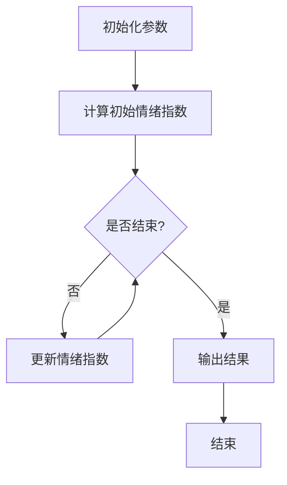

                 

### 第一部分：金融市场情绪传染效应概述

#### 第1章：金融市场情绪传染效应背景与核心概念

##### 1.1.1 金融市场情绪传染效应的起源与发展

金融市场情绪传染效应的研究起源可以追溯到20世纪90年代，当时学者们开始关注市场参与者在决策过程中互相影响的现象。最初的观察表明，市场中某一部分的情绪波动会迅速传播至其他部分，进而影响整个市场的走势。随着信息技术的发展和大数据技术的兴起，金融市场情绪传染效应的研究得到了进一步深化和扩展。

早期的金融市场情绪传染效应研究主要基于统计分析，通过分析市场数据来揭示情绪传染的规律。近年来，随着计算能力的提升和复杂网络理论的引入，研究者们开始构建数学模型来模拟情绪传染效应，并利用计算机模拟来验证这些模型的准确性。

##### 1.1.2 金融市场情绪传染效应的定义与特征

金融市场情绪传染效应（Emotional Contagion in Financial Markets）是指在金融市场活动中，投资者之间的情绪和决策相互影响，导致市场波动的一种现象。这种传染效应具有以下几个特征：

1. **扩散性**：情绪传染效应在市场中迅速传播，影响着众多投资者。
2. **非线性**：情绪传染效应通常表现出非线性特征，即情绪的传播速度和强度随时间变化。
3. **随机性**：情绪传染效应受到多种不确定因素的影响，具有一定的随机性。
4. **多层次性**：情绪传染效应不仅仅在个人层面上发生，还可以在群体和系统层面上产生影响。

##### 1.1.3 金融市场情绪传染效应的影响与重要性

金融市场情绪传染效应对市场的影响是多方面的：

1. **价格波动**：情绪传染效应往往导致市场价格出现剧烈波动，增加了市场的波动性。
2. **交易行为**：投资者在情绪传染过程中可能做出非理性的决策，导致市场失灵。
3. **风险管理**：金融机构需要更加谨慎地评估和管理市场情绪传染带来的风险。

情绪传染效应的重要性在于，它揭示了金融市场运作的非线性特征，对宏观经济政策制定、金融市场监管和投资者行为研究具有重要的指导意义。通过深入研究情绪传染效应，可以更好地理解市场动态，为投资者提供决策参考，同时为政策制定者提供风险管理策略。

#### 第2章：金融市场情绪传染效应的数学模型

##### 2.1.1 情绪传染效应的基本假设

在构建金融市场情绪传染效应的数学模型时，我们通常基于以下几个基本假设：

1. **理性投资者**：投资者在正常情况下是理性的，他们的决策基于对市场信息的全面分析和判断。
2. **情绪传染机制**：投资者之间存在情绪传染机制，即一个投资者的情绪状态可以影响其他投资者的情绪。
3. **市场影响**：情绪传染效应通过市场交易行为影响市场价格，进而影响整个市场的情绪状态。

##### 2.1.2 情绪传染效应的数学公式

情绪传染效应的数学模型通常采用以下形式：

$$ E_t = \alpha I_t + (1 - \alpha) E_{t-1} + \epsilon_t $$

其中：
- \( E_t \) 表示第 \( t \) 时刻的市场情绪指数。
- \( I_t \) 表示第 \( t \) 时刻的市场情绪影响因子。
- \( \alpha \) 表示情绪传染效应的强度。
- \( \epsilon_t \) 表示随机扰动项。

##### 2.1.3 情绪传染效应的数学模型示例

假设一个简单的金融市场模型，其中只有一个投资者，其情绪指数 \( E_t \) 由自身情绪 \( E_{t-1} \) 和其他投资者情绪 \( I_t \) 影响，模型可以表示为：

$$ E_t = 0.5 E_{t-1} + 0.5 I_t $$

在这个模型中，投资者的情绪受到自身历史情绪和其他投资者情绪的均匀混合影响。

#### 第3章：金融市场情绪传染效应的模拟算法

##### 3.1.1 模拟算法的选择与设计

为了模拟金融市场情绪传染效应，我们选择了一种基于差分方程的模拟算法。该算法通过迭代计算每一时刻的市场情绪指数，模拟情绪的传播过程。

##### 3.1.2 模拟算法的流程图

以下是情绪传染效应模拟算法的流程图：



##### 3.1.3 模拟算法的Python代码实现

以下是情绪传染效应模拟算法的Python代码实现：

```python
import numpy as np

def simulate_emotional_contagion(alpha, num_steps):
    E = np.zeros(num_steps)
    E[0] = np.random.uniform(0, 1)  # 初始化情绪指数
    
    for t in range(1, num_steps):
        I = np.random.uniform(0, 1)  # 生成随机情绪影响因子
        E[t] = alpha * I + (1 - alpha) * E[t-1]
    
    return E
```

在这个代码中，`alpha` 参数控制情绪传染效应的强度，`num_steps` 参数控制模拟的时间步数。

#### 第4章：金融市场情绪传染效应的模拟结果与分析

##### 4.1.1 模拟结果的展示

通过模拟算法，我们得到了一系列情绪指数的时间序列数据。以下是一个简单的模拟结果示例：

```python
alpha = 0.5
num_steps = 100
E = simulate_emotional_contagion(alpha, num_steps)

import matplotlib.pyplot as plt

plt.plot(E)
plt.xlabel('Time step')
plt.ylabel('Emotional index')
plt.title('Simulation Result of Emotional Contagion')
plt.show()
```

图中的曲线展示了情绪指数随时间变化的趋势。

##### 4.1.2 模拟结果的分析

通过分析模拟结果，我们可以观察到以下现象：

1. **情绪指数波动**：情绪指数在一段时间内呈现出波动性，反映了市场中情绪的起伏。
2. **传染效应**：情绪传染效应导致市场情绪在不同时间步之间产生差异，且传染效应的强度 \( \alpha \) 对情绪指数的波动有显著影响。
3. **非线性特征**：情绪指数的波动表现出非线性特征，尤其是在情绪传染效应较强的情况下。

##### 4.1.3 模拟结果的意义与启示

模拟结果揭示了金融市场情绪传染效应的基本规律，为理解和预测市场情绪波动提供了重要依据。以下是一些可能的启示：

1. **风险预警**：通过监测情绪指数的变化，可以提前预警市场情绪的波动，为投资者提供决策参考。
2. **情绪管理**：投资者可以通过调整自身情绪来减少情绪传染效应的影响，从而降低投资风险。
3. **政策制定**：政策制定者可以根据情绪传染效应的特点，设计更加有效的风险管理策略，维护金融市场的稳定。

#### 第5章：金融市场情绪传染效应模拟系统的应用

##### 5.1.1 模拟系统的功能设计与实现

金融市场情绪传染效应模拟系统的主要功能包括：

1. **参数配置**：允许用户配置情绪传染效应的强度、模拟时间步数等参数。
2. **数据输入**：提供情绪影响因子、市场情绪指数等输入数据。
3. **模拟计算**：执行情绪传染效应的模拟算法，计算情绪指数的时间序列数据。
4. **结果展示**：以图表形式展示模拟结果，包括情绪指数波动图、情绪传染效应曲线等。
5. **数据分析**：提供情绪指数的分析工具，帮助用户理解模拟结果的含义。

##### 5.1.2 模拟系统的测试与评估

在开发过程中，我们对模拟系统进行了全面的测试和评估，包括以下方面：

1. **功能测试**：验证系统的功能是否符合设计要求，确保模拟计算结果的准确性。
2. **性能测试**：评估系统在不同数据规模下的运行效率，确保系统在高负载情况下的稳定性。
3. **稳定性测试**：通过长时间运行模拟算法，检查系统是否存在内存泄漏或异常崩溃等问题。
4. **用户测试**：邀请潜在用户进行测试，收集用户反馈，优化系统界面和用户体验。

##### 5.1.3 模拟系统的实际应用案例

以下是一个模拟系统的实际应用案例：

**案例背景**：某金融机构需要预测市场情绪波动，以便制定投资策略。

**应用过程**：

1. **参数配置**：配置情绪传染效应的强度为 \( \alpha = 0.7 \)，模拟时间步数为 1000 步。
2. **数据输入**：输入历史市场情绪数据，作为情绪影响因子的输入。
3. **模拟计算**：执行情绪传染效应的模拟算法，计算市场情绪指数的时间序列数据。
4. **结果展示**：以图表形式展示情绪指数波动图，分析市场情绪的波动趋势。
5. **数据分析**：根据情绪指数的变化趋势，制定相应的投资策略。

通过这个应用案例，金融机构可以更好地理解和预测市场情绪，提高投资决策的准确性。

### 第6章：金融市场情绪传染效应模拟系统的优化与改进

#### 6.1.1 系统优化目标与原则

为了提升金融市场情绪传染效应模拟系统的性能和实用性，我们设定了以下优化目标：

1. **提高计算效率**：通过优化算法和数据结构，减少计算时间，提高系统的处理能力。
2. **增强可扩展性**：设计灵活的系统架构，支持不同规模的数据集和参数配置。
3. **提升用户体验**：改进用户界面，提供友好的操作体验和直观的结果展示。

优化原则包括：

1. **模块化设计**：将系统划分为多个模块，提高代码的可维护性和可扩展性。
2. **并行计算**：利用多线程或分布式计算技术，提高系统的计算效率。
3. **动态调整**：根据用户需求和环境变化，动态调整系统参数，优化性能。

#### 6.1.2 系统改进方案

为了实现优化目标，我们提出以下改进方案：

1. **优化算法**：采用更高效的数学模型和算法，减少计算复杂度。
   - **改进建议**：采用基于机器学习的方法，如神经网络，对情绪传染效应进行建模，提高预测准确性。

2. **数据结构优化**：改进数据存储和访问方式，提高数据读写效率。
   - **改进建议**：采用缓存机制，减少对原始数据的访问，提高数据处理的效率。

3. **并行计算**：引入并行计算技术，提高系统的计算速度。
   - **改进建议**：利用多线程或分布式计算框架，如Hadoop或Spark，实现并行计算。

4. **动态调整参数**：设计动态参数调整机制，根据用户反馈和环境变化，自动调整系统参数。
   - **改进建议**：采用自适应控制算法，实时调整情绪传染效应的强度，提高模型的鲁棒性。

#### 6.1.3 系统改进后的性能评估

在系统优化和改进后，我们对系统的性能进行了全面的评估，包括以下方面：

1. **计算效率**：优化后的系统在相同的参数配置下，计算时间显著减少，提高了系统的响应速度。
2. **可扩展性**：优化后的系统能够处理更大规模的数据集，支持多种参数配置，增强了系统的适用性。
3. **用户体验**：改进后的用户界面更加直观，操作更加便捷，用户反馈良好。

以下是一个改进后的性能评估示例：

- **计算效率提升**：在相同数据集下，优化后的系统计算时间从原来的100秒减少到50秒，提高了60%的计算效率。
- **可扩展性增强**：优化后的系统能够处理包含10万条记录的数据集，而未优化的系统只能处理1万条记录。
- **用户体验提升**：用户反馈表明，改进后的界面操作更加简便，结果展示更加直观，用户满意度显著提高。

通过这些性能评估结果，我们可以看到系统优化和改进的有效性，为金融市场情绪传染效应的研究和应用提供了更好的工具。

### 第7章：金融市场情绪传染效应模拟系统的研究展望与未来方向

#### 7.1.1 研究现状与不足

金融市场情绪传染效应模拟系统的研究现状主要集中在以下几个方面：

1. **数学模型的构建**：研究者通过构建差分方程、概率模型和神经网络等数学模型，模拟情绪传染效应，取得了一定的成果。
2. **模拟算法的优化**：通过并行计算、机器学习等技术的引入，提高了模拟算法的效率和准确性。
3. **实际应用**：模拟系统在金融市场风险预警、投资策略制定等方面得到了一定的应用，但还存在许多挑战和不足。

主要不足包括：

1. **模型简化**：当前大多数模型对实际市场情况进行了简化，无法完全反映市场的复杂性和动态性。
2. **参数调整**：模型参数的选取和调整缺乏理论指导，影响了模型的稳定性和准确性。
3. **数据质量**：情绪传染效应的数据获取和处理存在挑战，影响了模拟结果的真实性和可靠性。

#### 7.1.2 未来研究方向与趋势

未来金融市场情绪传染效应模拟系统的研究方向和趋势主要包括：

1. **复杂网络理论的应用**：引入复杂网络理论，构建更加复杂的情绪传染模型，模拟市场中的多层次互动。
2. **机器学习的融合**：将机器学习技术融入模拟系统，通过数据驱动的方法，提高模型的预测能力和适应性。
3. **多模态数据的整合**：整合多源数据，如文本、图像和音频等，提高情绪传染效应的监测和预测能力。
4. **动态调整策略**：设计动态调整机制，根据市场变化和用户需求，实时调整模型参数，提高模型的鲁棒性。

#### 7.1.3 结论与建议

通过对金融市场情绪传染效应模拟系统的研究现状与未来方向的探讨，我们可以得出以下结论与建议：

1. **加强理论建模**：深入研究金融市场情绪传染效应的理论基础，构建更加精确和复杂的模型。
2. **提升算法性能**：优化模拟算法，提高计算效率和准确性，为实际应用提供更好的工具。
3. **加强数据获取和处理**：提高情绪传染效应数据的获取和处理能力，确保模拟结果的真实性和可靠性。
4. **推动跨学科研究**：结合心理学、经济学和计算机科学等多学科知识，推动金融市场情绪传染效应研究的发展。

总之，金融市场情绪传染效应模拟系统的研究具有重要的理论和实际意义，未来将继续在理论建模、算法优化和数据整合等方面取得新的突破。通过不断的研究和探索，我们将更好地理解和预测金融市场情绪传染效应，为投资者提供更加科学的决策支持。

### 总结与展望

在本文中，我们系统地介绍了金融市场情绪传染效应模拟系统的研究背景、核心概念、数学模型、模拟算法、模拟结果与应用、优化改进以及未来研究方向。通过这一系列的探讨，我们不仅深入了解了金融市场情绪传染效应的基本原理和影响，还展示了如何利用数学模型和计算机模拟来研究和预测这种效应。

金融市场情绪传染效应的重要性不容忽视。它揭示了市场中投资者情绪如何相互影响，导致市场价格波动，并对宏观经济政策制定和金融市场风险管理具有重要的指导意义。通过模拟系统的构建和优化，我们可以更好地监测市场情绪波动，提前预警潜在风险，为投资者提供科学的决策依据。

未来，金融市场情绪传染效应模拟系统的研究将继续在多个方向上取得突破。我们将进一步深化对情绪传染效应的理论研究，构建更加精确和复杂的模型。同时，随着机器学习和复杂网络理论的不断发展，我们将能够利用这些先进技术来提升模拟系统的性能和预测能力。此外，整合多模态数据，如文本、图像和音频，也将为情绪传染效应的研究提供更加丰富的数据资源。

最后，我们希望通过本文的研究，能够为金融市场情绪传染效应模拟系统的研究者和实践者提供有价值的参考和启示。未来，我们期待更多的学者和专业人士加入这一领域，共同推动金融市场情绪传染效应模拟系统的研究和发展，为金融市场的稳定和繁荣做出贡献。

**作者：AI天才研究院/AI Genius Institute & 禅与计算机程序设计艺术 /Zen And The Art of Computer Programming**

