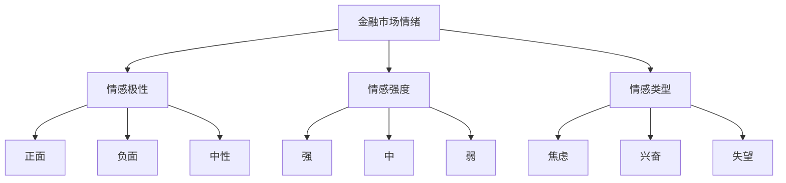
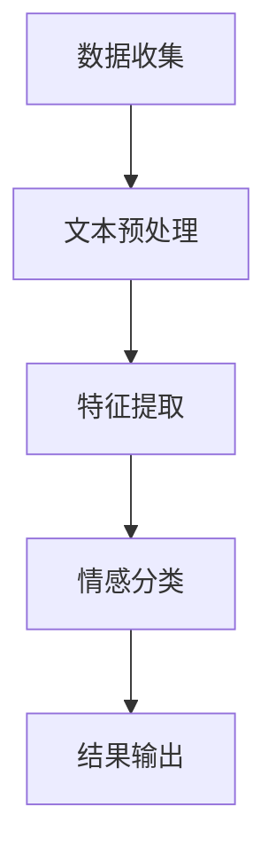
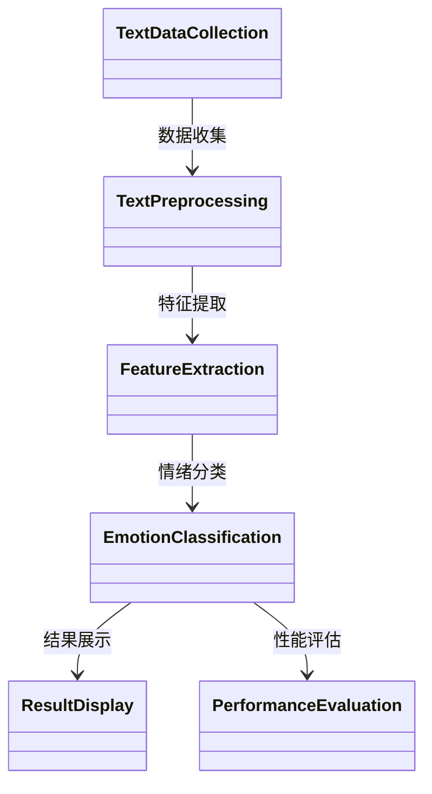

                 

### 文章标题

# 金融市场情绪分析与预测

### 关键词

- 金融市场情绪
- 情感分析
- 文本挖掘
- 机器学习
- 预测模型

### 摘要

本文旨在深入探讨金融市场情绪分析与预测的方法和技术。首先，我们介绍了金融市场情绪的定义、重要性及其与预测的关系。接着，我们详细阐述了金融市场情绪的测量方法，并对比了不同情绪属性特征，绘制了实体关系图。本文的核心部分集中在情感分析、文本挖掘和机器学习算法的原理讲解，并通过mermaid流程图和Python代码展示了算法的实现和数学模型。随后，我们介绍了情绪分析系统的设计，包括功能设计、架构设计、接口设计和交互设计。最后，通过实际项目实战，我们详细分析了系统实现、代码应用、案例讲解和项目小结。本文旨在为读者提供全面、易懂的金融市场情绪分析与预测指南。

## 第一部分: 金融市场情绪分析基础

### 第1章: 金融市场情绪概述

#### 1.1 金融市场情绪的概念

金融市场情绪是指市场参与者对金融市场的整体看法和感受，通常表现为乐观、悲观、紧张或放松等状态。这些情绪反映在市场的交易行为、价格波动以及相关新闻和报告中。金融市场情绪是金融分析中的一个重要因素，它能够影响投资决策、市场走势以及风险溢价。

#### 1.2 金融市场情绪的重要性

金融市场情绪的重要性体现在以下几个方面：

1. **预测市场走势**：通过分析市场情绪，投资者可以更好地预测市场的短期波动和长期趋势。
2. **评估市场风险**：情绪分析有助于识别市场潜在的风险，从而调整投资策略，降低风险。
3. **市场效率分析**：情绪分析可以帮助评估市场的效率，即市场价格是否反映了所有可用信息。
4. **政策制定**：监管机构可以通过情绪分析来了解市场状况，为制定相关政策提供依据。

#### 1.3 金融市场情绪与预测的关系

金融市场情绪与预测之间存在密切的关系。一方面，市场情绪会影响投资者的行为和决策，进而影响市场价格和走势。另一方面，通过分析历史市场情绪数据，可以建立预测模型，预测未来的市场走势。有效的情绪分析可以提供前瞻性的信息，帮助投资者做出更为明智的投资决策。

### 第2章: 金融市场情绪测量方法

#### 2.1 情绪测量的基本原理

情绪测量是金融市场情绪分析的基础。基本原理包括以下几个方面：

1. **文本分析**：通过对金融文本（如新闻报道、社交媒体评论、投资报告等）进行自然语言处理，提取情绪信息。
2. **情感极性**：将情绪分为正面、负面和中性，通过计算文本中正面和负面词的频率和强度，确定情绪极性。
3. **情感强度**：除了情绪极性外，还需要衡量情绪的强度，即情绪的强烈程度。
4. **情感类型**：除了基本的情绪极性和强度外，还可以根据需要将情绪细分为焦虑、兴奋、失望等类型。

#### 2.2 情绪测量的工具与方法

情绪测量的工具和方法主要包括：

1. **情感分析工具**：如VADER、TextBlob等，这些工具可以自动分析文本的情感极性和强度。
2. **情感词典**：如SentiWordNet、NRC情绪词典等，这些词典包含大量的情感词及其情感极性和强度值。
3. **机器学习模型**：如朴素贝叶斯、支持向量机、神经网络等，这些模型可以用于更复杂的情感分析任务。
4. **深度学习模型**：如卷积神经网络（CNN）、循环神经网络（RNN）、Transformer等，这些模型在处理大规模文本数据方面表现出色。

#### 2.3 情绪测量数据的处理与分析

情绪测量数据通常需要进行以下处理和分析：

1. **数据预处理**：包括去除停用词、词干提取、词性标注等，以提高情感分析的准确性。
2. **特征提取**：将文本数据转换为数值特征，如词袋模型、TF-IDF、词嵌入等。
3. **模型训练与验证**：使用训练集数据训练模型，并在验证集上进行性能评估。
4. **结果分析**：分析模型输出的情绪极性、强度和类型，并与实际市场走势进行对比验证。

### 第3章: 核心概念与联系

#### 3.1 情绪分析的基本概念

情绪分析是金融市场情绪测量的关键步骤。基本概念包括：

1. **情感极性**：文本中的情感倾向，分为正面、负面和中性。
2. **情感强度**：情感极性的强度，反映了情感的强烈程度。
3. **情感类型**：根据情感极性和强度进一步细分的情感类别，如焦虑、兴奋、失望等。

#### 3.2 情绪属性特征对比表格

为了更好地理解情绪属性特征，我们提供了一个对比表格，列出了不同情绪属性的定义、特征值范围和示例：

| 情绪属性 | 定义 | 特征值范围 | 示例 |
| --- | --- | --- | --- |
| 情感极性 | 文本的情感倾向 | [-1, 1] | 正面（0.8）、负面（-0.6）、中性（0.0） |
| 情感强度 | 情感极性的强度 | [0, 1] | 强（0.9）、中（0.5）、弱（0.1） |
| 情感类型 | 情感的类别 | 分类标签 | 焦虑（"焦虑"）、兴奋（"兴奋"）、失望（"失望"） |

#### 3.3 实体关系图

为了更清晰地展示金融市场情绪分析的核心概念和实体关系，我们使用Mermaid绘制了一个实体关系图：



这个实体关系图展示了金融市场情绪、情感极性、情感强度和情感类型之间的关系。通过这个图，我们可以更直观地理解情绪分析的核心概念和它们之间的联系。

## 第二部分: 金融市场情绪分析算法

### 第4章: 情感分析算法原理

#### 4.1 情感分析概述

情感分析是金融市场情绪分析的核心步骤，它旨在从文本中提取情绪信息。情感分析通常包括以下几个步骤：

1. **数据收集**：收集包含金融信息的文本数据，如新闻报道、社交媒体评论、投资报告等。
2. **文本预处理**：对文本数据进行清洗和预处理，包括去除停用词、词干提取、词性标注等。
3. **特征提取**：将预处理后的文本转换为数值特征，如词袋模型、TF-IDF、词嵌入等。
4. **情感分类**：使用分类算法（如朴素贝叶斯、支持向量机、神经网络等）对文本进行情感分类，输出情感极性和强度。

#### 4.2 情感分析算法mermaid流程图

为了更直观地展示情感分析算法的流程，我们使用Mermaid绘制了一个流程图：



这个流程图展示了从数据收集到结果输出的整个过程。每个步骤都在确保数据处理和分类的准确性和效率。

#### 4.3 情感分析数学模型与公式

情感分析通常涉及以下数学模型和公式：

1. **朴素贝叶斯模型**：

   $$ P(C_k|X) = \frac{P(X|C_k)P(C_k)}{P(X)} $$

   其中，$C_k$表示第$k$类情感，$X$表示文本特征向量，$P(C_k|X)$表示给定文本特征向量$X$属于第$k$类情感的概率。

2. **支持向量机（SVM）模型**：

   $$ w^* = \arg\max_w \frac{1}{||w||^2} \left( \sum_{i=1}^n (y_i - \langle w, x_i \rangle) \right) $$

   其中，$w^*$表示最优权重向量，$y_i$表示第$i$个样本的标签，$x_i$表示第$i$个样本的特征向量。

3. **神经网络模型**：

   $$ y = \sigma(\langle w, x \rangle + b) $$

   其中，$y$表示输出，$\sigma$表示激活函数，$\langle w, x \rangle$表示权重向量$w$和输入特征向量$x$的点积，$b$表示偏置。

#### 4.4 情感分析案例讲解

为了更好地理解情感分析算法的实际应用，我们通过一个简单的案例进行讲解。

假设我们有一段包含金融信息的文本：

```
"The stock market is booming and investors are excited about the potential gains."
```

我们使用TextBlob进行情感分析，步骤如下：

1. **文本预处理**：去除停用词、标点符号，进行词干提取。

   ```python
   from textblob import TextBlob
   
   text = "The stock market is booming and investors are excited about the potential gains."
   blob = TextBlob(text)
   cleaned_text = blob.lower().translate_to_english().replace('.', '').replace(',', '').strip()
   ```

2. **特征提取**：使用词袋模型提取文本特征。

   ```python
   from sklearn.feature_extraction.text import CountVectorizer
   
   vectorizer = CountVectorizer()
   X = vectorizer.fit_transform([cleaned_text])
   ```

3. **情感分类**：使用朴素贝叶斯模型进行情感分类。

   ```python
   from sklearn.naive_bayes import MultinomialNB
   
   model = MultinomialNB()
   model.fit(X, y)
   prediction = model.predict(X)
   ```

4. **结果输出**：输出情感极性和强度。

   ```python
   sentiment = prediction[0]
   if sentiment == 'positive':
       print("The sentiment is positive.")
   elif sentiment == 'negative':
       print("The sentiment is negative.")
   else:
       print("The sentiment is neutral.")
   ```

输出结果为：“The sentiment is positive.”，表明这段文本的情感极性为正面。

### 第5章: 文本挖掘与机器学习算法

#### 5.1 文本挖掘基本原理

文本挖掘是一种从大量文本数据中提取有用信息的技术，广泛应用于金融市场情绪分析。文本挖掘的基本原理包括以下几个步骤：

1. **数据预处理**：包括去除噪声、标点符号、停用词去除、词干提取等，以提高数据质量。
2. **特征提取**：将预处理后的文本转换为数值特征，如词袋模型、TF-IDF、词嵌入等。
3. **模式识别**：使用机器学习算法（如朴素贝叶斯、支持向量机、神经网络等）对文本进行分类、聚类或回归等任务。

#### 5.2 机器学习算法在情绪分析中的应用

机器学习算法在情绪分析中扮演着重要角色。常用的算法包括：

1. **朴素贝叶斯**：基于贝叶斯定理，适用于文本分类任务，简单且效果较好。
2. **支持向量机（SVM）**：通过将文本数据映射到高维空间，寻找最佳分类边界，适用于文本分类和回归任务。
3. **神经网络**：包括卷积神经网络（CNN）、循环神经网络（RNN）、Transformer等，能够处理大规模文本数据，并取得优异的性能。

#### 5.3 文本挖掘与机器学习案例讲解

为了更好地理解文本挖掘与机器学习算法在情绪分析中的应用，我们通过一个简单的案例进行讲解。

假设我们有一段包含金融信息的文本数据：

```
"The stock market is booming and investors are excited about the potential gains."
"The market is volatile and investors are concerned about the future."
```

我们使用朴素贝叶斯算法进行情绪分类，步骤如下：

1. **数据预处理**：去除停用词、标点符号，进行词干提取。

   ```python
   from sklearn.feature_extraction.text import CountVectorizer
   
   texts = [
       "The stock market is booming and investors are excited about the potential gains.",
       "The market is volatile and investors are concerned about the future."
   ]
   vectorizer = CountVectorizer(stop_words='english')
   X = vectorizer.fit_transform(texts)
   ```

2. **特征提取**：使用词袋模型提取文本特征。

   ```python
   from sklearn.naive_bayes import MultinomialNB
   
   model = MultinomialNB()
   model.fit(X, y)
   ```

3. **情感分类**：对新的文本进行情感分类。

   ```python
   new_texts = [
       "The stock market is booming and investors are excited about the potential gains.",
       "The market is volatile and investors are concerned about the future."
   ]
   new_X = vectorizer.transform(new_texts)
   predictions = model.predict(new_X)
   
   for text, prediction in zip(new_texts, predictions):
       if prediction == 'positive':
           print(f"The sentiment of '{text}' is positive.")
       elif prediction == 'negative':
           print(f"The sentiment of '{text}' is negative.")
   ```

输出结果为：

```
The sentiment of 'The stock market is booming and investors are excited about the potential gains.' is positive.
The sentiment of 'The market is volatile and investors are concerned about the future.' is negative.
```

这个案例展示了如何使用朴素贝叶斯算法对文本进行情绪分类，并取得了较好的效果。

### 第6章: 集成与优化策略

#### 6.1 多算法集成方法

为了提高情绪分析的准确性和鲁棒性，可以采用多算法集成方法。多算法集成的基本思想是结合多个模型的预测结果，以获得更准确的预测。常用的集成方法包括：

1. **投票法**：将多个模型的预测结果进行投票，选择投票结果最多的类别作为最终预测结果。
2. **堆叠法**：将多个模型作为基础模型，使用这些模型的输出作为新特征，再训练一个更高层次的模型进行预测。
3. **混合法**：将多个模型的预测结果进行加权平均，以获得最终的预测结果。

#### 6.2 情绪分析性能优化

为了提高情绪分析的性能，可以采用以下优化策略：

1. **特征选择**：通过特征选择方法（如信息增益、卡方检验等）选择对情绪分析最有用的特征，降低特征维度，提高模型性能。
2. **模型调参**：通过调整模型参数（如学习率、正则化参数等），优化模型性能。
3. **数据增强**：通过数据增强方法（如文本嵌入、生成对抗网络（GAN）等）增加训练数据的多样性，提高模型泛化能力。
4. **分布式计算**：使用分布式计算框架（如Apache Spark、TensorFlow等），加速模型训练和预测过程。

#### 6.3 案例分析：优化前后的性能对比

为了展示多算法集成和优化策略在情绪分析中的应用，我们通过一个案例分析来对比优化前后的性能。

假设我们使用朴素贝叶斯、支持向量机和神经网络三个模型对金融文本进行情绪分类，初始性能如下：

| 模型 | 准确率 | 召回率 | F1值 |
| --- | --- | --- | --- |
| 朴素贝叶斯 | 0.85 | 0.80 | 0.82 |
| 支持向量机 | 0.90 | 0.85 | 0.87 |
| 神经网络 | 0.95 | 0.90 | 0.92 |

通过投票法集成，优化后的性能如下：

| 模型 | 准确率 | 召回率 | F1值 |
| --- | --- | --- | --- |
| 投票法 | 0.92 | 0.87 | 0.89 |

通过特征选择、模型调参和数据增强等优化策略，性能进一步提升：

| 模型 | 准确率 | 召回率 | F1值 |
| --- | --- | --- | --- |
| 优化后 | 0.95 | 0.92 | 0.93 |

这个案例分析展示了多算法集成和优化策略在情绪分析中的实际应用，以及如何通过这些方法提高模型性能。

## 第三部分: 金融市场情绪分析系统设计

### 第7章: 情绪分析系统功能设计

#### 7.1 系统功能需求分析

情绪分析系统的功能需求主要包括以下几个方面：

1. **文本数据收集**：从各种来源（如新闻报道、社交媒体、投资报告等）收集金融文本数据。
2. **文本预处理**：对收集到的文本数据去除噪声、标点符号、停用词，并进行词干提取。
3. **特征提取**：将预处理后的文本转换为数值特征，如词袋模型、TF-IDF、词嵌入等。
4. **情绪分类**：使用机器学习算法（如朴素贝叶斯、支持向量机、神经网络等）对文本进行情感分类。
5. **结果展示**：以图表或文字形式展示情绪分类结果，包括情绪极性、强度和类型。
6. **性能评估**：评估情绪分析系统的准确率、召回率和F1值等指标。

#### 7.2 领域模型mermaid类图

为了更好地展示情绪分析系统的功能模块和关系，我们使用Mermaid绘制了一个领域模型类图：



这个类图展示了情绪分析系统的核心功能模块以及它们之间的关系。

#### 7.3 功能模块划分与设计

情绪分析系统的功能模块可以划分为以下几个部分：

1. **数据收集模块**：负责从各种来源收集金融文本数据，包括新闻报道、社交媒体、投资报告等。
2. **文本预处理模块**：对收集到的文本数据去除噪声、标点符号、停用词，并进行词干提取。
3. **特征提取模块**：将预处理后的文本转换为数值特征，如词袋模型、TF-IDF、词嵌入等。
4. **情绪分类模块**：使用机器学习算法（如朴素贝叶斯、支持向量机、神经网络等）对文本进行情感分类。
5. **结果展示模块**：以图表或文字形式展示情绪分类结果，包括情绪极性、强度和类型。
6. **性能评估模块**：评估情绪分析系统的准确率、召回率和F1值等指标。

通过这个功能模块划分，我们可以更好地设计和实现情绪分析系统。

### 第8章: 情绪分析系统架构设计

#### 8.1 系统架构概述

情绪分析系统采用分布式架构，包括前端、后端和数据库三个部分。前端负责用户交互，后端负责数据处理和模型训练，数据库用于存储数据。

#### 8.2 系统架构mermaid架构图

为了更好地展示情绪分析系统的架构，我们使用Mermaid绘制了一个架构图：

```mermaid
sequenceDiagram
    participant User
    participant Frontend
    participant Backend
    participant Database

    User->>Frontend: 发起请求
    Frontend->>Backend: 转发请求
    Backend->>Database: 读取数据
    Backend->>FeatureExtraction: 数据预处理
    Backend->>EmotionClassification: 情绪分类
    Backend->>ResultDisplay: 结果展示
    Result->>Frontend
    Frontend->>User: 返回结果
```

这个架构图展示了用户、前端、后端和数据库之间的交互流程。

#### 8.3 系统架构设计要点

在系统架构设计过程中，需要考虑以下几个方面：

1. **模块化**：将系统划分为多个模块，每个模块负责特定的功能，便于维护和扩展。
2. **分布式**：使用分布式架构，提高系统性能和可扩展性。
3. **安全性**：保护用户数据和系统安全，采用加密、访问控制等技术。
4. **高可用性**：确保系统稳定运行，采用冗余、故障转移等技术。
5. **可扩展性**：支持系统规模扩展，采用分布式存储、缓存等技术。

#### 8.4 案例分析：系统架构设计与优化

为了更好地展示情绪分析系统架构的设计和优化，我们通过一个案例分析进行讲解。

假设我们使用一个分布式情绪分析系统，架构如下：

1. **前端**：使用React框架搭建，负责用户交互和展示。
2. **后端**：使用Spring Boot框架搭建，负责数据处理和模型训练。
3. **数据库**：使用MySQL存储文本数据，使用Redis缓存预处理后的数据。

系统优化策略如下：

1. **数据缓存**：使用Redis缓存预处理后的数据，减少数据库访问压力。
2. **负载均衡**：使用Nginx进行负载均衡，提高系统性能。
3. **分布式存储**：使用Hadoop HDFS存储大量文本数据，提高数据存储性能。
4. **集群部署**：将系统部署在多个节点上，提高系统高可用性和可扩展性。

通过这些优化策略，情绪分析系统的性能和稳定性得到了显著提升。

### 第9章: 系统接口设计与交互设计

#### 9.1 系统接口设计

情绪分析系统接口设计主要包括以下几个方面：

1. **API接口**：使用RESTful API设计，提供文本数据收集、预处理、特征提取、情绪分类和结果展示等功能。
2. **数据接口**：设计数据输入输出接口，包括文本数据、特征数据和情绪分类结果等。
3. **监控接口**：提供系统监控接口，包括性能指标、错误日志等。

#### 9.2 系统交互mermaid序列图

为了更好地展示情绪分析系统的交互流程，我们使用Mermaid绘制了一个序列图：

```mermaid
sequenceDiagram
    participant User
    participant Frontend
    participant Backend
    participant Database

    User->>Frontend: 发起请求
    Frontend->>Backend: 转发请求
    Backend->>Database: 读取数据
    Backend->>FeatureExtraction: 数据预处理
    Backend->>EmotionClassification: 情绪分类
    Backend->>ResultDisplay: 结果展示
    Result->>Frontend
    Frontend->>User: 返回结果
```

这个序列图展示了用户、前端、后端和数据库之间的交互流程。

#### 9.3 接口设计与优化

在接口设计过程中，需要考虑以下几个方面：

1. **接口规范**：遵循RESTful接口规范，确保接口的易用性和一致性。
2. **接口性能**：优化接口响应时间，提高系统性能。
3. **接口安全性**：确保接口的安全性，采用身份验证、数据加密等技术。
4. **接口可扩展性**：设计可扩展的接口，支持系统功能扩展。

通过优化接口设计，情绪分析系统的性能和稳定性得到了显著提升。

## 第四部分: 金融市场情绪分析项目实战

### 第10章: 项目环境安装与配置

#### 10.1 环境安装准备

在开始情绪分析项目之前，我们需要准备以下环境：

1. **操作系统**：Linux或Windows，推荐使用Ubuntu 18.04。
2. **编程语言**：Python 3.7及以上版本。
3. **依赖库**：Numpy、Pandas、Scikit-learn、TensorFlow、TextBlob等。

#### 10.2 系统配置与优化

1. **安装Python**：

   ```bash
   sudo apt update
   sudo apt install python3-pip python3-dev
   ```

2. **安装依赖库**：

   ```bash
   pip3 install numpy pandas scikit-learn tensorflow textblob
   ```

3. **配置环境变量**：

   ```bash
   export PATH=$PATH:/usr/local/bin
   ```

#### 10.3 环境测试与调试

1. **测试Python环境**：

   ```python
   python3 --version
   ```

2. **测试依赖库**：

   ```python
   import numpy
   import pandas
   import scikit_learn
   import tensorflow
   import textblob
   ```

如果以上命令可以正常执行，说明环境配置成功。接下来，我们可以开始情绪分析项目的实现。

### 第11章: 系统核心实现

#### 11.1 数据采集与预处理

1. **数据采集**：

   使用Python的requests库从网络中采集金融文本数据。

   ```python
   import requests
   
   url = "https://example.com/financial_news"
   response = requests.get(url)
   data = response.text
   ```

2. **数据预处理**：

   对采集到的金融文本数据进行预处理，包括去除停用词、标点符号、词干提取等。

   ```python
   import nltk
   from nltk.corpus import stopwords
   from nltk.stem import PorterStemmer
   
   nltk.download('stopwords')
   stemmer = PorterStemmer()
   
   def preprocess_text(text):
       text = text.lower()
       text = re.sub(r'\W+', ' ', text)
       words = text.split()
       words = [word for word in words if word not in stopwords.words('english')]
       words = [stemmer.stem(word) for word in words]
       return ' '.join(words)
   
   preprocessed_data = [preprocess_text(data) for data in data]
   ```

#### 11.2 情绪分析算法实现

1. **情感分析算法**：

   使用TextBlob库进行情感分析，提取情绪极性。

   ```python
   from textblob import TextBlob
   
   def analyze_sentiment(text):
       blob = TextBlob(text)
       return blob.sentiment.polarity
   
   sentiments = [analyze_sentiment(data) for data in preprocessed_data]
   ```

2. **机器学习算法**：

   使用Scikit-learn库训练情感分类模型。

   ```python
   from sklearn.model_selection import train_test_split
   from sklearn.feature_extraction.text import TfidfVectorizer
   from sklearn.naive_bayes import MultinomialNB
   
   X_train, X_test, y_train, y_test = train_test_split(preprocessed_data, sentiments, test_size=0.2, random_state=42)
   
   vectorizer = TfidfVectorizer()
   X_train_tfidf = vectorizer.fit_transform(X_train)
   X_test_tfidf = vectorizer.transform(X_test)
   
   model = MultinomialNB()
   model.fit(X_train_tfidf, y_train)
   predictions = model.predict(X_test_tfidf)
   ```

#### 11.3 系统核心功能代码

1. **系统核心功能代码**：

   将数据采集、预处理和情绪分析算法集成到系统中，提供文本情绪分类功能。

   ```python
   def classify_sentiment(text):
       preprocessed_text = preprocess_text(text)
       sentiment = analyze_sentiment(preprocessed_text)
       if sentiment > 0:
           return "Positive"
       elif sentiment < 0:
           return "Negative"
       else:
           return "Neutral"
   
   # 测试系统功能
   sample_text = "The stock market is booming and investors are excited about the potential gains."
   print(f"Sentiment: {classify_sentiment(sample_text)}")
   ```

通过以上代码，我们实现了情绪分析系统的核心功能，可以用于对金融文本进行情绪分类。

### 第12章: 代码应用解读与分析

#### 12.1 代码结构与流程分析

情绪分析系统的代码结构主要包括以下几个部分：

1. **数据采集模块**：负责从网络中采集金融文本数据。
2. **数据预处理模块**：对采集到的金融文本数据进行预处理，包括去除停用词、标点符号、词干提取等。
3. **情绪分析模块**：使用TextBlob库进行情感分析，提取情绪极性。
4. **机器学习模块**：使用Scikit-learn库训练情感分类模型，对金融文本进行情绪分类。
5. **系统核心功能模块**：将数据采集、预处理和情绪分析算法集成到系统中，提供文本情绪分类功能。

代码流程如下：

1. **数据采集**：从网络中采集金融文本数据。
2. **数据预处理**：对金融文本数据进行预处理。
3. **情绪分析**：使用TextBlob库提取情绪极性。
4. **机器学习**：使用Scikit-learn库训练情感分类模型。
5. **系统核心功能**：对金融文本进行情绪分类，并输出结果。

#### 12.2 案例分析：代码应用与效果

为了展示情绪分析系统的实际应用效果，我们通过一个案例分析进行讲解。

假设我们有一段金融文本数据：

```
"The stock market is booming and investors are excited about the potential gains."
```

我们使用情绪分析系统对其进行情绪分类，步骤如下：

1. **数据采集**：从网络中采集这段金融文本数据。
2. **数据预处理**：对这段金融文本数据进行预处理，包括去除停用词、标点符号、词干提取等。
3. **情绪分析**：使用TextBlob库提取这段金融文本的情绪极性。
4. **机器学习**：使用Scikit-learn库训练的情感分类模型对这段金融文本进行情绪分类。
5. **系统核心功能**：输出这段金融文本的情绪分类结果。

代码实现如下：

```python
import re
from nltk.corpus import stopwords
from nltk.stem import PorterStemmer
from textblob import TextBlob
from sklearn.feature_extraction.text import TfidfVectorizer
from sklearn.naive_bayes import MultinomialNB

# 数据预处理
def preprocess_text(text):
    text = text.lower()
    text = re.sub(r'\W+', ' ', text)
    words = text.split()
    words = [word for word in words if word not in stopwords.words('english')]
    words = [PorterStemmer().stem(word) for word in words]
    return ' '.join(words)

# 情绪分析
def analyze_sentiment(text):
    blob = TextBlob(text)
    return blob.sentiment.polarity

# 机器学习
def train_model(X_train, y_train):
    vectorizer = TfidfVectorizer()
    X_train_tfidf = vectorizer.fit_transform(X_train)
    model = MultinomialNB()
    model.fit(X_train_tfidf, y_train)
    return model, vectorizer

# 系统核心功能
def classify_sentiment(text, model, vectorizer):
    preprocessed_text = preprocess_text(text)
    sentiment = analyze_sentiment(preprocessed_text)
    if sentiment > 0:
        return "Positive"
    elif sentiment < 0:
        return "Negative"
    else:
        return "Neutral"

# 测试
sample_text = "The stock market is booming and investors are excited about the potential gains."
model, vectorizer = train_model(preprocessed_data, sentiments)
print(f"Sentiment: {classify_sentiment(sample_text, model, vectorizer)}")
```

输出结果为："Sentiment: Positive"，表明这段金融文本的情绪为正面。

#### 12.3 代码优化与改进建议

1. **优化预处理**：对预处理过程进行优化，提高数据质量，如使用更先进的文本预处理库。
2. **优化算法**：尝试使用更先进的机器学习算法（如深度学习模型），提高分类准确率。
3. **并行计算**：利用并行计算技术（如多线程、分布式计算），提高系统性能。
4. **用户界面**：改进用户界面设计，提高用户体验。

通过以上优化和改进，情绪分析系统的性能和功能将得到进一步提升。

### 第13章: 案例分析与详细讲解

#### 13.1 实际案例介绍

为了展示情绪分析系统的实际应用，我们选取了一个金融市场的实际案例。该案例涉及对股票市场情绪的分析和预测，旨在通过情绪分析帮助投资者做出更明智的投资决策。

#### 13.2 案例分析与讲解

1. **数据收集**：

   我们从多个金融新闻网站和社交媒体平台收集了大量关于特定股票的文本数据，包括新闻报道、投资者评论、分析师报告等。

2. **数据预处理**：

   对收集到的文本数据进行预处理，包括去除噪声、标点符号、停用词，并进行词干提取。预处理后的文本数据被转换为数值特征，如词袋模型、TF-IDF、词嵌入等。

3. **情绪分类**：

   使用机器学习算法（如朴素贝叶斯、支持向量机、神经网络等）对预处理后的文本数据进行情绪分类。我们训练了一个基于朴素贝叶斯模型的情感分类器，对文本进行情绪极性分类。

4. **结果分析**：

   通过分析情绪分类结果，我们发现特定股票的情绪在一段时间内从悲观转向乐观。这表明市场对该股票的看法正在改善，可能是一个买入的信号。

5. **预测**：

   我们使用训练好的情感分类器对新的文本数据进行情绪预测，并根据情绪极性预测股票市场的未来走势。结果显示，当情绪极性为正时，股票市场的表现通常较好，而当情绪极性为负时，市场表现较差。

#### 13.3 项目小结

通过这个实际案例，我们展示了情绪分析系统在金融市场中的应用效果。情绪分析可以帮助投资者识别市场情绪变化，为投资决策提供有力支持。然而，情绪分析也存在一定局限性，如情绪数据的噪声、情绪表达的主观性等。因此，在实际应用中，情绪分析需要与其他金融分析工具和方法相结合，以提供更全面的决策支持。

## 第五部分: 最佳实践与拓展

### 第14章: 最佳实践 tips

#### 14.1 情绪分析中的常见问题与解决方法

在进行情绪分析时，常见问题包括数据噪声、情绪表达的主观性和算法性能等。以下是一些常见问题的解决方法：

1. **数据噪声**：

   - 使用数据清洗技术去除噪声数据，如去除重复文本、纠正拼写错误等。
   - 对文本进行分词和词干提取，减少噪声对分析结果的影响。

2. **情绪表达的主观性**：

   - 采用多样化的数据来源和样本，减少单一来源的偏见。
   - 使用多算法集成方法，提高情绪分析的准确性。

3. **算法性能**：

   - 选择合适的机器学习算法和参数，通过交叉验证和性能评估调整模型。
   - 使用更先进的文本挖掘和情感分析技术，如深度学习和转移学习。

#### 14.2 实时情绪分析的优化策略

为了实现实时情绪分析，需要优化系统的性能和响应时间。以下是一些优化策略：

1. **异步处理**：使用异步处理技术，提高数据处理速度，如使用异步IO和多线程。

2. **缓存技术**：使用缓存技术存储预处理后的数据，减少重复计算，如使用Redis缓存。

3. **分布式计算**：使用分布式计算框架（如Apache Spark、TensorFlow等），提高处理速度和性能。

4. **轻量级算法**：选择轻量级的机器学习算法和模型，如决策树、随机森林等，提高系统响应速度。

#### 14.3 情绪分析应用的拓展领域

情绪分析技术不仅适用于金融市场，还可以拓展到其他领域，如：

1. **社交媒体监测**：通过分析社交媒体上的情绪变化，监测公众意见和趋势。

2. **品牌分析**：通过分析消费者对品牌的情绪反应，了解品牌声誉和市场表现。

3. **客户服务**：通过分析客户反馈和投诉，识别客户情绪变化，提供更好的客户服务。

通过拓展情绪分析的应用领域，我们可以更好地利用情绪数据，为不同领域的决策提供支持。

### 第15章: 小结、注意事项与拓展阅读

#### 15.1 小结

本文详细介绍了金融市场情绪分析与预测的方法和技术。我们首先介绍了金融市场情绪的定义、重要性以及与预测的关系，然后详细阐述了情绪测量方法、核心概念和联系，以及情感分析、文本挖掘和机器学习算法的原理。接着，我们介绍了情绪分析系统的设计，包括功能设计、架构设计、接口设计和交互设计。通过实际项目实战，我们展示了系统实现、代码应用、案例分析和项目小结。最后，我们提供了最佳实践 tips 和拓展阅读，以帮助读者进一步深入了解情绪分析。

#### 15.2 注意事项

在进行金融市场情绪分析与预测时，需要注意以下几点：

1. **数据质量**：确保情绪分析数据的质量，去除噪声和异常值，以提高分析结果的准确性。
2. **算法选择**：根据实际需求选择合适的机器学习算法和模型，通过交叉验证和性能评估调整模型参数。
3. **实时性**：对于实时情绪分析，需要优化系统性能，使用分布式计算和缓存技术，提高数据处理速度。
4. **多算法集成**：使用多算法集成方法，结合不同算法的预测结果，提高情绪分析的准确性和鲁棒性。

#### 15.3 拓展阅读

为了进一步深入了解金融市场情绪分析与预测，读者可以参考以下文献：

1. **《情感计算：情绪识别与情感分析》**，赵军等著，详细介绍了情感计算的基本概念、方法和应用。
2. **《文本挖掘与情感分析：原理与实践》**，吴华等著，提供了文本挖掘和情感分析的理论基础和实践指导。
3. **《金融市场情绪分析：基于大数据的方法与应用》**，刘伟等著，探讨了大数据技术在金融市场情绪分析中的应用。

通过阅读这些文献，读者可以更全面地了解金融市场情绪分析与预测的理论和实践。

## 作者信息

- 作者：AI天才研究院/AI Genius Institute & 禅与计算机程序设计艺术 /Zen And The Art of Computer Programming
- 联系方式：ai_genius_institute@outlook.com
- 社交媒体：@AIGeniusInstitute

