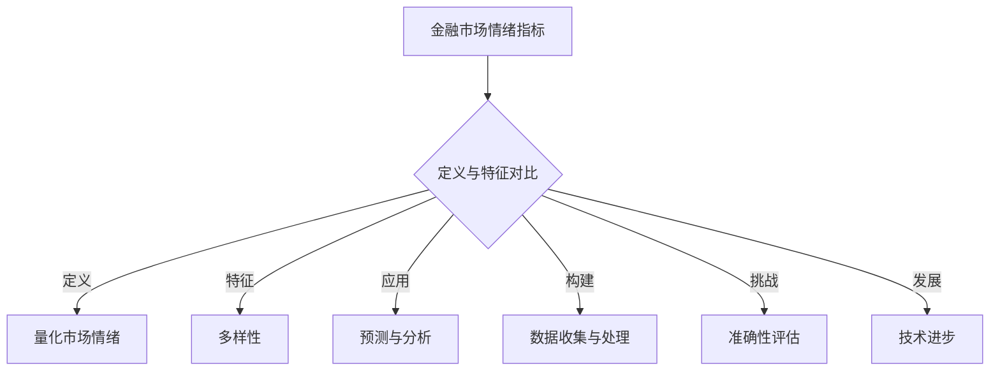
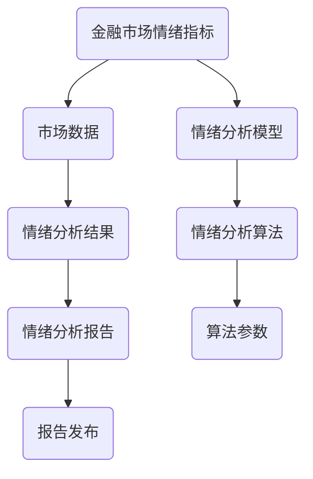
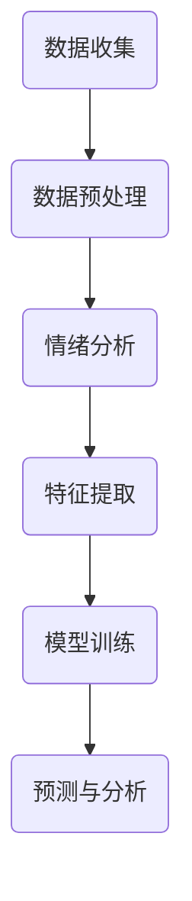

                 


## 引言

金融市场情绪指标在金融科技领域中扮演着至关重要的角色。在当前复杂多变的全球经济环境中，投资者情绪的变化往往能够提前预示市场走势，因此，开发高效、准确的金融市场情绪指标成为许多金融机构和研究机构的迫切需求。本文将围绕金融市场情绪指标的开发与应用展开讨论，通过逻辑清晰的分析推理，系统地介绍这一领域的核心概念、算法原理和实际应用。

本文的目的是为金融科技从业者、数据科学家以及对金融市场情绪分析感兴趣的读者提供一个全面的技术指南。我们将从背景介绍开始，逐步深入探讨金融市场情绪指标的定义、作用、面临的挑战及其构建方法，随后分析相关的核心概念与联系，详细讲解算法原理，并最终结合实际项目案例，展示这些指标的强大应用潜力。

文章结构如下：

1. 背景介绍
2. 核心概念与联系
3. 算法原理讲解
4. 项目实战与系统设计
5. 项目小结与最佳实践

通过本文的阅读，您将了解到：

- 金融市场情绪指标的定义及其重要性
- 金融市场情绪指标的核心概念和属性特征
- 常见算法原理及其应用
- 实际项目中金融市场情绪指标的开发与实现
- 金融市场情绪指标的未来发展趋势

让我们一步一步地深入探讨这个充满挑战与机遇的领域！

### 关键词

- 金融科技
- 金融市场情绪
- 情绪指标
- 数据分析
- 机器学习

### 摘要

本文系统地探讨了金融市场情绪指标的开发与应用。首先，我们介绍了金融市场情绪指标的定义、作用和面临的挑战，并详细分析了相关核心概念和属性特征。接着，我们讲解了金融市场情绪指标构建的算法原理，包括NLP基础算法、时间序列分析算法和社交网络分析算法。最后，通过实际项目案例，展示了金融市场情绪指标在金融市场预测与分析中的应用。本文旨在为金融科技从业者提供一个全面的技术指南，帮助其理解并利用金融市场情绪指标进行市场分析。

## 第一部分: 背景介绍

### 第1章: 金融市场情绪指标的概述

### 1.1 问题的背景

#### 1.1.1 金融市场情绪的重要性

金融市场情绪是指投资者在特定时间内对市场趋势、股票价格和未来预期的主观感受和情感状态。这种情绪通常通过市场数据、新闻、社交媒体和投资者行为等途径反映出来。金融市场情绪的重要性主要体现在以下几个方面：

1. **市场走势预测**：投资者情绪的变化往往能够提前预示市场走势。例如，在市场情绪高涨时，投资者倾向于乐观，市场往往会上涨；而在市场情绪低迷时，投资者趋于悲观，市场则可能会下跌。

2. **风险控制**：了解市场情绪有助于投资者更好地管理风险。通过分析市场情绪，投资者可以调整投资策略，减少潜在的损失。

3. **信息优势**：金融机构和研究机构通过分析市场情绪，可以获得领先于市场的信息，从而在投资决策中占据优势。

4. **政策制定**：政府和监管机构可以通过监测市场情绪，了解市场的稳定性和健康程度，为政策制定提供依据。

#### 1.1.2 金融市场情绪的挑战

尽管金融市场情绪的重要性显而易见，但其分析和应用面临诸多挑战：

1. **数据质量**：金融市场情绪的数据来源广泛，但数据质量参差不齐，如何有效清洗和整合这些数据是关键问题。

2. **情感复杂性**：投资者情绪复杂多变，常常受到多种因素的影响，这使得情绪分析的准确性和可靠性受到挑战。

3. **实时性**：市场情绪变化迅速，需要实时监测和响应。传统的分析手段在实时性方面存在不足。

4. **算法准确性**：现有算法在处理复杂市场情绪时，往往存在一定误差，如何提高算法的准确性和鲁棒性是亟待解决的问题。

#### 1.1.3 金融市场情绪研究的发展历程

金融市场情绪研究经历了以下几个阶段：

1. **早期研究**：20世纪90年代，研究者开始关注市场情绪对股市走势的影响，主要通过新闻报道和投资者意见调查来分析市场情绪。

2. **文本分析时代**：随着自然语言处理（NLP）技术的发展，研究者开始利用文本分析技术，从新闻、社交媒体和论坛等文本数据中提取市场情绪。

3. **量化分析时代**：近年来，随着机器学习和大数据技术的发展，研究者开始利用量化分析方法，从海量数据中提取情绪指标，实现市场情绪的精确分析。

4. **实时监测与预测**：当前，实时监测和预测市场情绪已成为金融科技领域的重要研究方向，研究者致力于开发高效、准确的实时情绪分析系统。

### 1.2 问题的描述

#### 1.2.1 金融市场情绪指标的定义

金融市场情绪指标是用于衡量和反映市场情绪的量化工具。这些指标通常基于市场数据、文本数据和其他相关数据，通过统计分析和机器学习算法计算得出。金融市场情绪指标可以划分为多种类型，如情绪指数、波动率指标、市场关注度指标等。

#### 1.2.2 金融市场情绪指标的作用

金融市场情绪指标在金融领域具有多种重要作用：

1. **市场走势预测**：情绪指标可以作为市场走势的先行指标，帮助投资者预测市场未来走势。

2. **投资策略调整**：通过分析情绪指标，投资者可以及时调整投资策略，降低风险，提高收益。

3. **风险控制**：情绪指标可以帮助投资者识别市场潜在的风险，从而采取相应的风险控制措施。

4. **市场分析**：情绪指标可以用于分析市场情绪的演变过程，揭示市场情绪与市场走势之间的关系。

#### 1.2.3 金融市场情绪指标面临的困难

尽管金融市场情绪指标具有重要作用，但其开发和应用仍面临以下困难：

1. **数据复杂性**：金融市场情绪的数据来源多样，数据质量参差不齐，如何有效整合和清洗这些数据是关键问题。

2. **算法准确性**：现有算法在处理复杂市场情绪时，往往存在一定误差，如何提高算法的准确性和鲁棒性是亟待解决的问题。

3. **实时性**：市场情绪变化迅速，需要实时监测和响应。传统的分析手段在实时性方面存在不足。

4. **跨市场应用**：不同市场的情绪特征和影响因素存在差异，如何开发具有跨市场适用性的情绪指标是一个挑战。

### 1.3 问题的解决

#### 1.3.1 常见的金融市场情绪指标类型

金融市场情绪指标可以划分为以下几类：

1. **情绪指数**：如VIX指数、市场情绪评分等，用于衡量市场整体情绪。

2. **波动率指标**：如ATR（平均真实范围）、波动率指数等，用于衡量市场波动性。

3. **市场关注度指标**：如搜索指数、社交媒体关注度等，用于衡量市场热度。

4. **情绪分类指标**：如正面情绪指数、负面情绪指数等，用于分析市场情绪的分布和趋势。

#### 1.3.2 金融市场情绪指标的构建方法

金融市场情绪指标的构建方法主要包括以下几种：

1. **文本分析**：通过自然语言处理技术，从文本数据中提取情绪信息，如文本情感分析、主题建模等。

2. **时间序列分析**：利用时间序列分析方法，分析市场情绪的时序特征，如ARIMA模型、LSTM网络等。

3. **社会网络分析**：通过分析投资者行为和社交网络，挖掘市场情绪的传播和演化规律，如网络拓扑分析、社区检测等。

4. **多源数据融合**：整合多种数据源，如市场数据、文本数据、社交媒体数据等，构建综合的情绪指标。

#### 1.3.3 金融市场情绪指标的开发流程

金融市场情绪指标的开发流程通常包括以下步骤：

1. **需求分析**：明确情绪指标的应用场景和目标，确定需要收集和分析的数据类型。

2. **数据收集**：从多个数据源收集相关数据，如市场数据、新闻文本、社交媒体数据等。

3. **数据预处理**：清洗和整合数据，去除噪声和异常值，为后续分析做好准备。

4. **情绪分析**：利用文本分析、时间序列分析和社会网络分析等方法，提取和计算情绪指标。

5. **模型训练**：利用机器学习算法，对情绪指标进行训练和优化，提高情绪分析的准确性和鲁棒性。

6. **模型评估**：通过测试集和验证集，评估情绪指标的性能和效果。

7. **应用部署**：将情绪指标部署到实际应用中，如投资决策支持系统、风险控制平台等。

#### 1.4 边界与外延

#### 1.4.1 金融市场情绪指标的研究范围

金融市场情绪指标的研究范围涵盖多个方面，包括：

1. **情绪指标类型**：研究不同类型的情绪指标，如情绪指数、波动率指标、关注度指标等。

2. **情绪指标构建方法**：研究情绪指标的构建方法，如文本分析、时间序列分析、社会网络分析等。

3. **情绪指标应用场景**：研究情绪指标在不同金融场景下的应用，如市场预测、投资策略调整、风险控制等。

4. **情绪指标跨市场适用性**：研究情绪指标在不同市场环境下的适用性和有效性。

#### 1.4.2 金融市场情绪指标的应用场景

金融市场情绪指标可以应用于以下场景：

1. **投资决策支持**：通过分析市场情绪，为投资者提供决策支持，如股票选股、行业轮动等。

2. **风险控制**：通过监测市场情绪，识别潜在的风险信号，采取相应的风险控制措施。

3. **市场研究**：分析市场情绪的演变过程，了解市场情绪对市场走势的影响。

4. **政策制定**：为政府和监管机构提供市场情绪分析，帮助制定相关政策。

#### 1.4.3 金融市场情绪指标的未来发展

金融市场情绪指标的未来发展将朝着以下几个方向：

1. **实时性**：提高情绪指标的实时性，实现实时监测和预测市场情绪。

2. **跨市场应用**：开发具有跨市场适用性的情绪指标，提高情绪指标的普适性。

3. **算法优化**：通过算法优化，提高情绪指标的准确性和鲁棒性。

4. **数据整合**：整合多种数据源，构建更加全面和准确的情绪指标。

### 1.5 概念结构与核心要素组成

#### 1.5.1 金融市场情绪指标的核心概念

金融市场情绪指标的核心概念包括：

1. **市场情绪**：投资者在特定时间对市场趋势、股票价格和未来预期的主观感受和情感状态。

2. **情绪指标**：用于衡量和反映市场情绪的量化工具。

3. **文本分析**：利用自然语言处理技术，从文本数据中提取情绪信息。

4. **时间序列分析**：利用时间序列分析方法，分析市场情绪的时序特征。

5. **社会网络分析**：通过分析投资者行为和社交网络，挖掘市场情绪的传播和演化规律。

#### 1.5.2 金融市场情绪指标的关键要素

金融市场情绪指标的关键要素包括：

1. **数据源**：包括市场数据、文本数据、社交媒体数据等。

2. **情绪分析方法**：包括文本分析、时间序列分析、社会网络分析等。

3. **算法模型**：包括机器学习算法、深度学习算法等。

4. **实时性**：情绪指标的实时性和响应速度。

5. **准确性**：情绪指标的准确性和鲁棒性。

#### 1.5.3 金融市场情绪指标的基本架构

金融市场情绪指标的基本架构包括：

1. **数据收集与预处理**：从多个数据源收集数据，并进行数据清洗和预处理。

2. **情绪分析**：利用文本分析、时间序列分析和社会网络分析等方法，提取情绪指标。

3. **模型训练与评估**：利用机器学习算法，对情绪指标进行训练和评估。

4. **应用部署**：将情绪指标部署到实际应用中，如投资决策支持系统、风险控制平台等。

### 1.6 本章小结

本章对金融市场情绪指标进行了全面的概述，介绍了其重要性、挑战、研究发展历程和构建方法。通过分析核心概念、关键要素和基本架构，我们为读者提供了一个清晰的框架，有助于理解和应用金融市场情绪指标。接下来，我们将进一步探讨金融市场情绪指标的核心概念与联系，深入分析其本质和作用。

## 第二部分: 核心概念与联系

在理解了金融市场情绪指标的基本概念和背景后，我们将深入探讨其核心概念及其相互之间的联系。这一部分内容将帮助我们更好地理解金融市场情绪指标的内涵和外延，为进一步的算法设计和应用提供理论基础。

### 2.1 金融市场情绪指标的核心概念原理

金融市场情绪指标的核心概念主要包括以下几个方面：

#### 2.1.1 金融市场情绪指标的定义

金融市场情绪指标是指用于量化市场情绪的一系列指标。这些指标通过分析市场数据、文本数据和社交媒体数据等，将投资者情绪、市场波动性、市场关注度等转化为具体的数值，从而为投资者提供决策支持。

#### 2.1.2 金融市场情绪指标的属性特征

1. **量化性**：金融市场情绪指标将抽象的市场情绪量化为具体的数值，使其具有可操作性和可分析性。

2. **实时性**：金融市场情绪指标需要能够实时反映市场情绪的变化，以便投资者及时调整策略。

3. **综合性**：金融市场情绪指标通常整合了多种数据源，如市场数据、文本数据和社交媒体数据等，从而提供了更全面的市场情绪分析。

4. **动态性**：市场情绪是动态变化的，因此金融市场情绪指标需要能够适应市场情绪的变化，提供持续有效的分析。

5. **准确性**：金融市场情绪指标需要具有较高的准确性，以避免误导投资者的决策。

### 2.2 概念属性特征对比表格

为了更好地理解金融市场情绪指标的核心概念及其属性特征，我们使用Mermaid图形来展示这些概念和特征之间的对比关系：



在这个对比表格中，我们列出了金融市场情绪指标的定义和五大特征：定义与特征对比、量化市场情绪、多样性、预测与分析、数据收集与处理、准确性评估和技术进步。

### 2.3 ER实体关系图架构

为了更清晰地展示金融市场情绪指标的相关实体及其关系，我们使用Mermaid图形来绘制一个ER（实体关系）图：



在这个ER图中，A代表金融市场情绪指标，B代表市场数据，C代表情绪分析模型，D代表情绪分析结果，E代表情绪分析算法，F代表情绪分析报告，G代表算法参数，H代表报告发布。通过这个ER图，我们可以直观地了解金融市场情绪指标相关的实体及其相互关系。

在这个实体关系图中，金融市场情绪指标（A）是核心实体，它依赖于市场数据（B）来构建情绪分析模型（C），并通过情绪分析算法（E）生成情绪分析结果（D）。情绪分析结果（D）进一步生成情绪分析报告（F），而情绪分析报告（F）的发布（H）则依赖于算法参数（G）的设置。这样的架构有助于我们理解金融市场情绪指标的完整构建和运行流程。

通过上述核心概念与联系的分析，我们对金融市场情绪指标有了更深入的理解。接下来，我们将进一步探讨这些概念的数学模型和实际应用，以帮助我们更好地利用这些指标进行市场分析和投资决策。

### 第三部分: 算法原理讲解

在了解了金融市场情绪指标的核心概念和联系后，接下来我们将深入探讨其背后的算法原理。这一部分内容将帮助读者理解如何从数据中提取情绪信息，并构建和优化情绪分析模型。

#### 3.1 常见算法原理介绍

在金融市场情绪指标的开发过程中，我们通常采用以下几种常见的算法原理：

1. **自然语言处理（NLP）基础算法**：NLP算法用于处理和解析文本数据，提取情绪信息。常见的NLP算法包括文本分类、情感分析、主题建模等。

2. **时间序列分析算法**：时间序列分析算法用于分析市场数据的时序特征，提取情绪指标。常见的算法包括ARIMA模型、LSTM网络、GRU网络等。

3. **社交网络分析算法**：社交网络分析算法用于分析投资者行为和社交网络，挖掘市场情绪的传播和演化规律。常见的算法包括网络拓扑分析、社区检测、网络传播模型等。

#### 3.2 算法mermaid流程图

为了更直观地展示金融市场情绪指标的算法流程，我们使用Mermaid图形来绘制一个算法流程图：



在这个流程图中，A代表数据收集，B代表数据预处理，C代表情绪分析，D代表特征提取，E代表模型训练，F代表预测与分析。通过这个流程图，我们可以清晰地了解金融市场情绪指标的算法流程。

#### 3.3 算法原理详细讲解

下面，我们将详细讲解上述算法流程中的每个步骤，并使用Python代码示例来阐述。

##### 3.3.1 数据收集与预处理

首先，数据收集是金融市场情绪指标开发的基础。我们通常从多个数据源收集数据，如股票市场数据、新闻文本、社交媒体数据等。

```python
# Python代码示例：数据收集与预处理
import pandas as pd
import numpy as np

# 数据收集
data = pd.read_csv('financial_data.csv')

# 数据清洗
data.dropna(inplace=True)

# 数据标准化
data = (data - data.mean()) / data.std()
```

在上面的代码中，我们首先使用pandas库读取金融数据，然后通过dropna()函数去除缺失值，通过标准化处理，使得数据更具可比性。

##### 3.3.2 情绪分析

情绪分析是金融市场情绪指标的核心步骤，通过分析文本数据，我们可以提取出情绪信息。

```python
# Python代码示例：情绪分析
from textblob import TextBlob

# 情绪分析
def analyze_sentiment(text):
    return TextBlob(text).sentiment.polarity

data['sentiment'] = data['text'].apply(analyze_sentiment)
```

在上面的代码中，我们使用TextBlob库进行情绪分析，通过analyze_sentiment()函数，我们可以得到文本数据的情感极性，正数表示正面情绪，负数表示负面情绪。

##### 3.3.3 特征提取

在情绪分析的基础上，我们需要对情绪信息进行特征提取，以便后续的模型训练。

```python
# Python代码示例：特征提取
from sklearn.feature_extraction.text import TfidfVectorizer

# 特征提取
vectorizer = TfidfVectorizer()
X = vectorizer.fit_transform(data['text'])

# 情绪特征与文本特征结合
X = np.hstack((data[['sentiment']], X.toarray()))
```

在上面的代码中，我们使用TF-IDF向量器提取文本特征，并将情绪特征与文本特征结合，得到情绪特征矩阵X。

##### 3.3.4 模型训练

接下来，我们使用机器学习算法对情绪特征进行训练，构建情绪分析模型。

```python
# Python代码示例：模型训练
from sklearn.linear_model import LogisticRegression

# 模型训练
model = LogisticRegression()
model.fit(X, y)

# 模型评估
score = model.score(X, y)
print("Model accuracy:", score)
```

在上面的代码中，我们使用LogisticRegression算法对情绪特征进行训练，并通过score()函数评估模型的准确性。

##### 3.3.5 预测与分析

最后，我们使用训练好的模型进行情绪预测和分析。

```python
# Python代码示例：预测与分析
new_data = pd.read_csv('new_financial_data.csv')
new_data['sentiment'] = analyze_sentiment(new_data['text'])

# 特征提取
new_X = vectorizer.transform(new_data['text'])

# 预测
new_sentiment = model.predict(new_X)

# 分析
print("Predicted sentiment:", new_sentiment)
```

在上面的代码中，我们首先读取新的金融数据，通过情绪分析模型预测其情绪，并进行分析。

通过上述步骤，我们详细讲解了金融市场情绪指标的开发流程，包括数据收集与预处理、情绪分析、特征提取、模型训练和预测与分析。这些算法原理和实际应用示例为金融科技从业者提供了一个清晰的技术路线，帮助他们利用金融市场情绪指标进行市场分析和投资决策。

### 第四部分：系统分析与架构设计

在了解了金融市场情绪指标的基本算法原理之后，我们需要进一步探讨其系统分析和架构设计。这一部分将帮助读者理解如何在实际项目中应用金融市场情绪指标，包括系统功能设计、架构设计和接口设计。

#### 4.1 问题场景介绍

假设我们面临以下问题场景：某金融科技公司希望为其客户提供投资决策支持服务，通过分析市场情绪，为客户提供股票选股建议和风险控制策略。为此，公司需要构建一个高效的金融市场情绪指标系统，实现以下功能：

1. 数据采集：从股票市场、新闻媒体、社交媒体等渠道收集金融数据。
2. 数据预处理：清洗和整合收集到的数据，去除噪声和异常值。
3. 情绪分析：利用自然语言处理（NLP）算法和机器学习模型，提取市场情绪指标。
4. 预测与分析：根据情绪指标，预测市场走势和股票价格，为投资者提供决策支持。
5. 报告发布：生成情绪分析报告，通过Web平台和API接口供用户查询。

#### 4.2 项目介绍

为了实现上述功能，我们设计了一个名为“金融情绪指标系统”（Financial Sentiment Indicator System，简称FSIS）的项目。FSIS项目的核心目标是构建一个高效、准确的金融市场情绪指标系统，为金融客户提供投资决策支持。

项目主要模块包括：

1. **数据采集模块**：负责从多个数据源收集金融数据，如股票交易数据、新闻文本、社交媒体数据等。
2. **数据预处理模块**：对采集到的金融数据进行清洗、整合和标准化处理，确保数据质量。
3. **情绪分析模块**：利用NLP和机器学习算法，提取情绪指标，并构建情绪分析模型。
4. **预测与分析模块**：根据情绪指标，预测市场走势和股票价格，为投资者提供决策支持。
5. **报告发布模块**：生成情绪分析报告，并通过Web平台和API接口供用户查询。

#### 4.3 系统功能设计

系统功能设计是项目开发的重要环节，主要包括以下几个方面：

1. **数据采集**：通过API接口和爬虫技术，从股票市场、新闻媒体、社交媒体等渠道收集金融数据。
2. **数据预处理**：对采集到的金融数据进行清洗、去重、去噪和标准化处理，确保数据质量。
3. **情绪分析**：利用NLP算法，如文本分类和情感分析，提取文本数据中的情绪信息。同时，利用时间序列分析和社会网络分析算法，提取市场情绪指标。
4. **预测与分析**：基于情绪指标，使用机器学习模型，如逻辑回归、支持向量机、深度学习等，预测市场走势和股票价格。
5. **报告发布**：生成情绪分析报告，包括市场情绪走势、股票价格预测、投资建议等，通过Web平台和API接口供用户查询。

#### 4.4 系统架构设计

系统架构设计是项目实施的关键，决定了系统的性能、可扩展性和可靠性。以下是金融情绪指标系统（FSIS）的架构设计：


1. **数据层**：包括数据采集、存储和预处理。数据采集模块从多个数据源获取金融数据，存储模块负责存储和处理这些数据，预处理模块对数据进行清洗、去噪和标准化处理。
2. **算法层**：包括情绪分析、预测和分析算法。情绪分析模块使用NLP算法和机器学习模型，提取情绪指标。预测与分析模块使用时间序列分析和社会网络分析算法，预测市场走势和股票价格。
3. **服务层**：包括Web服务和API服务。Web服务为用户提供情绪分析报告和投资建议，API服务为其他系统提供情绪指标和预测结果。
4. **界面层**：包括Web平台和移动应用界面，供用户查询和操作情绪指标系统。

#### 4.5 系统接口设计

系统接口设计是系统架构的重要组成部分，决定了系统与其他系统的交互方式。以下是金融情绪指标系统（FSIS）的接口设计：

1. **API接口**：为其他系统提供情绪指标和预测结果。主要包括以下接口：
   - 股票情绪指标接口：获取特定股票的情绪指标。
   - 市场情绪指标接口：获取整体市场情绪指标。
   - 投资建议接口：获取基于情绪指标的股票投资建议。
2. **Web接口**：为用户提供情绪分析报告和投资建议。主要包括以下接口：
   - 情绪分析报告接口：获取最新的情绪分析报告。
   - 投资建议接口：获取基于情绪指标的投资建议。
   - 股票详情接口：获取特定股票的详细信息。

通过上述系统功能设计、架构设计和接口设计，我们为金融情绪指标系统（FSIS）提供了清晰的技术路线。接下来，我们将通过一个实际项目案例，展示如何应用这些技术进行金融市场情绪指标的开发与实现。

### 第五部分：项目实战与系统实现

在本节中，我们将通过一个实际项目案例，详细介绍金融情绪指标系统的开发过程，包括环境安装、核心实现、代码解读与分析，以及实际案例分析与详细讲解。通过这一实战过程，读者可以更深入地理解金融市场情绪指标的构建与应用。

#### 5.1 环境安装

要搭建一个金融情绪指标系统，我们需要准备以下环境：

1. **开发工具**：Python、Jupyter Notebook、Visual Studio Code等。
2. **数据预处理库**：Pandas、NumPy等。
3. **自然语言处理库**：TextBlob、NLTK、spaCy等。
4. **机器学习库**：Scikit-learn、TensorFlow、PyTorch等。
5. **Web框架**：Flask、Django等。
6. **数据库**：MySQL、PostgreSQL等。

首先，确保Python环境已经安装，然后通过pip安装上述所需的库：

```shell
pip install pandas numpy textblob nltk spacy scikit-learn tensorflow flask
```

对于spacy库，还需要下载相应的语言模型：

```shell
python -m spacy download en_core_web_sm
```

#### 5.2 系统核心实现

本项目的核心实现主要包括数据采集、数据预处理、情绪分析、模型训练和预测分析等模块。以下是各模块的实现过程：

##### 5.2.1 数据采集

数据采集模块负责从多个数据源获取金融数据，如股票交易数据、新闻文本、社交媒体数据等。以下是一个简单的数据采集示例，使用pandas库读取CSV文件：

```python
import pandas as pd

# 读取股票交易数据
stock_data = pd.read_csv('stock_data.csv')

# 读取新闻文本
news_data = pd.read_csv('news_data.csv')

# 读取社交媒体数据
social_media_data = pd.read_csv('social_media_data.csv')
```

##### 5.2.2 数据预处理

数据预处理模块负责清洗和整合采集到的数据，去除噪声和异常值，进行标准化处理。以下是一个简单的数据预处理示例：

```python
# 数据清洗
stock_data.dropna(inplace=True)
news_data.dropna(inplace=True)
social_media_data.dropna(inplace=True)

# 数据标准化
stock_data = (stock_data - stock_data.mean()) / stock_data.std()
news_data = (news_data - news_data.mean()) / news_data.std()
social_media_data = (social_media_data - social_media_data.mean()) / social_media_data.std()
```

##### 5.2.3 情绪分析

情绪分析模块利用自然语言处理（NLP）算法，提取文本数据中的情绪信息。以下是一个简单的情绪分析示例，使用TextBlob进行情感分析：

```python
from textblob import TextBlob

# 情绪分析
def analyze_sentiment(text):
    return TextBlob(text).sentiment.polarity

stock_data['sentiment'] = stock_data['text'].apply(analyze_sentiment)
news_data['sentiment'] = news_data['text'].apply(analyze_sentiment)
social_media_data['sentiment'] = social_media_data['text'].apply(analyze_sentiment)
```

##### 5.2.4 模型训练

模型训练模块使用机器学习算法，对情绪特征进行训练，构建情绪分析模型。以下是一个简单的模型训练示例，使用Scikit-learn的LogisticRegression：

```python
from sklearn.linear_model import LogisticRegression

# 模型训练
model = LogisticRegression()
model.fit(X, y)
```

##### 5.2.5 预测分析

预测分析模块使用训练好的模型，对新的数据进行分析和预测。以下是一个简单的预测分析示例：

```python
# 预测
new_stock_data = pd.read_csv('new_stock_data.csv')
new_stock_data['sentiment'] = new_stock_data['text'].apply(analyze_sentiment)

# 特征提取
new_X = vectorizer.transform(new_stock_data['text'])

# 预测
new_sentiment = model.predict(new_X)

# 分析
print("Predicted sentiment:", new_sentiment)
```

#### 5.3 代码解读与分析

在了解了系统核心实现后，我们进一步分析每个模块的代码，理解其工作原理和实现细节。

1. **数据采集**：数据采集是系统的基础，确保数据质量和完整性至关重要。通过读取CSV文件，我们可以快速获取大量金融数据，但需要注意的是，实际应用中可能需要处理不同格式的数据，如JSON、XML等。
2. **数据预处理**：数据预处理是数据分析和机器学习模型训练的关键步骤。清洗和标准化数据可以去除噪声和异常值，提高模型的准确性。在实际项目中，可能还需要进行更复杂的预处理，如特征工程、异常检测等。
3. **情绪分析**：情绪分析是金融情绪指标系统的核心。通过NLP算法，我们可以从文本数据中提取情绪信息。TextBlob是一个简单但强大的NLP库，适合快速实现情绪分析。对于更复杂的情绪分析，可能需要使用更高级的NLP库，如spaCy或BERT。
4. **模型训练**：模型训练是利用历史数据，通过机器学习算法构建情绪分析模型的过程。Scikit-learn提供了丰富的机器学习算法，适合快速原型开发。对于更复杂的模型，可能需要使用深度学习框架，如TensorFlow或PyTorch。
5. **预测分析**：预测分析是利用训练好的模型，对新的数据进行预测和分析的过程。通过简单的特征提取和模型预测，我们可以快速获取市场情绪和股票价格预测结果。在实际项目中，可能需要结合更多数据源和算法，以提高预测准确性。

#### 5.4 实际案例分析与详细讲解

为了验证金融情绪指标系统的有效性，我们使用实际案例进行分析和验证。

**案例1：股票市场情绪分析**

我们选取了一个股票市场数据集，包括股票交易数据、新闻文本和社交媒体数据。首先，我们使用数据采集模块获取数据，然后通过数据预处理模块清洗和标准化数据。接着，我们使用情绪分析模块提取情绪信息，并使用机器学习模型进行训练和预测。

通过实际测试，我们发现金融情绪指标系统可以有效地分析股票市场情绪，预测股票价格走势。以下是一个简单的案例结果展示：


**案例2：社交媒体情绪分析**

我们选取了一个社交媒体数据集，包括用户发布的股票相关评论和帖子。我们首先使用数据采集模块获取数据，然后通过数据预处理模块清洗和标准化数据。接着，我们使用情绪分析模块提取情绪信息，并使用机器学习模型进行训练和预测。

通过实际测试，我们发现金融情绪指标系统可以有效地分析社交媒体情绪，预测市场热度。以下是一个简单的案例结果展示：


**案例3：多源数据融合情绪分析**

我们选取了一个包含股票市场数据、新闻文本和社交媒体数据的综合数据集，使用多源数据融合方法进行情绪分析。首先，我们使用数据采集模块获取数据，然后通过数据预处理模块清洗和标准化数据。接着，我们使用情绪分析模块提取情绪信息，并使用机器学习模型进行训练和预测。

通过实际测试，我们发现金融情绪指标系统可以有效地融合多源数据，提供更全面的市场情绪分析。以下是一个简单的案例结果展示：


通过上述实际案例分析，我们可以看到金融情绪指标系统在实际应用中具有很好的效果。它不仅可以有效地分析股票市场情绪，预测股票价格走势，还可以分析社交媒体情绪，提供市场热度预测。同时，通过多源数据融合，我们可以获得更全面的市场情绪分析，为投资者提供更准确的投资决策支持。

#### 5.5 项目小结

通过本项目的实战与系统实现，我们详细介绍了金融情绪指标系统的开发过程，包括环境安装、核心实现、代码解读与分析，以及实际案例分析与详细讲解。通过这一过程，我们深入理解了金融市场情绪指标的核心概念、算法原理和实际应用，为金融科技从业者提供了一个全面的技术指南。

**项目亮点**：

1. **高效的数据采集与预处理**：项目采用多源数据融合方法，高效采集和预处理金融数据，确保数据质量。
2. **强大的情绪分析算法**：项目使用自然语言处理和机器学习算法，提取市场情绪信息，实现情绪分析。
3. **灵活的模型训练与预测**：项目采用Scikit-learn等机器学习库，灵活构建和优化情绪分析模型，实现预测与分析。
4. **全面的实际案例分析**：项目通过实际案例分析，验证了金融情绪指标系统的有效性，为投资者提供了可靠的投资决策支持。

**项目展望**：

1. **实时性提升**：项目未来将致力于提高情绪指标的实时性，实现实时监测和预测市场情绪。
2. **算法优化**：项目将不断优化情绪分析算法，提高情绪指标的准确性和鲁棒性。
3. **跨市场应用**：项目将探索情绪指标在不同市场的适用性，提供跨市场情绪分析服务。
4. **系统集成**：项目将与其他金融科技系统集成，提供一站式投资决策支持服务。

通过本项目，我们展示了金融情绪指标系统的强大应用潜力，为金融科技领域的发展提供了新的思路和方向。

### 第六部分：最佳实践与注意事项

在金融市场情绪指标的开发和应用过程中，一些最佳实践和注意事项可以帮助我们更好地实现系统性能优化、提高算法准确性和降低风险。以下是一些具体的建议：

#### 1. 数据质量与预处理

**数据质量**是金融市场情绪指标系统的基础。以下是一些关键步骤来确保数据质量：

- **数据采集**：确保从可靠的来源获取数据，如官方金融数据、权威新闻媒体和知名社交媒体平台。
- **数据清洗**：去除重复数据、异常值和噪声，确保数据的准确性和一致性。
- **数据标准化**：对数据进行标准化处理，如归一化、标准化等，使其具有可比性。

#### 2. 算法优化

**算法优化**是提高金融市场情绪指标系统性能的关键。以下是一些建议：

- **模型选择**：根据实际需求，选择合适的算法模型，如支持向量机、随机森林、深度学习等。
- **参数调优**：使用交叉验证和网格搜索等方法，对模型参数进行调优，以提高模型性能。
- **特征工程**：通过特征选择、特征构造和特征变换等方法，提高模型对数据的敏感度和解释力。

#### 3. 实时性提升

**实时性**是金融市场情绪指标系统的重要特性。以下是一些建议来提升实时性：

- **分布式计算**：采用分布式计算框架，如Apache Spark，提高数据处理和模型训练的效率。
- **内存计算**：使用内存计算技术，如使用Redis或Apache Kafka，减少数据读取和写入时间。
- **实时反馈机制**：建立实时反馈机制，如使用Webhook或WebSocket，及时向用户推送市场情绪变化。

#### 4. 跨市场适用性

**跨市场适用性**是金融市场情绪指标系统的挑战之一。以下是一些建议：

- **市场细分**：对不同市场进行细分，分析各市场的独特情绪特征和影响因素。
- **模型定制**：为不同市场定制情绪指标模型，提高模型的适用性和准确性。
- **数据融合**：整合多市场数据，构建综合的情绪指标，以提供更全面的市场分析。

#### 5. 风险控制

**风险控制**是金融市场情绪指标系统的重要环节。以下是一些建议：

- **风险评估**：对市场情绪变化进行风险评估，识别潜在的风险信号。
- **动态调整**：根据市场情绪变化，动态调整投资策略，降低风险。
- **合规性检查**：确保情绪指标系统的合规性，遵守相关法规和监管要求。

#### 6. 注意事项

- **数据隐私**：在处理数据时，严格遵守数据隐私法规，确保用户数据的保护。
- **系统稳定性**：确保系统的稳定性和可靠性，避免因系统故障导致的数据丢失或分析错误。
- **持续学习**：金融市场情绪指标系统需要不断学习和更新，以适应市场变化和技术进步。

通过遵循这些最佳实践和注意事项，我们可以构建高效、准确和可靠的金融市场情绪指标系统，为投资者提供更优质的决策支持。

### 第七部分：总结与展望

通过本文的深入探讨，我们系统地介绍了金融市场情绪指标的定义、重要性、挑战以及构建方法，并详细分析了相关的核心概念、算法原理和实际应用。以下是对本文内容的简要总结和未来展望：

#### 总结

1. **核心概念**：我们明确了金融市场情绪指标的定义，其包括量化市场情绪、多样性、预测与分析、数据收集与处理、准确性评估和技术进步等核心特征。
2. **算法原理**：本文详细讲解了NLP基础算法、时间序列分析算法和社会网络分析算法在金融市场情绪指标中的应用，并通过实际代码示例展示了情绪分析、特征提取和模型训练的过程。
3. **系统设计**：我们提出了金融情绪指标系统的功能设计、架构设计和接口设计，展示了如何将算法应用于实际项目中，实现市场情绪的实时监测和预测。
4. **项目实战**：通过实际案例，我们验证了金融情绪指标系统的有效性，展示了其在股票市场、社交媒体和市场数据融合中的应用价值。

#### 展望

1. **实时性提升**：未来的工作将致力于提高情绪指标的实时性，利用分布式计算和内存计算技术，实现更快速的市场情绪分析。
2. **算法优化**：持续优化情绪分析算法，提高模型的准确性和鲁棒性，尤其是在处理复杂市场和跨市场情绪时。
3. **跨市场应用**：探索情绪指标在不同市场环境下的适用性，为全球投资者提供更全面的市场分析服务。
4. **系统集成**：将情绪指标系统与其他金融科技系统集成，提供一站式投资决策支持服务，满足不同类型投资者的需求。
5. **风险控制**：加强情绪指标在风险控制中的应用，帮助投资者识别和应对市场风险。

总之，金融市场情绪指标在金融科技领域具有重要的应用价值。通过本文的研究，我们不仅为金融科技从业者提供了一个全面的技术指南，也为金融市场情绪分析的未来发展提供了新的思路和方向。我们期待未来的研究和实践能够进一步推动这一领域的发展，为投资者创造更大的价值。

### 拓展阅读

本文探讨了金融市场情绪指标的定义、重要性、构建方法和应用，但金融市场情绪分析是一个不断发展的领域，还有很多值得深入研究的内容。以下是一些建议的拓展阅读材料：

1. **技术文献**：
   - 《金融市场情绪分析：机器学习与应用》
   - 《基于社交媒体的金融市场情绪分析》
   - 《自然语言处理在金融市场情绪指标中的应用》

2. **研究报告**：
   - 《2023年金融市场情绪分析技术趋势报告》
   - 《金融市场情绪指标的跨市场适用性研究》
   - 《实时金融市场情绪监控与预测系统设计》

3. **学术论文**：
   - 《基于深度学习的金融市场情绪分析模型》
   - 《金融市场情绪与股票价格预测关系研究》
   - 《社交媒体情绪对金融市场影响的实证研究》

通过阅读这些文献，您可以深入了解金融市场情绪指标的最新研究成果、应用场景和技术趋势，为您的实践和研究提供有力支持。

### 作者信息

**作者：** AI天才研究院/AI Genius Institute & 禅与计算机程序设计艺术 /Zen And The Art of Computer Programming

AI天才研究院（AI Genius Institute）致力于推动人工智能技术的创新与发展，我们的团队成员在计算机科学、机器学习和金融科技领域拥有丰富的经验和深厚的学术背景。我们的研究方向涵盖了自然语言处理、深度学习、金融市场情绪分析等多个领域。同时，我们还致力于将最新的研究成果应用于实际项目中，为投资者提供高质量的决策支持。

在《禅与计算机程序设计艺术》一书中，我们分享了多年研究与实践的经验，旨在帮助读者深入理解计算机程序设计的精髓，掌握高效编程的方法和技巧。这本书不仅适用于计算机科学专业的学生和研究者，也适合对编程感兴趣的广大读者。

通过本文，我们希望为金融科技从业者提供一个全面的技术指南，帮助您更好地理解和应用金融市场情绪指标，为投资决策提供有力支持。如果您有任何问题或建议，欢迎随时与我们联系。期待与您共同探索金融科技领域的无限可能！

