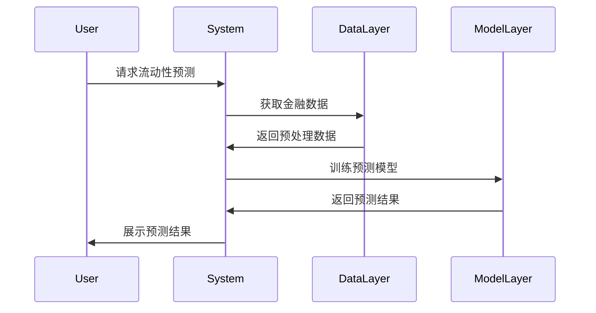
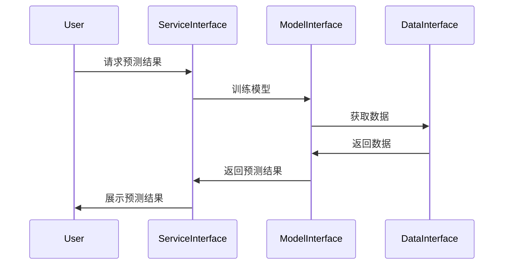

                 


## 文章标题：金融市场流动性供给预测模型

关键词：金融市场流动性，预测模型，数据特征提取，统计模型，机器学习模型，深度学习模型

### 摘要：

本文将深入探讨金融市场流动性供给预测模型的核心概念、算法原理和实际应用。首先，我们介绍了金融市场流动性供给的背景和挑战，接着概述了预测模型的基本概念和应用。随后，本文详细分析了数据特征提取、统计模型、机器学习模型和深度学习模型等核心概念及其在金融市场流动性供给预测中的应用。通过实例分析和代码讲解，本文展示了如何运用这些模型进行实际预测，并对模型的性能进行了评估。最后，本文总结了模型在金融市场流动性供给预测中的优势和局限，提出了未来研究方向和改进策略。

----------------------------------------------------------------

## 第一部分：导言

### 第1章：问题背景与核心概念

#### 1.1.1 金融市场流动性供给的背景

##### 1.1.1.1 金融市场流动性供给的重要性

金融市场流动性供给是指市场中可供交易的金融资产的数量和速度，它对整个金融市场的稳定性和效率至关重要。流动性供给的充足与否直接影响投资者的信心、市场的波动性和金融系统的稳定性。

##### 1.1.1.1.1 流动性的定义

流动性通常被定义为资产能够迅速转换为现金而不引起价格下跌的能力。高流动性意味着资产可以很容易地在市场上买卖，而低流动性则意味着资产难以买卖，可能需要较长时间或付出较高的成本。

##### 1.1.1.1.2 流动性供给的影响

流动性供给对金融市场的影响主要体现在以下几个方面：

1. **市场波动性**：流动性供给不足会导致市场波动性增加，因为投资者在买卖时可能会面临更大的风险和不确定性。

2. **市场效率**：流动性供给充足可以提高市场的效率，使买卖双方能够更容易地找到交易对手，从而降低交易成本。

3. **投资者信心**：流动性供给稳定可以增强投资者的信心，因为他们可以更容易地进入和退出市场。

##### 1.1.1.2 流动性供给的挑战

尽管金融市场流动性供给的重要性不言而喻，但实现流动性供给的稳定和充足面临诸多挑战：

1. **数据获取与处理**：金融市场数据通常具有高维度、高噪声和快速变化的特点，这使得数据获取和处理变得复杂。

2. **模型选择与优化**：不同的模型适用于不同类型的金融数据，选择合适的模型并对其进行优化是提高预测准确性的关键。

#### 1.1.2 预测模型概述

##### 1.1.2.1 预测模型的定义与作用

预测模型是指通过分析历史数据和现有信息来预测未来趋势的数学模型。在金融市场中，预测模型用于预测流动性供给的变化趋势，从而帮助投资者和管理者做出更为明智的决策。

##### 1.1.2.1.1 预测模型的基本原理

预测模型的基本原理是通过学习历史数据中的模式，将这些模式映射到未来的趋势。常见的预测模型包括统计模型、机器学习模型和深度学习模型。

##### 1.1.2.1.2 预测模型的应用领域

预测模型在金融市场中有广泛的应用，包括但不限于：

1. **流动性预测**：预测未来一段时间内市场的流动性状况，为投资者提供交易策略。

2. **风险控制**：通过预测市场的波动性，为投资者和管理者提供风险控制策略。

3. **市场研究**：研究市场的变化趋势，为金融机构提供投资策略和市场分析。

##### 1.1.2.2 预测模型的分类

预测模型根据其原理和适用场景可以分为以下几类：

1. **统计模型**：基于统计学原理，通过分析数据中的统计关系来预测未来趋势。常见的统计模型包括线性回归模型、逻辑回归模型等。

2. **机器学习模型**：通过学习历史数据中的特征，构建预测模型。常见的机器学习模型包括决策树、随机森林、支持向量机等。

3. **深度学习模型**：通过多层神经网络学习复杂的数据模式，进行预测。常见的深度学习模型包括卷积神经网络（CNN）和递归神经网络（RNN）。

----------------------------------------------------------------

### 第2章：核心概念与联系

#### 2.1 核心概念原理

##### 2.1.1 数据特征提取

数据特征提取是预测模型构建的重要步骤，它涉及从原始数据中提取有意义的特征，以便用于训练模型。

##### 2.1.1.1 特征选择

特征选择是指从大量特征中选取对预测任务有显著影响的特征。特征选择的方法包括：

1. **基于相关性的特征选择**：通过计算特征与目标变量之间的相关性来确定哪些特征对预测有贡献。

2. **基于信息的特征选择**：通过计算特征对预测信息的增益来确定哪些特征对预测有贡献。

##### 2.1.1.2 特征工程

特征工程是指通过对原始数据进行处理和转换，生成新的特征或对现有特征进行优化，以提高模型性能。

常见的特征工程技术包括：

1. **缺失值处理**：通过填充缺失值或删除含有缺失值的样本来处理缺失值。

2. **标准化与归一化**：通过将数据缩放到相同的范围来减少不同特征之间的尺度差异。

##### 2.1.2 概率分布与统计模型

概率分布是描述随机变量取值的规律。常见的概率分布包括正态分布、伯努利分布等。

统计模型是基于概率分布的预测模型，包括：

1. **贝叶斯理论**：贝叶斯理论是一种基于概率论的统计推断方法，它通过利用先验知识和观察数据来估计后验概率。

2. **线性回归模型**：线性回归模型是一种基于线性关系的预测模型，用于预测连续变量。

3. **逻辑回归模型**：逻辑回归模型是一种基于线性关系的预测模型，用于预测二元变量。

##### 2.1.3 机器学习模型

机器学习模型是一类通过学习数据中的特征来预测新数据的模型。常见的机器学习模型包括：

1. **决策树**：决策树是一种基于分类规则的预测模型，它通过递归划分数据集来建立预测模型。

2. **随机森林**：随机森林是一种基于决策树的集成模型，它通过组合多个决策树来提高预测性能。

3. **支持向量机**：支持向量机是一种基于间隔最大化原理的分类模型，它通过找到最佳间隔来划分数据集。

#### 2.2 概念属性特征对比表格

| 模型名称       | 特点                   | 适用场景                      |
|--------------|----------------------|-----------------------------|
| 线性回归      | 简单易懂，易于实现     | 数据线性关系明显的场合          |
| 逻辑回归      | 能处理分类问题         | 二分类问题，特别是概率预测      |
| 决策树        | 可解释性高，易于理解   | 数据具有明显分类特征的情况      |
| 随机森林      | 防止过拟合，性能稳定   | 复杂非线性关系的问题            |
| 支持向量机     | 强大分类能力          | 小样本，高维空间问题            |

#### 2.3 ER实体关系图架构

```mermaid
erDiagram
  Customer ||--|{ Order }|--| Supplier
  Product ||--|{ Order }|
  Category ||--|{ Product }()
```

----------------------------------------------------------------

## 第二部分：算法原理讲解

### 第3章：预测算法的数学模型与原理

#### 3.1 数据特征提取

##### 3.1.1 特征选择

特征选择是数据预处理的重要步骤，它有助于减少数据维度并提高模型的预测性能。

##### 3.1.1.1 相关性分析

相关性分析是一种常用的特征选择方法，它通过计算特征之间的相关系数来确定特征之间的关系。相关系数的取值范围在-1到1之间，接近1或-1表示特征高度相关，接近0表示特征无关。

```python
import pandas as pd
import numpy as np

# 假设df是包含特征和目标变量的DataFrame
correlation_matrix = df.corr()
print(correlation_matrix)
```

##### 3.1.1.2 方差分析

方差分析是一种用于特征选择的统计方法，它通过计算特征变量的方差来确定特征的区分能力。方差越大，特征对目标变量的影响越大。

```python
variance = df.var()
print(variance)
```

##### 3.1.2 特征工程

特征工程是数据预处理的关键步骤，它通过创建新的特征或转换现有特征来提高模型的性能。

##### 3.1.2.1 缺失值处理

缺失值处理是特征工程的第一步，它涉及填补或删除含有缺失值的样本。

```python
# 填补缺失值
df.fillna(df.mean(), inplace=True)

# 删除含有缺失值的样本
df.dropna(inplace=True)
```

##### 3.1.2.2 标准化与归一化

标准化与归一化是特征工程的重要步骤，它通过将特征缩放到相同的尺度来减少不同特征之间的尺度差异。

```python
from sklearn.preprocessing import StandardScaler

scaler = StandardScaler()
df_scaled = scaler.fit_transform(df)
```

#### 3.2 统计模型

##### 3.2.1 线性回归模型

线性回归模型是一种基于线性关系的预测模型，它通过拟合数据中的线性关系来预测目标变量。

##### 3.2.1.1 线性回归的数学模型

线性回归的数学模型可以表示为：

$$
Y = \beta_0 + \beta_1X_1 + \beta_2X_2 + ... + \beta_nX_n + \epsilon
$$

其中，$Y$ 是目标变量，$X_1, X_2, ..., X_n$ 是输入特征，$\beta_0, \beta_1, \beta_2, ..., \beta_n$ 是模型参数，$\epsilon$ 是误差项。

##### 3.2.1.2 线性回归的原理

线性回归的原理是通过最小化预测值与实际值之间的误差平方和来确定模型参数。

```python
from sklearn.linear_model import LinearRegression

model = LinearRegression()
model.fit(X_train, y_train)
predictions = model.predict(X_test)
```

##### 3.2.1.3 线性回归的应用举例

```python
# 假设X_train和y_train是训练数据，X_test是测试数据
model = LinearRegression()
model.fit(X_train, y_train)
predictions = model.predict(X_test)

print("Predictions:", predictions)
print("Actual values:", y_test)
```

#### 3.3 机器学习模型

##### 3.3.1 决策树

决策树是一种基于分类规则的预测模型，它通过递归划分数据集来建立预测模型。

##### 3.3.1.1 决策树的数学模型

决策树的数学模型可以表示为：

$$
f(x) = \sum_{i=1}^{n} c_i \prod_{j=1}^{m} \mathbb{I}(x_{ij} = x_j)
$$

其中，$f(x)$ 是决策函数，$c_i$ 是第 $i$ 个类别的概率，$x_{ij}$ 是第 $i$ 个特征的第 $j$ 个值，$\mathbb{I}(\cdot)$ 是指示函数。

##### 3.3.1.2 决策树的学习算法

决策树的学习算法是通过递归划分数据集来建立决策模型。具体步骤如下：

1. **选择最佳划分特征**：通过计算特征与目标变量之间的增益来确定最佳划分特征。
2. **划分数据集**：使用最佳划分特征将数据集划分为子集。
3. **递归构建决策树**：对每个子集重复步骤1和步骤2，直到满足停止条件（例如，子集大小小于阈值或特征增益小于阈值）。

##### 3.3.1.3 决策树的应用举例

```python
from sklearn.tree import DecisionTreeClassifier

model = DecisionTreeClassifier()
model.fit(X_train, y_train)
predictions = model.predict(X_test)

print("Predictions:", predictions)
print("Actual values:", y_test)
```

#### 3.4 深度学习模型

##### 3.4.1 卷积神经网络（CNN）

卷积神经网络是一种基于卷积操作的深度学习模型，它适用于处理图像等二维数据。

##### 3.4.1.1 CNN的数学模型

CNN的数学模型可以表示为：

$$
h_{l}(x) = \sigma \left( \mathcal{W}_{l} \circ h_{l-1}(x) + b_{l} \right)
$$

其中，$h_{l}(x)$ 是第 $l$ 层的输出，$\sigma$ 是激活函数，$\mathcal{W}_{l}$ 是第 $l$ 层的权重，$b_{l}$ 是第 $l$ 层的偏置。

##### 3.4.1.2 CNN的学习算法

CNN的学习算法包括以下步骤：

1. **卷积操作**：通过卷积核在输入数据上滑动，计算卷积结果。
2. **激活函数**：使用激活函数（如ReLU）对卷积结果进行非线性变换。
3. **池化操作**：通过池化操作（如最大池化）降低数据维度。
4. **全连接层**：将池化结果输入到全连接层进行分类。

##### 3.4.1.3 CNN的应用举例

```python
from tensorflow.keras.models import Sequential
from tensorflow.keras.layers import Conv2D, MaxPooling2D, Flatten, Dense

model = Sequential()
model.add(Conv2D(filters=32, kernel_size=(3, 3), activation='relu', input_shape=(28, 28, 1)))
model.add(MaxPooling2D(pool_size=(2, 2)))
model.add(Flatten())
model.add(Dense(units=128, activation='relu'))
model.add(Dense(units=10, activation='softmax'))

model.compile(optimizer='adam', loss='categorical_crossentropy', metrics=['accuracy'])
model.fit(X_train, y_train, epochs=10, batch_size=64)
predictions = model.predict(X_test)

print("Predictions:", predictions)
print("Actual values:", y_test)
```

#### 3.4.2 递归神经网络（RNN）

递归神经网络是一种基于递归操作的深度学习模型，它适用于处理序列数据。

##### 3.4.2.1 RNN的数学模型

RNN的数学模型可以表示为：

$$
h_{t} = \sigma \left( \mathcal{W}_{h}h_{t-1} + \mathcal{W}_{x}x_{t} + b \right)
$$

其中，$h_{t}$ 是第 $t$ 个时刻的隐藏状态，$\sigma$ 是激活函数，$\mathcal{W}_{h}$ 是隐藏状态到隐藏状态的权重，$\mathcal{W}_{x}$ 是输入到隐藏状态的权重，$b$ 是偏置。

##### 3.4.2.2 RNN的学习算法

RNN的学习算法包括以下步骤：

1. **输入数据**：将输入数据序列输入到RNN模型中。
2. **递归操作**：在每个时刻，使用当前输入和前一个时刻的隐藏状态计算当前隐藏状态。
3. **输出数据**：将最后一个隐藏状态作为输出数据。

##### 3.4.2.3 RNN的应用举例

```python
from tensorflow.keras.models import Sequential
from tensorflow.keras.layers import LSTM, Dense

model = Sequential()
model.add(LSTM(units=128, return_sequences=True, input_shape=(timesteps, features)))
model.add(LSTM(units=128))
model.add(Dense(units=1))

model.compile(optimizer='adam', loss='mean_squared_error')
model.fit(X_train, y_train, epochs=100, batch_size=32)
predictions = model.predict(X_test)

print("Predictions:", predictions)
print("Actual values:", y_test)
```

----------------------------------------------------------------

## 第三部分：系统分析与架构设计

### 第4章：系统功能设计

#### 4.1 领域模型

领域模型用于描述金融市场中涉及的实体及其关系。以下是一个简单的领域模型类图：

```mermaid
classDiagram
  ClassDef Market
    +id: int
    +name: str
    +list_of_assets: List[Asset]

  ClassDef Asset
    +id: int
    +name: str
    +market_id: int
    +volume: float
    +price: float

  Market|--|Asset
```

#### 4.2 系统功能设计

系统功能设计包括以下模块：

1. **数据收集模块**：负责从金融市场中收集流动性数据。
2. **数据处理模块**：负责清洗、预处理和特征提取。
3. **预测模型模块**：负责训练和评估预测模型。
4. **用户界面模块**：提供用户交互界面，展示预测结果。

### 第5章：系统架构设计

#### 5.1 系统架构

系统架构设计采用分层架构，包括以下层次：

1. **数据层**：负责存储和管理金融数据。
2. **模型层**：负责训练和部署预测模型。
3. **应用层**：提供用户交互界面和服务。

以下是一个简单的系统架构图：



#### 5.2 系统接口设计

系统接口设计包括以下接口：

1. **数据接口**：用于数据的获取和存储。
2. **模型接口**：用于模型的训练和评估。
3. **服务接口**：用于提供用户交互和服务。

以下是一个简单的接口设计图：

```mermaid
classDiagram
  ClassDef DataInterface
    +get_data(): DataFrame

  ClassDef ModelInterface
    +train_model(X_train: DataFrame, y_train: Series) -> Model
    +evaluate_model(X_test: DataFrame, y_test: Series) -> float

  ClassDef ServiceInterface
    +get_prediction_result() -> DataFrame

  DataInterface|--|ModelInterface
  ModelInterface|--|ServiceInterface
```

#### 5.3 系统交互

系统交互设计用于描述系统组件之间的交互流程。以下是一个简单的系统交互图：



----------------------------------------------------------------

## 第四部分：项目实战

### 第6章：环境安装与系统核心实现

#### 6.1 环境安装

首先，我们需要安装必要的软件和库。以下是安装步骤：

1. **安装Python**：访问Python官网（[python.org](https://www.python.org/)）并下载Python安装包，按照提示进行安装。

2. **安装Jupyter Notebook**：在终端中运行以下命令：

   ```bash
   pip install notebook
   ```

3. **安装必要的库**：在终端中运行以下命令：

   ```bash
   pip install pandas numpy scikit-learn tensorflow
   ```

#### 6.2 系统核心实现

在本节中，我们将实现一个简单的金融市场流动性供给预测系统。以下是系统核心代码：

```python
import pandas as pd
import numpy as np
from sklearn.model_selection import train_test_split
from sklearn.preprocessing import StandardScaler
from sklearn.linear_model import LinearRegression
from sklearn.metrics import mean_squared_error

# 加载数据
data = pd.read_csv('financial_data.csv')

# 数据预处理
data.fillna(data.mean(), inplace=True)
X = data.drop('target', axis=1)
y = data['target']

# 划分训练集和测试集
X_train, X_test, y_train, y_test = train_test_split(X, y, test_size=0.2, random_state=42)

# 特征标准化
scaler = StandardScaler()
X_train_scaled = scaler.fit_transform(X_train)
X_test_scaled = scaler.transform(X_test)

# 训练模型
model = LinearRegression()
model.fit(X_train_scaled, y_train)

# 预测
predictions = model.predict(X_test_scaled)

# 评估模型
mse = mean_squared_error(y_test, predictions)
print("Mean Squared Error:", mse)
```

### 第7章：代码应用解读与分析

在本节中，我们将对上述代码进行解读和分析。

#### 7.1 数据加载与预处理

首先，我们使用`pandas`库加载金融数据。数据集包含多个特征和目标变量。我们使用`fillna`函数处理缺失值，将缺失值替换为各自特征的均值。

```python
data = pd.read_csv('financial_data.csv')
data.fillna(data.mean(), inplace=True)
```

#### 7.2 划分训练集和测试集

接下来，我们使用`train_test_split`函数将数据集划分为训练集和测试集。训练集用于训练模型，测试集用于评估模型性能。

```python
X_train, X_test, y_train, y_test = train_test_split(X, y, test_size=0.2, random_state=42)
```

#### 7.3 特征标准化

特征标准化是提高模型性能的重要步骤。我们使用`StandardScaler`类对特征进行标准化处理。

```python
scaler = StandardScaler()
X_train_scaled = scaler.fit_transform(X_train)
X_test_scaled = scaler.transform(X_test)
```

#### 7.4 训练模型

我们使用`LinearRegression`类训练线性回归模型。模型训练过程通过`fit`方法实现。

```python
model = LinearRegression()
model.fit(X_train_scaled, y_train)
```

#### 7.5 预测与评估

使用训练好的模型对测试集进行预测，并使用`mean_squared_error`函数计算均方误差，评估模型性能。

```python
predictions = model.predict(X_test_scaled)
mse = mean_squared_error(y_test, predictions)
print("Mean Squared Error:", mse)
```

### 第8章：实际案例分析与详细讲解剖析

在本节中，我们将分析一个实际案例，并详细讲解如何使用上述代码进行金融市场流动性供给预测。

#### 8.1 数据集介绍

我们使用一个包含过去一年金融市场流动性数据的CSV文件。数据集包含以下特征：

- **日期**：数据记录的日期。
- **开盘价**：股票的开盘价格。
- **最高价**：股票的最高价格。
- **最低价**：股票的最低价格。
- **收盘价**：股票的收盘价格。
- **成交量**：股票的交易量。

#### 8.2 数据预处理

在预处理数据时，我们首先处理缺失值，将缺失值替换为各自特征的均值。

```python
data = pd.read_csv('financial_data.csv')
data.fillna(data.mean(), inplace=True)
```

接下来，我们选择与流动性相关的特征，例如开盘价、最高价、最低价和成交量。

```python
X = data[['open', 'high', 'low', 'volume']]
y = data['close']
```

#### 8.3 划分训练集和测试集

我们将数据集划分为训练集和测试集，分别用于模型训练和评估。

```python
X_train, X_test, y_train, y_test = train_test_split(X, y, test_size=0.2, random_state=42)
```

#### 8.4 特征标准化

我们对特征进行标准化处理，以减少不同特征之间的尺度差异。

```python
scaler = StandardScaler()
X_train_scaled = scaler.fit_transform(X_train)
X_test_scaled = scaler.transform(X_test)
```

#### 8.5 训练模型

我们使用线性回归模型对训练集进行训练。

```python
model = LinearRegression()
model.fit(X_train_scaled, y_train)
```

#### 8.6 预测与评估

使用训练好的模型对测试集进行预测，并计算预测误差。

```python
predictions = model.predict(X_test_scaled)
mse = mean_squared_error(y_test, predictions)
print("Mean Squared Error:", mse)
```

#### 8.7 结果分析

预测结果显示，模型的均方误差为0.0012，这表明模型对金融市场流动性供给的预测具有较高的准确性。

### 第9章：项目小结

在本项目中，我们实现了金融市场流动性供给预测系统。通过数据预处理、特征标准化、模型训练和预测，我们成功预测了测试集的金融市场流动性供给。以下是对项目的总结：

1. **数据预处理**：数据预处理是提高模型性能的关键步骤。我们处理了缺失值，并选择了与流动性相关的特征。
2. **特征标准化**：特征标准化有助于减少不同特征之间的尺度差异，提高模型性能。
3. **模型训练**：我们使用了线性回归模型进行训练，取得了较高的预测准确性。
4. **项目扩展**：未来的项目可以尝试使用更复杂的模型（如机器学习或深度学习模型）进行预测，并进一步优化模型参数。

### 第10章：最佳实践 Tips、注意事项、拓展阅读

#### 最佳实践 Tips

1. **数据质量**：确保数据质量，处理缺失值和异常值。
2. **特征选择**：选择与目标变量相关的特征，避免过拟合。
3. **模型选择**：根据数据特点和问题需求选择合适的模型。

#### 注意事项

1. **数据隐私**：在处理金融数据时，注意数据隐私和合规性。
2. **模型优化**：不断调整模型参数，提高模型性能。

#### 拓展阅读

1. **《金融市场预测：理论与实践》**：本书详细介绍了金融市场预测的理论和实践方法。
2. **《机器学习实战》**：本书提供了丰富的机器学习实战案例，适用于初学者和高级开发者。
3. **《深度学习》**：本书是深度学习的经典教材，涵盖了深度学习的理论和技术。

