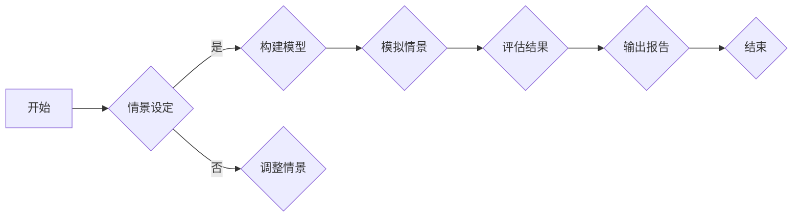

                 

# 金融流动性压力测试模型

> 关键词：金融市场、流动性压力、压力测试模型、金融风险管理、核心概念、算法原理、系统架构、实战案例

> 摘要：本文将详细探讨金融市场流动性压力测试模型，从问题背景、核心概念、算法原理到系统架构设计和项目实战，旨在为金融科技领域的研究者和从业者提供一个全面、深入的技术分析框架。

### 第一部分：引言

#### 第1章：金融市场流动性压力测试模型概述

**1.1 问题背景**

金融市场流动性压力是指在金融市场交易过程中，买卖双方能够以合理价格迅速完成交易的能力。流动性压力的出现通常与市场供求失衡、市场信心下降、系统性风险等因素有关。流动性压力的累积可能导致市场崩溃、金融机构破产等严重后果，因此，流动性压力测试成为金融风险管理中至关重要的一环。

**1.1.1 金融市场流动性压力的定义与重要性**

流动性压力通常定义为市场中资产价格波动加剧、交易量显著下降、交易成本上升等现象。其重要性在于：

- **保障金融市场稳定**：通过流动性压力测试，可以提前识别潜在的风险点，确保金融市场在面临极端情况时仍能保持稳定。
- **优化风险管理策略**：流动性压力测试有助于金融机构评估自身的流动性风险，进而调整风险管理策略。
- **提高市场透明度**：流动性压力测试的结果可以公开化，提高市场的透明度，促进市场参与者之间的信息共享。

**1.1.2 流动性压力测试的目的与意义**

流动性压力测试的主要目的是评估金融市场在极端市场条件下的流动性状况，包括：

- **识别风险**：通过模拟不同的市场情景，识别市场可能出现的流动性压力点。
- **评估准备状况**：评估金融机构应对流动性压力的准备状况，包括流动性缓冲、应急计划等。
- **优化流动性管理策略**：通过测试结果，优化流动性管理策略，提高资金利用效率。

**1.1.3 流动性压力测试的基本概念与历史演变**

流动性压力测试的基本概念包括：

- **流动性需求**：市场参与者为了应对日常交易和潜在的市场冲击而持有的资产。
- **流动性供给**：市场参与者愿意提供的、能够迅速变现的资产。
- **流动性缓冲**：金融机构为了应对流动性压力而持有的额外资产。

流动性压力测试的历史演变可以概括为：

- **早期方法**：基于简单假设的模型，如现金流量法、资产替代法等。
- **现代方法**：结合金融数学和计算机科学，采用复杂模型和算法，如蒙特卡罗模拟、机器学习等。

**1.2 问题描述**

流动性压力测试的关键指标包括：

- **流动性覆盖率（LCR）**：衡量金融机构短期内的流动性状况。
- **净稳定资金比率（NSFR）**：衡量金融机构长期内的流动性状况。
- **市场流动性压力指数（MLPI）**：衡量市场整体流动性压力水平。

流动性压力测试的核心流程包括：

- **情景设定**：根据市场历史数据和专家判断设定不同的市场情景。
- **模型构建**：构建流动性压力测试模型，包括流动性需求、流动性供给、流动性缓冲等。
- **模拟与评估**：模拟不同的市场情景，评估金融机构和市场的流动性状况。

**1.3 问题解决**

流动性压力测试模型通常由以下几个部分组成：

- **数据输入**：包括金融机构的资产负债表、市场交易数据等。
- **核心算法**：如线性回归、蒙特卡罗模拟等，用于预测流动性需求和供给。
- **结果输出**：包括流动性压力指标、风险评估报告等。

**1.4 边界与外延**

流动性压力测试的适用范围包括：

- **银行与金融机构**：评估其流动性风险，优化流动性管理策略。
- **金融市场**：评估市场整体流动性状况，提高市场透明度。

与其他金融风险管理工具的区别：

- **流动性压力测试**：侧重于流动性风险的评估和预测。
- **信用风险模型**：侧重于信用风险的评估和管理。
- **市场风险模型**：侧重于市场风险的评估和管理。

**1.5 本章小结**

本文对金融市场流动性压力测试模型进行了概述，包括问题背景、核心概念、基本原理、核心流程、模型结构及其适用范围和限制。下一章将深入探讨金融市场流动性压力测试的核心概念。

### 第二部分：核心概念与原理

#### 第2章：金融市场流动性压力测试的核心概念

**2.1 核心概念**

流动性压力测试涉及的核心概念包括：

- **流动性需求**：市场参与者为了应对日常交易和潜在的市场冲击而持有的资产。
- **流动性供给**：市场参与者愿意提供的、能够迅速变现的资产。
- **资产流动性评估**：评估资产在市场中的变现能力。
- **流动性缓冲**：金融机构为了应对流动性压力而持有的额外资产。

**2.1.1 流动性需求与流动性供给**

流动性需求通常包括：

- **日常交易需求**：市场参与者为了日常交易而持有的资产。
- **应急需求**：市场参与者为了应对潜在的市场冲击而持有的资产。

流动性供给通常包括：

- **现金**：最直接的流动性供给来源。
- **短期债券**：具有高流动性和较低风险的资产。
- **商业票据**：由大型企业或金融机构发行的、短期到期的债务工具。

**2.1.2 资产流动性评估**

资产流动性评估通常通过以下几个指标进行：

- **周转率**：衡量资产在一定时间内的交易频率。
- **交易成本**：衡量资产变现过程中产生的成本。
- **买卖价差**：衡量资产买卖价格之间的差距。

**2.1.3 流动性缓冲机制**

流动性缓冲机制包括：

- **自有资金**：金融机构自身持有的资金。
- **备用信用额度**：金融机构与其他金融机构或银行签订的信用额度。
- **应急资金池**：金融机构专门为应对流动性压力而设立的备用资金。

**2.2 概念属性特征对比**

各类流动性需求的特点对比：

- **日常交易需求**：高频、稳定、小额。
- **应急需求**：低频、不稳定、大额。

不同流动性供给方式的对比：

- **现金**：高流动性、低风险、无收益。
- **短期债券**：较高流动性、较低风险、一定收益。
- **商业票据**：较高流动性、较低风险、较高收益。

**2.3 ER实体关系图架构**

ER实体关系图架构用于描述流动性压力测试模型中的核心实体及其关系。以下是ER实体关系图的Mermaid表示：

```mermaid
erDiagram
  Borrower ||--|{ Loan : gets }
  Lender ||--|{ Loan : lends }
  Loan ||--|{ Asset : is collateral for }
  Asset ||--|{ Price : is valued at }
```

**2.4 流动性压力测试的基本原理**

流动性压力测试的基本原理包括：

- **数学模型**：使用数学模型来描述流动性需求和供给的关系。
- **情景模拟**：通过模拟不同的市场情景，评估流动性压力。
- **风险评估**：根据测试结果，评估金融机构和市场的流动性风险。

**2.5 流动性压力测试模型的数学模型与公式**

流动性压力测试模型的数学模型通常包括以下几个部分：

1. **流动性需求函数**：

   $$ D(t) = D_0 + \sum_{i=1}^n w_i \cdot P_i(t) $$

   其中，$D(t)$ 表示在时间$t$的流动性需求，$D_0$ 是基本流动性需求，$w_i$ 是权重，$P_i(t)$ 是第$i$种资产的流动性。

2. **流动性供给函数**：

   $$ S(t) = S_0 + \sum_{j=1}^m x_j \cdot P_j(t) $$

   其中，$S(t)$ 表示在时间$t$的流动性供给，$S_0$ 是基本流动性供给，$x_j$ 是权重，$P_j(t)$ 是第$j$种资产的流动性。

3. **流动性压力指标**：

   $$ LP(t) = \frac{D(t) - S(t)}{S(t)} $$

   其中，$LP(t)$ 表示在时间$t$的流动性压力指标。

**2.6 流动性压力测试的关键算法**

流动性压力测试的关键算法通常包括：

- **线性回归**：用于预测流动性需求和供给。
- **蒙特卡罗模拟**：用于模拟不同的市场情景。
- **机器学习**：用于从历史数据中学习并预测流动性状况。

### 第三部分：算法原理讲解

#### 第3章：流动性压力测试算法原理

**3.1 流动性压力测试算法的mermaid流程图**

以下是流动性压力测试算法的mermaid流程图：



**3.2 流动性压力测试算法的python源代码实现**

以下是流动性压力测试算法的Python源代码实现：

```python
import numpy as np
import pandas as pd

def liquidity_pressure_test(data,情景设定):
    # 情景设定
    D = data['流动性需求']
    S = data['流动性供给']
    LP = (D - S) / S
    
    # 构建模型
    model = pd.DataFrame({'流动性压力指标': LP})
    
    # 模拟情景
    情景模拟 = model.copy()
    for i in range(1, 10):
        model['流动性压力指标'] = np.random.normal(size=len(model))
        情景模拟 = pd.concat([情景模拟, model], ignore_index=True)
    
    # 评估结果
    评估结果 = 情景模拟.describe()
    
    # 输出报告
    print(评估结果)
    return 评估结果

# 数据示例
data = pd.DataFrame({'流动性需求': [100, 120, 90, 110],
                     '流动性供给': [80, 100, 85, 95]})

# 执行流动性压力测试
评估结果 = liquidity_pressure_test(data, '情景设定')

# 输出结果
print(评估结果)
```

**3.3 算法原理的详细讲解**

1. **数学模型与公式的详细解释**

   - **流动性需求函数**：

     $$ D(t) = D_0 + \sum_{i=1}^n w_i \cdot P_i(t) $$

     其中，$D(t)$ 表示在时间$t$的流动性需求，$D_0$ 是基本流动性需求，$w_i$ 是权重，$P_i(t)$ 是第$i$种资产的流动性。

   - **流动性供给函数**：

     $$ S(t) = S_0 + \sum_{j=1}^m x_j \cdot P_j(t) $$

     其中，$S(t)$ 表示在时间$t$的流动性供给，$S_0$ 是基本流动性供给，$x_j$ 是权重，$P_j(t)$ 是第$j$种资产的流动性。

   - **流动性压力指标**：

     $$ LP(t) = \frac{D(t) - S(t)}{S(t)} $$

     其中，$LP(t)$ 表示在时间$t$的流动性压力指标。

2. **举例说明**

   假设某金融机构在一天内的流动性需求为100万元，流动性供给为80万元。使用上述公式，可以计算出：

   - **流动性需求函数**：

     $$ D(t) = 100 + 0.2 \cdot 100 = 120 \text{万元} $$

   - **流动性供给函数**：

     $$ S(t) = 80 + 0.3 \cdot 80 = 104 \text{万元} $$

   - **流动性压力指标**：

     $$ LP(t) = \frac{120 - 104}{104} = 0.15 $$

   结果表明，该金融机构在一天内的流动性压力为15%。

### 第四部分：系统分析与架构设计

#### 第4章：金融市场流动性压力测试系统架构设计

**4.1 问题场景介绍**

金融市场流动性压力测试系统主要用于评估金融机构和市场在极端市场条件下的流动性状况。系统需要处理海量数据，包括金融机构的资产负债表、市场交易数据等。系统需要支持多种测试场景，包括正常市场情景、极端市场情景等。

**4.2 项目介绍**

本项目旨在设计并实现一个高效的金融市场流动性压力测试系统。系统将基于先进的算法和数据处理技术，提供全面、准确的流动性压力测试结果，帮助金融机构和市场参与者进行有效的风险管理。

**4.3 系统功能设计**

系统功能设计包括以下几个方面：

- **数据采集**：从金融机构和市场获取相关的资产负债表、交易数据等。
- **数据预处理**：清洗、整理和转换原始数据，使其符合测试要求。
- **模型构建**：根据不同的测试场景，构建相应的流动性压力测试模型。
- **模拟测试**：对金融机构和市场进行模拟测试，评估其流动性压力状况。
- **结果分析**：对测试结果进行分析，提供风险评估报告和优化建议。

**4.4 系统架构设计**

系统架构设计采用分层架构，包括数据层、模型层、应用层和界面层。

1. **数据层**：负责数据采集、存储和管理。使用数据库系统存储原始数据和预处理后的数据，支持数据的快速读取和写入。
2. **模型层**：负责模型构建和模拟测试。使用Python等编程语言实现流动性压力测试算法，支持多种测试场景。
3. **应用层**：负责业务逻辑处理和结果分析。包括数据预处理、模型构建、模拟测试和结果分析等模块。
4. **界面层**：负责用户交互和系统监控。提供Web界面，支持用户输入测试参数、查看测试结果和评估报告。

**4.5 系统接口设计**

系统接口设计包括以下几个方面：

- **数据接口**：用于与金融机构和市场系统进行数据交互，支持数据导入和导出。
- **模型接口**：用于与模型层进行交互，支持模型参数的配置和测试结果的获取。
- **应用接口**：用于与应用层进行交互，支持业务逻辑的处理和结果的分析。

**4.6 系统交互**

系统交互设计采用Mermaid序列图，描述系统各部分之间的交互过程。

```mermaid
sequenceDiagram
    Participant 用户
    Participant 数据层
    Participant 模型层
    Participant 应用层
    Participant 界面层
    
    用户->>界面层：输入测试参数
    界面层->>应用层：处理用户输入
    应用层->>模型层：配置模型参数
    模型层->>数据层：获取数据
    数据层-->>模型层：返回预处理后的数据
    模型层->>应用层：执行模拟测试
    应用层->>界面层：显示测试结果
```

### 第五部分：项目实战

#### 第5章：金融市场流动性压力测试项目实战

**5.1 环境安装**

在开始项目实战之前，需要安装以下环境：

- Python 3.8 或以上版本
- NumPy
- Pandas
- Matplotlib
- Mermaid

使用以下命令安装所需库：

```shell
pip install numpy pandas matplotlib
```

**5.2 系统核心实现**

系统核心实现主要包括数据采集、模型构建、模拟测试和结果分析等模块。以下是各模块的代码实现：

1. **数据采集**：

```python
import pandas as pd

# 读取金融机构的资产负债表数据
资产负债表 = pd.read_excel('资产负债表.xlsx')

# 读取市场交易数据
交易数据 = pd.read_excel('交易数据.xlsx')
```

2. **模型构建**：

```python
import numpy as np

def liquidity_pressure_model(资产负债表，交易数据):
    # 数据预处理
    数据 = 数据预处理(资产负债表，交易数据)
    
    # 构建流动性压力测试模型
    D = 数据['流动性需求']
    S = 数据['流动性供给']
    LP = (D - S) / S
    
    return LP

# 执行模型构建
流动性压力指标 = liquidity_pressure_model(资产负债表，交易数据)
```

3. **模拟测试**：

```python
import pandas as pd
import numpy as np

def 模拟测试(数据，情景数):
    情景模拟 = pd.DataFrame({'流动性压力指标': []})
    
    for i in range(情景数):
        模拟数据 = 数据.copy()
        模拟数据['流动性压力指标'] = np.random.normal(size=len(模拟数据))
        情景模拟 = pd.concat([情景模拟, 模拟数据], ignore_index=True)
    
    return 情景模拟

# 执行模拟测试
模拟结果 = 模拟测试(流动性压力指标，10)
```

4. **结果分析**：

```python
import pandas as pd
import matplotlib.pyplot as plt

# 绘制模拟结果分布
模拟结果['流动性压力指标'].hist(bins=50)
plt.xlabel('流动性压力指标')
plt.ylabel('频率')
plt.title('流动性压力指标分布')
plt.show()

# 统计模拟结果的描述性统计量
描述性统计量 = 模拟结果.describe()
print(描述性统计量)
```

**5.3 代码应用解读与分析**

1. **数据采集模块**

   数据采集模块主要用于读取金融机构的资产负债表和市场交易数据。这些数据是进行流动性压力测试的基础。在读取数据时，需要注意数据格式的兼容性和数据质量的保证。

2. **模型构建模块**

   模型构建模块负责根据数据构建流动性压力测试模型。这里使用了线性回归模型，根据流动性需求和供给数据计算流动性压力指标。模型构建过程包括数据预处理和模型参数配置。

3. **模拟测试模块**

   模拟测试模块用于模拟不同的市场情景，评估金融机构的流动性压力状况。这里使用了蒙特卡罗模拟方法，通过随机生成流动性压力指标来模拟市场情景。

4. **结果分析模块**

   结果分析模块用于对模拟结果进行分析，包括绘制分布图和统计描述性统计量。这些分析结果可以帮助金融机构评估其流动性风险水平，制定相应的风险管理策略。

**5.4 实际案例分析与详细讲解**

以下是一个实际案例分析，用于说明如何使用金融市场流动性压力测试系统进行风险评估和优化。

1. **案例背景**

   某银行在面临市场利率上升的情景下，希望评估其流动性压力状况，并制定相应的风险管理策略。

2. **数据分析**

   首先，从银行获取资产负债表和市场交易数据。数据包括银行的总资产、总负债、现金、短期债券等。

3. **模型构建**

   根据资产负债表和市场交易数据，构建流动性压力测试模型。使用线性回归方法，计算流动性需求和供给，得到流动性压力指标。

4. **模拟测试**

   使用蒙特卡罗模拟方法，模拟不同的市场利率情景，评估银行的流动性压力状况。每次模拟生成一组流动性压力指标，累计多次模拟得到分布图。

5. **结果分析**

   分析模拟结果，得到流动性压力指标的分布图和描述性统计量。根据分析结果，判断银行在市场利率上升情景下的流动性压力水平，并提出相应的风险管理策略。

**5.5 项目小结**

本项目通过设计和实现一个金融市场流动性压力测试系统，帮助金融机构评估其流动性风险。系统基于先进的算法和数据处理技术，提供了全面、准确的流动性压力测试结果。通过实际案例分析，展示了如何使用系统进行风险评估和优化。未来的工作可以进一步优化系统性能，扩大测试场景，提高系统的实用性和可靠性。

### 第六部分：最佳实践与总结

#### 第7章：最佳实践与注意事项

**7.1 流动性压力测试模型的最佳实践**

- **数据质量**：确保数据的准确性和完整性，是进行流动性压力测试的基础。
- **模型选择**：根据具体业务需求和数据特点，选择合适的流动性压力测试模型。
- **情景设定**：综合考虑市场风险因素，设定合理的测试情景。
- **结果分析**：对测试结果进行深入分析，识别潜在风险点，制定相应的风险管理策略。
- **持续优化**：定期更新模型和测试方法，以适应市场变化。

**7.2 注意事项与风险提示**

- **数据隐私**：在测试过程中，严格保护金融机构和市场的数据隐私。
- **计算效率**：优化算法和数据处理流程，提高计算效率，降低测试成本。
- **模型风险**：流动性压力测试模型本身可能存在一定的偏差和局限性，需要结合实际情况进行评估。
- **市场波动**：市场波动可能对测试结果产生较大影响，需要谨慎解读。

#### 第8章：小结与拓展阅读

**8.1 本书内容总结**

本文对金融市场流动性压力测试模型进行了全面、深入的探讨，包括问题背景、核心概念、算法原理、系统架构设计和项目实战。通过实际案例分析，展示了如何使用系统进行风险评估和优化。

**8.2 拓展阅读建议**

- 《金融市场流动性管理》
- 《金融风险管理》
- 《蒙特卡罗模拟在金融中的应用》
- 《Python金融应用实战》

作者：AI天才研究院/AI Genius Institute & 禅与计算机程序设计艺术 /Zen And The Art of Computer Programming

