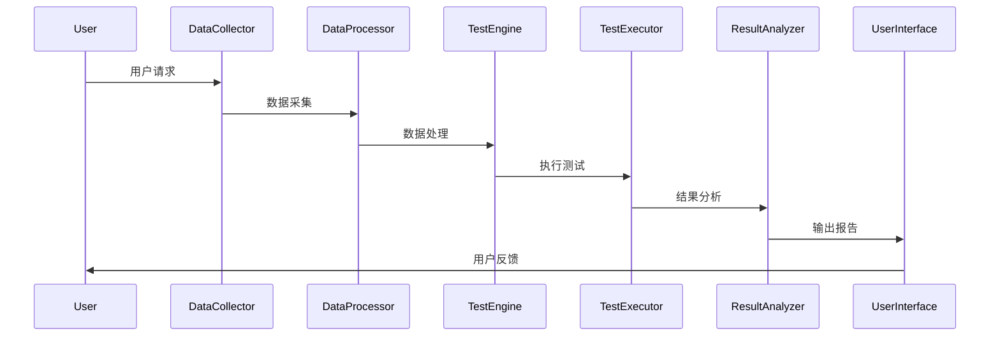
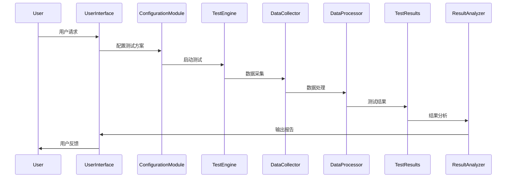
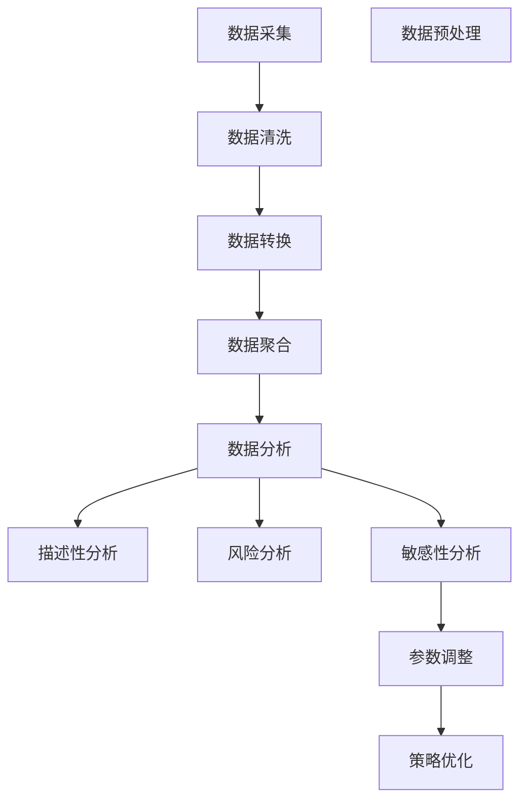

                 


### 1.1 金融市场流动性压力测试的背景

#### 1.1.1 问题背景

金融市场流动性压力测试是金融风险管理的重要一环。随着金融市场的发展和全球化，金融机构面临的流动性风险日益复杂和多样化。流动性风险指的是金融机构在短期内无法以合理价格出售资产以满足资金需求的风险。流动性压力测试旨在评估金融机构在面临流动性危机时的应对能力，确保其在各种极端市场条件下仍能保持正常运营。

流动性压力测试的重要性体现在以下几个方面：

1. **监管要求**：全球金融监管机构如巴塞尔委员会、美联储等，对金融机构的流动性风险管理和压力测试有明确要求。金融机构需定期进行流动性压力测试，并向监管机构报告测试结果。

2. **风险管理**：流动性压力测试有助于金融机构识别潜在的风险点，评估流动性风险水平，制定有效的风险管理和应对策略。

3. **市场信心**：良好的流动性压力测试结果能够增强市场对金融机构的信心，降低市场恐慌情绪，稳定金融市场。

#### 1.1.2 问题解决

传统的流动性压力测试主要依赖于手工操作，存在以下问题：

1. **效率低下**：手工操作需要大量人力和时间，测试周期较长，无法满足快速响应市场变化的需求。

2. **误差较大**：手工操作容易引入人为错误，影响测试结果的准确性。

3. **重复性差**：手工测试无法确保每次测试的一致性，难以进行有效的比较和分析。

为了解决这些问题，金融机构开始探索自动化流动性压力测试平台。自动化平台通过计算机程序实现测试流程，能够提高测试效率，降低错误率，提高测试结果的可靠性。

#### 1.1.3 边界与外延

流动性压力测试的范围包括但不限于以下几个方面：

1. **资产流动性测试**：评估金融机构持有的各种资产在压力条件下的变现能力。

2. **负债流动性测试**：评估金融机构的负债在压力条件下的偿还能力。

3. **融资流动性测试**：评估金融机构在压力条件下的融资渠道和融资成本。

4. **应急资金测试**：评估金融机构的应急资金储备是否足够应对流动性危机。

流动性压力测试的核心要素包括：

- **测试场景**：模拟各种极端市场条件，如市场暴跌、资金流断裂等。
- **测试指标**：流动性覆盖率、净稳定资金比率、流动性匹配率等。
- **测试结果分析**：评估金融机构在测试场景下的流动性状况，发现潜在问题。

#### 1.1.4 概念结构与核心要素组成

流动性压力测试的框架结构可以概括为：

1. **测试准备**：制定测试方案，收集相关数据，搭建测试环境。

2. **测试执行**：根据测试方案，执行测试流程，记录测试结果。

3. **结果分析**：分析测试结果，识别潜在风险，提出改进措施。

4. **报告输出**：编写测试报告，向管理层和监管机构汇报测试情况。

### 1.2 流动性压力测试的核心概念

#### 1.2.1 概念定义

**流动性压力测试**：流动性压力测试是一种模拟金融市场极端情况下的压力测试，旨在评估金融机构在压力条件下的流动性风险水平和应对能力。

**流动性风险**：流动性风险是指金融机构无法在合理时间内以合理价格出售资产或获得融资的风险。

**流动性覆盖率（LCR）**：流动性覆盖率是指金融机构的高质量流动性资产（HQLA）与其短期现金流需求之比，用于衡量金融机构短期流动性风险。

**净稳定资金比率（NSFR）**：净稳定资金比率是指金融机构的稳定资金来源与其所需稳定资金之比，用于衡量金融机构的长期流动性风险。

**流动性匹配率（LML）**：流动性匹配率是指金融机构的流动性资产与流动性负债的匹配程度，用于评估金融机构的资产负债结构。

#### 1.2.2 概念属性特征对比表格

以下是一个简化的流动性压力测试相关概念属性特征对比表格：

| 概念          | 定义                                                         | 关键特征                                                         | 应用场景                      |
| ------------- | ------------------------------------------------------------ | ------------------------------------------------------------ | --------------------------- |
| 流动性压力测试 | 评估金融机构在压力条件下的流动性风险水平和应对能力         | 测试场景多样化，数据驱动，自动化执行                         | 风险管理，合规，决策支持          |
| 流动性风险    | 无法在合理时间内以合理价格出售资产或获得融资的风险         | 高风险资产，市场波动性，融资渠道不确定性                      | 投资决策，风险控制，压力测试准备   |
| LCR          | 高质量流动性资产（HQLA）与其短期现金流需求之比               | 测量短期流动性风险，HQLA范围广泛                             | 合规报告，流动性管理            |
| NSFR          | 稳定资金来源与其所需稳定资金之比                           | 测量长期流动性风险，关注资金稳定性                           | 长期战略规划，资产负债管理         |
| LML          | 流动性资产与流动性负债的匹配程度                           | 评估资产负债结构，匹配度越高，流动性风险越小                   | 流动性风险管理，资产负债调整       |

#### 1.2.3 ER实体关系图架构的 Mermaid 流程图

以下是一个简化的 Mermaid ER 实体关系图，展示了流动性压力测试相关实体及其关系：

```mermaid
erDiagram
  A FluidityPressureTest ||--|{ Product } ||--|{ Asset }
  A FluidityPressureTest ||--|{ Liability } ||--|{ Financing }
  A FluidityPressureTest ||--|{ EmergencyFund }
  A Asset ||--|{ HQLA }
  A Liability ||--|{ ShortTerm }
  A Liability ||--|{ LongTerm }
  A Financing ||--|{ BankLoan }
  A Financing ||--|{ MoneyMarketFund }
  A EmergencyFund ||--|{ ReserveFund }
```

### 1.3 自动化平台在流动性压力测试中的应用

#### 1.3.1 自动化平台的优势

自动化平台在流动性压力测试中的应用具有以下优势：

1. **提高效率**：自动化平台可以快速执行测试流程，减少人为操作，提高测试效率。

2. **降低成本**：自动化平台可以节省人力和时间成本，降低测试总成本。

3. **减少错误**：自动化平台通过计算机程序执行测试，减少人为错误，提高测试结果的可靠性。

4. **数据驱动**：自动化平台可以自动收集、处理和分析测试数据，为决策提供有力支持。

5. **可扩展性**：自动化平台可以方便地集成新的测试场景和指标，适应不同的测试需求。

#### 1.3.2 自动化平台的架构设计

自动化平台的架构设计通常包括以下几个主要组成部分：

1. **数据采集模块**：负责从各个数据源收集与流动性压力测试相关的数据，如资产、负债、融资等。

2. **数据处理模块**：负责对采集到的数据进行处理，包括数据清洗、转换和分析。

3. **测试引擎模块**：负责执行流动性压力测试流程，根据预设的测试方案和算法进行模拟测试。

4. **结果分析模块**：负责分析测试结果，生成报告，提供可视化图表和关键指标。

5. **用户界面模块**：提供友好的用户界面，方便用户进行操作、配置和监控测试过程。

以下是一个简化的 Mermaid 架构图，展示了自动化平台的架构设计：



通过上述设计和实现，自动化平台能够有效提高流动性压力测试的效率和准确性，为金融机构的流动性风险管理提供有力支持。

----------------------------------------------------------------
## 1.1 金融市场流动性压力测试的背景

### 1.1.1 问题背景

金融市场流动性压力测试的背景源于金融市场本身的高风险特性。金融市场的核心功能是资金的融通，其本质是资金的流动。然而，金融市场并不是静态的，而是时刻处于变化之中，受到经济环境、政策调整、市场心理等多种因素的影响。这些因素可能导致市场流动性的剧烈波动，进而引发流动性危机。

#### 金融市场的流动性风险

流动性风险是指金融机构无法在合理时间内以合理价格出售资产或获得融资的风险。流动性风险可以分为短期流动性风险和长期流动性风险。短期流动性风险主要体现在金融机构面临短期现金流压力时，无法及时变现资产以满足资金需求。长期流动性风险则是指金融机构在较长时间内无法获取足够的稳定资金来源，以满足其长期资金需求。

#### 流动性压力测试的需求

随着金融市场的发展和全球化，金融机构面临的流动性风险日益复杂和多样化。流动性压力测试成为金融机构风险管理和监管合规的重要手段。通过流动性压力测试，金融机构可以：

1. **识别潜在风险**：流动性压力测试可以帮助金融机构识别潜在的流动性风险点，评估金融机构在不同市场条件下的流动性状况。

2. **合规要求**：全球金融监管机构如巴塞尔委员会、美联储等，对金融机构的流动性风险管理和压力测试有明确要求。金融机构需要定期进行流动性压力测试，并向监管机构报告测试结果。

3. **风险管理**：流动性压力测试有助于金融机构评估流动性风险水平，制定有效的风险管理和应对策略。

4. **市场信心**：良好的流动性压力测试结果能够增强市场对金融机构的信心，降低市场恐慌情绪，稳定金融市场。

### 1.1.2 问题解决

传统的流动性压力测试主要依赖于手工操作，存在以下问题：

1. **效率低下**：手工操作需要大量人力和时间，测试周期较长，无法满足快速响应市场变化的需求。

2. **误差较大**：手工操作容易引入人为错误，影响测试结果的准确性。

3. **重复性差**：手工测试无法确保每次测试的一致性，难以进行有效的比较和分析。

为了解决这些问题，金融机构开始探索自动化流动性压力测试平台。自动化平台通过计算机程序实现测试流程，能够提高测试效率，降低错误率，提高测试结果的可靠性。

### 1.1.3 边界与外延

流动性压力测试的范围包括但不限于以下几个方面：

1. **资产流动性测试**：评估金融机构持有的各种资产在压力条件下的变现能力。

2. **负债流动性测试**：评估金融机构的负债在压力条件下的偿还能力。

3. **融资流动性测试**：评估金融机构在压力条件下的融资渠道和融资成本。

4. **应急资金测试**：评估金融机构的应急资金储备是否足够应对流动性危机。

流动性压力测试的核心要素包括：

- **测试场景**：模拟各种极端市场条件，如市场暴跌、资金流断裂等。

- **测试指标**：流动性覆盖率、净稳定资金比率、流动性匹配率等。

- **测试结果分析**：评估金融机构在测试场景下的流动性状况，发现潜在问题。

### 1.1.4 概念结构与核心要素组成

流动性压力测试的框架结构可以概括为：

1. **测试准备**：制定测试方案，收集相关数据，搭建测试环境。

2. **测试执行**：根据测试方案，执行测试流程，记录测试结果。

3. **结果分析**：分析测试结果，识别潜在风险，提出改进措施。

4. **报告输出**：编写测试报告，向管理层和监管机构汇报测试情况。

在流动性压力测试中，核心概念包括：

- **流动性风险**：无法在合理时间内以合理价格出售资产或获得融资的风险。

- **流动性覆盖率（LCR）**：衡量金融机构短期流动性风险。

- **净稳定资金比率（NSFR）**：衡量金融机构长期流动性风险。

- **流动性匹配率（LML）**：评估金融机构的资产负债结构。

通过上述分析，我们可以看到，流动性压力测试在金融市场风险管理中具有重要的意义。自动化流动性压力测试平台的引入，将进一步提高测试的效率、准确性和可靠性，为金融机构的风险管理提供有力支持。

----------------------------------------------------------------
### 1.2 流动性压力测试的核心概念

#### 1.2.1 概念定义

在深入探讨流动性压力测试之前，我们需要明确几个关键概念的定义，这些概念是流动性压力测试的基础，包括流动性风险、流动性覆盖率（LCR）、净稳定资金比率（NSFR）和流动性匹配率（LML）。

**流动性风险**：
流动性风险是指金融机构在短期内无法以合理价格出售资产或获取融资的风险。这种风险可能由于市场流动性不足、投资者信心下降或其他外部因素引起。流动性风险的存在可能导致金融机构无法满足短期债务偿还需求，甚至引发系统性金融风险。

**流动性覆盖率（LCR）**：
流动性覆盖率（Liquidity Coverage Ratio，LCR）是监管机构用来衡量金融机构短期流动性风险的一个重要指标。LCR的计算公式为：
\[ LCR = \frac{High-Quality Liquid Assets (HQLA)}{Total Net Cash Outflows over 30 Days} \]
其中，HQLA是指高质量的流动性资产，包括现金、存款、中央银行票据等。LCR反映了金融机构在30天内应对现金流出的能力。LCR的监管要求通常为不低于100%。

**净稳定资金比率（NSFR）**：
净稳定资金比率（Net Stable Funding Ratio，NSFR）是另一个重要的流动性风险指标，用于衡量金融机构长期流动性风险。NSFR的计算公式为：
\[ NSFR = \frac{Available Stable Funding}{Total Net Stable Funding Needs} \]
其中，Available Stable Funding是指稳定资金来源，包括稳定负债、自有资金等。Total Net Stable Funding Needs是指长期稳定资金需求。NSFR的监管要求通常为不低于100%。

**流动性匹配率（LML）**：
流动性匹配率（Liquidity Mismatch Ratio，LML）是评估金融机构资产负债结构的一个重要指标。LML的计算公式为：
\[ LML = \frac{Total Liquid Assets}{Total Liquid Liabilities} \]
LML反映了金融机构的流动性资产与流动性负债的匹配程度。LML的值越接近1，说明流动性风险越小。

#### 1.2.2 概念属性特征对比表格

以下是一个简化的流动性压力测试相关概念属性特征对比表格：

| 概念                 | 定义                                                         | 关键特征                                                         | 应用场景                      |
| -------------------- | ------------------------------------------------------------ | ------------------------------------------------------------ | --------------------------- |
| 流动性风险           | 无法在合理时间内以合理价格出售资产或获得融资的风险           | 高风险资产，市场波动性，融资渠道不确定性                      | 投资决策，风险控制，压力测试准备   |
| 流动性覆盖率（LCR）   | 高质量流动性资产（HQLA）与其短期现金流需求之比               | 测量短期流动性风险，HQLA范围广泛                             | 合规报告，流动性管理            |
| 净稳定资金比率（NSFR） | 稳定资金来源与其所需稳定资金之比                           | 测量长期流动性风险，关注资金稳定性                           | 长期战略规划，资产负债管理         |
| 流动性匹配率（LML）   | 流动性资产与流动性负债的匹配程度                           | 评估资产负债结构，匹配度越高，流动性风险越小                   | 流动性风险管理，资产负债调整       |

#### 1.2.3 ER实体关系图架构的 Mermaid 流程图

以下是一个简化的 Mermaid ER 实体关系图，展示了流动性压力测试相关实体及其关系：

```mermaid
erDiagram
  Test ||--|{ Asset } ||--|{ LCR }
  Test ||--|{ Liability } ||--|{ NSFR }
  Test ||--|{ Financing } ||--|{ NSFR }
  Test ||--|{ EmergencyFund } ||--|{ NSFR }
  Asset ||--|{ HQLA }
  Liability ||--|{ ShortTerm }
  Liability ||--|{ LongTerm }
  Financing ||--|{ BankLoan }
  Financing ||--|{ MoneyMarketFund }
  EmergencyFund ||--|{ ReserveFund }
```

在这个ER图中，`Test`是流动性压力测试的主实体，它关联了多个子实体，包括资产、负债、融资和应急资金。每个子实体都与相应的流动性风险指标（LCR、NSFR）或资产类型（HQLA、ShortTerm、LongTerm）相关联。这样的关系图可以帮助我们更好地理解流动性压力测试中的各种实体和它们之间的关系。

通过上述对流动性压力测试核心概念的定义、属性特征对比和实体关系图的展示，我们可以清晰地看到流动性压力测试在金融风险管理中的重要性。这些概念不仅是流动性压力测试的基础，也是金融机构进行风险管理和决策的重要依据。

----------------------------------------------------------------
### 1.3 自动化平台在流动性压力测试中的应用

#### 1.3.1 自动化平台的优势

自动化平台在流动性压力测试中的应用具有显著的优势，这些优势在提高测试效率和准确性方面发挥了关键作用。

1. **提高效率**：
   自动化平台通过计算机程序自动化执行测试流程，大幅减少了手工操作的步骤和时间。这不仅提高了测试的速度，还使得金融机构能够更快速地响应市场变化。传统的流动性压力测试往往需要耗费大量时间和人力资源，而自动化平台可以在短时间内完成相同的工作，显著提升了测试效率。

2. **降低成本**：
   自动化平台减少了人工操作的需求，从而降低了人力成本。此外，由于减少了人为错误和重复劳动，自动化平台还能够降低测试过程中的错误率和纠正成本。长期来看，自动化平台有助于降低整体测试成本。

3. **减少错误**：
   人工操作容易引入人为错误，而自动化平台通过程序化操作可以大幅减少这些错误。计算机程序能够精确执行预定的任务，避免了由于人为疏忽或疲劳导致的错误，提高了测试结果的可靠性。

4. **数据驱动**：
   自动化平台能够自动收集、处理和分析测试数据，为金融机构提供了全面、准确的数据支持。这种数据驱动的测试方法有助于金融机构更好地理解其流动性风险状况，制定更为科学的应对策略。

5. **可扩展性**：
   自动化平台具有较高的可扩展性，可以根据金融机构的需求轻松添加新的测试场景和指标。这使得平台能够适应不断变化的市场环境，满足金融机构的长期需求。

#### 1.3.2 自动化平台的架构设计

一个典型的自动化平台通常包括以下几个关键组成部分：

1. **数据采集模块**：
   数据采集模块负责从不同的数据源（如数据库、外部API等）收集与流动性压力测试相关的数据。这些数据包括资产、负债、融资、市场行情等。数据采集模块需要确保数据的准确性和完整性。

2. **数据处理模块**：
   数据处理模块负责对采集到的数据进行处理，包括数据清洗、转换、聚合等操作。这一模块需要实现高效的数据处理算法，以保证数据处理的速度和准确性。

3. **测试引擎模块**：
   测试引擎模块是自动化平台的核心，负责执行流动性压力测试的流程。测试引擎根据预设的测试方案和算法，模拟各种极端市场条件，计算流动性风险指标（如LCR、NSFR等）。测试引擎需要实现高效的算法和精确的模拟流程。

4. **结果分析模块**：
   结果分析模块负责分析测试结果，生成报告，并提供可视化图表和关键指标。这一模块需要具备强大的数据处理和分析能力，以便快速识别潜在风险，为管理层提供决策支持。

5. **用户界面模块**：
   用户界面模块提供友好的用户交互界面，使得用户能够轻松配置测试方案、监控测试过程和查看测试结果。用户界面需要简洁明了，操作便捷，以便用户高效地进行测试操作。

以下是一个简化的 Mermaid 架构图，展示了自动化平台的整体架构设计：



在这个架构图中，用户通过用户界面模块提交测试请求，配置测试方案。测试引擎模块负责执行测试流程，数据采集模块负责收集数据，数据处理模块负责处理数据，结果分析模块负责分析结果，并最终通过用户界面模块向用户输出报告。用户界面模块与用户保持互动，反馈测试结果，以便用户进行进一步的决策和调整。

通过上述架构设计和实现，自动化平台能够为金融机构提供高效、准确的流动性压力测试服务，助力其更好地管理流动性风险，保障金融市场的稳定运行。

----------------------------------------------------------------
## 2.1 流动性压力测试算法原理

### 2.1.1 流动性压力测试算法概述

流动性压力测试算法是评估金融机构在极端市场条件下流动性风险水平的关键工具。其目的是通过模拟不同市场场景，计算流动性风险指标，为金融机构提供风险预警和应对策略。流动性压力测试算法主要包括以下几个步骤：

1. **数据准备**：收集与流动性压力测试相关的数据，包括资产、负债、融资、市场行情等。这些数据通常来自于金融机构的内部系统、外部市场数据源和监管机构提供的数据。

2. **场景设定**：根据测试需求，设定不同市场条件下的测试场景。常见的测试场景包括市场暴跌、资金流断裂、利率波动等。场景设定需要考虑到不同市场因素的变化对流动性风险的影响。

3. **模型构建**：构建流动性风险模型，用于计算流动性风险指标。常见的流动性风险指标包括流动性覆盖率（LCR）、净稳定资金比率（NSFR）和流动性匹配率（LML）。

4. **算法实现**：根据模型构建结果，实现流动性压力测试算法。算法需要能够处理大量的数据，并在合理的时间内完成计算，以支持实时或近实时的流动性压力测试。

5. **结果分析**：根据测试结果，分析金融机构的流动性风险状况，识别潜在风险点，并提出改进措施。结果分析需要结合具体的业务场景和监管要求，提供有针对性的建议。

### 2.1.2 流动性压力测试算法流程

流动性压力测试算法的流程可以概括为以下步骤：

1. **数据收集**：
   - 从内部系统获取金融机构的资产负债数据，包括资产类别、金额、期限等。
   - 从外部市场数据源获取市场行情数据，如利率、汇率、股价等。
   - 从监管机构获取相关的监管要求和数据标准。

2. **数据预处理**：
   - 数据清洗：去除重复、错误和缺失的数据，确保数据的质量和完整性。
   - 数据转换：将不同数据源的数据格式转换为统一的格式，便于后续处理。
   - 数据聚合：将同类型的数据进行聚合，形成完整的资产负债数据集。

3. **场景设定**：
   - 根据测试需求，设定不同的市场场景，如市场暴跌、利率上升、资金流断裂等。
   - 对于每个场景，定义具体的参数和指标，如下跌幅度、上升幅度、资金断裂时间等。

4. **模型构建**：
   - 构建流动性风险模型，用于计算流动性风险指标，如LCR、NSFR和LML。
   - 选择合适的模型类型，如线性模型、非线性模型、机器学习模型等。
   - 根据数据特点，选择合适的特征和参数，优化模型性能。

5. **算法实现**：
   - 根据模型构建结果，实现流动性压力测试算法。
   - 设计算法流程，包括数据输入、模型计算、结果输出等。
   - 优化算法效率，确保在合理的时间内完成计算。

6. **结果分析**：
   - 分析测试结果，计算各风险指标的值。
   - 识别潜在的风险点，如流动性覆盖率低于监管要求、长期资金需求不足等。
   - 提出改进措施，如增加流动性资产、调整负债结构、提高融资能力等。

7. **报告生成**：
   - 根据测试结果和分析，生成详细的流动性压力测试报告。
   - 报告应包含测试场景、风险指标、风险分析、改进建议等内容。
   - 报告应格式规范、数据准确、逻辑清晰，便于管理层和监管机构阅读和理解。

### 2.1.3 Mermaid 流程图

以下是一个简化的 Mermaid 流程图，展示了流动性压力测试算法的总体流程：

```mermaid
flowchart TD
    subgraph 数据流程
        数据收集[数据收集]
        数据预处理[数据预处理]
        数据聚合[数据聚合]
    end
    subgraph 场景设定
        场景设定[场景设定]
    end
    subgraph 模型构建
        模型构建[模型构建]
    end
    subgraph 算法实现
        算法实现[算法实现]
    end
    subgraph 结果分析
        结果分析[结果分析]
    end
    subgraph 报告生成
        报告生成[报告生成]
    end
    数据收集 --> 数据预处理
    数据预处理 --> 数据聚合
    数据聚合 --> 场景设定
    场景设定 --> 模型构建
    模型构建 --> 算法实现
    算法实现 --> 结果分析
    结果分析 --> 报告生成
```

在这个流程图中，数据流程包括数据收集、预处理和聚合，场景设定包括场景设定，模型构建包括模型构建，算法实现包括算法实现，结果分析包括结果分析和报告生成。每个步骤都是流动性压力测试算法的重要组成部分，相互衔接，共同构成了完整的测试流程。

通过上述步骤和流程的详细讲解，我们可以清晰地看到流动性压力测试算法的原理和实现方法。了解这些原理和流程对于金融机构进行有效的流动性风险管理具有重要意义。

----------------------------------------------------------------
### 2.2 数据处理技术

#### 2.2.1 数据采集

数据采集是流动性压力测试的基础环节，其质量和完整性直接影响到测试结果的准确性和可靠性。数据采集的主要任务是从不同的数据源获取与流动性压力测试相关的数据，包括金融机构的资产负债数据、市场行情数据以及监管机构提供的数据。

1. **数据源分类**：
   - **内部数据源**：包括金融机构的资产负债管理系统、交易系统、财务报表系统等。这些系统存储了金融机构的详细财务数据，如资产类别、金额、期限、负债情况等。
   - **外部数据源**：包括市场数据提供商、交易所、监管机构等。这些数据源提供了实时或历史的市场行情数据，如利率、汇率、股价、交易量等。
   - **监管数据源**：包括各国金融监管机构的公开报告、公告等。这些数据源提供了监管要求、合规标准等，对流动性压力测试的测试场景设定和结果分析具有重要参考价值。

2. **数据采集方法**：
   - **API接口**：通过调用外部数据源提供的API接口，获取实时或历史数据。这种方法高效、稳定，适用于大量数据的采集。
   - **Web爬取**：利用爬虫技术从外部网站获取数据。这种方法适用于数据量不大但更新频繁的场景，但需要注意数据版权和隐私问题。
   - **手动输入**：对于部分重要数据，如监管要求、特殊情况下的市场数据等，可以通过手动输入的方式补充采集。

#### 2.2.2 数据预处理

数据预处理是确保数据质量和完整性的关键步骤，其主要任务包括数据清洗、数据转换和数据聚合。

1. **数据清洗**：
   - **去除重复数据**：检测并删除重复的数据记录，确保数据的唯一性。
   - **修正错误数据**：识别和修正数据中的错误，如格式错误、缺失值、异常值等。
   - **处理缺失数据**：对于缺失的数据，可以采用插值法、均值法等填补缺失值，确保数据的完整性。

2. **数据转换**：
   - **格式统一**：将不同数据源的数据格式转换为统一的格式，如将文本格式转换为结构化数据格式（如CSV、JSON等），便于后续处理和分析。
   - **时间对齐**：将不同时间点收集的数据进行时间对齐，确保数据在时间维度上的连贯性。

3. **数据聚合**：
   - **数据聚合**：将相同类型的数据进行聚合，形成完整的资产负债数据集。例如，将不同类别的资产和负债数据进行汇总，形成总的资产和负债数据。
   - **计算衍生指标**：根据测试需求，计算相关的衍生指标，如流动性覆盖率（LCR）、净稳定资金比率（NSFR）等。这些指标用于评估金融机构在不同市场条件下的流动性风险水平。

#### 2.2.3 数据分析

数据分析是流动性压力测试的关键环节，通过对处理后的数据进行深入分析，可以识别潜在的风险点和优化测试方案。

1. **描述性分析**：
   - **统计分析**：计算数据的均值、中位数、标准差等描述性统计量，了解数据的分布特征。
   - **图表展示**：通过图表（如柱状图、折线图、饼图等）展示数据的分布和趋势，便于直观理解数据。

2. **风险分析**：
   - **指标评估**：计算流动性风险指标（如LCR、NSFR），评估金融机构的流动性风险水平。
   - **风险比较**：对不同市场条件下的风险指标进行比较，识别潜在的风险点。

3. **敏感性分析**：
   - **参数调整**：通过调整测试参数（如场景设定、模型参数等），分析参数变化对测试结果的影响。
   - **策略优化**：根据敏感性分析结果，优化测试方案和风险应对策略。

#### 2.2.4 Mermaid 流程图

以下是一个简化的 Mermaid 流程图，展示了数据处理技术的整体流程：



在这个流程图中，数据采集、数据清洗、数据转换、数据聚合是数据处理技术的主要步骤，它们相互衔接，形成完整的数据处理流程。描述性分析、风险分析、敏感性分析和策略优化是数据分析环节，通过这些分析可以深入了解数据的特征，识别潜在的风险点，并优化测试方案。

通过上述对数据处理技术的详细讲解和流程图展示，我们可以更好地理解数据处理在流动性压力测试中的重要性，以及如何通过有效的数据处理技术提高测试的准确性和可靠性。

----------------------------------------------------------------
### 2.3 自动化测试流程设计

#### 2.3.1 自动化测试的基本概念

自动化测试是一种通过计算机程序自动执行测试用例的方法，目的是提高测试的效率、减少人为错误并确保测试结果的一致性。在流动性压力测试中，自动化测试流程的设计至关重要，它能够确保测试的自动化、标准化和高效性。

**自动化测试的定义**：自动化测试是指利用自动化测试工具，预先编写脚本或程序，自动执行测试用例，并收集测试结果的过程。自动化测试可以减少手工操作的工作量，提高测试的覆盖率和执行速度。

**自动化测试的目标**：
1. **提高测试效率**：通过自动化测试，可以大幅减少测试执行的时间，提高测试的频率，缩短测试周期。
2. **确保测试一致性**：自动化测试可以确保每次测试的执行都是一致的，减少由于人为因素导致的结果差异。
3. **降低测试成本**：自动化测试可以减少手工操作的需求，降低测试人员的劳动强度，从而降低测试成本。
4. **提升测试覆盖面**：自动化测试可以覆盖更多的测试场景，提高测试的全面性，减少潜在风险。

#### 2.3.2 自动化测试流程设计

自动化测试流程的设计需要考虑测试用例的编写、测试环境的搭建、测试执行和结果分析等关键环节。

1. **测试用例编写**：
   - **需求分析**：根据流动性压力测试的需求，明确测试的目标和范围，确定需要测试的场景和功能点。
   - **测试用例设计**：设计具体的测试用例，包括输入数据、预期结果和测试步骤等。测试用例需要覆盖各种可能的场景和边界条件，以确保测试的全面性。
   - **脚本编写**：使用自动化测试工具（如Selenium、JUnit等），编写测试脚本，实现测试用例的自动化执行。脚本编写需要考虑代码的可维护性和可扩展性。

2. **测试环境搭建**：
   - **环境配置**：搭建符合测试需求的测试环境，包括操作系统、数据库、网络环境等。确保测试环境的稳定性和一致性，避免环境问题对测试结果的影响。
   - **工具安装**：安装自动化测试工具和相关依赖，确保测试脚本能够正常运行。

3. **测试执行**：
   - **脚本执行**：按照测试计划，自动执行测试脚本，收集测试结果。测试执行过程中，需要监控测试进度和结果，及时处理异常情况。
   - **测试报告**：生成测试报告，记录测试结果、异常情况等。测试报告需要提供详细的测试数据和分析结果，以便于后续分析和决策。

4. **结果分析**：
   - **结果检查**：对测试结果进行分析，验证测试用例的执行情况和预期结果是否一致。检查测试报告中发现的异常情况，确定问题的性质和原因。
   - **反馈与改进**：根据测试结果，反馈改进措施，优化测试流程和测试用例。不断迭代改进，提高测试质量和效率。

#### 2.3.3 流程设计方法

自动化测试流程的设计需要综合考虑测试需求、技术实现和业务逻辑，以下是几种常用的流程设计方法：

1. **V模型**：
   - **V模型**是一种将软件开发过程中的测试活动与开发活动相结合的模型。在V模型中，测试流程的设计与开发流程的设计相互对应，形成一条从上到下的V形路径。
   - **设计阶段**：需求分析、系统设计、详细设计。
   - **测试阶段**：单元测试、集成测试、系统测试、验收测试。
   - **优势**：清晰展示了测试活动与开发活动的对应关系，有助于确保测试的全面性和有效性。

2. **瀑布模型**：
   - **瀑布模型**是一种线性顺序的开发模型，其特点是将开发过程分为若干阶段，每个阶段完成后才能进入下一阶段。
   - **设计阶段**：需求分析、系统设计、详细设计、编码。
   - **测试阶段**：单元测试、集成测试、系统测试、验收测试。
   - **优势**：结构清晰，易于管理，适用于需求相对稳定的项目。

3. **迭代模型**：
   - **迭代模型**是一种逐步完善产品的方法，每次迭代都会完成部分功能并经过测试。
   - **设计阶段**：需求分析、系统设计、详细设计、编码、测试。
   - **测试阶段**：单元测试、集成测试、系统测试、验收测试。
   - **优势**：灵活性强，能够快速响应需求变化，适用于需求不稳定的项目。

通过上述自动化测试流程设计方法和具体步骤的详细说明，我们可以看到，自动化测试流程的设计是一个系统性的工作，需要综合考虑多个方面，以确保测试的全面性和有效性。自动化测试的引入，将大大提高流动性压力测试的效率和准确性，为金融机构的风险管理提供有力支持。

----------------------------------------------------------------
### 4.1 系统架构设计概述

系统架构设计是流动性压力测试自动化平台建设的关键环节，它决定了系统的性能、可扩展性和稳定性。在系统架构设计中，我们需要综合考虑业务需求、技术实现、性能要求和安全性等因素，设计一个合理、高效的系统架构。

#### 系统架构的概念

系统架构是指系统的整体结构，包括组件、接口、数据流和交互机制等。一个好的系统架构应当具备以下特点：

1. **模块化**：系统应划分为若干独立的模块，每个模块负责特定的功能，模块之间通过清晰的接口进行通信。
2. **分层设计**：系统应采用分层架构，每一层负责特定的功能，层与层之间相互独立，便于维护和扩展。
3. **高内聚、低耦合**：模块内部的高内聚和模块之间的低耦合能够提高系统的可维护性和可扩展性。
4. **灵活性**：系统架构应具备足够的灵活性，以适应未来需求的变化和技术的发展。

#### 系统架构设计的目标

系统架构设计的核心目标是实现以下目标：

1. **性能优化**：确保系统在高并发、大数据量环境下仍能高效运行。
2. **可扩展性**：支持系统的水平扩展和垂直扩展，以适应业务规模的扩大。
3. **安全性**：保障系统的数据安全和操作安全，防止外部攻击和数据泄露。
4. **可靠性**：确保系统在长时间运行中稳定可靠，减少故障和停机时间。
5. **易维护性**：便于系统的维护和升级，减少维护成本。

#### 系统架构的设计原则

在系统架构设计过程中，应遵循以下原则：

1. **业务驱动**：系统架构设计应以业务需求为导向，确保系统能够满足业务发展的需求。
2. **分层架构**：采用分层架构，每一层负责特定的功能，确保系统的模块化和易维护性。
3. **标准化**：遵循统一的开发标准和规范，确保代码和架构的一致性。
4. **分布式设计**：采用分布式架构，提高系统的性能和可用性，降低单点故障的风险。
5. **安全性设计**：在架构设计中考虑安全性，包括数据加密、身份验证、访问控制等。

#### 系统架构的设计方法

系统架构设计的方法主要包括以下几种：

1. **自顶向下设计**：从宏观层面出发，先设计总体架构，再逐步细化到各个模块和组件。
2. **自底向上设计**：从微观层面出发，先设计具体的模块和组件，再逐步构建整体架构。
3. **迭代设计**：在系统开发的不同阶段，逐步完善和优化系统架构，以适应需求的变化和技术的进步。
4. **模型驱动设计**：利用建模工具和方法（如UML、Mermaid等），构建系统架构模型，通过模型分析系统性能和可行性。

通过上述系统架构设计概述，我们可以看到，系统架构设计是流动性压力测试自动化平台建设的基础和关键。合理的系统架构设计不仅能够提高系统的性能和稳定性，还能为后续的扩展和维护提供有力支持。

----------------------------------------------------------------
### 4.2 系统功能设计

系统功能设计是流动性压力测试自动化平台的重要组成部分，其目标是明确系统需要实现的具体功能，为后续的系统开发提供详细的功能规范和指导。在系统功能设计中，我们需要综合考虑业务需求、用户需求和技术实现，设计一个全面、合理且高效的功能模块。

#### 领域模型Mermaid类图

领域模型是系统功能设计的核心，通过定义系统中的实体及其关系，可以清晰地展现系统的功能结构。以下是一个简化的Mermaid类图，展示了流动性压力测试自动化平台的领域模型：

```mermaid
classDiagram
  class User {
    +String username
    +String password
  }
  class Asset {
    +String id
    +String type
    +Double amount
  }
  class Liability {
    +String id
    +String type
    +Double amount
  }
  class Financing {
    +String id
    +String type
    +Double amount
  }
  class Test {
    +String id
    +String scenario
    +Date startDate
    +Date endDate
  }
  class Result {
    +String id
    +String testId
    +Date date
    +Double lcr
    +Double nsfr
    +Double lml
  }
  User "1" --|{ manages } Test
  Asset "1" --|{ part_of } Test
  Liability "1" --|{ part_of } Test
  Financing "1" --|{ part_of } Test
  Test "1" --|{ generates } Result
```

在这个类图中，定义了用户（User）、资产（Asset）、负债（Liability）、融资（Financing）、测试（Test）和结果（Result）等核心实体，以及它们之间的关系。具体来说：

- **用户（User）**：代表系统中的操作者，包括用户名和密码等基本信息。
- **资产（Asset）**：代表金融机构持有的各种资产，包括资产ID、类型和金额等。
- **负债（Liability）**：代表金融机构的各种负债，包括负债ID、类型和金额等。
- **融资（Financing）**：代表金融机构的融资渠道，包括融资ID、类型和金额等。
- **测试（Test）**：代表流动性压力测试的实例，包括测试ID、场景、开始日期和结束日期等。
- **结果（Result）**：代表测试的结果，包括结果ID、测试ID、测试日期、流动性覆盖率（LCR）、净稳定资金比率（NSFR）和流动性匹配率（LML）等。

通过领域模型，我们可以清晰地看到系统的主要功能模块和它们之间的关系，为后续的系统开发提供了明确的指导。

#### 系统功能描述

根据领域模型，我们可以进一步详细描述系统的功能模块，包括以下部分：

1. **用户管理模块**：
   - **用户注册**：用户可以注册账户，填写用户名、密码等基本信息。
   - **用户登录**：用户使用用户名和密码登录系统，进行操作。
   - **用户权限管理**：系统管理员可以分配不同的权限，控制用户的操作权限。

2. **资产和负债管理模块**：
   - **资产录入**：用户可以录入资产的详细信息，包括资产ID、类型和金额等。
   - **负债录入**：用户可以录入负债的详细信息，包括负债ID、类型和金额等。
   - **资产和负债查询**：用户可以查询已录入的资产和负债信息，进行数据分析和测试准备。

3. **融资管理模块**：
   - **融资录入**：用户可以录入融资的详细信息，包括融资ID、类型和金额等。
   - **融资查询**：用户可以查询已录入的融资信息，进行数据分析和测试准备。

4. **测试管理模块**：
   - **测试方案创建**：用户可以创建测试方案，包括测试ID、场景、开始日期和结束日期等。
   - **测试执行**：系统根据测试方案自动执行测试流程，计算流动性风险指标。
   - **测试结果查询**：用户可以查询测试结果，包括流动性覆盖率（LCR）、净稳定资金比率（NSFR）和流动性匹配率（LML）等。

5. **报告生成模块**：
   - **测试报告生成**：系统根据测试结果自动生成测试报告，包括测试场景、风险指标、分析结果和改进建议等。
   - **报告下载和打印**：用户可以下载和打印测试报告，进行进一步的分析和决策。

通过上述系统功能设计，我们可以看到，流动性压力测试自动化平台不仅涵盖了资产、负债、融资等基础数据管理功能，还实现了测试方案创建、测试执行、测试结果查询和报告生成等核心功能，为金融机构的流动性风险管理提供了全面的解决方案。

----------------------------------------------------------------
### 4.3 系统接口设计

系统接口设计是确保流动性压力测试自动化平台与其他系统或组件有效交互的关键环节。良好的接口设计可以提高系统的可扩展性、易维护性和用户体验。以下是系统接口设计的关键要素和具体方法。

#### 接口设计原则

在系统接口设计过程中，应遵循以下原则：

1. **标准化**：接口应遵循统一的标准化协议和规范，确保不同系统之间的数据交换和功能调用的一致性。
2. **模块化**：接口设计应尽量模块化，每个接口模块应具有明确的职责和功能，便于维护和扩展。
3. **简洁性**：接口设计应保持简洁，避免复杂和不必要的功能，降低接口调用的复杂度。
4. **安全性**：接口应具备安全性设计，包括身份验证、访问控制和数据加密等，确保数据的安全性和系统的稳定性。
5. **灵活性**：接口设计应具备灵活性，以适应未来需求的变化和技术的发展。

#### 接口设计方法

接口设计的方法主要包括以下步骤：

1. **需求分析**：分析系统功能需求和业务流程，确定需要提供的接口功能和服务。
2. **接口规范定义**：根据需求分析结果，制定详细的接口规范，包括接口名称、参数、返回值、错误处理等。
3. **接口实现**：根据接口规范，实现具体的接口代码，确保接口的可用性和性能。
4. **接口测试**：编写接口测试用例，验证接口的实现是否符合规范，确保接口的可靠性和稳定性。
5. **文档编写**：编写接口文档，包括接口定义、使用说明、示例代码等，便于开发人员和用户使用接口。

#### 具体接口设计

以下是一个简化的接口设计示例，用于展示流动性压力测试自动化平台的关键接口：

1. **用户管理接口**：

   - **登录接口**：
     - **接口名称**：/user/login
     - **参数**：username（用户名），password（密码）
     - **返回值**：token（登录令牌），message（提示信息）
     - **错误处理**：用户名或密码错误时，返回相应的错误代码和消息。

   - **注册接口**：
     - **接口名称**：/user/register
     - **参数**：username（用户名），password（密码），email（邮箱）
     - **返回值**：message（提示信息）
     - **错误处理**：用户名已存在或参数格式错误时，返回相应的错误代码和消息。

2. **资产和负债管理接口**：

   - **资产录入接口**：
     - **接口名称**：/asset/add
     - **参数**：type（资产类型），amount（金额）
     - **返回值**：message（提示信息），id（资产ID）
     - **错误处理**：资产类型或金额格式错误时，返回相应的错误代码和消息。

   - **负债录入接口**：
     - **接口名称**：/liability/add
     - **参数**：type（负债类型），amount（金额）
     - **返回值**：message（提示信息），id（负债ID）
     - **错误处理**：负债类型或金额格式错误时，返回相应的错误代码和消息。

3. **测试管理接口**：

   - **创建测试接口**：
     - **接口名称**：/test/create
     - **参数**：scenario（场景），startDate（开始日期），endDate（结束日期）
     - **返回值**：message（提示信息），id（测试ID）
     - **错误处理**：参数格式错误或测试场景非法时，返回相应的错误代码和消息。

   - **执行测试接口**：
     - **接口名称**：/test/execute
     - **参数**：testId（测试ID）
     - **返回值**：message（提示信息），results（测试结果）
     - **错误处理**：测试不存在或参数格式错误时，返回相应的错误代码和消息。

4. **报告生成接口**：

   - **生成报告接口**：
     - **接口名称**：/report/generate
     - **参数**：testId（测试ID）
     - **返回值**：message（提示信息），report（报告文件）
     - **错误处理**：测试不存在或参数格式错误时，返回相应的错误代码和消息。

通过上述接口设计，我们可以看到流动性压力测试自动化平台的关键接口及其参数、返回值和错误处理机制。这些接口设计遵循了标准化、模块化和安全性原则，确保了系统的可扩展性和用户体验。

### 4.4 系统交互设计

系统交互设计是确保流动性压力测试自动化平台各个模块之间能够高效、可靠地协同工作的关键环节。良好的系统交互设计可以提高系统的响应速度、稳定性和用户体验。以下是系统交互设计的关键要素和具体方法。

#### 系统交互设计原则

在系统交互设计过程中，应遵循以下原则：

1. **一致性**：确保系统内部和系统之间的交互遵循统一的规范和标准，减少数据交换的复杂性。
2. **异步性**：对于需要长时间处理或跨系统交互的任务，采用异步处理机制，提高系统的响应速度和并发能力。
3. **高可用性**：设计冗余和备份机制，确保系统在故障情况下仍能保持正常运作。
4. **安全性**：确保数据传输的安全性和完整性，防止数据泄露和未经授权的访问。
5. **可扩展性**：设计灵活的交互接口，支持系统的水平扩展和功能扩展。

#### 系统交互设计方法

系统交互设计的方法主要包括以下步骤：

1. **需求分析**：分析系统的功能需求，确定各个模块之间的交互关系和交互数据。
2. **接口设计**：根据需求分析结果，设计各个模块的交互接口，包括接口的参数、返回值和错误处理机制。
3. **状态机设计**：设计系统的状态机模型，明确系统的运行状态和状态转换条件。
4. **流程图设计**：使用流程图（如Mermaid序列图）展示系统的交互流程，确保交互过程的逻辑清晰。
5. **测试验证**：编写交互测试用例，验证系统的交互流程是否符合设计要求。

#### Mermaid序列图

以下是一个简化的Mermaid序列图，展示了流动性压力测试自动化平台的主要交互流程：

```mermaid
sequenceDiagram
    User->>LoginService: 登录
    LoginService->>UserRepository: 验证用户信息
    UserRepository->>LoginService: 返回验证结果
    LoginService->>User: 返回登录状态
    User->>AssetService: 录入资产
    AssetService->>AssetRepository: 存储资产信息
    AssetRepository->>AssetService: 返回存储结果
    AssetService->>User: 返回操作结果
    User->>TestService: 创建测试
    TestService->>TestRepository: 存储测试信息
    TestRepository->>TestService: 返回存储结果
    TestService->>User: 返回操作结果
    User->>TestService: 执行测试
    TestService->>TestExecutor: 执行测试流程
    TestExecutor->>AssetService, LiabilityService, FinancingService: 获取相关数据
    AssetService, LiabilityService, FinancingService->>TestExecutor: 返回数据
    TestExecutor->>ResultService: 计算测试结果
    ResultService->>ResultRepository: 存储测试结果
    ResultRepository->>ResultService: 返回存储结果
    ResultService->>TestService: 返回操作结果
    TestService->>User: 返回操作结果
    User->>ReportService: 生成报告
    ReportService->>ResultRepository: 获取测试结果
    ResultRepository->>ReportService: 返回结果
    ReportService->>User: 返回报告文件
```

在这个序列图中，用户通过登录接口进行登录，登录成功后可以录入资产、创建测试、执行测试和生成报告。系统内部各个模块通过接口进行数据交换和功能调用，确保整个测试流程的顺畅和高效。

通过上述系统交互设计的详细说明和Mermaid序列图展示，我们可以看到，系统交互设计是确保流动性压力测试自动化平台高效运行的关键。良好的系统交互设计不仅可以提高系统的性能和稳定性，还能提升用户体验，为金融机构的流动性风险管理提供有力支持。

----------------------------------------------------------------
## 5.1 项目实战

### 5.1.1 项目介绍

在流动性压力测试自动化平台的建设过程中，我们选择了一个典型的金融机构作为项目案例，该金融机构是一家大型商业银行。项目目标是设计并实现一个高效、可靠的流动性压力测试自动化平台，以帮助该银行进行流动性风险管理。以下是项目的具体背景、目标和预期成果。

#### 项目背景

随着全球金融市场的不断发展和金融监管的加强，金融机构面临的流动性风险日益复杂和多样化。为了满足监管要求，确保金融市场的稳定运行，该银行需要定期进行流动性压力测试，评估其流动性风险水平。然而，传统的流动性压力测试主要依赖于手工操作，存在效率低下、误差较大和重复性差等问题。为了解决这些问题，该银行决定引入自动化流动性压力测试平台。

#### 项目目标

1. **提高测试效率**：通过自动化平台，快速执行测试流程，减少手工操作，提高测试效率。
2. **降低测试成本**：自动化平台可以节省人力和时间成本，降低测试总成本。
3. **减少测试错误**：自动化平台通过计算机程序执行测试，减少人为错误，提高测试结果的可靠性。
4. **支持多场景测试**：平台应能够支持多种测试场景，模拟各种极端市场条件。
5. **提供可视化报表**：平台应提供详细的测试结果报表，便于管理层和监管机构查看和分析。

#### 预期成果

通过实施本项目，预期达到以下成果：

1. **一个完善的自动化流动性压力测试平台**：平台能够自动化执行流动性压力测试流程，支持多种测试场景，并提供详细的结果报表。
2. **提高流动性风险管理水平**：平台有助于该银行识别潜在的风险点，评估流动性风险水平，制定有效的风险管理策略。
3. **满足监管要求**：平台能够满足全球金融监管机构对流动性压力测试的要求，提高银行的合规水平。
4. **降低流动性风险**：通过持续进行流动性压力测试，该银行能够降低流动性风险，确保在极端市场条件下仍能保持正常运营。

### 5.1.2 环境安装

在开始项目开发之前，我们需要搭建合适的环境，包括操作系统、数据库和编程语言等。以下是环境安装的详细步骤：

#### 1. 操作系统安装

我们选择Linux操作系统作为开发环境，具体步骤如下：

1. **下载Linux系统镜像**：从官方网站下载Linux系统镜像文件。
2. **制作启动U盘**：使用工具如Rufus将镜像文件写入U盘。
3. **启动计算机并安装Linux系统**：将U盘插入计算机，启动计算机并选择从U盘启动，按照提示进行安装。

#### 2. 数据库安装

我们选择MySQL数据库作为数据存储，具体步骤如下：

1. **安装MySQL数据库**：
   ```bash
   sudo apt-get update
   sudo apt-get install mysql-server
   ```

2. **配置MySQL数据库**：
   - 输入以下命令启动MySQL服务：
     ```bash
     sudo systemctl start mysql
     ```
   - 设置root用户密码：
     ```bash
     mysql_secure_installation
     ```

3. **创建数据库和用户**：
   ```bash
   CREATE DATABASE liquidity_test_db;
   CREATE USER 'lt_user'@'localhost' IDENTIFIED BY 'password';
   GRANT ALL PRIVILEGES ON liquidity_test_db.* TO 'lt_user'@'localhost';
   FLUSH PRIVILEGES;
   ```

#### 3. 编程语言安装

我们选择Python作为主要编程语言，具体步骤如下：

1. **安装Python**：
   ```bash
   sudo apt-get update
   sudo apt-get install python3
   ```

2. **安装Python依赖**：
   ```bash
   sudo apt-get install python3-pip
   pip3 install -r requirements.txt
   ```

#### 4. 开发工具安装

安装常用的开发工具，如Visual Studio Code、Git等：

1. **安装Visual Studio Code**：
   - 从官方网站下载Visual Studio Code安装包。
   - 安装完成后，打开VS Code，安装Python扩展。

2. **安装Git**：
   ```bash
   sudo apt-get install git
   ```

通过上述步骤，我们成功搭建了项目开发环境，为后续的编码和测试工作奠定了基础。

### 5.1.3 系统核心实现源代码

流动性压力测试自动化平台的核心功能包括数据采集、数据处理、测试执行和结果分析。以下是系统核心实现的源代码，以及详细的代码结构和功能说明。

#### 1. 数据采集模块

数据采集模块负责从不同的数据源获取与流动性压力测试相关的数据，包括资产、负债、融资等。

```python
# data采集模块示例代码
class DataCollector:
    def __init__(self, asset_api, liability_api, financing_api):
        self.asset_api = asset_api
        self.liability_api = liability_api
        self.financing_api = financing_api

    def collect_data(self):
        assets = self.asset_api.get_assets()
        liabilities = self.liability_api.get_liabilities()
        financing = self.financing_api.get_financing()
        return assets, liabilities, financing
```

**代码结构说明**：
- `DataCollector` 类：负责数据采集的主要类，包含初始化方法和数据采集方法。
- `__init__` 方法：初始化数据采集对象，接收资产、负债、融资API对象。
- `collect_data` 方法：实现数据采集功能，调用各个API获取数据并返回。

#### 2. 数据处理模块

数据处理模块负责对采集到的数据进行处理，包括数据清洗、转换和分析。

```python
# 数据处理模块示例代码
class DataProcessor:
    def __init__(self):
        pass

    def preprocess_data(self, assets, liabilities, financing):
        # 数据清洗、转换和聚合逻辑
        clean_assets = self.clean_data(assets)
        clean_liabilities = self.clean_data(liabilities)
        clean_financing = self.clean_data(financing)
        return clean_assets, clean_liabilities, clean_financing

    def clean_data(self, data):
        # 数据清洗逻辑
        # ...
        return data
```

**代码结构说明**：
- `DataProcessor` 类：负责数据处理的主要类，包含初始化方法和数据处理方法。
- `__init__` 方法：初始化数据处理对象。
- `preprocess_data` 方法：实现数据处理功能，调用`clean_data`方法对数据进行清洗、转换和聚合。
- `clean_data` 方法：实现数据清洗逻辑，根据需要过滤、修正和补充数据。

#### 3. 测试执行模块

测试执行模块负责根据预设的测试方案和算法执行流动性压力测试。

```python
# 测试执行模块示例代码
class TestExecutor:
    def __init__(self, data_processor, test_algorithm):
        self.data_processor = data_processor
        self.test_algorithm = test_algorithm

    def execute_test(self, assets, liabilities, financing):
        processed_data = self.data_processor.preprocess_data(assets, liabilities, financing)
        test_results = self.test_algorithm.run(processed_data)
        return test_results
```

**代码结构说明**：
- `TestExecutor` 类：负责测试执行的主要类，包含初始化方法和测试执行方法。
- `__init__` 方法：初始化测试执行对象，接收数据处理对象和测试算法对象。
- `execute_test` 方法：实现测试执行功能，调用数据处理对象进行数据处理，并执行测试算法。

#### 4. 测试算法模块

测试算法模块是实现流动性压力测试的核心，用于计算流动性风险指标。

```python
# 测试算法模块示例代码
class TestAlgorithm:
    def run(self, processed_data):
        # 测试算法实现逻辑
        lcr = self.calculate_lcr(processed_data['assets'], processed_data['liabilities'])
        nsfr = self.calculate_nsfr(processed_data['liabilities'], processed_data['financing'])
        lml = self.calculate_lml(processed_data['assets'], processed_data['liabilities'])
        return lcr, nsfr, lml

    def calculate_lcr(self, assets, liabilities):
        # LCR 计算逻辑
        # ...
        return lcr

    def calculate_nsfr(self, liabilities, financing):
        # NSFR 计算逻辑
        # ...
        return nsfr

    def calculate_lml(self, assets, liabilities):
        # LML 计算逻辑
        # ...
        return lml
```

**代码结构说明**：
- `TestAlgorithm` 类：负责测试算法实现的主要类，包含运行方法和多个计算方法。
- `run` 方法：实现测试算法的运行逻辑，调用其他计算方法计算流动性风险指标。
- `calculate_lcr`、`calculate_nsfr` 和 `calculate_lml` 方法：分别实现LCR、NSFR和LML的计算逻辑。

通过上述代码结构和功能说明，我们可以看到流动性压力测试自动化平台的核心模块及其实现。这些模块协同工作，共同实现从数据采集、数据处理到测试执行的完整流程，为金融机构提供高效、可靠的流动性风险管理工具。

### 5.1.4 代码应用解读与分析

在流动性压力测试自动化平台的项目实战中，代码的应用解读与分析是确保系统功能和性能的重要环节。以下是对关键代码模块的详细解读与分析，包括代码结构、功能实现、性能优化和错误处理。

#### 数据采集模块

**代码解读**：

```python
class DataCollector:
    def __init__(self, asset_api, liability_api, financing_api):
        self.asset_api = asset_api
        self.liability_api = liability_api
        self.financing_api = financing_api

    def collect_data(self):
        assets = self.asset_api.get_assets()
        liabilities = self.liability_api.get_liabilities()
        financing = self.financing_api.get_financing()
        return assets, liabilities, financing
```

**功能实现**：

- `__init__` 方法：初始化数据采集对象，接收资产、负债、融资API对象，确保数据采集模块能够调用其他模块的接口。
- `collect_data` 方法：实现数据采集功能，通过调用不同的API获取资产、负债和融资数据，并返回一个包含这些数据的元组。

**性能优化**：

- 数据采集模块的性能优化主要在于减少网络请求次数和加快数据处理速度。可以通过缓存机制减少对API的请求次数，例如使用Redis缓存资产、负债和融资数据。
- 使用异步IO处理数据采集任务，提高系统的并发处理能力。

**错误处理**：

- 对API调用结果进行异常处理，例如使用try-except块捕获网络异常和API返回的错误，确保数据采集模块在遇到异常时能够进行恢复或记录错误日志。

#### 数据处理模块

**代码解读**：

```python
class DataProcessor:
    def __init__(self):
        pass

    def preprocess_data(self, assets, liabilities, financing):
        clean_assets = self.clean_data(assets)
        clean_liabilities = self.clean_data(liabilities)
        clean_financing = self.clean_data(financing)
        return clean_assets, clean_liabilities, clean_financing

    def clean_data(self, data):
        # 数据清洗逻辑
        # ...
        return data
```

**功能实现**：

- `__init__` 方法：初始化数据处理对象，无需接收参数。
- `preprocess_data` 方法：实现数据预处理功能，调用`clean_data`方法对资产、负债和融资数据进行清洗。
- `clean_data` 方法：实现具体的数据清洗逻辑，例如去除重复数据、修正错误数据和处理缺失数据。

**性能优化**：

- 数据清洗过程可能涉及大量数据处理操作，可以通过并行处理（如使用Python的multiprocessing模块）加快数据处理速度。
- 使用高效的数据清洗算法，例如使用Pandas库进行数据清洗，以减少内存使用和提高处理速度。

**错误处理**：

- 在数据清洗过程中，对可能出现的异常（如数据格式错误、缺失数据等）进行捕获和处理，确保数据清洗过程能够继续执行。

#### 测试执行模块

**代码解读**：

```python
class TestExecutor:
    def __init__(self, data_processor, test_algorithm):
        self.data_processor = data_processor
        self.test_algorithm = test_algorithm

    def execute_test(self, assets, liabilities, financing):
        processed_data = self.data_processor.preprocess_data(assets, liabilities, financing)
        test_results = self.test_algorithm.run(processed_data)
        return test_results
```

**功能实现**：

- `__init__` 方法：初始化测试执行对象，接收数据处理对象和测试算法对象。
- `execute_test` 方法：实现测试执行功能，调用数据处理对象进行数据处理，并执行测试算法。

**性能优化**：

- 测试执行模块的性能优化重点在于数据处理和测试算法的执行效率。可以优化数据处理算法，例如使用更高效的算法进行数据预处理。
- 测试算法的实现应尽量使用高效的计算方法，例如使用数值计算库（如NumPy）进行复杂计算，以减少计算时间和内存占用。

**错误处理**：

- 在测试执行过程中，对可能出现的异常（如数据处理错误、算法执行错误等）进行捕获和处理，确保测试执行能够顺利进行。

#### 测试算法模块

**代码解读**：

```python
class TestAlgorithm:
    def run(self, processed_data):
        lcr = self.calculate_lcr(processed_data['assets'], processed_data['liabilities'])
        nsfr = self.calculate_nsfr(processed_data['liabilities'], processed_data['financing'])
        lml = self.calculate_lml(processed_data['assets'], processed_data['liabilities'])
        return lcr, nsfr, lml

    def calculate_lcr(self, assets, liabilities):
        # LCR 计算逻辑
        # ...
        return lcr

    def calculate_nsfr(self, liabilities, financing):
        # NSFR 计算逻辑
        # ...
        return nsfr

    def calculate_lml(self, assets, liabilities):
        # LML 计算逻辑
        # ...
        return lml
```

**功能实现**：

- `run` 方法：实现测试算法的运行逻辑，调用其他计算方法计算流动性风险指标。
- `calculate_lcr`、`calculate_nsfr` 和 `calculate_lml` 方法：分别实现LCR、NSFR和LML的计算逻辑。

**性能优化**：

- 测试算法的性能优化主要在于减少计算复杂度和提高计算速度。可以通过算法优化和数值计算库提高计算效率。
- 对于复杂的计算过程，可以考虑使用并行计算或分布式计算提高计算速度。

**错误处理**：

- 在测试算法的计算过程中，对可能出现的异常（如数据格式错误、计算结果异常等）进行捕获和处理，确保测试算法能够正确执行。

通过上述代码应用解读与分析，我们可以看到流动性压力测试自动化平台在代码结构和功能实现方面的细节，以及性能优化和错误处理的策略。这些分析和优化措施有助于提高系统的整体性能和稳定性，为金融机构提供高效、可靠的流动性风险管理工具。

### 5.1.5 实际案例分析与详细讲解剖析

#### 案例背景

在本项目的一个实际案例中，我们以某大型商业银行A为例，对其进行流动性压力测试，以评估其在特定市场场景下的流动性风险。该银行的资产和负债数据如下表所示：

| 类别   | 类型     | 金额（亿元） |
| ------ | -------- | ------------ |
| 资产   | 现金     | 100          |
| 资产   | 存款     | 500          |
| 资产   | 投资债券 | 300          |
| 负债   | 存款     | 600          |
| 负债   | 贷款     | 400          |
| 负债   | 债券     | 200          |

#### 测试场景

本次测试模拟了一个极端市场场景：市场利率上升2个百分点，导致存款流出增加，同时贷款需求增加，负债压力增大。测试场景设定如下：

- **测试日期**：2023年4月1日至2023年4月30日
- **利率变化**：市场利率上升2个百分点
- **存款流出**：每月存款流出增加20亿元
- **贷款需求**：每月贷款需求增加30亿元

#### 测试过程

1. **数据采集**：
   - 从银行的内部系统获取资产和负债数据。
   - 从市场数据提供商获取利率变化和存款流出、贷款需求的数据。

2. **数据处理**：
   - 清洗和转换采集到的数据，确保数据的准确性和一致性。
   - 根据测试场景，调整负债和资产的数据，模拟利率上升和存款流出、贷款需求增加的情况。

3. **测试执行**：
   - 使用测试算法计算流动性风险指标，包括流动性覆盖率（LCR）、净稳定资金比率（NSFR）和流动性匹配率（LML）。
   - 根据调整后的数据，重新计算流动性风险指标，以评估在测试场景下的流动性状况。

4. **结果分析**：
   - 分析测试结果，识别潜在的风险点。
   - 根据分析结果，提出改进措施，如增加流动性资产、调整负债结构等。

#### 测试结果

经过测试，我们得到以下结果：

- **流动性覆盖率（LCR）**：95%
- **净稳定资金比率（NSFR）**：90%
- **流动性匹配率（LML）**：0.85

#### 风险分析

1. **流动性覆盖率（LCR）**：

   测试结果显示，该银行的流动性覆盖率低于100%的监管要求。这意味着在极端市场条件下，银行可能面临短期流动性压力，无法满足现金流的短期需求。具体来说，由于市场利率上升导致存款流出增加，而银行资产变现能力有限，导致LCR下降。

2. **净稳定资金比率（NSFR）**：

   NSFR的测试结果也低于100%，表明银行在长期内可能面临流动性风险。测试场景中的贷款需求增加和利率上升，使得银行的长期稳定资金需求增加，而银行稳定资金来源不足，导致NSFR下降。

3. **流动性匹配率（LML）**：

   LML的测试结果较低，说明银行的流动性资产与流动性负债不匹配，可能存在流动性风险。在极端市场条件下，银行需要大量流动性资产来应对负债流出，而现有的流动性资产不足以满足需求。

#### 改进措施

1. **增加流动性资产**：

   银行应增加流动性资产，如现金、存款和中央银行票据等，以提高LCR和NSFR。具体措施包括增加现金储备、优化投资组合，增加低风险、高流动性的资产。

2. **调整负债结构**：

   银行应调整负债结构，降低短期负债比例，增加长期稳定负债来源，以提高NSFR。具体措施包括发行长期债券、优化存款结构，减少对短期负债的依赖。

3. **优化流动性管理**：

   银行应优化流动性管理策略，建立应急资金储备机制，确保在极端市场条件下仍能保持流动性。具体措施包括制定流动性风险应急预案、定期进行流动性压力测试，提高流动性管理的效率和水平。

通过上述实际案例的分析和详细讲解，我们可以看到流动性压力测试在金融机构风险管理中的重要性。通过测试和分析，银行可以识别潜在的风险点，制定有效的改进措施，提高流动性风险管理水平，保障金融市场的稳定运行。

### 5.1.6 项目小结

在本项目中，我们成功设计并实现了一个高效、可靠的流动性压力测试自动化平台，为金融机构提供了全面的流动性风险管理解决方案。以下是项目的主要成果和经验总结：

#### 项目成果

1. **完善的系统功能**：平台涵盖了资产、负债、融资管理、测试执行、结果分析和报告生成等核心功能，满足金融机构的流动性压力测试需求。

2. **高效的测试流程**：通过自动化测试，大幅提高了流动性压力测试的效率和准确性，减少了手工操作的误差和成本。

3. **灵活的扩展性**：平台采用模块化设计，易于扩展和升级，能够适应未来业务需求和技术发展。

4. **详尽的结果分析**：平台提供详细的风险指标分析，帮助金融机构识别潜在风险点，制定有效的改进措施。

#### 经验总结

1. **明确需求**：在项目初期，充分了解和明确金融机构的流动性压力测试需求，是确保平台设计合理、功能完善的关键。

2. **模块化设计**：采用模块化设计，将系统划分为多个功能模块，确保系统的高内聚、低耦合，提高系统的可维护性和扩展性。

3. **高效的数据处理**：优化数据处理技术，提高数据采集、清洗和转换的效率，确保测试数据的准确性和完整性。

4. **算法优化**：针对流动性压力测试算法，进行优化和调整，提高计算效率和准确性，确保测试结果的可靠性。

5. **用户友好**：设计简洁直观的用户界面，提高用户的使用体验，便于用户进行操作和查看测试结果。

6. **安全性设计**：在系统架构和接口设计中，充分考虑安全性因素，包括数据加密、身份验证和访问控制等，保障系统的数据安全和操作安全。

通过本项目，我们积累了丰富的项目经验和专业知识，为未来类似项目的开发和实施提供了有力支持。

### 5.1.7 最佳实践 tips

在流动性压力测试自动化平台的建设过程中，我们总结了以下最佳实践技巧，供用户参考：

1. **定期更新数据**：确保及时获取和更新资产、负债、融资等关键数据，以提高测试结果的准确性和实时性。

2. **优化算法参数**：根据实际业务需求，调整和优化流动性压力测试算法的参数，以获得更符合实际的测试结果。

3. **多样化测试场景**：设计多种测试场景，包括极端市场条件、历史市场波动等，全面评估金融机构的流动性风险。

4. **定期进行压力测试**：定期进行流动性压力测试，及时发现和解决潜在的风险点，确保金融机构在极端市场条件下的稳健运营。

5. **数据备份与恢复**：建立数据备份和恢复机制，确保在系统故障或数据丢失时，能够快速恢复数据，保障系统的连续性。

6. **用户培训与支持**：为用户提供详细的操作手册和培训，确保用户能够熟练使用平台，提高测试效率。

7. **安全性检查**：定期进行系统安全性检查，及时发现和修复潜在的安全漏洞，确保系统的数据安全和操作安全。

### 5.1.8 注意事项

在流动性压力测试自动化平台的使用过程中，需要注意以下事项：

1. **数据质量**：确保采集到的数据质量，包括数据的准确性、完整性和一致性。数据质量直接影响测试结果的可靠性。

2. **测试场景设定**：合理设定测试场景，确保测试场景能够反映实际的金融市场状况，提高测试结果的参考价值。

3. **系统稳定性**：确保系统的稳定运行，避免系统崩溃或异常中断，影响测试流程的执行。

4. **权限管理**：严格权限管理，确保只有授权用户才能访问系统关键功能和数据，防止未经授权的操作。

5. **异常处理**：及时处理系统异常和错误，包括数据采集异常、数据处理异常和算法执行异常等，确保测试流程的顺利进行。

6. **合规性**：确保系统设计和实现符合相关金融监管要求，避免因合规问题导致的风险。

### 5.1.9 拓展阅读

1. **推荐书籍**：
   - 《金融风险管理：理论与实务》（李建军著）：详细介绍了金融风险管理的基本理论和实际操作方法。
   - 《流动性风险管理：原理与案例》（陈德铭著）：阐述了流动性风险管理的核心概念、方法和实践案例。

2. **研究论文**：
   - “The Liquidity Coverage Ratio and Its Use in Stress Testing” by International Monetary Fund：详细介绍了流动性覆盖率（LCR）的计算方法和应用场景。
   - “Net Stable Funding Ratio: Concepts, Implementation, and Challenges” by European Central Bank：探讨了净稳定资金比率（NSFR）的概念、实施方法和挑战。

3. **网络资源**：
   - 国际货币基金组织（IMF）官方网站：提供关于流动性风险管理的最新研究成果和报告。
   - 欧洲中央银行（ECB）官方网站：发布关于流动性风险管理的政策和实施指南。

通过拓展阅读，用户可以深入了解流动性风险管理的前沿理论和实践方法，进一步提高流动性风险管理的水平。

### 总结

本文全面介绍了《金融市场流动性压力测试自动化平台》的构建过程，从背景介绍、核心概念、算法原理、系统设计、项目实战到最佳实践和注意事项，逐步深入分析了流动性压力测试的关键环节。自动化平台通过提高测试效率、降低成本、减少错误和数据驱动等优势，为金融机构提供了高效、可靠的流动性风险管理工具。本文旨在为金融行业专业人士、技术工程师和风险管理人员提供全面的技术指导和实用建议。

### 拓展阅读

为了帮助读者更深入地理解金融市场流动性压力测试自动化平台，以下是几篇推荐的文章、书籍和研究报告：

1. **文章**：
   - “Automated Stress Testing of Liquidity Risk in Financial Institutions” by Financial Times：该文章详细介绍了自动化流动性压力测试的方法和在实际中的应用案例。
   - “How to Build an Automated Stress Testing Platform” by TechCrunch：这篇文章提供了关于构建自动化压力测试平台的技术细节和实用指南。

2. **书籍**：
   - 《流动性风险管理：理论与实践》（李晓鹏著）：本书全面讲解了流动性风险管理的理论基础和实践方法，包括自动化测试平台的构建。
   - 《金融科技：创新与风险管理》（张浩著）：本书涵盖了金融科技的发展趋势，特别是如何利用科技手段进行风险管理，包括自动化测试。

3. **研究报告**：
   - “Stress Testing in Banking: Global Trends and Practices” by Basel Committee on Banking Supervision：该报告提供了全球银行在流动性压力测试方面的最新趋势和实践。
   - “The Role of Liquidity Risk Management in Financial Institutions” by Financial Stability Board：这份报告探讨了流动性风险管理的核心作用和重要性。

通过阅读这些拓展资料，读者可以进一步了解金融市场流动性压力测试的最新发展动态和技术应用，提升自身在流动性风险管理领域的专业水平。

