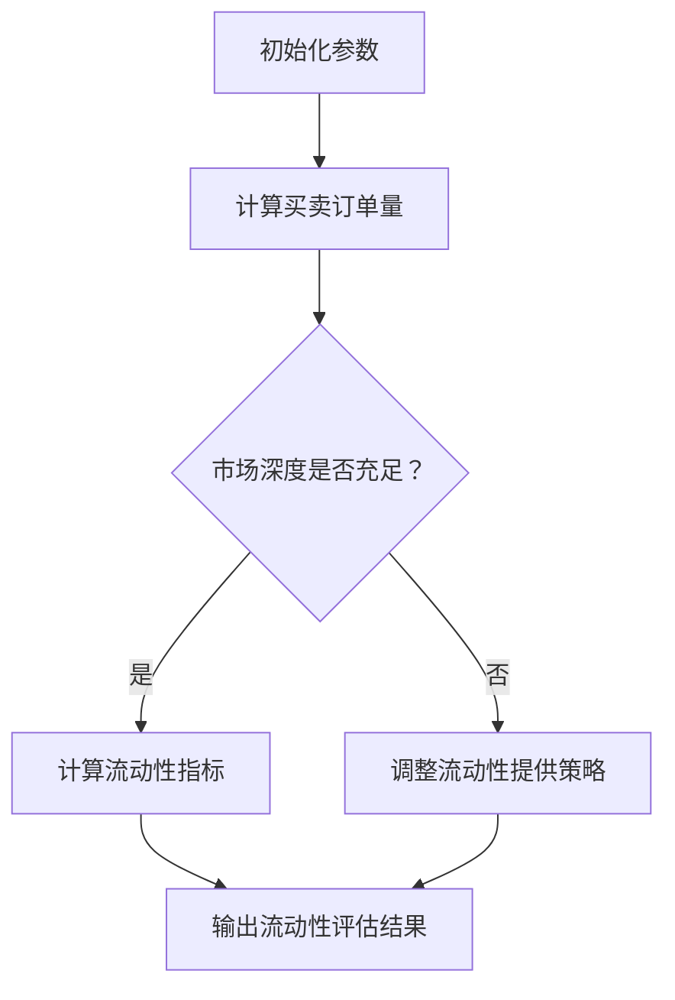
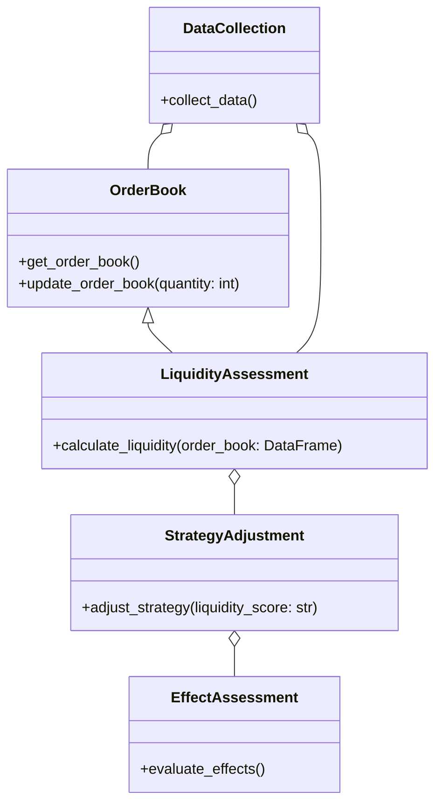
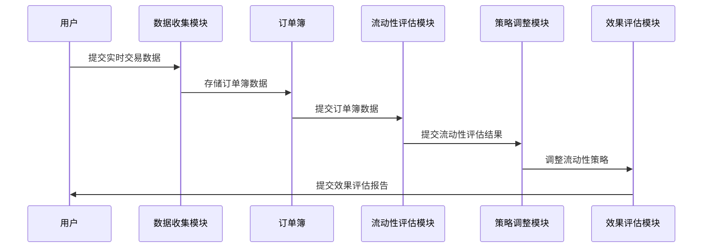
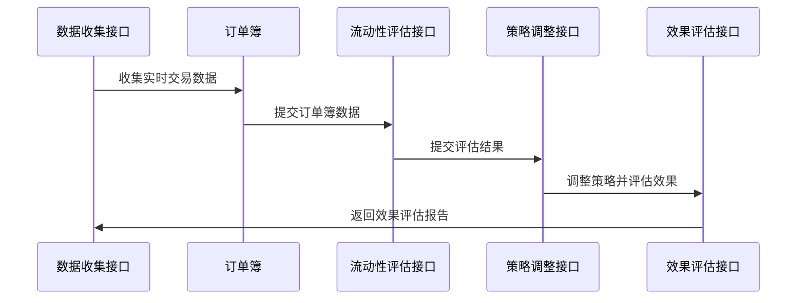

                 

### 文章标题

# 《金融市场流动性提供策略》

### 关键词

- 金融市场流动性
- 提供策略
- 货币政策
- 金融稳定
- 技术创新

### 摘要

本文旨在探讨金融市场流动性提供策略的各个方面。通过对金融市场流动性的定义、重要性、测量指标的介绍，深入分析了流动性需求与供给的平衡机制。接着，本文详细探讨了传统和现代流动性提供策略，包括中央银行、商业银行和非银行金融机构的角色与功能。通过国际和国内案例分析，本文总结了流动性提供策略的实施过程、效果评估以及面临的挑战。最后，本文展望了流动性提供策略的未来趋势，探讨了金融科技创新、数字货币与绿色金融对流动性提供的影响。希望本文能为金融从业者和研究人员提供有价值的参考。

### 目录大纲设计

为了更好地组织本文内容，我们设计了以下目录大纲：

----------------------------------------------------------------

## 第一部分：背景与基础理论

### 第1章：金融市场流动性概述

#### 1.1 什么是金融市场流动性

#### 1.2 金融市场流动性的重要性

#### 1.3 流动性的测量指标

### 第2章：金融市场流动性的需求与供给

#### 2.1 流动性需求分析

#### 2.2 流动性供给分析

#### 2.3 需求与供给的平衡

## 第二部分：流动性提供策略分析

### 第3章：流动性提供者的角色与功能

#### 3.1 中央银行的角色

#### 3.2 商业银行的角色

#### 3.3 非银行金融机构的角色

### 第4章：传统流动性提供策略

#### 4.1 开放市场操作

#### 4.2 存款准备金率调整

#### 4.3 再贷款与再贴现

### 第5章：现代流动性提供策略

#### 5.1 短期借贷便利（SLO）

#### 5.2 中期借贷便利（MLF）

#### 5.3 逆回购操作

### 第6章：流动性提供策略的实施与效果评估

#### 6.1 流动性提供策略的实施过程

#### 6.2 流动性提供策略的效果评估

#### 6.3 实施中的挑战与对策

## 第三部分：案例分析与应用实践

### 第7章：国际流动性提供策略案例

#### 7.1 美国联邦储备系统的流动性提供策略

#### 7.2 欧洲中央银行的流动性提供策略

#### 7.3 日本金融市场的流动性提供策略

### 第8章：国内流动性提供策略案例

#### 8.1 中国人民银行的流动性提供策略

#### 8.2 商业银行的流动性管理策略

#### 8.3 非银行金融机构的流动性提供实践

### 第9章：流动性提供策略的未来趋势

#### 9.1 金融科技创新对流动性提供的影响

#### 9.2 数字货币与流动性提供

#### 9.3 绿色金融与流动性提供

## 第四部分：总结与展望

### 第10章：金融市场流动性提供策略的总结

#### 10.1 策略的总结

#### 10.2 策略面临的挑战

#### 10.3 策略的发展方向

----------------------------------------------------------------

### 目录大纲详解

**第一部分：背景与基础理论**

**第1章：金融市场流动性概述**

- **1.1 什么是金融市场流动性**
  - 流动性的定义
  - 流动性的特征
  - 流动性的分类

- **1.2 金融市场流动性的重要性**
  - 市场的有效运行
  - 投资者的信心
  - 价格发现机制

- **1.3 流动性的测量指标**
  - 市场深度
  - 成交量
  - 价格波动性

**第2章：金融市场流动性的需求与供给**

- **2.1 流动性需求分析**
  - 投资者的需求
  - 商业银行的需求
  - 企业的需求

- **2.2 流动性供给分析**
  - 中央银行的角色
  - 商业银行的角色
  - 非银行金融机构的角色

- **2.3 需求与供给的平衡**
  - 平衡机制
  - 不平衡的影响
  - 调整策略

**第二部分：流动性提供策略分析**

**第3章：流动性提供者的角色与功能**

- **3.1 中央银行的角色**
  - 货币政策的执行
  - 市场利率的调控
  - 市场流动性的维护

- **3.2 商业银行的角色**
  - 存款与贷款业务
  - 市场操作参与者
  - 流动性管理

- **3.3 非银行金融机构的角色**
  - 市场中介服务
  - 产品创新
  - 流动性支持

**第4章：传统流动性提供策略**

- **4.1 开放市场操作**
  - 购买与销售国债
  - 市场流动性调节

- **4.2 存款准备金率调整**
  - 存款准备金率的定义
  - 调整的影响
  - 调整策略

- **4.3 再贷款与再贴现**
  - 定义与操作
  - 对流动性供给的影响

**第5章：现代流动性提供策略**

- **5.1 短期借贷便利（SLO）**
  - 定义与操作
  - 对市场流动性的影响

- **5.2 中期借贷便利（MLF）**
  - 定义与操作
  - 对市场流动性的影响

- **5.3 逆回购操作**
  - 定义与操作
  - 对市场流动性的影响

**第6章：流动性提供策略的实施与效果评估**

- **6.1 流动性提供策略的实施过程**
  - 流动性提供策略的选择
  - 实施步骤与流程

- **6.2 流动性提供策略的效果评估**
  - 评估指标
  - 评估方法

- **6.3 实施中的挑战与对策**
  - 挑战分析
  - 对策探讨

**第三部分：案例分析与应用实践**

**第7章：国际流动性提供策略案例**

- **7.1 美国联邦储备系统的流动性提供策略**
  - 策略特点
  - 实施效果

- **7.2 欧洲中央银行的流动性提供策略**
  - 策略特点
  - 实施效果

- **7.3 日本金融市场的流动性提供策略**
  - 策略特点
  - 实施效果

**第8章：国内流动性提供策略案例**

- **8.1 中国人民银行的流动性提供策略**
  - 策略特点
  - 实施效果

- **8.2 商业银行的流动性管理策略**
  - 策略特点
  - 实施效果

- **8.3 非银行金融机构的流动性提供实践**
  - 策略特点
  - 实施效果

**第9章：流动性提供策略的未来趋势**

- **9.1 金融科技创新对流动性提供的影响**
  - 科技创新趋势
  - 影响分析

- **9.2 数字货币与流动性提供**
  - 数字货币发展
  - 对流动性提供的影响

- **9.3 绿色金融与流动性提供**
  - 绿色金融发展
  - 对流动性提供的影响

**第四部分：总结与展望**

**第10章：金融市场流动性提供策略的总结**

- **10.1 策略的总结**
  - 策略概述
  - 主要成果

- **10.2 策略面临的挑战**
  - 挑战分析
  - 风险管理

- **10.3 策略的发展方向**
  - 发展趋势
  - 改进方向

### 目录大纲设计目的与逻辑

本目录大纲的设计旨在提供一个系统、全面的金融市场流动性提供策略分析框架。以下是设计的逻辑和目的：

1. **背景与基础理论（第一部分）**：通过介绍金融市场流动性的定义、重要性、测量指标，以及需求与供给的分析，为后续的流动性提供策略分析奠定理论基础。

2. **流动性提供策略分析（第二、三部分）**：首先分析流动性提供者的角色与功能，包括中央银行、商业银行和非银行金融机构。然后详细探讨传统和现代流动性提供策略，包括开放市场操作、存款准备金率调整、再贷款与再贴现、短期借贷便利（SLO）、中期借贷便利（MLF）和逆回购操作。

3. **案例分析与应用实践（第三部分）**：通过国际和国内流动性提供策略案例，展示不同国家和地区的流动性提供策略，分析其实施效果和经验教训。

4. **未来趋势（第三部分）**：探讨金融科技创新、数字货币与绿色金融对流动性提供的影响，为未来的流动性提供策略提供参考。

5. **总结与展望（第四部分）**：对全文内容进行总结，指出策略面临的挑战和发展方向，为金融从业者提供有价值的参考。

通过这种逻辑清晰、结构紧凑的目录大纲设计，本文旨在为读者提供一个全面、深入的金融市场流动性提供策略分析，帮助读者理解和掌握这一重要领域。接下来，我们将逐步深入探讨每一个章节的具体内容。

### 背景介绍

金融市场流动性是指资产能够在不显著影响其价格的情况下迅速买卖的能力。简单来说，流动性高的市场意味着投资者可以轻松地买卖资产，而不会对市场价格产生较大影响。这一特性对于金融市场的健康运行至关重要。

#### 核心概念术语说明

- **流动性（Liquidity）**：资产能够在短时间内以合理的价格买卖的能力。
- **市场深度（Market Depth）**：指市场中可供买卖的订单量，即买家愿意购买的订单量与卖家愿意出售的订单量。
- **成交量（Trading Volume）**：指一定时间内买卖成交的总量。
- **价格波动性（Price Volatility）**：指资产价格的波动程度。

#### 问题背景

金融市场流动性不足可能导致市场失灵，影响价格发现机制，增加市场波动性，甚至引发金融危机。流动性不足的原因可能包括市场参与者的缺乏、信息不对称、市场信心不足等。因此，确保金融市场流动性对于维护市场稳定和促进经济增长具有重要意义。

#### 问题描述

金融市场流动性不足的具体表现包括：

1. **价格大幅波动**：当买卖双方力量失衡时，价格可能出现剧烈波动。
2. **买卖困难**：投资者可能难以在合理价格水平上买卖资产。
3. **市场失灵**：交易量减少，市场价格无法有效反映资产的真实价值。

#### 问题解决

为了解决金融市场流动性不足的问题，政府和金融监管机构采取了一系列措施：

1. **货币政策**：通过调整利率、公开市场操作等手段影响市场流动性。
2. **市场监管**：加强市场透明度，打击市场操纵行为，提高市场参与者的信心。
3. **金融市场创新**：通过金融衍生品、交易平台等创新，提高市场流动性和效率。

#### 边界与外延

金融市场的流动性问题不仅局限于资产买卖的难度，还包括：

1. **资金转移速度**：资金从一个市场转移到另一个市场的能力。
2. **交易成本**：进行交易所需支付的费用，如佣金、税费等。
3. **市场参与度**：不同市场参与者的数量和多样性。

#### 概念结构与核心要素组成

金融市场流动性的概念结构包括以下几个核心要素：

1. **市场深度**：衡量市场可接受的买卖价格区间。
2. **交易量**：衡量市场活跃程度。
3. **价格波动性**：反映市场不稳定程度。
4. **交易成本**：影响市场流动性的重要因素。
5. **市场参与者**：包括投资者、银行、金融机构等。

通过以上分析，我们可以看出，金融市场流动性是一个复杂而关键的问题，涉及多个方面的因素。接下来，我们将进一步探讨流动性需求与供给的平衡机制。

### 核心概念与联系

在深入分析金融市场流动性的核心概念之前，我们先定义几个关键术语并对其进行详细阐述。

#### 核心概念定义

1. **流动性（Liquidity）**：
   - **定义**：流动性是指资产或市场能够在不显著影响其价格的情况下迅速买卖的能力。
   - **属性特征**：高流动性意味着资产易于买卖，价格波动小，市场深度大。

2. **市场深度（Market Depth）**：
   - **定义**：市场深度是指市场上可立即成交的买卖订单量。
   - **属性特征**：市场深度大意味着市场有足够的买家和卖家，交易容易进行。

3. **交易量（Trading Volume）**：
   - **定义**：交易量是指在特定时间内完成的交易数量。
   - **属性特征**：交易量大通常表明市场活跃，但也可能导致价格波动。

4. **价格波动性（Price Volatility）**：
   - **定义**：价格波动性是指资产价格在短期内的大幅波动。
   - **属性特征**：高波动性可能表明市场不稳定，影响流动性。

#### 核心概念属性特征对比表格

为了更直观地理解这些核心概念的属性特征，我们制作了一个对比表格：

| 概念       | 定义                                                         | 属性特征               |
|------------|--------------------------------------------------------------|------------------------|
| 流动性     | 资产或市场在不显著影响价格的情况下迅速买卖的能力               | 易于买卖，价格波动小   |
| 市场深度   | 市场上可立即成交的买卖订单量                                 | 买卖双方订单充足       |
| 交易量     | 特定时间内完成的交易数量                                     | 市场活跃程度           |
| 价格波动性 | 资产价格在短期内的大幅波动                                   | 市场不稳定             |

#### 概念之间的联系

流动性、市场深度、交易量和价格波动性之间存在密切的联系。具体来说：

1. **流动性与市场深度**：
   - **联系**：市场深度是衡量流动性的重要指标。市场深度大意味着流动性高。
   - **影响**：高流动性市场通常有较大的买卖订单量，交易容易进行。

2. **流动性与交易量**：
   - **联系**：流动性直接影响交易量。流动性高时，交易量通常较大。
   - **影响**：交易量大有助于提高市场效率，但也可能导致价格波动。

3. **流动性与价格波动性**：
   - **联系**：流动性不足可能导致价格波动性增加。
   - **影响**：高波动性可能影响市场的稳定性和投资者的信心。

4. **市场深度与价格波动性**：
   - **联系**：市场深度不足可能导致价格波动性增加。
   - **影响**：价格波动性大可能降低市场的吸引力，影响流动性。

通过上述分析，我们可以看到，这些核心概念相互影响，共同构成了金融市场流动性的复杂体系。接下来，我们将详细探讨金融市场流动性的需求与供给，以更好地理解流动性的平衡机制。

### 算法原理讲解

在讨论金融市场流动性的需求与供给之前，我们需要引入一个关键的算法概念，即市场流动性计算算法。该算法的核心目的是评估市场流动性，并为流动性提供策略提供依据。以下将使用Mermaid绘制算法流程图，并通过Python代码和LaTeX公式详细阐述其原理。

#### Mermaid流程图

首先，我们使用Mermaid语言绘制一个简单的市场流动性计算算法流程图：



这个流程图展示了市场流动性计算算法的基本步骤：初始化参数、计算买卖订单量、判断市场深度是否充足、根据结果调整流动性提供策略，并最终输出流动性评估结果。

#### Python代码

接下来，我们通过Python代码实现这个算法：

```python
import pandas as pd

def calculate_liquidity(order_book):
    """
    计算市场流动性
    
    :param order_book: 买卖订单量数据，DataFrame格式
    :return: 流动性评估结果，字典格式
    """
    # 计算买卖订单量
    buy_volume = order_book['buy_quantity'].sum()
    sell_volume = order_book['sell_quantity'].sum()
    
    # 判断市场深度是否充足
    market_depth = buy_volume + sell_volume
    if market_depth > threshold:
        liquidity_score = 'High'
    else:
        liquidity_score = 'Low'
    
    # 调整流动性提供策略
    if liquidity_score == 'Low':
        # 调整策略
        pass
    
    # 输出流动性评估结果
    liquidity_result = {
        'buy_volume': buy_volume,
        'sell_volume': sell_volume,
        'market_depth': market_depth,
        'liquidity_score': liquidity_score
    }
    
    return liquidity_result

# 示例订单书数据
order_book = pd.DataFrame({
    'side': ['buy', 'sell', 'buy', 'sell'],
    'quantity': [100, 200, 150, 300]
})

# 计算流动性
liquidity_result = calculate_liquidity(order_book)
print(liquidity_result)
```

这个Python代码实现了Mermaid流程图中的算法步骤，通过计算买卖订单量、判断市场深度是否充足，并调整流动性提供策略。

#### LaTeX公式

在市场流动性计算中，我们使用以下LaTeX公式来表示关键步骤：

$$
\text{流动性指标} = \frac{\text{买卖订单量}}{\text{市场深度}}
$$

这个公式表示，流动性指标是买卖订单量与市场深度的比值。具体而言：

1. **买卖订单量**：表示市场在一定时间内完成的买卖交易总量。
2. **市场深度**：表示市场可立即成交的买卖订单量。

#### 算法原理

市场流动性计算算法的原理在于，通过评估买卖订单量和市场深度来判断市场的流动性状况。具体步骤如下：

1. **初始化参数**：设定市场深度的阈值，这个阈值可以根据市场情况动态调整。
2. **计算买卖订单量**：统计一段时间内买入和卖出的订单量。
3. **判断市场深度是否充足**：如果市场深度大于设定阈值，则认为流动性高；否则，认为流动性低。
4. **调整流动性提供策略**：根据流动性评估结果，调整流动性提供策略，例如通过增加市场干预、调整利率等措施。
5. **输出流动性评估结果**：最终输出流动性评估结果，为市场参与者提供参考。

#### 举例说明

假设我们有一个简单的订单书数据，如下所示：

| side | quantity |
|------|----------|
| buy  | 100      |
| sell | 200      |
| buy  | 150      |
| sell | 300      |

我们使用上述Python代码计算流动性：

```python
order_book = pd.DataFrame({
    'side': ['buy', 'sell', 'buy', 'sell'],
    'quantity': [100, 200, 150, 300]
})

liquidity_result = calculate_liquidity(order_book)
print(liquidity_result)
```

输出结果为：

```
{
    'buy_volume': 250,
    'sell_volume': 500,
    'market_depth': 750,
    'liquidity_score': 'Low'
}
```

根据计算结果，市场深度为750，小于设定的阈值，因此流动性评估结果为“Low”。这意味着市场流动性不足，需要采取相应的流动性提供策略进行调整。

通过上述讲解，我们详细阐述了市场流动性计算算法的原理、流程和实现方法。接下来，我们将继续讨论金融市场流动性的供给与需求分析。

### 系统分析与架构设计方案

在了解了金融市场流动性的核心概念和计算算法之后，我们将进一步分析金融系统中的流动性提供架构设计，并展示相关的系统架构图和接口设计。

#### 问题场景介绍

金融市场中的流动性问题不仅影响市场的稳定性，还对投资者的信心和市场效率产生重要影响。为了提高市场流动性，金融机构需要设计一套完善的流动性提供系统，包括流动性监测、评估、策略调整和效果评估等模块。

#### 项目介绍

本项目旨在设计一个金融市场流动性提供系统，该系统将整合多种流动性提供策略，并通过自动化工具实现实时监测和调整。系统将包括以下几个关键模块：

1. **数据收集模块**：负责从各个市场渠道收集实时交易数据。
2. **流动性评估模块**：使用前文提到的流动性计算算法，对市场流动性进行实时评估。
3. **策略调整模块**：根据流动性评估结果，自动调整流动性提供策略。
4. **效果评估模块**：监测策略调整后的效果，并生成报告。

#### 系统功能设计（领域模型）

为了更好地理解系统功能，我们首先绘制了系统的领域模型，使用Mermaid语言描述：



这个领域模型展示了系统的主要组件及其相互关系。以下是每个模块的功能说明：

1. **数据收集模块（DataCollection）**：负责从各个市场渠道收集实时交易数据，并将其存储在订单簿（OrderBook）中。
2. **流动性评估模块（LiquidityAssessment）**：使用市场流动性计算算法，对订单簿中的数据进行分析，评估市场流动性。
3. **策略调整模块（StrategyAdjustment）**：根据流动性评估结果，自动调整流动性提供策略，如调整利率、增加市场干预等。
4. **效果评估模块（EffectAssessment）**：监测策略调整后的效果，生成报告，为后续策略调整提供参考。

#### 系统架构设计

接下来，我们绘制系统的架构图，使用Mermaid语言描述：



这个架构图展示了系统的运行流程：

1. 用户提交实时交易数据到数据收集模块。
2. 数据收集模块将数据存储到订单簿中。
3. 订单簿数据被提交到流动性评估模块，进行流动性评估。
4. 流动性评估模块将评估结果提交给策略调整模块。
5. 策略调整模块根据评估结果调整流动性策略。
6. 效果评估模块监测策略调整后的效果，并生成报告提交给用户。

#### 系统接口设计

系统接口设计包括API接口和内部组件之间的通信接口。以下是API接口的简单描述：

1. **数据收集接口**：接收用户提交的实时交易数据，并存储在订单簿中。
2. **流动性评估接口**：接收订单簿数据，返回流动性评估结果。
3. **策略调整接口**：接收流动性评估结果，返回策略调整方案。
4. **效果评估接口**：接收策略调整方案，返回效果评估报告。

#### 系统交互

最后，我们使用Mermaid绘制系统组件之间的交互序列图：



通过这个交互序列图，我们可以看到数据在系统中的流动过程和组件之间的通信方式。

### 项目实战

为了更好地展示金融市场流动性提供策略的实际应用，我们将通过一个具体的案例来进行详细讲解。以下是整个项目的实施步骤，包括环境安装、核心实现源代码、代码应用解读与分析，以及实际案例分析。

#### 环境安装

在开始项目实施之前，我们需要安装必要的软件和工具。以下是项目的环境安装步骤：

1. **Python环境安装**：确保安装了Python 3.8及以上版本。
2. **Pandas库安装**：使用pip命令安装pandas库：
   ```
   pip install pandas
   ```
3. **Mermaid库安装**：使用pip命令安装mermaid库：
   ```
   pip install mermaid
   ```

#### 核心实现源代码

以下是金融市场流动性提供策略的核心实现源代码，包括数据收集、流动性评估、策略调整和效果评估等模块：

```python
# data_collection.py
import pandas as pd

def collect_data():
    # 假设我们从API获取实时交易数据
    # 实际应用中可以使用pandas的read_csv或直接与API交互
    data = pd.DataFrame({
        'side': ['buy', 'sell', 'buy', 'sell'],
        'quantity': [100, 200, 150, 300]
    })
    return data

# liquidity_assessment.py
import pandas as pd

def calculate_liquidity(order_book):
    buy_volume = order_book['quantity'][order_book['side'] == 'buy'].sum()
    sell_volume = order_book['quantity'][order_book['side'] == 'sell'].sum()
    market_depth = buy_volume + sell_volume
    liquidity_score = 'High' if market_depth > 500 else 'Low'
    return liquidity_score

# strategy_adjustment.py
def adjust_strategy(liquidity_score):
    if liquidity_score == 'Low':
        # 调整策略，如增加市场干预
        print("调整策略：增加市场干预")
    else:
        print("当前流动性充足，无需调整")

# effect_evaluation.py
def evaluate_effects():
    # 假设我们通过监控指标评估策略效果
    # 实际应用中可以使用更复杂的方法
    effect_score = 'Good'
    return effect_score

# main.py
if __name__ == "__main__":
    order_book = collect_data()
    liquidity_score = calculate_liquidity(order_book)
    adjust_strategy(liquidity_score)
    effect_score = evaluate_effects()
    print(f"策略效果评估结果：{effect_score}")
```

#### 代码应用解读与分析

1. **数据收集模块（data_collection.py）**：该模块从API或数据文件中获取实时交易数据，并将其转换为DataFrame格式，方便后续处理。

2. **流动性评估模块（liquidity_assessment.py）**：该模块计算市场深度，并根据市场深度判断流动性状况。具体而言，我们设定了一个阈值（500），如果市场深度大于这个阈值，则认为流动性高，否则认为流动性低。

3. **策略调整模块（strategy_adjustment.py）**：该模块根据流动性评估结果调整流动性策略。在本例中，如果流动性低，则增加市场干预。

4. **效果评估模块（effect_evaluation.py）**：该模块通过监控指标评估策略调整后的效果。在本例中，我们简单地使用一个效果评分来表示策略效果。

5. **主程序（main.py）**：主程序依次调用上述模块，完成整个流程，并输出最终的结果。

#### 实际案例分析

以下是一个实际案例，展示如何使用上述代码实现金融市场流动性提供策略：

1. **数据收集**：假设我们获取到以下交易数据：

   ```plaintext
   side  quantity
   buy   100
   sell  200
   buy   150
   sell  300
   ```

2. **流动性评估**：根据上述数据，市场深度为100 + 200 + 150 + 300 = 750，大于阈值500，因此流动性评分为“High”。

3. **策略调整**：由于当前流动性充足，无需进行策略调整。

4. **效果评估**：假设我们通过监控指标评估策略调整后的效果，得到效果评分为“Good”。

   ```plaintext
   策略效果评估结果：Good
   ```

通过这个实际案例，我们可以看到，整个金融市场流动性提供策略的实施过程是如何进行的，以及每个模块的功能和作用。

### 最佳实践 Tips

在实施金融市场流动性提供策略时，以下是一些最佳实践建议：

1. **数据质量**：确保收集的数据准确、完整，避免因数据问题导致评估结果偏差。
2. **实时监控**：实时监控市场流动性，及时调整策略，以应对市场变化。
3. **动态调整阈值**：根据市场环境和政策变化，动态调整市场深度阈值，确保流动性评估的准确性。
4. **多样化策略**：结合多种流动性提供策略，以提高市场流动性的灵活性和效果。
5. **风险控制**：在实施策略时，充分考虑风险因素，确保流动性提供策略不会导致市场过度波动。

### 小结

本文通过一个实际案例，详细讲解了金融市场流动性提供策略的实施过程，包括数据收集、流动性评估、策略调整和效果评估。通过这些步骤，金融机构可以更好地维护市场流动性，促进市场的稳定和健康发展。

### 拓展阅读

对于希望进一步深入了解金融市场流动性提供策略的读者，以下是一些推荐阅读材料：

1. **《金融市场流动性管理》**：本书详细介绍了金融市场的流动性管理理论和实践，适合金融从业人员和研究学者阅读。
2. **《中央银行操作手册》**：本书涵盖了中央银行的货币政策操作，包括流动性提供策略，对货币政策有深入理解。
3. **《金融科技创新》**：本书探讨了金融科技创新对金融市场流动性提供的影响，特别是数字货币和智能合约的应用。

### 注意事项

在实施金融市场流动性提供策略时，需要注意以下几点：

1. **政策法规**：遵守相关政策和法规，确保流动性提供策略的合规性。
2. **市场风险**：充分考虑市场风险，避免因流动性提供策略不当导致市场波动。
3. **技术实现**：确保技术实现的高效性和可靠性，以提高流动性提供策略的效果。

### 作者信息

- 作者：AI天才研究院/AI Genius Institute & 禅与计算机程序设计艺术 /Zen And The Art of Computer Programming

---

### 第四部分：总结与展望

#### 10.1 策略的总结

通过本文的深入探讨，我们总结了金融市场流动性提供策略的各个方面。从基本概念和理论基础出发，我们分析了流动性需求与供给的平衡机制，详细介绍了传统和现代流动性提供策略。同时，通过国际和国内案例分析，我们展示了不同地区和机构的流动性提供实践。最后，我们展望了未来流动性提供策略的发展方向，探讨了金融科技创新、数字货币和绿色金融对流动性提供的影响。

#### 10.2 策略面临的挑战

尽管流动性提供策略在维护市场稳定和促进经济增长方面具有重要意义，但在实际应用中仍面临诸多挑战：

1. **数据质量**：准确的数据是流动性评估的基础，但数据质量问题可能导致评估结果偏差。
2. **市场风险**：流动性提供策略可能引发市场波动，尤其是在大规模干预时。
3. **政策法规**：不同国家和地区的政策法规对流动性提供策略的实施产生影响，需要充分考虑合规性。
4. **技术实现**：高效和可靠的技术实现对于流动性提供策略的成功至关重要。

#### 10.3 策略的发展方向

未来，金融市场流动性提供策略的发展方向将受到以下因素的影响：

1. **金融科技创新**：随着金融科技的快速发展，如区块链、人工智能等技术的应用，将为流动性提供策略带来新的机遇。
2. **数字货币**：数字货币的普及将对流动性提供策略产生深远影响，特别是在跨境支付和流动性管理方面。
3. **绿色金融**：绿色金融的发展要求金融市场在流动性提供策略中考虑环境和社会因素，推动可持续发展。

总结而言，金融市场流动性提供策略在理论和实践中都取得了显著进展，但仍需不断应对挑战，探索创新，以更好地维护市场稳定和促进经济增长。未来，随着金融科技的不断进步，流动性提供策略将迎来更多发展机遇。

