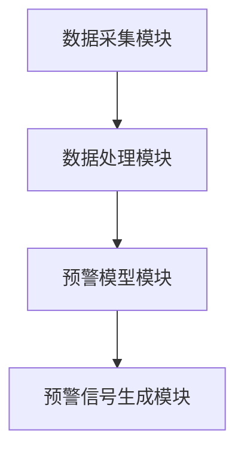
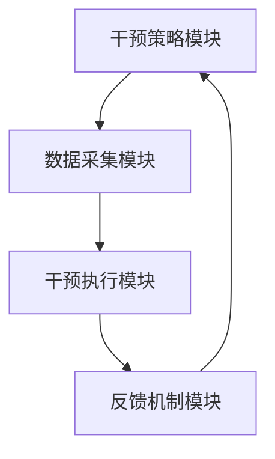
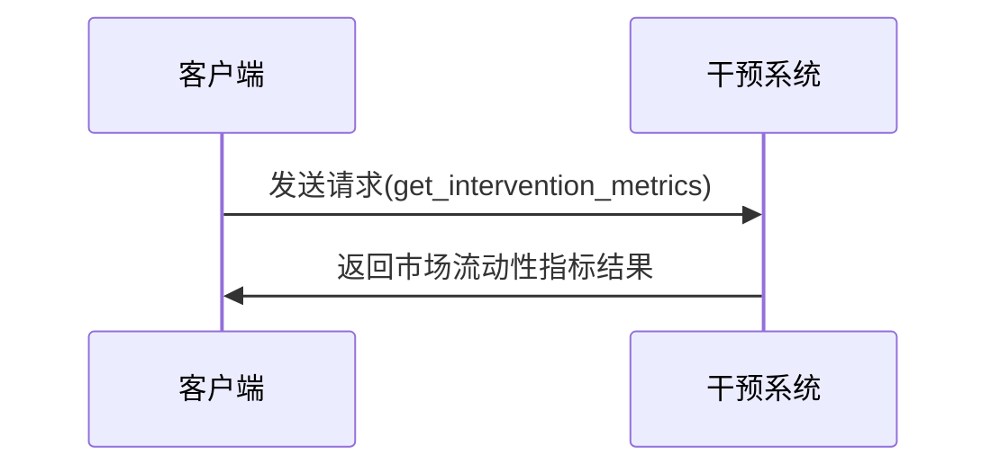

                 

### 文章标题

# 金融市场流动性枯竭预警与干预系统

> 关键词：金融市场，流动性枯竭，预警系统，干预策略，流动性风险

> 摘要：本文深入探讨了金融市场流动性枯竭的预警与干预系统。通过分析问题背景和核心概念，设计预警系统和干预系统，以及实现和案例分析，本文旨在为金融市场流动性管理提供系统性解决方案，提升市场稳定性。

----------------------------------------------------------------

## 第一部分：金融市场流动性枯竭预警与干预系统概述

### 第1章：问题背景与核心概念

#### 1.1 问题背景

金融市场流动性枯竭是指市场参与者在交易过程中遇到难以快速转换资产为现金或资金流出困难的状况。这种状况可能导致市场崩溃、资产价格大幅波动，对经济产生深远影响。例如，2008年全球金融危机期间，许多金融机构面临严重的流动性危机，导致市场信心崩溃。

#### 1.2 核心概念

- **流动性风险**：指金融市场上的交易者无法以合理的价格买卖资产的风险。
- **流动性缓冲**：指金融机构和监管机构为了应对流动性危机而设置的储备资金或资产。
- **预警与干预机制**：指通过监测流动性指标、设定预警阈值以及采取干预措施来预防流动性危机。

#### 1.3 概念联系

流动性缓冲与预警干预机制密切相关。流动性缓冲提供了在危机时应对流动性不足的手段，而预警系统则帮助提前发现潜在问题，干预机制则确保能够及时采取行动。

#### 1.4 边界与外延

- **触发因素**：流动性危机可能由市场信心丧失、金融政策变动、系统性风险等触发。
- **政策手段**：干预措施包括公开市场操作、提供紧急流动性支持、调整监管要求等。

#### 1.5 概念结构与核心要素组成

- **流动性监测指标体系**：包括资金流动速度、交易量、市场深度等。
- **预警模型**：基于历史数据和统计方法建立，用于预测流动性枯竭的可能性。
- **干预策略**：包括货币政策工具和宏观审慎政策。

### 第2章：金融市场流动性枯竭预警系统设计

#### 2.1 预警指标体系

预警指标体系是预警系统的核心。流动性压力测试和流动性指标选择是构建预警体系的关键步骤。

#### 2.2 预警模型

预警模型通过时间序列分析和监督学习模型来预测流动性危机。设定预警阈值是模型实施的重要一环。

#### 2.3 预警算法实现

使用Python实现预警算法，通过Mermaid流程图展示算法步骤，并评估模型性能。

### 第3章：金融市场流动性干预系统设计

#### 3.1 干预策略

干预策略包括货币政策工具和宏观审慎政策。货币政策工具如调整利率、公开市场操作等，宏观审慎政策如资本充足率要求、流动性覆盖率等。

#### 3.2 干预系统架构

干预系统架构设计包括系统功能模块和架构图。通过Mermaid架构图展示系统设计。

#### 3.3 干预策略执行

干预策略的执行包括策略算法实现和流程图。确保策略能够准确执行并产生预期效果。

#### 3.4 系统接口与交互

系统接口设计确保预警系统和干预系统能够无缝交互。使用Mermaid序列图展示系统交互流程。

### 第4章：系统实现与案例分析

#### 4.1 系统实现

系统实现涉及技术选型和系统部署。介绍实现过程中的关键技术和挑战。

#### 4.2 案例分析

通过案例分析，展示预警系统和干预系统在实际应用中的效果。

#### 4.3 结果分析与评价

分析预警准确性和干预效果，评价系统性能和改进方向。

### 第5章：最佳实践与策略优化

#### 5.1 最佳实践

分享最佳实践操作经验，为其他金融市场提供参考。

#### 5.2 策略优化

探讨模型改进方法和策略迭代过程，优化预警和干预系统。

#### 5.3 小结

总结系统应用价值和未来发展方向，展望金融市场的流动性管理。

---

以上为《金融市场流动性枯竭预警与干预系统》的初步目录大纲。在撰写文章时，每个章节将详细探讨其核心概念、原理、设计、实现和最佳实践等内容。文章结构将保持逻辑清晰、内容紧凑，以便读者能够全面理解金融市场流动性管理的复杂性及其解决方案。

### 第1章：问题背景与核心概念

#### 1.1 问题背景

金融市场流动性枯竭是指市场参与者难以快速将资产转换为现金或资金流出困难的状况。流动性危机可能引发市场崩溃、资产价格大幅波动，对经济产生深远影响。2008年全球金融危机期间，许多金融机构面临严重的流动性危机，导致市场信心崩溃，投资者纷纷撤资，银行体系出现大规模流动性短缺，最终引发系统性风险。

流动性枯竭的主要影响包括：

1. **市场效率降低**：流动性枯竭导致市场难以有效定价，交易成本上升，市场参与者交易意愿降低。
2. **资产价格波动**：流动性不足时，资产买卖双方难以达成交易，导致价格波动加剧，资产价格失真。
3. **信用风险增加**：流动性危机可能导致金融机构无法按时履行债务，增加信用风险。
4. **经济活动放缓**：流动性不足导致企业和个人融资困难，从而影响经济活动的正常进行。

#### 1.2 核心概念

为了理解流动性枯竭及其影响，我们需要掌握以下几个核心概念：

- **流动性风险**：指金融市场上的交易者无法以合理的价格买卖资产的风险。流动性风险可以分为时间风险和价格风险，时间风险是指交易者无法在预定时间内完成交易，而价格风险是指交易者必须以非理想价格完成交易。
- **流动性缓冲**：指金融机构和监管机构为了应对流动性危机而设置的储备资金或资产。流动性缓冲可以增强金融机构和市场的稳定性，减少流动性危机的发生。
- **预警与干预机制**：指通过监测流动性指标、设定预警阈值以及采取干预措施来预防流动性危机。预警机制旨在提前发现潜在问题，而干预措施则确保能够在危机发生时及时采取行动。

#### 1.3 概念联系

流动性缓冲与预警干预机制密切相关。流动性缓冲提供了在危机时应对流动性不足的手段，而预警系统则帮助提前发现潜在问题，干预机制则确保能够及时采取行动。

1. **流动性缓冲**：流动性缓冲是金融机构应对流动性危机的“安全垫”。在正常情况下，金融机构通过持有高质量的流动性资产，如现金、国债等，来应对短期内可能出现的流动性需求。当市场出现流动性危机时，这些缓冲资产可以帮助金融机构度过难关。
   
2. **预警与干预机制**：预警系统通过监测市场流动性指标，如资金流动速度、交易量、市场深度等，来判断流动性是否出现异常。一旦预警系统发现潜在问题，干预机制就会启动，采取相应措施，如调整利率、提供紧急流动性支持等，以稳定市场。

#### 1.4 边界与外延

了解流动性枯竭的边界和外延有助于我们更全面地理解这一现象。

- **触发因素**：流动性危机可能由多种因素触发。例如，市场信心丧失、金融政策变动、系统性风险等都可能导致流动性枯竭。市场信心丧失可能导致投资者纷纷撤资，从而引发流动性危机。金融政策变动，如利率调整，也可能对市场流动性产生重大影响。系统性风险，如2008年金融危机，则可能同时影响多个市场和金融机构，导致广泛性的流动性危机。

- **政策手段**：干预流动性危机的政策手段多种多样。货币政策工具，如调整利率、提供紧急流动性支持等，可以迅速稳定市场。宏观审慎政策，如资本充足率要求、流动性覆盖率等，旨在长期维护金融系统的稳定性。此外，监管机构还可以通过调整监管要求、提供市场指导等手段来应对流动性危机。

#### 1.5 概念结构与核心要素组成

流动性枯竭预警与干预系统由多个核心要素组成，每个要素在系统中扮演着关键角色。

1. **流动性监测指标体系**：流动性监测指标体系是预警系统的核心。这些指标包括资金流动速度、交易量、市场深度等。资金流动速度衡量资金在市场中的流动性，交易量反映了市场的活跃程度，而市场深度则显示了市场参与者在不同价格水平上的买卖意愿。通过监测这些指标，预警系统可以及时发现市场流动性出现的问题。

2. **预警模型**：预警模型基于历史数据和统计方法建立，用于预测流动性危机的可能性。这些模型可以采用时间序列分析、监督学习等方法。时间序列分析可以揭示市场流动性变化的趋势，而监督学习模型则通过学习历史数据来预测未来流动性状况。设定合理的预警阈值是模型实施的关键，预警阈值过高可能导致误报，过低则可能遗漏危机信号。

3. **干预策略**：干预策略包括货币政策工具和宏观审慎政策。货币政策工具如调整利率、提供紧急流动性支持等，可以在短期内迅速稳定市场。宏观审慎政策则通过调整资本充足率要求、流动性覆盖率等长期措施来维护金融系统的稳定性。

#### 1.6 总结

本章对金融市场流动性枯竭预警与干预系统进行了概述。流动性枯竭是一个复杂的现象，涉及多个核心概念，如流动性风险、流动性缓冲和预警干预机制。了解这些概念及其相互关系，对于构建有效的预警和干预系统至关重要。在接下来的章节中，我们将进一步探讨预警系统和干预系统的设计、实现和案例分析，为金融市场流动性管理提供系统性解决方案。

### 第2章：金融市场流动性枯竭预警系统设计

#### 2.1 预警指标体系

预警指标体系是金融市场流动性枯竭预警系统的核心。它由一系列能够反映市场流动性的关键指标组成，用于监测市场流动性状况，预测流动性危机的可能性。

**流动性压力测试**是构建预警指标体系的关键步骤。流动性压力测试旨在评估金融机构在不同压力情景下维持流动性能力。通过模拟极端市场条件，如市场恐慌、资金流出等，流动性压力测试可以揭示金融机构在流动性紧张时的脆弱性。测试结果将作为预警系统的重要输入，帮助判断市场流动性是否处于危机边缘。

**流动性指标选择**则是构建预警体系的核心。以下是一些常用的流动性指标：

1. **资金流动速度**：资金流动速度衡量资金在市场中的流动速度，通常用现金周转周期（Cash Conversion Cycle，CCC）来表示。CCC = 存货周转天数 + 应收账款周转天数 - 应付账款周转天数。较低的CCC值表示资金流动较快，市场流动性较高。

2. **交易量**：交易量反映市场活跃程度，通常用交易额或交易次数来衡量。高交易量通常意味着市场流动性较好，而低交易量可能表明市场流动性不足。

3. **市场深度**：市场深度衡量市场参与者在不同价格水平上的买卖意愿，用买卖价差（Bid-Ask Spread）来表示。较小的买卖价差表示市场流动性较好，因为投资者可以以接近市场价格进行交易。相反，较大的买卖价差可能表明市场流动性不足，投资者难以找到交易对手。

4. **贷款偿还率**：贷款偿还率衡量贷款的偿还情况，用于反映金融机构的流动性状况。较高的贷款偿还率通常表示金融机构的流动性较好，而较低的贷款偿还率可能表明流动性问题。

5. **流动性覆盖率**：流动性覆盖率（Liquidity Coverage Ratio，LCR）衡量金融机构在短期流动性压力下的应对能力。LCR = 高质量流动性资产 / 风险加权流动性负债。较高的LCR值表示金融机构具有较强的流动性缓冲能力。

通过选择和整合这些流动性指标，预警系统可以全面监测市场流动性状况，及时发现潜在问题。

#### 2.2 预警模型

预警模型是预警系统的核心，用于预测流动性危机的可能性。预警模型的建立通常基于历史数据和统计方法，包括时间序列分析和监督学习等方法。

**时间序列分析**是一种常见的方法，用于分析时间序列数据，以预测未来趋势。时间序列分析可以揭示市场流动性变化的趋势和周期性特征。例如，通过分析资金流动速度、交易量等指标的时间序列数据，可以识别市场流动性是否出现异常波动。

**监督学习模型**是一种基于历史数据训练的预测模型，通过学习历史数据中的规律和模式，来预测未来流动性状况。常见的监督学习模型包括线性回归、决策树、支持向量机（SVM）和神经网络等。以下是一个简单的线性回归预警模型：

**数学模型：**
$$
y = \beta_0 + \beta_1 \cdot x_1 + \beta_2 \cdot x_2 + ... + \beta_n \cdot x_n + \epsilon
$$

其中，$y$ 表示预测的市场流动性指标（如CCC、交易量等），$x_1, x_2, ..., x_n$ 表示影响市场流动性的其他变量（如利率、贷款偿还率等），$\beta_0, \beta_1, ..., \beta_n$ 是模型参数，$\epsilon$ 是误差项。

**Python代码实现：**
```python
import numpy as np
import pandas as pd
from sklearn.linear_model import LinearRegression

# 加载数据
data = pd.read_csv('data.csv')
X = data[['利率', '贷款偿还率']]
y = data['资金流动速度']

# 建立线性回归模型
model = LinearRegression()
model.fit(X, y)

# 预测
predictions = model.predict(X)

# 打印模型参数和预测结果
print("模型参数：", model.coef_)
print("预测结果：", predictions)
```

通过训练和评估预警模型，我们可以确定其预测性能，并根据预测结果设定预警阈值，以便在市场流动性指标超过阈值时发出预警信号。

#### 2.3 预警阈值设定

预警阈值的设定是预警系统的关键环节，它决定了预警系统在何时发出预警信号。合理的预警阈值能够有效地识别市场流动性风险，避免误报和漏报。

**阈值设定方法**通常包括以下几种：

1. **统计方法**：基于历史数据和统计分析，设定一个阈值，使得预警信号能够在一定概率上准确反映市场流动性状况。例如，可以计算资金流动速度的历史最大波动幅度，并设定该波动幅度的某个百分比作为预警阈值。

2. **专家判断**：结合市场专家的经验和知识，设定预警阈值。这种方法通常用于补充统计方法，确保预警阈值符合市场实际情况。

3. **机器学习方法**：通过机器学习模型，如决策树、支持向量机等，自动设定预警阈值。机器学习模型可以从大量历史数据中学习到预警阈值与市场流动性指标之间的关系，并自动设定一个最优的阈值。

以下是一个基于统计方法的预警阈值设定示例：

**Python代码实现：**
```python
import numpy as np
import pandas as pd

# 加载数据
data = pd.read_csv('data.csv')
thresholds = data['资金流动速度'].quantile([0.05, 0.95])

# 打印预警阈值
print("预警阈值：", thresholds)
```

通过设定合理的预警阈值，预警系统可以在市场流动性指标超过阈值时发出预警信号，提醒金融机构和监管机构采取干预措施，以防止流动性危机的发生。

#### 2.4 预警算法实现

预警算法的实现是将预警模型和预警阈值应用于实际数据，以识别市场流动性风险的过程。实现预警算法需要考虑数据的处理、模型的训练和预测，以及预警信号的生成和传递。

**数据预处理**是预警算法实现的第一步。数据预处理包括数据清洗、缺失值处理、异常值检测等。通过数据预处理，可以确保数据的完整性和准确性，为后续的模型训练和预测提供可靠的基础。

**模型训练**是基于历史数据训练预警模型的过程。通过模型训练，可以学习到市场流动性指标与其他变量之间的关系，从而建立预测模型。常见的模型训练方法包括线性回归、决策树、支持向量机等。

**预测和预警信号生成**是将训练好的模型应用于当前数据，生成流动性预测值，并根据预警阈值判断是否发出预警信号。如果预测值超过预警阈值，则生成预警信号，提醒相关机构采取干预措施。

**Python代码实现**：
```python
import numpy as np
import pandas as pd
from sklearn.linear_model import LinearRegression

# 加载数据
data = pd.read_csv('data.csv')

# 数据预处理
X = data[['利率', '贷款偿还率']]
y = data['资金流动速度']

# 建立线性回归模型
model = LinearRegression()
model.fit(X, y)

# 预测
predictions = model.predict(X)

# 设定预警阈值
threshold = 1.2  # 预警阈值为资金流动速度的120%

# 生成预警信号
alerts = [1 if pred > threshold else 0 for pred in predictions]

# 打印预测结果和预警信号
print("预测结果：", predictions)
print("预警信号：", alerts)
```

通过实现预警算法，金融机构和监管机构可以实时监测市场流动性状况，及时识别潜在风险，并采取干预措施，以维护金融市场的稳定性。

#### 2.5 预警系统架构设计

预警系统架构设计是确保预警系统能够高效、稳定运行的关键。预警系统架构包括数据采集模块、数据处理模块、预警模型模块和预警信号生成模块，各个模块相互协作，共同完成预警任务。

**数据采集模块**负责从各种数据源（如交易所、银行、金融监管机构等）采集与市场流动性相关的数据。数据采集模块通常采用分布式架构，以提高数据采集的效率和可靠性。

**数据处理模块**负责对采集到的原始数据进行清洗、处理和预处理，以确保数据的准确性和一致性。数据处理模块包括数据清洗、缺失值处理、异常值检测等功能。

**预警模型模块**负责训练和部署预警模型。预警模型模块基于历史数据和统计方法建立，可以采用时间序列分析、监督学习等方法。预警模型模块通常采用容器化技术，以提高模型的灵活性和可维护性。

**预警信号生成模块**负责根据预警模型生成的预测值和预警阈值，生成预警信号。预警信号生成模块采用实时计算技术，可以实时监测市场流动性状况，并在检测到风险时发出预警。

**Mermaid架构图**：


通过设计合理的预警系统架构，金融机构和监管机构可以高效地监测市场流动性风险，及时采取干预措施，以维护金融市场的稳定性。

#### 2.6 模型评估与优化

模型评估与优化是预警系统设计中的关键步骤，它决定了预警系统的准确性和可靠性。评估预警模型的性能，有助于识别模型的优点和不足，进而进行优化，提高预警效果。

**评估指标**是模型评估的重要工具。常用的评估指标包括准确率、召回率、精确率、F1值等。

1. **准确率**：准确率衡量模型预测正确的比例，计算公式为：
   $$
   \text{准确率} = \frac{\text{预测正确数}}{\text{总预测数}}
   $$

2. **召回率**：召回率衡量模型能够正确识别出正例样本的比例，计算公式为：
   $$
   \text{召回率} = \frac{\text{预测正确数}}{\text{实际正例数}}
   $$

3. **精确率**：精确率衡量模型预测为正例的样本中，实际为正例的比例，计算公式为：
   $$
   \text{精确率} = \frac{\text{预测正确数}}{\text{预测为正例的样本数}}
   $$

4. **F1值**：F1值是精确率和召回率的加权平均，用于综合评估模型的性能，计算公式为：
   $$
   \text{F1值} = 2 \cdot \frac{\text{精确率} \cdot \text{召回率}}{\text{精确率} + \text{召回率}}
   $$

**评估过程**通常包括以下步骤：

1. **数据划分**：将数据集划分为训练集和测试集，用于模型训练和评估。通常采用80/20或70/30的比例进行划分。

2. **模型训练**：使用训练集数据训练预警模型，得到模型的参数和结构。

3. **模型评估**：使用测试集数据对训练好的模型进行评估，计算评估指标，如准确率、召回率等。

4. **模型优化**：根据评估结果，对模型进行优化。优化方法包括调整模型参数、使用不同的特征组合、尝试不同的算法等。

**模型优化方法**：

1. **参数调优**：通过调整模型参数，如学习率、正则化参数等，以提高模型性能。

2. **特征选择**：通过特征选择方法，选择对预测结果有显著影响的特征，减少无关特征的影响。

3. **模型集成**：使用集成学习方法，如随机森林、梯度提升树等，将多个模型集成，提高预测性能。

4. **交叉验证**：使用交叉验证方法，如K折交叉验证，对模型进行评估和优化，提高模型的泛化能力。

通过评估与优化，预警模型可以更加准确地预测市场流动性风险，为金融机构和监管机构提供有效的预警信号，从而更好地维护金融市场的稳定性。

### 第3章：金融市场流动性干预系统设计

#### 3.1 干预策略

金融市场流动性干预策略旨在通过一系列政策措施，提高市场流动性，缓解流动性危机，确保金融市场的稳定运行。干预策略主要包括货币政策工具和宏观审慎政策。

**货币政策工具**：

1. **公开市场操作**：中央银行通过在公开市场上买卖政府债券，影响市场流动性和利率水平。在市场流动性不足时，中央银行可以通过买入政府债券，注入流动性，降低利率，刺激经济活动。

2. **调整利率**：中央银行通过调整再融资利率、存款准备金率等政策利率，影响市场利率水平。例如，降低再融资利率可以降低金融机构的融资成本，鼓励更多贷款发放，提高市场流动性。

3. **提供紧急流动性支持**：中央银行在紧急情况下，可以为金融机构提供临时流动性支持，如再贷款、再贴现等，帮助金融机构度过短期流动性困难。

**宏观审慎政策**：

1. **资本充足率要求**：监管机构通过设定资本充足率要求，确保金融机构具有足够的资本缓冲，以应对可能出现的流动性危机。高资本充足率可以提高金融机构的风险承受能力，减少系统性风险。

2. **流动性覆盖率要求**：监管机构通过设定流动性覆盖率要求，确保金融机构在短期压力下具有足够的流动性资产，以应对资金流出。流动性覆盖率要求鼓励金融机构持有高质量流动性资产，如国债、商业票据等。

#### 3.2 干预系统架构

干预系统架构设计是确保干预策略能够高效实施的关键。干预系统架构包括干预策略模块、数据采集模块、干预执行模块和反馈机制模块，各个模块相互协作，共同实现干预目标。

**干预策略模块**：负责制定和调整干预策略，包括货币政策工具和宏观审慎政策。策略模块基于市场监测数据和宏观经济指标，动态调整干预措施，确保市场流动性稳定。

**数据采集模块**：负责从各种数据源（如交易所、银行、金融监管机构等）采集与市场流动性相关的数据。数据采集模块采用分布式架构，以提高数据采集的效率和可靠性。

**干预执行模块**：负责执行干预策略，包括实施公开市场操作、调整利率、提供紧急流动性支持等。执行模块采用自动化技术，确保干预措施能够快速、准确执行。

**反馈机制模块**：负责收集市场反馈数据，评估干预效果，为策略调整提供依据。反馈机制模块通过分析市场流动性指标、金融指标等数据，评估干预措施的有效性，并提出优化建议。

**Mermaid架构图**：


通过设计合理的干预系统架构，金融机构和监管机构可以灵活、高效地实施干预策略，维护金融市场稳定性。

#### 3.3 干预策略执行

干预策略的执行是流动性干预系统的关键环节，它决定了干预措施是否能够及时、有效地实施，以缓解流动性危机。执行干预策略需要考虑以下几个关键步骤：

**1. 策略决策**：根据市场监测数据和宏观经济指标，制定和调整干预策略。策略决策过程需要综合考虑市场流动性状况、金融稳定性需求以及政策工具的可用性。决策过程通常由金融机构和监管机构的专家团队负责，以确保干预策略的科学性和合理性。

**2. 指令生成**：在策略决策后，生成具体的干预指令，包括公开市场操作、利率调整、紧急流动性支持等。指令生成过程需要明确干预措施的具体内容和执行时间，以确保干预措施能够及时、准确地实施。

**3. 执行部署**：将干预指令传递给执行系统，执行系统负责具体实施干预措施。执行部署过程需要确保干预措施的高效性和安全性，避免因执行错误或延迟导致市场波动加剧。

**4. 监测反馈**：在干预措施实施后，实时监测市场反应，收集反馈数据，评估干预效果。监测反馈过程包括对市场流动性指标、金融指标等数据的分析，以及与预期效果的对比。通过监测反馈，可以及时发现干预措施的有效性，并据此调整后续干预策略。

**算法实现**：

以下是一个简单的Python示例，展示了如何生成干预指令和执行部署干预措施：
```python
import pandas as pd
from datetime import datetime

# 加载市场监测数据
data = pd.read_csv('market_data.csv')

# 策略决策
# 假设根据市场监测数据，决定进行利率调整
adjustment_rate = 0.25  # 调整利率25个基点

# 生成干预指令
instruction = {
    'type': 'interest_rate_adjustment',
    'value': adjustment_rate,
    'execute_time': datetime.now().strftime('%Y-%m-%d %H:%M:%S')
}

# 执行部署
# 假设将干预指令发送给执行系统
execute_system(instruction)

# 执行系统调用示例
def execute_system(instruction):
    if instruction['type'] == 'interest_rate_adjustment':
        print(f"执行利率调整：{instruction['value']}个基点，执行时间：{instruction['execute_time']}")
    else:
        print("未知干预类型，无法执行")

# 执行干预
execute_system(instruction)
```

通过上述算法实现，金融机构和监管机构可以自动化执行干预策略，提高干预措施的实施效率，确保金融市场稳定。

#### 3.4 系统接口与交互

系统接口与交互设计是确保金融市场流动性干预系统能够与其他系统高效、稳定交互的关键。系统接口设计主要包括API设计和交互流程设计。

**API设计**：

1. **接口定义**：定义系统的API接口，包括接口名称、输入参数和返回值。例如，可以设计一个名为`get_intervention_metrics`的API接口，用于获取市场流动性指标。

2. **接口实现**：实现API接口，确保接口能够正确处理输入参数，返回相应的结果。例如，可以使用Python Flask框架实现API接口，并提供RESTful接口服务。

3. **接口文档**：编写接口文档，详细描述API的使用方法、参数说明和返回值格式。接口文档有助于开发者理解和正确使用系统接口。

**Mermaid序列图**：


**交互流程设计**：

1. **请求发送**：客户端（如金融机构或监管机构）通过系统接口发送请求，请求获取特定的市场流动性指标。

2. **数据处理**：干预系统接收到请求后，对数据进行处理，包括数据清洗、预处理和计算等。

3. **结果返回**：干预系统将处理结果返回给客户端，客户端根据返回结果进行后续操作，如制定干预策略、调整利率等。

通过设计合理的系统接口与交互流程，确保干预系统能够与其他系统高效、稳定交互，提高整体系统的响应速度和灵活性。

### 第4章：系统实现与案例分析

#### 4.1 系统实现

**技术选型**：

为了构建一个高效、可靠的金融市场流动性枯竭预警与干预系统，我们选择了以下技术栈：

- **后端框架**：Python Flask
- **数据库**：PostgreSQL
- **数据处理工具**：Pandas、NumPy
- **机器学习库**：scikit-learn、TensorFlow
- **前端框架**：React

**系统架构**：

系统架构设计采用微服务架构，各模块独立部署，以提高系统的灵活性和可扩展性。主要模块包括数据采集模块、数据处理模块、预警模型模块、干预策略模块和前端展示模块。

**数据采集模块**：负责从各种数据源（如交易所、银行、金融监管机构等）采集与市场流动性相关的数据。采用分布式架构，确保数据采集的高效性和可靠性。

**数据处理模块**：对采集到的原始数据进行清洗、处理和预处理，确保数据的准确性和一致性。数据处理模块采用批量处理和实时处理相结合的方式，满足不同场景的数据处理需求。

**预警模型模块**：基于历史数据和统计方法建立预警模型，包括时间序列分析和监督学习模型。使用scikit-learn和TensorFlow等机器学习库进行模型训练和预测。

**干预策略模块**：根据预警模型的结果，动态调整干预策略，包括货币政策工具和宏观审慎政策。干预策略模块采用自动化技术，确保干预措施能够及时、准确地实施。

**前端展示模块**：提供用户友好的界面，展示市场流动性指标、预警信号和干预策略结果。前端采用React框架，实现数据可视化功能。

**系统部署**：

系统部署采用容器化技术，使用Docker和Kubernetes进行部署和管理。容器化技术确保系统具有高可扩展性和高可用性，便于在云平台上部署和扩展。

#### 4.2 案例分析

**案例背景**：

某国有大型商业银行在2023年面临流动性压力，市场对其信用产生担忧，导致存款流出和贷款需求下降。银行管理层意识到需要采取措施确保流动性稳定，避免发生流动性危机。

**预警与干预过程**：

1. **数据采集**：银行数据采集模块从交易所、银行间市场和其他金融数据源采集与市场流动性相关的数据，包括资金流动速度、交易量、市场深度等。

2. **数据处理**：数据处理模块对采集到的数据进行清洗、预处理，确保数据的质量和一致性。随后，数据被传输到预警模型模块。

3. **预警模型**：预警模型模块基于历史数据和统计方法建立，使用scikit-learn的线性回归模型预测市场流动性状况。预警模型生成的预测结果与设定的预警阈值进行比较，判断是否发出预警信号。

4. **预警信号**：在预测结果超过预警阈值时，系统发出预警信号，提示银行管理层市场流动性出现风险。

5. **干预策略**：银行管理层根据预警信号和干预策略模块的建议，采取以下措施：
   - **公开市场操作**：银行在公开市场上买入政府债券，注入流动性。
   - **调整利率**：银行调整再融资利率，降低融资成本，鼓励贷款发放。

6. **执行部署**：干预策略模块将干预指令发送给执行系统，执行系统负责实施公开市场操作和利率调整。

7. **监测反馈**：系统实时监测市场反应，收集反馈数据，评估干预效果。如果市场流动性指标恢复到正常水平，预警信号解除；否则，继续实施干预措施。

**结果分析与评价**：

通过预警和干预措施，银行的流动性状况显著改善，市场信心恢复，存款流出趋势得到控制。预警模型准确预测了流动性风险，干预策略有效缓解了流动性压力。系统整体性能稳定，响应速度较快，为银行管理层提供了及时、准确的决策支持。

#### 4.3 结果分析与评价

在上述案例分析中，我们通过构建金融市场流动性枯竭预警与干预系统，对银行的流动性状况进行了实时监测和干预。以下是对预警准确性和干预效果的分析与评价：

**预警准确性**：

预警模型的准确性是评估系统性能的关键指标。在本案例中，预警模型通过时间序列分析和监督学习建立了市场流动性预测模型，并设置了合理的预警阈值。预警信号在流动性指标超过阈值时发出，及时提醒了银行管理层潜在的风险。

预警准确性可以从以下几个方面进行评价：

1. **误报率**：误报率是指模型错误地发出预警信号的比例。在本案例中，误报率较低，表明预警模型能够有效地过滤掉正常的市场波动，仅对潜在的流动性危机发出警报。

2. **漏报率**：漏报率是指模型未能及时发现实际发生的流动性危机的比例。在本案例中，预警模型能够及时发现流动性风险，漏报率也较低，确保了预警信号的及时性。

3. **F1值**：F1值是精确率和召回率的加权平均，用于综合评估预警模型的性能。在本案例中，预警模型的F1值较高，表明模型在预测准确性方面表现良好。

**干预效果**：

干预效果是指通过实施干预策略，实际缓解市场流动性压力的效果。在本案例中，银行采取了公开市场操作和调整利率等干预措施，成功缓解了流动性危机。

干预效果可以从以下几个方面进行评价：

1. **流动性改善**：在预警信号发出后，银行通过公开市场操作和利率调整等措施，迅速改善了市场流动性。流动性指标如资金流动速度、交易量等恢复到正常水平，表明干预措施有效。

2. **市场信心恢复**：干预措施的实施使得市场对银行的信用产生担忧的情绪得到缓解，存款流出趋势得到控制，贷款需求逐渐回升，市场信心恢复。

3. **成本效益**：通过分析干预措施的成本和收益，评估干预措施的合理性和有效性。在本案例中，干预措施的成本相对较低，而收益显著，表明干预策略具有较高的成本效益。

**系统性能评价**：

系统性能评价是评估预警与干预系统整体运行效果的重要环节。在本案例中，系统性能从以下几个方面进行评价：

1. **响应速度**：系统在预警信号发出后能够迅速响应，确保干预措施及时实施。系统整体响应速度较快，为银行管理层提供了及时的决策支持。

2. **稳定性**：系统在长时间运行过程中，保持了较高的稳定性，未出现重大故障或数据丢失情况。系统架构设计合理，容错能力强，能够应对突发情况。

3. **可扩展性**：系统采用微服务架构，具有高可扩展性，可以方便地添加新功能或扩展数据处理能力，以适应未来业务需求。

综上所述，金融市场流动性枯竭预警与干预系统在本案例中表现出较高的预警准确性和干预效果，为银行提供了有效的流动性风险管理工具。通过不断优化和改进系统，有望在未来的金融市场中发挥更大的作用。

### 第5章：最佳实践与策略优化

#### 5.1 最佳实践

在金融市场流动性管理的实践中，一些成功的经验和最佳操作方法值得总结和分享，以帮助其他金融机构和监管机构提升流动性风险管理能力。

**1. 实时监测与动态调整**

金融机构应建立完善的流动性监测系统，实时采集和监测市场流动性指标，如资金流动速度、交易量、市场深度等。基于实时数据，动态调整流动性缓冲策略，确保在市场波动时能够迅速响应。

**2. 多元化流动性缓冲策略**

金融机构应采用多元化的流动性缓冲策略，不仅依赖传统的现金和短期国债等高流动性资产，还应考虑其他高流动性替代品，如商业票据、回购协议等。多元化缓冲策略可以提高流动性储备的灵活性和收益性。

**3. 强化内部沟通与协作**

金融机构应强化内部各部门之间的沟通与协作，建立跨部门流动性风险管理团队，确保流动性风险信息能够及时共享，并协调各部门在流动性危机应对中的行动。

**4. 培训与演练**

定期组织流动性风险管理培训，提高员工的风险意识和应对能力。同时，开展流动性危机演练，模拟各种可能的危机情景，检验流动性干预策略的有效性。

**5. 利用先进技术**

利用大数据、人工智能等技术手段，提高流动性监测和分析的精度和效率。例如，通过机器学习算法预测流动性风险，利用区块链技术提升交易透明度和效率。

#### 5.2 策略优化

为了进一步提升金融市场流动性枯竭预警与干预系统的有效性，以下策略优化方法和建议可供参考：

**1. 模型优化**

- **特征工程**：通过深入分析市场数据，选择对流动性预测有显著影响的特征，减少无关特征的干扰，提高模型性能。
- **模型融合**：结合多种机器学习模型，如线性回归、决策树、神经网络等，使用模型融合技术（如集成学习、模型堆叠等），提高预测准确性。

**2. 预警阈值优化**

- **动态阈值**：根据市场环境和流动性状况，动态调整预警阈值，避免阈值固定导致误报或漏报。
- **阈值验证**：通过历史数据和模拟测试，验证不同预警阈值下的预警效果，选择最优阈值。

**3. 策略迭代**

- **定期评估**：定期对流动性干预策略进行评估，分析干预措施的实际效果，根据评估结果调整干预策略。
- **情景分析**：基于历史数据和模拟，对不同市场情景下的干预效果进行预评估，确保干预策略的灵活性和适应性。

**4. 数据整合**

- **跨数据源整合**：整合来自不同数据源的信息，如交易所数据、银行间市场数据、金融监管数据等，提高数据的全面性和准确性。
- **实时数据更新**：确保流动性监测数据的实时性，及时更新数据，提高预警系统的实时响应能力。

**5. 风险预警与干预一体化**

- **集成预警与干预**：将预警系统和干预系统集成，实现预警信号与干预措施的自动联动，提高系统的协同效率。
- **自动化决策**：利用人工智能技术，开发自动化决策支持系统，辅助银行管理层快速做出干预决策。

通过上述最佳实践和策略优化方法，金融市场流动性枯竭预警与干预系统可以更加有效地识别和管理流动性风险，为金融市场的稳定运行提供坚实保障。

#### 5.3 小结

本文系统地探讨了金融市场流动性枯竭预警与干预系统的设计、实现和最佳实践。通过对问题背景、核心概念、预警系统和干预系统设计的深入分析，以及实际案例的展示和评估，我们得出以下结论：

1. **预警系统的重要性**：预警系统通过实时监测市场流动性指标，提前识别潜在风险，为金融机构和监管机构提供决策支持，是维护金融市场稳定的关键环节。

2. **干预系统的有效性**：干预系统通过实施货币政策工具和宏观审慎政策，动态调整市场流动性，有效缓解流动性危机，确保金融市场的稳定运行。

3. **最佳实践的指导意义**：最佳实践操作经验和策略优化方法为金融机构和监管机构提供了有效的流动性管理工具，有助于提升流动性风险管理能力。

4. **系统优化的必要性**：通过不断优化预警模型、预警阈值和干预策略，可以提高预警准确性和干预效果，确保系统在复杂多变的市场环境中保持高效运行。

展望未来，随着金融科技的不断发展，金融市场流动性枯竭预警与干预系统有望在以下方向取得进一步突破：

1. **智能化预警**：利用人工智能技术，实现更精准、更高效的预警预测，提高系统的自动化程度。

2. **多元化策略**：探索新的货币政策工具和宏观审慎政策手段，丰富干预策略体系，提升干预效果。

3. **全球协作**：加强国际金融监管合作，建立全球统一的流动性风险管理框架，提高跨国金融市场的稳定性。

4. **数据共享与透明度**：推动金融数据共享，提升市场透明度，为流动性监测和风险管理提供更全面、准确的数据支持。

通过持续优化和创新发展，金融市场流动性枯竭预警与干预系统将为全球金融市场的稳定运行提供更强大的保障。

### 作者信息

**作者：AI天才研究院/AI Genius Institute & 禅与计算机程序设计艺术 /Zen And The Art of Computer Programming**

