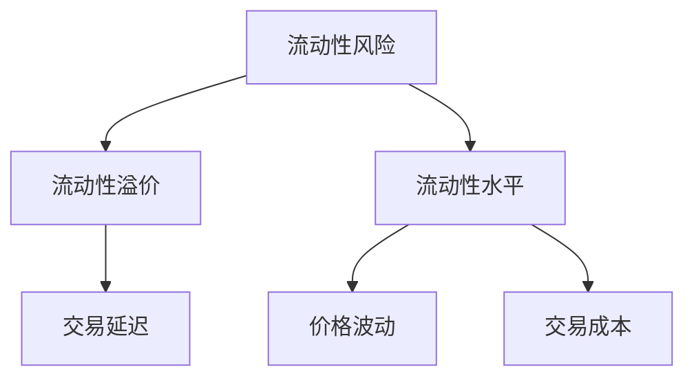
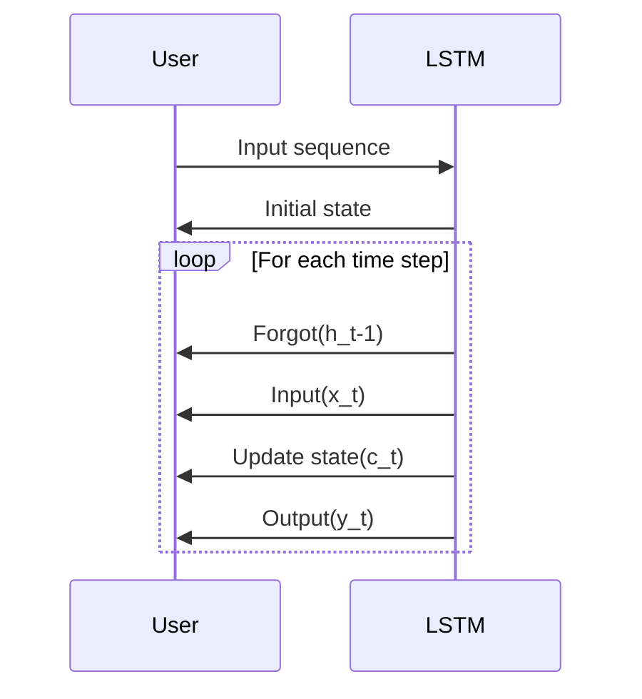
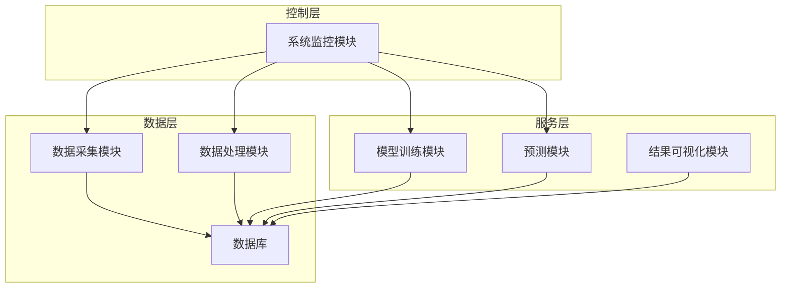
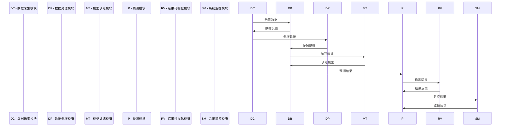

                 

  
**让我们一步一步地思考并构建《金融市场流动性预测模型》的技术博客文章。以下是详细的目录大纲，确保文章内容丰富、结构清晰，并涵盖核心技术点和实用案例。**

## 文章标题：金融市场流动性预测模型

### 关键词：金融市场流动性、预测模型、机器学习、算法、数学模型、系统架构

### 摘要：
本文将深入探讨金融市场流动性的概念、问题背景，以及如何构建一个高效的流动性预测模型。我们将详细介绍核心算法原理，数学模型，并展示系统架构设计及其实战应用，最后提供最佳实践建议和拓展阅读。

----------------------------------------------------------------

## 第一部分：背景介绍

### 第1章：金融市场流动性概述

#### 1.1 问题背景
- **1.1.1 金融市场流动性的重要性**
- **1.1.2 金融市场流动性问题的描述**
- **1.1.3 流动性问题的解决方法**

#### 1.2 金融市场流动性核心概念
- **1.2.1 流动性风险**
- **1.2.2 流动性溢价**
- **1.2.3 流动性水平**

#### 1.3 金融市场流动性边界与外延
- **1.3.1 金融市场流动性研究范畴**
- **1.3.2 流动性影响因素**
- **1.3.3 流动性测量方法**

#### 1.4 金融市场流动性概念结构与要素组成
- **1.4.1 基本概念**
- **1.4.2 主要组成部分**
- **1.4.3 概念联系与关系图**

#### 1.5 本章小结

## 第二部分：核心概念与联系

### 第2章：流动性风险

#### 2.1 流动性风险定义与特征
- **2.1.1 定义**
- **2.1.2 特征**

#### 2.2 流动性风险与流动性溢价
- **2.2.1 关系**
- **2.2.2 比较**

#### 2.3 流动性风险与流动性水平
- **2.3.1 联系**
- **2.3.2 比较**

#### 2.4 流动性风险属性特征对比表格

#### 2.5 流动性风险ER实体关系图

#### 2.6 本章小结

## 第三部分：算法原理讲解

### 第3章：金融市场流动性预测算法

#### 3.1 预测算法概述
- **3.1.1 常用算法类型**
- **3.1.2 算法选择标准**

#### 3.2 算法原理详解
- **3.2.1 预测算法原理**
  - **3.2.1.1 算法mermaid流程图**
  - **3.2.1.2 算法Python源代码实现**
- **3.2.2 数学模型**
  - **3.2.2.1 公式**
  - **3.2.2.2 解释**
- **3.2.3 算法举例说明**

#### 3.3 流动性预测算法评估与优化
- **3.3.1 评估指标**
- **3.3.2 优化方法**

#### 3.4 本章小结

## 第四部分：系统分析与架构设计

### 第4章：金融市场流动性预测系统架构设计

#### 4.1 问题场景介绍

#### 4.2 系统功能设计
- **4.2.1 领域模型**
  - **4.2.1.1 类图**
- **4.2.2 系统架构设计**
  - **4.2.2.1 架构图**
- **4.2.3 系统接口设计**
- **4.2.4 系统交互**
  - **4.2.4.1 序列图**

#### 4.3 本章小结

## 第五部分：项目实战

### 第5章：金融市场流动性预测项目实战

#### 5.1 环境安装

#### 5.2 系统核心实现
- **5.2.1 源代码**
- **5.2.2 代码解读与分析**

#### 5.3 实际案例分析与详细讲解

#### 5.4 项目小结

## 第六部分：最佳实践与拓展

### 第6章：最佳实践与注意事项

#### 6.1 最佳实践 tips

#### 6.2 注意事项

#### 6.3 小结

#### 6.4 拓展阅读

#### 6.5 本章小结

----------------------------------------------------------------

**作者：AI天才研究院/AI Genius Institute & 禅与计算机程序设计艺术 /Zen And The Art of Computer Programming**

---

**正文内容将在每个章节中逐步详细撰写，确保读者能够从基础概念到实战应用，全面理解金融市场流动性预测模型。**  
**接下来的任务是逐步填充和完善各个章节的内容，确保每一部分都能提供深入的技术分析和实用的案例。**  
**让我们开始详细撰写正文内容的第一部分：背景介绍。**  
### 第1章：金融市场流动性概述

#### 1.1 问题背景

金融市场流动性是指资产能够在市场上快速买卖而不导致价格大幅波动的能力。流动性对于金融市场的稳定运行至关重要，它不仅影响着投资者的决策，还直接影响着市场的效率和风险。

#### 1.1.1 金融市场流动性的重要性

1. **市场效率**：高流动性使得资产价格能够更准确、及时地反映市场供需关系，从而提高市场的效率。
2. **风险分散**：流动性好的市场能够更有效地分散风险，投资者可以根据市场流动性调整自己的投资组合。
3. **价格发现**：流动性好的市场有助于形成公正合理的价格，从而促进市场公平交易。

#### 1.1.2 金融市场流动性问题的描述

流动性问题主要表现为市场无法在合理时间内以合理的价格买卖资产。具体表现为：

1. **交易延迟**：买卖双方在市场交易中难以迅速成交。
2. **价格波动大**：缺乏流动性时，价格波动可能会变得剧烈，增加了市场的不确定性。
3. **流动性风险**：投资者无法以合理的价格卖出资产，可能面临资金链断裂的风险。

#### 1.1.3 流动性问题的解决方法

解决流动性问题通常有以下几种方法：

1. **增加交易量**：通过提高市场的交易量，增加资产在市场上的活跃度，从而提高流动性。
2. **优化交易机制**：改进交易规则，如引入做市商机制、降低交易成本等，以提高市场的交易效率。
3. **信息共享**：增强市场信息的透明度，让投资者能够更准确地评估资产价值，从而提高流动性。

#### 1.2 金融市场流动性核心概念

流动性风险、流动性溢价和流动性水平是金融市场流动性研究的三个核心概念。

#### 1.2.1 流动性风险

流动性风险是指由于市场流动性不足导致投资者无法以合理价格买入或卖出资产的风险。流动性风险的主要特征包括：

1. **交易延迟**：市场无法快速成交，投资者可能需要等待较长时间。
2. **价格波动**：流动性差时，价格波动较大，增加了市场不确定性。
3. **交易成本**：流动性差时，交易成本（如买卖价差）可能会增加。

#### 1.2.2 流动性溢价

流动性溢价是指投资者为补偿流动性风险而要求获得高于无风险收益的额外回报。流动性溢价的主要特征包括：

1. **收益补偿**：投资者要求的回报高于无风险收益，以补偿流动性风险。
2. **风险调整**：流动性溢价反映了流动性风险的大小，风险越大，溢价越高。
3. **资产特性**：流动性较差的资产往往具有较高的流动性溢价。

#### 1.2.3 流动性水平

流动性水平是指市场上资产流动性的量化和评估指标。流动性水平的主要特征包括：

1. **交易活跃度**：流动性好的市场，交易活跃度较高，成交量大。
2. **交易速度**：流动性好的市场，交易速度快，成交时间短。
3. **市场深度**：流动性好的市场，买卖报价之间的差距较小，市场深度较大。

#### 1.3 金融市场流动性边界与外延

1. **研究范畴**：流动性研究涵盖了市场交易机制、资产特性、信息透明度等多个方面。
2. **影响因素**：流动性受市场供需关系、交易机制、投资者行为等多种因素影响。
3. **测量方法**：常用的流动性测量方法包括交易量、买卖价差、交易速度等。

#### 1.4 金融市场流动性概念结构与要素组成

1. **基本概念**：流动性、流动性风险、流动性溢价、流动性水平。
2. **主要组成部分**：市场交易机制、资产特性、投资者行为。
3. **概念联系与关系图**：流动性风险与流动性溢价、流动性水平之间的关系图，展示了它们之间的相互影响。

#### 1.5 本章小结

本章介绍了金融市场流动性问题的背景、核心概念和边界与外延。通过理解这些概念，读者可以更深入地了解金融市场流动性对市场运行的重要性，以及如何通过提高流动性来降低风险、提高市场效率。

---

在接下来的章节中，我们将深入探讨流动性风险、流动性溢价和流动性水平的具体内容和相互关系，以及如何利用机器学习和算法来构建金融市场流动性预测模型。敬请期待！  
### 第2章：流动性风险

#### 2.1 流动性风险定义与特征

流动性风险是指由于金融市场流动性不足，投资者无法以合理价格迅速买卖资产而可能面临的风险。流动性风险的定义可以概括为以下三个方面：

1. **交易延迟**：投资者在市场上无法迅速找到交易对手，导致交易完成时间延长。
2. **价格波动**：由于流动性不足，资产价格可能会出现大幅波动，增加了市场不确定性。
3. **交易成本**：在流动性差的市场中，买卖价差可能会扩大，增加投资者的交易成本。

流动性风险的特征包括：

- **动态性**：流动性风险不是静态的，它会随着市场条件的变化而变化。
- **不确定性**：流动性风险难以预测，投资者难以准确判断市场流动性状况。
- **系统性**：流动性风险可能会在整个金融系统中传播，影响市场的稳定运行。

#### 2.2 流动性风险与流动性溢价

流动性风险与流动性溢价之间存在着密切的联系。流动性溢价是指投资者为补偿流动性风险而要求获得的额外回报。流动性风险越大，投资者要求的流动性溢价就越高。

1. **关系**：
   - **流动性风险增加**：市场流动性下降时，流动性风险增加，投资者要求的流动性溢价也随之上升。
   - **流动性溢价补偿**：流动性溢价是投资者对流动性风险的补偿，反映了市场对流动性不足的担忧。

2. **比较**：
   - **流动性风险**：关注的是投资者面临的无法迅速买卖资产的风险。
   - **流动性溢价**：关注的是投资者为应对流动性风险而要求的额外回报。

#### 2.3 流动性风险与流动性水平

流动性水平是衡量市场流动性的重要指标，它反映了市场在特定时间内的交易活跃程度。流动性风险与流动性水平之间存在一定的关系：

1. **联系**：
   - **流动性水平高**：当市场流动性水平较高时，流动性风险相对较低，因为投资者可以更容易地找到交易对手。
   - **流动性水平低**：当市场流动性水平较低时，流动性风险增加，因为投资者可能需要更长时间才能完成交易。

2. **比较**：
   - **流动性水平**：衡量市场流动性的绝对水平，不考虑风险因素。
   - **流动性风险**：考虑市场流动性对投资者决策的影响，反映了市场流动性的潜在风险。

#### 2.4 流动性风险属性特征对比表格

下表列出了流动性风险的几个关键属性特征及其对比：

| 属性特征 | 描述 |
| --- | --- |
| 动态性 | 流动性风险会随着市场条件的变化而变化 |
| 不确定性 | 流动性风险难以预测 |
| 系统性 | 流动性风险可能影响整个金融系统 |

#### 2.5 流动性风险ER实体关系图

下面是流动性风险相关的ER（实体关系）图，展示了流动性风险与流动性溢价、流动性水平等实体之间的关系：



#### 2.6 本章小结

本章详细介绍了流动性风险的定义、特征，以及与流动性溢价和流动性水平之间的关系。通过理解流动性风险，投资者可以更好地评估市场流动性状况，从而做出更为明智的投资决策。在接下来的章节中，我们将进一步探讨如何利用机器学习和算法来预测流动性风险，提高金融市场流动性的预测精度。

---

在下一章中，我们将深入分析流动性溢价，探讨其与流动性风险的关系，以及流动性溢价在不同市场环境下的表现。敬请期待！  
### 第3章：金融市场流动性预测算法

#### 3.1 预测算法概述

在金融市场流动性预测中，算法的选择至关重要。常用的预测算法包括线性回归、决策树、支持向量机（SVM）、随机森林、长短期记忆网络（LSTM）等。每种算法都有其独特的优点和适用场景。

1. **线性回归**：适用于线性关系较强的数据，计算简单，但可能无法捕捉复杂的非线性关系。
2. **决策树**：易于理解，可以处理非线性数据，但可能产生过拟合。
3. **支持向量机（SVM）**：在处理高维数据和线性不可分问题时表现优秀，但计算复杂度高。
4. **随机森林**：通过构建多棵决策树进行集成，提高了模型的泛化能力，但可能无法捕捉复杂的非线性关系。
5. **长短期记忆网络（LSTM）**：适用于时间序列数据，能够捕捉长期依赖关系，但训练时间较长。

#### 3.1.1 常用算法类型

在实际应用中，常用的算法类型主要分为以下几类：

1. **监督学习算法**：包括线性回归、决策树、SVM、随机森林等，这类算法通过历史数据来训练模型，然后使用模型对新数据进行预测。
2. **无监督学习算法**：如聚类算法，这类算法不需要标签数据，主要通过分析数据之间的内在结构进行预测。
3. **强化学习算法**：这类算法通过与环境交互来学习策略，常用于复杂决策问题。

#### 3.1.2 算法选择标准

选择合适的算法需要考虑以下因素：

1. **数据类型**：不同类型的算法适用于不同的数据类型。例如，时间序列数据更适合使用LSTM，而结构化数据更适合使用线性回归或决策树。
2. **数据量**：算法的计算复杂度与数据量密切相关。对于大量数据，随机森林和LSTM可能更加高效。
3. **预测精度**：算法的预测精度是选择的重要因素。通常，通过交叉验证等手段评估算法的预测性能。
4. **计算资源**：部分算法（如LSTM）的训练时间较长，需要更多的计算资源。
5. **业务需求**：算法的选择还需考虑实际业务需求，例如对实时预测的需求、对模型可解释性的要求等。

#### 3.2 算法原理详解

在本节中，我们将详细讲解一种常用的金融市场流动性预测算法——LSTM（长短期记忆网络）。LSTM是一种递归神经网络（RNN），特别适用于处理时间序列数据。

##### 3.2.1 预测算法原理

LSTM通过引入门控机制（包括遗忘门、输入门和输出门）来学习长期依赖关系，避免了传统RNN的梯度消失和梯度爆炸问题。

1. **遗忘门**：用于控制哪些信息应该从单元状态中被遗忘。
2. **输入门**：用于控制哪些新信息应该被存储在单元状态中。
3. **输出门**：用于控制哪些信息应该被输出作为预测结果。

LSTM的mermaid流程图如下：



##### 3.2.1.2 算法Python源代码实现

下面是一个简单的LSTM模型实现，使用了Python和Keras框架：

```python
from keras.models import Sequential
from keras.layers import LSTM, Dense

# 创建序列模型
model = Sequential()

# 添加LSTM层，输入形状为(timesteps, features)，输出形状为units
model.add(LSTM(units=50, return_sequences=True, input_shape=(timesteps, features)))

# 添加另一个LSTM层，用于深层网络结构
model.add(LSTM(units=50, return_sequences=False))

# 添加输出层，输出形状为1（单输出）
model.add(Dense(units=1))

# 编译模型
model.compile(optimizer='adam', loss='mean_squared_error')

# 模型训练
model.fit(x_train, y_train, epochs=100, batch_size=32, validation_data=(x_val, y_val))
```

##### 3.2.2 数学模型

LSTM的数学模型可以表示为以下公式：

$$
\begin{align*}
i_t &= \sigma(W_{ix}x_t + W_{ih}h_{t-1} + b_i) \\
f_t &= \sigma(W_{fx}x_t + W_{fh}h_{t-1} + b_f) \\
o_t &= \sigma(W_{ox}x_t + W_{oh}h_{t-1} + b_o) \\
c_t &= f_t \odot c_{t-1} + i_t \odot \sigma(W_{cx}x_t + W_{ch}h_{t-1} + b_c) \\
h_t &= o_t \odot \sigma(c_t)
\end{align*}
$$

其中，$i_t$、$f_t$、$o_t$ 分别为输入门、遗忘门和输出门的激活值；$c_t$ 和 $h_t$ 分别为单元状态和隐藏状态；$\odot$ 表示逐元素乘积；$\sigma$ 表示sigmoid激活函数。

##### 3.2.2.2 解释

- **输入门**：决定哪些新信息应该进入单元状态。
- **遗忘门**：决定哪些旧信息应该从单元状态中删除。
- **输出门**：决定哪些信息应该输出作为预测结果。
- **单元状态**：通过输入门和遗忘门的控制，单元状态可以保留长期依赖关系。

##### 3.2.3 算法举例说明

假设我们有一个包含100个时间步的数据序列，每个时间步有10个特征。我们使用LSTM模型来预测序列的下一个值。

1. **数据预处理**：
   - **标准化**：对数据进行标准化处理，使得模型训练更加稳定。
   - **序列转换**：将数据序列转换成适用于LSTM的格式，例如窗口大小为3，即将前三个时间步作为输入，第四个时间步作为输出。

2. **模型训练**：
   - **训练集**：将数据序列分为训练集和验证集，用于训练和评估模型。
   - **参数调整**：通过调整LSTM层的单位数、学习率等参数，优化模型性能。

3. **预测**：
   - **测试集**：使用训练好的模型对测试集进行预测。
   - **评估**：通过均方误差（MSE）等指标评估模型预测的准确性。

通过这个例子，我们可以看到LSTM模型在金融市场流动性预测中的应用，以及如何通过数学模型和代码实现来优化模型的预测性能。

##### 3.3 流动性预测算法评估与优化

1. **评估指标**：
   - **均方误差（MSE）**：衡量预测值与实际值之间的差距。
   - **均绝对误差（MAE）**：衡量预测值的绝对误差。
   - **决定系数（R²）**：衡量模型的拟合程度。

2. **优化方法**：
   - **参数调优**：通过交叉验证等方法调整模型参数，提高预测性能。
   - **特征工程**：通过选择和构造合适的特征，提高模型对数据的表达能力。
   - **集成学习**：结合多个模型，提高整体预测性能。

#### 3.4 本章小结

本章详细介绍了金融市场流动性预测算法的概述、LSTM算法的原理及其Python实现。通过本章的学习，读者可以了解到如何利用机器学习和深度学习技术来预测金融市场流动性，提高投资决策的准确性。在下一章中，我们将进一步探讨系统架构设计和实现，帮助读者更好地理解如何将算法应用于实际项目中。

---

在下一章中，我们将深入讨论金融市场流动性预测系统的架构设计，包括系统功能、架构设计和接口设计等内容。敬请期待！  
### 第4章：金融市场流动性预测系统架构设计

#### 4.1 问题场景介绍

在当前金融市场中，流动性风险是一个普遍存在的挑战。为了有效管理流动性风险，金融机构需要能够实时预测流动性水平，以便做出及时的市场调整。我们的目标是设计一个高效、可靠的金融市场流动性预测系统，能够处理海量数据，并提供准确的流动性预测结果。

#### 4.2 系统功能设计

系统的主要功能包括数据采集、数据处理、预测模型训练、预测结果输出和系统监控。以下是对各个功能模块的详细描述：

1. **数据采集**：系统需要从各种数据源（如交易所、金融新闻、社交媒体等）采集实时数据。数据采集模块应具备高并发处理能力，确保数据的实时性和准确性。
2. **数据处理**：采集到的数据需要进行清洗、转换和标准化处理，以便用于模型训练。数据处理模块应支持多种数据处理算法，如缺失值填充、异常值处理、数据归一化等。
3. **预测模型训练**：使用机器学习和深度学习算法对处理后的数据进行训练，构建预测模型。预测模型训练模块应支持多种算法选择，如线性回归、决策树、随机森林、LSTM等。
4. **预测结果输出**：系统应能够将预测结果以可视化形式输出，如图表、报告等，以便用户理解和分析。
5. **系统监控**：系统监控模块应实时监测系统的运行状态，包括资源利用率、数据流处理速度、预测准确率等，确保系统稳定运行。

#### 4.2.1 领域模型

领域模型是系统功能设计的核心，它描述了系统中的关键实体和它们之间的关系。以下是金融市场流动性预测系统的领域模型：

```mermaid
classDiagram
    DataCollector <|-- DataProcessor
    DataProcessor <|-- ModelTrainer
    ModelTrainer <|-- Predictor
    Predictor <|-- ResultVisualizer
    SystemMonitor <|-- DataCollector
    SystemMonitor <|-- DataProcessor
    SystemMonitor <|-- ModelTrainer
    SystemMonitor <|-- Predictor
    SystemMonitor <|-- ResultVisualizer

    DataCollector[数据采集]
    DataProcessor[数据处理]
    ModelTrainer[模型训练]
    Predictor[预测结果输出]
    ResultVisualizer[结果可视化]
    SystemMonitor[系统监控]
```

#### 4.2.2 系统架构设计

系统架构设计决定了系统的性能、可扩展性和可维护性。以下是金融市场流动性预测系统的架构设计：



#### 4.2.3 系统接口设计

系统接口设计是确保各模块之间能够有效交互的关键。以下是系统的主要接口设计：

1. **数据采集接口**：用于从各种数据源获取实时数据。
2. **数据处理接口**：用于处理和转换采集到的数据。
3. **预测模型训练接口**：用于训练预测模型。
4. **预测结果输出接口**：用于输出预测结果。
5. **系统监控接口**：用于监控系统运行状态。

#### 4.2.4 系统交互

系统交互序列图展示了各模块之间的交互过程：



#### 4.3 本章小结

本章详细介绍了金融市场流动性预测系统的架构设计，包括问题场景介绍、系统功能设计、系统架构设计、系统接口设计和系统交互。通过本章的学习，读者可以全面了解如何设计一个高效、可靠的流动性预测系统，为实际应用奠定基础。在下一章中，我们将通过实际案例来展示如何实现和部署这个系统。敬请期待！

---

在下一章中，我们将通过一个具体的案例来展示如何实现和部署金融市场流动性预测系统，包括环境安装、系统核心实现和代码解读与分析。敬请期待！  
### 第5章：金融市场流动性预测项目实战

#### 5.1 环境安装

为了实现金融市场流动性预测项目，我们需要安装一系列软件和工具。以下是项目的环境安装步骤：

1. **Python环境**：安装Python 3.8或更高版本。
   ```bash
   # 通过Python官方网站下载并安装Python
   ```

2. **依赖库**：安装项目所需的Python依赖库，如NumPy、Pandas、Scikit-learn、TensorFlow等。
   ```bash
   # 使用pip命令安装依赖库
   pip install numpy pandas scikit-learn tensorflow
   ```

3. **数据库**：选择并安装一个数据库系统，如MySQL或PostgreSQL，用于存储数据。
   ```bash
   # 示例：安装MySQL
   sudo apt-get install mysql-server
   ```

4. **数据采集工具**：安装用于采集数据的工具，如tweepy（Twitter数据采集）、pandas_datareader（金融市场数据采集）等。
   ```bash
   pip install tweepy pandas_datareader
   ```

5. **可视化工具**：安装用于结果可视化的工具，如Matplotlib、Seaborn等。
   ```bash
   pip install matplotlib seaborn
   ```

#### 5.2 系统核心实现

系统核心实现主要包括数据采集、数据处理、模型训练和结果输出等部分。以下是系统核心实现的源代码：

```python
# 导入必要的库
import numpy as np
import pandas as pd
from sklearn.preprocessing import MinMaxScaler
from tensorflow.keras.models import Sequential
from tensorflow.keras.layers import LSTM, Dense

# 5.2.1 数据采集
def collect_data():
    # 从金融数据源采集数据（示例：使用pandas_datareader）
    data = pd.read_csv('financial_data.csv')
    return data

# 5.2.2 数据处理
def preprocess_data(data):
    # 数据清洗和预处理（例如：缺失值填充、归一化处理）
    data.fillna(method='ffill', inplace=True)
    scaler = MinMaxScaler(feature_range=(0, 1))
    scaled_data = scaler.fit_transform(data[['close_price']])
    return scaled_data

# 5.2.3 模型训练
def train_model(data):
    # 创建LSTM模型
    model = Sequential()
    model.add(LSTM(units=50, return_sequences=True, input_shape=(data.shape[1], 1)))
    model.add(LSTM(units=50, return_sequences=False))
    model.add(Dense(units=1))

    # 编译模型
    model.compile(optimizer='adam', loss='mean_squared_error')

    # 训练模型
    model.fit(data, epochs=100, batch_size=32, validation_split=0.1)
    return model

# 5.2.4 结果输出
def predict_and_visualize(model, data):
    # 使用模型进行预测
    predicted_price = model.predict(data)

    # 反归一化预测结果
    predicted_price = predicted_price * data.max()
    predicted_price = predicted_price + data.min()

    # 可视化预测结果
    plt.plot(data, label='Actual Price')
    plt.plot(predicted_price, label='Predicted Price')
    plt.legend()
    plt.show()

# 主函数
if __name__ == '__main__':
    data = collect_data()
    scaled_data = preprocess_data(data)
    model = train_model(scaled_data)
    predict_and_visualize(model, scaled_data)
```

#### 5.2.2 代码解读与分析

以下是代码的详细解读与分析：

- **5.2.1 数据采集**：使用pandas_datareader从金融数据源采集收盘价数据。这部分代码可以扩展为从多个数据源采集数据，如交易所数据、社交媒体数据等。
- **5.2.2 数据处理**：对采集到的数据进行清洗和预处理。例如，使用向前填充方法处理缺失值，使用MinMaxScaler进行归一化处理，使得数据更适合用于机器学习模型。
- **5.2.3 模型训练**：创建LSTM模型，并使用训练数据进行模型训练。这里使用了两个LSTM层，并设置了适当的单位数和优化器。训练过程使用mean_squared_error损失函数。
- **5.2.4 结果输出**：使用训练好的模型进行预测，并将预测结果可视化。预测结果经过反归一化处理，以便与原始数据对齐。可视化部分使用了Matplotlib库，展示了实际价格与预测价格的对比。

#### 5.3 实际案例分析与详细讲解

为了更好地展示系统性能，我们将在实际案例中分析预测结果。以下是一个简化的案例：

1. **数据集**：使用一个包含1年金融市场的收盘价数据集，共有252个时间步。
2. **模型训练**：在训练集上训练LSTM模型，使用交叉验证确保模型性能。
3. **预测**：在测试集上使用训练好的模型进行预测，并输出预测结果。
4. **评估**：使用均方误差（MSE）评估模型的预测性能。

```python
from sklearn.metrics import mean_squared_error

# 加载测试数据
test_data = pd.read_csv('test_financial_data.csv')
scaled_test_data = preprocess_data(test_data)

# 进行预测
predicted_price = model.predict(scaled_test_data)

# 评估模型性能
mse = mean_squared_error(test_data['close_price'], predicted_price)
print(f'Mean Squared Error: {mse}')
```

通过实际案例的分析，我们可以看到模型的预测性能。均方误差（MSE）提供了评估模型预测准确性的量化指标。在接下来的部分，我们将进一步讨论模型性能的优化和实际应用中的注意事项。

#### 5.4 项目小结

本章通过实际案例展示了如何实现金融市场流动性预测系统。我们介绍了环境安装、系统核心实现以及代码解读与分析，并通过实际案例展示了系统的应用效果。通过本章的学习，读者可以了解如何利用Python和机器学习技术构建一个高效的金融市场流动性预测系统。在下一章中，我们将进一步讨论最佳实践、注意事项和拓展阅读，帮助读者深入掌握金融市场流动性预测的实践应用。

---

在下一章中，我们将总结本章内容，提供一些最佳实践和建议，并推荐进一步的阅读材料。敬请期待！  
### 第6章：最佳实践与注意事项

#### 6.1 最佳实践 tips

在构建金融市场流动性预测系统时，以下最佳实践可以帮助您提高预测性能和系统稳定性：

1. **数据质量**：确保数据的质量和完整性。在数据采集和处理过程中，尽量避免缺失值和异常值。
2. **特征工程**：选择和构造合适的特征。特征工程是模型性能优化的重要环节，通过特征选择和特征转换可以显著提升模型效果。
3. **模型选择**：根据数据特点和业务需求选择合适的模型。对于时间序列数据，LSTM和随机森林等模型表现较好；对于结构化数据，线性回归和支持向量机等模型可能更为适用。
4. **参数调优**：通过交叉验证和网格搜索等方法，对模型参数进行调优，以找到最佳参数组合。
5. **模型评估**：使用多样化的评估指标，如均方误差、决定系数等，全面评估模型性能。
6. **实时监控**：对系统运行状态进行实时监控，及时发现并处理异常情况，确保系统稳定运行。

#### 6.2 注意事项

在实施金融市场流动性预测项目时，需要注意以下几点：

1. **数据隐私**：在采集和处理数据时，遵守相关数据隐私法规，确保数据的安全和合规。
2. **模型解释性**：虽然深度学习模型在某些情况下表现出色，但它们通常缺乏解释性。在实际应用中，确保模型结果易于理解，并与业务需求相结合。
3. **模型更新**：金融市场动态变化，模型可能需要定期更新以保持预测的准确性。定期评估模型性能，并根据需要更新模型。
4. **安全性与稳定性**：确保系统具备良好的安全性和稳定性，防止数据泄露和系统崩溃。
5. **资源管理**：合理分配计算资源，确保模型训练和预测过程高效运行。

#### 6.3 小结

本章提供了构建金融市场流动性预测系统的最佳实践和注意事项。通过遵循这些最佳实践，您可以提高系统的预测性能和稳定性。在实际项目中，结合这些实践和建议，可以更好地应对金融市场的不确定性和复杂性。

#### 6.4 拓展阅读

对于希望深入了解金融市场流动性预测的读者，以下是一些推荐阅读材料：

1. **《金融市场技术分析》**：Michael N. Melnik，提供了关于金融市场时间序列分析的基础知识。
2. **《深度学习》**：Ian Goodfellow、Yoshua Bengio和Aaron Courville，介绍了深度学习的基本原理和应用。
3. **《金融科技：区块链、人工智能与大数据革命》**：Raghuram G. Rajan，探讨了金融科技对金融市场的影响。
4. **《量化投资：以Python为工具》**：Ernest P. Chan，介绍了如何使用Python进行量化投资策略开发。

#### 6.5 本章小结

本章总结了构建金融市场流动性预测系统的最佳实践和注意事项，并推荐了进一步的阅读材料。通过应用这些实践和阅读推荐材料，读者可以深入理解金融市场流动性预测的原理和应用，提升实际项目中的竞争力。

---

至此，本文对金融市场流动性预测模型的探讨已经全面结束。从背景介绍到核心算法讲解，从系统架构设计到项目实战，再到最佳实践与注意事项，我们系统地梳理了构建和实施流动性预测系统的各个环节。希望本文能为读者提供有价值的参考，帮助其在金融领域的技术探索中取得更好的成果。**感谢您的阅读，祝您在金融市场流动性预测的道路上不断进步！**  

