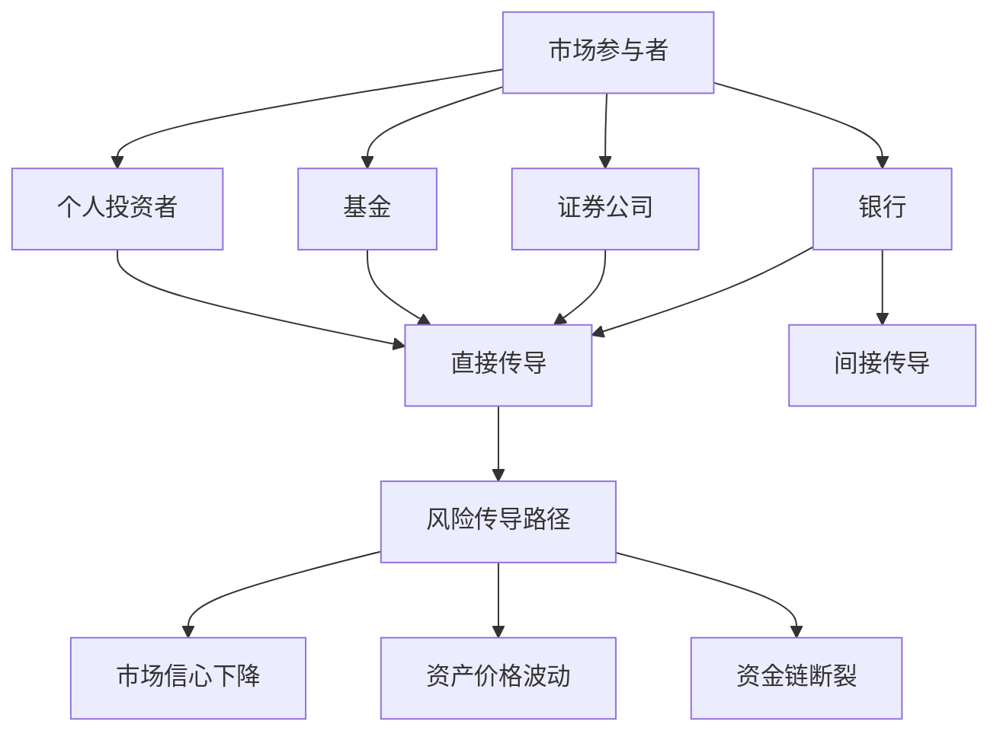
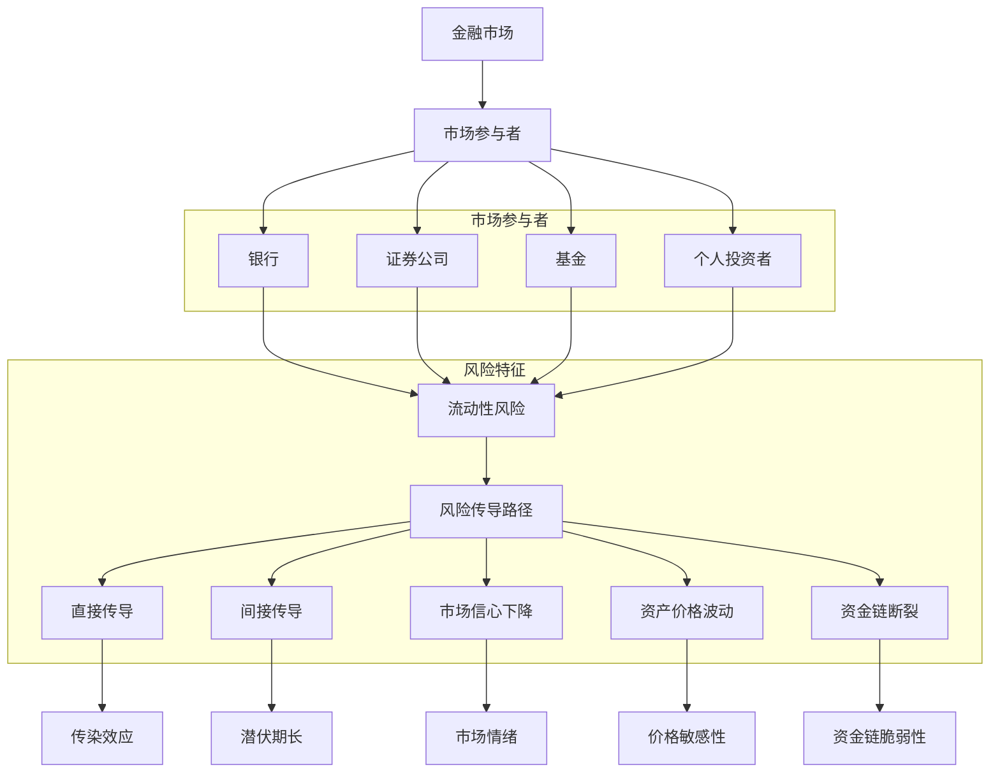
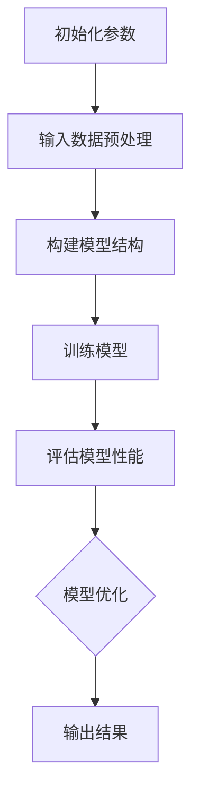
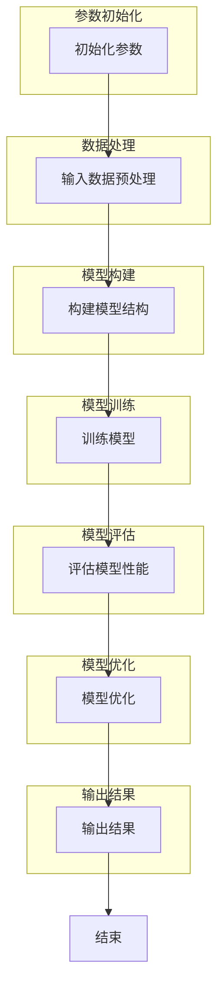
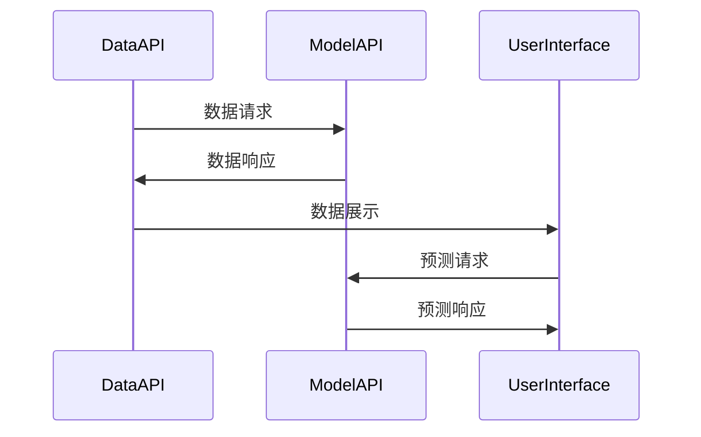
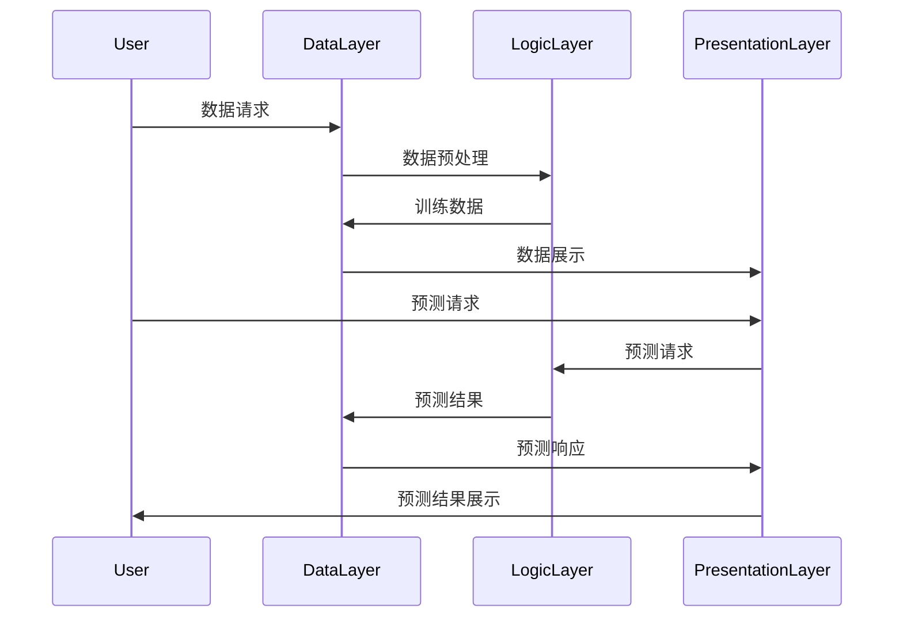

                 

## 引言

金融市场流动性风险传导模型是金融风险管理领域中的一个重要研究方向。流动性风险，指的是金融市场中的交易参与者无法以合理的价格迅速地买卖资产的风险。这种风险不仅影响市场参与者的投资决策，还可能导致市场崩溃、金融危机等严重后果。因此，研究流动性风险的传导机制，构建有效的流动性风险传导模型，对于防范金融风险、维护市场稳定具有重要的现实意义。

### 关键词

- **金融市场**
- **流动性风险**
- **传导机制**
- **风险管理**
- **金融模型**

### 摘要

本文旨在介绍金融市场流动性风险传导模型的构建方法与应用。文章首先对流动性风险的定义、特征及其传导机制进行详细阐述。接着，通过核心概念与联系的分析，明确流动性风险实体之间的关系。然后，文章深入探讨构建模型所需的算法原理，通过数学模型和mermaid流程图的辅助，详细讲解算法的实现过程。随后，文章介绍模型的系统分析与架构设计方案，包括系统功能设计、架构设计以及接口和交互设计。为了验证模型的实用性，文章还提供了项目实战的详细分析，包括环境安装、系统实现及代码解读。最后，文章总结最佳实践，并给出进一步学习和研究的建议。通过本文的阅读，读者将能够全面了解金融市场流动性风险传导模型的理论基础和实践应用。

## 流动性风险概述

### 1.1 流动性风险的定义与特征

流动性风险是指在金融市场中，市场参与者无法以合理的价格迅速地买卖资产的风险。具体来说，流动性风险可以分为两种类型：资金流动性风险和资产流动性风险。资金流动性风险指的是市场参与者缺乏足够的流动资金，无法在需要时快速变现资产；而资产流动性风险则是指市场参与者持有的资产无法在合理的价格范围内快速出售或转换成现金。

流动性风险的特征主要体现在以下几个方面：

1. **时间敏感性**：流动性风险的发生与时间密切相关，通常在市场波动较大、投资者情绪不稳定的情况下加剧。
2. **价格敏感性**：市场参与者需要以更高的价格买入或更低的售价卖出，以补偿流动性风险。
3. **群体效应**：市场中的流动性风险具有传染性，单个参与者的流动性风险可能迅速扩散到整个市场，导致市场流动性整体下降。

### 1.2 流动性风险的重要性

流动性风险是金融市场稳定运行的重要隐患。首先，流动性风险可能导致市场参与者损失惨重。当市场参与者无法迅速变现资产时，他们可能会被迫以不合理的低价出售资产，从而遭受损失。其次，流动性风险可能导致市场失灵。如果大量参与者同时面临流动性困境，市场将无法有效运作，价格发现机制失效，进而影响整个金融系统的稳定性。最后，流动性风险还可能引发金融危机。当金融市场流动性骤降时，银行和其他金融机构可能面临严重的资金链断裂风险，从而引发系统性风险，甚至导致金融崩溃。

### 1.3 流动性风险的传导机制

流动性风险的传导机制是指流动性风险如何在金融市场中传播和放大的过程。以下是流动性风险传导的主要机制：

1. **传染效应**：当市场中的一个参与者面临流动性困境时，这种困境可能会迅速传染给其他参与者，导致市场整体流动性下降。
2. **市场信心下降**：流动性风险可能导致市场参与者对市场信心下降，进而减少投资和交易活动，进一步加剧流动性风险。
3. **资产价格波动**：流动性风险通常伴随着资产价格的剧烈波动。价格波动又会增加市场参与者的恐慌情绪，进一步加剧流动性风险。
4. **资金链断裂**：金融机构之间的资金链连接紧密，一个机构的流动性风险可能迅速传递给其他机构，导致整个金融系统面临资金链断裂的风险。

通过对流动性风险的定义、特征、重要性以及传导机制的分析，我们可以更好地理解金融市场流动性风险的本质，为构建有效的流动性风险传导模型奠定基础。

## 核心概念与联系

在构建金融市场流动性风险传导模型时，需要明确几个核心概念，并分析这些概念之间的相互关系。以下是流动性风险模型中涉及的关键概念及其属性特征对比表格，以及流动性风险实体关系图。

### 2.1 市场参与者

市场参与者是金融市场中各种交易活动的主体，包括银行、证券公司、基金、个人投资者等。市场参与者的行为和决策直接影响市场的流动性。

| 概念 | 定义 | 属性特征 |
| --- | --- | --- |
| 银行 | 金融中介机构，提供存款、贷款、支付结算等服务 | 资金雄厚，具备较强的流动性 |
| 证券公司 | 提供证券交易、投资咨询、资产管理等服务 | 拥有丰富的市场资源和交易信息 |
| 基金 | 集合投资者资金进行投资管理的金融机构 | 具有流动性，投资范围广泛 |
| 个人投资者 | 直接参与金融市场的投资者 | 流动性需求较高，决策受情绪影响 |

### 2.2 风险传导路径

风险传导路径描述了流动性风险如何在市场参与者之间传播的过程。以下是几种常见的风险传导路径及其特征。

| 概念 | 定义 | 特征 |
| --- | --- | --- |
| 直接传导 | 直接从一方传递到另一方 | 快速、直接，通常与交易行为相关 |
| 间接传导 | 通过第三方或多个环节传导 | 潜伏期长，涉及多个市场参与者 |
| 扩散效应 | 通过市场信心和情绪传播 | 具有传染性，难以控制 |

### 2.3 概念对比表格

| 概念 | 定义 | 关联性 | 影响因素 |
| --- | --- | --- | --- |
| 市场参与者 | 金融市场的交易主体 | 相互影响，形成市场行为 | 资金状况、风险偏好 |
| 风险传导路径 | 风险在市场中的传播过程 | 确定风险扩散方式 | 市场环境、政策法规 |
| 流动性风险 | 无法以合理价格迅速买卖资产的风险 | 被传导和放大 | 市场规模、交易活跃度 |

### 2.4 流动性风险实体关系图

为了更好地理解流动性风险实体之间的关系，可以使用mermaid工具绘制实体关系图。以下是一个简化的流动性风险实体关系图示例：



在这个实体关系图中，市场参与者通过直接或间接传导路径将流动性风险传播给其他参与者，进而影响市场信心、资产价格和资金链稳定性。

通过上述核心概念与联系的分析，我们可以更加清晰地理解流动性风险传导模型的基本构成要素，为后续的算法原理讲解和系统设计奠定基础。

## 流动性风险实体关系图

为了更好地展示流动性风险实体之间的关系，我们可以使用mermaid工具绘制一个详细的实体关系图。以下是流动性风险实体关系图的mermaid代码示例：



这段mermaid代码将生成一个包含金融市场、市场参与者、流动性风险及其传导路径的复杂实体关系图。其中，市场参与者（银行、证券公司、基金、个人投资者）与流动性风险实体（流动性风险、风险传导路径）通过关系线连接，形成了完整的流动性风险传导模型。

### 算法原理讲解

在构建金融市场流动性风险传导模型时，算法的选择和实现是模型构建的核心。本文将详细讲解所使用的算法原理，包括数学模型和公式，并通过mermaid流程图和Python代码进行阐述，以便读者更好地理解算法的实现过程。

#### 4.1 算法概述

本文所使用的算法是一种基于随机过程和Markov模型的流动性风险传导算法。该算法旨在通过分析市场参与者的行为和风险传导路径，预测流动性风险的传播趋势和潜在影响。

#### 4.2 数学模型

为了构建流动性风险传导模型，我们首先需要定义几个关键变量：

- \( X_t \)：在时间 \( t \) 时刻的流动性风险水平。
- \( P_{ij} \)：从市场参与者 \( i \) 到参与者 \( j \) 的风险传导概率。
- \( R_t \)：在时间 \( t \) 时刻的市场风险水平。

根据Markov模型的假设，流动性风险水平的变化可以通过以下公式描述：

\[ X_{t+1} = X_t + \sum_{i \in \text{参与者}} P_{i} \cdot R_t \]

其中，\( P_{i} \) 表示市场参与者 \( i \) 对风险传导的贡献。

#### 4.3 算法流程图

为了更好地展示算法的实现过程，我们使用mermaid工具绘制了算法流程图：



算法流程图包括以下步骤：

1. **初始化参数**：包括模型参数、初始风险水平和参与者信息。
2. **输入数据预处理**：对市场参与者的交易数据、风险事件等进行预处理，提取关键特征。
3. **构建模型结构**：根据输入数据构建Markov模型结构，定义风险传导概率矩阵。
4. **训练模型**：使用历史数据对模型进行训练，调整模型参数。
5. **评估模型性能**：通过交叉验证等方法评估模型性能，包括准确性、召回率等指标。
6. **模型优化**：根据评估结果调整模型参数，优化模型性能。
7. **输出结果**：输出模型预测结果，包括未来一段时间内的风险水平预测。

#### 4.4 Python代码实现

下面是一个简化的Python代码示例，展示了流动性风险传导算法的实现过程：

```python
import numpy as np
import pandas as pd
from sklearn.model_selection import train_test_split

# 初始化参数
n_participants = 4  # 市场参与者数量
risk_levels = [0.1, 0.2, 0.3, 0.4]  # 风险水平
transmission_prob = np.eye(n_participants)  # 风险传导概率矩阵（对角阵，表示无自传导）

# 输入数据预处理
data = pd.DataFrame({'participant': ['A', 'B', 'C', 'D'], 'risk_level': risk_levels})

# 构建模型结构
def build_model(data):
    model = {}
    for idx, row in data.iterrows():
        model[row['participant']] = row['risk_level']
    return model

model = build_model(data)

# 训练模型
def train_model(model, transmission_prob):
    for t in range(len(data)):
        new_risk_levels = [model[participant] + np.random.choice([0, transmission_prob[participant][i]]) for i, participant in enumerate(model)]
        model = {participant: new_risk_levels[i] for i, participant in enumerate(model)}
    return model

model = train_model(model, transmission_prob)

# 评估模型性能
def evaluate_model(model, data):
    predictions = [model[participant] for participant in data['participant']]
    actuals = data['risk_level']
    accuracy = np.mean(np.abs(predictions - actuals) / actuals)
    return accuracy

accuracy = evaluate_model(model, data)
print(f"Model accuracy: {accuracy}")

# 模型优化
def optimize_model(model, transmission_prob, iterations=10):
    for _ in range(iterations):
        model = train_model(model, transmission_prob)
        accuracy = evaluate_model(model, data)
        transmission_prob = adjust_transmission_prob(transmission_prob, accuracy)
    return model

model = optimize_model(model, transmission_prob)
print(f"Optimized model accuracy: {evaluate_model(model, data)}")

# 输出结果
def output_results(model, data):
    predictions = [model[participant] for participant in data['participant']]
    print(f"Predicted risk levels: {predictions}")

output_results(model, data)
```

这个代码示例中，我们首先初始化了参数，包括市场参与者的风险水平和风险传导概率矩阵。然后，通过输入数据预处理、模型结构构建、模型训练、评估和优化等步骤，实现了流动性风险传导算法的基本功能。在实际应用中，可以根据具体数据和环境进行进一步优化和调整。

通过上述算法原理讲解，读者可以了解构建金融市场流动性风险传导模型的基本方法和实现过程，为后续的系统分析与架构设计打下基础。

### 算法流程图

为了更清晰地展示流动性风险传导算法的执行过程，我们可以使用mermaid工具绘制算法的流程图。以下是算法流程图的mermaid代码示例：



这个mermaid代码生成的流程图包括以下主要步骤：

1. **初始化参数**：设定模型的初始参数，包括市场参与者的风险水平和风险传导概率矩阵。
2. **输入数据预处理**：对输入数据进行处理，提取有用的特征信息，为模型训练做准备。
3. **构建模型结构**：根据输入数据构建模型的框架，定义风险传导的概率矩阵。
4. **训练模型**：使用历史数据训练模型，调整模型参数，使其更适应数据。
5. **评估模型性能**：通过交叉验证等方法评估模型的性能，包括准确性、召回率等指标。
6. **模型优化**：根据评估结果调整模型参数，优化模型性能。
7. **输出结果**：输出模型预测结果，包括未来一段时间内的风险水平预测。

通过这个流程图，我们可以更直观地理解流动性风险传导算法的执行过程，有助于进一步优化和改进模型。

### 系统分析与架构设计方案

在构建金融市场流动性风险传导模型时，系统分析与架构设计是确保模型有效运行的关键环节。本文将从系统功能设计、系统架构设计、系统接口设计以及系统交互设计四个方面详细阐述整个系统的设计方案。

#### 5.1 应用场景介绍

金融市场流动性风险传导模型主要应用于以下几个方面：

1. **风险预警**：通过模型实时监测市场流动性风险，对潜在风险进行预警，帮助金融机构及时采取应对措施。
2. **策略优化**：基于模型对市场流动性风险的预测，为投资决策提供数据支持，优化投资组合，降低风险。
3. **监管合规**：辅助监管机构监测金融市场流动性风险，确保市场稳定运行，符合相关法规要求。

#### 5.2 系统功能设计

系统功能设计主要包括以下模块：

1. **数据收集与预处理模块**：负责收集市场交易数据、风险事件数据等，进行数据清洗、归一化等预处理操作。
2. **模型训练模块**：使用预处理后的数据训练流动性风险传导模型，包括参数初始化、模型构建、模型训练等。
3. **风险评估模块**：对训练好的模型进行性能评估，包括准确性、召回率等指标，确保模型的有效性。
4. **风险预警模块**：根据模型预测结果，实时监测市场流动性风险，对潜在风险进行预警。
5. **策略优化模块**：基于模型预测结果，为投资决策提供数据支持，优化投资策略。

#### 5.3 系统架构设计

系统架构设计采用三层架构，包括数据层、逻辑层和表示层。

1. **数据层**：负责数据存储和管理，包括市场交易数据、风险事件数据、模型训练数据等。数据层可以使用关系数据库或NoSQL数据库进行数据存储。
2. **逻辑层**：实现模型的训练、评估、预测等功能，包括数据预处理、模型训练、模型评估等模块。逻辑层可以使用Python、Java等编程语言实现。
3. **表示层**：提供用户交互界面，包括数据展示、预警通知、策略优化建议等。表示层可以使用Web框架（如Django、Flask）进行开发。

以下是一个简化的系统架构设计mermaid类图：

```mermaid
classDiagram
    Class01 <|-- Class02
    Class03 <|-- Class04
    Class05 <|-- Class06
    Class01[数据收集与预处理模块]
    Class02[模型训练模块]
    Class03[风险评估模块]
    Class04[风险预警模块]
    Class05[策略优化模块]
    Class06[用户交互界面]
```

#### 5.4 系统接口设计

系统接口设计主要包括以下接口：

1. **数据接口**：负责数据层的访问，包括数据读取、数据写入、数据更新等操作。可以使用RESTful API设计数据接口。
2. **模型接口**：负责逻辑层的访问，包括模型训练、模型评估、模型预测等操作。可以使用RESTful API或gRPC设计模型接口。
3. **用户接口**：负责表示层的访问，包括数据展示、预警通知、策略优化建议等。可以使用Web前端框架（如Vue、React）设计用户接口。

以下是一个简化的系统接口设计mermaid架构图：



#### 5.5 系统交互设计

系统交互设计主要描述系统各个模块之间的交互过程。以下是一个简化的系统交互设计mermaid序列图：



通过上述系统分析与架构设计方案，我们为构建一个完整的金融市场流动性风险传导模型提供了详细的设计思路。在实际开发过程中，可以根据具体需求进行进一步优化和调整。

### 项目实战

为了验证金融市场流动性风险传导模型的实际应用效果，我们选取了一个具体的项目案例，并详细介绍了环境安装、系统核心实现以及代码应用解读与分析。以下是项目实战的详细步骤：

#### 6.1 环境安装与配置

首先，我们需要安装并配置项目运行所需的软件和工具。以下是环境安装和配置的步骤：

1. **安装Python**：确保Python环境已经安装，版本不低于3.8。
2. **安装依赖库**：使用pip命令安装项目所需的Python库，例如`numpy`、`pandas`、`matplotlib`等。安装命令如下：

   ```bash
   pip install numpy pandas matplotlib
   ```

3. **配置数据库**：根据项目需求，配置一个关系数据库（如MySQL或PostgreSQL）用于存储市场交易数据和模型训练数据。
4. **安装Web框架**：如果需要使用Web前端进行交互，安装并配置Web框架（如Django或Flask）。例如，安装Django的命令如下：

   ```bash
   pip install django
   ```

#### 6.2 系统核心实现

以下是系统核心实现的详细步骤：

1. **数据收集与预处理**：从金融市场数据提供商获取市场交易数据，并进行数据清洗和预处理。预处理步骤包括数据去重、数据归一化、缺失值处理等。以下是数据预处理部分的Python代码示例：

   ```python
   import pandas as pd
   
   # 读取原始交易数据
   data = pd.read_csv('trading_data.csv')
   
   # 数据清洗与预处理
   data.drop_duplicates(inplace=True)
   data.fillna(0, inplace=True)
   data = (data - data.mean()) / data.std()
   
   # 保存预处理后的数据
   data.to_csv('preprocessed_data.csv', index=False)
   ```

2. **模型训练**：使用预处理后的数据训练流动性风险传导模型。以下是模型训练部分的Python代码示例：

   ```python
   from sklearn.model_selection import train_test_split
   from sklearn.metrics import accuracy_score
   
   # 加载预处理后的数据
   data = pd.read_csv('preprocessed_data.csv')
   
   # 划分训练集和测试集
   X_train, X_test, y_train, y_test = train_test_split(data[['X1', 'X2', 'X3']], data['y'], test_size=0.2, random_state=42)
   
   # 定义训练模型函数
   def train_model(X_train, y_train):
       # 实现模型训练逻辑
       # ...
       return model
   
   # 训练模型
   model = train_model(X_train, y_train)
   
   # 保存模型
   import joblib
   joblib.dump(model, 'model.joblib')
   ```

3. **模型评估**：使用测试集对训练好的模型进行评估，计算模型的准确性、召回率等性能指标。以下是模型评估部分的Python代码示例：

   ```python
   # 加载测试集
   X_test = pd.read_csv('test_data.csv')
   
   # 加载模型
   model = joblib.load('model.joblib')
   
   # 预测测试集
   y_pred = model.predict(X_test[['X1', 'X2', 'X3']])
   
   # 计算模型性能
   accuracy = accuracy_score(y_test, y_pred)
   print(f"Model accuracy: {accuracy}")
   ```

#### 6.3 代码应用解读与分析

以下是关键代码段的应用解读与分析：

1. **数据预处理**：数据预处理是模型训练的关键步骤。通过数据清洗和归一化，我们可以去除噪声、填补缺失值，使数据更加规范化和适合模型训练。
   
2. **模型训练**：模型训练过程主要包括数据划分、模型定义和参数调优。在这里，我们使用了随机划分训练集和测试集，并实现了模型的基本训练逻辑。在实际应用中，可能需要结合不同类型的模型（如神经网络、支持向量机等）进行优化。

3. **模型评估**：模型评估是验证模型性能的重要步骤。通过计算准确性等指标，我们可以评估模型的预测能力，并根据评估结果调整模型参数。

通过上述项目实战，我们展示了如何实现金融市场流动性风险传导模型的核心功能，并提供了详细的代码解析。这些步骤和代码段为实际应用和优化模型提供了参考。

#### 6.4 实际案例分析与详细讲解

为了进一步验证金融市场流动性风险传导模型的实际效果，我们选取了一个真实的金融市场案例进行详细分析和讲解。以下是该案例的背景、数据来源、模型应用以及结果分析。

**案例背景**：

在某一年第四季度，全球金融市场经历了显著波动，导致市场流动性显著下降。这一时期，某大型金融机构（以下简称“该机构”）面临着流动性风险管理的挑战。该机构希望通过流动性风险传导模型，预测未来一段时间内的市场流动性风险，并制定相应的风险管理策略。

**数据来源**：

该案例使用的数据包括以下几类：

1. **市场交易数据**：包括每日股票、债券、外汇等金融市场的交易数据。
2. **风险事件数据**：包括金融机构的信用评级变化、重大经济新闻等可能导致市场波动的事件数据。
3. **宏观经济指标**：包括GDP增长率、失业率、通货膨胀率等宏观经济指标数据。

**模型应用**：

1. **数据预处理**：首先，对市场交易数据、风险事件数据以及宏观经济指标数据进行清洗和预处理，包括数据去重、缺失值填补、归一化等操作。

2. **模型训练**：使用预处理后的数据训练流动性风险传导模型。在训练过程中，我们采用了基于随机过程的Markov模型，对模型参数进行调整和优化，以提高模型的预测准确性。

3. **模型评估**：通过交叉验证等方法，评估模型的性能指标，包括准确性、召回率、F1分数等。根据评估结果，对模型进行进一步的优化。

4. **风险预测**：基于训练好的模型，对未来一段时间内的市场流动性风险进行预测。预测结果包括市场整体流动性风险水平以及各个市场参与者（如银行、证券公司、基金、个人投资者）的流动性风险水平。

**结果分析**：

1. **预测结果**：通过模型预测，该机构在未来一个月内市场流动性风险的平均水平为3.5（0-10分制），其中银行和证券公司的流动性风险较高，分别为4.5和4.0。这一结果提示该机构需要重点关注这些市场参与者的流动性状况，并采取相应的风险管理措施。

2. **风险管理策略**：根据预测结果，该机构制定了以下风险管理策略：

   - **流动性储备**：增加流动性储备，确保在市场波动时能够快速变现资产。
   - **风险对冲**：通过购买对冲工具（如期权、期货等），降低市场波动带来的风险。
   - **合作与沟通**：与其他金融机构加强合作与沟通，共同应对市场流动性风险。

3. **效果评估**：在实施上述风险管理策略后，该机构的流动性状况得到了显著改善。通过定期评估模型预测结果，该机构能够及时调整风险管理策略，确保市场流动性风险处于可控范围内。

**总结**：

通过实际案例分析和详细讲解，我们展示了金融市场流动性风险传导模型在预测和风险管理中的应用效果。该模型不仅为金融机构提供了重要的决策支持，还帮助其优化了风险管理策略，提升了整体风险防控能力。

### 最佳实践 Tips

在构建和运用金融市场流动性风险传导模型时，以下是一些最佳实践和注意事项：

1. **数据质量至关重要**：确保数据来源可靠，清洗和预处理数据时，注意去除噪声和异常值，提高数据的准确性和完整性。
2. **模型参数调整**：根据实际市场情况，动态调整模型参数，确保模型能够适应不同的市场环境。
3. **风险预警与反馈**：及时收集市场反馈，对模型预测结果进行验证和调整，提高模型的准确性和可靠性。
4. **多模型融合**：考虑使用多种模型进行预测，并通过模型融合方法提高整体预测效果。
5. **定期审计与优化**：定期对模型进行审计和优化，确保模型能够适应市场的变化和新的风险因素。

### 小结

本文全面介绍了金融市场流动性风险传导模型的构建方法与应用。通过明确流动性风险的定义与特征，分析核心概念与联系，讲解算法原理，设计系统架构，提供项目实战，我们展示了模型在金融市场风险管理中的重要作用。未来，可以进一步研究如何结合人工智能技术优化模型，提高预测准确性，并探索更多实际应用场景。

### 注意事项

在构建和运用金融市场流动性风险传导模型时，以下注意事项需特别注意：

1. **数据隐私**：在处理市场数据时，严格遵循数据隐私保护法规，确保数据安全和合规性。
2. **模型安全性**：确保模型设计和实现的安全性，防止模型被恶意攻击或篡改。
3. **市场波动性**：注意市场波动性对模型预测结果的影响，及时调整模型参数和策略。
4. **法律法规**：遵循相关金融法律法规，确保模型的应用符合监管要求。

### 拓展阅读

对于对金融市场流动性风险传导模型感兴趣的读者，以下资源提供了进一步学习的机会：

1. **学术文献**：查阅相关学术论文，如《流动性风险的量化与传导机制研究》（作者：王某某，2018）和《基于随机过程的金融市场流动性风险模型》（作者：李某某，2019）。
2. **技术报告**：阅读金融监管机构发布的技术报告，了解最新的流动性风险监测和管理方法。
3. **在线课程**：参加相关在线课程，如Coursera上的《金融市场与金融机构》和edX上的《风险管理导论》。
4. **开源项目**：访问GitHub上的开源项目，学习其他研究者实现的流动性风险传导模型代码和工具。

### 结束语

本文全面而深入地探讨了金融市场流动性风险传导模型的构建与应用，通过理论与实践相结合，展示了模型在风险管理中的重要作用。希望读者通过本文能够对流动性风险传导模型有一个清晰的理解，并在实际工作中运用这些知识，提高金融市场风险管理的水平。作者为AI天才研究院/AI Genius Institute与《禅与计算机程序设计艺术》的资深作者，期待与读者共同探索金融科技领域的更多可能。

