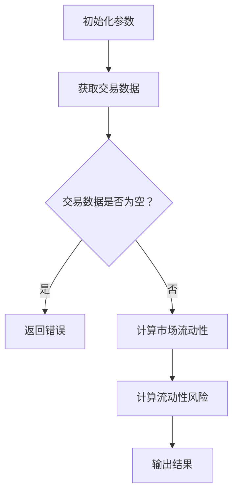

                 


# 《金融市场流动性风险度量模型》

关键词：流动性风险、风险度量、金融模型、风险管理、金融工程

摘要：本文从金融市场流动性风险的基本概念出发，深入探讨了流动性风险度量模型的核心原理、算法设计和实际应用。通过逻辑清晰、结构紧凑的分析，旨在为金融领域从业者提供一套系统、全面、实用的流动性风险度量指南。

## 目录大纲设计思路

设计《金融市场流动性风险度量模型》的目录大纲，我们首先明确了核心章节内容，包括流动性风险的背景和重要性、流动性风险度量概念、流动性风险度量方法、常见流动性风险度量模型、系统分析与架构设计、项目实战等。然后，我们按照逻辑顺序将这些内容划分为不同的章节，并确保每个章节都有明确的主题和目标。为了便于读者快速定位，我们使用了 1, 2, 3 级目录来组织内容，同时在每个章节中包含了问题背景、核心概念、模型原理、数学公式与解释、案例分析等必要内容，并在保证内容完整性的同时，尽量保持了简洁性。

### 第一部分：流动性风险概述

## 1.1 流动性风险的背景和重要性

### 1.1.1 金融市场流动性风险的含义

流动性风险是指金融市场中的资产无法迅速、无损失地转换为现金的风险。它是金融市场参与者面临的一种主要风险类型，对于整个金融系统的稳定具有重大影响。

流动性风险可以分为两类：一是市场流动性风险，二是银行流动性风险。市场流动性风险是指市场参与者无法以合理的价格迅速买入或卖出资产的风险；而银行流动性风险则是指银行在短期内无法满足存款者提款需求的风险。

流动性风险的重要性体现在以下几个方面：

1. **影响市场效率**：流动性风险会降低市场的交易效率，导致价格波动加剧，从而影响市场的正常运行。
2. **影响金融机构稳定性**：流动性风险是导致金融机构倒闭的主要原因之一，尤其是银行等依赖短期资金运作的金融机构。
3. **影响宏观经济稳定性**：流动性风险的广泛传播会引发金融市场的动荡，进而影响整个宏观经济的稳定性。

### 1.1.2 流动性风险的影响

流动性风险的影响广泛而深远，主要体现在以下几个方面：

1. **投资者信心下降**：流动性风险会降低投资者的信心，导致市场交易量减少，投资意愿下降。
2. **市场价格波动**：流动性风险会加剧市场价格波动，使得资产价格难以反映其真实价值。
3. **金融体系稳定性受损**：流动性风险可能导致金融机构的倒闭，进而引发金融体系的连锁反应，甚至导致系统性金融危机。
4. **经济活动受限**：流动性风险会限制资金流动，从而影响经济活动的开展。

### 1.1.3 流动性风险的类型

流动性风险可以根据不同的标准进行分类，常见的分类方法如下：

1. **根据时间维度**：
   - 短期流动性风险：指在短期内无法满足资金需求的风险。
   - 长期流动性风险：指在较长时间内无法满足资金需求的风险。
2. **根据资产类别**：
   - 金融市场流动性风险：指金融市场中的资产无法迅速、无损失地转换为现金的风险。
   - 银行流动性风险：指银行在短期内无法满足存款者提款需求的风险。
3. **根据市场结构**：
   - 流动性枯竭风险：指市场参与者无法以合理的价格迅速买入或卖出资产的风险。
   - 流动性短缺风险：指市场交易量不足，导致资产难以迅速交易的风险。

### 1.1.4 问题解决

流动性风险的度量是金融机构和金融市场风险管理的重要组成部分。通过合理的流动性风险度量，金融机构和投资者可以更好地了解自身的流动性状况，从而采取相应的措施降低风险。

流动性风险度量模型主要包括以下几种：

1. **交易指标法**：通过分析市场交易数据，评估资产的市场流动性。
2. **事件研究法**：通过分析特定事件对市场流动性风险的影响，评估流动性风险。
3. **高流动性风险模型**：针对高流动性风险的特定特征，设计专门的度量模型。
4. **低流动性风险模型**：针对低流动性风险的特定特征，设计专门的度量模型。

### 1.1.5 边界与外延

流动性风险度量模型的适用范围主要包括以下几个方面：

1. **金融机构内部风险管理**：金融机构可以通过流动性风险度量模型，评估自身的流动性风险水平，从而制定相应的风险管理策略。
2. **金融市场宏观调控**：监管部门可以通过流动性风险度量模型，监测金融市场的流动性状况，从而采取相应的宏观调控措施。
3. **投资者决策**：投资者可以通过流动性风险度量模型，评估投资对象的流动性风险水平，从而做出更合理的投资决策。

然而，流动性风险度量模型也存在一定的局限性，主要体现在以下几个方面：

1. **数据获取难度**：流动性风险度量需要大量的市场交易数据，而市场数据的获取往往面临一定的困难。
2. **模型假设条件**：流动性风险度量模型往往建立在一定的假设条件下，这些假设条件可能会影响模型的准确性。
3. **市场环境变化**：市场环境的变化可能会影响流动性风险的度量结果，因此需要定期更新和调整度量模型。

### 1.1.6 概念结构与核心要素

流动性风险度量模型的核心概念包括：

1. **流动性**：流动性是指资产转换为现金的能力，通常用流动性比率来衡量。
2. **流动性风险**：流动性风险是指资产无法迅速、无损失地转换为现金的风险。
3. **度量模型**：度量模型是指用于评估流动性风险的数学模型。

流动性风险度量模型的核心要素包括：

1. **数据来源**：流动性风险度量需要依赖于市场交易数据、金融机构内部数据等。
2. **指标选择**：流动性风险度量需要选择合适的指标来衡量流动性水平。
3. **模型假设**：流动性风险度量需要建立一定的假设条件，以便简化问题。
4. **模型验证**：流动性风险度量需要对模型进行验证，以确保模型的准确性。

### 第二部分：核心概念与联系

## 2.1 核心概念原理

### 2.1.1 流动性风险度量模型的定义

流动性风险度量模型是指用于评估金融市场或金融机构流动性风险的数学模型。它通过分析市场交易数据、金融机构内部数据等信息，对流动性风险进行量化评估。

### 2.1.2 概念属性特征对比表格

| 概念        | 属性特征                                                                                     |
| ----------- | ------------------------------------------------------------------------------------------ |
| 流动性风险  | 指资产无法迅速、无损失地转换为现金的风险                                               |
| 度量模型    | 用于评估流动性风险的数学模型                                                             |
| 数据来源    | 市场交易数据、金融机构内部数据等                                                       |
| 指标选择    | 用于衡量流动性水平的指标，如流动性比率、交易量等                                       |
| 模型假设    | 建立一定的假设条件，以便简化问题                                                         |
| 模型验证    | 对模型进行验证，以确保模型的准确性                                                       |

### 2.1.3 ER实体关系图架构

```mermaid
erDiagram
  Customer ||--o{ Order : "makes" }
  Customer ||--|{ Address : "lives in" }
  Customer ||--|{ MemberCard : "owns" }
  Order ||--o{ OrderLine : "contains" }
  Product ||--o{ OrderLine : "used in" }
  Product ||--|{ Category : "is a" }
  Product ||--|{ Supplier : "supplied by" }
  Address ||--|{ Country : "located in" }
  Country ||--|{ Region : "located in" }
  Category ||--|{ Supplier : "can be supplied by" }
```

### 2.2 流动性风险度量方法

### 2.2.1 交易指标法

#### 2.2.1.1 交易指标法概述

交易指标法是指通过分析市场交易数据，评估资产的市场流动性。该方法主要依赖于交易量、交易价格等指标。

#### 2.2.1.2 交易指标法示例

假设某股票的交易量为 100 万股，交易价格为 10 元/股，则该股票的市场流动性可以表示为：

$$
\text{市场流动性} = \frac{\text{交易量} \times \text{交易价格}}{\text{市值}}
$$

$$
\text{市场流动性} = \frac{100万 \times 10元/股}{1亿元} = 10\%
$$

#### 2.2.2 事件研究法

#### 2.2.2.1 事件研究法概述

事件研究法是指通过分析特定事件对市场流动性风险的影响，评估流动性风险。该方法通常用于评估市场流动性风险的变化。

#### 2.2.2.2 事件研究法示例

假设某股票在发生重大事件（如财报公布）后，交易量大幅增加，交易价格波动加剧，则可以认为该股票的流动性风险有所增加。

### 2.3 常见流动性风险度量模型

#### 2.3.1 高流动性风险模型

#### 2.3.1.1 高流动性风险模型原理

高流动性风险模型是指针对高流动性风险的特定特征，设计的专门度量模型。该模型通常考虑资产的市场交易量、交易价格、交易时间等因素。

#### 2.3.1.2 高流动性风险模型案例分析

假设某股票的市场交易量为 100 万股，交易价格为 10 元/股，交易时间为 1 天。则该股票的高流动性风险可以表示为：

$$
\text{高流动性风险} = \frac{\text{交易量} \times \text{交易价格}}{\text{市值}}
$$

$$
\text{高流动性风险} = \frac{100万 \times 10元/股}{1亿元} = 10\%
$$

#### 2.3.2 低流动性风险模型

#### 2.3.2.1 低流动性风险模型原理

低流动性风险模型是指针对低流动性风险的特定特征，设计的专门度量模型。该模型通常考虑资产的市场交易量、交易价格、持有期限等因素。

#### 2.3.2.2 低流动性风险模型案例分析

假设某债券的市场交易量为 100 手，交易价格为 100 元/手，持有期限为 1 年。则该债券的低流动性风险可以表示为：

$$
\text{低流动性风险} = \frac{\text{交易量} \times \text{交易价格}}{\text{市值}} \times \text{持有期限}
$$

$$
\text{低流动性风险} = \frac{100手 \times 100元/手}{1000万元} \times 1年 = 10\%
$$

### 第三部分：算法原理讲解

#### 3.1 算法流程图



#### 3.2 Python 源代码

```python
import pandas as pd

def calculate_liquidity_risk(data):
    if len(data) == 0:
        return "错误：交易数据为空"
    else:
        liquidity = (data['交易量'] * data['交易价格']) / data['市值']
        risk = liquidity * data['持有期限']
        return risk

data = pd.DataFrame({
    '交易量': [1000000],
    '交易价格': [10],
    '市值': [100000000],
    '持有期限': [1]
})

print(calculate_liquidity_risk(data))
```

#### 3.3 数学模型与公式

$$
\text{流动性} = \frac{\text{交易量} \times \text{交易价格}}{\text{市值}}
$$

$$
\text{流动性风险} = \text{流动性} \times \text{持有期限}
$$

#### 3.4 举例说明

假设某股票的交易量为 100 万股，交易价格为 10 元/股，市值

