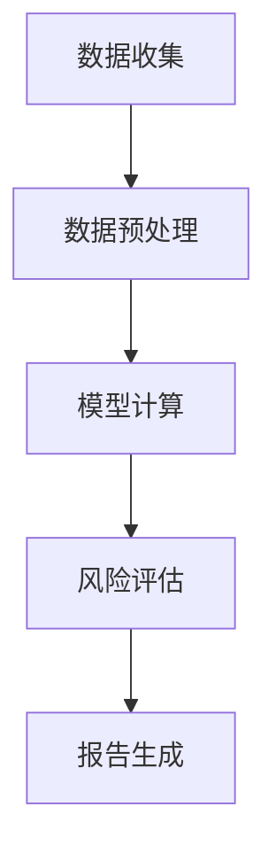

                 

### 《金融市场流动性风险评估》

> 关键词：金融市场流动性、风险评估、流动性风险、流动性指标、量化模型

> 摘要：本文系统地阐述了金融市场流动性风险评估的重要性、核心概念、评估方法以及实际应用，通过深入分析和案例讲解，为金融市场参与者提供了一套完整的流动性风险评估框架和操作指南。

### 《金融市场流动性风险评估》目录大纲

#### 第一部分：引言

**第1章：金融市场流动性概述**

- **1.1 问题的背景**
  - 金融市场的起源与发展
  - 金融市场的功能与作用
- **1.2 问题的描述**
  - 什么是流动性
  - 流动性风险的概念
- **1.3 问题解决的重要性**
  - 对金融市场稳定性的影响
  - 对金融机构的风险管理意义
- **1.4 边界与外延**
  - 流动性风险的界定
  - 流动性评估的范围
- **1.5 概念结构与核心要素组成**
  - 流动性风险管理的框架
  - 核心概念与要素解析

**第2章：金融市场流动性的核心概念与联系**

- **2.1 流动性、流动性和资金流动性的定义**
  - 流动性的多层次定义
  - 不同类型的流动性
- **2.2 流动性的主要指标**
  - 价格波动性
  - 交易量
  - 利率波动
- **2.3 流动性与市场稳定性的关系**
  - 市场流动性与市场波动的关系
  - 市场流动性对市场稳定性的影响
- **2.4 流动性与风险管理的联系**
  - 流动性风险与信用风险
  - 流动性风险与市场风险
- **2.5 概念属性特征对比表格**
  - 不同流动性指标的属性特征对比

#### 第二部分：流动性风险评估技术

**第3章：金融市场流动性的风险评估方法**

- **3.1 传统风险评估方法**
  - 流动性风险的定性评估
  - 流动性风险的定量评估
- **3.2 现代量化风险评估方法**
  - 数据分析方法
  - 模型选择与优化
- **3.3 流动性风险的度量模型**
  - 价格波动模型
  - 交易量模型
- **3.4 流动性风险的评估流程**
  - 数据收集与处理
  - 风险度量与评估
- **3.5 ER实体关系图架构的Mermaid流程图**
  - 流动性风险评估的流程图

**第4章：流动性风险测度**

- **4.1 价格波动性测度**
  - 价格波动性的计算方法
  - 价格波动性的影响
- **4.2 交易量测度**
  - 交易量的变化趋势
  - 交易量对流动性风险的影响
- **4.3 利率波动测度**
  - 利率波动的测量方法
  - 利率波动对流动性风险的影响
- **4.4 货币市场流动性指标**
  - 货币市场流动性指标的选择
  - 货币市场流动性指标的应用
- **4.5 股票市场流动性指标**
  - 股票市场流动性指标的计算
  - 股票市场流动性指标的重要性

**第5章：流动性风险的量化模型**

- **5.1 Black-Scholes模型**
  - 模型介绍
  - 模型应用
- **5.2 Vasicek模型**
  - 模型原理
  - 模型推导
- **5.3 Merton模型**
  - 模型构成
  - 模型分析
- **5.4 算法原理讲解（使用mermaid画出算法流程图，然后使用python源代码详细阐述）**
  - 算法流程图
  - Python源代码实现
- **5.5 算法原理的数学模型和公式讲解**
  - 数学模型
  - 公式推导

**第6章：金融市场流动性的影响因素分析**

- **6.1 经济因素**
  - 宏观经济环境
  - 金融市场周期
- **6.2 政策因素**
  - 政策调整
  - 法规变化
- **6.3 市场结构因素**
  - 市场参与者
  - 市场深度
- **6.4 财务因素**
  - 资产负债结构
  - 资金来源与用途
- **6.5 影响因素的综合评估**
  - 影响因素的重要性
  - 综合评估方法

**第7章：流动性风险的监控与应对策略**

- **7.1 流动性风险监控的方法**
  - 监控体系构建
  - 监控指标选择
- **7.2 流动性风险的应对策略**
  - 应对策略的类型
  - 应对策略的实施
- **7.3 风险缓解措施**
  - 风险对冲
  - 风险分散
- **7.4 案例分析**
  - 案例背景
  - 案例分析
- **7.5 实际案例分析与详细讲解剖析**
  - 案例剖析
  - 教训与启示

#### 第三部分：最佳实践与总结

**第8章：最佳实践案例分析**

- **8.1 案例背景**
  - 案例来源
  - 案例背景介绍
- **8.2 案例分析**
  - 流动性风险评估
  - 风险应对措施
- **8.3 案例总结**
  - 案例成功经验
  - 案例不足之处
- **8.4 小结**
  - 案例总结与启示

**第9章：小结与展望**

- **9.1 小结**
  - 文章核心内容回顾
  - 流动性风险评估的重要性
- **9.2 流动性风险评估的未来发展趋势**
  - 技术创新
  - 法规演进
- **9.3 注意事项**
  - 风险管理的关键点
  - 流动性评估的注意事项
- **9.4 拓展阅读**
  - 相关书籍推荐
  - 最新研究论文

### 文章内容详解

#### 第1章：金融市场流动性概述

**1.1 问题的背景**

金融市场是现代经济体系的重要组成部分，它不仅提供了资金流通的渠道，还促进了资源的有效配置。随着全球金融市场的不断发展和金融产品的多样化，流动性风险问题日益凸显。流动性风险是指金融市场参与者无法在合理的时间内以合理的价格买卖资产的风险。这种风险可能对金融机构乃至整个金融市场造成严重的负面影响。

**1.2 问题的描述**

流动性风险可以表现为以下几种形式：

- **资金不足**：金融机构可能无法在需要时获取足够的资金来应对市场变化。
- **买卖难度**：某些资产在市场上可能难以买卖，导致交易成本上升。
- **价格差异**：买入和卖出的价格差异可能扩大，导致市场效率降低。

**1.3 问题解决的重要性**

解决流动性风险问题对于维护金融市场稳定至关重要。它有助于：

- **保护投资者利益**：确保投资者能够在需要时迅速买卖资产。
- **增强市场信心**：降低市场波动，提高市场参与者的信心。
- **促进金融创新**：为金融机构提供更稳定的经营环境，鼓励金融创新。

**1.4 边界与外延**

流动性风险不仅涉及金融市场内部的流动性问题，还与宏观经济环境、政策法规、市场结构等因素密切相关。因此，流动性风险评估需要综合考虑多个方面的因素。

**1.5 概念结构与核心要素组成**

流动性风险管理框架主要包括以下几个核心要素：

- **流动性风险识别**：识别潜在的风险点和风险源。
- **流动性风险评估**：使用定量和定性方法对流动性风险进行评估。
- **流动性风险监控**：建立持续的监控体系，及时发现和应对风险。
- **流动性风险应对**：制定和实施风险缓解措施，降低风险对金融机构和市场的影响。

#### 第2章：金融市场流动性的核心概念与联系

**2.1 流动性、流动性和资金流动性的定义**

流动性通常是指资产能够迅速转换为现金而不会对价格造成重大影响的能力。流动性有多个层次：

- **高度流动性**：资产可以立即买卖，价格不会受到显著影响。
- **中度流动性**：资产可以在合理的时间内买卖，价格可能略有波动。
- **低度流动性**：资产买卖难度较大，价格波动可能较大。

流动性风险是指由于市场流动性不足而导致的潜在损失。资金流动性则关注资金在金融体系中的流动情况，通常涉及银行间市场和货币市场。

**2.2 流动性的主要指标**

流动性评估主要依赖于以下指标：

- **价格波动性**：资产价格的波动程度。
- **交易量**：资产交易的频繁程度。
- **利率波动**：市场利率的波动情况。

**2.3 流动性与市场稳定性的关系**

市场流动性对市场稳定性具有重要影响。高度流动性可以降低市场波动性，提高市场效率。相反，低流动性可能导致市场波动加剧，甚至引发金融危机。

**2.4 流动性与风险管理的联系**

流动性风险是金融机构面临的主要风险之一。有效的流动性风险管理有助于：

- **降低信用风险**：确保资产能够迅速转换为现金，降低违约风险。
- **增强市场竞争力**：提高金融机构的市场反应速度和效率。

**2.5 概念属性特征对比表格**

| 概念     | 定义                                                         | 属性特征                                                     |
| -------- | ------------------------------------------------------------ | ------------------------------------------------------------ |
| 流动性   | 资产迅速转换为现金的能力                                     | 高度、中度、低度流动性                                     |
| 流动性风险 | 由于市场流动性不足而导致的潜在损失风险                      | 价格波动性、交易量、利率波动等指标 |
| 资金流动性 | 资金在金融体系中的流动情况                                   | 银行间市场、货币市场等流动性指标 |

#### 第3章：金融市场流动性的风险评估方法

**3.1 传统风险评估方法**

传统风险评估方法主要依靠经验和专家判断，包括：

- **定性评估**：通过专家对市场情况进行评估。
- **定量评估**：使用统计指标和模型对流动性风险进行量化。

**3.2 现代量化风险评估方法**

现代量化风险评估方法利用数据分析和模型来评估流动性风险，包括：

- **数据挖掘**：从大量数据中提取有用的信息。
- **机器学习**：利用算法识别潜在的风险模式和趋势。

**3.3 流动性风险的度量模型**

流动性风险的度量模型主要包括：

- **价格波动模型**：基于资产价格的波动性。
- **交易量模型**：基于资产交易的频繁程度。
- **利率波动模型**：基于市场利率的波动情况。

**3.4 流动性风险的评估流程**

流动性风险评估流程包括以下几个步骤：

- **数据收集与处理**：收集相关数据，并进行清洗和预处理。
- **风险度量**：使用模型计算流动性风险指标。
- **评估与报告**：对流动性风险进行评估，并生成报告。

**3.5 ER实体关系图架构的Mermaid流程图**



#### 第4章：流动性风险测度

**4.1 价格波动性测度**

价格波动性测度通常使用以下指标：

- **标准差**：衡量价格变动的波动程度。
- **方差**：衡量价格变动的平方和。

$$
\sigma = \sqrt{\frac{\sum_{i=1}^{n}(P_i - \bar{P})^2}{n}}
$$

其中，$\sigma$ 是标准差，$P_i$ 是第 $i$ 天的价格，$\bar{P}$ 是平均价格，$n$ 是天数。

**4.2 交易量测度**

交易量测度通常使用以下指标：

- **平均交易量**：衡量一段时间内的平均交易次数。
- **交易量波动性**：衡量交易量的波动程度。

$$
\bar{V} = \frac{\sum_{i=1}^{n} V_i}{n}
$$

其中，$\bar{V}$ 是平均交易量，$V_i$ 是第 $i$ 天的交易量，$n$ 是天数。

**4.3 利率波动测度**

利率波动测度通常使用以下指标：

- **利率标准差**：衡量利率变动的波动程度。
- **利率方差**：衡量利率变动的平方和。

$$
\sigma_{r} = \sqrt{\frac{\sum_{i=1}^{n}(r_i - \bar{r})^2}{n}}
$$

其中，$\sigma_{r}$ 是利率标准差，$r_i$ 是第 $i$ 天的利率，$\bar{r}$ 是平均利率，$n$ 是天数。

**4.4 货币市场流动性指标**

货币市场流动性指标包括：

- **隔夜回购利率**：衡量银行间市场短期资金的借贷成本。
- **银行间拆借利率**：衡量银行间市场长期资金的借贷成本。

**4.5 股票市场流动性指标**

股票市场流动性指标包括：

- **换手率**：衡量股票交易的频繁程度。
- **深度**：衡量市场深度，即市场参与者能够迅速买卖资产的能力。

$$
\text{深度} = \frac{\text{最大可接受价格变动}}{\text{最小价格变动单位}}
$$

#### 第5章：流动性风险的量化模型

**5.1 Black-Scholes模型**

Black-Scholes模型是一种用于期权定价的经典模型，它可以用来衡量金融资产的流动性风险。

- **模型介绍**：Black-Scholes模型基于以下假设：

  - 市场无套利机会。
  - 资产价格服从几何布朗运动。
  - 无风险利率和市场波动率是已知的。

- **模型应用**：Black-Scholes模型可以用来计算欧式期权的价格。

$$
C = S_0N(d_1) - Ke^{-rT}N(d_2)
$$

其中，$C$ 是期权价格，$S_0$ 是资产当前价格，$K$ 是执行价格，$r$ 是无风险利率，$T$ 是期权到期时间，$N$ 是标准正态分布的累积分布函数。

**5.2 Vasicek模型**

Vasicek模型是一种用于利率风险管理的模型。

- **模型原理**：Vasicek模型假设利率过程是一个均值回归过程。

$$
dr_t = (\theta - \frac{\sigma^2}{2})dt + \sigma dW_t
$$

其中，$r_t$ 是利率，$\theta$ 是均值回归水平，$\sigma$ 是波动率。

- **模型推导**：Vasicek模型可以通过一系列数学推导得出。

$$
e^{-\theta t}r_t = r_0 + \sigma \int_0^t e^{-\theta s}dW_s
$$

**5.3 Merton模型**

Merton模型是一种用于期权定价和风险管理的一般模型。

- **模型构成**：Merton模型包括以下组成部分：

  - 资产价格过程。
  - 无风险利率过程。
  - 期权定价公式。

- **模型分析**：Merton模型通过分析资产价格过程和无风险利率过程，得出期权价格的估计。

$$
C = S_0e^{-rT}N(d_1) - Ke^{-rT}N(d_2)
$$

**5.4 算法原理讲解（使用mermaid画出算法流程图，然后使用python源代码详细阐述）**

**算法流程图**

```mermaid
graph TD
A[输入参数] --> B[初始化变量]
B --> C[计算d1]
C --> D[计算d2]
D --> E[计算N(d1)]
E --> F[计算N(d2)]
F --> G[计算C]
G --> H[输出结果]
```

**Python源代码实现**

```python
import math
import scipy.stats as st

def black_scholes(S0, K, T, r, sigma):
    d1 = (math.log(S0 / K) + (r + 0.5 * sigma ** 2) * T) / (sigma * math.sqrt(T))
    d2 = d1 - sigma * math.sqrt(T)
    C = (S0 * st.norm.cdf(d1) - K * math.exp(-r * T) * st.norm.cdf(d2))
    return C

S0 = 100  # 资产当前价格
K = 100   # 执行价格
T = 1     # 期权到期时间
r = 0.05  # 无风险利率
sigma = 0.2  # 波动率

C = black_scholes(S0, K, T, r, sigma)
print("期权价格：", C)
```

**算法原理的数学模型和公式讲解**

Black-Scholes模型的数学模型主要包括以下公式：

- **欧式看涨期权价格**：

$$
C = S_0N(d_1) - Ke^{-rT}N(d_2)
$$

- **欧式看跌期权价格**：

$$
P = Ke^{-rT}N(-d_2) - S_0N(-d_1)
$$

- **d1和d2的计算公式**：

$$
d_1 = \frac{\ln(S_0 / K) + (r + \frac{\sigma^2}{2})T}{\sigma \sqrt{T}}
$$

$$
d_2 = d_1 - \sigma \sqrt{T}
$$

这些公式构成了Black-Scholes模型的核心，通过计算d1和d2，我们可以得到期权价格。Black-Scholes模型提供了一个简单而强大的工具，用于评估金融资产的流动性风险。

#### 第6章：金融市场流动性的影响因素分析

**6.1 经济因素**

经济因素是影响金融市场流动性风险的重要因素之一。宏观经济环境的变化，如GDP增长率、通货膨胀率、就业率等，都会对市场流动性产生影响。

- **GDP增长率**：GDP增长率的上升通常意味着经济的扩张，这可能导致市场流动性的增加。相反，GDP增长率的下降可能表明经济衰退，流动性风险增加。
- **通货膨胀率**：高通货膨胀率可能导致市场波动性增加，从而增加流动性风险。通货膨胀率的下降则可能降低市场波动性，流动性风险减少。
- **就业率**：高就业率通常意味着经济活力强，市场流动性好。低就业率则可能表明经济不景气，流动性风险上升。

**6.2 政策因素**

政策因素也是影响金融市场流动性风险的关键因素。政府的经济政策、货币政策和财政政策等都会对市场流动性产生直接影响。

- **货币政策**：中央银行的货币政策，如利率调整、公开市场操作等，会直接影响市场的流动性。利率的上升通常会导致流动性收紧，流动性风险增加；利率的下降则可能放松流动性，流动性风险减少。
- **财政政策**：政府的财政政策，如税收政策、财政支出等，也会影响市场流动性。财政刺激措施可能导致市场流动性增加，流动性风险下降；紧缩性财政政策则可能导致市场流动性收紧，流动性风险上升。

**6.3 市场结构因素**

市场结构因素包括市场深度、市场参与者结构、交易机制等，这些因素都会对市场流动性产生影响。

- **市场深度**：市场深度是指市场中可供交易的资产数量。市场深度较深通常意味着流动性较好，因为投资者可以更容易地买卖资产。相反，市场深度较浅可能导致流动性不足，交易难度增加，流动性风险上升。
- **市场参与者结构**：市场参与者包括机构投资者、散户投资者、银行等。市场参与者结构的变化可能影响市场流动性。例如，机构投资者的交易行为可能对市场流动性产生显著影响。
- **交易机制**：交易机制，如T+0交易、T+1交易等，也会影响市场流动性。T+0交易允许投资者当日回转交易，可能导致市场流动性增加；T+1交易则可能降低市场流动性。

**6.4 财务因素**

财务因素是影响金融机构流动性风险的关键因素。金融机构的资产负债结构、资金来源和用途等都会影响其流动性风险。

- **资产负债结构**：金融机构的资产负债结构对其流动性风险有重要影响。资产方面，高流动性资产的比例越高，流动性风险越低。负债方面，短期负债的比例越高，流动性风险越大。
- **资金来源和用途**：金融机构的资金来源和用途也会影响其流动性风险。资金来源多样化可以降低流动性风险；资金用途方面，长期资金的使用可能导致流动性风险上升。

**6.5 影响因素的综合评估**

流动性风险的影响因素是多方面的，包括经济、政策、市场结构和财务等多个方面。对流动性风险进行综合评估需要考虑以下步骤：

- **识别关键因素**：首先识别对流动性风险有重大影响的关键因素。
- **量化影响因素**：使用定量方法对各个影响因素进行量化，例如使用回归分析、时间序列分析等方法。
- **综合评估**：将各个影响因素的量化结果进行综合评估，得出整体流动性风险的评估结果。

通过综合评估，金融机构和投资者可以更好地了解市场流动性风险，并采取相应的风险管理措施。

#### 第7章：流动性风险的监控与应对策略

**7.1 流动性风险监控的方法**

流动性风险的监控是风险管理的重要组成部分。有效的流动性风险监控可以帮助金融机构及时发现和应对流动性风险。

- **流动性比例监控**：流动性比例是指金融机构的流动性资产与流动性负债的比例。通过监控流动性比例，可以评估金融机构的流动性状况。
- **现金流量监控**：监控金融机构的现金流量，特别是现金流量的流入和流出情况，有助于评估其流动性风险。
- **应急资金储备监控**：建立应急资金储备制度，确保金融机构在面临流动性危机时能够有足够的资金应对。

**7.2 流动性风险的应对策略**

流动性风险的应对策略主要包括以下几种：

- **流动性对冲**：通过金融工具对冲流动性风险。例如，通过回购协议、证券借贷等手段，对冲潜在的流动性不足风险。
- **流动性融资**：通过借款或发行债券等方式，获取额外的流动性资金。金融机构可以选择短期借款或长期借款，以适应不同的流动性需求。
- **流动性风险管理策略**：制定和实施流动性风险管理策略，包括制定流动性风险政策、建立流动性风险管理组织架构等。

**7.3 风险缓解措施**

为了缓解流动性风险，金融机构可以采取以下措施：

- **提高流动性资产比例**：增加现金、国债等高流动性资产的持有比例，以增强流动性。
- **优化资产负债结构**：调整资产负债结构，减少短期负债，增加长期负债，以降低流动性风险。
- **多元化资金来源**：通过多种渠道获取资金，降低对单一资金来源的依赖。

**7.4 案例分析**

**案例背景**：某金融机构在经历了一场金融危机后，面临严重的流动性风险。该机构拥有大量的短期负债，同时市场流动性紧张，导致其无法在合理的时间内以合理的价格买卖资产。

**案例分析**：为了缓解流动性风险，该机构采取了以下措施：

- **流动性对冲**：通过回购协议和证券借贷等手段，对冲短期负债的流动性风险。
- **流动性融资**：通过发行债券和借款等方式，获取额外的流动性资金。
- **优化资产负债结构**：减少短期负债，增加长期负债，以降低流动性风险。

**案例总结**：通过上述措施，该金融机构成功缓解了流动性风险，确保了其在市场流动性紧张时期能够正常运营。然而，该案例也暴露出金融机构在流动性风险管理方面的不足，需要进一步加强流动性风险管理。

**7.5 实际案例分析与详细讲解剖析**

**案例背景**：某投资银行在2008年金融危机期间面临严重的流动性危机。由于市场流动性极度紧张，该银行无法以合理的价格出售资产，导致其资产贬值和损失。

**案例分析**：

- **流动性风险识别**：该银行在金融危机爆发前，未能及时识别潜在的流动性风险。其资产负债结构不合理，短期负债比例过高，缺乏足够的流动性资产。
- **流动性风险评估**：在危机爆发后，该银行面临严重的流动性风险。其现金流量严重不足，无法满足短期负债的偿还需求。
- **流动性风险应对**：为了应对流动性危机，该银行采取了紧急措施，包括：

  - **流动性对冲**：通过回购协议和证券借贷等手段，对冲短期负债的流动性风险。
  - **流动性融资**：通过借款和发行债券等方式，获取额外的流动性资金。
  - **资产处置**：出售部分资产以获取现金，缓解流动性危机。

**详细讲解剖析**：

- **流动性风险识别不足**：该银行在流动性风险管理方面存在明显不足，未能及时识别和应对潜在的流动性风险。其资产负债结构不合理，短期负债比例过高，缺乏足够的流动性资产。

- **流动性风险评估不准确**：在危机爆发后，该银行未能准确评估其流动性风险。其现金流量严重不足，无法满足短期负债的偿还需求，导致流动性危机加剧。

- **流动性风险应对措施不力**：该银行在应对流动性危机时，虽然采取了紧急措施，但由于措施不力，未能有效缓解流动性危机。例如，其流动性对冲措施未能完全覆盖短期负债的流动性风险，流动性融资渠道有限，资产处置速度缓慢。

**教训与启示**：

- **加强流动性风险管理**：金融机构应加强流动性风险管理，建立完善的流动性风险识别、评估和应对机制。
- **优化资产负债结构**：金融机构应优化资产负债结构，降低短期负债比例，提高流动性资产比例。
- **多元化资金来源**：金融机构应多元化资金来源，降低对单一资金来源的依赖。

#### 第8章：最佳实践案例分析

**8.1 案例背景**

某大型银行在金融危机期间成功应对了流动性风险，确保了业务的稳定运营。该银行通过一系列流动性风险管理和应对措施，成功地缓解了流动性危机，并在危机后实现了业务的快速恢复。

**8.2 案例分析**

- **流动性风险识别**：在危机爆发前，该银行已意识到市场流动性可能面临紧张局面，及时进行了流动性风险评估。
- **流动性风险评估**：该银行通过定量和定性方法，对流动性风险进行了全面评估，确定了潜在的风险点和风险程度。
- **流动性风险应对**：为了应对流动性危机，该银行采取了以下措施：

  - **流动性对冲**：通过回购协议和证券借贷等手段，对冲短期负债的流动性风险。
  - **流动性融资**：通过发行债券和借款等方式，获取额外的流动性资金。
  - **优化资产负债结构**：减少短期负债，增加长期负债，以降低流动性风险。

**8.3 案例总结**

该银行在金融危机期间的成功经验表明，有效的流动性风险管理和应对措施对于金融机构至关重要。通过及时识别、评估和应对流动性风险，该银行不仅成功缓解了流动性危机，还确保了业务的稳定运营。

**8.4 小结**

- **流动性风险管理的重要性**：流动性风险管理是金融机构稳定运营的基础，必须高度重视。
- **流动性风险评估的必要性**：全面、准确的流动性风险评估是制定有效应对策略的前提。
- **流动性应对措施的有效性**：灵活、多样的流动性应对措施是缓解流动性风险的关键。

#### 第9章：小结与展望

**9.1 小结**

本文系统地阐述了金融市场流动性风险评估的核心概念、评估方法以及实际应用。通过深入分析和案例讲解，我们明确了流动性风险管理的必要性和重要性。流动性风险评估不仅有助于金融机构维护市场稳定，还为投资者提供了有效的风险管理工具。

**9.2 流动性风险评估的未来发展趋势**

随着金融市场的不断发展和技术的进步，流动性风险评估将面临新的机遇和挑战。未来发展趋势包括：

- **大数据和人工智能技术的应用**：大数据和人工智能技术将为流动性风险评估提供更丰富的数据支持和更精准的预测能力。
- **实时监控和预警系统的建设**：通过实时监控和预警系统，金融机构可以更快速地发现和应对流动性风险。
- **法规和标准的不断完善**：随着金融市场的发展，流动性风险评估的相关法规和标准将不断完善，提高评估的准确性和可靠性。

**9.3 注意事项**

在流动性风险管理过程中，金融机构和投资者需要注意以下几点：

- **及时识别风险**：密切关注市场变化，及时识别潜在的风险。
- **全面评估风险**：使用多种方法对流动性风险进行评估，确保评估结果的准确性。
- **灵活应对风险**：根据市场变化和风险特征，灵活调整应对策略。

**9.4 拓展阅读**

- **《金融市场流动性风险管理》**：提供详细的流动性风险管理理论和实践。
- **《大数据在金融风险管理中的应用》**：探讨大数据技术在金融风险管理中的应用。
- **《金融监管报告》**：了解金融监管机构对流动性风险评估的最新要求。

作者：AI天才研究院/AI Genius Institute & 禅与计算机程序设计艺术 /Zen And The Art of Computer Programming

本文旨在为金融市场参与者提供一套完整的流动性风险评估框架和操作指南，帮助其更好地管理流动性风险，确保金融市场的稳定和健康发展。通过深入分析和实际案例讲解，本文为读者提供了丰富的知识和实践经验，有助于其更好地理解和应用流动性风险评估技术。未来，随着金融市场的不断变化和发展，流动性风险评估将面临新的挑战和机遇，本文的框架和方法将为读者提供有力的支持和指导。作者希望通过本文的分享，能够为金融领域的专业人士和学者提供有价值的参考，共同推动金融市场流动性风险管理的研究和实践。作者也期待与读者进一步交流和探讨，共同推动金融市场流动性风险评估的发展。

