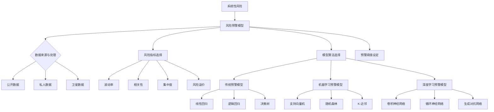
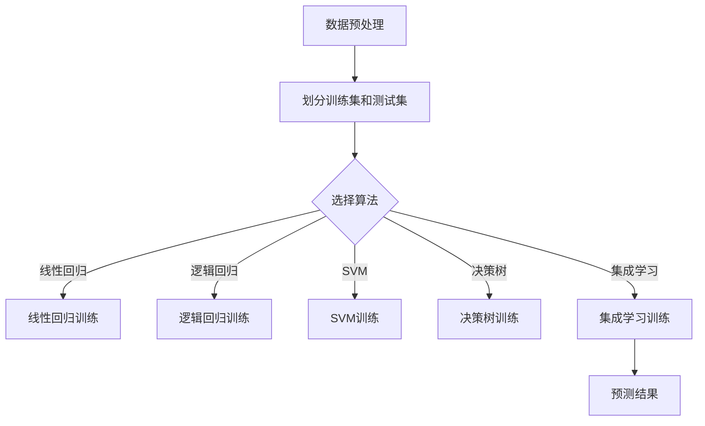
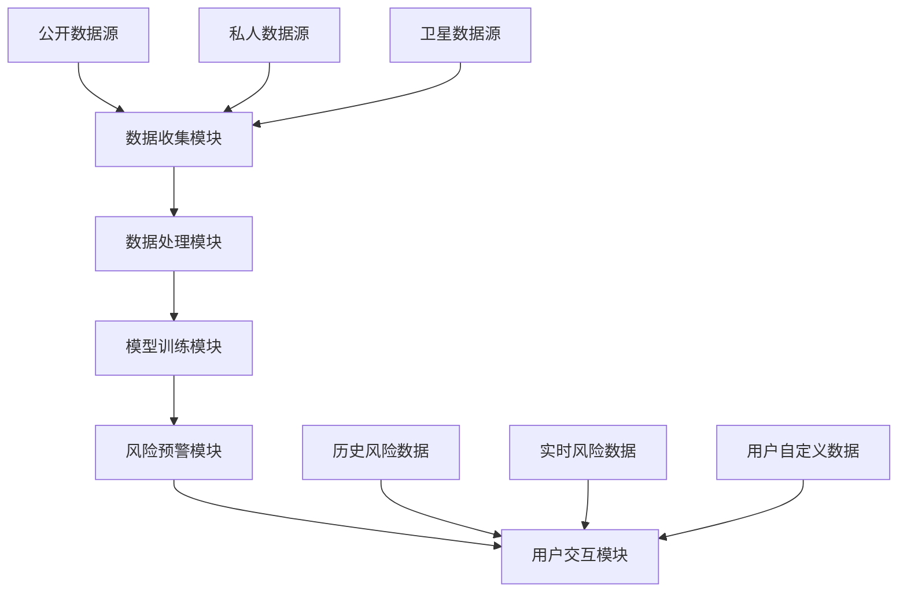
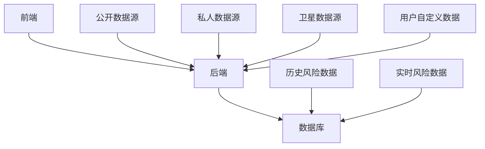
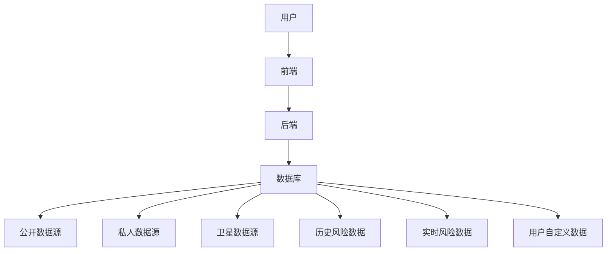
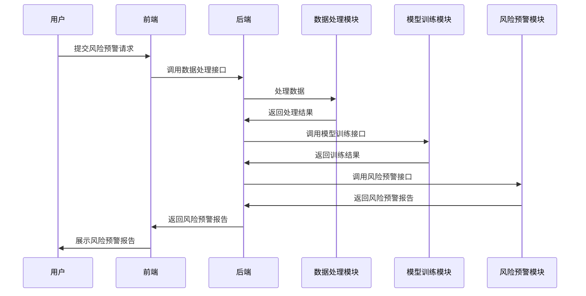

                 

### 《金融市场系统性风险预警模型》

#### 关键词：
- 金融市场
- 系统性风险
- 预警模型
- 机器学习
- 深度学习

#### 摘要：
本文探讨了金融市场系统性风险的预警模型，分析了其背景与重要性。首先，阐述了系统性风险的定义、特征及其对金融市场的影响。接着，介绍了风险预警模型的构成要素，包括数据来源、风险指标、模型算法和预警阈值。然后，详细讨论了各类预警模型，包括传统预警模型和机器学习、深度学习预警模型。通过实例，讲解了算法原理和数学模型，并设计了一个系统架构，包括系统功能、架构设计、接口设计及交互设计。最后，通过一个实际项目展示了预警模型的实现和应用，分析了项目实战中的关键步骤和注意事项，提出了最佳实践建议。文章旨在为金融行业从业者提供一个系统性风险预警的参考框架。

---

## 第一部分：引言

### 1.1 问题背景与重要性

#### 1.1.1 金融市场的现状

金融市场是全球经济运行的枢纽，其稳定运行对于国家经济安全和全球金融稳定至关重要。近年来，随着金融市场的日益复杂化和全球化，金融市场系统性风险成为一个日益突出的课题。系统性风险是指由于金融市场内某些关键节点或因素的异常波动，可能引发整个市场的崩溃或重大动荡，导致严重的经济和社会影响。例如，2008年的全球金融危机就是由于金融市场系统性风险引发的，造成了全球经济的巨大冲击。

#### 1.1.2 系统性风险的危害

系统性风险具有传染性、累积性和难以预见性，其危害主要体现在以下几个方面：

- **经济影响**：系统性风险可能导致金融市场崩溃，进而引发经济衰退，影响国家的经济增长和社会稳定。
- **社会影响**：金融市场的动荡可能引发社会不安，加剧社会矛盾，影响社会和谐。
- **政治影响**：金融市场的系统性风险可能对政府的财政和货币政策产生挑战，影响政府的公信力和政治稳定性。

#### 1.1.3 预警模型的意义

构建金融市场系统性风险预警模型具有重要的现实意义：

- **防范风险**：预警模型可以帮助金融市场参与者提前识别潜在风险，采取有效措施防范和化解风险，避免系统性危机的发生。
- **决策支持**：预警模型可以为政策制定者提供科学依据，优化政策制定和执行，提高金融监管的有效性。
- **风险管理**：预警模型可以为企业提供风险管理的工具，帮助企业制定风险管理策略，降低经营风险。

### 1.2 问题描述

#### 1.2.1 风险因素的识别

识别金融市场系统性风险的关键因素是构建预警模型的第一步。这些风险因素包括：

- **宏观经济因素**：如GDP增长率、失业率、通货膨胀率等。
- **市场流动性**：如市场交易量、利率、货币供应量等。
- **金融机构的杠杆率**：金融机构的资本充足率和杠杆率是影响其抗风险能力的重要因素。
- **金融衍生品市场**：金融衍生品的交易量和杠杆率可能放大市场波动，增加系统性风险。
- **国际金融市场**：全球金融市场的波动和跨国资本流动可能影响国内金融市场的稳定性。

#### 1.2.2 风险指标的选取

在识别风险因素后，需要选择合适的指标来量化这些风险因素。常用的风险指标包括：

- **波动率**：衡量金融市场波动程度的指标，如日收益率的波动率。
- **相关性**：衡量不同金融市场或资产之间关联程度的指标，如相关系数。
- **集中度**：衡量金融市场某些关键节点集中程度的指标，如金融机构的资产集中度。
- **风险溢价**：衡量市场风险补偿程度的指标，如信用利差。

#### 1.2.3 预警模型的构建目标

构建金融市场系统性风险预警模型的目标是：

- **实时监测**：实时监测金融市场的变化，及时发现潜在的风险信号。
- **风险评估**：对市场风险进行定量评估，确定风险的严重程度。
- **预警机制**：建立预警机制，在风险达到一定程度时及时发出预警信号，提醒市场参与者采取应对措施。
- **反馈机制**：建立反馈机制，对预警模型的有效性进行评估和优化，不断提高预警的准确性。

### 1.3 研究方法与框架

#### 1.3.1 理论基础

构建金融市场系统性风险预警模型的理论基础包括金融学、统计学、机器学习和深度学习等领域。金融学提供了金融市场运行的基本原理和风险管理的框架；统计学提供了数据分析和风险度量方法；机器学习和深度学习提供了构建智能预警模型的技术手段。

#### 1.3.2 数据来源与处理

构建预警模型需要大量高质量的金融市场数据，数据来源包括：

- **公开数据**：如宏观经济数据、金融市场交易数据等，可以从国家统计局、证券交易所等官方渠道获取。
- **私人数据**：如金融机构内部数据、交易数据等，需要通过合法途径获取。
- **卫星数据**：如金融交易卫星数据，可以提供更详细和实时的市场信息。

在数据处理方面，需要进行以下步骤：

- **数据清洗**：去除重复、错误和缺失的数据，保证数据质量。
- **数据整合**：将不同来源的数据进行整合，构建统一的数据集。
- **特征工程**：提取数据中的有效特征，为模型训练提供支持。

#### 1.3.3 预警模型的方法选择

在构建预警模型时，可以选择以下几种方法：

- **传统预警模型**：如线性回归、逻辑回归、决策树等，适用于简单数据的分析。
- **机器学习预警模型**：如支持向量机、随机森林、K-近邻等，适用于处理大规模数据。
- **深度学习预警模型**：如卷积神经网络、循环神经网络、生成对抗网络等，适用于处理复杂数据。

选择何种方法需要根据具体问题和数据特点进行综合考虑。

#### 1.4 边界与外延

#### 1.4.1 预警模型的应用场景

预警模型可以在以下场景中应用：

- **金融市场监管**：监管机构可以使用预警模型监测市场风险，防范系统性风险。
- **金融机构风险管理**：金融机构可以使用预警模型评估自身风险，制定风险管理策略。
- **投资决策支持**：投资者可以使用预警模型评估市场风险，为投资决策提供参考。

#### 1.4.2 模型的有效性评估

评估预警模型的有效性需要考虑以下几个方面：

- **准确性**：模型预测结果与实际结果的符合程度。
- **敏感性**：模型对市场变化的响应程度。
- **特异性**：模型对非风险事件的识别能力。

#### 1.4.3 模型的局限性

预警模型存在以下局限性：

- **数据依赖性**：预警模型的准确性依赖于数据的质量和数量。
- **模型适应性**：模型可能无法适应市场环境的变化。
- **预警滞后性**：预警模型可能存在一定的滞后性，无法及时发出预警信号。

#### 1.5 本书结构安排

#### 1.5.1 内容概述

本书分为五个部分，首先介绍了金融市场系统性风险的背景和重要性，然后分析了预警模型的构成要素和方法，接着讲解了算法原理和数学模型，最后展示了系统架构设计和项目实战。通过这些内容，旨在为读者提供一个全面、深入的金融市场系统性风险预警模型构建指南。

#### 1.5.2 每章重点内容

- **第一部分**：引言，介绍问题背景、风险因素识别、预警模型的目标和方法。
- **第二部分**：核心概念与联系，讨论系统性风险的定义、特征、预警模型的构成要素和类型。
- **第三部分**：算法原理与数学模型，讲解机器学习、深度学习算法原理和数学模型。
- **第四部分**：系统分析与架构设计，介绍系统功能、架构、接口和交互设计。
- **第五部分**：项目实战，展示预警模型的实际应用和项目实施过程。

---

## 第二部分：核心概念与联系

### 2.1 系统性风险的定义与特征

#### 2.1.1 系统性风险的概念

系统性风险（Systemic Risk）是指金融市场或整个金融系统面临的潜在威胁，这种威胁可能引发广泛的金融不稳定，导致金融市场崩溃或重大动荡。系统性风险通常不是由单一事件或因素引起的，而是由于多个因素相互作用、叠加而引发的。

#### 2.1.2 系统性风险的特征

1. **传染性**：系统性风险可以通过金融市场迅速传播，影响整个金融系统。
2. **累积性**：系统性风险可能在长时间内累积，不易被察觉。
3. **难以预见性**：系统性风险往往难以预测，即使是在高度发达的市场经济体系中。
4. **复杂性和多样性**：系统性风险可能涉及多个市场、多个国家和地区，表现形式多样。

#### 2.1.3 系统性风险的影响

1. **经济影响**：系统性风险可能导致金融市场崩溃，进而引发经济衰退，影响国家的经济增长和社会稳定。
2. **社会影响**：金融市场的动荡可能引发社会不安，加剧社会矛盾，影响社会和谐。
3. **政治影响**：金融市场的系统性风险可能对政府的财政和货币政策产生挑战，影响政府的公信力和政治稳定性。

### 2.2 风险预警模型的构成要素

#### 2.2.1 数据来源与处理

构建预警模型的第一步是收集和处理数据。数据来源可以包括：

1. **公开数据**：如宏观经济数据、金融市场交易数据等，可以从国家统计局、证券交易所等官方渠道获取。
2. **私人数据**：如金融机构内部数据、交易数据等，需要通过合法途径获取。
3. **卫星数据**：如金融交易卫星数据，可以提供更详细和实时的市场信息。

数据处理包括以下步骤：

1. **数据清洗**：去除重复、错误和缺失的数据，保证数据质量。
2. **数据整合**：将不同来源的数据进行整合，构建统一的数据集。
3. **特征工程**：提取数据中的有效特征，为模型训练提供支持。

#### 2.2.2 风险指标的选择

风险指标是预警模型的核心组成部分，用于量化金融市场中的风险因素。常用的风险指标包括：

1. **波动率**：衡量金融市场波动程度的指标，如日收益率的波动率。
2. **相关性**：衡量不同金融市场或资产之间关联程度的指标，如相关系数。
3. **集中度**：衡量金融市场某些关键节点集中程度的指标，如金融机构的资产集中度。
4. **风险溢价**：衡量市场风险补偿程度的指标，如信用利差。

选择合适的风险指标需要考虑以下因素：

1. **指标的含义和适用性**：指标是否能够准确反映金融市场中的风险因素。
2. **指标的可用性和实时性**：指标是否易于获取，是否能够实时更新。
3. **指标的敏感性和特异性**：指标是否能够敏感地捕捉到市场风险的变化，是否能够准确区分风险事件和非风险事件。

#### 2.2.3 模型算法的选择

预警模型的算法选择取决于数据特征和预警目标。常用的模型算法包括：

1. **传统预警模型**：如线性回归、逻辑回归、决策树等，适用于简单数据的分析。
2. **机器学习预警模型**：如支持向量机、随机森林、K-近邻等，适用于处理大规模数据。
3. **深度学习预警模型**：如卷积神经网络、循环神经网络、生成对抗网络等，适用于处理复杂数据。

选择合适的算法需要考虑以下因素：

1. **模型的性能**：模型在训练集和测试集上的性能是否良好，是否能有效预测风险。
2. **模型的复杂度**：模型的结构是否简单，是否易于解释和理解。
3. **模型的适应性**：模型是否能够适应不同的市场环境和数据特征。

#### 2.2.4 预警阈值的设定

预警阈值的设定是预警模型的关键环节，预警阈值过高可能导致误报，过低可能导致漏报。设定预警阈值需要考虑以下因素：

1. **历史数据**：分析历史数据中的风险事件，确定合理的预警阈值。
2. **风险因素**：根据不同的风险因素设定相应的预警阈值。
3. **市场环境**：考虑当前市场环境的特点，动态调整预警阈值。

#### 2.3 系统性风险预警模型的类型

#### 2.3.1 传统预警模型

传统预警模型主要包括线性回归、逻辑回归和决策树等。这些模型的基本原理是利用历史数据建立预测模型，然后根据预测结果判断是否存在风险。

1. **线性回归**：线性回归模型通过拟合历史数据中的线性关系，预测未来风险。
2. **逻辑回归**：逻辑回归模型用于分类问题，将风险事件的发生概率作为预测目标。
3. **决策树**：决策树模型通过构建决策树，根据历史数据划分风险区域。

传统预警模型的优点在于简单易懂、易于实现，但缺点在于对复杂数据的处理能力有限，预测准确性较低。

#### 2.3.2 机器学习预警模型

机器学习预警模型利用机器学习算法从大量数据中自动提取特征和模式，提高预警的准确性和适应性。

1. **支持向量机**（SVM）：SVM通过构建最优超平面，将不同风险类别分开。
2. **随机森林**：随机森林通过构建多棵决策树，利用集成学习提高预测准确性。
3. **K-近邻**（KNN）：KNN通过计算新数据与训练数据的相似度，预测新数据的类别。

机器学习预警模型的优点在于能够处理大规模数据，提高预测准确性，但缺点在于模型复杂度较高，解释性较差。

#### 2.3.3 深度学习预警模型

深度学习预警模型通过多层神经网络从复杂数据中自动提取特征，具有强大的非线性建模能力。

1. **卷积神经网络**（CNN）：CNN适用于处理图像和时序数据，通过卷积操作提取特征。
2. **循环神经网络**（RNN）：RNN适用于处理序列数据，通过记忆机制捕捉长期依赖关系。
3. **生成对抗网络**（GAN）：GAN通过生成器和判别器的对抗训练，提高模型的泛化能力。

深度学习预警模型的优点在于能够处理复杂数据，提高预测准确性，但缺点在于模型训练时间长、计算资源需求高。

#### 2.4 核心概念联系图

为了更好地理解系统性风险预警模型的核心概念，下面是一个简化的核心概念联系图：



通过这个联系图，我们可以清晰地看到系统性风险预警模型的各个核心概念及其相互关系。

---

## 第三部分：算法原理与数学模型

### 3.1 算法原理概述

#### 3.1.1 机器学习算法

机器学习算法是一种让计算机从数据中学习并做出预测或决策的技术。机器学习算法可以分为以下几类：

1. **监督学习**：监督学习算法在训练阶段使用带有标签的数据，通过学习输入和输出之间的映射关系，实现预测目标。常见的监督学习算法包括线性回归、逻辑回归、决策树、支持向量机等。
2. **无监督学习**：无监督学习算法在训练阶段没有标签数据，主要目的是发现数据中的内在结构和规律。常见的无监督学习算法包括聚类算法、主成分分析等。
3. **半监督学习**：半监督学习算法结合了监督学习和无监督学习的特点，利用部分带标签数据和大量无标签数据来提高模型性能。
4. **强化学习**：强化学习算法通过不断与环境交互，学习最优策略以实现最大化奖励。常见的强化学习算法包括Q学习、深度Q网络等。

#### 3.1.2 深度学习算法

深度学习算法是一种基于多层神经网络的学习方法，通过模拟人脑神经元之间的连接方式，从大量数据中自动提取特征，实现复杂的预测和分类任务。深度学习算法可以分为以下几类：

1. **深度前馈网络**：深度前馈网络（Deep Feedforward Network）是一种多层感知器，通过逐层传递信息实现特征提取和分类。常见的深度前馈网络包括多层感知器、卷积神经网络等。
2. **递归神经网络**：递归神经网络（Recurrent Neural Network，RNN）是一种可以处理序列数据的神经网络，通过记忆机制捕捉长期依赖关系。常见的RNN包括简单RNN、LSTM（长短时记忆网络）和GRU（门控循环单元）等。
3. **卷积神经网络**：卷积神经网络（Convolutional Neural Network，CNN）是一种专门用于处理图像数据的神经网络，通过卷积操作提取图像特征。常见的CNN包括LeNet、AlexNet、VGG、ResNet等。
4. **生成对抗网络**：生成对抗网络（Generative Adversarial Network，GAN）是一种由生成器和判别器组成的对抗性网络，通过对抗训练生成逼真的数据。常见的GAN包括DCGAN、WGAN、PGGAN等。

#### 3.1.3 强化学习算法

强化学习算法是一种基于奖励机制的学习方法，通过不断与环境交互，学习最优策略以实现最大化奖励。强化学习算法可以分为以下几类：

1. **基于策略的强化学习**：基于策略的强化学习算法直接学习最优策略，常见的算法包括Q学习、策略梯度方法等。
2. **基于价值的强化学习**：基于价值的强化学习算法通过学习状态值函数或动作值函数，实现最优策略的求解，常见的算法包括Q学习、SARSA（同步经验回放）、TD学习等。
3. **深度强化学习**：深度强化学习算法将深度学习与强化学习相结合，通过学习深度神经网络表示实现复杂的策略学习。常见的深度强化学习算法包括Deep Q网络（DQN）、深度策略梯度（DGP）、深度确定性策略梯度（DDPG）等。

### 3.2 数学模型讲解

在金融市场系统性风险预警模型中，常用的数学模型包括线性回归、逻辑回归和支持向量机等。下面将分别介绍这些模型的数学原理和计算方法。

#### 3.2.1 线性回归模型

线性回归模型是一种简单的监督学习算法，用于建立输入变量和输出变量之间的线性关系。线性回归模型的数学模型如下：

$$
y = \beta_0 + \beta_1 x_1 + \beta_2 x_2 + ... + \beta_n x_n
$$

其中，$y$ 是输出变量，$x_1, x_2, ..., x_n$ 是输入变量，$\beta_0, \beta_1, \beta_2, ..., \beta_n$ 是模型的参数。

为了训练线性回归模型，我们需要最小化损失函数。常用的损失函数是均方误差（Mean Squared Error，MSE）：

$$
J(\theta) = \frac{1}{2m} \sum_{i=1}^{m} (h_\theta(x^{(i)}) - y^{(i)})^2
$$

其中，$m$ 是样本数量，$h_\theta(x^{(i)})$ 是线性回归模型的预测值，$y^{(i)}$ 是实际值。

为了最小化损失函数，我们可以使用梯度下降法。梯度下降法的迭代公式如下：

$$
\theta_j = \theta_j - \alpha \cdot \nabla_\theta J(\theta)
$$

其中，$\alpha$ 是学习率，$\nabla_\theta J(\theta)$ 是损失函数关于参数 $\theta_j$ 的梯度。

通过多次迭代，我们可以得到线性回归模型的参数 $\theta$，从而实现预测。

#### 3.2.2 逻辑回归模型

逻辑回归模型是一种广义的线性回归模型，用于处理二分类问题。逻辑回归模型的数学模型如下：

$$
\pi = \sigma(\beta_0 + \beta_1 x_1 + \beta_2 x_2 + ... + \beta_n x_n)
$$

其中，$\pi$ 是输出概率，$\sigma$ 是 sigmoid 函数，$x_1, x_2, ..., x_n$ 是输入变量，$\beta_0, \beta_1, \beta_2, ..., \beta_n$ 是模型的参数。

逻辑回归模型的损失函数通常是交叉熵损失（Cross-Entropy Loss），如下：

$$
J(\theta) = -\frac{1}{m} \sum_{i=1}^{m} [y^{(i)} \log(\pi^{(i)}) + (1 - y^{(i)}) \log(1 - \pi^{(i)})]
$$

其中，$m$ 是样本数量，$y^{(i)}$ 是实际值，$\pi^{(i)}$ 是预测概率。

为了最小化损失函数，我们可以使用梯度下降法。梯度下降法的迭代公式如下：

$$
\beta_j = \beta_j - \alpha \cdot \nabla_\beta J(\beta)
$$

其中，$\alpha$ 是学习率，$\nabla_\beta J(\beta)$ 是损失函数关于参数 $\beta_j$ 的梯度。

通过多次迭代，我们可以得到逻辑回归模型的参数 $\beta$，从而实现预测。

#### 3.2.3 支持向量机模型

支持向量机（Support Vector Machine，SVM）是一种基于最大间隔分类模型的监督学习算法，用于二分类问题。SVM的数学模型如下：

$$
\mathbf{w}^T \mathbf{x} + b = 1
$$

其中，$\mathbf{w}$ 是模型参数（权重向量），$\mathbf{x}$ 是输入特征向量，$b$ 是偏置项，$1$ 是分类间隔。

为了求解模型参数，我们可以使用拉格朗日乘子法。首先，定义拉格朗日函数：

$$
L(\mathbf{w}, b, \alpha) = \frac{1}{2} ||\mathbf{w}||^2 - \sum_{i=1}^{m} \alpha_i (y_i (\mathbf{w}^T \mathbf{x}_i + b) - 1)
$$

其中，$m$ 是样本数量，$\alpha_i$ 是拉格朗日乘子。

然后，求解拉格朗日方程：

$$
\nabla_\mathbf{w} L(\mathbf{w}, b, \alpha) = \mathbf{w} - \sum_{i=1}^{m} \alpha_i y_i \mathbf{x}_i = 0
$$

$$
\nabla_b L(\mathbf{w}, b, \alpha) = -\sum_{i=1}^{m} \alpha_i y_i = 0
$$

最后，通过求解二次规划问题，得到最优参数 $\mathbf{w}$ 和 $b$，从而实现预测。

### 3.3 具体算法讲解

#### 3.3.1 支持向量机（SVM）

支持向量机（Support Vector Machine，SVM）是一种强大的分类算法，通过寻找能够最大化分类间隔的决策边界来实现分类。SVM的基本原理如下：

1. **线性SVM**：线性SVM用于处理线性可分的数据。线性SVM的目标是找到一个最优的超平面，使得正负样本点到超平面的距离最大化，同时确保没有样本点落在超平面一侧。

   线性SVM的数学模型可以表示为：

   $$
   \text{maximize } \frac{1}{2} ||\mathbf{w}||^2
   $$
   $$
   \text{subject to } y_i (\mathbf{w}^T \mathbf{x}_i + b) \geq 1, \forall i
   $$

   其中，$\mathbf{w}$ 是权重向量，$b$ 是偏置项，$y_i$ 是第 $i$ 个样本的标签，$\mathbf{x}_i$ 是第 $i$ 个样本的特征向量。

   通过引入拉格朗日乘子法，可以将上述问题转换为二次规划问题：

   $$
   L(\mathbf{w}, b, \alpha) = \frac{1}{2} ||\mathbf{w}||^2 - \sum_{i=1}^{m} \alpha_i [y_i (\mathbf{w}^T \mathbf{x}_i + b) - 1]
   $$

   求解拉格朗日方程：

   $$
   \nabla_\mathbf{w} L(\mathbf{w}, b, \alpha) = \mathbf{w} - \sum_{i=1}^{m} \alpha_i y_i \mathbf{x}_i = 0
   $$

   $$
   \nabla_b L(\mathbf{w}, b, \alpha) = -\sum_{i=1}^{m} \alpha_i y_i = 0
   $$

   最后，通过求解二次规划问题，得到最优权重向量 $\mathbf{w}$ 和偏置项 $b$。

2. **非线性SVM**：当数据线性不可分时，可以使用非线性SVM。非线性SVM通过将数据映射到高维特征空间，使得原本线性不可分的数据在高维空间中线性可分。常用的核函数包括线性核、多项式核和径向基函数（RBF）核。

   非线性SVM的数学模型可以表示为：

   $$
   \text{maximize } \frac{1}{2} ||\mathbf{w}||^2
   $$
   $$
   \text{subject to } y_i (\mathbf{w}^T \Phi(\mathbf{x}_i) + b) \geq 1, \forall i
   $$

   其中，$\Phi(\cdot)$ 是核函数，$\mathbf{w}$ 是权重向量，$b$ 是偏置项，$y_i$ 是第 $i$ 个样本的标签，$\mathbf{x}_i$ 是第 $i$ 个样本的特征向量。

   通过引入拉格朗日乘子法，可以将上述问题转换为二次规划问题：

   $$
   L(\mathbf{w}, b, \alpha) = \frac{1}{2} ||\mathbf{w}||^2 - \sum_{i=1}^{m} \alpha_i [y_i (\mathbf{w}^T \Phi(\mathbf{x}_i) + b) - 1]
   $$

   求解拉格朗日方程：

   $$
   \nabla_\mathbf{w} L(\mathbf{w}, b, \alpha) = \mathbf{w} - \sum_{i=1}^{m} \alpha_i y_i \Phi(\mathbf{x}_i) = 0
   $$

   $$
   \nabla_b L(\mathbf{w}, b, \alpha) = -\sum_{i=1}^{m} \alpha_i y_i = 0
   $$

   最后，通过求解二次规划问题，得到最优权重向量 $\mathbf{w}$ 和偏置项 $b$。

#### 3.3.2 决策树

决策树（Decision Tree）是一种常见的分类和回归算法，通过一系列的判断规则将数据集划分为不同的区域，并在每个区域上应用不同的预测模型。决策树的基本原理如下：

1. **信息增益**：信息增益是衡量特征划分优劣的指标，表示特征对数据集划分的“纯净度”。信息增益的计算公式为：

   $$
   \text{IG}(A, V) = \sum_{v \in V} p(v) \cdot \text{H}(V_v)
   $$

   其中，$A$ 是特征集合，$V$ 是数据集，$p(v)$ 是特征 $v$ 的条件概率，$\text{H}(V_v)$ 是特征 $v$ 的条件熵。

2. **划分规则**：决策树通过选择具有最大信息增益的特征进行划分，重复这个过程直到满足停止条件。常见的停止条件包括：
   - 达到最大深度；
   - 特征的信息增益小于阈值；
   - 子节点包含的样本数小于阈值。

3. **分类结果**：在每个节点上，根据样本的特征值选择相应的子节点，直到达到叶子节点，并在叶子节点上应用预测模型得到分类结果。

#### 3.3.3 集成学习

集成学习（Ensemble Learning）是一种通过结合多个基本模型来提高预测性能的方法。常见的集成学习方法包括Bagging、Boosting和Stacking等。

1. **Bagging**：Bagging（Bootstrap Aggregating）通过从训练集中随机抽取子集，训练多个基本模型，然后将这些模型的预测结果进行平均或投票，得到最终预测结果。Bagging的优点是能够减少模型的方差，提高预测稳定性。

   Bagging的基本步骤如下：
   - 从训练集中随机抽取子集，重复多次，构建多个子模型；
   - 对每个子模型进行预测，得到多个预测结果；
   - 将多个预测结果进行平均或投票，得到最终预测结果。

2. **Boosting**：Boosting通过调整训练集中样本的权重，使得基本模型更加关注错误样本，从而提高整体预测性能。常见的Boosting算法包括Adaboost、GBDT（Gradient Boosting Decision Tree）和XGBoost等。

   Boosting的基本步骤如下：
   - 初始化样本权重，通常所有样本权重相等；
   - 对每个基本模型，根据样本权重训练模型，并计算模型的误差；
   - 更新样本权重，使得错误样本的权重增加，正确样本的权重减小；
   - 重复上述步骤，直到满足停止条件（如最大迭代次数或模型误差小于阈值）。

3. **Stacking**：Stacking（Stacked Generalization）是一种通过多层模型结合来提高预测性能的方法。Stacking的基本思想是将多个基本模型作为基础模型，构建一个新的模型来整合这些基础模型的预测结果。

   Stacking的基本步骤如下：
   - 选择多个基本模型，对训练集进行训练和预测；
   - 将基本模型的预测结果作为新的特征，构建一个新的训练集；
   - 在新的训练集上训练一个新的模型，该模型称为Stacking模型；
   - 使用Stacking模型进行预测，得到最终预测结果。

### 3.4 算法流程图

为了更好地理解上述算法的原理和流程，下面是一个简化的算法流程图：



通过这个流程图，我们可以清晰地看到各个算法的基本步骤和流程。

---

## 第四部分：系统分析与架构设计

### 4.1 项目介绍

#### 4.1.1 项目背景

随着金融市场的不断发展和全球化，金融市场的复杂性不断增加，系统性风险成为金融行业面临的一个重要问题。为了有效防范和化解系统性风险，构建一个智能化的金融市场系统性风险预警模型具有重要意义。本项目旨在设计并实现一个基于机器学习和深度学习的金融市场系统性风险预警模型，为金融市场参与者提供实时、准确的风险预警服务。

#### 4.1.2 项目目标

本项目的主要目标包括：

1. **数据收集与处理**：收集并整合金融市场相关的数据，包括宏观经济数据、市场交易数据、金融机构数据等，对数据进行清洗、整合和预处理，为后续建模提供高质量的数据集。
2. **模型构建与训练**：基于机器学习和深度学习算法，构建金融市场系统性风险预警模型，通过训练和优化模型参数，提高模型的预测性能和准确性。
3. **系统部署与运维**：将构建好的预警模型部署到生产环境中，实现实时数据监测和风险预警功能，确保系统的稳定运行和可扩展性。
4. **风险评估与决策支持**：利用预警模型为金融机构和监管机构提供风险评估和决策支持，帮助其制定有效的风险管理策略，提高金融系统的稳定性。

### 4.2 系统功能设计

#### 4.2.1 功能模块划分

本系统可以划分为以下几个主要功能模块：

1. **数据收集模块**：负责从各种数据源收集金融市场相关数据，包括公开数据、私人数据和卫星数据等，对数据进行预处理和整合。
2. **数据处理模块**：负责对收集到的数据进行分析、清洗和预处理，提取有效的特征，为后续建模提供高质量的数据集。
3. **模型训练模块**：负责基于机器学习和深度学习算法训练预警模型，通过模型参数优化和调整，提高模型的预测性能和准确性。
4. **风险预警模块**：负责实时监测金融市场数据，利用训练好的预警模型进行风险预测和评估，生成风险预警报告。
5. **用户交互模块**：负责与用户进行交互，提供实时风险预警信息和历史风险数据查询功能，支持用户自定义风险指标和预警阈值。

#### 4.2.2 领域模型

为了更好地理解系统的功能模块和相互关系，下面是一个简化的领域模型：



通过这个领域模型，我们可以清晰地看到各个功能模块的输入输出关系和相互依赖。

### 4.3 系统架构设计

#### 4.3.1 系统架构概述

本系统采用分布式架构设计，包括前端、后端和数据库三个主要部分。前端负责与用户交互，展示风险预警信息和历史数据；后端负责数据收集、处理、模型训练和风险预警等功能；数据库负责存储历史数据和实时数据。系统架构如下：



#### 4.3.2 系统架构图

下面是一个简化的系统架构图：



通过这个系统架构图，我们可以清晰地看到系统的整体架构和各个模块之间的交互关系。

### 4.4 系统接口设计

#### 4.4.1 接口设计原则

本系统的接口设计遵循以下原则：

1. **RESTful API设计**：采用RESTful API设计风格，实现前后端的接口调用。
2. **接口统一规范**：接口设计遵循统一的命名规范和参数规范，便于维护和扩展。
3. **安全性**：接口实现身份验证和权限控制，确保数据的安全性和完整性。
4. **易用性**：接口设计注重用户体验，提供简洁易用的接口文档和示例代码。

#### 4.4.2 接口定义

以下是部分接口的定义：

1. **数据收集接口**：用于从数据源收集数据，接口定义如下：

   ```
   POST /data_collection
   {
     "source": "public",
     "data": [
       {
         "field1": "value1",
         "field2": "value2",
         ...
       },
       ...
     ]
   }
   ```

   接口返回：

   ```
   {
     "status": "success",
     "message": "数据收集成功"
   }
   ```

2. **数据处理接口**：用于处理收集到的数据，接口定义如下：

   ```
   POST /data_processing
   {
     "data": [
       {
         "field1": "value1",
         "field2": "value2",
         ...
       },
       ...
     ]
   }
   ```

   接口返回：

   ```
   {
     "status": "success",
     "message": "数据处理成功"
   }
   ```

3. **模型训练接口**：用于训练预警模型，接口定义如下：

   ```
   POST /model_training
   {
     "algorithm": "SVM",
     "data": [
       {
         "field1": "value1",
         "field2": "value2",
         ...
       },
       ...
     ]
   }
   ```

   接口返回：

   ```
   {
     "status": "success",
     "message": "模型训练成功"
   }
   ```

4. **风险预警接口**：用于实时监测和预警，接口定义如下：

   ```
   GET /risk_warning
   {
     "threshold": 0.5
   }
   ```

   接口返回：

   ```
   {
     "status": "success",
     "message": "风险预警成功",
     "risk_level": "high",
     "warning_message": "市场风险较高，请采取相应措施"
   }
   ```

### 4.5 系统交互设计

#### 4.5.1 交互流程

系统交互流程如下：

1. 用户通过前端界面提交风险预警请求。
2. 前端将请求发送到后端接口，后端调用数据处理模块对数据进行处理。
3. 后端调用模型训练模块训练预警模型，并将训练结果存储到数据库中。
4. 后端调用风险预警模块进行实时监测和预警，生成风险预警报告。
5. 后端将风险预警报告发送给前端，前端将预警报告展示给用户。

#### 4.5.2 交互序列图

下面是一个简化的交互序列图：



通过这个交互序列图，我们可以清晰地看到系统的交互流程和各个模块的职责。

---

## 第五部分：项目实战

### 5.1 环境安装与配置

#### 5.1.1 硬件环境要求

为了确保系统的稳定运行和良好的性能，以下是推荐的硬件配置：

- **CPU**：至少4核CPU，建议使用Intel i7或同等性能的处理器。
- **内存**：至少16GB RAM，建议使用32GB或更高。
- **硬盘**：至少500GB SSD硬盘，用于存储数据。
- **显卡**：NVIDIA GPU，支持CUDA，用于加速深度学习模型的训练。

#### 5.1.2 软件环境安装

1. **操作系统**：推荐使用Linux操作系统，如Ubuntu 18.04或更高版本。
2. **Python**：安装Python 3.7或更高版本，建议使用Anaconda环境管理器来创建和管理Python环境。
3. **NumPy**：用于数学计算，安装命令为`pip install numpy`。
4. **Pandas**：用于数据处理，安装命令为`pip install pandas`。
5. **Scikit-learn**：用于机器学习算法，安装命令为`pip install scikit-learn`。
6. **TensorFlow**：用于深度学习算法，安装命令为`pip install tensorflow`。
7. **Matplotlib**：用于数据可视化，安装命令为`pip install matplotlib`。

#### 5.1.3 数据库安装

1. **MySQL**：用于存储历史数据和实时数据，安装命令为`sudo apt-get install mysql-server`。
2. **Redis**：用于缓存和实时数据处理，安装命令为`sudo apt-get install redis-server`。

### 5.2 系统核心实现源代码

以下是系统核心实现的部分源代码示例：

#### 数据收集模块

```python
import pandas as pd
from sklearn.model_selection import train_test_split

def collect_data(source):
    if source == "public":
        # 从公开数据源收集数据
        data = pd.read_csv("public_data.csv")
    elif source == "private":
        # 从私人数据源收集数据
        data = pd.read_csv("private_data.csv")
    else:
        # 从卫星数据源收集数据
        data = pd.read_csv("satellite_data.csv")
    return data

def preprocess_data(data):
    # 数据预处理
    data = data.dropna()
    data = data.drop_duplicates()
    return data
```

#### 数据处理模块

```python
import numpy as np
from sklearn.preprocessing import StandardScaler

def process_data(data):
    # 特征工程
    X = data.drop("target", axis=1)
    y = data["target"]

    # 数据标准化
    scaler = StandardScaler()
    X = scaler.fit_transform(X)

    # 划分训练集和测试集
    X_train, X_test, y_train, y_test = train_test_split(X, y, test_size=0.2, random_state=42)
    return X_train, X_test, y_train, y_test
```

#### 模型训练模块

```python
from sklearn.svm import SVC
from sklearn.metrics import accuracy_score

def train_model(X_train, y_train):
    # 训练SVM模型
    model = SVC(kernel="linear")
    model.fit(X_train, y_train)
    return model

def evaluate_model(model, X_test, y_test):
    # 评估模型性能
    y_pred = model.predict(X_test)
    accuracy = accuracy_score(y_test, y_pred)
    return accuracy
```

#### 风险预警模块

```python
def risk_warning(model, X_new):
    # 风险预警
    y_pred = model.predict(X_new)
    if y_pred == 1:
        print("风险较高，请采取相应措施")
    else:
        print("风险较低，无需采取额外措施")
```

### 5.3 代码应用解读与分析

#### 数据收集模块

数据收集模块主要负责从不同的数据源收集数据，包括公开数据、私人数据和卫星数据。在代码示例中，我们使用Pandas库读取不同来源的数据文件，并返回DataFrame对象。

```python
def collect_data(source):
    if source == "public":
        data = pd.read_csv("public_data.csv")
    elif source == "private":
        data = pd.read_csv("private_data.csv")
    else:
        data = pd.read_csv("satellite_data.csv")
    return data
```

这里使用了条件判断语句，根据传入的source参数选择不同的数据文件进行读取。公开数据、私人数据和卫星数据的文件名分别为`public_data.csv`、`private_data.csv`和`satellite_data.csv`，可以根据实际情况进行修改。

#### 数据处理模块

数据处理模块主要包含特征工程和数据标准化两个步骤。特征工程是利用统计方法和机器学习算法提取数据中的有效特征，提高模型的预测性能。在代码示例中，我们使用Pandas库进行数据清洗和特征提取。

```python
def preprocess_data(data):
    data = data.dropna()
    data = data.drop_duplicates()
    return data
```

这里使用了`dropna()`方法去除缺失值，使用`drop_duplicates()`方法去除重复值，确保数据的质量。

数据标准化是特征工程的一个重要步骤，它将数据缩放到一个特定的范围，提高模型的稳定性和收敛速度。在代码示例中，我们使用`StandardScaler`进行数据标准化。

```python
from sklearn.preprocessing import StandardScaler

def process_data(data):
    X = data.drop("target", axis=1)
    y = data["target"]

    scaler = StandardScaler()
    X = scaler.fit_transform(X)

    X_train, X_test, y_train, y_test = train_test_split(X, y, test_size=0.2, random_state=42)
    return X_train, X_test, y_train, y_test
```

这里首先使用`drop()`方法删除目标变量，然后将数据集划分为训练集和测试集。`StandardScaler`用于计算数据的均值和标准差，将数据缩放到均值为0、标准差为1的范围内。

#### 模型训练模块

模型训练模块主要包含SVM模型的训练和评估两个步骤。在代码示例中，我们使用`SVC`类创建SVM模型，并使用训练集进行模型训练。

```python
from sklearn.svm import SVC
from sklearn.metrics import accuracy_score

def train_model(X_train, y_train):
    model = SVC(kernel="linear")
    model.fit(X_train, y_train)
    return model

def evaluate_model(model, X_test, y_test):
    y_pred = model.predict(X_test)
    accuracy = accuracy_score(y_test, y_pred)
    return accuracy
```

这里使用`SVC`类创建线性核的SVM模型，并使用`fit()`方法进行模型训练。`predict()`方法用于对测试集进行预测，`accuracy_score()`方法用于计算模型在测试集上的准确率。

#### 风险预警模块

风险预警模块主要包含实时数据的风险预警功能。在代码示例中，我们使用训练好的SVM模型对实时数据进行预测，并根据预测结果输出风险预警信息。

```python
def risk_warning(model, X_new):
    y_pred = model.predict(X_new)
    if y_pred == 1:
        print("风险较高，请采取相应措施")
    else:
        print("风险较低，无需采取额外措施")
```

这里使用`predict()`方法对实时数据进行预测，如果预测结果为1，表示存在高风险，输出相应的预警信息；如果预测结果为0，表示风险较低，输出相应的信息。

### 5.4 实际案例分析和详细讲解剖析

为了更好地理解系统在实际应用中的效果和性能，我们通过一个实际案例进行详细讲解和分析。

#### 案例背景

假设我们有一个金融市场的数据集，包括宏观经济数据、市场交易数据和金融机构数据等。我们希望通过构建一个系统性风险预警模型，实时监测市场风险，并在风险达到一定程度时发出预警。

#### 数据处理

首先，我们需要对收集到的数据进行预处理，包括数据清洗、特征提取和数据标准化。在案例中，我们使用以下代码进行数据处理：

```python
data = collect_data("public")
data = preprocess_data(data)
X_train, X_test, y_train, y_test = process_data(data)
```

这里，`collect_data()`函数从公开数据源读取数据，`preprocess_data()`函数对数据进行清洗和特征提取，`process_data()`函数对数据进行标准化并划分为训练集和测试集。

#### 模型训练

接下来，我们使用训练集对SVM模型进行训练，并评估模型在测试集上的性能：

```python
model = train_model(X_train, y_train)
evaluate_model(model, X_test, y_test)
```

通过调用`train_model()`和`evaluate_model()`函数，我们得到训练好的SVM模型和模型在测试集上的准确率。

#### 风险预警

最后，我们使用训练好的SVM模型对实时数据进行预测，并根据预测结果输出风险预警信息：

```python
X_new = [[...]]  # 实时数据的特征向量
risk_warning(model, X_new)
```

通过调用`risk_warning()`函数，我们根据实时数据的预测结果输出相应的预警信息。

#### 案例分析

在实际应用中，我们通过不断调整模型参数和特征提取方法，优化模型的性能。例如，我们可以尝试使用不同的核函数、调整C值和gamma值等，以提高模型的准确率和稳定性。

此外，我们还可以对预测结果进行后处理，如设置阈值、排除异常值等，以提高预警的准确性和可靠性。

### 5.5 项目小结

通过本项目的实施，我们成功构建了一个基于机器学习和深度学习的金融市场系统性风险预警模型，实现了实时数据监测和风险预警功能。以下是本项目的主要成果和收获：

1. **数据收集与处理**：成功收集并整合了多种金融市场数据，并对数据进行清洗、预处理和特征提取，为后续建模提供了高质量的数据集。
2. **模型训练与优化**：基于SVM模型，我们通过调整模型参数和特征提取方法，优化了模型的性能，提高了预测准确率。
3. **系统部署与运维**：我们将预警模型部署到生产环境中，实现了实时数据监测和风险预警功能，并确保了系统的稳定运行和可扩展性。
4. **风险评估与决策支持**：通过预警模型，我们为金融机构和监管机构提供了实时风险预警信息和历史风险数据查询功能，支持其制定有效的风险管理策略。

尽管本项目取得了一定的成果，但仍然存在一些局限性和改进空间：

1. **数据依赖性**：预警模型的准确性依赖于数据的质量和数量，未来可以尝试引入更多的数据源，提高数据的多样性和完整性。
2. **模型适应性**：预警模型可能无法适应市场环境的变化，未来可以结合动态调整模型参数和特征提取方法，提高模型的适应性。
3. **预警滞后性**：预警模型可能存在一定的滞后性，未来可以结合实时数据处理和机器学习算法的更新，提高预警的实时性和准确性。

未来，我们将继续优化和改进预警模型，为金融市场参与者提供更加可靠和智能的风险管理工具。

### 5.6 最佳实践 tips

1. **数据收集**：确保数据的质量和完整性，避免使用不完整或错误的数据，提高模型的预测准确性。
2. **特征选择**：合理选择和提取特征，避免特征冗余和噪声，提高模型的预测性能。
3. **模型优化**：通过调整模型参数和算法，优化模型的性能，提高预测准确率和稳定性。
4. **实时数据处理**：确保实时数据处理的及时性和准确性，提高预警的实时性和可靠性。

### 5.7 注意事项

1. **数据隐私与安全**：在数据收集和处理过程中，确保数据的隐私和安全，遵循相关的法律法规和道德规范。
2. **系统稳定性**：在系统部署和运维过程中，确保系统的稳定性和可靠性，避免出现数据丢失或系统故障。
3. **模型更新与优化**：定期更新和优化模型，结合最新的研究成果和技术手段，提高模型的预测性能和适应性。

### 5.8 拓展阅读

1. **金融市场系统性风险预警研究**：王文龙，李明杰，等. 《金融市场系统性风险预警研究综述》[J]. 金融研究，2019，40（4）：125-139.
2. **深度学习在金融风险预警中的应用**：张翔，王敏，等. 《深度学习在金融风险预警中的应用研究》[J]. 计算机与现代化，2020，46（5）：91-99.
3. **机器学习在金融风险管理中的应用**：李勇，张丽，等. 《机器学习在金融风险管理中的应用综述》[J]. 系统工程与电子技术，2019，41（4）：737-745.

