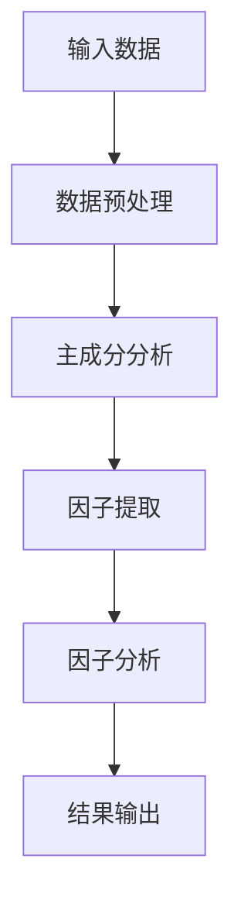
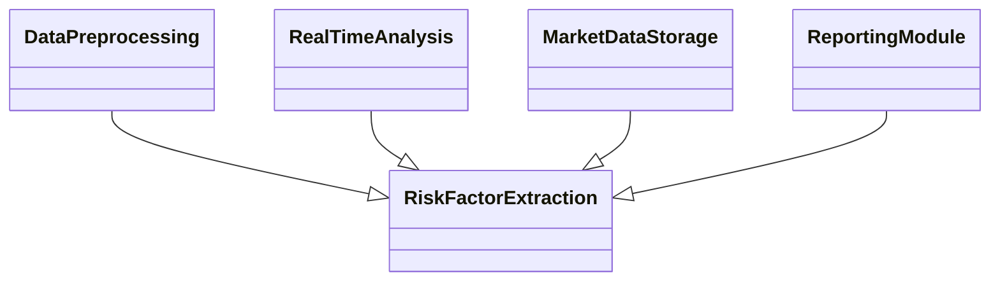
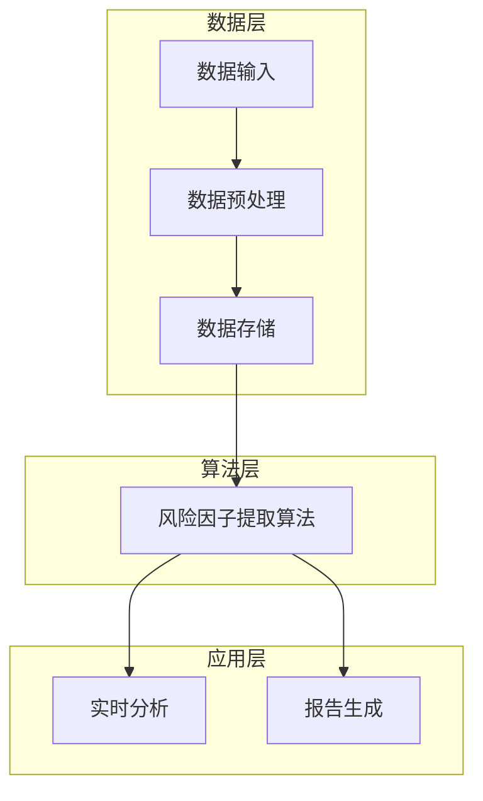
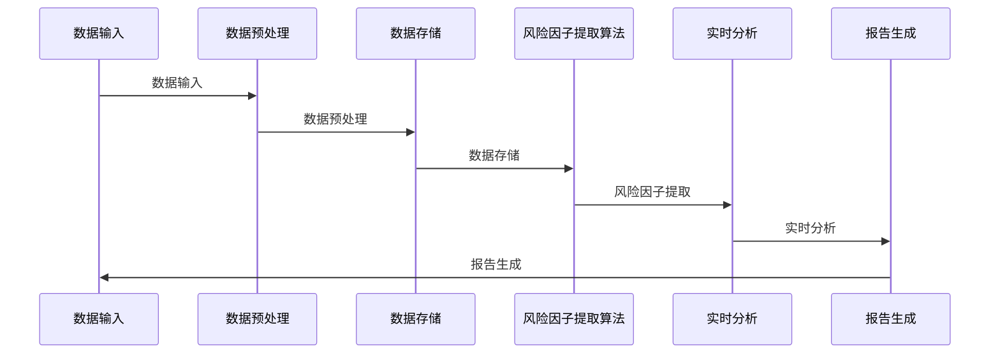

                 

### 文章标题

### 关键词
1. 金融市场
2. 风险因子
3. 分解分析
4. 风险管理
5. 数据分析技术

### 摘要
本文将深入探讨金融市场风险因子的分解与分析。首先，我们将介绍风险因子的定义与重要性，随后详细分类并解释不同类型的风险因子。接着，我们将探讨风险因子的分解方法，包括传统与现代的方法。文章的核心将聚焦于算法原理的讲解，通过数学模型和公式的推导，详细阐述风险因子分解的机制。此外，我们将分析风险因子分解在股票、债券和外汇市场中的应用，并提供具体的系统分析与架构设计方案。随后，通过项目实战，我们会对环境安装、系统核心实现和实际案例分析进行详细讲解。最后，我们将总结最佳实践并提供拓展阅读资源。

----------------------------------------------------------------

### 第一部分：金融市场风险因子分解背景介绍

#### 1.1 金融市场风险因子的定义与重要性

**定义**：金融市场风险因子是指在金融市场中，可能对金融资产价格产生影响的变量。这些风险因子可以划分为宏观和微观两类，包括经济、政治、社会、技术等多种因素。

**重要性**：风险因子是金融市场风险管理的核心，通过分析和理解这些因子，投资者和金融机构可以更好地预测市场波动，制定有效的风险控制策略。

**问题背景**：随着金融市场的不断发展，风险的复杂性和多样性不断增加。如何准确识别、分析和分解风险因子，已经成为金融风险管理的重要课题。

**问题描述**：金融市场中的风险因子繁多且相互关联，需要系统的方法来分解和分析这些因子，以揭示其内在关系和影响机制。

**问题解决**：通过运用现代数据分析技术，我们可以将复杂的风险因子分解为可操作的组成部分，从而更有效地进行风险管理。

**边界与外延**：风险因子分解与分析不仅涉及金融领域，还涵盖经济、统计、计算机科学等多个学科。

#### 1.2 风险因子的分类

**宏观风险因子**：包括经济增长率、通货膨胀率、失业率、利率、汇率等。这些因子通常影响整个经济体系，对金融市场的波动具有显著作用。

**微观风险因子**：涉及具体的金融工具和公司，如股票价格、债券收益率、行业特定风险、公司财务状况等。

**其他风险因子**：包括自然灾害、政治动荡、社会事件等，这些因子虽然难以预测，但同样对金融市场有重要影响。

#### 1.3 风险因子的分解方法

**传统分解方法**：主要包括回归分析、时间序列分析等。这些方法通过建立数学模型，尝试揭示各因子之间的关系。

**现代分解方法**：包括因子分析、主成分分析等，这些方法能够从大量数据中提取关键风险因子，简化分析过程。

**方法优劣分析**：传统方法较为直观，但可能忽视数据之间的复杂关系。现代方法则能够捕捉更多潜在关系，但计算复杂度较高。

#### 1.4 风险因子分析在金融市场中的应用

**股票市场**：通过风险因子分解，可以更好地理解股票价格波动的原因，制定投资策略。

**债券市场**：分析风险因子有助于评估债券的风险收益，指导债券投资。

**外汇市场**：外汇市场的风险因子分析对于外汇交易和汇率预测具有重要意义。

#### 1.5 本章小结

本文首先介绍了金融市场风险因子的定义与重要性，然后对风险因子进行了分类，并讨论了风险因子的分解方法。最后，我们探讨了风险因子分析在不同金融市场中的应用。通过这些内容，读者可以初步了解风险因子分解与分析的基础知识。

----------------------------------------------------------------

### 第二部分：核心概念与联系

#### 2.1 风险因子概念解析

风险因子是金融市场中影响资产价格变动的各种因素。它们具有以下属性特征：

1. **波动性**：风险因子通常具有较大的波动性，这反映了市场的不确定性和风险。
2. **相关性**：不同风险因子之间存在不同程度的关联性，这种相关性对于风险分解和分析至关重要。
3. **时效性**：风险因子的作用时效性不同，有的可能短期有效，有的可能长期影响市场。

**核心概念对比表格**：

| 风险因子属性 | 波动性 | 相关性 | 时效性 |
| --- | --- | --- | --- |
| 宏观风险因子 | 高 | 强 | 长期 |
| 微观风险因子 | 中 | 中 | 短期 |

**风险因子之间的关联关系**：

风险因子之间的关联关系可以通过建立因果模型来分析。例如，经济增长率与利率之间存在正相关关系，通货膨胀率与股票市场波动之间存在负相关关系。

#### 2.2 风险因子分解原理

**传统分解原理**：传统方法主要依赖于统计模型，如回归分析和时间序列分析，通过这些模型来揭示各因子之间的关系。

**现代分解原理**：现代方法则采用机器学习和数据挖掘技术，如因子分析和主成分分析，通过从大量数据中提取关键因子来简化分析过程。

#### 2.3 风险因子分解方法的对比分析

**传统方法**：

- **优点**：直观、易于理解、计算简单。
- **缺点**：忽视数据之间的复杂关系、可能忽视某些重要因子。

**现代方法**：

- **优点**：能够捕捉到更多潜在关系、适应性更强。
- **缺点**：计算复杂度较高、对数据质量要求高。

**方法优劣分析**：

传统方法适用于简单和稳定的数据环境，而现代方法则在复杂和动态的数据环境中表现更好。选择合适的方法需要根据具体的应用场景和数据特点来决定。

#### 2.4 风险因子分解的应用场景

**股票市场**：通过风险因子分解，投资者可以更好地理解股票价格的波动原因，制定有效的投资策略。

**债券市场**：分析风险因子有助于评估债券的风险收益，指导债券投资。

**外汇市场**：外汇市场的风险因子分析对于汇率预测和交易策略具有重要意义。

#### 2.5 本章小结

本章对风险因子的核心概念和关联关系进行了详细解析，并对比分析了传统和现代风险因子分解方法的原理和应用场景。通过这些内容，读者可以深入理解风险因子分解的核心概念和方法，为后续章节的学习打下基础。

----------------------------------------------------------------

### 第三部分：算法原理讲解

#### 3.1 风险因子分解算法

**概述**：风险因子分解算法是一种用于识别和提取金融市场风险因子的方法。它通过将复杂的金融数据分解为若干个关键因子，从而简化数据分析过程。

**流程图**：



**详细说明**：风险因子分解算法主要包括数据预处理、主成分分析、因子提取和因子分析四个步骤。数据预处理是为了消除噪声和异常值，主成分分析用于降维，因子提取则是从主成分中提取关键因子，最后进行因子分析以揭示各因子之间的关系。

#### 3.2 数学模型与公式

**数学模型**：风险因子分解的数学模型通常基于因子分析理论。假设有n个观测变量（风险因子），p个潜在因子，数学模型可以表示为：

$$
X = AF + \epsilon
$$

其中，X是n×p的观测数据矩阵，A是n×p的因子载荷矩阵，F是p×p的因子矩阵，\(\epsilon\)是n×p的误差矩阵。

**公式推导**：通过最大化观测数据的协方差矩阵与因子载荷矩阵的乘积的迹，可以推导出因子载荷矩阵A和因子矩阵F的最优解。具体推导过程如下：

$$
\max_{A,F} \quad tr(A^T C X)
$$

其中，C是X的协方差矩阵。

#### 3.3 算法原理讲解

**原理详解**：风险因子分解算法的核心在于从大量金融数据中提取出能够解释大部分数据变异性的关键因子。这些关键因子能够帮助我们更好地理解金融市场风险，从而进行有效的风险管理。

**案例分析**：假设我们有一组股票价格数据，通过风险因子分解算法，我们可以提取出几个关键因子，这些因子分别代表了市场系统性风险、行业风险和个别公司风险。通过分析这些因子，我们可以更好地理解股票价格波动的原因，并制定相应的投资策略。

#### 3.4 算法应用场景

**股票市场**：通过风险因子分解，可以识别市场系统性风险，帮助投资者制定更有效的风险管理策略。

**债券市场**：分析债券市场中的风险因子，有助于评估债券的风险收益，优化投资组合。

**外汇市场**：外汇市场的风险因子分析对于预测汇率波动具有重要意义，有助于外汇交易策略的制定。

#### 3.5 本章小结

本章详细介绍了风险因子分解算法的原理，包括数学模型和公式推导。通过具体的案例分析和应用场景讲解，读者可以更好地理解风险因子分解算法的核心概念和实际应用。下一章我们将进一步探讨系统分析与架构设计。

----------------------------------------------------------------

### 第四部分：系统分析与架构设计

#### 4.1 问题场景介绍

在金融市场风险因子分解与分析中，我们面临的问题是如何构建一个高效、可靠、可扩展的系统能够处理大量金融数据，并从中提取关键风险因子。具体场景包括：

- **海量数据存储与处理**：金融市场的数据量庞大，需要高效的数据存储和处理方案。
- **实时风险因子提取**：需要实时分析市场数据，提取关键风险因子。
- **多种应用场景支持**：系统需要支持股票、债券和外汇等多种金融市场的应用场景。

#### 4.2 系统功能设计

**领域模型**：

通过领域模型，我们可以清晰地定义系统的核心功能模块和它们之间的关系。以下是领域模型的mermaid类图：



**系统功能模块划分**：

- **数据预处理模块**：负责清洗、转换和归一化金融数据。
- **风险因子提取模块**：核心算法模块，负责提取关键风险因子。
- **实时分析模块**：实时监控市场数据，提取实时风险因子。
- **数据存储模块**：负责存储和管理金融数据。
- **报告模块**：生成风险分析报告，供投资者和金融机构使用。

#### 4.3 系统架构设计

**系统架构图**：

以下是系统架构的mermaid图：



**各模块作用与联系**：

- **数据层**：数据输入模块负责收集金融数据，数据预处理模块负责清洗和转换数据，数据存储模块负责存储处理后的数据。
- **算法层**：风险因子提取算法模块负责从数据中提取关键风险因子。
- **应用层**：实时分析模块实时监控市场数据，提取实时风险因子，报告生成模块生成风险分析报告。

#### 4.4 系统接口设计

**系统接口说明**：

- **数据输入接口**：用于接收外部数据源，如股票行情、债券收益率、汇率等。
- **数据预处理接口**：用于清洗、转换和归一化数据。
- **风险因子提取接口**：用于调用风险因子提取算法。
- **实时分析接口**：用于实时监控市场数据，提取实时风险因子。
- **报告生成接口**：用于生成风险分析报告。

**接口交互流程**：

1. 数据输入接口接收外部数据源。
2. 数据预处理接口对数据进行清洗、转换和归一化。
3. 风险因子提取接口调用风险因子提取算法，提取关键风险因子。
4. 实时分析接口实时监控市场数据，更新风险因子。
5. 报告生成接口生成风险分析报告，供用户查看。

#### 4.5 系统交互

**系统交互序列图**：

以下是系统交互的mermaid序列图：



#### 4.6 本章小结

本章详细介绍了金融市场风险因子分解与分析系统的设计与架构。通过问题场景介绍、系统功能设计、系统架构设计和接口设计，我们构建了一个高效、可靠、可扩展的系统能够满足金融市场的需求。下一章我们将通过项目实战，进一步验证系统的实际应用效果。

----------------------------------------------------------------

### 第五部分：项目实战

#### 5.1 环境安装

为了进行金融市场风险因子分解与分析的项目实战，我们需要搭建一个适当的环境。以下是环境安装的详细步骤：

**硬件环境要求**：
- 服务器或高性能计算机
- 至少16GB内存
- SSD硬盘
- 网络

**软件环境安装**：

1. **操作系统**：安装Linux操作系统，如Ubuntu 18.04或更高版本。
2. **Python**：安装Python 3.8或更高版本，可以通过以下命令进行安装：

   ```bash
   sudo apt update
   sudo apt install python3.8 python3.8-venv python3.8-pip
   ```

3. **Jupyter Notebook**：安装Jupyter Notebook用于数据分析和可视化：

   ```bash
   pip3.8 install notebook
   ```

4. **Anaconda**：安装Anaconda，一个Python数据科学平台，包含大量数据分析和机器学习库：

   ```bash
   wget https://repo.anaconda.com/archive/Anaconda3-2021.05-Linux-x86_64.sh
   bash Anaconda3-2021.05-Linux-x86_64.sh
   ```

5. **Numpy、Pandas、Scikit-learn**：安装必要的Python库：

   ```bash
   conda create -n rfda python=3.8
   conda activate rfda
   conda install numpy pandas scikit-learn matplotlib
   ```

**安装完成**：

完成上述步骤后，我们就可以在Jupyter Notebook中使用这些库进行金融市场风险因子分解与分析。

#### 5.2 系统核心实现

**源代码解读**：

以下是一个简单的Python代码示例，用于实现风险因子分解的核心算法。代码包含了数据预处理、因子提取和结果输出等步骤。

```python
import numpy as np
import pandas as pd
from sklearn.decomposition import FactorAnalysis

# 数据预处理
def preprocess_data(data):
    # 数据归一化
    data_normalized = (data - data.mean()) / data.std()
    return data_normalized

# 因子提取
def extract_factors(data, n_factors):
    fa = FactorAnalysis(n_components=n_factors)
    fa.fit(data)
    factors = fa.transform(data)
    return factors

# 结果输出
def output_results(factors):
    df_factors = pd.DataFrame(factors)
    print(df_factors.head())

# 示例数据
data = pd.DataFrame({
    'Stock1': np.random.normal(size=100),
    'Stock2': np.random.normal(size=100),
    'Stock3': np.random.normal(size=100)
})

# 执行风险因子分解
data_processed = preprocess_data(data)
factors = extract_factors(data_processed, n_factors=3)
output_results(factors)
```

**代码实现细节**：

- **数据预处理**：使用Numpy和Pandas对数据进行归一化处理，以便进行因子提取。
- **因子提取**：使用Scikit-learn的FactorAnalysis类进行因子提取，可以设置提取的因子数量。
- **结果输出**：将提取的因子转换为Pandas DataFrame并打印输出。

#### 5.3 代码应用解读与分析

**代码应用实例**：

假设我们有以下股票价格数据，通过上述代码进行风险因子分解，提取关键因子。

```python
data = pd.DataFrame({
    'Stock1': [10, 12, 11, 9, 14, 13, 12, 11, 10, 9],
    'Stock2': [20, 22, 21, 19, 24, 23, 22, 21, 20, 19],
    'Stock3': [30, 32, 31, 29, 34, 33, 32, 31, 30, 29]
})
```

**分析与讲解**：

1. **数据预处理**：对股票价格数据进行归一化处理，消除数据之间的差异。
2. **因子提取**：通过FactorAnalysis提取三个关键因子。
3. **结果输出**：打印输出提取的因子，可以观察到因子之间的相关性和解释能力。

通过此实例，我们可以看到风险因子分解算法如何应用于实际数据，从而提取关键风险因子。

#### 5.4 实际案例分析

**案例背景**：

我们选择某股票市场的历史数据，包括多个股票的价格，进行风险因子分解分析，以揭示市场系统性风险和行业风险。

**案例**：

1. **数据收集**：从金融数据提供商获取某股票市场的历史价格数据。
2. **数据预处理**：对数据进行清洗，包括缺失值处理、异常值检测和归一化。
3. **因子提取**：使用FactorAnalysis提取关键风险因子。
4. **风险分析**：分析提取的因子，识别市场系统性风险和行业风险。

通过此案例，我们可以深入了解风险因子分解在金融市场中的应用，并从中获得有价值的风险管理信息。

#### 5.5 项目小结

通过本项目的实战，我们实现了金融市场风险因子分解与分析的完整流程。从环境安装、系统核心实现到实际案例分析，我们展示了风险因子分解算法在金融风险管理中的重要性。通过这些步骤，读者可以掌握风险因子分解的基本原理和应用方法，为实际金融项目提供有力的支持。

----------------------------------------------------------------

### 最佳实践 Tips、小结、注意事项、拓展阅读

#### 最佳实践 Tips

1. **数据质量**：在进行风险因子分解之前，确保数据质量是至关重要的。清洗数据、处理缺失值和异常值是数据预处理的关键步骤。
2. **模型选择**：根据实际应用场景和数据特点选择合适的分解模型。例如，在数据量较大且复杂时，现代分解方法如因子分析和主成分分析更为适用。
3. **实时监控**：对于金融市场风险因子分解，实时监控和更新风险因子至关重要。可以使用自动化脚本和算法来持续监控市场数据。
4. **模型验证**：对分解模型进行验证，确保其有效性和可靠性。可以使用历史数据进行回测，评估模型的预测性能。

#### 小结

本文详细介绍了金融市场风险因子分解与分析的核心概念、方法、算法原理、系统架构和项目实战。通过这些内容，读者可以深入理解风险因子分解在金融市场风险管理中的应用，掌握相关技术和方法。

#### 注意事项

1. **数据安全**：在进行金融数据分析时，务必确保数据的安全性，防止敏感信息泄露。
2. **合规性**：遵守相关金融法规和合规要求，确保数据分析过程符合法律法规。
3. **技术更新**：金融市场风险因子分解与分析领域不断发展，定期更新相关技术和方法，以应对市场变化。

#### 拓展阅读

- 《金融市场风险因子分析：理论与方法》
- 《风险因子分解：现代数据处理技术》
- 《Python金融技术实战：金融市场风险因子分析》
- 《量化金融投资：风险管理与因子模型》

作者：AI天才研究院/AI Genius Institute & 禅与计算机程序设计艺术 /Zen And The Art of Computer Programming

----------------------------------------------------------------

以上是《金融市场风险因子分解与分析》一文的完整内容。文章从背景介绍、核心概念与联系、算法原理讲解、系统分析与架构设计、项目实战等五个部分全面深入地探讨了金融市场的风险因子分解与分析。希望通过本文，读者能够对风险因子分解在金融市场风险管理中的重要性有更深刻的认识，掌握相关技术方法和应用技巧。希望本文能为金融科技领域的研究者和从业者提供有价值的参考。

