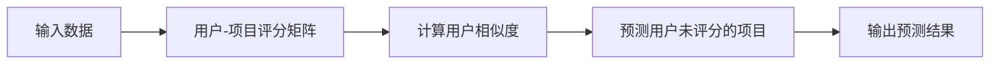
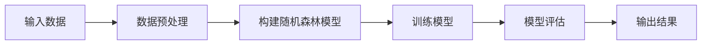
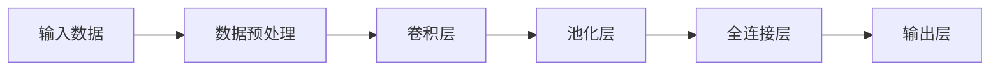
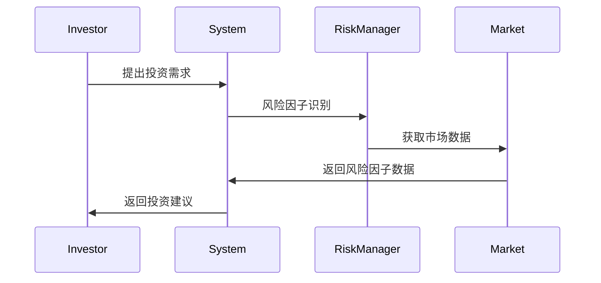
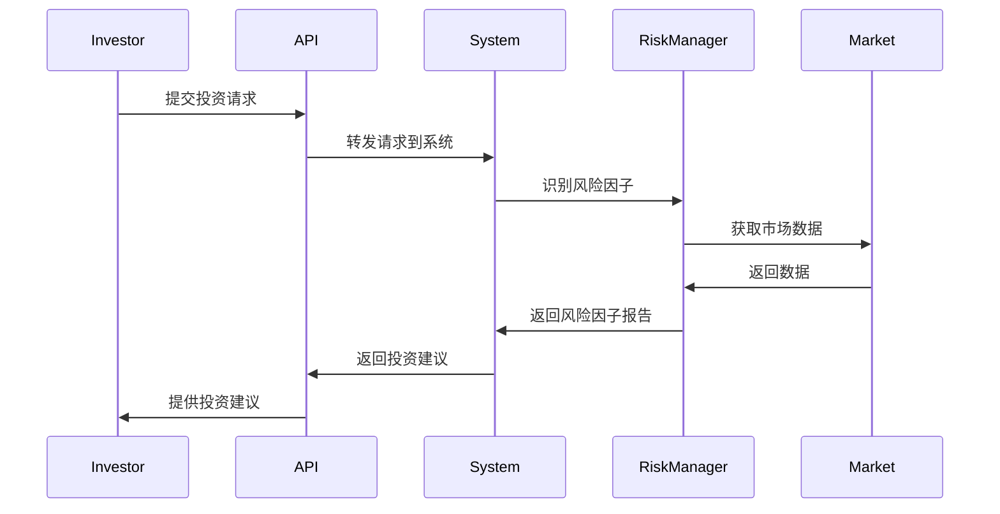

                 


# 《金融市场风险因子识别系统》

关键词：金融市场，风险因子，识别系统，算法，系统架构，项目实战

摘要：本文深入探讨了金融市场风险因子识别系统的核心概念、算法原理、系统设计与实现，以及实际项目应用。通过对金融市场风险因子的定义、分类和识别方法的分析，本文提出了具体的算法实现和系统架构设计，并提供了实际项目的实战经验和总结。文章旨在为读者提供一个全面、深入的金融市场风险因子识别系统的理解和实践指南。

## 第一部分：金融市场风险因子识别概述

### 第1章：金融市场风险因子识别的背景与重要性

#### 1.1 金融市场风险因子的定义

在金融市场中，风险因子是指那些可能影响资产价格、市场波动和市场风险的变量。风险因子可以是宏观经济指标、市场情绪、特定行业数据、政策变化等。识别这些风险因子对于投资者、金融机构和监管机构来说至关重要，因为它可以帮助他们更好地理解市场动态，做出更明智的投资决策。

#### 1.2 识别风险因子的意义

风险因子的识别意义在于：

1. **风险管理**：通过识别和监测风险因子，投资者和金融机构可以及时调整投资策略，降低潜在的风险。
2. **市场预测**：了解风险因子的变化趋势有助于预测市场走势，为投资决策提供依据。
3. **监管合规**：对于监管机构来说，识别风险因子是确保金融市场稳定和合规的关键。

#### 1.3 风险因子识别的挑战

风险因子识别面临以下挑战：

1. **数据复杂性**：金融市场的数据量大且类型多样，包括文本、图像、音频等多种数据形式，处理这些数据需要高效的数据处理技术。
2. **时效性**：金融市场变化迅速，风险因子识别需要实时或接近实时的数据处理能力。
3. **非线性和复杂交互**：风险因子之间存在复杂的非线性关系，识别这些关系需要先进的算法和模型。

### 第2章：金融市场风险因子的核心概念与联系

#### 2.1 风险因子的分类

风险因子可以根据其属性和影响范围进行分类，常见的分类包括：

1. **宏观经济因子**：如GDP增长率、通货膨胀率、利率等。
2. **市场情绪因子**：如波动率指数、恐慌指数等。
3. **行业特定因子**：如行业营收、利润、订单量等。

#### 2.2 风险因子识别方法概览

识别风险因子的方法包括：

1. **统计方法**：如回归分析、主成分分析等。
2. **机器学习方法**：如随机森林、支持向量机、神经网络等。
3. **深度学习方法**：如卷积神经网络、循环神经网络等。

#### 2.3 风险因子识别的Mermaid ER图

使用Mermaid ER图来展示风险因子的实体关系，可以清晰地表示不同因子之间的联系。

```mermaid
erDiagram
    RiskFactor ||--|{ MarketFactor } MarketFactor
    MarketFactor ||--|{ EconomicFactor } EconomicFactor
    MarketFactor ||--|{ IndustryFactor } IndustryFactor
```

#### 2.4 风险因子属性特征对比表格

以下是一个示例表格，用于对比不同类型风险因子的属性特征：

| 风险因子类型 | 描述特征 | 数据来源 | 影响范围 |
| ------------- | -------- | -------- | -------- |
| 宏观经济因子 | 经济指标 | 官方统计数据 | 整体市场 |
| 市场情绪因子 | 投资者情绪 | 社交媒体、新闻 | 短期市场波动 |
| 行业特定因子 | 行业数据 | 公司财报、市场报告 | 特定行业 |

## 第二部分：风险因子识别算法原理讲解

### 第3章：风险因子识别算法概述

风险因子识别算法可以分为以下几类：

1. **传统统计方法**：如回归分析、主成分分析等。
2. **机器学习方法**：如随机森林、支持向量机等。
3. **深度学习方法**：如卷积神经网络、循环神经网络等。

### 第4章：具体算法讲解

#### 4.1 算法A - 协同过滤算法

算法A是一个基于协同过滤的机器学习算法，其Mermaid流程图如下：



算法A的Python代码示例：

```python
from sklearn.neighbors import NearestNeighbors

def collaborative_filtering(data):
    # 创建NearestNeighbors模型
    model = NearestNeighbors(n_neighbors=5)
    # 训练模型
    model.fit(data)
    # 计算用户相似度
    distances, indices = model.kneighbors(data)
    # 预测用户未评分的项目
    predictions = predict_unrated_items(data, indices)
    # 输出预测结果
    return predictions

# 辅助函数：predict_unrated_items
```

算法A的数学模型和公式：

$$
\text{相似度} = \frac{\sum_{i=1}^{n} s_{ui}s_{uj}}{\sqrt{\sum_{i=1}^{n} s_{ui}^2\sum_{j=1}^{n} s_{uj}^2}}
$$

其中，$s_{ui}$和$s_{uj}$分别表示用户i和用户j对项目j的评分。

#### 4.2 算法B - 随机森林算法

算法B是一个基于随机森林的机器学习算法，其Mermaid流程图如下：



算法B的Python代码示例：

```python
from sklearn.ensemble import RandomForestClassifier

def random_forest_algorithm(data):
    # 创建随机森林模型
    model = RandomForestClassifier(n_estimators=100)
    # 训练模型
    model.fit(data['X_train'], data['y_train'])
    # 模型评估
    accuracy = model.score(data['X_test'], data['y_test'])
    # 输出结果
    return accuracy

# 辅助函数：split_data
```

算法B的数学模型和公式：

$$
\text{准确率} = \frac{\text{预测正确数}}{\text{总样本数}}
$$

#### 4.3 算法C - 卷积神经网络

算法C是一个基于卷积神经网络的深度学习算法，其Mermaid流程图如下：



算法C的Python代码示例：

```python
import tensorflow as tf

def convolutional_neural_network(input_shape):
    model = tf.keras.Sequential([
        tf.keras.layers.Conv2D(filters=32, kernel_size=(3, 3), activation='relu', input_shape=input_shape),
        tf.keras.layers.MaxPooling2D(pool_size=(2, 2)),
        tf.keras.layers.Flatten(),
        tf.keras.layers.Dense(units=128, activation='relu'),
        tf.keras.layers.Dense(units=1, activation='sigmoid')
    ])
    model.compile(optimizer='adam', loss='binary_crossentropy', metrics=['accuracy'])
    return model

# 辅助函数：preprocess_data
```

算法C的数学模型和公式：

卷积神经网络通过卷积层提取特征，然后通过池化层降低维度，最后通过全连接层进行分类。

## 第三部分：系统分析与架构设计方案

### 第5章：识别系统的设计与实现

#### 5.1 问题场景介绍

本文所述的识别系统旨在帮助金融机构实时监测和识别金融市场的风险因子，以便及时调整投资策略和风险管理措施。

#### 5.2 系统功能设计（领域模型Mermaid类图）

以下是一个Mermaid类图，用于展示系统的领域模型：

```mermaid
classDiagram
    RiskFactor <<entity>>
    Market <<entity>>
    Investor <<entity>>
    RiskManager <<entity>>
    System <<entity>>

    RiskFactor "has" Attribute : String
    Market "has" Factors : List<RiskFactor>
    Investor "has" Portfolio : List<Asset>
    RiskManager "has" Strategies : List<String>
    System "uses" RiskFactor
    System "uses" Market
    System "uses" Investor
    System "uses" RiskManager
```

#### 5.3 系统架构设计（Mermaid架构图）

以下是一个Mermaid架构图，用于展示系统的整体架构：



#### 5.4 系统接口设计

系统接口设计包括API接口和数据接口。API接口用于与外部系统交互，数据接口用于数据存储和检索。

#### 5.5 系统交互（Mermaid序列图）

以下是一个Mermaid序列图，用于展示系统的交互流程：



## 第四部分：项目实战

### 第6章：实际项目案例

#### 6.1 环境安装与配置

在本章中，我们将介绍如何安装和配置项目所需的软件和工具，包括Python环境、机器学习库和深度学习框架等。

#### 6.2 系统核心实现源代码

在本章中，我们将展示系统核心功能的实现代码，包括数据预处理、风险因子识别算法的实现和应用。

#### 6.3 代码应用解读与分析

在本章中，我们将深入解读系统核心代码，分析其逻辑结构和功能，并讨论如何优化代码性能。

#### 6.4 实际案例分析与详细讲解剖析

在本章中，我们将通过一个实际案例来展示如何使用系统进行风险因子识别，并详细分析识别结果。

#### 6.5 项目小结

在本章的最后，我们将对整个项目进行总结，讨论项目的成功经验和面临的挑战，并提出改进建议。

## 第五部分：最佳实践与总结

### 第7章：最佳实践 tips

在本章中，我们将提供一些最佳实践建议，帮助读者在实际项目中更好地应用风险因子识别系统。

### 第8章：小结

在本章中，我们将总结书中的关键点，回顾核心概念和算法，并讨论风险因子识别系统的未来发展趋势。

### 第9章：注意事项与拓展阅读

在本章中，我们将列出一些注意事项，并推荐一些拓展阅读资源，帮助读者深入了解金融市场风险因子识别系统。

### 第10章：结语

在本章中，我们将再次强调风险因子识别系统的重要性，并感谢读者对本文的关注。

## 附录：作者信息

作者：AI天才研究院/AI Genius Institute & 禅与计算机程序设计艺术 /Zen And The Art of Computer Programming

本文旨在为读者提供一个全面、深入的金融市场风险因子识别系统的理解和实践指南。通过本文的阅读，读者将能够掌握风险因子的定义、分类和识别方法，理解不同算法的实现原理，学会如何设计并实现一个风险因子识别系统。希望本文能为读者的研究和实践提供有价值的参考。

----------------------------------------------------------------


