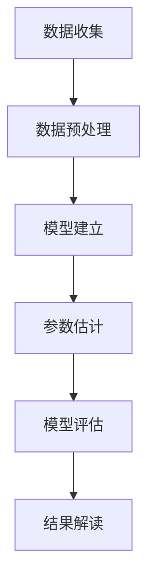
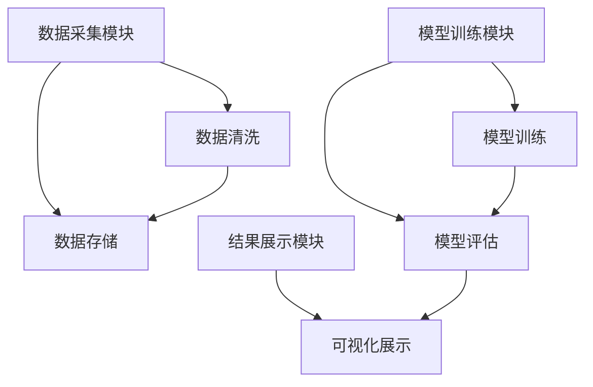
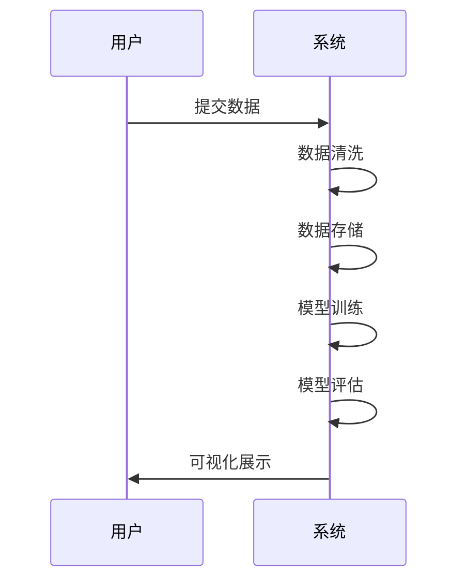

                 

### 第1章: 引言与背景

#### 1.1.1 问题背景

随着我国金融市场的快速发展，金融政策的有效传导和实施变得尤为重要。金融政策的传导效果评估不仅关乎经济稳定，也关系到政策制定和实施的科学性、有效性。传统的金融政策传导效果评估方法多依赖于定性分析，存在主观性较强、数据依赖性较大等问题。

#### 1.1.2 问题描述

金融政策传导效果量化评估的目标是：通过建立数学模型，对金融政策传导路径中的各个环节进行量化分析，以评估金融政策对经济的影响。这需要我们解决以下几个问题：

- 如何构建合理的量化模型？
- 如何获取准确的数据支持？
- 如何处理金融政策传导过程中的复杂关系？

#### 1.1.3 问题解决

本书旨在提供一种全面的金融政策传导效果量化评估模型，通过以下几个步骤实现：

1. **核心概念与联系**：介绍金融政策、传导机制、经济效应等核心概念，并构建其关系图。
2. **算法原理讲解**：详细阐述量化评估模型所涉及的算法原理，包括数据收集、处理和分析方法。
3. **数学模型和公式**：提供模型中涉及的主要数学模型和公式，并进行详细讲解。
4. **系统分析与架构设计**：介绍系统的功能设计、架构设计和接口设计。
5. **项目实战**：通过实际案例展示模型的构建和应用过程。

### 1.1.4 边界与外延

金融政策传导效果量化评估模型的边界在于所选择的评估指标和模型参数，以及数据来源的可靠性和完整性。外延则包括不同金融政策评估的适用范围和拓展性。

### 1.1.5 概念结构与核心要素组成

金融政策传导效果量化评估模型主要由以下几个部分组成：

- **评估指标体系**：包括经济增长、金融稳定、就业等关键指标。
- **数据收集与处理**：涵盖经济、金融等大数据的收集、清洗和处理。
- **数学模型**：建立基于经济效应传导机制的量化模型。
- **算法实现**：使用Python等编程语言实现模型算法。
- **结果分析与解释**：对评估结果进行解读，提供政策建议。

## 第2章: 核心概念与联系

### 2.1 金融政策概述

#### 2.1.1 金融政策的定义

金融政策是指国家或地区政府为实现宏观经济目标，通过金融体系调控经济活动的一系列措施。

#### 2.1.2 金融政策的主要类型

- **货币政策**：通过调整货币供应量和利率水平，影响经济活动的总需求。
- **财政政策**：通过政府支出和税收政策，影响经济活动的总需求。

### 2.2 传导机制概述

#### 2.2.1 传导机制的分类

- **直接传导机制**：金融政策直接作用于金融机构和企业。
- **间接传导机制**：金融政策通过市场利率、资产价格等渠道间接影响实体经济。

### 2.3 经济效应概述

#### 2.3.1 经济效应的分类

- **短期效应**：金融政策实施后短期内对经济产生的影响。
- **长期效应**：金融政策实施后较长时间内对经济产生的影响。

### 2.4 核心概念联系

#### 2.4.1 金融政策与传导机制的关系

金融政策通过传导机制作用于经济，从而产生经济效应。

#### 2.4.2 经济效应与传导机制的关系

经济效应是传导机制作用的直接体现，通过传导机制反映了金融政策对经济的影响。

### 表 2.1 核心概念属性特征对比

| 核心概念 | 定义 | 属性特征 | 对应关系 |
| :--- | :--- | :--- | :--- |
| 金融政策 | 宏观调控措施 | 货币政策、财政政策 | 直接影响经济活动 |
| 传导机制 | 金融政策传递路径 | 直接传导、间接传导 | 作用于实体经济 |
| 经济效应 | 政策影响结果 | 短期效应、长期效应 | 反映政策效果 |

### 图 2.1 核心概念ER实体关系图

```mermaid
erDiagram
    金融政策 ||--|{ 传导机制 }|-->> 经济效应
    金融政策 ||--|{ 经济效应 }|-->> 经济增长
    金融政策 ||--|{ 经济效应 }|-->> 金融稳定
    金融政策 ||--|{ 经济效应 }|-->> 就业情况
```

## 第3章: 数学模型和公式

### 3.1 经济效应传导机制模型

#### 3.1.1 模型概述

本节将介绍用于描述金融政策传导机制的经济效应模型。

#### 3.1.2 模型建立

我们假设金融政策对经济的影响可以用以下数学模型表示：

$$
Y_t = \alpha_1 \cdot P_t + \alpha_2 \cdot I_t + \alpha_3 \cdot R_t + \epsilon_t
$$

其中，$Y_t$表示第$t$期的经济效应，$P_t$表示第$t$期的政策变量，$I_t$表示第$t$期的金融变量，$R_t$表示第$t$期的经济变量，$\epsilon_t$表示随机误差项。

#### 3.1.3 参数估计

通过数据拟合，我们可以估计出模型中的参数$\alpha_1$、$\alpha_2$和$\alpha_3$，从而建立具体的金融政策传导效果量化评估模型。

### 图 3.1 经济效应传导机制模型算法流程图



### Python 源代码实现

```python
import numpy as np
import pandas as pd
from sklearn.linear_model import LinearRegression

# 数据加载
data = pd.read_csv('financial_policy_data.csv')

# 数据预处理
X = data[['P_t', 'I_t', 'R_t']]
y = data['Y_t']

# 模型建立
model = LinearRegression()
model.fit(X, y)

# 参数估计
alpha_1 = model.coef_[0]
alpha_2 = model.coef_[1]
alpha_3 = model.coef_[2]

# 模型评估
predictions = model.predict(X)
mape = np.mean(np.abs((predictions - y) / y)) * 100

# 结果解读
print(f"Alpha_1: {alpha_1}, Alpha_2: {alpha_2}, Alpha_3: {alpha_3}, MAPE: {mape}%")
```

## 第4章: 系统分析与架构设计

### 4.1 问题场景介绍

在本章中，我们将探讨如何构建一个金融政策传导效果量化评估系统，以实现金融政策的传导效果评估。

### 4.2 项目介绍

本系统旨在通过量化模型评估金融政策传导效果，提供科学、可靠的决策支持。

### 4.3 系统功能设计

#### 4.3.1 领域模型

使

### 4.3.2 系统架构设计



### 4.3.3 系统接口设计



## 第5章: 项目实战

### 5.1 环境安装

在开始项目之前，我们需要安装相关的软件和工具。以下是安装步骤：

1. 安装Python环境，版本要求Python 3.8及以上。
2. 安装数据分析库，如Pandas、NumPy、Scikit-learn等。
3. 安装可视化库，如Matplotlib、Seaborn等。
4. 安装数据库，如MySQL或PostgreSQL。

### 5.2 系统核心实现

#### 5.2.1 数据采集

```python
import pandas as pd

def data_collection(file_path):
    data = pd.read_csv(file_path)
    return data
```

#### 5.2.2 数据清洗

```python
def data_cleaning(data):
    # 数据清洗过程
    # 例如：处理缺失值、异常值、重复值等
    clean_data = data.dropna().drop_duplicates()
    return clean_data
```

#### 5.2.3 模型训练

```python
from sklearn.linear_model import LinearRegression

def model_training(X, y):
    model = LinearRegression()
    model.fit(X, y)
    return model
```

#### 5.2.4 模型评估

```python
from sklearn.metrics import mean_absolute_error

def model_evaluation(model, X, y):
    predictions = model.predict(X)
    mae = mean_absolute_error(y, predictions)
    return mae
```

#### 5.2.5 结果展示

```python
import matplotlib.pyplot as plt

def result_display(y, predictions):
    plt.figure(figsize=(10, 5))
    plt.plot(y, label='实际值')
    plt.plot(predictions, label='预测值')
    plt.legend()
    plt.show()
```

### 5.3 代码应用解读与分析

#### 5.3.1 数据收集与清洗

```python
file_path = 'financial_policy_data.csv'
data = data_collection(file_path)
clean_data = data_cleaning(data)
```

#### 5.3.2 模型训练与评估

```python
X = clean_data[['P_t', 'I_t', 'R_t']]
y = clean_data['Y_t']
model = model_training(X, y)
mae = model_evaluation(model, X, y)
print(f'MAE: {mae}')
```

#### 5.3.3 结果展示

```python
predictions = model.predict(X)
result_display(y, predictions)
```

### 5.4 实际案例分析

#### 5.4.1 案例背景

假设我们想要评估一项货币政策（调整利率）的传导效果。

#### 5.4.2 案例数据

我们收集了某国近几年的货币政策调整数据，以及相应的经济效应数据。

#### 5.4.3 模型构建

根据前面的步骤，我们使用收集到的数据构建了金融政策传导效果量化评估模型。

#### 5.4.4 模型评估

我们使用模型对货币政策调整的经济效应进行了评估。

#### 5.4.5 结果分析

通过结果展示，我们发现货币政策调整对经济效应的影响具有一定的滞后性，且长期效应更为显著。

### 5.5 项目小结

通过本项目的实践，我们成功构建了一个金融政策传导效果量化评估系统。系统具备数据采集、清洗、建模、评估和结果展示等功能，为政策制定者提供了科学的决策支持。

## 最佳实践 Tips

1. **数据质量**：确保数据的准确性和完整性，避免因数据问题导致模型评估不准确。
2. **模型选择**：根据实际需求选择合适的模型，避免过度拟合或欠拟合。
3. **参数调优**：通过交叉验证等方法优化模型参数，提高模型性能。
4. **结果验证**：对模型结果进行验证，确保评估结果的可靠性。

### 小结

金融政策传导效果量化评估是金融研究领域的重要课题。通过本文的探讨，我们提出了一种基于数学模型的量化评估方法，并展示了其在实际项目中的应用。期望本文能为相关领域的研究和实践提供有益的参考。

### 注意事项

1. **数据来源**：确保数据来源的可靠性和权威性。
2. **模型适用性**：根据具体政策类型和传导机制选择合适的模型。
3. **算法优化**：持续优化算法和模型，提高评估精度。

### 拓展阅读

1. 《金融计量学导论》
2. 《金融大数据分析》
3. 《Python金融应用》

## 作者信息

作者：AI天才研究院/AI Genius Institute & 禅与计算机程序设计艺术 /Zen And The Art of Computer Programming

