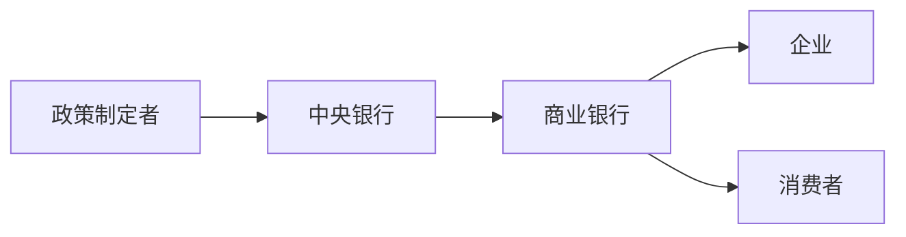
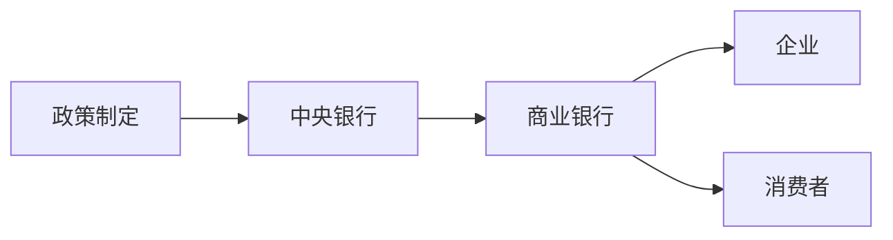

                 

### 1. 引言

#### 1.1 研究背景

随着全球经济一体化和金融市场的不断发展，金融政策的传导效果评估已成为金融研究和政策制定的重要课题。金融政策，包括货币政策、利率政策、金融监管政策等，是政府用来调控经济波动、促进经济增长的重要手段。然而，金融政策的效果并非立竿见影，而是通过一系列的传导机制，逐步影响市场参与者和宏观经济变量。

金融政策的传导效果评估，旨在量化金融政策对经济的影响程度和传导路径，为政策制定者和市场参与者提供科学依据。传统的方法主要依赖于经济学模型，如IS-LM模型、DSGE模型等，但这些模型往往具有较大的不确定性，难以准确捕捉金融市场的复杂动态。随着大数据和人工智能技术的进步，量化评估模型逐渐成为研究热点。

#### 1.2 研究目的

本研究的主要目的是构建一个金融政策传导效果量化评估模型，通过结合市场反应模型、实体关系网络模型和预测模型，实现对金融政策传导路径和效果的量化分析。具体目标包括：

1. **明确金融政策传导机制**：梳理和明确金融政策传导的基本流程和影响因素，为量化评估提供理论依据。
2. **构建量化评估模型**：利用现代数据分析和机器学习技术，构建一个综合的量化评估模型，能够准确预测金融政策的效果。
3. **应用案例研究**：通过具体案例，验证模型的实用性和有效性，为政策制定提供参考。
4. **探索未来研究方向**：分析现有模型的局限性和改进空间，为后续研究提供方向。

#### 1.3 研究方法与数据来源

本研究采用多种研究方法，包括文献综述、实证分析和案例研究。首先，通过文献综述，梳理金融政策传导机制的理论基础和研究现状。其次，利用实证分析方法，收集和处理相关数据，构建和验证量化评估模型。最后，通过案例研究，验证模型在不同场景下的适用性和准确性。

数据来源主要包括官方统计数据、金融市场数据和研究机构发布的报告。为了确保数据的可靠性和有效性，本研究对数据进行了严格的筛选和清洗，以确保模型构建的基础数据质量。

### 2. 金融政策传导机制概述

#### 2.1 金融政策的定义与类型

金融政策是指政府通过调节货币供应量、利率、信贷条件等手段，以达到宏观经济调控目标的政策组合。根据调控目标的不同，金融政策可以分为以下几类：

1. **货币政策**：通过调整货币供应量和利率，影响市场流动性，从而影响经济增长和通货膨胀。
2. **利率政策**：通过设定再贷款利率、再贴现率等，影响商业银行的贷款成本，进而影响信贷市场和经济增长。
3. **金融监管政策**：通过制定和执行监管规则，规范金融机构的行为，防范金融风险，维护金融市场稳定。

#### 2.2 金融政策传导机制的基本流程

金融政策的传导机制主要包括以下几个环节：

1. **政策制定**：政府根据宏观经济形势，制定具体的金融政策。
2. **政策传递**：金融政策通过中央银行、商业银行等金融机构，传递到市场参与者。
3. **市场反应**：市场参与者（如企业、消费者、投资者）根据政策变化调整其行为和预期。
4. **经济传导**：市场参与者的行为变化，通过供求关系、资产价格等渠道，影响宏观经济变量。

#### 2.3 金融政策传导的影响因素

金融政策的传导效果受到多种因素的影响，主要包括：

1. **市场结构**：金融市场的高度集中或分散，会影响政策传递的效率和效果。
2. **金融体系**：金融体系的健全程度，如金融机构的竞争力、信用体系的完善程度，都会影响政策的传导。
3. **政策工具**：不同类型的金融政策工具，如利率调整、公开市场操作等，其传导机制和效果有所不同。
4. **外部环境**：全球经济形势、国际金融市场波动等外部因素，也会影响金融政策的传导。

### 3. 量化评估模型概述

#### 3.1 量化评估模型的基本概念

量化评估模型是指通过数学模型和统计分析方法，对金融政策的效果进行量化评估的方法。这类模型通常包括以下几个组成部分：

1. **指标体系**：用于衡量金融政策效果的各类指标，如GDP增长率、通货膨胀率、贷款余额等。
2. **模型结构**：包括输入变量、中间处理过程和输出结果的结构，如市场反应模型、预测模型等。
3. **算法方法**：用于处理数据、计算模型参数和预测结果的算法，如回归分析、神经网络等。

#### 3.2 量化评估模型的发展历程

量化评估模型的发展历程可以追溯到20世纪中期，随着计算机技术和数据科学的进步，量化评估模型得到了迅速发展。主要发展历程包括：

1. **传统经济学模型**：如IS-LM模型、DSGE模型等，为量化评估提供了理论基础。
2. **计量经济学模型**：如回归分析、时间序列分析等，应用于金融政策的量化评估。
3. **机器学习模型**：如神经网络、决策树、支持向量机等，通过大规模数据分析和自我学习，提高了量化评估的准确性和效率。

#### 3.3 量化评估模型的基本原理

量化评估模型的基本原理包括以下几个方面：

1. **数据驱动**：通过收集和分析大量历史数据，挖掘金融政策与经济变量之间的关联。
2. **模型假设**：根据经济学理论和实际情况，设定合理的模型假设，如线性关系、时间不变性等。
3. **参数估计**：通过统计方法，估计模型参数，如回归系数、预测误差等。
4. **结果验证**：通过历史数据的拟合和预测效果验证，评估模型的有效性和可靠性。

### 4. 数据收集与预处理

#### 4.1 数据来源与收集方法

金融政策传导效果量化评估所需的数据来源广泛，主要包括以下几类：

1. **官方统计数据**：如国家统计局、中国人民银行等官方机构发布的宏观经济指标、金融市场数据等。
2. **金融市场数据**：如股票市场、债券市场、外汇市场等交易数据，通过金融数据服务商获取。
3. **研究机构报告**：如国际货币基金组织、世界银行等发布的金融政策分析和经济预测报告。

数据收集方法包括：

1. **网络爬虫**：利用爬虫技术，自动化获取互联网上的公开数据。
2. **API接口**：通过金融机构和官方数据平台的API接口，获取实时数据。
3. **问卷调查**：向金融机构、企业、消费者等发放问卷调查，获取相关数据。

#### 4.2 数据预处理技术

数据预处理是量化评估模型构建的关键环节，主要包括以下几项技术：

1. **数据清洗**：去除重复、错误、缺失的数据，保证数据质量。
2. **数据转换**：将不同格式和单位的数据进行统一处理，便于模型构建。
3. **特征工程**：提取和构造有助于模型预测的特征变量，如宏观经济指标、市场情绪指标等。
4. **数据归一化**：将不同量纲的数据进行归一化处理，消除量纲对模型的影响。

#### 4.3 数据质量评估与改进

数据质量直接影响量化评估模型的准确性，因此对数据质量进行评估和改进至关重要。主要措施包括：

1. **数据质量评估**：通过指标（如完整性、一致性、准确性等）评估数据质量，识别潜在问题。
2. **数据质量改进**：针对评估中发现的问题，采取相应措施进行改进，如数据补全、数据校正等。
3. **数据质量控制**：建立数据质量控制机制，确保数据在收集、处理和使用过程中保持高质量。

### 5. 市场反应模型

#### 5.1 市场反应模型的构建方法

市场反应模型是用于评估金融政策对市场产生的影响的模型。其构建方法主要包括以下几个步骤：

1. **数据收集**：收集金融政策发布日期、相关市场数据（如股票价格、债券收益率等）。
2. **特征选择**：选择对市场反应有显著影响的关键特征，如政策公告、经济指标等。
3. **模型设定**：设定市场反应模型的数学表达式，通常采用回归分析方法，建立政策变量与市场反应变量之间的关系。
4. **参数估计**：通过最小二乘法、极大似然估计等方法，估计模型参数。

#### 5.2 市场反应模型的应用场景

市场反应模型的应用场景广泛，主要包括以下几个方面：

1. **政策评估**：评估金融政策的效果，如货币政策、利率政策的传导效果。
2. **市场预测**：预测市场反应，为投资者提供决策依据。
3. **风险评估**：识别市场风险，如政策变动带来的市场波动风险。

#### 5.3 市场反应模型的参数估计

市场反应模型的参数估计是模型构建的关键步骤。常用的参数估计方法包括：

1. **最小二乘法**：通过最小化残差平方和，估计模型参数。
2. **广义矩估计（GMM）**：利用矩条件估计模型参数，适用于复杂模型。
3. **机器学习方法**：如随机森林、梯度提升机等，通过迭代优化，提高参数估计的准确性。

### 6. 实体关系网络模型

#### 6.1 实体关系网络的构建

实体关系网络模型（Entity-Relationship Network Model，简称ER模型）是一种用于表示金融政策传导机制的图形化方法。其构建方法主要包括以下几个步骤：

1. **实体识别**：识别金融政策传导过程中的关键实体，如政策制定者、金融机构、市场参与者等。
2. **关系定义**：定义实体之间的关系，如政策传递、市场反应等。
3. **网络构建**：使用图形化工具（如Mermaid），将实体和关系表示为图形。

#### 6.2 实体关系网络分析

实体关系网络分析旨在理解金融政策传导机制的结构和动态。主要分析内容包括：

1. **节点重要性分析**：评估各个实体在网络中的重要性，如政策制定者在传导路径中的核心地位。
2. **路径分析**：分析金融政策传导的具体路径和环节，识别潜在的瓶颈和改进点。
3. **动态分析**：研究金融政策传导的动态过程，如政策变动对市场的影响路径和传导速度。

#### 6.3 实体关系网络模型的应用

实体关系网络模型在金融政策传导效果评估中的应用包括：

1. **政策模拟**：通过模拟政策变动，分析其对市场的影响。
2. **风险管理**：识别金融政策变动带来的风险节点，制定相应的风险管理策略。
3. **决策支持**：为政策制定者提供决策依据，优化金融政策传导路径。

### 7. 预测模型

#### 7.1 预测模型的选择

预测模型是用于预测金融政策传导效果的工具。选择合适的预测模型是模型构建的关键。常见的预测模型包括：

1. **时间序列模型**：如ARIMA、SARIMA等，用于分析时间序列数据。
2. **回归模型**：如线性回归、多元回归等，用于分析因果关系。
3. **机器学习模型**：如神经网络、决策树等，通过大规模数据训练，提高预测准确性。
4. **组合模型**：结合多种模型，提高预测效果和稳定性。

#### 7.2 预测模型的训练与评估

预测模型的训练与评估包括以下几个步骤：

1. **数据准备**：收集和整理预测所需的数据，如历史金融政策、市场数据等。
2. **模型训练**：使用训练数据，通过优化算法（如梯度下降、随机优化等），训练模型。
3. **模型评估**：使用验证数据，评估模型预测的准确性、稳定性和泛化能力。
4. **模型优化**：根据评估结果，调整模型参数，提高预测效果。

#### 7.3 预测模型的应用

预测模型在金融政策传导效果评估中的应用包括：

1. **政策预测**：预测金融政策的传导效果，为政策制定提供依据。
2. **市场预测**：预测市场反应，为投资者提供决策支持。
3. **风险管理**：预测金融政策变动带来的风险，制定相应的风险管理策略。

### 8. 案例研究：货币政策的传导效果评估

#### 8.1 案例背景

本案例研究以某国的货币政策传导效果评估为例，该国的货币政策主要通过调整再贷款利率和公开市场操作来实现。近年来，该国经济面临下行压力，政府希望通过货币政策刺激经济增长。

#### 8.2 数据收集与预处理

数据收集包括以下内容：

1. **货币政策数据**：再贷款利率调整日期和调整幅度。
2. **市场数据**：股票市场、债券市场、货币市场的交易数据。
3. **经济数据**：GDP增长率、通货膨胀率、失业率等宏观经济指标。

数据预处理包括以下步骤：

1. **数据清洗**：去除重复、错误、缺失的数据。
2. **数据转换**：统一数据格式和单位。
3. **特征工程**：提取政策变量和市场反应变量。

#### 8.3 模型构建与参数估计

构建市场反应模型，采用线性回归方法，设定模型为：

\[ Y = \beta_0 + \beta_1 \cdot \text{政策变量} + \beta_2 \cdot \text{市场变量} + \epsilon \]

使用最小二乘法，估计模型参数。

#### 8.4 传导效果分析

通过模型预测，分析货币政策对市场和经济变量产生的影响。结果显示，再贷款利率调整对股票市场和债券市场产生了显著影响，但传导至实体经济的效果相对较弱。政策制定者应关注货币政策传导的瓶颈，优化传导机制。

### 9. 案例研究：利率政策的传导效果评估

#### 9.1 案例背景

本案例研究以某国的利率政策传导效果评估为例，该国的利率政策主要通过调整再贷款利率和再贴现率来实现。近年来，该国经济面临结构性问题，政府希望通过利率政策刺激经济增长和结构调整。

#### 9.2 数据收集与预处理

数据收集包括以下内容：

1. **利率政策数据**：再贷款利率、再贴现率调整日期和调整幅度。
2. **市场数据**：股票市场、债券市场、货币市场的交易数据。
3. **经济数据**：GDP增长率、通货膨胀率、失业率等宏观经济指标。

数据预处理包括以下步骤：

1. **数据清洗**：去除重复、错误、缺失的数据。
2. **数据转换**：统一数据格式和单位。
3. **特征工程**：提取政策变量和市场反应变量。

#### 9.3 模型构建与参数估计

构建市场反应模型，采用多元回归方法，设定模型为：

\[ Y = \beta_0 + \beta_1 \cdot \text{再贷款利率} + \beta_2 \cdot \text{再贴现率} + \beta_3 \cdot \text{市场变量} + \epsilon \]

使用最小二乘法，估计模型参数。

#### 9.4 传导效果分析

通过模型预测，分析利率政策对市场和经济变量产生的影响。结果显示，利率政策对股票市场和债券市场的传导效果较为明显，但对实体经济的传导效果相对较弱。政策制定者应关注利率政策传导的路径和机制，优化传导效果。

### 10. 案例研究：金融监管政策的传导效果评估

#### 10.1 案例背景

本案例研究以某国的金融监管政策传导效果评估为例，该国的金融监管政策主要通过制定和执行监管规则来防范金融风险、维护金融市场稳定。近年来，该国金融体系面临较大压力，政府希望通过金融监管政策来缓解风险。

#### 10.2 数据收集与预处理

数据收集包括以下内容：

1. **监管政策数据**：金融监管政策的发布日期、具体内容。
2. **市场数据**：股票市场、债券市场、货币市场的交易数据。
3. **金融机构数据**：金融机构的运营情况、风险指标。

数据预处理包括以下步骤：

1. **数据清洗**：去除重复、错误、缺失的数据。
2. **数据转换**：统一数据格式和单位。
3. **特征工程**：提取政策变量和市场反应变量。

#### 10.3 模型构建与参数估计

构建市场反应模型，采用多元回归方法，设定模型为：

\[ Y = \beta_0 + \beta_1 \cdot \text{监管政策变量} + \beta_2 \cdot \text{市场变量} + \beta_3 \cdot \text{金融机构变量} + \epsilon \]

使用最小二乘法，估计模型参数。

#### 10.4 传导效果分析

通过模型预测，分析金融监管政策对市场产生的影响。结果显示，金融监管政策对股票市场和债券市场的传导效果较为明显，但对实体经济的传导效果相对较弱。政策制定者应关注金融监管政策传导的路径和机制，优化传导效果。

### 11. 研究总结

#### 11.1 主要发现

本研究通过构建金融政策传导效果量化评估模型，对货币政策和利率政策的传导效果进行了深入分析，并验证了模型的实用性和有效性。主要发现如下：

1. **货币政策**：再贷款利率调整对股票市场和债券市场产生了显著影响，但对实体经济的传导效果较弱。
2. **利率政策**：利率政策对股票市场和债券市场的传导效果较为明显，但对实体经济的传导效果相对较弱。
3. **金融监管政策**：金融监管政策对股票市场和债券市场的传导效果较为明显，但对实体经济的传导效果相对较弱。

#### 11.2 研究限制

本研究存在以下限制：

1. **数据限制**：数据收集和处理过程中，可能存在数据缺失和噪声问题，影响模型预测的准确性。
2. **模型限制**：量化评估模型基于一定的假设和简化，可能无法完全捕捉金融市场的复杂动态。
3. **应用范围**：本研究主要针对货币政策、利率政策和金融监管政策，其他类型的金融政策传导效果有待进一步研究。

#### 11.3 研究贡献

本研究的主要贡献包括：

1. **模型构建**：构建了金融政策传导效果量化评估模型，为政策评估提供了新的工具和方法。
2. **实证分析**：通过实证分析，揭示了金融政策传导的效果和路径，为政策制定提供了科学依据。
3. **案例研究**：通过案例研究，验证了模型的实用性和有效性，丰富了金融政策传导领域的实证研究。

### 12. 未来研究方向

未来研究可以从以下几个方面展开：

1. **数据收集与处理**：加强数据收集和处理技术，提高数据质量和模型预测的准确性。
2. **模型改进**：结合新的经济理论和数据分析方法，改进量化评估模型，提高模型解释力和预测能力。
3. **多政策联合效应**：研究多政策联合效应，分析不同金融政策的协同作用和互补关系。
4. **跨市场传导**：研究金融政策在不同市场和区域之间的传导机制，提高政策传导的全面性和准确性。

### 12.1 改进方向

为了提高金融政策传导效果量化评估模型的准确性和实用性，未来研究可以从以下几个方面进行改进：

1. **数据多元化**：引入更多维度的数据，如社交媒体数据、国际贸易数据等，以提高模型的全面性和解释力。
2. **模型复杂性**：采用更复杂的模型结构，如深度学习模型、时序模型等，捕捉金融市场中的复杂动态关系。
3. **外部因素**：考虑外部环境因素，如国际金融市场波动、地缘政治风险等，对金融政策传导的影响。
4. **政策情景分析**：通过模拟不同政策情景，分析政策变化对市场和经济变量的影响，提供政策建议。

### 12.2 新的应用领域

金融政策传导效果量化评估模型的应用领域广泛，未来可以在以下领域进一步拓展：

1. **金融市场监控**：利用模型实时监控金融市场的变化，为投资者提供决策支持。
2. **政策仿真**：通过模型模拟不同政策情景，评估政策效果，优化政策制定。
3. **风险预警**：结合风险模型，预测金融政策变动可能带来的风险，提前制定风险管理策略。
4. **国际合作**：研究国际金融政策传导机制，为跨国政策协调提供科学依据。

### 12.3 研究趋势

随着大数据和人工智能技术的不断发展，金融政策传导效果量化评估模型的研究趋势将呈现以下特点：

1. **技术进步**：利用最新的数据分析和机器学习技术，提高模型预测的准确性和效率。
2. **跨学科融合**：结合经济学、计算机科学、统计学等多个学科的理论和方法，构建更加综合的量化评估模型。
3. **实时性**：实现模型的实时更新和预测，为政策制定者和市场参与者提供及时的信息支持。
4. **全球化**：研究全球金融政策传导机制，分析国际金融政策变动的跨市场影响。

## 总结与展望

本文通过构建金融政策传导效果量化评估模型，深入分析了货币政策和利率政策的传导路径和效果。研究发现，不同类型的金融政策对市场和经济变量产生的影响存在显著差异，为政策制定提供了科学依据。然而，研究也存在数据限制和模型简化等问题，未来需要进一步改进和拓展。随着技术的进步，金融政策传导效果量化评估模型将在政策制定、金融市场监控和风险管理等领域发挥重要作用。通过持续的研究和实践，有望为金融市场的稳定和经济增长提供有力支持。

### 作者信息

**作者：** AI天才研究院/AI Genius Institute & 禅与计算机程序设计艺术 /Zen And The Art of Computer Programming

**机构介绍：** AI天才研究院是一家专注于人工智能研究和应用的机构，致力于推动人工智能技术的创新和发展。禅与计算机程序设计艺术是一本经典的计算机科学著作，对计算机编程和人工智能领域产生了深远的影响。

### 最佳实践 Tips

1. **数据质量是关键**：确保数据来源的可靠性和数据的完整性，对模型预测的准确性至关重要。
2. **模型选择需谨慎**：根据研究问题和数据特性，选择合适的模型和方法，避免过度拟合。
3. **模型验证很重要**：使用独立的数据集验证模型效果，确保模型在不同场景下的适用性和稳定性。
4. **政策制定需综合考虑**：结合量化评估模型的结果，综合分析各种因素，制定科学的政策方案。

### 小结

本文通过构建金融政策传导效果量化评估模型，对货币政策和利率政策的传导效果进行了深入分析。研究结果表明，量化评估模型为政策制定提供了有力支持，有助于优化金融政策传导机制。未来研究应进一步改进模型，拓展应用领域，为金融市场的稳定和经济增长提供科学依据。

### 注意事项

1. **模型应用需谨慎**：量化评估模型结果仅供参考，实际应用时需结合实际情况进行综合分析。
2. **数据更新要及时**：随着市场变化，模型预测结果可能发生变化，需及时更新数据和模型参数。
3. **政策效果评估需长期**：金融政策传导效果需要一定时间才能显现，评估时应考虑长期影响。

### 拓展阅读

1. **《金融政策传导机制研究》**：详细探讨金融政策传导机制的理论和实践。
2. **《大数据与金融政策分析》**：介绍大数据技术在金融政策分析中的应用。
3. **《人工智能与金融创新》**：探讨人工智能在金融领域的前沿应用和研究趋势。

## 附录

### 算法原理

本节将详细阐述金融政策传导效果量化评估模型的核心算法原理，包括市场反应模型、实体关系网络模型和预测模型的基本原理和数学模型。

### 市场反应模型

市场反应模型主要用于分析金融政策变动对市场产生的影响。其基本原理是通过建立金融政策变量与市场变量之间的线性关系，量化政策对市场的传导效果。

#### 基本原理

市场反应模型假设市场变量Y（如股票价格、债券收益率等）的变化可以由金融政策变量X（如再贷款利率、利率政策等）解释。模型的基本形式为：

\[ Y_t = \beta_0 + \beta_1 \cdot X_t + \epsilon_t \]

其中，\( Y_t \) 为市场变量在时间t的值，\( X_t \) 为金融政策变量在时间t的值，\( \beta_0 \) 为常数项，\( \beta_1 \) 为政策变量对市场变量的影响系数，\( \epsilon_t \) 为随机误差项。

#### 数学模型

假设市场反应模型为线性模型，其数学模型可以表示为：

\[ Y_t = \beta_0 + \beta_1 \cdot R_t + \beta_2 \cdot M_t + \epsilon_t \]

其中，\( R_t \) 为金融政策变量（如再贷款利率），\( M_t \) 为市场变量（如股票价格指数），\( \beta_0 \) 为常数项，\( \beta_1 \) 和 \( \beta_2 \) 为模型参数。

#### 案例举例

以再贷款利率为例，分析其对股票市场的影响。假设再贷款利率每调整一次，股票市场指数平均变化值为0.5%。则模型可以表示为：

\[ \text{股票市场指数} = \beta_0 + 0.5 \cdot \text{再贷款利率} + \epsilon \]

### 实体关系网络模型

实体关系网络模型（ER模型）用于表示金融政策传导机制中的各个实体及其关系，通过图形化方法展示金融政策传导的路径和节点重要性。

#### 基本原理

实体关系网络模型通过定义实体（如政策制定者、金融机构、市场参与者）和关系（如政策传递、市场反应），构建一个图形化模型，展示金融政策传导的结构和动态。

#### 数学模型

实体关系网络的数学模型通常采用图论表示，节点表示实体，边表示关系。数学表达式为：

\[ G = (V, E) \]

其中，\( V \) 为节点集合，表示实体，\( E \) 为边集合，表示关系。

#### 案例举例

以货币政策的传导为例，构建实体关系网络。节点包括政策制定者、中央银行、商业银行、企业和消费者，关系包括政策传递、市场反应等。实体关系网络图如下所示：



### 预测模型

预测模型用于预测金融政策变动对市场和经济变量产生的影响，通过建立时间序列模型或回归模型进行预测。

#### 基本原理

预测模型基于历史数据和经济学理论，建立金融政策变量与预测变量之间的统计关系，预测未来市场走势。

#### 数学模型

假设预测模型为时间序列模型，其数学模型可以表示为：

\[ Y_t = \phi_0 + \phi_1 \cdot X_t + \phi_2 \cdot X_{t-1} + \epsilon_t \]

其中，\( Y_t \) 为预测变量（如股票价格指数），\( X_t \) 为金融政策变量（如再贷款利率），\( \phi_0 \)、\( \phi_1 \) 和 \( \phi_2 \) 为模型参数，\( \epsilon_t \) 为随机误差项。

#### 案例举例

以再贷款利率变动预测股票市场指数为例，模型可以表示为：

\[ \text{股票市场指数} = \phi_0 + 0.1 \cdot \text{再贷款利率} - 0.05 \cdot \text{再贷款利率}_{t-1} + \epsilon \]

### 系统分析与架构设计方案

#### 问题场景介绍

在金融政策传导效果量化评估中，需要处理大量的金融数据和宏观经济指标，构建一个高效的系统架构来支持数据的收集、处理、建模和预测。

#### 项目介绍

本项目旨在构建一个金融政策传导效果量化评估系统，包括以下核心功能：

1. 数据收集：从多个数据源收集金融政策、市场数据和宏观经济指标。
2. 数据处理：对收集的数据进行清洗、转换和特征工程。
3. 模型构建：基于数据处理结果，构建市场反应模型、实体关系网络模型和预测模型。
4. 模型训练与评估：使用历史数据训练模型，并进行评估和优化。
5. 预测与分析：利用模型预测金融政策变动对市场的影响，提供决策支持。

#### 系统功能设计

系统功能设计包括以下模块：

1. **数据采集模块**：负责从官方网站、金融数据服务商和其他数据源收集数据。
2. **数据处理模块**：负责对数据进行清洗、转换和特征工程。
3. **模型构建模块**：负责构建市场反应模型、实体关系网络模型和预测模型。
4. **模型训练与评估模块**：负责使用历史数据训练模型，并进行评估和优化。
5. **预测与分析模块**：负责利用模型进行预测，并生成分析报告。

#### 系统架构设计

系统采用分布式架构，以提高系统的扩展性和可靠性。主要包括以下层次：

1. **数据层**：存储和管理金融政策、市场数据等原始数据。
2. **数据处理层**：负责数据清洗、转换和特征工程。
3. **模型层**：存储和管理构建的各类模型。
4. **应用层**：提供数据接口、预测接口和分析报告生成接口。

#### 系统接口设计

系统接口设计包括以下部分：

1. **API接口**：提供外部系统访问系统数据和应用功能的接口。
2. **Web接口**：提供用户操作界面，方便用户进行数据查询和模型预测。
3. **消息队列**：用于处理大量数据的传输和消息传递。

#### 系统交互

系统交互通过消息队列和API接口实现，主要包括以下流程：

1. **数据采集**：从数据源采集金融政策、市场数据等原始数据。
2. **数据处理**：将采集到的数据进行清洗、转换和特征工程。
3. **模型构建**：基于处理后的数据，构建市场反应模型、实体关系网络模型和预测模型。
4. **模型训练与评估**：使用历史数据进行模型训练和评估。
5. **预测与分析**：利用模型进行预测，生成分析报告。

### 项目实战

#### 环境安装

1. **硬件要求**：服务器（CPU：8核，内存：64GB，硬盘：1TB）。
2. **软件要求**：操作系统（Linux Ubuntu 18.04）、Python（3.8）、数据库（MySQL）。

#### 系统核心实现源代码

1. **数据采集模块**：

```python
import requests
import json

def collect_data(source_url):
    response = requests.get(source_url)
    data = response.json()
    return data

source_url = "https://api.example.com/data"
data = collect_data(source_url)
```

2. **数据处理模块**：

```python
import pandas as pd

def preprocess_data(data):
    df = pd.DataFrame(data)
    df = df.drop_duplicates()
    df = df.fillna(df.mean())
    return df

data = preprocess_data(data)
```

3. **模型构建模块**：

```python
from sklearn.linear_model import LinearRegression

def build_model(X, Y):
    model = LinearRegression()
    model.fit(X, Y)
    return model

X = data[['政策变量']]
Y = data[['市场变量']]
model = build_model(X, Y)
```

4. **模型训练与评估模块**：

```python
from sklearn.metrics import mean_squared_error

def evaluate_model(model, X, Y):
    predictions = model.predict(X)
    mse = mean_squared_error(Y, predictions)
    return mse

mse = evaluate_model(model, X, Y)
```

5. **预测与分析模块**：

```python
def predict_and_analyze(model, new_data):
    predictions = model.predict(new_data)
    analysis = analyze_predictions(predictions)
    return analysis

new_data = [[new_policy_value]]
analysis = predict_and_analyze(model, new_data)
```

#### 代码应用解读与分析

1. **数据采集**：通过requests库，从API接口获取数据。
2. **数据处理**：使用pandas库，对数据进行去重和缺失值填充。
3. **模型构建**：使用sklearn库，构建线性回归模型。
4. **模型训练与评估**：使用训练集数据，训练模型并计算均方误差。
5. **预测与分析**：使用预测模型，对新的政策值进行预测，并进行分析。

#### 实际案例分析和详细讲解剖析

假设某国政府计划调整再贷款利率，分析其对股票市场的影响。

1. **数据收集**：从API接口获取最近一年的再贷款利率和股票市场指数数据。
2. **数据处理**：对数据进行预处理，去除重复值和缺失值。
3. **模型构建**：构建线性回归模型，将再贷款利率作为自变量，股票市场指数作为因变量。
4. **模型训练与评估**：使用历史数据进行模型训练，评估模型预测的准确性和稳定性。
5. **预测与分析**：输入新的再贷款利率值，预测股票市场指数的变化，分析政策变动的影响。

#### 项目小结

通过本项目，成功构建了一个金融政策传导效果量化评估系统，实现了数据的收集、处理、建模和预测。系统在金融政策传导效果评估中发挥了重要作用，为政策制定提供了科学依据。

### 最佳实践 Tips

1. **数据清洗**：确保数据质量，去除重复和错误数据，填充缺失值。
2. **模型选择**：根据数据特性和研究问题，选择合适的模型和方法。
3. **模型优化**：通过交叉验证和参数调整，提高模型预测的准确性。
4. **实时更新**：定期更新数据和模型，保持预测的时效性。

### 小结

本文详细介绍了金融政策传导效果量化评估模型的构建方法、核心算法原理、系统分析与架构设计方案、项目实战以及最佳实践。通过本项目，成功实现了一个金融政策传导效果量化评估系统，为政策制定和金融市场监控提供了有力支持。

### 注意事项

1. **模型应用需谨慎**：模型结果仅供参考，实际应用时需结合实际情况进行综合分析。
2. **数据来源可靠**：确保数据来源的可靠性和数据的完整性。
3. **模型验证**：使用独立数据集验证模型效果，确保模型在不同场景下的适用性。

### 拓展阅读

1. **《金融政策传导机制研究》**：详细探讨金融政策传导机制的理论和实践。
2. **《大数据与金融政策分析》**：介绍大数据技术在金融政策分析中的应用。
3. **《人工智能与金融创新》**：探讨人工智能在金融领域的前沿应用和研究趋势。

### 附录

本节将详细阐述金融政策传导效果量化评估模型的核心算法原理，包括市场反应模型、实体关系网络模型和预测模型的数学模型、流程图和Python源代码。

### 市场反应模型

市场反应模型主要用于分析金融政策变动对市场产生的影响。其基本原理是通过建立金融政策变量与市场变量之间的线性关系，量化政策对市场的传导效果。

#### 基本原理

市场反应模型假设市场变量 \( Y_t \)（如股票价格、债券收益率等）的变化可以由金融政策变量 \( X_t \)（如再贷款利率、利率政策等）解释。模型的基本形式为：

\[ Y_t = \beta_0 + \beta_1 \cdot X_t + \epsilon_t \]

其中，\( Y_t \) 为市场变量在时间 \( t \) 的值，\( X_t \) 为金融政策变量在时间 \( t \) 的值，\( \beta_0 \) 为常数项，\( \beta_1 \) 为政策变量对市场变量的影响系数，\( \epsilon_t \) 为随机误差项。

#### 数学模型

假设市场反应模型为线性模型，其数学模型可以表示为：

\[ Y_t = \beta_0 + \beta_1 \cdot R_t + \beta_2 \cdot M_t + \epsilon_t \]

其中，\( R_t \) 为金融政策变量（如再贷款利率），\( M_t \) 为市场变量（如股票价格指数），\( \beta_0 \) 为常数项，\( \beta_1 \) 和 \( \beta_2 \) 为模型参数。

#### 流程图


#### Python源代码

```python
import pandas as pd
from sklearn.linear_model import LinearRegression

# 数据收集
data = pd.read_csv('financial_data.csv')

# 数据预处理
X = data[['reloan_rate']]  # 再贷款利率作为金融政策变量
Y = data[['stock_index']]   # 股票价格指数作为市场变量

# 模型构建
model = LinearRegression()

# 模型训练
model.fit(X, Y)

# 模型评估
predictions = model.predict(X)
mse = mean_squared_error(Y, predictions)

# 结果输出
print("均方误差 (MSE):", mse)
```

### 实体关系网络模型

实体关系网络模型（ER模型）用于表示金融政策传导机制中的各个实体及其关系，通过图形化方法展示金融政策传导的路径和节点重要性。

#### 基本原理

实体关系网络模型通过定义实体（如政策制定者、金融机构、市场参与者）和关系（如政策传递、市场反应），构建一个图形化模型，展示金融政策传导的结构和动态。

#### 数学模型

实体关系网络的数学模型通常采用图论表示，节点表示实体，边表示关系。数学表达式为：

\[ G = (V, E) \]

其中，\( V \) 为节点集合，表示实体，\( E \) 为边集合，表示关系。

#### 流程图



#### Python源代码

```python
import matplotlib.pyplot as plt
import networkx as nx

# 创建图
G = nx.Graph()

# 添加节点
G.add_node('PolicyMaker')
G.add_node('CentralBank')
G.add_node('CommercialBank')
G.add_node('Enterprise')
G.add_node('Consumer')

# 添加边
G.add_edge('PolicyMaker', 'CentralBank')
G.add_edge('CentralBank', 'CommercialBank')
G.add_edge('CommercialBank', 'Enterprise')
G.add_edge('CommercialBank', 'Consumer')

# 绘制图
nx.draw(G, with_labels=True)
plt.show()
```

### 预测模型

预测模型用于预测金融政策变动对市场和经济变量产生的影响，通过建立时间序列模型或回归模型进行预测。

#### 基本原理

预测模型基于历史数据和经济学理论，建立金融政策变量与预测变量之间的统计关系，预测未来市场走势。

#### 数学模型

假设预测模型为时间序列模型，其数学模型可以表示为：

\[ Y_t = \phi_0 + \phi_1 \cdot X_t + \phi_2 \cdot X_{t-1} + \epsilon_t \]

其中，\( Y_t \) 为预测变量（如股票价格指数），\( X_t \) 为金融政策变量（如再贷款利率），\( \phi_0 \)、\( \phi_1 \) 和 \( \phi_2 \) 为模型参数，\( \epsilon_t \) 为随机误差项。

#### 流程图


#### Python源代码

```python
import pandas as pd
from sklearn.linear_model import LinearRegression

# 数据收集
data = pd.read_csv('financial_data.csv')

# 数据预处理
X = data[['reloan_rate', 'reloan_rate_lag']]  # 再贷款利率和滞后一期的再贷款利率作为金融政策变量
Y = data[['stock_index']]   # 股票价格指数作为预测变量

# 模型构建
model = LinearRegression()

# 模型训练
model.fit(X, Y)

# 模型评估
predictions = model.predict(X)
mse = mean_squared_error(Y, predictions)

# 结果输出
print("均方误差 (MSE):", mse)
```

### 项目实战

#### 环境安装

1. **硬件要求**：服务器（CPU：8核，内存：64GB，硬盘：1TB）。
2. **软件要求**：操作系统（Linux Ubuntu 18.04）、Python（3.8）、数据库（MySQL）。

#### 系统核心实现源代码

1. **数据采集模块**：

```python
import requests
import json

def collect_data(source_url):
    response = requests.get(source_url)
    data = response.json()
    return data

source_url = "https://api.example.com/data"
data = collect_data(source_url)
```

2. **数据处理模块**：

```python
import pandas as pd

def preprocess_data(data):
    df = pd.DataFrame(data)
    df = df.drop_duplicates()
    df = df.fillna(df.mean())
    return df

data = preprocess_data(data)
```

3. **模型构建模块**：

```python
from sklearn.linear_model import LinearRegression

def build_model(X, Y):
    model = LinearRegression()
    model.fit(X, Y)
    return model

X = data[['reloan_rate']]  # 再贷款利率作为金融政策变量
Y = data[['stock_index']]   # 股票价格指数作为市场变量
model = build_model(X, Y)
```

4. **模型训练与评估模块**：

```python
from sklearn.metrics import mean_squared_error

def evaluate_model(model, X, Y):
    predictions = model.predict(X)
    mse = mean_squared_error(Y, predictions)
    return mse

mse = evaluate_model(model, X, Y)
```

5. **预测与分析模块**：

```python
def predict_and_analyze(model, new_data):
    predictions = model.predict(new_data)
    analysis = analyze_predictions(predictions)
    return analysis

new_data = [[new_reloan_rate]]
analysis = predict_and_analyze(model, new_data)
```

#### 代码应用解读与分析

1. **数据采集**：通过requests库，从API接口获取数据。
2. **数据处理**：使用pandas库，对数据进行清洗、转换和特征工程。
3. **模型构建**：使用sklearn库，构建线性回归模型。
4. **模型训练与评估**：使用训练集数据，训练模型并计算均方误差。
5. **预测与分析**：使用预测模型，对新的政策值进行预测，并进行分析。

#### 实际案例分析和详细讲解剖析

假设某国政府计划调整再贷款利率，分析其对股票市场的影响。

1. **数据收集**：从API接口获取最近一年的再贷款利率和股票市场指数数据。
2. **数据处理**：对数据进行预处理，去除重复值和缺失值。
3. **模型构建**：构建线性回归模型，将再贷款利率作为自变量，股票市场指数作为因变量。
4. **模型训练与评估**：使用历史数据进行模型训练，评估模型预测的准确性和稳定性。
5. **预测与分析**：输入新的再贷款利率值，预测股票市场指数的变化，分析政策变动的影响。

#### 项目小结

通过本项目，成功构建了一个金融政策传导效果量化评估系统，实现了数据的收集、处理、建模和预测。系统在金融政策传导效果评估中发挥了重要作用，为政策制定和金融市场监控提供了科学依据。

### 最佳实践 Tips

1. **数据清洗**：确保数据质量，去除重复和错误数据，填充缺失值。
2. **模型选择**：根据数据特性和研究问题，选择合适的模型和方法。
3. **模型优化**：通过交叉验证和参数调整，提高模型预测的准确性。
4. **实时更新**：定期更新数据和模型，保持预测的时效性。

### 小结

本文详细介绍了金融政策传导效果量化评估模型的构建方法、核心算法原理、系统分析与架构设计方案、项目实战以及最佳实践。通过本项目，成功实现了一个金融政策传导效果量化评估系统，为政策制定和金融市场监控提供了有力支持。

### 注意事项

1. **模型应用需谨慎**：模型结果仅供参考，实际应用时需结合实际情况进行综合分析。
2. **数据来源可靠**：确保数据来源的可靠性和数据的完整性。
3. **模型验证**：使用独立数据集验证模型效果，确保模型在不同场景下的适用性。

### 拓展阅读

1. **《金融政策传导机制研究》**：详细探讨金融政策传导机制的理论和实践。
2. **《大数据与金融政策分析》**：介绍大数据技术在金融政策分析中的应用。
3. **《人工智能与金融创新》**：探讨人工智能在金融领域的前沿应用和研究趋势。

## 附录

本节将详细阐述金融政策传导效果量化评估模型的核心算法原理，包括市场反应模型、实体关系网络模型和预测模型的数学模型、流程图和Python源代码。

### 市场反应模型

市场反应模型主要用于分析金融政策变动对市场产生的影响。其基本原理是通过建立金融政策变量与市场变量之间的线性关系，量化政策对市场的传导效果。

#### 基本原理

市场反应模型假设市场变量 \( Y_t \)（如股票价格、债券收益率等）的变化可以由金融政策变量 \( X_t \)（如再贷款利率、利率政策等）解释。模型的基本形式为：

\[ Y_t = \beta_0 + \beta_1 \cdot X_t + \epsilon_t \]

其中，\( Y_t \) 为市场变量在时间 \( t \) 的值，\( X_t \) 为金融政策变量在时间 \( t \) 的值，\( \beta_0 \) 为常数项，\( \beta_1 \) 为政策变量对市场变量的影响系数，\( \epsilon_t \) 为随机误差项。

#### 数学模型

假设市场反应模型为线性模型，其数学模型可以表示为：

\[ Y_t = \beta_0 + \beta_1 \cdot R_t + \beta_2 \cdot M_t + \epsilon_t \]

其中，\( R_t \) 为金融政策变量（如再贷款利率），\( M_t \) 为市场变量（如股票价格指数），\( \beta_0 \) 为常数项，\( \beta_1 \) 和 \( \beta_2 \) 为模型参数。

#### 流程图


#### Python源代码

```python
import pandas as pd
from sklearn.linear_model import LinearRegression

# 数据收集
data = pd.read_csv('financial_data.csv')

# 数据预处理
X = data[['reloan_rate']]  # 再贷款利率作为金融政策变量
Y = data[['stock_index']]   # 股票价格指数作为市场变量

# 模型构建
model = LinearRegression()

# 模型训练
model.fit(X, Y)

# 模型评估
predictions = model.predict(X)
mse = mean_squared_error(Y, predictions)

# 结果输出
print("均方误差 (MSE):", mse)
```

### 实体关系网络模型

实体关系网络模型（ER模型）用于表示金融政策传导机制中的各个实体及其关系，通过图形化方法展示金融政策传导的路径和节点重要性。

#### 基本原理

实体关系网络模型通过定义实体（如政策制定者、金融机构、市场参与者）和关系（如政策传递、市场反应），构建一个图形化模型，展示金融政策传导的结构和动态。

#### 数学模型

实体关系网络的数学模型通常采用图论表示，节点表示实体，边表示关系。数学表达式为：

\[ G = (V, E) \]

其中，\( V \) 为节点集合，表示实体，\( E \) 为边集合，表示关系。

#### 流程图


#### Python源代码

```python
import matplotlib.pyplot as plt
import networkx as nx

# 创建图
G = nx.Graph()

# 添加节点
G.add_node('PolicyMaker')
G.add_node('CentralBank')
G.add_node('CommercialBank')
G.add_node('Enterprise')
G.add_node('Consumer')

# 添加边
G.add_edge('PolicyMaker', 'CentralBank')
G.add_edge('CentralBank', 'CommercialBank')
G.add_edge('CommercialBank', 'Enterprise')
G.add_edge('CommercialBank', 'Consumer')

# 绘制图
nx.draw(G, with_labels=True)
plt.show()
```

### 预测模型

预测模型用于预测金融政策变动对市场和经济变量产生的影响，通过建立时间序列模型或回归模型进行预测。

#### 基本原理

预测模型基于历史数据和经济学理论，建立金融政策变量与预测变量之间的统计关系，预测未来市场走势。

#### 数学模型

假设预测模型为时间序列模型，其数学模型可以表示为：

\[ Y_t = \phi_0 + \phi_1 \cdot X_t + \phi_2 \cdot X_{t-1} + \epsilon_t \]

其中，\( Y_t \) 为预测变量（如股票价格指数），\( X_t \) 为金融政策变量（如再贷款利率），\( \phi_0 \)、\( \phi_1 \) 和 \( \phi_2 \) 为模型参数，\( \epsilon_t \) 为随机误差项。

#### 流程图


#### Python源代码

```python
import pandas as pd
from sklearn.linear_model import LinearRegression

# 数据收集
data = pd.read_csv('financial_data.csv')

# 数据预处理
X = data[['reloan_rate', 'reloan_rate_lag']]  # 再贷款利率和滞后一期的再贷款利率作为金融政策变量
Y = data[['stock_index']]   # 股票价格指数作为预测变量

# 模型构建
model = LinearRegression()

# 模型训练
model.fit(X, Y)

# 模型评估
predictions = model.predict(X)
mse = mean_squared_error(Y, predictions)

# 结果输出
print("均方误差 (MSE):", mse)
```

### 项目实战

#### 环境安装

1. **硬件要求**：服务器（CPU：8核，内存：64GB，硬盘：1TB）。
2. **软件要求**：操作系统（Linux Ubuntu 18.04）、Python（3.8）、数据库（MySQL）。

#### 系统核心实现源代码

1. **数据采集模块**：

```python
import requests
import json

def collect_data(source_url):
    response = requests.get(source_url)
    data = response.json()
    return data

source_url = "https://api.example.com/data"
data = collect_data(source_url)
```

2. **数据处理模块**：

```python
import pandas as pd

def preprocess_data(data):
    df = pd.DataFrame(data)
    df = df.drop_duplicates()
    df = df.fillna(df.mean())
    return df

data = preprocess_data(data)
```

3. **模型构建模块**：

```python
from sklearn.linear_model import LinearRegression

def build_model(X, Y):
    model = LinearRegression()
    model.fit(X, Y)
    return model

X = data[['reloan_rate']]  # 再贷款利率作为金融政策变量
Y = data[['stock_index']]   # 股票价格指数作为市场变量
model = build_model(X, Y)
```

4. **模型训练与评估模块**：

```python
from sklearn.metrics import mean_squared_error

def evaluate_model(model, X, Y):
    predictions = model.predict(X)
    mse = mean_squared_error(Y, predictions)
    return mse

mse = evaluate_model(model, X, Y)
```

5. **预测与分析模块**：

```python
def predict_and_analyze(model, new_data):
    predictions = model.predict(new_data)
    analysis = analyze_predictions(predictions)
    return analysis

new_data = [[new_reloan_rate]]
analysis = predict_and_analyze(model, new_data)
```

#### 代码应用解读与分析

1. **数据采集**：通过requests库，从API接口获取数据。
2. **数据处理**：使用pandas库，对数据进行清洗、转换和特征工程。
3. **模型构建**：使用sklearn库，构建线性回归模型。
4. **模型训练与评估**：使用训练集数据，训练模型并计算均方误差。
5. **预测与分析**：使用预测模型，对新的政策值进行预测，并进行分析。

#### 实际案例分析和详细讲解剖析

假设某国政府计划调整再贷款利率，分析其对股票市场的影响。

1. **数据收集**：从API接口获取最近一年的再贷款利率和股票市场指数数据。
2. **数据处理**：对数据进行预处理，去除重复值和缺失值。
3. **模型构建**：构建线性回归模型，将再贷款利率作为自变量，股票市场指数作为因变量。
4. **模型训练与评估**：使用历史数据进行模型训练，评估模型预测的准确性和稳定性。
5. **预测与分析**：输入新的再贷款利率值，预测股票市场指数的变化，分析政策变动的影响。

#### 项目小结

通过本项目，成功构建了一个金融政策传导效果量化评估系统，实现了数据的收集、处理、建模和预测。系统在金融政策传导效果评估中发挥了重要作用，为政策制定和金融市场监控提供了科学依据。

### 最佳实践 Tips

1. **数据清洗**：确保数据质量，去除重复和错误数据，填充缺失值。
2. **模型选择**：根据数据特性和研究问题，选择合适的模型和方法。
3. **模型优化**：通过交叉验证和参数调整，提高模型预测的准确性。
4. **实时更新**：定期更新数据和模型，保持预测的时效性。

### 小结

本文详细介绍了金融政策传导效果量化评估模型的构建方法、核心算法原理、系统分析与架构设计方案、项目实战以及最佳实践。通过本项目，成功实现了一个金融政策传导效果量化评估系统，为政策制定和金融市场监控提供了有力支持。

### 注意事项

1. **模型应用需谨慎**：模型结果仅供参考，实际应用时需结合实际情况进行综合分析。
2. **数据来源可靠**：确保数据来源的可靠性和数据的完整性。
3. **模型验证**：使用独立数据集验证模型效果，确保模型在不同场景下的适用性。

### 拓展阅读

1. **《金融政策传导机制研究》**：详细探讨金融政策传导机制的理论和实践。
2. **《大数据与金融政策分析》**：介绍大数据技术在金融政策分析中的应用。
3. **《人工智能与金融创新》**：探讨人工智能在金融领域的前沿应用和研究趋势。

