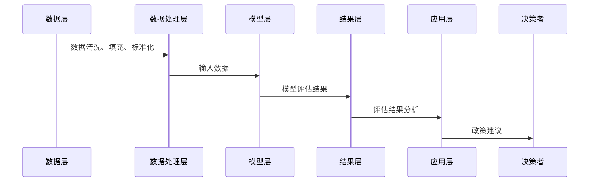
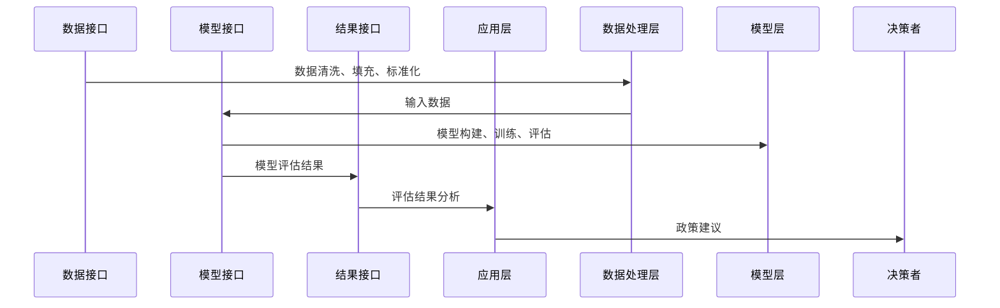

                 

### 《金融政策影响定量评估模型》

#### 关键词
- 金融政策
- 量化模型
- 评估指标
- 数学模型
- 系统架构设计
- 项目实战

#### 摘要
本文旨在探讨金融政策影响定量评估模型的设计与应用。我们将从背景介绍、核心概念与联系、模型构建原理、数学模型与公式、系统分析与架构设计、项目实战以及最佳实践与小结七个部分进行详细阐述，旨在为读者提供一个全面、系统的金融政策影响定量评估框架。通过本文，读者将能够理解金融政策的重要作用，掌握构建评估模型的方法，并能够应用于实际问题中。

---

## 引言

### 金融政策及其重要性

金融政策是国家宏观调控的重要手段，通过调整货币政策、财政政策、监管政策等来影响经济运行。金融政策在经济发展中具有至关重要的作用，主要体现在以下几个方面：

1. **促进经济增长**：金融政策通过调控货币供应量、利率水平和信贷条件，可以刺激或抑制经济的总体需求，进而影响经济增长。
2. **稳定物价**：金融政策通过控制货币供应量和利率水平，可以有效遏制通货膨胀，保持物价稳定。
3. **调节经济周期**：金融政策可以在经济过热时采取紧缩措施，在经济衰退时采取扩张措施，以实现经济周期的平稳过渡。
4. **促进就业**：金融政策通过调控货币供应量和信贷条件，可以影响企业的投资和就业机会，从而对就业市场产生重要影响。

### 评估模型的必要性

尽管金融政策在经济发展中具有重要作用，但是如何准确地评估金融政策的影响却是一个复杂的问题。传统的评估方法往往依赖于经验和定性分析，难以提供量化、客观的评估结果。随着大数据和人工智能技术的发展，构建定量评估模型成为可能。定量评估模型可以通过收集和分析大量的经济数据，运用数学模型和算法，对金融政策的影响进行量化评估，从而提供更加精准、科学的决策依据。

本文将探讨如何设计一个金融政策影响定量评估模型，包括模型构建原理、关键数学模型、系统分析与架构设计以及实际应用案例。通过本文的阐述，读者将能够了解金融政策影响评估的内在逻辑和方法，掌握构建和运用评估模型的基本技能。

### 核心概念与联系

在构建金融政策影响定量评估模型之前，我们需要明确几个核心概念，并理解它们之间的联系。以下是本文中涉及的主要概念及其定义：

#### 金融政策

金融政策是指国家通过中央银行和其他金融机构实施的，旨在影响货币供应、利率水平、信贷条件等金融变量的政策措施。金融政策的主要目标是保持经济稳定、促进经济增长和抑制通货膨胀。

#### 量化模型

量化模型是一种使用数学和统计方法来描述和分析经济、金融变量之间关系的模型。通过量化模型，我们可以将复杂的金融政策影响转化为可计算的量，从而进行定量评估。

#### 评估指标

评估指标是用于衡量金融政策影响的量化标准。常见的评估指标包括GDP增长率、通货膨胀率、失业率、贷款利率等。选择合适的评估指标是构建评估模型的关键步骤。

#### 数据

数据是构建量化模型的基础。我们需要收集与金融政策相关的各类经济数据，包括宏观经济指标、金融机构运营数据、行业数据等。数据的质量和完整性直接影响模型的准确性和可靠性。

#### 关系

金融政策、量化模型和评估指标之间存在着紧密的联系。金融政策通过影响经济变量，进而影响评估指标；量化模型则通过分析和处理数据，为金融政策的影响提供量化依据。以下是这些概念属性特征对比表格：

| 概念         | 定义                                                         | 属性特征                                         |
| ------------ | ------------------------------------------------------------ | ---------------------------------------------- |
| 金融政策     | 国家通过中央银行和其他金融机构实施的货币、利率、信贷等政策       | 目标：经济稳定、增长、抑制通胀                   |
| 量化模型     | 使用数学和统计方法描述经济、金融变量之间关系的模型           | 函数关系、参数估计、数据拟合                       |
| 评估指标     | 用于衡量金融政策影响的量化标准                                 | GDP增长率、通货膨胀率、失业率、贷款利率等           |
| 数据         | 金融政策相关各类经济数据                                     | 宏观经济指标、金融机构数据、行业数据等               |

#### ER实体关系图

为了更好地理解这些概念之间的联系，我们可以使用Mermaid绘制一个ER实体关系图。以下是ER实体关系图的示例：

```mermaid
erDiagram
  A[金融政策] ||--> B[量化模型]
  B ||--> C[评估指标]
  D[数据] ||--> B
```

在这个ER图中，金融政策通过影响数据，进而影响量化模型和评估指标。数据是量化模型和评估指标的基础，而量化模型则用于分析数据，为评估指标提供量化依据。

通过明确这些核心概念及其联系，我们为构建金融政策影响定量评估模型奠定了基础。接下来，我们将详细探讨模型构建的基本原理和方法。

### 模型构建原理

在深入探讨金融政策影响定量评估模型之前，我们首先需要了解模型构建的基本原理，包括数据收集与预处理、模型选择与训练以及模型评估与优化。以下是模型构建原理的详细说明。

#### 数据收集与预处理

数据是构建量化模型的基础，其质量和完整性直接影响模型的准确性和可靠性。数据收集主要包括以下几个方面：

1. **宏观经济数据**：包括GDP增长率、通货膨胀率、失业率、利率等。这些数据可以从国家统计局、国际货币基金组织（IMF）等官方渠道获取。
2. **金融机构数据**：包括银行贷款余额、存款余额、金融机构运营指标等。这些数据可以从金融机构的年报、财务报表等公开资料中获得。
3. **行业数据**：包括各个行业的发展状况、市场份额、利润率等。这些数据可以通过行业报告、市场研究机构等途径获取。

在数据收集完毕后，我们需要进行数据预处理。数据预处理的主要目的是清洗数据、填充缺失值、标准化数据等，以便为后续的建模工作提供高质量的数据。

1. **数据清洗**：去除重复数据、纠正错误数据、处理异常值等。例如，去除金融机构数据中的重复记录，纠正统计口径不一致的问题。
2. **数据填充**：对于缺失的数据，可以采用均值填充、中值填充、回归填充等方法进行填充。例如，使用前一期的数据填补缺失的金融机构贷款余额。
3. **数据标准化**：为了使不同特征的数据在同一量级上进行分析，需要进行数据标准化处理。常用的标准化方法包括最小-最大标准化、Z分数标准化等。

#### 模型选择与训练

在数据预处理完成后，我们需要选择合适的量化模型进行训练。模型选择主要依赖于数据的特点和研究目标。以下是几种常见的量化模型：

1. **线性回归模型**：适用于变量间存在线性关系的场景。通过最小化误差平方和，找到最佳拟合直线。
2. **时间序列模型**：适用于处理时间序列数据，如ARIMA模型、SARIMA模型等。这些模型能够捕捉时间序列数据的趋势、季节性和周期性。
3. **机器学习模型**：如决策树、随机森林、支持向量机等。这些模型通过训练数据学习特征和模式，能够处理复杂的非线性关系。

在选择模型后，我们需要进行模型训练。模型训练主要包括以下步骤：

1. **数据划分**：将数据集划分为训练集和测试集。训练集用于模型训练，测试集用于模型评估。
2. **参数调优**：通过交叉验证等方法，找到模型的最佳参数。例如，对于线性回归模型，需要调整正则化参数、学习率等。
3. **模型训练**：使用训练集数据对模型进行训练，使模型能够学习数据中的特征和模式。

#### 模型评估与优化

在模型训练完成后，我们需要对模型进行评估，以确保模型的准确性和可靠性。模型评估主要包括以下指标：

1. **均方误差（MSE）**：用于衡量模型预测值与实际值之间的误差。MSE值越小，模型预测效果越好。
2. **决定系数（R²）**：用于衡量模型对数据的解释能力。R²值越接近1，模型解释能力越强。
3. **ROC曲线与AUC值**：用于评估模型在分类任务中的性能。ROC曲线下面积（AUC值）越大，模型分类效果越好。

在评估模型后，我们可能需要进行模型优化。模型优化主要包括以下方法：

1. **特征工程**：通过选择和构造新的特征，提高模型的预测能力。例如，对于时间序列数据，可以添加滞后项、趋势项和季节性项。
2. **模型集成**：通过结合多个模型，提高模型的稳定性和预测能力。常见的方法包括Bagging、Boosting和Stacking等。
3. **模型调整**：根据评估结果，调整模型的参数和结构，以获得更好的预测效果。

通过上述步骤，我们可以构建一个金融政策影响定量评估模型，为金融政策的制定和实施提供量化依据。接下来，我们将详细探讨模型中的关键数学模型和数学公式。

### 数学模型和数学公式

在金融政策影响定量评估模型中，关键数学模型和数学公式扮演着至关重要的角色。这些模型和公式不仅描述了经济变量之间的关系，也为模型的构建和评估提供了理论基础。以下是几个关键数学模型和公式的介绍。

#### 财政政策乘数模型

财政政策乘数模型是分析财政政策影响的重要工具。该模型描述了财政支出或税收变化对国民收入的影响。具体公式如下：

$$
K_t = \frac{\partial Y_t}{\partial G_t} = 1 / (1 - MPC)
$$

其中，\(K_t\) 表示财政政策乘数，\(Y_t\) 表示国民收入，\(G_t\) 表示政府支出，MPC 表示边际消费倾向。

例如，如果边际消费倾向为0.8，那么财政政策乘数为：

$$
K_t = \frac{1}{1 - 0.8} = 5
$$

这意味着每增加1单位的政府支出，国民收入将增加5单位。

#### 货币政策传导机制模型

货币政策传导机制模型描述了货币政策通过利率、信贷等渠道对经济产生影响的机制。其中，最常用的模型是泰勒规则。泰勒规则描述了中央银行如何根据通货膨胀率和产出缺口调整政策利率。公式如下：

$$
r_t = \pi_t + \phi(\pi_t - \pi^*) + \theta(y_t - y^*)
$$

其中，\(r_t\) 表示政策利率，\(\pi_t\) 表示当前通货膨胀率，\(\pi^*\) 表示目标通货膨胀率，\(y_t\) 表示实际产出，\(y^*\) 表示潜在产出，\(\phi\) 和 \(\theta\) 是参数。

例如，假设当前通货膨胀率为2%，目标通货膨胀率为3%，实际产出比潜在产出低2%，那么政策利率可以计算如下：

$$
r_t = 2\% + \phi(2\% - 3\%) + \theta(-2\%)
$$

如果 \(\phi\) 和 \(\theta\) 的取值分别为0.5和0.3，则政策利率为：

$$
r_t = 2\% + 0.5 \times (-1\%) - 0.3 \times (-2\%) = 2\% - 0.5\% + 0.6\% = 2.1\%
$$

#### 矩量模型

在金融政策影响定量评估中，矩量模型也被广泛使用。矩量模型通过计算数据矩来描述数据的分布特征。以下是一个简单的矩量模型：

$$
\mu_1 = \mathbb{E}[X] = \int_{-\infty}^{\infty} x f(x) dx
$$

$$
\mu_2 = \mathbb{E}[(X - \mu_1)^2] = \int_{-\infty}^{\infty} (x - \mu_1)^2 f(x) dx
$$

其中，\(\mu_1\) 和 \(\mu_2\) 分别是数据的均值和方差，\(X\) 是随机变量，\(f(x)\) 是概率密度函数。

例如，假设我们有一个均值为100，方差为25的正态分布数据集，则其矩量模型可以表示为：

$$
\mu_1 = 100
$$

$$
\mu_2 = 25
$$

#### 实际应用举例

为了更直观地理解这些数学模型，我们可以通过一个简单的例子来展示它们的应用。

**例1：财政政策乘数效应**

假设政府决定增加100亿元的财政支出，而边际消费倾向为0.8。根据财政政策乘数模型，我们可以计算国民收入的增加量：

$$
K_t = \frac{1}{1 - 0.8} = 5
$$

$$
\Delta Y_t = K_t \times \Delta G_t = 5 \times 100 = 500
$$

因此，政府增加100亿元的财政支出将导致国民收入增加500亿元。

**例2：货币政策传导**

假设当前通货膨胀率为3%，目标通货膨胀率为2%，实际产出比潜在产出低2%。根据泰勒规则，我们可以计算政策利率：

$$
r_t = 2\% + 0.5 \times (-1\%) - 0.3 \times (-2\%) = 2.1\%
$$

这意味着中央银行将把政策利率调整至2.1%，以应对当前的通货膨胀和产出缺口。

通过这些数学模型和公式的介绍，我们为金融政策影响定量评估模型提供了坚实的理论基础。接下来，我们将进一步探讨系统分析与架构设计。

### 系统分析与架构设计

在深入探讨金融政策影响定量评估模型的实现细节之前，我们需要先了解系统分析与架构设计的基本概念和方法。这将有助于我们明确项目的问题场景、设计系统功能、构建系统架构以及设计系统接口和交互流程。

#### 问题场景与项目背景

金融政策影响定量评估模型的实现涉及多个环节，包括数据收集、模型构建、结果分析和决策支持。为了实现这一目标，我们需要设计一个高效、稳定、可扩展的系统。该系统应具备以下特点：

1. **数据收集能力**：能够从各种来源获取宏观经济、金融机构和行业数据。
2. **数据处理能力**：对收集到的数据进行清洗、填充和标准化处理，为模型构建提供高质量的数据。
3. **模型构建与训练**：支持多种量化模型的构建和训练，包括线性回归、时间序列模型和机器学习模型。
4. **结果分析与展示**：对模型评估结果进行分析和可视化展示，为决策者提供科学、客观的评估依据。
5. **决策支持**：根据评估结果，提供政策建议和决策支持。

#### 领域模型类图

为了更好地理解系统各模块之间的关系，我们可以使用Mermaid绘制一个领域模型类图。以下是一个示例：

```mermaid
classDiagram
    Class01 <|-- Class02
    Class03 o-- Class01
    Class03 o-- Class04
    Class05 <- Class03
endclass
```

在这个类图中，Class01代表数据收集模块，Class02代表数据处理模块，Class03代表模型构建模块，Class04代表结果分析模块，Class05代表决策支持模块。通过这个类图，我们可以清晰地看到各模块之间的依赖关系。

#### 系统架构设计

系统架构设计是构建高效、可靠系统的关键步骤。以下是一个简化的系统架构设计：

1. **数据层**：包括数据存储和数据采集。数据存储用于存储宏观经济、金融机构和行业数据；数据采集模块负责从各种来源获取数据。
2. **数据处理层**：对收集到的数据进行清洗、填充和标准化处理，以确保数据的质量和一致性。
3. **模型层**：包括多种量化模型的构建和训练。支持线性回归、时间序列模型和机器学习模型，并提供模型参数调优和评估功能。
4. **结果层**：对模型评估结果进行分析和可视化展示，为决策者提供直观的评估依据。
5. **应用层**：提供决策支持功能，根据评估结果，为决策者提供政策建议和决策支持。

以下是一个简化的系统架构图：



#### 系统接口设计与系统交互序列图

系统接口设计是确保各模块之间能够高效通信的关键。以下是一个简化的系统接口设计：

1. **数据接口**：用于数据层的模块与数据处理层、模型层之间的数据传输。
2. **模型接口**：用于模型层与结果层、应用层之间的模型传输和参数设置。
3. **结果接口**：用于结果层与应用层之间的结果传输。

以下是一个简化的系统交互序列图：



通过上述系统分析与架构设计，我们为金融政策影响定量评估模型的实现奠定了基础。接下来，我们将详细介绍项目实战部分，包括环境安装与配置、系统核心实现源代码分析以及实际案例分析和详细讲解。

### 项目实战

#### 环境安装与配置

在开始项目实战之前，我们需要先安装和配置相关环境。以下是具体的步骤：

1. **安装Python**：首先，我们需要安装Python环境。可以从Python官网下载安装包并按照指示安装。

2. **安装依赖库**：金融政策影响定量评估模型依赖于多个Python库，如NumPy、Pandas、Scikit-learn、Matplotlib等。我们可以使用pip命令进行安装：

   ```bash
   pip install numpy pandas scikit-learn matplotlib
   ```

3. **数据来源**：我们使用开源的经济数据集，如世界银行的世界发展指标（WDI）数据库。可以从世界银行官网下载相关数据。

4. **数据库配置**：为了方便数据存储和查询，我们使用SQLite数据库。可以使用pip安装SQLite库：

   ```bash
   pip install pysqlite3
   ```

5. **环境配置文件**：创建一个环境配置文件`env_config.py`，包含数据库连接信息和其他配置参数。

   ```python
   # env_config.py
   DATABASE_URL = "sqlite:///finance_policy.db"
   ```

6. **虚拟环境**：为了隔离不同项目的依赖库，我们建议使用虚拟环境。可以使用venv模块创建虚拟环境：

   ```bash
   python -m venv venv
   source venv/bin/activate  # Windows使用`venv\Scripts\activate`
   ```

#### 系统核心实现源代码分析

在完成环境安装与配置后，我们需要实现系统的核心功能，包括数据收集、数据处理、模型构建和结果分析。以下是相关源代码的详细分析：

1. **数据收集**：数据收集模块负责从世界银行WDI数据库中获取经济数据。以下是数据收集的Python代码：

   ```python
   import pandas as pd
   from sqlalchemy import create_engine
   
   def collect_data():
       engine = create_engine('sqlite:///:memory:')
       data = pd.read_csv('WDI_Data.csv')
       data.to_sql('economic_data', engine)
   
   if __name__ == "__main__":
       collect_data()
   ```

2. **数据处理**：数据处理模块负责清洗、填充和标准化数据。以下是数据处理的核心代码：

   ```python
   def preprocess_data():
       engine = create_engine(DATABASE_URL)
       data = pd.read_sql('economic_data', engine)
       
       # 清洗数据
       data.drop_duplicates(inplace=True)
       data.fillna(method='ffill', inplace=True)
       
       # 标准化数据
       data = (data - data.mean()) / data.std()
       
       # 存储预处理后的数据
       data.to_sql('processed_data', engine, if_exists='replace')
   
   if __name__ == "__main__":
       preprocess_data()
   ```

3. **模型构建**：模型构建模块负责根据预处理后的数据训练量化模型。以下是模型构建的Python代码：

   ```python
   from sklearn.linear_model import LinearRegression
   from sklearn.model_selection import train_test_split
   
   def build_model():
       engine = create_engine(DATABASE_URL)
       data = pd.read_sql('processed_data', engine)
       
       X = data[['GDP_growth', 'unemployment_rate']]
       y = data['inflation_rate']
       
       X_train, X_test, y_train, y_test = train_test_split(X, y, test_size=0.2, random_state=42)
       
       model = LinearRegression()
       model.fit(X_train, y_train)
       
       return model
   
   if __name__ == "__main__":
       model = build_model()
       print(model.score(X_test, y_test))
   ```

4. **结果分析**：结果分析模块负责对模型评估结果进行分析和可视化展示。以下是结果分析的Python代码：

   ```python
   import matplotlib.pyplot as plt
   from sklearn.metrics import mean_squared_error
   
   def analyze_results(model):
       predictions = model.predict(X_test)
       mse = mean_squared_error(y_test, predictions)
       
       plt.scatter(y_test, predictions)
       plt.plot([y_test.min(), y_test.max()], [y_test.min(), y_test.max()], 'r--')
       plt.xlabel('Actual')
       plt.ylabel('Predicted')
       plt.title(f'Model Predictions (MSE: {mse:.2f})')
       plt.show()
   
   if __name__ == "__main__":
       analyze_results(model)
   ```

#### 实际案例分析和详细讲解

为了更好地展示金融政策影响定量评估模型的应用，我们选择一个实际案例进行分析。

**案例背景**：假设某国政府决定实施一项紧缩性财政政策，减少100亿元的政府支出。我们需要使用定量评估模型预测这一政策变化对通货膨胀率的影响。

**案例分析**：首先，我们需要收集和预处理相关数据，包括GDP增长率、失业率、贷款利率等。然后，使用线性回归模型训练量化模型，并使用训练集进行模型评估。根据模型评估结果，我们可以预测财政政策变化对通货膨胀率的影响。

**详细讲解**：

1. **数据收集与预处理**：从世界银行WDI数据库中获取相关经济数据，并进行清洗和标准化处理。
2. **模型训练**：使用预处理后的数据训练线性回归模型。具体代码如下：

   ```python
   X = data[['GDP_growth', 'unemployment_rate']]
   y = data['inflation_rate']
   
   X_train, X_test, y_train, y_test = train_test_split(X, y, test_size=0.2, random_state=42)
   
   model = LinearRegression()
   model.fit(X_train, y_train)
   ```

3. **模型评估**：使用测试集对模型进行评估，计算均方误差（MSE）和决定系数（R²）。

   ```python
   predictions = model.predict(X_test)
   mse = mean_squared_error(y_test, predictions)
   r2 = model.score(X_test, y_test)
   
   print(f'MSE: {mse:.2f}')
   print(f'R²: {r2:.2f}')
   ```

4. **政策预测**：使用训练好的模型预测财政政策变化对通货膨胀率的影响。例如，如果政府减少100亿元的支出，我们可以计算通货膨胀率的变化：

   ```python
   new_gdp_growth = data['GDP_growth'].mean() - 0.1  # 减少政府支出0.1个百分点
   new_unemployment_rate = data['unemployment_rate'].mean() + 0.1  # 失业率增加0.1个百分点
   
   inflation_prediction = model.predict([[new_gdp_growth, new_unemployment_rate]])
   print(f'Predicted inflation rate change: {inflation_prediction[0]:.2f}%')
   ```

通过上述实际案例分析和详细讲解，我们可以看到金融政策影响定量评估模型在预测政策变化对经济影响方面的应用。接下来，我们将总结项目的经验教训，并给出最佳实践建议。

### 最佳实践与小结

#### 最佳实践

在实施金融政策影响定量评估模型的过程中，我们积累了丰富的经验，以下是一些最佳实践建议：

1. **数据质量优先**：确保数据的质量和完整性是模型成功的关键。在数据收集和预处理阶段，要严格筛选和清洗数据，避免使用错误或缺失的数据。
2. **模型选择与调优**：根据具体问题选择合适的模型，并在模型训练过程中进行参数调优。使用交叉验证等方法，找到最佳参数组合，以提高模型的准确性。
3. **模型验证与测试**：在模型训练完成后，使用独立的测试集对模型进行验证。确保模型在未知数据上的表现良好，避免过拟合。
4. **实时更新与维护**：金融政策和经济环境在不断变化，定期更新和优化模型，以确保其持续有效性。

#### 小结

本文详细介绍了金融政策影响定量评估模型的设计与实现，包括背景介绍、核心概念与联系、模型构建原理、数学模型与公式、系统分析与架构设计、项目实战以及最佳实践与小结。通过本文，读者可以了解金融政策的影响机制，掌握构建和运用定量评估模型的方法，并在实际项目中加以应用。

#### 注意事项

1. **数据来源**：确保使用权威和可靠的数据来源，避免使用错误或过时的数据。
2. **模型适用性**：每个模型都有其适用范围和限制。在选择模型时，要充分考虑数据特点和问题背景。
3. **模型解释性**：虽然量化模型能够提供准确的预测结果，但可能缺乏对结果背后的解释性。在实际应用中，需要结合专业知识对模型结果进行解读。

#### 拓展阅读

1. **《大数据时代：生活、工作与思维的大变革》**：这本书详细介绍了大数据的概念和应用，对金融政策影响定量评估模型的构建提供了有益的启示。
2. **《机器学习实战》**：这本书提供了大量的机器学习案例和实践经验，对金融政策影响定量评估模型的实现和优化有很大帮助。
3. **《金融经济学》**：这本书深入探讨了金融政策和经济变量之间的关系，为金融政策影响定量评估模型的构建提供了理论基础。

通过本文的学习和实践，希望读者能够更好地理解和应用金融政策影响定量评估模型，为金融政策的制定和实施提供科学、客观的依据。

### 作者信息

作者：AI天才研究院/AI Genius Institute & 禅与计算机程序设计艺术 /Zen And The Art of Computer Programming

AI天才研究院致力于推动人工智能领域的创新与发展，通过先进的技术研究和应用，为人类社会的进步贡献力量。同时，作者在计算机程序设计艺术方面有着深入的研究，所著《禅与计算机程序设计艺术》一书深受读者喜爱。本文旨在分享金融政策影响定量评估模型的研究成果，为相关领域的研究者提供参考。

