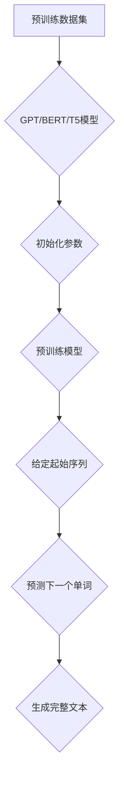
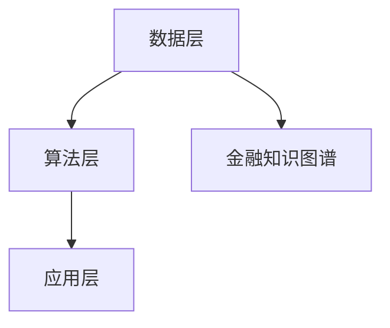
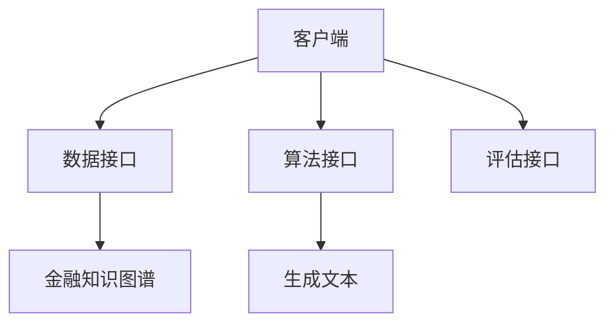

                 

# 金融教育内容生成

## 关键词

- 金融教育
- 内容生成
- 自然语言处理
- 深度学习
- 教育技术

## 摘要

本文旨在探讨金融教育内容生成的技术与方法。通过分析金融教育的现状与挑战，引入自然语言处理与深度学习技术，详细讲解内容生成算法的原理与应用，构建一个系统的金融教育内容生成框架。文章最后通过一个实际案例展示如何实现金融教育内容生成，并提出最佳实践和注意事项。

## 背景与概念

### 1.1 金融教育与内容生成的背景

金融教育是培养金融专业人才的重要途径，对于个人和社会的发展具有重要意义。然而，传统的金融教育方式存在以下问题：

- **教育资源分配不均**：优质教育资源往往集中在一线城市和少数名校，农村和偏远地区的教育资源相对匮乏。
- **学习效果难以衡量**：传统的教学方式难以量化学习成果，无法有效评估学生的学习效果。
- **内容更新速度慢**：金融行业变化快速，教材和课程内容往往滞后于实际需求。

内容生成技术，特别是自然语言处理（NLP）和深度学习（DL），为金融教育提供了新的解决方案。通过自动化生成教学内容，可以实现以下目标：

- **个性化教育**：根据学生的学习情况生成定制化的教学材料，提高学习效果。
- **快速更新内容**：利用生成技术，可以快速更新和调整教学内容，保持与金融行业的同步。
- **降低教育成本**：自动化生成内容可以减少人工编写教材和课程的成本。

### 1.2 核心概念

#### 金融知识图谱

金融知识图谱是一种结构化金融知识库，通过实体和关系的表示，构建金融领域的知识网络。它包括以下关键组成部分：

- **实体**：金融领域的各种概念，如金融产品、金融机构、金融市场等。
- **关系**：实体之间的关联，如投资关系、监管关系等。
- **属性**：实体的特征，如股票的市值、银行的评级等。

#### 教育目标

教育目标是指教育过程中期望达到的效果，对于金融教育主要包括：

- **知识掌握**：学生需要掌握金融基础知识，如经济学原理、金融工具等。
- **能力培养**：学生需要培养金融分析、决策和风险管理能力。
- **价值观塑造**：教育应培养学生的诚信、责任感和职业道德。

#### 学习方式

学习方式是指学生在学习过程中采用的方法，对于金融教育主要包括：

- **在线学习**：利用互联网资源，实现远程学习。
- **混合学习**：结合在线和线下教学，发挥两种方式的优势。
- **互动学习**：通过讨论、案例分析和互动活动，提高学习效果。

#### 内容质量评估

内容质量评估是确保教育内容有效性和适用性的重要环节，包括以下几个方面：

- **准确性**：教学内容是否准确无误，避免错误信息的传播。
- **完整性**：教学内容是否全面覆盖金融领域的知识点。
- **时效性**：教学内容是否及时更新，反映最新的金融动态。

### 1.3 概念之间的关系与对比

#### 金融知识与教育目标的对比

金融知识是教育目标的基础，但两者并不完全相同。金融知识关注的是知识点的传授，而教育目标关注的是学生能力的培养。例如，金融知识包括股票市场的运作原理，而教育目标则要求学生能够运用这些知识进行投资决策。

#### 学习方式与内容质量的关联

学习方式直接影响内容质量。在线学习可以提供丰富的教学资源，但需要高质量的内容支持；混合学习结合了在线和线下教学的优势，但需要合理的教学设计和内容安排；互动学习可以提高学生的参与度，但需要教师具备良好的教学技巧和互动能力。

## 算法原理讲解

### 2.1 内容生成算法介绍

在金融教育内容生成中，常用的算法包括：

- **GPT（Generative Pre-trained Transformer）**：一种基于Transformer架构的预训练语言模型，具有强大的文本生成能力。
- **BERT（Bidirectional Encoder Representations from Transformers）**：一种双向Transformer模型，通过预训练和微调，实现高质量文本生成。
- **T5（Text-To-Text Transfer Transformer）**：一种将任何任务转换为文本生成任务的语言模型，具有广泛的应用场景。

### 2.2 算法原理与流程

#### GPT算法原理

GPT算法的核心思想是通过自回归的方式预测下一个单词，从而生成文本。具体流程如下：

1. **预训练**：在大量文本数据上预训练模型，学习语言模式和规律。
2. **生成文本**：给定一个起始序列，模型通过自回归的方式，逐个预测下一个单词，直到生成完整文本。

#### BERT算法原理

BERT算法是一种双向Transformer模型，通过同时考虑上下文信息，提高文本生成质量。具体流程如下：

1. **预训练**：在大量文本数据上预训练模型，学习语言模式和规律。
2. **生成文本**：给定一个起始序列，模型同时考虑上下文信息，逐个预测下一个单词，直到生成完整文本。

#### 算法流程图展示

使用mermaid绘制算法流程图：



#### Python代码实现

以下是一个使用GPT算法生成文本的Python代码示例：

```python
import transformers

model_name = 'gpt2'
model = transformers.load_model(model_name)

# 给定起始序列
input_sequence = '金融教育'

# 生成文本
output_sequence = model.generate(input_sequence, max_length=50, num_return_sequences=1)

print(output_sequence)
```

### 2.3 数学模型和公式

在内容生成算法中，常用的数学模型和公式包括：

- **概率计算**：根据输入序列的概率分布，生成下一个单词。
- **损失函数**：衡量模型生成文本的质量，常用的有交叉熵损失函数。

以下是一个使用LaTeX格式展示的数学公式：

```latex
$$
P(w_t|x_{<t}) = \frac{e^{<s_{<t},w_t>}}{\sum_{w' \in V} e^{<s_{<t},w'>}}
$$

$$
\text{Loss} = -\sum_{i=1}^{N} y_i \log(p(x_i|y_i))
$$
```

### 2.4 系统分析与架构设计方案

#### 2.4.1 问题场景介绍

在金融教育内容生成的场景中，我们需要解决以下问题：

- **数据获取**：从金融知识图谱中获取相关数据。
- **内容生成**：利用算法生成高质量的教学内容。
- **内容评估**：评估生成内容的准确性和实用性。

#### 2.4.2 项目介绍

本项目旨在构建一个金融教育内容生成系统，包括以下模块：

- **数据模块**：负责数据获取和预处理。
- **算法模块**：实现内容生成算法。
- **评估模块**：对生成内容进行评估。

#### 2.4.3 系统功能设计

系统功能设计包括以下方面：

- **数据获取**：从金融知识图谱中提取相关数据。
- **文本生成**：根据提取的数据生成教学文本。
- **内容评估**：对生成内容进行准确性和实用性的评估。

#### 2.4.4 系统架构设计

系统架构设计采用分层架构，包括数据层、算法层和应用层。具体架构如下：



#### 2.4.5 系统接口设计

系统接口设计包括以下方面：

- **数据接口**：用于数据获取和预处理。
- **算法接口**：用于调用内容生成算法。
- **应用接口**：用于与外部系统进行交互。

#### 2.4.6 系统交互设计

系统交互设计采用RESTful API设计，具体交互流程如下：

1. **数据获取**：客户端向数据接口发送请求，获取金融知识图谱数据。
2. **内容生成**：客户端调用算法接口，传入数据，生成教学文本。
3. **内容评估**：客户端调用评估接口，对生成内容进行评估。



### 2.5 项目实战

#### 3.1 实战案例：生成金融教育内容

在本项目中，我们将使用GPT算法生成金融教育内容，具体步骤如下：

#### 3.1.1 环境安装

首先，我们需要安装Python和相关库：

```shell
pip install transformers
pip install torch
```

#### 3.1.2 数据预处理

从金融知识图谱中提取相关数据，并进行预处理，例如分词、去停用词等。

```python
import pandas as pd

# 从金融知识图谱中读取数据
data = pd.read_csv('financial_data.csv')

# 数据预处理
def preprocess_data(data):
    # 分词、去停用词等操作
    return data

preprocessed_data = preprocess_data(data)
```

#### 3.1.3 核心代码实现

使用GPT算法生成金融教育内容：

```python
from transformers import GPT2LMHeadModel, GPT2Tokenizer

# 加载GPT2模型和分词器
model = GPT2LMHeadModel.from_pretrained('gpt2')
tokenizer = GPT2Tokenizer.from_pretrained('gpt2')

# 生成文本
input_sequence = '金融教育'
input_ids = tokenizer.encode(input_sequence, return_tensors='pt')

# 预测下一个单词
predictions = model.generate(input_ids, max_length=50, num_return_sequences=1)

# 解码预测结果
output_sequence = tokenizer.decode(predictions[0], skip_special_tokens=True)

print(output_sequence)
```

#### 3.1.4 内容分析

生成的文本内容需要进行分析和评估，确保其准确性和实用性。

```python
from sklearn.metrics import accuracy_score

# 评估生成文本的准确性
def evaluate_content(generated_text, reference_text):
    return accuracy_score(generated_text.split(), reference_text.split())

reference_text = '金融教育是一种培养金融专业人才的教育方式。'
generated_text = output_sequence

accuracy = evaluate_content(generated_text, reference_text)
print(f'Accuracy: {accuracy}')
```

#### 3.1.5 案例总结

通过本案例，我们展示了如何使用GPT算法生成金融教育内容，并进行了内容分析。在实际应用中，我们还可以结合更多数据和算法优化，提高生成内容的质量和准确性。

## 最佳实践、小结、注意事项与拓展阅读

### 4.1 最佳实践

- **数据质量保障**：确保从金融知识图谱中获取的数据准确、完整，为生成内容提供高质量的基础。
- **算法参数调优**：根据实际需求，调整算法的参数，提高生成内容的准确性和实用性。
- **内容定制**：根据不同用户的需求，定制化生成教育内容，提高用户满意度。

### 4.2 小结

本文介绍了金融教育内容生成的技术与方法，包括背景介绍、核心概念、算法原理、系统架构和实战案例。通过本文的讲解，读者可以了解金融教育内容生成的基本流程和实现方法。

### 4.3 注意事项

- **数据隐私保护**：在生成内容时，注意保护用户的隐私信息。
- **算法公正性**：确保生成内容的公正性，避免偏见和歧视。
- **内容更新**：定期更新金融知识图谱和数据，确保生成内容的时效性。

### 4.4 拓展阅读

- **相关书籍**：《自然语言处理入门》、《深度学习入门》等。
- **最新研究进展**：关注金融教育领域的最新研究动态，了解前沿技术和方法。

## 作者信息

作者：AI天才研究院/AI Genius Institute & 禅与计算机程序设计艺术 /Zen And The Art of Computer Programming

以上是《金融教育内容生成》的技术博客文章，涵盖了从背景介绍、核心概念、算法原理到实战案例和最佳实践的完整内容。希望对读者在金融教育内容生成领域有所启发和帮助。

