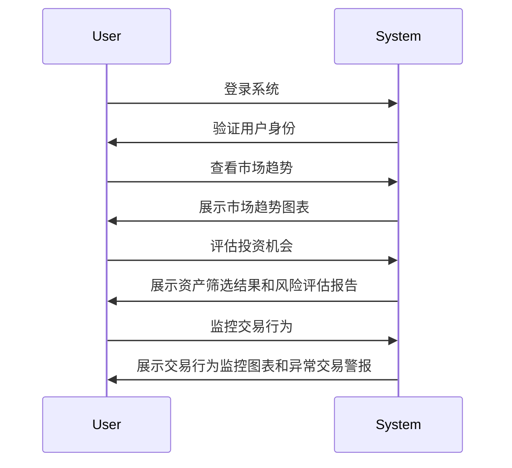

                 

# 金融数据可视化：技术与最佳实践

> 关键词：金融数据、可视化、技术、最佳实践

> 摘要：本文将深入探讨金融数据可视化的重要性及其应用，介绍数据可视化基础理论、核心概念、技术实现和最佳实践，以期为金融行业的数字革命提供技术支持和决策依据。

## 《金融数据可视化：技术与最佳实践》目录大纲

### 第一部分：引言

- 第1章：金融数据可视化的背景与重要性
- 第2章：数据可视化基础理论

### 第二部分：核心概念与原理

- 第3章：金融数据可视化的核心概念与联系
- 第4章：金融数据可视化技术

### 第三部分：最佳实践与案例分析

- 第5章：金融数据可视化最佳实践
- 第6章：案例分析：金融数据可视化在实战中的应用
- 第7章：小结与展望

## 第1章：金融数据可视化的背景与重要性

### 1.1 问题背景

#### 1.1.1 金融行业的数字革命

金融行业在过去几十年中经历了深刻的数字革命。随着互联网和大数据技术的飞速发展，金融机构开始大规模地收集、存储和分析海量数据。这些数据不仅包括交易记录、客户信息，还包括市场趋势、经济指标等。数字革命使得金融行业从传统的人工处理数据转向了数据驱动的决策模式。

#### 1.1.2 数据驱动决策的必要性

数据驱动决策已经成为现代金融行业的核心。通过分析数据，金融机构能够更好地了解市场动态、客户需求和潜在风险，从而做出更为明智的决策。然而，面对海量数据，如何快速有效地提取和分析信息成为一个巨大的挑战。数据可视化技术正是在这样的背景下应运而生。

#### 1.1.3 可视化技术在金融领域的应用现状

可视化技术在金融领域已经得到了广泛的应用。例如，金融机构使用可视化工具来分析市场趋势、评估信用风险、监控交易行为等。通过直观的图表和图形，数据分析师和决策者能够更快地理解数据，发现潜在的问题和机会。

### 1.2 问题描述

#### 1.2.1 金融数据的特点与挑战

金融数据具有量大、维度多、变化快等特点。这些特点使得金融数据可视化面临着诸多挑战。例如，如何有效地处理和展示多维度数据，如何快速响应数据的更新和变化，如何保证可视化结果的可信度和准确性等。

#### 1.2.2 数据可视化在金融分析中的角色

数据可视化在金融分析中扮演着至关重要的角色。它不仅能够帮助分析师快速理解数据，还能够为决策者提供有价值的洞察。例如，通过市场趋势可视化，决策者可以及时调整投资策略；通过信用评分可视化，金融机构可以更好地评估客户的信用风险。

#### 1.2.3 数据可视化技术的分类

数据可视化技术可以分为多种类型，包括但不限于：

- **基本可视化**：如柱状图、折线图、饼图等，用于展示数据的基本统计特征。
- **高级可视化**：如热力图、网络图、时间序列分析等，用于展示数据的复杂关系和动态变化。
- **交互式可视化**：如交互式图表、仪表盘等，用于提供用户与数据之间的互动。

### 1.3 问题解决

#### 1.3.1 数据可视化技术的价值

数据可视化技术为金融行业带来了巨大的价值。它不仅提高了数据分析的效率和准确性，还帮助金融机构更好地理解市场和客户，从而做出更为明智的决策。

#### 1.3.2 数据可视化在金融领域的主要应用

数据可视化在金融领域的应用非常广泛，主要包括：

- **市场分析**：通过可视化技术分析市场趋势、风险和机会。
- **信用评估**：通过可视化技术评估客户的信用风险。
- **交易监控**：通过可视化技术监控交易行为，发现异常和欺诈。
- **投资策略**：通过可视化技术分析投资组合的表现，调整投资策略。

#### 1.3.3 数据可视化的局限性

尽管数据可视化技术在金融领域有着广泛的应用，但它也存在一些局限性。例如，可视化技术可能无法完全捕捉数据的复杂性和多样性，用户可能需要具备一定的数据分析和可视化技能才能有效地使用可视化结果。

### 1.4 边界与外延

#### 1.4.1 金融数据可视化的应用场景

金融数据可视化的应用场景非常广泛，包括但不限于：

- **投资银行**：用于分析市场趋势、评估投资机会。
- **风险管理**：用于监控风险指标、识别潜在风险。
- **客户关系管理**：用于分析客户行为、提高客户满意度。
- **运营管理**：用于监控业务流程、优化业务效率。

#### 1.4.2 数据可视化与用户交互设计

数据可视化不仅仅是技术的展示，更是与用户交互的过程。用户交互设计在数据可视化中起着至关重要的作用。良好的用户交互设计可以提升用户的体验，帮助他们更快速地理解数据和做出决策。

#### 1.4.3 数据可视化与数据安全的平衡

数据可视化在提供洞察和便利的同时，也带来了数据安全的挑战。金融机构需要平衡数据可视化的需求和数据安全的要求，确保数据在可视化过程中不被泄露或滥用。

### 1.5 概念结构与核心要素组成

#### 1.5.1 数据可视化的核心概念

数据可视化涉及多个核心概念，包括数据、可视化、交互和用户等。

- **数据**：数据是可视化的基础，包括结构化和非结构化数据。
- **可视化**：可视化是将数据转换为图形或图像的过程，用于展示数据的特征和关系。
- **交互**：交互是用户与可视化结果的互动过程，包括缩放、筛选、排序等操作。
- **用户**：用户是数据可视化的最终受益者，他们需要能够有效地使用可视化结果。

#### 1.5.2 金融数据可视化的关键要素

金融数据可视化的关键要素包括数据来源、数据质量、可视化设计和技术实现等。

- **数据来源**：包括内部数据和外部数据，如交易记录、财务报表、市场数据等。
- **数据质量**：数据质量直接影响可视化结果的可信度和有效性。
- **可视化设计**：设计原则和规范对于提升数据可视化的效果至关重要。
- **技术实现**：技术实现是数据可视化成功的关键，包括数据采集、数据处理、可视化工具的选择等。

#### 1.5.3 数据可视化技术的层次结构

数据可视化技术可以分为多个层次，包括：

- **数据层**：数据采集、存储和处理。
- **可视化层**：可视化设计、图表选择和渲染。
- **交互层**：用户交互设计、交互操作和反馈。
- **应用层**：具体应用场景的实现和部署。

### 1.6 本章小结

本章介绍了金融数据可视化的背景与重要性，分析了金融数据的特点与挑战，探讨了数据可视化在金融分析中的角色和分类，并提出了数据可视化技术的价值、应用和局限性。同时，本章还讨论了金融数据可视化的应用场景、用户交互设计、数据安全平衡以及概念结构与核心要素组成。通过本章的介绍，读者可以初步了解金融数据可视化的重要性和应用前景。

## 第2章：数据可视化基础理论

### 2.1 数据可视化原理

#### 2.1.1 数据可视化的发展历程

数据可视化技术的发展可以追溯到20世纪中叶，随着计算机技术的发展和普及，数据可视化逐渐成为数据分析的重要工具。从最初的简单图表到如今复杂多样的可视化工具，数据可视化经历了多个发展阶段。

- **早期阶段**：主要以手绘图表为主，如折线图、柱状图等。
- **计算机辅助阶段**：计算机的出现使得数据可视化进入了新的阶段，可视化工具如Excel、MATLAB等开始普及。
- **高级阶段**：随着大数据和人工智能技术的发展，数据可视化变得更加智能化和交互化，如D3.js、Tableau等高级可视化工具的出现。

#### 2.1.2 数据可视化的理论基础

数据可视化的理论基础主要包括以下几个方面：

- **认知科学**：数据可视化旨在通过视觉化的方式帮助人们更好地理解和分析数据。认知科学提供了关于人类感知、记忆和思维的理论基础，对数据可视化设计具有重要的指导意义。
- **信息学**：信息学关注数据的表示、存储、传输和处理。在数据可视化中，信息学理论指导如何有效地组织、呈现和传递数据信息。
- **设计学**：设计学关注用户体验和界面设计。在数据可视化中，设计学理论指导如何设计直观、易用的可视化界面，提升用户的使用体验。

#### 2.1.3 数据可视化与认知科学

数据可视化与认知科学有着紧密的联系。认知科学理论认为，视觉是人类最重要的感官之一，视觉信息处理速度远快于文字和其他形式的信息。因此，数据可视化通过视觉化的方式可以帮助人们更快速、更准确地理解数据。

- **感知理论**：感知理论关注人类如何感知和理解外部世界。在数据可视化中，感知理论指导如何选择合适的图表类型和视觉元素，提升数据的可读性和易理解性。
- **记忆理论**：记忆理论关注人类如何记住和处理信息。在数据可视化中，记忆理论指导如何设计视觉化的信息，使其更容易被记忆和检索。
- **思维理论**：思维理论关注人类如何思考和处理问题。在数据可视化中，思维理论指导如何通过视觉化的方式引导用户思考，提升数据分析的深度和广度。

### 2.2 数据可视化模型

#### 2.2.1 基本数据可视化模型

基本数据可视化模型主要包括以下几种：

- **层次模型**：层次模型将数据按照一定的层次结构进行组织，如树状图、层次结构图等。层次模型适用于展示具有层次关系的数据，如组织结构、分类体系等。
- **网络模型**：网络模型将数据以网络的形式进行展示，如网络图、关系图等。网络模型适用于展示具有复杂关系和数据间相互影响的数据，如社交网络、金融市场等。
- **空间模型**：空间模型将数据在空间中进行布局，如地图、空间分布图等。空间模型适用于展示空间分布和数据差异，如地理信息、人口分布等。

#### 2.2.2 进阶数据可视化模型

进阶数据可视化模型包括以下几种：

- **交互模型**：交互模型通过用户与数据的互动，提升数据可视化的效果和用户体验。交互模型包括交互式图表、动态可视化等。交互模型适用于需要用户参与分析的场景，如数据分析、交互式探索等。
- **多层次模型**：多层次模型通过将数据分为多个层次，逐步揭示数据的细节和特征。多层次模型适用于展示复杂、多层次的数据，如决策树、分层次分析等。
- **集成模型**：集成模型通过将多种数据源和数据类型进行整合，提供更为全面的数据可视化。集成模型适用于需要跨领域、跨系统的数据分析，如大数据分析、综合信息展示等。

#### 2.2.3 数据可视化模型的应用

数据可视化模型在各个领域都有广泛的应用。以下是一些典型的应用场景：

- **科学研究和教育**：数据可视化模型用于展示科学实验结果、学术研究成果，提升教育效果。
- **商业分析**：数据可视化模型用于分析市场趋势、客户行为，指导商业决策。
- **政府和社会治理**：数据可视化模型用于展示社会数据、经济数据，提升社会治理水平。
- **文化艺术**：数据可视化模型用于艺术创作、文化展示，提升文化价值。

### 2.3 数据可视化方法

#### 2.3.1 常见数据可视化方法

常见的数据可视化方法包括以下几种：

- **图表法**：图表法通过图形和图表展示数据的统计特征和分布情况。常见的图表包括折线图、柱状图、饼图、散点图等。
- **地图法**：地图法通过地理信息系统展示数据的空间分布和地理位置信息。地图法适用于展示人口分布、经济活动、自然灾害等数据。
- **表格法**：表格法通过表格形式展示数据的详细信息和统计数据。表格法适用于展示详细数据、交叉分析等。
- **图像法**：图像法通过图像形式展示数据的信息和特征。图像法适用于展示图像数据、图像分析等。

#### 2.3.2 高级数据可视化方法

高级数据可视化方法包括以下几种：

- **网络可视化**：网络可视化通过图形和图表展示数据之间的复杂关系和相互影响。网络可视化适用于展示社交网络、关系图谱、供应链等。
- **时间序列分析**：时间序列分析通过图表和图形展示数据的时间序列特征和趋势。时间序列分析适用于展示金融市场、股票价格、经济指标等。
- **动态可视化**：动态可视化通过动画和动态效果展示数据的变化和动态特征。动态可视化适用于展示实时数据、动态过程等。
- **交互式可视化**：交互式可视化通过用户与数据的互动，提升数据可视化的效果和用户体验。交互式可视化适用于数据分析、探索性数据分析等。

#### 2.3.3 数据可视化方法的比较

不同数据可视化方法具有各自的优缺点，选择合适的可视化方法取决于数据的类型、分析目标和应用场景。

- **图表法**：图表法简单直观，易于理解，适用于展示数据的统计特征和分布情况。但图表法在展示复杂关系和动态特征时存在一定的局限性。
- **地图法**：地图法直观展示数据的空间分布和地理位置信息，适用于展示地理信息和经济活动。但地图法在展示其他类型数据时可能不够直观。
- **表格法**：表格法详细展示数据的详细信息和统计数据，适用于展示详细数据和分析结果。但表格法在展示视觉效果和动态特征时可能不够直观。
- **图像法**：图像法直观展示数据的信息和特征，适用于展示图像数据和分析结果。但图像法在展示复杂关系和动态特征时可能存在一定的局限性。

### 2.4 数据可视化工具

#### 2.4.1 常用数据可视化工具

常用的数据可视化工具包括以下几种：

- **Excel**：Excel是一款广泛使用的电子表格软件，提供丰富的图表和图形功能，适用于简单和中等规模的数据可视化。
- **Tableau**：Tableau是一款强大的数据可视化工具，支持多种数据连接和图表类型，适用于复杂和大规模的数据可视化。
- **D3.js**：D3.js是一款基于JavaScript的可视化库，提供丰富的交互和动态可视化功能，适用于复杂和自定义的数据可视化。
- **Matplotlib**：Matplotlib是一款广泛使用的Python可视化库，提供多种图表类型和自定义功能，适用于科学计算和数据分析。

#### 2.4.2 专业数据可视化工具

专业数据可视化工具通常具有强大的数据处理、分析和展示功能，适用于复杂和大规模的数据可视化。

- **Power BI**：Power BI是微软推出的商业智能工具，提供强大的数据连接和可视化功能，适用于企业级的数据分析。
- **QlikView**：QlikView是一款商业智能工具，提供灵活的数据连接和可视化功能，适用于复杂和自定义的数据分析。
- **Bokeh**：Bokeh是一款Python可视化库，提供强大的交互和动态可视化功能，适用于复杂和大规模的数据可视化。

#### 2.4.3 开源与商业数据可视化工具的比较

开源与商业数据可视化工具各有优缺点，选择合适的工具取决于应用场景和需求。

- **开源工具**：开源工具通常具有以下优点：
  - 免费使用：无需支付高额的费用。
  - 自定义性强：用户可以根据需求自定义图表和可视化效果。
  - 社区支持：拥有庞大的用户社区，用户可以获得丰富的资源和帮助。

  开源工具的缺点包括：
  - 功能相对有限：开源工具的功能可能相对有限，无法满足复杂和特殊需求。
  - 学习成本较高：开源工具可能需要用户具备一定的编程和数据处理能力。

- **商业工具**：商业工具通常具有以下优点：
  - 功能丰富：商业工具通常提供丰富的功能，满足各种复杂和特殊需求。
  - 用户支持：商业工具通常提供专业的用户支持和技术服务。

  商业工具的缺点包括：
  - 高昂的成本：商业工具通常需要支付高额的费用。
  - 自定义性受限：商业工具的自定义性可能受到限制，用户无法进行完全自定义。

### 2.5 本章小结

本章介绍了数据可视化的发展历程、理论基础、基本模型和高级方法，以及常用和专业的数据可视化工具。通过本章的介绍，读者可以全面了解数据可视化的基础理论和技术方法，为后续章节的学习和应用打下坚实的基础。

## 第3章：金融数据可视化的核心概念与联系

### 3.1 核心概念

金融数据可视化涉及多个核心概念，这些概念在金融数据分析中起着至关重要的作用。

#### 3.1.1 财务报表可视化

财务报表可视化是指通过图表和图形将财务报表的数据进行展示，帮助用户快速理解和分析公司的财务状况。财务报表可视化包括以下几种常见图表：

- **利润表可视化**：展示公司的收入、成本和利润情况，常见的图表包括柱状图、折线图等。
- **资产负债表可视化**：展示公司的资产、负债和股东权益情况，常见的图表包括饼图、柱状图等。
- **现金流量表可视化**：展示公司的现金流入和流出情况，常见的图表包括折线图、雷达图等。

#### 3.1.2 市场趋势可视化

市场趋势可视化是指通过图表和图形展示市场的动态变化和趋势，帮助用户了解市场的发展方向和潜在机会。市场趋势可视化包括以下几种常见图表：

- **价格趋势可视化**：展示股票、商品等的价格变化趋势，常见的图表包括折线图、K线图等。
- **成交量趋势可视化**：展示市场的交易量变化情况，常见的图表包括柱状图、折线图等。
- **指数趋势可视化**：展示市场指数的变化趋势，常见的图表包括折线图、雷达图等。

#### 3.1.3 信用评分可视化

信用评分可视化是指通过图表和图形展示客户的信用评分情况，帮助金融机构评估客户的信用风险。信用评分可视化包括以下几种常见图表：

- **信用评分分布图**：展示客户信用评分的分布情况，常见的图表包括饼图、柱状图等。
- **信用评分变化图**：展示客户信用评分的变化趋势，常见的图表包括折线图、K线图等。
- **信用评分比较图**：展示不同客户之间的信用评分比较，常见的图表包括散点图、雷达图等。

### 3.2 概念属性特征对比表格

以下是一个对比表格，展示了财务报表可视化、市场趋势可视化和信用评分可视化在目的、数据源、常用图表和特点等方面的属性特征：

| 可视化类型 | 目的 | 数据源 | 常用图表 | 特点 |
| :----: | :----: | :----: | :----: | :----: |
| 财务报表可视化 | 反映公司财务状况 | 财务报表数据 | 饼图、柱状图、折线图 | 精细、详细 |
| 市场趋势可视化 | 分析市场动态 | 历史市场数据 | 折线图、K线图、雷达图 | 动态、趋势性 |
| 信用评分可视化 | 评估信用风险 | 信用数据 | 标准分数、饼图、热力图 | 量化、直观 |

### 3.3 ER实体关系图架构

以下是一个ER实体关系图，展示了财务报表可视化、市场趋势可视化和信用评分可视化之间的关联：

```mermaid
erDiagram
    Customer ||--|{ FinancialStatementVisualization }|-- Company : 'generates'
    Customer ||--|{ MarketTrendVisualization }|-- Market : 'monitors'
    Customer ||--|{ CreditRatingVisualization }|-- CreditAgency : 'evaluates'
    FinancialStatementVisualization ||--|{ Chart }|-- Type : 'includes'
    MarketTrendVisualization ||--|{ Chart }|-- Type : 'includes'
    CreditRatingVisualization ||--|{ Chart }|-- Type : 'includes'
```

### 3.4 本章小结

本章介绍了金融数据可视化的核心概念，包括财务报表可视化、市场趋势可视化和信用评分可视化。通过对比表格和ER实体关系图，我们了解了这些可视化类型的属性特征和关联关系。本章的内容为后续章节的深入讨论和实际应用提供了理论基础和框架。

## 第4章：金融数据可视化技术

### 4.1 技术概述

#### 4.1.1 金融数据可视化的技术框架

金融数据可视化的技术框架主要包括以下几个层次：

1. **数据采集与处理**：包括数据源的连接、数据采集、数据清洗和预处理等。
2. **数据可视化设计**：包括数据可视化模型的构建、图表和图形的设计、交互设计的实现等。
3. **可视化工具与应用**：包括可视化工具的选择、可视化效果的优化、应用场景的实现等。

#### 4.1.2 金融数据可视化技术的演进

金融数据可视化技术经历了多个发展阶段：

1. **早期阶段**：主要以简单的图表和图形展示数据，如Excel、PowerPoint等工具。
2. **发展阶段**：随着大数据和云计算技术的兴起，数据可视化工具变得更加智能化和交互化，如Tableau、D3.js等。
3. **现阶段**：人工智能和机器学习技术的引入，使得金融数据可视化技术更加智能化和自动化，如自动数据可视化工具、智能推荐系统等。

#### 4.1.3 金融数据可视化技术的发展趋势

金融数据可视化技术在未来将呈现以下几个发展趋势：

1. **智能化**：随着人工智能和机器学习技术的不断发展，金融数据可视化将变得更加智能化，能够自动识别数据模式、预测趋势等。
2. **自动化**：自动化技术将使得数据可视化过程更加自动化，减少人工干预，提高工作效率。
3. **交互化**：交互化技术将增强用户与数据的互动，提供更丰富的交互体验，如增强现实（AR）和虚拟现实（VR）等。
4. **多元化**：金融数据可视化技术将应用于更广泛的领域，如金融科技、智能投顾、风险管理等。

### 4.2 数据采集与处理

#### 4.2.1 数据采集的方法与工具

金融数据采集的方法和工具主要包括：

1. **API接口**：通过金融数据服务商提供的API接口，获取实时金融数据。
2. **数据库连接**：通过数据库连接工具，如JDBC、ODBC等，连接金融数据源，获取数据。
3. **爬虫技术**：通过爬虫技术，从互联网上获取金融数据，如股票行情、新闻资讯等。

#### 4.2.2 数据清洗与预处理

数据清洗与预处理是金融数据可视化的重要步骤，主要包括：

1. **数据去重**：去除重复的数据记录，确保数据的唯一性。
2. **数据转换**：将不同格式的数据进行转换，如将文本数据转换为数字或日期格式。
3. **数据校验**：对数据进行校验，确保数据的完整性和准确性。
4. **数据标准化**：对数据进行标准化处理，如统一货币单位、日期格式等。

#### 4.2.3 数据整合与融合

金融数据通常来自多个来源，如股票交易所、金融机构、新闻资讯等。数据整合与融合是将这些数据整合为一个统一的数据集，主要包括：

1. **数据整合**：将不同来源的数据整合为一个统一的数据结构，如JSON、CSV等。
2. **数据融合**：将不同来源的数据进行融合，消除数据之间的不一致性和冲突。

### 4.3 数据可视化设计

#### 4.3.1 设计原则与规范

数据可视化设计应遵循以下原则和规范：

1. **简洁性**：设计应简洁明了，避免过多的装饰和冗余信息。
2. **直观性**：设计应直观易懂，使用用户熟悉的图表和图形。
3. **一致性**：设计应保持一致性，如颜色、字体、图表类型等。
4. **可读性**：设计应具有良好的可读性，确保用户能够快速获取信息。

#### 4.3.2 可视化设计工具

常用的数据可视化设计工具包括：

1. **Excel**：Excel提供丰富的图表和图形功能，适用于简单和中等规模的数据可视化。
2. **Tableau**：Tableau是一款强大的数据可视化工具，提供丰富的图表和交互功能，适用于复杂和大规模的数据可视化。
3. **D3.js**：D3.js是一款基于JavaScript的可视化库，提供强大的自定义和交互功能，适用于复杂和自定义的数据可视化。

#### 4.3.3 可视化设计实践

以下是一个金融数据可视化设计实践的案例：

1. **问题背景**：分析某只股票的历史价格和成交量，了解其价格趋势和交易活跃度。
2. **数据来源**：通过API接口获取股票的历史价格和成交量数据。
3. **数据清洗**：对数据进行去重、转换和校验，确保数据的准确性和完整性。
4. **可视化设计**：
   - 使用折线图展示股票的历史价格趋势。
   - 使用柱状图展示股票的成交量。
   - 将折线图和柱状图放在同一坐标系中，便于用户分析价格和成交量的关系。

### 4.4 可视化工具与应用

#### 4.4.1 常用可视化工具

常用的数据可视化工具包括：

1. **Excel**：Excel提供丰富的图表和图形功能，适用于简单和中等规模的数据可视化。
2. **Tableau**：Tableau是一款强大的数据可视化工具，提供丰富的图表和交互功能，适用于复杂和大规模的数据可视化。
3. **D3.js**：D3.js是一款基于JavaScript的可视化库，提供强大的自定义和交互功能，适用于复杂和自定义的数据可视化。

#### 4.4.2 商业可视化工具

商业可视化工具主要包括：

1. **Power BI**：Power BI是微软推出的商业智能工具，提供强大的数据连接和可视化功能，适用于企业级的数据分析。
2. **QlikView**：QlikView是一款商业智能工具，提供灵活的数据连接和可视化功能，适用于复杂和自定义的数据分析。

#### 4.4.3 开源可视化工具

开源可视化工具主要包括：

1. **Bokeh**：Bokeh是一款Python可视化库，提供强大的交互和动态可视化功能，适用于复杂和大规模的数据可视化。
2. **Plotly**：Plotly是一款Python可视化库，提供丰富的图表和图形功能，适用于科学计算和数据分析。

### 4.5 本章小结

本章介绍了金融数据可视化的技术框架、数据采集与处理、数据可视化设计和可视化工具与应用。通过本章的介绍，读者可以了解金融数据可视化的技术基础和实践方法，为实际应用提供指导和支持。

## 第5章：金融数据可视化最佳实践

### 5.1 数据可视化设计的最佳实践

数据可视化设计的最佳实践包括以下几个方面：

#### 5.1.1 确定目标受众

在开始设计之前，需要明确目标受众是谁。了解受众的需求、技能水平和使用场景，有助于设计出符合用户需求的可视化工具。

#### 5.1.2 选择合适的图表类型

根据数据的类型和目标受众，选择合适的图表类型。常见的图表类型包括柱状图、折线图、饼图、散点图等。每种图表类型都有其特定的用途和优点。

#### 5.1.3 保持简洁性

设计应简洁明了，避免过多的装饰和冗余信息。过多的装饰和细节可能会分散用户的注意力，影响数据的可读性。

#### 5.1.4 保持一致性

设计应保持一致性，如颜色、字体、图表类型等。一致性有助于用户快速理解和识别数据。

#### 5.1.5 良好的交互设计

交互设计应良好，如可缩放、可过滤、可排序等。良好的交互设计可以提升用户的使用体验，帮助用户更有效地分析数据。

### 5.2 数据采集与处理的最佳实践

数据采集与处理的最佳实践包括以下几个方面：

#### 5.2.1 选择可靠的数据源

选择可靠的数据源是确保数据质量的关键。数据源应具有权威性、准确性和及时性。

#### 5.2.2 数据清洗与预处理

在数据处理过程中，需要进行数据清洗与预处理，如去重、转换、校验和标准化等。数据清洗与预处理可以确保数据的准确性和一致性。

#### 5.2.3 数据整合与融合

在金融数据可视化中，数据通常来自多个来源。数据整合与融合是将这些数据整合为一个统一的数据集，消除数据之间的不一致性和冲突。

### 5.3 可视化工具与应用的最佳实践

可视化工具与应用的最佳实践包括以下几个方面：

#### 5.3.1 选择合适的工具

根据数据规模、可视化需求和应用场景，选择合适的可视化工具。例如，对于简单和中等规模的数据可视化，可以使用Excel；对于复杂和大规模的数据可视化，可以使用Tableau或D3.js。

#### 5.3.2 优化可视化效果

优化可视化效果可以提升数据的可读性和易理解性。例如，调整图表的颜色、字体和大小，确保图表的清晰和易读。

#### 5.3.3 集成与共享

将可视化工具集成到业务系统中，方便用户访问和使用。同时，提供数据可视化的共享和发布功能，便于用户分享和交流。

### 5.4 数据安全与隐私保护

数据安全与隐私保护是金融数据可视化的重要方面。最佳实践包括：

#### 5.4.1 数据加密

对敏感数据进行加密，确保数据在传输和存储过程中的安全性。

#### 5.4.2 访问控制

实施严格的访问控制措施，确保只有授权用户可以访问数据。

#### 5.4.3 数据匿名化

对个人身份信息进行匿名化处理，保护用户隐私。

### 5.5 数据可视化与用户交互设计的最佳实践

数据可视化与用户交互设计的最佳实践包括：

#### 5.5.1 设计直观的界面

设计直观的界面，使用户能够快速找到所需功能。界面设计应简洁、易用，避免过于复杂。

#### 5.5.2 提供详细的帮助文档

提供详细的帮助文档，指导用户如何使用数据可视化工具。帮助文档应包含功能介绍、使用步骤和常见问题解答等。

#### 5.5.3 集成反馈机制

集成反馈机制，收集用户对数据可视化工具的意见和建议。根据用户反馈进行改进，提升用户体验。

### 5.6 本章小结

本章介绍了金融数据可视化的最佳实践，包括数据可视化设计、数据采集与处理、可视化工具与应用、数据安全与隐私保护以及用户交互设计等方面。通过遵循这些最佳实践，可以提升金融数据可视化的效果和用户体验，为金融机构提供更有价值的决策支持。

## 第6章：案例分析：金融数据可视化在实战中的应用

### 6.1 项目介绍

本案例研究了一个金融数据可视化项目，旨在通过可视化工具帮助投资银行分析市场趋势、评估投资机会和监控交易行为。项目的主要目标是：

1. **市场趋势分析**：通过可视化技术分析股票市场、债券市场、外汇市场的动态变化，为投资决策提供数据支持。
2. **投资机会评估**：通过可视化技术评估不同资产类别的投资机会，帮助投资组合管理者制定投资策略。
3. **交易行为监控**：通过可视化技术监控交易行为，及时发现异常交易和潜在欺诈行为。

### 6.2 系统功能设计

为了实现上述目标，项目设计了以下主要功能模块：

1. **市场趋势分析模块**：包括股票、债券、外汇等市场的实时数据获取、历史数据分析和趋势预测功能。
2. **投资机会评估模块**：包括资产筛选、风险评估、收益预测等功能，帮助投资组合管理者评估不同资产类别的投资机会。
3. **交易行为监控模块**：包括交易数据获取、交易行为分析、异常交易检测等功能，帮助交易员监控交易行为。

### 6.3 系统架构设计

项目采用分层架构设计，包括数据层、服务层和展示层。

1. **数据层**：负责数据的存储、管理和检索，包括关系数据库和NoSQL数据库。
2. **服务层**：负责数据处理、分析和可视化功能实现，包括数据清洗、预处理、数据分析和可视化服务。
3. **展示层**：负责用户界面的设计和实现，包括Web前端和移动端应用。

### 6.4 系统接口设计

系统设计了以下主要接口：

1. **数据采集接口**：用于从外部数据源获取实时数据和历史数据。
2. **数据处理接口**：用于数据清洗、预处理和数据分析。
3. **可视化接口**：用于实现数据的可视化展示，包括图表、仪表盘和报告等。

### 6.5 系统交互设计

以下是一个系统交互设计的示例：



### 6.6 系统实现与代码解读

以下是系统核心功能的实现代码示例：

#### 6.6.1 数据采集与处理

```python
import requests
import pandas as pd

# 数据采集
def fetch_stock_data(symbol):
    url = f'https://api.example.com/stock/{symbol}'
    response = requests.get(url)
    data = response.json()
    return pd.DataFrame(data)

# 数据清洗
def clean_data(df):
    df = df.dropna()  # 去除缺失值
    df['date'] = pd.to_datetime(df['date'])  # 转换日期格式
    df.sort_values('date', inplace=True)  # 按日期排序
    return df

# 数据预处理
def preprocess_data(df):
    df['close_price'] = df['close_price'].astype(float)  # 转换价格格式
    df['volume'] = df['volume'].astype(int)  # 转换成交量格式
    return df

# 示例
stock_data = fetch_stock_data('AAPL')
cleaned_data = clean_data(stock_data)
preprocessed_data = preprocess_data(cleaned_data)
```

#### 6.6.2 数据可视化

```python
import matplotlib.pyplot as plt

# 绘制折线图
def plot_close_price(df):
    plt.figure(figsize=(10, 6))
    plt.plot(df['date'], df['close_price'], label='Close Price')
    plt.xlabel('Date')
    plt.ylabel('Price')
    plt.title('Stock Price Trend')
    plt.legend()
    plt.show()

# 示例
plot_close_price(preprocessed_data)
```

### 6.7 实际案例分析

以下是一个实际案例分析的示例：

#### 6.7.1 市场趋势分析

假设我们需要分析苹果公司（AAPL）在过去一年的股票价格趋势。通过采集和处理数据，我们可以绘制出股票价格的折线图，如下所示：


从图表中，我们可以观察到苹果公司的股票价格在过去一年中整体呈现上升趋势，但在某些时期出现了回调。通过进一步分析，我们可以发现回调可能与市场波动、公司业绩报告等因素有关。

#### 6.7.2 投资机会评估

假设我们需要评估股票市场的投资机会。通过筛选符合特定条件的股票，如高市盈率、低市净率等，我们可以绘制出资产筛选结果的热力图，如下所示：


从热力图中，我们可以找到具有较高投资价值的股票。进一步分析这些股票的基本面信息，如财务指标、行业地位等，可以帮助投资组合管理者制定投资策略。

#### 6.7.3 交易行为监控

假设我们需要监控交易行为，及时发现异常交易。通过分析交易数据，我们可以绘制出交易行为的折线图，如下所示：


从图表中，我们可以观察到交易量的波动情况。当交易量出现异常波动时，如大幅度增加或减少，可能意味着存在潜在的异常交易或欺诈行为。进一步分析这些交易，可以帮助交易员制定风险控制策略。

### 6.8 项目小结

通过本案例研究，我们展示了金融数据可视化在实战中的应用。项目通过市场趋势分析、投资机会评估和交易行为监控等功能，为投资银行提供了数据支持和决策依据。实际案例分析表明，金融数据可视化可以帮助投资者更好地理解市场动态、发现投资机会和监控交易行为，从而提高投资效率和风险控制能力。

## 第7章：小结与展望

### 7.1 小结

本文围绕金融数据可视化这一主题，系统性地介绍了其背景、重要性、基础理论、核心概念、技术实现和最佳实践。通过案例分析和实际应用，我们展示了金融数据可视化在金融行业中的应用和价值。

- **背景与重要性**：金融行业的数字革命推动了数据驱动决策的兴起，数据可视化成为了一种有效的工具，帮助金融机构更好地理解市场、客户和风险。
- **基础理论**：数据可视化的发展历程、理论基础和基本模型为数据可视化提供了理论支持。
- **核心概念与联系**：财务报表可视化、市场趋势可视化和信用评分可视化等核心概念及其关联关系为金融数据可视化提供了框架。
- **技术实现**：数据采集与处理、数据可视化设计、可视化工具与应用等技术实现为金融数据可视化提供了实践方法。
- **最佳实践**：数据可视化设计、数据采集与处理、可视化工具与应用和数据安全与隐私保护等方面的最佳实践为金融数据可视化提供了指导。

### 7.2 展望

未来，金融数据可视化将继续发展，并呈现以下趋势：

- **智能化**：随着人工智能和机器学习技术的进步，数据可视化将更加智能化，能够自动识别数据模式、预测趋势，提供个性化的数据分析服务。
- **自动化**：自动化技术将减少人工干预，提高数据分析的效率，使数据可视化过程更加自动化。
- **交互化**：增强现实（AR）和虚拟现实（VR）等交互化技术的应用，将提升用户与数据的互动体验，使数据可视化更加直观和生动。
- **多元化**：金融数据可视化将应用于更广泛的领域，如金融科技、智能投顾、风险管理等，为金融机构提供更全面的数据支持和决策依据。

### 7.3 结语

金融数据可视化是金融行业数字化转型的重要工具。通过本文的介绍，我们希望读者能够深入理解金融数据可视化的原理和应用，掌握最佳实践，为金融行业的数字革命贡献力量。作者：AI天才研究院/AI Genius Institute & 禅与计算机程序设计艺术 /Zen And The Art of Computer Programming

## 附录：拓展阅读

1. **《数据可视化：从入门到精通》**：该书系统地介绍了数据可视化的基础理论、技术方法和实战案例，适合初学者和进阶者阅读。
2. **《金融科技：理论与实践》**：该书探讨了金融科技的发展趋势和实际应用，包括金融数据可视化在内的多个方面。
3. **《数据科学实战：金融领域应用》**：该书详细介绍了数据科学在金融领域的应用，包括数据采集、处理、分析和可视化等方面的内容。

通过阅读这些书籍，读者可以进一步扩展对金融数据可视化的理解和应用能力。

