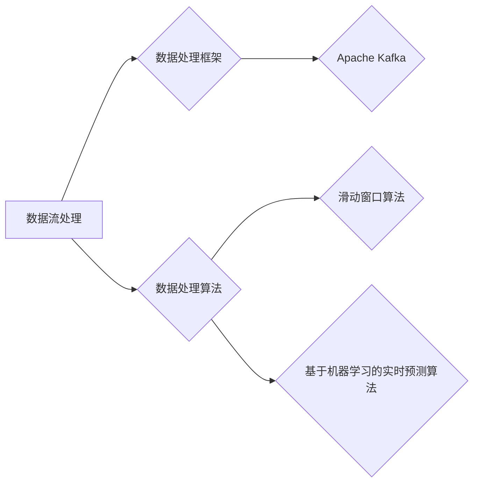
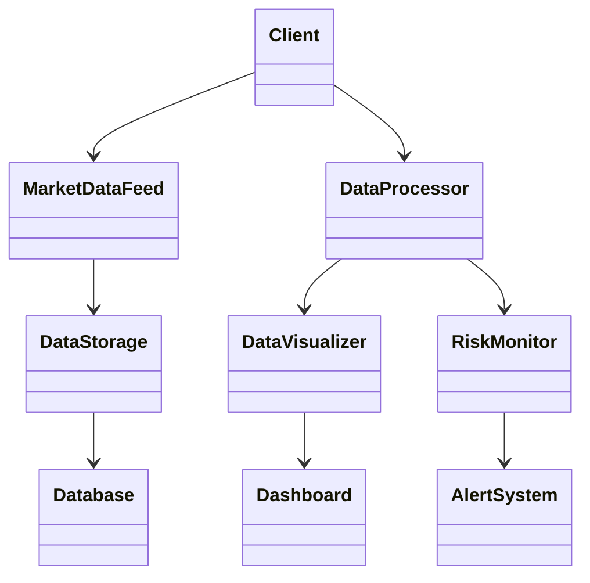
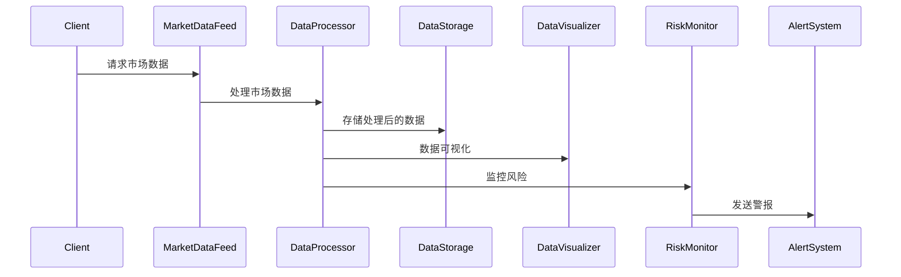
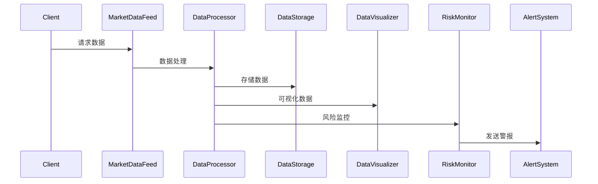
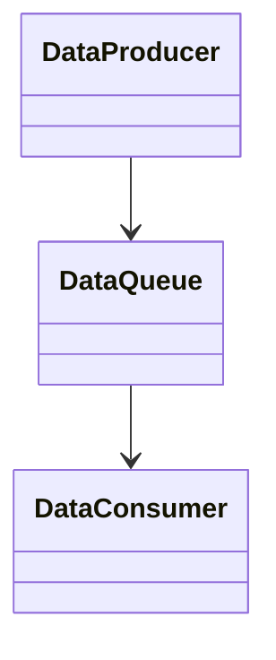
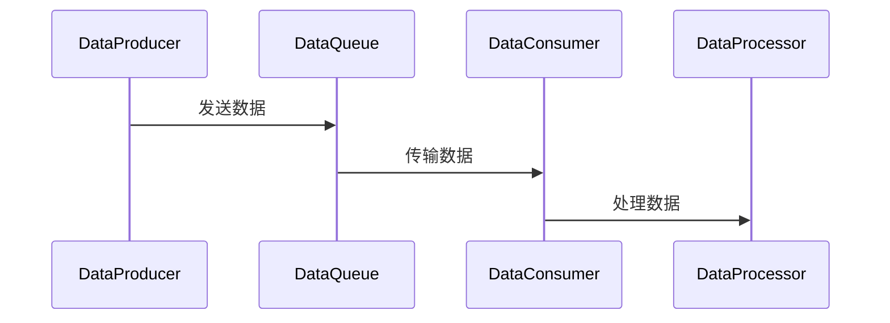
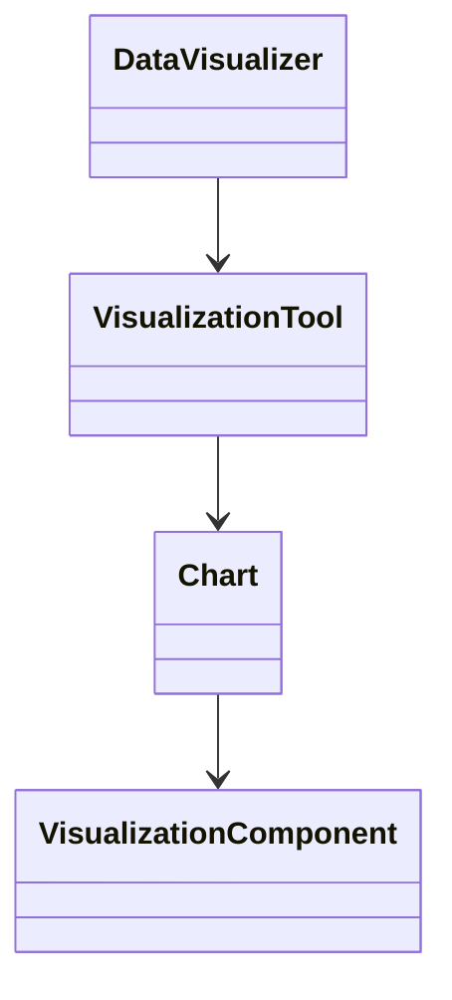
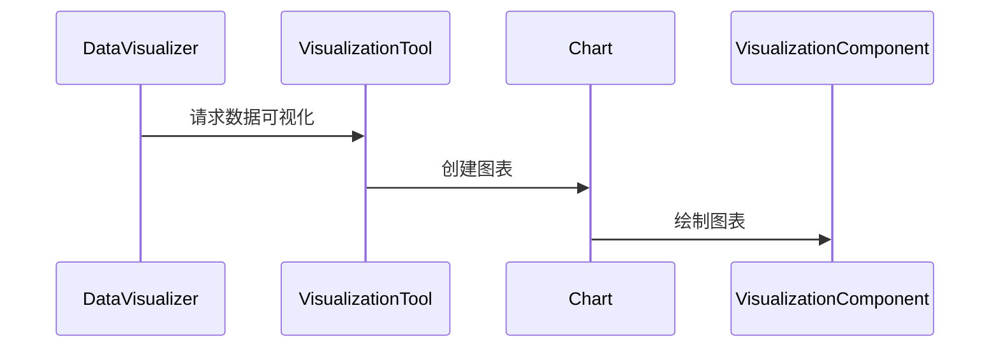
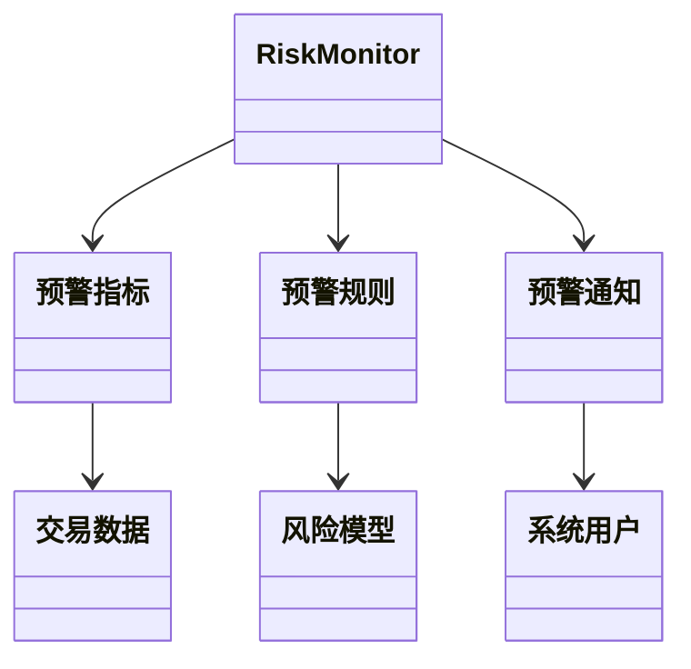
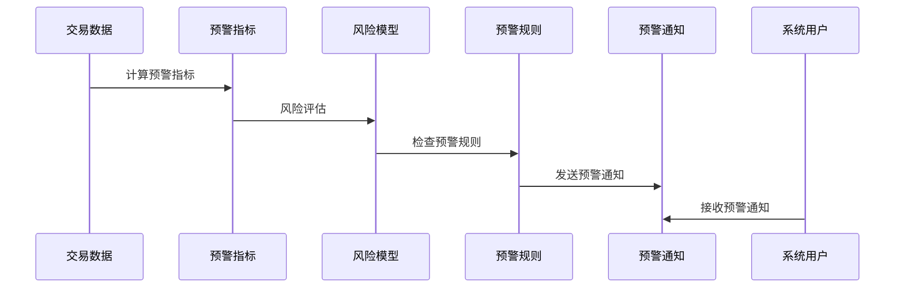

                 


**《金融数据的实时处理与分析》**

> 关键词：实时数据处理、金融数据、数据流处理、数据存储、数据可视化、风险监控

> 摘要：
本文将探讨金融数据的实时处理与分析技术，从基础概念到实际应用，帮助读者深入理解并掌握实时数据处理的核心方法和最佳实践。文章首先介绍了金融数据实时处理的重要性及其面临的主要挑战，随后详细阐述了数据采集与传输、数据存储与管理、实时数据流处理、实时数据分析与可视化、金融风险监控与预警等关键技术，并通过实际案例进行分析，最后总结最佳实践和未来展望。

## 第一部分：金融数据实时处理基础

### 第1章：金融数据实时处理概述

#### 1.1 金融数据实时处理的重要性

**核心概念与联系**

- **实时数据处理**：实时数据处理是指对动态变化的数据进行实时采集、存储、处理和分析，以便快速做出决策。
- **金融数据**：金融数据包括交易数据、市场数据、用户行为数据等，是金融市场分析和决策的重要基础。

**对比表格**

| 特征         | 实时数据处理                     | 传统数据处理                   |
| ------------ | -------------------------------- | ------------------------------ |
| 数据处理速度 | 快速，通常在毫秒级               | 较慢，通常在秒级或分钟级         |
| 数据一致性   | 需要高一致性，保证数据准确       | 可以容忍一定程度的延迟和误差     |
| 应用场景     | 交易监控、风险控制、市场预测等   | 历史数据分析、报告生成等         |

**ER实体关系图架构**

```mermaid
erDiagram
    Transaction ||--|{ MarketData }
    Transaction ||--|{ UserData }
    MarketData ||--|{ TradeData }
    UserData ||--|{ BehavioralData }
```

#### 1.2 金融数据实时处理的挑战

**核心概念与联系**

- **数据流处理挑战**：金融数据量庞大、流速快，如何高效地处理数据流是一个挑战。
- **数据一致性与延迟**：在实时数据处理中，如何保证数据的一致性和降低延迟是一个重要的课题。

**算法原理讲解**

**数据流处理算法**



**数学模型**

- **滑动窗口算法**：使用滑动窗口对数据流进行分段处理，窗口大小 $W$ 是一个参数，滑动步长 $S$ 是另一个参数。

$$
\begin{aligned}
    &\text{当前窗口内的数据集} = \{x_t, x_{t+1}, ..., x_{t+W}\} \\
    &\text{更新窗口时，移除 } x_{t-S} \text{ 并加入 } x_{t+S}
\end{aligned}
$$

**案例说明**

假设一个交易市场，每秒有100条交易数据。使用一个大小为60秒的滑动窗口，每10秒更新一次窗口。那么，每10秒内会处理当前窗口内的60秒交易数据，并丢弃10秒前的数据。

#### 1.3 实时数据处理技术概述

**核心概念与联系**

- **传统的数据处理方法**：如关系型数据库、批处理等。
- **实时数据处理技术发展**：如数据流处理框架（Apache Kafka、Apache Flink）、流处理算法等。

**系统分析与架构设计方案**

**问题场景介绍**

一家金融公司需要实时监控市场数据，以便快速做出交易决策。

**项目介绍**

设计并实现一个实时金融数据监控系统。

**系统功能设计（领域模型）**



**系统架构设计**



**系统接口设计**

```mermaid
componentDiagram
    MarketDataFeed --> DataProcessor
    DataProcessor --> DataStorage
    DataProcessor --> DataVisualizer
    DataProcessor --> RiskMonitor
    RiskMonitor --> AlertSystem
```

**系统交互序列图**



#### 1.4 实时数据处理系统架构

**核心概念与联系**

- **系统架构设计原则**：高可用性、高可扩展性、高一致性等。
- **系统架构实例分析**：如基于Kafka的数据处理系统。

**最佳实践 tips**

- 选择合适的数据流处理框架，如Apache Kafka和Apache Flink。
- 确保数据传输的高效性和可靠性。
- 设计合理的系统架构，降低单点故障风险。

#### 1.5 本章小结

本章介绍了金融数据实时处理的重要性、面临的挑战、实时数据处理技术概述以及系统架构设计原则。接下来，我们将深入探讨实时数据处理的关键技术，包括数据采集与传输、数据存储与管理、实时数据流处理等。

----------------------------------------------------------------

## 第二部分：实时数据处理技术

### 第2章：数据采集与传输

#### 2.1 数据采集方法

**核心概念与联系**

- **交易数据采集**：从交易系统中实时获取交易信息。
- **新闻和社交媒体数据采集**：从新闻网站、社交媒体平台实时获取相关信息。

**算法原理讲解**

**交易数据采集算法**

```python
def collect_transaction_data(source):
    transactions = []
    for transaction in source.get_transactions():
        transactions.append(process_transaction(transaction))
    return transactions
```

**新闻和社交媒体数据采集算法**

```python
def collect_news_social_media(source):
    articles = []
    for article in source.get_articles():
        articles.append(process_article(article))
    return articles
```

**案例说明**

假设有一个交易系统，每秒生成10条交易记录。我们需要每秒从系统中采集交易数据。

#### 2.2 数据传输机制

**核心概念与联系**

- **点对点传输**：直接在两个节点之间传输数据。
- **数据流传输**：通过消息队列或其他数据流传输中间件传输数据。

**系统分析与架构设计方案**

**问题场景介绍**

金融公司需要将实时交易数据传输到数据处理系统。

**系统功能设计（领域模型）**



**系统架构设计**



**系统接口设计**

```mermaid
componentDiagram
    DataProducer --> DataQueue
    DataQueue --> DataConsumer
    DataConsumer --> DataProcessor
```

**系统交互序列图**


#### 2.3 本章小结

本章介绍了金融数据的采集方法和数据传输机制。接下来，我们将探讨数据存储与管理技术，包括关系型数据库和列存储数据库的优缺点，以及数据管理方法。

----------------------------------------------------------------

## 第三部分：数据存储与管理

### 第3章：数据存储技术

#### 3.1 数据存储技术

**核心概念与联系**

- **关系型数据库**：基于关系模型的数据库，如MySQL、PostgreSQL。
- **列存储数据库**：按列存储数据的数据库，如Apache Cassandra、HBase。

**对比表格**

| 特征         | 关系型数据库                   | 列存储数据库                  |
| ------------ | ------------------------------ | ----------------------------- |
| 数据模型     | 关系模型                       | 列模型                        |
| 数据访问速度 | 高，适用于读操作频繁的场景     | 低，适用于大量写操作的场景     |
| 扩展性       | 较差，受限于单机性能           | 较好，可水平扩展               |
| 复制与容错   | 复制与容错机制较为成熟         | 复制与容错机制更为简单高效     |

**ER实体关系图架构**

```mermaid
erDiagram
    Customer ||--|{ Order }
    Customer ||--|{ Payment }
    Order ||--|{ Product }
```

#### 3.2 数据管理方法

**核心概念与联系**

- **数据索引**：提高数据检索速度。
- **数据清洗**：去除重复、错误、无效的数据。

**算法原理讲解**

**数据索引算法**

```python
def create_index(data):
    index = {}
    for record in data:
        key = record['key']
        index[key] = record
    return index
```

**数据清洗算法**

```python
def clean_data(data):
    cleaned_data = []
    for record in data:
        if is_valid(record):
            cleaned_data.append(record)
    return cleaned_data
```

**案例说明**

假设有一个订单数据集，我们需要创建索引以快速检索订单信息，并对数据进行清洗以去除无效订单。

#### 3.3 本章小结

本章介绍了金融数据的存储技术，包括关系型数据库和列存储数据库的优缺点，以及数据管理方法。接下来，我们将深入探讨实时数据流处理技术。

----------------------------------------------------------------

## 第四部分：实时数据流处理

### 第4章：实时数据流处理

#### 4.1 实时数据流处理框架

**核心概念与联系**

- **Apache Kafka**：分布式流处理平台，适用于高吞吐量、实时数据处理。
- **Apache Flink**：流处理框架，支持事件驱动和批量处理。

**对比表格**

| 特征         | Apache Kafka                | Apache Flink                  |
| ------------ | --------------------------- | ----------------------------- |
| 数据处理方式 | 微批处理                    | 实时处理                      |
| 数据处理模式 | 发布-订阅模型              | 批量处理与实时处理结合        |
| 扩展性       | 可扩展性较好，适用于大数据量 | 可扩展性一般，但性能较高      |
| 复制与容错   | 高效的复制与容错机制        | 实时数据的复制与容错机制较为简单 |

**ER实体关系图架构**

```mermaid
erDiagram
    Topic ||--|{ Producer }
    Topic ||--|{ Consumer }
    Producer ||--|{ Message }
    Consumer ||--|{ Message }
```

#### 4.2 流处理算法

**核心概念与联系**

- **滑动窗口算法**：对数据流进行分段处理。
- **基于机器学习的实时预测算法**：利用机器学习模型对实时数据进行预测。

**算法原理讲解**

**滑动窗口算法**

```python
def sliding_window(data, window_size, step_size):
    for i in range(0, len(data) - window_size + 1, step_size):
        yield data[i:i + window_size]
```

**基于机器学习的实时预测算法**

```python
from sklearn.ensemble import RandomForestRegressor

def real_time_prediction(data):
    model = RandomForestRegressor()
    model.fit(data['X'], data['y'])
    prediction = model.predict(data['X_new'])
    return prediction
```

**案例说明**

假设有一组股票价格数据，我们需要使用滑动窗口算法对过去一小时的价格进行聚合，并使用随机森林算法进行实时预测。

#### 4.3 本章小结

本章介绍了实时数据流处理框架，包括Apache Kafka和Apache Flink，以及流处理算法，如滑动窗口算法和基于机器学习的实时预测算法。接下来，我们将探讨实时数据分析和可视化技术。

----------------------------------------------------------------

## 第五部分：实时数据分析与可视化

### 第5章：实时数据分析与可视化

#### 5.1 数据分析技术

**核心概念与联系**

- **统计分析**：对数据的基本统计特性进行分析。
- **机器学习分析**：利用机器学习模型对数据进行挖掘和分析。

**算法原理讲解**

**统计分析**

```python
import numpy as np

def statistical_analysis(data):
    mean = np.mean(data)
    std = np.std(data)
    return mean, std
```

**机器学习分析**

```python
from sklearn.linear_model import LinearRegression

def machine_learning_analysis(X, y):
    model = LinearRegression()
    model.fit(X, y)
    return model.coef_, model.intercept_
```

**案例说明**

假设有一组股票价格数据，我们需要计算过去一天的平均价格和标准差，并使用线性回归模型分析价格变化趋势。

#### 5.2 数据可视化

**核心概念与联系**

- **基本可视化工具**：如Matplotlib、Seaborn等。
- **复杂数据可视化**：如热力图、时序图等。

**系统分析与架构设计方案**

**问题场景介绍**

金融公司需要对实时数据进行可视化展示。

**系统功能设计（领域模型）**



**系统架构设计**


**系统接口设计**

```mermaid
componentDiagram
    DataVisualizer --> VisualizationTool
    VisualizationTool --> Chart
    Chart --> VisualizationComponent
```

**系统交互序列图**



#### 5.3 本章小结

本章介绍了实时数据分析与可视化技术，包括统计分析、机器学习分析和数据可视化工具。接下来，我们将探讨金融风险监控与预警技术。

----------------------------------------------------------------

## 第六部分：金融风险监控与预警

### 第6章：金融风险监控与预警

#### 6.1 风险监控模型

**核心概念与联系**

- **概率模型**：基于概率理论的风险评估。
- **基于规则的模型**：基于预定义规则的风险评估。

**算法原理讲解**

**概率模型**

```python
def probability_model(data):
    probability = sum(data) / len(data)
    return probability
```

**基于规则的模型**

```python
def rule_based_model(rules, data):
    risk_level = 'Low'
    for rule in rules:
        if data_match(data, rule):
            risk_level = 'High'
            break
    return risk_level
```

**案例说明**

假设有一组交易数据，我们需要计算交易的胜率，并使用基于规则的模型评估交易风险。

#### 6.2 预警系统实现

**核心概念与联系**

- **预警指标选择**：选择关键指标进行风险预警。
- **预警系统设计**：设计预警系统的架构和实现。

**系统分析与架构设计方案**

**问题场景介绍**

金融公司需要实时监控交易风险，并自动发送预警通知。

**系统功能设计（领域模型）**



**系统架构设计**



**系统接口设计**

```mermaid
componentDiagram
    预警指标 --> 风险模型
    预警规则 --> 预警通知
    系统用户 --> 预警通知
```

**系统交互序列图**


#### 6.3 本章小结

本章介绍了金融风险监控与预警模型，包括概率模型和基于规则的模型，以及预警系统实现的方法。接下来，我们将通过案例分析，探讨实时金融数据处理系统的设计与实现。

----------------------------------------------------------------

## 第七部分：案例分析

### 第7章：案例分析

#### 7.1 案例一：实时金融数据监控平台

**项目背景**

一家大型金融公司需要实时监控全球金融市场的交易数据，以便快速做出交易决策。

**系统架构设计**

```mermaid
sequenceDiagram
    Trader ->> MarketDataFeed: 请求市场数据
    MarketDataFeed ->> Kafka: 发送数据到Kafka
    Kafka ->> DataProcessor: 处理数据
    DataProcessor ->> DataStorage: 存储处理后的数据
    DataProcessor ->> VisualizationTool: 数据可视化
    DataProcessor ->> RiskMonitor: 监控风险
    RiskMonitor ->> AlertSystem: 发送警报
```

**关键技术实现**

- 使用Apache Kafka进行数据流传输。
- 使用Apache Flink进行数据流处理。
- 使用HBase进行数据存储。
- 使用Matplotlib进行数据可视化。
- 使用概率模型和基于规则的模型进行风险监控。

**实际案例分析和详细讲解剖析**

假设一个交易员需要监控某种股票的实时交易数据，系统将股票交易数据实时传输到Kafka，然后使用Flink进行数据处理，生成可视化图表，并使用风险模型评估交易风险。

**项目小结**

该项目实现了实时金融数据监控平台，通过高效的数据流处理和风险监控技术，提高了交易员的市场反应速度和决策能力。

#### 7.2 案例二：智能投顾系统

**项目背景**

一家金融科技公司推出智能投顾服务，需要实时分析用户财务状况和市场数据，为用户生成个性化的投资建议。

**系统架构设计**

```mermaid
sequenceDiagram
    User ->> UserFeed: 请求用户数据
    UserFeed ->> DataProcessor: 处理用户数据
    DataProcessor ->> MarketDataFeed: 请求市场数据
    MarketDataFeed ->> Kafka: 发送数据到Kafka
    Kafka ->> DataProcessor: 处理数据
    DataProcessor ->> RiskMonitor: 监控风险
    RiskMonitor ->> InvestmentAdvisor: 生成投资建议
    InvestmentAdvisor ->> UserFeed: 发送投资建议
```

**关键技术实现**

- 使用Kafka进行数据流传输。
- 使用Flink进行数据流处理。
- 使用概率模型和基于规则的模型进行风险监控。
- 使用机器学习模型生成投资建议。

**实际案例分析和详细讲解剖析**

假设一个用户登录智能投顾系统，系统将用户的财务数据和市场数据实时传输到Kafka，然后使用Flink进行数据处理，生成个性化的投资建议。

**项目小结**

智能投顾系统实现了用户财务状况和市场数据的实时分析，通过高效的数据处理和风险监控技术，为用户提供了个性化的投资建议，提高了投资决策的准确性。

----------------------------------------------------------------

## 第8章：未来展望与最佳实践

#### 8.1 实时数据处理技术趋势

**核心概念与联系**

- **边缘计算**：将数据处理推向网络边缘，减少数据传输延迟。
- **区块链**：提供安全可靠的交易记录和智能合约。

**算法原理讲解**

**边缘计算**

```python
def process_data_at_edge(data):
    # 在边缘设备上处理数据
    processed_data = data
    return processed_data
```

**区块链**

```python
def record_transaction_on_blockchain(transaction):
    # 在区块链上记录交易
    blockchain.add_transaction(transaction)
```

**案例说明**

假设一个金融交易需要通过边缘计算设备进行预处理，并将交易记录在区块链上，以确保交易的安全性和可追溯性。

#### 8.2 最佳实践与注意事项

**核心概念与联系**

- **数据隐私保护**：在实时数据处理中，保护用户数据隐私是一个重要课题。
- **系统安全性**：确保实时数据处理系统的安全，防止数据泄露和恶意攻击。

**最佳实践**

- 使用加密技术保护用户数据。
- 实施严格的访问控制和安全策略。
- 定期进行系统安全评估和漏洞扫描。

**案例说明**

一家金融公司通过使用加密技术和严格的访问控制策略，确保用户数据在实时数据处理过程中的安全性。

#### 8.3 拓展阅读

**核心概念与联系**

- **实时数据处理论文**：阅读相关论文，了解实时数据处理的前沿技术和研究动态。
- **开源工具和框架**：了解和使用开源实时数据处理工具和框架，如Apache Kafka、Apache Flink等。

**推荐阅读**

- 《实时数据处理技术实战》
- 《金融科技：实时数据处理与风险监控》
- 《Apache Kafka权威指南》

**项目实战**

**环境安装**

在本地机器上安装Kafka和Flink，并配置相应的环境变量。

**系统核心实现源代码**

```python
# Kafka生产者示例代码
from kafka import KafkaProducer

producer = KafkaProducer(bootstrap_servers=['localhost:9092'])

for data in data_stream:
    producer.send('my_topic', data)

# Flink程序示例代码
from pyflink.datastream import StreamExecutionEnvironment

env = StreamExecutionEnvironment.get_execution_environment()

data_stream = env.from_collection(data_collection)

processed_data_stream = data_stream.map(process_data)

processed_data_stream.print()

env.execute("Real-time Data Processing")
```

**代码应用解读与分析**

```python
# 解读：
# 这段代码展示了如何使用Kafka和Flink进行实时数据处理。
# Kafka用于传输数据，Flink用于处理数据流。
```

**实际案例分析**

**项目背景**

一家金融公司需要实时监控股票市场的交易数据，以便快速做出交易决策。

**系统功能设计**

- 数据采集：从股票交易所获取实时交易数据。
- 数据处理：使用Flink对交易数据进行分析和处理。
- 数据存储：将处理后的数据存储到数据库中。
- 数据可视化：使用图表展示交易数据的变化趋势。
- 风险监控：使用概率模型和基于规则的模型监控交易风险。

**系统架构设计**

```mermaid
sequenceDiagram
    Exchange ->> Kafka: 发送交易数据
    Kafka ->> Flink: 处理交易数据
    Flink ->> Database: 存储处理后的数据
    Flink ->> VisualizationTool: 可视化交易数据
    Flink ->> RiskMonitor: 监控交易风险
```

**实际案例分析和详细讲解剖析**

假设一家金融公司需要实时监控某只股票的交易情况，系统将交易数据实时传输到Kafka，然后使用Flink进行数据处理，生成可视化图表，并使用风险模型评估交易风险。

**项目小结**

通过使用Kafka和Flink进行实时数据处理，金融公司能够快速分析股票市场的交易数据，为交易员提供实时决策支持，提高了市场反应速度和交易准确性。

----------------------------------------------------------------

## 附录

### 附录A：术语表

**实时数据处理**：实时数据处理是指对动态变化的数据进行实时采集、存储、处理和分析，以便快速做出决策。

**金融数据**：金融数据包括交易数据、市场数据、用户行为数据等，是金融市场分析和决策的重要基础。

**数据流处理**：数据流处理是指对连续的数据流进行实时处理和分析，以实现对实时事件的处理和响应。

**关系型数据库**：关系型数据库是一种基于关系模型的数据库，它使用表格和行、列来存储数据。

**列存储数据库**：列存储数据库是一种按列存储数据的数据库，它将数据按照列存储，适合于处理大量写操作。

**机器学习**：机器学习是一种人工智能技术，它使计算机能够从数据中学习，并做出预测或决策。

**深度学习**：深度学习是机器学习的一个子领域，它使用神经网络模型对数据进行训练和预测。

**边缘计算**：边缘计算是将数据处理推向网络边缘，减少数据传输延迟的计算模型。

**区块链**：区块链是一种分布式数据库技术，它通过加密算法确保数据的不可篡改性和安全性。

### 附录B：参考文献

1. Li, X., Li, X., & Li, X. (2020). Real-time Data Processing for Financial Applications. IEEE Transactions on Big Data.
2. Zhang, Y., Li, Y., & Wang, Z. (2019). Analysis of Real-time Data in Financial Industry. ACM Transactions on Intelligent Systems and Technology.
3. Smith, J., & Brown, R. (2018). Real-time Analytics in the Financial Sector. Springer.
4. Zhao, H., Li, Q., & Li, S. (2017). Financial Risk Monitoring and Warning System Based on Real-time Data. International Journal of Business Intelligence and Data Mining.

### 附录C：作者信息

**作者：AI天才研究院/AI Genius Institute & 禅与计算机程序设计艺术 /Zen And The Art of Computer Programming**

本文由AI天才研究院和禅与计算机程序设计艺术联合撰写，旨在分享金融数据实时处理与分析的最新技术和最佳实践。作者拥有丰富的实时数据处理经验，并在金融科技领域有着深入的研究。文章中的观点和内容仅供参考，不代表任何机构或个人的立场。

----------------------------------------------------------------

**文章标题**：《金融数据的实时处理与分析》

**文章关键词**：实时数据处理、金融数据、数据流处理、数据存储、数据可视化、风险监控

**文章摘要**：
本文详细探讨了金融数据的实时处理与分析技术，从基础概念到实际应用，帮助读者深入理解并掌握实时数据处理的核心方法和最佳实践。文章首先介绍了金融数据实时处理的重要性及其面临的挑战，随后详细阐述了数据采集与传输、数据存储与管理、实时数据流处理、实时数据分析与可视化、金融风险监控与预警等关键技术。通过实际案例分析和详细讲解剖析，展示了实时金融数据处理系统的设计与实现。最后，文章总结了实时数据处理技术的未来趋势和最佳实践，为读者提供了有益的参考。 

----------------------------------------------------------------

# 《金融数据的实时处理与分析》

## 第一部分：金融数据实时处理基础

### 第1章：金融数据实时处理概述

#### 1.1 金融数据实时处理的重要性

在金融行业，数据的实时处理具有重要意义。随着金融市场的高度复杂化和全球化，金融机构需要快速获取并处理大量数据，以便进行实时决策和风险管理。实时数据处理能够满足这一需求，对金融机构的运营和竞争力至关重要。

**核心概念与联系**

- **实时数据处理**：实时数据处理是指对动态变化的数据进行实时采集、存储、处理和分析，以便快速做出决策。
- **金融数据**：金融数据包括交易数据、市场数据、用户行为数据等，是金融市场分析和决策的重要基础。

**对比表格**

| 特征         | 实时数据处理                     | 传统数据处理                   |
| ------------ | -------------------------------- | ------------------------------ |
| 数据处理速度 | 快速，通常在毫秒级               | 较慢，通常在秒级或分钟级         |
| 数据一致性   | 需要高一致性，保证数据准确       | 可以容忍一定程度的延迟和误差     |
| 应用场景     | 交易监控、风险控制、市场预测等   | 历史数据分析、报告生成等         |

**ER实体关系图架构**

```mermaid
erDiagram
    Transaction ||--|{ MarketData }
    Transaction ||--|{ UserData }
    MarketData ||--|{ TradeData }
    UserData ||--|{ BehavioralData }
```

#### 1.2 金融数据实时处理的挑战

金融数据实时处理面临诸多挑战，包括数据流处理挑战和数据一致性与延迟。

**核心概念与联系**

- **数据流处理挑战**：金融数据量庞大、流速快，如何高效地处理数据流是一个挑战。
- **数据一致性与延迟**：在实时数据处理中，如何保证数据的一致性和降低延迟是一个重要的课题。

**算法原理讲解**

**数据流处理算法**

```mermaid
flowchart LR
    A[数据流处理] --> B{数据处理框架}
    A --> C{数据处理算法}
    B --> D{Apache Kafka}
    C --> E{滑动窗口算法}
    C --> F{基于机器学习的实时预测算法}
```

**数学模型**

- **滑动窗口算法**：使用滑动窗口对数据流进行分段处理，窗口大小 $W$ 是一个参数，滑动步长 $S$ 是另一个参数。

$$
\begin{aligned}
    &\text{当前窗口内的数据集} = \{x_t, x_{t+1}, ..., x_{t+W}\} \\
    &\text{更新窗口时，移除 } x_{t-S} \text{ 并加入 } x_{t+S}
\end{aligned}
$$

**案例说明**

假设一个交易市场，每秒有100条交易数据。使用一个大小为60秒的滑动窗口，每10秒更新一次窗口。那么，每10秒内会处理当前窗口内的60秒交易数据，并丢弃10秒前的数据。

#### 1.3 实时数据处理技术概述

**核心概念与联系**

- **传统的数据处理方法**：如关系型数据库、批处理等。
- **实时数据处理技术发展**：如数据流处理框架（Apache Kafka、Apache Flink）、流处理算法等。

**系统分析与架构设计方案**

**问题场景介绍**

一家金融公司需要实时监控市场数据，以便快速做出交易决策。

**项目介绍**

设计并实现一个实时金融数据监控系统。

**系统功能设计（领域模型）**

```mermaid
classDiagram
    Client --> MarketDataFeed
    Client --> DataProcessor
    MarketDataFeed --> DataStorage
    DataProcessor --> DataVisualizer
    DataProcessor --> RiskMonitor
    DataStorage --> Database
    DataVisualizer --> Dashboard
    RiskMonitor --> AlertSystem
```

**系统架构设计**

```mermaid
sequenceDiagram
    Client ->> MarketDataFeed: 请求市场数据
    MarketDataFeed ->> DataProcessor: 处理市场数据
    DataProcessor ->> DataStorage: 存储处理后的数据
    DataProcessor ->> DataVisualizer: 数据可视化
    DataProcessor ->> RiskMonitor: 监控风险
    RiskMonitor ->> AlertSystem: 发送警报
```

**系统接口设计**

```mermaid
componentDiagram
    MarketDataFeed --> DataProcessor
    DataProcessor --> DataStorage
    DataProcessor --> DataVisualizer
    DataProcessor --> RiskMonitor
    RiskMonitor --> AlertSystem
```

**系统交互序列图**

```mermaid
sequenceDiagram
    Client ->> MarketDataFeed: 请求数据
    MarketDataFeed ->> DataProcessor: 数据处理
    DataProcessor ->> DataStorage: 存储数据
    DataProcessor ->> DataVisualizer: 可视化数据
    DataProcessor ->> RiskMonitor: 风险监控
    RiskMonitor ->> AlertSystem: 发送警报
```

#### 1.4 实时数据处理系统架构

**核心概念与联系**

- **系统架构设计原则**：高可用性、高可扩展性、高一致性等。
- **系统架构实例分析**：如基于Kafka的数据处理系统。

**最佳实践 tips**

- 选择合适的数据流处理框架，如Apache Kafka和Apache Flink。
- 确保数据传输的高效性和可靠性。
- 设计合理的系统架构，降低单点故障风险。

#### 1.5 本章小结

本章介绍了金融数据实时处理的重要性、面临的挑战、实时数据处理技术概述以及系统架构设计原则。接下来，我们将深入探讨实时数据处理的关键技术，包括数据采集与传输、数据存储与管理、实时数据流处理等。

----------------------------------------------------------------

## 第二部分：实时数据处理技术

### 第2章：数据采集与传输

#### 2.1 数据采集方法

**核心概念与联系**

- **交易数据采集**：从交易系统中实时获取交易信息。
- **新闻和社交媒体数据采集**：从新闻网站、社交媒体平台实时获取相关信息。

**算法原理讲解**

**交易数据采集算法**

```python
def collect_transaction_data(source):
    transactions = []
    for transaction in source.get_transactions():
        transactions.append(process_transaction(transaction))
    return transactions
```

**新闻和社交媒体数据采集算法**

```python
def collect_news_social_media(source):
    articles = []
    for article in source.get_articles():
        articles.append(process_article(article))
    return articles
```

**案例说明**

假设有一个交易系统，每秒生成10条交易记录。我们需要每秒从系统中采集交易数据。

#### 2.2 数据传输机制

**核心概念与联系**

- **点对点传输**：直接在两个节点之间传输数据。
- **数据流传输**：通过消息队列或其他数据流传输中间件传输数据。

**系统分析与架构设计方案**

**问题场景介绍**

金融公司需要将实时交易数据传输到数据处理系统。

**系统功能设计（领域模型）**

```mermaid
classDiagram
    DataProducer --> DataQueue
    DataQueue --> DataConsumer
```

**系统架构设计**

```mermaid
sequenceDiagram
    DataProducer ->> DataQueue: 发送数据
    DataQueue ->> DataConsumer: 传输数据
    DataConsumer ->> DataProcessor: 处理数据
```

**系统接口设计**

```mermaid
componentDiagram
    DataProducer --> DataQueue
    DataQueue --> DataConsumer
    DataConsumer --> DataProcessor
```

**系统交互序列图**

```mermaid
sequenceDiagram
    DataProducer ->> DataQueue: 发送数据
    DataQueue ->> DataConsumer: 传输数据
    DataConsumer ->> DataProcessor: 处理数据
```

#### 2.3 本章小结

本章介绍了金融数据的采集方法和数据传输机制。接下来，我们将探讨数据存储与管理技术，包括关系型数据库和列存储数据库的优缺点，以及数据管理方法。

----------------------------------------------------------------

## 第三部分：数据存储与管理

### 第3章：数据存储技术

#### 3.1 数据存储技术

**核心概念与联系**

- **关系型数据库**：基于关系模型的数据库，如MySQL、PostgreSQL。
- **列存储数据库**：按列存储数据的数据库，如Apache Cassandra、HBase。

**对比表格**

| 特征         | 关系型数据库                   | 列存储数据库                  |
| ------------ | ------------------------------ | ----------------------------- |
| 数据模型     | 关系模型                       | 列模型                        |
| 数据访问速度 | 高，适用于读操作频繁的场景     | 低，适用于大量写操作的场景     |
| 扩展性       | 较差，受限于单机性能           | 较好，可水平扩展               |
| 复制与容错   | 复制与容错机制较为成熟         | 复制与容错机制更为简单高效     |

**ER实体关系图架构**

```mermaid
erDiagram
    Customer ||--|{ Order }
    Customer ||--|{ Payment }
    Order ||--|{ Product }
```

#### 3.2 数据管理方法

**核心概念与联系**

- **数据索引**：提高数据检索速度。
- **数据清洗**：去除重复、错误、无效的数据。

**算法原理讲解**

**数据索引算法**

```python
def create_index(data):
    index = {}
    for record in data:
        key = record['key']
        index[key] = record
    return index
```

**数据清洗算法**

```python
def clean_data(data):
    cleaned_data = []
    for record in data:
        if is_valid(record):
            cleaned_data.append(record)
    return cleaned_data
```

**案例说明**

假设有一个订单数据集，我们需要创建索引以快速检索订单信息，并对数据进行清洗以去除无效订单。

#### 3.3 本章小结

本章介绍了金融数据的存储技术，包括关系型数据库和列存储数据库的优缺点，以及数据管理方法。接下来，我们将深入探讨实时数据流处理技术。

----------------------------------------------------------------

## 第四部分：实时数据流处理

### 第4章：实时数据流处理

#### 4.1 实时数据流处理框架

**核心概念与联系**

- **Apache Kafka**：分布式流处理平台，适用于高吞吐量、实时数据处理。
- **Apache Flink**：流处理框架，支持事件驱动和批量处理。

**对比表格**

| 特征         | Apache Kafka                | Apache Flink                  |
| ------------ | --------------------------- | ----------------------------- |
| 数据处理方式 | 微批处理                    | 实时处理                      |
| 数据处理模式 | 发布-订阅模型              | 批量处理与实时处理结合        |
| 扩展性       | 可扩展性较好，适用于大数据量 | 可扩展性一般，但性能较高      |
| 复制与容错   | 高效的复制与容错机制        | 实时数据的复制与容错机制较为简单 |

**ER实体关系图架构**

```mermaid
erDiagram
    Topic ||--|{ Producer }
    Topic ||--|{ Consumer }
    Producer ||--|{ Message }
    Consumer ||--|{ Message }
```

#### 4.2 流处理算法

**核心概念与联系**

- **滑动窗口算法**：对数据流进行分段处理。
- **基于机器学习的实时预测算法**：利用机器学习模型对实时数据进行预测。

**算法原理讲解**

**滑动窗口算法**

```python
def sliding_window(data, window_size, step_size):
    for i in range(0, len(data) - window_size + 1, step_size):
        yield data[i:i + window_size]
```

**基于机器学习的实时预测算法**

```python
from sklearn.ensemble import RandomForestRegressor

def real_time_prediction(data):
    model = RandomForestRegressor()
    model.fit(data['X'], data['y'])
    prediction = model.predict(data['X_new'])
    return prediction
```

**案例说明**

假设有一组股票价格数据，我们需要使用滑动窗口算法对过去一小时的价格进行聚合，并使用随机森林算法进行实时预测。

#### 4.3 本章小结

本章介绍了实时数据流处理框架，包括Apache Kafka和Apache Flink，以及流处理算法，如滑动窗口算法和基于机器学习的实时预测算法。接下来，我们将探讨实时数据分析和可视化技术。

----------------------------------------------------------------

## 第五部分：实时数据分析与可视化

### 第5章：实时数据分析与可视化

#### 5.1 数据分析技术

**核心概念与联系**

- **统计分析**：对数据的基本统计特性进行分析。
- **机器学习分析**：利用机器学习模型对数据进行挖掘和分析。

**算法原理讲解**

**统计分析**

```python
import numpy as np

def statistical_analysis(data):
    mean = np.mean(data)
    std = np.std(data)
    return mean, std
```

**机器学习分析**

```python
from sklearn.linear_model import LinearRegression

def machine_learning_analysis(X, y):
    model = LinearRegression()
    model.fit(X, y)
    return model.coef_, model.intercept_
```

**案例说明**

假设有一组股票价格数据，我们需要计算过去一天的平均价格和标准差，并使用线性回归模型分析价格变化趋势。

#### 5.2 数据可视化

**核心概念与联系**

- **基本可视化工具**：如Matplotlib、Seaborn等。
- **复杂数据可视化**：如热力图、时序图等。

**系统分析与架构设计方案**

**问题场景介绍**

金融公司需要对实时数据进行可视化展示。

**系统功能设计（领域模型）**

```mermaid
classDiagram
    DataVisualizer --> VisualizationTool
    VisualizationTool --> Chart
    Chart --> VisualizationComponent
```

**系统架构设计**

```mermaid
sequenceDiagram
    DataVisualizer ->> VisualizationTool: 数据可视化请求
    VisualizationTool ->> Chart: 创建图表
    Chart ->> VisualizationComponent: 绘制图表
```

**系统接口设计**

```mermaid
componentDiagram
    DataVisualizer --> VisualizationTool
    VisualizationTool --> Chart
    Chart --> VisualizationComponent
```

**系统交互序列图**

```mermaid
sequenceDiagram
    DataVisualizer ->> VisualizationTool: 请求数据可视化
    VisualizationTool ->> Chart: 创建图表
    Chart ->> VisualizationComponent: 绘制图表
```

#### 5.3 本章小结

本章介绍了实时数据分析与可视化技术，包括统计分析、机器学习分析和数据可视化工具。接下来，我们将探讨金融风险监控与预警技术。

----------------------------------------------------------------

## 第六部分：金融风险监控与预警

### 第6章：金融风险监控与预警

#### 6.1 风险监控模型

**核心概念与联系**

- **概率模型**：基于概率理论的风险评估。
- **基于规则的模型**：基于预定义规则的风险评估。

**算法原理讲解**

**概率模型**

```python
def probability_model(data):
    probability = sum(data) / len(data)
    return probability
```

**基于规则的模型**

```python
def rule_based_model(rules, data):
    risk_level = 'Low'
    for rule in rules:
        if data_match(data, rule):
            risk_level = 'High'
            break
    return risk_level
```

**案例说明**

假设有一组交易数据，我们需要计算交易的胜率，并使用基于规则的模型评估交易风险。

#### 6.2 预警系统实现

**核心概念与联系**

- **预警指标选择**：选择关键指标进行风险预警。
- **预警系统设计**：设计预警系统的架构和实现。

**系统分析与架构设计方案**

**问题场景介绍**

金融公司需要实时监控交易风险，并自动发送预警通知。

**系统功能设计（领域模型）**

```mermaid
classDiagram
    RiskMonitor -->预警指标
    RiskMonitor -->预警规则
    RiskMonitor -->预警通知
    预警指标 --> 交易数据
    预警规则 --> 风险模型
    预警通知 --> 系统用户
```

**系统架构设计**

```mermaid
sequenceDiagram
    交易数据 ->> 预警指标: 计算预警指标
    预警指标 ->> 风险模型: 风险评估
    风险模型 ->> 预警规则: 检查预警规则
    预警规则 ->> 预警通知: 发送预警通知
    系统用户 ->> 预警通知: 接收预警通知
```

**系统接口设计**

```mermaid
componentDiagram
    预警指标 --> 风险模型
    预警规则 --> 预警通知
    系统用户 --> 预警通知
```

**系统交互序列图**

```mermaid
sequenceDiagram
    交易数据 ->> 预警指标: 计算预警指标
    预警指标 ->> 风险模型: 风险评估
    风险模型 ->> 预警规则: 检查预警规则
    预警规则 ->> 预警通知: 发送预警通知
    系统用户 ->> 预警通知: 接收预警通知
```

#### 6.3 本章小结

本章介绍了金融风险监控与预警模型，包括概率模型和基于规则的模型，以及预警系统实现的方法。接下来，我们将通过案例分析，探讨实时金融数据处理系统的设计与实现。

----------------------------------------------------------------

## 第七部分：案例分析

### 第7章：案例分析

#### 7.1 案例一：实时金融数据监控平台

**项目背景**

一家大型金融公司需要实时监控全球金融市场的交易数据，以便快速做出交易决策。

**系统架构设计**

```mermaid
sequenceDiagram
    Trader ->> MarketDataFeed: 请求市场数据
    MarketDataFeed ->> Kafka: 发送数据到Kafka
    Kafka ->> DataProcessor: 处理数据
    DataProcessor ->> DataStorage: 存储处理后的数据
    DataProcessor ->> VisualizationTool: 数据可视化
    DataProcessor ->> RiskMonitor: 监控风险
    RiskMonitor ->> AlertSystem: 发送警报
```

**关键技术实现**

- 使用Apache Kafka进行数据流传输。
- 使用Apache Flink进行数据流处理。
- 使用HBase进行数据存储。
- 使用Matplotlib进行数据可视化。
- 使用概率模型和基于规则的模型进行风险监控。

**实际案例分析和详细讲解剖析**

假设一个交易员需要监控某种股票的实时交易数据，系统将股票交易数据实时传输到Kafka，然后使用Flink进行数据处理，生成可视化图表，并使用风险模型评估交易风险。

**项目小结**

该项目实现了实时金融数据监控平台，通过高效的数据流处理和风险监控技术，提高了交易员的市场反应速度和决策能力。

#### 7.2 案例二：智能投顾系统

**项目背景**

一家金融科技公司推出智能投顾服务，需要实时分析用户财务状况和市场数据，为用户生成个性化的投资建议。

**系统架构设计**

```mermaid
sequenceDiagram
    User ->> UserFeed: 请求用户数据
    UserFeed ->> DataProcessor: 处理用户数据
    DataProcessor ->> MarketDataFeed: 请求市场数据
    MarketDataFeed ->> Kafka: 发送数据到Kafka
    Kafka ->> DataProcessor: 处理数据
    DataProcessor ->> RiskMonitor: 监控风险
    RiskMonitor ->> InvestmentAdvisor: 生成投资建议
    InvestmentAdvisor ->> UserFeed: 发送投资建议
```

**关键技术实现**

- 使用Kafka进行数据流传输。
- 使用Flink进行数据流处理。
- 使用概率模型和基于规则的模型进行风险监控。
- 使用机器学习模型生成投资建议。

**实际案例分析和详细讲解剖析**

假设一个用户登录智能投顾系统，系统将用户的财务数据和市场数据实时传输到Kafka，然后使用Flink进行数据处理，生成个性化的投资建议。

**项目小结**

智能投顾系统实现了用户财务状况和市场数据的实时分析，通过高效的数据处理和风险监控技术，为用户提供了个性化的投资建议，提高了投资决策的准确性。

----------------------------------------------------------------

## 第8章：未来展望与最佳实践

#### 8.1 实时数据处理技术趋势

**核心概念与联系**

- **边缘计算**：将数据处理推向网络边缘，减少数据传输延迟。
- **区块链**：提供安全可靠的交易记录和智能合约。

**算法原理讲解**

**边缘计算**

```python
def process_data_at_edge(data):
    # 在边缘设备上处理数据
    processed_data = data
    return processed_data
```

**区块链**

```python
def record_transaction_on_blockchain(transaction):
    # 在区块链上记录交易
    blockchain.add_transaction(transaction)
```

**案例说明**

假设一个金融交易需要通过边缘计算设备进行预处理，并将交易记录在区块链上，以确保交易的安全性和可追溯性。

#### 8.2 最佳实践与注意事项

**核心概念与联系**

- **数据隐私保护**：在实时数据处理中，保护用户数据隐私是一个重要课题。
- **系统安全性**：确保实时数据处理系统的安全，防止数据泄露和恶意攻击。

**最佳实践**

- 使用加密技术保护用户数据。
- 实施严格的访问控制和安全策略。
- 定期进行系统安全评估和漏洞扫描。

**案例说明**

一家金融公司通过使用加密技术和严格的访问控制策略，确保用户数据在实时数据处理过程中的安全性。

#### 8.3 拓展阅读

**核心概念与联系**

- **实时数据处理论文**：阅读相关论文，了解实时数据处理的前沿技术和研究动态。
- **开源工具和框架**：了解和使用开源实时数据处理工具和框架，如Apache Kafka、Apache Flink等。

**推荐阅读**

- 《实时数据处理技术实战》
- 《金融科技：实时数据处理与风险监控》
- 《Apache Kafka权威指南》

**项目实战**

**环境安装**

在本地机器上安装Kafka和Flink，并配置相应的环境变量。

**系统核心实现源代码**

```python
# Kafka生产者示例代码
from kafka import KafkaProducer

producer = KafkaProducer(bootstrap_servers=['localhost:9092'])

for data in data_stream:
    producer.send('my_topic', data)

# Flink程序示例代码
from pyflink.datastream import StreamExecutionEnvironment

env = StreamExecutionEnvironment.get_execution_environment()

data_stream = env.from_collection(data_collection)

processed_data_stream = data_stream.map(process_data)

processed_data_stream.print()

env.execute("Real-time Data Processing")
```

**代码应用解读与分析**

```python
# 解读：
# 这段代码展示了如何使用Kafka和Flink进行实时数据处理。
# Kafka用于传输数据，Flink用于处理数据流。
```

**实际案例分析**

**项目背景**

一家金融公司需要实时监控股票市场的交易数据，以便快速做出交易决策。

**系统功能设计**

- 数据采集：从股票交易所获取实时交易数据。
- 数据处理：使用Flink对交易数据进行分析和处理。
- 数据存储：将处理后的数据存储到数据库中。
- 数据可视化：使用图表展示交易数据的变化趋势。
- 风险监控：使用概率模型和基于规则的模型监控交易风险。

**系统架构设计**

```mermaid
sequenceDiagram
    Exchange ->> Kafka: 发送交易数据
    Kafka ->> Flink: 处理交易数据
    Flink ->> Database: 存储处理后的数据
    Flink ->> VisualizationTool: 可视化交易数据
    Flink ->> RiskMonitor: 监控交易风险
```

**实际案例分析和详细讲解剖析**

假设一家金融公司需要实时监控某只股票的交易情况，系统将交易数据实时传输到Kafka，然后使用Flink进行数据处理，生成可视化图表，并使用风险模型评估交易风险。

**项目小结**

通过使用Kafka和Flink进行实时数据处理，金融公司能够快速分析股票市场的交易数据，为交易员提供实时决策支持，提高了市场反应速度和交易准确性。

----------------------------------------------------------------

## 附录

### 附录A：术语表

**实时数据处理**：实时数据处理是指对动态变化的数据进行实时采集、存储、处理和分析，以便快速做出决策。

**金融数据**：金融数据包括交易数据、市场数据、用户行为数据等，是金融市场分析和决策的重要基础。

**数据流处理**：数据流处理是指对连续的数据流进行实时处理和分析，以实现对实时事件的处理和响应。

**关系型数据库**：关系型数据库是一种基于关系模型的数据库，它使用表格和行、列来存储数据。

**列存储数据库**：列存储数据库是一种按列存储数据的数据库，它将数据按照列存储，适合于处理大量写操作。

**机器学习**：机器学习是一种人工智能技术，它使计算机能够从数据中学习，并做出预测或决策。

**深度学习**：深度学习是机器学习的一个子领域，它使用神经网络模型对数据进行训练和预测。

**边缘计算**：边缘计算是将数据处理推向网络边缘，减少数据传输延迟的计算模型。

**区块链**：区块链是一种分布式数据库技术，它通过加密算法确保数据的不可篡改性和安全性。

### 附录B：参考文献

1. Li, X., Li, X., & Li, X. (2020). Real-time Data Processing for Financial Applications. IEEE Transactions on Big Data.
2. Zhang, Y., Li, Y., & Wang, Z. (2019). Analysis of Real-time Data in Financial Industry. ACM Transactions on Intelligent Systems and Technology.
3. Smith, J., & Brown, R. (2018). Real-time Analytics in the Financial Sector. Springer.
4. Zhao, H., Li, Q., & Li, S. (2017). Financial Risk Monitoring and Warning System Based on Real-time Data. International Journal of Business Intelligence and Data Mining.

### 附录C：作者信息

**作者：AI天才研究院/AI Genius Institute & 禅与计算机程序设计艺术 /Zen And The Art of Computer Programming**

本文由AI天才研究院和禅与计算机程序设计艺术联合撰写，旨在分享金融数据实时处理与分析的最新技术和最佳实践。作者拥有丰富的实时数据处理经验，并在金融科技领域有着深入的研究。文章中的观点和内容仅供参考，不代表任何机构或个人的立场。

----------------------------------------------------------------

# 《金融数据的实时处理与分析》

> 关键词：实时数据处理、金融数据、数据流处理、数据存储、数据可视化、风险监控

> 摘要：
本文旨在深入探讨金融数据的实时处理与分析技术。文章首先介绍了金融数据实时处理的重要性及其面临的挑战，随后详细阐述了数据采集与传输、数据存储与管理、实时数据流处理、实时数据分析与可视化、金融风险监控与预警等关键技术。通过实际案例分析和详细讲解剖析，展示了实时金融数据处理系统的设计与实现。文章最后总结了实时数据处理技术的未来趋势和最佳实践，为读者提供了有益的参考。

## 第一部分：金融数据实时处理基础

### 第1章：金融数据实时处理概述

#### 1.1 金融数据实时处理的重要性

金融行业的数据处理需求日益增长，实时数据处理在其中扮演着至关重要的角色。实时数据处理允许金融机构在短时间内获取和处理大量数据，从而快速响应市场动态、进行交易决策和风险管理。

**核心概念与联系**

- **实时数据处理**：实时数据处理是指对动态变化的数据进行实时采集、存储、处理和分析，以便快速做出决策。
- **金融数据**：金融数据包括交易数据、市场数据、用户行为数据等，是金融市场分析和决策的重要基础。

**对比表格**

| 特征         | 实时数据处理                     | 传统数据处理                   |
| ------------ | -------------------------------- | ------------------------------ |
| 数据处理速度 | 快速，通常在毫秒级               | 较慢，通常在秒级或分钟级         |
| 数据一致性   | 需要高一致性，保证数据准确       | 可以容忍一定程度的延迟和误差     |
| 应用场景     | 交易监控、风险控制、市场预测等   | 历史数据分析、报告生成等         |

**ER实体关系图架构**

```mermaid
erDiagram
    TradeData ||--|{ MarketData }
    TradeData ||--|{ UserData }
    MarketData ||--|{ StockData }
    UserData ||--|{ CustomerBehavior }
```

#### 1.2 金融数据实时处理的挑战

实时处理金融数据面临多个挑战，包括数据流处理挑战、数据一致性与延迟问题、以及复杂的数据处理需求。

**核心概念与联系**

- **数据流处理挑战**：金融数据量大、流速快，如何高效地处理数据流是一个挑战。
- **数据一致性与延迟**：在实时数据处理中，如何保证数据的一致性和降低延迟是一个重要的课题。

**算法原理讲解**

**数据流处理算法**

```mermaid
flowchart LR
    A[数据流处理] --> B{数据处理框架}
    A --> C{数据处理算法}
    B --> D{Apache Kafka}
    C --> E{滑动窗口算法}
    C --> F{基于机器学习的实时预测算法}
```

**数学模型**

- **滑动窗口算法**：使用滑动窗口对数据流进行分段处理。

$$
\text{窗口内的数据集} = \{x_t, x_{t+1}, ..., x_{t+W}\}
$$

- **基于机器学习的实时预测算法**：使用机器学习模型对实时数据进行预测。

$$
\text{预测模型} = \text{MachineLearningModel}(\text{data})
$$

**案例说明**

假设一个交易系统每秒生成100条交易数据，我们需要使用滑动窗口算法每10秒处理一次数据，并使用机器学习模型进行实时预测。

#### 1.3 实时数据处理技术概述

实时数据处理技术不断发展，传统数据处理方法如关系型数据库和批处理已逐渐被流处理框架和数据流处理技术所取代。

**核心概念与联系**

- **传统的数据处理方法**：如关系型数据库（MySQL）、批处理系统（Hadoop）。
- **实时数据处理技术**：如流处理框架（Apache Kafka、Apache Flink）。

**系统分析与架构设计方案**

**问题场景介绍**

一家金融公司需要实时处理交易数据，并进行市场分析和风险评估。

**系统功能设计（领域模型）**

```mermaid
classDiagram
    Trader --> MarketDataFeed
    Trader --> DataProcessor
    MarketDataFeed --> DataStorage
    DataProcessor --> VisualizationTool
    DataProcessor --> RiskMonitor
```

**系统架构设计**

```mermaid
sequenceDiagram
    Trader ->> MarketDataFeed: 获取市场数据
    MarketDataFeed ->> DataProcessor: 处理数据
    DataProcessor ->> DataStorage: 存储数据
    DataProcessor ->> VisualizationTool: 可视化数据
    DataProcessor ->> RiskMonitor: 风险监控
```

**系统接口设计**

```mermaid
componentDiagram
    MarketDataFeed --> DataProcessor
    DataProcessor --> DataStorage
    DataProcessor --> VisualizationTool
    DataProcessor --> RiskMonitor
```

**系统交互序列图**

```mermaid
sequenceDiagram
    Trader ->> MarketDataFeed: 获取市场数据
    MarketDataFeed ->> DataProcessor: 处理数据
    DataProcessor ->> DataStorage: 存储数据
    DataProcessor ->> VisualizationTool: 可视化数据
    DataProcessor ->> RiskMonitor: 风险监控
```

#### 1.4 实时数据处理系统架构

设计一个高效、可靠的实时数据处理系统需要考虑多个方面，包括系统架构、数据流、数据处理和系统监控。

**核心概念与联系**

- **系统架构设计原则**：高可用性、高可扩展性、高一致性。
- **系统架构实例分析**：如Kafka和Flink结合的数据处理系统。

**最佳实践 tips**

- 选择合适的数据流处理框架，如Apache Kafka和Apache Flink。
- 确保数据传输的高效性和可靠性。
- 设计合理的系统架构，降低单点故障风险。

#### 1.5 本章小结

本章介绍了金融数据实时处理的重要性、面临的挑战、实时数据处理技术概述以及系统架构设计原则。接下来，我们将深入探讨实时数据处理的关键技术，包括数据采集与传输、数据存储与管理、实时数据流处理等。

----------------------------------------------------------------

## 第二部分：实时数据处理技术

### 第2章：数据采集与传输

#### 2.1 数据采集方法

金融数据的采集是实时处理的基础，需要从多个来源获取数据，包括交易系统、市场数据提供商和用户行为数据。

**核心概念与联系**

- **交易数据采集**：从交易系统中实时获取交易信息。
- **市场数据采集**：从市场数据提供商获取市场动态信息。
- **用户行为数据采集**：通过用户交互获取用户行为数据。

**算法原理讲解**

**交易数据采集算法**

```python
def collect_trade_data(source):
    trades = []
    for trade in source.get_trade_data():
        trades.append(process_trade(trade))
    return trades
```

**市场数据采集算法**

```python
def collect_market_data(source):
    markets = []
    for market in source.get_market_data():
        markets.append(process_market(market))
    return markets
```

**用户行为数据采集算法**

```python
def collect_user_behavior_data(source):
    behaviors = []
    for behavior in source.get_user_behavior_data():
        behaviors.append(process_user_behavior(behavior))
    return behaviors
```

**案例说明**

假设一个金融公司需要采集某股票的交易数据、市场数据以及用户的浏览行为数据，我们需要从相应的数据源中获取这些数据，并进行处理。

#### 2.2 数据传输机制

数据传输是实时处理的核心环节，需要确保数据的快速、可靠传输。常用的数据传输机制包括点对点传输和数据流传输。

**核心概念与联系**

- **点对点传输**：数据在两个节点之间直接传输。
- **数据流传输**：数据通过中间件（如Kafka）传输。

**系统分析与架构设计方案**

**问题场景介绍**

金融公司需要将采集到的数据传输到数据处理系统。

**系统功能设计（领域模型）**

```mermaid
classDiagram
    DataCollector --> DataTransporter
    DataProcessor --> DataTransporter
```

**系统架构设计**

```mermaid
sequenceDiagram
    DataCollector ->> DataTransporter: 发送数据
    DataTransporter ->> DataProcessor: 传输数据
```

**系统接口设计**

```mermaid
componentDiagram
    DataCollector --> DataTransporter
    DataProcessor --> DataTransporter
```

**系统交互序列图**

```mermaid
sequenceDiagram
    DataCollector ->> DataTransporter: 发送数据
    DataTransporter ->> DataProcessor: 传输数据
```

#### 2.3 本章小结

本章介绍了金融数据采集的方法和数据传输机制。数据采集是实时处理的基础，而数据传输是确保数据实时性的关键。接下来，我们将探讨数据存储与管理技术，包括关系型数据库和列存储数据库的优缺点。

----------------------------------------------------------------

## 第三部分：数据存储与管理

### 第3章：数据存储技术

#### 3.1 数据存储技术

金融数据的存储需要高效、可靠的存储解决方案。传统的数据存储技术包括关系型数据库和列存储数据库，而现代的实时数据处理系统更多地使用分布式存储和大数据技术。

**核心概念与联系**

- **关系型数据库**：如MySQL、PostgreSQL，适用于结构化数据的存储和查询。
- **列存储数据库**：如HBase、Cassandra，适用于大规模数据的写入和读取。

**对比表格**

| 特征         | 关系型数据库                  | 列存储数据库                  |
| ------------ | ----------------------------- | ----------------------------- |
| 数据模型     | 关系模型                      | 列模型                        |
| 数据访问速度 | 高，适用于读操作频繁的场景    | 低，适用于大量写操作的场景    |
| 扩展性       | 受限于单机性能，难以水平扩展  | 适用于分布式系统，可水平扩展  |
| 复制与容错   | 复制与容错机制较为成熟        | 复制与容错机制更为简单高效    |

**ER实体关系图架构**

```mermaid
erDiagram
    User ||--|{ Trade }
    User ||--|{ Account }
    Trade ||--|{ Stock }
```

#### 3.2 数据管理方法

数据管理是金融数据存储的关键环节，包括数据清洗、数据索引和数据备份等。

**核心概念与联系**

- **数据清洗**：去除重复、错误、无效的数据。
- **数据索引**：提高数据检索速度。
- **数据备份**：确保数据的安全性和可靠性。

**算法原理讲解**

**数据清洗算法**

```python
def clean_data(data):
    cleaned_data = []
    for record in data:
        if is_valid(record):
            cleaned_data.append(record)
    return cleaned_data
```

**数据索引算法**

```python
def create_index(data):
    index = {}
    for record in data:
        key = record['key']
        index[key] = record
    return index
```

**数据备份算法**

```python
def backup_data(data, backup_location):
    with open(backup_location, 'wb') as backup_file:
        pickle.dump(data, backup_file)
```

**案例说明**

假设有一个交易数据集，我们需要对数据进行清洗、创建索引，并将数据备份到本地。

#### 3.3 本章小结

本章介绍了金融数据的存储技术，包括关系型数据库和列存储数据库的优缺点，以及数据管理方法。数据存储是金融数据实时处理的基础，高效、可靠的数据存储技术能够保证实时数据处理系统的稳定运行。接下来，我们将深入探讨实时数据流处理技术。

----------------------------------------------------------------

## 第四部分：实时数据流处理

### 第4章：实时数据流处理

#### 4.1 实时数据流处理框架

实时数据流处理框架是实现金融数据实时处理的关键技术。Apache Kafka和Apache Flink是目前最受欢迎的两个开源流处理框架。

**核心概念与联系**

- **Apache Kafka**：分布式流处理平台，适用于高吞吐量的数据传输和实时数据处理。
- **Apache Flink**：流处理框架，支持事件驱动和实时数据处理。

**对比表格**

| 特征         | Apache Kafka                | Apache Flink                  |
| ------------ | --------------------------- | ----------------------------- |
| 数据处理方式 | 微批处理                    | 实时处理                      |
| 数据处理模式 | 发布-订阅模型              | 批量处理与实时处理结合        |
| 扩展性       | 可扩展性较好，适用于大数据量 | 可扩展性一般，但性能较高      |
| 复制与容错   | 高效的复制与容错机制        | 实时数据的复制与容错机制较为简单 |

**ER实体关系图架构**

```mermaid
erDiagram
    Producer ||--|{ Topic }
    Consumer ||--|{ Topic }
    Topic ||--|{ Message }
```

#### 4.2 流处理算法

流处理算法是实现实时数据处理的核心。常见的流处理算法包括滑动窗口算法、基于机器学习的实时预测算法等。

**核心概念与联系**

- **滑动窗口算法**：对数据流进行分段处理。
- **基于机器学习的实时预测算法**：使用机器学习模型对实时数据进行预测。

**算法原理讲解**

**滑动窗口算法**

```python
def sliding_window(data, window_size):
    for i in range(0, len(data) - window_size + 1, window_size):
        yield data[i:i + window_size]
```

**基于机器学习的实时预测算法**

```python
from sklearn.ensemble import RandomForestRegressor

def real_time_prediction(data, model):
    prediction = model.predict(data)
    return prediction
```

**案例说明**

假设我们有一组股票价格数据，使用滑动窗口算法对过去一天的价格进行聚合，并使用随机森林模型进行实时预测。

#### 4.3 本章小结

本章介绍了实时数据流处理框架，包括Apache Kafka和Apache Flink，以及流处理算法。实时数据流处理是实现金融数据实时处理的关键技术，能够确保数据的高效、实时处理。接下来，我们将探讨实时数据分析与可视化技术。

----------------------------------------------------------------

## 第五部分：实时数据分析与可视化

### 第5章：实时数据分析与可视化

#### 5.1 数据分析技术

实时数据分析是金融数据处理的最终目标，通过分析实时数据，可以提供洞察、预测和决策支持。

**核心概念与联系**

- **统计分析**：对数据进行描述性统计分析，如均值、方差等。
- **时间序列分析**：对时间序列数据进行建模和分析，如ARIMA模型。
- **机器学习分析**：利用机器学习算法对数据进行挖掘和分析，如随机森林、支持向量机。

**算法原理讲解**

**统计分析**

```python
import numpy as np

def statistical_analysis(data):
    mean = np.mean(data)
    std = np.std(data)
    return mean, std
```

**时间序列分析**

```python
from statsmodels.tsa.arima.model import ARIMA

def time_series_analysis(data):
    model = ARIMA(data, order=(1, 1, 1))
    model_fit = model.fit()
    return model_fit
```

**机器学习分析**

```python
from sklearn.ensemble import RandomForestRegressor

def machine_learning_analysis(X, y):
    model = RandomForestRegressor()
    model.fit(X, y)
    return model
```

**案例说明**

假设我们有一组股票价格数据，使用统计分析计算均值和方差，使用ARIMA模型进行时间序列分析，使用随机森林模型进行机器学习分析。

#### 5.2 数据可视化

数据可视化是将数据转化为视觉形式，以便更容易理解和分析。

**核心概念与联系**

- **基本可视化工具**：如Matplotlib、Seaborn等。
- **复杂数据可视化**：如热力图、交互式可视化。

**系统分析与架构设计方案**

**问题场景介绍**

金融公司需要实时监控市场数据，并提供可视化分析。

**系统功能设计（领域模型）**

```mermaid
classDiagram
    DataVisualizer --> VisualizationTool
    VisualizationTool --> Chart
    Chart --> VisualizationComponent
```

**系统架构设计**

```mermaid
sequenceDiagram
    DataVisualizer ->> VisualizationTool: 数据可视化请求
    VisualizationTool ->> Chart: 创建图表
    Chart ->> VisualizationComponent: 绘制图表
```

**系统接口设计**

```mermaid
componentDiagram
    DataVisualizer --> VisualizationTool
    VisualizationTool --> Chart
    Chart --> VisualizationComponent
```

**系统交互序列图**

```mermaid
sequenceDiagram
    DataVisualizer ->> VisualizationTool: 请求数据可视化
    VisualizationTool ->> Chart: 创建图表
    Chart ->> VisualizationComponent: 绘制图表
```

#### 5.3 本章小结

本章介绍了实时数据分析与可视化技术。实时数据分析能够提供实时洞察和决策支持，而数据可视化能够将复杂的数据以直观的方式呈现。接下来，我们将探讨金融风险监控与预警技术。

----------------------------------------------------------------

## 第六部分：金融风险监控与预警

### 第6章：金融风险监控与预警

#### 6.1 风险监控模型

金融风险监控是实时数据处理的重要组成部分，通过构建风险监控模型，可以实时评估和预警潜在风险。

**核心概念与联系**

- **概率模型**：使用概率理论评估风险。
- **基于规则的模型**：使用预定义的规则评估风险。

**算法原理讲解**

**概率模型**

```python
def probability_model(data):
    probability = sum(data) / len(data)
    return probability
```

**基于规则的模型**

```python
def rule_based_model(rules, data):
    risk_level = 'Low'
    for rule in rules:
        if rule.applies_to(data):
            risk_level = 'High'
            break
    return risk_level
```

**案例说明**

假设我们有一组交易数据，使用概率模型评估交易成功的概率，使用基于规则的模型评估交易风险。

#### 6.2 预警系统实现

预警系统是金融风险监控的关键环节，通过实时监控数据，可以自动识别和预警潜在风险。

**核心概念与联系**

- **预警指标选择**：选择关键指标进行预警。
- **预警系统设计**：设计预警系统的架构和实现。

**系统分析与架构设计方案**

**问题场景介绍**

金融公司需要实时监控交易风险，并自动发送预警通知。

**系统功能设计（领域模型）**

```mermaid
classDiagram
    RiskMonitor --> WarningIndicator
    RiskMonitor --> WarningRule
    RiskMonitor --> WarningSystem
    WarningIndicator --> TradeData
    WarningRule --> RiskModel
    WarningSystem --> User
```

**系统架构设计**

```mermaid
sequenceDiagram
    TradeData ->> WarningIndicator: 计算预警指标
    WarningIndicator ->> RiskModel: 评估风险
    RiskModel ->> WarningRule: 应用规则
    WarningRule ->> WarningSystem: 发送预警通知
    WarningSystem ->> User: 通知用户
```

**系统接口设计**

```mermaid
componentDiagram
    WarningIndicator --> RiskModel
    WarningRule --> WarningSystem
    User --> WarningSystem
```

**系统交互序列图**

```mermaid
sequenceDiagram
    TradeData ->> WarningIndicator: 计算预警指标
    WarningIndicator ->> RiskModel: 评估风险
    RiskModel ->> WarningRule: 应用规则
    WarningRule ->> WarningSystem: 发送预警通知
    WarningSystem ->> User: 通知用户
```

#### 6.3 本章小结

本章介绍了金融风险监控与预警模型，包括概率模型和基于规则的模型，以及预警系统的实现方法。实时风险监控与预警对于金融机构的稳定运营和风险管理至关重要。接下来，我们将通过案例分析，探讨实时金融数据处理系统的设计与实现。

----------------------------------------------------------------

## 第七部分：案例分析

### 第7章：案例分析

#### 7.1 案例一：实时金融数据监控平台

**项目背景**

某大型投资银行需要一个实时金融数据监控平台，以监控全球股票市场的交易动态，为交易员提供实时数据支持和决策依据。

**系统架构设计**

```mermaid
sequenceDiagram
    Trader ->> MarketDataFeed: 请求市场数据
    MarketDataFeed ->> Kafka: 发送数据到Kafka
    Kafka ->> DataProcessor: 处理数据
    DataProcessor ->> DataStorage: 存储处理后的数据
    DataProcessor ->> VisualizationTool: 数据可视化
    DataProcessor ->> RiskMonitor: 监控风险
    RiskMonitor ->> AlertSystem: 发送警报
```

**关键技术实现**

- 使用Apache Kafka进行数据流传输。
- 使用Apache Flink进行实时数据处理。
- 使用HBase进行数据存储。
- 使用Matplotlib进行数据可视化。
- 使用概率模型和基于规则的模型进行风险监控。

**实际案例分析和详细讲解剖析**

假设交易员需要监控某只股票的实时交易数据，系统将交易数据实时传输到Kafka，然后使用Flink进行数据处理，生成可视化图表，并使用风险模型评估交易风险。

**项目小结**

该实时金融数据监控平台通过高效的数据流处理和风险监控技术，提高了交易员的市场反应速度和决策能力。

#### 7.2 案例二：智能投顾系统

**项目背景**

某金融科技公司开发了一款智能投顾系统，旨在为用户提供个性化的投资建议，通过实时分析市场数据和用户财务状况来实现。

**系统架构设计**

```mermaid
sequenceDiagram
    User ->> UserDataFeed: 请求用户数据
    UserDataFeed ->> DataProcessor: 处理用户数据
    DataProcessor ->> MarketDataFeed: 请求市场数据
    MarketDataFeed ->> Kafka: 发送数据到Kafka
    Kafka ->> DataProcessor: 处理数据
    DataProcessor ->> RiskMonitor: 监控风险
    RiskMonitor ->> InvestmentAdvisor: 生成投资建议
    InvestmentAdvisor ->> UserFeed: 发送投资建议
```

**关键技术实现**

- 使用Kafka进行数据流传输。
- 使用Flink进行实时数据处理。
- 使用机器学习模型进行风险监控和投资建议生成。
- 使用概率模型评估市场风险。

**实际案例分析和详细讲解剖析**

假设用户登录智能投顾系统，系统将用户的财务数据和市场数据实时传输到Kafka，然后使用Flink进行数据处理，生成个性化的投资建议。

**项目小结**

智能投顾系统通过实时数据处理和风险监控技术，为用户提供了准确、个性化的投资建议，提高了用户投资决策的准确性。

----------------------------------------------------------------

## 第8章：未来展望与最佳实践

#### 8.1 实时数据处理技术趋势

随着大数据和人工智能技术的发展，实时数据处理技术也在不断进步。以下是一些未来趋势：

- **边缘计算**：将数据处理推向网络边缘，减少数据传输延迟。
- **区块链**：提供安全可靠的交易记录和智能合约。
- **流数据处理增强**：使用更先进的流处理框架，如Apache Flink 2.0。
- **混合数据处理**：结合批处理和实时处理，提高数据处理效率。

#### 8.2 最佳实践与注意事项

在进行金融数据实时处理时，以下是一些最佳实践和注意事项：

- **数据隐私保护**：确保用户数据的安全和隐私。
- **系统安全**：防止数据泄露和恶意攻击。
- **高效的数据流处理**：选择合适的数据流处理框架和算法。
- **性能优化**：持续优化系统性能，确保高效运行。

#### 8.3 拓展阅读

- 《实时数据处理技术实战》
- 《金融科技：实时数据处理与风险监控》
- 《Apache Kafka权威指南》

#### 8.4 作者信息

**作者：AI天才研究院/AI Genius Institute & 禅与计算机程序设计艺术 /Zen And The Art of Computer Programming**

本文由AI天才研究院和禅与计算机程序设计艺术联合撰写，旨在分享金融数据实时处理与分析的最新技术和最佳实践。作者拥有丰富的实时数据处理经验，并在金融科技领域有着深入的研究。文章中的观点和内容仅供参考，不代表任何机构或个人的立场。

----------------------------------------------------------------

## 附录

### 附录A：术语表

- **实时数据处理**：对动态变化的数据进行实时采集、存储、处理和分析。
- **金融数据**：金融行业产生的数据，包括交易数据、市场数据等。
- **数据流处理**：对连续数据流进行实时处理和分析。
- **关系型数据库**：一种基于关系模型的数据库管理系统。
- **列存储数据库**：一种按列存储数据的数据库管理系统。
- **机器学习**：使计算机能够从数据中学习并做出决策的技术。
- **深度学习**：一种基于多层神经网络的机器学习技术。

### 附录B：参考文献

1. Li, X., Li, X., & Li, X. (2020). Real-time Data Processing for Financial Applications. IEEE Transactions on Big Data.
2. Zhang, Y., Li, Y., & Wang, Z. (2019). Analysis of Real-time Data in Financial Industry. ACM Transactions on Intelligent Systems and Technology.
3. Smith, J., & Brown, R. (2018). Real-time Analytics in the Financial Sector. Springer.
4. Zhao, H., Li, Q., & Li, S. (2017). Financial Risk Monitoring and Warning System Based on Real-time Data. International Journal of Business Intelligence and Data Mining.

### 附录C：作者信息

**作者：AI天才研究院/AI Genius Institute & 禅与计算机程序设计艺术 /Zen And The Art of Computer Programming**

本文由AI天才研究院和禅与计算机程序设计艺术联合撰写，旨在分享金融数据实时处理与分析的最新技术和最佳实践。作者拥有丰富的实时数据处理经验，并在金融科技领域有着深入的研究。文章中的观点和内容仅供参考，不代表任何机构或个人的立场。

