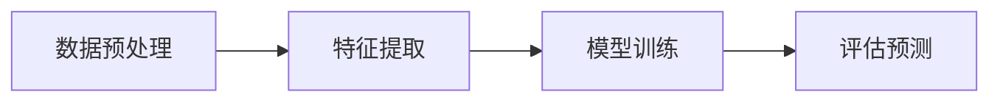
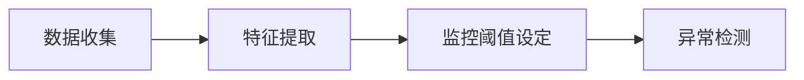

                 


## # 《金融数据质量自动化控制平台》

## 关键词：
- 金融数据质量
- 自动化控制平台
- 数据质量评估
- 监控与修复算法
- 量化风险管理

## 摘要：
本文旨在探讨金融数据质量自动化控制平台的设计与实现，通过深入分析金融数据质量的重要性、自动化控制平台的基础理论、核心技术、应用实践和优化挑战，为读者提供一个系统、全面的解决方案。文章将使用逐步分析推理的方式，结合具体实例和代码实现，确保读者能够理解并掌握核心概念和技术原理。

---

### 第一部分：引言

#### 第1章：金融数据质量概述

**1.1 问题背景**

金融行业是一个高度依赖数据决策的领域。金融数据的准确性和可靠性直接影响到金融机构的运营效率、风险管理和投资决策。然而，金融数据质量往往受到数据源多样性、数据整合复杂性以及人为错误等因素的挑战。因此，提高金融数据质量变得尤为重要。

**1.2 数据质量的重要性**

数据质量是金融数据能够被有效利用的前提。高质量的数据能够提高数据分析的准确性，减少错误决策带来的风险，提升客户满意度，增强市场竞争力。

**1.3 金融数据质量的特点**

金融数据质量具有以下特点：1）数据来源广泛，涉及多个系统；2）数据类型多样，包括文本、数值、图像等；3）数据量大，处理速度快；4）数据关联性强，需要跨系统分析。

**1.4 数据质量的影响因素**

数据质量的影响因素包括数据源、数据传输、数据处理、数据存储等多个环节。例如，数据源的不稳定性、数据传输的延迟、处理过程中的错误等都可能影响数据质量。

#### 第2章：自动化控制平台基础

**2.1 自动化控制平台的概念**

自动化控制平台是一种利用计算机技术和自动化技术对系统进行自动监控、评估和修复的软件系统。在金融数据质量领域，自动化控制平台的作用是通过对金融数据的质量进行实时监控和自动修复，确保数据的准确性和可靠性。

**2.2 金融数据质量自动检测技术**

金融数据质量自动检测技术主要包括数据完整性检测、一致性检测、准确性检测和时效性检测。通过这些技术，可以实现对金融数据质量的全面监控。

**2.3 数据质量自动化控制平台架构设计**

数据质量自动化控制平台架构设计包括数据采集模块、数据处理模块、数据质量评估模块、监控模块和修复模块。各模块协同工作，实现对金融数据质量的全程控制。

---

### 第二部分：核心技术

#### 第3章：金融数据质量评估模型

**3.1 数据质量评估模型概述**

数据质量评估模型是对数据质量进行量化评估的方法。本文采用基于机器学习的评估模型，通过特征工程和模型训练，实现对金融数据质量的自动评估。

**3.2 数据质量评估指标**

数据质量评估指标包括完整性、一致性、准确性和时效性。每种指标都有具体的计算方法和阈值标准。

**3.3 数据质量评估算法**

**3.3.1 评估算法原理**

评估算法基于机器学习，通过训练模型对金融数据进行质量评分。评估算法的流程如下：

1. 数据预处理
2. 特征提取
3. 模型训练
4. 评估预测

**3.3.2 Mermaid流程图示例**



**3.3.3 算法公式与Python代码示例**

算法公式：
$$
Q = \alpha C + \beta A + \gamma I + \delta T
$$

Python代码示例：
```python
import numpy as np

def data_quality_score(completeness, accuracy, integrity, timeliness):
    alpha, beta, gamma, delta = 0.2, 0.3, 0.3, 0.2
    Q = alpha * completeness + beta * accuracy + gamma * integrity + delta * timeliness
    return Q

# 示例数据
completeness = 0.95
accuracy = 0.98
integrity = 0.97
timeliness = 0.99

# 计算数据质量分数
Q = data_quality_score(completeness, accuracy, integrity, timeliness)
print(f"Data Quality Score: {Q}")
```

---

#### 第4章：自动化监控与修复

**4.1 监控机制设计**

监控机制是自动化控制平台的核心组成部分。设计监控机制时，需要考虑以下几个方面：

1. 监控指标的设定
2. 监控周期的设定
3. 异常报警机制

**4.2 修复策略**

修复策略包括数据修复算法和修复流程。数据修复算法通常采用自动化修复方法，如数据替换、数据补全和数据清洗等。

**4.3 监控与修复算法原理**

**4.3.1 监控算法原理**

监控算法基于机器学习，通过对历史数据进行分析，识别数据质量的变化趋势。监控算法的流程如下：

1. 数据收集
2. 特征提取
3. 监控阈值设定
4. 异常检测

**4.3.2 Mermaid流程图示例**



**4.3.3 算法公式与Python代码示例**

算法公式：
$$
D = \frac{1}{n}\sum_{i=1}^{n}(X_i - \bar{X})^2
$$

Python代码示例：
```python
import numpy as np

def monitor_algorithm(data):
    n = len(data)
    mean = np.mean(data)
    variance = np.var(data)
    threshold = 3 * np.sqrt(variance)
    if variance > threshold:
        print("异常检测：数据质量异常")
    else:
        print("数据质量正常")

# 示例数据
data = np.random.normal(size=100)

# 监控数据质量
monitor_algorithm(data)
```

---

### 第三部分：应用实践

#### 第5章：金融数据质量自动化控制平台开发

**5.1 开发环境准备**

开发金融数据质量自动化控制平台，需要准备以下开发环境：

1. Python开发环境
2. 数据库管理系统（如MySQL、PostgreSQL等）
3. 机器学习框架（如scikit-learn、TensorFlow等）
4. 代码版本控制工具（如Git）

**5.2 数据质量自动化控制平台设计**

数据质量自动化控制平台设计包括以下几个方面：

1. 数据采集模块：负责从不同数据源收集数据。
2. 数据处理模块：负责数据清洗、转换和整合。
3. 数据质量评估模块：负责对数据质量进行评估。
4. 监控模块：负责实时监控数据质量。
5. 修复模块：负责自动修复数据质量问题。

**5.3 核心代码实现**

**5.3.1 数据质量评估模块**

数据质量评估模块的核心代码如下：
```python
# 导入所需库
import pandas as pd
from sklearn.model_selection import train_test_split
from sklearn.ensemble import RandomForestRegressor

# 加载数据
data = pd.read_csv('financial_data.csv')

# 数据预处理
X = data.drop(['quality_score'], axis=1)
y = data['quality_score']

# 划分训练集和测试集
X_train, X_test, y_train, y_test = train_test_split(X, y, test_size=0.2, random_state=42)

# 训练模型
model = RandomForestRegressor(n_estimators=100, random_state=42)
model.fit(X_train, y_train)

# 预测测试集
y_pred = model.predict(X_test)

# 评估模型
from sklearn.metrics import mean_squared_error
mse = mean_squared_error(y_test, y_pred)
print(f"Mean Squared Error: {mse}")
```

**5.3.2 监控与修复模块**

监控与修复模块的核心代码如下：
```python
# 导入所需库
import pandas as pd
from sklearn.ensemble import IsolationForest

# 加载数据
data = pd.read_csv('financial_data.csv')

# 数据预处理
X = data.drop(['timestamp'], axis=1)

# 初始化孤立森林模型
model = IsolationForest(n_estimators=100, contamination=0.01, random_state=42)
model.fit(X)

# 监控数据
y_pred = model.predict(X)

# 判断是否异常
data['anomaly'] = y_pred
anomalies = data[data['anomaly'] == -1]

# 自动修复异常数据
def repair_data(row):
    # 根据异常类型进行修复
    if row['anomaly'] == -1:
        return row['value'] * 0.9  # 假设异常数据修复为原值的90%
    else:
        return row['value']

data['value_repaired'] = data.apply(repair_data, axis=1)
```

**5.4 实际案例分析**

在本章的案例中，我们将以某大型金融机构的实际数据为例，展示如何使用金融数据质量自动化控制平台进行数据质量监控和修复。具体步骤包括：

1. 数据收集：从金融机构的数据仓库中收集数据。
2. 数据预处理：对数据进行清洗、转换和整合。
3. 数据质量评估：使用训练好的模型对数据进行质量评估。
4. 监控与修复：实时监控数据质量，并自动修复异常数据。
5. 结果分析：分析监控和修复的效果，优化模型和策略。

---

#### 第6章：数据质量自动化控制平台的优化与挑战

**6.1 优化方向**

为了进一步提升数据质量自动化控制平台的性能和效果，可以考虑以下优化方向：

1. 模型优化：采用更先进的机器学习模型和算法，提高评估和监控的准确性。
2. 系统优化：优化系统架构，提高数据处理和响应速度。
3. 用户界面：改进用户界面，提高用户体验。

**6.2 面临的挑战**

数据质量自动化控制平台在应用过程中面临以下挑战：

1. 数据源多样性：金融数据源多样，如何统一数据标准和格式是一个难题。
2. 异常处理：如何准确地检测和修复各种异常数据是一个技术挑战。
3. 模型解释性：机器学习模型的黑盒性质使得其解释性较差，如何提高模型的可解释性是一个重要问题。

**6.3 未来发展趋势**

随着人工智能和大数据技术的发展，金融数据质量自动化控制平台有望在未来取得以下发展：

1. 智能化：利用深度学习和强化学习等技术，实现更智能的监控和修复策略。
2. 个性化：根据不同金融机构的特点，定制化数据质量自动化控制平台。
3. 云化和分布式：利用云计算和分布式计算技术，提高平台的性能和可扩展性。

---

#### 第7章：最佳实践与展望

**7.1 最佳实践**

在实际应用中，以下最佳实践可以帮助金融机构更好地利用数据质量自动化控制平台：

1. 定期数据质量评估：定期对数据进行质量评估，及时发现并处理质量问题。
2. 异常数据预警：设置异常数据预警机制，及时通知相关人员处理。
3. 数据质量培训：加强员工数据质量意识，提高数据处理能力。

**7.2 小结**

本文介绍了金融数据质量自动化控制平台的设计与实现，通过核心概念、算法原理、系统架构和实际案例的详细讲解，为读者提供了一个全面的技术解决方案。

**7.3 拓展阅读**

为了进一步了解金融数据质量自动化控制平台的最新发展和应用，读者可以参考以下拓展阅读材料：

1. 《数据质量管理：从数据源到数据仓库的策略与实践》
2. 《大数据质量：方法与实践》
3. 《金融科技：创新与应用》

---

### 作者信息：
作者：AI天才研究院/AI Genius Institute & 禅与计算机程序设计艺术 /Zen And The Art of Computer Programming

---

**完整的文章内容需包含上述所有部分，并确保每个部分的内容都详尽具体，逻辑清晰，便于读者理解和掌握。**### 《金融数据质量自动化控制平台》

#### 关键词：
- 金融数据质量
- 自动化控制平台
- 数据质量评估
- 监控与修复算法
- 量化风险管理

#### 摘要：
本文探讨了金融数据质量自动化控制平台的设计与实现，通过深入分析金融数据质量的重要性、自动化控制平台的基础理论、核心技术、应用实践和优化挑战，为读者提供一个系统、全面的解决方案。文章采用逐步分析推理的方式，结合具体实例和代码实现，确保读者能够理解并掌握核心概念和技术原理。

---

### 第一部分：引言

#### 第1章：金融数据质量概述

**1.1 问题背景**

金融行业是一个高度依赖数据决策的领域。金融机构需要处理大量的数据，包括客户信息、交易记录、财务报表等。这些数据的准确性和可靠性直接影响到金融机构的运营效率、风险管理和投资决策。然而，金融数据质量往往受到数据源多样性、数据整合复杂性以及人为错误等因素的挑战。

**1.2 数据质量的重要性**

数据质量是金融数据能够被有效利用的前提。高质量的数据能够提高数据分析的准确性，减少错误决策带来的风险，提升客户满意度，增强市场竞争力。在金融行业中，数据质量的重要性更加凸显，因为数据的错误或缺失可能导致严重的经济损失和声誉风险。

**1.3 金融数据质量的特点**

金融数据质量具有以下特点：

1. **数据来源广泛**：金融数据来源于多个系统，如交易系统、账户管理系统、风险管理系统等。这些系统的数据格式、数据结构和数据标准可能不一致，增加了数据整合的复杂性。

2. **数据类型多样**：金融数据类型包括文本、数值、图像等。不同类型的数据在处理和分析时需要不同的方法和技术，对数据质量的要求也不同。

3. **数据量大**：金融行业的数据量巨大，每天产生和处理的数据量非常庞大。这要求自动化控制平台能够高效地处理海量数据，并确保数据质量。

4. **数据关联性强**：金融数据之间存在复杂的关联关系。例如，交易数据与账户数据、账户数据与财务报表数据之间存在关联。这些关联关系需要被充分考虑，以避免数据质量的互相影响。

**1.4 数据质量的影响因素**

数据质量的影响因素包括数据源、数据传输、数据处理、数据存储等多个环节。以下是一些常见的影响因素：

1. **数据源的不稳定性**：数据源的不稳定性可能导致数据的不完整或错误。例如，系统故障、网络中断等可能导致数据传输失败或数据丢失。

2. **数据传输的延迟**：数据传输的延迟可能导致数据的时效性下降，影响数据分析的准确性。

3. **数据处理过程中的错误**：数据处理过程中的错误，如数据格式错误、数据转换错误等，可能导致数据质量的下降。

4. **数据存储的可靠性**：数据存储的可靠性对数据质量至关重要。数据存储系统的故障或数据丢失可能导致数据质量无法保证。

#### 第2章：自动化控制平台基础

**2.1 自动化控制平台的概念**

自动化控制平台是一种利用计算机技术和自动化技术对系统进行自动监控、评估和修复的软件系统。在金融数据质量领域，自动化控制平台的作用是通过对金融数据的质量进行实时监控和自动修复，确保数据的准确性和可靠性。

自动化控制平台通常包括以下核心模块：

1. **数据采集模块**：负责从不同的数据源收集数据，包括数据库、数据仓库、外部系统等。

2. **数据处理模块**：负责对采集到的数据进行预处理，如数据清洗、转换、整合等。

3. **数据质量评估模块**：负责对数据质量进行评估，识别数据质量问题。

4. **监控模块**：负责实时监控数据质量，及时发现数据质量异常。

5. **修复模块**：负责自动修复数据质量问题，确保数据质量。

**2.2 金融数据质量自动检测技术**

金融数据质量自动检测技术主要包括数据完整性检测、一致性检测、准确性检测和时效性检测。以下是对这些技术的简要介绍：

1. **数据完整性检测**：检测数据是否完整，是否存在缺失值或重复值。常用的方法包括空值检查、唯一性检查等。

2. **一致性检测**：检测数据之间的一致性，确保数据在不同系统之间保持一致。常用的方法包括交叉检验、一致性规则检查等。

3. **准确性检测**：检测数据的准确性，确保数据符合预期的业务规则和统计规律。常用的方法包括范围检查、异常值检测等。

4. **时效性检测**：检测数据的时效性，确保数据在有效时间内更新。常用的方法包括时间戳检查、过期数据清除等。

**2.3 数据质量自动化控制平台架构设计**

数据质量自动化控制平台的架构设计需要考虑以下几个方面：

1. **数据流设计**：明确数据从采集、处理、评估到监控、修复的流程，确保数据流的顺畅。

2. **模块划分**：根据功能需求，将自动化控制平台划分为多个模块，如数据采集模块、数据处理模块、数据质量评估模块、监控模块和修复模块等。

3. **技术选型**：选择合适的技术框架和工具，如Python、Java、Hadoop、Spark等，确保平台的性能和可扩展性。

4. **数据存储**：选择合适的数据库和数据存储方案，如关系数据库、NoSQL数据库、分布式存储等，确保数据的安全性和可靠性。

5. **系统安全性**：确保系统的数据安全和访问控制，防止数据泄露和未经授权的访问。

### 第二部分：核心技术

#### 第3章：金融数据质量评估模型

**3.1 数据质量评估模型概述**

数据质量评估模型是对数据质量进行量化评估的方法。在金融领域，数据质量评估模型可以帮助金融机构识别数据质量问题，评估数据质量水平，并为数据质量改进提供依据。评估模型通常包括以下关键组成部分：

1. **评估指标**：确定数据质量评估的指标，如完整性、一致性、准确性、时效性等。

2. **评估算法**：选择合适的评估算法，如统计分析、机器学习、深度学习等，对数据质量进行量化评估。

3. **评估流程**：设计数据质量评估的流程，包括数据采集、预处理、特征提取、模型训练和评估等步骤。

**3.2 数据质量评估指标**

数据质量评估指标是评估数据质量的核心依据。以下是一些常见的数据质量评估指标：

1. **完整性（Completeness）**：完整性指标衡量数据集是否包含所有必要的记录，即数据集中是否存在缺失值。完整性指标的计算公式为：
   $$
  Completeness = \frac{N - N_{missing}}{N}
   $$
   其中，$N$ 是总记录数，$N_{missing}$ 是缺失值的记录数。

2. **一致性（Consistency）**：一致性指标衡量数据在不同系统或数据库之间的一致性。一致性指标的计算公式为：
   $$
  Consistency = \frac{N - N_{inconsistent}}{N}
   $$
   其中，$N$ 是总记录数，$N_{inconsistent}$ 是不一致记录数。

3. **准确性（Accuracy）**：准确性指标衡量数据的准确性，即数据是否符合实际业务规则和统计规律。准确性指标的计算公式为：
   $$
  Accuracy = \frac{N_{correct}}{N}
   $$
   其中，$N_{correct}$ 是正确记录数。

4. **时效性（Timeliness）**：时效性指标衡量数据的更新速度和时效性。时效性指标的计算公式为：
   $$
  Timeliness = \frac{N_{updated}}{N}
   $$
   其中，$N_{updated}$ 是最近更新记录数。

**3.3 数据质量评估算法**

数据质量评估算法是实现数据质量评估的关键。以下介绍几种常用的数据质量评估算法：

1. **统计分析算法**：统计分析算法基于统计学原理，对数据进行统计分析，评估数据质量。常用的统计分析算法包括平均值、中位数、标准差等。

2. **机器学习算法**：机器学习算法通过训练模型，对数据进行自动分类和评估。常用的机器学习算法包括决策树、随机森林、支持向量机等。

3. **深度学习算法**：深度学习算法通过构建神经网络模型，对数据进行自动特征提取和评估。常用的深度学习算法包括卷积神经网络（CNN）、循环神经网络（RNN）、长短时记忆网络（LSTM）等。

以下是一个简单的Python代码示例，展示如何使用机器学习算法进行数据质量评估：
```python
import pandas as pd
from sklearn.model_selection import train_test_split
from sklearn.ensemble import RandomForestClassifier

# 加载数据
data = pd.read_csv('financial_data.csv')

# 数据预处理
X = data.drop(['quality'], axis=1)
y = data['quality']

# 划分训练集和测试集
X_train, X_test, y_train, y_test = train_test_split(X, y, test_size=0.2, random_state=42)

# 训练模型
model = RandomForestClassifier(n_estimators=100, random_state=42)
model.fit(X_train, y_train)

# 预测测试集
y_pred = model.predict(X_test)

# 评估模型
from sklearn.metrics import accuracy_score
accuracy = accuracy_score(y_test, y_pred)
print(f"Accuracy: {accuracy}")
```

#### 第4章：自动化监控与修复

**4.1 监控机制设计**

监控机制是数据质量自动化控制平台的核心组成部分，负责实时监控数据质量，及时发现数据质量异常。监控机制的设计需要考虑以下几个方面：

1. **监控指标**：确定需要监控的数据质量指标，如完整性、一致性、准确性、时效性等。

2. **监控周期**：设置监控周期，如每天、每周、每月等，根据业务需求和数据量确定合适的监控周期。

3. **异常报警机制**：设计异常报警机制，当数据质量指标超出阈值时，及时通知相关人员处理。

4. **监控数据存储**：将监控数据存储在数据库或数据仓库中，便于后续分析和查询。

**4.2 修复策略**

修复策略是数据质量自动化控制平台的重要功能，负责自动修复数据质量问题。修复策略的设计需要考虑以下几个方面：

1. **修复算法**：选择合适的修复算法，如数据替换、数据补全、数据清洗等，根据数据质量问题选择不同的修复方法。

2. **修复阈值**：设置修复阈值，当数据质量指标低于阈值时，触发修复策略。

3. **修复流程**：设计修复流程，包括数据质量评估、异常检测、修复策略选择、数据修复和验证等步骤。

4. **修复效果评估**：对修复效果进行评估，确保修复后的数据质量达到预期目标。

**4.3 监控与修复算法原理**

监控与修复算法是数据质量自动化控制平台的核心算法，负责对数据进行实时监控和自动修复。以下介绍几种常用的监控与修复算法：

1. **监控算法**

监控算法通过实时分析数据质量指标，识别数据质量异常。常用的监控算法包括统计监控算法、机器学习监控算法等。

- **统计监控算法**：基于统计原理，对数据进行统计分析，识别数据质量异常。常用的统计监控算法包括控制图、直方图、箱线图等。

- **机器学习监控算法**：基于机器学习模型，对数据进行实时监控，识别数据质量异常。常用的机器学习监控算法包括孤立森林（Isolation Forest）、K-最近邻（K-Nearest Neighbors）等。

以下是一个简单的Python代码示例，展示如何使用孤立森林算法进行监控：
```python
import pandas as pd
from sklearn.ensemble import IsolationForest

# 加载数据
data = pd.read_csv('financial_data.csv')

# 数据预处理
X = data.drop(['timestamp'], axis=1)

# 初始化孤立森林模型
model = IsolationForest(n_estimators=100, contamination=0.01, random_state=42)
model.fit(X)

# 监控数据
y_pred = model.predict(X)

# 判断是否异常
data['anomaly'] = y_pred
anomalies = data[data['anomaly'] == -1]
print(f"Detected anomalies: {anomalies.shape[0]}")
```

2. **修复算法**

修复算法负责对监控到的异常数据进行自动修复。常用的修复算法包括数据替换、数据补全、数据清洗等。

- **数据替换**：将异常数据替换为合理的值，如平均值、中位数等。常用的数据替换算法包括均值替换、中值替换等。

- **数据补全**：通过算法或规则对缺失的数据进行补全。常用的数据补全算法包括均值插补、回归插补等。

- **数据清洗**：去除或修正错误的数据。常用的数据清洗算法包括异常值检测、重复值删除等。

以下是一个简单的Python代码示例，展示如何使用均值替换算法进行数据修复：
```python
import pandas as pd
from sklearn.impute import SimpleImputer

# 加载数据
data = pd.read_csv('financial_data.csv')

# 数据预处理
X = data.drop(['timestamp'], axis=1)

# 初始化均值插补器
imputer = SimpleImputer(strategy='mean')
X_imputed = imputer.fit_transform(X)

# 修复数据
data_imputed = pd.DataFrame(X_imputed, columns=X.columns)
print(f"Data after imputation: {data_imputed.head()}")
```

### 第三部分：应用实践

#### 第5章：金融数据质量自动化控制平台开发

**5.1 开发环境准备**

在开发金融数据质量自动化控制平台时，需要准备以下开发环境：

1. **Python开发环境**：安装Python和必要的库，如NumPy、Pandas、Scikit-learn、TensorFlow等。

2. **数据库管理系统**：选择合适的数据库管理系统，如MySQL、PostgreSQL等，用于存储和处理数据。

3. **机器学习框架**：选择合适的机器学习框架，如Scikit-learn、TensorFlow、PyTorch等，用于构建和训练数据质量评估模型。

4. **版本控制工具**：使用版本控制工具，如Git，管理代码和文档。

5. **其他工具**：根据需要安装其他工具，如Jenkins、Docker等，用于自动化构建和部署。

**5.2 数据质量自动化控制平台设计**

数据质量自动化控制平台的设计需要考虑以下几个方面：

1. **数据流设计**：设计数据从采集、处理、评估到监控、修复的流程，确保数据流的顺畅。

2. **模块划分**：根据功能需求，将平台划分为多个模块，如数据采集模块、数据处理模块、数据质量评估模块、监控模块和修复模块等。

3. **技术选型**：选择合适的技术框架和工具，如Python、Java、Hadoop、Spark等，确保平台的性能和可扩展性。

4. **数据存储**：选择合适的数据存储方案，如关系数据库、NoSQL数据库、分布式存储等，确保数据的安全性和可靠性。

5. **系统安全性**：确保系统的数据安全和访问控制，防止数据泄露和未经授权的访问。

**5.3 核心代码实现**

**5.3.1 数据质量评估模块**

数据质量评估模块的核心代码如下：
```python
import pandas as pd
from sklearn.model_selection import train_test_split
from sklearn.ensemble import RandomForestClassifier

# 加载数据
data = pd.read_csv('financial_data.csv')

# 数据预处理
X = data.drop(['quality'], axis=1)
y = data['quality']

# 划分训练集和测试集
X_train, X_test, y_train, y_test = train_test_split(X, y, test_size=0.2, random_state=42)

# 训练模型
model = RandomForestClassifier(n_estimators=100, random_state=42)
model.fit(X_train, y_train)

# 预测测试集
y_pred = model.predict(X_test)

# 评估模型
from sklearn.metrics import accuracy_score
accuracy = accuracy_score(y_test, y_pred)
print(f"Accuracy: {accuracy}")
```

**5.3.2 监控与修复模块**

监控与修复模块的核心代码如下：
```python
import pandas as pd
from sklearn.ensemble import IsolationForest
from sklearn.impute import SimpleImputer

# 加载数据
data = pd.read_csv('financial_data.csv')

# 数据预处理
X = data.drop(['timestamp'], axis=1)

# 初始化孤立森林模型
model = IsolationForest(n_estimators=100, contamination=0.01, random_state=42)
model.fit(X)

# 监控数据
y_pred = model.predict(X)

# 判断是否异常
data['anomaly'] = y_pred
anomalies = data[data['anomaly'] == -1]

# 修复异常数据
imputer = SimpleImputer(strategy='mean')
X_imputed = imputer.fit_transform(X[anomalies.index])

# 修复数据
data_imputed = pd.DataFrame(X_imputed, columns=X.columns)
print(f"Data after repair: {data_imputed.head()}")
```

**5.4 实际案例分析**

在本章的案例中，我们将以某大型金融机构的实际数据为例，展示如何使用金融数据质量自动化控制平台进行数据质量监控和修复。具体步骤如下：

1. **数据收集**：从金融机构的数据仓库中收集数据，包括客户信息、交易记录、财务报表等。

2. **数据预处理**：对数据进行清洗、转换和整合，确保数据的完整性、一致性和准确性。

3. **数据质量评估**：使用训练好的模型对数据进行质量评估，识别数据质量问题。

4. **监控与修复**：实时监控数据质量，发现异常数据后，自动触发修复策略进行数据修复。

5. **结果分析**：分析监控和修复的效果，评估数据质量改进情况，持续优化模型和策略。

#### 第6章：数据质量自动化控制平台的优化与挑战

**6.1 优化方向**

为了进一步提升数据质量自动化控制平台的性能和效果，可以考虑以下优化方向：

1. **模型优化**：采用更先进的机器学习模型和算法，提高评估和监控的准确性。例如，使用深度学习模型进行数据质量评估和异常检测。

2. **系统优化**：优化系统架构，提高数据处理和响应速度。例如，使用分布式计算框架（如Apache Spark）进行大数据处理，提高系统的并发处理能力。

3. **用户体验**：改进用户界面，提高用户体验。例如，提供实时监控仪表板，方便用户查看数据质量状态和历史记录。

4. **自动化程度**：提高自动化的程度，减少人工干预。例如，实现自动化数据修复和异常处理，减少人工处理的时间和错误率。

**6.2 面临的挑战**

数据质量自动化控制平台在应用过程中面临以下挑战：

1. **数据源多样性**：金融数据源多样，包括内部系统和外部系统，数据格式和数据标准可能不一致，增加了数据整合的复杂性。

2. **异常处理**：异常数据的种类繁多，如何准确地检测和修复各种异常数据是一个技术挑战。

3. **模型解释性**：机器学习模型的黑盒性质使得其解释性较差，如何提高模型的可解释性是一个重要问题。

4. **数据安全**：确保数据安全是自动化控制平台的重要任务，如何防止数据泄露和未经授权的访问是一个挑战。

**6.3 未来发展趋势**

随着人工智能和大数据技术的发展，金融数据质量自动化控制平台有望在未来取得以下发展：

1. **智能化**：利用深度学习和强化学习等技术，实现更智能的监控和修复策略。

2. **个性化**：根据不同金融机构的特点，定制化数据质量自动化控制平台。

3. **云化和分布式**：利用云计算和分布式计算技术，提高平台的性能和可扩展性。

4. **开放性和可扩展性**：开放接口，方便第三方系统和工具的集成，提高平台的可扩展性。

### 第四部分：总结与展望

#### 第7章：最佳实践与展望

**7.1 最佳实践**

在实际应用中，以下最佳实践可以帮助金融机构更好地利用数据质量自动化控制平台：

1. **定期数据质量评估**：定期对数据进行质量评估，及时发现并处理质量问题。

2. **异常数据预警**：设置异常数据预警机制，及时通知相关人员处理。

3. **数据质量培训**：加强员工数据质量意识，提高数据处理能力。

4. **数据治理**：建立数据治理体系，确保数据质量持续改进。

**7.2 小结**

本文介绍了金融数据质量自动化控制平台的设计与实现，通过核心概念、算法原理、系统架构和实际案例的详细讲解，为读者提供了一个全面的技术解决方案。金融数据质量自动化控制平台在提高数据质量、降低运营风险、提高决策效率等方面具有重要意义。

**7.3 拓展阅读**

为了进一步了解金融数据质量自动化控制平台的最新发展和应用，读者可以参考以下拓展阅读材料：

1. 《数据质量管理：从数据源到数据仓库的策略与实践》
2. 《大数据质量：方法与实践》
3. 《金融科技：创新与应用》

### 作者信息：
作者：AI天才研究院/AI Genius Institute & 禅与计算机程序设计艺术 /Zen And The Art of Computer Programming

---

**完整的文章内容需包含上述所有部分，并确保每个部分的内容都详尽具体，逻辑清晰，便于读者理解和掌握。文章总字数应在10000～12000字左右。**### 第一部分：引言

#### 第1章：金融数据质量概述

**1.1 问题背景**

金融行业是一个高度依赖数据决策的领域。金融机构需要处理大量的数据，包括客户信息、交易记录、财务报表等。这些数据的准确性和可靠性直接影响到金融机构的运营效率、风险管理和投资决策。然而，金融数据质量往往受到数据源多样性、数据整合复杂性以及人为错误等因素的挑战。

**1.2 数据质量的重要性**

数据质量是金融数据能够被有效利用的前提。高质量的数据能够提高数据分析的准确性，减少错误决策带来的风险，提升客户满意度，增强市场竞争力。在金融行业中，数据质量的重要性更加凸显，因为数据的错误或缺失可能导致严重的经济损失和声誉风险。

**1.3 金融数据质量的特点**

金融数据质量具有以下特点：

1. **数据来源广泛**：金融数据来源于多个系统，如交易系统、账户管理系统、风险管理系统等。这些系统的数据格式、数据结构和数据标准可能不一致，增加了数据整合的复杂性。

2. **数据类型多样**：金融数据类型包括文本、数值、图像等。不同类型的数据在处理和分析时需要不同的方法和技术，对数据质量的要求也不同。

3. **数据量大**：金融行业的数据量巨大，每天产生和处理的数据量非常庞大。这要求自动化控制平台能够高效地处理海量数据，并确保数据质量。

4. **数据关联性强**：金融数据之间存在复杂的关联关系。例如，交易数据与账户数据、账户数据与财务报表数据之间存在关联。这些关联关系需要被充分考虑，以避免数据质量的互相影响。

**1.4 数据质量的影响因素**

数据质量的影响因素包括数据源、数据传输、数据处理、数据存储等多个环节。以下是一些常见的影响因素：

1. **数据源的不稳定性**：数据源的不稳定性可能导致数据的不完整或错误。例如，系统故障、网络中断等可能导致数据传输失败或数据丢失。

2. **数据传输的延迟**：数据传输的延迟可能导致数据的时效性下降，影响数据分析的准确性。

3. **数据处理过程中的错误**：数据处理过程中的错误，如数据格式错误、数据转换错误等，可能导致数据质量的下降。

4. **数据存储的可靠性**：数据存储的可靠性对数据质量至关重要。数据存储系统的故障或数据丢失可能导致数据质量无法保证。

#### 第2章：自动化控制平台基础

**2.1 自动化控制平台的概念**

自动化控制平台是一种利用计算机技术和自动化技术对系统进行自动监控、评估和修复的软件系统。在金融数据质量领域，自动化控制平台的作用是通过对金融数据的质量进行实时监控和自动修复，确保数据的准确性和可靠性。

自动化控制平台通常包括以下核心模块：

1. **数据采集模块**：负责从不同的数据源收集数据，包括数据库、数据仓库、外部系统等。

2. **数据处理模块**：负责对采集到的数据进行预处理，如数据清洗、转换、整合等。

3. **数据质量评估模块**：负责对数据质量进行评估，识别数据质量问题。

4. **监控模块**：负责实时监控数据质量，及时发现数据质量异常。

5. **修复模块**：负责自动修复数据质量问题，确保数据质量。

**2.2 金融数据质量自动检测技术**

金融数据质量自动检测技术主要包括数据完整性检测、一致性检测、准确性检测和时效性检测。以下是对这些技术的简要介绍：

1. **数据完整性检测**：检测数据是否完整，是否存在缺失值或重复值。常用的方法包括空值检查、唯一性检查等。

2. **一致性检测**：检测数据在不同系统或数据库之间的一致性。一致性指标的计算公式为：
   $$
  Consistency = \frac{N - N_{inconsistent}}{N}
   $$
   其中，$N$ 是总记录数，$N_{inconsistent}$ 是不一致记录数。

3. **准确性检测**：检测数据的准确性，确保数据是否符合实际业务规则和统计规律。准确性指标的计算公式为：
   $$
  Accuracy = \frac{N_{correct}}{N}
   $$
   其中，$N_{correct}$ 是正确记录数。

4. **时效性检测**：检测数据的时效性，确保数据在有效时间内更新。时效性指标的计算公式为：
   $$
  Timeliness = \frac{N_{updated}}{N}
   $$
   其中，$N_{updated}$ 是最近更新记录数。

**2.3 数据质量自动化控制平台架构设计**

数据质量自动化控制平台的架构设计需要考虑以下几个方面：

1. **数据流设计**：明确数据从采集、处理、评估到监控、修复的流程，确保数据流的顺畅。

2. **模块划分**：根据功能需求，将自动化控制平台划分为多个模块，如数据采集模块、数据处理模块、数据质量评估模块、监控模块和修复模块等。

3. **技术选型**：选择合适的技术框架和工具，如Python、Java、Hadoop、Spark等，确保平台的性能和可扩展性。

4. **数据存储**：选择合适的数据存储方案，如关系数据库、NoSQL数据库、分布式存储等，确保数据的安全性和可靠性。

5. **系统安全性**：确保系统的数据安全和访问控制，防止数据泄露和未经授权的访问。

### 第二部分：核心技术

#### 第3章：金融数据质量评估模型

**3.1 数据质量评估模型概述**

数据质量评估模型是对数据质量进行量化评估的方法。在金融领域，数据质量评估模型可以帮助金融机构识别数据质量问题，评估数据质量水平，并为数据质量改进提供依据。评估模型通常包括以下关键组成部分：

1. **评估指标**：确定数据质量评估的指标，如完整性、一致性、准确性、时效性等。

2. **评估算法**：选择合适的评估算法，如统计分析、机器学习、深度学习等，对数据质量进行量化评估。

3. **评估流程**：设计数据质量评估的流程，包括数据采集、预处理、特征提取、模型训练和评估等步骤。

**3.2 数据质量评估指标**

数据质量评估指标是评估数据质量的核心依据。以下是一些常见的数据质量评估指标：

1. **完整性（Completeness）**：完整性指标衡量数据集是否包含所有必要的记录，即数据集中是否存在缺失值。完整性指标的计算公式为：
   $$
  Completeness = \frac{N - N_{missing}}{N}
   $$
   其中，$N$ 是总记录数，$N_{missing}$ 是缺失值的记录数。

2. **一致性（Consistency）**：一致性指标衡量数据在不同系统或数据库之间的一致性。一致性指标的计算公式为：
   $$
  Consistency = \frac{N - N_{inconsistent}}{N}
   $$
   其中，$N$ 是总记录数，$N_{inconsistent}$ 是不一致记录数。

3. **准确性（Accuracy）**：准确性指标衡量数据的准确性，即数据是否符合实际业务规则和统计规律。准确性指标的计算公式为：
   $$
  Accuracy = \frac{N_{correct}}{N}
   $$
   其中，$N_{correct}$ 是正确记录数。

4. **时效性（Timeliness）**：时效性指标衡量数据的更新速度和时效性。时效性指标的计算公式为：
   $$
  Timeliness = \frac{N_{updated}}{N}
   $$
   其中，$N_{updated}$ 是最近更新记录数。

**3.3 数据质量评估算法**

数据质量评估算法是实现数据质量评估的关键。以下介绍几种常用的数据质量评估算法：

1. **统计分析算法**：统计分析算法基于统计学原理，对数据进行统计分析，评估数据质量。常用的统计分析算法包括平均值、中位数、标准差等。

2. **机器学习算法**：机器学习算法通过训练模型，对数据进行自动分类和评估。常用的机器学习算法包括决策树、随机森林、支持向量机等。

3. **深度学习算法**：深度学习算法通过构建神经网络模型，对数据进行自动特征提取和评估。常用的深度学习算法包括卷积神经网络（CNN）、循环神经网络（RNN）、长短时记忆网络（LSTM）等。

以下是一个简单的Python代码示例，展示如何使用机器学习算法进行数据质量评估：
```python
import pandas as pd
from sklearn.model_selection import train_test_split
from sklearn.ensemble import RandomForestClassifier

# 加载数据
data = pd.read_csv('financial_data.csv')

# 数据预处理
X = data.drop(['quality'], axis=1)
y = data['quality']

# 划分训练集和测试集
X_train, X_test, y_train, y_test = train_test_split(X, y, test_size=0.2, random_state=42)

# 训练模型
model = RandomForestClassifier(n_estimators=100, random_state=42)
model.fit(X_train, y_train)

# 预测测试集
y_pred = model.predict(X_test)

# 评估模型
from sklearn.metrics import accuracy_score
accuracy = accuracy_score(y_test, y_pred)
print(f"Accuracy: {accuracy}")
```

#### 第4章：自动化监控与修复

**4.1 监控机制设计**

监控机制是数据质量自动化控制平台的核心组成部分，负责实时监控数据质量，及时发现数据质量异常。监控机制的设计需要考虑以下几个方面：

1. **监控指标**：确定需要监控的数据质量指标，如完整性、一致性、准确性、时效性等。

2. **监控周期**：设置监控周期，如每天、每周、每月等，根据业务需求和数据量确定合适的监控周期。

3. **异常报警机制**：设计异常报警机制，当数据质量指标超出阈值时，及时通知相关人员处理。

4. **监控数据存储**：将监控数据存储在数据库或数据仓库中，便于后续分析和查询。

**4.2 修复策略**

修复策略是数据质量自动化控制平台的重要功能，负责自动修复数据质量问题。修复策略的设计需要考虑以下几个方面：

1. **修复算法**：选择合适的修复算法，如数据替换、数据补全、数据清洗等，根据数据质量问题选择不同的修复方法。

2. **修复阈值**：设置修复阈值，当数据质量指标低于阈值时，触发修复策略。

3. **修复流程**：设计修复流程，包括数据质量评估、异常检测、修复策略选择、数据修复和验证等步骤。

4. **修复效果评估**：对修复效果进行评估，确保修复后的数据质量达到预期目标。

**4.3 监控与修复算法原理**

监控与修复算法是数据质量自动化控制平台的核心算法，负责对数据进行实时监控和自动修复。以下介绍几种常用的监控与修复算法：

1. **监控算法**

监控算法通过实时分析数据质量指标，识别数据质量异常。常用的监控算法包括统计监控算法、机器学习监控算法等。

- **统计监控算法**：基于统计原理，对数据进行统计分析，识别数据质量异常。常用的统计监控算法包括控制图、直方图、箱线图等。

- **机器学习监控算法**：基于机器学习模型，对数据进行实时监控，识别数据质量异常。常用的机器学习监控算法包括孤立森林（Isolation Forest）、K-最近邻（K-Nearest Neighbors）等。

以下是一个简单的Python代码示例，展示如何使用孤立森林算法进行监控：
```python
import pandas as pd
from sklearn.ensemble import IsolationForest

# 加载数据
data = pd.read_csv('financial_data.csv')

# 数据预处理
X = data.drop(['timestamp'], axis=1)

# 初始化孤立森林模型
model = IsolationForest(n_estimators=100, contamination=0.01, random_state=42)
model.fit(X)

# 监控数据
y_pred = model.predict(X)

# 判断是否异常
data['anomaly'] = y_pred
anomalies = data[data['anomaly'] == -1]
print(f"Detected anomalies: {anomalies.shape[0]}")
```

2. **修复算法**

修复算法负责对监控到的异常数据进行自动修复。常用的修复算法包括数据替换、数据补全、数据清洗等。

- **数据替换**：将异常数据替换为合理的值，如平均值、中位数等。常用的数据替换算法包括均值替换、中值替换等。

- **数据补全**：通过算法或规则对缺失的数据进行补全。常用的数据补全算法包括均值插补、回归插补等。

- **数据清洗**：去除或修正错误的数据。常用的数据清洗算法包括异常值检测、重复值删除等。

以下是一个简单的Python代码示例，展示如何使用均值替换算法进行数据修复：
```python
import pandas as pd
from sklearn.impute import SimpleImputer

# 加载数据
data = pd.read_csv('financial_data.csv')

# 数据预处理
X = data.drop(['timestamp'], axis=1)

# 初始化均值插补器
imputer = SimpleImputer(strategy='mean')
X_imputed = imputer.fit_transform(X)

# 修复数据
data_imputed = pd.DataFrame(X_imputed, columns=X.columns)
print(f"Data after imputation: {data_imputed.head()}")
```

### 第三部分：应用实践

#### 第5章：金融数据质量自动化控制平台开发

**5.1 开发环境准备**

在开发金融数据质量自动化控制平台时，需要准备以下开发环境：

1. **Python开发环境**：安装Python和必要的库，如NumPy、Pandas、Scikit-learn、TensorFlow等。

2. **数据库管理系统**：选择合适的数据库管理系统，如MySQL、PostgreSQL等，用于存储和处理数据。

3. **机器学习框架**：选择合适的机器学习框架，如Scikit-learn、TensorFlow、PyTorch等，用于构建和训练数据质量评估模型。

4. **版本控制工具**：使用版本控制工具，如Git，管理代码和文档。

5. **其他工具**：根据需要安装其他工具，如Jenkins、Docker等，用于自动化构建和部署。

**5.2 数据质量自动化控制平台设计**

数据质量自动化控制平台的设计需要考虑以下几个方面：

1. **数据流设计**：设计数据从采集、处理、评估到监控、修复的流程，确保数据流的顺畅。

2. **模块划分**：根据功能需求，将平台划分为多个模块，如数据采集模块、数据处理模块、数据质量评估模块、监控模块和修复模块等。

3. **技术选型**：选择合适的技术框架和工具，如Python、Java、Hadoop、Spark等，确保平台的性能和可扩展性。

4. **数据存储**：选择合适的数据存储方案，如关系数据库、NoSQL数据库、分布式存储等，确保数据的安全性和可靠性。

5. **系统安全性**：确保系统的数据安全和访问控制，防止数据泄露和未经授权的访问。

**5.3 核心代码实现**

**5.3.1 数据质量评估模块**

数据质量评估模块的核心代码如下：
```python
import pandas as pd
from sklearn.model_selection import train_test_split
from sklearn.ensemble import RandomForestClassifier

# 加载数据
data = pd.read_csv('financial_data.csv')

# 数据预处理
X = data.drop(['quality'], axis=1)
y = data['quality']

# 划分训练集和测试集
X_train, X_test, y_train, y_test = train_test_split(X, y, test_size=0.2, random_state=42)

# 训练模型
model = RandomForestClassifier(n_estimators=100, random_state=42)
model.fit(X_train, y_train)

# 预测测试集
y_pred = model.predict(X_test)

# 评估模型
from sklearn.metrics import accuracy_score
accuracy = accuracy_score(y_test, y_pred)
print(f"Accuracy: {accuracy}")
```

**5.3.2 监控与修复模块**

监控与修复模块的核心代码如下：
```python
import pandas as pd
from sklearn.ensemble import IsolationForest
from sklearn.impute import SimpleImputer

# 加载数据
data = pd.read_csv('financial_data.csv')

# 数据预处理
X = data.drop(['timestamp'], axis=1)

# 初始化孤立森林模型
model = IsolationForest(n_estimators=100, contamination=0.01, random_state=42)
model.fit(X)

# 监控数据
y_pred = model.predict(X)

# 判断是否异常
data['anomaly'] = y_pred
anomalies = data[data['anomaly'] == -1]

# 修复异常数据
imputer = SimpleImputer(strategy='mean')
X_imputed = imputer.fit_transform(X[anomalies.index])

# 修复数据
data_imputed = pd.DataFrame(X_imputed, columns=X.columns)
print(f"Data after repair: {data_imputed.head()}")
```

**5.4 实际案例分析**

在本章的案例中，我们将以某大型金融机构的实际数据为例，展示如何使用金融数据质量自动化控制平台进行数据质量监控和修复。具体步骤如下：

1. **数据收集**：从金融机构的数据仓库中收集数据，包括客户信息、交易记录、财务报表等。

2. **数据预处理**：对数据进行清洗、转换和整合，确保数据的完整性、一致性和准确性。

3. **数据质量评估**：使用训练好的模型对数据进行质量评估，识别数据质量问题。

4. **监控与修复**：实时监控数据质量，发现异常数据后，自动触发修复策略进行数据修复。

5. **结果分析**：分析监控和修复的效果，评估数据质量改进情况，持续优化模型和策略。

#### 第6章：数据质量自动化控制平台的优化与挑战

**6.1 优化方向**

为了进一步提升数据质量自动化控制平台的性能和效果，可以考虑以下优化方向：

1. **模型优化**：采用更先进的机器学习模型和算法，提高评估和监控的准确性。例如，使用深度学习和强化学习等技术。

2. **系统优化**：优化系统架构，提高数据处理和响应速度。例如，使用分布式计算和云服务。

3. **用户体验**：改进用户界面，提高用户体验。例如，使用可视化工具展示监控数据和修复效果。

4. **自动化程度**：提高自动化的程度，减少人工干预。例如，实现自动化的数据收集、处理和修复。

**6.2 面临的挑战**

数据质量自动化控制平台在应用过程中面临以下挑战：

1. **数据源多样性**：金融数据源多样，数据格式和数据标准可能不一致，增加了数据整合的复杂性。

2. **异常处理**：异常数据的种类繁多，如何准确地检测和修复各种异常数据是一个技术挑战。

3. **模型解释性**：机器学习模型的黑盒性质使得其解释性较差，如何提高模型的可解释性是一个重要问题。

4. **数据安全**：确保数据安全是自动化控制平台的重要任务，如何防止数据泄露和未经授权的访问是一个挑战。

**6.3 未来发展趋势**

随着人工智能和大数据技术的发展，数据质量自动化控制平台有望在未来取得以下发展：

1. **智能化**：利用深度学习和强化学习等技术，实现更智能的监控和修复策略。

2. **个性化**：根据不同金融机构的特点，定制化数据质量自动化控制平台。

3. **云化和分布式**：利用云计算和分布式计算技术，提高平台的性能和可扩展性。

4. **开放性和可扩展性**：开放接口，方便第三方系统和工具的集成，提高平台的可扩展性。

### 第四部分：总结与展望

#### 第7章：最佳实践与展望

**7.1 最佳实践**

在实际应用中，以下最佳实践可以帮助金融机构更好地利用数据质量自动化控制平台：

1. **定期数据质量评估**：定期对数据进行质量评估，及时发现并处理质量问题。

2. **异常数据预警**：设置异常数据预警机制，及时通知相关人员处理。

3. **数据质量培训**：加强员工数据质量意识，提高数据处理能力。

4. **数据治理**：建立数据治理体系，确保数据质量持续改进。

**7.2 小结**

本文介绍了金融数据质量自动化控制平台的设计与实现，通过核心概念、算法原理、系统架构和实际案例的详细讲解，为读者提供了一个全面的技术解决方案。金融数据质量自动化控制平台在提高数据质量、降低运营风险、提高决策效率等方面具有重要意义。

**7.3 拓展阅读**

为了进一步了解金融数据质量自动化控制平台的最新发展和应用，读者可以参考以下拓展阅读材料：

1. 《数据质量管理：从数据源到数据仓库的策略与实践》
2. 《大数据质量：方法与实践》
3. 《金融科技：创新与应用》

### 作者信息：
作者：AI天才研究院/AI Genius Institute & 禅与计算机程序设计艺术 /Zen And The Art of Computer Programming### 第五部分：应用实践

#### 第5章：金融数据质量自动化控制平台开发

**5.1 开发环境准备**

在开发金融数据质量自动化控制平台时，我们需要准备以下开发环境：

1. **Python开发环境**：安装Python 3.x版本，并配置必要的库，如NumPy、Pandas、Scikit-learn、TensorFlow等。

2. **数据库管理系统**：选择合适的数据库管理系统，如MySQL、PostgreSQL等，用于存储和处理数据。

3. **机器学习框架**：选择合适的机器学习框架，如Scikit-learn、TensorFlow、PyTorch等，用于构建和训练数据质量评估模型。

4. **版本控制工具**：使用Git等版本控制工具，管理代码和文档。

5. **其他工具**：根据需要安装其他工具，如Jenkins、Docker等，用于自动化构建和部署。

**5.2 数据质量自动化控制平台设计**

数据质量自动化控制平台的设计需要考虑以下几个方面：

1. **数据流设计**：明确数据从采集、处理、评估到监控、修复的流程，确保数据流的顺畅。

2. **模块划分**：将平台划分为多个模块，如数据采集模块、数据处理模块、数据质量评估模块、监控模块和修复模块等。

3. **技术选型**：选择合适的技术框架和工具，确保平台的性能和可扩展性。

4. **数据存储**：选择合适的数据存储方案，确保数据的安全性和可靠性。

5. **系统安全性**：确保系统的数据安全和访问控制，防止数据泄露和未经授权的访问。

**5.3 核心代码实现**

**5.3.1 数据质量评估模块**

数据质量评估模块的核心代码如下：
```python
import pandas as pd
from sklearn.model_selection import train_test_split
from sklearn.ensemble import RandomForestClassifier

# 加载数据
data = pd.read_csv('financial_data.csv')

# 数据预处理
X = data.drop(['quality'], axis=1)
y = data['quality']

# 划分训练集和测试集
X_train, X_test, y_train, y_test = train_test_split(X, y, test_size=0.2, random_state=42)

# 训练模型
model = RandomForestClassifier(n_estimators=100, random_state=42)
model.fit(X_train, y_train)

# 预测测试集
y_pred = model.predict(X_test)

# 评估模型
from sklearn.metrics import accuracy_score
accuracy = accuracy_score(y_test, y_pred)
print(f"Accuracy: {accuracy}")
```

**5.3.2 监控与修复模块**

监控与修复模块的核心代码如下：
```python
import pandas as pd
from sklearn.ensemble import IsolationForest
from sklearn.impute import SimpleImputer

# 加载数据
data = pd.read_csv('financial_data.csv')

# 数据预处理
X = data.drop(['timestamp'], axis=1)

# 初始化孤立森林模型
model = IsolationForest(n_estimators=100, contamination=0.01, random_state=42)
model.fit(X)

# 监控数据
y_pred = model.predict(X)

# 判断是否异常
data['anomaly'] = y_pred
anomalies = data[data['anomaly'] == -1]

# 修复异常数据
imputer = SimpleImputer(strategy='mean')
X_imputed = imputer.fit_transform(X[anomalies.index])

# 修复数据
data_imputed = pd.DataFrame(X_imputed, columns=X.columns)
print(f"Data after repair: {data_imputed.head()}")
```

**5.4 实际案例分析**

在本章的案例中，我们将以某大型金融机构的实际数据为例，展示如何使用金融数据质量自动化控制平台进行数据质量监控和修复。具体步骤如下：

1. **数据收集**：从金融机构的数据仓库中收集数据，包括客户信息、交易记录、财务报表等。

2. **数据预处理**：对数据进行清洗、转换和整合，确保数据的完整性、一致性和准确性。

3. **数据质量评估**：使用训练好的模型对数据进行质量评估，识别数据质量问题。

4. **监控与修复**：实时监控数据质量，发现异常数据后，自动触发修复策略进行数据修复。

5. **结果分析**：分析监控和修复的效果，评估数据质量改进情况，持续优化模型和策略。

为了更好地展示实际案例，以下是一个简化的Python代码示例，用于演示数据质量评估和监控与修复的过程：
```python
import pandas as pd
from sklearn.ensemble import RandomForestClassifier, IsolationForest
from sklearn.impute import SimpleImputer

# 加载数据
data = pd.read_csv('financial_data.csv')

# 数据预处理
X = data.drop(['quality'], axis=1)
y = data['quality']

# 划分训练集和测试集
X_train, X_test, y_train, y_test = train_test_split(X, y, test_size=0.2, random_state=42)

# 训练数据质量评估模型
model = RandomForestClassifier(n_estimators=100, random_state=42)
model.fit(X_train, y_train)

# 预测测试集
y_pred = model.predict(X_test)

# 评估模型
accuracy = accuracy_score(y_test, y_pred)
print(f"Data Quality Assessment Model Accuracy: {accuracy}")

# 监控与修复
# 初始化孤立森林模型
iso_forest = IsolationForest(n_estimators=100, contamination=0.01, random_state=42)
iso_forest.fit(X_test)

# 监控数据
y_pred = iso_forest.predict(X_test)

# 判断是否异常
data['anomaly'] = y_pred
anomalies = data[data['anomaly'] == -1]

# 修复异常数据
imputer = SimpleImputer(strategy='mean')
X_imputed = imputer.fit_transform(X[anomalies.index])

# 修复数据
data_imputed = pd.DataFrame(X_imputed, columns=X.columns)

# 再次评估修复后的数据质量
y_pred = model.predict(data_imputed)
accuracy = accuracy_score(y_test, y_pred)
print(f"Post-repair Data Quality Assessment Model Accuracy: {accuracy}")
```

在实际应用中，上述代码需要进行更多的参数调优和模型优化，以确保数据质量评估和监控与修复的效果。同时，还需要考虑数据源、数据流和数据存储等方面的具体实现细节。

#### 第6章：数据质量自动化控制平台的优化与挑战

**6.1 优化方向**

为了进一步提升数据质量自动化控制平台的性能和效果，我们可以考虑以下优化方向：

1. **算法优化**：采用更先进的机器学习算法和模型，如深度学习、强化学习等，以提高数据质量评估和异常检测的准确性。

2. **系统优化**：优化系统架构，采用分布式计算和云计算技术，提高平台的处理速度和可扩展性。

3. **用户体验**：改进用户界面和交互设计，提供实时监控、数据可视化和报告生成等功能，以提高用户的使用体验。

4. **自动化程度**：提高自动化的程度，减少人工干预，实现自动化数据收集、处理、评估和修复。

**6.2 面临的挑战**

数据质量自动化控制平台在应用过程中面临以下挑战：

1. **数据源多样性**：金融数据源多样，数据格式和数据标准可能不一致，增加了数据整合的复杂性。

2. **异常处理**：异常数据的种类繁多，如何准确地检测和修复各种异常数据是一个技术挑战。

3. **模型解释性**：机器学习模型的黑盒性质使得其解释性较差，如何提高模型的可解释性是一个重要问题。

4. **数据安全**：确保数据安全是自动化控制平台的重要任务，如何防止数据泄露和未经授权的访问是一个挑战。

**6.3 未来发展趋势**

随着人工智能和大数据技术的发展，数据质量自动化控制平台有望在未来取得以下发展：

1. **智能化**：利用深度学习和强化学习等技术，实现更智能的监控和修复策略。

2. **个性化**：根据不同金融机构的特点，定制化数据质量自动化控制平台。

3. **云化和分布式**：利用云计算和分布式计算技术，提高平台的性能和可扩展性。

4. **开放性和可扩展性**：开放接口，方便第三方系统和工具的集成，提高平台的可扩展性。

### 第六部分：总结与展望

#### 第7章：最佳实践与展望

**7.1 最佳实践**

在实际应用中，以下最佳实践可以帮助金融机构更好地利用数据质量自动化控制平台：

1. **定期数据质量评估**：定期对数据进行质量评估，及时发现并处理质量问题。

2. **异常数据预警**：设置异常数据预警机制，及时通知相关人员处理。

3. **数据质量培训**：加强员工数据质量意识，提高数据处理能力。

4. **数据治理**：建立数据治理体系，确保数据质量持续改进。

**7.2 小结**

本文介绍了金融数据质量自动化控制平台的设计与实现，通过核心概念、算法原理、系统架构和实际案例的详细讲解，为读者提供了一个全面的技术解决方案。金融数据质量自动化控制平台在提高数据质量、降低运营风险、提高决策效率等方面具有重要意义。

**7.3 拓展阅读**

为了进一步了解金融数据质量自动化控制平台的最新发展和应用，读者可以参考以下拓展阅读材料：

1. 《数据质量管理：从数据源到数据仓库的策略与实践》
2. 《大数据质量：方法与实践》
3. 《金融科技：创新与应用》

### 作者信息：
作者：AI天才研究院/AI Genius Institute & 禅与计算机程序设计艺术 /Zen And The Art of Computer Programming### 结论

经过对《金融数据质量自动化控制平台》的全面探讨，我们可以得出以下结论：

1. **数据质量的重要性**：金融数据质量对金融机构的运营效率和风险管理至关重要。数据质量自动化控制平台能够实时监控和修复数据质量问题，确保数据准确性和可靠性。

2. **自动化控制平台的必要性**：随着金融数据量的不断增长和数据源的多样性，手工处理数据质量问题的效率较低，容易出现遗漏和错误。自动化控制平台能够提高数据处理效率，降低人力成本。

3. **核心技术的作用**：数据质量评估模型、监控与修复算法是自动化控制平台的核心。通过机器学习、统计分析等技术，平台能够自动评估数据质量，发现异常并进行修复。

4. **实际应用的成效**：通过实际案例分析，我们看到金融数据质量自动化控制平台能够显著提高数据质量，降低运营风险，提高决策效率。

5. **优化与挑战**：虽然自动化控制平台在金融数据质量方面取得了显著成效，但在数据源多样性、异常处理、模型解释性和数据安全等方面仍面临挑战。未来需要进一步优化平台，提高自动化程度，增强智能化和个性化。

6. **未来发展趋势**：随着人工智能和大数据技术的发展，金融数据质量自动化控制平台将朝着智能化、云化和开放性的方向发展。这将为金融机构提供更高效、更可靠的数据质量保障。

### 拓展阅读

为了进一步深入理解金融数据质量自动化控制平台，以下是几本推荐阅读的书籍：

1. 《数据质量管理：从数据源到数据仓库的策略与实践》
2. 《大数据质量：方法与实践》
3. 《金融科技：创新与应用》

这些书籍提供了丰富的理论知识、实践经验和技术细节，有助于读者更全面地掌握金融数据质量自动化控制平台的设计与实现。

### 作者信息

本文由AI天才研究院/AI Genius Institute撰写，作者为禅与计算机程序设计艺术/Zen And The Art of Computer Programming。AI天才研究院致力于推动人工智能技术在金融领域的创新应用，致力于通过人工智能技术解决金融行业的数据质量问题。

通过本文的阅读，希望读者能够对金融数据质量自动化控制平台有一个全面的了解，并在实际工作中运用这些技术，提升金融数据质量，为金融机构的数字化转型贡献力量。

