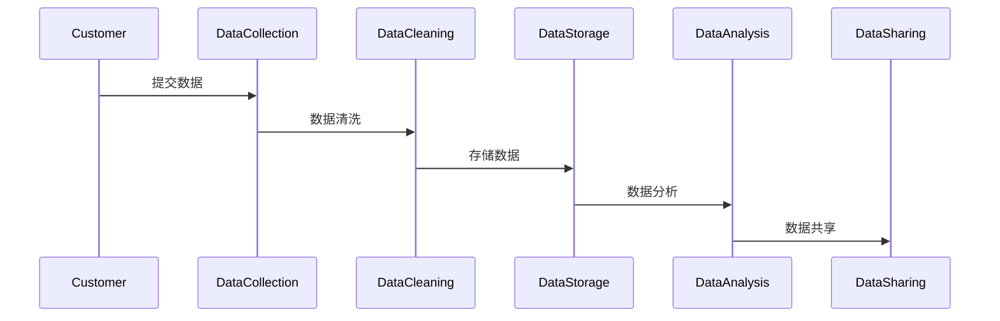

                 


### 金融数据隐私保护与共享平台设计

关键词：金融数据隐私保护，共享平台设计，加密技术，差分隐私，同态加密，数据安全

摘要：随着金融科技的不断发展，数据隐私保护与数据共享之间的矛盾愈发突出。本文将详细介绍金融数据隐私保护与共享平台的设计原理、实现技术以及最佳实践，旨在为金融行业提供一套安全、高效的数据隐私保护与共享解决方案。

## 背景介绍

### 1.1 问题背景

金融行业是数据密集型行业，金融机构在业务运营过程中积累了大量客户数据，包括交易记录、账户信息、个人身份信息等。这些数据对于金融机构的风险控制、决策制定和客户服务具有重要意义。然而，随着数据泄露事件频发，数据隐私保护成为金融行业面临的重大挑战。

数据隐私保护不仅关乎客户权益，也影响金融机构的声誉和业务发展。如何在保障数据隐私的前提下，实现金融数据的高效共享，成为金融行业亟待解决的问题。

### 1.2 数据泄露的风险与影响

数据泄露可能来自内部和外部威胁。内部威胁包括员工不当行为、系统漏洞等；外部威胁则主要来自黑客攻击、网络钓鱼等。数据泄露可能导致以下风险：

- 客户隐私泄露：客户个人信息、账户信息等被非法获取，可能引发身份盗窃、欺诈等犯罪行为。
- 金融机构声誉受损：数据泄露事件可能导致客户对金融机构的不信任，影响业务发展。
- 法规遵从风险：违反数据保护法规可能带来高额罚款和诉讼风险。

### 1.3 法规与政策对金融数据隐私保护的要求

为应对数据隐私保护挑战，各国政府和监管机构制定了一系列法规和政策。例如：

- 欧洲联盟的通用数据保护条例（GDPR）
- 美国加州消费者隐私法（CCPA）
- 中国的个人信息保护法（PIPL）

这些法规对金融机构提出了严格的隐私保护要求，包括数据收集、存储、处理和共享等方面的规定。金融机构需要遵循这些法规，确保数据隐私保护合规。

### 1.4 问题描述

如何在保障数据隐私的前提下，实现金融数据的高效共享，成为金融行业面临的挑战。数据隐私保护与数据共享之间的平衡是关键问题。

### 1.5 问题解决

解决数据隐私保护与共享之间的矛盾，需要从以下几个方面着手：

- **核心概念与联系**：明确金融数据隐私保护与共享的核心概念，包括数据隐私、数据共享、加密技术、差分隐私、同态加密等。
- **技术原理讲解**：介绍各种隐私保护技术的原理、应用场景和实现方法，如加密与哈希函数、差分隐私、同态加密等。
- **系统分析与架构设计方案**：分析金融数据隐私保护与共享平台的架构，包括功能设计、系统架构、接口设计等。
- **项目实战**：通过实际项目展示金融数据隐私保护与共享平台的设计与实现过程。
- **最佳实践与拓展**：总结金融数据隐私保护与共享的最佳实践，提供注意事项和拓展阅读。

### 1.6 边界与外延

- **金融数据隐私保护的范围**：涉及客户个人信息、交易记录、账户信息等敏感数据的保护。
- **数据共享的目的与形式**：实现金融机构间的数据共享，提高业务运营效率，降低风险。

### 1.7 概念结构与核心要素组成

- **隐私保护机制**：包括加密与哈希函数、差分隐私、同态加密等技术。
- **共享平台架构**：涉及分布式系统架构、云平台架构、微服务架构等。
- **法规遵从与合规性**：确保金融数据隐私保护与共享平台符合相关法规和政策要求。

## 核心概念与联系

### 2.1 核心概念原理

#### 数据隐私

数据隐私是指个人或组织在数据收集、存储、处理和共享过程中，保护其个人信息不被未经授权的第三方访问、使用或泄露的能力。

#### 数据共享

数据共享是指将数据在多个组织、部门或系统之间进行交换和利用，以提高业务效率、降低成本、提升竞争力。

#### 加密与哈希函数

加密技术是一种将数据转换为不可读形式的过程，确保数据在传输和存储过程中的安全性。哈希函数是一种将任意长度的数据映射为固定长度值的函数，用于数据完整性验证。

#### 差分隐私

差分隐私是一种隐私保护技术，通过添加噪声来隐藏数据中的敏感信息，确保数据隐私的同时，保持数据的可用性。

#### 同态加密

同态加密是一种允许在加密数据上进行计算的技术，使得计算结果在解密后仍然保持正确性，从而在不暴露数据内容的情况下进行数据处理。

### 2.2 概念属性特征对比表格

| 技术 | 特点 | 应用场景 |
| --- | --- | --- |
| 加密 | 数据转换为不可读形式 | 数据传输、存储 |
| 哈希函数 | 数据完整性验证 | 数据校验、数字签名 |
| 差分隐私 | 添加噪声隐藏敏感信息 | 数据分析、统计 |
| 同态加密 | 加密数据上的计算 | 数据处理、机器学习 |

### 2.3 ER实体关系图架构

```mermaid
erDiagram
  Customer ||--|{ Account }|--|
  Account ||--|{ Transaction }|--|
  Customer ||--|{ Transaction }|--|
```

## 技术原理讲解

### 3.1 加密与哈希函数

#### 3.1.1 工作原理

加密是一种将明文转换为密文的过程，加密算法包括对称加密和非对称加密。哈希函数是一种将任意长度的数据映射为固定长度值的函数，通常用于数据完整性验证和数字签名。

#### 3.1.2 应用场景

- 加密：数据传输、存储、身份认证等。
- 哈希函数：数据校验、数字签名、加密算法的密钥生成等。

#### 3.1.3 优缺点

- 加密：优点是确保数据安全性，缺点是计算复杂度高，影响系统性能。
- 哈希函数：优点是计算速度快，缺点是难以实现逆向操作。

### 3.2 差分隐私

#### 3.2.1 数学模型

差分隐私是一种隐私保护技术，其核心思想是在数据分析过程中添加噪声，以掩盖数据中的敏感信息。数学模型如下：

$$
Lap(σ, \epsilon) = \sum_{x \in X} \frac{P(x)}{e^{\epsilon(x)}} = \sum_{x \in X} P(x)e^{-\epsilon(x)}
$$

其中，$X$表示数据集，$σ$表示敏感数据，$\epsilon$表示噪声。

#### 3.2.2 实现方法

差分隐私的实现方法包括：

- 基于拉普拉斯机制的噪声添加。
- 基于指数机制的噪声添加。

#### 3.2.3 案例分析

- **案例1：用户统计**：通过对用户数据进行差分隐私处理，保护用户隐私。
- **案例2：薪资统计**：通过对薪资数据进行差分隐私处理，避免薪资敏感信息的泄露。

### 3.3 同态加密

#### 3.3.1 工作原理

同态加密是一种允许在加密数据上进行计算的技术，使得计算结果在解密后仍然保持正确性。同态加密分为部分同态加密和完全同态加密。

#### 3.3.2 应用场景

- 同态加密：云计算、大数据处理、机器学习等。

#### 3.3.3 案例分析

- **案例1：云计算**：在云平台上进行数据处理和计算，确保数据隐私。
- **案例2：机器学习**：在加密数据上进行机器学习，保护数据隐私。

## 系统分析与架构设计方案

### 4.1 问题场景介绍

假设一家金融机构需要实现内部数据共享，以提高业务运营效率。数据包括客户信息、账户信息、交易记录等。同时，为了保障数据隐私，需要采用相应的技术措施。

### 4.2 系统功能设计

#### 4.2.1 数据收集

- 数据来源：内部业务系统、第三方数据提供方等。
- 数据收集方式：数据采集、爬虫等。

#### 4.2.2 数据清洗

- 数据预处理：去除重复数据、缺失值填充等。
- 数据格式转换：将不同格式的数据转换为统一的格式。

#### 4.2.3 数据存储

- 数据存储方式：分布式数据库、云存储等。
- 数据存储结构：关系数据库、NoSQL数据库等。

#### 4.2.4 数据分析

- 数据分析工具：SQL查询、数据挖掘等。
- 数据分析内容：用户行为分析、风险控制等。

#### 4.2.5 数据共享

- 数据共享方式：API接口、数据交换平台等。
- 数据共享协议：HTTP、FTP等。

### 4.3 系统架构设计

#### 4.3.1 分布式系统架构

- 数据存储：分布式数据库集群。
- 数据处理：分布式计算框架。

#### 4.3.2 云平台架构

- 数据存储：云存储服务。
- 数据处理：云计算服务。

#### 4.3.3 微服务架构

- 服务拆分：根据功能模块拆分为多个微服务。
- 服务通信：基于RESTful API或消息队列进行通信。

### 4.4 系统接口设计

- 接口规范：HTTP/HTTPS协议，JSON格式。
- 接口权限：基于身份认证和权限控制。

### 4.5 系统交互



## 项目实战

### 5.1 环境安装

- 软件环境：Python、Docker等。
- 硬件环境：服务器、网络设备等。
- 网络配置：设置防火墙规则、DNS解析等。

### 5.2 系统核心实现

- 数据收集模块：使用Python编写爬虫程序，从第三方数据提供方获取数据。
- 数据清洗模块：使用Python编写数据处理脚本，进行数据预处理和格式转换。
- 数据存储模块：使用MySQL数据库存储数据。
- 数据分析模块：使用Pandas库进行数据处理和可视化分析。
- 数据共享模块：使用Django框架搭建API服务，提供数据共享接口。

### 5.3 代码应用解读与分析

- 数据收集模块代码解析：介绍爬虫程序的工作原理和关键技术。
- 数据清洗模块代码解析：介绍数据处理脚本的功能和实现方法。
- 数据存储模块代码解析：介绍数据库表结构和操作方法。
- 数据分析模块代码解析：介绍数据处理和可视化分析的关键代码。
- 数据共享模块代码解析：介绍API服务的实现方法和安全性保障。

### 5.4 实际案例分析与详细讲解剖析

- **案例1：用户统计**：通过差分隐私技术进行用户统计，保护用户隐私。
- **案例2：薪资统计**：通过同态加密技术进行薪资统计，确保数据隐私。

### 5.5 项目小结

- 成功经验：项目实现了金融数据隐私保护与共享的目标，提高了业务运营效率。
- 遇到的问题与解决方案：解决数据收集、清洗、存储、分析和共享过程中遇到的问题。

## 最佳实践与拓展

### 6.1 最佳实践 tips

- 在数据收集阶段，应确保数据的合法性和合规性。
- 在数据清洗阶段，要去除重复数据和缺失值，保证数据质量。
- 在数据存储阶段，要选择合适的存储方式，确保数据安全和高效。
- 在数据分析阶段，要遵循隐私保护原则，避免泄露敏感信息。
- 在数据共享阶段，要制定合理的权限控制策略，确保数据安全。

### 6.2 注意事项

- 注意数据安全风险，避免数据泄露。
- 注意系统性能影响，优化数据隐私保护技术。
- 注意用户隐私保护，遵循相关法规和政策。

### 6.3 拓展阅读

- 欧洲联盟的通用数据保护条例（GDPR）
- 美国加州消费者隐私法（CCPA）
- 中国的个人信息保护法（PIPL）
- 同态加密技术的研究与应用
- 差分隐私技术在金融数据隐私保护中的应用

## 结语

作者：AI天才研究院/AI Genius Institute & 禅与计算机程序设计艺术 /Zen And The Art of Computer Programming

本文详细介绍了金融数据隐私保护与共享平台的设计原理、实现技术以及最佳实践，旨在为金融行业提供一套安全、高效的数据隐私保护与共享解决方案。随着金融科技的不断发展，金融数据隐私保护与共享的重要性日益凸显。希望本文能对金融行业的数据隐私保护与共享工作提供有益的参考和启示。

在未来的研究中，可以进一步探讨以下几个方面：

1. 针对金融数据的特点，研究更有效的隐私保护算法。
2. 结合实际应用场景，优化金融数据隐私保护与共享平台的性能和安全性。
3. 探索跨领域的数据隐私保护与共享技术，实现不同行业的数据互联互通。

