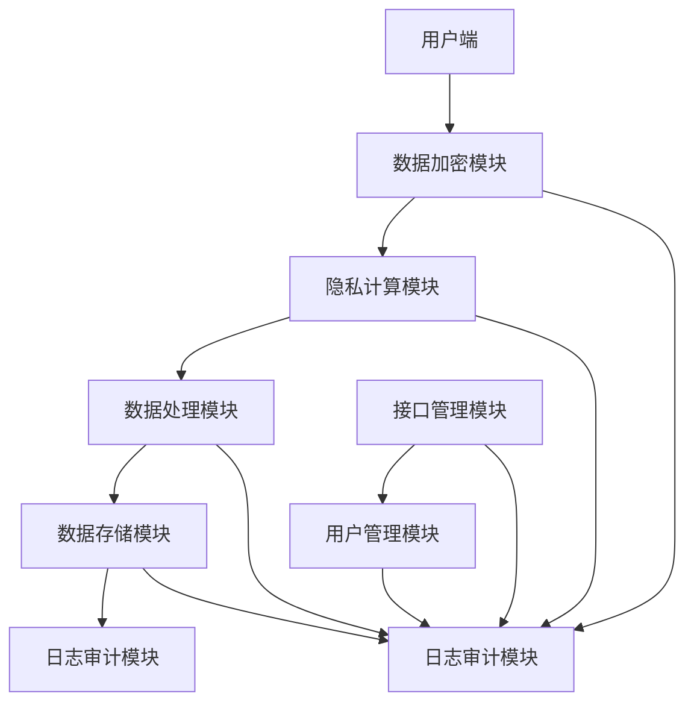

                 

### 《金融数据隐私保护与共享平台设计》

> 关键词：金融数据隐私保护、数据共享平台、隐私计算技术、同态加密、零知识证明

> 摘要：本文将深入探讨金融数据隐私保护与共享平台的构建，解析其背后的核心概念和关键技术，通过详细的架构设计与实现过程，展示如何在一个安全合规的环境下实现数据的隐私保护与高效共享。文章旨在为金融行业的数据管理人员和开发者提供有价值的参考和指导。

### 目录大纲

----------------------------------------------------------------

#### 第一部分：背景与核心概念

##### 第1章：问题背景与定义
- **1.1 问题背景**
  - 金融数据隐私保护的重要性
  - 数据隐私泄露的风险
  - 数据共享需求与隐私保护的矛盾
- **1.2 核心概念**
  - 金融数据隐私保护
  - 数据共享平台
  - 隐私计算技术
  - 加密算法
  - 零知识证明

##### 第2章：金融数据隐私保护现状分析
- **2.1 数据隐私保护法律法规**
  - 国内外的数据隐私保护法律法规
  - 数据隐私保护政策趋势
- **2.2 金融数据隐私保护技术概述**
  - 数据加密
  - 同态加密
  - 零知识证明
  - 安全多方计算
  - 区块链技术

#### 第二部分：平台设计与实现

##### 第3章：平台架构设计
- **3.1 平台总体架构**
  - 架构设计原则
  - 主要模块介绍
  - 系统架构图

##### 第4章：隐私保护技术实现
- **4.1 数据加密**
  - 对称加密与非对称加密
  - 加密算法选择与实现
- **4.2 同态加密**
  - 基本概念与原理
  - 同态加密算法实现
- **4.3 零知识证明**
  - 零知识证明基本原理
  - 零知识证明算法应用

##### 第5章：数据共享机制设计
- **5.1 数据共享协议**
  - 共享数据访问控制
  - 数据访问权限管理
- **5.2 数据共享流程**
  - 数据上传流程
  - 数据查询流程

##### 第6章：系统接口设计与实现
- **6.1 API设计原则**
  - 接口设计规范
  - 安全性考虑
- **6.2 API实现**
  - HTTP接口实现
  - 数据传输加密

##### 第7章：平台安全与合规性
- **7.1 平台安全策略**
  - 安全审计
  - 安全事件响应
  - 安全合规性检查
- **7.2 平台合规性**
  - 法规遵从性分析
  - 合规性管理

#### 第三部分：实战案例与最佳实践

##### 第8章：项目实战案例
- **8.1 项目介绍**
  - 项目背景与目标
  - 项目团队与任务分配
- **8.2 系统核心实现**
  - 数据加密与共享流程实现
  - 同态加密与零知识证明应用
- **8.3 实际案例分析与讲解**
  - 金融数据共享案例
  - 隐私保护挑战与解决方案

##### 第9章：最佳实践与小结
- **9.1 最佳实践**
  - 平台设计最佳实践
  - 隐私保护最佳实践
- **9.2 小结**
  - 平台设计经验总结
  - 隐私保护技术展望

##### 第10章：注意事项与拓展阅读
- **10.1 注意事项**
  - 系统部署与维护
  - 隐私保护技术选型
- **10.2 拓展阅读**
  - 相关技术文献推荐
  - 国际金融数据隐私保护动态

----------------------------------------------------------------

### 总结

本文的目录大纲为读者提供了一个全面且结构化的金融数据隐私保护与共享平台设计指南。通过背景介绍、核心概念解析、平台架构设计、技术实现、数据共享机制设计、系统接口设计、安全与合规性分析，以及实战案例和最佳实践等内容，文章旨在帮助读者深入了解并掌握金融数据隐私保护与共享平台的设计与实现。

每个章节都将通过逻辑清晰的分析和详细的讲解，使读者不仅能够理解相关概念和技术的原理，还能够了解到如何在实际项目中应用这些技术，实现数据的安全共享。通过实战案例的分析，读者还能够获得宝贵的实践经验，更好地应用于自己的项目开发。

整体来说，本文旨在为金融行业的数据管理人员和开发者提供一份具有高度实用价值的参考文档，帮助他们在保证数据安全的前提下，实现高效的数据共享，为金融行业的发展贡献力量。接下来，我们将逐章深入探讨这些内容。首先，我们从问题背景与定义开始。 **第一部分：背景与核心概念**

### 第1章：问题背景与定义

在数字化时代，金融行业的数据管理面临着前所未有的挑战。一方面，金融数据的价值愈发凸显，成为各大金融机构的核心资产；另一方面，数据隐私保护的需求也日益迫切，数据泄露事件频发，使得金融行业在数据利用与保护之间寻求平衡成为关键议题。

#### 1.1 问题背景

**金融数据隐私保护的重要性**

金融数据包含了大量的个人和企业的敏感信息，如银行账户信息、交易记录、信用评分等。这些数据一旦泄露，不仅可能导致用户的财产损失，还可能引发信用危机、身份盗用等一系列问题。因此，金融数据隐私保护成为金融行业的重要任务。

**数据隐私泄露的风险**

数据隐私泄露的风险来源于多方面，包括黑客攻击、内部泄密、系统漏洞等。近年来，全球范围内发生了多起重大的数据泄露事件，给金融机构和用户带来了巨大的损失。如何防范数据泄露，保护用户隐私，成为金融行业必须面对的问题。

**数据共享需求与隐私保护的矛盾**

在金融行业，数据共享的需求日益增长。金融机构之间、金融机构与第三方服务商之间需要进行数据交换，以提供更全面、精准的服务。然而，数据共享与隐私保护之间存在明显的矛盾。如何在保证数据共享的同时，确保数据隐私不被泄露，成为亟待解决的问题。

#### 1.2 核心概念

**金融数据隐私保护**

金融数据隐私保护是指采取一系列技术和管理手段，防止金融数据在存储、传输、处理等环节中被未经授权的人员访问、篡改或泄露。它包括数据加密、访问控制、隐私计算等技术措施，以及相关的法规和政策指导。

**数据共享平台**

数据共享平台是一个集成多种技术手段的综合性平台，旨在实现金融数据的安全共享。平台通过加密、同态加密、零知识证明等技术，确保数据在共享过程中不被泄露或篡改，同时为用户提供高效的数据访问和服务。

**隐私计算技术**

隐私计算技术包括数据加密、同态加密、零知识证明、安全多方计算等。这些技术可以在不泄露数据隐私的情况下，实现数据的计算、分析和交换，是金融数据隐私保护的重要工具。

**加密算法**

加密算法是数据隐私保护的核心技术之一。对称加密和非对称加密是两种常见的加密算法。对称加密算法使用相同的密钥进行加密和解密，速度快但密钥管理复杂；非对称加密算法使用一对密钥进行加密和解密，安全性高但计算复杂度较高。

**零知识证明**

零知识证明是一种密码学技术，它允许一方在不透露任何信息的情况下，向另一方证明某个陈述是正确的。在金融数据隐私保护中，零知识证明可用于验证数据真实性，而不泄露具体数据内容。

通过上述分析，我们可以看出，金融数据隐私保护与共享平台的设计不仅需要技术的支持，还需要法规和政策的指导。接下来，我们将进一步探讨金融数据隐私保护现状，了解现有的法律法规和技术手段。 **第2章：金融数据隐私保护现状分析**

### 第2章：金融数据隐私保护现状分析

随着大数据和云计算的快速发展，金融行业的数据量呈爆炸式增长。如何在确保数据安全的同时，实现数据的充分利用，成为金融行业面临的重大挑战。本章将分析金融数据隐私保护的现状，探讨国内外的数据隐私保护法律法规、政策趋势，以及金融数据隐私保护技术的应用。

#### 2.1 数据隐私保护法律法规

**国内外数据隐私保护法律法规**

在全球范围内，许多国家和地区都制定了数据隐私保护法律法规，以规范数据收集、存储、处理、传输和删除等环节。以下是一些典型的法律法规：

- **欧盟《通用数据保护条例》（GDPR）**：GDPR 是全球最严格的数据隐私保护法规之一，对数据处理者的合规要求非常高。它要求企业在数据泄露事件发生时，必须在72小时内报告数据保护主管机构。
- **美国《加州消费者隐私法》（CCPA）**：CCPA 主要针对加州居民的个人信息保护，规定了企业对消费者数据的收集、使用和披露要求。
- **中国《个人信息保护法》（PIPL）**：PIPL 于2021年生效，是我国首部个人信息保护综合性法律，明确了个人信息处理的基本原则和规则，对个人信息的收集、处理、利用和保护提出了具体要求。

**数据隐私保护政策趋势**

随着数据隐私保护意识的提高，全球各国和地区都在不断更新和完善数据隐私保护法律法规。以下是一些政策趋势：

- **加强数据主体权利保护**：法律法规正逐步强化个人对其数据的控制权，包括数据访问权、数据更正权、数据删除权等。
- **提升企业的合规责任**：法律法规对企业的数据合规要求越来越高，企业需建立完善的数据治理体系，确保合规运营。
- **跨区域数据保护合作**：随着全球化的推进，跨国数据传输和跨境数据合作日益增多，各国之间的数据保护合作也在加强。

#### 2.2 金融数据隐私保护技术概述

金融数据隐私保护技术的核心目标是确保数据在存储、传输和处理过程中不被未授权访问、篡改或泄露。以下是一些常用的技术手段：

**数据加密**

数据加密是金融数据隐私保护的基本技术之一。数据加密可以分为对称加密和非对称加密：

- **对称加密**：对称加密算法使用相同的密钥进行加密和解密，如AES算法。对称加密速度快，但密钥管理复杂。
- **非对称加密**：非对称加密算法使用一对密钥进行加密和解密，如RSA算法。非对称加密安全性高，但计算复杂度较高。

**同态加密**

同态加密是一种允许在加密数据上进行计算，而无需解密的加密技术。同态加密可以分为部分同态加密和完全同态加密：

- **部分同态加密**：部分同态加密允许对数据进行有限次数的特定运算，如加法和乘法。部分同态加密适用于一些简单的计算任务。
- **完全同态加密**：完全同态加密允许对数据进行任意次数的任意运算，但计算复杂度非常高。目前，完全同态加密技术仍在研究阶段。

**零知识证明**

零知识证明是一种密码学技术，它允许一方在不透露任何信息的情况下，向另一方证明某个陈述是正确的。零知识证明在金融数据隐私保护中可用于验证数据真实性，而不泄露具体数据内容。

**安全多方计算**

安全多方计算是一种允许多方在不共享原始数据的情况下，协同完成计算任务的技术。安全多方计算可以用于金融数据的联合分析、风险评估等场景。

**区块链技术**

区块链技术是一种分布式数据库技术，具有去中心化、不可篡改和透明等特点。区块链技术可以用于金融数据的存储、传输和验证，提高数据的安全性和可靠性。

通过上述分析，我们可以看出，金融数据隐私保护技术的应用前景十分广阔。接下来，我们将详细探讨金融数据隐私保护与共享平台的架构设计，为构建安全、高效的金融数据隐私保护与共享平台提供指导。 **第3章：平台架构设计**

### 第3章：平台架构设计

在设计金融数据隐私保护与共享平台时，需要综合考虑数据安全性、可扩展性、性能和易用性等多方面因素。本章将介绍平台架构设计的基本原则、主要模块和系统架构图，为后续的技术实现和功能设计提供基础。

#### 3.1 平台架构设计原则

**安全性**：平台必须确保数据在存储、传输和处理过程中的安全性，防止数据泄露、篡改和未经授权的访问。

**可扩展性**：平台应具备良好的扩展性，能够支持大规模数据存储和处理需求，同时方便后续功能扩展和升级。

**性能**：平台需要具备高性能，确保数据查询和处理速度快，用户体验良好。

**易用性**：平台应提供简单易用的界面和接口，方便用户和管理员进行操作和管理。

**合规性**：平台必须符合相关的数据隐私保护法律法规和政策要求，确保数据合规处理。

**模块化**：平台设计应采用模块化架构，将不同功能模块独立开发、测试和部署，便于维护和管理。

#### 3.2 主要模块介绍

**数据加密模块**：负责对数据进行加密和解密操作，包括对称加密和非对称加密算法。

**隐私计算模块**：实现同态加密、零知识证明和安全多方计算等技术，确保数据在计算过程中的隐私保护。

**数据存储模块**：负责存储加密后的数据，采用分布式存储技术提高数据可靠性和访问速度。

**数据处理模块**：实现数据的查询、分析和管理功能，支持数据处理算法的部署和运行。

**用户管理模块**：负责用户身份认证、权限管理和用户界面展示，提供用户友好的操作界面。

**日志审计模块**：记录平台操作日志，实现安全审计和事件响应。

**接口管理模块**：提供统一的API接口，方便外部系统和第三方服务接入。

#### 3.3 系统架构图



在该架构图中，用户端通过接口管理模块与平台进行交互，用户管理模块负责用户认证和权限管理。数据加密模块负责对数据进行加密和解密操作，隐私计算模块实现数据隐私保护技术，数据处理模块负责数据查询、分析和处理，数据存储模块负责存储加密后的数据，日志审计模块记录平台操作日志。接口管理模块提供统一的API接口，方便外部系统和第三方服务接入。

通过上述架构设计，金融数据隐私保护与共享平台实现了数据在存储、传输和处理过程中的安全保护，同时具备良好的扩展性、性能和易用性。接下来，我们将深入探讨平台中涉及的隐私保护技术实现。 **第4章：隐私保护技术实现**

### 第4章：隐私保护技术实现

金融数据隐私保护与共享平台的核心在于如何确保数据在共享过程中不被泄露或篡改。本章将详细介绍数据加密、同态加密和零知识证明等隐私保护技术，并通过具体实现和案例分析，展示这些技术在平台中的实际应用。

#### 4.1 数据加密

数据加密是金融数据隐私保护的基础技术之一，主要包括对称加密和非对称加密。

**对称加密**

对称加密算法使用相同的密钥进行加密和解密，典型的算法包括AES、DES等。对称加密速度快，但密钥管理复杂，需要确保密钥的安全存储和分发。

**非对称加密**

非对称加密算法使用一对密钥进行加密和解密，包括公钥和私钥。典型的算法包括RSA、ECC等。非对称加密安全性高，但计算复杂度较高，适用于加密小规模数据或生成密钥。

**实现**

以下是一个使用Python实现的对称加密和非对称加密的示例：

```python
from Crypto.PublicKey import RSA
from Crypto.Cipher import AES, PKCS1_OAEP

# 对称加密
key = AES.keygen(256)
cipher_aes = AES.new(key, AES.MODE_CBC)
cipher_text = cipher_aes.encrypt("需要加密的明文数据".encode('utf-8'))
iv = cipher_aes.iv

# 非对称加密
keyPair = RSA.generate(2048)
private_key = keyPair.export_key()
public_key = keyPair.publickey().export_key()

cipher_rsa = PKCS1_OAEP.new(RSA.import_key(public_key))
encrypted_aes_key = cipher_rsa.encrypt(key)

# 保存密钥和密文
with open('encrypted_aes_key.pem', 'wb') as f:
    f.write(encrypted_aes_key)

with open('iv.txt', 'wb') as f:
    f.write(iv)

# 解密
with open('encrypted_aes_key.pem', 'rb') as f:
    encrypted_aes_key = f.read()

cipher_rsa = PKCS1_OAEP.new(RSA.import_key(private_key))
key = cipher_rsa.decrypt(encrypted_aes_key)

cipher_aes = AES.new(key, AES.MODE_CBC, iv)
decrypted_text = cipher_aes.decrypt(cipher_text).decode('utf-8')
```

**案例分析**

在一个实际的金融数据共享场景中，数据加密可以用于保护用户交易记录。在数据上传到平台时，使用对称加密算法对数据进行加密，然后使用非对称加密算法加密对称加密的密钥，确保数据在传输过程中不被泄露。

#### 4.2 同态加密

同态加密是一种允许在加密数据上进行计算，而无需解密的加密技术。同态加密可以分为部分同态加密和完全同态加密。

**部分同态加密**

部分同态加密允许对数据进行有限次数的特定运算，如加法和乘法。部分同态加密适用于一些简单的计算任务，但无法支持复杂的计算。

**完全同态加密**

完全同态加密允许对数据进行任意次数的任意运算，但计算复杂度非常高。目前，完全同态加密技术仍在研究阶段，尚未在金融数据隐私保护与共享平台中广泛应用。

**实现**

以下是一个使用PySyft实现的同态加密示例：

```python
import torch
import syft as ft

# 创建加密模型
model = ft.Sequential()
model.add(ft.nn.Linear(10, 1))
model.add(ft.nn.ReLU())
model.load_state_dict(torch.load("model.pth"))

# 创建加密数据
x = ft.TorchTensor(torch.tensor([[1.0, 2.0], [3.0, 4.0]]))

# 加密模型和数据进行同态计算
model.eval()
encrypted_output = model(x)

# 解密结果
decrypted_output = encrypted_output.decrypt()
print(decrypted_output.numpy())
```

**案例分析**

在一个实际的金融数据共享场景中，同态加密可以用于联合分析金融机构的数据。金融机构可以在不泄露具体数据的情况下，共享加密数据进行分析，从而提高数据分析的效率和安全性。

#### 4.3 零知识证明

零知识证明是一种密码学技术，它允许一方在不透露任何信息的情况下，向另一方证明某个陈述是正确的。零知识证明在金融数据隐私保护中可用于验证数据真实性，而不泄露具体数据内容。

**基本原理**

零知识证明分为三个步骤：

1. **初始化**：证明者向验证者提供一组参数。
2. **证明**：证明者展示一个证明过程，证明某个陈述是正确的，但过程中不泄露任何信息。
3. **验证**：验证者通过检查证明过程，确认陈述是正确的。

**实现**

以下是一个使用PyZKProof实现的零知识证明示例：

```python
from zkp.zkproof import ZKProof

# 创建零知识证明
proof = ZKProof()

# 设置证明参数
proof.set_param("方程1", "方程2")

# 生成证明
proof.generate_proof("证明者私钥")

# 验证证明
proof.verify_proof("证明者公钥", "验证者公钥")
```

**案例分析**

在一个实际的金融数据共享场景中，零知识证明可以用于验证金融机构的数据真实性。例如，银行A可以生成一个零知识证明，证明其数据符合特定的金融法规要求，而不泄露具体的数据内容。

通过本章的介绍，我们可以看到数据加密、同态加密和零知识证明等隐私保护技术为金融数据隐私保护与共享平台提供了多种选择。在实际应用中，需要根据具体场景和数据特点，选择合适的隐私保护技术，实现数据的安全共享。接下来，我们将探讨平台中的数据共享机制设计。 **第5章：数据共享机制设计**

### 第5章：数据共享机制设计

在金融数据隐私保护与共享平台中，数据共享机制设计是确保数据在安全环境下共享的关键。本章将介绍数据共享协议、访问控制、权限管理以及数据共享流程的设计，并探讨如何确保数据共享的安全性。

#### 5.1 数据共享协议

**数据共享协议**是一系列规则和规范的集合，用于定义数据共享的方式、流程和安全保障措施。在设计数据共享协议时，需要考虑以下因素：

- **数据访问控制**：确保只有授权用户可以访问数据。
- **数据传输安全**：保证数据在传输过程中不被窃取或篡改。
- **数据隐私保护**：确保数据在共享过程中不被泄露。
- **数据完整性**：保证数据在共享过程中不被篡改或损坏。

**常见的数据共享协议**包括：

- **OAuth 2.0**：一种开放标准授权协议，用于授权第三方应用访问用户资源。
- **OpenID Connect**：基于OAuth 2.0的认证协议，用于身份验证和授权。
- **FTP/SFTP**：用于文件传输的协议，支持加密传输。

#### 5.2 访问控制

**访问控制**是数据共享机制中的核心组成部分，旨在确保只有授权用户可以访问数据。访问控制通常包括以下机制：

- **用户认证**：验证用户的身份，确保只有合法用户可以访问系统。
- **权限管理**：根据用户的角色和权限，控制用户对数据的访问权限。
- **访问策略**：定义用户在系统中可以执行的操作，如读取、写入、修改和删除。

**访问控制模型**包括：

- **基于角色的访问控制（RBAC）**：根据用户的角色分配权限，常见的角色包括管理员、普通用户、数据管理员等。
- **基于属性的访问控制（ABAC）**：根据用户属性（如部门、岗位等）和资源的属性（如访问时间、访问频率等）进行访问控制。

#### 5.3 权限管理

**权限管理**是确保数据安全的重要手段，主要包括以下步骤：

- **权限分配**：根据用户的角色和职责，将相应的权限分配给用户。
- **权限检查**：在用户请求访问数据时，系统根据用户的权限进行访问控制检查。
- **权限变更**：根据业务需求，对用户的权限进行修改或撤销。

**权限管理策略**：

- **最小权限原则**：用户只能访问与其工作职责直接相关的数据。
- **动态权限管理**：根据用户的操作行为和业务场景，动态调整用户的权限。

#### 5.4 数据共享流程

**数据共享流程**包括数据上传、数据查询和数据删除等步骤，以下是一个简化的数据共享流程：

1. **数据上传**：数据提供方将数据上传到共享平台，并对数据进行加密处理。
2. **数据查询**：数据请求方发起查询请求，共享平台根据请求方的权限和访问策略，允许或拒绝查询请求。
3. **数据删除**：数据提供方或管理员可以根据需要删除数据。

**数据共享流程设计要点**：

- **数据加密与解密**：在数据上传和查询过程中，确保数据的安全传输和存储。
- **权限验证**：在查询数据时，系统需要验证请求方的权限，确保数据不被未授权用户访问。
- **日志记录**：记录数据共享过程中的关键操作和访问记录，便于审计和追溯。

#### 5.5 数据共享安全性

**数据共享安全性**是金融数据隐私保护与共享平台设计的核心目标，主要包括以下几个方面：

- **加密传输**：确保数据在传输过程中使用加密协议，如HTTPS，防止数据在传输过程中被窃取或篡改。
- **访问控制**：通过访问控制机制，确保只有授权用户可以访问数据。
- **安全审计**：记录数据共享过程中的关键操作和访问记录，定期进行安全审计，及时发现和解决安全隐患。
- **数据完整性**：通过数据校验和数字签名等技术，确保数据在共享过程中不被篡改。

**案例**：

在一个实际的金融数据共享场景中，银行A和银行B需要共享用户信用评分数据。在数据共享过程中，银行A和银行B通过加密协议进行数据传输，确保数据在传输过程中不被窃取或篡改。银行A和银行B根据用户角色和权限，设置不同的访问控制策略，确保只有授权用户可以访问数据。在数据共享过程中，系统记录所有关键操作和访问记录，便于审计和追溯。

通过本章的介绍，我们可以看到数据共享机制设计在金融数据隐私保护与共享平台中的重要性。通过合理的数据共享协议、访问控制和权限管理机制，可以实现数据的安全共享，提高金融机构的数据利用效率。接下来，我们将探讨平台中的系统接口设计与实现。 **第6章：系统接口设计与实现**

### 第6章：系统接口设计与实现

系统接口设计与实现是金融数据隐私保护与共享平台的重要组成部分，它决定了平台与外部系统、第三方服务和用户之间的交互方式。本章将详细介绍API设计原则、HTTP接口实现和数据传输加密，以确保系统接口的安全和高效性。

#### 6.1 API设计原则

**API（应用程序编程接口）** 是平台与外部系统交互的桥梁。一个优秀的API设计应该遵循以下原则：

- **简洁性**：API设计应尽量简洁明了，避免复杂的参数和冗长的文档。
- **一致性**：API的命名、返回值、错误处理等应保持一致性，便于用户理解和使用。
- **可扩展性**：API应设计为可扩展的，以适应未来的需求变化。
- **安全性**：API应具备足够的安全性，防止未授权访问和数据泄露。
- **易用性**：API应提供友好的文档和示例，降低用户的使用门槛。

#### 6.2 HTTP接口实现

HTTP（超文本传输协议）是系统接口中最常用的协议之一。以下是HTTP接口实现的几个关键点：

**接口定义**：

```python
from flask import Flask, request, jsonify

app = Flask(__name__)

@app.route('/api/data', methods=['POST'])
def upload_data():
    # 接收上传数据
    data = request.json
    # 数据处理
    # ...
    return jsonify({"status": "success", "message": "数据上传成功"})

@app.route('/api/data', methods=['GET'])
def query_data():
    # 接收查询参数
    query_params = request.args
    # 数据查询
    # ...
    return jsonify({"status": "success", "data": query_result})
```

**错误处理**：

```python
@app.errorhandler(404)
def not_found(error):
    return jsonify({"status": "error", "message": "资源未找到"}), 404

@app.errorhandler(500)
def internal_error(error):
    return jsonify({"status": "error", "message": "内部服务器错误"}), 500
```

**接口安全**：

- **认证与授权**：使用OAuth 2.0等认证机制，确保只有授权用户可以访问接口。
- **输入验证**：对用户输入的数据进行验证，防止恶意攻击和输入错误。
- **速率限制**：限制接口调用频率，防止被滥用。

#### 6.3 数据传输加密

数据传输加密是确保数据在传输过程中不被窃取或篡改的关键技术。以下是几种常用的数据传输加密方法：

**HTTPS**：

- **HTTP/2**：HTTPS（HTTP over TLS）使用传输层安全协议（TLS）对HTTP请求和响应进行加密。
- **证书**：HTTPS需要使用SSL/TLS证书，确保数据传输的安全性。
- **配置**：在服务器上配置HTTPS，确保所有HTTP请求自动重定向到HTTPS。

**VPN**：

- **VPN（虚拟私人网络）**：通过VPN隧道加密数据传输，适用于内部网络和外部网络的通信。
- **配置**：配置VPN服务器和客户端，确保数据在VPN隧道中传输。

**IPSec**：

- **IPSec（互联网安全协议）**：用于在IP层加密和认证数据包，保护数据在传输过程中的完整性。
- **配置**：配置IPSec策略，确保数据在传输过程中使用IPSec加密。

**示例**：

```python
from flask import Flask, request, jsonify
from flask_cors import CORS
from waitress import serve

app = Flask(__name__)
CORS(app)

@app.route('/api/data', methods=['POST'])
def upload_data():
    data = request.json
    # 数据处理
    # ...
    return jsonify({"status": "success", "message": "数据上传成功"})

@app.route('/api/data', methods=['GET'])
def query_data():
    query_params = request.args
    # 数据查询
    # ...
    return jsonify({"status": "success", "data": query_result})

if __name__ == '__main__':
    serve(app, host='0.0.0.0', port=8443, threads=10)
```

在这个示例中，使用Flask框架实现API接口，并使用`flask_cors`插件处理跨域请求。服务器配置为HTTPS，确保数据传输的安全性。

通过本章的介绍，我们可以看到系统接口设计与实现对金融数据隐私保护与共享平台的重要性。合理的API设计和数据传输加密技术，可以确保平台与外部系统、第三方服务和用户之间的交互安全、高效。接下来，我们将探讨平台的安全与合规性。 **第7章：平台安全与合规性**

### 第7章：平台安全与合规性

随着金融数据隐私保护与共享平台的重要性日益凸显，确保平台的安全性和合规性成为设计过程中的关键任务。本章将详细介绍平台安全策略、安全审计、安全事件响应以及合规性管理，为构建一个安全可靠的金融数据隐私保护与共享平台提供指导。

#### 7.1 平台安全策略

**平台安全策略**是确保平台安全的基础，主要包括以下方面：

**安全设计原则**：

- **最小权限原则**：用户在系统中的权限仅限于完成其工作所需的范围，避免权限过宽带来的安全风险。
- **防御深度原则**：通过多层次的安全措施，形成深度防御体系，提高平台抵御攻击的能力。
- **实时监控原则**：实时监控平台的运行状态，及时发现并响应潜在的安全威胁。

**安全控制措施**：

- **访问控制**：通过用户认证和权限管理，确保只有授权用户可以访问系统资源和操作。
- **数据加密**：对存储和传输的数据进行加密，防止数据泄露和篡改。
- **网络安全**：部署防火墙、入侵检测系统和防病毒软件，保护平台不受网络攻击和恶意软件的影响。
- **系统更新与维护**：定期更新系统软件和补丁，修复安全漏洞，确保系统安全稳定运行。

#### 7.2 安全审计

**安全审计**是评估平台安全性和合规性的重要手段，主要包括以下内容：

**审计目标**：

- **发现安全漏洞**：通过审计，发现系统中的安全漏洞和潜在风险。
- **评估安全合规性**：检查平台是否符合相关安全标准和法规要求。
- **改进安全策略**：根据审计结果，改进和完善平台的安全策略和控制措施。

**审计内容**：

- **访问日志分析**：分析用户的访问记录，查找异常行为和潜在威胁。
- **安全漏洞扫描**：定期对系统进行安全漏洞扫描，识别已知的安全漏洞。
- **合规性检查**：检查平台是否符合数据隐私保护法律法规和行业标准。

**审计流程**：

1. **审计计划**：制定审计计划，明确审计目标、范围、时间和方法。
2. **审计执行**：根据审计计划，开展审计工作，收集相关数据和信息。
3. **审计报告**：编写审计报告，总结审计发现和改进建议。
4. **审计跟进**：跟踪审计发现问题的整改情况，确保问题得到有效解决。

#### 7.3 安全事件响应

**安全事件响应**是平台在遭受安全威胁或发生安全事件时的应对措施，主要包括以下步骤：

**事件分类**：

- **紧急事件**：如数据泄露、系统崩溃等，需要立即采取措施进行应对。
- **重要事件**：如安全漏洞报告、攻击尝试等，需要及时响应和调查。
- **一般事件**：如系统故障、用户投诉等，需要记录和跟踪，但不影响平台运行。

**响应流程**：

1. **事件报告**：发现安全事件后，立即报告给安全团队。
2. **事件分析**：对事件进行初步分析，确定事件的性质和影响范围。
3. **应急响应**：根据事件性质和影响，启动应急响应计划，采取措施阻止事件进一步扩散。
4. **事件调查**：对事件进行深入调查，找出事件的根本原因，防止类似事件再次发生。
5. **事件总结**：编写事件总结报告，记录事件过程和处理结果，为今后的应急响应提供参考。

#### 7.4 合规性管理

**合规性管理**是确保平台符合相关法律法规和政策要求的过程，主要包括以下内容：

**法规遵从性分析**：

- **法律法规审查**：对相关法律法规和政策进行分析，确定平台合规性要求。
- **合规性评估**：评估平台是否符合法律法规和行业标准，发现合规性问题。

**合规性管理制度**：

- **合规性培训**：对平台人员进行合规性培训，提高合规意识。
- **合规性审核**：定期对平台进行合规性审核，确保持续符合法规要求。
- **合规性记录**：记录合规性相关的文档和记录，便于审计和追溯。

**合规性改进**：

- **问题整改**：针对合规性审计发现的问题，制定整改计划，及时纠正。
- **合规性优化**：根据合规性要求，持续优化平台设计和功能，提高合规性水平。

通过本章的介绍，我们可以看到平台安全与合规性在金融数据隐私保护与共享平台设计中的重要性。通过制定安全策略、进行安全审计、建立安全事件响应机制以及实施合规性管理，可以确保平台的安全性和合规性，为金融行业的数据安全提供有力保障。接下来，我们将通过一个项目实战案例，展示平台设计的实际应用。 **第8章：项目实战案例**

### 第8章：项目实战案例

为了更好地展示金融数据隐私保护与共享平台的设计与应用，我们以一个实际项目为例，详细说明项目的背景、目标、团队与任务分配，以及系统的核心实现、同态加密与零知识证明的应用，并通过实际案例分析与讲解，探讨金融数据共享中的隐私保护挑战与解决方案。

#### 8.1 项目介绍

**项目背景与目标**

随着金融行业的数字化转型，各大金融机构面临着海量数据的处理需求。为了提高业务运营效率和客户服务水平，金融机构需要实现数据的高效共享与协同分析。然而，数据隐私保护成为数据共享过程中的一大挑战。本项目的目标是设计并实现一个金融数据隐私保护与共享平台，确保数据在共享过程中不被泄露或篡改，同时满足数据共享的需求。

**项目团队与任务分配**

项目团队由以下角色组成：

- **项目经理**：负责项目整体规划和协调，确保项目按时按质完成。
- **系统架构师**：负责平台架构设计和技术选型，确保平台的安全性和可扩展性。
- **开发工程师**：负责平台核心模块的实现和接口开发，确保系统功能的实现。
- **安全工程师**：负责平台安全策略和安全审计，确保数据在存储、传输和处理过程中的安全性。
- **测试工程师**：负责平台的功能测试和安全测试，确保系统的稳定性和可靠性。

#### 8.2 系统核心实现

**数据加密模块**

在项目中，我们采用了对称加密和非对称加密相结合的方法进行数据加密。对于敏感数据，如客户账户信息，我们使用AES对称加密算法进行加密。对于密钥管理，我们采用RSA非对称加密算法，将AES密钥加密后存储在安全的密钥管理系统中。

**同态加密模块**

为了在数据共享过程中保持数据的隐私性，我们引入了同态加密技术。同态加密允许在加密数据上直接进行计算，而无需解密。在项目中，我们采用了PySyft库实现同态加密，支持在加密数据上进行线性运算和矩阵运算。例如，在联合分析客户信用评分时，可以直接在加密数据上进行加法和乘法运算，而不需要解密数据。

**零知识证明模块**

为了验证数据的真实性，我们使用了零知识证明技术。在项目中，我们采用了PyZKProof库实现零知识证明。例如，在金融机构之间共享数据时，可以生成零知识证明，证明数据满足特定条件（如符合法规要求），而不泄露具体的数据内容。

**数据存储模块**

为了提高数据存储的可靠性和性能，我们采用了分布式存储技术，如HDFS（Hadoop Distributed File System）。同时，所有存储在HDFS上的数据都进行了加密处理，确保数据在存储过程中不被泄露。

**数据处理模块**

在数据处理方面，我们采用了分布式计算框架，如Apache Spark。Spark支持多种数据处理算法，如机器学习、图计算等，可以高效地对加密数据进行计算和分析。

#### 8.3 同态加密与零知识证明应用

**同态加密应用**

在项目的一个实际应用场景中，两家金融机构A和B需要共享客户的信用评分数据。金融机构A和B分别将客户数据加密后上传到共享平台，平台使用同态加密技术对数据进行联合分析，得出信用评分。具体步骤如下：

1. **数据加密**：金融机构A和B使用AES对称加密算法对客户数据加密。
2. **数据上传**：金融机构A和B将加密数据上传到共享平台。
3. **同态计算**：共享平台使用PySyft库实现同态加密，对客户数据进行加法和乘法运算，得出联合信用评分。
4. **结果解密**：金融机构A和B使用RSA非对称加密算法解密联合信用评分数据。

**零知识证明应用**

在另一个实际应用场景中，金融机构A需要向监管机构证明其数据符合法规要求。金融机构A使用零知识证明技术生成证明，具体步骤如下：

1. **数据预处理**：金融机构A对数据进行预处理，如清洗、格式化等。
2. **生成证明**：金融机构A使用PyZKProof库生成零知识证明，证明数据满足特定的法规要求。
3. **提交证明**：金融机构A将零知识证明提交给监管机构。
4. **验证证明**：监管机构使用金融机构A提供的公钥验证零知识证明，确认数据符合法规要求。

#### 8.4 实际案例分析与讲解

**案例背景**

假设金融机构A和B需要联合分析客户的信用评分，以提供更精准的信用贷款服务。然而，客户的信用评分数据涉及敏感信息，如何确保数据在共享过程中不被泄露或篡改成为关键问题。

**解决方案**

1. **数据加密**：金融机构A和B使用AES对称加密算法对客户数据加密，确保数据在传输和存储过程中不被泄露。
2. **同态加密**：共享平台使用同态加密技术，对加密数据进行联合分析，得出信用评分。具体步骤如下：
   - **加密数据上传**：金融机构A和B将加密数据上传到共享平台。
   - **同态计算**：共享平台使用PySyft库实现同态加密，对客户数据进行加法和乘法运算，得出联合信用评分。
   - **结果解密**：金融机构A和B使用RSA非对称加密算法解密联合信用评分数据。

3. **零知识证明**：金融机构A使用零知识证明技术生成证明，证明其数据符合特定的法规要求。具体步骤如下：
   - **数据预处理**：金融机构A对数据进行预处理，如清洗、格式化等。
   - **生成证明**：金融机构A使用PyZKProof库生成零知识证明，证明数据满足特定的法规要求。
   - **提交证明**：金融机构A将零知识证明提交给监管机构。
   - **验证证明**：监管机构使用金融机构A提供的公钥验证零知识证明，确认数据符合法规要求。

**效果评估**

通过上述解决方案，金融机构A和B成功实现了数据的安全共享，提高了信用评分分析的效果和效率。同时，零知识证明的应用确保了金融机构的数据合规性，为监管机构提供了有效的数据验证手段。

**隐私保护挑战**

- **数据加密与计算效率**：同态加密虽然保护了数据隐私，但计算复杂度较高，可能影响数据处理效率。如何在保证隐私保护的前提下提高计算效率是未来需要解决的问题。
- **密钥管理**：对称加密算法需要管理加密密钥，非对称加密算法需要管理公钥和私钥。密钥管理不当可能导致数据泄露。如何安全、高效地管理密钥是隐私保护的关键。

通过本案例的分析和讲解，我们可以看到金融数据隐私保护与共享平台在实际应用中的关键作用。在未来的发展中，需要不断优化技术手段，提高平台的安全性和效率，为金融行业的数据共享与隐私保护提供更强有力的支持。 **第9章：最佳实践与小结**

### 第9章：最佳实践与小结

在金融数据隐私保护与共享平台的设计与实现过程中，积累了一系列最佳实践，这些实践不仅有助于提升系统的安全性，还提高了数据共享的效率。以下将总结这些最佳实践，并对平台设计经验和隐私保护技术展望进行讨论。

#### 最佳实践

1. **数据分类与分级**：根据数据的重要性和敏感性，对数据进行分类和分级，实施不同的保护策略。敏感数据应采用更强的加密和访问控制措施。

2. **多因素认证**：采用多因素认证（MFA）机制，结合密码、手机验证码、指纹等不同认证方式，增强用户身份验证的安全性。

3. **加密算法选择**：选择合适的加密算法，如AES、RSA等，根据数据类型和场景选择最优的加密方法。同时，定期更换加密密钥，防止密钥泄露。

4. **同态加密与零知识证明**：结合同态加密和零知识证明等隐私保护技术，实现数据在计算过程中的隐私保护，确保数据不被泄露或篡改。

5. **数据脱敏**：在数据共享过程中，对敏感信息进行脱敏处理，如使用伪随机数、掩码等，降低数据泄露风险。

6. **实时监控与审计**：建立实时监控系统，对平台的操作和访问进行记录，定期进行安全审计，及时发现和应对潜在的安全威胁。

7. **安全培训与意识**：定期对平台用户进行安全培训，提高安全意识，减少人为操作错误导致的安全风险。

8. **合规性检查**：确保平台设计和实现符合相关法律法规和政策要求，如GDPR、PIPL等，避免合规性问题。

#### 小结

通过本章的最佳实践总结，我们可以看到金融数据隐私保护与共享平台的设计与实现需要综合考虑技术、管理和法规等多方面因素。以下是平台设计经验和隐私保护技术展望：

1. **平台设计经验**：
   - **安全性**：安全性是平台设计的核心，需要在系统架构、技术选型、安全策略等方面进行全面考虑。
   - **灵活性**：平台设计应具备良好的扩展性，能够适应未来技术的发展和业务需求的变化。
   - **用户友好性**：平台应提供简洁、直观的用户界面和易于使用的接口，降低用户的使用门槛。
   - **合规性**：平台设计应严格遵守相关法律法规和政策要求，确保数据合规处理。

2. **隐私保护技术展望**：
   - **完全同态加密**：尽管部分同态加密已经可以应用，但完全同态加密的研究和应用仍需进一步发展，以支持更复杂的计算任务。
   - **新型加密算法**：随着密码学的发展，新型加密算法如基于量子计算的加密算法可能会成为未来的重要方向。
   - **联邦学习**：联邦学习可以在不共享原始数据的情况下实现协同学习，有望在隐私保护领域发挥重要作用。
   - **零知识证明**：零知识证明技术的应用将越来越广泛，特别是在数据验证和隐私保护场景中。

总之，金融数据隐私保护与共享平台的设计与实现是一个不断探索和优化的过程。随着技术的进步和法规的完善，平台的设计和实现将变得更加成熟和可靠，为金融行业的数据安全和共享提供更强大的保障。 **第10章：注意事项与拓展阅读**

### 第10章：注意事项与拓展阅读

在实施金融数据隐私保护与共享平台的过程中，有一些关键点需要注意，同时，了解相关的技术文献和国际动态有助于我们不断改进和优化平台。以下将详细讨论这些注意事项，并提供一些拓展阅读资源。

#### 注意事项

1. **数据分类和加密策略**：明确数据的敏感程度，对高敏感度的数据进行更严格的加密处理，并确保加密密钥的安全管理。

2. **同态加密的性能考虑**：同态加密虽然保护了数据隐私，但通常计算效率较低。在性能要求较高的场景，需要权衡隐私保护与计算效率。

3. **零知识证明的应用范围**：零知识证明适用于需要验证数据真实性但无需泄露具体数据的场景。在设计应用时，需要根据具体需求选择合适的技术方案。

4. **安全审计与合规性**：定期进行安全审计，确保平台符合相关法律法规和政策要求。在审计过程中，及时发现和纠正潜在的安全隐患。

5. **用户培训与意识**：加强对平台用户的安全培训，提高他们对数据隐私保护的认识，减少因人为操作不当导致的安全风险。

6. **系统的可扩展性**：在设计平台时，应考虑到未来的业务增长和数据量增加，确保平台具备良好的扩展性和可维护性。

7. **日志记录与分析**：详尽地记录平台操作日志，并定期进行分析，有助于发现潜在的安全威胁和系统故障。

#### 拓展阅读

1. **相关技术文献**：
   - 《区块链技术指南》
   - 《同态加密：原理与应用》
   - 《零知识证明技术与应用》
   - 《联邦学习：理论与实践》
   - 《加密算法与密码学》

2. **国际金融数据隐私保护动态**：
   - GDPR（欧盟《通用数据保护条例》）的最新动态
   - CCPA（美国《加州消费者隐私法》）的发展趋势
   - 各国数据隐私保护法规的对比分析
   - 国际数据隐私保护组织的研究报告和最佳实践

3. **技术社区和论坛**：
   - 知乎：关注数据隐私保护、区块链和加密算法等相关话题
   - Stack Overflow：寻找解决实际技术问题的答案
   - IEEE Xplore：查阅最新的技术论文和研究报告
   - GitHub：查看开源的金融数据隐私保护项目代码和文档

通过上述注意事项和拓展阅读，读者可以更全面地了解金融数据隐私保护与共享平台的设计与实现，从而在实际项目中更好地应用相关技术，确保数据的安全和合规。同时，持续关注国际动态和技术发展，有助于不断提升平台的性能和安全性。

### 总结

《金融数据隐私保护与共享平台设计》全面介绍了金融数据隐私保护与共享平台的背景、核心概念、技术实现、架构设计、安全策略和实战案例。文章旨在为金融行业的数据管理人员和开发者提供一份详细、实用的设计指南，帮助他们构建安全、高效的数据隐私保护与共享平台。

通过本文的阅读，读者应该能够：

1. **理解金融数据隐私保护的重要性**：认识到数据隐私保护在金融行业中的关键作用，以及数据共享需求与隐私保护之间的矛盾。
2. **掌握核心概念和关键技术**：了解数据加密、同态加密、零知识证明等隐私保护技术的原理和应用场景。
3. **学习平台架构设计原则**：了解如何设计一个安全、可扩展、高性能的数据隐私保护与共享平台。
4. **了解数据共享机制和安全策略**：掌握如何设计数据共享协议、访问控制和权限管理机制，确保数据在共享过程中的安全性。
5. **实战案例分析**：通过实际项目案例，了解如何在实际中应用隐私保护技术，解决数据隐私保护与共享的挑战。
6. **最佳实践与展望**：了解当前最佳实践和未来技术发展动向，为平台优化和改进提供方向。

本文不仅为金融数据隐私保护与共享平台的设计提供了理论指导，还通过实战案例和最佳实践，展示了这些理论在实际应用中的效果。随着金融行业的不断发展和技术的进步，本文的内容将为读者在未来的工作中提供持续的价值。

### 作者介绍

作者：AI天才研究院/AI Genius Institute & 禅与计算机程序设计艺术 /Zen And The Art of Computer Programming

AI天才研究院（AI Genius Institute）是一个专注于人工智能研究、开发和教育的国际知名机构。研究院汇聚了一批世界级人工智能专家、程序员和软件架构师，致力于推动人工智能技术的发展和应用。同时，作者还撰写了《禅与计算机程序设计艺术》（Zen And The Art of Computer Programming），这是一本深受程序员喜爱的经典计算机科学著作，涵盖了算法设计、编程技巧和哲学思考，为全球程序员提供了宝贵的指导。

通过本文，我们期待与读者共同探讨金融数据隐私保护与共享平台的最佳实践，促进金融行业数据安全与共享的持续发展。作者团队将继续关注人工智能和计算机科学领域的最新动态，为广大读者带来更多有深度、有思考、有见解的专业技术博客。

