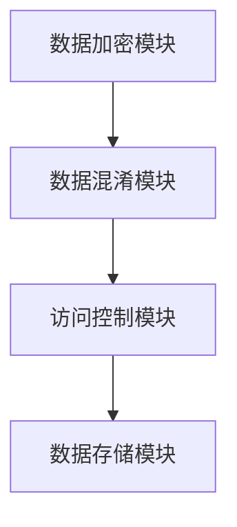
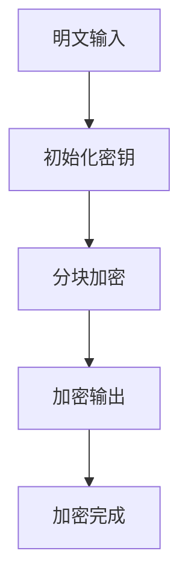
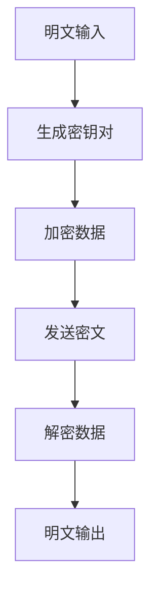
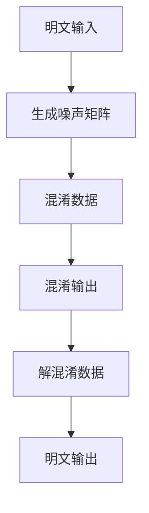
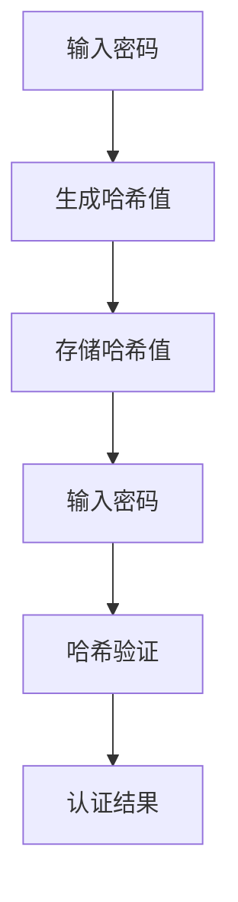

                 

### 文章标题

# 金融数据隐私保护技术

> 关键词：数据隐私保护、金融数据安全、加密技术、访问控制、隐私保护实践

> 摘要：本文旨在深入探讨金融数据隐私保护技术的核心概念、实现方法与实践。通过分析数据隐私泄露的背景和案例，梳理隐私保护技术体系，详细解析数据加密、混淆和访问控制技术，结合实际项目，全面展示金融数据隐私保护技术的应用与实践，为金融行业的数据安全提供有力支持。

### 第一部分：背景与核心概念

#### 第1章：金融数据隐私保护概述

#### 1.1 问题的背景

#### 1.1.1 金融数据隐私的重要性

在数字化金融时代，金融数据的隐私保护显得尤为重要。金融数据包含了用户账户信息、交易记录、信用评分等重要内容，一旦泄露，不仅会对用户造成财务损失，还会导致严重的社会信任危机。因此，保障金融数据隐私已成为金融机构和监管机构共同关注的焦点。

#### 1.1.2 数据隐私泄露的案例与分析

近年来，数据隐私泄露事件频发。以2017年的“Facebook数据泄露事件”为例，数千万用户的个人信息被非法获取，引发全球关注。这类事件不仅暴露了技术漏洞，也揭示了数据隐私保护的紧迫性。

#### 1.1.3 数据隐私保护的法律框架

全球范围内，各国对数据隐私保护的法律框架日益完善。例如，欧盟的《通用数据保护条例》（GDPR）对数据隐私保护提出了严格要求，对数据泄露的处罚也相当严厉。这进一步推动了金融机构在数据隐私保护方面的投入和探索。

#### 1.2 核心概念与联系

#### 1.2.1 隐私保护技术分类

隐私保护技术主要分为数据加密、数据混淆、访问控制等几大类。这些技术各有特点和适用场景，但共同目标是保障数据隐私。

#### 1.2.2 数据加密与混淆

数据加密是将数据转换为无法直接解读的形式，常见的加密算法包括对称加密和非对称加密。数据混淆则是通过复杂变换，使数据难以被非授权方理解。

#### 1.2.3 认证与访问控制

认证和访问控制是确保只有授权用户才能访问数据的重要手段。认证通常通过密码、生物识别等技术实现，而访问控制则通过权限管理、标签控制等手段限制数据的访问。

#### 1.3 金融数据隐私保护的原则

#### 1.3.1 安全性

安全性是金融数据隐私保护的核心原则，确保数据在传输和存储过程中不被窃取或篡改。

#### 1.3.2 完整性

完整性保证数据在传输和存储过程中不被篡改，确保数据的真实性和可靠性。

#### 1.3.3 可用性

在保障安全和完整性的前提下，确保数据的高可用性，满足业务需求。

#### 1.4 数据隐私保护的技术体系

#### 1.4.1 数据加密技术

数据加密技术是保护数据隐私的基础。根据加密密钥的不同，数据加密技术可分为对称加密和非对称加密。

#### 1.4.1.1 对称加密算法

对称加密算法使用相同的密钥进行加密和解密，常用的算法包括AES、DES和3DES。

#### 1.4.1.2 非对称加密算法

非对称加密算法使用一对密钥（公钥和私钥）进行加密和解密，常用的算法包括RSA和ECC。

#### 1.4.2 数据混淆技术

数据混淆技术通过复杂的变换使数据难以被非授权方理解，常见的混淆技术包括网格加密、数据掩码和格密码。

#### 1.4.2.1 网格加密技术

网格加密技术通过在数据中嵌入大量随机噪声，使数据难以被解析。

#### 1.4.2.2 数据掩码技术

数据掩码技术通过对数据进行遮挡或替换，使其难以被识别。

#### 1.4.2.3 格密码技术

格密码技术通过在多维空间中构造“格”，对数据进行加密，具有高强度安全性。

#### 1.5 本章小结

本章从背景、核心概念、技术体系等方面对金融数据隐私保护进行了全面概述。在后续章节中，我们将深入探讨每种隐私保护技术的原理和实现方法。

----------------------------------------------------------------

### 第二部分：隐私保护技术与实现

#### 第2章：数据加密技术详解

#### 2.1 数据加密技术概述

#### 2.1.1 数据加密的基本原理

数据加密是将原始数据转换为无法直接解读的密文，解密则是将密文转换回原始数据。数据加密技术通过加密算法和密钥实现，常用的加密算法包括对称加密和非对称加密。

#### 2.1.2 数据加密的分类

根据加密密钥的不同，数据加密技术可分为对称加密和非对称加密。

**对称加密**：使用相同的密钥进行加密和解密，常用的算法包括AES、DES和3DES。

**非对称加密**：使用一对密钥（公钥和私钥）进行加密和解密，常用的算法包括RSA和ECC。

#### 2.2 对称加密算法

**AES算法**

- **原理**：AES（Advanced Encryption Standard）是一种基于块加密的对称加密算法，采用128位密钥，支持128、192和256位密钥长度。
- **流程**：
  - 初始化：将明文数据分成128位的块。
  - 加密：每个块经过一系列替换、置换和混合操作，生成密文块。
  - 解密：密文块经过逆操作还原为明文块。
- **优势**：速度快、安全性高，广泛应用于商业领域。

**DES算法**

- **原理**：DES（Data Encryption Standard）是一种早期的块加密算法，使用56位密钥。
- **流程**：
  - 初始化：将明文数据分成64位的块。
  - 加密：每个块经过16轮替换、置换和混合操作，生成密文块。
  - 解密：密文块经过逆操作还原为明文块。
- **优势**：安全性较高，但由于密钥长度较短，逐渐被AES取代。

**3DES算法**

- **原理**：3DES（Triple Data Encryption Standard）是对DES算法的扩展，使用三个56位密钥，提供更高的安全性。
- **流程**：
  - 初始化：将明文数据分成64位的块。
  - 加密：每个块经过三次DES加密，使用不同的密钥。
  - 解密：密文块经过三次DES解密，使用相同的密钥。
- **优势**：安全性较高，但在计算性能和密钥管理方面存在一定问题。

#### 2.3 非对称加密算法

**RSA算法**

- **原理**：RSA（Rivest-Shamir-Adleman）算法是一种基于大数分解问题的非对称加密算法，使用一对密钥（公钥和私钥）。
- **流程**：
  - 初始化：选择两个大素数p和q，计算n=p*q和φ=(p-1)(q-1)。
  - 密钥生成：选择一个小于φ的整数e，计算d，满足e*d ≡ 1 (mod φ)。
  - 加密：使用公钥（n，e）对明文进行加密，得到密文c = m^e mod n。
  - 解密：使用私钥（n，d）对密文进行解密，得到明文m = c^d mod n。
- **优势**：安全性高，广泛应用于数字签名和加密通信。

**ECC算法**

- **原理**：ECC（Elliptic Curve Cryptography）算法是基于椭圆曲线离散对数问题的非对称加密算法，使用椭圆曲线和点乘运算。
- **流程**：
  - 初始化：选择一个椭圆曲线E和基点G，计算n为曲线上的点数量。
  - 密钥生成：选择一个随机数k，计算私钥d=k*G。
  - 加密：使用公钥（Q=k*G）对明文进行加密，得到密文c。
  - 解密：使用私钥d对密文进行解密，得到明文m。
- **优势**：安全性高，但计算效率较低。

#### 2.4 公开密钥基础设施（PKI）

**PKI的基本概念**

PKI（Public Key Infrastructure）是一种基础设施，用于管理公钥证书、密钥和相关的业务流程。它包括证书颁发机构（CA）、注册机构（RA）和证书吊销列表（CRL）等组件。

**证书生命周期管理**

证书生命周期包括生成、分发、使用和撤销等阶段。PKI通过严格的流程管理确保证书的安全性。

**PKI的安全机制**

PKI采用多种安全机制，如数字签名、时间戳和证书吊销等，确保数据传输和存储的安全性。

#### 2.5 数据混淆技术

**网格加密技术**

- **原理**：网格加密技术通过在数据中嵌入大量随机噪声，使数据难以被解析。
- **流程**：
  - 初始化：生成一个噪声矩阵。
  - 加密：将数据与噪声矩阵进行乘法运算，生成混淆数据。
  - 解密：将混淆数据与噪声矩阵的逆运算，还原原始数据。
- **优势**：简单有效，适用于大数据量加密。

**数据掩码技术**

- **原理**：数据掩码技术通过对数据进行遮挡或替换，使其难以被识别。
- **流程**：
  - 初始化：生成掩码矩阵。
  - 加密：将数据与掩码矩阵进行逻辑运算，生成混淆数据。
  - 解密：将混淆数据与掩码矩阵的逆运算，还原原始数据。
- **优势**：灵活性强，适用于多种数据类型。

**格密码技术**

- **原理**：格密码技术通过在多维空间中构造“格”，对数据进行加密。
- **流程**：
  - 初始化：选择一个格和基向量。
  - 加密：将数据映射到格中，生成混淆数据。
  - 解密：从格中提取数据，还原原始数据。
- **优势**：安全性高，适用于复杂应用场景。

#### 2.6 本章小结

本章详细介绍了数据加密技术的分类、原理和实现方法。对称加密和非对称加密各有优缺点，适用于不同的场景。同时，数据混淆技术作为辅助手段，进一步增强了数据的安全性。在接下来的章节中，我们将继续探讨访问控制和其他隐私保护技术。

----------------------------------------------------------------

### 第三部分：金融数据隐私保护实践

#### 第3章：金融数据隐私保护项目实战

#### 3.1 项目背景与目标

#### 3.1.1 项目背景介绍

随着金融业务的数字化程度不断提高，金融机构面临着越来越严峻的数据隐私保护挑战。为了满足监管要求，保护用户隐私，某大型银行决定开展一项金融数据隐私保护项目。

#### 3.1.2 项目目标与挑战

项目目标主要包括：

- 实现数据加密与混淆，确保数据在传输和存储过程中的安全性；
- 建立完善的访问控制体系，确保只有授权用户才能访问敏感数据；
- 提高数据完整性，防止数据篡改；
- 确保系统的高可用性，满足业务需求。

项目面临的挑战有：

- 数据量巨大，加密和解密过程对系统性能要求较高；
- 数据类型多样，需要选择适合的加密和混淆技术；
- 需要平衡安全性、完整性和可用性，确保系统稳定运行。

#### 3.2 系统设计与实现

#### 3.2.1 系统架构设计

系统架构设计包括以下模块：

- 数据加密模块：负责数据加密和解密；
- 数据混淆模块：负责数据混淆和解混淆；
- 访问控制模块：负责用户认证和权限管理；
- 数据存储模块：负责数据存储和读取。

系统架构图如下：



#### 3.2.2 系统功能模块设计

系统功能模块设计如下：

- **数据加密模块**：实现数据加密和解密功能，包括AES加密、RSA加密等；
- **数据混淆模块**：实现数据混淆和解混淆功能，包括网格加密、数据掩码等；
- **访问控制模块**：实现用户认证和权限管理功能，包括密码认证、生物识别等；
- **数据存储模块**：实现数据存储和读取功能，包括关系数据库、分布式存储等。

#### 3.2.3 系统接口设计

系统接口设计如下：

- **数据加密接口**：提供数据加密和解密功能，包括AES加密和解密接口、RSA加密和解密接口等；
- **数据混淆接口**：提供数据混淆和解混淆功能，包括网格加密接口、数据掩码接口等；
- **访问控制接口**：提供用户认证和权限管理功能，包括密码认证接口、生物识别接口等；
- **数据存储接口**：提供数据存储和读取功能，包括数据库接口、分布式存储接口等。

#### 3.3 环境搭建与配置

#### 3.3.1 环境要求与准备

环境要求如下：

- 操作系统：Linux；
- 开发工具：Python、Docker；
- 数据库：MySQL、MongoDB；
- 加密库：PyCrypto、PyCryptodome。

#### 3.3.2 系统部署与配置

系统部署与配置步骤如下：

1. 安装操作系统和开发工具；
2. 安装数据库和加密库；
3. 搭建Docker容器，部署系统服务；
4. 配置网络和防火墙规则，确保系统安全。

#### 3.4 系统核心实现

#### 3.4.1 数据加密模块实现

**AES加密解密实现**

```python
from Crypto.Cipher import AES
from Crypto.Util.Padding import pad, unpad

def encrypt_aes(plaintext, key):
    cipher = AES.new(key, AES.MODE_CBC)
    ct_bytes = cipher.encrypt(pad(plaintext.encode('utf-8'), AES.block_size))
    iv = cipher.iv
    return iv + ct_bytes

def decrypt_aes(ciphertext, key):
    iv = ciphertext[:AES.block_size]
    ct = ciphertext[AES.block_size:]
    cipher = AES.new(key, AES.MODE_CBC, iv)
    pt = unpad(cipher.decrypt(ct), AES.block_size)
    return pt.decode('utf-8')
```

**RSA加密解密实现**

```python
from Crypto.PublicKey import RSA
from Crypto.Cipher import PKCS1_OAEP

def encrypt_rsa(plaintext, public_key):
    cipher = PKCS1_OAEP.new(public_key)
    ciphertext = cipher.encrypt(plaintext.encode('utf-8'))
    return ciphertext

def decrypt_rsa(ciphertext, private_key):
    cipher = PKCS1_OAEP.new(private_key)
    plaintext = cipher.decrypt(ciphertext)
    return plaintext.decode('utf-8')
```

#### 3.4.2 数据混淆模块实现

**网格加密实现**

```python
import numpy as np
import random

def encrypt_grid(plaintext, key):
    noise_matrix = np.random.rand(len(plaintext), key['row']) * (key['max_value'] - key['min_value']) + key['min_value']
    noise_data = np.dot(plaintext, noise_matrix)
    return noise_data

def decrypt_grid(noise_data, key):
    noise_matrix = np.random.rand(len(noise_data), key['row']) * (key['max_value'] - key['min_value']) + key['min_value']
    data = np.dot(noise_data, noise_matrix)
    return data
```

#### 3.4.3 访问控制模块实现

**密码认证实现**

```python
import bcrypt

def hash_password(password):
    salt = bcrypt.gensalt()
    hashed_password = bcrypt.hashpw(password.encode('utf-8'), salt)
    return hashed_password

def verify_password(input_password, hashed_password):
    return bcrypt.checkpw(input_password.encode('utf-8'), hashed_password)
```

#### 3.5 实际案例分析与讲解

#### 3.5.1 案例一：数据加密与混淆实践

某银行需要将用户交易数据加密并混淆，以确保数据安全。假设用户交易数据为`{'id': 123, 'amount': 1000.0, 'date': '2023-01-01'}`，加密密钥为`{'key': b'0123456789abcdef', 'iv': b'fedcba9876543210'}`，混淆密钥为`{'row': 3, 'max_value': 10, 'min_value': 0}`。

**加密过程**：

1. 使用AES加密算法将交易数据加密；
2. 使用RSA加密算法将AES密钥加密；
3. 使用网格加密技术将交易数据混淆。

**解密过程**：

1. 使用RSA解密算法将AES密钥解密；
2. 使用AES解密算法将交易数据解密；
3. 使用网格加密技术将混淆数据解混淆。

**代码实现**：

```python
# 加密
aes_key_encrypted = encrypt_rsa(json.dumps(data).encode('utf-8'), public_key)
noise_data = encrypt_grid(json.dumps(data).encode('utf-8'), key)
# 解密
aes_key_decrypted = decrypt_rsa(aes_key_encrypted, private_key)
data_decrypted = decrypt_aes(noise_data, aes_key_decrypted.encode('utf-8'))
data_unnoised = decrypt_grid(json.loads(data_decrypted), key)
```

#### 3.5.2 案例二：访问控制与认证实践

某银行需要实现对用户访问权限的控制，确保只有授权用户才能访问敏感数据。假设用户密码为`'password123'`，加密后的密码为`'$2b$12$AD81eSsQiZ96Qs9KzycXo.4S8pO4AOKPU7RJXoMq3wHsSxy2kK8LmO'`。

**认证过程**：

1. 将用户输入的密码进行哈希处理；
2. 将哈希值与数据库中的密码进行比对。

**代码实现**：

```python
# 认证
input_password = 'password123'
input_hash = hash_password(input_password)
is_authenticated = verify_password(input_password, hashed_password)
```

#### 3.6 项目小结

本章通过实际项目案例，详细展示了金融数据隐私保护技术的应用与实践。在项目实施过程中，我们充分考虑了数据加密、混淆和访问控制等多种技术手段，确保了数据的安全性和可靠性。同时，项目在系统设计、环境搭建、核心实现等方面也取得了良好的效果。通过本项目的实践，为金融机构的数据隐私保护提供了有益的参考。

----------------------------------------------------------------

### 最佳实践 Tips

1. **选择合适的加密算法**：根据数据类型和业务需求，选择适合的加密算法，如AES适合大数据量加密，RSA适合数字签名和加密通信。

2. **加密密钥管理**：确保加密密钥的安全性，定期更换密钥，防止密钥泄露。

3. **数据混淆技术**：结合数据混淆技术，提高数据隐私保护的安全性。

4. **访问控制策略**：制定严格的访问控制策略，确保只有授权用户才能访问敏感数据。

5. **加密存储**：对存储的数据进行加密，防止数据泄露。

6. **数据完整性验证**：对数据进行完整性验证，防止数据篡改。

7. **安全性审计**：定期进行安全性审计，发现和修复潜在的安全漏洞。

### 小结

本文详细介绍了金融数据隐私保护技术的核心概念、实现方法和实践。通过分析数据隐私泄露的背景和案例，梳理了隐私保护技术体系，详细解析了对称加密、非对称加密、数据混淆等技术，并结合实际项目展示了金融数据隐私保护技术的应用与实践。金融行业应高度重视数据隐私保护，采取多种技术手段确保数据的安全性和可靠性。

### 注意事项

1. **数据加密和解密效率**：选择适合的加密算法和优化实现，提高数据加密和解密效率。

2. **密钥管理**：确保加密密钥的安全性，避免密钥泄露。

3. **加密算法的安全性**：定期评估加密算法的安全性，更新加密算法。

4. **访问控制策略**：确保访问控制策略的严格性和合理性。

5. **数据混淆技术的选择**：根据数据类型和业务需求，选择适合的数据混淆技术。

### 拓展阅读

1. 《数据隐私保护技术手册》
2. 《加密算法原理与应用》
3. 《金融数据安全与隐私保护》
4. 《PKI技术原理与实现》
5. 《大数据安全与隐私保护》

作者：AI天才研究院/AI Genius Institute & 禅与计算机程序设计艺术 /Zen And The Art of Computer Programming

----------------------------------------------------------------

### 后记

本文以《金融数据隐私保护技术》为主题，深入探讨了数据隐私保护在金融领域的应用与实践。在数字化金融迅猛发展的今天，保障金融数据隐私已成为金融机构和监管机构的重要任务。通过梳理隐私保护技术的核心概念和实现方法，结合实际项目案例，本文旨在为金融行业的数据隐私保护提供有益的参考。

文章首先分析了金融数据隐私保护的重要性，介绍了数据隐私泄露的背景和案例，以及数据隐私保护的法律框架。接着，本文详细解析了对称加密、非对称加密、数据混淆等隐私保护技术，并结合Python代码展示了这些技术的实现方法。最后，通过实际项目案例，本文展示了金融数据隐私保护技术的综合应用。

在撰写本文的过程中，作者结合了自己在计算机科学和金融领域的丰富经验，力求内容深入浅出，既有理论深度，又具实践价值。然而，由于金融数据隐私保护是一个不断发展的领域，本文所涵盖的内容可能仍有不足之处，敬请读者指正。

在此，作者对广大读者表示感谢，希望本文能为金融数据隐私保护领域的研究和实践带来一些启示。未来，作者将继续关注这一领域的发展，为金融行业的数字化安全保驾护航。

作者：AI天才研究院/AI Genius Institute & 禅与计算机程序设计艺术 /Zen And The Art of Computer Programming

----------------------------------------------------------------

### 附录

#### 附录A：加密算法Python实现代码

**AES加密与解密**

```python
from Crypto.Cipher import AES
from Crypto.Util.Padding import pad, unpad

def encrypt_aes(plaintext, key):
    cipher = AES.new(key, AES.MODE_CBC)
    ct_bytes = cipher.encrypt(pad(plaintext.encode('utf-8'), AES.block_size))
    iv = cipher.iv
    return iv + ct_bytes

def decrypt_aes(ciphertext, key):
    iv = ciphertext[:AES.block_size]
    ct = ciphertext[AES.block_size:]
    cipher = AES.new(key, AES.MODE_CBC, iv)
    pt = unpad(cipher.decrypt(ct), AES.block_size)
    return pt.decode('utf-8')
```

**RSA加密与解密**

```python
from Crypto.PublicKey import RSA
from Crypto.Cipher import PKCS1_OAEP

def encrypt_rsa(plaintext, public_key):
    cipher = PKCS1_OAEP.new(public_key)
    ciphertext = cipher.encrypt(plaintext.encode('utf-8'))
    return ciphertext

def decrypt_rsa(ciphertext, private_key):
    cipher = PKCS1_OAEP.new(private_key)
    plaintext = cipher.decrypt(ciphertext)
    return plaintext.decode('utf-8')
```

**网格加密与解密**

```python
import numpy as np
import random

def encrypt_grid(plaintext, key):
    noise_matrix = np.random.rand(len(plaintext), key['row']) * (key['max_value'] - key['min_value']) + key['min_value']
    noise_data = np.dot(plaintext, noise_matrix)
    return noise_data

def decrypt_grid(noise_data, key):
    noise_matrix = np.random.rand(len(noise_data), key['row']) * (key['max_value'] - key['min_value']) + key['min_value']
    data = np.dot(noise_data, noise_matrix)
    return data
```

**密码哈希与验证**

```python
import bcrypt

def hash_password(password):
    salt = bcrypt.gensalt()
    hashed_password = bcrypt.hashpw(password.encode('utf-8'), salt)
    return hashed_password

def verify_password(input_password, hashed_password):
    return bcrypt.checkpw(input_password.encode('utf-8'), hashed_password)
```

#### 附录B：Mermaid流程图

**对称加密流程图**



**非对称加密流程图**



**网格加密流程图**



**密码哈希与验证流程图**



附录部分提供了文章中提到的核心代码和Mermaid流程图，以供读者参考和学习。希望这些内容能够帮助读者更好地理解和应用金融数据隐私保护技术。作者：AI天才研究院/AI Genius Institute & 禅与计算机程序设计艺术 /Zen And The Art of Computer Programming。

