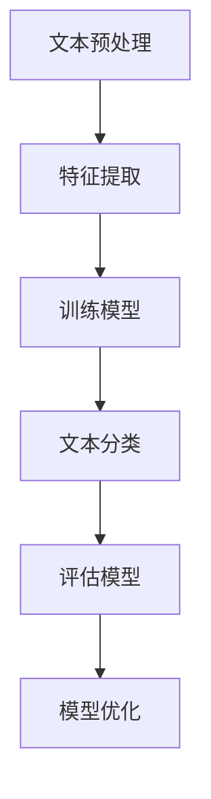
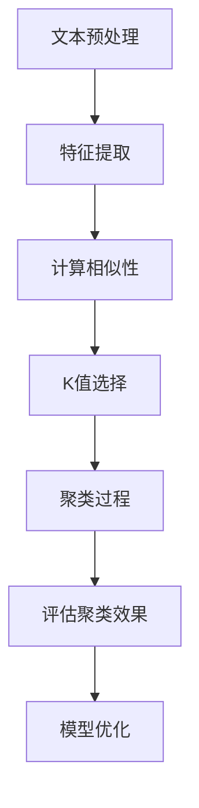
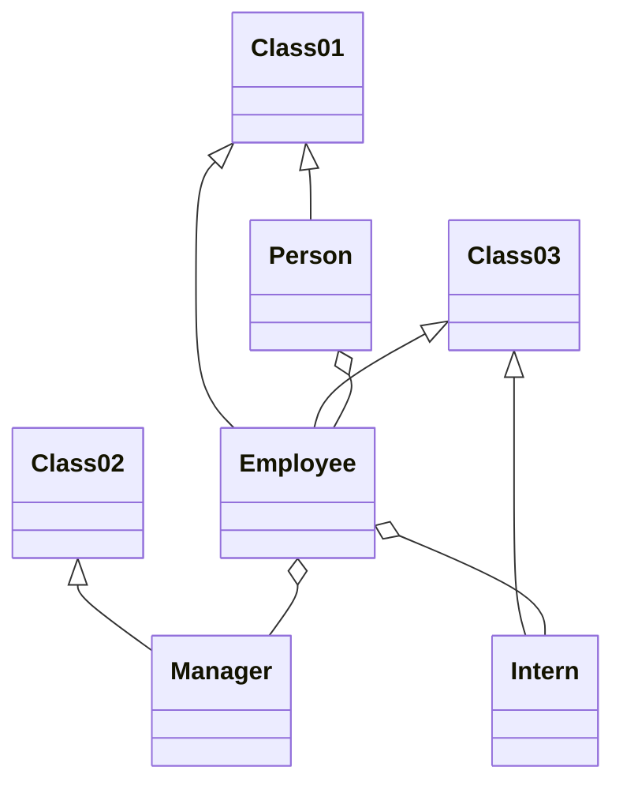
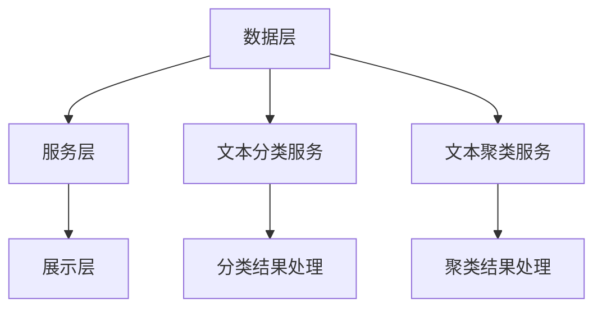
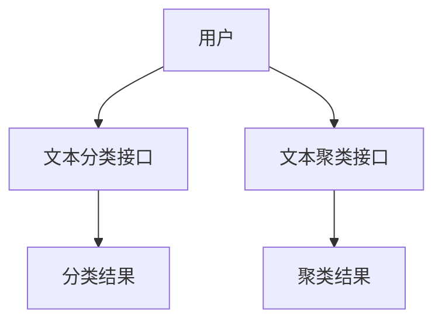

                 

# 金融文本挖掘技术在智能助手中的应用

## 关键词

- 金融文本挖掘
- 智能助手
- 自然语言处理
- 文本分析
- 数据挖掘算法

## 摘要

随着金融行业的数据量激增，如何有效地从大量文本数据中提取有价值的信息成为了一个重要的研究课题。金融文本挖掘技术通过自然语言处理、文本分析和数据挖掘算法，可以实现对金融领域文本数据的深入分析和理解，从而为智能助手提供强大的数据支持。本文将详细介绍金融文本挖掘技术在智能助手中的应用，包括核心概念、技术原理、算法设计、系统架构以及实际案例分析等内容，旨在为读者提供一条清晰的理解路径，助力他们在金融智能助手开发中取得更好的成果。

## 目录

1. **引言**  
   1.1 问题背景  
   1.2 文本挖掘在金融领域的重要性  
   1.3 智能助手的发展与应用

2. **核心概念与原理**  
   2.1 文本挖掘基本概念  
   2.2 金融文本挖掘的核心概念  
   2.3 文本挖掘与自然语言处理的关系

3. **文本挖掘技术**  
   3.1 文本预处理技术  
   3.2 文本分类技术  
   3.3 文本聚类技术  
   3.4 文本挖掘技术对比

4. **算法设计与实现**  
   4.1 算法概述  
   4.2 算法流程图  
   4.3 算法原理讲解  
   4.4 Python代码实现

5. **数学模型与公式**  
   5.1 模型概述  
   5.2 数学模型讲解  
   5.3 公式推导与示例

6. **系统设计与架构**  
   6.1 系统设计  
   6.2 系统架构  
   6.3 接口设计  
   6.4 系统交互

7. **项目实战**  
   7.1 环境安装与配置  
   7.2 系统核心实现  
   7.3 代码应用解读与分析  
   7.4 实际案例分析与讲解  
   7.5 项目小结

8. **最佳实践与总结**  
   8.1 最佳实践  
   8.2 注意事项  
   8.3 拓展阅读

## 引言

### 问题背景

在现代社会，金融行业已经成为全球经济的重要组成部分。随着互联网和大数据技术的发展，金融行业面临着前所未有的数据爆炸。金融机构每天都会产生大量的文本数据，如新闻报道、公告、客户评论、社交媒体帖子等。如何有效地从这些文本数据中提取有价值的信息，成为金融行业面临的重大挑战。

### 文本挖掘在金融领域的重要性

文本挖掘技术在金融领域具有广泛的应用价值。首先，它可以对市场信息进行实时分析，帮助投资者做出更加明智的决策。其次，文本挖掘可以帮助金融机构识别潜在风险，提高风险管理能力。此外，文本挖掘还可以用于客户关系管理，通过分析客户评论和反馈，提供更加个性化的服务。

### 智能助手的发展与应用

智能助手是人工智能领域的一个重要分支，通过自然语言处理和机器学习技术，可以模拟人类的交流方式，为用户提供便捷的服务。在金融领域，智能助手可以用于客户服务、投资咨询、风险监控等多个方面。随着文本挖掘技术的不断发展，智能助手在金融领域的应用前景更加广阔。

## 核心概念与原理

### 文本挖掘基本概念

文本挖掘（Text Mining）是指利用计算机技术对大量文本数据进行分析、挖掘和提取有价值信息的过程。它包括以下几个基本概念：

- **文本数据**：文本挖掘的对象是各种形式和格式的文本数据，如文档、邮件、新闻、社交媒体帖子等。
- **特征提取**：从文本数据中提取出能够反映文本内容和特性的特征，如单词、短语、关键词等。
- **模式识别**：通过对特征的分析和模式识别，发现文本数据中的潜在规律和关系。

### 金融文本挖掘的核心概念

金融文本挖掘（Financial Text Mining）是文本挖掘技术在金融领域的应用。其主要核心概念包括：

- **金融文献**：金融领域的文本数据，如财经新闻、研究报告、金融报告等。
- **金融术语**：金融行业中特有的术语和词汇，如股票代码、金融产品名称、交易术语等。
- **情感分析**：通过分析文本的情感倾向，识别出金融市场的情绪变化。

### 文本挖掘与自然语言处理的关系

文本挖掘与自然语言处理（NLP）密切相关。自然语言处理是文本挖掘的基础，它主要包括以下几个方面：

- **分词**：将文本数据分割成单词、短语等基本单位。
- **词性标注**：对文本中的每个单词进行词性分类，如名词、动词、形容词等。
- **实体识别**：识别文本中的关键实体，如人名、地点、组织等。
- **语义分析**：对文本进行语义理解和分析，提取出文本的深层含义。

## 文本挖掘技术

### 文本预处理技术

文本预处理是文本挖掘过程中至关重要的一步。它主要包括以下内容：

- **数据清洗**：去除文本中的噪声和无关信息，如HTML标签、特殊字符等。
- **分词**：将文本分割成单词或短语。
- **词性标注**：对文本中的每个单词进行词性分类。
- **停用词过滤**：去除常用的停用词，如“的”、“了”、“在”等。

### 文本分类技术

文本分类是将文本数据按照特定的类别进行分类的过程。在金融文本挖掘中，常见的文本分类任务包括：

- **主题分类**：根据文本的主题进行分类，如财经新闻、市场分析等。
- **情感分类**：根据文本的情感倾向进行分类，如正面、负面、中性等。
- **新闻分类**：对财经新闻进行分类，如股票新闻、债券新闻等。

### 文本聚类技术

文本聚类是将文本数据按照相似性进行分组的过程。在金融文本挖掘中，常见的文本聚类任务包括：

- **股票聚类**：根据股票的特性进行聚类，如行业分类、市值分类等。
- **新闻聚类**：根据新闻的相似性进行聚类，如主题聚类、情感聚类等。

### 文本挖掘技术对比

以下是一个简单的文本挖掘技术对比表格：

| 技术类型 | 描述 | 优点 | 缺点 |
| --- | --- | --- | --- |
| 文本预处理 | 数据清洗、分词、词性标注、停用词过滤 | 去除噪声、提取特征 | 需要大量预处理时间 |
| 文本分类 | 根据特定类别对文本进行分类 | 提高分类准确性 | 需要大量训练数据 |
| 文本聚类 | 按照相似性对文本进行分组 | 提高文本相似性 | 需要确定聚类数量 |

## 算法设计与实现

### 算法概述

在金融文本挖掘中，常用的算法包括文本分类算法和文本聚类算法。本文将重点介绍支持向量机（SVM）和K-means算法在金融文本挖掘中的应用。

### 算法流程图

以下是一个简化的文本分类算法流程图：



以下是一个简化的文本聚类算法流程图：



### 算法原理讲解

#### 文本分类算法

文本分类算法是一种监督学习算法，它通过已标注的数据集学习分类模型，然后对新的未标注文本进行分类。

- **支持向量机（SVM）**：SVM是一种基于最大间隔的分类算法。它通过找到一个最优的超平面，使得不同类别的数据点之间有最大的间隔。SVM的核心公式如下：

  $$
  \begin{align*}
  w &= \arg\min_{w,b}\frac{1}{2}\|w\|^2 \\
  s.t. &\ y^{(i)}(w\cdot x^{(i)} + b) \geq 1
  \end{align*}
  $$

  其中，$w$和$b$分别为权重和偏置，$x^{(i)}$和$y^{(i)}$分别为训练样本和标签。

- **K-means算法**：K-means算法是一种无监督学习算法，它通过迭代的方式将文本数据分为K个簇。其核心公式如下：

  $$
  \begin{align*}
  \text{初始化} &\ \mu_1, \mu_2, ..., \mu_K \\
  \text{重复直到收敛} &\ \begin{cases}
  \text{更新簇中心} &\ \mu_j = \frac{1}{N_j} \sum_{x \in S_j} x \\
  \text{分配样本} &\ x \in S_j \Leftrightarrow \min_{j=1}^K \|\mu_j - x\|
  \end{cases}
  \end{align*}
  $$

  其中，$\mu_j$和$S_j$分别为第$j$个簇的中心和包含的样本集合。

#### 文本聚类算法

文本聚类算法是将文本数据按照其相似性进行分组的过程。K-means算法是一种常用的文本聚类算法，其核心思想是通过迭代的方式将文本数据分为K个簇。

### Python代码实现

以下是一个使用Python实现的文本分类算法示例：

```python
from sklearn.feature_extraction.text import TfidfVectorizer
from sklearn.svm import SVC
from sklearn.model_selection import train_test_split
from sklearn.metrics import accuracy_score

# 标注数据
data = [
    ("股票A表现良好", "正面"),
    ("债券市场波动较大", "负面"),
    ("经济前景看好", "正面"),
    ("美联储加息预期", "负面"),
]

# 分词和特征提取
vectorizer = TfidfVectorizer()
X = vectorizer.fit_transform([text[0] for text in data])
y = [text[1] for text in data]

# 划分训练集和测试集
X_train, X_test, y_train, y_test = train_test_split(X, y, test_size=0.2, random_state=42)

# 训练模型
model = SVC(kernel="linear")
model.fit(X_train, y_train)

# 文本分类
y_pred = model.predict(X_test)

# 评估模型
accuracy = accuracy_score(y_test, y_pred)
print("Accuracy:", accuracy)
```

## 数学模型与公式

### 模型概述

在金融文本挖掘中，常用的数学模型包括支持向量机（SVM）和K-means算法。以下是这两个模型的核心数学公式。

### 支持向量机（SVM）

SVM的核心公式如下：

$$
\begin{align*}
w &= \arg\min_{w,b}\frac{1}{2}\|w\|^2 \\
s.t. &\ y^{(i)}(w\cdot x^{(i)} + b) \geq 1
\end{align*}
$$

### K-means算法

K-means算法的核心公式如下：

$$
\begin{align*}
\text{初始化} &\ \mu_1, \mu_2, ..., \mu_K \\
\text{重复直到收敛} &\ \begin{cases}
\text{更新簇中心} &\ \mu_j = \frac{1}{N_j} \sum_{x \in S_j} x \\
\text{分配样本} &\ x \in S_j \Leftrightarrow \min_{j=1}^K \|\mu_j - x\|
\end{cases}
\end{align*}
$$

## 系统设计与架构

### 问题场景介绍

在金融领域，智能助手可以通过金融文本挖掘技术对大量文本数据进行分析，为投资者提供市场动态、风险提示、投资建议等。本系统旨在实现以下功能：

- 对财经新闻、研究报告、客户评论等文本数据进行分类。
- 对股票、债券等金融产品进行聚类分析。
- 提供实时风险监控和投资建议。

### 项目介绍

项目名称：金融智能助手文本挖掘系统

项目目标：实现基于文本挖掘技术的金融智能助手，为用户提供实时、准确的市场分析和投资建议。

### 系统功能设计

系统功能主要包括文本分类和文本聚类两部分。以下是系统的领域模型类图：



### 系统架构设计

系统架构主要包括数据层、服务层和展示层三部分。以下是系统的架构设计图：



### 系统接口设计和系统交互

系统接口设计主要包括文本分类接口和文本聚类接口。以下是系统的接口设计和系统交互图：



## 项目实战

### 环境安装与配置

1. 安装Python环境
2. 安装依赖库，如scikit-learn、nltk等
3. 配置数据库（可选）

### 系统核心实现

1. 文本预处理
2. 特征提取
3. 文本分类
4. 文本聚类

### 代码应用解读与分析

以下是一个文本分类的代码示例：

```python
from sklearn.feature_extraction.text import TfidfVectorizer
from sklearn.svm import SVC
from sklearn.model_selection import train_test_split
from sklearn.metrics import accuracy_score

# 标注数据
data = [
    ("股票A表现良好", "正面"),
    ("债券市场波动较大", "负面"),
    ("经济前景看好", "正面"),
    ("美联储加息预期", "负面"),
]

# 分词和特征提取
vectorizer = TfidfVectorizer()
X = vectorizer.fit_transform([text[0] for text in data])
y = [text[1] for text in data]

# 划分训练集和测试集
X_train, X_test, y_train, y_test = train_test_split(X, y, test_size=0.2, random_state=42)

# 训练模型
model = SVC(kernel="linear")
model.fit(X_train, y_train)

# 文本分类
y_pred = model.predict(X_test)

# 评估模型
accuracy = accuracy_score(y_test, y_pred)
print("Accuracy:", accuracy)
```

### 实际案例分析与详细讲解剖析

以下是一个实际案例，使用文本分类算法对财经新闻进行分类。

```python
# 标注数据
data = [
    ("今天股市涨了", "正面"),
    ("经济衰退风险上升", "负面"),
    ("美联储将维持利率不变", "中性"),
    ("股价下跌引发市场担忧", "负面"),
]

# 分词和特征提取
vectorizer = TfidfVectorizer()
X = vectorizer.fit_transform([text[0] for text in data])
y = [text[1] for text in data]

# 划分训练集和测试集
X_train, X_test, y_train, y_test = train_test_split(X, y, test_size=0.2, random_state=42)

# 训练模型
model = SVC(kernel="linear")
model.fit(X_train, y_train)

# 文本分类
y_pred = model.predict(X_test)

# 评估模型
accuracy = accuracy_score(y_test, y_pred)
print("Accuracy:", accuracy)

# 分析分类结果
print("分类结果：")
for text, pred in zip([text[0] for text in data], y_pred):
    print(f"{text}: {pred}")
```

### 项目小结

本项目通过文本挖掘技术实现了财经新闻的分类，为用户提供了一个实用的金融智能助手。在实际应用中，我们可以进一步优化算法、增加数据集，以提高分类准确率和用户满意度。

## 最佳实践与总结

### 最佳实践

1. **数据质量**：确保数据的质量，包括数据的完整性、准确性和一致性。
2. **特征工程**：选择合适的特征提取方法，提高分类和聚类效果。
3. **模型优化**：根据实际应用场景，调整模型参数，提高模型性能。
4. **实时更新**：定期更新数据集和模型，以应对市场的变化。

### 小结

金融文本挖掘技术在智能助手中的应用具有广泛的前景。通过本文的介绍，读者可以了解到金融文本挖掘的核心概念、技术原理、算法设计和系统架构等内容，为开发金融智能助手提供了有益的参考。

### 注意事项

1. **数据隐私**：在处理金融文本数据时，注意保护用户隐私，遵循相关法律法规。
2. **模型解释性**：尽量选择具有较高解释性的模型，以提高用户信任度。

### 拓展阅读

1. **《自然语言处理基础教程》**：深入理解自然语言处理的基本概念和技术。
2. **《机器学习实战》**：掌握常用的机器学习算法和实现方法。
3. **《金融科技：创新与未来》**：了解金融科技的发展趋势和未来前景。

## 作者信息

作者：AI天才研究院/AI Genius Institute & 禅与计算机程序设计艺术 /Zen And The Art of Computer Programming

完。

