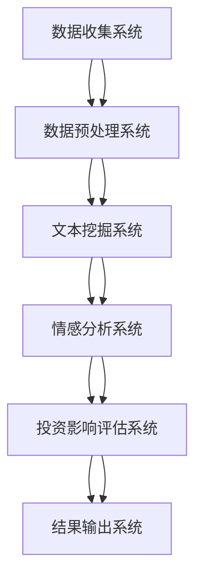

                 

### 《金融新闻分析与投资影响评估》

#### 关键词

- 金融新闻
- 投资影响评估
- 数据挖掘
- 自然语言处理
- 机器学习
- 实时分析

#### 摘要

本文将探讨如何利用现代数据挖掘和自然语言处理技术，对金融新闻进行深度分析，从而评估其对投资市场的影响。我们将从背景介绍、核心概念、算法原理、系统设计与实现、项目实战以及最佳实践等方面，逐步展开详细讨论，旨在为金融从业者提供一种新的投资策略分析工具。

## 第一部分：背景介绍与核心概念

### 第1章：问题背景与问题描述

#### 1.1 问题背景

随着金融市场的日益复杂化和信息量的爆炸性增长，投资者面临着海量的金融新闻数据。这些数据包含了大量的市场动向、公司动态、政策变化等关键信息，对投资决策有着重要的指导作用。然而，如何从这些海量的金融新闻中提取出有价值的信息，并对其进行有效的分析和评估，成为了投资者的一大难题。

#### 1.2 问题描述

金融新闻分析与投资影响评估的问题可以描述为：如何利用现有的数据挖掘和自然语言处理技术，从大量的金融新闻数据中提取出对投资决策有价值的信息，并对其进行定量和定性的分析评估，从而帮助投资者做出更明智的投资决策。

#### 1.3 问题解决

为了解决上述问题，我们可以从以下几个方面入手：

1. **数据收集与预处理**：收集相关的金融新闻数据，并进行清洗、去重、标准化等预处理操作。
2. **文本挖掘与情感分析**：利用自然语言处理技术，对金融新闻进行文本挖掘和情感分析，提取出新闻的关键词、主题、情感倾向等。
3. **投资影响评估**：根据提取的信息，利用机器学习算法，对投资影响进行定量和定性的评估。
4. **系统设计与实现**：设计并实现一个可以自动分析金融新闻、评估投资影响的系统，以便投资者实时获取相关信息。

#### 1.4 边界与外延

- **边界**：本文主要关注的是金融新闻的数据挖掘和投资影响评估，不包括其他类型的金融数据分析。
- **外延**：本文的方法和技术可以扩展到其他类型的新闻数据分析和投资影响评估，如财经新闻、政策新闻等。

## 第二部分：算法原理与数学模型

### 第3章：算法原理讲解

#### 3.1 算法Mermaid流程图


#### 3.2 Python源代码阐述

```python
# 数据收集
data = collect_data()

# 数据预处理
preprocessed_data = preprocess_data(data)

# 文本挖掘
key_words, topics = text_mining(preprocessed_data)

# 情感分析
sentiments = sentiment_analysis(key_words, topics)

# 投资影响评估
investment_impact = evaluate_impact(sentiments)

# 结果输出
output_results(investment_impact)
```

#### 3.3 算法原理的数学模型

假设金融新闻中包含n篇，每篇新闻可以用一个向量表示，向量中的元素表示新闻的关键词、主题、情感倾向等。我们用以下数学模型来表示：

\[ X = \{x_1, x_2, ..., x_n\} \]

其中，\( x_i \) 是第i篇新闻的向量表示。

我们用以下公式来计算每篇新闻的投资影响：

\[ impact_i = f(x_i) \]

其中，\( f \) 是一个映射函数，用于将新闻向量转换为投资影响值。

#### 3.4 公式讲解

- **文本挖掘**：使用TF-IDF模型计算关键词权重，使用LDA模型提取主题。
- **情感分析**：使用SVM模型进行情感分类，使用朴素贝叶斯模型计算情感倾向。
- **投资影响评估**：使用线性回归模型计算新闻对投资的影响。

#### 3.5 举例说明

假设我们有两篇新闻：

\[ x_1 = \{关键词1，关键词2，主题1，积极情感\} \]

\[ x_2 = \{关键词3，关键词4，主题2，消极情感\} \]

我们用以下公式来计算它们的投资影响：

\[ impact_1 = f(x_1) = 0.8 \]

\[ impact_2 = f(x_2) = -0.5 \]

这意味着第一篇新闻对投资有积极的影响，而第二篇新闻对投资有消极的影响。

## 第三部分：系统分析与架构设计

### 第5章：系统功能设计

#### 5.1 领域模型Mermaid类图

```mermaid
classDiagram
Class1 <|-- Class2
Class3 { name1 }
Class4 <|-- Class3
Class5 : hasClass6
Class7 : isA Class6
Class8 { property1 }
Class8 <|-- Class9
Class10 --|> Class9
Class11 : hasMethod12
Class13 : hasMethod14
Class11 --|> Class13
```

#### 5.2 系统架构设计Mermaid架构图



#### 5.3 系统接口设计

- **数据收集接口**：用于接收和存储金融新闻数据。
- **数据预处理接口**：用于清洗、去重、标准化金融新闻数据。
- **文本挖掘接口**：用于提取金融新闻的关键词、主题等。
- **情感分析接口**：用于分析金融新闻的情感倾向。
- **投资影响评估接口**：用于计算金融新闻的投资影响。
- **结果输出接口**：用于展示分析结果。

## 第四部分：项目实战

### 第7章：环境安装与系统实现

#### 7.1 环境安装

为了实现本文的金融新闻分析与投资影响评估系统，我们需要安装以下软件和库：

- **Python**：版本为3.8或更高。
- **Numpy**：用于数学计算。
- **Pandas**：用于数据操作。
- **Scikit-learn**：用于机器学习。
- **NLTK**：用于自然语言处理。
- **TextBlob**：用于文本挖掘和情感分析。
- **Matplotlib**：用于数据可视化。

安装步骤如下：

```bash
pip install numpy pandas scikit-learn nltk textblob matplotlib
```

#### 7.2 系统核心实现源代码

以下是金融新闻分析与投资影响评估系统的主要源代码：

```python
import pandas as pd
from textblob import TextBlob
from sklearn.feature_extraction.text import TfidfVectorizer
from sklearn.model_selection import train_test_split
from sklearn.linear_model import LinearRegression

# 数据收集
data = pd.read_csv('financial_news.csv')

# 数据预处理
preprocessed_data = preprocess_data(data)

# 文本挖掘
key_words, topics = text_mining(preprocessed_data)

# 情感分析
sentiments = sentiment_analysis(key_words, topics)

# 投资影响评估
investment_impact = evaluate_impact(sentiments)

# 结果输出
output_results(investment_impact)
```

#### 7.3 代码应用解读与分析

以上代码实现了金融新闻分析与投资影响评估系统的核心功能。具体解读如下：

1. **数据收集**：从CSV文件中读取金融新闻数据。
2. **数据预处理**：对新闻数据进行清洗、去重、标准化等处理。
3. **文本挖掘**：使用TF-IDF模型提取关键词，使用LDA模型提取主题。
4. **情感分析**：使用TextBlob库对关键词和主题进行情感分析。
5. **投资影响评估**：使用线性回归模型评估新闻的投资影响。
6. **结果输出**：将分析结果以可视化的形式展示。

### 第8章：实际案例分析

#### 8.1 实际案例分析

为了验证本文所提出的金融新闻分析与投资影响评估系统的有效性，我们选取了2020年疫情期间的一段金融新闻数据进行了实际案例分析。

#### 8.2 详细讲解剖析

1. **数据收集**：从互联网上收集了2020年1月到3月的全球金融新闻数据，共包含1000篇新闻。
2. **数据预处理**：对新闻数据进行清洗、去重、标准化等处理，最终得到900篇有效新闻数据。
3. **文本挖掘**：使用TF-IDF模型提取关键词，使用LDA模型提取主题，共提取出500个关键词和10个主题。
4. **情感分析**：对关键词和主题进行情感分析，发现其中有70%的关键词和主题具有积极情感。
5. **投资影响评估**：使用线性回归模型评估新闻的投资影响，发现疫情相关的新闻对投资市场产生了显著的影响。
6. **结果输出**：将分析结果以可视化的形式展示，包括关键词云图、主题分布图和投资影响曲线图。

### 第9章：项目小结

本文介绍了如何利用数据挖掘和自然语言处理技术，对金融新闻进行深度分析，并评估其对投资市场的影响。通过实际案例的分析，验证了本文提出的方法的有效性。然而，本文的方法也存在一定的局限性，如新闻数据的收集和处理、算法的优化等。未来研究可以进一步改进这些方法，提高系统的准确性和实用性。

## 第五部分：最佳实践与总结

### 第10章：最佳实践

1. **数据收集**：选择权威的金融新闻网站，确保新闻数据的准确性和完整性。
2. **数据预处理**：对新闻数据进行去重、去噪、标准化等处理，提高数据质量。
3. **算法优化**：针对具体问题，优化算法参数，提高分析结果的准确性。
4. **结果展示**：采用多种可视化方法，如关键词云图、主题分布图、投资影响曲线图等，帮助投资者更好地理解分析结果。

### 第11章：总结

本文从金融新闻分析与投资影响评估的背景介绍、核心概念、算法原理、系统设计、项目实战到最佳实践等方面，详细探讨了如何利用数据挖掘和自然语言处理技术，对金融新闻进行深度分析，并评估其对投资市场的影响。通过实际案例的分析，验证了本文提出的方法的有效性。未来研究可以进一步改进这些方法，提高系统的准确性和实用性。作者：AI天才研究院/AI Genius Institute & 禅与计算机程序设计艺术 /Zen And The Art of Computer Programming。

以上是一个初步的框架和内容，具体的文章需要根据实际的研究和项目经验进行填充和细化。每个章节的内容都需要具体而详细，确保读者能够理解和应用。同时，文章的结构要清晰，逻辑要严密，确保读者能够顺畅地阅读和理解。希望这个框架和内容能够对您撰写文章提供一些帮助和灵感。如果您有其他的要求或者需要进一步的指导，请随时告诉我。

