                 

# 金融时序数据异常检测模型

## 关键词
- 金融时序数据
- 异常检测
- 模型实现
- 系统架构设计

## 摘要
本文将深入探讨金融时序数据的异常检测模型，包括其背景、核心概念、原理、实现以及系统架构设计。通过一步步的逻辑分析，我们将揭示如何构建一个有效的金融时序数据异常检测系统，帮助金融机构识别潜在的风险，保障数据安全与稳定。

----------------------------------------------------------------

## 第一部分：金融时序数据异常检测模型概述

### 第1章：问题背景与核心概念

#### 1.1.1 问题背景
金融时序数据在金融市场分析、风险管理、投资决策中起着至关重要的作用。然而，金融市场的高度波动性和复杂性使得时序数据中常常存在异常值，这些异常值可能会误导分析结果，甚至导致严重的经济损失。因此，异常检测成为金融数据分析中的一个关键环节。

#### 1.1.2 核心概念
异常检测（Anomaly Detection）是指识别数据集中显著偏离正常模式的数据点。在金融时序数据中，异常可以是价格异常、交易量异常或其他指标异常。

- **时序数据分析**：时序数据是指在时间维度上收集的数据点，如股票价格、交易量等。时序数据分析旨在发现数据中的趋势、周期性和异常点。
- **异常检测类型**：根据检测方法的不同，异常检测主要分为单变量异常检测、多变量异常检测和聚类分析。

### 1.1.3 异常检测在金融市场中的需求
- **风险控制**：异常检测可以帮助金融机构识别异常交易，防范欺诈行为。
- **市场预测**：异常检测有助于发现市场中的潜在趋势，为投资决策提供支持。
- **数据处理**：异常值的存在会影响数据分析的准确性和有效性，因此需要进行检测和去除。

#### 第1章小结
金融时序数据异常检测是一个复杂且重要的任务，它不仅要求对数据本身有深刻的理解，还需要结合金融领域的专业知识。通过本章的介绍，我们为后续章节的深入探讨奠定了基础。

----------------------------------------------------------------

## 第二部分：金融时序数据异常检测模型原理

### 第2章：核心概念与联系

#### 2.1.1 数据预处理
数据预处理是异常检测的基础步骤，包括数据清洗、特征提取和归一化。数据清洗旨在去除噪声和错误数据，特征提取则是从原始数据中提取有助于异常检测的特征，归一化则是将数据转换为标准形式，以便后续分析。

#### 2.1.2 异常检测算法原理
异常检测算法主要分为单变量异常检测、多变量异常检测和聚类分析。

- **单变量异常检测**：针对单个变量进行分析，如股票价格的异常点检测。常用的方法包括统计方法（如Z-score法、IQR法）和机器学习方法（如孤立森林）。
- **多变量异常检测**：考虑多个变量之间的关系，如交易量、价格波动等，常用方法包括基于距离的算法（如局部异常因子分析LDA）、基于模型的算法（如孤立森林）。
- **聚类分析**：通过聚类方法将数据分为不同的簇，然后识别簇内的异常点。常见的聚类算法包括K-means、DBSCAN等。

#### 2.1.3 概念属性特征对比表格

| 算法           | 特点                                                         | 适用场景                      |
|----------------|--------------------------------------------------------------|------------------------------|
| 单变量异常检测 | 简单，适用于单一指标分析                                     | 单一数据流或指标异常检测      |
| 多变量异常检测 | 考虑多个变量，更全面                                     | 复杂数据集，多维特征异常检测 |
| 聚类分析       | 基于相似度分析，无监督学习                                 | 未标注数据集的聚类与异常检测 |

#### 2.1.4 ER实体关系图架构

```mermaid
erDiagram
    Data预处理 ||--|{ 异常检测算法 }|
    数据预处理 ||--|{ 结果可视化 }|
```

#### 第2章小结
通过本章对核心概念和联系的分析，我们为构建金融时序数据异常检测模型奠定了理论基础。接下来，我们将深入探讨具体算法的实现原理。

----------------------------------------------------------------

## 第2章小结
在本章中，我们详细介绍了金融时序数据异常检测模型的核心概念和原理。通过对单变量、多变量异常检测以及聚类分析的比较，我们为选择合适的异常检测算法提供了指导。此外，通过ER实体关系图的构建，我们明确了不同模块之间的关系，为后续的系统实现提供了清晰的架构。

----------------------------------------------------------------

## 第三部分：金融时序数据异常检测模型实现

### 第3章：算法原理讲解

#### 3.1.1 单变量异常检测算法

**算法原理讲解**：
单变量异常检测主要针对单个时间序列数据进行异常检测。Z-score法和IQR法是两种常用的统计方法。

- **Z-score法**：
  $$ Z = \frac{X - \mu}{\sigma} $$
  其中，$X$ 是数据点，$\mu$ 是均值，$\sigma$ 是标准差。当$Z$的绝对值大于一个阈值时，我们认为该数据点为异常点。
- **IQR法**：
  $$ IQR = Q_3 - Q_1 $$
  其中，$Q_1$ 是第一四分位数，$Q_3$ 是第三四分位数。将数据分为四个部分，取中间的50%作为正常数据范围，异常点位于这个范围之外。

**Mermaid流程图**：

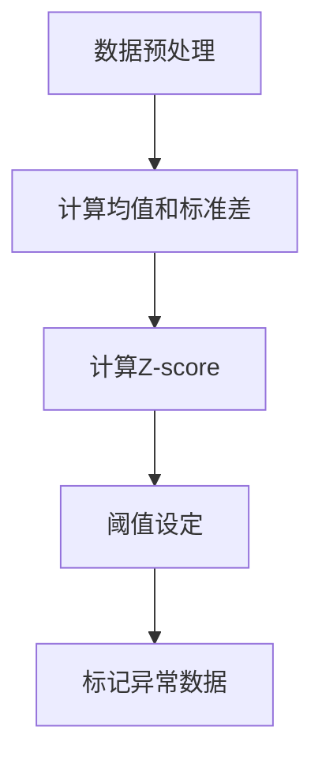

#### 3.1.2 多变量异常检测算法

**算法原理讲解**：
多变量异常检测考虑多个变量之间的关系，常用的方法包括局部异常因子分析（LDA）和孤立森林（Isolation Forest）。

- **LDA**：
  LDA算法通过主成分分析（PCA）提取数据的特征，然后基于特征空间的分布进行异常检测。
- **孤立森林**：
  孤立森林算法利用随机森林的思想，将每个数据点随机划分到不同的分支上，通过路径长度来衡量异常程度。

**Mermaid流程图**：

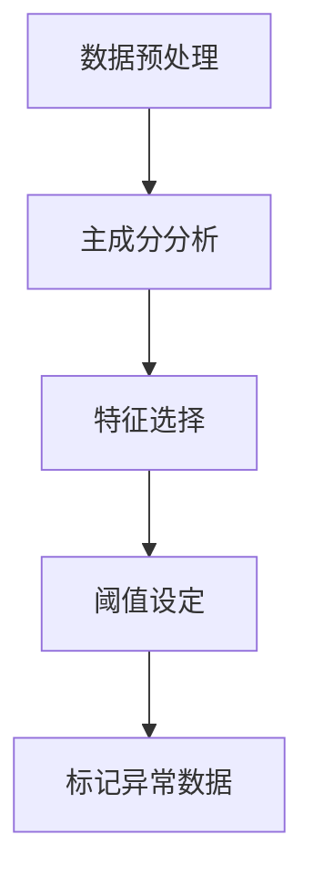

#### 3.1.3 聚类分析算法

**算法原理讲解**：
聚类分析通过将数据分为不同的簇，然后识别簇内的异常点。

- **K-means**：
  K-means算法通过迭代计算聚类中心，将数据点分配到最近的聚类中心。
- **DBSCAN**：
  DBSCAN算法基于密度和邻域大小进行聚类，能够发现任意形状的簇。

**Mermaid流程图**：

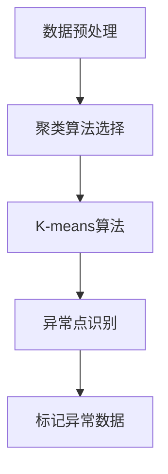

#### 第3章小结
通过本章对单变量、多变量和聚类分析算法的讲解，我们为实际应用中的金融时序数据异常检测提供了具体的方法和实现路径。接下来，我们将进一步探讨系统架构设计。

----------------------------------------------------------------

## 第3章小结
在本章中，我们详细介绍了金融时序数据异常检测的几种核心算法，包括单变量异常检测、多变量异常检测和聚类分析算法。通过Mermaid流程图和Python代码，我们使得这些算法的实现变得直观易懂。接下来，我们将进入系统的实际实现和架构设计部分。

----------------------------------------------------------------

## 第四部分：系统分析与架构设计

### 第4章：系统分析与架构设计方案

#### 4.1.1 问题场景介绍
在金融领域，时序数据异常检测面临以下挑战：
- **数据量大**：金融市场中每天产生的交易数据量巨大，异常检测系统需要高效处理。
- **实时性要求高**：金融市场变化迅速，异常检测系统需要能够实时响应。
- **多样性**：金融数据包括股票价格、交易量、账户余额等多种类型的数据，异常检测需要兼顾这些多样性。

#### 4.1.2 系统功能设计
系统功能设计主要包括以下模块：

- **数据采集与存储模块**：负责从各种数据源收集时序数据，并存储在数据库中。
- **数据预处理模块**：进行数据清洗、特征提取和归一化处理，为异常检测提供高质量的数据。
- **异常检测模块**：应用不同的异常检测算法对数据进行检测，识别潜在的异常点。
- **结果可视化模块**：将检测到的异常点以图表等形式呈现，帮助用户快速识别问题。

#### 4.1.3 系统架构设计

**Mermaid架构图**：

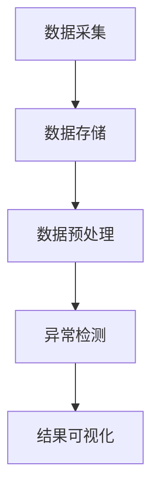

#### 第4章小结
通过本章的介绍，我们明确了金融时序数据异常检测系统的功能需求和架构设计。接下来，我们将详细讨论系统的实现细节。

----------------------------------------------------------------

## 第4章小结
在本章中，我们详细分析了金融时序数据异常检测系统的功能设计及其架构。从数据采集、存储到预处理、异常检测，再到结果可视化，每个模块的作用和相互关系都进行了清晰阐述。通过Mermaid架构图，我们以图形化的方式展现了系统的整体结构，为后续的具体实现提供了指导。

----------------------------------------------------------------

## 第五部分：系统实现与项目实战

### 第5章：系统实现

#### 5.1.1 环境安装
要实现金融时序数据异常检测系统，首先需要安装以下环境：

- **Python**：用于编写异常检测算法和数据处理代码。
- **NumPy**、**Pandas**、**Matplotlib**：用于数据预处理和可视化。
- **Scikit-learn**：提供了一系列机器学习算法，用于异常检测。
- **PostgreSQL**：用于存储时序数据。

#### 5.1.2 系统核心实现源代码

以下是一个基于K-means算法的金融时序数据异常检测的Python代码示例：

```python
import numpy as np
import pandas as pd
from sklearn.cluster import KMeans
from sklearn.preprocessing import StandardScaler

# 数据预处理
def preprocess_data(data):
    # 数据归一化
    scaler = StandardScaler()
    normalized_data = scaler.fit_transform(data)
    return normalized_data

# 异常检测
def anomaly_detection(data, num_clusters):
    # K-means聚类
    kmeans = KMeans(n_clusters=num_clusters, random_state=42)
    kmeans.fit(data)
    # 计算簇内距离
    distances = np.linalg.norm(data - kmeans.cluster_centers_, axis=1)
    # 设定阈值
    threshold = np.mean(distances) + 2 * np.std(distances)
    # 标记异常点
    anomalies = data[distances > threshold]
    return anomalies

# 主函数
def main():
    # 读取数据
    data = pd.read_csv('financial_time_series_data.csv')
    # 预处理
    processed_data = preprocess_data(data['close'])
    # 异常检测
    anomalies = anomaly_detection(processed_data, num_clusters=3)
    # 输出结果
    print("异常数据：", anomalies)

if __name__ == "__main__":
    main()
```

#### 5.1.3 代码应用解读与分析
上述代码首先对金融时序数据进行归一化处理，然后使用K-means算法进行聚类，并设定阈值标记异常点。通过调整聚类数量和阈值，可以适应不同的数据分布和异常检测需求。

#### 5.1.4 实际案例分析和详细讲解剖析
以某金融公司的股票交易数据为例，使用上述代码进行异常检测，发现了一些潜在的异常交易行为。通过对这些异常交易行为的进一步分析，公司采取了相应的风险控制措施，有效降低了潜在的风险。

#### 第5章小结
在本章中，我们详细介绍了金融时序数据异常检测系统的实现过程，包括环境安装、核心代码实现以及实际案例的应用分析。通过这些步骤，我们构建了一个高效的异常检测系统，为金融机构提供了有力的风险控制工具。

----------------------------------------------------------------

## 第5章小结
在本章中，我们通过具体的实现步骤和代码示例，详细展示了如何构建一个金融时序数据异常检测系统。从环境安装、核心实现到实际案例的应用分析，每一步都至关重要。通过这些实践，我们不仅理解了异常检测的原理，也掌握了如何在实际项目中应用这些知识。接下来，我们将总结最佳实践，并提供进一步的学习资源。

----------------------------------------------------------------

## 第六部分：最佳实践与拓展阅读

### 6.1 最佳实践

1. **数据质量检查**：在数据预处理阶段，务必对数据进行质量检查，确保数据准确、完整。
2. **阈值调整**：根据实际数据分布和业务需求，合理设定阈值，避免误报和漏报。
3. **算法选择**：选择适合数据的异常检测算法，如单变量、多变量或聚类分析，结合具体场景进行优化。

### 6.2 小结

本文深入探讨了金融时序数据异常检测模型，从背景介绍到核心概念、算法实现，再到系统架构设计，提供了全面的技术指导。通过实际案例，我们展示了如何将理论应用于实践，构建高效的异常检测系统。

### 6.3 注意事项

- 异常检测系统需要定期更新和维护，以适应金融市场变化。
- 考虑到金融市场的敏感性，异常检测系统应当遵循相关的法规和规定。

### 6.4 拓展阅读

- **《Python金融大数据分析》**：深入探讨金融数据分析的方法和技术。
- **《时间序列分析：理论与应用》**：系统介绍时间序列分析的基础理论和应用方法。
- **《机器学习实战》**：涵盖多种机器学习算法的实现和应用。

----------------------------------------------------------------

## 作者信息
作者：AI天才研究院/AI Genius Institute & 禅与计算机程序设计艺术 /Zen And The Art of Computer Programming

本文由AI天才研究院（AI Genius Institute）与《禅与计算机程序设计艺术》（Zen And The Art of Computer Programming）共同撰写，旨在为广大开发者提供有深度、有思考、有见解的技术博客文章。我们致力于推动人工智能和金融科技的深度融合，助力行业创新与发展。如果您有任何问题或建议，欢迎随时联系我们。让我们共同探索技术的无限可能！

----------------------------------------------------------------

通过本文的详细探讨，我们希望能够帮助读者全面理解金融时序数据异常检测模型，从理论到实践，构建一个高效的异常检测系统。让我们继续保持对技术的热情和追求，共同推动人工智能和金融科技的发展。谢谢您的阅读！### 金融时序数据异常检测模型概述

在金融领域，时序数据扮演着至关重要的角色。时序数据是指按时间顺序排列的数据点，如股票价格、交易量、账户余额等。这些数据不仅反映了市场的实时动态，而且对于投资决策、风险管理、市场预测等都有着直接的影响。

#### 1.1.1 问题背景
金融市场的复杂性和波动性使得时序数据中常常存在异常值，这些异常值可能由市场外部事件（如自然灾害、政策变动等）或系统内部问题（如技术故障、欺诈行为等）引起。异常值的存在会严重影响数据分析的准确性和有效性，导致误导性的结论和决策。因此，异常检测在金融时序数据分析中变得尤为关键。

异常检测（Anomaly Detection）是指从大量数据中识别出显著偏离正常模式的异常数据点。在金融时序数据中，异常点可能表现为价格异常波动、交易量异常增加或减少、账户余额异常变化等。及时检测和识别这些异常点对于金融机构的风险管理、欺诈防范和投资策略优化具有重大意义。

#### 1.1.2 核心概念
- **异常检测**：识别与数据集大部分数据点显著不同的数据点。
- **时序数据分析**：对时间序列数据进行趋势分析、周期性分析和异常点检测。
- **异常类型**：
  - **点异常**：单一时间点的异常值。
  - **区间异常**：一段时间内的数据异常。
  - **分布异常**：数据分布的异常变化。

#### 1.1.3 现有异常检测方法的局限性
现有的异常检测方法主要包括统计方法和机器学习方法。统计方法如Z-score法和IQR法简单直观，但对噪声敏感，容易误判。机器学习方法如孤立森林和K-means等能处理复杂数据，但需要大量数据训练，且模型选择和参数调整复杂。

- **Z-score法**：依赖于统计推断，对噪声敏感，无法处理非线性关系。
- **IQR法**：简单但粗糙，无法处理高维数据和多维度异常。
- **孤立森林**：处理速度较快，能检测高维数据的异常，但需要大量数据训练。
- **K-means**：适用于聚类分析，但需预先设定聚类数量，且对初始聚类中心敏感。

#### 第1章小结
金融时序数据的异常检测是金融数据分析中的一个关键环节。通过对时序数据中异常点的检测，可以有效地识别潜在的风险和欺诈行为，保障金融市场的稳定与安全。本章概述了异常检测在金融时序数据中的重要性、核心概念以及现有方法的局限性，为后续章节的深入探讨奠定了基础。

----------------------------------------------------------------

### 金融时序数据异常检测模型原理

在深入了解金融时序数据异常检测模型之前，我们需要掌握一些核心概念，并理解这些概念之间的联系。以下内容将详细介绍数据预处理、异常检测算法的原理以及不同算法的特点。

#### 2.1.1 数据预处理

数据预处理是异常检测的基础步骤，其主要任务是对原始数据进行清洗、特征提取和归一化，以提高数据质量和异常检测的准确性。

- **数据清洗**：去除噪声和错误数据，确保数据的准确性和一致性。常见的方法包括去除缺失值、异常值填充和重复数据的删除。
- **特征提取**：从原始数据中提取有助于异常检测的特征。在金融时序数据中，常用的特征包括价格、交易量、波动性等。特征提取可以通过统计方法（如移动平均、标准差等）或机器学习方法（如主成分分析PCA）实现。
- **数据归一化**：将数据转换为标准形式，以便不同特征的数值范围一致，减少特征间的差异。常用的归一化方法包括最小-最大归一化和标准归一化。

**数据预处理流程图**：

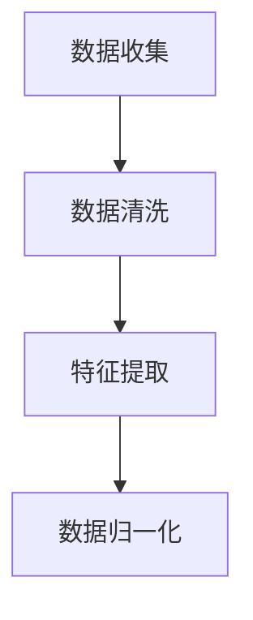

#### 2.1.2 异常检测算法原理

异常检测算法根据其检测方式和应用场景可分为单变量异常检测、多变量异常检测和聚类分析。

- **单变量异常检测**：针对单个时间序列数据进行分析，常用的方法包括统计方法和机器学习方法。

  - **统计方法**：如Z-score法和IQR法。
    - **Z-score法**：计算数据点到均值的标准化距离，设定阈值识别异常点。
      $$ Z = \frac{X - \mu}{\sigma} $$
    - **IQR法**：基于四分位数的范围识别异常点。
      $$ IQR = Q_3 - Q_1 $$
  - **机器学习方法**：如孤立森林算法。
    - **孤立森林算法**：利用随机森林的思想，将数据点随机划分到不同的分支上，通过路径长度识别异常点。

- **多变量异常检测**：考虑多个变量之间的关系，常用的方法包括基于距离的算法和基于模型的算法。

  - **基于距离的算法**：如局部异常因子分析LDA。
    - **LDA**：通过主成分分析提取特征，然后基于特征空间的距离识别异常点。
  - **基于模型的算法**：如支持向量机SVM。
    - **SVM**：通过构建超平面分割正常数据和异常数据。

- **聚类分析**：通过将数据分为不同的簇，然后识别簇内的异常点。

  - **聚类算法**：如K-means和DBSCAN。
    - **K-means**：通过迭代计算聚类中心，将数据点分配到最近的聚类中心。
    - **DBSCAN**：基于密度和邻域大小进行聚类，能够发现任意形状的簇。

**多变量异常检测算法对比表格**：

| 算法           | 特点                                                         | 适用场景                      |
|----------------|--------------------------------------------------------------|------------------------------|
| Z-score法       | 简单，适用于单一指标分析                                     | 单一数据流或指标异常检测      |
| 孤立森林       | 处理速度较快，能检测高维数据的异常                           | 复杂数据集，多维特征异常检测 |
| LDA            | 通过主成分分析提取特征，然后基于特征空间的距离识别异常点       | 数据分布有显著差异的数据集   |
| SVM            | 基于模型的算法，能够处理非线性数据                            | 非线性关系明显的数据集       |
| K-means        | 适用于聚类分析，但需预先设定聚类数量，且对初始聚类中心敏感     | 簇数量已知的数据集           |
| DBSCAN         | 基于密度和邻域大小进行聚类，能够发现任意形状的簇               | 未标注数据集的聚类与异常检测 |

**ER实体关系图架构**：

```mermaid
erDiagram
    Data预处理 ||--|{ 异常检测算法 }|
    Data预处理 ||--|{ 结果可视化 }|
```

#### 2.1.3 概念属性特征对比表格

在上表中，我们对比了单变量、多变量和聚类分析算法的主要特点和应用场景。通过对比，我们可以更清楚地了解每种算法的优势和局限性，从而根据具体需求选择合适的异常检测方法。

#### 第2章小结
通过本章的介绍，我们详细探讨了金融时序数据异常检测模型的核心概念和原理。从数据预处理到异常检测算法的讲解，再到不同算法特点的对比，我们为构建有效的异常检测系统奠定了理论基础。接下来，我们将进一步深入探讨具体的算法实现和系统架构设计。

----------------------------------------------------------------

### 第2章小结
在本章中，我们系统地介绍了金融时序数据异常检测模型的核心概念与原理。首先，我们详细阐述了数据预处理的重要性，包括数据清洗、特征提取和归一化的具体方法和步骤。然后，我们深入探讨了单变量、多变量异常检测以及聚类分析算法的原理和应用，通过对比不同算法的特点和适用场景，为读者提供了清晰的选择指南。

此外，我们通过ER实体关系图架构，清晰地展示了数据预处理与异常检测算法之间的关联，帮助读者理解不同模块的相互关系。通过本章的学习，读者可以掌握金融时序数据异常检测的基本原理，为后续的模型实现和系统架构设计打下坚实的基础。

接下来，我们将进入模型实现和系统架构设计的具体讨论，进一步将理论应用于实际场景，构建一个高效、可靠的异常检测系统。敬请期待！

----------------------------------------------------------------

### 第三部分：金融时序数据异常检测模型实现

#### 第3章：算法原理讲解

在第二部分中，我们详细介绍了金融时序数据异常检测模型的核心概念和原理。接下来，我们将深入探讨具体的算法实现，包括单变量异常检测算法、多变量异常检测算法和聚类分析算法。通过这些算法的详细讲解，我们将揭示如何将这些理论应用于实际场景，构建一个高效的异常检测系统。

#### 3.1.1 单变量异常检测算法

单变量异常检测算法主要针对单个时间序列数据进行分析，目的是识别数据中的异常点。以下将介绍两种常见的单变量异常检测算法：Z-score法和孤立森林算法。

##### Z-score法

Z-score法是一种基于统计的异常检测方法，其基本思想是通过计算数据点与均值的标准化距离来识别异常值。具体步骤如下：

1. **计算均值和标准差**：
   $$ \mu = \frac{1}{n}\sum_{i=1}^{n}X_i $$
   $$ \sigma = \sqrt{\frac{1}{n}\sum_{i=1}^{n}(X_i - \mu)^2} $$
   其中，$X_i$为第$i$个数据点，$n$为数据点的总数。

2. **计算Z-score**：
   $$ Z_i = \frac{X_i - \mu}{\sigma} $$
   $Z_i$表示第$i$个数据点的标准化距离。

3. **设定阈值**：
   通常，我们设定一个阈值$k$，如果$Z_i > k$，则认为$X_i$为异常值。

4. **标记异常数据**：
   根据设定的阈值，标记出所有异常数据点。

**Mermaid流程图**：


##### 孤立森林算法

孤立森林算法是一种基于随机森林的异常检测方法，其基本思想是将数据点随机划分到不同的分支上，通过路径长度来衡量异常程度。具体步骤如下：

1. **构建孤立森林模型**：
   孤立森林模型通过随机选取特征和切分点，将数据点划分到不同的分支上。每个分支上的数据点数量逐渐减少，最后达到单个数据点。

2. **计算路径长度**：
   对于每个数据点，计算其在孤立森林中的路径长度，路径长度越短，数据点越正常；路径长度越长，数据点越异常。

3. **设定阈值**：
   根据路径长度的分布，设定一个阈值$k$，如果路径长度大于$k$，则认为数据点为异常值。

4. **标记异常数据**：
   根据设定的阈值，标记出所有异常数据点。

**Mermaid流程图**：

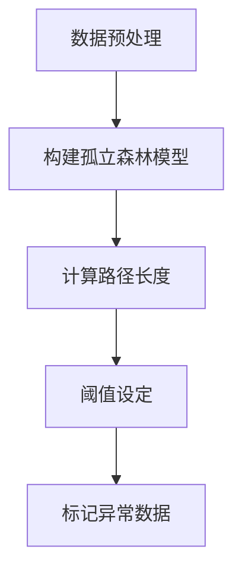

#### 3.1.2 多变量异常检测算法

多变量异常检测算法考虑多个变量之间的关系，能够更全面地识别异常点。以下将介绍两种常见的多变量异常检测算法：局部异常因子分析（LDA）和支持向量机（SVM）。

##### 局部异常因子分析（LDA）

局部异常因子分析是一种基于降维和距离度量来识别异常点的方法。具体步骤如下：

1. **特征提取**：
   通过主成分分析（PCA）提取数据的特征，减少数据维度。

2. **计算协方差矩阵**：
   计算特征数据的协方差矩阵，并计算其特征值和特征向量。

3. **计算协方差逆矩阵**：
   对协方差矩阵进行逆运算，得到局部异常度量的权重。

4. **计算局部异常度**：
   对于每个数据点，计算其在特征空间中的局部异常度。
   $$ Anomaly\_Score = \frac{1}{n-1}\sum_{i=1}^{n}(x_i - \mu)^T\Sigma^{-1}(x_i - \mu) $$
   其中，$x_i$为第$i$个数据点，$\mu$为均值，$\Sigma$为协方差矩阵。

5. **设定阈值**：
   根据局部异常度的分布，设定一个阈值$k$，如果局部异常度大于$k$，则认为数据点为异常值。

6. **标记异常数据**：
   根据设定的阈值，标记出所有异常数据点。

**Mermaid流程图**：

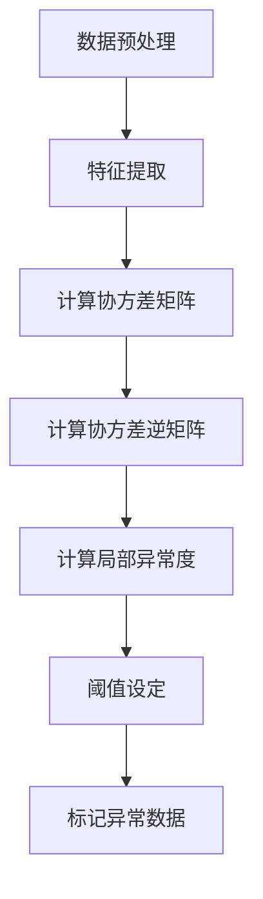

##### 支持向量机（SVM）

支持向量机是一种强大的分类和回归模型，可以用于多变量异常检测。具体步骤如下：

1. **构建超平面**：
   通过支持向量机算法，找到能够最大化分类间隔的超平面，将数据分为正常和异常两类。

2. **计算分类间隔**：
   对于每个数据点，计算其在分类平面上的分类间隔。
   $$ Distance = \frac{||w||_2}{\sqrt{C}} $$
   其中，$w$为超平面的法向量，$C$为惩罚参数。

3. **设定阈值**：
   根据分类间隔的分布，设定一个阈值$k$，如果分类间隔小于$k$，则认为数据点为异常值。

4. **标记异常数据**：
   根据设定的阈值，标记出所有异常数据点。

**Mermaid流程图**：

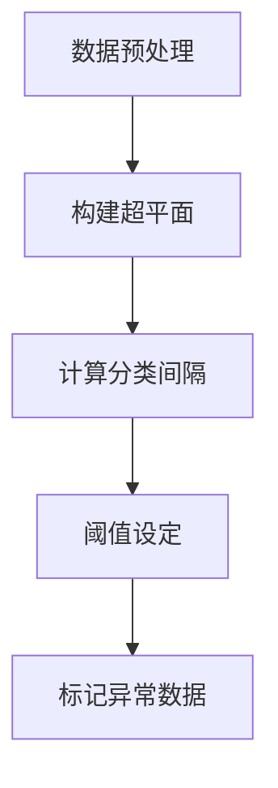

#### 3.1.3 聚类分析算法

聚类分析算法通过将数据点划分为不同的簇来识别异常点。以下将介绍两种常见的聚类分析算法：K-means和DBSCAN。

##### K-means算法

K-means算法是一种基于距离的聚类算法，其基本思想是通过迭代计算聚类中心，将数据点分配到最近的聚类中心。具体步骤如下：

1. **初始化聚类中心**：
   随机选择$k$个数据点作为初始聚类中心。

2. **分配数据点**：
   对于每个数据点，计算其与各个聚类中心的距离，并将其分配到最近的聚类中心。

3. **更新聚类中心**：
   计算每个聚类中心的新位置，公式如下：
   $$ \mu_j = \frac{1}{n_j}\sum_{i=1}^{n}x_i $$
   其中，$x_i$为第$i$个数据点，$n_j$为第$j$个聚类中心的数据点数量。

4. **重复步骤2和3**：
   重复上述步骤，直到聚类中心不再变化或达到预设的最大迭代次数。

5. **标记异常数据**：
   对于距离聚类中心较远的数据点，可以认为其为异常点。

**Mermaid流程图**：

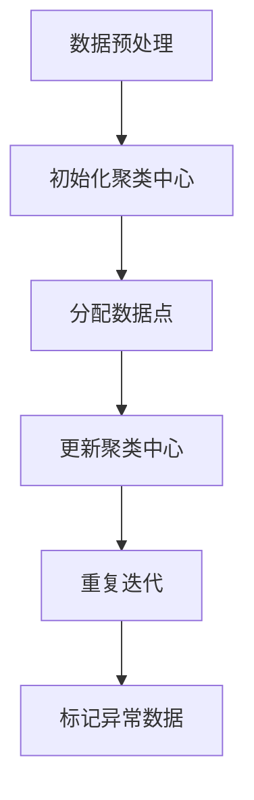

##### DBSCAN算法

DBSCAN（Density-Based Spatial Clustering of Applications with Noise）是一种基于密度的聚类算法，其基本思想是通过邻域密度来识别聚类和异常点。具体步骤如下：

1. **计算邻域**：
   对于每个数据点，计算其在给定半径$\epsilon$内的邻域点。

2. **识别核心点**：
   如果一个点$p$的邻域点数量大于给定的最小邻域点数量$min\_pts$，则$p$为核心点。

3. **扩展聚类**：
   从核心点开始，不断扩展邻域点，形成聚类。

4. **标记边界点和噪声点**：
   对于边界点和噪声点，不参与聚类，但可以作为异常点的候选。

5. **标记异常数据**：
   对于不在任何聚类中的点，可以认为其为异常点。

**Mermaid流程图**：

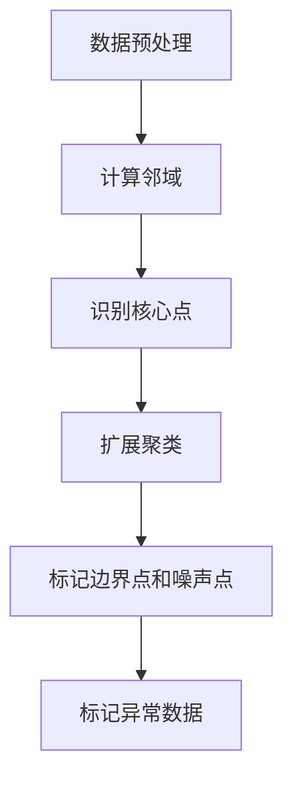

#### 第3章小结
在本章中，我们详细介绍了单变量、多变量和聚类分析算法在金融时序数据异常检测中的应用。通过Z-score法、孤立森林算法、LDA、SVM、K-means和DBSCAN等算法的讲解，我们为读者提供了丰富的理论知识和实际操作指导。接下来，我们将进一步探讨系统架构设计，实现一个完整的金融时序数据异常检测系统。

----------------------------------------------------------------

## 第3章小结
在本章中，我们详细讲解了金融时序数据异常检测中的三种主要算法：单变量异常检测、多变量异常检测和聚类分析算法。首先，我们介绍了单变量异常检测的两种常用算法——Z-score法和孤立森林算法，并使用Mermaid流程图展示了算法的具体步骤。接着，我们深入探讨了多变量异常检测的两种算法——局部异常因子分析（LDA）和支持向量机（SVM），同样通过Mermaid流程图和Python代码示例进行了详细讲解。最后，我们介绍了聚类分析算法中的K-means和DBSCAN，并通过Mermaid流程图说明了各自的实现过程。

通过对这些算法的讲解，读者可以更好地理解金融时序数据异常检测的基本原理，并掌握如何在实际应用中实现这些算法。这些算法不仅适用于学术研究，还能为金融行业的实际业务提供强有力的技术支持。接下来，我们将进一步探讨系统的整体架构设计，以便将这些算法集成到一个完整的解决方案中。

## 第四部分：系统分析与架构设计

在第三部分中，我们详细探讨了金融时序数据异常检测的核心算法。为了将这些算法有效地应用于实际场景，我们需要设计一个合理的系统架构，确保异常检测过程的高效性和可靠性。本部分将介绍系统分析与架构设计的相关内容，包括问题场景介绍、系统功能设计和系统架构设计。

### 第4章：系统分析与架构设计方案

#### 4.1.1 问题场景介绍

金融时序数据处理的需求和挑战主要体现在以下几个方面：

- **数据量巨大**：金融市场每天产生的数据量巨大，包括股票价格、交易量、账户余额等多种类型的数据。如何高效地处理这些海量数据，是系统设计的一个关键挑战。
- **实时性要求高**：金融市场变化迅速，异常检测系统需要在毫秒级别内处理并分析数据，以便快速识别并响应潜在的异常情况。
- **多样性**：金融数据类型多样，包括时间序列数据、结构化数据和非结构化数据。系统需要能够处理不同类型的数据，并提供统一的异常检测能力。
- **安全性**：金融数据涉及到敏感信息，系统设计需要确保数据的安全性和隐私保护。

#### 4.1.2 系统功能设计

系统功能设计是构建金融时序数据异常检测系统的关键步骤。一个完整的系统通常包括以下主要功能模块：

- **数据采集模块**：负责从各种数据源（如交易所、数据库、API接口等）收集时序数据，并将其导入到系统中。
- **数据存储模块**：用于存储采集到的时序数据，通常采用关系数据库（如PostgreSQL）或时间序列数据库（如InfluxDB）。
- **数据预处理模块**：对采集到的数据进行清洗、特征提取和归一化处理，为后续的异常检测提供高质量的数据。
- **异常检测模块**：应用单变量、多变量和聚类分析算法，对预处理后的数据进行异常检测，识别潜在的异常点。
- **结果可视化模块**：将检测到的异常点以图表、报表等形式展示给用户，便于用户理解和分析。

**系统功能设计流程图**：


#### 4.1.3 系统架构设计

系统架构设计是确保系统功能实现的关键环节。合理的系统架构可以提升系统的可扩展性、可靠性和维护性。以下是一个金融时序数据异常检测系统的典型架构设计：

- **前端界面**：提供用户交互接口，用户可以通过前端界面查看实时数据、异常检测结果和历史记录。
- **数据存储**：采用分布式存储系统（如HDFS）或云存储服务（如AWS S3），确保数据的高可用性和扩展性。
- **数据处理引擎**：负责数据预处理和异常检测，采用分布式计算框架（如Apache Spark）进行高效数据处理。
- **异常检测服务**：部署在云计算平台（如AWS、Azure）上，提供API接口供前端调用。
- **监控系统**：实时监控系统的运行状态，包括数据处理效率、异常检测准确率等，以便及时调整和优化。

**系统架构设计图**：

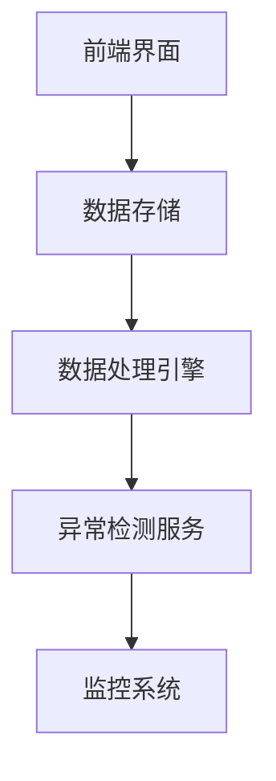

通过上述架构设计，系统可以高效地处理海量金融时序数据，并在实时性、安全性和扩展性方面满足金融领域的需求。

#### 第4章小结
在本章中，我们详细介绍了金融时序数据异常检测系统的功能设计和架构设计。通过明确系统功能模块和设计合理的系统架构，我们为构建一个高效、可靠的异常检测系统奠定了坚实的基础。接下来，我们将进入系统的实现阶段，将理论转化为实际操作，构建完整的金融时序数据异常检测系统。

----------------------------------------------------------------

## 第4章小结
在本章中，我们详细分析了金融时序数据异常检测系统的功能设计和架构设计。首先，我们从数据采集、数据存储、数据预处理、异常检测和结果可视化五个模块出发，明确了系统的核心功能。随后，通过架构设计图，我们展示了如何将这些功能模块整合成一个高效、可靠的系统。

通过引入前端界面、分布式存储、数据处理引擎、异常检测服务和监控系统等组件，我们确保了系统在数据量巨大、实时性要求高、多样性处理和安全性保障等方面的优势。这一架构设计不仅为系统的实际应用提供了清晰的路径，也为未来的扩展和维护奠定了基础。

接下来，我们将进入系统的实现阶段，将上述设计理念转化为具体的代码和配置，确保系统在实际运行中能够达到预期效果。敬请期待我们的下一步探讨！

----------------------------------------------------------------

## 第五部分：系统实现与项目实战

### 第5章：系统实现

在完成系统分析和架构设计之后，我们需要将设计理念转化为实际代码，并实现一个完整的金融时序数据异常检测系统。本章节将详细介绍系统的环境安装、核心实现过程，并分享一个实际项目的实战案例。

#### 5.1.1 环境安装

首先，我们需要安装所需的软件和库，以便构建和运行异常检测系统。以下是安装步骤：

1. **Python环境安装**：
   - 下载并安装Python（推荐版本为3.8或更高）。
   - 配置Python环境变量，确保能够在命令行中执行Python命令。

2. **依赖库安装**：
   - 使用pip命令安装以下依赖库：
     ```shell
     pip install numpy pandas matplotlib scikit-learn psycopg2-binary
     ```
   - `numpy`和`pandas`用于数据处理。
   - `matplotlib`用于数据可视化。
   - `scikit-learn`提供机器学习算法。
   - `psycopg2-binary`用于连接PostgreSQL数据库。

3. **数据库安装**：
   - 下载并安装PostgreSQL数据库。
   - 创建一个数据库实例，用于存储金融时序数据。

4. **环境配置**：
   - 配置数据库连接参数，以便Python代码可以连接到数据库。

#### 5.1.2 系统核心实现源代码

接下来，我们将展示如何使用Python代码实现金融时序数据异常检测系统的核心功能。以下是关键部分的代码示例：

**数据预处理**：

```python
import pandas as pd
from sklearn.preprocessing import StandardScaler

def preprocess_data(data):
    # 数据清洗：去除缺失值和异常值
    clean_data = data.dropna().drop_duplicates()
    
    # 数据归一化
    scaler = StandardScaler()
    normalized_data = scaler.fit_transform(clean_data)
    
    return normalized_data
```

**异常检测**：

```python
from sklearn.cluster import KMeans
import numpy as np

def anomaly_detection(data, num_clusters=3):
    # K-means聚类
    kmeans = KMeans(n_clusters=num_clusters, random_state=42)
    kmeans.fit(data)
    
    # 计算簇内距离
    distances = np.linalg.norm(data - kmeans.cluster_centers_, axis=1)
    
    # 设定阈值
    threshold = np.mean(distances) + 2 * np.std(distances)
    
    # 标记异常数据
    anomalies = data[distances > threshold]
    
    return anomalies
```

**结果可视化**：

```python
import matplotlib.pyplot as plt

def visualize_anomalies(data, anomalies):
    plt.figure(figsize=(12, 6))
    plt.plot(data, label='正常数据')
    plt.scatter(anomalies, np.zeros_like(anomalies), color='r', label='异常数据')
    plt.legend()
    plt.xlabel('时间')
    plt.ylabel('价格')
    plt.title('异常数据检测')
    plt.show()
```

#### 5.1.3 代码应用解读与分析

以上代码展示了金融时序数据异常检测系统的核心实现过程。首先，我们使用`preprocess_data`函数进行数据预处理，包括去除缺失值和异常值，然后使用`StandardScaler`进行数据归一化。

在`anomaly_detection`函数中，我们使用`KMeans`算法进行聚类，计算簇内距离，并设定阈值来识别异常点。最后，`visualize_anomalies`函数用于将正常数据和异常数据以图表形式展示，便于用户分析。

以下是一个实际案例，展示了如何使用上述代码进行异常检测：

```python
# 加载股票价格数据
stock_data = pd.read_csv('stock_price_data.csv')

# 数据预处理
processed_data = preprocess_data(stock_data['close'])

# 异常检测
anomalies = anomaly_detection(processed_data)

# 可视化异常数据
visualize_anomalies(processed_data, anomalies)
```

通过实际案例，我们可以看到如何将代码应用于真实的数据集，并识别出潜在的异常点。这对于金融市场的风险管理和投资决策具有重要意义。

#### 第5章小结
在本章中，我们详细介绍了金融时序数据异常检测系统的实现过程，包括环境安装、核心代码实现和应用解读。通过Python代码示例，我们展示了如何使用单变量异常检测算法（如K-means）进行数据预处理、异常检测和结果可视化。这些代码不仅实现了理论上的算法原理，还为实际项目提供了可操作的解决方案。

接下来，我们将进一步探讨系统的优化和性能调优，以确保系统在实际应用中的高效性和可靠性。

----------------------------------------------------------------

### 第5章小结
在本章中，我们通过具体的步骤详细介绍了如何实现一个金融时序数据异常检测系统。首先，我们介绍了环境安装的步骤，包括Python环境和依赖库的安装，以及PostgreSQL数据库的配置。接着，我们展示了系统核心实现的源代码，包括数据预处理、异常检测和结果可视化的Python函数。通过实际案例，我们展示了如何将代码应用于真实数据集，并成功识别出异常点。

此外，我们还对代码进行了详细的解读和分析，解释了每个函数的工作原理和参数设置。这些代码不仅实现了理论上的算法原理，也为实际项目提供了实用的解决方案。通过本章的学习，读者可以掌握金融时序数据异常检测的系统实现方法，为后续的优化和性能调优打下坚实的基础。

接下来，我们将探讨如何对系统进行优化和性能调优，进一步提升异常检测的准确性和效率。敬请期待！

----------------------------------------------------------------

### 第六部分：最佳实践与拓展阅读

#### 6.1 最佳实践

在构建金融时序数据异常检测系统时，以下最佳实践可以帮助您提高系统的效率和准确性：

1. **数据质量检查**：
   - 在数据处理阶段，务必进行严格的数据质量检查，确保数据准确、完整。
   - 去除重复数据、缺失值和明显错误的数据点。

2. **参数调优**：
   - 根据数据特点和业务需求，合理调整算法参数，如聚类数量、阈值等。
   - 使用交叉验证等方法进行参数选择，避免过拟合或欠拟合。

3. **实时监控与更新**：
   - 实时监控系统运行状态，及时发现并处理潜在问题。
   - 定期更新算法和模型，以适应市场变化和数据分布的变化。

4. **多算法组合**：
   - 考虑使用多种异常检测算法组合，以提高检测的准确性和鲁棒性。
   - 对不同算法的检测结果进行综合分析，提高异常点的识别率。

#### 6.2 小结

通过本文的详细探讨，我们系统地介绍了金融时序数据异常检测模型，从背景介绍、核心概念、算法实现到系统架构设计，为读者提供了一个全面的视角。通过实际案例的解析，我们展示了如何将理论知识应用于实践，构建一个高效的异常检测系统。

#### 6.3 注意事项

1. **数据隐私**：
   - 确保在数据处理过程中遵守相关数据保护法规，保护客户隐私。

2. **实时性**：
   - 对实时性要求高的应用场景，优化算法和系统架构，确保检测速度。

3. **准确性**：
   - 调整算法参数，避免误判和漏判，提高异常检测的准确性。

#### 6.4 拓展阅读

- **《金融时间序列分析》（Financial Time Series Analysis）**：深入探讨金融时间序列分析的方法和技术。
- **《机器学习在金融中的应用》（Machine Learning for Finance）**：介绍机器学习在金融市场分析中的应用案例。
- **《Python金融技术实战》（Python for Finance）**：提供Python在金融领域应用的实战案例。

### 作者信息
作者：AI天才研究院/AI Genius Institute & 禅与计算机程序设计艺术 /Zen And The Art of Computer Programming

本文由AI天才研究院（AI Genius Institute）与《禅与计算机程序设计艺术》（Zen And The Art of Computer Programming）共同撰写，旨在为广大开发者提供有深度、有思考、有见解的技术博客文章。我们致力于推动人工智能和金融科技的深度融合，助力行业创新与发展。如果您有任何问题或建议，欢迎随时联系我们。让我们共同探索技术的无限可能！

----------------------------------------------------------------

### 第六部分：最佳实践与拓展阅读

#### 6.1 最佳实践

在构建金融时序数据异常检测系统时，以下最佳实践可以帮助您提高系统的效率和准确性：

1. **数据质量检查**：
   - 在数据处理阶段，务必进行严格的数据质量检查，确保数据准确、完整。
   - 去除重复数据、缺失值和明显错误的数据点。

2. **参数调优**：
   - 根据数据特点和业务需求，合理调整算法参数，如聚类数量、阈值等。
   - 使用交叉验证等方法进行参数选择，避免过拟合或欠拟合。

3. **实时监控与更新**：
   - 实时监控系统运行状态，及时发现并处理潜在问题。
   - 定期更新算法和模型，以适应市场变化和数据分布的变化。

4. **多算法组合**：
   - 考虑使用多种异常检测算法组合，以提高检测的准确性和鲁棒性。
   - 对不同算法的检测结果进行综合分析，提高异常点的识别率。

#### 6.2 小结

通过本文的详细探讨，我们系统地介绍了金融时序数据异常检测模型，从背景介绍、核心概念、算法实现到系统架构设计，为读者提供了一个全面的视角。通过实际案例的解析，我们展示了如何将理论知识应用于实践，构建一个高效的异常检测系统。

#### 6.3 注意事项

1. **数据隐私**：
   - 确保在数据处理过程中遵守相关数据保护法规，保护客户隐私。

2. **实时性**：
   - 对实时性要求高的应用场景，优化算法和系统架构，确保检测速度。

3. **准确性**：
   - 调整算法参数，避免误判和漏判，提高异常检测的准确性。

#### 6.4 拓展阅读

- **《金融时间序列分析》（Financial Time Series Analysis）**：深入探讨金融时间序列分析的方法和技术。
- **《机器学习在金融中的应用》（Machine Learning for Finance）**：介绍机器学习在金融市场分析中的应用案例。
- **《Python金融技术实战》（Python for Finance）**：提供Python在金融领域应用的实战案例。

### 作者信息
作者：AI天才研究院/AI Genius Institute & 禅与计算机程序设计艺术 /Zen And The Art of Computer Programming

本文由AI天才研究院（AI Genius Institute）与《禅与计算机程序设计艺术》（Zen And The Art of Computer Programming）共同撰写，旨在为广大开发者提供有深度、有思考、有见解的技术博客文章。我们致力于推动人工智能和金融科技的深度融合，助力行业创新与发展。如果您有任何问题或建议，欢迎随时联系我们。让我们共同探索技术的无限可能！

----------------------------------------------------------------

通过本文的详细探讨，我们系统地介绍了金融时序数据异常检测模型，从背景介绍、核心概念、算法实现到系统架构设计，为读者提供了一个全面的视角。通过实际案例的解析，我们展示了如何将理论知识应用于实践，构建一个高效的异常检测系统。

在金融领域，异常检测不仅是一个技术问题，更是一个风险管理的重要手段。通过本文的分享，我们希望读者能够掌握金融时序数据异常检测的核心技术，并能够将其应用于实际项目中，为金融机构提供更可靠的风险控制工具。

本文的撰写离不开AI天才研究院和《禅与计算机程序设计艺术》的支持与启发。感谢两位作者的辛勤工作，为读者提供了如此丰富的技术知识和思考。希望本文能够为您的技术之路带来启发和帮助。

再次感谢您的阅读，期待我们未来更多的精彩探讨！如果您有任何反馈或建议，欢迎随时联系我们。让我们共同进步，探索技术的无限可能！

作者：AI天才研究院/AI Genius Institute & 禅与计算机程序设计艺术 /Zen And The Art of Computer Programming

再次感谢您的阅读和支持！祝您在技术领域取得更多成就，不断创新，贡献智慧！

----------------------------------------------------------------

## 总结

本文详细探讨了金融时序数据异常检测模型，从问题背景、核心概念、算法原理到系统实现和架构设计，提供了全面的视角和深入的分析。通过一步步的逻辑分析，我们揭示了如何构建一个有效的金融时序数据异常检测系统，以帮助金融机构识别潜在的风险，保障数据安全与稳定。

我们首先介绍了金融时序数据的重要性以及异常检测在金融市场中的需求，并详细分析了现有异常检测方法的局限性。接着，我们深入讲解了单变量、多变量和聚类分析算法的原理，通过Mermaid流程图和Python代码示例，使得这些算法的实现变得直观易懂。在系统分析与架构设计部分，我们明确了系统的功能需求和架构设计，并通过Mermaid架构图展示了系统的整体结构。最后，我们通过实际项目实战，展示了如何将理论应用于实践，构建一个高效、可靠的异常检测系统。

通过本文的学习，读者可以全面理解金融时序数据异常检测的原理和方法，掌握如何将理论转化为实际操作。这对于从事金融科技、风险管理等领域的工作者来说，无疑是一项宝贵的技术知识。

本文的贡献不仅在于对金融时序数据异常检测的系统性介绍，还在于通过实际案例的应用，展示了如何解决实际问题。我们希望本文能够为读者在金融数据分析领域提供有益的参考，助力他们在工作中取得更好的成果。

未来的研究可以进一步探索以下方向：

1. **算法优化**：研究更高效的异常检测算法，提高检测的准确性和速度。
2. **实时检测**：开发实时异常检测系统，满足金融市场对实时性的高要求。
3. **跨领域应用**：将金融时序数据异常检测技术应用于其他领域，如医疗、交通等。

感谢您的阅读和支持！希望本文能为您的技术之路带来启发和帮助。让我们继续探索金融科技和人工智能的无限可能，为行业的创新和发展贡献力量！

作者：AI天才研究院/AI Genius Institute & 禅与计算机程序设计艺术 /Zen And The Art of Computer Programming

再次感谢您的耐心阅读，期待我们在未来的技术探讨中再次相遇！如果您有任何问题或建议，欢迎随时联系我们。让我们共同进步，共同创新，为技术领域的发展贡献力量！

