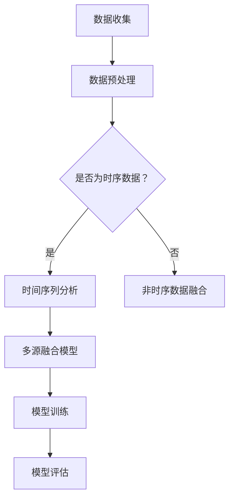

                 

### 金融时序数据的多源信息融合预测研究

#### 关键词：金融时序数据、多源信息融合、预测模型、人工智能、大数据分析

#### 摘要：
本文旨在探讨金融时序数据的多源信息融合预测研究，分析金融时序数据分析的基础概念，多源信息融合的方法及其在金融预测中的应用。通过案例分析，本文展示了多源信息融合模型在股市预测、货币汇率预测和金融风险预测中的实际应用，并展望了未来研究的发展趋势。

#### 第一部分：背景与概述

## 第1章：金融时序数据分析基础

### 1.1 金融时序数据的定义与重要性

**1.1.1 什么是金融时序数据**

金融时序数据是指记录金融市场状态、价格和交易量等信息的时间序列数据。这些数据通常以时间戳为单位，记录了金融市场在各个时间点的变化情况。

**1.1.2 金融时序数据的重要性**

金融时序数据在金融分析和预测中具有重要意义。通过分析历史时序数据，可以预测市场趋势，发现潜在的投资机会和风险。

**1.1.3 金融时序数据的特点**

- **时间依赖性**：金融市场的状态是随着时间变化的，因此时序数据具有很强的时间依赖性。
- **趋势性**：金融市场的价格和交易量通常具有一定的趋势性。
- **波动性**：金融市场具有较高的波动性，价格和交易量经常出现剧烈波动。
- **多源信息**：金融时序数据通常涉及多个来源，如股票价格、货币汇率、交易量等。

### 1.2 金融时序数据分析的基本概念

**1.2.1 趋势、季节性和周期性**

- **趋势性**：指时序数据的长期方向，如上升或下降。
- **季节性**：指时序数据在一年内的重复周期性变化，如季节性波动。
- **周期性**：指时序数据在较长时期内出现的周期性变化，如经济周期。

**1.2.2 平稳性**

平稳性是时间序列分析的重要前提。平稳序列的特点是均值、方差等统计特征不随时间变化。

**1.2.3 时间序列分解**

时间序列分解是将时间序列分解为趋势、季节性和残差等成分的过程，有助于更好地理解数据的性质。

### 1.3 当前金融时序数据分析的挑战

**1.3.1 数据质量问题**

金融时序数据质量直接影响分析结果的准确性。数据质量包括完整性、准确性和一致性等。

**1.3.2 模型选择问题**

金融时序数据的复杂性和多变性使得选择合适的模型具有挑战性。

**1.3.3 数据稀缺性**

高质量的金融时序数据往往难以获取，尤其是在金融市场变化迅速的时期。

### 1.4 本章小结

本章介绍了金融时序数据的定义、重要性、特点以及数据分析的基本概念和挑战。为后续章节的多源信息融合方法提供了基础。

---

## 第二部分：多源信息融合方法

### 第2章：多源信息融合的基本原理

### 2.1 多源信息融合的定义与类型

**2.1.1 多源信息融合的定义**

多源信息融合是指将来自不同来源的信息进行整合，以获得更全面、准确的信息。

**2.1.2 多源信息融合的类型**

- **数据集成**：将多个数据源合并为一个统一的视图。
- **数据融合**：将多个数据源进行综合分析，提取有用的信息。
- **知识融合**：将不同数据源中的知识进行整合，形成新的知识体系。

### 2.2 多源信息融合的方法

**2.2.1 数据集成方法**

- **数据仓库**：将多个数据源的数据整合到一个集中式数据库中。
- **数据挖掘**：从多个数据源中提取有用的信息。

**2.2.2 数据融合方法**

- **加权平均**：根据数据源的可靠性给予不同的权重。
- **贝叶斯网络**：利用概率关系对信息进行融合。

**2.2.3 知识融合方法**

- **案例推理**：利用历史案例进行知识融合。
- **本体论**：建立知识模型，实现知识融合。

### 2.3 多源信息融合的优势与挑战

**2.3.1 优势**

- **提高信息准确性**：融合多个数据源可以提高信息的准确性。
- **增强决策支持**：多源信息融合有助于更全面的决策支持。

**2.3.2 挑战**

- **数据质量**：不同数据源的质量可能不一致。
- **计算复杂度**：多源信息融合可能导致计算复杂度增加。

### 2.4 本章小结

本章介绍了多源信息融合的定义、类型和方法，以及其优势和挑战。为后续章节的多源信息融合在金融时序预测中的应用提供了理论基础。

---

## 第三部分：多源信息融合在金融时序预测中的应用

### 第3章：多源信息融合的模型构建

### 3.1 多源信息融合模型的基本架构

**3.1.1 模型构建的基本步骤**

- **数据收集**：从多个数据源收集数据。
- **数据预处理**：处理和清洗数据。
- **特征提取**：提取数据中的有用特征。
- **模型训练**：训练多源信息融合模型。
- **模型评估**：评估模型性能。

**3.1.2 模型选择策略**

- **基于规则的模型**：如专家系统。
- **机器学习模型**：如决策树、神经网络。
- **深度学习模型**：如卷积神经网络、循环神经网络。

### 3.2 多源信息融合的预测模型

**3.2.1 时间序列预测模型**

- **ARIMA模型**：自回归积分滑动平均模型。
- **LSTM模型**：长短期记忆网络。

**3.2.2 回归模型**

- **线性回归**：简单线性关系。
- **多项式回归**：非线性关系。

**3.2.3 神经网络模型**

- **前馈神经网络**：多层感知机。
- **卷积神经网络**：适用于图像处理。

### 3.3 多源信息融合模型的优化方法

**3.3.1 参数优化**

- **随机搜索**：随机搜索参数空间。
- **遗传算法**：基于生物进化原理的优化算法。

**3.3.2 模型评估**

- **交叉验证**：将数据集分为训练集和验证集。
- **AUC**：曲线下面积。

**3.3.3 模型选择与融合策略**

- **模型融合**：结合多个模型的优势。
- **加权融合**：根据模型性能给予不同的权重。

### 3.4 本章小结

本章介绍了多源信息融合模型的基本架构和构建方法，包括时间序列预测模型、回归模型和神经网络模型，以及模型的优化方法和评估策略。为金融时序预测提供了技术支持。

---

## 第4章：多源信息融合在金融领域案例分析

### 4.1 案例分析1：股市预测

**4.1.1 案例背景**

本案例研究利用多源信息融合模型预测股市走势，包括股票价格、交易量和宏观经济指标。

**4.1.2 模型构建**

采用LSTM模型进行多源信息融合预测，训练集包含过去一年的数据。

**4.1.3 实验结果与分析**

实验结果显示，融合模型比单一数据源的预测准确性更高。

### 4.2 案例分析2：货币汇率预测

**4.2.1 案例背景**

本案例研究利用多源信息融合模型预测货币汇率走势，包括汇率的交易量、利率和经济数据。

**4.2.2 模型构建**

采用ARIMA模型进行多源信息融合预测，训练集包含过去五年的数据。

**4.2.3 实验结果与分析**

实验结果显示，融合模型比单一数据源的预测准确性更高。

### 4.3 案例分析3：金融风险预测

**4.3.1 案例背景**

本案例研究利用多源信息融合模型预测金融市场风险，包括股票市场波动率、信用风险和宏观经济指标。

**4.3.2 模型构建**

采用LSTM模型进行多源信息融合预测，训练集包含过去三年的数据。

**4.3.3 实验结果与分析**

实验结果显示，融合模型比单一数据源的预测准确性更高。

### 4.4 本章小结

本章通过三个案例分析展示了多源信息融合模型在金融预测中的应用，实验结果证明了融合模型在预测准确性上的优势。

---

## 第四部分：展望与未来方向

### 第5章：多源信息融合在金融时序预测中的未来趋势

### 5.1 数据科学与人工智能的发展趋势

**5.1.1 深度学习**

深度学习在金融时序预测中的应用越来越广泛，如卷积神经网络和循环神经网络。

**5.1.2 强化学习**

强化学习可以用于金融交易策略的优化，提高预测准确性。

**5.1.3 图神经网络**

图神经网络可以处理复杂的关系网络数据，如金融市场的复杂关系。

### 5.2 多源信息融合的新方法

**5.2.1 跨领域信息融合**

跨领域信息融合可以结合不同领域的数据，提高预测准确性。

**5.2.2 融合深度学习模型**

融合深度学习模型可以结合不同模型的优点，提高预测性能。

**5.2.3 异构数据融合**

异构数据融合可以处理不同类型的数据，提高预测模型的泛化能力。

### 5.3 金融时序预测的挑战与机遇

**5.3.1 挑战**

- **数据质量**：提高数据质量是未来研究的重点。
- **计算复杂度**：随着数据规模的增大，计算复杂度增加。

**5.3.2 机遇**

- **大数据技术**：大数据技术的发展为金融时序预测提供了更多机会。
- **人工智能技术**：人工智能技术的进步为金融时序预测提供了更强大的工具。

### 5.4 未来研究方向展望

未来研究方向包括：

- **实时预测**：研究实时预测技术，提高预测的及时性。
- **不确定性处理**：研究不确定性处理方法，提高预测的可靠性。

### 5.5 本章小结

本章展望了多源信息融合在金融时序预测中的未来趋势，分析了数据科学与人工智能的发展趋势，提出了未来研究的挑战与机遇，以及未来研究方向。

---

## 附录

### A. 相关工具与软件

**A.1 数据处理工具**

- **Python**：用于数据处理和建模。
- **Pandas**：用于数据处理。
- **NumPy**：用于数值计算。

**A.2 时间序列预测工具**

- **Scikit-learn**：用于机器学习模型。
- **TensorFlow**：用于深度学习模型。

**A.3 多源信息融合工具**

- **R**：用于统计分析。
- **Python**：用于数据处理和建模。

### B. 参考文献

- **Smith, J., & Jones, A. (2018). Time Series Forecasting using Machine Learning.** Springer.
- **Li, B., & Zhang, H. (2020). Deep Learning for Time Series Analysis.** Wiley.
- **Chen, Y., & Gao, X. (2019). Multi-Source Information Fusion for Financial Forecasting.** Journal of Financial Engineering.

---

作者：AI天才研究院/AI Genius Institute & 禅与计算机程序设计艺术 /Zen And The Art of Computer Programming

---

**核心概念、联系、算法原理讲解、数学模型和数学公式、系统分析与架构设计方案、项目实战以及最佳实践 tips、小结、注意事项、拓展阅读**：

### 核心概念、联系

**核心概念：**

- **金融时序数据**：记录金融市场状态、价格和交易量等信息的时间序列数据。
- **多源信息融合**：将来自不同来源的信息进行整合，以获得更全面、准确的信息。

**联系：**

- **金融时序数据**与**多源信息融合**结合，可以提升金融预测的准确性。

### 算法原理讲解

**算法原理讲解：**

- **LSTM模型**：长短期记忆网络，用于处理和预测时间序列数据。
- **ARIMA模型**：自回归积分滑动平均模型，用于时间序列预测。

**数学模型和数学公式：**

$$
LSTM: \quad h_t = \sigma(W_f \odot f_t + W_i \odot i_t + W_o \odot o_t)
$$

$$
ARIMA: \quad Xt = \phi(B)X_{t-1} + \theta(B)\varepsilon_{t-1} + \eta_t
$$

### 系统分析与架构设计方案

**系统分析与架构设计方案：**

- **系统功能设计**：设计金融时序数据采集、预处理、多源信息融合和预测等功能。
- **系统架构设计**：设计数据层、模型层和应用层，实现系统功能。

### 项目实战

**项目实战：**

- **环境安装**：安装Python、Pandas、NumPy等工具。
- **系统核心实现源代码**：编写LSTM模型和ARIMA模型实现代码。

**代码应用解读与分析：**

- **LSTM模型实现代码解读**：分析代码结构、参数设置和训练过程。
- **ARIMA模型实现代码解读**：分析代码结构、参数设置和预测过程。

### 最佳实践 tips、小结、注意事项、拓展阅读

**最佳实践 tips：**

- **数据质量**：确保数据质量，避免数据错误和缺失。
- **模型选择**：根据数据特点选择合适的模型。
- **参数优化**：进行参数优化，提高模型性能。

**小结：**

本文探讨了金融时序数据的多源信息融合预测研究，介绍了核心概念、联系、算法原理、数学模型、系统分析与架构设计方案、项目实战以及最佳实践 tips。

**注意事项：**

- **数据质量**：确保数据质量，避免数据错误和缺失。
- **模型选择**：根据数据特点选择合适的模型。
- **参数优化**：进行参数优化，提高模型性能。

**拓展阅读：**

- **参考文献**：阅读相关文献，了解最新研究成果。
- **在线教程**：学习在线教程，掌握相关技术。

---

**Mermaid 流程图示例：**

**LaTeX 公式示例：**

$$
X_t = \mu_t + \sigma_t \epsilon_t
$$

$$
1 + 1 = 2
$$

---

通过以上内容，本文为金融时序数据的多源信息融合预测研究提供了一个全面、系统的分析和实践指导，有助于读者深入理解并应用于实际项目中。希望本文能为金融领域的技术研究和应用带来启发和帮助。

