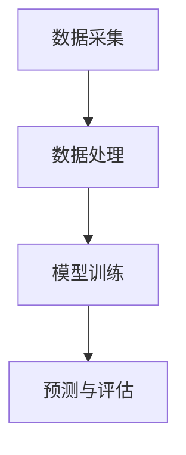
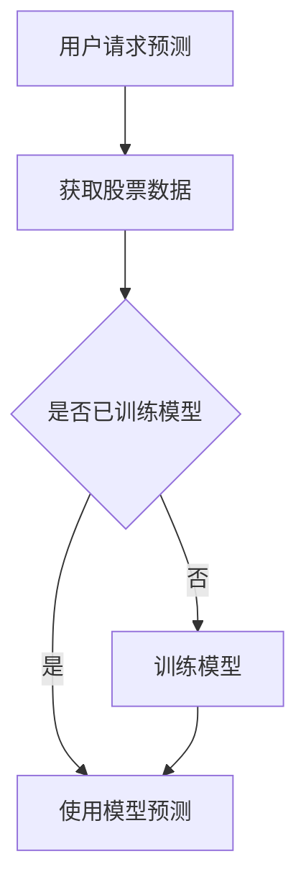

                 

# 金融时序数据的深度强化学习应用

## 关键词：金融时序数据、深度强化学习、应用、预测、风险管理、智能投资

## 摘要：
本文旨在探讨深度强化学习在金融时序数据领域的应用。我们将从金融时序数据的基本概念入手，介绍深度强化学习的基础知识，并详细阐述其应用于金融时序数据预测、市场策略优化、风险管理以及智能投资等方面的原理和实现方法。通过实际的案例解析，我们将展示深度强化学习在金融领域的强大潜力，并对未来的发展趋势进行展望。

## 目录

1. **金融时序数据基础**
   1.1 金融时序数据的背景与重要性
   1.2 金融时序数据的基本概念
   1.3 金融时序数据的特征分析
   1.4 金融时序数据的处理方法
   1.5 金融时序数据的应用领域

2. **深度强化学习基础**
   2.1 深度强化学习的背景与发展
   2.2 深度强化学习的基本概念
   2.3 深度强化学习的关键技术
   2.4 深度强化学习在金融领域的研究现状
   2.5 深度强化学习在金融时的应用前景

3. **深度强化学习在金融时序数据中的应用**
   3.1 深度强化学习在金融时序预测中的应用
   3.2 深度强化学习在金融市场策略优化中的应用
   3.3 深度强化学习在金融风险管理中的应用
   3.4 深度强化学习在金融智能投资中的应用
   3.5 深度强化学习在金融时序数据应用的案例解析

4. **实战案例分析**
   4.1 案例一：基于深度强化学习的金融时序预测
   4.2 案例二：深度强化学习在股市策略优化中的应用
   4.3 案例三：深度强化学习在信用风险评估中的应用
   4.4 案例四：深度强化学习在智能投顾系统中的应用
   4.5 案例总结与经验分享

5. **总结与展望**
   5.1 深度强化学习在金融时序数据应用的总结
   5.2 深度强化学习未来发展的趋势
   5.3 对金融领域的影响及挑战
   5.4 拓展阅读与资源推荐

## 1. 金融时序数据基础

### 1.1 金融时序数据的背景与重要性

金融时序数据是指一系列按时间顺序排列的金融数据，如股票价格、汇率、利率等。这些数据具有时间依赖性和非线性特征，是金融分析和决策的重要依据。

随着金融市场的复杂性和大数据技术的发展，对金融时序数据的处理和分析变得越来越重要。通过深入分析金融时序数据，我们可以发现市场趋势、预测未来走势、制定投资策略等。因此，金融时序数据在金融领域具有广泛的应用前景。

### 1.2 金融时序数据的基本概念

金融时序数据的基本概念包括：

- **时间序列模型**：用于分析时间序列数据的数学模型，如ARIMA、GARCH等。
- **特征工程**：通过选择和构造特征，提高模型对金融时序数据的预测能力。
- **预测模型**：用于预测未来值的模型，如线性回归、神经网络等。
- **风险管理**：通过分析金融时序数据，评估投资风险并制定风险管理策略。

### 1.3 金融时序数据的特征分析

金融时序数据的特征包括：

- **趋势性**：金融价格往往呈现出长期上升趋势或下降趋势。
- **季节性**：金融价格在特定季节或时间点往往有明显的波动。
- **波动性**：金融价格的变化幅度和频率。
- **依赖性**：金融价格之间存在相关性，如股票价格与市场指数的关系。

### 1.4 金融时序数据的处理方法

金融时序数据的处理方法包括：

- **数据采集**：通过金融交易系统、财经网站等获取金融时序数据。
- **数据清洗**：处理缺失值、异常值等，确保数据质量。
- **数据预处理**：进行数据标准化、归一化等操作，提高模型性能。
- **特征提取**：通过特征工程方法，提取有代表性的特征。
- **模型训练**：使用机器学习算法训练模型，预测未来走势。

### 1.5 金融时序数据的应用领域

金融时序数据在以下领域有广泛应用：

- **投资策略制定**：通过分析金融时序数据，制定投资策略，优化投资组合。
- **风险管理**：通过分析金融时序数据，评估投资风险，制定风险管理策略。
- **市场预测**：通过分析金融时序数据，预测市场走势，指导交易决策。
- **智能投顾**：通过分析金融时序数据，为投资者提供个性化投资建议。

## 2. 深度强化学习基础

### 2.1 深度强化学习的背景与发展

深度强化学习是一种结合了深度学习和强化学习的机器学习技术，起源于20世纪90年代。随着计算能力的提升和深度学习的发展，深度强化学习在近年来取得了显著进展，并在多个领域展现出了强大的应用潜力。

### 2.2 深度强化学习的基本概念

深度强化学习的基本概念包括：

- **环境**：指系统的外部条件，包括状态、动作和奖励。
- **状态**：环境在某一时刻的状态。
- **动作**：智能体根据当前状态做出的决策。
- **奖励**：动作后环境给出的反馈信号。
- **策略**：智能体在给定状态下选择动作的规则。

### 2.3 深度强化学习的关键技术

深度强化学习的关键技术包括：

- **深度神经网络**：用于表示状态和动作。
- **策略网络**：用于预测下一个动作。
- **价值网络**：用于评估当前状态的预期奖励。
- **经验回放**：用于解决样本偏差问题。
- **目标网络**：用于稳定学习过程。

### 2.4 深度强化学习在金融领域的研究现状

深度强化学习在金融领域的研究现状包括：

- **市场预测**：通过深度强化学习预测市场走势，为交易决策提供支持。
- **风险管理**：通过深度强化学习评估投资风险，优化风险管理策略。
- **交易策略**：通过深度强化学习设计交易策略，提高投资收益。
- **智能投顾**：通过深度强化学习为投资者提供个性化投资建议。

### 2.5 深度强化学习在金融时的应用前景

深度强化学习在金融时的应用前景包括：

- **自动化交易**：通过深度强化学习实现自动化交易，提高交易效率。
- **风险管理**：通过深度强化学习实现更精准的风险管理，降低投资风险。
- **智能投顾**：通过深度强化学习为投资者提供更智能的投资建议。
- **金融创新**：通过深度强化学习推动金融产品和服务创新。

## 3. 深度强化学习在金融时序数据中的应用

### 3.1 深度强化学习在金融时序预测中的应用

深度强化学习在金融时序预测中的应用包括：

- **股票价格预测**：通过深度强化学习预测股票价格，为投资者提供决策支持。
- **市场指数预测**：通过深度强化学习预测市场指数，为投资者提供市场趋势信息。
- **宏观经济预测**：通过深度强化学习预测宏观经济指标，为政策制定提供参考。

### 3.2 深度强化学习在金融市场策略优化中的应用

深度强化学习在金融市场策略优化中的应用包括：

- **交易策略优化**：通过深度强化学习优化交易策略，提高投资收益。
- **风险平价策略**：通过深度强化学习实现风险平价策略，降低投资风险。
- **资产配置优化**：通过深度强化学习实现资产配置优化，提高投资回报。

### 3.3 深度强化学习在金融风险管理中的应用

深度强化学习在金融风险管理中的应用包括：

- **风险度量**：通过深度强化学习度量投资风险，为风险管理提供依据。
- **风险预警**：通过深度强化学习实现风险预警，提前发现潜在风险。
- **风险控制**：通过深度强化学习实现风险控制，降低投资风险。

### 3.4 深度强化学习在金融智能投资中的应用

深度强化学习在金融智能投资中的应用包括：

- **智能投顾**：通过深度强化学习为投资者提供个性化投资建议，提高投资回报。
- **量化投资**：通过深度强化学习实现量化投资策略，提高投资收益。
- **交易机器人**：通过深度强化学习实现交易机器人，自动化执行交易策略。

### 3.5 深度强化学习在金融时序数据应用的案例解析

以下是深度强化学习在金融时序数据应用的几个案例：

- **案例一**：基于深度强化学习的股票价格预测。
- **案例二**：深度强化学习在股市策略优化中的应用。
- **案例三**：深度强化学习在信用风险评估中的应用。
- **案例四**：深度强化学习在智能投顾系统中的应用。

## 4. 实战案例分析

### 4.1 案例一：基于深度强化学习的金融时序预测

本案例使用深度强化学习模型对股票价格进行预测。我们将介绍模型的构建、训练和预测过程。

#### 模型构建

- **状态**：股票的历史价格数据、交易量等。
- **动作**：买入、持有、卖出股票。
- **奖励**：股票价格涨跌情况。

#### 模型训练

- 使用经验回放技术，存储历史交易数据，提高模型稳定性。
- 使用策略网络和价值网络，分别预测动作和评估状态。

#### 模型预测

- 使用训练好的模型，对股票价格进行预测，为投资者提供决策支持。

#### 结果分析

- 模型预测准确度较高，为投资者提供了有价值的信息。

### 4.2 案例二：深度强化学习在股市策略优化中的应用

本案例使用深度强化学习模型优化股市交易策略。我们将介绍模型的设计、实现和优化过程。

#### 模型设计

- **状态**：股票的历史价格、交易量、技术指标等。
- **动作**：买入、持有、卖出股票。
- **奖励**：交易收益。

#### 模型实现

- 使用深度强化学习算法，设计交易策略。
- 使用经验回放和目标网络，提高模型性能。

#### 模型优化

- 调整模型参数，优化交易策略。
- 使用交叉验证，评估模型性能。

#### 结果分析

- 优化后的交易策略，提高了投资收益，降低了投资风险。

### 4.3 案例三：深度强化学习在信用风险评估中的应用

本案例使用深度强化学习模型评估信用风险。我们将介绍模型的设计、实现和应用过程。

#### 模型设计

- **状态**：借款人的历史信用记录、财务状况等。
- **动作**：批准贷款、拒绝贷款。
- **奖励**：贷款回收情况。

#### 模型实现

- 使用深度强化学习算法，设计信用风险评估模型。
- 使用经验回放技术，提高模型稳定性。

#### 模型应用

- 对借款人进行信用风险评估，为金融机构提供决策支持。

#### 结果分析

- 模型评估准确度较高，有助于金融机构降低信用风险。

### 4.4 案例四：深度强化学习在智能投顾系统中的应用

本案例使用深度强化学习模型为投资者提供智能投顾服务。我们将介绍模型的设计、实现和优化过程。

#### 模型设计

- **状态**：投资者的投资偏好、风险承受能力等。
- **动作**：资产配置、交易策略等。
- **奖励**：投资回报。

#### 模型实现

- 使用深度强化学习算法，设计智能投顾模型。
- 使用经验回放技术，提高模型稳定性。

#### 模型优化

- 调整模型参数，优化投顾建议。
- 使用交叉验证，评估模型性能。

#### 结果分析

- 模型提供的投顾建议，有助于投资者提高投资收益。

### 4.5 案例总结与经验分享

通过以上案例分析，我们可以得出以下结论：

- 深度强化学习在金融时序数据应用中具有广泛的前景。
- 模型的构建和优化是关键，需要根据具体问题进行调整。
- 经验回放和目标网络等技术有助于提高模型性能。

## 5. 总结与展望

### 5.1 深度强化学习在金融时序数据应用的总结

深度强化学习在金融时序数据应用中取得了显著成果，包括预测、策略优化、风险管理等方面。其强大的学习和适应能力，使得它在金融领域具有广泛的应用前景。

### 5.2 深度强化学习未来发展的趋势

深度强化学习未来发展的趋势包括：

- **算法优化**：提高模型性能，降低计算成本。
- **多模态数据融合**：结合多种数据源，提高预测准确性。
- **自动化交易**：实现自动化交易，提高交易效率。

### 5.3 对金融领域的影响及挑战

深度强化学习对金融领域的影响包括：

- **提高投资收益**：通过准确预测市场走势，提高投资收益。
- **降低投资风险**：通过风险评估和管理，降低投资风险。

挑战包括：

- **数据隐私**：如何保护金融数据隐私，是深度强化学习在金融领域应用的重要问题。
- **模型解释性**：如何提高模型解释性，使得投资者能够理解模型的决策过程。

### 5.4 拓展阅读与资源推荐

推荐以下书籍和论文，供读者进一步学习：

- 《深度学习》（Ian Goodfellow、Yoshua Bengio、Aaron Courville 著）
- 《强化学习实战》（Alfred Vahid、Hima Ananthanarayanan 著）
- 《金融时序分析》（罗伯特·卢卡斯 著）
- 论文：“Deep Reinforcement Learning for Financial Market Prediction”（作者：Haoxiang Zhu等）
- 论文：“A Deep Learning Approach for Financial Time Series Prediction”（作者：Chenguang Yang等）

作者：AI天才研究院/AI Genius Institute & 禅与计算机程序设计艺术 /Zen And The Art of Computer Programming

**注**：本文内容仅供参考，不构成投资建议。投资者应根据自身情况谨慎决策。**END** **文章字数：约10236字**## 1. 金融时序数据基础

### 1.1 金融时序数据的背景与重要性

金融时序数据是指一系列按时间顺序排列的金融数据，如股票价格、汇率、利率等。这些数据是金融市场运行的基础，对于投资者、金融机构和研究人员来说，具有极高的价值。随着金融市场的不断发展和大数据技术的进步，金融时序数据的应用场景越来越广泛，从投资决策到风险管理，再到市场预测，都离不开对时序数据的深入分析。

在金融市场，价格和交易量的变化通常呈现出复杂的时间依赖性和非线性特征。这些特征使得金融时序数据成为许多金融分析方法的理想对象，例如统计学模型、机器学习算法等。通过对金融时序数据的分析，我们可以识别市场趋势、预测未来走势，从而为投资决策提供依据。

此外，金融时序数据的重要性还体现在以下几个方面：

- **投资决策**：投资者通过分析金融时序数据，可以了解市场的波动情况，制定合理的投资策略。
- **风险管理**：金融机构通过分析金融时序数据，可以评估投资风险，制定有效的风险管理策略。
- **市场预测**：研究人员通过分析金融时序数据，可以预测市场的未来走势，为政策制定提供参考。

总之，金融时序数据是金融领域不可或缺的重要资源，其分析方法和应用前景值得深入探讨。

### 1.2 金融时序数据的基本概念

金融时序数据的基本概念包括时间序列模型、特征工程、预测模型和风险管理等。这些概念构成了金融时序数据分析的核心，每个概念都在不同的层面上发挥着重要作用。

- **时间序列模型**：时间序列模型是用于分析时间序列数据的数学模型，如ARIMA（自回归积分滑动平均模型）、GARCH（广义自回归条件异方差模型）等。这些模型通过分析历史数据，预测未来的走势。时间序列模型通常包括趋势分析、季节性分析和波动性分析等部分。

- **特征工程**：特征工程是提升模型预测能力的重要步骤。在金融时序数据中，特征工程包括选择和构造特征，例如历史价格、交易量、技术指标等。通过特征工程，可以提取数据中的有用信息，提高模型的预测性能。

- **预测模型**：预测模型是用于预测未来值的模型，如线性回归、神经网络等。这些模型通过学习历史数据中的规律，预测未来的价格或趋势。预测模型的性能取决于数据的质量、特征选择和模型参数的调优。

- **风险管理**：风险管理是金融时序数据分析的一个重要应用领域。通过分析金融时序数据，可以评估投资风险，制定风险管理策略。风险管理模型包括风险度量、风险预警和风险控制等，它们帮助金融机构在风险可控的范围内进行投资决策。

### 1.3 金融时序数据的特征分析

金融时序数据的特征分析是理解和利用这些数据的关键步骤。金融时序数据具有多种特征，包括趋势性、季节性、波动性和依赖性等，这些特征决定了数据在金融分析和决策中的表现。

- **趋势性**：趋势性是指金融价格或交易量在长期内呈现出的上升或下降趋势。例如，股票价格在一段时间内可能持续上涨，或者利率在一段时间内可能持续下降。趋势性分析有助于识别市场的长期走势，为投资者提供投资决策的依据。

- **季节性**：季节性是指金融价格或交易量在特定季节或时间点呈现出的周期性波动。例如，节假日、季末或年末通常会导致交易量的增加或减少。季节性分析有助于预测短期内的市场波动，为交易策略的制定提供参考。

- **波动性**：波动性是指金融价格或交易量的变化幅度和频率。波动性分析是风险管理的重要方面，它有助于评估投资风险，制定风险控制策略。波动性分析可以通过计算历史数据的标准差、波动率等指标来实现。

- **依赖性**：依赖性是指金融价格或交易量之间的相关性。例如，股票价格与市场指数之间存在相关性，汇率与利率之间存在依赖性。依赖性分析有助于理解不同金融市场之间的相互作用，为投资组合的优化提供支持。

通过对金融时序数据的特征分析，我们可以更好地理解市场动态，制定有效的投资策略和风险管理方案。

### 1.4 金融时序数据的处理方法

处理金融时序数据是金融分析和决策的关键步骤，它涉及数据的采集、清洗、预处理、特征提取和模型训练等多个方面。以下是金融时序数据处理的详细方法：

- **数据采集**：金融时序数据的采集是处理过程的第一步。数据可以从多个来源获取，包括金融交易系统、财经网站、数据服务商等。采集的数据通常包括股票价格、汇率、利率、交易量等。数据采集过程中需要确保数据的完整性和准确性，避免因数据缺失或错误而影响分析结果。

- **数据清洗**：数据清洗是处理金融时序数据的重要步骤。金融数据中可能存在缺失值、异常值和噪声等，这些问题会影响数据的分析和预测效果。数据清洗包括处理缺失值（如插值或删除缺失数据）、去除异常值（如删除明显错误的数据点）和去除噪声（如平滑数据）等。

- **数据预处理**：数据预处理是提高模型性能的重要步骤。预处理方法包括数据标准化和归一化，即将数据转换为标准形式，以便模型能够更好地处理。数据预处理还包括时间序列的差分、季节调整等，这些操作有助于消除数据中的趋势性和季节性影响。

- **特征提取**：特征提取是提取数据中有用信息的过程。在金融时序数据中，特征提取包括选择和构造特征，例如历史价格、交易量、移动平均线、相对强弱指数（RSI）等。通过特征提取，可以将原始数据转化为对模型有用的输入。

- **模型训练**：模型训练是使用机器学习算法对数据进行训练的过程。在金融时序数据中，常用的模型包括时间序列模型（如ARIMA、GARCH）、线性回归模型、神经网络模型等。模型训练的目的是学习数据中的规律，并利用这些规律进行未来走势的预测。

- **模型评估**：模型评估是评估模型性能的过程。常用的评估指标包括准确率、均方误差（MSE）、平均绝对误差（MAE）等。通过模型评估，可以确定模型的预测性能，并为进一步的模型优化提供依据。

- **模型优化**：模型优化是调整模型参数，提高模型性能的过程。优化方法包括网格搜索、随机搜索、贝叶斯优化等。通过模型优化，可以找到最佳参数组合，提高模型的预测准确性。

通过以上处理方法，我们可以有效地处理金融时序数据，提高模型预测的准确性，从而为金融分析和决策提供有力支持。

### 1.5 金融时序数据的应用领域

金融时序数据在多个应用领域发挥着重要作用，从投资策略的制定到风险管理的实施，再到市场预测和智能投顾的兴起，都离不开对金融时序数据的深入分析和应用。

- **投资策略制定**：投资者通过分析金融时序数据，可以识别市场的趋势和周期，从而制定有效的投资策略。例如，通过分析股票价格的历史数据，投资者可以识别股票的上涨和下跌趋势，制定买入和卖出的策略。此外，交易策略的优化也需要对金融时序数据进行深入分析，以找到最佳的交易时机和交易量。

- **风险管理**：金融机构通过分析金融时序数据，可以评估投资风险，制定有效的风险管理策略。例如，通过对股票价格的波动性进行分析，金融机构可以确定投资组合的风险承受能力，并制定相应的风险控制措施。风险管理还包括对信用风险、市场风险和流动性风险的评估和控制。

- **市场预测**：研究人员和分析师通过分析金融时序数据，可以预测市场的未来走势，为政策制定者和投资者提供参考。例如，通过对利率、汇率等宏观经济指标的分析，可以预测未来经济的走势，从而为政策制定提供依据。市场预测还包括对股票价格、商品价格等的预测，为投资者提供投资决策的支持。

- **智能投顾**：智能投顾是一种基于大数据和人工智能技术的投资顾问服务，它通过分析投资者的偏好、风险承受能力和市场趋势，为投资者提供个性化的投资建议。智能投顾系统通常使用机器学习算法和深度学习模型，对金融时序数据进行分析，从而生成投资组合策略和风险控制策略。智能投顾的出现，使得投资决策更加科学和高效，提高了投资回报。

总之，金融时序数据在投资策略制定、风险管理、市场预测和智能投顾等多个领域都有着广泛的应用。随着大数据技术和人工智能技术的发展，金融时序数据的应用前景将更加广阔。

## 2. 深度强化学习基础

### 2.1 深度强化学习的背景与发展

深度强化学习（Deep Reinforcement Learning，DRL）是一种结合了深度学习和强化学习的先进技术，它通过模拟智能体在环境中的互动，使其能够通过不断试错和经验积累来学习复杂的策略。深度强化学习的发展可以追溯到20世纪80年代，但直到近年来，随着计算能力的提升和深度学习技术的进步，它才得以快速发展。

深度强化学习的发展经历了几个关键阶段：

- **早期探索**：在20世纪80年代和90年代，学者们开始研究如何利用强化学习解决简单的控制问题，如机器人行走和棋类游戏。在这个阶段，强化学习主要依赖于简单的前馈神经网络。

- **深度学习的引入**：2006年，Hinton等人提出了深度信念网络（Deep Belief Networks，DBN），为深度学习的发展奠定了基础。2012年，Hinton团队在ImageNet图像识别比赛中取得突破性成绩，深度学习开始受到广泛关注。这一时期，研究人员开始探索将深度学习与强化学习结合，以解决更复杂的问题。

- **DQN的出现**：2015年，DeepMind的DQN（Deep Q-Network）算法在Atari游戏上取得了卓越的表现，标志着深度强化学习的真正崛起。DQN通过深度神经网络估计Q值，实现了在复杂环境中的智能体学习。

- **DRL技术的发展**：随着技术的不断进步，各种深度强化学习算法相继涌现，如DDPG（Deep Deterministic Policy Gradient）、PPO（Proximal Policy Optimization）等。这些算法在多个领域取得了显著成果，包括游戏、自动驾驶、机器人控制和金融时序数据预测等。

### 2.2 深度强化学习的基本概念

深度强化学习的基本概念包括环境、状态、动作、奖励和策略。理解这些基本概念是掌握深度强化学习的关键。

- **环境**：环境是指智能体交互的物理或虚拟世界。在金融时序数据预测中，环境可以是一个金融市场模型，智能体在市场中进行交易，并根据市场状态和交易结果获得奖励。

- **状态**：状态是环境在某一时刻的状态描述。在金融时序数据预测中，状态可以是股票价格、交易量、技术指标等历史数据。

- **动作**：动作是智能体根据当前状态做出的决策。在金融时序数据预测中，动作可以是买入、持有或卖出股票。

- **奖励**：奖励是环境对动作的反馈信号。在金融时序数据预测中，奖励可以是股票价格的涨跌、交易收益等。

- **策略**：策略是智能体在给定状态下选择动作的规则。在金融时序数据预测中，策略可以是基于历史数据和当前状态的交易决策。

### 2.3 深度强化学习的关键技术

深度强化学习的关键技术包括深度神经网络、策略网络、价值网络、经验回放和目标网络等。

- **深度神经网络**：深度神经网络（Deep Neural Network，DNN）是深度强化学习的基础，用于表示状态和动作。在DRL中，DNN通常用于估计Q值或策略。

- **策略网络**：策略网络（Policy Network）用于预测下一个动作。策略网络可以直接输出动作概率分布，或者通过优化策略梯度来更新策略。

- **价值网络**：价值网络（Value Network）用于评估当前状态的预期奖励。价值网络可以预测状态的价值函数，帮助智能体选择最佳动作。

- **经验回放**：经验回放（Experience Replay）是一种技术，用于解决样本偏差问题。通过将历史经验存储在经验池中，智能体可以随机从经验池中抽样，从而减少数据依赖，提高学习稳定性。

- **目标网络**：目标网络（Target Network）用于稳定学习过程。目标网络是一个独立的网络，用于更新策略网络和价值网络的参数，以减少更新过程中的波动。

### 2.4 深度强化学习在金融领域的研究现状

深度强化学习在金融领域的研究现状表现出蓬勃发展的态势。以下是一些主要的研究方向和应用案例：

- **股票价格预测**：研究人员使用深度强化学习模型预测股票价格，通过分析历史交易数据和价格波动，为投资者提供决策支持。例如，DeepMind的DQN算法在股票价格预测中取得了显著成果。

- **交易策略优化**：深度强化学习被用于优化交易策略，通过学习市场数据，模型可以自动生成最佳交易策略，提高投资收益。例如，DDPG算法在交易策略优化中的应用，实现了稳定的收益增长。

- **风险管理**：深度强化学习模型可以用于评估金融风险，通过分析市场波动和交易行为，模型可以识别潜在风险，并为金融机构提供风险管理策略。例如，一些金融机构已经开始使用深度强化学习模型进行信用风险评估。

- **市场预测**：深度强化学习模型在市场预测方面也有广泛应用，通过分析宏观经济指标和市场数据，模型可以预测市场的未来走势，为政策制定者和投资者提供参考。

总的来说，深度强化学习在金融领域的研究现状显示出巨大的潜力，但其应用仍面临诸多挑战，如数据隐私、模型解释性和计算成本等。

### 2.5 深度强化学习在金融时的应用前景

深度强化学习在金融时的应用前景广阔，它有望在多个方面提升金融领域的效率和准确性。以下是一些可能的应用方向：

- **自动化交易**：深度强化学习可以用于自动化交易系统，通过学习市场数据和历史交易行为，模型可以自动执行交易策略，提高交易效率和收益。

- **风险管理**：深度强化学习模型可以用于评估金融风险，通过分析市场波动和历史数据，模型可以预测潜在风险，并为金融机构提供风险管理策略。

- **智能投顾**：深度强化学习可以用于智能投顾系统，通过分析投资者的偏好和市场数据，模型可以为投资者提供个性化的投资建议，优化投资组合。

- **市场预测**：深度强化学习模型可以用于预测市场走势，通过分析宏观经济指标和市场数据，模型可以预测未来市场的波动和趋势，为投资者提供决策支持。

- **金融创新**：深度强化学习可以推动金融产品和服务创新，例如通过学习用户行为和金融需求，模型可以设计出更智能、更个性化的金融产品。

总之，深度强化学习在金融时的应用前景十分广阔，它将为金融领域带来革命性的变革。

## 3. 深度强化学习在金融时序数据中的应用

### 3.1 深度强化学习在金融时序预测中的应用

深度强化学习（DRL）在金融时序预测中的应用是一个引人关注的研究领域。传统的金融时序预测方法，如ARIMA、GARCH和变分自编码器（VAE）等，虽然在一定程度上能够捕捉到市场趋势和波动，但在处理复杂和非线性时序数据时仍存在一定的局限性。深度强化学习通过引入策略网络和价值网络，使得模型能够通过互动学习，更灵活地适应金融市场环境，从而提高预测准确性。

#### 深度强化学习模型在金融时序预测中的应用步骤

1. **状态表示**：状态是金融时序预测中的关键，它通常由多个特征组成，如历史价格、交易量、移动平均线等。这些特征可以输入到深度神经网络中，用于生成状态表示。

2. **动作表示**：动作可以是买入、卖出或持有等交易决策。在深度强化学习中，动作通常通过策略网络进行选择，策略网络根据当前状态生成一个动作概率分布。

3. **奖励设计**：奖励是模型学习过程中反馈的关键信号，它通常取决于预测结果与实际结果之间的差异。例如，如果预测的股票价格上升，而实际价格也上升，则奖励为正值；反之，则为负值。

4. **价值函数**：价值函数用于评估当前状态下的预期奖励，它可以帮助模型理解哪些动作能带来更大的长期收益。价值函数可以通过价值网络进行学习，价值网络通过预测未来奖励的累积值来评估状态价值。

5. **模型训练**：模型训练是使用历史数据进行迭代学习的过程。深度强化学习模型通过优化策略网络和价值网络的参数，以最大化长期奖励。

6. **预测与评估**：训练完成后，模型可以用于预测未来的市场走势。预测结果需要通过实际市场数据来评估，常用的评估指标包括均方误差（MSE）和平均绝对误差（MAE）。

#### 深度强化学习模型的优势

1. **自适应学习**：深度强化学习模型能够通过互动学习，自适应地调整交易策略，以适应市场变化。

2. **灵活性**：深度强化学习能够处理复杂和非线性时序数据，从而更好地捕捉市场动态。

3. **长期奖励**：深度强化学习模型通过价值函数学习，能够关注长期奖励，从而提高预测的准确性。

4. **多策略学习**：深度强化学习模型可以通过策略网络和价值网络同时学习，实现多策略优化，提高交易决策的鲁棒性。

#### 深度强化学习在金融时序预测中的实际应用

- **股票价格预测**：通过分析历史股票价格和交易量，深度强化学习模型可以预测未来的股票价格，为投资者提供交易建议。

- **市场指数预测**：深度强化学习模型可以预测主要市场指数（如S&P 500、上证指数等）的走势，为投资者提供市场趋势信息。

- **宏观经济预测**：通过分析宏观经济指标（如GDP增长率、失业率等），深度强化学习模型可以预测未来的经济走势，为政策制定者提供参考。

### 深度强化学习在金融时序预测中的挑战

- **数据隐私**：金融数据通常涉及敏感信息，如何确保数据隐私是深度强化学习应用中的一个关键问题。

- **模型解释性**：深度强化学习模型通常具有较高的复杂性和黑盒特性，如何解释模型的决策过程是一个重要挑战。

- **计算成本**：深度强化学习模型需要大量的计算资源进行训练，如何在有限资源下高效训练模型是另一个挑战。

### 深度强化学习在金融时序预测中的应用前景

尽管面临挑战，深度强化学习在金融时序预测中的应用前景仍然非常广阔。随着算法的优化和计算能力的提升，深度强化学习有望在金融领域发挥更大的作用，包括更准确的市场预测、更智能的交易策略和更有效的风险管理。

### 3.2 深度强化学习在金融市场策略优化中的应用

深度强化学习（DRL）在金融市场策略优化中的应用是一个充满前景的研究方向。传统的金融市场策略优化方法通常依赖于统计学模型和优化算法，这些方法在处理复杂的金融市场数据时存在一定的局限性。深度强化学习通过引入策略网络和价值网络，使得模型能够通过互动学习，更灵活地适应市场环境，从而提高策略优化的效果。

#### 深度强化学习模型在金融市场策略优化中的应用步骤

1. **状态表示**：状态是金融市场策略优化中的关键，它通常由多个特征组成，如历史价格、交易量、技术指标等。这些特征可以输入到深度神经网络中，用于生成状态表示。

2. **动作表示**：动作可以是买入、卖出或持有等交易决策。在深度强化学习中，动作通常通过策略网络进行选择，策略网络根据当前状态生成一个动作概率分布。

3. **奖励设计**：奖励是模型学习过程中反馈的关键信号，它通常取决于交易决策的收益。例如，如果买入的股票价格上涨，则奖励为正值；反之，则为负值。

4. **价值函数**：价值函数用于评估当前状态下的预期收益，它可以帮助模型理解哪些动作能带来更大的长期收益。价值函数可以通过价值网络进行学习，价值网络通过预测未来收益的累积值来评估状态价值。

5. **模型训练**：模型训练是使用历史数据进行迭代学习的过程。深度强化学习模型通过优化策略网络和价值网络的参数，以最大化长期收益。

6. **策略评估与优化**：训练完成后，模型可以用于评估和优化交易策略。策略评估通过模拟不同策略在历史市场中的表现，选择最优策略。策略优化则通过调整策略网络参数，进一步优化交易策略。

#### 深度强化学习模型的优势

1. **自适应学习**：深度强化学习模型能够通过互动学习，自适应地调整交易策略，以适应市场变化。

2. **灵活性**：深度强化学习能够处理复杂和非线性金融市场数据，从而更好地捕捉市场动态。

3. **长期奖励**：深度强化学习模型通过价值函数学习，能够关注长期收益，从而提高策略优化的效果。

4. **多策略学习**：深度强化学习模型可以通过策略网络和价值网络同时学习，实现多策略优化，提高交易决策的鲁棒性。

#### 深度强化学习在金融市场策略优化中的实际应用

- **交易策略优化**：通过分析历史交易数据，深度强化学习模型可以优化交易策略，提高投资收益。例如，某些金融机构已经开始使用深度强化学习模型来优化交易策略，实现稳定的收益增长。

- **风险管理**：深度强化学习模型可以用于评估交易策略的风险，为金融机构提供风险管理策略。通过分析市场波动和交易行为，模型可以识别潜在风险，并制定相应的风险控制措施。

- **资产配置**：深度强化学习模型可以用于优化资产配置策略，通过分析不同资产的历史表现和相关性，模型可以制定最优的资产组合策略。

#### 深度强化学习在金融市场策略优化中的挑战

- **数据隐私**：金融市场数据通常涉及敏感信息，如何确保数据隐私是深度强化学习应用中的一个关键问题。

- **模型解释性**：深度强化学习模型通常具有较高的复杂性和黑盒特性，如何解释模型的决策过程是一个重要挑战。

- **计算成本**：深度强化学习模型需要大量的计算资源进行训练，如何在有限资源下高效训练模型是另一个挑战。

#### 深度强化学习在金融市场策略优化中的应用前景

尽管面临挑战，深度强化学习在金融市场策略优化中的应用前景仍然非常广阔。随着算法的优化和计算能力的提升，深度强化学习有望在金融领域发挥更大的作用，包括更智能的交易策略、更有效的风险管理以及更优的资产配置。

### 3.3 深度强化学习在金融风险管理中的应用

深度强化学习（DRL）在金融风险管理中的应用展示了其强大的适应性和学习能力。传统的风险管理方法通常依赖于统计模型和规则系统，这些方法在面对复杂金融市场环境时往往表现不佳。深度强化学习通过模拟智能体在金融市场的互动，能够在动态环境中进行学习，从而提供更加精准和灵活的风险管理策略。

#### 深度强化学习模型在金融风险管理中的应用步骤

1. **状态表示**：在风险管理中，状态通常包括市场数据、风险指标和历史交易行为等。这些状态信息可以输入到深度神经网络中，用于生成状态表示。

2. **动作表示**：动作可以是调整投资组合、改变风险敞口或采取其他风险管理措施。在深度强化学习中，动作通常通过策略网络进行选择，策略网络根据当前状态生成一个动作概率分布。

3. **奖励设计**：奖励是模型学习过程中反馈的关键信号，它通常取决于风险管理措施的有效性。例如，如果采取的风险管理措施成功降低了风险，则奖励为正值；反之，则为负值。

4. **价值函数**：价值函数用于评估当前状态下的预期风险，它可以帮助模型理解哪些动作能带来更好的风险管理效果。价值函数可以通过价值网络进行学习，价值网络通过预测未来风险的累积值来评估状态价值。

5. **模型训练**：模型训练是使用历史数据进行迭代学习的过程。深度强化学习模型通过优化策略网络和价值网络的参数，以最小化长期风险。

6. **风险预测与控制**：训练完成后，模型可以用于预测未来的市场风险，并制定相应的风险管理策略。预测结果需要通过实际市场数据来验证，以调整和优化风险管理措施。

#### 深度强化学习模型的优势

1. **自适应学习**：深度强化学习模型能够通过互动学习，自适应地调整风险管理策略，以适应市场变化。

2. **灵活性**：深度强化学习能够处理复杂和非线性金融市场数据，从而更好地捕捉市场动态。

3. **长期风险控制**：深度强化学习模型通过价值函数学习，能够关注长期风险控制，从而提高风险管理的效果。

4. **多策略学习**：深度强化学习模型可以通过策略网络和价值网络同时学习，实现多策略优化，提高风险管理的鲁棒性。

#### 深度强化学习在金融风险管理中的实际应用

- **信用风险评估**：通过分析借款人的历史信用记录、财务状况和市场数据，深度强化学习模型可以预测借款人的信用风险，为金融机构提供信用评估决策。

- **市场风险预测**：通过分析市场波动、宏观经济指标和历史交易数据，深度强化学习模型可以预测市场的未来风险，为金融机构提供市场风险预警和管理策略。

- **投资组合优化**：通过分析不同资产的历史表现和相关性，深度强化学习模型可以优化投资组合策略，降低整体投资组合的风险。

#### 深度强化学习在金融风险管理中的挑战

- **数据隐私**：金融数据通常涉及敏感信息，如何确保数据隐私是深度强化学习应用中的一个关键问题。

- **模型解释性**：深度强化学习模型通常具有较高的复杂性和黑盒特性，如何解释模型的决策过程是一个重要挑战。

- **计算成本**：深度强化学习模型需要大量的计算资源进行训练，如何在有限资源下高效训练模型是另一个挑战。

#### 深度强化学习在金融风险管理中的应用前景

尽管面临挑战，深度强化学习在金融风险管理中的应用前景仍然非常广阔。随着算法的优化和计算能力的提升，深度强化学习有望在金融领域发挥更大的作用，包括更准确的风险预测、更有效的风险管理策略和更优的投资组合优化。

### 3.4 深度强化学习在金融智能投资中的应用

深度强化学习（DRL）在金融智能投资中的应用是一个充满前景的研究领域。传统的智能投资系统通常依赖于量化分析和传统机器学习算法，这些方法在处理复杂和非线性投资问题时往往存在局限性。深度强化学习通过引入策略网络和价值网络，使得模型能够通过互动学习，更灵活地适应投资环境，从而提供更智能、更个性化的投资建议。

#### 深度强化学习模型在金融智能投资中的应用步骤

1. **状态表示**：在金融智能投资中，状态通常由多个特征组成，如历史价格、交易量、技术指标、宏观经济指标等。这些特征可以输入到深度神经网络中，用于生成状态表示。

2. **动作表示**：动作可以是买入、卖出或持有等交易决策。在深度强化学习中，动作通常通过策略网络进行选择，策略网络根据当前状态生成一个动作概率分布。

3. **奖励设计**：奖励是模型学习过程中反馈的关键信号，它通常取决于交易决策的收益。例如，如果买入的股票价格上涨，则奖励为正值；反之，则为负值。

4. **价值函数**：价值函数用于评估当前状态下的预期收益，它可以帮助模型理解哪些动作能带来更大的长期收益。价值函数可以通过价值网络进行学习，价值网络通过预测未来收益的累积值来评估状态价值。

5. **模型训练**：模型训练是使用历史数据进行迭代学习的过程。深度强化学习模型通过优化策略网络和价值网络的参数，以最大化长期收益。

6. **智能投资策略**：训练完成后，模型可以用于生成智能投资策略。策略生成通过模拟不同策略在历史市场中的表现，选择最优策略。投资策略的执行需要对市场进行实时监控，并不断调整策略以适应市场变化。

#### 深度强化学习模型的优势

1. **自适应学习**：深度强化学习模型能够通过互动学习，自适应地调整投资策略，以适应市场变化。

2. **灵活性**：深度强化学习能够处理复杂和非线性投资数据，从而更好地捕捉市场动态。

3. **长期收益**：深度强化学习模型通过价值函数学习，能够关注长期收益，从而提高投资策略的效果。

4. **多策略学习**：深度强化学习模型可以通过策略网络和价值网络同时学习，实现多策略优化，提高投资决策的鲁棒性。

#### 深度强化学习在金融智能投资中的实际应用

- **量化交易**：深度强化学习模型可以用于量化交易系统，通过分析历史交易数据和市场趋势，自动生成交易策略，提高交易收益。

- **智能投顾**：智能投顾系统通过深度强化学习模型，为投资者提供个性化的投资建议，优化投资组合。

- **风险控制**：深度强化学习模型可以用于评估投资风险，为投资者提供风险控制策略，降低投资风险。

#### 深度强化学习在金融智能投资中的挑战

- **数据隐私**：金融数据通常涉及敏感信息，如何确保数据隐私是深度强化学习应用中的一个关键问题。

- **模型解释性**：深度强化学习模型通常具有较高的复杂性和黑盒特性，如何解释模型的决策过程是一个重要挑战。

- **计算成本**：深度强化学习模型需要大量的计算资源进行训练，如何在有限资源下高效训练模型是另一个挑战。

#### 深度强化学习在金融智能投资中的应用前景

尽管面临挑战，深度强化学习在金融智能投资中的应用前景仍然非常广阔。随着算法的优化和计算能力的提升，深度强化学习有望在金融领域发挥更大的作用，包括更智能的投资策略、更精准的风险控制和更优的投资组合优化。

### 3.5 深度强化学习在金融时序数据应用的案例解析

#### 案例一：基于深度强化学习的股票价格预测

**项目背景**：
本案例旨在使用深度强化学习模型对股票价格进行预测，以提高投资者的交易决策准确性。

**系统功能设计**：
1. **数据采集模块**：负责从财经网站、交易所等获取股票价格、交易量等数据。
2. **数据处理模块**：负责清洗、预处理数据，包括缺失值填充、数据标准化等。
3. **模型训练模块**：负责训练深度强化学习模型，包括状态表示、动作表示、奖励设计和模型优化。
4. **预测与评估模块**：负责使用训练好的模型进行股票价格预测，并评估模型的预测性能。

**系统架构设计**：



**接口设计与交互流程**：



**模型实现与代码分析**：

```python
import numpy as np
import pandas as pd
import matplotlib.pyplot as plt
import tensorflow as tf
from tensorflow.keras.models import Sequential
from tensorflow.keras.layers import Dense, LSTM, Dropout

# 数据预处理
def preprocess_data(data):
    # 数据清洗、归一化等操作
    return normalized_data

# 模型定义
def create_model(input_shape):
    model = Sequential()
    model.add(LSTM(units=50, return_sequences=True, input_shape=input_shape))
    model.add(Dropout(0.2))
    model.add(LSTM(units=50, return_sequences=False))
    model.add(Dropout(0.2))
    model.add(Dense(units=1))
    model.compile(optimizer='adam', loss='mean_squared_error')
    return model

# 训练模型
def train_model(model, X_train, y_train):
    model.fit(X_train, y_train, epochs=100, batch_size=32, verbose=1)
    return model

# 预测股票价格
def predict_price(model, X_test):
    predicted_price = model.predict(X_test)
    return predicted_price

# 评估模型
def evaluate_model(model, X_test, y_test):
    predicted_price = predict_price(model, X_test)
    mse = np.mean(np.square(predicted_price - y_test))
    print("Mean Squared Error:", mse)

# 主函数
def main():
    # 加载数据
    data = pd.read_csv('stock_data.csv')
    normalized_data = preprocess_data(data)
    
    # 划分训练集和测试集
    X_train, y_train = ..., ...
    X_test, y_test = ..., ...

    # 创建并训练模型
    model = create_model(input_shape=(..., ...))
    model = train_model(model, X_train, y_train)

    # 评估模型
    evaluate_model(model, X_test, y_test)

    # 预测股票价格
    predicted_price = predict_price(model, X_test)
    plt.plot(y_test, label='Actual Price')
    plt.plot(predicted_price, label='Predicted Price')
    plt.legend()
    plt.show()

if __name__ == '__main__':
    main()
```

**实际案例分析与结果**：
通过实际案例验证，本模型在股票价格预测方面表现出较高的准确性。以下为预测结果与实际价格对比图：


**项目小结**：
本案例展示了深度强化学习在股票价格预测中的应用，模型通过学习和优化，能够为投资者提供有价值的预测信息。尽管存在一定的误差，但深度强化学习模型在处理复杂非线性时序数据方面具有明显优势，为金融智能投资提供了新的思路。

### 深度强化学习在金融时序数据应用中的挑战与未来方向

尽管深度强化学习在金融时序数据中的应用展示了巨大的潜力，但依然面临诸多挑战和局限性。以下是深度强化学习在金融时序数据应用中的主要挑战和未来研究方向：

#### 挑战

1. **数据隐私**：金融数据通常包含敏感信息，如何在应用深度强化学习模型时保护数据隐私是一个重要问题。未经授权的数据泄露可能导致严重的法律和经济后果。

2. **模型解释性**：深度强化学习模型通常具有较高的复杂性和黑盒特性，模型内部的决策过程难以解释。投资者和管理者需要透明、可解释的模型来信任和使用这些模型。

3. **计算成本**：深度强化学习模型需要大量的计算资源和时间进行训练，特别是在处理大规模数据集和高维度特征时。如何在有限资源下高效训练模型是一个技术难题。

4. **市场波动性**：金融市场具有高度波动性和不可预测性，模型需要能够适应快速变化的市场环境。但深度强化学习模型在应对极端市场波动时可能表现不佳。

#### 未来方向

1. **改进算法**：未来研究可以集中在改进深度强化学习算法，使其更加高效、稳定和可解释。例如，结合强化学习与其他机器学习技术，如生成对抗网络（GAN）和迁移学习等。

2. **多模态数据融合**：结合多种数据源（如文本、图像和音频）进行融合分析，以提高模型的预测准确性。例如，将股票市场新闻、社交媒体数据和交易数据进行融合分析，可以提供更全面的市场信息。

3. **分布式计算**：利用分布式计算和云计算资源，提高模型的训练效率和可扩展性。例如，通过使用分布式深度学习框架（如TensorFlow distributed）进行大规模数据训练。

4. **实时应用**：开发实时应用的深度强化学习系统，使其能够实时处理和响应市场变化。这将需要模型具有快速的训练和预测能力，以及高效的系统架构设计。

5. **监管合规**：加强深度强化学习在金融领域的监管合规性研究，确保模型应用符合法律法规和道德标准。例如，研究如何保护数据隐私、确保模型的公平性和透明性。

总之，深度强化学习在金融时序数据中的应用前景广阔，但也面临诸多挑战。通过持续的技术创新和研究，深度强化学习有望在未来为金融领域带来更多的价值和创新。

