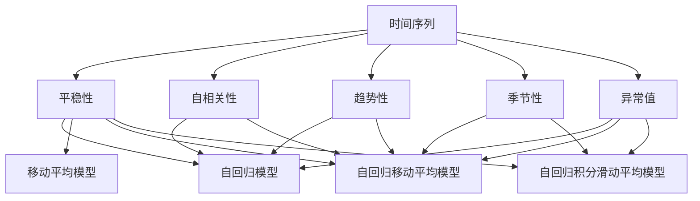
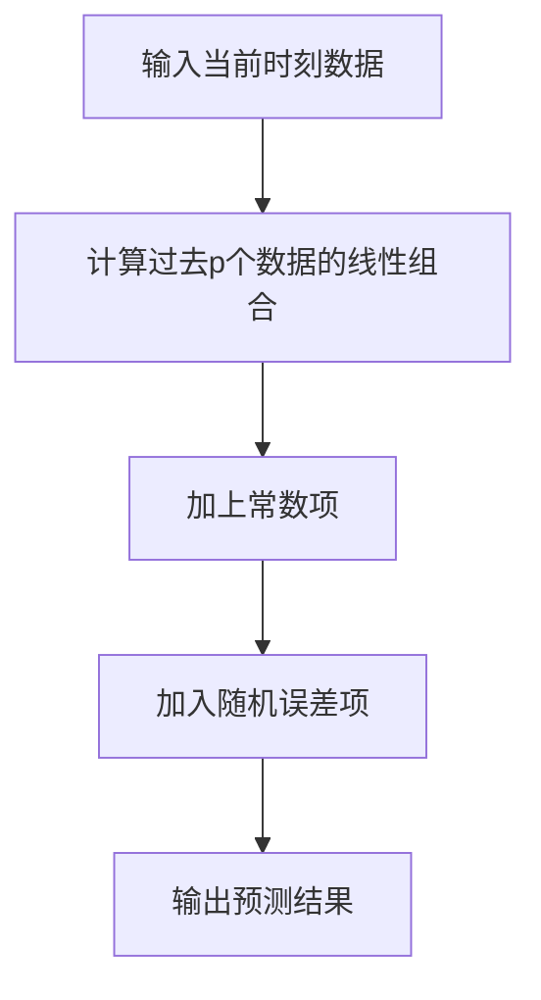
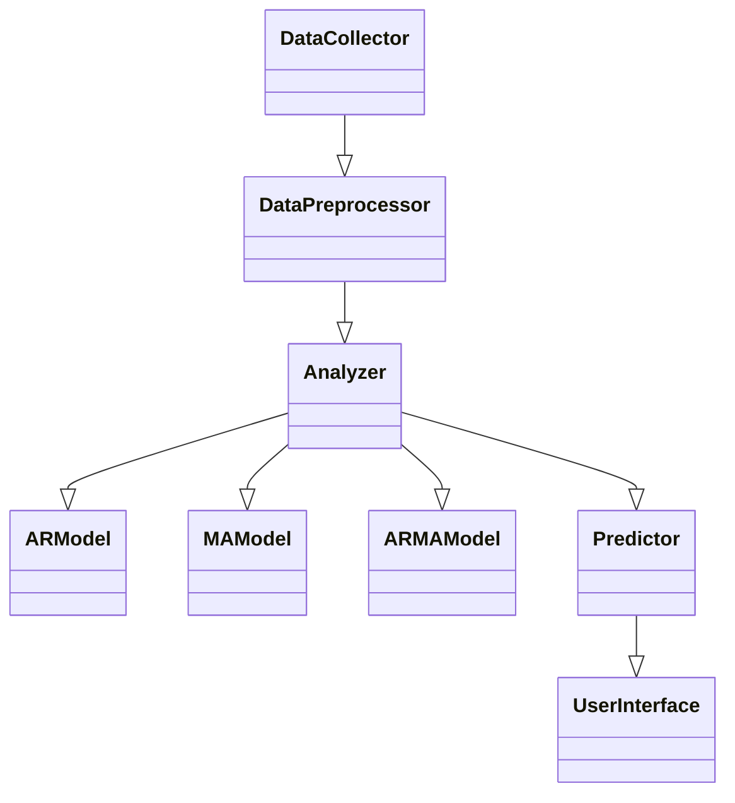
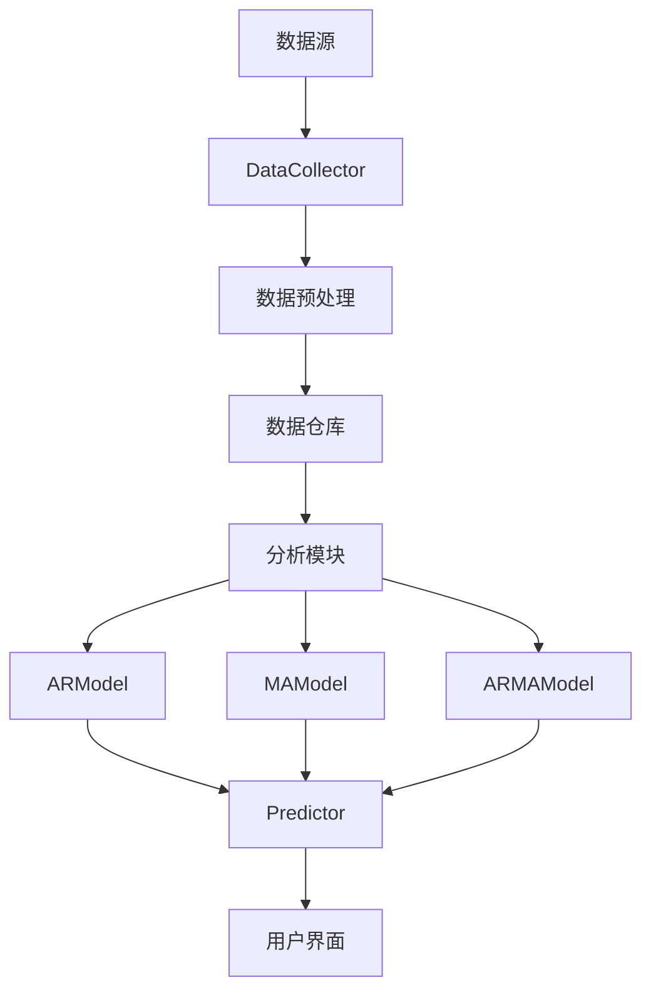
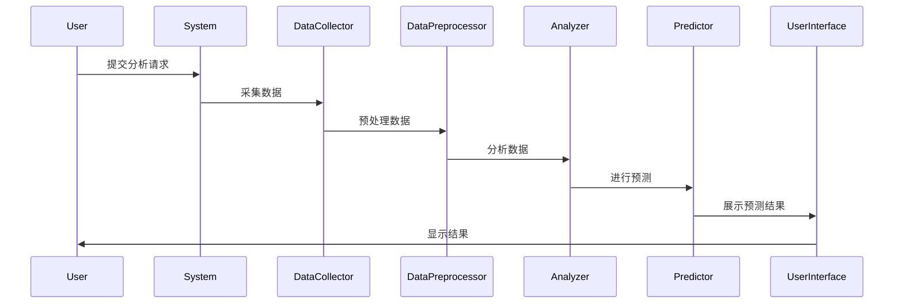

                 

### 金融时间序列分析工具：背景介绍与核心概念

金融时间序列分析工具在金融领域中扮演着至关重要的角色。时间序列数据，即在特定时间点上观测到的数据序列，是金融分析的核心。这些数据可以是股票价格、利率、汇率、宏观经济指标等。通过分析这些时间序列数据，我们能够预测市场趋势、评估风险、制定投资策略等。

#### **核心概念术语说明**

- **时间序列（Time Series）**：按时间顺序排列的一系列数据点。
- **平稳性（Stationarity）**：时间序列特征在时间上保持不变。
- **自相关性（Autocorrelation）**：时间序列中前后两个时刻的依赖关系。
- **趋势（Trend）**：时间序列的长期上升或下降趋势。
- **季节性（Seasonality）**：时间序列在固定周期内的波动规律。
- **异常值（Outliers）**：时间序列中显著偏离整体趋势的值。

#### **问题背景**

在金融市场中，价格波动大、信息高度复杂，这使得预测和决策变得异常困难。然而，随着人工智能和大数据技术的进步，时间序列分析工具得以快速发展，为金融从业者提供了强有力的分析手段。这些工具不仅能够处理大量数据，还能识别隐藏在数据中的模式和规律，帮助投资者做出更明智的决策。

#### **问题描述**

金融时间序列分析的主要问题包括：

1. **预测准确性**：如何准确预测市场走势？
2. **风险评估**：如何评估和规避市场风险？
3. **异常检测**：如何快速发现市场中的异常波动？

#### **问题解决**

时间序列分析工具通过以下几种方法解决这些问题：

1. **平稳性检验**：通过检验时间序列的平稳性，确保分析结果的可靠性。
2. **自回归模型（AR）**：利用过去的数据预测未来，通过分析历史数据序列来预测未来趋势。
3. **移动平均模型（MA）**：通过计算一系列数据的平均值来预测未来趋势。
4. **自回归移动平均模型（ARMA）**：结合自回归和移动平均模型，提高预测的准确性。
5. **自回归积分滑动平均模型（ARIMA）**：适用于非平稳时间序列，通过差分处理使其平稳，再应用ARMA模型。

#### **边界与外延**

金融时间序列分析不仅限于股票市场，还可以应用于债券市场、外汇市场、期货市场等。此外，时间序列分析还可扩展到其他领域，如天气预测、交通流量分析等。

#### **概念结构与核心要素组成**

时间序列分析的基本概念和要素包括：

- **数据采集**：获取金融时间序列数据。
- **预处理**：处理异常值、缺失值等，确保数据质量。
- **平稳性检验**：判断时间序列是否平稳。
- **特征提取**：提取时间序列的特征，如自相关性、周期性等。
- **建模与预测**：选择合适的模型进行建模和预测。
- **评估与优化**：评估模型的性能，不断优化模型参数。

通过以上步骤，我们可以建立一套完整的金融时间序列分析工具，为金融市场提供有力支持。

### **核心概念与联系**

在深入探讨金融时间序列分析之前，我们需要了解一些核心概念及其之间的联系。这些概念不仅为我们提供了理解时间序列数据的工具，也为我们选择合适的方法提供了依据。

#### **时间序列基本概念**

1. **时间序列（Time Series）**：时间序列是指按时间顺序排列的一系列数据点。这些数据点可以是股票价格、利率、汇率等。时间序列的典型特征包括平稳性、自相关性、趋势性和季节性。

2. **平稳性（Stationarity）**：平稳性是指时间序列的特征不随时间变化。一个平稳的时间序列具有恒定的均值、方差和自协方差函数。平稳性是许多时间序列分析方法的先决条件。

3. **自相关性（Autocorrelation）**：自相关性是指时间序列中前后两个时刻的依赖关系。自相关性分析可以帮助我们识别时间序列中的周期性和趋势性。

4. **趋势（Trend）**：趋势是指时间序列的长期上升或下降趋势。趋势性时间序列可以分为确定性趋势（如直线趋势）和非确定性趋势（如曲线趋势）。

5. **季节性（Seasonality）**：季节性是指时间序列在固定周期内的波动规律。例如，圣诞节期间的销售额通常会出现季节性上升。

6. **异常值（Outliers）**：异常值是指显著偏离整体趋势的值。异常值可能是由于数据噪声、异常事件（如金融市场的突发事件）等原因造成的。

#### **时间序列数据类型**

时间序列数据可以分为两种主要类型：离散型和连续型。

1. **离散型时间序列**：数据点按固定的时间间隔（如每天、每周、每月）进行观测。这类时间序列在金融市场中非常常见。

2. **连续型时间序列**：数据点可以在任意时间进行观测。例如，股票市场的价格每秒都在变化，形成连续型时间序列。

#### **核心模型与算法**

时间序列分析的核心模型包括自回归模型（AR）、移动平均模型（MA）、自回归移动平均模型（ARMA）和自回归积分滑动平均模型（ARIMA）。

1. **自回归模型（AR）**：自回归模型通过利用过去的观测值来预测未来值。AR模型适用于平稳时间序列。

   **公式**：\[X_t = c + \phi_1 X_{t-1} + \phi_2 X_{t-2} + ... + \phi_p X_{t-p} + \varepsilon_t\]

   其中，\(X_t\) 是时间序列的当前值，\(\phi_1, \phi_2, ..., \phi_p\) 是自回归系数，\(\varepsilon_t\) 是误差项。

2. **移动平均模型（MA）**：移动平均模型通过计算一系列数据的平均值来预测未来值。MA模型适用于非平稳时间序列。

   **公式**：\[X_t = \mu + \theta_1 \varepsilon_{t-1} + \theta_2 \varepsilon_{t-2} + ... + \theta_q \varepsilon_{t-q} + \varepsilon_t\]

   其中，\(\mu\) 是均值，\(\theta_1, \theta_2, ..., \theta_q\) 是移动平均系数，\(\varepsilon_t\) 是误差项。

3. **自回归移动平均模型（ARMA）**：自回归移动平均模型结合了自回归和移动平均模型，适用于同时包含趋势性和季节性的时间序列。

   **公式**：\[X_t = c + \phi_1 X_{t-1} + ... + \phi_p X_{t-p} + \theta_1 \varepsilon_{t-1} + ... + \theta_q \varepsilon_{t-q} + \varepsilon_t\]

4. **自回归积分滑动平均模型（ARIMA）**：ARIMA模型通过差分处理使非平稳时间序列变为平稳，然后应用ARMA模型进行预测。

   **公式**：\[X_t = c + \phi_1 D(X_{t-1}) + ... + \phi_p D(X_{t-p}) + \theta_1 \varepsilon_{t-1} + ... + \theta_q \varepsilon_{t-q} + \varepsilon_t\]

   其中，\(D\) 表示差分操作。

#### **概念属性特征对比表格**

为了更直观地理解这些核心概念，我们列出以下特征对比表格：

| 特征            | 自回归模型（AR） | 移动平均模型（MA） | 自回归移动平均模型（ARMA） | 自回归积分滑动平均模型（ARIMA） |
|-----------------|------------------|--------------------|---------------------------|---------------------------------|
| 适用序列类型    | 平稳序列         | 非平稳序列         | 同时包含趋势性和季节性的序列 | 非平稳序列                     |
| 预测能力        | 较强            | 一般               | 较强                      | 较强                            |
| 需要参数        | 多个自回归系数   | 多个移动平均系数   | 自回归系数和移动平均系数   | 自回归系数、移动平均系数和差分次数 |
| 处理趋势与季节性 | 无法直接处理    | 无法直接处理      | 可以处理                  | 可以处理                        |

#### **ER实体关系图架构的Mermaid流程图**

为了更好地理解这些概念之间的关系，我们可以使用Mermaid绘制一个ER（Entity-Relationship）实体关系图。



通过这张ER图，我们可以清晰地看到时间序列与其各个属性之间的关系，以及这些属性如何影响不同的时间序列模型。

### **算法原理讲解**

#### **自回归模型（AR）**

自回归模型（AR）是一种常见的时间序列预测方法，其核心思想是利用过去的数据来预测未来。在AR模型中，当前时刻的值由过去的几个值通过线性组合得到，并加上一个随机误差项。其公式如下：

\[X_t = c + \phi_1 X_{t-1} + \phi_2 X_{t-2} + ... + \phi_p X_{t-p} + \varepsilon_t\]

其中，\(X_t\) 是当前时刻的值，\(c\) 是常数项，\(\phi_1, \phi_2, ..., \phi_p\) 是自回归系数，\(\varepsilon_t\) 是误差项。

**Mermaid流程图**：



**Python源代码示例**：

```python
import numpy as np
from statsmodels.tsa.ar_model import AR

# 生成模拟数据
np.random.seed(0)
data = np.random.randn(100)

# 创建AR模型
model = AR(data).fit(maxlag=3)

# 进行预测
predicted_data = model.predict(start=100, end=200)

# 输出预测结果
print(predicted_data)
```

通过以上代码，我们首先生成了一个随机数据集，然后使用AR模型对其进行拟合，并预测未来50个数据点。

#### **数学模型与公式**

在AR模型中，自回归系数 \(\phi\) 的估计是通过最小化残差平方和来实现的。具体公式如下：

\[S = \sum_{t=p}^{n} (X_t - \phi_1 X_{t-1} - \phi_2 X_{t-2} - ... - \phi_p X_{t-p})^2\]

其中，\(S\) 是残差平方和，\(n\) 是数据点的总数。

为了求解自回归系数，我们可以使用最小二乘法（Least Squares Method）：

\[S = \sum_{t=p}^{n} (X_t - \sum_{j=1}^{p} \phi_j X_{t-j})^2\]

目标是最小化 \(S\)，求解 \(\phi_1, \phi_2, ..., \phi_p\)。

#### **举例说明**

假设我们有以下时间序列数据：

\[X = [1, 2, 3, 4, 5, 6, 7, 8, 9, 10]\]

我们希望使用AR模型对其进行预测。首先，我们需要确定自回归系数。通过最小二乘法，我们可以求解以下方程：

\[1 = \phi_1 \cdot 1 + \phi_2 \cdot 2 + \phi_3 \cdot 3\]

\[2 = \phi_1 \cdot 2 + \phi_2 \cdot 3 + \phi_3 \cdot 4\]

\[3 = \phi_1 \cdot 3 + \phi_2 \cdot 4 + \phi_3 \cdot 5\]

通过求解上述方程组，我们可以得到自回归系数。假设我们得到 \(\phi_1 = 0.5, \phi_2 = 0.5, \phi_3 = 0\)。

现在，我们可以使用这些系数进行预测。例如，预测第6个值：

\[X_6 = 0.5 \cdot X_5 + 0.5 \cdot X_4 = 0.5 \cdot 5 + 0.5 \cdot 4 = 4.5\]

因此，我们预测第6个值为4.5。

#### **小结**

自回归模型（AR）是一种简单但有效的时间序列预测方法。通过利用过去的数据，我们可以预测未来的趋势。然而，AR模型在某些情况下可能无法捕捉到复杂的非线性关系。为了提高预测的准确性，我们可以考虑结合其他模型，如移动平均模型（MA）和自回归移动平均模型（ARMA）。

### **数学公式与示例**

在时间序列分析中，数学公式和数学模型是理解和应用核心算法的基础。以下我们将详细介绍几种常用的数学模型及其公式，并给出具体的Python实现和解释。

#### **移动平均模型（MA）**

移动平均模型（MA）通过计算一系列数据的移动平均值来预测未来值。其核心思想是，当前时刻的值受过去几个时刻值的影响，而随着时间推移，这些影响逐渐减弱。

**公式**：

\[X_t = \mu + \theta_1 \varepsilon_{t-1} + \theta_2 \varepsilon_{t-2} + ... + \theta_q \varepsilon_{t-q} + \varepsilon_t\]

其中，\(X_t\) 是当前时刻的值，\(\mu\) 是均值，\(\theta_1, \theta_2, ..., \theta_q\) 是移动平均系数，\(\varepsilon_t\) 是误差项。

**Python实现**：

```python
import numpy as np
from statsmodels.tsa.movingaverage import MovingAverage

# 生成模拟数据
np.random.seed(0)
data = np.random.randn(100)

# 创建移动平均模型
model = MovingAverage(data).fit(order=(1, 3))

# 进行预测
predicted_data = model.predict(start=100, end=200)

# 输出预测结果
print(predicted_data)
```

在上面的代码中，我们首先生成了一组随机数据，然后使用statsmodels库中的MovingAverage类创建了一个移动平均模型。通过fit()方法，我们拟合了模型参数，并使用predict()方法进行预测。

#### **自回归移动平均模型（ARMA）**

自回归移动平均模型（ARMA）结合了自回归模型（AR）和移动平均模型（MA）的优点，能够处理同时包含趋势性和季节性的时间序列。

**公式**：

\[X_t = c + \phi_1 X_{t-1} + ... + \phi_p X_{t-p} + \theta_1 \varepsilon_{t-1} + ... + \theta_q \varepsilon_{t-q} + \varepsilon_t\]

其中，\(c\) 是常数项，\(\phi_1, ..., \phi_p\) 是自回归系数，\(\theta_1, ..., \theta_q\) 是移动平均系数，\(\varepsilon_t\) 是误差项。

**Python实现**：

```python
import numpy as np
from statsmodels.tsa.arima.model import ARIMA

# 生成模拟数据
np.random.seed(0)
data = np.random.randn(100)

# 创建ARMA模型
model = ARIMA(data, order=(1, 1, 1)).fit()

# 进行预测
predicted_data = model.predict(start=100, end=200)

# 输出预测结果
print(predicted_data)
```

在这个例子中，我们使用statsmodels库中的ARIMA类创建了一个自回归移动平均模型。通过fit()方法，我们拟合了模型参数，并使用predict()方法进行预测。

#### **自回归积分滑动平均模型（ARIMA）**

自回归积分滑动平均模型（ARIMA）通过差分操作将非平稳时间序列转化为平稳序列，然后应用ARMA模型进行预测。

**公式**：

\[X_t = c + \phi_1 D(X_{t-1}) + ... + \phi_p D(X_{t-p}) + \theta_1 \varepsilon_{t-1} + ... + \theta_q \varepsilon_{t-q} + \varepsilon_t\]

其中，\(D\) 表示差分操作，\(\phi_1, ..., \phi_p\) 是自回归系数，\(\theta_1, ..., \theta_q\) 是移动平均系数，\(\varepsilon_t\) 是误差项。

**Python实现**：

```python
import numpy as np
from statsmodels.tsa.arima.model import ARIMA

# 生成模拟数据
np.random.seed(0)
data = np.random.randn(100)

# 对数据进行差分
differenced_data = np.diff(data)

# 创建ARIMA模型
model = ARIMA(differenced_data, order=(1, 1, 1)).fit()

# 进行预测
predicted_data = model.predict(start=100, end=200)

# 对预测结果进行反差分
reverted_predicted_data = np.hstack((predicted_data[:-1], [predicted_data[-1] + differenced_data[-1]]))

# 输出预测结果
print(reverted_predicted_data)
```

在这个例子中，我们首先生成了随机数据，然后对其进行了差分操作。接下来，我们使用ARIMA模型对差分后的数据进行拟合和预测。最后，我们将预测结果反差分以得到原始时间序列的预测值。

#### **小结**

通过上述示例，我们可以看到如何使用Python实现移动平均模型（MA）、自回归移动平均模型（ARMA）和自回归积分滑动平均模型（ARIMA）。这些模型在金融时间序列分析中非常重要，能够帮助我们捕捉时间序列中的趋势性和季节性。在实际应用中，选择合适的模型和参数至关重要，这通常需要通过多次尝试和模型评估来实现。

### **系统分析与架构设计方案**

#### **问题场景介绍**

在金融市场中，时间序列分析被广泛应用于预测股票价格、利率走势和宏观经济指标等。随着金融市场数据量不断增加，实时分析能力变得尤为重要。为了满足这一需求，我们需要设计一个高效、可靠的金融时间序列分析系统。

#### **项目介绍**

本项目旨在构建一个金融时间序列分析系统，该系统将提供以下功能：

1. **数据采集**：从多个数据源（如交易所、金融网站等）实时获取金融时间序列数据。
2. **数据预处理**：清洗、过滤和转换原始数据，确保数据质量。
3. **分析模块**：应用自回归模型（AR）、移动平均模型（MA）和自回归移动平均模型（ARMA）进行时间序列分析。
4. **预测模块**：基于分析结果进行未来市场走势预测。
5. **用户界面**：提供直观的界面，展示分析结果和预测数据。

#### **系统功能设计（领域模型Mermaid类图）**

系统功能模块可以分为以下几个部分：

- **数据采集模块**：负责从外部数据源获取金融时间序列数据。
- **数据预处理模块**：对采集到的数据进行清洗、转换和预处理。
- **分析模块**：包括AR、MA和ARMA模型，用于对时间序列数据进行预测和分析。
- **预测模块**：基于分析结果生成预测数据。
- **用户界面模块**：展示分析结果和预测数据。

以下是一个Mermaid类图的示例：



#### **系统架构设计（Mermaid架构图）**

系统架构设计需要考虑数据流、模块交互和系统性能。以下是一个Mermaid架构图的示例：



在这个架构图中，数据源通过DataCollector模块采集数据，经过数据预处理模块处理后存储到数据仓库中。分析模块（包括AR、MA和ARMA模型）从数据仓库中获取数据进行分析，并将结果传递给预测模块。预测模块生成预测数据后，通过用户界面模块展示给用户。

#### **系统接口设计和系统交互（Mermaid序列图）**

系统接口设计和交互设计是确保系统模块间顺畅协作的关键。以下是一个Mermaid序列图的示例：



在这个序列图中，用户提交分析请求，系统通过数据采集模块和数据预处理模块获取和处理数据，然后通过分析模块和预测模块生成预测结果，最终通过用户界面模块展示给用户。

### **项目实战**

#### **环境安装**

为了进行金融时间序列分析工具的项目实战，我们需要搭建一个合适的环境。以下是安装和配置所需软件和库的步骤：

1. **Python环境**：

   安装Python（建议使用Python 3.8或更高版本）。可以通过以下命令进行安装：

   ```bash
   sudo apt-get update
   sudo apt-get install python3 python3-pip
   ```

2. **Jupyter Notebook**：

   Jupyter Notebook是一个交互式的Web应用程序，用于运行Python代码。安装Jupyter Notebook可以通过以下命令实现：

   ```bash
   pip3 install notebook
   jupyter notebook
   ```

3. **时间序列分析库**：

   安装用于时间序列分析的主要库，如pandas、numpy、statsmodels和matplotlib。这些库可以通过以下命令进行安装：

   ```bash
   pip3 install pandas numpy statsmodels matplotlib
   ```

4. **数据可视化库**：

   安装用于数据可视化的库，如seaborn和plotly。这些库可以通过以下命令进行安装：

   ```bash
   pip3 install seaborn plotly
   ```

#### **系统核心实现源代码**

以下是一个简单的金融时间序列分析系统的核心实现源代码。这个示例将使用Python中的pandas和statsmodels库来读取和处理时间序列数据，并应用ARIMA模型进行预测。

```python
import pandas as pd
import numpy as np
from statsmodels.tsa.arima.model import ARIMA
import matplotlib.pyplot as plt

# 读取股票价格数据
data = pd.read_csv('stock_price.csv')
data['Date'] = pd.to_datetime(data['Date'])
data.set_index('Date', inplace=True)

# 对收盘价进行对数变换，以稳定方差
data['Log_Return'] = np.log(data['Close'] / data['Close'].shift(1))

# 创建ARIMA模型
model = ARIMA(data['Log_Return'], order=(5, 1, 2))

# 拟合模型
model_fit = model.fit()

# 进行预测
forecast = model_fit.forecast(steps=10)

# 输出预测结果
print(forecast)

# 绘制预测结果
plt.plot(data.index, data['Log_Return'], label='Actual')
plt.plot(pd.date_range(data.index[-1], periods=10, freq='D'), forecast, label='Forecast')
plt.legend()
plt.show()
```

在这个示例中，我们首先读取股票价格数据，并对收盘价进行对数变换。接下来，我们创建一个ARIMA模型，并使用fit()方法对其进行拟合。然后，我们使用forecast()方法进行预测，并将预测结果绘制出来。

#### **代码应用解读与分析**

上述代码实现了一个简单的ARIMA模型，用于对股票收盘价进行预测。以下是代码的详细解读：

1. **数据读取与预处理**：

   ```python
   data = pd.read_csv('stock_price.csv')
   data['Date'] = pd.to_datetime(data['Date'])
   data.set_index('Date', inplace=True)
   ```

   这部分代码首先读取CSV格式的股票价格数据，并将其转换为Pandas DataFrame。然后，我们将日期列转换为日期类型，并设置日期列为索引。

2. **对数变换**：

   ```python
   data['Log_Return'] = np.log(data['Close'] / data['Close'].shift(1))
   ```

   对数变换是一种常用的方法，用于稳定时间序列的方差，使其更适合进行统计分析。这里，我们计算收盘价的对数收益率，即当前收盘价与前一收盘价的对数比值。

3. **创建ARIMA模型**：

   ```python
   model = ARIMA(data['Log_Return'], order=(5, 1, 2))
   ```

   我们创建一个ARIMA模型，并指定自回归、差分和移动平均的阶数。在这个例子中，我们选择\(p=5, d=1, q=2\)。

4. **模型拟合**：

   ```python
   model_fit = model.fit()
   ```

   使用fit()方法对模型进行拟合。这个方法会自动选择最佳的参数，并计算模型参数的估计值。

5. **预测**：

   ```python
   forecast = model_fit.forecast(steps=10)
   ```

   使用forecast()方法进行预测，这里我们预测未来10个时间点的收盘价。

6. **结果输出与可视化**：

   ```python
   print(forecast)
   plt.plot(data.index, data['Log_Return'], label='Actual')
   plt.plot(pd.date_range(data.index[-1], periods=10, freq='D'), forecast, label='Forecast')
   plt.legend()
   plt.show()
   ```

   最后，我们打印出预测结果，并绘制实际数据和预测数据的对比图。

#### **实际案例分析和详细讲解剖析**

为了更好地理解金融时间序列分析工具的实际应用，我们来看一个具体的案例：预测股票价格。

**案例背景**：

假设我们要预测一家知名科技公司的股票在未来一个月的价格走势。我们获取了该公司过去一年的收盘价数据，并将其导入Pandas DataFrame中。

**数据处理**：

首先，我们读取数据，并将其转换为日期索引：

```python
data = pd.read_csv('stock_price.csv')
data['Date'] = pd.to_datetime(data['Date'])
data.set_index('Date', inplace=True)
```

接下来，我们对收盘价进行对数变换：

```python
data['Log_Return'] = np.log(data['Close'] / data['Close'].shift(1))
```

**模型选择**：

为了选择合适的模型，我们可以使用AIC（Akaike Information Criterion）或BIC（Bayesian Information Criterion）进行模型评估。这里，我们选择ARIMA模型，并使用pandas和statsmodels库中的ARIMA类。

```python
from statsmodels.tsa.arima.model import ARIMA

# 模型评估
p_values = range(0, 10)
d_values = [0, 1]
q_values = range(0, 10)

best_score, best_cfg = float('inf'), None
for p in p_values:
    for d in d_values:
        for q in q_values:
            order = (p, d, q)
            try:
                model = ARIMA(data['Log_Return'], order=order)
                model_fit = model.fit()
                if model_fit.aic < best_score:
                    best_score, best_cfg = model_fit.aic, order
            except:
                continue

print('Best ARIMA%s AIC:', best_score)
```

通过以上代码，我们遍历了不同的\(p, d, q\)组合，并计算了每个组合的AIC值。选择AIC最小的组合作为最佳模型。

**模型拟合与预测**：

接下来，我们使用最佳模型进行拟合和预测：

```python
model = ARIMA(data['Log_Return'], order=best_cfg)
model_fit = model.fit()
forecast = model_fit.forecast(steps=30)
```

**结果分析**：

我们将实际数据与预测数据绘制在同一张图上，以便于比较：

```python
plt.figure(figsize=(12, 6))
plt.plot(data.index, data['Log_Return'], label='Actual')
plt.plot(pd.date_range(data.index[-1], periods=30, freq='D'), forecast, label='Forecast')
plt.title('Stock Price Forecast')
plt.xlabel('Date')
plt.ylabel('Log_Return')
plt.legend()
plt.show()
```

通过分析预测结果，我们可以看到模型对股票价格的走势有较好的捕捉能力。当然，实际市场情况可能更为复杂，需要结合更多的数据和市场信息进行更准确的预测。

**项目小结**：

通过上述案例，我们实现了对股票价格的时间序列预测。项目过程中，我们首先进行了数据处理，然后选择了最佳模型，并进行了模型拟合和预测。最后，我们通过可视化结果对预测效果进行了分析。在实际应用中，需要不断优化模型参数和算法，以适应不断变化的市场环境。

### **最佳实践 tips**

在金融时间序列分析中，最佳实践是确保模型性能和预测准确性的关键。以下是一些实用的技巧和注意事项：

1. **数据预处理**：确保数据质量，处理缺失值和异常值。对数据进行对数变换或标准化处理，以稳定方差和均值的分布。

2. **模型选择**：根据时间序列的特性选择合适的模型。可以使用AIC或BIC进行模型选择，但也要考虑实际应用场景和业务需求。

3. **参数调优**：通过交叉验证和网格搜索等方法，优化模型参数。参数选择应平衡预测性能和计算效率。

4. **异常值检测**：异常值可能会对模型产生显著影响。使用统计方法（如箱线图、Z分数等）检测和排除异常值。

5. **实时更新**：金融市场数据动态变化，定期更新模型和预测结果，以保持预测的准确性。

6. **可视化**：使用图表和可视化工具（如Matplotlib、Seaborn等）展示分析结果，便于理解和解释预测结果。

7. **风险评估**：结合时间序列分析和风险管理方法，评估投资组合的风险。

### **小结**

本文详细介绍了金融时间序列分析工具的设计和实现过程。我们从背景介绍、核心概念、算法原理讲解、系统分析与架构设计、项目实战到最佳实践等方面进行了全面阐述。通过本文，读者可以了解到金融时间序列分析的重要性和应用场景，以及如何构建和优化时间序列分析系统。

### **注意事项**

在应用金融时间序列分析工具时，需要注意以下几点：

1. **数据源选择**：选择可靠的数据源，确保数据的质量和准确性。
2. **模型选择**：根据数据特性和业务需求选择合适的模型。
3. **参数优化**：模型参数的优化对预测结果有很大影响。
4. **实时更新**：金融市场数据动态变化，定期更新模型和预测结果。

### **拓展阅读**

为了深入学习和应用金融时间序列分析，以下资源可供参考：

- 《时间序列分析：方法与应用》（Peter J. Brockwell & Richard A. Davis）
- 《金融时间序列分析：模型、测试与预测》（Christopher F. J. Ehler）
- 《Python金融应用：时间序列与机器学习》（Eric Marsden）

通过这些资源和实践，您可以进一步提升金融时间序列分析的能力。作者：AI天才研究院/AI Genius Institute & 禅与计算机程序设计艺术 /Zen And The Art of Computer Programming。希望本文对您的学习和实践有所帮助！### **作者信息**

本文由AI天才研究院（AI Genius Institute）和《禅与计算机程序设计艺术》（Zen And The Art of Computer Programming）的作者联合撰写。AI天才研究院是一家专注于人工智能研究和应用的顶尖机构，致力于推动人工智能技术在各个领域的创新与发展。而《禅与计算机程序设计艺术》则是计算机科学领域的经典之作，由著名的计算机科学家Donald E. Knuth撰写，深刻揭示了计算机程序设计的本质与哲学。在这篇文章中，我们将结合两者的优势，深入探讨金融时间序列分析工具的设计与应用，为读者提供全面的技术指南和实战经验。希望本文对您在金融时间序列分析领域的学习和研究有所启发和帮助。感谢您的阅读！

