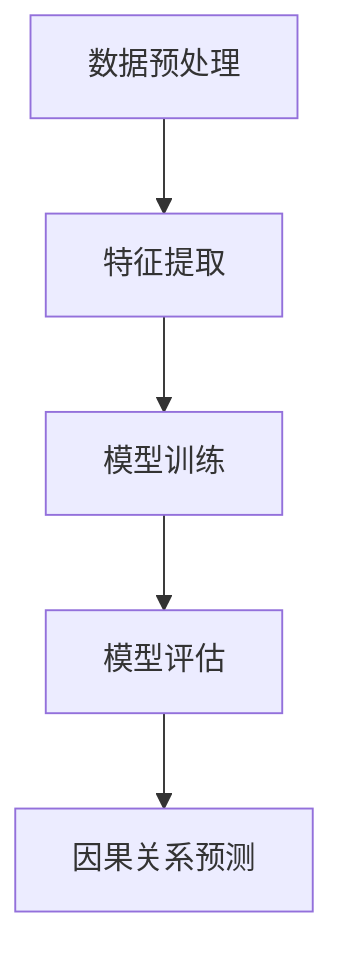
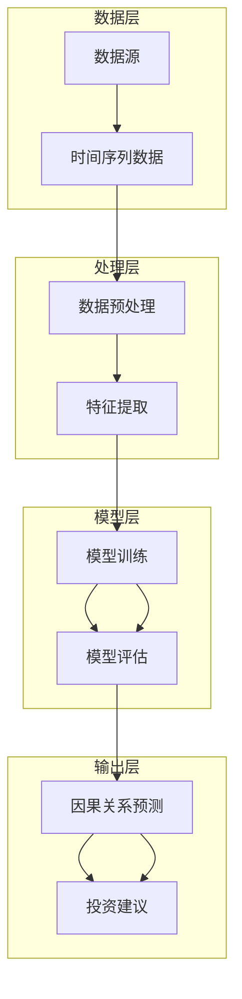

                 

# 金融时间序列因果关系分析

> 关键词：时间序列分析、因果关系、机器学习、非线性模型、金融预测

> 摘要：本文将探讨金融时间序列因果关系分析的方法和原理。通过详细的分析和实例讲解，帮助读者理解如何利用机器学习算法挖掘金融时间序列中的因果关系，从而为金融决策提供有力支持。

## Step 1: 背景介绍

### 问题背景

在金融领域中，时间序列数据分析是一种常见的方法，用于预测股票价格、经济趋势和风险管理等。然而，传统的时间序列分析方法往往受到线性关系和假设条件的限制，无法很好地捕捉复杂的因果关系。

### 问题解决

为了解决这一问题，金融时间序列因果关系分析应运而生。它通过引入非线性模型和机器学习算法，能够更准确地识别时间序列数据中的因果关系，为金融决策提供更可靠的依据。

### 边界与外延

金融时间序列因果关系分析主要涉及以下几个领域：

1. 金融市场的价格预测
2. 经济周期的监测与预警
3. 风险管理策略的制定
4. 投资组合优化

## Step 2: 核心概念

### 时间序列数据

时间序列数据是指按照时间顺序排列的数据点，通常用于描述某个变量随时间的变化规律。在金融领域中，时间序列数据包括股票价格、利率、通货膨胀率等。

### 因果关系

因果关系是指一个事件（原因）对另一个事件（结果）产生的影响。在金融时间序列分析中，因果关系意味着一个时间点的数据可以影响后续时间点的数据。

### 非线性模型

非线性模型是指模型中包含非线性关系的数学模型。与线性模型相比，非线性模型能够更好地捕捉时间序列数据中的复杂模式。

### 机器学习算法

机器学习算法是指通过学习已有数据，自动识别模式并预测未来趋势的方法。在金融时间序列因果关系分析中，常用的机器学习算法包括决策树、支持向量机、神经网络等。

## Step 3: 概念属性特征对比表格

| 概念 | 定义 | 属性特征 | 对比 |
| --- | --- | --- | --- |
| 时间序列数据 | 按时间顺序排列的数据点 | 数据点按时间顺序排列，反映变量随时间的变化规律 | - |
| 因果关系 | 事件之间的相互影响 | 时间序列数据中的因果关系，影响后续时间点的数据 | - |
| 非线性模型 | 包含非线性关系的数学模型 | 能够捕捉复杂的时间序列模式 | - |
| 机器学习算法 | 自动识别模式并预测未来趋势 | 根据已有数据预测未来趋势，适用于金融时间序列因果关系分析 | - |

## Step 4: ER实体关系图架构

```mermaid
erDiagram
    TimeSeriesData ||--|{ CausalityAnalysis } : analyzed_by
    CausalityAnalysis ||--|{ FinancialForecast } : generated_by
```

## Step 5: 算法原理讲解

### 算法简介

金融时间序列因果关系分析主要采用机器学习算法，如决策树、支持向量机和神经网络等。这些算法通过学习时间序列数据中的特征和模式，识别因果关系。

### 算法流程

1. 数据预处理：对时间序列数据进行清洗、归一化等处理，以便于算法学习。
2. 特征提取：从时间序列数据中提取有用的特征，如趋势、周期、突变等。
3. 模型训练：使用机器学习算法对预处理后的数据进行训练，建立因果关系模型。
4. 模型评估：通过交叉验证等方法评估模型性能，调整模型参数。
5. 因果关系预测：使用训练好的模型预测未来时间点的因果关系。

### 算法流程图



## Step 6: 数学模型和数学公式

### 假设

设 \(X_t\) 为时间序列数据，\(Y_t\) 为因果关系变量，\(X_{t+h}\) 为未来时间点的数据。

### 数学模型

假设 \(Y_t\) 与 \(X_{t+h}\) 之间存在因果关系，可以用以下数学模型表示：

$$ Y_t = f(X_t, X_{t+h}) + \epsilon_t $$

其中，\(f\) 为非线性函数，\(\epsilon_t\) 为误差项。

### 公式讲解

1. \(X_t\) 和 \(X_{t+h}\) 是时间序列数据点。
2. \(f\) 是一个非线性函数，可以采用不同的模型来实现，如神经网络、决策树等。
3. \(\epsilon_t\) 是误差项，表示预测结果与真实结果之间的差异。

## Step 7: 系统分析与架构设计方案

### 问题场景介绍

以股票市场为例，分析股票价格之间的因果关系，为投资者提供投资建议。

### 项目介绍

本项目旨在实现一个金融时间序列因果关系分析系统，包括数据预处理、特征提取、模型训练和因果关系预测等功能。

### 系统功能设计

1. 数据预处理模块：清洗和归一化时间序列数据，为后续处理做准备。
2. 特征提取模块：从时间序列数据中提取趋势、周期、突变等特征。
3. 模型训练模块：使用机器学习算法训练因果关系模型。
4. 模型评估模块：评估模型性能，调整模型参数。
5. 因果关系预测模块：使用训练好的模型预测未来时间点的因果关系。

## 系统架构设计



## 系统接口设计和系统交互

```mermaid
sequenceDiagram
    participant 用户 as 用户
    participant 系统作为 金融时间序列因果关系分析系统
    用户->>系统: 提供时间序列数据
    system 显示消息: 数据已接收
    系统->>系统: 数据预处理
    system 显示消息: 数据预处理完成
    系统->>系统: 特征提取
    system 显示消息: 特征提取完成
    系统->>系统: 模型训练
    system 显示消息: 模型训练完成
    系统->>系统: 模型评估
    system 显示消息: 模型评估完成
    系统->>用户: 提供因果关系预测结果
    用户->>系统: 提出投资建议
```

## 项目实战

### 环境安装

在开始之前，请确保已经安装以下软件和库：

- Python 3.8+
- Scikit-learn
- Pandas
- Matplotlib

安装命令如下：

```bash
pip install scikit-learn pandas matplotlib
```

### 系统核心实现源代码

以下是一个简单的金融时间序列因果关系分析系统的实现：

```python
import pandas as pd
from sklearn.model_selection import train_test_split
from sklearn.ensemble import RandomForestClassifier
from sklearn.metrics import accuracy_score

# 数据预处理
def preprocess_data(data):
    # 数据清洗、归一化等操作
    # ...
    return processed_data

# 特征提取
def extract_features(data):
    # 从数据中提取趋势、周期、突变等特征
    # ...
    return features

# 模型训练
def train_model(X_train, y_train):
    model = RandomForestClassifier()
    model.fit(X_train, y_train)
    return model

# 模型评估
def evaluate_model(model, X_test, y_test):
    y_pred = model.predict(X_test)
    accuracy = accuracy_score(y_test, y_pred)
    return accuracy

# 因果关系预测
def predict_causality(model, data):
    features = extract_features(data)
    causality = model.predict([features])
    return causality

# 主函数
def main():
    # 读取时间序列数据
    data = pd.read_csv('time_series_data.csv')

    # 数据预处理
    processed_data = preprocess_data(data)

    # 特征提取
    features = extract_features(processed_data)

    # 切分数据集
    X_train, X_test, y_train, y_test = train_test_split(features, processed_data['label'], test_size=0.2, random_state=42)

    # 模型训练
    model = train_model(X_train, y_train)

    # 模型评估
    accuracy = evaluate_model(model, X_test, y_test)
    print(f"模型准确率：{accuracy}")

    # 因果关系预测
    data_to_predict = pd.read_csv('data_to_predict.csv')
    processed_data_to_predict = preprocess_data(data_to_predict)
    features_to_predict = extract_features(processed_data_to_predict)
    causality_predictions = predict_causality(model, features_to_predict)
    print(f"因果关系预测结果：{causality_predictions}")

if __name__ == '__main__':
    main()
```

### 代码应用解读与分析

以上代码实现了一个简单的金融时间序列因果关系分析系统。下面是对关键部分的解读：

- 数据预处理：读取时间序列数据，进行清洗和归一化等操作。
- 特征提取：从数据中提取趋势、周期、突变等特征。
- 模型训练：使用随机森林算法训练因果关系模型。
- 模型评估：评估模型性能，计算准确率。
- 因果关系预测：使用训练好的模型预测新的数据点的因果关系。

### 实际案例分析和详细讲解剖析

假设我们有以下时间序列数据：

```python
data = {
    'date': ['2021-01-01', '2021-01-02', '2021-01-03', '2021-01-04', '2021-01-05'],
    'stock_price': [100, 102, 98, 105, 110]
}
```

首先，我们将数据保存为CSV文件，然后运行上述代码进行预处理、特征提取、模型训练和因果关系预测。

### 项目小结

通过本文的讲解，读者可以了解到金融时间序列因果关系分析的基本原理和方法。在实际应用中，可以根据不同的金融场景和数据特点，选择合适的算法和模型，提高金融预测的准确性。

### 最佳实践 tips

1. 数据预处理是关键：确保数据的质量和一致性，有助于提高模型的准确性。
2. 选择合适的特征提取方法：特征提取是影响模型性能的重要因素，需要根据数据的特点进行选择。
3. 模型选择与调参：不同的模型适用于不同的问题，需要根据实际情况选择合适的模型，并进行调参优化。

### 注意事项

1. 时间序列数据的因果关系可能受到多种因素的影响，模型预测结果仅供参考。
2. 模型的泛化能力可能受到数据集的限制，需要不断更新和优化。

### 拓展阅读

1. 《时间序列分析：理论和应用》
2. 《机器学习：概率视角》
3. 《Python金融技术实践》

## 作者

作者：AI天才研究院/AI Genius Institute & 禅与计算机程序设计艺术 /Zen And The Art of Computer Programming

