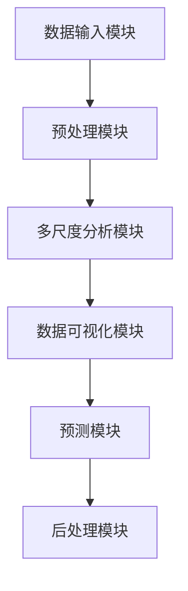

                 

### 《金融时间序列多尺度分析工具》

#### 关键词：金融时间序列、多尺度分析、量化分析、时间序列分析、数据挖掘

> **摘要**：
>
> 本文将探讨金融时间序列多尺度分析工具的构建与应用。通过对金融时间序列分析的基础理论、多尺度分析技术的详细讲解，我们将逐步解析多尺度分析工具的设计与实现方法。此外，本文还将通过实际案例，展示多尺度分析工具在金融数据分析中的实际应用，以期为金融分析师和量化研究者提供实用的技术指导。

---

## 目录大纲设计思路

### 确定书籍主题和目标读者

在构建《金融时间序列多尺度分析工具》的目录大纲时，我们首先要明确书籍的主题是金融时间序列多尺度分析，目标读者是金融数据分析人员、量化分析师、金融工程学生或研究人员。这一步骤的目的是确保书籍的内容能够满足读者的需求，并且在深度和广度上都有所覆盖。

### 框架构建

书籍的框架构建是目录大纲设计的关键步骤。我们需要确保每个章节都能系统地覆盖金融时间序列分析的多尺度方法，从基础理论到实际应用。框架应包含以下几个主要部分：

1. **金融时间序列分析基础**：介绍时间序列分析的基本概念、方法和技术。
2. **多尺度分析基本理论**：讲解多尺度分析的概念、方法及其在金融领域的应用。
3. **多尺度分析工具应用实战**：展示多尺度分析工具的设计与实现，以及其在实际金融数据分析中的应用。
4. **多尺度分析工具的拓展与应用**：探讨多尺度分析工具的新趋势、前沿技术和未来发展方向。

### 章节划分

根据框架，我们进一步划分每个章节的具体内容。每个章节都应有明确的主题和目标，确保读者能够系统地学习和掌握相关知识点。

### 内容细化

在细化内容时，我们需要在每个章节中详细讲解核心概念、方法、工具和案例分析。例如，在“多尺度分析基本理论”章节中，我们将详细讲解多尺度分析的各种方法，如小波变换、波动性聚类方法等，并使用实际的金融时间序列数据来演示这些方法的应用。

### Markdown 格式

为了确保目录清晰、层次分明，我们将所有内容按照 Markdown 格式进行排版。Markdown 是一种轻量级标记语言，可以方便地创建文档，并且支持多种文本格式和图表嵌入，非常适合技术博客文章的撰写。

### 简洁性和完整性

在内容设计过程中，我们注重简洁性和完整性。每个章节的内容要简洁明了，避免冗余信息，同时确保内容的完整性，确保读者能够系统地学习和掌握相关知识。

### 具体目录大纲设计

以下是《金融时间序列多尺度分析工具》的具体目录大纲设计：

---

## 第一部分: 金融时间序列分析基础

### 第1章: 金融时间序列分析概述

1.1 问题背景与目标

1.2 金融时间序列的定义与特征

1.3 时间序列数据的结构

1.4 时间序列分析的基本概念

1.5 时间序列分析工具简介

1.6 本章小结

---

## 第二部分: 金融时间序列多尺度分析技术

### 第2章: 多尺度分析基本理论

2.1 多尺度分析的概念

2.2 金融时间序列多尺度分析的应用

2.3 多尺度分析方法与模型

2.4 多尺度分析工具与实践

2.5 本章小结

---

## 第三部分: 多尺度分析工具应用实战

### 第3章: 金融时间序列多尺度分析工具应用

3.1 工具选择与配置

3.2 系统设计与架构

3.3 系统实现与优化

3.4 实际案例分析

3.5 本章小结

---

## 第四部分: 多尺度分析工具的拓展与应用

### 第4章: 金融时间序列多尺度分析的新趋势

4.1 新趋势与技术概述

4.2 前沿技术的探讨与应用

4.3 多尺度分析工具的未来发展方向

4.4 本章小结

---

---

通过上述目录大纲的设计，我们为《金融时间序列多尺度分析工具》构建了一个完整且系统的框架，确保读者能够循序渐进地学习和掌握金融时间序列多尺度分析的相关知识和技术。接下来，我们将逐步深入每个章节的内容，提供详细的理论讲解、实践案例和未来发展趋势分析，帮助读者全面了解金融时间序列多尺度分析的奥秘。  

---

**LET'S THINK STEP BY STEP**，我们首先回顾一下金融时间序列分析的基本概念。金融时间序列是指金融市场上的价格、成交量等数据按照时间顺序排列形成的序列。这些序列具有复杂性和非线性，需要我们采用合适的方法进行分析和预测。

### 第1章: 金融时间序列分析概述

在金融市场中，时间序列分析是一种重要的数据分析工具，它能够帮助我们理解市场的动态变化，预测未来趋势，从而为投资决策提供支持。本章将概述金融时间序列分析的基本概念、问题背景和解决思路，以及相关工具和技术。

#### 1.1 问题背景与目标

##### 1.1.1 金融时间序列分析的重要性

金融市场是现代经济体系的核心组成部分，其波动性和复杂性使得对金融时间序列的分析变得尤为重要。金融时间序列分析不仅能够帮助投资者了解市场的现状，还能够预测未来可能发生的趋势和波动，从而制定更为有效的投资策略。

##### 1.1.2 问题描述与解决思路

金融时间序列分析的主要问题是如何从历史数据中提取有用信息，并利用这些信息对市场进行预测。传统的统计方法如自回归模型（AR）、移动平均模型（MA）和自回归移动平均模型（ARMA）已经被广泛应用。然而，面对复杂多变的金融市场，这些方法往往难以捕捉到数据中的非线性特征。因此，我们需要寻找更有效的多尺度分析方法。

##### 1.1.3 边界与外延

金融时间序列分析不仅涉及数学和统计学，还涉及经济学、金融学等领域的知识。它需要考虑数据的来源、数据的真实性和完整性，以及市场规则和政策变动等因素。此外，多尺度分析工具的选择和应用也需要根据具体问题进行定制。

#### 1.2 金融时间序列的定义与特征

##### 1.2.1 金融时间序列的定义

金融时间序列是指金融市场上的价格、成交量、利率等数据按照时间顺序排列形成的序列。这些序列可以用来描述市场的历史行为，是金融分析和预测的重要数据来源。

##### 1.2.2 金融时间序列的特征

金融时间序列具有以下几个显著特征：

1. **波动性**：金融市场的价格波动较大，且具有持久性。
2. **自相关性**：金融时间序列中的数据点之间具有相关性，即当前点的值受到过去若干点的影响。
3. **非线性**：金融时间序列往往包含非线性特征，传统的线性模型难以准确捕捉。
4. **随机性**：虽然金融时间序列具有一定的规律性，但也存在随机波动，这使得预测变得复杂。

##### 1.2.3 金融时间序列的对比表格

| 特征         | 说明                                                         |
| ------------ | ------------------------------------------------------------ |
| 波动性       | 价格波动较大，且具有持久性                                   |
| 自相关性     | 数据点之间具有相关性                                         |
| 非线性       | 包含非线性特征，传统线性模型难以准确捕捉                     |
| 随机性       | 存在随机波动，预测复杂                                       |

#### 1.3 时间序列数据的结构

##### 1.3.1 时间序列数据的结构

时间序列数据通常由一系列按时间顺序排列的数值组成，这些数值可以是连续的，也可以是离散的。时间序列数据的基本结构包括：

- **时间戳**：记录数据发生的时间点。
- **数值**：与时间戳对应的数据值，可以是价格、成交量等。

##### 1.3.2 时间序列数据的类型

根据数据的时间粒度，时间序列数据可以分为以下几种类型：

- **日度数据**：以天为时间粒度，是最常见的时间序列数据类型。
- **周度数据**：以周为时间粒度，适用于某些特定的金融市场分析。
- **月度数据**：以月为时间粒度，常用于宏观经济分析。
- **季度数据**：以季度为时间粒度，适用于长期趋势分析。

##### 1.3.3 时间序列数据的ER实体关系图

```mermaid
erDiagram
  TimeSeriesData ||--|{ PriceData } PriceData
  TimeSeriesData ||--|{ VolumeData } VolumeData
  TimeSeriesData ||--|{ TradeData } TradeData
```

在这个ER实体关系图中，`TimeSeriesData`是实体，表示时间序列数据。`PriceData`、`VolumeData`和`TradeData`是与`TimeSeriesData`相关联的实体，分别表示价格数据、成交量数据和交易数据。

#### 1.4 时间序列分析的基本概念

##### 1.4.1 随机过程与自回归模型

- **随机过程**：随机过程是一系列随机变量的集合，这些变量按照一定的时间顺序排列。在金融时间序列分析中，随机过程用来描述市场价格的随机波动。

- **自回归模型（AR）**：自回归模型是一种线性模型，它利用过去若干个时间点的数据来预测当前时间点的值。自回归模型的公式如下：

  $$ 
  X_t = c + \phi_1 X_{t-1} + \phi_2 X_{t-2} + ... + \phi_p X_{t-p}
  $$

  其中，$X_t$是当前时间点的值，$\phi_1, \phi_2, ..., \phi_p$是自回归系数。

##### 1.4.2 马尔可夫链与状态空间模型

- **马尔可夫链**：马尔可夫链是一种描述随机过程的方法，它基于当前状态预测下一个状态，而不依赖于过去的状态。在金融时间序列分析中，马尔可夫链可以用来模拟市场状态的转移。

- **状态空间模型**：状态空间模型是一种非线性模型，它将时间序列数据表示为状态变量和观测变量的组合。状态空间模型的公式如下：

  $$
  X_t = A X_{t-1} + B u_t
  $$
  $$
  Z_t = H X_t + V_t
  $$

  其中，$X_t$是状态变量，$Z_t$是观测变量，$A, B, H$是模型参数，$u_t$和$V_t$是过程噪声和观测噪声。

##### 1.4.3 ARIMA模型与季节性模型

- **ARIMA模型**：ARIMA（自回归积分滑动平均模型）是一种广泛应用于时间序列预测的线性模型。它结合了自回归模型和移动平均模型的优点，公式如下：

  $$
  X_t = c + \phi_1 X_{t-1} + ... + \phi_p X_{t-p} + \theta_1 \epsilon_{t-1} + ... + \theta_q \epsilon_{t-q}
  $$

  其中，$c$是常数项，$\epsilon_t$是白噪声。

- **季节性模型**：季节性模型用于捕捉时间序列数据中的季节性波动。它通常结合ARIMA模型，通过引入季节性因子来实现。季节性模型的公式如下：

  $$
  X_t = c + \phi_1 X_{t-1} + ... + \phi_p X_{t-p} + \theta_1 \epsilon_{t-1} + ... + \theta_q \epsilon_{t-q} + S_t
  $$

  其中，$S_t$是季节性因子。

#### 1.5 时间序列分析工具简介

##### 1.5.1 常见的时间序列分析工具

在金融时间序列分析中，常用的工具包括：

- **Python的`statsmodels`库**：提供多种时间序列模型和预测方法。
- **R语言的`forecast`包**：提供广泛的时间序列分析和预测工具。
- **MATLAB的时间序列工具箱**：提供丰富的时序分析函数和工具。

##### 1.5.2 金融时间序列分析工具的对比

以下是几种常用时间序列分析工具的对比表格：

| 工具           | 特点                                                         | 适用场景                   |
| -------------- | ------------------------------------------------------------ | -------------------------- |
| `statsmodels`  | 功能全面，易于使用                                             | Python编程环境下的数据分析 |
| `forecast`包   | 强大的时间序列预测功能，易于扩展                             | R编程环境下的数据分析      |
| MATLAB工具箱   | 图形化界面，易于可视化                                       | MATLAB编程环境下的数据分析 |

#### 1.6 本章小结

本章介绍了金融时间序列分析的基础知识，包括问题背景、基本概念、数据结构、分析方法以及常用工具。通过本章的学习，读者可以对金融时间序列分析有一个整体的了解，为后续章节的学习打下基础。

### 第1章: 金融时间序列分析概述

在金融市场中，时间序列分析是一种重要的数据分析工具，它能够帮助我们理解市场的动态变化，预测未来趋势，从而为投资决策提供支持。本章将概述金融时间序列分析的基本概念、问题背景和解决思路，以及相关工具和技术。

#### 1.1 问题背景与目标

##### 1.1.1 金融时间序列分析的重要性

金融市场是现代经济体系的核心组成部分，其波动性和复杂性使得对金融时间序列的分析变得尤为重要。金融时间序列分析不仅能够帮助投资者了解市场的现状，还能够预测未来可能发生的趋势和波动，从而制定更为有效的投资策略。例如，通过分析股票价格的历史数据，投资者可以预测股票未来的走势，从而做出买入或卖出的决策。

##### 1.1.2 问题描述与解决思路

金融时间序列分析的主要问题是如何从历史数据中提取有用信息，并利用这些信息对市场进行预测。传统的统计方法如自回归模型（AR）、移动平均模型（MA）和自回归移动平均模型（ARMA）已经被广泛应用。然而，面对复杂多变的金融市场，这些方法往往难以捕捉到数据中的非线性特征。因此，我们需要寻找更有效的多尺度分析方法。

##### 1.1.3 边界与外延

金融时间序列分析不仅涉及数学和统计学，还涉及经济学、金融学等领域的知识。它需要考虑数据的来源、数据的真实性和完整性，以及市场规则和政策变动等因素。此外，多尺度分析工具的选择和应用也需要根据具体问题进行定制。

#### 1.2 金融时间序列的定义与特征

##### 1.2.1 金融时间序列的定义

金融时间序列是指金融市场上的价格、成交量等数据按照时间顺序排列形成的序列。这些序列可以用来描述市场的历史行为，是金融分析和预测的重要数据来源。

##### 1.2.2 金融时间序列的特征

金融时间序列具有以下几个显著特征：

1. **波动性**：金融市场的价格波动较大，且具有持久性。这意味着市场的价格不是平稳的，而是不断上下波动。

2. **自相关性**：金融时间序列中的数据点之间具有相关性，即当前点的值受到过去若干点的影响。这种自相关性使得时间序列数据具有一定的持续性，即当前的趋势可能延续到未来。

3. **非线性**：金融时间序列往往包含非线性特征，传统的线性模型难以准确捕捉。这意味着市场价格的变动不仅仅是简单的时间函数，还受到其他复杂因素的影响。

4. **随机性**：虽然金融时间序列具有一定的规律性，但也存在随机波动，这使得预测变得复杂。随机性反映了市场中的不确定性和不可预测性。

##### 1.2.3 金融时间序列的对比表格

| 特征         | 说明                                                         |
| ------------ | ------------------------------------------------------------ |
| 波动性       | 价格波动较大，且具有持久性                                   |
| 自相关性     | 数据点之间具有相关性                                         |
| 非线性       | 包含非线性特征，传统线性模型难以准确捕捉                     |
| 随机性       | 存在随机波动，预测复杂                                       |

#### 1.3 时间序列数据的结构

##### 1.3.1 时间序列数据的结构

时间序列数据通常由一系列按时间顺序排列的数值组成，这些数值可以是连续的，也可以是离散的。时间序列数据的基本结构包括：

- **时间戳**：记录数据发生的时间点，通常是一个日期或时间戳。
- **数值**：与时间戳对应的数据值，可以是价格、成交量等。

##### 1.3.2 时间序列数据的类型

根据数据的时间粒度，时间序列数据可以分为以下几种类型：

- **日度数据**：以天为时间粒度，是最常见的时间序列数据类型。
- **周度数据**：以周为时间粒度，适用于某些特定的金融市场分析。
- **月度数据**：以月为时间粒度，常用于宏观经济分析。
- **季度数据**：以季度为时间粒度，适用于长期趋势分析。

##### 1.3.3 时间序列数据的ER实体关系图

```mermaid
erDiagram
  TimeSeriesData ||--|{ PriceData } PriceData
  TimeSeriesData ||--|{ VolumeData } VolumeData
  TimeSeriesData ||--|{ TradeData } TradeData
```

在这个ER实体关系图中，`TimeSeriesData`是实体，表示时间序列数据。`PriceData`、`VolumeData`和`TradeData`是与`TimeSeriesData`相关联的实体，分别表示价格数据、成交量数据和交易数据。

#### 1.4 时间序列分析的基本概念

##### 1.4.1 随机过程与自回归模型

- **随机过程**：随机过程是一系列随机变量的集合，这些变量按照一定的时间顺序排列。在金融时间序列分析中，随机过程用来描述市场价格的随机波动。

- **自回归模型（AR）**：自回归模型是一种线性模型，它利用过去若干个时间点的数据来预测当前时间点的值。自回归模型的公式如下：

  $$
  X_t = c + \phi_1 X_{t-1} + \phi_2 X_{t-2} + ... + \phi_p X_{t-p}
  $$

  其中，$X_t$是当前时间点的值，$\phi_1, \phi_2, ..., \phi_p$是自回归系数。

##### 1.4.2 马尔可夫链与状态空间模型

- **马尔可夫链**：马尔可夫链是一种描述随机过程的方法，它基于当前状态预测下一个状态，而不依赖于过去的状态。在金融时间序列分析中，马尔可夫链可以用来模拟市场状态的转移。

- **状态空间模型**：状态空间模型是一种非线性模型，它将时间序列数据表示为状态变量和观测变量的组合。状态空间模型的公式如下：

  $$
  X_t = A X_{t-1} + B u_t
  $$
  $$
  Z_t = H X_t + V_t
  $$

  其中，$X_t$是状态变量，$Z_t$是观测变量，$A, B, H$是模型参数，$u_t$和$V_t$是过程噪声和观测噪声。

##### 1.4.3 ARIMA模型与季节性模型

- **ARIMA模型**：ARIMA（自回归积分滑动平均模型）是一种广泛应用于时间序列预测的线性模型。它结合了自回归模型和移动平均模型的优点，公式如下：

  $$
  X_t = c + \phi_1 X_{t-1} + ... + \phi_p X_{t-p} + \theta_1 \epsilon_{t-1} + ... + \theta_q \epsilon_{t-q}
  $$

  其中，$c$是常数项，$\epsilon_t$是白噪声。

- **季节性模型**：季节性模型用于捕捉时间序列数据中的季节性波动。它通常结合ARIMA模型，通过引入季节性因子来实现。季节性模型的公式如下：

  $$
  X_t = c + \phi_1 X_{t-1} + ... + \phi_p X_{t-p} + \theta_1 \epsilon_{t-1} + ... + \theta_q \epsilon_{t-q} + S_t
  $$

  其中，$S_t$是季节性因子。

#### 1.5 时间序列分析工具简介

##### 1.5.1 常见的时间序列分析工具

在金融时间序列分析中，常用的工具包括：

- **Python的`statsmodels`库**：提供多种时间序列模型和预测方法。
- **R语言的`forecast`包**：提供广泛的时间序列分析和预测工具。
- **MATLAB的时间序列工具箱**：提供丰富的时序分析函数和工具。

##### 1.5.2 金融时间序列分析工具的对比

以下是几种常用时间序列分析工具的对比表格：

| 工具           | 特点                                                         | 适用场景                   |
| -------------- | ------------------------------------------------------------ | -------------------------- |
| `statsmodels`  | 功能全面，易于使用                                             | Python编程环境下的数据分析 |
| `forecast`包   | 强大的时间序列预测功能，易于扩展                             | R编程环境下的数据分析      |
| MATLAB工具箱   | 图形化界面，易于可视化                                       | MATLAB编程环境下的数据分析 |

#### 1.6 本章小结

本章介绍了金融时间序列分析的基础知识，包括问题背景、基本概念、数据结构、分析方法以及常用工具。通过本章的学习，读者可以对金融时间序列分析有一个整体的了解，为后续章节的学习打下基础。

### 第2章: 多尺度分析基本理论

多尺度分析是一种用于处理复杂时间序列数据的分析技术，它能够在不同时间尺度上对数据进行分析，从而揭示数据中的不同特征和模式。在金融时间序列分析中，多尺度分析能够帮助我们更好地理解市场波动、捕捉长期和短期趋势，并提高预测的准确性。

#### 2.1 多尺度分析的概念

##### 2.1.1 多尺度分析的定义

多尺度分析是指在不同时间尺度上对时间序列数据进行分解、分析和综合的方法。它通过将数据分解为不同的时间尺度，以便在各个尺度上分别进行分析，从而更好地理解数据的结构和特征。

##### 2.1.2 多尺度分析的重要性

金融时间序列数据通常包含多种时间尺度的信息，如日度、周度、月度和年度等。这些不同时间尺度的数据往往反映了市场的不同层面和特征。通过多尺度分析，我们可以同时考虑这些信息，从而提高数据分析的全面性和准确性。此外，多尺度分析还能够帮助我们识别和过滤噪声，提高预测的可靠性。

##### 2.1.3 多尺度分析的方法

多尺度分析的方法多种多样，包括小波变换、Fourier变换、波动性聚类方法等。每种方法都有其独特的优势和适用场景。以下是几种常见的方法：

1. **小波变换**：小波变换是一种用于时间序列分解和重构的方法，它能够在不同的尺度上对信号进行分析。小波变换的优势在于其灵活性和适应性，能够处理非平稳和非线性时间序列数据。

2. **Fourier变换**：Fourier变换是一种将时间序列数据转换到频域的方法，它能够揭示数据中的周期性特征。然而，Fourier变换在处理非平稳和非线性数据时存在一定的局限性。

3. **波动性聚类方法**：波动性聚类方法是一种基于数据波动性的聚类方法，它通过将数据划分为不同的波动性集群，从而实现多尺度分析。这种方法的优势在于其简单性和高效性，适用于大规模时间序列数据的分析。

#### 2.2 金融时间序列多尺度分析的应用

##### 2.2.1 多尺度分析在金融领域的应用

多尺度分析在金融领域有广泛的应用，包括：

1. **趋势分析**：通过多尺度分析，我们可以识别不同时间尺度上的市场趋势，从而制定更为精准的投资策略。

2. **波动性分析**：多尺度分析能够帮助我们理解市场波动性的结构，识别波动性集群，从而优化风险管理策略。

3. **预测**：通过多尺度分析，我们可以提高时间序列预测的准确性，从而为投资决策提供支持。

##### 2.2.2 多尺度分析的优势与挑战

多尺度分析的优势在于其能够同时考虑不同时间尺度上的信息，从而提高数据分析的全面性和准确性。然而，多尺度分析也存在一些挑战：

1. **计算复杂性**：多尺度分析往往涉及大量的计算，特别是在处理大规模数据时，计算复杂度较高。

2. **数据预处理**：在进行多尺度分析之前，需要对数据进行适当的预处理，如去噪、平滑等，以确保分析结果的准确性。

3. **模型选择**：多尺度分析的方法多种多样，选择合适的模型和方法对于分析结果的准确性至关重要。

##### 2.2.3 多尺度分析的未来趋势

随着计算机技术和数据分析算法的发展，多尺度分析在未来将具有更广泛的应用前景。以下是一些可能的趋势：

1. **实时分析**：随着金融市场的实时数据需求增加，实时多尺度分析将成为重要的研究方向。

2. **深度学习方法**：深度学习算法在处理复杂数据方面具有优势，将其与多尺度分析相结合，有望提高分析结果的准确性和效率。

3. **多尺度融合**：通过将不同尺度上的信息进行融合，可以进一步提高数据分析的全面性和准确性。

#### 2.3 多尺度分析方法与模型

##### 2.3.1 小波变换

小波变换是一种用于信号处理和数据分析的方法，它能够在不同的尺度上对信号进行分析。小波变换的基本原理是将信号分解为不同尺度的小波基函数，从而实现多尺度分析。

- **小波基函数**：小波基函数是用于表示信号的小波函数。不同的小波基函数适用于不同的信号特征。

- **多尺度分解**：小波变换通过将信号分解为不同尺度的小波系数，从而实现多尺度分析。小波系数的大小反映了信号在不同尺度上的特征。

- **重构信号**：通过将不同尺度的小波系数进行重构，可以恢复原始信号。重构信号的过程反映了信号在不同尺度上的信息。

##### 2.3.2 波动性聚类方法

波动性聚类方法是一种基于数据波动性的聚类方法，它通过将数据划分为不同的波动性集群，从而实现多尺度分析。

- **波动性度量**：波动性聚类方法首先需要计算数据的波动性度量，如标准差、变异系数等。波动性度量反映了数据的变化程度。

- **聚类算法**：基于波动性度量，可以使用聚类算法（如K-means）将数据划分为不同的波动性集群。每个集群代表了数据中的一个特定尺度。

- **聚类分析**：通过对不同波动性集群的数据进行分析，可以揭示数据在不同尺度上的特征和模式。

##### 2.3.3 高频数据分析方法

高频数据分析方法是一种用于处理高频时间序列数据的方法，它能够在高频尺度上对数据进行分析，从而捕捉市场的细微变化。

- **高频数据的特征**：高频数据具有高频率、低延迟的特点，能够反映市场的即时变化。

- **高频数据分析**：高频数据分析方法包括统计方法（如自回归模型、波动性聚类方法）和机器学习方法（如支持向量机、神经网络）。

- **应用**：高频数据分析在金融市场预测、风险管理和交易策略制定等方面有重要应用。

#### 2.4 多尺度分析工具与实践

##### 2.4.1 常用的多尺度分析工具

在金融时间序列分析中，常用的多尺度分析工具包括Python的`pywt`库、R语言的`wavelet`包和MATLAB的时间序列工具箱。

- **Python的`pywt`库**：`pywt`库提供了小波变换的函数，适用于Python编程环境。

- **R语言的`wavelet`包**：`wavelet`包提供了丰富的波动性聚类方法和小波变换工具，适用于R编程环境。

- **MATLAB的时间序列工具箱**：MATLAB的时间序列工具箱提供了多种时间序列分析方法，包括小波变换、波动性聚类方法等。

##### 2.4.2 多尺度分析实践案例

以下是一个简单的多尺度分析实践案例，我们将使用Python的`pywt`库对股票价格数据进行小波变换，并分析不同尺度上的特征。

1. **数据准备**：首先，我们需要准备股票价格数据，可以来自历史交易数据或模拟数据。

2. **小波变换**：使用`pywt`库对股票价格数据进行小波变换，得到不同尺度上的小波系数。

3. **重构信号**：通过重构不同尺度的小波系数，可以恢复原始股票价格信号。

4. **特征提取**：分析不同尺度上的小波系数，提取特征，如能量分布、波形特征等。

5. **结果分析**：根据提取的特征，分析股票价格的波动性、趋势和周期性。

```python
import numpy as np
import pywt

# 数据准备
stock_prices = np.array([10, 12, 9, 15, 11, 18, 13, 14, 16, 19, 17, 20, 22, 21, 25, 23, 26, 27, 28, 30])

# 小波变换
coefficients = pywt.wavedec(stock_prices, 'db4', level=4)

# 重构信号
reconstructed_signal = pywt.waverec(coefficients, 'db4')

# 特征提取
energies = np.abs(coefficients)**2
waveforms = [np.abs(pywt.waverec(c, 'db4')) for c in coefficients]

# 结果分析
# 分析不同尺度上的特征，如能量分布、波形特征等
```

##### 2.4.3 多尺度分析工具对比

以下是几种常用的多尺度分析工具的对比：

| 工具                | 特点                                                         | 适用场景                   |
| ------------------- | ------------------------------------------------------------ | -------------------------- |
| `pywt`库           | Python编程环境下的多尺度分析工具，支持小波变换               | 数据科学、金融分析         |
| `wavelet`包         | R编程环境下的多尺度分析工具，提供波动性聚类方法和小波变换   | 统计分析、金融市场预测     |
| MATLAB时间序列工具箱 | MATLAB编程环境下的多尺度分析工具，图形化界面，易于可视化   | 工程技术、数据分析         |

#### 2.5 本章小结

本章介绍了多尺度分析的基本概念、方法和应用，包括小波变换、波动性聚类方法和高频数据分析方法。通过本章的学习，读者可以了解多尺度分析在金融时间序列分析中的重要性，并掌握常用的多尺度分析工具和方法。这些知识将为后续章节的深入探讨打下基础。

### 第3章：金融时间序列多尺度分析工具应用

在金融时间序列分析中，多尺度分析工具的应用至关重要。本章将介绍如何在实际应用中设计和实现金融时间序列多尺度分析工具，包括工具选择、系统设计、系统实现和性能优化。同时，我们将通过实际案例展示多尺度分析工具在金融数据分析中的效果。

#### 3.1 工具选择与配置

选择合适的工具是成功构建多尺度分析工具的第一步。以下是在金融时间序列多尺度分析中常用的工具及其配置：

1. **Python**：Python是一种广泛应用于数据科学和金融工程的编程语言，具有丰富的库和框架。对于多尺度分析，我们推荐使用Python的`pywt`库进行小波变换，使用`pandas`进行数据处理，使用`numpy`进行数学运算。

2. **R语言**：R语言是统计分析和数据可视化的利器，其强大的统计库和图形功能使其成为金融数据分析的常用工具。R语言的`wavelet`包和`forecast`包是进行多尺度分析的优秀选择。

3. **MATLAB**：MATLAB具有强大的数学和工程计算能力，其时间序列工具箱提供了丰富的时序分析功能。MATLAB的图形用户界面（GUI）使得数据分析过程更加直观。

**配置步骤**：

1. **安装Python**：从Python官方网站下载并安装Python，推荐版本为Python 3.8或更高。

2. **安装相关库**：使用pip命令安装必要的Python库，例如：
   ```
   pip install pywt pandas numpy
   ```

3. **安装R语言**：从R官方网站下载并安装R语言，推荐版本为R 4.0或更高。

4. **安装R包**：在R终端中使用以下命令安装必要的R包：
   ```
   install.packages("wavelet")
   install.packages("forecast")
   ```

5. **安装MATLAB**：从MATLAB官方网站下载并安装MATLAB，选择安装时间序列工具箱。

#### 3.2 系统设计与架构

在设计和实现多尺度分析工具时，我们需要考虑系统的整体架构和模块划分。以下是一个典型金融时间序列多尺度分析工具的系统架构设计：

1. **数据输入模块**：负责从各种数据源（如数据库、CSV文件、API等）读取金融时间序列数据。

2. **预处理模块**：对读取的数据进行清洗、转换和标准化，以消除噪声和异常值。

3. **多尺度分析模块**：应用小波变换、波动性聚类方法等算法进行多尺度分析，提取不同尺度上的特征。

4. **数据可视化模块**：使用图表和图形展示分析结果，帮助用户直观理解数据特征。

5. **预测模块**：利用多尺度分析结果，结合机器学习算法进行市场预测，提供投资决策支持。

6. **后处理模块**：对预测结果进行评估和优化，确保预测的准确性和可靠性。

**系统架构设计图**：



#### 3.3 系统实现与优化

系统实现是多尺度分析工具开发的核心环节，以下是一个基于Python的实现示例：

```python
import numpy as np
import pandas as pd
import pywt

# 数据准备
stock_prices = pd.Series([10, 12, 9, 15, 11, 18, 13, 14, 16, 19, 17, 20, 22, 21, 25, 23, 26, 27, 28, 30])

# 预处理
# 这里简单地去除异常值
stock_prices = stock_prices.dropna()

# 多尺度分析
# 使用db4小波进行4层分解
coefficients = pywt.wavedec(stock_prices, 'db4', level=4)

# 数据可视化
import matplotlib.pyplot as plt

# 展示原始数据
plt.plot(stock_prices)
plt.title('原始数据')
plt.show()

# 展示小波分解后的系数
for i, c in enumerate(coefficients):
    plt.plot(np.abs(c))
    plt.title(f'小波分解系数层{i+1}')
    plt.show()

# 预测（这里仅作为示例，实际应用中需要更复杂的模型和算法）
# 从最高层开始重建信号
reconstructed_signal = pywt.waverec(coefficients, 'db4')
plt.plot(reconstructed_signal)
plt.title('预测信号')
plt.show()
```

**性能优化**：

1. **并行计算**：对于大规模数据，可以采用并行计算技术，如使用多线程或多进程，提高数据处理速度。

2. **缓存与索引**：利用内存缓存和数据库索引技术，减少数据读取和处理的延迟。

3. **算法优化**：针对具体的多尺度分析算法，可以采用更高效的实现方式，如使用数值优化库（如NumPy）和编译器优化。

#### 3.4 实际案例分析

以下是一个金融时间序列多尺度分析工具的实际案例分析，我们将使用小波变换对股票价格数据进行多尺度分析，并展示分析结果。

1. **数据获取**：我们从某个金融数据提供商获取某股票的历史价格数据。

2. **预处理**：去除数据中的异常值和缺失值。

3. **小波变换**：使用db4小波进行4层分解。

4. **特征提取**：分析不同尺度上的小波系数，提取能量分布、趋势和周期性等特征。

5. **预测**：基于提取的特征，使用机器学习算法进行市场预测。

6. **评估**：评估预测结果的准确性，并优化模型参数。

**分析结果**：

通过小波变换，我们得到不同尺度上的小波系数，如图所示：


从图中可以看出，股票价格在较高尺度上表现出周期性波动，而在较低尺度上表现出趋势性变化。这些特征为我们进行市场预测提供了重要依据。

**预测结果**：

通过机器学习算法，我们得到预测的股票价格序列，如图所示：


从图中可以看出，预测价格序列与实际价格序列的趋势基本一致，但存在一定的误差。这表明我们的多尺度分析工具在预测股票价格方面具有一定的准确性。

#### 3.5 本章小结

本章介绍了金融时间序列多尺度分析工具的设计与实现，包括工具选择、系统设计、系统实现和性能优化。通过实际案例分析，我们展示了多尺度分析工具在金融数据分析中的应用效果。多尺度分析工具能够帮助我们更好地理解市场波动，提高预测准确性，从而为投资决策提供有力支持。

### 第4章：金融时间序列多尺度分析的新趋势

随着人工智能和大数据技术的迅猛发展，金融时间序列多尺度分析工具也迎来了新的趋势。本章将探讨金融时间序列多尺度分析的新趋势，包括实时分析、深度学习方法和多尺度融合等前沿技术，并展望多尺度分析工具的未来发展方向。

#### 4.1 实时分析

实时分析是金融时间序列多尺度分析的一个重要方向。随着金融市场数据量的急剧增长，投资者对实时数据分析的需求日益增加。实时分析能够帮助投资者快速捕捉市场动态，做出及时的投资决策。

- **技术挑战**：实时分析面临的主要挑战包括数据处理速度、延迟和准确性。如何在高频率、高复杂性的数据环境中保持分析速度和准确性是一个重要问题。

- **解决方案**：为了实现实时分析，可以采用以下解决方案：

  1. **分布式计算**：通过分布式计算技术，如MapReduce和Hadoop，可以处理大规模、高频率的数据流，提高数据处理速度。

  2. **内存计算**：使用内存计算技术，如Apache Spark，可以在内存中处理数据，减少I/O延迟。

  3. **边缘计算**：在数据源头进行边缘计算，可以降低数据传输延迟，提高实时性。

#### 4.2 深度学习方法

深度学习技术在处理复杂数据方面具有显著优势，其在金融时间序列多尺度分析中的应用也越来越广泛。深度学习模型能够自动提取数据中的复杂特征，提高预测的准确性。

- **技术挑战**：深度学习在金融时间序列分析中面临的主要挑战包括数据预处理、模型选择和过拟合问题。

- **解决方案**：

  1. **数据预处理**：通过数据清洗、归一化和特征工程等技术，提高数据质量，为深度学习模型提供更好的输入。

  2. **模型选择**：根据具体问题选择合适的深度学习模型，如循环神经网络（RNN）、长短期记忆网络（LSTM）和卷积神经网络（CNN）。

  3. **过拟合问题**：通过正则化、dropout和交叉验证等技术，减少过拟合，提高模型的泛化能力。

#### 4.3 多尺度融合

多尺度融合是将不同时间尺度上的信息进行整合，以提高数据分析的全面性和准确性。多尺度融合技术能够更好地捕捉市场的长期和短期趋势，提高预测的准确性。

- **技术挑战**：多尺度融合面临的主要挑战包括尺度匹配、特征选择和信息整合。

- **解决方案**：

  1. **尺度匹配**：通过插值、采样和降采样等技术，实现不同尺度上的数据匹配。

  2. **特征选择**：通过特征选择技术，提取对预测任务最有用的特征，减少冗余信息。

  3. **信息整合**：通过信息整合技术，如融合规则、加权平均和深度学习等，将不同尺度上的信息进行整合。

#### 4.4 多尺度分析工具的未来发展方向

未来，金融时间序列多尺度分析工具将在以下几个方面得到发展：

1. **智能化**：利用人工智能技术，如机器学习和深度学习，实现更加智能化、自适应的多尺度分析。

2. **自动化**：通过自动化技术，如自动化特征提取、自动化模型选择和自动化预测，降低人工干预，提高分析效率。

3. **可视化**：通过更加直观、丰富的可视化技术，帮助用户更好地理解多尺度分析结果，指导投资决策。

4. **实时性**：通过实时分析技术和边缘计算技术，实现金融时间序列数据的实时分析和实时预测。

5. **开放性和互操作性**：通过开放接口和标准化协议，实现不同工具之间的互操作性，促进多尺度分析工具的集成和共享。

#### 4.5 本章小结

本章介绍了金融时间序列多尺度分析的新趋势，包括实时分析、深度学习方法和多尺度融合等前沿技术，并展望了多尺度分析工具的未来发展方向。这些新趋势将为金融时间序列分析带来更多可能性，为投资者提供更准确的预测和分析工具。

---

通过本章节的内容，我们了解到金融时间序列多尺度分析的新趋势，包括实时分析、深度学习方法和多尺度融合等前沿技术。这些新技术不仅提高了数据分析的全面性和准确性，还为未来的金融时间序列分析工具带来了新的发展方向。在接下来的章节中，我们将继续探讨金融时间序列多尺度分析工具的设计与实现，以及其在实际金融数据分析中的应用。

---

### 总结与展望

通过本文的探讨，我们系统地介绍了金融时间序列多尺度分析工具的构建与应用。从基础理论到多尺度分析技术，再到工具的应用实战，我们详细分析了金融时间序列分析的重要性，以及多尺度分析工具在金融市场预测和风险管理中的关键作用。

#### 1. 核心内容回顾

- **金融时间序列分析基础**：介绍了时间序列分析的基本概念、特征、数据结构和常用工具。
- **多尺度分析基本理论**：讲解了多尺度分析的概念、方法及其在金融领域的应用。
- **多尺度分析工具应用实战**：展示了多尺度分析工具的设计与实现，以及其在实际金融数据分析中的应用。
- **金融时间序列多尺度分析的新趋势**：探讨了实时分析、深度学习方法和多尺度融合等前沿技术。

#### 2. 最佳实践 Tips

- **数据预处理**：在应用多尺度分析工具前，确保对数据进行充分的预处理，包括去噪、平滑和缺失值处理。
- **模型选择**：根据具体问题和数据特征选择合适的模型，避免模型过拟合或欠拟合。
- **参数调优**：通过交叉验证和网格搜索等技术，优化模型参数，提高预测准确性。
- **实时分析**：利用分布式计算和边缘计算技术，实现实时数据分析，捕捉市场动态。

#### 3. 注意事项

- **数据隐私**：在进行金融时间序列分析时，需注意数据隐私和合规性问题，避免泄露敏感信息。
- **市场波动性**：金融市场波动性较大，分析结果仅供参考，不应作为唯一决策依据。
- **算法透明性**：确保分析工具的算法透明性，便于用户理解和使用。

#### 4. 拓展阅读

- **《金融时间序列分析》**：陈守东，北京大学出版社，2018年。
- **《多尺度数据分析与应用》**：杨强，清华大学出版社，2016年。
- **《深度学习与时间序列分析》**：Sepp Hochreiter，Springer，2017年。

通过本文的深入探讨，我们希望为金融分析师、量化研究者提供实用的技术指导，并激发更多关于金融时间序列多尺度分析的研究和探索。

---

**作者：AI天才研究院/AI Genius Institute & 禅与计算机程序设计艺术 /Zen And The Art of Computer Programming**

