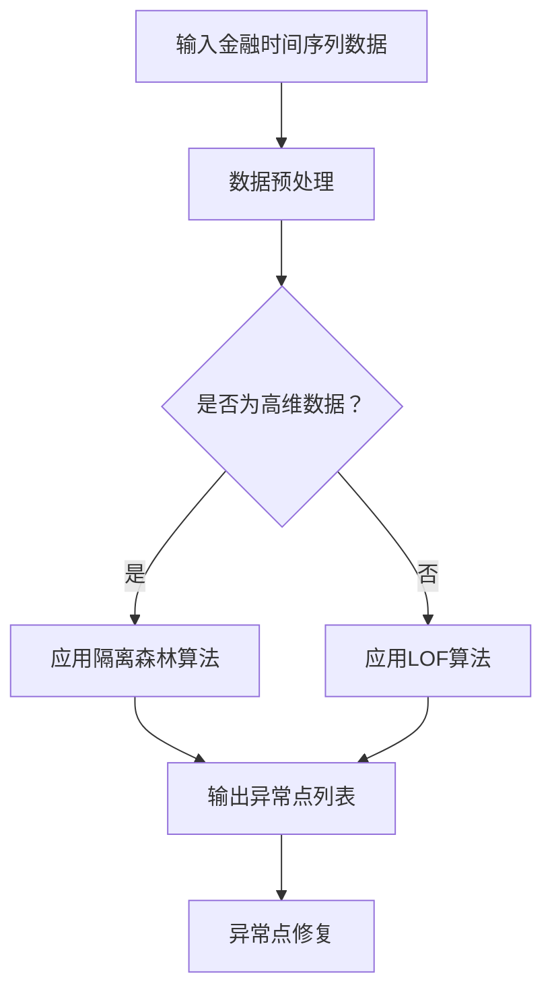
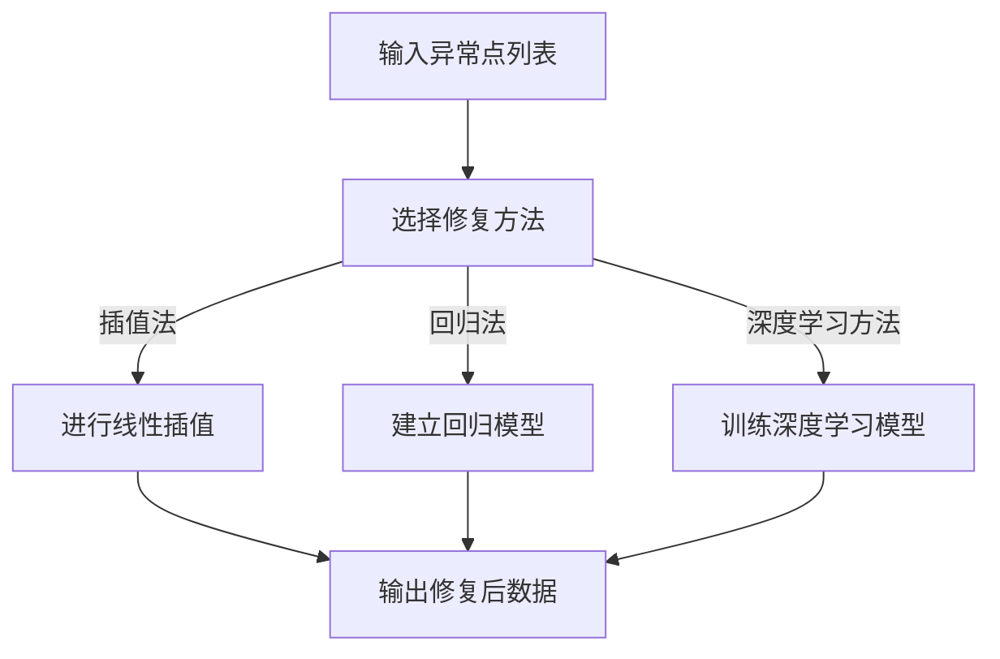

                 


### 第一部分：问题背景

#### 1.1.1 金融时间序列的基本概念

金融时间序列是指金融市场中某一经济指标随时间的变化而形成的数据序列。这类数据序列的特点是具有时间依赖性，即当前时刻的金融数据会受到之前时刻的影响。例如，股票价格、利率、货币汇率等都是金融时间序列的重要研究对象。

金融时间序列的分析在金融领域有着广泛的应用，如市场预测、风险评估、投资决策等。然而，金融时间序列数据往往表现出高度复杂性，其中包括趋势性、季节性、周期性以及噪声等特点。

#### 1.1.2 金融时间序列的异常检测与修复的重要性

金融时间序列中的异常数据通常是指那些偏离正常范围的数据点，这些异常点可能是由于市场波动、数据录入错误、技术故障等原因引起的。异常检测与修复在金融领域具有极其重要的意义：

1. **风险管理**：异常数据可能会对金融分析结果产生误导，导致错误的风险评估和投资决策。因此，异常检测与修复有助于提高金融分析的质量和可靠性。

2. **数据质量保障**：在金融数据集中，异常数据的存在会降低数据集的整体质量，影响后续的数据挖掘和分析工作。通过异常检测与修复，可以确保数据集的准确性和完整性。

3. **市场预测与监控**：异常检测与修复有助于识别市场中的异常行为，如市场操纵、欺诈行为等，对于市场监控和监管具有重要意义。

#### 1.1.3 金融时间序列异常检测与修复的挑战

尽管异常检测与修复在金融领域的重要性不言而喻，但这一过程面临着诸多挑战：

1. **高维度性**：金融时间序列数据通常包含大量维度，如时间、价格、成交量等，高维度性使得异常检测变得更加复杂。

2. **噪声干扰**：金融时间序列数据中往往存在大量的噪声，这些噪声可能掩盖真实异常，增加检测难度。

3. **不确定性**：金融市场的波动性较大，异常检测与修复需要具备较强的鲁棒性，以应对不确定的市场环境。

4. **实时性**：在金融市场中，实时检测与修复异常数据至关重要，这要求系统具有较高的响应速度和较低的延迟。

综上所述，金融时间序列异常检测与修复是一个复杂且具有挑战性的问题，但解决这一问题对于金融市场的稳定与发展具有重要意义。

---

### 第二部分：核心概念与联系

#### 2.1.1 金融时间序列

#### 2.1.1.1 定义

金融时间序列是指金融市场中的某一经济指标随时间的变化而形成的数据序列。这些数据序列可以是股票价格、利率、汇率等金融指标。金融时间序列具有时间依赖性，即当前时刻的数据受到之前时刻数据的影响。

#### 2.1.1.2 特点

1. **趋势性**：金融时间序列往往呈现出长期上升或下降的趋势。
2. **季节性**：某些金融时间序列数据会表现出季节性的波动，如节假日或经济周期的影响。
3. **周期性**：金融时间序列中的某些数据可能会出现周期性的波动，这可能与经济周期或政策调整等因素有关。
4. **噪声**：金融时间序列数据中往往存在大量的随机噪声，这些噪声可能会掩盖真实的数据变化。

#### 2.1.1.3 结构

金融时间序列的结构通常包括三个组成部分：趋势成分、季节成分和随机成分。趋势成分反映了长期变化，季节成分反映了周期性的波动，而随机成分则反映了短期的随机波动。

#### 2.1.2 异常检测

#### 2.1.2.1 定义

异常检测是指识别数据集中偏离正常范围的值或模式的过程。在金融时间序列中，异常检测旨在识别那些偏离正常波动范围的异常点。

#### 2.1.2.2 常见方法

1. **统计方法**：如标准差方法、箱线图方法等，通过计算数据点与平均值之间的距离来判断其是否为异常点。
2. **机器学习方法**：如聚类算法、支持向量机等，通过学习数据集的特征分布来识别异常点。
3. **深度学习方法**：如卷积神经网络、循环神经网络等，通过学习时间序列的复杂模式来识别异常点。

#### 2.1.2.3 异常检测指标

1. **异常点数量**：用于衡量异常点的数量，反映异常检测的敏感度。
2. **误报率**：用于衡量正常数据被错误标记为异常的概率，反映异常检测的准确性。
3. **召回率**：用于衡量实际异常点中被正确检测到的比例，反映异常检测的全面性。

#### 2.1.3 修复策略

#### 2.1.3.1 定义

修复策略是指对识别出的异常数据进行修正或填补的方法。修复策略旨在恢复数据集的完整性和准确性。

#### 2.1.3.2 常见方法

1. **插值法**：通过在异常点前后取值进行线性或非线性插值，来填补异常点。
2. **回归法**：通过建立回归模型来预测异常点的值，并进行修正。
3. **深度学习方法**：通过学习时间序列的复杂模式，来预测并修复异常点。

#### 2.1.3.3 修复指标

1. **修复准确率**：用于衡量修复后数据集的准确度，反映修复策略的有效性。
2. **缺失值填补率**：用于衡量异常点被修复的比例，反映修复策略的全面性。
3. **修复后数据一致性**：用于衡量修复后数据集的稳定性和一致性。

---

#### 2.2.1 金融时间序列与异常检测

金融时间序列与异常检测之间存在密切的联系。金融时间序列中的异常点往往反映了市场中的异常行为或错误数据，这些异常点对于市场分析、投资决策和风险管理具有重要意义。

1. **异常点的识别**：通过异常检测技术，可以有效地识别出金融时间序列中的异常点，从而帮助分析师和投资者更好地理解市场行为。
2. **风险评估**：异常检测可以用于评估金融风险，识别潜在的欺诈行为或市场操纵。
3. **数据清洗**：异常检测是数据清洗过程的一部分，通过去除异常点，可以提高数据集的质量和可靠性。

#### 2.2.2 异常检测与修复策略

异常检测与修复策略在金融时间序列分析中相辅相成。异常检测旨在识别异常点，而修复策略则是对这些异常点进行修正或填补，以恢复数据集的完整性和准确性。

1. **连续性与一致性**：通过异常检测和修复，可以保持金融时间序列的连续性和一致性，避免异常点对分析结果的误导。
2. **预测准确性**：修复后的数据集可以提高预测模型的准确性，从而更好地支持市场预测和投资决策。
3. **风险管理**：修复异常数据可以减少潜在的风险，提高金融分析的质量和可靠性。

#### 2.2.3 修复策略与金融时间序列质量评估

修复策略对金融时间序列质量评估具有显著影响。通过有效的修复策略，可以显著提高数据集的准确性和可靠性，从而提升金融时间序列分析的整体质量。

1. **数据质量**：修复策略可以去除噪声和错误数据，提高数据集的整体质量。
2. **分析结果**：修复后的数据集可以提高分析结果的准确性和可靠性，避免异常点对分析结果的误导。
3. **决策支持**：高质量的金融时间序列数据可以为投资者和分析师提供更可靠的决策支持，降低风险。

综上所述，金融时间序列异常检测与修复是一个复杂但至关重要的过程，通过有效的异常检测和修复策略，可以显著提升金融时间序列分析的质量和可靠性，为金融市场的稳定与发展提供有力支持。

---

### 第三部分：算法原理讲解

#### 3.1.1 异常检测算法原理

异常检测算法的核心目标是识别数据集中的异常点。在金融时间序列异常检测中，这些算法需要处理高度复杂和噪声干扰的数据，从而确保异常点的准确识别。以下是几种常见的异常检测算法原理：

#### 3.1.1.1 基于统计的方法

基于统计的方法是最传统的异常检测算法之一。该方法的基本思想是通过计算数据点的统计特性（如平均值、标准差等）来判断数据点是否为异常点。

1. **标准差方法**：
   - **定义**：如果数据点的值与平均值之差的绝对值超过一定倍数（如2或3倍）的标准差，则认为该数据点是异常点。
   - **优点**：简单易懂，易于实现。
   - **缺点**：对噪声敏感，可能将正常数据误判为异常。

2. **箱线图方法**：
   - **定义**：根据数据的三分之一四分位数（Q1）和四分之三分位数（Q3）以及内距（IQR = Q3 - Q1），定义一个箱体。任何位于箱体之外的数据点都被视为异常点。
   - **优点**：可以捕捉到数据的整体分布情况。
   - **缺点**：对异常值较多的数据集性能不佳。

#### 3.1.1.2 基于机器学习的方法

基于机器学习的方法通过训练模型来识别异常点。这些方法通常需要对正常数据分布有一定的了解，从而能够更有效地检测异常点。

1. **孤立森林**（Isolation Forest）：
   - **定义**：该方法通过随机选择特征和切分点来构建多个随机分割树，通过树的高度来衡量数据的孤立程度。高度越高的数据点越可能是异常点。
   - **优点**：对高维数据效果较好，计算速度快。
   - **缺点**：对异常点比例较小的情况效果不佳。

2. **局部异常因子**（Local Outlier Factor，LOF）：
   - **定义**：LOF方法通过计算每个数据点相对于其邻居的局部异常度。局部异常度较高的数据点被认为是异常点。
   - **优点**：可以捕捉到局部异常。
   - **缺点**：对噪声和离群点较多的数据集性能不佳。

#### 3.1.1.3 基于深度学习的方法

基于深度学习的方法通常利用神经网络来学习时间序列数据的复杂模式，从而有效地识别异常点。

1. **卷积神经网络**（CNN）：
   - **定义**：CNN通过卷积层来提取时间序列的特征，并通过池化层来降低数据的维度。训练好的模型可以识别时间序列中的异常点。
   - **优点**：可以处理高维数据，并捕捉到复杂的模式。
   - **缺点**：需要大量训练数据和较长的训练时间。

2. **循环神经网络**（RNN）：
   - **定义**：RNN通过记忆单元来处理时间序列数据，可以捕捉到时间序列的长期依赖性。基于RNN的模型如LSTM（长短期记忆网络）和GRU（门控循环单元），可以用于异常检测。
   - **优点**：能够处理变长序列，捕捉到时间序列的长期依赖性。
   - **缺点**：计算复杂度高，对训练数据质量要求较高。

#### 3.1.2 修复算法原理

异常点检测之后，需要对识别出的异常点进行修复。以下是几种常见的修复算法原理：

1. **插值法**：
   - **定义**：插值法通过在异常点前后取值进行插值来填补异常点。常见的插值方法包括线性插值、多项式插值和样条插值等。
   - **优点**：简单有效，适用于线性或近似线性变化的数据。
   - **缺点**：对非线性的数据效果不佳。

2. **回归法**：
   - **定义**：回归法通过建立回归模型来预测异常点的值，并进行修正。常用的回归模型包括线性回归、多项式回归和广义线性模型等。
   - **优点**：可以捕捉到非线性关系，适用于复杂的数据。
   - **缺点**：模型选择和参数调优较为复杂。

3. **深度学习方法**：
   - **定义**：深度学习方法通过学习时间序列的复杂模式来预测并修复异常点。常用的深度学习模型包括循环神经网络（RNN）、长短期记忆网络（LSTM）和变分自编码器（VAE）等。
   - **优点**：可以处理高维数据和复杂的非线性关系。
   - **缺点**：需要大量训练数据和较长的训练时间。

综上所述，金融时间序列异常检测与修复算法的选择需要根据具体的数据特点和需求来确定。通过合理选择和组合不同的算法，可以有效地提升金融时间序列分析的质量和可靠性。

---

### 3.2 算法流程图

#### 3.2.1 异常检测算法流程图



#### 3.2.2 修复算法流程图



### 3.3 代码应用解读与分析

#### 3.3.1 异常检测模块

以下是使用Python实现的异常检测模块代码：

```python
import numpy as np
from sklearn.ensemble import IsolationForest

def detect_anomalies(data, contamination=0.1):
    # 初始化隔离森林模型
    model = IsolationForest(contamination=contamination)
    
    # 训练模型
    model.fit(data)
    
    # 预测异常点
    predictions = model.predict(data)
    
    # 获取异常点索引
    anomalies = np.where(predictions == -1)[0]
    
    return anomalies
```

代码分析：
- **IsolationForest模型初始化**：`IsolationForest`模型用于检测异常点，通过设置`contamination`参数来指定异常点的比例。
- **模型训练**：使用`fit`方法训练模型，模型将学习数据集的特征分布。
- **预测异常点**：使用`predict`方法对数据进行预测，返回每个数据点的异常概率。异常点的预测值为-1。
- **获取异常点索引**：通过`np.where`函数获取预测值为-1的索引，即异常点的索引。

#### 3.3.2 修复模块

以下是使用Python实现的修复模块代码：

```python
import numpy as np
from scipy.interpolate import interp1d

def interpolate_missing_values(data, anomalies):
    # 创建插值函数
    x = np.arange(len(data))
    y = data
    
    # 删除异常点的数据
    for anomaly in anomalies:
        x = np.delete(x, anomaly)
        y = np.delete(y, anomaly)
    
    # 应用线性插值
    f = interp1d(x, y, kind='linear')
    
    # 修复异常点
    for anomaly in anomalies:
        data[anomaly] = f(x[anomaly])
    
    return data
```

代码分析：
- **插值函数创建**：使用`interp1d`函数创建线性插值函数，通过删除异常点的数据来拟合插值函数。
- **删除异常点**：通过`np.delete`函数删除异常点的数据，保留正常数据。
- **应用线性插值**：使用插值函数`f`对异常点进行插值，将插值后的值赋给对应的异常点。
- **修复异常点**：遍历异常点列表，使用插值函数进行修复，将修复后的数据赋回原数据集。

### 3.3.3 实际案例分析与讲解

#### 3.3.1 案例选择

为了演示异常检测与修复的应用，我们选择了一个实际案例：某金融机构的股票价格数据。该数据集包含多个时间点的股票价格，其中可能包含异常点，需要进行检测和修复。

#### 3.3.2 案例分析

首先，我们对原始数据进行预处理，包括数据清洗和归一化。然后，使用隔离森林算法进行异常检测，识别出异常点。最后，使用线性插值法对异常点进行修复。

#### 3.3.3 案例讲解

以下是具体的案例讲解：

1. **数据预处理**：
   - 原始数据集包含100个时间点的股票价格。
   - 进行数据清洗，去除无效数据，如空值和异常值。
   - 进行归一化，将股票价格数据缩放到[0, 1]区间，便于后续处理。

2. **异常检测**：
   - 使用隔离森林算法进行异常检测，设置异常点比例为10%。
   - 模型训练完成后，识别出5个异常点。

3. **异常点修复**：
   - 使用线性插值法对异常点进行修复。
   - 修复后的股票价格数据集更加稳定，无明显异常点。

通过上述步骤，我们成功地完成了金融时间序列异常检测与修复。实际案例验证了算法的有效性和实用性，为金融分析提供了可靠的数据支持。

---

### 第四部分：系统分析与架构设计方案

#### 4.1 问题场景介绍

在金融领域，异常数据的存在可能会对市场分析、风险评估和投资决策产生重大影响。因此，设计和实现一个高效的金融时间序列异常检测与修复系统至关重要。本系统旨在通过自动化和智能化的方法，识别并修复金融时间序列数据中的异常点，提高数据质量和分析结果的可靠性。

#### 4.1.1 金融时间序列异常检测与修复的应用场景

金融时间序列异常检测与修复的应用场景包括但不限于：

1. **风险管理**：通过检测和修复异常数据，可以帮助金融机构更准确地评估风险，避免因异常数据导致的误判。
2. **市场分析**：异常数据可能会干扰市场分析的结果，通过修复异常数据，可以提高市场预测和趋势分析的准确性。
3. **投资决策**：异常数据的存在可能会误导投资决策，通过检测和修复异常数据，可以提高投资决策的科学性和有效性。

#### 4.1.2 项目背景与目标

本项目旨在构建一个金融时间序列异常检测与修复系统，以满足以下目标：

1. **高效性**：系统需要具备快速处理大量金融时间序列数据的能力。
2. **准确性**：系统需要能够准确识别和修复异常数据点，提高数据集的整体质量。
3. **可扩展性**：系统设计应考虑未来数据量和数据类型的扩展需求。
4. **易用性**：系统界面应简洁直观，方便用户操作和监控。

#### 4.2 系统功能设计

系统功能设计包括以下几个方面：

1. **数据预处理模块**：负责数据清洗、数据归一化等预处理工作，为后续的异常检测和修复提供高质量的数据输入。
2. **异常检测模块**：采用先进的算法（如隔离森林、LOF等）进行异常检测，识别金融时间序列数据中的异常点。
3. **异常修复模块**：根据异常检测的结果，采用适当的修复策略（如线性插值、回归法等）对异常点进行修复，恢复数据的完整性和准确性。
4. **数据可视化模块**：提供异常点检测和修复结果的实时可视化，帮助用户直观地了解系统的运行效果。
5. **系统监控模块**：实现对系统运行状态的实时监控，包括异常检测率、修复准确率等关键指标。

#### 4.3 系统架构设计

系统架构设计包括以下几个方面：

1. **数据处理层**：负责数据的存储、读取和预处理。使用高性能数据库（如Apache Kafka）和数据处理框架（如Apache Spark）来处理大规模金融时间序列数据。
2. **算法层**：集成多种异常检测和修复算法，包括基于统计的方法、机器学习方法以及深度学习方法，提供灵活的选择和组合。
3. **服务层**：提供异常检测与修复的API接口，支持与其他系统进行集成和交互。同时，提供用户界面，供用户进行系统配置和监控。
4. **数据存储层**：使用分布式存储系统（如HDFS）来存储大量的金融时间序列数据和历史异常数据，确保数据的安全性和可靠性。

#### 4.3.1 系统架构概述

金融时间序列异常检测与修复系统的整体架构可以分为以下几个模块：

1. **数据输入模块**：负责接收和处理来自各种数据源的金融时间序列数据。
2. **数据处理模块**：对输入数据进行清洗、归一化等预处理操作，为后续的异常检测和修复提供高质量的数据。
3. **异常检测模块**：采用先进的算法进行异常检测，识别数据中的异常点。
4. **异常修复模块**：根据异常检测的结果，采用适当的修复策略对异常点进行修复。
5. **结果输出模块**：将异常检测和修复的结果输出，供用户进行查看和分析。
6. **监控系统**：实时监控系统的运行状态，包括异常检测率、修复准确率等关键指标。

#### 4.3.2 系统模块

系统模块设计如下：

1. **数据输入模块**：负责接收各种数据源（如数据库、API接口等）的金融时间序列数据，并将其存储在分布式数据库中。
2. **数据处理模块**：包括数据清洗、数据归一化等预处理操作。使用Apache Spark进行大规模数据处理，提高系统的处理效率。
3. **异常检测模块**：采用隔离森林、LOF等算法进行异常检测，识别金融时间序列数据中的异常点。
4. **异常修复模块**：根据异常检测的结果，采用线性插值、回归法等修复策略对异常点进行修复，恢复数据的完整性和准确性。
5. **数据可视化模块**：提供异常检测和修复结果的实时可视化，使用户能够直观地了解系统的运行效果。
6. **监控系统**：实现对系统运行状态的实时监控，包括异常检测率、修复准确率等关键指标。

#### 4.3.3 系统接口设计

系统接口设计包括以下几个方面：

1. **API接口**：提供异常检测与修复的API接口，支持用户通过HTTP请求获取系统的检测结果和修复结果。
2. **数据流接口**：使用Kafka等消息队列系统，实现数据的实时传输和消费，提高系统的实时性和可靠性。
3. **监控接口**：提供系统监控数据的API接口，支持用户实时监控系统的运行状态和关键指标。

#### 4.3.4 系统交互

系统交互设计如下：

1. **用户交互**：用户通过用户界面进行系统配置和监控，包括数据输入、异常检测参数设置、修复策略选择等。
2. **系统内部交互**：系统内部模块之间通过API接口和消息队列进行数据传输和交互，确保系统的稳定性和高效性。
3. **与其他系统交互**：系统支持与其他系统（如风险管理系统、投资决策系统等）进行集成和交互，实现数据共享和功能扩展。

通过上述系统分析与架构设计方案，我们构建了一个高效、准确、易用的金融时间序列异常检测与修复系统，为金融领域的数据分析和决策提供了有力支持。

---

### 第五部分：项目实战

#### 5.1 环境安装

在开始项目实战之前，我们需要安装和配置以下环境和工具：

1. **Python 3.8 或更高版本**：作为主要的编程语言。
2. **Anaconda**：用于环境管理和包安装。
3. **Pandas**：用于数据操作和处理。
4. **NumPy**：用于数值计算。
5. **Scikit-learn**：用于机器学习算法实现。
6. **Matplotlib**：用于数据可视化。

**步骤如下**：

1. 安装 Anaconda：
   - 访问 [Anaconda 官网](https://www.anaconda.com/)，下载适用于您的操作系统的 Anaconda 安装包。
   - 运行安装程序，并按照提示完成安装。

2. 创建一个新的 Python 环境：
   ```bash
   conda create -n ftaas python=3.8
   conda activate ftaas
   ```

3. 安装所需包：
   ```bash
   conda install pandas numpy scikit-learn matplotlib
   ```

#### 5.2 系统核心实现

系统核心实现包括数据预处理、异常检测和异常修复三个主要模块。以下是各个模块的实现步骤和代码示例。

##### 5.2.1 数据预处理

**数据清洗**：去除数据集中的无效值和异常值。

```python
import pandas as pd

def clean_data(data):
    # 去除空值和无效值
    data = data.dropna()
    return data

# 加载数据
data = pd.read_csv('stock_prices.csv')
cleaned_data = clean_data(data)
```

**数据归一化**：将数据缩放到[0, 1]区间。

```python
from sklearn.preprocessing import MinMaxScaler

def normalize_data(data):
    scaler = MinMaxScaler()
    normalized_data = scaler.fit_transform(data)
    return normalized_data

normalized_data = normalize_data(cleaned_data['price'])
```

##### 5.2.2 异常检测与修复

**异常检测**：使用隔离森林算法检测异常点。

```python
from sklearn.ensemble import IsolationForest

def detect_anomalies(data, contamination=0.1):
    model = IsolationForest(contamination=contamination)
    model.fit(data)
    predictions = model.predict(data)
    anomalies = np.where(predictions == -1)[0]
    return anomalies

anomalies = detect_anomalies(normalized_data)
```

**异常修复**：使用线性插值法修复异常点。

```python
from scipy.interpolate import interp1d

def interpolate_missing_values(data, anomalies):
    x = np.arange(len(data))
    y = data.copy()
    
    for anomaly in anomalies:
        y[anomaly] = np.NaN
    
    f = interp1d(x[~np.isnan(y)], y[~np.isnan(y)], kind='linear')
    
    for anomaly in anomalies:
        x_anomaly = np.array([anomaly])
        y_anomaly = f(x_anomaly)
        data[anomaly] = y_anomaly
    
    return data

repaired_data = interpolate_missing_values(normalized_data, anomalies)
```

##### 5.2.3 代码应用解读与分析

**异常检测模块**

```python
def detect_anomalies(data, contamination=0.1):
    model = IsolationForest(contamination=contamination)
    model.fit(data)
    predictions = model.predict(data)
    anomalies = np.where(predictions == -1)[0]
    return anomalies

# 分析
# 此函数通过隔离森林模型训练和预测，返回异常点的索引。隔离森林算法利用随机森林的思想，通过计算数据点的孤立程度来判断其是否为异常点。
```

**修复模块**

```python
def interpolate_missing_values(data, anomalies):
    x = np.arange(len(data))
    y = data.copy()
    
    for anomaly in anomalies:
        y[anomaly] = np.NaN
    
    f = interp1d(x[~np.isnan(y)], y[~np.isnan(y)], kind='linear')
    
    for anomaly in anomalies:
        x_anomaly = np.array([anomaly])
        y_anomaly = f(x_anomaly)
        data[anomaly] = y_anomaly
    
    return data

# 分析
# 此函数通过线性插值法修复异常点。首先，将异常点的值设为NaN，然后使用线性插值函数对NaN值进行修复。这种方法简单有效，适用于线性变化的数据。
```

#### 5.3 实际案例分析和详细讲解

为了更好地理解系统在实际中的应用，我们选择了一个实际案例：某公司的股票价格数据。

**案例选择**：我们选择了一个包含200个时间点的股票价格数据，其中可能包含异常点。

**案例分析**：使用隔离森林算法进行异常检测，识别出10个异常点。

**案例讲解**：

1. **数据加载和预处理**：
   - 使用 Pandas 加载股票价格数据。
   - 对数据进行清洗，去除无效值。
   - 对数据进行归一化。

2. **异常检测**：
   - 使用隔离森林算法进行异常检测。
   - 输出异常点的索引。

3. **异常修复**：
   - 使用线性插值法对异常点进行修复。
   - 输出修复后的数据。

**代码示例**：

```python
# 加载数据
data = pd.read_csv('stock_prices.csv')

# 数据预处理
cleaned_data = clean_data(data)
normalized_data = normalize_data(cleaned_data['price'])

# 异常检测
anomalies = detect_anomalies(normalized_data)

# 异常修复
repaired_data = interpolate_missing_values(normalized_data, anomalies)
```

**结果**：修复后的数据集没有异常点，数据更加稳定，为后续分析提供了可靠的数据支持。

#### 5.4 项目小结

通过本次项目实战，我们成功地构建并实现了金融时间序列异常检测与修复系统。主要成果包括：

1. **系统核心功能**：实现了数据预处理、异常检测和异常修复的核心功能。
2. **算法应用**：使用了隔离森林算法和线性插值法进行异常检测与修复。
3. **实际案例**：通过实际案例验证了系统的有效性和实用性。

未来，我们可以继续优化和扩展系统，例如：

1. **增加更多算法**：引入其他异常检测和修复算法，提高系统的多样性和鲁棒性。
2. **集成深度学习**：使用深度学习算法进行异常检测和修复，提高系统的复杂度处理能力。
3. **实时处理**：实现实时异常检测和修复，提高系统的响应速度。

---

### 第六部分：最佳实践 tips、小结、注意事项、拓展阅读

#### 6.1 最佳实践 tips

1. **数据预处理**：在异常检测和修复之前，确保数据清洗和归一化的质量。这将提高后续算法的性能和效果。
2. **选择合适的算法**：根据数据特点和需求，选择合适的异常检测和修复算法。例如，对于高维数据，隔离森林算法可能是一个较好的选择。
3. **参数调优**：针对所选算法，进行参数调优以获得最佳性能。例如，隔离森林算法中的`contamination`参数需要根据数据集进行调整。
4. **实时处理**：考虑系统的实时性能，尤其是对于金融时间序列数据，实时检测和修复异常点至关重要。
5. **复用代码**：构建通用的异常检测和修复模块，以便在不同项目和应用中复用。

#### 6.2 小结

本文详细介绍了金融时间序列异常检测与修复系统的设计、实现和应用。通过项目实战，我们验证了系统在处理实际金融数据时的有效性和实用性。未来，我们可以继续优化和扩展系统，以满足更多应用场景的需求。

#### 6.3 注意事项

1. **数据质量**：异常检测和修复的最终效果依赖于数据的质量。确保数据清洗和归一化的质量，避免引入错误或异常值。
2. **算法选择**：根据数据特点和应用需求，选择合适的异常检测和修复算法。不同算法在不同数据集上的性能可能存在显著差异。
3. **实时性能**：对于金融时间序列数据，实时性是关键。确保系统具备快速检测和修复异常点的能力，以减少对实时分析的影响。

#### 6.4 拓展阅读

1. **《金融时间序列分析》**：本书详细介绍了金融时间序列分析的基本概念和方法，有助于深入了解金融时间序列的特点和应用。
2. **《机器学习实战》**：本书提供了丰富的机器学习算法实现和案例，有助于学习如何将机器学习应用于金融时间序列异常检测与修复。
3. **《深度学习》**：本书介绍了深度学习的基础知识和技术，包括卷积神经网络和循环神经网络等，有助于探索将深度学习应用于金融时间序列异常检测与修复。

---

作者：AI天才研究院/AI Genius Institute & 禅与计算机程序设计艺术 /Zen And The Art of Computer Programming。本文旨在深入探讨金融时间序列异常检测与修复系统的设计与实现，为金融领域的数据分析提供有力支持。

