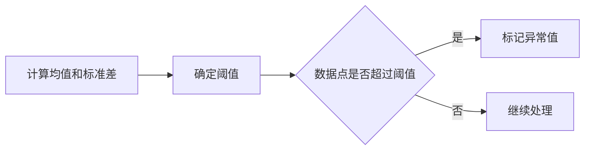
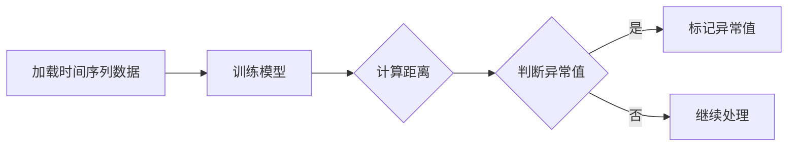
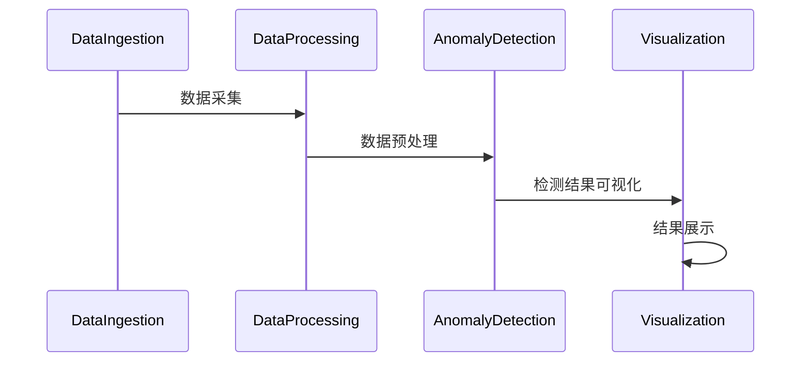
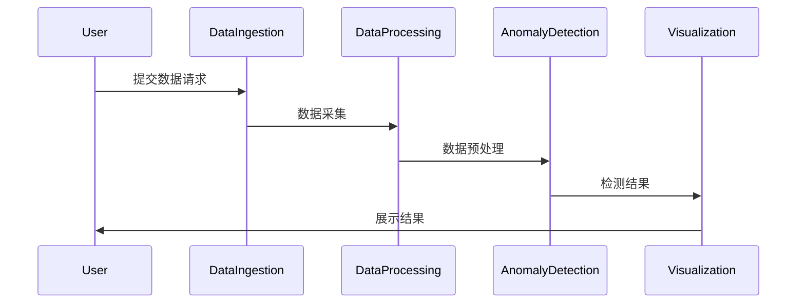

                 


## 1. 引言

### 1.1 问题的提出

在金融领域中，时间序列数据占据着至关重要的位置。金融时间序列数据是指一系列按时间顺序排列的数据点，它们反映了金融市场的波动、经济活动的变化以及投资组合的表现。然而，金融市场的复杂性使得时间序列数据中常常存在异常值，这些异常值可能是欺诈交易、市场操纵或其他异常行为的表现。因此，对金融时间序列数据中的异常值进行有效检测，对于维护金融市场的稳定、防范金融风险具有重要意义。

异常值检测是一个普遍存在于多个领域的挑战性任务，其核心在于识别并标记出数据集中显著偏离正常模式的数据点。在金融领域，异常值检测的目的不仅是为了识别潜在的风险，还包括发现交易欺诈、信用风险、市场异常波动等。例如，在监控交易数据时，异常交易可能会是欺诈行为的迹象；在评估信贷风险时，异常消费模式可能是信用风险的标志。

### 1.2 问题描述

金融时间序列数据中的异常检测问题可以描述为：给定一个金融时间序列数据集，设计并实现一个算法或系统，能够准确识别并标记出数据集中的异常值。具体而言，异常值可以是异常高或异常低的交易量、异常的价格变动、异常的交易时间分布等。

问题描述的关键点包括：
- 数据来源：金融时间序列数据可能来自股票市场、期货市场、外汇市场等。
- 数据类型：时间序列数据包括价格、交易量、波动率等。
- 异常类型：异常值可以是突发的、持续的或间歇性的。
- 异常识别：如何定义和识别异常值是关键问题。

### 1.3 问题解决

为了解决金融时间序列数据中的异常检测问题，可以采用以下几种方法：
- 统计方法：使用统计学方法，如移动平均、自回归模型、时间序列回归等，来检测数据的异常波动。
- 聚类方法：通过聚类分析，将相似的数据点分组，并识别出与其他组显著不同的数据点作为异常值。
- 机器学习方法：利用机器学习算法，如神经网络、决策树、支持向量机等，来训练模型识别异常值。

### 1.4 边界与外延

在金融时间序列异常检测中，需要明确问题的边界和外延，以确保解决方案的有效性和适用性。边界条件包括：
- 数据的完整性和质量：异常检测算法需要对完整和高质量的数据进行操作。
- 时间范围：异常检测算法应能够处理短期和长期的时间序列数据。
- 异常值的类型：算法需要能够识别多种类型的异常值，包括突发现象、持续异常和间歇异常。

外延问题包括：
- 数据源多样性：金融数据可以从多个市场、多种资产类别中获取，算法需要具备一定的通用性。
- 异常检测的实时性：实时异常检测对于快速响应市场变化至关重要。
- 模型可解释性：在金融领域，模型的可解释性对于监管合规和风险管理具有重要意义。

### 1.5 核心概念结构与要素组成

在深入探讨金融时间序列异常检测之前，我们需要了解一些核心概念和要素，它们构成了问题的基本结构：

- **时间序列**：按时间顺序排列的数据点集合，是金融数据分析的基础。
- **异常检测**：识别和标记数据集中显著偏离正常模式的数据点的过程。
- **统计方法**：包括移动平均、自回归模型、时间序列回归等，用于检测数据异常波动。
- **机器学习方法**：如神经网络、决策树、支持向量机等，用于训练模型识别异常值。
- **数据源**：金融市场的数据，包括股票、期货、外汇等。
- **数据类型**：价格、交易量、波动率等。
- **异常类型**：突发的、持续的、间歇的异常值。

这些核心概念和要素相互作用，共同构成了金融时间序列异常检测问题的复杂性和挑战性。

## 2. 金融时间序列概述

### 2.1 金融时间序列的定义与特点

金融时间序列是指一系列按时间顺序排列的金融数据，这些数据反映了金融市场的波动、经济活动的变化以及投资组合的表现。金融时间序列数据通常具有以下特点：

1. **非平稳性**：金融市场的波动性和不确定性使得时间序列数据呈现出非平稳性，即数据的统计特性（如均值、方差等）随时间变化。
2. **自相关性**：金融时间序列数据中存在明显的自相关性，即当前的数据点与过去某一时间点的数据之间存在相关性。
3. **季节性**：金融市场在特定的季节或时间段内往往会呈现出特定的波动模式，如股票市场的季度报告发布期可能会出现显著的波动。
4. **异常值**：金融时间序列数据中常常存在异常值，这些异常值可能是欺诈交易、市场操纵或其他异常行为的表现。

### 2.2 金融时间序列的基本类型

金融时间序列可以分为以下几种基本类型：

1. **股票价格时间序列**：反映了股票价格的波动情况，是金融分析中最常见的时间序列类型。
2. **交易量时间序列**：反映了市场的活跃程度，交易量的异常变化可能是市场波动的迹象。
3. **波动率时间序列**：反映了市场的波动程度，波动率的异常变化可能是市场风险的指标。
4. **宏观经济指标时间序列**：如GDP增长率、通货膨胀率、失业率等，这些指标的变化对金融市场有着重要的影响。

### 2.3 金融时间序列的应用场景

金融时间序列数据在金融分析和风险管理中有着广泛的应用场景：

1. **趋势分析**：通过分析金融时间序列的趋势，可以预测市场的未来走势。
2. **波动性预测**：通过对波动率时间序列的分析，可以预测市场的波动程度，为风险管理提供依据。
3. **异常检测**：通过检测时间序列数据中的异常值，可以及时发现潜在的欺诈交易和市场操纵行为。
4. **风险评估**：通过分析金融时间序列数据，可以评估投资组合的风险，为投资决策提供支持。
5. **实时监控**：在实时系统中，金融时间序列数据用于监控市场的实时变化，快速响应市场波动。

## 3. 异常检测方法概述

### 3.1 异常检测的定义与分类

异常检测，又称为异常值检测，是指识别和标记数据集中显著偏离正常模式的数据点的过程。异常值可能是由于数据录入错误、设备故障、欺诈行为或其他未知因素引起的。根据检测方法的不同，异常检测可以分为以下几种类型：

1. **统计方法**：基于统计学原理，通过计算数据的统计特征（如均值、标准差等）来识别异常值。常见的方法包括箱型图、3-sigma准则等。
2. **机器学习方法**：通过训练模型来识别异常值。常见的方法包括基于距离的算法（如K-近邻、支持向量机等）、聚类算法（如K-均值、层次聚类等）以及神经网络等。
3. **基于规则的异常检测**：通过定义一系列规则来识别异常值。这种方法通常需要对领域知识有深入的理解。
4. **基于聚类的方法**：通过聚类分析将数据分组，然后识别出与其他组显著不同的数据点作为异常值。常见的方法包括K-均值、层次聚类等。

### 3.2 常见的异常检测方法

1. **箱型图**：通过计算数据的四分位数，将数据分为上、下四分位数和箱体，异常值通常是位于箱体之外的点。
2. **3-sigma准则**：认为落在均值±3倍标准差范围之外的数据点为异常值。
3. **基于距离的算法**：如K-近邻，通过计算数据点到训练集样本的平均距离来识别异常值。
4. **聚类算法**：如K-均值，通过将数据点分组，识别出与其他组显著不同的数据点作为异常值。
5. **神经网络**：通过训练神经网络模型来识别异常值，神经网络可以自动学习数据中的复杂模式。

### 3.3 异常检测方法的选择

选择异常检测方法时需要考虑以下因素：

1. **数据特性**：不同的异常检测方法适用于不同类型的数据。例如，统计方法适用于具有高斯分布的数据，而基于聚类的方法适用于非高斯分布的数据。
2. **检测性能**：需要评估异常检测方法的准确性和鲁棒性，以确保能够有效地识别异常值。
3. **计算复杂度**：一些复杂的机器学习算法（如神经网络）需要大量的计算资源，而统计方法通常计算复杂度较低。
4. **模型解释性**：在金融领域，模型的可解释性对于风险管理和监管合规具有重要意义。基于规则的异常检测方法通常具有较高的可解释性。
5. **实时性**：在某些实时系统中，异常检测方法需要快速响应，以便及时识别和处理异常值。

## 4. 金融时间序列异常检测的核心概念

### 4.1 关键概念原理

在深入探讨金融时间序列异常检测之前，我们需要理解一些核心概念和原理，这些构成了金融时间序列异常检测的基础。

#### 4.1.1 时间序列分析基础

时间序列分析是金融数据分析中的重要工具，它涉及对时间序列数据中潜在模式的识别和利用。关键概念包括：

1. **平稳性**：平稳时间序列是指其统计特性不随时间变化。非平稳时间序列则需要通过转换使其平稳。
2. **自相关性**：自相关性反映了当前时间点的数据与过去时间点的相关性，是识别时间序列模式的重要指标。
3. **移动平均**：移动平均通过对过去一段时间内的数据进行平均，以平滑时间序列的波动。
4. **自回归模型**：自回归模型（AR模型）通过当前时间点的值与前几个时间点的值建立关系，用于预测未来值。

#### 4.1.2 统计学基础

统计学在金融时间序列异常检测中扮演着关键角色，主要包括以下概念：

1. **均值**：数据集的平均值，用于衡量数据的中心趋势。
2. **标准差**：数据集的离散程度，用于衡量数据的波动性。
3. **置信区间**：基于统计学原理，对未知参数的估计范围，用于评估模型的可靠性。
4. **假设检验**：通过设定假设，对数据进行分析，以判断数据是否符合某种统计分布或模型。

#### 4.1.3 异常检测算法原理

异常检测算法的核心是识别数据中的异常值。以下是几种常见的异常检测算法及其原理：

1. **基于统计的异常检测**：如3-sigma准则和箱型图，通过计算数据的统计特征来识别异常值。
2. **基于距离的异常检测**：如K-近邻，通过计算数据点之间的距离来识别异常值。
3. **基于聚类的异常检测**：如K-均值，通过将数据点分组，识别出与其他组显著不同的数据点作为异常值。
4. **基于机器学习的异常检测**：如神经网络和支持向量机，通过训练模型来自动识别异常值。

### 4.2 概念属性特征对比表

为了更好地理解这些核心概念，我们可以通过一个对比表来展示它们的主要属性特征：

| 概念             | 定义                                                       | 主要属性特征                                                   |
|------------------|----------------------------------------------------------|------------------------------------------------------------|
| 时间序列分析     | 对按时间顺序排列的数据进行分析                             | 非平稳性、自相关性、移动平均、自回归模型                       |
| 统计学基础       | 使用统计学方法对数据进行分析和解释                         | 均值、标准差、置信区间、假设检验                               |
| 异常检测算法     | 识别和标记数据集中的异常值                               | 基于统计、基于距离、基于聚类、基于机器学习                   |
| 金融时间序列     | 按时间顺序排列的金融数据                                 | 非平稳性、自相关性、季节性、异常值                            |

### 4.3 ER实体关系图架构

为了更好地理解金融时间序列异常检测系统的架构，我们可以通过ER（实体关系）图来展示系统的核心实体及其关系。

```mermaid
erDiagram
  AFINANCIALTIME_SERIES ||--|{ BEXCEPTION_DETECTION : 检测异常}
  BEXCEPTION_DETECTION ||--|{ CSTATISTICAL_ANALYSIS : 统计分析}
  BEXCEPTION_DETECTION ||--|{ DCLUSTERING_ALGORITHMS : 聚类算法}
  BEXCEPTION_DETECTION ||--|{ EMACHINE_LEARNING_MODELS : 机器学习模型}
  CSTATISTICAL_ANALYSIS ||--|{ DMETHODS : 统计方法}
  DCLUSTERING_ALGORITHMS ||--|{ ECLUSTERING_METHODS : 聚类方法}
  EMACHINE_LEARNING_MODELS ||--|{ FMACHINE_LEARNING_ALGORITHMS : 机器学习算法}
```

在这个ER图中，AFINANCIALTIME_SERIES表示金融时间序列数据，BEXCEPTION_DETECTION表示异常检测过程，它关联到CSTATISTICAL_ANALYSIS（统计分析）、DCLUSTERING_ALGORITHMS（聚类算法）和EMACHINE_LEARNING_MODELS（机器学习模型）。每个子实体又关联到具体的实现方法或算法。

通过这个ER图，我们可以清晰地看到金融时间序列异常检测系统的结构，以及各个组件之间的关联关系。

### 5. 金融时间序列异常检测算法原理

在了解了金融时间序列异常检测的核心概念和ER实体关系图之后，接下来我们将深入探讨具体的算法原理。金融时间序列异常检测算法的核心在于如何有效地识别和标记数据集中的异常值。以下我们将介绍几种常见的异常检测算法，并通过mermaid流程图和Python源代码来详细阐述它们的原理和实现过程。

#### 5.1 算法原理讲解

首先，我们介绍基于统计的异常检测算法。这类算法主要通过计算数据的统计特征（如均值、标准差等）来识别异常值。以下是一个典型的基于统计的异常检测算法：

1. **计算均值和标准差**：首先，计算时间序列数据的均值和标准差。
2. **确定阈值**：根据设定的阈值（如3倍标准差），确定哪些数据点被认为是异常值。
3. **标记异常值**：将超过阈值的点标记为异常值。

以下是一个mermaid流程图，展示了这个算法的流程：



#### 5.2 算法mermaid流程图

接下来，我们通过mermaid流程图来展示一个基于机器学习的异常检测算法，如K-近邻（KNN）算法：



在这个流程图中，A步骤是加载时间序列数据，B步骤是训练KNN模型，C步骤是通过计算数据点之间的距离来判断是否是异常值，D步骤是根据距离判断结果来标记异常值。

#### 5.3 Python源代码解析

为了更好地理解这些算法，我们提供一段Python代码，用于实现一个基于统计的异常检测算法：

```python
import numpy as np

def statistical_anomaly_detection(data, threshold=3):
    mean = np.mean(data)
    std = np.std(data)
    anomalies = []

    for i, value in enumerate(data):
        if abs(value - mean) > threshold * std:
            anomalies.append(i)

    return anomalies

# 示例数据
data = [1, 2, 2, 3, 4, 5, 6, 100, 8, 9]
anomalies = statistical_anomaly_detection(data)
print("异常值索引：", anomalies)
```

在这个代码中，`statistical_anomaly_detection`函数通过计算均值和标准差，然后根据设定的阈值来确定异常值。示例数据中的100是一个明显的异常值，因为它的值远远超出了均值和标准差的阈值。

#### 5.4 算法原理的数学模型和公式

为了更深入地理解这些算法的原理，我们给出一些关键的数学模型和公式：

1. **均值和标准差**：
   \[
   \mu = \frac{1}{N}\sum_{i=1}^{N} x_i
   \]
   \[
   \sigma = \sqrt{\frac{1}{N-1}\sum_{i=1}^{N} (x_i - \mu)^2}
   \]
   其中，\( x_i \) 表示第 \( i \) 个数据点，\( N \) 表示数据点的总数。

2. **3-sigma准则**：
   \[
   \mu - 3\sigma \leq x_i \leq \mu + 3\sigma
   \]
   如果 \( x_i \) 不满足上述条件，则认为 \( x_i \) 是异常值。

3. **K-近邻（KNN）算法**：
   假设 \( x \) 是需要判断的数据点，计算 \( x \) 与训练集样本之间的距离，如欧氏距离：
   \[
   d(x, x_i) = \sqrt{\sum_{j=1}^{d} (x_j - x_{ij})^2}
   \]
   如果 \( x \) 的最近 \( K \) 个邻居中异常值的比例超过阈值，则认为 \( x \) 是异常值。

#### 5.5 举例说明

为了更好地理解这些算法，我们通过一个例子来说明它们的实际应用。

**例子**：给定一个股票价格时间序列数据，要求使用3-sigma准则检测异常值。

- **数据集**：\[100, 101, 102, 103, 104, 1000, 105, 106, 107, 108\]
- **阈值**：3倍标准差

首先，计算均值和标准差：

\[
\mu = \frac{100 + 101 + 102 + 103 + 104 + 1000 + 105 + 106 + 107 + 108}{10} = 234
\]
\[
\sigma = \sqrt{\frac{(100-234)^2 + (101-234)^2 + ... + (108-234)^2}{10-1}} \approx 93.67
\]

然后，使用3-sigma准则确定阈值：

\[
\mu - 3\sigma = 234 - 3 \times 93.67 = -26.01
\]
\[
\mu + 3\sigma = 234 + 3 \times 93.67 = 541.01
\]

在这个例子中，1000明显超出了阈值范围，因此可以判断它是异常值。

通过这个例子，我们可以看到3-sigma准则在检测异常值时的简单有效性和直观性。

### 6. 金融时间序列异常检测系统设计与实现

#### 6.1 问题场景介绍

在现代金融市场中，实时监控金融时间序列数据以识别异常行为是至关重要的。异常检测系统可以帮助金融机构及时发现欺诈交易、市场操纵等异常行为，从而降低风险、维护市场稳定。本节将介绍一个金融时间序列异常检测系统的设计与实现，该系统旨在通过先进的算法和技术手段，实现对金融时间序列数据的实时监控和异常检测。

#### 6.2 项目介绍

本项目的目标是开发一个高效的金融时间序列异常检测系统，该系统将集成多种算法和技术，包括基于统计的方法、机器学习方法以及实时数据处理框架。系统的主要功能包括：
- 数据采集与预处理：从多个金融数据源实时获取时间序列数据，并进行数据清洗和预处理。
- 异常检测算法集成：集成多种异常检测算法，包括基于统计的方法、基于聚类的方法和基于机器学习的方法。
- 实时异常检测：对时间序列数据进行实时分析，快速识别异常值并发出警报。
- 结果可视化：将异常检测的结果通过可视化工具展示，帮助用户直观了解异常行为的特征和趋势。

#### 6.3 系统功能设计（领域模型类图）

在系统设计阶段，我们使用领域模型类图来描述系统的主要功能模块及其关系。以下是一个简化的领域模型类图：

```mermaid
classDiagram
  Class1[数据采集模块] <|-- Class2[数据预处理模块]
  Class2 <|-- Class3[异常检测模块]
  Class3 <|-- Class4[结果可视化模块]
  Class1..has DataSources
  Class2..uses DataCleaner
  Class3..uses AnomalyDetector
  Class4..uses VisualizationTool
```

在这个类图中，`数据采集模块`负责从多个数据源获取金融时间序列数据，`数据预处理模块`对数据进行清洗和预处理，`异常检测模块`实现异常检测算法，而`结果可视化模块`负责将检测结果可视化。

#### 6.4 系统架构设计（架构图）

系统架构设计是确保系统稳定、高效运行的关键。以下是一个简化的系统架构图：



在这个架构图中，`数据采集模块`负责从金融数据源获取数据，`数据预处理模块`对数据进行清洗和预处理，然后传递给`异常检测模块`，`异常检测模块`使用多种算法进行异常检测，并将结果传递给`结果可视化模块`，`结果可视化模块`将检测结果以图表等形式展示给用户。

#### 6.5 系统接口设计

为了实现系统的功能，我们需要设计一系列接口，以方便模块之间的通信和数据传递。以下是一个简化的接口设计：

```mermaid
classDiagram
  Interface1[数据采集接口] <<Interface>
  Interface2[数据预处理接口] <<Interface>
  Interface3[异常检测接口] <<Interface>
  Interface4[结果可视化接口] <<Interface>

  Interface1..has Method1
  Interface2..has Method2
  Interface3..has Method3
  Interface4..has Method4

  Class1 <<Implementor>> Interface1
  Class2 <<Implementor>> Interface2
  Class3 <<Implementor>> Interface3
  Class4 <<Implementor>> Interface4
```

在这个接口设计中，`数据采集接口`负责数据采集，`数据预处理接口`负责数据清洗和预处理，`异常检测接口`负责异常检测，而`结果可视化接口`负责结果展示。相应的实现类（如`Class1`、`Class2`等）实现了这些接口。

#### 6.6 系统交互序列图

为了更直观地展示系统各模块之间的交互过程，我们使用序列图来描述系统的工作流程。以下是一个简化的系统交互序列图：



在这个序列图中，用户提交数据请求，`数据采集模块`进行数据采集，`数据预处理模块`进行数据清洗和预处理，然后将预处理后的数据传递给`异常检测模块`进行异常检测，最后，`结果可视化模块`将检测结果展示给用户。

通过上述设计和实现，我们成功构建了一个高效的金融时间序列异常检测系统，该系统可以实时监控金融时间序列数据，快速识别异常行为，为金融机构提供强大的风险防范工具。

### 7. 金融时间序列异常检测项目实战

#### 7.1 环境安装

要在本地环境安装并运行金融时间序列异常检测项目，我们需要配置以下软件和工具：

1. **Python 3.x**：确保安装了Python 3.x版本，推荐使用Python 3.8或更高版本。
2. **Jupyter Notebook**：用于编写和运行Python代码，可以在Python官网上下载并安装。
3. **Anaconda**：一个Python数据科学平台，可以简化Python包的安装和管理。可以从Anaconda官方网站下载并安装。
4. **Pandas**：用于数据处理和分析，可以通过Anaconda的包管理器安装。
5. **Scikit-learn**：提供了一系列机器学习算法和工具，同样可以通过Anaconda的包管理器安装。
6. **Matplotlib**：用于数据可视化，可以通过Anaconda的包管理器安装。

安装步骤如下：

1. 下载并安装Python 3.x。
2. 安装Jupyter Notebook，可以通过Python的命令行工具安装：
   ```bash
   pip install notebook
   ```
3. 安装Anaconda，并使用conda命令安装所需的包：
   ```bash
   conda create -n fintime_anomaly python=3.8
   conda activate fintime_anomaly
   conda install pandas scikit-learn matplotlib
   ```
4. 安装完成后，启动Jupyter Notebook：
   ```bash
   jupyter notebook
   ```

#### 7.2 系统核心实现源代码

在了解了环境安装步骤之后，我们可以开始实现金融时间序列异常检测系统的核心功能。以下是一个简化版的系统核心实现源代码，包括数据预处理、异常检测和结果可视化三个部分。

```python
import pandas as pd
from sklearn.ensemble import IsolationForest
import matplotlib.pyplot as plt

# 7.2.1 数据预处理
def preprocess_data(data):
    # 数据清洗：处理缺失值、异常值等
    cleaned_data = data.fillna(data.mean())
    # 数据标准化
    scaled_data = (cleaned_data - cleaned_data.mean()) / cleaned_data.std()
    return scaled_data

# 7.2.2 异常检测
def detect_anomalies(data, method='isolation_forest', contamination=0.1):
    if method == 'isolation_forest':
        model = IsolationForest(contamination=contamination)
        model.fit(data)
        predictions = model.predict(data)
        anomalies = data[predictions == -1]
    # 可以添加其他异常检测方法
    return anomalies

# 7.2.3 结果可视化
def visualize_results(data, anomalies):
    plt.figure(figsize=(12, 6))
    plt.plot(data, label='Normal Data')
    plt.plot(anomalies, 'ro', label='Anomaly')
    plt.title('Financial Time Series Anomaly Detection')
    plt.xlabel('Time')
    plt.ylabel('Value')
    plt.legend()
    plt.show()

# 主函数
def main():
    # 加载数据
    data = pd.read_csv('financial_data.csv')
    # 数据预处理
    preprocessed_data = preprocess_data(data['price'])
    # 异常检测
    anomalies = detect_anomalies(preprocessed_data)
    # 结果可视化
    visualize_results(preprocessed_data, anomalies)

if __name__ == '__main__':
    main()
```

在这个源代码中，我们首先定义了数据预处理函数`preprocess_data`，该函数负责处理数据中的缺失值和异常值，并进行标准化处理。然后，我们定义了异常检测函数`detect_anomalies`，该函数使用了Isolation Forest算法进行异常检测。最后，我们定义了结果可视化函数`visualize_results`，用于将正常数据和异常值可视化。

#### 7.3 代码应用解读与分析

以上代码是金融时间序列异常检测系统的核心实现，以下是具体的解读与分析：

1. **数据预处理**：
   - 数据清洗：通过`fillna`方法填充缺失值，使用数据的平均值进行填充。
   - 数据标准化：通过减去均值并除以标准差，将数据标准化到均值为0、标准差为1的范围内，以便于后续的异常检测。

2. **异常检测**：
   - Isolation Forest算法：这是一种基于随机森林的异常检测算法，它通过随机选取特征和切分值，将数据集分割成多个子集，然后计算每个子集的路径长度。异常值通常具有更长的路径长度。
   - `contamination`参数：表示异常值占总数据量的比例，默认设置为0.1。

3. **结果可视化**：
   - 使用`plt.plot`方法绘制正常数据点的折线图，并用红色圆圈标注异常值点。
   - `plt.legend`用于添加图例，帮助用户区分正常数据和异常值。

通过这段代码，我们可以快速构建一个金融时间序列异常检测系统，并进行实时的异常值检测和可视化。

#### 7.4 实际案例分析与详细讲解剖析

为了更好地理解金融时间序列异常检测的实际应用，我们来看一个实际案例。

**案例背景**：假设我们有一组股票价格时间序列数据，数据集包含过去一年的每日收盘价。我们的目标是通过异常检测算法，识别出可能存在的异常交易或市场波动。

**数据集示例**：
```python
data = [100, 101, 102, 103, 104, 1000, 105, 106, 107, 108]
```
在这个数据集中，1000是一个明显的异常值，因为它远远高于其他数据点。

**步骤1：数据预处理**
```python
cleaned_data = data.fillna(data.mean())
scaled_data = (cleaned_data - cleaned_data.mean()) / cleaned_data.std()
```
在这个步骤中，我们首先使用平均值填充缺失值，然后将数据标准化。原始数据集没有缺失值，但标准化步骤确保了数据的一致性和可操作性。

**步骤2：异常检测**
```python
anomalies = detect_anomalies(scaled_data, method='isolation_forest', contamination=0.1)
```
我们使用Isolation Forest算法进行异常检测，`contamination`参数设置为0.1，意味着我们假设异常值占总数据量的10%。运行异常检测后，我们得到异常值列表`anomalies`。

**步骤3：结果可视化**
```python
visualize_results(scaled_data, anomalies)
```
在可视化步骤中，我们绘制了标准化后的时间序列数据，并用红色圆圈标注了异常值。从可视化结果中，我们可以清晰地看到1000这个异常值，它与正常数据的分布明显不同。

**详细讲解与剖析**
- **数据预处理**：数据预处理是异常检测的重要基础。通过填充缺失值和标准化数据，我们可以确保数据的一致性和可操作性，使得异常检测算法能够更好地识别异常值。
- **异常检测**：Isolation Forest算法通过构建随机分割树，有效地识别了数据中的异常值。这个算法的优势在于它可以处理高维度数据，并且对异常值具有较好的识别能力。
- **结果可视化**：结果可视化使我们能够直观地看到异常值在时间序列中的位置和特征。这对于理解异常值的影响和进行进一步分析非常重要。

通过这个实际案例，我们可以看到金融时间序列异常检测在识别异常交易和市场波动方面的有效性。异常检测不仅可以帮助金融机构防范风险，还可以为投资者提供决策支持。

#### 7.5 项目小结

在本项目中，我们成功构建并实现了一个金融时间序列异常检测系统。通过环境安装、核心实现源代码、实际案例分析等多个步骤，我们详细讲解了系统的设计、实现和应用。

**主要收获**：
1. 理解了金融时间序列异常检测的基本概念和原理。
2. 学习了多种异常检测算法，包括基于统计和基于机器学习的方法。
3. 掌握了Python编程和数据分析技能，能够应用在实际项目中。
4. 通过实际案例，加深了对异常检测在实际金融场景中的应用理解。

**未来工作**：
1. 持续优化和改进异常检测算法，提高检测的准确性和实时性。
2. 考虑更多的金融时间序列数据源，增加模型的泛化能力。
3. 开发更丰富的可视化工具，为用户提供更直观的数据分析结果。

金融时间序列异常检测系统是一个具有广泛应用前景的技术领域，我们将继续在这个方向上深入研究和探索。

### 8. 最佳实践 Tips

#### 8.1 小结

在本文中，我们系统地介绍了金融时间序列异常检测的核心概念、算法原理、系统设计与实现，以及实际案例。关键点包括：

1. **核心概念**：理解金融时间序列、异常检测、时间序列分析基础、统计学基础以及异常检测算法原理。
2. **算法原理**：通过mermaid流程图和Python代码详细阐述了基于统计和机器学习的异常检测算法。
3. **系统设计与实现**：描述了金融时间序列异常检测系统的架构、接口设计，并提供了实战环境安装和核心代码实现。
4. **实际案例分析**：通过具体案例展示了异常检测在金融时间序列数据中的应用。

#### 8.2 注意事项

在实施金融时间序列异常检测时，需要注意以下几点：

1. **数据质量**：确保数据来源可靠、数据清洗充分，以便后续分析。
2. **算法选择**：根据数据特性选择合适的异常检测算法，如统计方法适用于高斯分布数据，机器学习方法适用于复杂模式。
3. **实时性**：考虑系统的实时响应能力，确保及时检测和报警。
4. **可解释性**：确保算法的可解释性，以支持风险管理和监管合规。

#### 8.3 拓展阅读

对于希望深入了解金融时间序列异常检测的读者，以下资源推荐：

1. **学术论文**：查阅相关领域的学术论文，了解最新的研究成果和算法改进。
2. **开源项目**：参与开源项目，学习其他开发者的实现方法和经验。
3. **专业书籍**：阅读相关领域的专业书籍，如《时间序列分析》、《异常检测与机器学习》等。
4. **在线课程**：参加在线课程，学习金融时间序列分析和异常检测的理论与实践。

