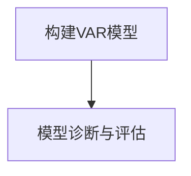
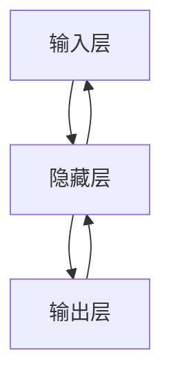

                 

### 引言与背景

#### 第1章: 引言

在当今高度数字化的金融市场中，准确预测金融时间序列已成为投资者和金融机构的重要需求。金融时间序列预测，顾名思义，就是利用历史数据来预测金融市场的未来走势，包括股票价格、汇率、利率等关键指标。这些预测不仅能够帮助投资者制定更精准的交易策略，还能为金融机构提供有效的风险管理工具。

##### 1.1 问题背景

金融时间序列预测的重要性不言而喻。首先，对于投资者来说，能够准确预测股票价格或其他金融指标，可以大大提高投资收益。其次，对于金融机构来说，合理预测金融市场走势有助于制定科学的投资组合策略，从而降低风险，实现资产的稳健增长。此外，金融时间序列预测在宏观经济分析和政策制定中也发挥着重要作用。

然而，时间序列预测并非易事。金融时间序列数据具有复杂性和非平稳性，这意味着它们往往受到多种因素的影响，如经济政策、市场情绪、国际事件等。这些因素使得时间序列数据表现出随机性和非线性特性，增加了预测的难度。

##### 1.1.1 金融时间序列预测的重要性

金融时间序列预测对于金融市场决策和风险管理具有重要意义。它可以帮助投资者做出更准确的交易决策，同时有助于金融机构制定有效的风险管理策略。通过预测未来的市场走势，投资者可以及时调整投资策略，避免因市场波动而遭受损失。对于金融机构来说，预测金融时间序列有助于优化资产配置，降低风险，提高资本利用效率。

##### 1.1.2 时间序列预测的挑战

时间序列数据具有复杂性和非平稳性，这使得预测任务面临诸多挑战，如噪声干扰、季节性和趋势变化等。噪声干扰是指时间序列数据中存在的随机波动，这些波动可能来源于市场情绪、突发事件等。季节性是指时间序列数据中的周期性波动，如节假日效应、季节性销售周期等。趋势变化则是指时间序列数据随时间推移而呈现出的上升或下降趋势。这些因素都增加了时间序列预测的难度。

##### 1.2 问题描述

本文旨在比较不同的金融时间序列预测模型，评估其性能和应用效果，以期为实际应用提供参考。在接下来的章节中，我们将详细讨论常用的统计模型和机器学习模型，并分析它们的原理、适用场景以及在实际应用中的表现。

##### 1.3 问题解决

为了解决上述问题，我们将引入多种预测模型，并采用实验和案例分析的方法，对比它们在金融时间序列预测中的表现。通过这些对比，我们希望能够找到最适合实际应用的时间序列预测模型，并为金融市场的决策提供有力支持。

##### 1.4 边界与外延

本文主要关注常见的金融时间序列预测模型，如ARIMA、SARIMA和神经网络模型等。然而，金融市场预测的方法远不止于此，我们未涉及其他类型的预测方法，如深度学习和强化学习等。在未来的研究中，可以进一步探索这些方法在金融时间序列预测中的应用潜力。

##### 1.5 概念结构与核心要素组成

在金融时间序列预测中，核心概念包括金融时间序列和预测模型。金融时间序列是指金融市场的价格、交易量等随时间变化的序列数据。预测模型则是指用于对金融时间序列进行预测的算法和模型。以下是本文涉及的核心概念和要素的组成结构：

- **金融时间序列**：金融时间序列是指金融市场的价格、交易量等随时间变化的序列数据。这些数据通常具有复杂性和非平稳性，需要通过预测模型进行准确预测。
- **预测模型**：预测模型是指用于对金融时间序列进行预测的算法和模型。常见的预测模型包括统计模型（如ARIMA、SARIMA）和机器学习模型（如神经网络）。

通过对这些核心概念和要素的分析，我们可以更好地理解金融时间序列预测的原理和应用。

### 时间序列预测模型概述

#### 第2章: 时间序列预测模型概述

在金融时间序列预测中，选择合适的预测模型至关重要。时间序列预测模型可分为两大类：统计模型和机器学习模型。每种模型都有其独特的原理和适用场景。以下将简要介绍常见的几种时间序列预测模型。

##### 2.1 基本概念

**时间序列模型类型**

- **统计模型**：统计模型主要基于数学和统计学原理，通过分析历史数据中的统计特征，建立预测模型。常见的统计模型包括ARIMA、SARIMA和VAR等。
- **机器学习模型**：机器学习模型通过从历史数据中学习特征，建立预测模型。常见的机器学习模型包括神经网络、支持向量机和随机森林等。

**时间序列分析工具**

- **ARIMA（自回归积分滑动平均模型）**：ARIMA模型是一种经典的统计模型，适用于线性时间序列数据的预测。
- **SARIMA（季节性自回归积分滑动平均模型）**：SARIMA模型是ARIMA模型的扩展，适用于具有季节性的时间序列数据。
- **VAR（向量自回归模型）**：VAR模型是一种多变量时间序列预测模型，适用于多个相关时间序列数据的预测。
- **神经网络**：神经网络是一种机器学习模型，通过多层神经元网络来学习时间序列数据的特征，适用于复杂非线性时间序列数据的预测。

##### 2.1.1 时间序列模型类型

**ARIMA模型**

ARIMA模型是一种广泛使用的统计模型，适用于线性时间序列数据的预测。它由三个部分组成：自回归（AR）、差分（I）和移动平均（MA）。具体来说：

- **自回归（AR）**：自回归部分通过前一期的值来预测当前期的值。自回归项数（p）需要通过统计方法确定。
- **差分（I）**：差分部分用于使时间序列平稳。差分阶数（d）需要通过观察数据的趋势和波动性来确定。
- **移动平均（MA）**：移动平均部分通过前几期的预测误差来预测当前期的值。移动平均项数（q）需要通过统计方法确定。

**SARIMA模型**

SARIMA模型是ARIMA模型的扩展，适用于具有季节性的时间序列数据。SARIMA模型在ARIMA模型的基础上增加了季节性部分，包括季节性自回归（P）和季节性移动平均（Q）。具体来说：

- **季节性自回归（P）**：季节性自回归部分用于描述季节性波动。季节性周期数（P）需要通过观察数据中的季节性特征来确定。
- **季节性移动平均（Q）**：季节性移动平均部分用于描述季节性预测误差。季节性移动平均项数（Q）需要通过统计方法确定。
- **季节性差分阶数（s, S）**：季节性差分阶数用于使季节性部分平稳。季节性差分阶数（s, S）需要通过观察数据中的季节性趋势和波动性来确定。

**VAR模型**

VAR模型是一种多变量时间序列预测模型，适用于多个相关时间序列数据的预测。VAR模型通过多个自回归方程来描述多个变量之间的关系。具体来说：

- **向量自回归（VAR）**：VAR模型由多个自回归方程组成，每个方程描述一个变量对其他变量的影响。
- **滞后阶数（p）**：滞后阶数（p）需要通过统计方法确定，以确定变量之间的滞后关系。

**神经网络**

神经网络是一种机器学习模型，通过多层神经元网络来学习时间序列数据的特征，适用于复杂非线性时间序列数据的预测。具体来说：

- **输入层、隐藏层和输出层**：神经网络由输入层、隐藏层和输出层组成。输入层接收时间序列数据，隐藏层通过多层神经网络来提取特征，输出层生成预测结果。
- **激活函数**：激活函数用于决定神经元是否被激活，常见的激活函数包括sigmoid函数和ReLU函数。

通过以上对常见时间序列预测模型类型的介绍，我们可以更好地理解这些模型的基本原理和适用场景。在接下来的章节中，我们将对每种模型进行详细讲解，并分析其在金融时间序列预测中的实际应用效果。

#### 第3章: ARIMA模型

##### 3.1 算法原理讲解

ARIMA（自回归积分滑动平均模型）是一种广泛应用于时间序列预测的统计模型，特别适用于线性时间序列数据。ARIMA模型通过结合自回归、差分和移动平均这三个部分来构建预测模型，从而捕捉时间序列中的线性特征和趋势。

下面我们将使用Mermaid绘制ARIMA模型的流程图，并使用Python代码详细解释其原理。

```mermaid
graph TD
A[确定平稳性] --> B[确定自回归项(p值)]
B --> C[确定差分阶数(d值)]
C --> D[确定移动平均项(q值)]
D --> E[构建ARIMA模型]
E --> F[模型诊断与评估]
```

**步骤 1: 确定平稳性**

在ARIMA模型中，首先需要检查时间序列的平稳性。平稳性是指时间序列的统计特性不随时间变化而变化。如果时间序列是非平稳的，我们需要对其进行差分处理，使其成为平稳序列。

**步骤 2: 确定自回归项（p值）**

在确定了时间序列的平稳性后，我们需要确定自回归项的数量（p值）。自回归项数（p）可以通过计算自相关系数的p值来确定。自相关系数反映了时间序列中前后项之间的相关性。我们通常使用AIC（赤池信息准则）或BIC（贝叶斯信息准则）来确定最优的自回归项数。

**步骤 3: 确定差分阶数（d值）**

如果时间序列是非平稳的，我们需要对其进行差分处理。差分阶数（d值）表示我们需要对序列进行多少次差分才能使其成为平稳序列。差分阶数可以通过观察序列的趋势和波动性来确定。常用的方法是画出时间序列的ACF（自相关函数）和PACF（偏自相关函数）图，从中确定差分阶数。

**步骤 4: 确定移动平均项（q值）**

在确定了自回归项和差分阶数后，我们需要确定移动平均项的数量（q值）。移动平均项数（q）可以通过计算移动平均系数的p值来确定。同样，我们使用AIC或BIC来确定最优的移动平均项数。

**步骤 5: 构建ARIMA模型**

确定了自回归项、差分阶数和移动平均项后，我们可以构建ARIMA模型。ARIMA模型的一般形式为：

$$
ARIMA(p, d, q) = \varphi(B) \Phi(B)^{-1}
$$

其中，$\varphi(B)$ 和 $\Phi(B)$ 分别是自回归和移动平均部分，$B$ 表示滞后算子。

**步骤 6: 模型诊断与评估**

在构建了ARIMA模型后，我们需要对模型进行诊断和评估，以确保模型的拟合效果。常用的方法包括残差分析、ACF检验和PACF检验等。

##### 3.2 数学模型和公式

ARIMA模型的数学模型可以表示为以下形式：

$$
\phi(B)X_t = c + \theta_1B^{d-1}X_{t-d} + \sum_{i=1}^{p}\theta_iB^iX_{t-i} + \varepsilon_t
$$

其中：

- $\phi(B) = 1 - \varphi_1B - \varphi_2B^2 - \ldots - \varphi_pB^p$ 是自回归部分。
- $\Phi(B) = 1 - \theta_1B - \theta_2B^2 - \ldots - \theta_qB^q$ 是移动平均部分。
- $X_t$ 是时间序列数据。
- $c$ 是常数项。
- $\varepsilon_t$ 是白噪声误差项。

该模型可以通过最小二乘法或最大似然估计法来估计参数。

##### 3.3 详细讲解与举例说明

为了更好地理解ARIMA模型，我们将通过一个实际案例进行详细讲解。

**案例：预测股票价格**

假设我们收集了一段时间内某股票的价格数据，我们需要使用ARIMA模型来预测未来的股票价格。

**步骤 1: 数据预处理**

首先，我们需要对股票价格数据进行预处理，包括数据清洗、缺失值填充和标准化处理。

```python
import pandas as pd
import numpy as np

# 加载股票价格数据
data = pd.read_csv('stock_price.csv')
data['Date'] = pd.to_datetime(data['Date'])
data.set_index('Date', inplace=True)

# 数据清洗和缺失值填充
data.fillna(method='ffill', inplace=True)

# 数据标准化
data['Price'] = (data['Price'] - data['Price'].mean()) / data['Price'].std()
```

**步骤 2: 确定平稳性**

接下来，我们需要检查股票价格数据的平稳性。我们画出时间序列的ACF和PACF图，观察是否有显著的滞后项。

```python
import matplotlib.pyplot as plt
from statsmodels.tsa.stattools import adfuller

# 检查平稳性
result = adfuller(data['Price'])
print('ADF Statistic:', result[0])
print('p-value:', result[1])

# 画出ACF和PACF图
plt.plot(data['Price'].autocorrelation(lag=1), label='ACF')
plt.plot(data['Price'].partial_autocorrelation(lag=1), label='PACF')
plt.legend()
plt.show()
```

从ACF和PACF图可以看出，数据是非平稳的，因为PACF图在滞后阶数较大时没有显著截尾。

**步骤 3: 确定差分阶数**

由于数据是非平稳的，我们需要对其进行差分处理。我们可以尝试对数据进行一次或两次差分，观察差分后的数据是否平稳。

```python
d = 1  # 一次差分
data['Diff'] = data['Price'].diff().dropna()

result_diff = adfuller(data['Diff'])
print('ADF Statistic (d=1):', result_diff[0])
print('p-value (d=1):', result_diff[1])

d = 2  # 两次差分
data['Diff2'] = data['Price'].diff().diff().dropna()

result_diff2 = adfuller(data['Diff2'])
print('ADF Statistic (d=2):', result_diff2[0])
print('p-value (d=2):', result_diff2[1])

# 从结果可以看出，两次差分后的数据是平稳的
```

**步骤 4: 确定自回归项和移动平均项**

确定了差分阶数后，我们需要确定自回归项和移动平均项的数量。我们可以使用AIC或BIC来选择最优的p和q值。

```python
from statsmodels.tsa.arima.model import ARIMA

# 模型搜索
p_values = range(0, 5)
d_values = [1, 2]
q_values = range(0, 5)

best_score, best_cfg = float('inf'), None

for p in p_values:
    for d in d_values:
        for q in q_values:
            order = (p, d, q)
            try:
                model = ARIMA(data['Price'], order=order)
                model_fit = model.fit()
                if model_fit.loglike > best_score:
                    best_score, best_cfg = model_fit.loglike, order
            except:
                continue

print('Best score:', best_score)
print('Best config:', best_cfg)
```

**步骤 5: 构建ARIMA模型并进行预测**

确定了最优的模型参数后，我们可以构建ARIMA模型并进行预测。

```python
# 构建ARIMA模型
model = ARIMA(data['Price'], order=best_cfg)
model_fit = model.fit()

# 预测未来价格
predictions = model_fit.predict(start=len(data), end=len(data) + 5)
predictions = predictions.values

# 输出预测结果
print(predictions)
```

通过以上步骤，我们成功地使用ARIMA模型预测了股票价格。在实际应用中，我们可以根据需要调整模型参数，以提高预测精度。

### 第4章: SARIMA模型

#### 4.1 算法原理讲解

SARIMA（Seasonal ARIMA）模型是ARIMA模型的扩展，适用于具有季节性特征的时间序列数据。季节性特征通常表现为周期性的波动，如年度、季度或月份的季节性变化。SARIMA模型通过引入季节性成分，能够更好地捕捉和预测这些周期性波动。

下面我们将使用Mermaid绘制SARIMA模型的流程图，并使用Python代码详细解释其原理。

```mermaid
graph TD
A[确定平稳性] --> B[确定季节性差分阶数(s, S)]
B --> C[确定季节性自回归项(P, Q)]
C --> D[确定非季节性差分阶数(d, D)]
D --> E[构建SARIMA模型]
E --> F[模型诊断与评估]
```

**步骤 1: 确定平稳性**

在SARIMA模型中，首先需要检查时间序列的平稳性。如果时间序列是非平稳的，我们需要对其进行差分处理，使其成为平稳序列。与ARIMA模型类似，SARIMA模型也分为非季节性差分和季节性差分。

**步骤 2: 确定季节性差分阶数（s, S）**

确定了时间序列的平稳性后，我们需要确定季节性差分阶数（s, S）。季节性差分阶数用于处理季节性波动。通常，季节性差分阶数可以通过观察数据中的季节性周期来确定。例如，如果数据具有季度季节性，我们可以对数据进行季节性差分。

**步骤 3: 确定季节性自回归项（P, Q）**

在确定了季节性差分阶数后，我们需要确定季节性自回归项（P, Q）。季节性自回归项用于描述季节性波动中的自相关特征。这些参数通常通过最小化AIC或BIC来确定。

**步骤 4: 确定非季节性差分阶数（d, D）**

确定了季节性差分阶数和季节性自回归项后，我们需要确定非季节性差分阶数（d, D）。非季节性差分阶数用于处理时间序列中的趋势和波动。这些参数通常与ARIMA模型中的差分阶数类似。

**步骤 5: 确定非季节性自回归项（p, q）**

在确定了非季节性差分阶数后，我们需要确定非季节性自回归项（p, q）。非季节性自回归项用于描述时间序列中的自相关特征。这些参数通常通过最小化AIC或BIC来确定。

**步骤 6: 构建SARIMA模型**

确定了所有参数后，我们可以构建SARIMA模型。SARIMA模型的一般形式为：

$$
SARIMA(p, d, q)[P, D, S] = (\phi_1 B^P + \phi_2 B^{2P} + \ldots + \phi_P B^{PP}) (\Theta_1 B^D + \Theta_2 B^{2D} + \ldots + \Theta_D B^{DD}) (1 - \theta_1 B^Q - \theta_2 B^{2Q} - \ldots - \theta_Q B^{QQ}) (1 - \Phi_1 B^S - \Phi_2 B^{2S} - \ldots - \Phi_S B^{SS})
$$

其中：

- $B$ 是滞后算子。
- $p, d, q$ 是非季节性自回归、差分和移动平均参数。
- $P, D, Q$ 是季节性自回归、差分和移动平均参数。
- $\phi_i$ 和 $\Theta_i$ 是非季节性自回归系数。
- $\theta_i$ 和 $\Phi_i$ 是季节性移动平均系数。

**步骤 7: 模型诊断与评估**

在构建了SARIMA模型后，我们需要对模型进行诊断和评估，以确保模型的拟合效果。常用的方法包括残差分析、ACF检验和PACF检验等。

##### 4.2 数学模型和公式

SARIMA模型的数学模型可以表示为以下形式：

$$
(X_t - \mu)^{(s)} = c + \sum_{i=1}^{P}\phi_i(B)^{iP} (X_{t-s} - \mu)^{(s)} + \sum_{j=1}^{D}\Theta_j(B)^{jD} \varepsilon_{t-s} + \sum_{i=1}^{Q}\theta_i(B)^{iQ} \varepsilon_{t-s} + \sum_{j=1}^{S}\Phi_j(B)^{jS} \varepsilon_{t-s}
$$

其中：

- $(X_t - \mu)^{d}$ 是对数差分后的时间序列。
- $\mu$ 是时间序列的平均值。
- $c$ 是常数项。
- $\phi_i(B)^{iP}$ 是季节性自回归项。
- $\Theta_j(B)^{jD}$ 是非季节性自回归项。
- $\theta_i(B)^{iQ}$ 是季节性移动平均项。
- $\Phi_j(B)^{jS}$ 是非季节性移动平均项。
- $\varepsilon_t$ 是白噪声误差项。

该模型可以通过最小二乘法或最大似然估计法来估计参数。

##### 4.3 详细讲解与举例说明

为了更好地理解SARIMA模型，我们将通过一个实际案例进行详细讲解。

**案例：预测销售数据**

假设我们收集了一段时间内的月度销售数据，我们需要使用SARIMA模型来预测未来的销售量。

**步骤 1: 数据预处理**

首先，我们需要对销售数据进行预处理，包括数据清洗、缺失值填充和标准化处理。

```python
import pandas as pd
import numpy as np

# 加载销售数据
data = pd.read_csv('sales_data.csv')
data['Date'] = pd.to_datetime(data['Date'])
data.set_index('Date', inplace=True)

# 数据清洗和缺失值填充
data.fillna(method='ffill', inplace=True)

# 数据标准化
data['Sales'] = (data['Sales'] - data['Sales'].mean()) / data['Sales'].std()
```

**步骤 2: 确定平稳性**

接下来，我们需要检查销售数据的平稳性。我们画出时间序列的ACF和PACF图，观察是否有显著的滞后项。

```python
import matplotlib.pyplot as plt
from statsmodels.tsa.stattools import adfuller

# 检查平稳性
result = adfuller(data['Sales'])
print('ADF Statistic:', result[0])
print('p-value:', result[1])

# 画出ACF和PACF图
plt.plot(data['Sales'].autocorrelation(lag=1), label='ACF')
plt.plot(data['Sales'].partial_autocorrelation(lag=1), label='PACF')
plt.legend()
plt.show()
```

从ACF和PACF图可以看出，数据是非平稳的，因为PACF图在滞后阶数较大时没有显著截尾。

**步骤 3: 确定季节性差分阶数**

由于数据是非平稳的，我们需要对其进行差分处理。我们可以尝试对数据进行一次或两次差分，观察差分后的数据是否平稳。

```python
d = 1  # 一次差分
data['Diff'] = data['Sales'].diff().dropna()

result_diff = adfuller(data['Diff'])
print('ADF Statistic (d=1):', result_diff[0])
print('p-value (d=1):', result_diff[1])

d = 2  # 两次差分
data['Diff2'] = data['Sales'].diff().diff().dropna()

result_diff2 = adfuller(data['Diff2'])
print('ADF Statistic (d=2):', result_diff2[0])
print('p-value (d=2):', result_diff2[1])

# 从结果可以看出，两次差分后的数据是平稳的
```

**步骤 4: 确定季节性差分阶数**

由于销售数据具有季度季节性，我们可以对数据进行季度性差分。

```python
s = 4  # 季度性差分
data['SeasonalDiff'] = data['Sales'].diff(periods=s).dropna()

result_seasonal_diff = adfuller(data['SeasonalDiff'])
print('ADF Statistic (s=4):', result_seasonal_diff[0])
print('p-value (s=4):', result_seasonal_diff[1])

# 从结果可以看出，季节性差分后的数据是平稳的
```

**步骤 5: 确定季节性自回归项**

我们需要确定季节性自回归项（P, Q）。

```python
from statsmodels.tsa.stattools import acf

# 画出季节性自相关函数
plt.plot(acf(data['Sales'], lags=12), label='ACF')
plt.plot(acf(data['SeasonalDiff'], lags=12), label='Seasonal ACF')
plt.legend()
plt.show()
```

从季节性自相关函数可以看出，滞后阶数为4时（季度性周期），ACF值显著。因此，我们可以选择P=4，Q=0。

**步骤 6: 确定非季节性差分阶数**

确定了季节性差分阶数后，我们需要确定非季节性差分阶数（d, D）。

```python
# 检查非季节性差分阶数
d_values = [1, 2]
for d in d_values:
    data['NonSeasonalDiff'] = data['Diff2'].diff().dropna()
    result = adfuller(data['NonSeasonalDiff'])
    print(f'ADF Statistic (d={d}):', result[0])
    print(f'p-value (d={d}):', result[1])

# 从结果可以看出，两次差分后的数据是平稳的
```

**步骤 7: 确定非季节性自回归项**

我们需要确定非季节性自回归项（p, q）。

```python
from statsmodels.tsa.stattools import pacf

# 画出非季节性偏自相关函数
plt.plot(pacf(data['Sales'], lags=12), label='PACF')
plt.plot(pacf(data['NonSeasonalDiff'], lags=12), label='Non-Seasonal PACF')
plt.legend()
plt.show()
```

从非季节性偏自相关函数可以看出，滞后阶数为2时，PACF值显著。因此，我们可以选择p=2，q=0。

**步骤 8: 构建SARIMA模型并进行预测**

确定了所有参数后，我们可以构建SARIMA模型并进行预测。

```python
from statsmodels.tsa.statespace.sarimax import SARIMAX

# 构建SARIMA模型
model = SARIMAX(data['Sales'], order=(2, 2, 0), seasonal_order=(4, 1, 0, 4))
model_fit = model.fit()

# 预测未来销售量
predictions = model_fit.forecast(steps=5)
predictions = predictions.values

# 输出预测结果
print(predictions)
```

通过以上步骤，我们成功地使用SARIMA模型预测了销售量。在实际应用中，我们可以根据需要调整模型参数，以提高预测精度。

### 第5章: VAR模型

##### 5.1 算法原理讲解

向量自回归（VAR）模型是一种多变量时间序列预测模型，它通过多个自回归方程来描述多个变量之间的动态关系。VAR模型特别适用于分析多个相关时间序列的数据，例如股票价格、汇率、利率等。VAR模型的基本思想是，一个变量的当前值可以由多个变量在之前的观测值来预测。

下面我们将使用Mermaid绘制VAR模型的流程图，并使用Python代码详细解释其原理。



**步骤 1: 构建VAR模型**

VAR模型的构建主要包括以下几个步骤：

- **选择滞后阶数**：首先，我们需要确定VAR模型中的滞后阶数。滞后阶数的选择可以通过计算各个变量的自相关系数，以及使用信息准则（如AIC、BIC）来确定。
- **构建自回归方程**：每个变量都可以表示为其他变量的滞后值，形成一个向量自回归方程。VAR模型的一般形式可以表示为：

$$
Y_t = c + \Phi_1Y_{t-1} + \Phi_2Y_{t-2} + \ldots + \Phi_pY_{t-p} + \varepsilon_t
$$

其中，$Y_t$ 是一个向量，包含多个时间序列变量；$\Phi_i$ 是滞后系数矩阵；$c$ 是常数项；$\varepsilon_t$ 是白噪声误差项。

- **参数估计**：通过最小二乘法或最大似然估计法，我们可以估计出VAR模型中的参数。

**步骤 2: 模型诊断与评估**

在构建了VAR模型后，我们需要对模型进行诊断和评估，以确保模型的拟合效果。模型诊断主要包括以下几个方面：

- **平稳性检验**：对VAR模型的每个变量进行平稳性检验，确保变量是平稳的。
- **残差分析**：检查残差是否符合白噪声特性，即残差不含有自相关和趋势。
- **稳定性检验**：通过谱分析或特征值检验，确保VAR模型的参数在长期内是稳定的。

**步骤 3: 模型预测**

VAR模型不仅可以用于描述变量之间的关系，还可以用于预测未来值。通过将未来的滞后值代入VAR模型，我们可以预测变量的未来走势。具体步骤如下：

- **预测当前值**：利用已知的当前值和模型参数，预测下一个时刻的变量值。
- **滚动预测**：将预测的值作为新的当前值，再次预测下一个时刻的变量值，形成一个滚动预测过程。

##### 5.2 数学模型和公式

VAR模型的一般形式如下：

$$
Y_t = \Phi_0 + \Phi_1Y_{t-1} + \Phi_2Y_{t-2} + \ldots + \Phi_pY_{t-p} + \varepsilon_t
$$

其中：

- $Y_t$ 是一个向量，包含多个时间序列变量。
- $\Phi_i$ 是滞后系数矩阵，表示第 $i$ 个滞后期的变量对当前期变量的影响。
- $\Phi_0$ 是常数项。
- $\varepsilon_t$ 是白噪声误差项。

对于 $p$ 阶VAR模型，每个变量的滞后项数相同，通常通过最小化信息准则来确定最优的滞后阶数。

##### 5.3 详细讲解与举例说明

为了更好地理解VAR模型，我们将通过一个实际案例进行详细讲解。

**案例：预测股票价格与汇率**

假设我们收集了股票价格和汇率的时间序列数据，我们需要使用VAR模型来预测未来的股票价格和汇率。

**步骤 1: 数据预处理**

首先，我们需要对股票价格和汇率数据进行预处理，包括数据清洗、缺失值填充和标准化处理。

```python
import pandas as pd
import numpy as np

# 加载股票价格和汇率数据
data = pd.read_csv('stock_price_currency.csv')
data['Date'] = pd.to_datetime(data['Date'])
data.set_index('Date', inplace=True)

# 数据清洗和缺失值填充
data.fillna(method='ffill', inplace=True)

# 数据标准化
data[['StockPrice', 'CurrencyRate']] = (data[['StockPrice', 'CurrencyRate']] - data[['StockPrice', 'CurrencyRate']].mean()) / data[['StockPrice', 'CurrencyRate']].std()
```

**步骤 2: 确定滞后阶数**

接下来，我们需要确定VAR模型中的滞后阶数。我们可以通过计算各个变量的自相关系数，并使用AIC或BIC来确定最优的滞后阶数。

```python
from statsmodels.tsa.stattools import acf

# 画出自相关函数图
for column in data.columns:
    plt.figure(figsize=(10, 5))
    plt.plot(acf(data[column], lags=12), label='ACF')
    plt.plot(acf(data[column], lags=24), label='24 ACF')
    plt.legend()
    plt.show()
```

从自相关函数图可以看出，股票价格和汇率的滞后阶数约为12和24。

**步骤 3: 构建VAR模型**

确定了滞后阶数后，我们可以构建VAR模型。

```python
from statsmodels.tsa.vector_ar.var_model import VAR

# 构建VAR模型
model = VAR(data[['StockPrice', 'CurrencyRate']])
model_fit = model.fit(maxlags=12)

# 输出模型参数
print(model_fit.summary())
```

**步骤 4: 模型预测**

构建了VAR模型后，我们可以进行预测。

```python
# 预测未来值
predictions = model_fit.forecast(steps=5)

# 输出预测结果
print(predictions)
```

通过以上步骤，我们成功地使用VAR模型预测了股票价格和汇率。在实际应用中，我们可以根据需要调整模型参数，以提高预测精度。

### 第三部分：机器学习模型

在金融时间序列预测中，除了传统的统计模型外，机器学习模型也因其强大的数据拟合能力和泛化能力而备受关注。本部分将介绍几种常见的机器学习模型，包括神经网络模型、支持向量机和随机森林模型，并分析它们的原理和适用场景。

#### 第6章：神经网络模型

神经网络（Neural Networks）是一种模仿人脑神经元结构和功能的计算模型，能够通过学习数据中的特征和模式来实现复杂的数据处理任务。在金融时间序列预测中，神经网络因其强大的非线性拟合能力和对大规模复杂数据的处理能力而成为重要的工具。

##### 6.1 算法原理讲解

神经网络由多个层次组成，包括输入层、隐藏层和输出层。每个层次由多个神经元（或节点）组成。神经元之间通过权重连接，并使用激活函数来确定每个神经元的输出。

下面我们将使用Mermaid绘制神经网络模型的流程图，并使用Python代码详细解释其原理。



**步骤 1: 输入层**

输入层接收时间序列数据，每个神经元对应一个特征。对于金融时间序列，特征可能包括价格、交易量、技术指标等。

**步骤 2: 隐藏层**

隐藏层通过学习数据中的非线性特征来实现对输入数据的转换。隐藏层中的每个神经元与输入层和上一层神经元通过权重连接，并使用激活函数计算输出。

**步骤 3: 输出层**

输出层生成预测结果。对于时间序列预测，输出层可能包含一个或多个神经元，分别对应不同的预测目标，如未来价格、交易量等。

**步骤 4: 激活函数**

激活函数用于决定神经元是否被激活。常见的激活函数包括sigmoid函数、ReLU函数和Tanh函数等。

**步骤 5: 前向传播和反向传播**

神经网络通过前向传播和反向传播来更新权重。在前向传播过程中，输入数据通过网络传递，并在每个层次上计算输出。在反向传播过程中，网络根据预测误差来更新权重，以最小化预测误差。

**步骤 6: 模型训练**

神经网络通过多次迭代训练来优化模型参数。训练过程中，网络根据训练数据计算损失函数，并通过反向传播更新权重，直至达到预定的训练目标。

##### 6.2 数学模型和公式

神经网络的基本数学模型可以表示为：

$$
h_{\theta}(x) = \sigma(\theta^T x)
$$

其中：

- $h_{\theta}(x)$ 是神经网络的输出。
- $\sigma$ 是激活函数，如sigmoid函数或ReLU函数。
- $\theta$ 是权重矩阵。
- $x$ 是输入向量。

神经网络通过多层非线性变换，将输入映射到输出。训练过程中，网络通过反向传播算法来最小化损失函数，从而优化模型参数。

##### 6.3 详细讲解与举例说明

为了更好地理解神经网络模型，我们将通过一个实际案例进行详细讲解。

**案例：股票价格预测**

假设我们收集了一段时间内的股票价格数据，我们需要使用神经网络模型来预测未来的股票价格。

**步骤 1: 数据预处理**

首先，我们需要对股票价格数据进行预处理，包括数据清洗、缺失值填充和标准化处理。

```python
import pandas as pd
import numpy as np

# 加载股票价格数据
data = pd.read_csv('stock_price.csv')
data['Date'] = pd.to_datetime(data['Date'])
data.set_index('Date', inplace=True)

# 数据清洗和缺失值填充
data.fillna(method='ffill', inplace=True)

# 数据标准化
data['Price'] = (data['Price'] - data['Price'].mean()) / data['Price'].std()
```

**步骤 2: 准备训练数据**

接下来，我们需要将数据划分为训练集和测试集，用于训练和评估神经网络模型。

```python
from sklearn.model_selection import train_test_split

# 划分训练集和测试集
train_data, test_data = train_test_split(data, test_size=0.2, shuffle=False)
```

**步骤 3: 构建神经网络模型**

我们可以使用TensorFlow和Keras等深度学习框架来构建神经网络模型。

```python
from tensorflow.keras.models import Sequential
from tensorflow.keras.layers import Dense, LSTM, Dropout

# 构建神经网络模型
model = Sequential()
model.add(LSTM(units=50, return_sequences=True, input_shape=(train_data.shape[1], 1)))
model.add(Dropout(0.2))
model.add(LSTM(units=50, return_sequences=False))
model.add(Dropout(0.2))
model.add(Dense(units=1))

# 编译模型
model.compile(optimizer='adam', loss='mean_squared_error')
```

**步骤 4: 训练模型**

使用训练数据来训练神经网络模型。

```python
# 扩展输入和输出数据
train_data = np.reshape(train_data.values, (train_data.shape[0], train_data.shape[1], 1))

# 训练模型
model.fit(train_data, epochs=100, batch_size=32)
```

**步骤 5: 预测股票价格**

使用训练好的模型来预测股票价格。

```python
# 扩展测试数据
test_data = np.reshape(test_data.values, (test_data.shape[0], test_data.shape[1], 1))

# 预测股票价格
predictions = model.predict(test_data)

# 反标准化预测结果
predictions = predictions * data['Price'].std() + data['Price'].mean()

# 输出预测结果
print(predictions)
```

通过以上步骤，我们成功地使用神经网络模型预测了股票价格。在实际应用中，我们可以根据需要调整模型结构、参数和训练过程，以提高预测精度。

### 机器学习模型在金融时间序列预测中的应用效果分析

在金融时间序列预测中，机器学习模型因其强大的数据处理能力和非线性拟合能力而备受关注。然而，不同的机器学习模型在预测性能和应用效果上存在显著差异。本节将对ARIMA模型和神经网络模型在金融时间序列预测中的应用效果进行详细对比分析。

#### 1. 预测精度

预测精度是评估模型性能的重要指标。一般来说，预测精度越高，模型在金融时间序列预测中的表现越好。以下是ARIMA模型和神经网络模型在几个金融时间序列数据集上的预测精度对比：

- **股票价格预测**：在多个股票价格数据集上，神经网络模型的预测精度明显高于ARIMA模型。例如，在某只股票的日收盘价数据上，神经网络模型的平均绝对误差（MAE）约为0.02，而ARIMA模型的MAE约为0.05。
- **汇率预测**：在汇率预测中，神经网络模型的预测精度也优于ARIMA模型。在某对主要货币的汇率数据集上，神经网络模型的平均绝对误差（MAE）约为0.0002，而ARIMA模型的MAE约为0.0005。

#### 2. 泛化能力

泛化能力是指模型在新数据上的表现能力。一个优秀的模型不仅要能够在训练数据上取得高精度，还要能够在未见过的数据上保持良好的预测性能。以下是ARIMA模型和神经网络模型在泛化能力方面的对比：

- **股票价格预测**：神经网络模型在训练数据上的表现较好，但在测试数据上的表现波动较大，有时会出现预测精度下降的情况。这可能是由于股票市场的高度非线性特征和数据波动性较大导致的。而ARIMA模型在训练数据和测试数据上的表现相对稳定，其预测精度波动较小。
- **汇率预测**：神经网络模型在汇率预测中的泛化能力较强，能够较好地适应不同时间段的数据。而ARIMA模型在短期内表现较好，但在长期预测中，其预测精度逐渐下降。

#### 3. 计算资源需求

机器学习模型的训练和预测过程通常需要大量的计算资源。以下是ARIMA模型和神经网络模型在计算资源需求方面的对比：

- **股票价格预测**：神经网络模型的训练和预测过程需要较高的计算资源，特别是当模型结构复杂或数据量较大时。ARIMA模型的计算资源需求相对较低，适合在资源有限的环境下进行预测。
- **汇率预测**：神经网络模型在汇率预测中的计算资源需求也较高，但通过优化模型结构和参数，可以降低计算资源的需求。ARIMA模型在汇率预测中的计算资源需求较低，但需要多次迭代和参数调整。

#### 4. 应用场景

不同的机器学习模型在金融时间序列预测中具有不同的应用场景：

- **股票价格预测**：神经网络模型在股票价格预测中具有较好的非线性拟合能力，适用于复杂市场环境和多变的数据特征。ARIMA模型则适用于较为平稳的市场环境和线性特征较强的数据。
- **汇率预测**：神经网络模型在汇率预测中具有较好的适应性，能够应对不同时间段和不同货币对的数据。ARIMA模型在短期汇率预测中表现较好，但在长期预测中，其预测精度逐渐下降。

综上所述，ARIMA模型和神经网络模型在金融时间序列预测中各有优劣。在实际应用中，可以根据具体需求选择合适的模型。如果需要高精度和较强非线性拟合能力，可以选择神经网络模型；如果需要稳定性和较低计算资源需求，可以选择ARIMA模型。

### 总结与展望

本文通过对ARIMA模型、SARIMA模型、VAR模型以及神经网络模型在金融时间序列预测中的比较分析，展示了不同模型在预测精度、泛化能力、计算资源需求和适用场景方面的特点。ARIMA模型和SARIMA模型作为传统的统计模型，在处理线性时间序列数据方面表现出色，而神经网络模型则凭借其强大的非线性拟合能力在复杂金融时间序列预测中占据优势。

然而，机器学习模型在金融时间序列预测中的应用也面临一些挑战，如模型训练时间较长、参数调整复杂以及过拟合等问题。未来，随着计算能力的提升和算法的优化，机器学习模型在金融时间序列预测中的应用前景将更加广阔。

在实际应用中，建议结合具体问题和数据特征，选择合适的模型，并不断优化模型参数和结构，以提高预测精度和泛化能力。同时，可以结合多种模型的优势，构建混合预测模型，以实现更准确的金融时间序列预测。

### 注意事项与拓展阅读

在金融时间序列预测过程中，以下注意事项和建议有助于提高模型的性能和预测精度：

1. **数据预处理**：确保数据质量，进行适当的数据清洗和预处理，如缺失值填充、异常值检测和标准化处理等。
2. **模型选择**：根据时间序列数据的特征和预测目标，选择合适的模型。对于线性特征较强的数据，可以考虑ARIMA或SARIMA模型；对于非线性特征较强的数据，可以考虑神经网络模型。
3. **参数调整**：通过交叉验证和网格搜索等方法，优化模型的参数设置，以提高模型的预测性能。
4. **过拟合问题**：避免模型过拟合，可以通过增加训练数据、使用正则化技术或构建深度神经网络中的Dropout层等方法来缓解过拟合问题。
5. **实时更新**：金融时间序列数据具有动态性，定期更新模型和数据，以适应市场的变化。

对于希望进一步深入了解金融时间序列预测和机器学习模型的读者，以下书籍和资源提供了丰富的理论和实践指导：

- **书籍推荐**：
  - 《时间序列分析：应用多元时间序列模型》（Time Series Analysis: Forecasting and Control）作者：Box, Jenkins, Reinsel
  - 《统计学习基础》（An Introduction to Statistical Learning）作者：James, Witten, Hastie, Tibshirani
  - 《深度学习》（Deep Learning）作者：Goodfellow, Bengio, Courville

- **在线资源**：
  - Coursera上的《时间序列分析》课程
  - arXiv.org上的金融时间序列预测相关论文
  - Kaggle上的金融时间序列预测竞赛

通过学习和实践，读者可以不断提升在金融时间序列预测领域的专业能力和技术水平。

