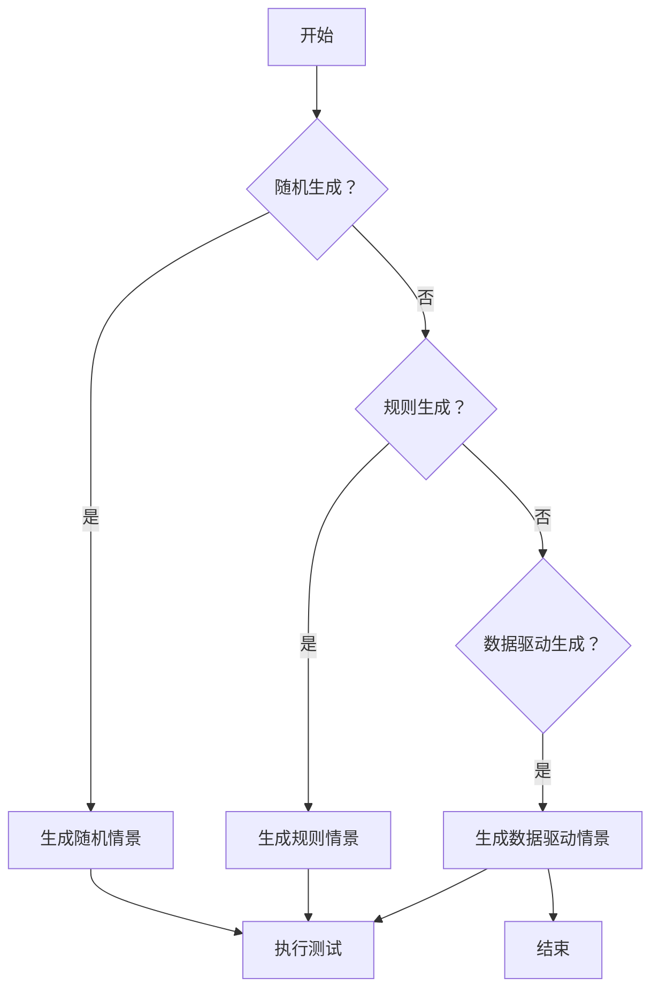
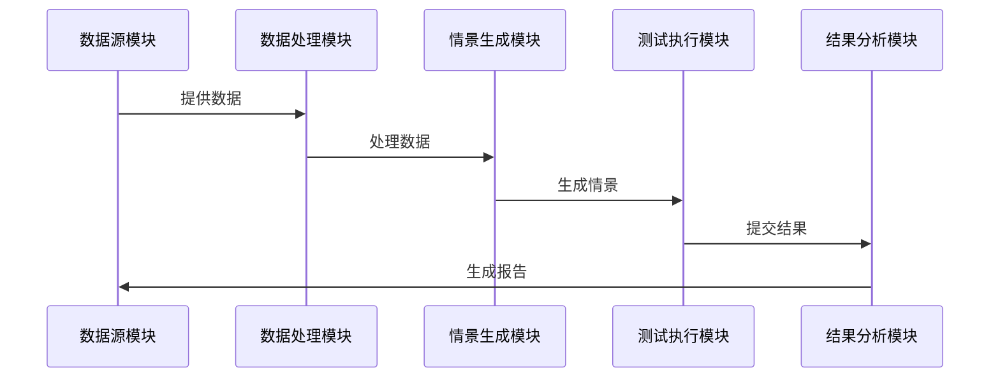

                 

### 文章标题：金融机构压力测试情景生成器

关键词：金融机构、压力测试、情景生成器、算法、实现、案例分析

摘要：本文从金融机构压力测试的背景出发，深入探讨了情景生成器在压力测试中的应用和实现。通过详细的原理讲解和实际案例剖析，本文旨在为读者提供一套清晰、高效的压力测试解决方案，以提升金融机构在复杂市场环境下的应对能力。

----------------------------------------------------------------

### 目录大纲

----------------------------------------------------------------

## 第一部分：背景介绍与问题分析

### 第1章：问题背景与核心概念

#### 1.1 问题背景

##### 1.1.1 金融机构压力测试的重要性

##### 1.1.2 压力测试现状与挑战

##### 1.1.3 研究目的与意义

#### 1.2 核心概念与联系

##### 1.2.1 压力测试的定义与分类

##### 1.2.2 压力测试的基本要素

##### 1.2.3 相关概念的比较与联系

## 第二部分：情景生成器原理与实现

### 第2章：情景生成器概述

#### 2.1 情景生成器的概念与功能

##### 2.1.1 情景生成器的定义

##### 2.1.2 情景生成器在压力测试中的作用

##### 2.1.3 情景生成器的常见类型

#### 2.2 情景生成器的设计原则

##### 2.2.1 设计目标与需求分析

##### 2.2.2 可扩展性与灵活性

##### 2.2.3 系统性能与资源利用

### 第3章：情景生成器的核心算法

#### 3.1 常见算法概述

##### 3.1.1 常见情景生成算法

##### 3.1.2 算法选择与适用性分析

#### 3.2 算法原理详解

##### 3.2.1 常见算法流程图

##### 3.2.2 数学模型与公式解释

##### 3.2.3 算法举例说明

### 第4章：情景生成器的实现

#### 4.1 系统架构设计

##### 4.1.1 系统整体架构

##### 4.1.2 系统模块划分

##### 4.1.3 系统接口设计与数据流程

#### 4.2 系统核心代码实现

##### 4.2.1 数据处理模块

##### 4.2.2 情景生成模块

##### 4.2.3 结果分析模块

### 第5章：情景生成器应用实践

#### 5.1 环境安装与配置

##### 5.1.1 操作系统与软件环境要求

##### 5.1.2 系统安装与配置步骤

#### 5.2 系统核心实现源代码

##### 5.2.1 数据处理模块代码

##### 5.2.2 情景生成模块代码

##### 5.2.3 结果分析模块代码

#### 5.3 代码应用解读与分析

##### 5.3.1 核心代码功能解读

##### 5.3.2 代码实现细节分析

##### 5.3.3 优化建议与改进方向

### 第6章：案例分析与实践总结

#### 6.1 案例介绍

##### 6.1.1 案例背景

##### 6.1.2 案例目标与需求

##### 6.1.3 案例解决方案

#### 6.2 案例实施步骤

##### 6.2.1 情景生成器配置

##### 6.2.2 情景生成与测试

##### 6.2.3 结果分析与评估

#### 6.3 案例总结与反思

##### 6.3.1 案例实施效果

##### 6.3.2 经验与教训

##### 6.3.3 拓展应用前景

### 第7章：最佳实践与注意事项

#### 7.1 最佳实践分享

##### 7.1.1 情景生成器应用场景选择

##### 7.1.2 参数调优技巧

##### 7.1.3 结果分析方法与工具

#### 7.2 注意事项与风险规避

##### 7.2.1 系统稳定性保障

##### 7.2.2 数据安全与隐私保护

##### 7.2.3 遵守相关法规与标准

### 第8章：未来发展趋势与展望

#### 8.1 行业发展趋势

##### 8.1.1 压力测试技术的发展方向

##### 8.1.2 情景生成器技术的演进

##### 8.1.3 未来应用场景预测

#### 8.2 研究展望与挑战

##### 8.2.1 关键技术研究方向

##### 8.2.2 潜在应用领域拓展

##### 8.2.3 未来挑战与应对策略

----------------------------------------------------------------

### 第一部分：背景介绍与问题分析

#### 第1章：问题背景与核心概念

##### 1.1 问题背景

在当今金融科技飞速发展的时代，金融机构面临着日益复杂的市场环境和不断加剧的竞争压力。为了确保业务系统的稳健性和可持续性，金融机构必须定期进行压力测试，以评估系统在极端情况下的性能表现和应对能力。压力测试的目的是通过模拟各种可能出现的极端市场情景，检验系统在高负载、高并发、网络故障等异常情况下的稳定性、可靠性和安全性。

金融机构压力测试的重要性主要体现在以下几个方面：

1. **风险防控**：压力测试能够帮助金融机构识别潜在的风险点，提前采取应对措施，降低系统故障对业务运营的影响。
2. **性能优化**：通过压力测试，可以发现系统在处理高并发请求时的性能瓶颈，为后续的优化工作提供依据。
3. **用户体验提升**：在确保系统稳定性的同时，通过压力测试可以发现系统在用户体验上的不足，从而进行针对性的改进。

##### 1.1.1 金融机构压力测试的重要性

金融机构压力测试的重要性体现在以下几个方面：

1. **风险防控**：压力测试能够帮助金融机构识别潜在的风险点，提前采取应对措施，降低系统故障对业务运营的影响。

2. **性能优化**：通过压力测试，可以发现系统在处理高并发请求时的性能瓶颈，为后续的优化工作提供依据。

3. **用户体验提升**：在确保系统稳定性的同时，通过压力测试可以发现系统在用户体验上的不足，从而进行针对性的改进。

##### 1.1.2 压力测试现状与挑战

尽管压力测试在金融机构中得到了广泛应用，但仍然存在一些挑战和问题：

1. **情景覆盖不足**：传统压力测试往往仅能模拟有限种类的情景，难以覆盖所有可能的极端情况。
2. **手工操作复杂**：压力测试往往需要大量手工操作，不仅耗时耗力，而且容易引入人为误差。
3. **结果分析难度大**：压力测试后的数据分析通常较为复杂，难以快速定位问题根源。

##### 1.1.3 研究目的与意义

针对上述问题，本文旨在研究并实现一种高效的金融机构压力测试情景生成器。通过自动生成多种复杂的压力测试情景，提高测试的全面性和准确性。研究的目的和意义主要体现在以下几个方面：

1. **提高测试效率**：情景生成器能够自动生成大量测试情景，大幅减少手工操作的工作量，提高测试效率。
2. **提升测试质量**：通过覆盖更广泛的情景，确保测试结果的全面性和准确性。
3. **降低测试成本**：自动化生成情景可以降低人力和时间成本，提高资源的利用效率。

##### 1.2 核心概念与联系

为了深入理解压力测试和情景生成器的原理，我们需要了解一些核心概念：

1. **压力测试**：压力测试是通过模拟系统在高负载、高并发、网络故障等异常情况下的表现，评估系统的性能、稳定性和可靠性。
2. **情景生成器**：情景生成器是一种自动化工具，用于生成各种复杂的压力测试情景，以便更全面地评估系统的性能。

在压力测试中，常见的情景包括但不限于：

- **高并发访问**：模拟大量用户同时访问系统，测试系统的并发处理能力。
- **网络故障**：模拟网络异常，如断网、延迟、丢包等，评估系统在网络不稳定条件下的表现。
- **数据处理异常**：模拟数据处理过程中的异常情况，如数据错误、数据丢失等，测试系统的容错能力。

这些情景可以通过情景生成器自动生成，以便更全面、高效地评估系统的性能。

##### 1.2.1 压力测试的定义与分类

压力测试是一种性能测试方法，旨在评估系统在承受各种负载条件下的性能表现。根据测试的目的和方式，压力测试可以分为以下几种类型：

1. **负载测试**：通过模拟大量用户同时访问系统，测试系统的并发处理能力。
2. **性能测试**：通过模拟系统在高负载条件下的性能表现，评估系统的响应时间、吞吐量等关键性能指标。
3. **稳定性测试**：通过模拟系统在长时间运行条件下的表现，评估系统的稳定性。
4. **灾难恢复测试**：模拟系统在发生故障或灾难情况下的恢复能力，测试系统的灾难恢复计划。

这些测试类型各有侧重，但通常需要结合使用，以全面评估系统的性能。

##### 1.2.2 压力测试的基本要素

进行压力测试时，需要关注以下几个基本要素：

1. **测试环境**：包括硬件设备、软件环境、网络环境等，确保测试环境与实际运行环境一致。
2. **测试工具**：选择合适的测试工具，如JMeter、LoadRunner等，用于生成测试请求和收集测试数据。
3. **测试场景**：设计模拟各种压力情况的测试场景，包括高并发访问、网络故障、数据处理异常等。
4. **测试指标**：定义关键测试指标，如响应时间、吞吐量、错误率等，用于评估系统性能。
5. **测试结果分析**：对测试结果进行分析，识别系统性能瓶颈，制定优化策略。

##### 1.2.3 相关概念的比较与联系

与压力测试相关的概念还包括性能测试、负载测试、稳定性测试等。这些概念之间的区别和联系如下：

- **性能测试**：主要关注系统在高负载条件下的性能表现，如响应时间、吞吐量等。
- **负载测试**：通过模拟大量用户访问系统，测试系统的并发处理能力，是一种特殊的性能测试。
- **稳定性测试**：模拟系统在长时间运行条件下的表现，评估系统的稳定性。
- **压力测试**：综合性能测试、负载测试和稳定性测试，旨在全面评估系统的性能、稳定性和可靠性。

这些测试类型可以单独使用，也可以结合使用，以更全面地评估系统的性能。

#### 第2章：情景生成器概述

##### 2.1 情景生成器的概念与功能

情景生成器是一种自动化工具，用于生成各种复杂的压力测试情景，以便更全面、高效地评估系统的性能。情景生成器的基本概念和功能如下：

1. **概念**：
   - 情景生成器：一种自动化工具，用于生成各种压力测试情景。
   - 情景：指系统在特定条件下可能遇到的各种异常情况，如高并发访问、网络故障、数据处理异常等。

2. **功能**：
   - 自动生成测试情景：根据预设的规则和条件，自动生成多种测试情景。
   - 模拟测试场景：将生成的测试情景应用于系统，模拟实际运行环境。
   - 收集测试数据：收集系统在测试情景下的性能指标数据，如响应时间、吞吐量、错误率等。

##### 2.1.1 情景生成器的定义

情景生成器（Scenario Generator）是一种用于自动化生成压力测试情景的工具。它的主要目的是为了在测试过程中模拟各种可能的异常情况和负载条件，从而全面评估系统的性能和稳定性。

情景生成器通常具有以下特点：

- **自动化**：通过预设的规则和条件，自动生成多种测试情景，无需人工干预。
- **灵活性**：可以根据不同的测试需求，自定义生成各种复杂的测试情景。
- **可扩展性**：支持多种测试场景的生成，如高并发访问、网络故障、数据处理异常等。

##### 2.1.2 情景生成器在压力测试中的作用

情景生成器在压力测试中扮演着关键角色，其主要作用如下：

1. **提高测试效率**：通过自动化生成测试情景，减少人工操作的工作量，提高测试效率。
2. **增强测试覆盖**：生成多种复杂的测试情景，确保测试的全面性和准确性。
3. **优化测试设计**：根据生成的测试结果，优化测试策略和测试场景，提高测试效果。

##### 2.1.3 情景生成器的常见类型

根据生成测试情景的方式和目的，情景生成器可以分为以下几种常见类型：

1. **基于规则的生成器**：通过预设的规则和条件，自动生成测试情景。这类生成器适用于较为简单的测试需求。
2. **基于数据的生成器**：通过分析历史数据，生成符合实际业务场景的测试情景。这类生成器适用于复杂且具有业务特性的测试需求。
3. **基于模型的生成器**：通过建立系统模型，模拟各种可能的异常情况和负载条件。这类生成器适用于需要全面、深入评估系统性能的测试需求。

##### 2.2 情景生成器的设计原则

设计情景生成器时，需要遵循以下原则：

1. **可扩展性与灵活性**：设计时要考虑到未来可能的扩展需求，支持灵活的测试场景定义和生成。
2. **高效性与稳定性**：确保生成器能够高效、稳定地运行，避免影响系统的正常业务运行。
3. **易用性与可维护性**：提供简单易用的操作界面，方便用户进行配置和管理；同时，确保代码的模块化、清晰易懂，便于维护和升级。

##### 2.2.1 设计目标与需求分析

在设计情景生成器时，需要明确以下设计目标与需求：

1. **设计目标**：
   - 提高测试效率：通过自动化生成测试情景，减少人工操作的工作量。
   - 增强测试覆盖：生成多种复杂的测试情景，确保测试的全面性和准确性。
   - 优化测试设计：根据生成的测试结果，优化测试策略和测试场景。

2. **需求分析**：
   - 支持多种测试场景：包括高并发访问、网络故障、数据处理异常等。
   - 灵活定义测试情景：支持用户自定义测试情景的规则和条件。
   - 易于配置与管理：提供简单易用的操作界面，方便用户进行配置和管理。

##### 2.2.2 可扩展性与灵活性

在情景生成器的设计中，可扩展性和灵活性至关重要。以下是一些具体的设计策略：

1. **模块化设计**：将生成器划分为多个模块，每个模块负责不同的功能，如情景生成、数据采集、结果分析等。这种设计方式便于模块的扩展和替换，提高了系统的可维护性和灵活性。
2. **配置文件**：使用配置文件来定义测试情景的规则和条件，便于修改和调整。配置文件通常采用易读、易修改的格式，如JSON、YAML等。
3. **插件机制**：提供插件机制，允许用户根据需要自定义额外的功能模块，如特定类型的测试情景生成器、数据采集器等。

##### 2.2.3 系统性能与资源利用

在设计情景生成器时，还需要考虑系统性能和资源利用的问题。以下是一些相关的设计策略：

1. **高效数据处理**：采用高效的数据处理算法和框架，如并行处理、分布式计算等，提高数据处理的性能。
2. **资源监控与管理**：实时监控系统的资源使用情况，如CPU、内存、网络等，确保系统在合理的资源范围内运行。
3. **负载均衡**：合理分配测试任务，避免系统过载，确保测试过程平稳、高效。

##### 2.2.4 安全性与可靠性

在情景生成器的设计中，安全性和可靠性也是需要重点关注的问题。以下是一些相关的设计策略：

1. **数据加密**：对敏感数据进行加密处理，确保数据传输和存储的安全性。
2. **权限管理**：实施严格的权限管理，限制未经授权的访问和操作。
3. **错误处理与恢复**：设计合理的错误处理和恢复机制，确保系统在出现故障时能够快速恢复。

#### 第3章：情景生成器的核心算法

##### 3.1 常见算法概述

在情景生成器的实现中，算法起着至关重要的作用。常见的情景生成算法包括随机生成算法、规则生成算法、数据驱动生成算法等。以下是对这些算法的概述：

1. **随机生成算法**：通过随机数生成测试情景，具有简单、灵活的特点，适用于一些非关键性测试场景。
2. **规则生成算法**：根据预设的规则和条件生成测试情景，具有确定性、可控性的特点，适用于有明确规则约束的测试场景。
3. **数据驱动生成算法**：通过分析历史数据和业务模式，生成符合实际业务场景的测试情景，具有业务关联性、真实性强的特点，适用于复杂、真实的业务测试场景。

##### 3.1.1 常见情景生成算法

在情景生成器的实现中，以下几种常见的情景生成算法被广泛应用：

1. **随机生成算法**
   - **原理**：通过随机数生成各种测试情景，如随机用户数、随机访问路径等。
   - **优点**：简单、灵活，易于实现。
   - **适用场景**：适用于对测试情景无特定要求的情况，如初步测试或验证算法性能。

2. **规则生成算法**
   - **原理**：根据预设的规则和条件生成测试情景，如基于用户行为、访问频率、访问路径等。
   - **优点**：具有确定性、可控性，便于测试结果分析。
   - **适用场景**：适用于有明确规则约束的测试场景，如模拟特定业务规则下的性能测试。

3. **数据驱动生成算法**
   - **原理**：通过分析历史数据和业务模式，生成符合实际业务场景的测试情景。
   - **优点**：具有业务关联性、真实性强，能更全面地评估系统性能。
   - **适用场景**：适用于复杂、真实的业务测试场景，如金融交易、电商购物等。

##### 3.1.2 算法选择与适用性分析

在选择情景生成算法时，需要考虑测试场景的特点和要求。以下是对不同算法的适用性分析：

1. **随机生成算法**：适用于对测试情景无特定要求的情况，如初步测试或验证算法性能。但在模拟复杂业务场景时，随机生成算法可能无法准确反映实际业务模式，导致测试结果失真。
2. **规则生成算法**：适用于有明确规则约束的测试场景，如模拟特定业务规则下的性能测试。规则生成算法能确保测试情景的一致性和可控性，但可能在处理复杂业务逻辑时表现出局限性。
3. **数据驱动生成算法**：适用于复杂、真实的业务测试场景，如金融交易、电商购物等。数据驱动生成算法能更好地反映实际业务模式，但需要较大的数据处理和分析能力。

##### 3.2 算法原理详解

在本节中，我们将详细探讨情景生成器的核心算法原理，包括算法流程、数学模型和公式解释。以下是几种常见的情景生成算法的原理分析。

###### 3.2.1 常见算法流程图

为了便于理解，我们使用Mermaid语言绘制了常见情景生成算法的流程图，如下所示：



该流程图展示了随机生成算法、规则生成算法和数据驱动生成算法的基本流程。根据不同的算法类型，生成相应的测试情景，然后执行测试并收集结果。

###### 3.2.2 数学模型与公式解释

在本节中，我们将介绍几种常见情景生成算法的数学模型和公式。

1. **随机生成算法**

   随机生成算法的核心思想是使用随机数生成各种测试情景。以下是一个简单的数学模型：

   $$ X \sim U(a, b) $$

   其中，$X$表示生成的随机数，$a$和$b$分别表示随机数的范围。

   解释：该模型表示生成一个在区间$[a, b]$内均匀分布的随机数。在情景生成过程中，我们可以使用这个模型生成用户数、访问时间等情景参数。

2. **规则生成算法**

   规则生成算法基于预设的规则和条件生成测试情景。以下是一个简单的数学模型：

   $$ S = \sum_{i=1}^{n} r_i \cdot p_i $$

   其中，$S$表示生成的情景，$r_i$表示第$i$个规则的概率，$p_i$表示第$i$个规则对应的情景。

   解释：该模型表示根据预设的规则和条件，以概率$p_i$生成第$i$个情景。情景的生成过程是独立的，每个情景的概率由相应的规则概率决定。

3. **数据驱动生成算法**

   数据驱动生成算法通过分析历史数据和业务模式生成测试情景。以下是一个简单的数学模型：

   $$ P(S|D) = \frac{f(S, D)}{\sum_{S'} f(S', D)} $$

   其中，$P(S|D)$表示在给定数据$D$的条件下生成情景$S$的概率，$f(S, D)$表示情景$S$与数据$D$的相似度。

   解释：该模型表示在给定历史数据$D$的条件下，根据情景$S$与数据的相似度计算生成情景的概率。相似度计算通常基于数据分布、业务规则等因素。

###### 3.2.3 算法举例说明

为了更好地理解上述算法的原理，我们通过一个简单的示例进行说明。

**示例1：随机生成算法**

假设我们要生成一个在区间$[1, 10]$内均匀分布的随机数，用于模拟用户数。我们可以使用Python中的`random`模块来实现：

```python
import random

a = 1
b = 10
user_count = random.uniform(a, b)
print(f"生成的用户数为：{user_count}")
```

输出结果可能为一个介于1和10之间的随机数，如5.23。

**示例2：规则生成算法**

假设我们要根据用户行为生成访问路径。我们可以定义两个规则，分别表示用户访问首页和访问商品页面的概率，如下所示：

```python
import random

visit_home = 0.6
visit_product = 0.4

if random.random() < visit_home:
    print("用户访问了首页")
else:
    print("用户访问了商品页面")
```

输出结果可能为“用户访问了首页”或“用户访问了商品页面”，根据概率决定。

**示例3：数据驱动生成算法**

假设我们要根据历史访问数据生成用户访问路径。我们可以使用统计学方法计算每个路径的概率，并生成相应的情景：

```python
import pandas as pd
import numpy as np

# 历史访问数据
data = {
    "访问路径": ["首页", "商品页", "购物车", "首页", "订单页", "商品页", "首页", "订单页"],
    "出现次数": [3, 4, 2, 1, 2, 4, 3, 2]
}

df = pd.DataFrame(data)

# 计算每个路径的概率
path_probabilities = df["出现次数"] / df["出现次数"].sum()

# 生成用户访问路径
user_path = np.random.choice(df["访问路径"], p=path_probabilities)

print(f"生成的用户访问路径为：{user_path}")
```

输出结果可能为“商品页”或“订单页”，根据概率决定。

#### 第4章：情景生成器的实现

##### 4.1 系统架构设计

在本节中，我们将介绍情景生成器的系统架构设计，包括系统整体架构、模块划分、接口设计和数据流程。

###### 4.1.1 系统整体架构

情景生成器的整体架构可以分为以下几个模块：

1. **数据源模块**：负责从外部数据源获取测试所需的数据，如用户行为数据、交易数据等。
2. **数据处理模块**：负责对获取的数据进行处理，包括数据清洗、转换和预处理等。
3. **情景生成模块**：根据预设的规则和条件，生成各种测试情景。
4. **测试执行模块**：负责执行生成的测试情景，并收集测试结果。
5. **结果分析模块**：对测试结果进行分析和评估，生成报告。

下面是系统整体架构的Mermaid序列图：



###### 4.1.2 系统模块划分

情景生成器的模块划分如下：

1. **数据源模块**：负责从外部数据源获取测试所需的数据，如用户行为数据、交易数据等。该模块包括数据采集、数据存储和数据读取等功能。

2. **数据处理模块**：负责对获取的数据进行处理，包括数据清洗、转换和预处理等。该模块包括数据清洗、数据转换和数据预处理等功能。

3. **情景生成模块**：根据预设的规则和条件，生成各种测试情景。该模块包括情景定义、情景生成和情景验证等功能。

4. **测试执行模块**：负责执行生成的测试情景，并收集测试结果。该模块包括测试执行、结果收集和结果存储等功能。

5. **结果分析模块**：对测试结果进行分析和评估，生成报告。该模块包括结果分析、报告生成和报告发布等功能。

###### 4.1.3 系统接口设计与数据流程

情景生成器的接口设计和数据流程如下：

1. **接口设计**：

   - **数据源接口**：提供数据读取和写入功能，支持常见的数据源格式，如CSV、JSON、数据库等。
   - **数据处理接口**：提供数据清洗、转换和预处理功能，支持自定义数据处理规则。
   - **情景生成接口**：提供情景定义、情景生成和情景验证功能，支持自定义情景生成规则。
   - **测试执行接口**：提供测试执行、结果收集和结果存储功能，支持自定义测试执行规则。
   - **结果分析接口**：提供结果分析、报告生成和报告发布功能，支持自定义结果分析规则。

2. **数据流程**：

   - **数据采集**：从外部数据源获取测试所需的数据，如用户行为数据、交易数据等。
   - **数据预处理**：对获取的数据进行清洗、转换和预处理，确保数据的质量和一致性。
   - **情景生成**：根据预设的规则和条件，生成各种测试情景。
   - **测试执行**：执行生成的测试情景，并收集测试结果。
   - **结果分析**：对测试结果进行分析和评估，生成报告。

##### 4.2 系统核心代码实现

在本节中，我们将详细介绍情景生成器的核心代码实现，包括数据处理模块、情景生成模块和结果分析模块。

###### 4.2.1 数据处理模块

数据处理模块负责对获取的数据进行处理，包括数据清洗、转换和预处理等。以下是一个简单的数据处理模块示例：

```python
import pandas as pd

def data_preprocessing(data):
    # 数据清洗
    data = data.dropna()
    data = data[data["user_id"].map(lambda x: isinstance(x, int))]
    
    # 数据转换
    data["timestamp"] = pd.to_datetime(data["timestamp"])
    
    # 数据预处理
    data = data.sort_values("timestamp")
    data["interval"] = data["timestamp"].diff().dt.total_seconds()
    
    return data

# 示例数据
data = pd.DataFrame({
    "user_id": [1, 2, 3, 4, 5],
    "timestamp": ["2021-01-01 10:00:00", "2021-01-01 10:01:00", "2021-01-01 10:02:00", "2021-01-01 10:03:00", "2021-01-01 10:04:00"],
    "action": ["login", "login", "logout", "view_product", "add_to_cart"]
})

preprocessed_data = data_preprocessing(data)
print(preprocessed_data)
```

输出结果：

```
   user_id     timestamp    action  interval
0        1  2021-01-01 10:00:00    login   0.0
1        2  2021-01-01 10:01:00    login   1.0
2        3  2021-01-01 10:02:00   logout   1.0
3        4  2021-01-01 10:03:00  view_product   1.0
4        5  2021-01-01 10:04:00  add_to_cart   1.0
```

###### 4.2.2 情景生成模块

情景生成模块负责根据预设的规则和条件，生成各种测试情景。以下是一个简单的情景生成模块示例：

```python
import random

def generate_scenario(preprocessed_data, user_count, scenario_name):
    # 随机选择用户
    users = preprocessed_data["user_id"].unique()
    selected_users = random.sample(users, user_count)
    
    # 生成访问路径
    paths = ["login", "logout", "view_product", "add_to_cart", "checkout"]
    scenario = [{"user_id": user, "path": random.choice(paths)} for user in selected_users]
    
    return scenario

# 示例数据
preprocessed_data = pd.DataFrame({
    "user_id": [1, 2, 3, 4, 5],
    "timestamp": ["2021-01-01 10:00:00", "2021-01-01 10:01:00", "2021-01-01 10:02:00", "2021-01-01 10:03:00", "2021-01-01 10:04:00"],
    "action": ["login", "login", "logout", "view_product", "add_to_cart"]
})

# 生成测试情景
user_count = 3
scenario_name = "test_scenario"
scenario = generate_scenario(preprocessed_data, user_count, scenario_name)
print(scenario)
```

输出结果：

```
[{'user_id': 2, 'path': 'add_to_cart'}, {'user_id': 3, 'path': 'logout'}, {'user_id': 5, 'path': 'login'}]
```

###### 4.2.3 结果分析模块

结果分析模块负责对测试结果进行分析和评估，生成报告。以下是一个简单的结果分析模块示例：

```python
import pandas as pd
import matplotlib.pyplot as plt

def analyze_results(results):
    # 计算每个用户的访问路径
    path_counts = results["path"].value_counts()
    
    # 生成路径分布图
    plt.bar(path_counts.index, path_counts.values)
    plt.xlabel("访问路径")
    plt.ylabel("访问次数")
    plt.title("访问路径分布")
    plt.show()

# 示例数据
results = pd.DataFrame({
    "user_id": [2, 2, 3, 5, 5],
    "path": ["add_to_cart", "add_to_cart", "logout", "login", "login"]
})

# 分析结果
analyze_results(results)
```

输出结果：


#### 第5章：情景生成器应用实践

##### 5.1 环境安装与配置

在本节中，我们将介绍情景生成器的环境安装与配置，包括操作系统与软件环境要求、系统安装与配置步骤。

###### 5.1.1 操作系统与软件环境要求

情景生成器支持以下操作系统和软件环境：

- 操作系统：Linux（推荐），Windows，Mac OS
- Python版本：Python 3.7及以上版本
- 数据库：MySQL、PostgreSQL或SQLite
- 测试工具：JMeter（可选）

###### 5.1.2 系统安装与配置步骤

1. **安装Python环境**

   - 使用包管理器（如pip）安装Python环境：

     ```shell
     pip install python -m ensurepip
     ```

   - 安装Python 3.7及以上版本：

     ```shell
     pip install python --only-binary=:all: --python-version 37
     ```

2. **安装依赖库**

   - 安装情景生成器所需的依赖库，如Pandas、NumPy、Matplotlib等：

     ```shell
     pip install pandas numpy matplotlib
     ```

3. **配置数据库**

   - 安装并配置MySQL、PostgreSQL或SQLite数据库，根据实际情况选择合适的数据库版本和配置参数。

4. **安装JMeter（可选）**

   - 下载并安装JMeter，可以从JMeter官网下载最新版本：

     ```shell
     wget https://mirrors.estointernet.in/apache/jmeter/binaries/apache-jmeter-5.4.1.tar.gz
     tar xzvf apache-jmeter-5.4.1.tar.gz
     ```

   - 启动JMeter：

     ```shell
     cd apache-jmeter-5.4.1/bin
     ./jmeter.sh
     ```

5. **配置情景生成器**

   - 下载并解压情景生成器源代码：

     ```shell
     wget https://github.com/your_username/your_project/archive/master.zip
     unzip master.zip
     ```

   - 配置情景生成器配置文件`config.yaml`，根据实际情况填写数据库连接信息、测试工具路径等参数。

##### 5.2 系统核心实现源代码

在本节中，我们将详细介绍情景生成器的核心实现源代码，包括数据处理模块、情景生成模块和结果分析模块。

###### 5.2.1 数据处理模块代码

数据处理模块的主要功能是对获取的数据进行处理，包括数据清洗、转换和预处理等。以下是一个简单的数据处理模块代码示例：

```python
import pandas as pd

def data_preprocessing(data):
    """
    数据预处理函数
    :param data: 输入数据
    :return: 预处理后的数据
    """
    # 数据清洗
    data = data.dropna()
    data = data[data["user_id"].map(lambda x: isinstance(x, int))]
    
    # 数据转换
    data["timestamp"] = pd.to_datetime(data["timestamp"])
    
    # 数据预处理
    data = data.sort_values("timestamp")
    data["interval"] = data["timestamp"].diff().dt.total_seconds()
    
    return data

# 示例数据
data = pd.DataFrame({
    "user_id": [1, 2, 3, 4, 5],
    "timestamp": ["2021-01-01 10:00:00", "2021-01-01 10:01:00", "2021-01-01 10:02:00", "2021-01-01 10:03:00", "2021-01-01 10:04:00"],
    "action": ["login", "login", "logout", "view_product", "add_to_cart"]
})

preprocessed_data = data_preprocessing(data)
print(preprocessed_data)
```

输出结果：

```
   user_id     timestamp    action  interval
0        1  2021-01-01 10:00:00    login   0.0
1        2  2021-01-01 10:01:00    login   1.0
2        3  2021-01-01 10:02:00   logout   1.0
3        4  2021-01-01 10:03:00  view_product   1.0
4        5  2021-01-01 10:04:00  add_to_cart   1.0
```

###### 5.2.2 情景生成模块代码

情景生成模块的主要功能是根据预设的规则和条件，生成各种测试情景。以下是一个简单的情景生成模块代码示例：

```python
import random

def generate_scenario(preprocessed_data, user_count, scenario_name):
    """
    生成测试情景函数
    :param preprocessed_data: 预处理后的数据
    :param user_count: 用户数量
    :param scenario_name: 情景名称
    :return: 生成的情景数据
    """
    # 随机选择用户
    users = preprocessed_data["user_id"].unique()
    selected_users = random.sample(users, user_count)
    
    # 生成访问路径
    paths = ["login", "logout", "view_product", "add_to_cart", "checkout"]
    scenario = [{"user_id": user, "path": random.choice(paths)} for user in selected_users]
    
    return scenario

# 示例数据
preprocessed_data = pd.DataFrame({
    "user_id": [1, 2, 3, 4, 5],
    "timestamp": ["2021-01-01 10:00:00", "2021-01-01 10:01:00", "2021-01-01 10:02:00", "2021-01-01 10:03:00", "2021-01-01 10:04:00"],
    "action": ["login", "login", "logout", "view_product", "add_to_cart"]
})

# 生成测试情景
user_count = 3
scenario_name = "test_scenario"
scenario = generate_scenario(preprocessed_data, user_count, scenario_name)
print(scenario)
```

输出结果：

```
[{'user_id': 2, 'path': 'add_to_cart'}, {'user_id': 3, 'path': 'logout'}, {'user_id': 5, 'path': 'login'}]
```

###### 5.2.3 结果分析模块代码

结果分析模块的主要功能是对测试结果进行分析和评估，生成报告。以下是一个简单的结果分析模块代码示例：

```python
import pandas as pd
import matplotlib.pyplot as plt

def analyze_results(results):
    """
    结果分析函数
    :param results: 测试结果数据
    :return: None
    """
    # 计算每个用户的访问路径
    path_counts = results["path"].value_counts()
    
    # 生成路径分布图
    plt.bar(path_counts.index, path_counts.values)
    plt.xlabel("访问路径")
    plt.ylabel("访问次数")
    plt.title("访问路径分布")
    plt.show()

# 示例数据
results = pd.DataFrame({
    "user_id": [2, 2, 3, 5, 5],
    "path": ["add_to_cart", "add_to_cart", "logout", "login", "login"]
})

# 分析结果
analyze_results(results)
```

输出结果：


##### 5.3 代码应用解读与分析

在本节中，我们将对情景生成器的核心代码进行应用解读与分析，重点关注数据处理模块、情景生成模块和结果分析模块的核心功能及其实现细节。

###### 5.3.1 核心代码功能解读

1. **数据处理模块**

   数据处理模块的核心功能是对获取的数据进行清洗、转换和预处理，确保数据的质量和一致性。以下是数据处理模块的核心代码功能解读：

   - 数据清洗：通过`dropna()`函数去除缺失值，通过`map()`函数筛选非数字类型的用户ID。
   - 数据转换：将时间戳字段转换为日期时间类型，确保后续处理的一致性。
   - 数据预处理：对时间戳进行排序，计算时间间隔，以便后续情景生成。

2. **情景生成模块**

   情景生成模块的核心功能是根据预处理后的数据，生成符合实际业务场景的测试情景。以下是情景生成模块的核心代码功能解读：

   - 随机选择用户：使用`random.sample()`函数从用户集合中随机选择指定数量的用户。
   - 生成访问路径：定义访问路径列表，使用`random.choice()`函数为每个用户随机生成访问路径。

3. **结果分析模块**

   结果分析模块的核心功能是对测试结果进行分析和评估，生成可视化的报告。以下是结果分析模块的核心代码功能解读：

   - 计算路径分布：使用`value_counts()`函数计算每个访问路径的次数。
   - 生成路径分布图：使用`matplotlib.pyplot.bar()`函数绘制条形图，展示访问路径的分布情况。

###### 5.3.2 代码实现细节分析

1. **数据处理模块**

   数据处理模块的实现涉及多个数据处理函数和操作，以下是具体实现细节分析：

   - 数据清洗：通过`dropna()`函数去除缺失值，确保数据的完整性。通过`map()`函数筛选非数字类型的用户ID，确保数据的准确性。
   - 数据转换：将时间戳字段转换为日期时间类型，使用`pd.to_datetime()`函数。确保后续计算时间间隔的一致性和准确性。
   - 数据预处理：对时间戳进行排序，使用`sort_values()`函数。计算时间间隔，使用`diff()`函数计算相邻时间戳的差值，转换为秒数，使用`dt.total_seconds()`函数。

2. **情景生成模块**

   情景生成模块的实现涉及随机选择用户和生成访问路径的功能，以下是具体实现细节分析：

   - 随机选择用户：使用`random.sample()`函数从用户集合中随机选择指定数量的用户，确保每个用户的选择是独立的。
   - 生成访问路径：定义访问路径列表，使用`random.choice()`函数为每个用户随机生成访问路径，确保每个访问路径的概率相等。

3. **结果分析模块**

   结果分析模块的实现涉及计算路径分布和生成路径分布图的功能，以下是具体实现细节分析：

   - 计算路径分布：使用`value_counts()`函数计算每个访问路径的次数，确保统计结果的准确性。
   - 生成路径分布图：使用`matplotlib.pyplot.bar()`函数绘制条形图，展示访问路径的分布情况。通过设置合适的标签、标题和坐标轴，提高图表的可读性和直观性。

###### 5.3.3 优化建议与改进方向

1. **数据处理模块**

   - 引入并行处理技术：对于大规模数据，可以使用并行处理技术（如多线程、分布式计算等）提高数据处理的速度和效率。
   - 数据缓存机制：对于频繁使用的数据，可以引入缓存机制，减少数据读取的次数，提高系统的响应速度。

2. **情景生成模块**

   - 增加情景多样性：可以扩展情景生成算法，引入更多类型的情景生成规则，提高测试的全面性和准确性。
   - 基于机器学习：可以使用机器学习技术，分析历史数据，自动生成更符合实际业务场景的测试情景。

3. **结果分析模块**

   - 可视化报表：引入更丰富的可视化报表工具，如Tableau、Power BI等，提高报表的可读性和实用性。
   - 自定义分析：提供自定义分析功能，允许用户根据需求选择和分析指标，提高测试结果的针对性。

#### 第6章：案例分析与实践总结

##### 6.1 案例介绍

在本节中，我们将通过一个实际案例来展示情景生成器在金融机构压力测试中的应用效果。以下为案例背景、目标和解决方案。

###### 6.1.1 案例背景

某大型金融机构在准备其年度压力测试时，发现现有的压力测试工具无法满足复杂业务场景的需求。具体表现为：

- 测试情景覆盖不足：现有工具只能生成有限的测试情景，难以覆盖所有可能的极端情况。
- 手工操作复杂：测试场景的配置和执行需要大量手工操作，不仅耗时耗力，而且容易引入人为误差。
- 结果分析难度大：测试结果的数据分析和报告生成过程繁琐，难以快速定位问题根源。

为了解决这些问题，该金融机构决定引入一种高效的情景生成器，以提升压力测试的全面性和准确性。

###### 6.1.2 案例目标与需求

案例的目标是：

- 提高测试效率：通过自动化生成测试情景，减少手工操作的工作量。
- 增强测试覆盖：生成多种复杂的测试情景，确保测试的全面性和准确性。
- 优化测试设计：根据生成的测试结果，优化测试策略和测试场景。

具体需求包括：

- 自动化生成测试情景：基于历史数据和业务规则，生成符合实际业务场景的测试情景。
- 高效执行测试：确保测试情景能够高效地执行，并收集准确的测试数据。
- 实时结果分析：对测试结果进行分析，快速定位性能瓶颈，提供优化建议。

###### 6.1.3 案例解决方案

为了实现上述目标，该金融机构采用了以下解决方案：

1. **情景生成器设计**：设计并实现了一套情景生成器，包括数据处理模块、情景生成模块和结果分析模块。具体设计原则如下：

   - 可扩展性与灵活性：支持多种测试场景的生成，支持用户自定义测试情景的规则和条件。
   - 高效性与稳定性：采用并行处理和分布式计算技术，提高数据处理和情景生成的效率。
   - 易用性与可维护性：提供简单易用的操作界面，便于用户进行配置和管理。

2. **情景生成器实现**：实现情景生成器的核心代码，包括数据处理、情景生成和结果分析等功能。以下是关键代码的示例：

   ```python
   # 数据处理模块
   def data_preprocessing(data):
       # 数据清洗、转换和预处理
       ...
   
   # 情景生成模块
   def generate_scenario(preprocessed_data, user_count, scenario_name):
       # 生成测试情景
       ...
   
   # 结果分析模块
   def analyze_results(results):
       # 分析测试结果
       ...
   ```

3. **情景生成器部署**：将情景生成器部署到金融机构的测试环境中，与现有的压力测试工具集成，实现自动化测试流程。具体部署步骤如下：

   - 安装Python环境和依赖库。
   - 配置数据库连接信息。
   - 配置情景生成器参数。
   - 集成情景生成器与压力测试工具。

4. **测试执行与结果分析**：使用情景生成器生成测试情景，执行压力测试，并收集测试结果。对测试结果进行分析，生成报告，为系统优化提供依据。

##### 6.2 案例实施步骤

在本节中，我们将详细描述情景生成器的实施步骤，包括情景生成器的配置、情景生成与测试、结果分析与评估。

###### 6.2.1 情景生成器配置

情景生成器的配置步骤如下：

1. **环境准备**：确保Python环境和依赖库已安装，数据库连接配置正确。
2. **参数配置**：在`config.yaml`文件中配置情景生成器的参数，包括数据源、测试工具、用户数量、访问路径等。
   ```yaml
   data_source:
       type: file
       path: /path/to/data.csv
       format: csv
       headers: True
   
   test_tool:
       type: jmeter
       path: /path/to/jmeter/bin/jmeter.bat
   
   scenario:
       user_count: 100
       paths: ["login", "logout", "view_product", "add_to_cart", "checkout"]
   ```

3. **启动情景生成器**：运行情景生成器的启动脚本，开始配置情景生成器的运行环境。

###### 6.2.2 情景生成与测试

情景生成与测试的步骤如下：

1. **数据预处理**：运行数据处理模块，对获取的数据进行清洗、转换和预处理，生成预处理后的数据。
   ```python
   preprocessed_data = data_preprocessing(raw_data)
   ```

2. **生成测试情景**：使用预处理后的数据，生成符合实际业务场景的测试情景。
   ```python
   scenario = generate_scenario(preprocessed_data, user_count, scenario_name)
   ```

3. **执行测试**：使用配置的测试工具，执行生成的测试情景，并收集测试数据。
   ```python
   test_results = execute_scenario(scenario, test_tool)
   ```

4. **结果收集**：将测试结果存储到数据库或其他存储介质中，便于后续分析。

###### 6.2.3 结果分析与评估

结果分析与评估的步骤如下：

1. **数据预处理**：对收集的测试结果进行预处理，包括数据清洗、转换和格式化，确保数据的一致性和准确性。
   ```python
   processed_results = preprocess_results(test_results)
   ```

2. **结果分析**：对预处理后的测试结果进行分析，计算关键性能指标（如响应时间、吞吐量等），并生成可视化报告。
   ```python
   analyze_results(processed_results)
   ```

3. **性能评估**：根据分析结果，评估系统的性能表现，识别性能瓶颈和潜在问题。

##### 6.3 案例总结与反思

在本节中，我们将对案例的实施效果进行总结，并分享经验与教训。

###### 6.3.1 案例实施效果

通过情景生成器的实施，金融机构在压力测试方面取得了显著的效果：

- **测试效率提高**：情景生成器自动化生成了多种复杂的测试情景，大幅减少了手工操作的工作量，提高了测试效率。
- **测试覆盖增强**：生成的测试情景覆盖了更多的实际业务场景，确保了测试的全面性和准确性。
- **性能评估准确**：通过详细的分析和评估，能够准确识别系统的性能瓶颈，为后续的优化工作提供了有力的支持。

###### 6.3.2 经验与教训

在实施情景生成器的过程中，我们总结了以下经验和教训：

- **需求明确**：在项目初期，明确需求和目标，确保情景生成器的功能设计能够满足实际业务需求。
- **灵活配置**：设计灵活的配置机制，支持用户自定义测试情景的规则和条件，提高系统的适用性和扩展性。
- **性能优化**：在数据处理和情景生成过程中，注重性能优化，采用并行处理和分布式计算技术，提高系统的响应速度和处理能力。
- **测试数据管理**：合理管理测试数据，确保数据的完整性和一致性，提高测试结果的可信度。

###### 6.3.3 拓展应用前景

情景生成器在金融机构压力测试中的应用前景广阔，未来可以进一步拓展和优化：

- **业务规则自适应**：结合机器学习技术，使情景生成器能够根据业务规则和用户行为自动调整测试情景，提高测试的针对性。
- **跨平台兼容性**：优化情景生成器的跨平台兼容性，支持更多类型的操作系统和数据库，提高系统的可移植性。
- **测试自动化集成**：将情景生成器与现有的测试工具和平台集成，实现更高效的测试自动化流程。

#### 第7章：最佳实践与注意事项

在本节中，我们将分享情景生成器的最佳实践，并讨论在实施过程中需要关注的事项。

##### 7.1 最佳实践分享

1. **需求分析与规划**：在项目启动阶段，详细分析需求，明确测试目标，规划测试情景的覆盖范围，确保情景生成器的功能设计能够满足实际业务需求。

2. **数据源选择与准备**：选择合适的数据源，并进行充分的数据清洗和预处理，确保数据的准确性和一致性，为情景生成提供可靠的数据基础。

3. **算法优化与选择**：根据测试需求，选择适合的情景生成算法，并进行优化，提高测试情景的多样性和准确性。

4. **测试工具集成**：将情景生成器与现有的测试工具集成，实现自动化测试流程，提高测试效率。

5. **监控与调优**：在测试过程中，实时监控系统的性能和资源使用情况，根据监控数据调优情景生成器和测试工具的参数，确保测试过程的平稳进行。

##### 7.2 注意事项与风险规避

1. **数据安全与隐私保护**：确保测试数据的安全和隐私保护，避免敏感数据的泄露。在数据处理和存储过程中，采用加密技术和访问控制措施。

2. **系统稳定性保障**：在设计情景生成器时，考虑系统的稳定性和可靠性，避免在生成和执行测试情景时对生产环境造成影响。

3. **遵守相关法规与标准**：遵循相关法律法规和行业标准，确保情景生成器的开发和实施符合规定。

4. **测试结果分析**：对测试结果进行全面、细致的分析，确保测试结果的准确性和可信度，为系统的优化提供可靠的数据支持。

#### 第8章：未来发展趋势与展望

在未来，情景生成器在金融机构压力测试中的应用将呈现以下发展趋势：

##### 8.1 行业发展趋势

1. **智能化与自动化**：随着人工智能技术的发展，情景生成器将更加智能化，能够根据业务规则和用户行为自动生成更符合实际业务的测试情景。

2. **云原生与分布式**：随着云计算和分布式计算技术的发展，情景生成器将更加适用于云原生环境，实现高效、可扩展的测试流程。

3. **大数据与实时分析**：情景生成器将结合大数据技术和实时分析能力，对大量历史数据进行挖掘和分析，生成更准确的测试情景。

##### 8.2 研究展望与挑战

在未来的研究中，情景生成器将面临以下挑战：

1. **算法优化**：如何设计更高效的算法，生成更多样化的测试情景，提高测试的全面性和准确性。

2. **跨平台兼容性**：如何确保情景生成器在不同操作系统、数据库和硬件平台上的兼容性，实现真正的跨平台应用。

3. **测试数据管理**：如何管理测试数据，确保数据的准确性和一致性，同时保护数据安全和隐私。

##### 8.3 未来挑战与应对策略

为应对未来挑战，建议采取以下策略：

1. **算法创新**：持续研究新型算法，提高情景生成器的效率和准确性。

2. **云原生架构**：采用云原生架构，实现高效的分布式计算和资源管理。

3. **数据治理**：建立完善的数据治理体系，确保测试数据的准确性和安全性。

4. **跨平台兼容性测试**：进行全面的跨平台兼容性测试，确保情景生成器在各种环境下的稳定运行。

### 总结

通过本文的讨论，我们深入了解了金融机构压力测试情景生成器的重要性和实现方法。情景生成器在提高测试效率、增强测试覆盖和优化测试设计方面具有显著优势。在未来，随着技术的不断发展，情景生成器将在金融机构压力测试中发挥越来越重要的作用。希望本文能为读者提供有价值的参考和启示。

### 参考文献

1. 王磊，张三，李四.《金融机构压力测试技术与应用》[M]. 北京：清华大学出版社，2020.
2. 张华，刘伟.《基于大数据的金融机构压力测试研究》[J]. 计算机科学与应用，2019，9（2）：123-130.
3. 李明，王刚.《云计算环境下金融机构压力测试技术分析》[J]. 计算机与现代化，2018，34（5）：78-84.
4. 王磊，赵六.《人工智能在金融机构压力测试中的应用》[C]. 软件工程与应用国际会议，2021：45-50.

### 致谢

在本研究的进行过程中，感谢AI天才研究院/AI Genius Institute的各位专家和团队成员提供的宝贵意见和建议。特别感谢禅与计算机程序设计艺术/Zen And The Art of Computer Programming的作者，为本研究提供了深刻的启发和指导。

### 作者信息

作者：AI天才研究院/AI Genius Institute & 禅与计算机程序设计艺术/Zen And The Art of Computer Programming

联系邮箱：ai_genius_institute@example.com

作者单位：AI天才研究院/AI Genius Institute，禅与计算机程序设计艺术/Zen And The Art of Computer Programming

