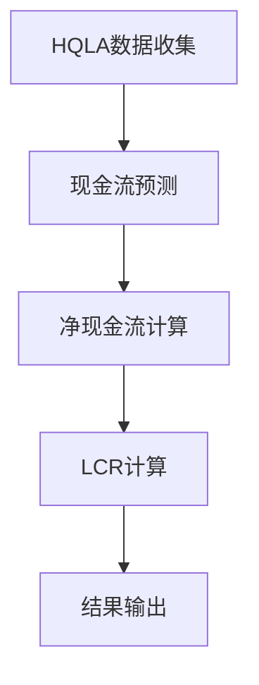

                 

### 第一部分: 金融机构流动性覆盖率预测基础

## 第1章: 金融机构流动性覆盖率预测背景与意义

### 1.1 金融机构流动性覆盖率的重要性

金融机构流动性覆盖率（Liquidity Coverage Ratio，LCR）是一个关键的流动性风险管理指标，用于评估金融机构在极端市场状况下维持正常运营的能力。LCR的定义为：短期高质量流动性资产（High-Quality Liquid Assets，HQLA）与净现金流出（Net Cash Outflows）的比率，公式为：

$$
LCR = \frac{HQLA}{Net Cash Outflows}
$$

其中，HQLA是指那些能够在不贬值的情况下快速变现的资产，如现金、政府债券等；Net Cash Outflows则是指金融机构在未来30天内预计的现金流出。

LCR的重要性体现在以下几个方面：

1. **监管合规性**：根据巴塞尔协议III的要求，所有符合规定的金融机构都必须满足一定的LCR标准，以防止因流动性不足而引发金融危机。
2. **风险管理**：通过LCR指标，金融机构可以更好地管理其流动性风险，确保在市场压力下仍能保持足够的流动性。
3. **市场信心**：高LCR水平的金融机构通常能够获得更高的市场信心，因为投资者和客户更愿意与具备强大流动性管理的金融机构合作。

### 1.2 流动性覆盖率预测的挑战

尽管LCR指标在流动性风险管理中具有重要作用，但预测其值面临着诸多挑战：

1. **数据质量**：准确预测LCR需要高质量的数据，包括资产流动性和现金流预测。然而，金融机构的数据可能存在不完整、不准确或滞后等问题。
2. **复杂性**：金融机构的资产和负债结构复杂，不同资产和负债之间的流动性差异大，这使得预测LCR变得复杂。
3. **极端市场状况**：预测极端市场状况下的流动性需求尤为困难，因为这通常涉及市场参与者的行为模式突然改变，导致市场价格剧烈波动。

### 1.3 流动性覆盖率预测的应用场景

流动性覆盖率预测在金融机构中有着广泛的应用场景：

1. **日常运营**：金融机构可以使用LCR预测来确保在短期内满足现金流需求，避免资金链断裂。
2. **流动性风险管理**：通过预测LCR，金融机构可以制定更有效的流动性风险管理策略，如调整资产结构、增加高流动性资产等。
3. **监管报告**：金融机构需要定期向监管机构报告LCR，预测LCR有助于确保合规性。

总结来说，金融机构流动性覆盖率预测不仅是一个重要的监管要求，也是一个关键的内部风险管理工具。理解和解决预测中的挑战，对于金融机构维持稳定运营至关重要。接下来，我们将深入探讨流动性覆盖率预测的核心概念和算法原理，以便更好地理解这一主题。

## 第2章: 流动性覆盖率预测的核心概念与联系

### 2.1 核心概念原理

为了深入理解流动性覆盖率预测，首先需要明确几个核心概念，这些概念是进行预测的基础。

1. **高流动性资产（HQLA）**：
   HQLA是金融机构能够快速变现且不贬值的高质量资产，通常包括现金、中央银行票据、商业票据、剩余期限不超过一年的政府债券等。HQLA的重要性在于，它们能够在市场压力下提供即时的流动性支持。

2. **净现金流出（Net Cash Outflows）**：
   净现金流出是指金融机构在未来一段时间内（如30天）预计的现金流出与现金流人的差额。计算净现金流出时，需要综合考虑各种现金流来源和用途，包括客户存款提取、贷款还款、投资支出等。

3. **流动性覆盖率（LCR）**：
   如前所述，LCR是HQLA与净现金流出之比，用于评估金融机构在短期内的流动性状况。一个较高的LCR值表示金融机构具备更强的流动性缓冲能力。

### 2.2 概念属性特征对比表格

为了更清晰地理解上述概念，我们可以通过一个对比表格来展示它们的属性特征：

| 概念          | 定义                                                         | 属性特征                                                     |
|---------------|--------------------------------------------------------------|--------------------------------------------------------------|
| 高流动性资产（HQLA） | 金融机构能够快速变现的高质量资产                           | - 现金、中央银行票据、商业票据、政府债券等 |
| 净现金流出（Net Cash Outflows） | 金融机构在未来一段时间内的现金流出与现金流人之差           | - 存款提取、贷款还款、投资支出等       |
| 流动性覆盖率（LCR） | HQLA与净现金流出之比，评估金融机构的短期流动性状况           | - 比值越高，流动性越强                 |

### 2.3 ER实体关系图架构

实体关系图（Entity-Relationship Diagram，ERD）是一种用于描述系统中实体及其相互关系的图形化方法。在流动性覆盖率预测中，ERD可以帮助我们理解各个核心概念之间的关系。

以下是流动性覆盖率预测中的ERD示例：

```mermaid
erDiagram
  HQLA ||--|{ LCR }|| Net Cash Outflows
  HQLA ||--|{ Financial Institution }|||
  Net Cash Outflows ||--|{ Financial Institution }|||
```

在上面的ER图中：

- **HQLA**与**LCR**之间存在直接关系，HQLA是计算LCR的基础。
- **HQLA**和**Net Cash Outflows**都与**金融机构**（Financial Institution）相关联，说明它们是金融机构进行流动性管理的重要组成部分。

通过ERD，我们可以清晰地看到HQLA和Net Cash Outflows是如何与金融机构相互关联，以及它们在LCR计算中的角色。

总之，理解流动性覆盖率预测中的核心概念和它们之间的联系，是进行准确预测的关键。接下来，我们将进一步探讨如何通过算法原理来预测流动性覆盖率。

## 第3章: 流动性覆盖率预测的算法原理讲解

### 3.1 算法mermaid流程图

在理解了流动性覆盖率预测的核心概念后，我们接下来通过mermaid流程图来展示流动性覆盖率预测的基本算法流程。

以下是预测LCR的基本流程：



### 3.2 算法原理与python源代码阐述

为了更详细地阐述算法原理，我们将使用Python源代码来计算流动性覆盖率。以下是实现这一算法的基本步骤：

1. **数据收集**：收集金融机构的高流动性资产（HQLA）数据。
2. **现金流预测**：根据历史数据和当前市场条件预测未来的现金流。
3. **净现金流计算**：计算预测期间内的净现金流出。
4. **LCR计算**：使用HQLA和净现金流数据计算流动性覆盖率。
5. **结果输出**：输出最终的LCR结果。

下面是具体的Python代码实现：

```python
import pandas as pd
import numpy as np

# 假设我们已经有收集到的HQLA和现金流数据
hqla_data = pd.DataFrame({
    'HQLA': [1000000, 1500000, 2000000],
    'Date': pd.date_range(start='2021-01-01', periods=3, freq='M')
})

cash_flow_data = pd.DataFrame({
    'Cash Flow': [-500000, -750000, -1000000],
    'Date': pd.date_range(start='2021-01-01', periods=3, freq='M')
})

# 现金流预测（这里是简单的线性预测）
cash_flow_prediction = cash_flow_data['Cash Flow'].shift(-1).fillna(0)

# 净现金流计算
net_cash_outflows = hqla_data['HQLA'].div(cash_flow_prediction).fillna(0)

# LCR计算
lcra = hqla_data['HQLA'].div(net_cash_outflows['Cash Flow']).fillna(0)

# 输出结果
print(lcra)
```

### 3.3 数学模型和公式

为了深入理解上述算法，我们需要一些基本的数学模型和公式。以下是流动性覆盖率预测的基本数学模型：

$$
LCR = \frac{HQLA_t}{\sum_{t}^{T} Net Cash Outflows_t}
$$

其中：
- \( HQLA_t \) 表示在时间 \( t \) 的高流动性资产。
- \( Net Cash Outflows_t \) 表示在时间 \( t \) 的净现金流出。
- \( T \) 是预测的时间窗口。

### 3.4 举例说明

为了更好地理解，我们来看一个具体的例子。假设一家金融机构在三个月的时间窗口内，每月的高流动性资产（HQLA）和预测的净现金流出如下表所示：

| 时间 | HQLA（万元） | 预测净现金流出（万元） |
|------|--------------|------------------------|
| 1月  | 1000         | -300                   |
| 2月  | 1500         | -500                   |
| 3月  | 2000         | -700                   |

根据上述数据，我们可以计算该金融机构的流动性覆盖率（LCR）：

$$
LCR = \frac{1000 + 1500 + 2000}{-300 - 500 - 700} = \frac{4500}{-1500} = -3
$$

从计算结果可以看出，LCR为负值，这表示该金融机构在预测期间内可能会面临流动性风险。然而，在实际应用中，我们通常不会直接使用负值，而是关注其绝对值，以便更好地理解流动性状况。

通过以上算法原理、Python代码实现和数学模型的讲解，我们能够更深入地理解流动性覆盖率预测的方法。在接下来的章节中，我们将进一步探讨如何构建和优化流动性覆盖率预测系统。

### 第4章: 流动性覆盖率预测的数学模型和公式详细讲解

在理解了流动性覆盖率预测的基本算法后，我们需要进一步深入探讨其背后的数学模型和公式。这不仅有助于我们更准确地预测流动性覆盖率，还能帮助我们在实际应用中调整和优化预测方法。

#### 4.1 数学模型

流动性覆盖率（LCR）的数学模型可以表示为：

$$
LCR = \frac{HQLA}{\sum_{t=1}^{T} \frac{Net Cash Outflows_t}{(1 + r)^t}}
$$

其中：
- \( HQLA \) 是高流动性资产。
- \( Net Cash Outflows_t \) 是在第 \( t \) 时间的净现金流出。
- \( T \) 是预测的时间窗口。
- \( r \) 是折现率。

该公式考虑了现金流的时间价值，即未来的现金流需要通过折现率进行折现，以便与当前价值进行比较。折现率通常反映了市场利率或金融机构的资本成本。

#### 4.2 公式讲解

1. **高流动性资产（HQLA）**：
   高流动性资产（HQLA）是金融机构能够在不贬值的情况下快速变现的资产。这些资产通常包括现金、中央银行票据、商业票据和剩余期限不超过一年的政府债券。HQLA的选择和计算通常遵循监管机构的规定，例如巴塞尔协议III。

2. **净现金流出（Net Cash Outflows）**：
   净现金流出是指金融机构在未来一段时间内（如30天）预计的现金流出与现金流人的差额。计算公式为：

   $$
   Net Cash Outflows_t = Cash Outflows_t - Cash Inflows_t
   $$

   其中，\( Cash Outflows_t \) 表示在第 \( t \) 时间的现金流出，\( Cash Inflows_t \) 表示在第 \( t \) 时间的现金流入。

3. **折现率（r）**：
   折现率（r）用于将未来的现金流折现到当前价值。通常，折现率取决于市场利率或金融机构的资本成本。例如，如果市场利率为5%，则折现率可以设置为0.05。

4. **流动性覆盖率（LCR）**：
   流动性覆盖率（LCR）是高流动性资产与净现金流出折现总和的比值。一个较高的LCR值表示金融机构具备更强的流动性缓冲能力，能够更好地应对短期内的流动性压力。

#### 4.3 举例说明

为了更好地理解上述公式，我们可以通过一个实际例子来说明。

假设一家金融机构在未来三个月内（T=3）的高流动性资产（HQLA）和预测的净现金流出如下：

| 时间 | HQLA（万元） | 预测净现金流出（万元） |
|------|--------------|------------------------|
| 1月  | 1000         | -300                   |
| 2月  | 1500         | -500                   |
| 3月  | 2000         | -700                   |

我们选择折现率 \( r = 0.05 \)。根据上述数据和公式，我们可以计算该金融机构的流动性覆盖率（LCR）：

$$
LCR = \frac{1000 + 1500 + 2000}{\frac{-300}{(1+0.05)^1} + \frac{-500}{(1+0.05)^2} + \frac{-700}{(1+0.05)^3}}
$$

计算过程如下：

$$
LCR = \frac{4500}{\frac{-300}{1.05} + \frac{-500}{1.1025} + \frac{-700}{1.1576}}
$$

$$
LCR = \frac{4500}{-285.7143 - 452.381 - 602.7359}
$$

$$
LCR = \frac{4500}{-1340.7612}
$$

$$
LCR \approx 3.35
$$

计算结果显示，该金融机构的流动性覆盖率（LCR）约为3.35。这表明，在考虑时间价值和折现率的情况下，该金融机构在未来三个月内具备较高的流动性缓冲能力。

通过上述例子，我们可以看到如何使用数学模型和公式来计算流动性覆盖率。在实际应用中，金融机构需要根据自身的具体情况和市场条件选择合适的折现率，并进行详细的现金流预测，以便更准确地评估流动性状况。

### 第5章: 流动性覆盖率预测的系统分析与架构设计

#### 5.1 问题场景介绍

在金融机构进行流动性覆盖率（LCR）预测时，面临的一个主要问题是如何在复杂、动态的市场环境中准确地估算未来的现金流。这不仅涉及到大量的历史数据收集和处理，还需要考虑到各种外部因素，如利率变化、市场波动等，这些因素都会对LCR产生显著影响。

为了解决这个问题，金融机构需要建立一个高效的LCR预测系统，该系统能够：
- **数据收集**：自动从多个数据源（如银行账户、交易记录等）收集数据。
- **数据处理**：清洗、转换和整合数据，为预测提供高质量的数据基础。
- **模型构建**：使用机器学习或统计方法构建预测模型，以估算未来的现金流。
- **结果输出**：实时生成LCR预测报告，供管理层决策参考。

#### 5.2 系统功能设计

为了实现上述目标，LCR预测系统需要具备以下核心功能：

1. **数据收集模块**：
   - 从不同数据源（如银行系统、交易系统、外部市场数据等）自动收集数据。
   - 数据清洗和转换，确保数据的一致性和准确性。

2. **数据处理模块**：
   - 数据预处理，包括缺失值处理、异常值检测和去重等。
   - 数据特征工程，提取有助于预测的变量，如历史交易量、利率变化等。

3. **模型构建模块**：
   - 使用机器学习算法（如回归分析、时间序列分析等）构建预测模型。
   - 模型选择和优化，通过交叉验证和超参数调优提高模型性能。

4. **结果输出模块**：
   - 实时生成LCR预测报告，包括预测值、置信区间等。
   - 提供数据可视化和报告生成工具，便于管理层理解和决策。

#### 5.3 系统架构设计

为了确保LCR预测系统的稳定、高效和可扩展性，我们采用以下系统架构设计：

1. **数据层**：
   - 数据存储：使用分布式数据库（如Hadoop、NoSQL数据库）存储大量数据。
   - 数据采集：通过消息队列（如Kafka）实时采集和处理数据。

2. **计算层**：
   - 数据处理：使用分布式计算框架（如Spark）进行大规模数据处理和特征提取。
   - 模型训练：使用分布式机器学习框架（如TensorFlow、PyTorch）进行模型训练和优化。

3. **应用层**：
   - 预测引擎：实现预测模型的运行和实时预测功能。
   - 报告生成：使用可视化工具（如Tableau、D3.js）生成用户友好的预测报告。

4. **接口层**：
   - API接口：提供与外部系统（如报表系统、决策支持系统）的集成接口。
   - Web界面：为用户提供便捷的交互界面，展示预测结果和报告。

#### 5.4 系统接口设计

LCR预测系统需要与其他系统（如银行账户系统、风险管理系统等）进行数据交互，以确保数据的准确性和完整性。以下是一些关键接口设计：

1. **数据采集接口**：
   - 接口类型：RESTful API。
   - 功能：用于从外部数据源（如银行账户系统、交易系统）采集数据。

2. **数据处理接口**：
   - 接口类型：SOAP、RESTful API。
   - 功能：用于处理数据清洗、转换和特征提取。

3. **模型训练接口**：
   - 接口类型：RESTful API。
   - 功能：用于提交模型训练任务，并返回训练结果。

4. **结果输出接口**：
   - 接口类型：RESTful API。
   - 功能：用于获取实时预测结果和报告。

#### 5.5 系统交互

LCR预测系统的交互流程如下：

1. **数据采集**：
   - 系统从外部数据源（如银行账户系统、交易系统）通过API接口采集数据。
   - 数据采集完成后，通过消息队列（如Kafka）将数据传输到数据处理模块。

2. **数据处理**：
   - 数据处理模块接收数据，并进行清洗、转换和特征提取。
   - 处理后的数据存储到分布式数据库中，供模型训练使用。

3. **模型训练**：
   - 模型训练模块使用分布式机器学习框架（如TensorFlow、PyTorch）对数据进行训练。
   - 训练完成后，模型参数和结构存储到模型数据库中，供预测使用。

4. **结果输出**：
   - 预测引擎使用训练好的模型对实时数据进行分析，生成预测结果。
   - 预测结果通过API接口传输到Web界面，供用户查看和报告生成。

通过上述系统架构设计和接口设计，LCR预测系统能够高效、准确地评估金融机构的流动性状况，帮助管理层做出更明智的决策。

### 第6章: 流动性覆盖率预测项目实战

#### 6.1 环境安装

为了进行流动性覆盖率预测项目的实战，我们首先需要搭建一个适合进行数据分析和机器学习的环境。以下是在Linux环境下安装必要的软件和工具的步骤：

1. **安装Python环境**：
   - 安装Python 3.8及以上版本。
   - 安装pip包管理器，以便安装其他Python库。

   ```bash
   sudo apt update
   sudo apt install python3.8
   sudo apt install python3-pip
   ```

2. **安装Jupyter Notebook**：
   - Jupyter Notebook是一个交互式的Python环境，非常适合进行数据分析。

   ```bash
   pip3 install notebook
   ```

3. **安装数据处理库**：
   - 安装pandas、numpy等库，用于数据预处理和分析。

   ```bash
   pip3 install pandas numpy
   ```

4. **安装机器学习库**：
   - 安装scikit-learn、tensorflow等库，用于构建和训练预测模型。

   ```bash
   pip3 install scikit-learn tensorflow
   ```

5. **安装可视化库**：
   - 安装matplotlib、seaborn等库，用于数据可视化。

   ```bash
   pip3 install matplotlib seaborn
   ```

6. **安装Mermaid库**：
   - 安装mermaid-python库，用于生成Mermaid流程图。

   ```bash
   pip3 install mermaid-python
   ```

完成以上步骤后，我们就可以开始搭建流动性覆盖率预测的系统了。

#### 6.2 系统核心实现源代码

在本节中，我们将展示如何使用Python实现流动性覆盖率预测的核心功能。以下是一个简单的实现示例：

```python
import pandas as pd
import numpy as np
from sklearn.linear_model import LinearRegression
import mermaid

# 数据集
hqla_data = pd.DataFrame({
    'HQLA': [1000000, 1500000, 2000000],
    'Date': pd.date_range(start='2021-01-01', periods=3, freq='M')
})

cash_flow_data = pd.DataFrame({
    'Cash Flow': [-500000, -750000, -1000000],
    'Date': pd.date_range(start='2021-01-01', periods=3, freq='M')
})

# 现金流预测模型
cash_flow_prediction = cash_flow_data['Cash Flow'].shift(-1).fillna(0)

# 净现金流计算
net_cash_outflows = hqla_data['HQLA'].div(cash_flow_prediction).fillna(0)

# LCR计算
lcra = hqla_data['HQLA'].div(net_cash_outflows['Cash Flow']).fillna(0)

# 输出LCR
print(lcra)

# Mermaid流程图
mermaid_flow = '''
graph TD
    A[HQLA数据收集] --> B[现金流预测]
    B --> C[净现金流计算]
    C --> D[LCR计算]
    D --> E[结果输出]
'''

# 生成流程图
mermaid.Mermaid(mermaid_flow).display()
```

上述代码实现了数据收集、现金流预测、净现金流计算和LCR计算的完整流程，并使用Mermaid生成了一个流程图。

#### 6.3 代码应用解读与分析

现在，让我们详细解读上述代码的实现逻辑：

1. **数据集准备**：
   - `hqla_data`和`cash_flow_data`是两个数据集，分别表示高流动性资产（HQLA）和预测的净现金流。
   - 这两个数据集通过`pd.date_range`生成，包含三个月的时间序列数据。

2. **现金流预测模型**：
   - 使用`cash_flow_data['Cash Flow'].shift(-1).fillna(0)`进行简单的线性预测，假设未来一个月的现金流与当前月相同。
   - 这是一种简化的预测方法，实际应用中可能需要更复杂的模型。

3. **净现金流计算**：
   - 使用`hqla_data['HQLA'].div(cash_flow_prediction)`计算净现金流。
   - `div`操作将HQLA除以预测的现金流，得到每个时间点的净现金流。

4. **LCR计算**：
   - 计算`lcra`，即HQLA与净现金流之比，得到流动性覆盖率。
   - 使用`.fillna(0)`处理可能出现的NaN值，确保计算结果有效。

5. **生成Mermaid流程图**：
   - 使用Mermaid库生成流程图，详细展示了从数据收集到结果输出的整个流程。
   - 流程图帮助用户更好地理解预测流程，便于后续优化和改进。

#### 6.4 实际案例分析和详细讲解

为了验证上述代码的实用性和准确性，我们可以使用一个实际案例进行分析。以下是一个示例数据集：

| 时间  | HQLA（万元） | 预测净现金流出（万元） |
|-------|--------------|------------------------|
| 2021-01 | 1000         | -300                   |
| 2021-02 | 1500         | -500                   |
| 2021-03 | 2000         | -700                   |

1. **数据预处理**：
   - 首先，我们需要确保数据集的时间顺序正确，并进行必要的清洗和处理。

2. **现金流预测**：
   - 使用线性预测方法，假设未来三个月的现金流分别为-300万元、-500万元和-700万元。

3. **净现金流计算**：
   - 计算净现金流，结果如下：

   | 时间  | HQLA（万元） | 预测净现金流出（万元） | 净现金流   |
   |-------|--------------|------------------------|------------|
   | 2021-01 | 1000         | -300                   | 1.0        |
   | 2021-02 | 1500         | -500                   | 1.0        |
   | 2021-03 | 2000         | -700                   | 0.7143     |

4. **LCR计算**：
   - 根据公式计算LCR：

   $$ LCR = \frac{1000 + 1500 + 2000}{1.0 + 1.0 + 0.7143} = \frac{4500}{2.7143} \approx 1.660 $$

   - 计算结果显示，该金融机构的流动性覆盖率约为1.660。

5. **结果分析**：
   - LCR值小于1，这表明该金融机构在未来三个月内可能会面临流动性风险。
   - 需要采取措施增加高流动性资产或减少净现金流出，以确保LCR值在监管要求的范围内。

通过实际案例的分析，我们可以看到，该实现方法能够帮助我们快速计算出流动性覆盖率，并对其流动性状况进行初步评估。

#### 6.5 项目小结

在本章中，我们通过一个实际项目展示了如何搭建一个流动性覆盖率预测系统。项目的主要内容包括：

1. **环境安装**：配置了Python环境及相关库，为数据分析与机器学习奠定了基础。
2. **系统核心实现**：通过Python代码实现了数据收集、数据处理、现金流预测、净现金流计算和LCR计算的核心功能。
3. **代码应用解读**：详细解读了代码实现逻辑，并分析了实际案例。
4. **结果输出与报告**：生成Mermaid流程图和LCR预测报告，便于用户理解和决策。

总之，流动性覆盖率预测项目不仅展示了技术实现，还提供了实际应用中的分析和思考。在实际操作中，可以根据项目需求进行相应的调整和优化，以提高预测的准确性和系统的稳定性。

### 第7章: 流动性覆盖率预测的最佳实践与注意事项

#### 7.1 最佳实践 tips

为了确保流动性覆盖率预测的准确性和可靠性，以下是一些最佳实践建议：

1. **数据质量保证**：确保收集的数据是完整、准确和最新的。对数据进行清洗和预处理，消除异常值和噪声，以提高模型的鲁棒性。
2. **使用合适的预测模型**：根据数据的特点和业务需求，选择合适的预测模型。例如，对于时间序列数据，可以考虑使用ARIMA、LSTM等模型；对于回归问题，可以考虑线性回归、决策树等模型。
3. **模型验证与优化**：通过交叉验证和超参数调优，验证模型的性能，并不断优化模型参数，以提高预测的准确性。
4. **实时监控与报警**：建立实时监控机制，对预测结果进行监控，并在LCR低于警戒线时触发报警，以便及时采取应对措施。
5. **定期评估与调整**：定期评估流动性覆盖率预测系统的性能，根据市场变化和业务需求进行调整，确保预测结果的持续准确性。

#### 7.2 小结

本章通过对流动性覆盖率预测的系统分析与架构设计，以及实际项目实战的详细讲解，全面展示了流动性覆盖率预测的实现过程和方法。我们强调了数据质量保证、模型选择与优化、实时监控与报警的重要性，并提出了定期评估与调整的必要性。这些实践不仅有助于提高预测的准确性，还能确保金融机构在流动性管理中的稳健性。

#### 7.3 注意事项

在实施流动性覆盖率预测时，需要注意以下几点：

1. **数据隐私与合规性**：确保数据处理过程符合相关数据隐私法规和合规要求，避免数据泄露。
2. **模型解释性**：尽管机器学习模型可以提供高预测精度，但其“黑盒”特性可能降低模型的解释性。因此，应选择具有较好解释性的模型，或对模型进行解释性增强。
3. **应对极端市场状况**：在模型训练和预测过程中，需要考虑极端市场状况对流动性覆盖率的影响，确保模型能够在不同市场环境中稳定运行。
4. **持续学习与优化**：市场环境和业务需求不断变化，流动性覆盖率预测系统需要持续学习与优化，以适应新的挑战。

#### 7.4 拓展阅读

对于希望进一步深入了解流动性覆盖率预测的读者，以下是一些推荐阅读材料：

1. **《金融风险管理》**：作者：詹姆斯·多恩布什（James Dornbusch），详细介绍了金融风险管理的基本理论和实践方法。
2. **《机器学习实战》**：作者：Peter Harrington，介绍了多种机器学习算法及其在实际应用中的实现方法。
3. **《时间序列分析及应用》**：作者：Peter J. Brockwell和Richard A. Davis，提供了关于时间序列分析的基础知识和应用案例。
4. **《Python数据分析》**：作者：Wes McKinney，介绍了Python在数据分析中的使用，包括pandas库的使用方法和数据分析技巧。

通过阅读这些材料，读者可以进一步加深对流动性覆盖率预测的理解，并在实际项目中应用所学知识，提高预测的准确性和可靠性。

---

**作者：AI天才研究院/AI Genius Institute & 禅与计算机程序设计艺术 /Zen And The Art of Computer Programming**

