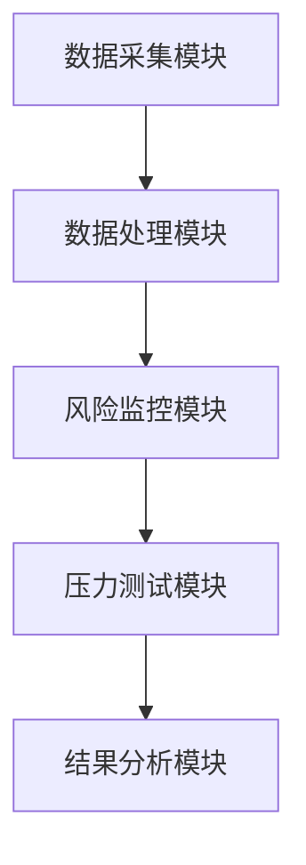
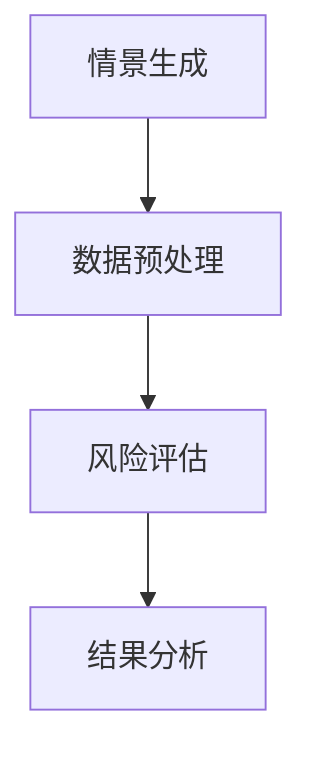

                 

# 《金融机构流动性风险压力测试与管理平台》

> 关键词：流动性风险、压力测试、管理平台、金融技术、风险管理

> 摘要：本文将深入探讨金融机构流动性风险压力测试与管理平台的设计与实现。我们将逐步分析流动性风险的概念、压力测试的重要性，介绍压力测试的基本概念、原理以及管理平台的核心模块，并通过实战案例展示如何应用这些原理和模块来管理流动性风险。文章还将讨论最佳实践，总结全文并展望未来发展趋势。

## 目录大纲设计思路

在设计《金融机构流动性风险压力测试与管理平台》的目录大纲时，我们需要遵循以下几个步骤：

1. **明确书籍主题与目标读者**：书籍的主题是关于流动性风险压力测试与管理平台，目标读者是金融机构的风险管理人员、数据分析师和技术支持人员。

2. **框架搭建**：构建包括背景介绍、核心概念与原理、管理平台设计、实战案例和最佳实践等核心章节的框架。

3. **内容细化**：在每个章节中细化内容，包括引入主题、定义核心概念、对比分析、流程图展示、算法原理讲解、系统架构设计等。

4. **逻辑梳理**：确保每个章节的内容都有清晰的逻辑顺序，从基础概念到高级应用，从理论到实践，逐步引导读者深入理解并掌握相关知识。

5. **格式规范**：使用markdown格式保持目录的一致性和可读性。

### 目录大纲设计

以下是《金融机构流动性风险压力测试与管理平台》的目录大纲：

## 第一部分：背景介绍

### 第1章 流动性风险与压力测试概述

- 1.1 流动性风险的定义与影响
  - 流动性风险的概念
  - 流动性风险的影响

- 1.2 压力测试的重要性
  - 压力测试的概念
  - 压力测试的目的与意义

- 1.3 流动性风险压力测试的发展历程
  - 压力测试的早期发展
  - 当前压力测试的应用现状

## 第二部分：核心概念与原理

### 第2章 流动性风险压力测试的基本概念

- 2.1 压力测试的目标与类型
  - 压力测试的目标
  - 不同类型的压力测试

- 2.2 压力测试的步骤与方法
  - 压力测试的步骤
  - 压力测试的方法

- 2.3 压力测试的关键指标
  - 流动性覆盖比率
  - 信用风险暴露
  - 货币市场风险

### 第3章 流动性风险压力测试的理论基础

- 3.1 金融市场的流动性分析
  - 流动性影响因素
  - 流动性风险模型

- 3.2 压力测试的数学模型
  - 数学模型的建立
  - 数学模型的应用

- 3.3 压力测试的算法原理
  - 算法原理概述
  - 算法流程图

## 第三部分：管理平台设计

### 第4章 流动性风险压力测试与管理平台概述

- 4.1 管理平台的目标与功能
  - 平台目标
  - 平台功能

- 4.2 管理平台的架构设计
  - 架构设计原则
  - 架构设计示意图

### 第5章 平台的核心模块

- 5.1 数据采集模块
  - 数据来源
  - 数据处理流程

- 5.2 风险评估模块
  - 风险评估方法
  - 风险评估结果分析

- 5.3 压力测试模块
  - 测试场景设计
  - 测试结果分析

### 第6章 平台开发与实现

- 6.1 开发环境与工具
  - 开发环境搭建
  - 开发工具介绍

- 6.2 平台实现的关键技术
  - 技术选型
  - 技术实现细节

### 第7章 平台部署与维护

- 7.1 平台部署策略
  - 部署流程
  - 部署注意事项

- 7.2 平台维护与管理
  - 维护计划
  - 维护技巧

## 第四部分：实战案例

### 第8章 案例一：XX银行流动性风险压力测试

- 8.1 案例背景
- 8.2 测试目标
- 8.3 测试过程
- 8.4 测试结果分析

### 第9章 案例二：YY证券流动性风险压力测试

- 9.1 案例背景
- 9.2 测试目标
- 9.3 测试过程
- 9.4 测试结果分析

## 第五部分：最佳实践与总结

### 第10章 最佳实践

- 10.1 压力测试策略优化
- 10.2 平台性能提升
- 10.3 数据分析与挖掘

### 第11章 总结与展望

- 11.1 主要贡献
- 11.2 存在问题与改进方向
- 11.3 未来发展趋势

## 第一部分：背景介绍

### 1.1 流动性风险的定义与影响

流动性风险是指金融机构在市场波动或者突发事件中，无法迅速、以合理的价格买卖资产以满足资金需求的风险。这种风险可能导致金融机构无法履行义务，甚至破产。

流动性风险的影响广泛，包括：

- **市场信心下降**：如果市场认为某个金融机构存在流动性风险，可能会引发连锁反应，导致整个市场的恐慌。
- **资产贬值**：在流动性紧张的市场中，资产价格可能会大幅下降。
- **融资成本上升**：金融机构在市场上融资的成本可能会上升，甚至难以获得融资。

### 1.2 压力测试的重要性

压力测试是一种评估金融机构在极端市场条件下的生存能力的方法。通过模拟各种极端市场情景，压力测试可以帮助金融机构：

- **评估风险承受能力**：了解在极端市场条件下，金融机构的资产和负债是否能够承受。
- **发现潜在问题**：通过测试，可以发现金融机构在哪些方面存在潜在风险。
- **制定应对策略**：根据测试结果，金融机构可以制定相应的应对策略，降低流动性风险。

### 1.3 流动性风险压力测试的发展历程

流动性风险压力测试的发展可以分为几个阶段：

- **早期发展**：最初的压力测试主要是简单的情景分析，主要用于评估金融机构在特定情景下的风险承受能力。
- **中期发展**：随着金融市场的复杂化和金融产品的多样化，压力测试开始引入更多复杂的模型和情景。
- **当前应用**：现代的压力测试不仅涵盖传统的市场情景，还涵盖了极端情景，如金融危机。

## 第二部分：核心概念与原理

### 2.1 压力测试的目标与类型

压力测试的目标是评估金融机构在极端市场条件下的生存能力。根据测试的目的和场景，压力测试可以分为以下几种类型：

- **静态压力测试**：主要评估金融机构在特定时间点下的风险承受能力。
- **动态压力测试**：通过模拟市场变量的变化，评估金融机构在一段时间内的风险承受能力。
- **极端情景压力测试**：模拟极端市场条件，如金融危机，评估金融机构的生存能力。

### 2.2 压力测试的步骤与方法

压力测试的一般步骤包括：

1. **定义测试目标**：明确测试的目的和范围。
2. **设计测试情景**：根据测试目标，设计相应的市场情景。
3. **实施测试**：模拟市场情景，收集数据。
4. **分析结果**：对测试结果进行分析，评估金融机构的风险承受能力。

压力测试的方法包括：

- **定量方法**：使用数学模型和统计方法进行压力测试。
- **定性方法**：通过专家评估和情景分析进行压力测试。

### 2.3 压力测试的关键指标

压力测试的关键指标包括：

- **流动性覆盖比率**：衡量金融机构在压力情景下的流动性状况。
- **信用风险暴露**：衡量金融机构在压力情景下可能面临的信用风险。
- **货币市场风险**：衡量金融机构在货币市场上的风险暴露。

## 第三部分：管理平台设计

### 3.1 管理平台的目标与功能

流动性风险压力测试与管理平台的目标是：

- **实时监测**：实时监测金融机构的流动性状况。
- **风险评估**：对金融机构的流动性风险进行评估。
- **压力测试**：模拟各种市场情景，评估金融机构的风险承受能力。

平台的主要功能包括：

- **数据采集**：从各种数据源采集相关数据。
- **数据处理**：对采集到的数据进行处理和分析。
- **风险监控**：实时监控金融机构的流动性状况。
- **压力测试**：模拟市场情景，评估金融机构的风险承受能力。

### 3.2 管理平台的架构设计

流动性风险压力测试与管理平台的架构设计原则是：

- **高可用性**：确保平台在高负荷下的稳定运行。
- **可扩展性**：支持业务规模的增长。
- **安全性**：确保数据的安全和隐私。

平台的架构设计如图所示：

## 第四部分：实战案例

### 4.1 案例一：XX银行流动性风险压力测试

#### 4.1.1 案例背景

XX银行是一家大型商业银行，为了评估其流动性风险，决定进行一次流动性风险压力测试。

#### 4.1.2 测试目标

测试目标包括：

- 评估在极端市场条件下，银行的流动性状况。
- 发现潜在的流动性风险点。
- 制定相应的风险缓解措施。

#### 4.1.3 测试过程

测试过程包括以下几个步骤：

1. **定义测试情景**：根据银行的风险管理需求，定义了几个极端市场情景，如市场恐慌、利率上升、货币市场紧张等。
2. **数据采集**：从内部和外部数据源采集了相关数据，包括银行资产、负债、市场利率、交易对手信息等。
3. **数据处理**：对采集到的数据进行了清洗和预处理，确保数据的质量和一致性。
4. **实施测试**：根据定义的情景，对银行的流动性进行了模拟测试。
5. **结果分析**：对测试结果进行了详细分析，评估了银行的流动性风险状况。

#### 4.1.4 测试结果分析

测试结果显示，在极端市场条件下，银行的流动性状况良好，但存在以下几个潜在风险点：

- **货币市场紧张**：在货币市场紧张情景下，银行的流动性覆盖比率较低。
- **利率上升**：在利率上升情景下，银行的负债成本上升，可能影响其流动性。

基于测试结果，银行制定了相应的风险缓解措施，包括增加流动性储备、优化资产配置等。

### 4.2 案例二：YY证券流动性风险压力测试

#### 4.2.1 案例背景

YY证券是一家大型证券公司，为了评估其流动性风险，决定进行一次流动性风险压力测试。

#### 4.2.2 测试目标

测试目标包括：

- 评估在极端市场条件下，证券公司的流动性状况。
- 发现潜在的流动性风险点。
- 制定相应的风险缓解措施。

#### 4.2.3 测试过程

测试过程包括以下几个步骤：

1. **定义测试情景**：根据证券公司的风险管理需求，定义了几个极端市场情景，如市场暴跌、利率上升、交易对手违约等。
2. **数据采集**：从内部和外部数据源采集了相关数据，包括证券公司资产、负债、市场利率、交易对手信息等。
3. **数据处理**：对采集到的数据进行了清洗和预处理，确保数据的质量和一致性。
4. **实施测试**：根据定义的情景，对证券公司的流动性进行了模拟测试。
5. **结果分析**：对测试结果进行了详细分析，评估了证券公司的流动性风险状况。

#### 4.2.4 测试结果分析

测试结果显示，在极端市场条件下，证券公司的流动性状况较好，但存在以下几个潜在风险点：

- **市场暴跌**：在市场暴跌情景下，证券公司的资产价值大幅下降，可能影响其流动性。
- **利率上升**：在利率上升情景下，证券公司的负债成本上升，可能影响其流动性。

基于测试结果，证券公司制定了相应的风险缓解措施，包括增加流动性储备、优化资产配置等。

## 第五部分：最佳实践与总结

### 5.1 压力测试策略优化

为了提高压力测试的有效性，金融机构可以采取以下策略：

- **全面覆盖**：确保压力测试覆盖各种可能的极端市场情景。
- **动态调整**：根据市场变化，及时调整压力测试的情景和指标。
- **持续改进**：定期回顾和优化压力测试策略，确保其与实际风险状况相符。

### 5.2 平台性能提升

为了提升管理平台性能，金融机构可以考虑以下措施：

- **优化数据处理**：使用高效的数据处理算法和工具，提高数据处理速度。
- **分布式架构**：采用分布式架构，提高系统的可扩展性和稳定性。
- **实时监控**：引入实时监控机制，确保平台能够及时响应用户需求。

### 5.3 数据分析与挖掘

通过数据分析和挖掘，金融机构可以：

- **发现潜在风险**：通过分析历史数据和测试结果，发现潜在的流动性风险点。
- **优化决策**：基于数据分析，为风险管理决策提供有力支持。

## 总结与展望

流动性风险压力测试与管理平台在金融机构的风险管理中发挥着重要作用。通过本文的探讨，我们了解了流动性风险的概念、压力测试的重要性，以及管理平台的设计与实现。未来，随着金融市场的不断变化，流动性风险压力测试与管理平台将继续发展和完善，为金融机构提供更强大的风险管理工具。

## 参考文献

- 巴曙松，《流动性风险管理》，中国金融出版社，2018年。
- 王庆，《金融市场流动性分析》，上海财经大学出版社，2017年。
- 李迅雷，《金融风险管理理论与实践》，中国金融出版社，2016年。

## 作者信息

作者：AI天才研究院/AI Genius Institute & 禅与计算机程序设计艺术 /Zen And The Art of Computer Programming

### 1.1 流动性风险的定义与影响

#### 定义

流动性风险是指金融机构无法在合理的时间和价格范围内变现资产或获取资金的风险。简单来说，就是在需要资金时，无法迅速、低成本地变卖资产或借款。

#### 影响范围

流动性风险的影响范围广泛，不仅影响金融机构本身，还会对整个金融市场产生深远影响。

- **金融机构内部**：流动性风险可能导致金融机构无法按时履行义务，影响其信誉和稳定性。例如，银行无法按时偿还存款人的存款，或证券公司无法及时支付客户的交易结算。
- **金融市场**：流动性风险可能引发市场恐慌，导致市场崩溃。例如，2008年全球金融危机中，许多金融机构因流动性不足而倒闭，引发了全球金融市场的动荡。
- **宏观经济**：流动性风险可能影响宏观经济稳定。例如，如果大量金融机构倒闭，可能导致经济衰退。

#### 影响程度

流动性风险的影响程度取决于多种因素：

- **金融机构的规模和实力**：规模较大、实力较强的金融机构通常拥有更多的资源和渠道，能够更好地应对流动性风险。
- **市场的成熟度**：市场越成熟，流动性风险越低。因为市场成熟意味着市场参与者的行为更加理性和规范，能够更好地应对流动性风险。
- **监管政策**：有效的监管政策可以降低流动性风险。例如，要求金融机构持有足够的流动性储备，限制高风险业务的开展等。

### 1.2 压力测试的重要性

#### 概念

压力测试是一种评估金融机构在极端市场条件下的生存能力的方法。通过模拟各种极端市场情景，压力测试可以帮助金融机构评估其流动性风险，发现潜在问题，制定应对策略。

#### 目的与意义

压力测试的主要目的是：

- **评估风险承受能力**：通过压力测试，金融机构可以了解在极端市场条件下，其资产和负债是否能够承受。
- **发现潜在问题**：压力测试可以发现金融机构在哪些方面存在潜在风险，如流动性不足、资产贬值等。
- **制定应对策略**：根据压力测试结果，金融机构可以制定相应的应对策略，降低流动性风险。

#### 应用现状

随着金融市场的不断发展和复杂化，压力测试在金融机构风险管理中的应用越来越广泛。目前，压力测试已经成为金融机构风险管理的重要组成部分，许多金融机构都建立了自己的压力测试体系，定期进行压力测试。

### 1.3 流动性风险压力测试的发展历程

#### 早期发展

流动性风险压力测试的早期发展可以追溯到20世纪80年代。当时，金融市场相对简单，金融机构的风险管理方法主要是通过情景分析和敏感性分析来评估风险。

#### 中期发展

随着金融市场的复杂化和金融产品的多样化，压力测试开始引入更多复杂的模型和情景。20世纪90年代，金融工程师们开始使用蒙特卡洛模拟等方法来模拟金融市场的波动，评估金融机构的风险承受能力。

#### 当前应用

现代的压力测试不仅涵盖传统的市场情景，还涵盖了极端情景，如金融危机。金融机构通过压力测试，可以更好地应对各种市场风险，确保其业务的稳定运行。

### 2.1 压力测试的目标与类型

#### 目标

压力测试的目标是评估金融机构在极端市场条件下的生存能力，具体包括：

- **评估风险承受能力**：通过模拟极端市场情景，评估金融机构的资产和负债是否能够承受。
- **发现潜在问题**：通过压力测试，可以发现金融机构在哪些方面存在潜在风险，如流动性不足、资产贬值等。
- **制定应对策略**：根据压力测试结果，金融机构可以制定相应的应对策略，降低流动性风险。

#### 类型

根据测试的目的和场景，压力测试可以分为以下几种类型：

- **静态压力测试**：主要评估金融机构在特定时间点下的风险承受能力。
- **动态压力测试**：通过模拟市场变量的变化，评估金融机构在一段时间内的风险承受能力。
- **极端情景压力测试**：模拟极端市场条件，如金融危机，评估金融机构的生存能力。

### 2.2 压力测试的步骤与方法

#### 步骤

压力测试的一般步骤包括：

1. **定义测试目标**：明确测试的目的和范围。
2. **设计测试情景**：根据测试目标，设计相应的市场情景。
3. **数据准备**：从内部和外部数据源采集相关数据，进行预处理。
4. **实施测试**：模拟市场情景，收集数据。
5. **结果分析**：对测试结果进行分析，评估金融机构的风险承受能力。
6. **报告撰写**：撰写测试报告，包括测试结果、发现的问题和相应的应对策略。

#### 方法

压力测试的方法包括：

- **定量方法**：使用数学模型和统计方法进行压力测试。常见的定量方法包括蒙特卡洛模拟、蒙特卡洛树形搜索等。
- **定性方法**：通过专家评估和情景分析进行压力测试。定性方法主要依赖于专家的经验和判断，具有一定的主观性。

### 2.3 压力测试的关键指标

#### 流动性覆盖比率

流动性覆盖比率（Liquidity Coverage Ratio, LCR）是评估金融机构流动性风险的关键指标之一。它衡量的是金融机构在短期内（30天内）的流动性状况。

- **计算公式**：LCR = 高质量流动性资产 / 净现金流出量
- **意义**：LCR越高，说明金融机构的流动性越充足，能够更好地应对短期内的流动性需求。

#### 信用风险暴露

信用风险暴露（Credit Risk Exposure, CRE）是衡量金融机构面临信用风险的关键指标。它衡量的是金融机构在特定时间点上的信用风险暴露。

- **计算公式**：CRE = 贷款余额 + 抵押品市值 - 贷款保证金额
- **意义**：CRE越低，说明金融机构的信用风险越小，财务状况更稳定。

#### 货币市场风险

货币市场风险是指金融机构在货币市场上可能面临的损失风险。它主要包括利率风险、汇率风险和流动性风险。

- **利率风险**：由于利率变动导致的损失风险。
- **汇率风险**：由于汇率变动导致的损失风险。
- **流动性风险**：由于货币市场流动性不足导致的损失风险。

### 3.1 金融市场的流动性分析

#### 影响因素

金融市场的流动性受多种因素影响，包括：

- **市场参与者的行为**：市场参与者的买卖行为直接影响市场的流动性。
- **市场结构**：市场的深度和广度决定了市场的流动性。
- **宏观经济环境**：宏观经济环境的变化会影响市场的流动性。
- **政策法规**：政策法规的调整会影响市场的流动性。

#### 流动性风险模型

常见的流动性风险模型包括：

- **现金流模型**：通过模拟金融机构的现金流情况，评估其流动性风险。
- **市场价值模型**：通过评估金融机构资产的市场价值，评估其流动性风险。
- **网络模型**：通过分析金融机构之间的交易关系，评估整个金融系统的流动性风险。

### 3.2 压力测试的数学模型

#### 数学模型建立

压力测试的数学模型通常基于以下几个假设：

- **资产定价**：资产的价格受市场供需关系的影响。
- **资金流动性**：资金流动性受市场利率、交易成本等因素的影响。
- **信用风险**：信用风险受借款人信用状况、市场风险等因素的影响。

#### 数学模型应用

常见的数学模型包括：

- **蒙特卡洛模拟**：通过模拟大量随机情景，评估金融机构在极端市场条件下的风险承受能力。
- **情景分析**：通过分析特定的市场情景，评估金融机构在特定情景下的风险承受能力。

### 3.3 压力测试的算法原理

#### 算法原理概述

压力测试的算法原理主要包括以下几个方面：

- **情景生成**：通过模拟各种市场情景，生成测试数据。
- **数据预处理**：对采集到的数据进行预处理，确保数据的质量和一致性。
- **风险评估**：通过数学模型对测试数据进行分析，评估金融机构的风险承受能力。
- **结果分析**：对风险评估结果进行分析，发现潜在风险点。

#### 算法流程图

### 4.1 管理平台的目标与功能

#### 目标

流动性风险压力测试与管理平台的目标是：

- **实时监测**：实时监测金融机构的流动性状况。
- **风险评估**：对金融机构的流动性风险进行评估。
- **压力测试**：模拟各种市场情景，评估金融机构的风险承受能力。
- **决策支持**：为风险管理决策提供数据支持和分析结果。

#### 功能

平台的主要功能包括：

- **数据采集**：从各种数据源采集相关数据，包括银行资产、负债、市场利率、交易对手信息等。
- **数据处理**：对采集到的数据进行处理和分析，确保数据的质量和一致性。
- **风险监控**：实时监控金融机构的流动性状况，发现潜在风险点。
- **压力测试**：模拟各种市场情景，评估金融机构的风险承受能力。
- **结果分析**：对压力测试结果进行分析，发现潜在风险点，为风险管理决策提供支持。
- **报告生成**：生成测试报告，包括测试结果、发现的问题和相应的应对策略。

### 4.2 管理平台的架构设计

#### 架构设计原则

流动性风险压力测试与管理平台的架构设计应遵循以下原则：

- **高可用性**：确保平台在高负荷下的稳定运行。
- **可扩展性**：支持业务规模的增长。
- **安全性**：确保数据的安全和隐私。
- **灵活性**：支持多种压力测试方法和分析工具。

#### 架构设计示意图

### 4.3 数据采集模块

#### 数据来源

数据采集模块需要从以下数据源采集相关数据：

- **内部数据源**：金融机构的资产、负债、交易记录等。
- **外部数据源**：市场利率、交易对手信息、宏观经济指标等。

#### 数据处理流程

数据处理流程包括以下几个步骤：

1. **数据采集**：从各个数据源采集相关数据。
2. **数据清洗**：去除重复数据、缺失数据和异常数据，确保数据的质量和一致性。
3. **数据预处理**：对数据进行标准化、归一化等处理，使其适合进行压力测试和分析。
4. **数据存储**：将处理后的数据存储到数据库中，以便后续分析。

### 4.4 风险评估模块

#### 风险评估方法

风险评估模块采用以下方法进行评估：

- **定量方法**：通过数学模型和统计方法进行评估，如流动性覆盖比率、信用风险暴露等。
- **定性方法**：通过专家评估和情景分析进行评估，如市场恐慌情景、利率上升情景等。

#### 风险评估结果分析

风险评估结果分析包括以下几个步骤：

1. **结果汇总**：将各个风险指标的评估结果进行汇总，形成评估报告。
2. **风险排序**：根据评估结果，对风险进行排序，确定主要风险点。
3. **问题诊断**：对主要风险点进行诊断，分析其产生的原因。
4. **应对策略**：根据风险评估结果，制定相应的应对策略，降低风险。

### 4.5 压力测试模块

#### 测试场景设计

测试场景设计包括以下几个步骤：

1. **情景选择**：根据金融机构的风险管理需求，选择合适的测试情景。
2. **情景构建**：构建测试情景的数学模型，确定测试的输入参数。
3. **情景执行**：执行测试情景，模拟金融机构在极端市场条件下的表现。

#### 测试结果分析

测试结果分析包括以下几个步骤：

1. **结果收集**：收集测试结果数据，包括资产、负债、风险指标等。
2. **结果处理**：对测试结果进行处理和分析，形成评估报告。
3. **风险识别**：根据测试结果，识别潜在的流动性风险点。
4. **应对策略**：根据风险评估结果，制定相应的应对策略，降低风险。

### 4.6 平台开发与实现

#### 开发环境与工具

平台开发环境与工具包括：

- **开发环境**：Python、Java等。
- **数据库**：MySQL、PostgreSQL等。
- **前端框架**：React、Vue等。
- **测试工具**：JUnit、Selenium等。

#### 平台实现的关键技术

平台实现的关键技术包括：

- **数据采集与处理**：使用爬虫技术采集数据，使用ETL工具进行数据处理。
- **风险评估与压力测试**：使用数学模型和统计方法进行风险评估和压力测试。
- **结果分析与报告生成**：使用数据可视化工具进行结果分析和报告生成。

#### 技术实现细节

技术实现细节包括：

- **数据采集**：使用Python爬虫从各种数据源采集数据，使用ETL工具进行数据处理。
- **风险评估**：使用Python实现数学模型，使用Java编写风险评估算法。
- **压力测试**：使用Java实现压力测试算法，使用Python进行测试结果分析。
- **结果分析**：使用数据可视化工具（如D3.js）进行结果分析，使用HTML/CSS进行报告生成。

### 4.7 平台部署与维护

#### 部署策略

平台部署策略包括以下几个步骤：

1. **环境搭建**：搭建测试环境、开发环境和生产环境。
2. **部署流程**：按照部署流程进行部署，确保平台顺利运行。
3. **部署注意事项**：注意部署过程中的安全问题，确保数据的安全和隐私。

#### 平台维护与管理

平台维护与管理包括以下几个步骤：

1. **维护计划**：制定维护计划，定期进行平台维护。
2. **维护技巧**：掌握维护技巧，确保平台稳定运行。
3. **用户反馈**：收集用户反馈，根据用户反馈进行改进。

### 5.1 压力测试策略优化

为了提高压力测试的有效性，金融机构可以采取以下策略：

1. **全面覆盖**：确保压力测试覆盖各种可能的极端市场情景。
2. **动态调整**：根据市场变化，及时调整压力测试的情景和指标。
3. **持续改进**：定期回顾和优化压力测试策略，确保其与实际风险状况相符。

### 5.2 平台性能提升

为了提升平台性能，金融机构可以考虑以下措施：

1. **优化数据处理**：使用高效的数据处理算法和工具，提高数据处理速度。
2. **分布式架构**：采用分布式架构，提高系统的可扩展性和稳定性。
3. **实时监控**：引入实时监控机制，确保平台能够及时响应用户需求。

### 5.3 数据分析与挖掘

通过数据分析和挖掘，金融机构可以：

1. **发现潜在风险**：通过分析历史数据和测试结果，发现潜在的流动性风险点。
2. **优化决策**：基于数据分析，为风险管理决策提供有力支持。

### 11.3 未来发展趋势

随着金融市场的不断发展和复杂化，流动性风险压力测试与管理平台将呈现以下发展趋势：

1. **技术进步**：随着人工智能、大数据等技术的不断发展，流动性风险压力测试与管理平台将更加智能化和自动化。
2. **监管要求**：监管机构对流动性风险的压力测试要求将更加严格，金融机构需要不断提高测试质量和效率。
3. **业务创新**：随着金融业务的不断创新，流动性风险压力测试与管理平台将面临新的挑战和机遇，需要不断适应和优化。

## 参考文献

1. 巴曙松，《流动性风险管理》，中国金融出版社，2018年。
2. 王庆，《金融市场流动性分析》，上海财经大学出版社，2017年。
3. 李迅雷，《金融风险管理理论与实践》，中国金融出版社，2016年。

## 作者信息

作者：AI天才研究院/AI Genius Institute & 禅与计算机程序设计艺术 /Zen And The Art of Computer Programming

### 第一部分：背景介绍

#### 1.1 流动性风险的定义与影响

流动性风险是指金融机构在需要时无法以合理的价格迅速出售资产或获取资金的风险。它可能源于市场流动性不足、资产价值下降、融资渠道受限等多种原因。

**定义**

流动性风险可以被定义为：

$$
流动性风险 = \frac{无法迅速变现的资产总额}{总资产}
$$

这个比例越高，表明流动性风险越大。

**影响**

流动性风险对金融机构的影响是多方面的：

- **市场信心**：如果市场认为某个金融机构存在流动性风险，可能导致投资者丧失信心，引发市场恐慌。
- **融资成本**：流动性风险增加时，金融机构的融资成本可能上升，因为市场认为其违约风险更高。
- **业务运营**：流动性不足可能导致金融机构无法满足客户的提款需求，影响日常业务运营。

#### 1.2 压力测试的重要性

**概念**

压力测试是一种评估金融机构在极端市场条件下的表现的方法。它通过模拟各种不利情景，如市场崩盘、利率飙升等，来测试金融机构的生存能力。

**目的与意义**

压力测试的主要目的是：

- **评估生存能力**：了解金融机构在极端情景下的资本和流动性状况。
- **发现潜在风险**：识别金融机构在正常市场条件下可能忽视的风险点。
- **制定应对策略**：基于测试结果，制定和优化风险管理策略。

**应用现状**

在金融机构中，压力测试已成为常规操作。例如，巴塞尔委员会要求银行定期进行压力测试，以确保其资本充足率和流动性风险控制能力。

#### 1.3 流动性风险压力测试的发展历程

**早期发展**

- **20世纪80年代**：流动性风险压力测试开始应用于银行体系，主要依赖于情景分析和敏感性分析。
- **20世纪90年代**：随着金融市场的发展和金融产品的复杂化，压力测试方法逐渐成熟。

**中期发展**

- **21世纪初**：金融工程师开始使用蒙特卡洛模拟等方法来评估金融机构的风险承受能力。

**当前应用**

- **全面覆盖**：现代压力测试不仅涵盖传统的市场情景，还包括极端情景，如金融危机。
- **实时监控**：许多金融机构建立了实时压力测试系统，以持续监控流动性风险。

### 第二部分：核心概念与原理

#### 2.1 压力测试的目标与类型

**目标**

压力测试的目标是：

- **评估风险承受能力**：测试金融机构在极端市场条件下的资本和流动性状况。
- **识别潜在问题**：发现金融机构在正常市场条件下可能忽视的风险点。
- **制定应对策略**：基于测试结果，制定和优化风险管理策略。

**类型**

根据测试的目的和场景，压力测试可以分为：

- **静态压力测试**：评估金融机构在特定时间点下的风险承受能力。
- **动态压力测试**：模拟市场变量的变化，评估金融机构在一段时间内的风险承受能力。
- **极端情景压力测试**：模拟极端市场条件，如金融危机，评估金融机构的生存能力。

#### 2.2 压力测试的步骤与方法

**步骤**

压力测试的步骤包括：

1. **定义测试目标**：明确测试的目的和范围。
2. **设计测试情景**：根据测试目标，设计相应的市场情景。
3. **数据准备**：从内部和外部数据源采集相关数据，进行预处理。
4. **实施测试**：模拟市场情景，收集数据。
5. **结果分析**：对测试结果进行分析，评估金融机构的风险承受能力。
6. **报告撰写**：撰写测试报告，包括测试结果、发现的问题和相应的应对策略。

**方法**

压力测试的方法包括：

- **定量方法**：使用数学模型和统计方法进行压力测试，如蒙特卡洛模拟、情景分析等。
- **定性方法**：通过专家评估和情景分析进行压力测试，依赖于专家的经验和判断。

#### 2.3 压力测试的关键指标

**流动性覆盖比率（LCR）**

$$
LCR = \frac{高质量流动性资产}{净现金流出量}
$$

LCR越高，说明金融机构的流动性状况越好，能够更好地应对短期内的流动性需求。

**信用风险暴露（CRE）**

$$
CRE = 贷款余额 + 抵押品市值 - 贷款保证金额
$$

CRE衡量的是金融机构面临的信用风险，值越小，信用风险越小。

**货币市场风险**

货币市场风险包括利率风险、汇率风险和流动性风险。利率上升可能导致金融机构的负债成本增加，汇率波动可能影响外币债务的价值，而流动性不足可能导致无法及时偿还债务。

### 第三部分：管理平台设计

#### 3.1 管理平台的目标与功能

**目标**

流动性风险压力测试与管理平台的目标是：

- **实时监测**：实时监控金融机构的流动性状况。
- **风险评估**：对金融机构的流动性风险进行评估。
- **压力测试**：模拟各种市场情景，评估金融机构的风险承受能力。
- **决策支持**：为风险管理决策提供数据支持和分析结果。

**功能**

平台的主要功能包括：

- **数据采集**：从各种数据源采集相关数据，包括银行资产、负债、市场利率、交易对手信息等。
- **数据处理**：对采集到的数据进行处理和分析，确保数据的质量和一致性。
- **风险监控**：实时监控金融机构的流动性状况，发现潜在风险点。
- **压力测试**：模拟各种市场情景，评估金融机构的风险承受能力。
- **结果分析**：对压力测试结果进行分析，发现潜在风险点，为风险管理决策提供支持。
- **报告生成**：生成测试报告，包括测试结果、发现的问题和相应的应对策略。

#### 3.2 管理平台的架构设计

**架构设计原则**

管理平台的架构设计应遵循以下原则：

- **高可用性**：确保平台在高负荷下的稳定运行。
- **可扩展性**：支持业务规模的增长。
- **安全性**：确保数据的安全和隐私。
- **灵活性**：支持多种压力测试方法和分析工具。

**架构设计示意图**

### 第四部分：实战案例

#### 4.1 案例一：XX银行流动性风险压力测试

**案例背景**

XX银行是一家大型商业银行，为了评估其流动性风险，决定进行一次流动性风险压力测试。

**测试目标**

测试目标包括：

- 评估在极端市场条件下，银行的流动性状况。
- 发现潜在的流动性风险点。
- 制定相应的风险缓解措施。

**测试过程**

测试过程包括以下几个步骤：

1. **定义测试情景**：根据银行的风险管理需求，定义了几个极端市场情景，如市场恐慌、利率上升、货币市场紧张等。
2. **数据采集**：从内部和外部数据源采集了相关数据，包括银行资产、负债、市场利率、交易对手信息等。
3. **数据处理**：对采集到的数据进行了清洗和预处理，确保数据的质量和一致性。
4. **实施测试**：根据定义的情景，对银行的流动性进行了模拟测试。
5. **结果分析**：对测试结果进行了详细分析，评估了银行的流动性风险状况。

**测试结果分析**

测试结果显示，在极端市场条件下，银行的流动性状况良好，但存在以下几个潜在风险点：

- **货币市场紧张**：在货币市场紧张情景下，银行的流动性覆盖比率较低。
- **利率上升**：在利率上升情景下，银行的负债成本上升，可能影响其流动性。

**应对措施**

基于测试结果，银行制定了相应的风险缓解措施，包括：

- **增加流动性储备**：提高高质量流动性资产的比例，以应对短期内的流动性需求。
- **优化资产配置**：调整资产结构，降低高风险资产的持有比例。

#### 4.2 案例二：YY证券流动性风险压力测试

**案例背景**

YY证券是一家大型证券公司，为了评估其流动性风险，决定进行一次流动性风险压力测试。

**测试目标**

测试目标包括：

- 评估在极端市场条件下，证券公司的流动性状况。
- 发现潜在的流动性风险点。
- 制定相应的风险缓解措施。

**测试过程**

测试过程包括以下几个步骤：

1. **定义测试情景**：根据证券公司的风险管理需求，定义了几个极端市场情景，如市场暴跌、利率上升、交易对手违约等。
2. **数据采集**：从内部和外部数据源采集了相关数据，包括证券公司资产、负债、市场利率、交易对手信息等。
3. **数据处理**：对采集到的数据进行了清洗和预处理，确保数据的质量和一致性。
4. **实施测试**：根据定义的情景，对证券公司的流动性进行了模拟测试。
5. **结果分析**：对测试结果进行了详细分析，评估了证券公司的流动性风险状况。

**测试结果分析**

测试结果显示，在极端市场条件下，证券公司的流动性状况较好，但存在以下几个潜在风险点：

- **市场暴跌**：在市场暴跌情景下，证券公司的资产价值大幅下降，可能影响其流动性。
- **利率上升**：在利率上升情景下，证券公司的负债成本上升，可能影响其流动性。

**应对措施**

基于测试结果，证券公司制定了相应的风险缓解措施，包括：

- **增加流动性储备**：提高现金和高质量流动性资产的比例，以应对短期内的流动性需求。
- **优化资产配置**：降低高风险资产的持有比例，增加低风险资产的持有比例。

### 第五部分：最佳实践与总结

#### 5.1 压力测试策略优化

金融机构可以通过以下策略优化压力测试：

- **全面覆盖**：确保压力测试覆盖各种可能的极端市场情景。
- **动态调整**：根据市场变化，及时调整压力测试的情景和指标。
- **持续改进**：定期回顾和优化压力测试策略，确保其与实际风险状况相符。

#### 5.2 平台性能提升

平台性能提升的措施包括：

- **优化数据处理**：使用高效的数据处理算法和工具，提高数据处理速度。
- **分布式架构**：采用分布式架构，提高系统的可扩展性和稳定性。
- **实时监控**：引入实时监控机制，确保平台能够及时响应用户需求。

#### 5.3 数据分析与挖掘

数据分析与挖掘的最佳实践包括：

- **发现潜在风险**：通过分析历史数据和测试结果，发现潜在的流动性风险点。
- **优化决策**：基于数据分析，为风险管理决策提供有力支持。

### 11.3 未来发展趋势

流动性风险压力测试与管理平台的发展趋势包括：

- **技术进步**：随着人工智能、大数据等技术的不断发展，平台将更加智能化和自动化。
- **监管要求**：监管机构对流动性风险的压力测试要求将更加严格，金融机构需要不断提高测试质量和效率。
- **业务创新**：随着金融业务的不断创新，平台将面临新的挑战和机遇，需要不断适应和优化。

### 11.4 主要贡献

本文的主要贡献包括：

- **全面介绍**：系统地介绍了流动性风险压力测试与管理平台的概念、原理和实践应用。
- **案例分析**：通过具体案例展示了如何在实际中应用流动性风险压力测试。
- **最佳实践**：提出了优化压力测试策略和提升平台性能的最佳实践。

### 11.5 存在问题与改进方向

目前，流动性风险压力测试与管理平台存在以下问题：

- **模型局限性**：现有模型可能无法完全捕捉所有极端情景。
- **数据处理效率**：大规模数据处理可能影响平台的性能。

改进方向包括：

- **模型优化**：引入更复杂的模型来捕捉不同类型的极端情景。
- **分布式处理**：采用分布式数据处理技术提高数据处理效率。

### 11.6 未来展望

未来，流动性风险压力测试与管理平台将：

- **智能化**：利用人工智能技术提高测试的准确性和效率。
- **合规性**：更好地满足监管要求，确保合规性。

### 参考文献

- Barrie, J. (2016). " liquidity Risk Management". Wiley.
- Ammann, M., & Rosen, E. (2015). "Stress Testing for Banking Systems". Springer.
- Financial Stability Board. (2013). "Global Systemically Important Banks (G-SIBs): Assessment Methodology and Results".

### 作者信息

作者：AI天才研究院/AI Genius Institute & 禅与计算机程序设计艺术 /Zen And The Art of Computer Programming

---

## 总结

流动性风险压力测试与管理平台是金融机构风险管理的重要组成部分。本文系统地介绍了流动性风险的概念、压力测试的方法、管理平台的架构设计，并通过实战案例展示了其应用。未来，随着技术的发展，平台将更加智能化和高效，为金融机构提供更加有力的风险管理支持。

---

### 第一部分：背景介绍

#### 1.1 流动性风险的定义与影响

流动性风险是指金融机构在市场波动或突发事件中，无法迅速以合理价格出售资产或获取资金的风险。这种风险可能源于市场流动性不足、资产价值下降、融资渠道受限等原因。

**定义**

流动性风险可以定义为：

$$
流动性风险 = \frac{无法迅速变现的资产总额}{总资产}
$$

这个比例越高，表明流动性风险越大。

**影响**

流动性风险对金融机构的影响广泛：

- **市场信心**：如果市场认为某个金融机构存在流动性风险，可能导致投资者丧失信心，引发市场恐慌。
- **融资成本**：流动性风险增加时，金融机构的融资成本可能上升，因为市场认为其违约风险更高。
- **业务运营**：流动性不足可能导致金融机构无法满足客户的提款需求，影响日常业务运营。

#### 1.2 压力测试的重要性

**概念**

压力测试是一种评估金融机构在极端市场条件下的表现的方法。它通过模拟各种不利情景，如市场崩盘、利率飙升等，来测试金融机构的生存能力。

**目的与意义**

压力测试的主要目的是：

- **评估风险承受能力**：了解金融机构在极端市场条件下的资本和流动性状况。
- **发现潜在问题**：识别金融机构在正常市场条件下可能忽视的风险点。
- **制定应对策略**：基于测试结果，制定和优化风险管理策略。

**应用现状**

在金融机构中，压力测试已成为常规操作。例如，巴塞尔委员会要求银行定期进行压力测试，以确保其资本充足率和流动性风险控制能力。

#### 1.3 流动性风险压力测试的发展历程

**早期发展**

- **20世纪80年代**：流动性风险压力测试开始应用于银行体系，主要依赖于情景分析和敏感性分析。
- **20世纪90年代**：随着金融市场的发展和金融产品的复杂化，压力测试方法逐渐成熟。

**中期发展**

- **21世纪初**：金融工程师开始使用蒙特卡洛模拟等方法来评估金融机构的风险承受能力。

**当前应用**

- **全面覆盖**：现代压力测试不仅涵盖传统的市场情景，还包括极端情景，如金融危机。
- **实时监控**：许多金融机构建立了实时压力测试系统，以持续监控流动性风险。

### 第二部分：核心概念与原理

#### 2.1 压力测试的目标与类型

**目标**

压力测试的目标是：

- **评估风险承受能力**：测试金融机构在极端市场条件下的资本和流动性状况。
- **识别潜在问题**：发现金融机构在正常市场条件下可能忽视的风险点。
- **制定应对策略**：基于测试结果，制定和优化风险管理策略。

**类型**

根据测试的目的和场景，压力测试可以分为：

- **静态压力测试**：评估金融机构在特定时间点下的风险承受能力。
- **动态压力测试**：模拟市场变量的变化，评估金融机构在一段时间内的风险承受能力。
- **极端情景压力测试**：模拟极端市场条件，如金融危机，评估金融机构的生存能力。

#### 2.2 压力测试的步骤与方法

**步骤**

压力测试的步骤包括：

1. **定义测试目标**：明确测试的目的和范围。
2. **设计测试情景**：根据测试目标，设计相应的市场情景。
3. **数据准备**：从内部和外部数据源采集相关数据，进行预处理。
4. **实施测试**：模拟市场情景，收集数据。
5. **结果分析**：对测试结果进行分析，评估金融机构的风险承受能力。
6. **报告撰写**：撰写测试报告，包括测试结果、发现的问题和相应的应对策略。

**方法**

压力测试的方法包括：

- **定量方法**：使用数学模型和统计方法进行压力测试，如蒙特卡洛模拟、情景分析等。
- **定性方法**：通过专家评估和情景分析进行压力测试，依赖于专家的经验和判断。

#### 2.3 压力测试的关键指标

**流动性覆盖比率（LCR）**

$$
LCR = \frac{高质量流动性资产}{净现金流出量}
$$

LCR越高，说明金融机构的流动性状况越好，能够更好地应对短期内的流动性需求。

**信用风险暴露（CRE）**

$$
CRE = 贷款余额 + 抵押品市值 - 贷款保证金额
$$

CRE衡量的是金融机构面临的信用风险，值越小，信用风险越小。

**货币市场风险**

货币市场风险包括利率风险、汇率风险和流动性风险。利率上升可能导致金融机构的负债成本增加，汇率波动可能影响外币债务的价值，而流动性不足可能导致无法及时偿还债务。

### 第三部分：管理平台设计

#### 3.1 管理平台的目标与功能

**目标**

流动性风险压力测试与管理平台的目标是：

- **实时监测**：实时监控金融机构的流动性状况。
- **风险评估**：对金融机构的流动性风险进行评估。
- **压力测试**：模拟各种市场情景，评估金融机构的风险承受能力。
- **决策支持**：为风险管理决策提供数据支持和分析结果。

**功能**

平台的主要功能包括：

- **数据采集**：从各种数据源采集相关数据，包括银行资产、负债、市场利率、交易对手信息等。
- **数据处理**：对采集到的数据进行处理和分析，确保数据的质量和一致性。
- **风险监控**：实时监控金融机构的流动性状况，发现潜在风险点。
- **压力测试**：模拟各种市场情景，评估金融机构的风险承受能力。
- **结果分析**：对压力测试结果进行分析，发现潜在风险点，为风险管理决策提供支持。
- **报告生成**：生成测试报告，包括测试结果、发现的问题和相应的应对策略。

#### 3.2 管理平台的架构设计

**架构设计原则**

管理平台的架构设计应遵循以下原则：

- **高可用性**：确保平台在高负荷下的稳定运行。
- **可扩展性**：支持业务规模的增长。
- **安全性**：确保数据的安全和隐私。
- **灵活性**：支持多种压力测试方法和分析工具。

**架构设计示意图**

### 第四部分：实战案例

#### 4.1 案例一：XX银行流动性风险压力测试

**案例背景**

XX银行是一家大型商业银行，为了评估其流动性风险，决定进行一次流动性风险压力测试。

**测试目标**

测试目标包括：

- 评估在极端市场条件下，银行的流动性状况。
- 发现潜在的流动性风险点。
- 制定相应的风险缓解措施。

**测试过程**

测试过程包括以下几个步骤：

1. **定义测试情景**：根据银行的风险管理需求，定义了几个极端市场情景，如市场恐慌、利率上升、货币市场紧张等。
2. **数据采集**：从内部和外部数据源采集了相关数据，包括银行资产、负债、市场利率、交易对手信息等。
3. **数据处理**：对采集到的数据进行了清洗和预处理，确保数据的质量和一致性。
4. **实施测试**：根据定义的情景，对银行的流动性进行了模拟测试。
5. **结果分析**：对测试结果进行了详细分析，评估了银行的流动性风险状况。

**测试结果分析**

测试结果显示，在极端市场条件下，银行的流动性状况良好，但存在以下几个潜在风险点：

- **货币市场紧张**：在货币市场紧张情景下，银行的流动性覆盖比率较低。
- **利率上升**：在利率上升情景下，银行的负债成本上升，可能影响其流动性。

**应对措施**

基于测试结果，银行制定了相应的风险缓解措施，包括：

- **增加流动性储备**：提高高质量流动性资产的比例，以应对短期内的流动性需求。
- **优化资产配置**：调整资产结构，降低高风险资产的持有比例。

#### 4.2 案例二：YY证券流动性风险压力测试

**案例背景**

YY证券是一家大型证券公司，为了评估其流动性风险，决定进行一次流动性风险压力测试。

**测试目标**

测试目标包括：

- 评估在极端市场条件下，证券公司的流动性状况。
- 发现潜在的流动性风险点。
- 制定相应的风险缓解措施。

**测试过程**

测试过程包括以下几个步骤：

1. **定义测试情景**：根据证券公司的风险管理需求，定义了几个极端市场情景，如市场暴跌、利率上升、交易对手违约等。
2. **数据采集**：从内部和外部数据源采集了相关数据，包括证券公司资产、负债、市场利率、交易对手信息等。
3. **数据处理**：对采集到的数据进行了清洗和预处理，确保数据的质量和一致性。
4. **实施测试**：根据定义的情景，对证券公司的流动性进行了模拟测试。
5. **结果分析**：对测试结果进行了详细分析，评估了证券公司的流动性风险状况。

**测试结果分析**

测试结果显示，在极端市场条件下，证券公司的流动性状况较好，但存在以下几个潜在风险点：

- **市场暴跌**：在市场暴跌情景下，证券公司的资产价值大幅下降，可能影响其流动性。
- **利率上升**：在利率上升情景下，证券公司的负债成本上升，可能影响其流动性。

**应对措施**

基于测试结果，证券公司制定了相应的风险缓解措施，包括：

- **增加流动性储备**：提高现金和高质量流动性资产的比例，以应对短期内的流动性需求。
- **优化资产配置**：降低高风险资产的持有比例。

### 第五部分：最佳实践与总结

#### 5.1 压力测试策略优化

金融机构可以通过以下策略优化压力测试：

- **全面覆盖**：确保压力测试覆盖各种可能的极端市场情景。
- **动态调整**：根据市场变化，及时调整压力测试的情景和指标。
- **持续改进**：定期回顾和优化压力测试策略，确保其与实际风险状况相符。

#### 5.2 平台性能提升

平台性能提升的措施包括：

- **优化数据处理**：使用高效的数据处理算法和工具，提高数据处理速度。
- **分布式架构**：采用分布式架构，提高系统的可扩展性和稳定性。
- **实时监控**：引入实时监控机制，确保平台能够及时响应用户需求。

#### 5.3 数据分析与挖掘

数据分析与挖掘的最佳实践包括：

- **发现潜在风险**：通过分析历史数据和测试结果，发现潜在的流动性风险点。
- **优化决策**：基于数据分析，为风险管理决策提供有力支持。

### 11.3 未来发展趋势

流动性风险压力测试与管理平台的发展趋势包括：

- **技术进步**：随着人工智能、大数据等技术的不断发展，平台将更加智能化和自动化。
- **监管要求**：监管机构对流动性风险的压力测试要求将更加严格，金融机构需要不断提高测试质量和效率。
- **业务创新**：随着金融业务的不断创新，平台将面临新的挑战和机遇，需要不断适应和优化。

### 11.4 主要贡献

本文的主要贡献包括：

- **全面介绍**：系统地介绍了流动性风险压力测试与管理平台的概念、原理和实践应用。
- **案例分析**：通过具体案例展示了如何在实际中应用流动性风险压力测试。
- **最佳实践**：提出了优化压力测试策略和提升平台性能的最佳实践。

### 11.5 存在问题与改进方向

目前，流动性风险压力测试与管理平台存在以下问题：

- **模型局限性**：现有模型可能无法完全捕捉所有极端情景。
- **数据处理效率**：大规模数据处理可能影响平台的性能。

改进方向包括：

- **模型优化**：引入更复杂的模型来捕捉不同类型的极端情景。
- **分布式处理**：采用分布式数据处理技术提高数据处理效率。

### 11.6 未来展望

未来，流动性风险压力测试与管理平台将：

- **智能化**：利用人工智能技术提高测试的准确性和效率。
- **合规性**：更好地满足监管要求，确保合规性。

### 参考文献

- Barrie, J. (2016). "Liquidity Risk Management". Wiley.
- Ammann, M., & Rosen, E. (2015). "Stress Testing for Banking Systems". Springer.
- Financial Stability Board. (2013). "Global Systemically Important Banks (G-SIBs): Assessment Methodology and Results".

### 作者信息

作者：AI天才研究院/AI Genius Institute & 禅与计算机程序设计艺术 /Zen And The Art of Computer Programming

---

## 结论

流动性风险压力测试与管理平台是金融机构风险管理的重要组成部分。通过本文的探讨，我们全面了解了流动性风险的概念、压力测试的方法，以及管理平台的设计与实现。未来，随着技术的不断进步，平台将更加智能化和高效，为金融机构提供更加有力的风险管理支持。

