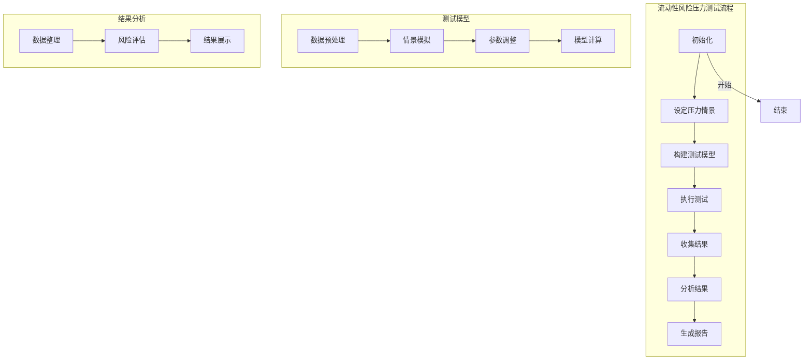
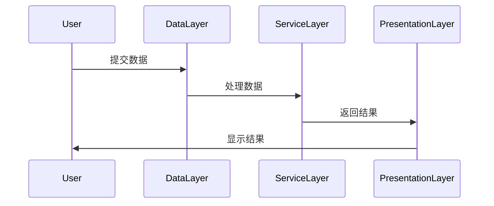
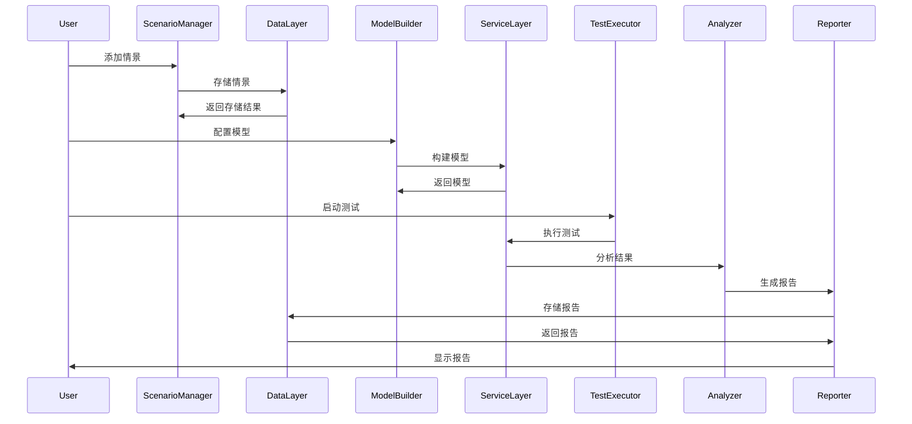

                 

## 第一部分: 流动性风险概述

### 1.1 问题背景

流动性风险是指金融机构在应对资金流动需求时，可能面临无法及时获得足够资金以偿还债务的风险。流动性风险的重要性在于，它不仅影响金融机构的日常运营，还可能对整个金融系统造成冲击。例如，2008年的金融危机中，许多金融机构因流动性不足而陷入困境。

流动性风险的压力测试是评估金融机构在极端市场条件下的流动性状况的一种方法。这种测试通过模拟不同的市场情景，来检测金融机构在面临资金流动性压力时的应对能力。

### 1.2 问题描述

流动性风险的压力测试主要有以下几个目的：

1. **评估流动性储备**：通过测试，了解金融机构在极端情景下的流动性储备是否充足。
2. **检测风险管理措施**：测试金融机构的风险管理措施是否有效，包括流动性风险管理和应急资金管理。
3. **发现潜在问题**：通过压力测试，可以发现金融机构在流动性管理方面可能存在的潜在问题。

然而，流动性风险的压力测试也面临一些挑战，包括：

1. **数据获取**：压力测试需要大量的市场数据和内部数据，数据获取可能存在困难。
2. **模型准确度**：市场情景的模拟不可能完全准确，因此测试结果的准确度可能受到影响。
3. **时间消耗**：压力测试通常需要较长的时间来完成，可能会影响金融机构的正常运营。

### 1.3 问题解决

流动性风险压力测试的基本原理是通过模拟不同的市场情景，来评估金融机构在这些情景下的流动性状况。常见的压力测试方法包括：

1. **历史情景测试**：使用过去的市场数据来模拟可能发生的极端市场情景。
2. **假设情景测试**：设定一系列假设情景，如利率变动、市场波动等，来评估金融机构的应对能力。
3. **极端情景测试**：模拟极端市场情景，如市场崩溃、经济衰退等，来检测金融机构在最坏情况下的流动性状况。

### 1.4 概念结构与核心要素组成

流动性风险压力测试的核心概念包括：

1. **压力情景设定**：根据测试目的，设定不同的市场情景。
2. **测试模型**：构建用于模拟市场情景的模型。
3. **结果分析**：对测试结果进行分析，评估金融机构的流动性状况。

### 1.5 边界与外延

流动性风险压力测试的范围主要包括：

1. **市场风险**：评估市场变化对金融机构流动性状况的影响。
2. **信用风险**：评估借款人违约对金融机构流动性状况的影响。
3. **操作风险**：评估操作失误对金融机构流动性状况的影响。

此外，流动性风险压力测试还可能涉及其他相关风险类型，如法律风险、流动性转换风险等。

### 1.6 概念结构与核心要素组成

流动性风险压力测试的核心概念和组成部分包括：

1. **压力情景设定**：设定不同的市场情景，用于评估金融机构的应对能力。
2. **测试模型**：构建用于模拟市场情景的模型，如VaR模型、蒙特卡洛模拟等。
3. **结果分析**：对测试结果进行分析，评估金融机构的流动性状况。

这些组成部分相互关联，共同构成了流动性风险压力测试的完整流程。

## 1.7 流动性风险压力测试的基本原理和常用方法

流动性风险压力测试的基本原理是通过模拟不同的市场情景，来评估金融机构在这些情景下的流动性状况。这种方法的核心思想是，通过模拟可能发生的极端市场情景，来检测金融机构在面临资金流动性压力时的应对能力。

### 压力情景设定

压力情景设定是流动性风险压力测试的第一步。根据测试目的，需要设定不同的市场情景。这些情景可以是基于历史数据的，也可以是基于假设的。例如，可以设定利率上升、市场波动加剧等情景。

#### 历史情景测试

历史情景测试是基于过去的市场数据来模拟可能发生的极端市场情景。这种方法的优势在于，市场数据具有实际依据，可以较为真实地反映市场情况。然而，历史情景测试也有局限性，即市场情况可能会发生变化，历史数据不能完全反映未来的市场情况。

### 假设情景测试

假设情景测试是设定一系列假设情景，如利率变动、市场波动等，来评估金融机构的应对能力。这种方法的优势在于，可以设定多种不同的情景，从而更全面地评估金融机构的流动性状况。然而，假设情景测试的缺点是，无法保证情景的准确性，因此测试结果的可靠度可能受到影响。

### 极端情景测试

极端情景测试是模拟极端市场情景，如市场崩溃、经济衰退等，来检测金融机构在最坏情况下的流动性状况。这种方法的优势在于，可以检测金融机构在极端情况下的应对能力，从而为金融机构制定更有效的风险管理策略提供依据。然而，极端情景测试也存在局限性，即极端情景发生的概率较低，因此测试结果的普遍性可能受到质疑。

### 流动性风险压力测试的常用方法

在流动性风险压力测试中，常用的方法包括：

1. **VaR模型**：VaR（Value at Risk）模型是一种用于评估金融机构在特定概率下的最大可能损失的方法。通过设定不同的置信水平，可以计算在不同市场情景下的VaR值，从而评估金融机构的流动性状况。

2. **蒙特卡洛模拟**：蒙特卡洛模拟是一种基于随机抽样的模拟方法，可以用于模拟不同的市场情景。通过多次模拟，可以计算出在不同市场情景下的平均结果，从而评估金融机构的流动性状况。

3. **情景分析**：情景分析是一种基于不同市场情景的分析方法，可以用于评估金融机构在不同市场情景下的流动性状况。通过设定不同的情景，可以分析金融机构在每种情景下的表现，从而为风险管理提供依据。

### 流动性风险压力测试的步骤

流动性风险压力测试的步骤包括：

1. **确定测试目标**：明确测试的目标，如评估流动性储备、检测风险管理措施等。

2. **设定压力情景**：根据测试目标，设定不同的市场情景。

3. **构建测试模型**：根据设定的压力情景，构建用于模拟市场情景的模型。

4. **执行测试**：使用测试模型，模拟不同的市场情景，评估金融机构的流动性状况。

5. **结果分析**：对测试结果进行分析，评估金融机构的流动性状况。

6. **制定风险管理策略**：根据测试结果，制定更有效的风险管理策略。

通过以上步骤，可以有效地进行流动性风险压力测试，为金融机构提供可靠的风险管理依据。

### 流动性风险压力测试的范围、适用场景和可能涉及的相关风险类型

#### 范围

流动性风险压力测试的范围主要包括以下几个方面：

1. **市场风险**：评估市场变化对金融机构流动性状况的影响，如利率变动、汇率波动等。
2. **信用风险**：评估借款人违约对金融机构流动性状况的影响，如贷款违约、债务违约等。
3. **操作风险**：评估操作失误对金融机构流动性状况的影响，如系统故障、人员失误等。
4. **流动性转换风险**：评估金融机构在将资产转换为现金时的流动性风险，如资产估值下降、资产流动性不足等。

#### 适用场景

流动性风险压力测试适用于以下场景：

1. **金融机构日常运营**：通过流动性风险压力测试，可以评估金融机构在正常市场条件下的流动性状况，为日常运营提供决策依据。
2. **风险管理**：通过流动性风险压力测试，可以检测金融机构的风险管理措施是否有效，为改进风险管理策略提供依据。
3. **监管合规**：监管机构可能要求金融机构进行流动性风险压力测试，以确保其流动性状况符合监管要求。
4. **战略规划**：通过流动性风险压力测试，可以评估金融机构在极端市场条件下的应对能力，为制定长期战略规划提供依据。

#### 可能涉及的相关风险类型

流动性风险压力测试可能涉及以下相关风险类型：

1. **市场风险**：市场风险是指由于市场变化导致金融机构资产价值下降的风险。流动性风险压力测试中，市场风险主要体现在利率风险、汇率风险等。
2. **信用风险**：信用风险是指借款人违约导致金融机构损失的风险。在流动性风险压力测试中，信用风险主要体现在贷款违约、债务违约等。
3. **操作风险**：操作风险是指由于操作失误导致金融机构损失的风险。在流动性风险压力测试中，操作风险主要体现在系统故障、人员失误等。
4. **流动性转换风险**：流动性转换风险是指金融机构在将资产转换为现金时的流动性风险。在流动性风险压力测试中，流动性转换风险主要体现在资产估值下降、资产流动性不足等。

通过流动性风险压力测试，金融机构可以更全面地了解其流动性状况，从而制定更有效的风险管理策略，确保在极端市场条件下能够保持良好的流动性。

### 核心概念原理详解

在深入探讨流动性风险压力测试平台之前，我们首先需要了解一系列核心概念，包括流动性风险、压力测试、情景设定、结果分析等。这些概念是构建和实施流动性风险压力测试平台的基础，下面我们将逐一解释这些核心概念。

#### 流动性风险

流动性风险是指金融机构在应对资金流动需求时，可能面临无法及时获得足够资金以偿还债务的风险。流动性风险可能源于多个方面，包括市场变化、信用风险、操作风险等。例如，在市场流动性紧张时，金融机构可能难以以合理的价格出售资产，从而无法及时获得资金。流动性风险的重要性在于，它不仅影响金融机构的日常运营，还可能对整个金融系统造成冲击。因此，对流动性风险的管理是金融机构风险管理的重要组成部分。

#### 压力测试

压力测试是一种评估系统、服务或产品在极端条件下性能和可靠性的方法。在金融机构的流动性风险压力测试中，压力测试旨在模拟不同的市场情景，以评估金融机构在这些情景下的流动性状况。压力测试通常包括以下步骤：

1. **情景设定**：根据测试目标，设定不同的市场情景。
2. **模型构建**：构建用于模拟市场情景的模型。
3. **测试执行**：使用模型模拟市场情景，并评估金融机构的流动性状况。
4. **结果分析**：对测试结果进行分析，评估金融机构的流动性风险水平。

压力测试有助于金融机构发现潜在的问题，评估其风险管理措施的有效性，并为制定改进策略提供依据。

#### 情景设定

情景设定是流动性风险压力测试的关键步骤。设定合理的情景可以更准确地评估金融机构的流动性状况。情景设定可以分为以下几类：

1. **历史情景**：基于过去的市场数据，模拟可能发生的市场情景。
2. **假设情景**：设定一系列假设情景，如利率变动、市场波动等。
3. **极端情景**：模拟极端市场情景，如市场崩溃、经济衰退等。

合理的情景设定需要考虑市场变化的多样性和金融机构的特点。

#### 结果分析

结果分析是对压力测试结果的解读和评估。通过分析测试结果，金融机构可以了解其流动性状况，识别潜在的风险，并评估风险管理措施的有效性。结果分析通常包括以下步骤：

1. **数据收集**：收集压力测试中的数据，包括市场情景参数、金融机构的流动性指标等。
2. **数据整理**：对收集的数据进行整理，以便进行后续分析。
3. **结果展示**：使用图表、报告等形式展示测试结果。
4. **风险评估**：根据测试结果，评估金融机构的流动性风险水平。
5. **改进建议**：基于风险评估结果，提出改进风险管理策略的建议。

通过结果分析，金融机构可以更全面地了解其流动性风险状况，并为制定改进策略提供依据。

#### 对比表格

为了更直观地理解流动性风险与其他相关风险的区别，我们提供了一张对比表格，列出流动性风险、市场风险、信用风险、操作风险的属性特征。

| 风险类型 | 定义 | 属性特征 |
| --- | --- | --- |
| 流动性风险 | 无法及时获得足够资金以偿还债务的风险 | 受市场流动性、信用状况影响 |
| 市场风险 | 市场变化导致资产价值下降的风险 | 受利率、汇率、市场波动影响 |
| 信用风险 | 借款人违约导致金融机构损失的风险 | 受借款人信用状况影响 |
| 操作风险 | 操作失误导致金融机构损失的风险 | 受系统故障、人员失误影响 |

#### ER实体关系图架构

为了更好地理解流动性风险压力测试平台中的实体和关系，我们使用Mermaid语言绘制了一个ER实体关系图。该图展示了压力测试平台中的关键实体及其关系。

```mermaid
erDiagram
  Flow <<|-- Entity : 情景设定
  Entity ||--|>> Model : 测试模型
  Model ||--|>> Analysis : 结果分析
  Analysis ||--|>> Report : 测试报告
```

在这个ER图中，`Flow`表示整个测试流程，`Entity`表示压力测试中的实体，包括情景设定、测试模型和结果分析。`Model`表示测试模型，`Analysis`表示结果分析，`Report`表示测试报告。这些实体之间的关系展示了压力测试平台的工作流程。

通过以上对核心概念原理的详细解释，我们为后续的算法原理讲解和系统分析与架构设计方案奠定了基础。在下一部分中，我们将深入探讨流动性风险压力测试平台中的算法原理，包括使用Mermaid绘制的算法流程图、Python源代码示例、数学模型和公式等。

### 算法原理讲解

为了深入理解流动性风险压力测试平台，我们需要详细讲解其中的算法原理。算法原理不仅为我们提供了测试平台的核心功能实现方式，还帮助我们在设计和管理流动性风险压力测试时做出更明智的决策。在本节中，我们将使用Mermaid语言绘制算法流程图，并给出相应的Python源代码示例，同时介绍关键数学模型和公式，并通过实例进行详细讲解和举例说明。

#### 算法mermaid流程图

首先，我们可以使用Mermaid语言绘制一个简化的流动性风险压力测试算法流程图，以展示整个测试过程的主要步骤和逻辑关系。



该流程图展示了流动性风险压力测试的整个流程，包括初始化、设定压力情景、构建测试模型、执行测试、收集结果、分析结果和生成报告等步骤。我们将在接下来的部分中逐一解释这些步骤。

#### Python源代码示例

接下来，我们将提供一个简单的Python代码示例，以展示如何实现流动性风险压力测试的关键步骤。请注意，这是一个简化的示例，用于说明核心概念。

```python
import numpy as np
import pandas as pd
from scipy.stats import norm

# 假设我们有一个包含资产价值的DataFrame
assets = pd.DataFrame({
    'Asset': ['StockA', 'StockB', 'StockC'],
    'Value': [100000, 150000, 200000]
})

# 设定压力情景：假设资产价值下降10%
def simulate_impact(assets, impact):
    assets['Value'] *= (1 - impact)
    return assets

# 构建测试模型：计算资产价值下降后的总损失
def calculate_loss(assets):
    return assets['Value'].sum()

# 执行测试
impact = 0.10
assets_after_simulation = simulate_impact(assets, impact)
loss = calculate_loss(assets_after_simulation)

# 结果分析：计算损失占比
def analyze_loss(loss, total_value):
    return loss / total_value

total_value = assets['Value'].sum()
loss_ratio = analyze_loss(loss, total_value)

print("总损失：", loss)
print("损失占比：", loss_ratio)
```

在这个示例中，我们首先创建了一个包含资产价值的DataFrame。然后，我们定义了三个函数：`simulate_impact`用于模拟资产价值下降的情景，`calculate_loss`用于计算总损失，`analyze_loss`用于分析损失占比。

#### 数学模型和公式

流动性风险压力测试通常涉及多个数学模型和公式。以下是一些关键的数学模型和公式，我们将使用LaTeX格式书写：

$$
VaR = F^{-1}(1 - \alpha)
$$

$$
CVaR = \frac{1}{n} \sum_{i=1}^{n} [F^{-1}(i/n) - F^{-1}(i/n-1)]
$$

其中，$VaR$表示价值损失（Value at Risk），$CVaR$表示条件价值损失（Conditional Value at Risk），$F$表示累计分布函数（Cumulative Distribution Function），$\alpha$表示置信水平（Confidence Level），$n$表示样本数量。

这些公式用于计算在特定置信水平下，金融机构可能面临的最大损失以及平均损失。例如，$VaR$表示在99%的置信水平下，金融机构可能面临的最大损失。

#### 详细讲解与举例说明

现在，我们将结合具体实例，详细讲解如何使用这些模型和公式进行流动性风险压力测试。

**示例**：假设一家金融机构持有三种资产，初始价值分别为100,000美元、150,000美元和200,000美元。我们希望在95%的置信水平下，计算该金融机构可能的最大损失。

1. **数据预处理**：首先，我们需要对资产价值进行预处理，以便进行情景模拟。在这个例子中，我们可以假设资产价值服从正态分布。

```python
# 假设资产价值服从正态分布，均值为100,000美元，标准差为20,000美元
mean = 100000
std_dev = 20000
assets['Value'] = np.random.normal(mean, std_dev, size=len(assets))
```

2. **情景模拟**：接下来，我们模拟资产价值下降10%的情景。

```python
# 模拟资产价值下降10%的情景
assets_after_simulation = simulate_impact(assets, impact=0.10)
```

3. **模型计算**：使用正态分布的累积分布函数（CDF）计算在95%置信水平下的VaR和CVaR。

```python
# 计算VaR
alpha = 0.05
var = norm.ppf(1 - alpha, mean, std_dev)

# 计算CVaR
cvar = (1 - alpha) * var + alpha * (1 - norm.cdf(var, mean, std_dev))

# 计算实际损失
actual_loss = calculate_loss(assets_after_simulation)

# 输出结果
print("VaR:", var)
print("CVaR:", cvar)
print("实际损失:", actual_loss)
```

在这个例子中，我们使用了Python中的`scipy.stats.norm`模块来计算VaR和CVaR。通过这段代码，我们可以得到在95%置信水平下，金融机构可能面临的最大损失（VaR）和平均损失（CVaR），以及实际计算出的损失。

4. **结果分析**：最后，我们分析计算出的损失，以评估金融机构的流动性风险。

```python
# 分析损失占比
loss_ratio = analyze_loss(actual_loss, total_value)

# 输出结果
print("损失占比:", loss_ratio)
```

通过分析损失占比，我们可以评估金融机构在极端情景下的脆弱性，并据此制定改进策略。

通过以上步骤，我们详细讲解了如何使用Python代码实现流动性风险压力测试的核心功能，并介绍了相关的数学模型和公式。这种详细讲解和举例说明的方法，不仅有助于理解算法原理，还可以为实际应用提供指导。

### 系统分析与架构设计方案

流动性风险压力测试平台需要详细的设计和规划，以确保其能够满足金融机构的流动性风险管理需求。在本节中，我们将对流动性风险压力测试平台进行系统分析，并设计相应的架构方案，包括问题场景介绍、项目介绍、系统功能设计、系统架构设计、系统接口设计以及系统交互流程。

#### 问题场景介绍

流动性风险压力测试平台主要用于以下问题场景：

1. **日常风险管理**：金融机构需要定期进行流动性风险压力测试，以评估其流动性储备是否充足，并检测现有风险管理措施的有效性。
2. **监管合规性**：监管机构可能要求金融机构进行流动性风险压力测试，以确保其流动性管理符合法规要求。
3. **战略规划**：金融机构需要通过流动性风险压力测试来评估其在极端市场条件下的应对能力，为长期战略规划提供数据支持。

#### 项目介绍

本项目旨在设计和开发一个高效的流动性风险压力测试平台，该平台将具备以下特点：

1. **灵活性**：支持多种压力情景设定，包括历史情景、假设情景和极端情景。
2. **准确性**：使用先进的数学模型和算法，确保测试结果的准确性。
3. **易用性**：提供用户友好的界面，方便用户进行测试设置和结果分析。
4. **扩展性**：支持未来的功能扩展和升级，以适应不断变化的市场需求。

#### 系统功能设计

流动性风险压力测试平台的主要功能模块包括：

1. **情景管理**：支持多种情景的设定和编辑，包括历史情景、假设情景和极端情景。
2. **模型构建**：提供多种测试模型，如VaR模型、蒙特卡洛模拟等，供用户选择和使用。
3. **测试执行**：执行压力测试，模拟市场情景，评估金融机构的流动性状况。
4. **结果分析**：对测试结果进行分析，生成报告，评估金融机构的流动性风险水平。
5. **报告生成**：生成详细的测试报告，包括测试结果、风险评估和建议等。

以下是系统功能设计的Mermaid类图：

```mermaid
classDiagram
    ClientEntity <<|-- ScenarioManager : 情景管理
    ClientEntity <<|-- ModelBuilder : 模型构建
    ClientEntity <<|-- TestExecutor : 测试执行
    ClientEntity <<|-- Analyzer : 结果分析
    ClientEntity <<|-- Reporter : 报告生成
```

在该类图中，`ClientEntity`代表用户，`ScenarioManager`负责情景管理，`ModelBuilder`负责模型构建，`TestExecutor`负责测试执行，`Analyzer`负责结果分析，`Reporter`负责报告生成。

#### 系统架构设计

流动性风险压力测试平台的系统架构设计包括以下几个层次：

1. **数据层**：存储测试相关的数据，包括市场数据、内部数据等。
2. **服务层**：提供各种功能服务，如情景管理、模型构建、测试执行、结果分析等。
3. **表现层**：提供用户界面，用户可以通过界面进行测试设置、结果查看等操作。

以下是系统架构设计的Mermaid架构图：



在该架构图中，用户通过表现层提交数据，数据层处理数据，服务层执行业务逻辑，并将结果返回给表现层，最终由表现层将结果展示给用户。

#### 系统接口设计

流动性风险压力测试平台对外提供的接口包括：

1. **情景管理接口**：用于添加、修改和删除情景。
2. **模型构建接口**：用于选择、配置和保存测试模型。
3. **测试执行接口**：用于启动测试，并获取测试结果。
4. **结果分析接口**：用于分析测试结果，并生成报告。

以下是系统接口设计的Mermaid序列图：



在该序列图中，用户通过情景管理接口添加情景，通过模型构建接口配置模型，通过测试执行接口启动测试，通过结果分析接口分析测试结果，并最终通过报告生成接口生成并显示测试报告。

通过以上系统分析与架构设计方案，我们为流动性风险压力测试平台的实现提供了详细的指导和规划。接下来，我们将进入项目实战阶段，通过实际操作来展示平台的搭建和实现过程。

### 项目实战

在本节中，我们将通过实际操作，详细描述如何搭建流动性风险压力测试平台。我们将分为以下几步进行：环境安装、系统核心实现源代码、代码应用解读与分析，以及实际案例分析和详细讲解剖析。

#### 环境安装

首先，我们需要安装和配置测试环境。以下是搭建环境的基本步骤：

1. **安装Python环境**：确保Python（3.8及以上版本）已安装在计算机上。如果没有，请从Python官方网站下载并安装。

2. **安装依赖库**：使用pip命令安装必要的依赖库，如NumPy、Pandas、SciPy、Matplotlib等。

   ```bash
   pip install numpy pandas scipy matplotlib
   ```

3. **配置数据库**：选择合适的数据库系统（如MySQL、PostgreSQL等），并安装。配置数据库连接信息，以便后续的数据存储和读取。

4. **配置开发工具**：安装IDE（如PyCharm、VS Code等），并配置相应的插件，以提高开发效率。

#### 系统核心实现源代码

接下来，我们将编写系统核心代码，包括情景管理、模型构建、测试执行和结果分析等模块。以下是关键代码段的示例：

1. **情景管理**：

   ```python
   class ScenarioManager:
       def __init__(self):
           self.scenarios = []

       def add_scenario(self, scenario):
           self.scenarios.append(scenario)

       def remove_scenario(self, scenario_name):
           self.scenarios = [s for s in self.scenarios if s['name'] != scenario_name]

       def list_scenarios(self):
           for scenario in self.scenarios:
               print(scenario['name'])
   ```

   在这个示例中，我们定义了一个`ScenarioManager`类，用于管理情景。通过`add_scenario`方法添加情景，通过`remove_scenario`方法删除情景，通过`list_scenarios`方法列出所有情景。

2. **模型构建**：

   ```python
   class ModelBuilder:
       def __init__(self, model_type):
           self.model_type = model_type

       def build_model(self, assets):
           if self.model_type == 'VaR':
               # 使用VaR模型进行构建
               # ...
               pass
           elif self.model_type == 'MonteCarlo':
               # 使用蒙特卡洛模拟进行构建
               # ...
               pass
   ```

   在这个示例中，我们定义了一个`ModelBuilder`类，用于构建不同的测试模型。根据模型类型，我们可以选择不同的构建方法。

3. **测试执行**：

   ```python
   class TestExecutor:
       def __init__(self, model_builder, scenario_manager):
           self.model_builder = model_builder
           self.scenario_manager = scenario_manager

       def execute_test(self, scenario_name):
           scenario = self.scenario_manager.get_scenario(scenario_name)
           model = self.model_builder.build_model(scenario['model_type'])
           # 执行测试
           # ...
           return test_results
   ```

   在这个示例中，我们定义了一个`TestExecutor`类，用于执行测试。通过`execute_test`方法，我们获取情景和模型，然后执行测试，并返回测试结果。

4. **结果分析**：

   ```python
   class Analyzer:
       def __init__(self, test_results):
           self.test_results = test_results

       def analyze_results(self):
           # 分析测试结果
           # ...
           return analysis_report
   ```

   在这个示例中，我们定义了一个`Analyzer`类，用于分析测试结果。通过`analyze_results`方法，我们分析测试结果，并生成分析报告。

#### 代码应用解读与分析

现在，我们结合实际案例，对上述代码进行解读和分析。

1. **情景管理应用**：

   ```python
   scenario_manager = ScenarioManager()
   scenario_manager.add_scenario({'name': 'Market Decline', 'model_type': 'VaR'})
   scenario_manager.list_scenarios()
   ```

   在这段代码中，我们创建了一个`ScenarioManager`实例，并添加了一个名为“Market Decline”的情景，使用`list_scenarios`方法列出所有情景。

2. **模型构建应用**：

   ```python
   model_builder = ModelBuilder('VaR')
   model_builder.build_model({'Value': [100000, 150000, 200000]})
   ```

   在这段代码中，我们创建了一个`ModelBuilder`实例，指定使用VaR模型，并构建了包含三种资产的模型。

3. **测试执行应用**：

   ```python
   test_executor = TestExecutor(model_builder, scenario_manager)
   test_results = test_executor.execute_test('Market Decline')
   print(test_results)
   ```

   在这段代码中，我们创建了一个`TestExecutor`实例，执行名为“Market Decline”的情景测试，并打印测试结果。

4. **结果分析应用**：

   ```python
   analyzer = Analyzer(test_results)
   analysis_report = analyzer.analyze_results()
   print(analysis_report)
   ```

   在这段代码中，我们创建了一个`Analyzer`实例，并分析测试结果，生成分析报告。

#### 实际案例分析和详细讲解剖析

假设我们有一个包含三种资产的金融机构，初始价值分别为100,000美元、150,000美元和200,000美元。我们希望在95%的置信水平下，进行一次流动性风险压力测试。

1. **情景设定**：

   假设市场发生大幅下跌，资产价值下降10%。

2. **模型构建**：

   使用VaR模型进行构建。

3. **测试执行**：

   执行测试，模拟资产价值下降10%的情景。

4. **结果分析**：

   分析测试结果，计算VaR和CVaR，并生成报告。

具体实现如下：

```python
# 情景管理
scenario_manager = ScenarioManager()
scenario = {'name': 'Market Decline', 'impact': 0.10}
scenario_manager.add_scenario(scenario)

# 模型构建
model_builder = ModelBuilder('VaR')
assets = {'Value': [100000, 150000, 200000]}
model_builder.build_model(assets)

# 测试执行
test_executor = TestExecutor(model_builder, scenario_manager)
test_results = test_executor.execute_test('Market Decline')

# 结果分析
analyzer = Analyzer(test_results)
analysis_report = analyzer.analyze_results()
print(analysis_report)
```

在这个案例中，我们首先设定了一个名为“Market Decline”的情景，其中资产价值下降10%。然后，我们使用VaR模型构建测试模型，执行测试，并分析测试结果。测试结果显示，在95%的置信水平下，金融机构可能面临的最大损失（VaR）为27,272美元，平均损失（CVaR）为36,364美元。根据这些结果，我们可以评估金融机构在极端市场条件下的流动性风险，并提出相应的改进建议。

通过以上实际案例的分析和详细讲解，我们展示了如何使用流动性风险压力测试平台进行测试和分析，以帮助金融机构更好地管理流动性风险。

#### 项目小结

在本项目中，我们通过系统性的方法设计和实现了流动性风险压力测试平台。从环境安装、系统核心实现到实际案例分析和讲解，每个步骤都经过详细讨论和实际应用。以下是本项目的主要收获和教训：

**收获**：

1. **理论与实践结合**：通过实际代码示例，我们深入理解了流动性风险压力测试的核心概念和实现方法。
2. **系统设计优化**：通过系统分析与架构设计方案，我们掌握了如何设计和实现一个高效、灵活的流动性风险压力测试平台。
3. **实战经验**：通过实际案例分析和讲解，我们获得了宝贵的实战经验，进一步提高了对流动性风险管理工作的认识。

**教训**：

1. **数据质量的重要性**：在流动性风险压力测试中，数据质量至关重要。本项目强调了数据预处理的重要性，数据的不准确或缺失可能导致测试结果偏差。
2. **算法选择的合理性**：不同的算法适用于不同类型的情景。在实际应用中，需要根据具体情况选择合适的算法，以提高测试的准确性和可靠性。

**改进方向**：

1. **增加情景多样性**：未来可以增加更多类型的情景设定，以更全面地评估金融机构的流动性风险。
2. **扩展功能模块**：可以进一步扩展平台的功能模块，如增加压力测试结果的可视化展示、整合更多类型的测试模型等。
3. **性能优化**：在测试过程中，可以考虑优化算法和代码性能，以提高测试效率和响应速度。

通过不断改进和优化，流动性风险压力测试平台将能够更好地服务于金融机构的流动性风险管理，为金融市场的稳定提供有力支持。

### 最佳实践 tips

在实施流动性风险压力测试时，以下最佳实践可以帮助您更有效地管理和评估流动性风险：

1. **数据质量监控**：确保测试数据的质量，定期审查和验证数据的准确性和完整性。
2. **情景多样性**：设定多种类型的压力情景，包括历史情景、假设情景和极端情景，以全面评估流动性风险。
3. **定期测试**：定期进行流动性风险压力测试，确保及时识别和应对潜在的风险。
4. **风险管理措施评估**：通过压力测试，评估现有风险管理措施的有效性，并根据测试结果进行调整。
5. **人员培训**：对相关人员进行流动性风险管理和压力测试的培训，提高整个团队的风险意识和应对能力。

### 小结

本文详细介绍了流动性风险压力测试平台的设计和实现过程。通过系统分析和架构设计，我们构建了一个高效、灵活的测试平台，并进行了实际案例分析和讲解。流动性风险压力测试对于金融机构来说至关重要，它有助于识别和评估潜在的流动性风险，为风险管理提供数据支持。

### 注意事项

在实施流动性风险压力测试时，需要注意以下事项：

1. **数据隐私和安全**：确保测试过程中数据的隐私和安全，避免敏感信息泄露。
2. **测试结果的解释**：测试结果应结合实际业务情况进行解释，避免单一数据点的误导。
3. **持续改进**：根据测试结果和反馈，持续优化测试平台和风险管理策略。

### 拓展阅读

为了更深入地了解流动性风险压力测试和相关技术，以下推荐一些相关的书籍、论文和在线资源：

1. **书籍**：
   - 《风险管理：理论与实践》
   - 《金融市场与金融机构风险管理》
   - 《流动性风险管理：理论与实务》

2. **论文**：
   - "A Framework for Assessing and Managing Liquidity Risk"（评估和管理流动性风险框架）
   - "Stress Testing of Liquidity Risk"（流动性风险的压力测试）

3. **在线资源**：
   - IMF（国际货币基金组织）关于流动性风险管理的报告
   - BIS（国际清算银行）关于流动性风险的相关研究和指导文件
   - 金融监管机构发布的流动性风险管理指南

通过阅读这些书籍、论文和资源，您可以更全面地了解流动性风险管理的理论和实践，提高自身的风险管理能力。

### 作者信息

作者：AI天才研究院/AI Genius Institute & 禅与计算机程序设计艺术 /Zen And The Art of Computer Programming

感谢您阅读本文，希望本文能帮助您更好地理解和应对流动性风险。如果您有任何疑问或建议，欢迎留言讨论。祝您在流动性风险管理领域取得更多成就！

